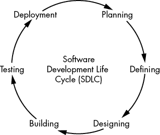
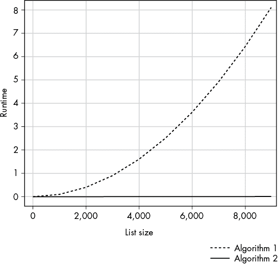
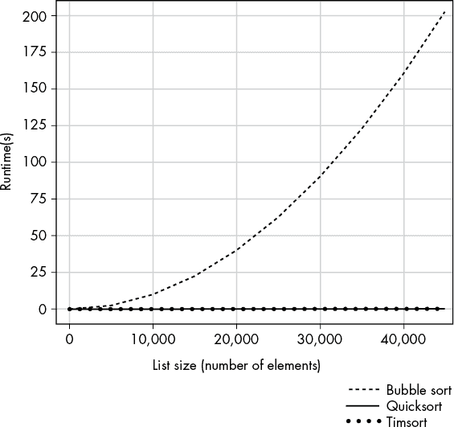
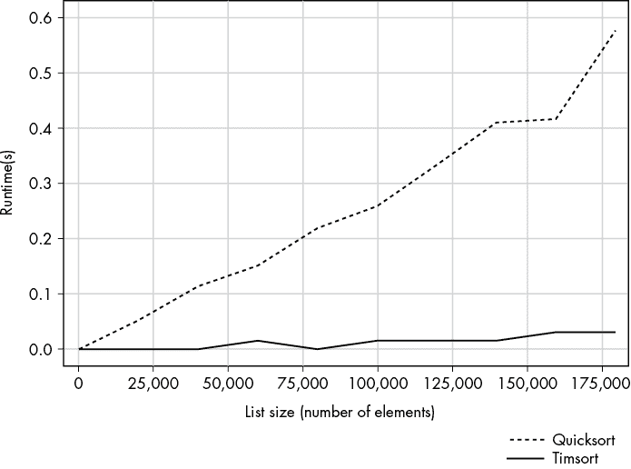
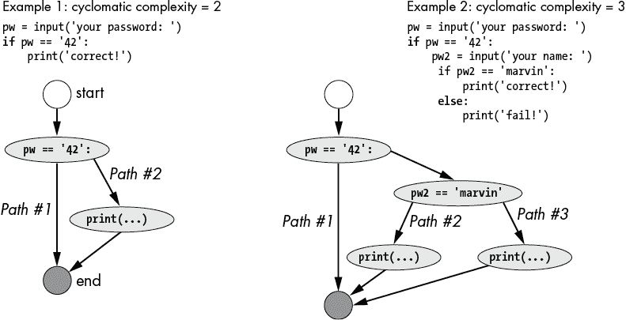
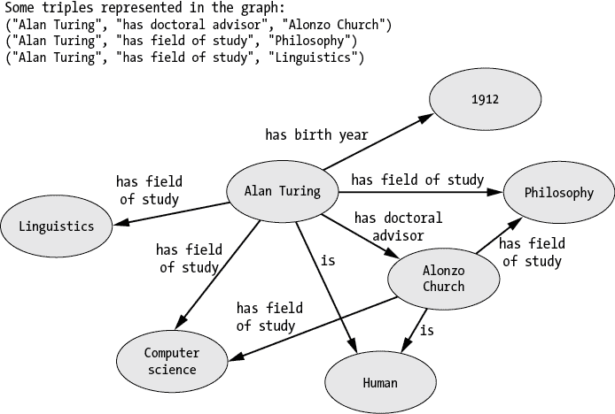
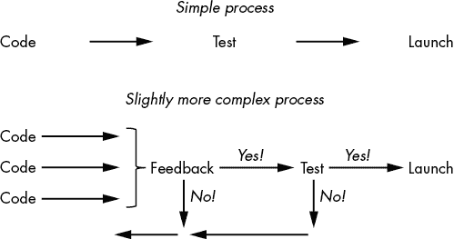

# 第一章：复杂性如何损害你的生产力


在本章中，我们将全面探讨一个重要且高度未被充分研究的话题——复杂性。究竟什么是*复杂性*？它在哪里发生？它如何损害你的生产力？复杂性是精益高效的组织和个人的敌人，因此值得仔细观察我们在哪些领域发现复杂性以及它表现出哪些形式。本章专注于问题——复杂性，接下来的章节将探讨通过重新分配之前被复杂性占用的资源来有效解决这一问题的方法。

让我们先快速概览一下新手程序员可能会觉得复杂的地方：

+   选择一种编程语言

+   选择一个编程项目来进行——从成千上万的开源项目和无数的问题中选择

+   决定使用哪些库（scikit-learn 与 NumPy 与 TensorFlow）

+   决定将时间投入哪些新兴技术——Alexa 应用、智能手机应用、基于浏览器的 web 应用、集成的 Facebook 或微信应用、虚拟现实应用

+   选择一个编码编辑器，如 PyCharm、集成开发与学习环境（IDLE）和 Atom

鉴于这些复杂性来源所带来的巨大困惑，*“我该从哪里开始？”* 成为编程初学者最常见的问题之一，也就不足为奇了。

最好的开始方式是*不要*通过选择一本编程书并阅读编程语言的所有语法特性来开始。许多有抱负的学生购买编程书籍作为激励，然后把学习任务加入他们的待办事项列表——如果他们已经花钱买了书，他们最好去读，否则投资就会丧失。但和许多待办事项列表中的任务一样，*阅读编程书籍*很少能完成。

最好的开始方式是选择一个实用的编码项目——如果你是初学者，可以选择一个简单的项目——并推动它完成。在完成一个完整项目之前，不要去阅读编码书籍或互联网上的随机教程，也不要在 StackOverflow 上翻阅无休止的帖子。只需设置好项目并利用你现有的有限技能和常识开始编码。我的一位学生想要创建一个财务仪表盘应用，用于查看不同资产配置的历史回报，以回答像“由 50% 股票和 50% 政府债券组成的投资组合在某一年最大的亏损是多少？”这样的提问。起初，她不知道如何着手这个项目，但很快发现了一个名为 Python Dash 的框架，这个框架专注于构建基于数据的 web 应用。她学习了如何设置服务器，并且只研究了她所需的超文本标记语言（HTML）和层叠样式表（CSS），最终她的应用已经上线，并且帮助了成千上万的人找到合适的资产配置。但更重要的是，她加入了创建 Python Dash 的开发团队，甚至与 No Starch Press 一起写了一本关于它的书。她在一年内完成了这一切——你也可以做到。如果你不理解自己在做什么也没关系；你会逐渐增加自己的理解。只要通过阅读文章推动当前项目的进展即可。完成第一个项目的过程会引入一系列非常相关的问题，包括：

1.  你应该使用哪个代码编辑器？

1.  如何安装你项目的编程语言？

1.  如何从文件中读取输入？

1.  如何在程序中存储输入以供后续使用？

1.  如何处理输入以获得期望的输出？

通过回答这些问题，你将逐步建立起一个全面的技能组合。随着时间的推移，你将能够更好、更轻松地回答这些问题。你将能够解决更大、更复杂的问题，并积累起一个内部的编程模式和概念洞察数据库。即便是高级程序员，也通过相同的过程进行学习和提升——只不过编码项目变得更大、更复杂。

采用这种基于项目的学习方法，你很可能会发现自己在诸如寻找日益增长的代码库中的 bug、理解代码组件及其交互、选择下一个要实现的功能以及理解代码的数学和概念基础等方面与复杂性作斗争。

复杂性无处不在，贯穿项目的每个阶段。这种复杂性的隐藏成本通常是，刚入门的程序员会放弃，他们的项目最终无法实现。所以，问题就来了：我该如何解决复杂性问题？

答案很简单：*简单性*。在编码的每个阶段寻求简单性和专注。如果你从这本书中只记住一件事，那就是：在你遇到的编程领域中采取极简的立场。全书将讨论以下所有方法：

+   清理你的日程，做更少的任务，把精力集中在重要的任务上。例如，与其平行启动 10 个有趣的新代码项目，不如仔细挑选一个并将所有精力集中在完成这个项目上。在第二章，你将更详细地了解编程中的 80/20 原则。

+   给定一个软件项目，去除所有不必要的功能，专注于最小可行产品（见第三章），发布它，并快速高效地验证你的假设。

+   在可能的地方编写简单而简洁的代码。在第四章，你将学到如何实现这一目标的许多实用技巧。

+   减少在过早优化上花费的时间和精力——没有必要的代码优化是导致不必要复杂性的主要原因之一（见第五章）。

+   通过将大量时间块集中用于编程，减少切换时间，以达到*心流*状态——这是心理学研究中的术语，用来描述一种集中的心理状态，它能够提高你的注意力、专注力和生产力。第六章将全面讲解如何达到心流状态。

+   运用 Unix 哲学，专注于代码功能的单一目标（“做好一件事”）。有关 Unix 哲学的详细指南，包含 Python 代码示例，请见第七章。

+   在设计中应用简化原则，创造美观、简洁、专注且易于使用的直观用户界面（见第八章）。

+   在规划职业、下一个项目、一天的工作或你的专业领域时，应用聚焦技巧（见第九章）。

让我们更深入地探讨复杂性这一概念，理解它是你编码生产力的巨大敌人之一。

## 什么是复杂性？

在不同的领域，*复杂性*这个术语有不同的含义。有时它被严格定义，比如计算机程序的*计算复杂度*，这为分析给定代码功能在不同输入下的表现提供了一种方法。其他时候，它是宽泛定义的，指的是系统组件之间的交互量或结构。在本书中，我们将更广泛地使用它。

我们将*复杂性*定义如下：

1.  复杂性是由多个部分组成的整体，难以分析、理解或解释。

复杂性描述的是一个整体或实体。由于复杂性使得系统难以解释，它会引起挣扎和困惑。因为现实世界的系统很混乱，你会发现复杂性无处不在：股市、社会趋势、新兴的政治观点、以及拥有数十万行代码的大型计算机程序——例如 Windows 操作系统。

如果你是一个程序员，你尤其容易受到复杂性困扰，来自这些我们将在本章讨论的不同来源：

1.  项目生命周期中的复杂性

1.  软件和算法理论中的复杂性

1.  学习中的复杂性

1.  流程中的复杂性

1.  社交网络中的复杂性

1.  你日常生活中的复杂性

## 项目生命周期中的复杂性

让我们深入探讨项目生命周期的不同阶段：规划、定义、设计、构建、测试和部署（见图 1-1）。



图 1-1：基于电气与电子工程师协会（IEEE）软件工程标准的软件项目六个概念性阶段

即使你正在处理一个非常小的软件项目，你也很可能经历软件开发生命周期的所有六个阶段。请注意，你不一定只能经历每个阶段一次——在现代软件开发中，更倾向于采用迭代方法，每个阶段会被反复 revisited。接下来，我们将探讨复杂性如何对每个阶段产生重要影响。

### 规划

软件开发生命周期的第一阶段是规划阶段，有时在工程学文献中被称为*需求分析*。这个阶段的目的是确定产品的外观。成功的规划阶段将导致一个严格定义的、需要交付给最终用户的特性集合。

无论你是一个人独自工作于你的爱好项目，还是负责管理和协调多个软件开发团队的协作，你都必须弄清楚软件的最优特性集合。需要考虑许多因素：构建一个特性的成本、无法成功实施该特性的风险、最终用户的预期价值、市场营销和销售的影响、可维护性、可扩展性、法律限制等等。

这个阶段至关重要，因为它可以帮助你避免以后浪费大量精力。规划上的错误可能导致数百万美元的资源浪费。另一方面，谨慎的规划可以为接下来的几年中业务的巨大成功奠定基础。规划阶段是应用你新获得的 80/20 思维技巧的时候（见第二章）。

规划阶段也是一个难以做到完美的阶段，因为涉及的复杂性。许多因素增加了复杂性：提前正确评估风险，弄清楚公司或组织的战略方向，猜测客户的反应，权衡不同功能候选项的积极影响，并确定某个软件功能的法律影响。综合来看，解决这个多维度问题的复杂性令我们不堪重负。

### 定义

定义阶段包括将规划阶段的结果转化为恰当规范的软件需求。换句话说，它将上一阶段的输出正式化，以便获得客户和最终用户的批准或反馈，他们将在后续使用该产品。

如果你花费了大量时间来规划和弄清楚项目需求，但却未能有效地传达这些需求，后续将会带来严重的问题和困难。一项错误表述的需求，尽管有助于项目，可能和一项正确表述的需求但并无帮助的情况一样糟糕。有效的沟通和精确的规范对于避免歧义和误解至关重要。在所有的人类沟通中，由于“知识诅咒”和其他心理偏见的影响，信息传递是一个极为复杂的任务，这些偏见往往压倒了个人经验的相关性。如果你试图将想法（或需求）从自己脑海中传递到他人脑海中，要小心：复杂性在等着你！

### 设计

设计阶段的目标是草拟系统的架构，决定提供已定义功能的模块和组件，并设计用户界面——同时牢记之前两个阶段中开发的需求。设计阶段的黄金标准是创建一个清晰明确的图像，展示最终软件产品的外观以及其构建方式。这适用于所有软件工程方法。敏捷方法只会更快速地迭代这些阶段。

但是，细节决定成败！一位优秀的系统设计师必须了解他们可能用来构建系统的各种软件工具的优缺点。例如，一些库可能对程序员来说容易使用，但执行速度较慢。构建自定义库对程序员来说更为复杂，但可能带来更高的速度，从而提高最终软件产品的可用性。设计阶段必须解决这些变量，以便最大化收益与成本的比率。

### 构建

构建阶段是许多程序员希望投入所有时间的地方。这是从架构草图到软件产品的转变发生的地方。你的想法转化为具体的结果。

通过前期阶段的适当准备，许多复杂性已经被排除。理想情况下，构建者应该知道要实现哪些功能，功能的外观如何，以及要使用哪些工具来实现它们。然而，构建阶段总是充满了新出现的问题。外部库中的错误、性能问题、数据损坏以及人为错误等意外情况可能会减缓进度。构建软件产品是一项极其复杂的工作。一个小小的拼写错误就可能破坏整个软件产品的可行性。

### 测试

恭喜你！你已经实现了所有要求的功能，并且程序似乎正常工作。然而，你还没有完成。你仍然需要测试软件产品在不同用户输入和使用模式下的行为。这个阶段通常是最重要的——以至于许多实践者现在提倡使用*测试驱动开发*，即在实施（构建阶段）之前，必须先编写所有的测试。虽然你可以反对这种观点，但通常来说，花时间通过创建测试用例并检查软件是否为这些测试用例提供正确的结果，是个不错的主意。

例如，假设你正在实现一辆自动驾驶汽车。你必须编写*单元测试*，检查代码中每个小功能（即*单元*）是否为给定输入生成预期的输出。单元测试通常能发现一些在特定（极端）输入下表现异常的错误函数。例如，考虑以下 Python 函数代码，它计算图像的平均红色、绿色和蓝色（RGB）值，也许可以用来区分你是穿越城市还是森林：

```py
def average_rgb(pixels):
    r = [x[0] for x in pixels]
    g = [x[1] for x in pixels]
    b = [x[2] for x in pixels]
    n = len(r)
    return (sum(r)/n, sum(g)/n, sum(b)/n)
```

例如，以下像素列表将分别得出 96.0、64.0 和 11.0 的平均红、绿、蓝值：

```py
print(average_rgb([(0, 0, 0),
                   (256, 128, 0),
                   (32, 64, 33)]))
```

这是输出结果：

```py
(96.0, 64.0, 11.0)
```

虽然这个函数看起来足够简单，但在实际操作中，许多事情可能会出错。如果像素元组列表被损坏，其中一些（RGB）元组只有两个元素而不是三个怎么办？如果其中一个值是非整数类型呢？如果输出必须是整数元组，以避免所有浮点计算固有的浮点错误怎么办？

单元测试可以测试所有这些条件，以确保函数在孤立情况下正常工作。

下面是两个简单的单元测试，一个检查函数是否在输入为零的边界情况下正常工作，另一个检查函数是否返回整数元组：

```py
def unit_test_avg():
    print('Test average...')
    print(average_rgb([(0, 0, 0)]) == average_rgb([(0, 0, 0), (0, 0, 0)]))

def unit_test_type():
    print('Test type...')
    for i in range(3):
        print(type(average_rgb([(1, 2, 3), (4, 5, 6)])[i]) == int)

unit_test_avg()
unit_test_type()
```

结果显示类型检查失败，函数没有返回正确的类型，应该是一个整数元组：

```py
Test average...
True
Test type...
False
False
False
```

在更现实的环境中，测试人员需要编写数百个单元测试来检查函数对所有类型输入的响应——并验证它是否生成了预期的输出。只有当单元测试表明函数运行正常时，我们才能继续测试应用程序的更高级功能。

事实上，即使所有单元测试都成功通过，您仍然没有完成测试阶段。您必须测试各个单元如何正确地相互作用，共同构建一个更大的整体。您必须设计现实世界的测试，像驾驶汽车一样测试数千甚至数万辆英里，以揭示在陌生和不可预测的情况下出现的意外行为模式。假设您的汽车行驶在没有路标的小路上怎么办？如果前方的车突然停下怎么办？如果多辆车在十字路口互相等待怎么办？如果驾驶员突然转向迎面而来的车流怎么办？

需要考虑的测试非常多；复杂性极高，以至于许多人在这里放弃了。理论上看起来不错的东西，即使是首次实现后，往往在实践中也会失败，特别是在应用了不同级别的软件测试（如单元测试或现实世界使用测试）后。

### 部署

该软件现在已经通过了严格的测试阶段。是时候部署它了！部署可以有多种形式。应用程序可能会发布到市场，软件包可能会发布到仓库，重大（或次要）版本可能会公开发布。在一种更迭代和敏捷的软件开发方法中，您需要多次回顾部署阶段，采用*持续部署*的方式。根据具体项目的不同，这一阶段可能需要您推出产品、创建营销活动、与早期用户沟通、修复在用户使用后必然暴露的新问题、协调软件在不同操作系统上的部署、支持和排除各种问题，或维护代码库以便随着时间的推移适应和改进。由于您在前几个阶段做出的各种设计选择及其相互依赖性，这个阶段可能会变得非常混乱。后续章节将提供一些策略，帮助您克服这些混乱。

## 软件和算法理论中的复杂性

一段软件内部的复杂性可能与软件开发过程中所涉及的复杂性一样多。许多软件工程的度量标准会以正式的方式衡量软件的复杂性。

首先，我们来看看*算法复杂度*，它涉及不同算法的资源需求。通过算法复杂度，你可以比较解决同一问题的不同算法。例如，假设你实现了一个带有高分评级系统的游戏应用程序。你希望得分最高的玩家排在列表的顶部，得分最低的玩家排在底部。换句话说，你需要对列表进行*排序*。有成千上万的算法可以用来排序列表，且排序列表在 1,000,000 名玩家时比在 100 名玩家时更具计算需求。有些算法随着列表输入的增大而表现更好，而有些则表现更差。当你的应用服务几百个用户时，选择哪个算法并不重要，但随着用户数量的增长，列表的运行时间复杂度会超线性增长。不久，最终用户将不得不等待越来越长的时间才能看到列表排序完成。他们会开始抱怨，而你需要更好的算法！

图 1-2 举例说明了两种示意性算法的算法复杂度。x 轴显示要排序的列表大小。y 轴显示算法的运行时间（单位为时间）。算法 1 比算法 2 要慢得多。事实上，算法 1 的低效性在需要排序更多列表元素时变得更加明显。使用算法 1，你的游戏应用随着玩家人数的增加而变得越来越慢。



图 1-2：两种不同排序算法的算法复杂度

让我们看看这是否适用于真实的 Python 排序算法。图 1-3 比较了三种流行的排序算法：冒泡排序、快速排序和 Timsort。冒泡排序的算法复杂度最高。快速排序和 Timsort 的渐进算法复杂度相同。但 Timsort 算法仍然要快得多——这就是为什么它被用作 Python 默认的排序算法。随着列表大小的增长，冒泡排序的运行时间爆炸性增加。

在图 1-4 中，我们重复了这个实验，但只比较了快速排序和 Timsort。再次，我们看到算法复杂度的显著差异：Timsort 更适应规模增长，并且在增加的列表大小下更快。现在你明白为什么 Python 的内建排序算法这么长时间没有改变了！



图 1-3：冒泡排序、快速排序和 Timsort 的算法复杂度



图 1-4：快速排序和 TimSort 的算法复杂度

列表 1-1 显示了 Python 代码，如果你想重现实验，可以参考这个代码。我建议你选择一个较小的`n`值，因为代码在我的机器上运行较长时间才会终止。

```py
import matplotlib.pyplot as plt
import math
import time
import random

def bubblesort(l):
 # src: https://blog.finxter.com/daily-python-puzzle-bubble-sort/
    lst = l[:] # Work with a copy, don't modify the original
    for passesLeft in range(len(lst)-1, 0, -1):
        for i in range(passesLeft):
            if lst[i] > lst[i + 1]:
                lst[i], lst[i + 1] = lst[i + 1], lst[i]
    return lst

def qsort(lst):
 # Explanation: https://blog.finxter.com/python-one-line-quicksort/
    q = lambda lst: q([x for x in lst[1:] if x <= lst[0]])
                    + [lst[0]] 
                    + q([x for x in lst if x > lst[0]]) if lst else []
    return q(lst)

def timsort(l):
 # sorted() uses Timsort internally
    return sorted(l) 

def create_random_list(n):
    return random.sample(range(n), n)

n = 50000
xs = list(range(1,n,n//10))
y_bubble = []
y_qsort = []
y_tim = []

for x in xs:

 # Create list
    lst = create_random_list(x)

 # Measure time bubble sort
    start = time.time()
 bubblesort(lst)
    y_bubble.append(time.time()-start)

 # Measure time qsort
    start = time.time()
    qsort(lst)
    y_qsort.append(time.time()-start)

 # Measure time Timsort
    start = time.time()
    timsort(lst)
    y_tim.append(time.time()-start)

plt.plot(xs, y_bubble, '-x', label='Bubblesort')
plt.plot(xs, y_qsort, '-o', label='Quicksort')
plt.plot(xs, y_tim, '--.', label='Timsort')

plt.grid()
plt.xlabel('List Size (No. Elements)')
plt.ylabel('Runtime (s)')
plt.legend()
plt.savefig('alg_complexity_new.pdf')
plt.savefig('alg_complexity_new.jpg')
plt.show()
```

列表 1-1：测量三种流行排序算法的运行时间

算法复杂度是一个经过深入研究的领域。在我看来，从这些研究中产生的改进算法是人类最有价值的技术资产之一，它们让我们能够用更少的资源不断地解决相同的问题。我们确实站在巨人的肩膀上。

除了算法复杂度之外，我们还可以通过*圈复杂度*来衡量代码的复杂性。这个度量标准由托马斯·麦凯布（Thomas McCabe）于 1976 年提出，描述了代码中*线性独立路径*的数量，或者说是具有至少一条边不属于其他路径的路径数。例如，包含`if`语句的代码将导致通过代码的两条独立路径，因此它的圈复杂度要高于没有任何分支的平坦代码。 图 1-5 展示了两个处理用户输入并作出响应的 Python 程序的圈复杂度。第一个程序只包含一个条件分支，可以看作是道路上的一个分叉。可以选择其中一个分支，但不能同时选择两个分支。因此，圈复杂度为 2，因为有两条线性独立的路径。第二个程序包含两个条件分支，导致总共三条线性独立的路径，圈复杂度为 3。每增加一个`if`语句，圈复杂度就会增加。



图右侧显示了圈复杂度为 3 的示意图。起始节点指向包含条件的节点。两条箭头从该节点退出，第一条指向结束节点，第二条指向第二个条件节点。从该节点，箭头指向两个打印语句节点。从这些条件节点中的每个节点，箭头指向相同的结束节点。](image_fi/502185c01/f01005.png)

图 1-5：两个 Python 程序的圈复杂度

环状复杂度是一个很好的代理度量，用于衡量难以度量的*认知复杂性*，即理解给定代码库的难度。然而，环状复杂度忽略了诸如多个嵌套的`for`循环相比于平坦的`for`循环所带来的认知复杂性。这就是为什么其他度量如`NPath`复杂度能在环状复杂度的基础上进行改进。总的来说，代码复杂性不仅是算法理论中的一个重要主题，而且对于实现代码时的所有实际问题也具有相关性——并且对于编写易于理解、可读且稳健的代码至关重要。算法理论和编程复杂性已经被深入研究了几十年。这些努力的一个主要目标是*减少计算和非计算的复杂性*，以减轻其对人类和机器的生产力和资源利用的负面影响。

## 学习中的复杂性

事实不是孤立存在的，它们是相互关联的。考虑以下两个事实：

1.  沃尔特·迪士尼出生于 1901 年。

1.  路易斯·阿姆斯特朗出生于 1901 年。

如果你给程序输入这些事实，它能够回答诸如*“沃尔特·迪士尼的出生年份是什么？”*以及*“谁出生于 1901 年？”*之类的问题。为了回答后者，程序必须弄清楚不同事实之间的相互依赖关系。它可能会像这样建模信息：

```py
(Walt Disney, born, 1901)
(Louis Armstrong, born, 1901)
```

要获取所有出生于 1901 年的人，可以使用查询`(*, born, 1901)`，或者其他任何方式将事实关联并归类。

2012 年，谷歌推出了一项新的搜索功能，在搜索结果页面上显示信息框。这些基于事实的信息框使用一种叫做*知识图谱*的数据结构来填充，知识图谱是一个庞大的包含数十亿个相互关联事实的数据库，用于以网络结构的方式表示信息。这个数据库不仅存储独立的客观事实，还维护不同事实及其他信息片段之间的相互关系。谷歌搜索引擎利用这个知识图谱，增强其搜索结果，自动生成答案。

图 1-6 展示了一个示例。知识图谱中的一个节点可能是著名计算机科学家艾伦·图灵。在知识图谱中，`艾伦·图灵`这一概念与不同的信息片段相关联，例如他的出生年份（`1912`）、他的研究领域（`计算机科学`、`哲学`、`语言学`）以及他的博士导师（`阿隆佐·丘奇`）。这些信息片段还与其他事实相关联（阿隆佐·丘奇的研究领域也是`计算机科学`），从而形成一个巨大的互相关联的事实网络。你可以利用这个网络获取新信息并以编程方式回答用户查询。关于“`图灵博士导师的研究领域`”的查询将得出推导的答案“`计算机科学`”。虽然这听起来可能微不足道或显而易见，但生成这些新事实的能力促成了信息检索和搜索引擎相关性领域的突破。你可能会同意，通过联想学习远比记忆无关的事实更有效。



图 1-6：知识图谱表示

每个研究领域仅关注图谱中的一小部分，每部分包含无数相互关联的事实片段。你只能通过考虑相关事实来真正理解一个领域。要全面了解艾伦·图灵，你必须研究他的信仰、他的哲学观点以及他博士导师的特点。要了解丘奇，你必须调查他与图灵的关系。当然，图谱中有太多相关的依赖关系和事实，无法期望理解所有内容。这些相互关系的复杂性给你学习的雄心设立了最基本的边界。学习与复杂性是同一枚硬币的两面：复杂性位于你已获得知识的边界上。要学习更多，你必须首先学会如何控制复杂性。

我们有点抽象了，让我们来看一个例子！假设你想编程一个交易机器人，根据一套复杂的规则买卖资产。在开始项目之前，你可以学习许多有用的知识：编程基础、分布式系统、数据库、应用程序编程接口（API）、网络服务、机器学习、数据科学以及相关的数学知识。你可以学习一些实用工具，如 Python、NumPy、scikit-learn、ccxt、TensorFlow 和 Flask。你可以学习交易策略和股市哲学。许多人以这样的心态来处理这些问题，所以永远觉得自己没有准备好开始项目。问题在于，学得越多，你觉得自己知道的越少。你永远无法在所有这些领域达到足够的精通，去真正满足自己准备充分的愿望。被整个任务的复杂性压得喘不过气来，你感到想放弃。复杂性即将成为下一个受害者：你。

幸运的是，在本书的章节中，你将学到应对复杂性的技能：专注、简化、缩小、减少和极简主义。本书将教你这些技能。

## 过程中的复杂性

*过程*是为实现定义结果而采取的一系列行动。过程的复杂性由其行动、参与者或分支的数量来计算。通常，行动（和参与者）越多，过程就越复杂（参见图 1-7）。



图 1-7：两个示例过程：单人开发与团队开发

许多软件公司会遵循不同方面的流程模型，试图简化过程。以下是一些示例：

1.  软件开发可能会使用敏捷开发或 Scrum。

1.  客户关系发展可能会使用客户关系管理（CRM）和销售脚本。

1.  新产品和商业模型的创建可能会使用商业模型画布。

当组织积累了过多流程时，复杂性开始阻塞系统。例如，在优步出现之前，从 A 地点到 B 地点的过程通常涉及许多步骤：寻找出租车公司的电话号码、比较价格、准备不同的支付方式以及规划不同的交通方式。对于许多人来说，优步简化了从 A 到 B 的旅行过程，将整个规划过程整合到一个易于使用的移动应用程序中。优步的这种彻底简化让客户的出行更加便捷，并且相比传统的出租车行业，减少了规划时间和成本。

在过于复杂的组织中，创新很难找到改变的途径，因为它无法突破复杂性。随着流程中的行动变得冗余，资源被浪费。为了修复这些困扰企业的痛苦，管理者将精力投入到建立新的流程和新行动中，恶性循环开始摧毁企业或组织。

复杂性是效率的敌人。这里的解决方案是极简主义：为了保持流程高效，必须彻底剔除不必要的步骤和行动。你很难发现你的流程会*过于简化*。

## 你日常生活中的复杂性，或者说千刀万剐

这本书的目的是提高你编程工作的生产力。你的进步可能会被你个人的日常习惯和惯例所打断。你必须应对日常的干扰以及对你宝贵时间的持续竞争。计算机科学教授卡尔·纽波特在他那本出色的书《深度工作：在分心的世界中如何高效专注》（Grand Central Publishing，2016）中谈到过这一点。他认为，像编程、研究、医学和写作这样的工作——需要深度思考的工作——的需求正在*增加*，而由于通讯设备和娱乐系统的普及，可用于此类工作的时间在*减少*。如果需求增加而供给减少，经济学理论表明，价格会上涨。如果你能从事深度工作，那么你的经济价值就会增加。对于能够进行深度工作程序员来说，这绝对是一个前所未有的好时机。

现在，警告：如果你不严格执行优先级的管理，几乎不可能进行深度工作。外部世界是不断的干扰。你的同事会走进你的办公室。你的智能手机每 20 分钟就会吸引你的注意。你的收件箱每天都会弹出新的电子邮件——每封都在争夺你的一点时间。

深度工作带来的是延迟的满足感；当你在一个计算机程序上花费数周时间，最终发现它有效时，那是一种令人满足的感觉。然而，在大多数时刻，你*渴望*的是即时的满足感。你的潜意识经常寻找逃避深度工作努力的方式。小小的奖励能轻松刺激内啡肽的分泌：查看消息、进行无意义的闲聊、翻看 Netflix。与即时满足感的快乐、色彩斑斓、充满活力的世界相比，延迟满足感的承诺变得越来越不吸引人。

你保持专注和高效的努力容易在无数小细节中消耗殆尽。是的，你可以关闭智能手机，依靠意志力避免查看社交媒体或打开你喜欢的节目，但你能每天都做到吗？答案也在于将极简主义应用于问题的根本：*卸载*社交媒体应用，而不是试图管理你的使用，*减少*你参与的项目和任务数量，而不是通过更多工作来试图做得更多，*深入*学习一门编程语言，而不是花费大量时间在多个语言间切换。

## 结论

到现在为止，你应该已经彻底被克服复杂性的需求所激励。为了进一步探讨复杂性以及我们如何克服它，我确实推荐阅读 Cal Newport 的《深度工作》。

复杂性会损害生产力并降低专注力。如果你不及早控制复杂性，它将迅速吞噬你最宝贵的资源：时间。在你的一生结束时，你不会根据回复了多少电子邮件、玩了多少小时的电脑游戏或解了多少数独来评判你是否过上了有意义的生活。通过学习如何应对复杂性，保持简单，你将能够对抗复杂性，并为自己提供强大的竞争优势。

在第二章中，你将了解 80/20 原则的力量：专注于重要的少数，忽略琐碎的多数。
