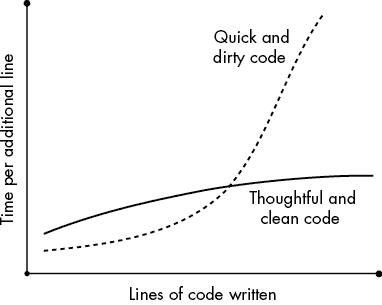
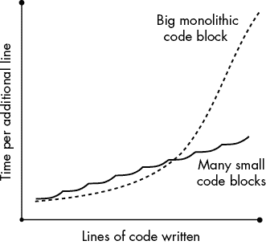
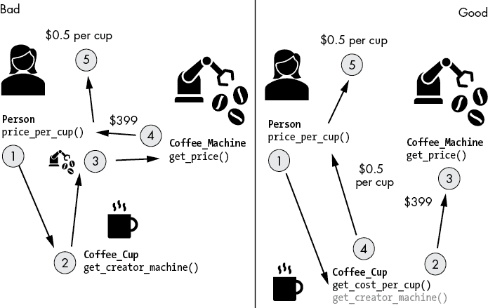

# 编写干净且简洁的代码


*干净的代码*是易于阅读、理解和修改的代码。它简洁且简明扼要，只要这些特性不妨碍可读性。虽然编写干净的代码更多是一种艺术而非科学，但软件工程行业已经达成一致，提出了多项原则，如果遵循这些原则，将帮助你编写*更干净*的代码。在本章中，你将学习 17 个编写干净代码的原则，它们将显著提高你的生产力并解决复杂性问题。

你可能会想知道*干净*代码和*简洁*代码之间的区别。这两个概念紧密相关，因为干净的代码往往是简洁的，简洁的代码往往是干净的。但也有可能遇到复杂的代码，它仍然是干净的。简洁性关注的是避免复杂性，而干净的代码则更进一步，关注如何管理不可避免的复杂性——例如，通过有效使用注释和标准。

## 为什么要编写干净的代码？

在前面的章节中，你学到了复杂性是任何代码项目的头号公敌。你还学到了简洁性能够提高你的生产力、动机以及代码库的可维护性。在本章中，我们将进一步扩展这个概念，并展示如何编写干净的代码。

干净的代码更容易被未来的自己和其他同事理解，因为人们更可能为干净的代码做出贡献，协作的潜力也会增加。因此，干净的代码可以显著降低项目成本。正如 Robert C. Martin 在他的书《Clean Code》（Prentice Hall，2008）中所指出的，程序员花费绝大多数时间阅读旧代码，以便编写新代码。如果旧代码易于阅读，那么这一过程将大大加速。

> 确实，阅读与编写代码的时间比例远远超过 10:1。我们在编写新代码的过程中，持续不断地阅读旧代码。[因此，]使代码易于阅读，也使得编写代码变得更容易。

如果我们字面理解这个比例，这个关系在图 4-1 中得到了可视化。x 轴对应于在一个代码项目中编写的行数，y 轴对应于编写一行额外代码所需的时间。一般来说，项目中已编写的代码越多，写一行额外代码所需的时间就越长。这对于干净代码和脏代码都适用。

假设你已经写了*n*行代码，并且你添加了第*n* + 1 行代码。添加这一行可能会影响所有之前写的代码行。它可能会带来小的性能损失，从而影响整个项目。它可能会使用在其他地方定义的变量。它可能会引入一个 bug（概率为*c*），要找到这个 bug，你必须搜索整个项目。这意味着你每行代码的预期时间——因此，成本——是*c * T*(*n*)，其中时间函数*T*随着输入*n*的增加而稳定增长。添加一行代码还可能迫使你编写额外的代码行，以确保向后兼容性。

更长的代码可能会引入许多其他复杂性，但你已经明白了这个要点：你写的代码越多，额外的复杂性就越大，这会减慢你的进度。



图 4-1：干净的代码提高了代码库的可扩展性和可维护性。

图 4-1 同样展示了写脏代码与干净代码之间的差异。脏代码在短期内和小型代码项目中消耗的时间较少——如果写脏代码没有好处，没人会去做！如果你将所有功能压缩到一个 100 行的代码脚本中，你就不需要投入大量时间思考和重构你的项目。问题只有在你添加更多代码时才会出现：随着你的单一代码文件从 100 行增长到 1000 行，它的效率将不如采用更有思考性的方式，按照逻辑结构将代码分成不同模块、类或文件来开发的代码。

一条经验法则是：总是编写深思熟虑且干净的代码。重新思考、重构和重整代码的额外成本将在任何非琐碎项目中带来多倍的回报。有时，赌注可能相当高：1962 年，美国国家航空航天局（NASA）尝试将一艘航天器送往金星，但由于源代码中缺少一个连字符，一个微小的 bug 导致工程师发出了自毁命令，最终导致一枚价值超过 1800 万美元的火箭损失。如果代码更干净，工程师可能会在发射前发现这个错误。

无论你是否在做火箭科学，精心编写程序的理念都能让你在人生中走得更远。简洁的代码也有利于将项目扩展到更多程序员和更多功能，因为较少的程序员会被项目的复杂性吓跑。

那么，让我们来学习如何编写简洁干净的代码吧！

## 编写干净代码：原则

我在从零开始开发一个分布式图处理系统作为博士研究的一部分时，以一种非常艰难的方式学会了编写干净的代码。如果你曾经编写过分布式应用程序——两个进程分别驻留在不同的计算机上，通过消息互相通信——你就知道这种复杂性可以迅速变得让人不堪重负。我的代码增长到几千行，错误频繁出现。好几个星期我都没有任何进展；这让我感到非常沮丧。理论上的概念很有说服力，但不知为何它们在我的实现中并没有奏效。

最终，在大约一个月的时间里，我全职工作在代码库上，却没有看到任何令人鼓舞的进展，于是我决定彻底简化代码库。除了其他改动，我开始使用现成的库，而不是自己编写功能。我删除了那些曾经注释掉、可能以后会用到的代码块。我重命名了变量和函数。我将代码结构化成逻辑单元，并创建了新类，而不是将所有东西塞进一个“上帝”类中。大约一周后，我的代码不仅对于其他研究人员来说更加易读和易懂，而且也更加高效，出错率更低。我的沮丧转变为热情——干净的代码救了我的研究项目！

改进代码库并减少复杂性叫做*重构*，如果你想编写干净简洁的代码，它必须成为你的软件开发过程中一个有计划且至关重要的环节。编写干净代码主要是记住两件事：知道从头开始构建代码的最佳方法，并定期回去进行修订。我将在接下来的 17 条原则中介绍一些保持代码干净的重要技巧。虽然每条原则涵盖了编写更干净代码的独特策略，但其中一些原则是重叠的，我觉得将重叠的原则合并会降低清晰度和可操作性。既然这些已经讲完，我们就开始第一个原则吧！

### 原则 1：思考大局

如果你在做一个非简单项目，你很可能会遇到多个文件、模块和库在整体应用中一起工作。你的*软件架构*定义了软件元素如何相互作用。良好的架构决策可以带来巨大的性能、可维护性和可用性的提升。要建立一个好的架构，你需要退后一步，思考整体局面。首先决定需要的功能。在第三章关于构建最小可行产品（MVP）中，你学会了如何将项目聚焦于必要的功能。如果你这样做了，你会节省很多工作，并且代码会更加简洁有序。到这个阶段，我们假设你已经创建了第一个包含多个模块、文件和类的应用程序。你如何运用整体思维来给这些混乱的代码带来一些秩序？考虑以下问题可以给你一些关于如何清理代码的思路：

+   你需要所有独立的文件和模块吗，还是可以合并其中一些，减少代码之间的相互依赖？

+   你能将一个大而复杂的文件拆分成两个更简单的文件吗？请注意，通常在两种极端之间会有一个“甜点”区域：一个庞大、单一的代码块完全无法阅读，或者是无数个小代码块，你很难一一追踪。两者都不可取，而大多数介于两者之间的阶段会是更好的选择。可以将其视为一个倒 U 形曲线，最大值代表了少数大代码块和大量小代码块之间的甜点区域。

+   你能将代码通用化并将其转化为库，从而简化主应用程序吗？

+   你能使用现有的库来消除许多代码行吗？

+   你能使用缓存来避免一次又一次地重新计算相同的结果吗？

+   你能使用更直接和更合适的算法来实现与你当前算法相同的功能吗？

+   你能去除那些不会提升整体性能的过早优化吗？

+   你能使用其他更适合当前问题的编程语言吗？

从大局思考是一种高效的方式，可以大幅度降低整个应用程序的复杂性。有时候，在后续的不同阶段实施这些改变会很困难，或者可能因为合作影响而无法进行。特别是，对于像 Windows 操作系统这样有数百万行代码的应用程序，这种高层次的思维方式可能会变得很困难。然而，你绝对不能完全忽视这些问题，因为所有的小调整加起来也无法弥补错误或懒惰设计选择带来的负面影响。如果你在一个小型创业公司工作，或者仅仅为自己工作，你通常可以迅速做出大胆的架构决策，比如改变算法。如果你在一个大组织中工作，你的灵活性可能会小一些。应用程序越大，你越容易找到简单的修复和容易解决的问题。

### 原则 2：站在巨人的肩膀上

发明轮子很少是有价值的。编程已经是一个有几十年历史的行业。世界上最优秀的程序员为我们提供了伟大的遗产：一个包含数百万个精细调优和经过充分测试的算法和代码函数的数据库。访问数百万程序员的集体智慧，就像使用一行导入语句那么简单。在你自己的项目中，完全没有理由不利用这个超级能力。

使用库代码可能会提高你的代码效率。已经被成千上万的程序员使用过的函数往往比你自己写的更加优化。而且，库函数调用通常比你自己编写的代码更容易理解，占用的代码空间也更少。例如，假设你需要一个聚类算法来可视化客户的聚类。你可以通过从外部库导入一个经过良好测试的聚类算法并将数据传入其中，*站在巨人的肩膀上*。这比使用你自己的代码更为高效——它将以更少的错误、更少的空间和更高效的代码实现相同的功能。库是高级程序员用来千倍提高生产力的主要工具之一。

作为一个能够节省时间的库代码示例，下面是从 scikit-learn Python 库中导入 KMeans 模块以在存储在变量 `X` 中的给定数据集上找到两个聚类中心的两行代码：

```py
from sklearn.cluster import KMeans
kmeans = KMeans(n_clusters=2, random_state=0).fit(X)
```

如果你自己实现 KMeans 算法，可能需要几个小时，且很可能需要超过 50 行代码，甚至会让你的代码库变得杂乱无章，使得未来的代码实现更加困难。

### 原则 3：为人编程，而不是为机器编程

你可能认为源代码的主要目的是定义机器应该做什么以及如何做。其实并非如此。像 Python 这样的编程语言的唯一目的是帮助人类编写代码。编译器完成繁重的工作，将你写的高级代码翻译成机器能理解的低级代码。是的，你的代码最终会由机器执行。但代码仍然主要是由人编写的，在今天的软件开发过程中，代码很可能必须经过多层人类的判断才能被部署。最重要的是，你写代码是为了人，而不是机器。

总是假设别人会阅读你的源代码。想象一下，你转到一个新项目，其他人不得不接手你的代码库。为了让他们的工作更轻松，减少挫败感，有很多方法可以做到。首先，使用有意义的变量名，这样读者就能轻松理解每一行代码的意图。列表 4-1 展示了一个使用不当变量名的例子。

```py
xxx = 10000
yyy = 0.1
zzz = 10

for iii in range(zzz):
    print(xxx * (1 + yyy)**iii)
```

列表 4-1：使用不恰当变量名的代码

很难猜测这段代码计算了什么。列表 4-2 则是一个语义等效的代码，使用了有意义的变量名。

```py
investments = 10000
yearly_return = 0.1
years = 10

for year in range(years):
    print(investments * (1 + yearly_return)**year)
```

列表 4-2：使用有意义变量名的代码

在这里理解发生了什么要容易得多：变量名表明如何计算一个初始投资 10000 的价值，这笔投资在 10 年内复利增长，假设年回报率为 10%。

虽然我们在这里不会讨论实现这一原则的每一种方式（尽管后面的原则会更详细地讨论一些方法），但它也体现在其他可以明确意图的方面，例如缩进、空格、注释和行长度等。干净的代码极大地优化了人类可读性。正如软件工程国际专家、畅销书《重构》的作者**马丁·福勒**所言：“任何傻瓜都能写出计算机能理解的代码。优秀的程序员写的是人类能理解的代码”（Addison-Wesley，1999 年）。

### 原则 4：使用正确的名称

相关的，经验丰富的程序员通常会就函数、函数参数、对象、方法和变量的命名约定达成共识，无论是隐性还是显性。遵守这些约定对每个人都有好处：代码变得更易读、更易理解，也更简洁。如果你违反这些约定，阅读你代码的人很可能会认为这段代码是由一个没有经验的程序员写的，并可能不会认真对待你的代码。

这些约定可能因编程语言而异。例如，按约定，Java 使用 `camelCaseNaming` 来命名变量，而 Python 使用 `underscore_naming` 来命名变量和函数。如果你在 Python 中使用驼峰命名法，可能会让读者感到困惑。你不希望你的非传统命名约定分散读者的注意力。你希望他们关注的是代码的功能，而不是你的编码风格。正如*最小惊讶原则*所述，通过选择不常见的变量名来让其他开发者感到惊讶没有任何价值。

那么，接下来我们来看看在编写源代码时可以考虑的命名规则。

1.  选择描述性名称 假设你创建了一个函数，用来将美元（USD）转换为欧元（EUR）。应该命名为 `usd_to_eur(amount)`，而不是 `f(x)`。

1.  选择不含歧义的名称 你可能会认为 `dollar_to_euro(amount)` 是一个不错的货币转换函数名。虽然它比 `f(x)` 更好，但它比 `usd_to_eur(amount)` 差，因为它引入了不必要的歧义。你是指美元、加元，还是澳元？如果你在美国，答案可能对你来说很明显，但澳大利亚的开发者可能不知道代码是用美国的美元编写的，可能会假设不同的输出。尽量减少这些混淆！

1.  使用易读的名称 大多数开发者在阅读代码时，都会在脑中默读。如果一个变量名无法发音，那么解读它的过程就会占用注意力，消耗宝贵的脑力空间。例如，变量名 `cstmr_lst` 可能很描述性且不含歧义，但它无法发音。选择变量名 `customer_list` 会让代码更容易理解，尽管它多占用了些空间。

1.  使用命名常量，而非魔法数字 在你的代码中，你可能会多次使用魔法数字 0.9 作为因子，将美元金额转换为欧元金额。然而，代码的读者——包括未来的你——必须思考这个数字的目的。这个数字并不是自解释的。处理魔法数字 0.9 的一个更好的方法是将其存储在一个全大写的变量中——用来表示它是一个不会改变的常量——比如 `CONVERSION_RATE = 0.9`，并在转换计算中使用它作为因子。例如，你可以通过 `income_euro = CONVERSION_RATE * income_usd` 来计算你的欧元收入。

这些只是一些命名规则。除了这些快速提示，学习命名约定的最佳方式是研究专家们精心编写的代码。搜索相关的命名约定（例如，“Python 命名约定”）是一个很好的起点。你还可以阅读编程教程，加入 StackOverflow 向其他程序员请教，查看开源项目的 GitHub 代码，或者加入 Finxter 博客社区，与其他有抱负的程序员一起互相学习，提高编程技能。

### 原则五：遵循标准并保持一致性

每种编程语言都会有一套隐式或显式的规则来指导如何编写整洁的代码。如果你是一个活跃的程序员，这些标准最终会成为你必须遵守的要求。然而，你可以通过花时间研究你正在学习的编程语言的代码标准来加速这一过程。

例如，你可以通过这个链接访问官方的 Python 风格指南 PEP 8：[`www.python.org/dev/peps/pep-0008/`](https://www.python.org/dev/peps/pep-0008/)。和任何风格指南一样，PEP 8 定义了正确的代码布局和缩进方法；如何设置换行符；每行最大字符数；正确使用注释；编写函数文档的方法；以及命名类、变量和函数的约定。例如，列表 4-3 展示了 PEP 8 指南中的正面示例，展示了如何正确使用不同的样式和约定。你需要为每个缩进级别使用四个空格，始终对齐函数参数，在列出逗号分隔的参数列表时使用单个空格，并通过使用下划线将多个单词结合起来来正确命名函数和变量：

```py
# Aligned with the opening delimiter.
foo = long_function_name(var_one, var_two,
                         var_three, var_four)

# Add 4 spaces (an extra level of indentation) to distinguish 
# arguments from the rest.
def long_function_name(
        var_one, var_two, var_three,
        var_four):
    print(var_one)

# Hanging indents should add a level.
foo = long_function_name(
    var_one, var_two,
    var_three, var_four)
```

列表 4-3：根据 PEP 8 标准在 Python 中使用缩进、空格和命名

列表 4-4 展示了错误的做法。参数没有对齐，多个单词在变量和函数名称中没有正确结合，参数列表没有用单个空格正确分隔，缩进级别只有两个或三个空格，而不是四个：

```py
# Arguments on first line forbidden when not using vertical alignment.
foo = longFunctionName(varone,varTwo,
   var3,varxfour)

# Further indentation required as indentation is not distinguishable.
def longfunctionname(
  var1,var2,var3,
  var4):
  print(var_one)
```

列表 4-4：在 Python 中错误使用缩进、空格和命名

所有阅读你代码的人都会期望你遵循已接受的标准。否则会导致混淆和挫败感。

然而，阅读风格指南可能是一个乏味的任务。作为一种不那么枯燥的学习约定和标准的方法，使用能够告诉你在哪里以及如何犯错的代码检查工具（如 linters）和集成开发环境（IDEs）。在与我的 Finxter 团队参加一个周末黑客马拉松时，我们创建了一个工具，叫做 Pythonchecker.com，它以有趣的方式帮助你将 Python 代码从凌乱的状态重构为超级整洁。对于 Python，最好的相关项目之一是 PyCharm 的 *black* 模块。类似的工具适用于所有主要的编程语言。只需在网上搜索 *<Your Language> Linter*，就可以找到适合你编程环境的最佳工具。

### 原则 6：使用注释

如前所述，在为人类而不是机器编写代码时，你需要使用注释来帮助读者理解代码。考虑一下 列表 4-5 中没有注释的代码。

```py
import re

text = '''
    Ha! let me see her: out, alas! She's cold:
    Her blood is settled, and her joints are stiff;
    Life and these lips have long been separated:
    Death lies on her like an untimely frost
    Upon the sweetest flower of all the field.
'''

 f_words = re.findall('\\bf\w+\\b', text)
print(f_words)

l_words = re.findall('\\bl\w+\\b', text)
print(l_words)

'''
OUTPUT:
['frost', 'flower', 'field']
['let', 'lips', 'long', 'lies', 'like']

'''
```

列表 4-5：没有注释的代码

列表 4-5 分析了莎士比亚的 *罗密欧与朱丽叶* 中的一段短文本，通过正则表达式进行处理。如果你不熟悉正则表达式，你可能会很难理解这段代码的作用。即使是有意义的变量名称也没多大帮助。

让我们看看几个注释是否能够解决你的困惑（见 Listing 4-6）。

```py
import re

text = '''
    Ha! let me see her: out, alas! She's cold:
    Her blood is settled, and her joints are stiff;
    Life and these lips have long been separated:
    Death lies on her like an untimely frost
    Upon the sweetest flower of all the field.
'''

❶ # Find all words starting with character 'f'.
f_words = re.findall('\\bf\w+\\b', text)
print(f_words)

❷ # Find all words starting with character 'l'.
l_words = re.findall('\\bl\w+\\b', text)
print(l_words)

'''
OUTPUT:
['frost', 'flower', 'field']
['let', 'lips', 'long', 'lies', 'like']
'''
```

Listing 4-6：带注释的代码

这两个简短的注释 (❶ ❷) 解释了正则表达式模式 `'\\bf\w+\\b'` 和 `'\\bl\w+\\b'` 的目的。我不会在这里深入探讨正则表达式，但这个例子展示了注释如何帮助你大致理解他人的代码，而无需理解那些语法糖。

你还可以使用注释来概括一段代码。例如，如果你有五行代码涉及更新数据库中的客户信息，在这段代码之前加上简短的注释来解释这一过程，像 Listing 4-7 中所示。

```py
❶ # Process next order
order = get_next_order()
user = order.get_user()
database.update_user(user)
database.update_product(order.get_order())

❷ # Ship order & confirm customer
logistics.ship(order, user.get_address())
user.send_confirmation()
```

Listing 4-7：注释块概述了代码

这展示了一个在线商店如何通过两个高级步骤完成客户订单：处理下一个订单 ❶ 和发货 ❷。注释帮助你快速理解代码的目的，而不需要逐一解读每个方法调用。

你还可以使用注释提醒程序员潜在的不可取后果。例如，Listing 4-8 提醒我们调用函数 `ship_yacht()` 会将一艘昂贵的游艇发货给客户。

```py
##########################################################
# WARNING                                                #
# EXECUTING THIS FUNCTION WILL SHIP A $1,569,420 YACHT!! #
##########################################################
def ship_yacht(customer):
    database.update(customer.get_address())
    logistics.ship_yacht(customer.get_address())
    logistics.send_confirmation(customer)
```

Listing 4-8：作为警告的注释

你可以以更多有用的方式使用注释；它们不仅仅是正确应用标准。当编写注释时，始终将“*为人类编写代码*”的原则放在心中，你就会做得很好。随着你阅读经验丰富程序员的代码，你会逐渐并几乎自动地吸收那些不言而喻的规则。因为你是自己编写代码的专家，帮助性的注释让外人能够一窥你的思路。别忘了与他人分享你的见解！

### 原则 7：避免不必要的注释

话虽如此，并不是所有的注释都能帮助读者更好地理解代码。在某些情况下，注释实际上会减少代码的清晰度，反而让代码库的读者感到困惑。为了编写干净的代码，你不仅要使用有价值的注释，还要避免不必要的注释。

在我作为计算机科学研究员的期间，我的一位技术高超的学生成功地申请到了谷歌的工作。他告诉我，谷歌的猎头批评了他的代码风格，因为他添加了太多不必要的注释。评估你的注释是另一个专家级编码人员用来判断你是初学者、中级还是高级程序员的方式。代码中的问题，例如违反风格指南、懒惰或草率地写注释，或者为某个编程语言写出不符合习惯的代码，统称为*代码异味*，这些都会暴露出潜在的问题，专家级的程序员能一眼识别。

如何判断哪些注释是多余的？通常情况下，如果注释是冗余的，那它就是不必要的。例如，如果你使用了有意义的变量名，代码通常可以自解释，不需要逐行注释。我们来看一下清单 4-9 中使用有意义变量名的代码片段。

```py
investments = 10000
yearly_return = 0.1
years = 10

for year in range(years):
    print(investments * (1 + yearly_return)**year)
```

清单 4-9：使用有意义变量名的代码片段

代码已经很明确地计算了你在 10 年内的累计投资回报，假设收益率为 10%。为了论证这一点，让我们在清单 4-10 中添加一些不必要的注释。

```py
investments = 10000 # Your investments, change if needed
yearly_return = 0.1 # Annual return (e.g., 0.1 --> 10%)
years = 10 # Number of years to compound

# Go over each year
for year in range(years):
    # Print value of your investment in current year
    print(investments * (1 + yearly_return)**year)
```

清单 4-10：不必要的注释

清单 4-10 中的所有注释都是多余的。如果你选择了不太有意义的变量名，它们中的一些可能会有用，但用注释解释一个名为 `yearly_return` 的变量（表示年回报）只会增加不必要的杂乱。

一般来说，你应该凭常识来判断注释是否必要，但以下是一些主要的指南。

1.  不要使用内联注释。通过选择有意义的变量名，这些注释完全可以避免。

1.  不要添加显而易见的注释。在清单 4-10 中，解释 `for` 循环语句的注释是多余的。每个程序员都知道 `for` 循环，因此给出注释 `# 遍历每一年` 与表达式 `for year in range(years)` 一起并没有增加额外的价值。

1.  不要注释掉旧代码；直接删除它。我们程序员常常在决定删除心爱的代码片段时，会仅仅将它们注释掉，尽管我们已经（不情愿地）决定移除它们。这会破坏代码的可读性！始终删除不必要的代码——为了心安理得，你可以使用版本历史工具（如 Git）来保存项目的早期草稿。

1.  使用文档功能，许多编程语言，如 Python，内置了文档功能，可以让你描述代码中每个函数、方法和类的目的。如果这些内容各自只有单一责任（根据原则 10），通常使用文档而非注释来描述代码功能已经足够。

### 原则 8：最小惊讶原则

最小惊讶原则指出，系统的一个组件应该以大多数用户预期的方式运行。这一原则是设计有效应用程序和用户体验的黄金法则之一。例如，当你打开 Google 搜索引擎时，光标会自动定位到搜索输入框，以便你可以立即开始输入搜索关键词，正如你所预期的那样：没有惊讶。

干净的代码也遵循这个设计原则。假设你编写了一个货币转换器，将用户输入的美元金额转换为人民币。你将用户的输入存储在一个变量中。哪个变量名更合适，`user_input` 还是 `var_x`？最小惊讶原则为你解答了这个问题！

### 原则 9：不要重复自己

*不要重复自己（DRY）*是一个广泛认可的原则，直观地建议避免重复代码。例如，考虑列表 4-11 中的 Python 代码，它将相同的字符串五次打印到终端。

```py
print('hello world')
print('hello world')
print('hello world')
print('hello world')
print('hello world')
```

列表 4-11：打印`hello world`五次

列表 4-12 中展示的代码大大减少了重复。

```py
for i in range(5):
    print('hello world')
```

列表 4-12：减少列表 4-11 中的重复

列表 4-12 中的代码将打印`hello world`五次，就像列表 4-11 所做的那样，但没有冗余。

函数也可以是减少重复的有用工具。假设你需要在代码的多个地方将英里转换为千米，如列表 4-13 所示。

首先，你创建一个变量`miles`并通过将其乘以 1.60934 将其转换为千米。其次，你通过将 20 乘以 1.60934 将 20 英里转换为千米，并将结果存储在变量`distance`中。

```py
miles = 100
kilometers = miles * 1.60934

distance = 20 * 1.60934

print(kilometers)
print(distance)

'''
OUTPUT:
160.934
32.1868
'''
```

列表 4-13：将英里转换为千米两次

你已经通过将英里值乘以因子 1.60934 两次来完成英里到千米的转换。DRY 建议，最好像列表 4-14 中那样写一个`miles_to_km(miles)`函数，而不是在代码中多次显式执行相同的转换。

```py
def miles_to_km(miles):
    return miles * 1.60934

miles = 100
kilometers = miles_to_km(miles)

distance = miles_to_km(20)

print(kilometers)
print(distance)

'''
OUTPUT:
160.934
32.1868
'''
```

列表 4-14：使用函数将英里转换为千米

这样，代码更易于维护。例如，你可以调整函数以提高转换的准确性，而只需要在一个地方进行更改。在列表 4-13 中，你需要在整个代码中查找所有实例来进行改进。应用 DRY 原则还能使代码更容易被人类读者理解。`miles_to_km(20)`函数的用途几乎没有疑问，但你可能需要更费劲地思考`20 * 1.60934`计算的目的。

违反 DRY 原则通常缩写为 WET：*我们喜欢打字*，*重复写所有内容*，*浪费每个人的时间*。

### 原则 10：单一职责原则

单一职责原则意味着每个函数应该有一个主要任务。使用许多小函数比使用一个同时完成所有任务的大函数更好。功能的封装减少了整体代码的复杂性。

一般来说，每个类和每个函数应该只有一个职责。这个原则的发明者 Robert C. Martin 将*职责*定义为*更改的理由*。因此，在定义一个类和一个函数时，他的黄金标准是让它们专注于单一职责，这样只有需要更改这个单一职责的程序员才会请求更改定义——而其他具有不同职责的程序员甚至不会考虑对类发出更改请求，当然，前提是代码是正确的。例如，负责从数据库读取数据的函数，不应该同时负责处理数据。否则，这个函数就有两个更改的理由：数据库模型的变化和处理需求的变化。如果有多个更改的理由，多个程序员可能会同时更改同一个类。你的类有太多职责，已经变得混乱不堪。

让我们考虑一个小的 Python 示例，它可以在电子书阅读器上运行，用于建模和管理用户的阅读体验（Listing 4-15）。

```py
❶ class Book:

  ❷ def __init__(self):
        self.title = "Python One-Liners"
        self.publisher = "NoStarch"
        self.author = "Mayer"
        self.current_page = 0

    def get_title(self):
        return self.title

    def get_author(self):
        return self.author

    def get_publisher(self):
        return self.publisher

 ❸ def next_page(self):
        self.current_page += 1
        return self.current_page

  ❹ def print_page(self):
        print(f"... Page Content {self.current_page} ...")

❺ python_one_liners = Book()

print(python_one_liners.get_publisher())
# NoStarch

python_one_liners.print_page()
# ... Page Content 0 ...

python_one_liners.next_page()
python_one_liners.print_page()
# ... Page Content 1 ... 
```

Listing 4-15：建模 `Book` 类时违反单一职责原则

Listing 4-15 中的代码定义了 `Book` 类 ❶，它有四个属性：标题、作者、出版商和当前页码。你为这些属性定义了 getter 方法 ❷，并实现了一个最基本的功能来翻到下一页 ❸，这个功能可以在每次用户按下电子书阅读器上的按钮时调用。`print_page()` 函数负责将当前页打印到阅读设备上 ❹。这只是一个占位符，在现实中会更加复杂。最后，你创建了一个名为 `python_one_liners` 的 `Book` 实例 ❺，并通过一系列方法调用和打印语句来访问它的属性。一个真实的电子书阅读器实现，比如，每当用户请求新的一页时，会调用 `next_page()` 和 `print_page()` 方法。

虽然代码看起来简洁明了，但它违反了单一职责原则：`Book` 类既负责建模数据，如书籍内容，又负责将书籍打印到设备上。建模和打印是两个不同的功能，但它们被封装在一个类中。这就有了多个更改的理由。例如，你可能希望更改书籍数据的建模方式：比如，你可以使用数据库，而不是基于文件的输入/输出方法。但你也可能想改变建模数据的表现形式，比如使用另一种书籍格式化方案来适配不同类型的屏幕。

我们来解决 Listing 4-16 中的问题。

```py
❶ class Book:

  ❷ def __init__(self):
        self.title = "Python One-Liners"
        self.publisher = "NoStarch"
 self.author = "Mayer"
        self.current_page = 0

    def get_title(self):
        return self.title

    def get_author(self):
        return self.author

    def get_publisher(self):
        return self.publisher

    def get_page(self):
        return self.current_page

    def next_page(self):
        self.current_page += 1

❸ class Printer:

  ❹ def print_page(self, book):
        print(f"... Page Content {book.get_page()} ...")

python_one_liners = Book()
printer = Printer()

printer.print_page(python_one_liners)
# ... Page Content 0 ...

python_one_liners.next_page()
printer.print_page(python_one_liners)
# ... Page Content 1 ...
```

Listing 4-16：遵循单一职责原则

清单 4-16 中的代码完成了相同的任务，但它满足了单一职责原则。你创建了`Book` ❶和`Printer` ❸类。`Book`类表示书籍元数据和当前页码 ❷，而`Printer`类负责将书籍打印到设备上。你将要打印当前页码的书籍传入`Printer.print_page()`方法 ❹。这样，数据建模（*数据是什么？*）和数据呈现（*数据如何展示给用户？*）被解耦，代码变得更容易维护。例如，如果你想通过添加新属性`publishing_year`来更改书籍数据模型，你会在`Book`类中进行修改。而如果你想通过向读者提供此信息来反映数据呈现的变化，你会在`Printer`类中进行修改。

### 原则 11：测试

测试驱动开发是现代软件开发的重要组成部分。无论你的技能多么高超，你都会在代码中犯错。为了捕捉这些错误，你需要定期运行测试，或者一开始就编写测试驱动的代码。每个伟大的软件公司都会在发布最终产品之前进行多层次的测试，因为发现内部错误远远比从不满的用户那里得知它们要好得多。

尽管没有限制可以执行哪种类型的测试来改进你的软件应用程序，但以下是最常见的测试类型：

1.  单元测试 通过单元测试，你编写一个单独的应用程序，检查每个功能在不同输入下的正确输入/输出关系。单元测试通常定期进行—for example，每次发布新版本的软件时进行。这减少了软件更改导致先前稳定的功能突然失败的可能性。

1.  用户验收测试 这些测试允许你的目标市场中的人们在受控环境下使用你的应用程序，同时你观察他们的行为。然后你询问他们对应用程序的看法以及如何改进。这些测试通常在项目开发的最后阶段进行，在组织内部进行过广泛的测试后进行。

1.  冒烟测试 冒烟测试是粗略的测试，旨在尝试在软件开发团队将应用程序交给测试团队之前让其失败。换句话说，冒烟测试通常由应用程序构建团队在将代码交给测试团队之前进行质量保证。当应用程序通过了冒烟测试，它就准备好进行下一轮测试了。

1.  性能测试 性能测试的目的是展示应用程序是否符合甚至超出用户的性能需求，而不是测试实际功能。例如，在 Netflix 发布新功能之前，必须测试其网站的页面加载时间。如果新功能使前端变得过慢，Netflix 就不会发布该功能，从而主动避免了负面用户体验。

1.  可扩展性测试 如果你的应用程序变得成功，你可能需要处理每分钟 1,000 个请求，而不是原本的 2 个请求。可扩展性测试将展示你的应用程序是否足够可扩展来处理这种情况。请注意，一个性能良好的应用程序不一定具备可扩展性，反之亦然。例如，一艘快艇性能非常好，但无法应付成千上万的人同时使用！

测试和重构通常会减少代码的复杂性和错误数量。然而，要小心不要过度设计（见原则 14）——你需要测试那些只会在现实世界中发生的场景。例如，测试 Netflix 应用程序是否能够处理 1000 亿个流媒体设备是没有必要的，因为地球上只有 70 亿潜在观众。

### 原则 12：小即是美

*小代码* 是指只需相对较少的行数就能完成单一特定任务的代码。以下是一个小代码函数的示例，该函数从用户处读取一个整数值并确保输入的确实是一个整数：

```py
def read_int(query):
    print(query)
    print('Please type an integer next:')
    try:
        x = int(input())
    except:
        print('Try again - type an integer!')
        return read_int(query)
    return x

print(read_int('Your age?'))
```

代码会一直运行，直到用户输入一个整数。以下是一个示例运行：

```py
Your age?
Please type an integer next:
hello
Try again - type an integer!
Your age?
Please type an integer next:
twenty
Try again - type an integer!
Your age?
Please type an integer next:
20
20
```

通过将读取整数值的逻辑与用户交互的逻辑分开，你可以多次重用相同的函数。但更重要的是，你将代码拆分成了较小的功能单元，这些单元相对容易阅读和理解。

然而，许多初学者程序员（或懒惰的中级程序员）会编写大型的、单体的代码函数，或者所谓的*神对象*，这些函数以集中的方式完成所有工作。这些单体代码块维护起来是噩梦。首先，人类一次理解一个小的代码函数比尝试将某个特定功能集成到一个 10,000 行的代码块中要容易得多。在一个大型代码块中，你可能会犯更多的错误，而在几个小函数和代码块中，错误的可能性则较小，这些小函数和代码块可以与现有代码库集成。

本章开始时，图 4-1 展示了编写代码时，每增加一行代码会使时间消耗更大，尽管从长远来看，编写清晰的代码比编写混乱的代码更快。图 4-2 比较了使用小代码块与单体代码块时所需的时间。对于大型代码块，每增加一行代码所需的时间将超线性增加。然而，如果将多个小代码功能叠加在一起，每增加一行代码的时间则接近线性增长。为了最好地实现这一效果，必须确保每个代码功能彼此独立。你将在下一个原则中了解更多关于德梅特法则的内容。



图 4-2：使用大型单体代码块时，时间呈指数增长；使用多个小代码块时，时间呈接近线性增长。

### 原则 13：德梅特法则

依赖关系无处不在。当你在代码中导入一个库时，代码部分依赖于该库的功能，但它自身也会有内部依赖。在面向对象编程中，一个函数可能依赖于另一个函数，一个对象可能依赖于另一个对象，一个类定义可能依赖于另一个类定义。

要编写清晰的代码，通过遵循*德梅特法则*，最小化代码元素之间的相互依赖性。该法则由软件开发者 Ian Holland 在 1980 年代末提出，他当时正在一个以农业、成长和生育的希腊女神德梅特命名的软件项目中工作。项目组提出了“软件成长”的理念，而不仅仅是构建软件。然而，后来被称为德梅特法则的内容，与这些更具形而上学性质的思想关系不大——它是面向对象编程中编写松耦合代码的一种实际方法。以下是该项目组网站上对德梅特法则的简明解释：[`ccs.neu.edu/home/lieber/what-is-demeter.html`](http://ccs.neu.edu/home/lieber/what-is-demeter.html)：

> 德梅特法则的一个重要概念是将软件划分为至少两部分：第一部分定义对象，第二部分定义操作。德梅特法则的目标是保持对象和操作之间的松耦合，以便可以在不严重影响另一部分的情况下修改其中任意一部分。这大大减少了维护时间。

换句话说，你应该尽量减少代码对象之间的依赖关系。通过减少代码对象之间的依赖，你减少了代码的复杂性，从而提高了可维护性。一个具体的含义是，每个对象应该只调用自己的方法或相邻对象的方法，而不是调用它通过调用相邻对象的方法获得的对象的方法。为了说明这一点，我们假设两个对象 A 和 B 是*朋友*，如果 A 调用了 B 提供的方法。很简单。但是，如果 B 的方法返回了一个指向 C 对象的引用呢？现在，A 对象可能会执行类似这样的操作：`B.method_of_B().method_of_C()`。这就是所谓的*方法链式调用*——在我们的比喻中，你与朋友的朋友交谈。迪米特法则要求*仅与直接朋友沟通*，因此不鼓励这种方法链式调用。一开始可能会觉得有些混乱，所以让我们深入到图 4-3 中展示的实际例子。



图 4-3：迪米特法则：仅与朋友沟通，以最小化依赖关系

图 4-3 展示了两个面向对象的代码项目，这些项目计算给定人群的每杯咖啡价格。其中一个实现违反了迪米特法则，另一个则遵循该法则。我们先从负面示例开始，示例中在`Person`类中使用方法链式调用与陌生人沟通 ❶（参见清单 4-17）。

```py
# VIOLATE LAW OF DEMETER (BAD)

class Person:
    def __init__(self, coffee_cup):
        self.coffee_cup = coffee_cup

    def price_per_cup(self):
        cups = 798
      ❶ machine_price = self.coffee_cup.get_creator_machine().get_price()
        return machine_price / cups

class Coffee_Machine:
    def __init__(self, price):
 self.price = price

    def get_price(self):
        return self.price

class Coffee_Cup:
    def __init__(self, machine):
        self.machine = machine

    def get_creator_machine(self):
        return self.machine

m = Coffee_Machine(399)
c = Coffee_Cup(m)
p = Person(c)

print('Price per cup:', p.price_per_cup())
# 0.5
```

清单 4-17：违反迪米特法则的代码

你创建了方法`price_per_cup()`，该方法根据咖啡机的价格和该咖啡机生产的杯数来计算每杯咖啡的成本。`Coffee_Cup`对象收集有关咖啡机价格的信息，这影响每杯咖啡的价格，并将其传递给`Person`对象中调用`price_per_cup()`方法的调用者。

图 4-3 左侧的图表展示了一个不好的策略。让我们一步步解释来自清单 4-17 的相应代码。

1.  方法`price_per_cup()`调用方法`Coffee_Cup.get_creator_machine()`，以获取创建咖啡的`Coffee_Machine`对象的引用。

1.  方法`get_creator_machine()`返回一个指向创建了这杯咖啡的`Coffee_Machine`对象的引用。

1.  方法`price_per_cup()`调用从前一个`Coffee_Cup`方法调用中获得的`Coffee_Machine`对象上的方法`Coffee_Machine.get_price()`。

1.  方法`get_price()`返回机器的价格。

1.  方法`price_per_cup()`计算每杯咖啡的折旧，并使用此信息估算单杯咖啡的价格。然后将结果返回给方法的调用者。

这是一个糟糕的策略，因为`Person`类依赖于两个对象：`Coffee_Cup`和`Coffee_Machine` ❶。负责维护该类的程序员必须了解这两个父类的定义——任何其中一个的变化都可能影响到`Person`类。

德梅特法则最小化了这种依赖关系。你可以在右侧的图 4-3 和清单 4-18 中看到更好的方式来建模同一个问题。在这个代码片段中，`Person`类不直接与`Machine`类交互——它甚至不需要知道它的存在！

```py
# ADHERE TO LAW OF DEMETER (GOOD)

class Person:
    def __init__(self, coffee_cup):
        self.coffee_cup = coffee_cup

    def price_per_cup(self):
        cups = 798
      ❶ return self.coffee_cup.get_cost_per_cup(cups)

class Coffee_Machine:
    def __init__(self, price):
        self.price = price

    def get_price(self):
        return self.price

class Coffee_Cup:
    def __init__(self, machine):
        self.machine = machine

    def get_creator_machine(self):
        return self.machine

    def get_cost_per_cup(self, cups):
        return self.machine.get_price() / cups

m = Coffee_Machine(399)
c = Coffee_Cup(m)
p = Person(c)

print('Price per cup:', p.price_per_cup())
# 0.5
```

清单 4-18：遵循德梅特法则的代码，不与陌生人交互

让我们逐步分析这段代码：

1.  方法`price_per_cup()`调用方法`Coffee_Cup.get_cost_per_cup()`来获取每杯的估算价格。

1.  方法`get_cost_per_cup()`——在响应调用方法之前——调用方法`Coffee_Machine.get_price()`来获取机器的价格。

1.  方法`get_price()`返回价格信息。

1.  方法`get_cost_per_cup()`计算每杯的价格，并将其返回给调用方法`price_per_cup()`。

1.  方法`price_per_cup()`只是将计算出的值传递给它的调用者 ❶。

这是一个更好的方法，因为`Person`类现在独立于`Coffee_Machine`类。依赖关系的总数减少了。对于一个有数百个类的项目，减少依赖关系大大降低了应用程序的整体复杂性。对于大型应用程序，随着复杂度的增长，潜在的依赖关系数量呈超线性增长：大致来说，超线性曲线增长得比直线快。例如，双倍增加对象的数量可能会使依赖关系的数量增加四倍（也就是复杂度）。然而，遵循德梅特法则可以通过显著减少依赖关系的数量来抵消这一趋势。如果每个对象只与*k*个其他对象交互，且你有*n*个对象，那么依赖关系的总数受限于*k*n*，这是一个线性关系（如果*k*是常数）。因此，德梅特法则在数学上可以帮助你优雅地扩展应用程序！

### 原则 14：你根本不需要它

这个原则建议你永远不要实现你仅仅是*怀疑*将来某一天可能会用到的代码——因为你根本不需要它！只有在你百分之百确定它是必要的时候才编写代码。为今天的需求编写代码，而不是明天的。如果将来你确实需要你之前仅仅怀疑过的代码，你仍然可以在那时实现该功能。但与此同时，你节省了很多不必要的代码行。

有助于从基本原则出发思考：最简单、最干净的代码就是空文件。从那里开始——你*需要*添加什么？在第三章中，你学到了 MVP：去除特性后的代码，专注于核心功能。如果你最小化所追求的特性数量，你将获得比通过重构方法或所有其他原则结合起来所能达到的更简洁、更清晰的代码。考虑剔除那些与其他特性相比，提供相对较少价值的特性。机会成本往往没有得到衡量，但通常是显著的。在考虑实现某个功能之前，你真的*需要*它。

这一点的一个含义是要避免*过度工程*：创建一个性能和健壮性更强或包含更多特性的产品，超出了实际需要。这增加了不必要的复杂性，这应当立刻引起警觉。

例如，我常常遇到这样的问题，使用一种简单的算法方法可以在几分钟内解决，但像许多程序员一样，我拒绝接受这些算法的局限性。于是，我研究了最先进的聚类算法，试图比简单的 KMeans 算法获得几个百分点的聚类性能。这些尾部优化代价极高——我花了 80%的时间，只获得了 20%的提升。如果我*需要*这 20%的提升，并且没有其他办法获取它，这种情况是不可避免的，但实际上，我并不需要实现复杂的聚类算法。这是过度工程的典型案例！

总是先从容易实现的部分入手。使用简单的算法和直接的方法建立基准，然后分析哪些新特性或性能优化能为整体应用带来更好的结果。要从全局出发，而不是局部：关注大局（如原则 1 所示），而非那些耗时的小修小补。

### 原则 15：不要使用过多的缩进层级

大多数编程语言使用文本缩进来可视化可能嵌套的条件块、函数定义或代码循环的层级结构。然而，过度使用缩进会降低代码的可读性。示例 4-19 展示了一个代码片段，缩进层级过多，导致难以快速理解。

```py
def if_confusion(x, y):
    if x>y:
        if x-5>0:
            x = y
            if y==y+y:
                return "A"
            else:
                return "B"
        elif x+y>0:
            while x>y:
                x = x-1
            while y>x:
                y = y-1
            if x==y:
                return "E"
        else:
            x = 2 * x
            if x==y:
                return "F"
            else:
                return "G"
    else:
        if x-2>y-4:
            x_old = x
            x = y * y
            y = 2 * x_old
            if (x-4)**2>(y-7)**2:
                return "C"
            else:
                return "D"
        else:
            return "H"

print(if_confusion(2, 8))
```

示例 4-19：嵌套代码块的层级过多

如果你现在试图猜测这段代码片段的输出，你会发现实际上很难追踪。代码函数`if_confusion(x, y)`对变量`x`和`y`进行了相对简单的检查。然而，在不同的缩进层级中，很容易迷失。代码根本不简洁。

示例 4-20 展示了如何更加简洁清晰地编写相同的代码。

```py
def if_confusion(x,y):
    if x>y and x>5 and y==0:
        return "A"
    if x>y and x>5:
        return "B"
    if x>y and x+y>0:
        return "E"
    if x>y and 2*x==y:
        return "F"
    if x>y:
        return "G"
    if x>y-2 and (y*y-4)**2>(2*x-7)**2:
        return "C"
    if x>y-2:
        return "D"
    return "H"
```

示例 4-20：减少嵌套代码块的层级

在清单 4-20 中，我们减少了缩进和嵌套。现在，你可以检查所有条件，看看哪些条件首先适用于你的两个参数`x`和`y`。大多数程序员比起阅读高度嵌套的代码，更喜欢阅读扁平化的代码——即使这意味着冗余检查；例如，这里`x>y`就被检查了多次。

### 原则 16：使用度量

使用代码质量度量来跟踪你代码随时间变化的复杂性。最终的（虽然非正式的）度量标准被称为每分钟的 WTF 数，旨在衡量代码阅读者的挫败感。清晰简洁的代码其结果会很低，而脏乱复杂的代码结果则会很高。

作为这一难以量化标准的代理，你可以使用如第一章所讨论的 NPath 复杂度或圈复杂度等已建立的度量标准。对于大多数 IDE，许多在线工具和插件会在你编写源代码时自动计算复杂性。这些工具包括 CyclomaticComplexity，你可以在 JetBrains 的插件部分通过 [`plugins.jetbrains.com/`](https://plugins.jetbrains.com/) 查找它。在我看来，实际使用的复杂性度量标准并不重要，关键是意识到你需要尽可能地去除复杂性。我强烈建议使用这些工具，帮助你编写更清晰、更简洁的代码。你投入的时间将获得极高的回报。

### 原则 17：童子军法则与重构

童子军法则很简单：*将营地保持得比你找到时更干净*。这是一个很好的生活和编码准则。养成清理每一段你遇到的代码的习惯。这不仅能改善你参与的代码库，让你自己的工作更轻松，还能帮助你培养像大师级程序员那样的敏锐眼光，快速评估源代码。额外的好处是，它能提高你团队的生产力，同事们也会感激你这种注重价值的态度。需要注意的是，这不应该违背我们之前提到的避免过早优化（过度工程化）的原则。花时间清理代码以减少复杂性几乎总是高效的。这样做将大大减少维护开销、bug 和认知负担。简言之，过度工程化往往会*增加*复杂性，而清理代码则能*减少*复杂性。

改进代码的过程被称为*重构*。你可以说，重构是包含我们讨论的每个原则的整体方法。作为一名优秀的程序员，你从一开始就会融入许多清洁代码的原则。然而，即便如此，你仍然需要偶尔重构代码，清理你所犯的任何错误。特别是，在发布任何新特性之前，你应该重构代码，以保持代码的整洁。

有许多重构代码的技巧。其中一种方法是向同事解释你的代码，或者让他们帮忙查看，以发现你可能没有注意到的糟糕决策。例如，你可能创建了两个类，`Cars`和`Trucks`，因为你预期你的应用程序需要同时建模这两者。当你向同事解释代码时，你意识到你并不经常使用`Trucks`类——而且当你使用它时，你用的方法已经存在于`Car`类中。你的同事建议创建一个`Vehicle`类，处理所有的汽车和卡车。这样，你就可以立即删除许多行代码。这种思考方式可以带来巨大的改善，因为它迫使你从宏观角度审视你的决策，并解释你的项目。

如果你是一个内向的程序员，你可以改为向一只橡胶鸭解释你的代码——这是一种被称为*橡胶鸭调试*的技巧。

除了与同事（或橡胶鸭）交流外，你还可以利用这里列出的其他简洁代码原则，时不时地快速评估你的代码。当你这样做时，你很可能会发现一些可以快速应用的调整，从而通过清理代码库大幅度减少复杂性。这个软件开发过程中不可或缺的部分将显著提高你的成果。

## 结论

在本章中，你已经学习了 17 条编写简洁清晰代码的原则。你了解了简洁代码如何减少复杂性，提高生产力，并增强项目的可扩展性和可维护性。你知道了在可能的情况下应使用库，以减少冗余并提高代码质量。你明白了选择有意义的变量和函数名称，并遵守标准，能有效减少未来阅读代码者的理解障碍。你学会了设计只做一件事的函数。通过最小化依赖（根据德梅特法则）来减少复杂性并提高可扩展性，可以通过避免直接和间接的方法链调用来实现。你学会了以一种能展现你思路的方式注释代码，但你也学会了避免不必要或琐碎的注释。最重要的是，你明白了释放简洁代码超级能力的关键是为人类编写代码，而不是为机器编写代码。

你可以通过与优秀的程序员合作，阅读他们在 GitHub 上的代码，以及研究你所使用编程语言中的最佳实践，逐渐提高你的简洁代码编写技巧。将一个动态检查你代码是否符合最佳实践的代码审查工具（linter）集成到你的编程环境中。时不时地，回顾这些简洁代码的原则，并将其应用到你当前的项目中。

在下一章中，你将学习另一个有效编码的原则，它不仅仅是写出干净的代码：过早优化。你会惊讶地发现，许多程序员在尚未意识到*过早优化是万恶之源*的情况下，浪费了大量的时间和精力。
