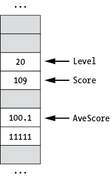
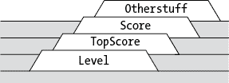
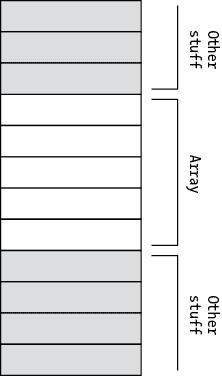
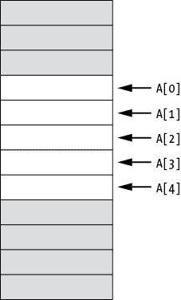
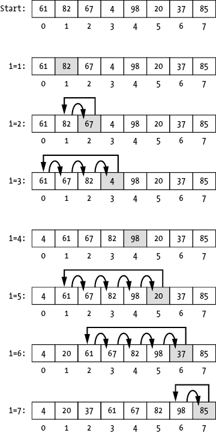

## 第一章：内存中的信息


任何稍微有趣的计算机程序都需要能够从内存中存储和访问数据。这些数据可能是文档中的文本、网页上的信息，或是我们在数据库中存储的所有曾经品尝过的咖啡种类的详细信息。在每一种情况下，数据都是程序执行其预期功能的基础。

这些例子仅代表了用户看到和思考的数据。程序还必须在后台追踪许多数据，例如我们通过循环的次数、游戏中角色的当前位置或当前的系统时间。如果没有这些数据，程序就无法表示其内部状态的变化。

本章我们将探讨如何将数据存储在内存中的基础知识。我们将查看最简单的数据结构——普通变量、复合数据结构和数组——如何存储数据。我们还将介绍本书的伪代码约定。对于有编程经验的读者来说，本章的关键概念可能已经很熟悉了。尽管如此，这些概念仍然是我们学习的关键起点，值得复习，因为它们为我们构建更强大和更有趣的数据结构提供了基础。

## 变量

单独的数据通常存储在*变量*中，变量本质上是表示数据在计算机内存中位置（或*地址*）的名称。即使是初学编程的读者也已经对变量有所了解：它们是计算机科学中的基础概念，是即使是最简单的程序也必不可少的。变量使程序能够追踪在程序运行过程中变化的信息。需要统计你在`FOR`循环中执行了多少次？追踪游戏中玩家的得分？统计你在编写关于变量的引言章节时犯了多少个拼写错误？使用变量吧。

没有变量，程序员无法跟踪、评估或更新程序的内部状态。当你创建一个变量时，系统会在后台分配并为其指定一个位置。然后，你可以使用自己选择的变量名向该位置写入数据，并使用相同的名称查找数据。只要你知道变量的名称，就不需要知道数据的内存位置。我们可以将计算机的内存想象成一列长长的储物箱。每个变量占据一个或多个连续的储物箱，具体取决于变量的大小，如图图 1-1 所示，其中有三个变量：`Level`、`Score` 和 `AveScore`。在这个示例中，平均分数（`AveScore`）是一个浮动小数（带有小数的数字），它使用了两个内存储物箱。



图 1-1：计算机内存被描述为一列箱子

在某些方面，变量就像文件夹上的小纸标签，类似于图 1-2 中的标签：一旦我们附上了标签，就不需要记住文件夹的顺序或它们具体存储了什么内容。我们只需要通过标签查找文件夹——但这也意味着使用具有信息量的名称非常重要。作者自己的文件柜里塞满了名称模糊的文件夹，如*Stuff*、*Misc*、*Important*和*Other Stuff*，这使得很难知道里面存储的是什么。同样，模糊的变量名也使得很难猜测它们代表的具体值。



图 1-2：变量就像文件夹上的标签，提供了便捷的方式来查找和访问存储的值。

在许多编程语言中，变量有一个关联的类型，表示它们存储的确切数据类型，例如整数、浮点值（“floats”）或布尔值（true 或 false）。这些类型告诉程序变量占用多少内存以及如何使用这些内存。例如，一个布尔变量存储的是有限范围的值，通常只需要少量内存。一个双精度浮点数可能存储一个更大且更精确的数字，因此需要多个内存单元。定义类型的语法，以及是否需要显式定义类型，在编程语言之间有所不同。

在本书中，我们将使用语言无关的`<type>: <name>`伪代码格式来指定示例中的变量。例如：

```py
Integer: coffee_count = 5
Float: percentage_words_spelled_correctly = 21.0
Boolean: had_enough_coffee = False
```

有时，变量的类型会是通用的`Type`，表示它可以根据实现的不同而具有多种类型。我们将使用大多数编程语言中的典型语法来操作这些变量，包括使用`=`进行赋值：

```py
coffee_count = coffee_count + 1
```

对于数字类型，包括整数和浮点数，我们将使用标准的算术运算，如`+`、`-`、`*`和`/`。对于布尔数据类型，我们将使用布尔运算，如`AND`、`OR`和`NOT`。你在程序中需要使用的语法将根据编程语言的不同而有所不同（这也是不同编程语言之间争论的一个常见焦点）。

## 复合数据结构

许多编程语言提供了创建*复合数据结构*的能力，如结构体或对象，它们将多个独立的变量聚合成一个整体。复合数据结构提供了一种便捷的方式来收集相关数据并将它们一起传递。例如，我们可以定义一个`CoffeeRecord`来跟踪我们品尝的咖啡种类的一些信息：

```py
CoffeeRecord {
    String: Name
    String: Brand
    Integer: Rating
    Float: Cost_Per_Pound
    Boolean: Is_Dark_Roast
    String: Other_Notes
}
```

我们不会维护六个单独的变量来追踪一杯咖啡的属性，而是将所有信息存储在一个单独的复合数据结构 `CoffeeRecord` 中。当然，一个真正的咖啡爱好者可能会追踪几百个额外的属性，以及与咖啡消费相关的日期、时间、地点和天气条件的精确资料。毕竟，咖啡是一个复杂的话题，值得详细记录。每个附加的属性都进一步强调了使用复合数据结构的重要性：传递几百个相关变量的替代方法不仅繁琐，而且还增加了程序员犯错的概率，比如将变量错误地传递给函数。

名片提供了一个现实世界中复合数据结构的示例。每张名片都是一个数据包，包含多个信息片段，比如姓名、电话号码和电子邮件地址。将这些信息打包成一张名片可以提高跟踪和传递的效率。想象一下，如果你给同事五张包含单一数据点的纸条，会有多么混乱和困惑。

在许多编程语言中，包括 Java 和 Python，数据复合体可以采取*对象*的形式，这些对象包含了操作其自身数据的函数和数据。对象的函数使用特殊的语法来访问该对象的数据，例如 Python 中的 `self` 引用。对象还可以提供不同的可见性规则，指定其内部数据是否可以在对象的函数外部公开访问，或者仅限于私密访问。

为了尽可能通用，我们将以最一般的形式处理复合数据结构：作为一组数据。虽然本书及其他地方的示例代码片段可能将复合数据结构实现为对象，但算法也可以调整为使用非对象表示。在使用复合数据结构或对象的代码中，我们使用 `composite.field` 语法来表示访问复合数据结构的特定字段。例如，使用以下代码：

```py
latest_record.name = "Sublime Blend"
```

我们将咖啡日志中 `latest_record` 记录的 `name` 字段设置为 `Sublime Blend`。

## 数组

*数组*通常用于存储多个相关的值。例如，我们可能想要追踪一年内每天消耗的咖啡量。我们可以通过创建 365 个单独的变量来强行存储，例如 `AmountDay1`、`AmountDay2`、`AmountDay3` 等等，但这既繁琐又不能为数据提供任何结构。`AmountDay2` 只是一个文本标签，因此程序并不知道 `AmountDay1` 存储的是前一天的信息，而 `AmountDay3` 存储的是后一天的信息；只有程序员自己知道这一点。

数组提供了一种简单的机制，用于将多个值存储在相邻且可索引的容器中。数组实际上是一个变量的排列——在计算机内存中是一个连续的相同大小的容器块，如图 1-3 所示。像单独的变量一样，数组占用一块内存，并可以与任意其他信息相邻。数组的每个容器都可以存储给定类型的值，如数字、字符、指针，甚至其他（固定大小的）数据结构。



图 1-3：数组作为计算机内存中的容器

数组在我们的日常生活中也随处可见。例如，高中走廊里一排排储物柜就是一个物理数组，用于存储学生的外套和书本。我们只需打开相应的储物柜，就可以访问任何单独的存储容器。

数组的结构使得我们可以通过指定其位置或*索引*来访问数组中的任何值，也称为*元素*。这些容器在计算机的内存中占据相邻的位置，因此我们可以通过计算它们相对于第一个元素的偏移量并读取该位置的内存来访问单个容器。无论我们访问哪个容器，这都只需要一次加法运算和一次内存查找。这种结构使得数组在存储具有顺序关系的项目时尤为方便，例如我们的日常咖啡摄入量跟踪器。

正式地，我们通过`A[i]`来引用数组`A`中索引`i`位置的值。在我们的储物柜示例中，索引将是储物柜前面显示的数字。大多数编程语言使用*零索引数组*，这意味着数组的第一个值位于索引 0，第二个位于索引 1，依此类推，如图 1-4 所示。


图 1-4：零索引数组

本书将全程使用零索引数组，以遵循通用的计算机约定。图 1-5 展示了零索引数组在计算机内存中的表现，其中白色区域是数组的元素。



图 1-5：计算机内存中排列的零索引数组

零索引便于我们通过计算数组在内存中起始位置的偏移量来确定元素在内存中的位置。数组中第*i*个元素的位置可以通过以下方式计算：

*位置*(*项目* i) = *位置*(*数组起始位置*) + *每个元素的大小* × i

索引零位置的元素是数组的起始位置。例如，图 1-5 中的示例数组`A`的第五个元素将是`A[4]`，并且根据图 1-4 中的索引值，包含的值为 9。

在大多数编程语言中，我们通过数组的名称和索引的组合来获取和设置数组中的值。例如，我们可能会将索引为 5 的箱子的值设置为 16：

```py
A[5] = 16
```

对于我们的咖啡追踪示例，我们可以定义一个数组`Amount`来存储一天内消耗的杯数，并将相应的计数存储在`Amount[0]`到`Amount[364]`中。这个单一数组允许我们通过一个变量名有序地访问 365 个不同的值。我们从一系列类似命名但独立的变量，转变为一个数学偏移量的单一位置。为了理解这一点的强大之处，可以考虑我们的学校储物柜。如果将每个储物柜命名为“Jeremy 的储物柜”或“第三个姓氏以 K 开头的学生的储物柜”，那么它们几乎无法迅速找到。学生们不仅仅是访问特定的索引，而是必须检查大量储物柜，比较标签，直到找到正确的匹配。使用数组索引，学生们只需使用它的偏移量来确定储物柜的位置并直接访问它。

尽管我们经常将数组可视化并讨论为整个数据结构，但需要记住的是，每个箱子像一个独立的变量。当我们想对数组进行全局更改，例如将元素向前移动一个位置时，我们需要像图 1-6 所示一样，逐个对每个箱子应用这个更改。


图 1-6：在数组中按箱逐个向前移动元素

数组不像书架上的书籍。我们不能一次性将整个集合推到一边，为最新版本的*咖啡爱好者指南：最佳公平贸易咖啡*腾出空间。数组更像是一排商店铺面。我们不能仅仅在我们最喜欢的街区书店和理发店之间塞进一家新的咖啡店。为了腾出空间，我们需要一个一个地将商店铺面向后挪动，先清空每个商店并将其内容转移到邻近的店铺。

实际上，我们必须在数组中交换两个值时，进行值的调度。例如，要交换索引`i`和`j`的值，我们需要首先将其中一个值赋给一个临时变量：

```py
Temp = A[i]
A[i] = A[j]
A[j] = Temp
```

否则，我们可能会覆盖某个槽位中的值，导致两个槽位拥有相同的值。同样，如果我们要交换咖啡店和书店的位置，我们首先需要将书店的内容移动到一个空的第三位置，以腾出空间给咖啡店的内容。只有等我们移动了咖啡店的位置后，才能把书店的内容从临时的第三位置移动到咖啡店原来的位置。

### 插入排序

理解数组的结构对其使用影响的最佳方法是将其置于实际算法的上下文中。*插入排序*是一种对数组中的值进行排序的算法。它适用于任何可以排序的值类型。我们可以排序整数、字符串，甚至按照过期日期排序我们储藏室里的咖啡。

插入排序通过对数组的一个子集进行排序，并不断扩展已排序范围，直到整个数组有序。该算法通过遍历未排序数组中的每个元素，将其移动到已排序部分的正确位置。在第`i`次迭代开始时，索引`0`到`i` − 1 的元素已经是有序的。然后，算法取出索引`i`处的元素，在已排序的前缀中找到正确的位置并将其插入，同时将需要的元素下移以腾出空间。已排序的前缀现在增长了一项——索引`0`到`i`的元素已经是有序的。我们可以从`i` = 1 开始，将第一个元素声明为我们的初始有序前缀。

假设我们想按新鲜度对咖啡收藏进行排序——毕竟，如果把一袋优质咖啡放在储藏室的最里面，等它变陈旧，那可真是太遗憾了。我们需要将最早的最佳食用日期移到架子的左侧，以便它们能随时取用。

我们开始进行咖啡插入排序时，首先宣布最前面的一个咖啡袋为*已排序*，并使用这个范围作为我们的已排序前缀。然后，我们查看架子上的第二袋咖啡，比较日期以决定它是否应该排在第一袋之前。交换顺序后，或确定不需要交换时，我们可以自信地宣布前两项已排序。我们已经有了一个完全排序的子集。接下来，我们继续处理第三袋咖啡，确定它相对于前两袋的位置，可能会进行一些交换。这个过程继续进行，直到我们实现完美的咖啡整理。

我们可以通过一对嵌套循环来实现插入排序，如列表 1-1 所示。

```py
InsertionSort(array: A):
    Integer: N = length(A)
    Integer: i = 1
  ❶ WHILE i < N:
        Type: current = A[i]
        Integer: j = i - 1  
      ❷ WHILE j >= 0 AND A[j] > current:
            A[j + 1] = A[j]
            j = j - 1
        A[j + 1] = current
        i = i + 1
```

列表 1-1：通过嵌套循环实现插入排序

外层循环使用迭代器`i`，从第一个未排序的元素开始，`i = 1`，并依次遍历未排序范围中的每个值❶。内层循环使用迭代器`j`将当前值移入已排序前缀❷。在每一步中，我们通过将`current`值与前一个位置的值进行比较，检查在已排序前缀中的位置，索引`j`。如果`j`处的元素较大，说明两个值的顺序错误，需要交换。由于我们将当前值存储在一个单独的变量`current`中，所以可以直接从前一个位置复制数据，无需完全交换。内层循环会继续进行，直到将当前值移至数组前端，或找到一个较小的前置值，这表示当前值已经在已排序前缀的正确位置。只有当当前值处于正确位置时，我们才在循环结束时将其写入数组。然后，外层循环继续处理下一个未排序的值。

我们可以通过图 1-7 来可视化算法的行为。每一行展示了迭代开始时数组的状态。阴影框表示当前正在移动到正确位置的元素，箭头表示相应的移动。



图 1-7：插入排序算法的可视化

插入排序效率并不高。在向数组中插入元素时，我们可能需要移动数组的较大部分。在最坏情况下，算法的时间复杂度与元素数量的平方成正比——对于列表中的每个元素，我们都需要移动它前面的所有元素。如果数组的大小翻倍，最坏情况下的时间复杂度将增加四倍。虽然在我们的咖啡室中这可能不是很大的开销，因为我们可能只存放少量的咖啡，能够在咖啡变陈之前消耗掉，但在许多应用中，算法的二次时间复杂度将急剧上升。

然而，插入排序提供了一个重要的见解，帮助我们理解数组的运作。通过这个简单的算法，我们展示了数组的几个属性，包括能够通过索引访问元素的能力、在插入新元素时交换值的能力，以及遍历数组项的有价值的能力。

## 字符串

*字符串*是字符的有序列表，通常可以被视为一种特殊类型的数组。字符串中的每个槽位包含一个字符，无论是字母、数字、符号、空格，还是有限的一组特殊标记。特殊字符通常用于表示字符串的结束，如图 1-8 中的最后一个槽位所示的`/`。字符串中的字符通常可以通过其索引直接访问。


图 1-8：一个拼写为“Hello world!”的字符串

在某些编程语言中，字符串直接实现为简单的字符数组。在其他语言中，字符串可能是对象，字符串类作为包装器封装了字符数组或其他持有字符的数据结构。字符串的包装类提供了额外的功能，例如动态调整字符串大小或搜索子字符串的能力。无论哪种情况，考虑数组般的结构如何影响字符串的操作都是有用的。当我们在计算机屏幕上显示字符串时，实际上是在逐个遍历其字符并逐一显示它们。

比较相等性的常见测试更值得关注。与可以通过单一操作直接比较的整数不同，字符串必须通过逐个字符进行比较。程序会逐个字符地将其与另一个字符串进行比较，并返回是否发现不匹配的结果。

列表 1-2 展示了检查两个字符串相等性的算法。算法首先比较字符串的大小。如果它们的长度不同，算法就会停止。如果它们的长度相同，算法会逐个位置进行迭代，并比较每个字符串中的相应字母。只要我们发现一个不匹配的字符，就可以终止循环。只有当我们遍历完整个字符串而没有发现不匹配时，才能声明这两个字符串相等。

```py
StringEqual(String: str1, String: str2):
    IF length(str1) != length(str2):
        return False
    Integer: N = length(str1)
    Integer: i = 0
    WHILE i < N AND str1[i] == str2[i]:
        i = i + 1
    return i == N
```

列表 1-2：检查两个字符串相等性的算法

图 1-9 演示了该算法如何对两个字符串进行操作。等号表示比较时匹配的字符对，X 表示第一个不匹配的字符对，测试在此处终止。


图 1-9：两个字符串的比较

字符串比较的最坏情况下的计算成本与字符串的长度成正比。虽然比较两个小字符串所需的工作可能微不足道，但对两个长字符串执行相同的操作时可能会非常耗时。为了作对比，可以想象一下逐字扫描两本相同书籍的两个版本，寻找它们之间的每个文字差异。在最好的情况下，我们可以早早发现不匹配。在最坏的情况下，我们需要检查大部分内容。

许多编程语言，如 Python，都提供了一个字符串类，允许直接比较，因此我们不需要在列表 1-2 中直接实现比较代码。然而，在这个简单的比较函数背后，实际上有一个循环，它会遍历所有的字母。如果没有理解这一关键细节，就可能大大低估字符串比较的成本。

## 为什么这很重要

变量和数组是编程入门课程的基础内容，因此它们看起来可能不那么令人兴奋，但它们非常重要，因为它们为计算机编程和数据结构提供了基础。这些概念也为评估动态数据结构及其对算法的影响提供了基准。在后面的章节中，我们将看到动态数据结构如何在效率、灵活性和复杂性之间提供不同的权衡。
