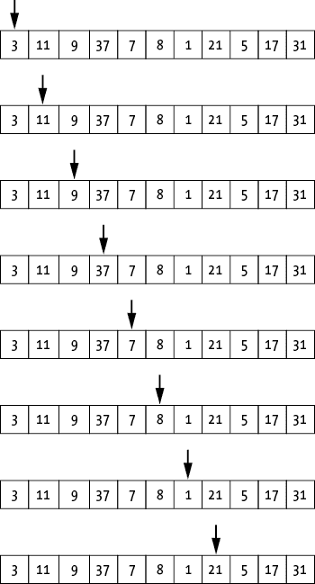
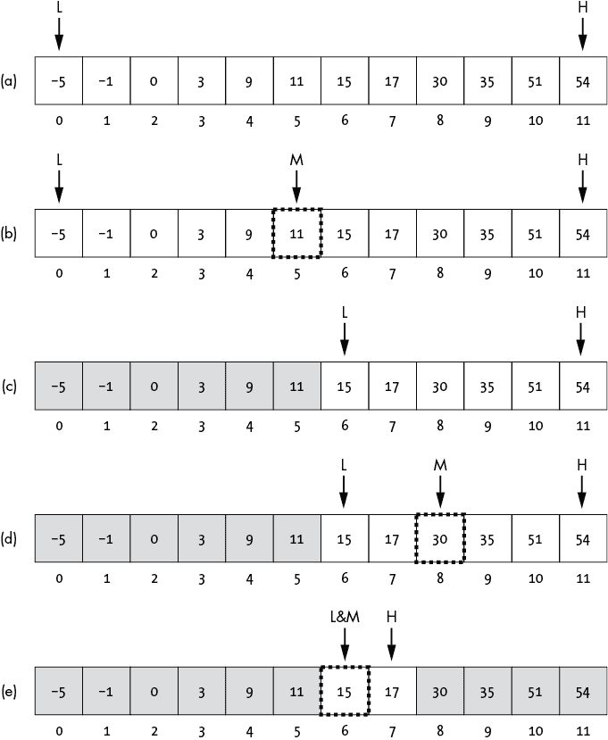
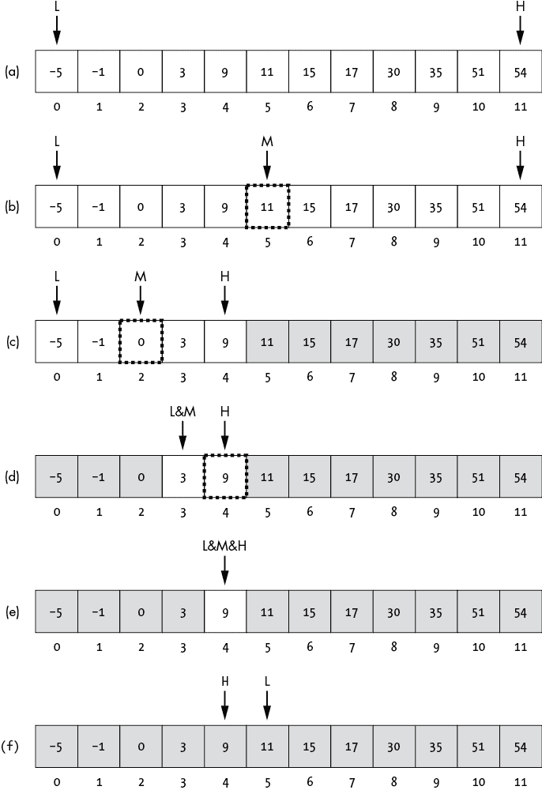
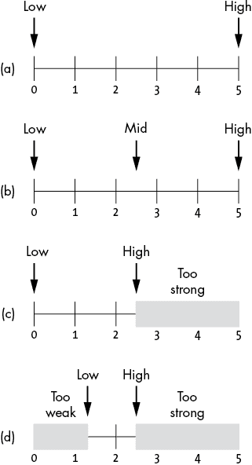

## 第二章：二分查找


*二分查找* 是一种高效查找已排序列表的算法。它通过不断将列表一分为二，确定哪一半可能包含目标值，并丢弃另一半，从而在已排序的列表中查找目标值。这个算法逻辑简单且易于实现，是计算机科学的完美入门主题，因此二分查找算法几乎在所有计算机科学课程和教材中都有介绍。

怀疑的读者可能会想，“我到底有多大概率需要查找一个已排序的列表？”或者更准确地说，“我有多大可能需要实现一个查找已排序列表的函数？难道几百万个人没做过这个吗？不是已经有现成的库了吗？”虽然你不应该排除某天需要自己实现二分查找的可能性，但它真正的重要性远超其实现。

二分查找展示了聪明的算法如何利用数据存储的结构来实现显著的计算节省，即使这种结构简单到只有已排序的数据。二分查找的正确性和效率都容易分析，提供了速度和正确性的保证，并展示了数据和算法之间的基本交互。它是检视数据存储技术差异的一个极好视角，比如链表和数组的区别，或许多基于树的算法背后的动机。它甚至可以用来制作一杯更好的咖啡。

## 问题

在定义任何新算法之前，我们必须定义算法要解决的问题。在本章中，我们的目标是找到一个列表中的单个项，匹配给定的目标值；我们需要一个可以高效执行这种搜索的算法。我们可以正式地将这个搜索定义为：

> 给定一组数据点 *N*，*X* = {*x*[*1*]*, x*[*2*]*, ... , x*[*N*]} 和一个目标值 *x*'，找到一个点 *x*[*i*]∈ *X* 使得 *x*' = *x*[*i*]，或者指出不存在这样的点。

在我们日常生活中，我们可能会将这个任务描述为“找到这个特定的东西”。这个搜索问题是我们每天都会遇到的。我们可能在字典中找一个词，在联系人列表中找一个名字，在历史事件列表中找一个特定的日期，或者在拥挤的超市货架上找我们喜欢的咖啡品牌。我们所需要的只是候选列表和一种检查我们是否找到匹配项的方法。

## 线性扫描

为了了解二分查找的优势，我们首先从一个更简单的算法——*线性扫描*开始，以提供一个比较基准。线性扫描通过逐个检查列表中的每个值是否与目标值匹配，直到找到目标值或遍历完整个列表为止。这就像作者在超市货架上寻找商品的方式——一边沿着五光十色的咖啡包装逐个用手指滑过，一边自言自语地抱怨需要更好的索引方案。

假设我们正在查找数组`A`中的目标值。这里我们设定`target = 21`。我们依次遍历数组中的每个元素，并检查它是否等于 21，如图 2-1 所示。

清单 2-1 显示了线性扫描的代码。如果找到了匹配的元素，代码会返回该元素的索引；如果搜索失败，说明该元素不在数组中，代码将返回索引`-1`。

```py
LinearScan(Array: A, Integer: target):
    Integer: i = 0
    WHILE i < length(A):
        IF A[i] == target:
            return i
        i = i + 1
    return -1
```

清单 2-1：线性扫描的代码



图 2-1：对整数数组进行线性扫描

一个单独的`WHILE`循环遍历数组中的每个元素，内部的`IF`语句将该元素与目标值进行比较。只要找到与目标匹配的元素，就返回相应的索引。如果遍历到数组末尾还没有找到匹配项，则返回`-1`。

线性扫描既不华丽也不聪明。它是一个*蛮力*测试，能够确保找到感兴趣的项目（如果该项目在数据中存在），因为它会检查每个可能的元素，直到找到匹配项或确认该项不存在。这种方法虽彻底，但效率低，尤其对于大型列表而言。如果我们对`A`中的数据结构一无所知，就无法通过任何方式优化该过程。目标值可能在任何一个位置，所以我们可能需要检查所有的元素。

为了说明线性扫描的局限性，假设我们正在对一排物理排列的物品进行扫描，比如一排站在教室外面的计算机科学入门学生。老师想要将某个学生的作业还给他，于是走到每个学生面前，询问“你的名字是 Jeremy 吗？”，然后可能会继续询问下一个学生。搜索在老师找到正确的学生或走到队伍末尾时结束。学生们（正确地）翻了翻白眼，低声抱怨他们低效的老师。

有时可以通过*每次比较*使线性搜索更快。例如，我们可以通过在比较字符串时在第一个不匹配的字母处停止来优化比较时间，如第一章所述。同样，在超市的情况中，我们可以提前消耗大量咖啡，这样我们的指尖在货架上滑动得更快。然而，这种方法只有在某些程度上才有效。我们仍然限制于逐一检查每个物品。

在接下来的部分，我们将看到数据中少量结构如何改变一切。

## 二分查找算法

二分查找是一种在*已排序*列表中查找目标值*v*的算法，仅适用于已排序的数据。该算法可以写成适用于按递增或递减顺序排序的数据，但现在我们假设数据是按递增顺序排序的——从最低到最高。该算法通过将列表分成两半，并确定*v*必须位于哪一半来进行操作。然后它会丢弃*v*不在的那一半，并仅对可能仍包含*v*的那一半重复此过程，直到只剩下一个值。例如，如果我们在图 2-2 所示的排序列表中查找值 7，我们会在中点找到 5，并排除列表的前半部分。中点前的任何元素不可能大于 5，而由于 5 小于 7，5 之前的所有元素也都小于 7。


图 2-2：从 1 到 9 的排序整数列表，其中 5 是中点

高效算法的关键在于利用数据中的信息或结构。对于二分查找，我们利用数组按递增顺序排序这一事实。更正式地说，考虑一个已排序的数组`A`：

*A*[*i*] ≤ *A*[*j*] 对于任何索引对*i* 和 *j*，其中 *i* < *j*

虽然这看起来似乎信息不多，但足以让我们排除数组的整个部分。这类似于我们在寻找咖啡时避免走冰激凌通道的逻辑。一旦我们知道某个物品不在某个区域，我们就可以排除该区域内的所有物品，而不需要逐一检查它们。

二分查找通过两个边界跟踪当前的查找空间：上边界`IndexHigh`标记数组中活跃查找空间的最高索引，下边界`IndexLow`标记最低索引。在整个算法过程中，如果目标值在数组中，我们可以保证以下几点：

```py
A[IndexLow] ≤ v ≤ A[IndexHigh]
```

二分查找在每次迭代时，首先选择当前查找空间的中点：

```py
IndexMid = Floor((IndexHigh + IndexLow) / 2)
```

其中，`Floor` 是一个数学函数，用来将数字向下舍入到整数。然后，我们将中间位置的值 `A[IndexMid]` 与目标值 `v` 进行比较。如果中点小于目标值，即 `A[IndexMid] < v`，我们知道目标值一定在中间索引之后。这样，我们可以通过设置 `IndexLow = IndexMid + 1` 来将搜索空间缩小一半。或者，如果中点大于目标值，即 `A[IndexMid] > v`，我们知道目标值一定在中间索引之前，这样我们可以通过设置 `IndexHigh = IndexMid - 1` 来将搜索空间缩小一半。当然，如果我们发现 `A[IndexMid] == v`，我们就立刻结束搜索：我们找到了目标。热烈的庆祝活动可以自行决定。

图 2-3 中的每一行都代表了在一个已排序数组上执行二分查找过程的一步。我们正在查找行 (a) 中的数组，目标值是 `15`。在开始时，我们的搜索范围包括整个数组：`IndexLow = 0` 和 `IndexHigh = 11`。

在行 (b) 中，我们计算中点（向下舍入）为 `IndexMid = 5`。将中点的值与目标值进行比较，我们看到 `A[5] = 11`，小于目标值 `15`。因此，在行 (c) 中，我们通过调整下限 `IndexLow = 6`，排除了数组中所有索引为 5 及之前的元素——即所有阴影部分——从而消除了几乎一半的搜索空间！该算法在剩余范围内重复此过程，计算新的中点为 `IndexMid = 8`，并与目标值进行比较（`A[8] = 30`，大于 `v = 15`），将范围调整为 `IndexHigh = 7`。在行 (d) 中，我们再次以相同的方式排除剩余搜索空间的一半。在行 (e) 中，我们再次计算中点为 `IndexMid = 6` 并与目标值进行比较（`A[6] == v`）。我们找到了目标！

注意，尽管下限的索引在几次迭代中指向了目标值 (`v = 15`)，我们仍然继续搜索，直到*中点*指向目标值。这是因为我们的搜索只检查中点的值与目标的匹配情况，而不是检查下限或上限索引的值。

回到我们刚才提到的计算机科学入门课程的学生，我们可以想象，在学期结束时，老师要求学生按字母顺序排队。然后，老师通过询问中间的学生“你的名字是什么？”来进行二分查找，并利用学生的回答将队列的一半剔除。教授随后在脑海中修正范围，移动到新的中点，并重复这个过程。这样，教授就能将布置作业的过程转变为二分查找的演示——同时掩盖了他从未真正记住学生名字的事实。



图 2-3：在排序数组中执行值 15 的二分查找

### 缺失值

接下来，我们需要考虑如果目标值不在列表中会发生什么，并且二分查找如何确认值的缺失。在线性扫描的情况下，一旦到达列表的末尾，我们就知道某个元素不在列表中。对于二分查找，我们可以通过测试边界来得出目标元素不存在的结论。随着搜索的进行，左右边界会越来越接近，直到它们之间没有未探索的值为止。由于我们总是将其中一个边界*超越*中点索引，当`IndexHigh < IndexLow`时，我们可以停止搜索。此时，我们可以确保目标值不在列表中。图 2-4 展示了在排序数组中查找`v = 10`的示例搜索，其中`10`在数组中不存在。



图 2-4：在数组中进行二分查找以查找值（10），但该值不存在

理论上，我们可以比第(f)行更早地停止搜索：一旦我们的高边界的值小于目标值（`IndexHigh = 4`），我们就知道目标值不可能在数组中。然而，正如我们在图 2-3 中的搜索一样，算法只会检查中点位置的值与目标值是否匹配。它跟踪高低边界的索引，但并没有显式地检查这些位置的值。尽管我们可以添加逻辑来捕获这种情况，以及下边界大于目标值的情况，但目前我们会保持逻辑的简洁。

### 实现二分查找

我们可以通过一个简单的`WHILE`循环来实现二分查找，如清单 2-2 所示。与清单 2-1 中的线性查找代码类似，二分查找算法如果目标元素存在于数组中，则返回该元素的索引。如果数组中没有匹配的元素，算法返回`−1`。

```py
BinarySearch(Array: A, Integer: target):
    Integer: IndexHigh = length(A) - 1
    Integer: IndexLow = 0
  ❶ WHILE IndexLow <= IndexHigh:
      ❷ Integer: IndexMid = Floor((IndexHigh+IndexLow) / 2)

        IF A[IndexMid] == target:
            return IndexMid
        IF A[IndexMid] < target:
          ❸ IndexLow = IndexMid + 1
        ELSE:
          ❹ IndexHigh = IndexMid - 1
    return -1
```

清单 2-2：通过单个循环实现二分查找

在高低索引尚未交叉时，我们继续搜索❶。在每次迭代中，我们计算一个新的中点❷，并将中点值与目标值进行比较。如果完全匹配，我们就找到了目标，可以直接返回对应的索引。如果中点的值太小，我们会调整下界❸。如果值太大，我们会调整上界❹。如果`IndexHigh < IndexLow`，说明元素不在数组中，因此返回`-1`。

根据编程语言的不同，我们可以使用除返回`-1`以外的其他方式来表示失败，例如抛出异常。无论实际机制如何，你的代码和文档应该始终清楚地说明如果元素不在数组中会发生什么，以便函数的调用者能够正确使用它。

## 二分查找的应用

到目前为止，我们已经在列表和数组的背景下考虑了二分查找——即一组固定的离散项。很容易看出，我们可以通过将这个算法应用于排序的书架、电话簿中的名字或按尺码排序的衣架，将其引入到现实世界中。但我们也可以将这一方法应用于连续数据，在这种情况下，我们不再从一组独立的项或索引开始，而是直接使用值本身的上下界。

假设你打算调制一杯完美的咖啡。在经过数月艰苦的研究后，你已经确认了最佳的温度和水量。然而，还有一个谜团未解：应该使用多少咖啡粉？此时，各方意见不一。强咖啡派建议使用大量的 5 汤匙咖啡粉，而清淡咖啡派则建议使用仅 0.5 汤匙的咖啡粉。

确定自己理想的咖啡粉量问题非常适合使用二分查找，如图 2-5 所示。我们从合理的上下界开始，如图 2-5(a)所示。

1.  LowerBound = 0 汤匙 咖啡是杯温水。

1.  UpperBound = 5 汤匙 咖啡太浓了。

真实的理想值必定介于两者之间。注意，现在我们的界限是这些值本身，而不是物品的索引。



图 2-5：一种改进的二分查找方法可以用来搜索实数范围。

与在数组中进行二分查找类似，我们可以定义中点为 2.5 汤匙，并进行测试（图 2-5(b)）。同样，2.5 汤匙只是一个值，它并不对应数组中的一个元素或架子上的一件物品。我们没有一个预设的值数组，而是一个从 0.0 到 5.0 的所有实数的无限范围，每个独立的测量实际上对应着该范围中的一个索引。

我们发现用 2.5 汤匙做的咖啡对我们的口味来说稍微有点太浓，这让我们能够进一步精确边界。我们的最佳咖啡量现在被限定在 0 汤匙和 2.5 汤匙之间（c）。我们的搜索继续，新的中点是 1.25 汤匙，这个量的咖啡口感较淡。我们需要进一步缩小下限（d）。

早晨的快乐就这样在不断的搜索中继续，直到我们足够精确地缩小了范围。与离散的数值数组不同，我们可能永远找不到完全满足条件的精确点。毕竟，实数值是无限的。如果我们的最佳咖啡量是 2.0 汤匙，我们可能会尝试 2.50、1.25、1.875、2.1875 和 2.03125 等值，然后才会得出我们已经足够接近的结论。因此，当我们的范围足够小的时候，我们就停止搜索：

```py
UpperBound – LowerBound < threshold
```

将这种搜索与选项的线性扫描进行对比。为了科学，我们可能决定尝试每一个可能的 0.05 汤匙增量，直到找到最优的冲泡量。毕竟，这可是咖啡，我们必须彻底检查。从低索引（0.0 汤匙——也叫一杯温水）开始，我们不断增加 0.05 并重新测试。我们依次测试 0.05、0.10、0.15，...，1.00，才开始接近合理的浓度。为了找到正确的量，我们需要做很多次尝试，其中至少 20 次的量太淡，甚至不能算作咖啡。这将浪费大量精力和咖啡豆。

使用二分查找还可以提高精度。通过在我们的线性扫描过程中仅采样 0.05 的增量，我们只能限制在目标值附近的精度。二分查找会不断缩小范围，直到停止。我们选择`UpperBound – LowerBound`的值足以停止搜索，从而将结果缩小到 0.0001 汤匙或更小的范围。

这种二分查找方法的变体构成了重要数学技术的基础，例如二分搜索。*二分搜索*用于找到一个函数的零点，或者找到* x *使得 *f*（*x*）= 0。二分搜索不是评估咖啡是否过强或过弱，而是追踪函数在零值以上和零值以下的区间。通过不断地将区间在中点处分割，算法能够精确地找到使得函数值为零的* x *。

## 运行时

直观地看，我们可以发现二分查找通常比线性扫描数据要快。让我们来看看二分查找到底快多少，看看它是否值得增加额外的代码复杂度。

当然，这两种算法的相对速度取决于数据本身。如果我们正在查找的值总是出现在列表的开头，线性扫描会更快。同样，对于小列表来说，二分查找可能没有必要。如果列表只有两个元素，我们不需要把它分成两半，只需直接查看这两个元素即可。

我们通常根据数据大小*N*的增长，分析算法的平均性能和最坏情况性能。计算机科学家通常使用像大 O 表示法这样的度量方法来更正式地捕捉这些概念。尽管我们在本书中不会正式分析算法或使用大 O 表示法，但我们会在每个算法中考虑以下两个方面：

+   随着数据规模增长，算法的平均运行时间

+   随着数据规模增长，算法的最坏情况运行时间

现在，让我们比较线性扫描和二分查找的最坏情况性能。对于线性扫描，最坏情况发生在目标值位于列表末尾或根本不在列表中。在这些情况下，算法必须检查每一个值。如果数组有*N*个值，它将需要*N*次比较。它的最坏情况运行时间与数据大小呈*线性*关系。

相比之下，即使是最坏情况的二分查找也会在每一步丢弃一半的数据，因此比较次数与数据集的大小呈*对数*关系。它的规模与 log[2]*N*成正比，其中*N*是以 2 为底的对数。诚然，每一步的工作量更多：我们不仅要检查一个值，还必须移动边界并计算新的中点。然而，对于足够大的列表，仅需对数级别的比较次数的优势将远远超过每步的额外开销。

## 为什么这很重要

在计算机科学入门课程中对二分查找的过度关注，并不是二分查找倡导运动、粉丝俱乐部或秘密社团的结果（虽然这些也都能理解）。相反，正是二分查找的简单性使其成为一个完美的入门话题。它是计算思维最基本概念之一的清晰且有效的示例：通过利用问题本身中的结构设计算法，帮助我们构建高效的解决方案。通过利用数据的排序特性，我们能够将最坏情况的运行时间从与值的数量成线性关系减少到对数级别——随着数据增长，这一差异变得更加显著。

在本书的其余部分，我们将继续关注问题结构（包括数据中的结构）与如何创建高效解决方案之间的紧密关系。
