## 第五章：二叉搜索树


*二叉搜索树*利用二分查找算法的基本概念，创建了一种动态数据结构。这里的关键字是*动态*。与排序数组不同，二叉搜索树不仅支持高效的查找，还支持元素的高效添加和删除，使它们成为二分查找算法效率与动态数据结构适应性的完美结合。它们还可以作为任何房间中美丽的装饰性移动物件。

本章除了介绍二叉搜索树外，还讨论了查找值、添加新值和删除值的算法。它展示了如何利用指针创建比前几章基于列表的结构更强大的分支结构。你将学习到，通过仔细构建值之间的关系，我们可以将二分查找的方法编码到数据的结构中。

## 二叉搜索树结构

树是由节点组成的分支链条的层次结构数据结构。它们是链表的自然扩展，每个树节点允许有两个`next`指针，指向分离链表中的后续节点。图 5-1 展示了一个示例二叉搜索树。

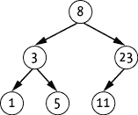

图 5-1：一个示例二叉搜索树

一个节点包含一个值（某种类型的值）和最多两个指向树中下层节点的指针，如图 5-2 所示。我们称至少有一个子节点的节点为*内部节点*，没有子节点的节点为*叶节点*。

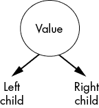

图 5-2：二叉搜索树节点的必要组成部分

树节点可能包含其他信息，具体取决于它们的用途。我们通常会存储一个指向节点父节点的指针。例如，这一额外的信息使得我们可以从树的底部向上遍历，也可以从顶部向下遍历，这在我们考虑删除节点时非常有用。

从形式上讲，我们将*二叉搜索树节点*定义为具有以下最小信息的数据结构：一个值（或键），指向两个子节点的指针（如果没有相应的子节点，可以将其中一个指针设为`null`），以及一个指向父节点的可选指针。

```py
TreeNode {
    Type: value
    TreeNode: left
    TreeNode: right
    TreeNode: parent
}
```

我们也可能希望存储辅助数据。存储和搜索单个值非常有用，但将这些值作为键来查找更详细的信息，大大增强了数据结构的功能。例如，我们可以将最喜欢的咖啡的名字作为节点的值，这样就可以高效地查找任何咖啡的记录。在这种情况下，我们的辅助数据将是关于那种咖啡的详细记录。或者，我们的值可以是时间戳，节点可以包含在那个时间点我们泡制了哪种咖啡的信息，从而让我们能够高效地查询我们的历史咖啡消费记录。树节点数据结构可以直接存储这些辅助数据，或者包含指向位于内存其他位置的复合数据结构的指针。

二叉搜索树从树顶的单一*根*节点开始，并在下降时分支成多个路径，如图 5-3 所示。这个结构允许程序通过一个单一的指针访问二叉搜索树——即根节点的位置。

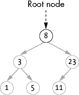

图 5-3：根节点表示二叉搜索树的顶部，是操作的起始位置。

植物学的纯粹主义者可能会将树画成根节点位于树的底部，节点向上分支，而不是像图 5-3 中那样从顶部开始。然而，这两种表示方式是等效的。实际上，无论是从上到下的图示，还是从下到上的图示，都隐藏了二叉搜索树的实际复杂性。就像链表一样，搜索树的各个节点可以分散存储在计算机的内存中。每个节点仅通过指针的强大功能和灵活性与其子节点和父节点连接。

二叉搜索树的强大功能来源于树中值的组织方式。*二叉搜索树的属性*规定：

> 对于任何节点*N*，*N*左子树中任何节点的值都小于*N*的值，而*N*右子树中任何节点的值都大于*N*的值。

换句话说，树是根据每个节点的值来组织的，如图 5-4 所示。左节点及其以下所有节点的数据值都小于当前节点的值。同样，右节点及其以下所有节点的数据值都大于当前节点的值。因此，这些值有两个作用。首先，也是最明显的，它们表示存储在该节点的值。其次，它们通过将子树划分为两个子集来定义该节点以下的树结构。

上述定义隐含地限制了二分查找树只能包含唯一值。通过相应地修改二分查找树的属性，也可以定义允许重复值的二分查找树。其他文献可能会有所不同，取决于它们是否允许重复值，以及如何处理二分查找树属性中的相等性。本章专注于不包含重复值的情况，以与我们将在本书中探索的其他索引数据结构保持一致，如跳表和哈希表，尽管所呈现的算法可以调整以处理重复值。

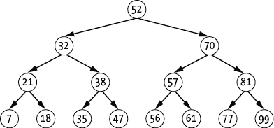

图 5-4：二分查找树中节点的值按照二分查找树的属性进行排序。

我们可以将二分查找树的结构与一个按幽默感级别组织的公共关系部门进行比较。每个员工通过一个单一的数值来衡量自己的幽默感级别，即在 30 分钟演示中的幽默插图数量。得分为 0 表示严肃的演讲者，只包括技术图表。得分为 100 或更高表示有抱负的喜剧演员，在每一张幻灯片上都加入多个笑话。整个部门围绕这个唯一的标准来组织。内部节点表示拥有一名或两名直接下属的经理。每个经理会根据自己的幽默感级别来划分他们的子团队。包含更多笑话的团队成员（*较高*的幽默感级别）进入右侧子团队。包含较少笑话的团队成员（*较低*的幽默感级别）进入左侧子团队。因此，每位经理既提供了一个分区功能，又在两个子团队之间提供了一个中间立场。

虽然节点的这种排序可能看起来没有太多结构，但请记住，通过使用类似的属性在二分查找中所获得的强大功能。二分查找树的属性实际上是保持树内的数据根据其在树中的位置进行排序。正如我们将看到的，这不仅允许我们高效地查找树中的值，还能高效地添加和删除节点。

## 搜索二分查找树

我们通过从根节点开始向下遍历二叉搜索树来进行查找。在每一步中，我们通过将当前节点的值与目标值进行比较，来决定是探索左子树还是右子树。如果目标值小于当前值，搜索就会向左进行。如果目标值大于当前值，搜索就会向右进行。因此，节点的值就像酒店里那些有用的指示牌，告诉我们 500-519 号房间在左边，520-590 号房间在右边。通过一次快速检查，我们可以做出适当的转弯，忽略另一个方向的房间。当找到目标值或者达到没有子节点的节点时，搜索结束。在后一种情况下，我们可以断定目标值不在树中。

### 迭代和递归搜索

我们可以通过迭代或递归的方式实现该搜索。以下代码使用递归方法，其中搜索函数调用自身，传入树中的下一个节点，最初调用的是树的根节点。代码返回指向包含该值的节点的指针，从而允许我们从节点中检索任何辅助信息。

```py
FindValue(TreeNode: current, Type: target):
  ❶ IF current == null:
        return null
  ❷ IF current.value == target:
        return current
  ❸ IF target < current.value AND current.left != null:
        return FindValue(current.left, target)
  ❹ IF target > current.value AND current.right != null:
        return FindValue(current.right, target)
  ❺ return null
```

该算法在每个节点只进行少量测试；如果任何测试通过，函数就返回一个值并结束。首先，代码检查`current`节点是否为`null`，这可能发生在搜索空树时。如果是`null`，则树为空，并且根据定义，不包含感兴趣的值❶。其次，如果当前节点的值等于我们的目标值，代码已经找到了感兴趣的值，并返回该节点❷。第三，代码检查是否需要探索左子树，如果需要，则返回从该探索中找到的任何内容❸。第四，代码检查是否需要探索右子树，如果需要，则返回从该探索中找到的任何内容❹。请注意，在左右两种情况下，代码还会检查对应的子节点是否存在。如果没有任何测试触发，代码就到达了一个与目标值不匹配的节点，并且在正确方向上没有子节点。它已经走到死胡同，必须通过返回失败值（如`null`）来承认失败❺。死胡同发生在没有正确方向子节点时，因此，即使是一个只有一个子节点的内部节点，在搜索中也可能是一个死胡同。

假设我们使用这种策略在图 5-5 中查找值为 63 的节点。我们从根节点开始，并将其值（50）与目标值进行比较。由于 50 小于 63，我们知道目标值不在左分支中，因为该分支的每个节点的值都小于 50。这个简单的事实让我们能够*剪枝*掉整个左子树，从而避免检查树中 22 个节点中的 11 个节点。这个测试实际上与我们在第二章中的二叉搜索算法中的剪枝类似：我们通过将单个元素与目标值进行比较，使用这个测试来剪除搜索空间的大部分区域。

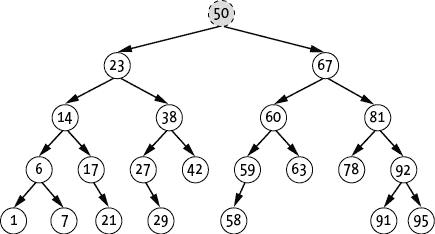

图 5-5：二叉搜索树查找的第一步。搜索从根节点开始。

我们的搜索继续沿着右子树向下，直到值为 67 的节点，如图 5-6 所示。我们再次利用二叉搜索树的性质，排除掉剩余搜索空间的一半。在这种情况下，63 小于 67，因此我们选择左子树。67 右子树中的任何内容都必须大于 67，因此不能包含 63。我们又剪枝了 5 个节点。

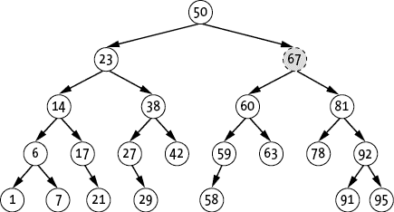

图 5-6：二叉搜索树查找的第二步

此时，我们可以对当前节点下方剩余的搜索空间做出明确的判断。由于我们在 50 处选择了右分支，在 67 处选择了左分支，我们知道新子树中的所有节点的值都大于 50 且小于 67。实际上，每次选择右分支时，我们都在收紧剩余搜索空间的下界；而每次选择左分支时，我们都在收紧上界。

搜索继续沿树向下遍历，每个阴影节点都被访问，如图 5-7 所示。在找到目标值之前，搜索经过了 22 个节点中的 4 个节点。

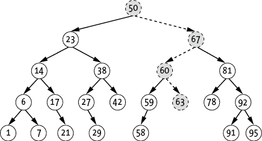

图 5-7：二叉搜索树查找值为 63 的完整路径

考虑在幽默度量组织的公共关系部门中的搜索。假设部门主管需要为一个行业会议的非正式演讲寻找一位发言人。经过一些考虑，他们确定每 30 分钟 63 个笑话的幽默水平对于这个观众最为合适。部门主管（根节点）考虑自己的幽默水平，意识到自己太严肃，因此要求他们的得力助手在助手的组织中找到合适的人选。右侧子树中的每个人都比部门主管更有幽默感。那位经理重复相同的步骤，将自己的幽默水平（67）与目标值进行比较，并将任务委派给合适的下属。

当然，搜索不需要一直进行到叶子节点。如图 5-8 所示，相关节点可能位于树的中间。如果我们搜索相同的树以查找值 14，我们会走两次左支路并最终到达合适的内部节点。这个中间层的经理完全符合我们的幽默标准，可以进行演讲。因此，在树的下降过程中，我们需要检查当前节点是否等于我们的目标值，并在找到匹配时提前终止搜索。

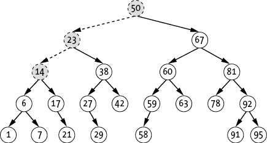

图 5-8：二叉搜索树的搜索可以在一个内部节点结束，其中该节点的值与我们的目标值匹配。

迭代方法搜索二叉搜索树，用`WHILE`循环代替递归，沿树向下迭代。搜索仍然从树的根开始。

```py
FindValueItr(TreeNode: root, Type: target):
  ❶ TreeNode: current = root
  ❷ WHILE current != null AND current.value != target:
      ❸ IF target < current.value:
            current = current.left
        ELSE:
            current = current.right
  ❹ return current
```

代码首先创建一个本地变量`current`，用于指向当前的搜索节点❶。最初，这将是根节点，在空树中可能为`null`。然后，`WHILE`循环不断遍历树，直到它遇到死胡同（`current == null`）或找到正确的值（`current.value == target`）❷。在循环中，代码检查下一个子节点应为左侧还是右侧❸，并重新将`current`指向相应的子节点。函数最终返回`current`，它可能是找到的节点，或者如果树为空或未找到值，则返回`null`❹。

递归和迭代搜索的计算成本都与目标值在树中的深度成正比。我们从树的顶部开始，沿着单一路径向下。树越深，所需进行的比较就越多。因此，结构化树以最小化其深度从而提高搜索效率。

### 树的搜索与有序数组的搜索

持怀疑态度的读者可能会抗议：“第二章已经教过我们如何在排序数据上进行高效搜索。二分查找随着数据量的增加按对数级别扩展。你们已经举过例子，为什么要把数据放在树结构里，而不是排序数组里？这样是不是增加了不必要的复杂性和开销，增加了所有这些指针？”

这些顾虑是合理的。然而，考虑数据结构和搜索如何在更广泛的上下文中使用是很重要的。如果我们的数据已经是一个排序过的数组，并且我们只需要进行一次搜索，那么构建一棵树而不是直接进行二分查找并不会带来帮助。实际上，构建树本身比进行一次线性扫描更为昂贵。同样，如果数据不发生变化，那么对数据进行一次排序并使用已排序的数组可能更为合适。这样可以避免树结构本身的内存开销。当数据变得更加动态时，权衡因素会发生变化。

假设有员工加入或离开公关部门。除了正常的文书工作，部门还需要更新其幽默水平的数据结构。每个新员工代表幽默水平列表的新增项，每个离职代表删除项。部门可以通过使用办公室分配来根据幽默水平对员工进行排序，而不是使用汇报层级。幽默感最差的人在办公室 1，幽默感最强的人在办公室 100。经理仍然可以高效地搜索到正确的发言人。然而，他们现在需要在每次新增或离职时修正办公室分配。对于一个大型部门或高频次的变动，开销会增加。在高度动态的环境中，比如待处理的餐厅订单列表，成本可能会变得相当可观。

二叉搜索树以及动态数据结构的强大之处，体现在数据*发生变化*的情况下。正如我们在接下来的章节中将看到的，二叉搜索树使得我们可以高效地添加和删除数据点。在一个排序过的数组中，每次添加或删除数据时，我们都需要不断更新数组，这会非常耗费资源。相反，二叉搜索树在数据本身发生变化时，能够保持数据处于一种易于搜索的结构。如果我们在一个动态数据集上进行大量的搜索，这种效率的结合就变得至关重要。

## 修改二叉搜索树

在使用或修改二叉搜索树时，根节点总是需要特别关注。当在树中搜索一个节点时，我们总是从根节点开始。当将第一个节点插入到树中时，比如第一个加入公关部门的人，我们将该节点作为新的根节点。正如我们将在本章稍后看到的，当从二叉树中删除一个节点时，我们必须把根节点当作特殊情况处理。

我们可以通过将整个树结构封装在一个包含根节点的轻量级数据结构中，简化使用二叉搜索树的逻辑：

```py
BinarySearchTree {
    TreeNode: root
}
```

虽然这看起来可能是浪费（更多的复杂性和额外的数据结构），但它为树提供了一个易于使用的接口，并大大简化了我们对根节点的处理。当使用包装数据结构（或类）来表示我们的二叉查找树时，我们还需要提供顶层函数来添加或查找节点。这些函数是相对简单的包装器，并且处理没有节点的树时有一个特殊情况。

为了搜索树，代码再次从检查树是否为空（`tree.root == null`）开始：

```py
FindTreeNode(BinarySearchTree: tree, Type: target):
    IF tree.root == null:
        return null
    return FindValue(tree.root, target)
```

如果树为空，它会立即返回`null`，表示搜索未找到匹配项。否则，代码会使用`FindValue`递归搜索树。这里进行`null`检查甚至可以替代`FindValue`开始时的检查，从而只需对整个树进行一次检查，而不是每个节点都检查一次。

### 添加节点

我们使用与搜索树时相同的基本算法来添加值。我们从根节点开始，像搜索新值一样向下遍历树，一旦遇到死胡同就终止：无论是叶节点还是具有单个子节点且方向错误的内部节点。我们搜索和插入算法的主要区别出现在遇到死胡同后，插入算法会在当前节点下创建一个新的子节点：如果新值小于当前节点的值，则创建一个左子节点，否则创建右子节点。

在这里，我们可以清楚地看到允许重复值的树和不允许重复值的树在行为上的区别。如果我们的树允许重复值，我们会继续向下遍历直到遇到死胡同，然后在树中插入该值的一个新副本。如果树不允许重复值，我们可能会替换或扩展匹配节点中存储的数据。例如，我们可以跟踪的一个简单辅助数据是计数器——记录该值被添加到树中的次数。下面我们重点讨论覆盖数据的情况，以便与本书中将要探讨的其他索引数据结构保持一致。

与我们的搜索函数一样，我们从一个处理空树情况的添加包装函数开始：

```py
InsertTreeNode(BinarySearchTree: tree, Type: new_value):
    IF tree.root == null:
        tree.root = TreeNode(new_value)
    ELSE:
        InsertNode(tree.root, new_value)
```

首先，代码检查树是否为空（`tree.root == null`）。如果是，它会使用该值创建一个新的根节点。否则，它会在根节点上调用`InsertNode`，从下面开始启动递归过程。这样，我们可以确保`InsertNode`是在有效（非空）节点上调用的。

下面是`InsertNode`的代码：

```py
InsertNode(TreeNode: current, Type: new_value):
  ❶ IF new_value == current.value:
        Update node as needed
        return
  ❷ IF new_value < current.value:
      ❸ IF current.left != null:
            InsertNode(current.left, new_value)
        ELSE:
            current.left = TreeNode(new_value)
            current.left.parent = current 
    ELSE:
      ❹ IF current.right != null:
            InsertNode(current.right, new_value)
        ELSE:
            current.right = TreeNode(new_value)
            current.right.parent = current
```

`InsertNode`代码首先检查是否遇到了一个值匹配的节点，如果是，则根据需要更新该节点的数据 ❶。否则，代码通过比较新值和当前节点值，按照左路径或右路径的方式搜索插入新值的正确位置 ❷。在任何情况下，代码都会检查沿着路径的下一个节点是否存在 ❸ ❹。如果下一个节点存在，代码会沿着路径继续前进，深入树中。否则，代码找到了一个死胡同，表示可以插入新节点的正确位置。算法通过创建一个新节点，链接父节点的相应子指针（`left`或`right`），并设置`parent`链接来插入节点。

例如，如果我们要将数字 77 添加到图 5-9 中的二叉搜索树中，我们会沿着节点 50、67、81 和 78 向下移动，直到在值为 78 的节点处遇到死胡同。此时，我们发现在正确方向上没有有效的子节点。我们的搜索遇到死胡同。我们创建一个值为 77 的新节点，并将其设置为节点 78 的左子节点。

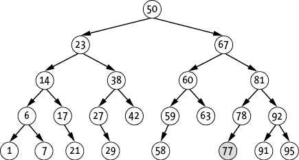

图 5-9：将值 77 插入到我们的二叉搜索树中

向树中插入新节点的成本再次与我们插入新节点的分支深度成正比。我们会在路径上每个节点进行一次比较，直到到达死胡同，像搜索操作一样，我们会忽略其他分支中的所有节点。因此，插入操作的最坏情况成本将与树的深度成线性关系。

### 删除节点

从二叉搜索树中删除节点比添加节点更复杂。删除节点有三种情况需要考虑：删除叶子节点（没有子节点）、删除一个只有一个子节点的内部节点、删除一个有两个子节点的内部节点。正如你所预期的，随着子节点数量的增加，任务变得更加复杂。

要删除叶子节点，我们只需删除该节点，并更新其父节点的子指针，以反映该节点不再存在的事实。这可能会使父节点变成叶子节点。例如，要删除图 5-10 中的节点 58，我们只需删除节点 58，并将其父节点的左子指针设置为`null`。

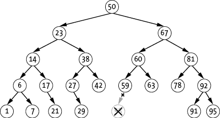

图 5-10：通过删除叶子节点并更新其父节点的指针，来从二叉搜索树中移除叶子节点。

删除叶节点展示了存储父节点指针的价值：它使我们能够查找要删除的节点，沿父指针回溯到该节点的父节点，并将相应的子指针设置为 `null`。存储这一个额外的数据，使得删除操作变得更简单。

在我们公关部门的示例中，被删除的叶节点对应的是一位没有直接下属的员工离职。告别派对和蛋糕过后，组织的其余部分继续工作。层级结构唯一的变化是，前员工的上司少了一个团队成员。实际上，他们现在可能没有下属了。

如果目标节点有一个子节点，我们通过将该唯一子节点提升为被删除节点父节点的子节点来移除它。这就像是从我们的汇报层级中移除一位经理而不调整其他人。当经理离开时，他们的上司接管了该前员工的唯一直接下属。例如，如果我们想从示例树中删除节点 17，我们可以简单地将节点 21 上移，取而代之，如图 5-11 所示。现在，节点 14 直接连接到节点 21。


图 5-11：通过改变指针（左侧）并将该子节点上移（右侧）来删除具有单个子节点的内部节点。

这种删除单子节点的方式即使我们上移的节点本身有子树也有效。由于被上移的节点已经在父节点的子树中，它的所有后代将继续遵循二叉搜索树的特性。

当我们尝试删除具有两个子节点的内部节点时，复杂性显著增加。单纯删除节点或将一个子节点上移已经不够了。在我们公关部门，一个节点的两个子节点代表了两个性格迥异、幽默感不同的员工。我们不能只是选择一个子节点进行提升，而让另一个不小心从层级中消失，失去通过脆弱的指针链条与根节点的连接。我们必须保持树的完整性，并确保它继续遵循二叉搜索树的特性。

要删除一个有两个子节点的节点，我们用树中的另一个节点替换该节点，以保持二叉搜索树的性质。我们通过找到要删除节点的*后继*来做到这一点——这是我们按排序顺序遍历节点时会遇到的下一个节点。我们将后继节点交换到删除节点的位置。这个交换的节点可能也有一个子节点，当它从原位置移除时需要处理。为了在不破坏任何指针的情况下从二叉树中移除后继节点，我们对要交换的节点重新使用删除程序。我们找到后继节点，保存指向该节点的指针，然后将其从树中移除。

例如，如果我们想删除图 5-12 中的值 81，我们需要首先交换值为 91 的节点。我们通过保存指向要删除节点和后继节点的指针来做到这一点（见图 5-12(1)）。然后，我们将后继节点设置为被删除节点父节点的子节点（见图 5-12(2)）。最后，我们将后继节点的子节点更新为被删除节点的子节点，实际上就是将其交换到该位置（见图 5-12(3)）。

为了执行删除操作，我们需要能够高效地找到节点的后继。虽然这看起来是一个艰巨的任务，但我们有一个关键的优势。由于我们只考虑节点有两个子节点的情况，我们始终可以在节点的右子树中找到后继节点。具体来说，后继节点是右子树中最小的（或最左边的）节点。作为额外好处，后继节点保证最多只有一个（右侧）子节点。如果候选后继节点有一个左子节点，那么这个左子节点（或其左子树中的某个节点）才是实际的后继。


图 5-12：为了移除一个有两个子节点的内部节点，我们首先将节点的后继交换到该位置。

清单 5-1 提供了（虽然冗长）伪代码，演示了如何从二叉搜索树中删除我们刚刚讨论的三种类型的节点。也可以实现更简短的代码。然而，明确地分解这些情况有助于展示其中的复杂性。还需要注意的是，我们通过节点的指针而不是值来删除节点。因此，为了删除具有给定值的节点，我们首先使用 `FindTreeNode` 查找该节点的指针，然后用该指针调用删除操作。

```py
RemoveTreeNode(BinarySearchTree: tree, TreeNode: node):
  ❶ IF tree.root == null OR node == null:
        return

    # Case A: Deleting a leaf node.
  ❷ IF node.left == null AND node.right == null:
        IF node.parent == null:
            tree.root = null
        ELSE IF node.parent.left == node:
            node.parent.left = null
        ELSE:
            node.parent.right = null
        return

    # Case B: Deleting a node with one child.
  ❸ IF node.left == null OR node.right == null:
      ❹ TreeNode: child = node.left
        IF node.left == null:
            child = node.right

      ❺ child.parent = node.parent
        IF node.parent == null:
            tree.root = child
        ELSE IF node.parent.left == node:
            node.parent.left = child
        ELSE:
            node.parent.right = child
        return

    # Case C: Deleting a node with two children.
    # Find the successor and splice it out of the tree.
  ❻ TreeNode: successor = node.right
    WHILE successor.left != null:
        successor = successor.left
    RemoveTreeNode(tree, successor)

    # Insert the successor in the deleted node's place.
  ❼ IF node.parent == null:
        tree.root = successor
    ELSE IF node.parent.left == node:
        node.parent.left = successor
    ELSE:
        node.parent.right = successor
  ❽ successor.parent = node.parent

  ❾ successor.left = node.left
    node.left.parent = successor

    successor.right = node.right
    IF node.right != null:
        node.right.parent = successor
```

清单 5-1：从二叉搜索树中移除一个节点

与插入和查找的包装函数一样，代码首先检查树是否为空 ❶，如果是，则返回`null`。它还检查是否有有效的节点可以删除（`node != null`），这在我们希望将查找和删除合并成一行时非常有用：

```py
RemoveTreeNode(tree, FindTreeNode(tree, target))
```

由于 `FindTreeNode` 在找不到节点时返回 `null`，我们显式地处理此情况。

然后，代码按顺序考虑三种情况。在 A 情况下，当移除的是叶子节点 ❷ 时，代码只需要更改被删除节点父节点的正确子指针。首先，代码检查要删除的节点是否有父节点。如果没有，代码正在删除根节点本身，并将根节点指针修改为 `null`，从而有效地删除根节点。如果删除的节点是父节点的左子节点，代码将该指针设置为 `null`。同样，如果删除的节点是父节点的右子节点，代码也会将该指针设置为 `null`。然后，代码可以返回，成功地将目标叶子节点从树中删除。

在 B 情况下，删除一个只有一个子节点的节点 ❸，代码首先通过检查哪个子指针不是 `null` ❹ 来确定节点的哪个子指针指向该子节点。代码存储该子节点的指针以供后续使用。接下来，它修复新晋升节点与其新父节点之间的指针 ❺。代码将子节点的父指针设置为其之前的祖父节点，将被删除的节点从树中剪接出去，向上修复。最后，代码修复被删除节点父节点中的正确子指针，包括处理根节点变化的特殊情况。代码将先前指向被删除节点的指针重定向，指向该节点的唯一子节点。如果被删除的节点没有父节点，说明正在处理根节点，需要相应地修改指针。一旦代码完成了正确节点的剪接，它便返回。

在 C 情况下，当要删除的节点有两个子节点时，代码首先确定后继节点，并将其从树中移除 ❻。请注意，如上所述，递归调用 `RemoveTreeNode` 本身无法触发 C 情况，因为后继节点最多只有一个（右子）节点。即使在将后继节点从树中移除后，代码仍会保持对该后继节点的指针，因为它将使用该节点替换被删除的节点。接下来，代码通过以下一系列步骤将被删除的节点替换为后继节点：

1.  修改被删除节点的父节点，将正确的子指针指向后继节点 ❼。

1.  修改后继节点的父指针，使其指向新的父节点 ❽。

1.  设置继承节点的左右子节点的链接❾。处理右子节点时，代码需要额外小心，因为它有可能已经通过上面的`RemoveTreeNode`操作删除了该子节点（当继承节点是`node`的直接右子节点时）。因此，在尝试分配右子节点的父指针之前，它需要检查右子节点是否为`null`。

根据编程语言及代码的使用方式，我们也可能希望在删除过程中将`node`的出边指针设置为`null`。这样可以清理从已删除节点到树中其他节点的引用。我们可以通过在每个三种情况的末尾（在 A 和 B 情况中的`return`语句之前，以及 C 情况中的函数结束之前）添加以下几行代码来实现：

```py
node.parent = null
node.right = null
node.left = null
```

与搜索和插入一样，删除操作最多需要沿一条路径从上到下遍历树。在 A 和 B 情况下，这一遍历发生在`RemoveTreeNode`函数之前（作为之前调用`FindTreeNode`获取节点指针的一部分）。C 情况则增加了从内部节点到其继承节点的额外遍历。因此，删除操作的最坏运行时间仍然与树的深度成正比。

## 不平衡树的危险

在*完全平衡*的二叉搜索树上进行搜索、添加和删除操作的时间，在最坏情况下与树的深度成正比，这使得这些操作在树的深度不过大的情况下非常高效。完全平衡的树是指在每个节点处，右子树和左子树的节点数相等。在这种情况下，每次我们将树中的节点数加倍，树的深度都会增加 1。因此，在平衡树中，所有三种操作的最坏性能都与 log2 成正比，其中*N*是元素数量的对数。

二叉搜索树在树形大致平衡时仍然高效，即使不完全平衡。但如果树变得极度不平衡，树的深度可能会随元素数量线性增长。实际上，在极端情况下，我们的优秀二叉搜索树变成了一个排序链表——所有节点都有一个子节点，并且方向相同，如图 5-13 所示。


图 5-13：一个不平衡的二叉搜索树示例

在许多现实世界的应用中，很容易出现高度不平衡的树。假设我们正在将咖啡日志存储在一个按时间戳索引的二叉搜索树中。每次喝一杯咖啡时，我们就将相关信息插入到树中。事情很快就变得糟糕。由于时间戳是单调递增的，我们按排序顺序插入每一条记录，结果仅使用右子节点指针创建了一个链表。

对于一个不平衡的树，操作可能会非常低效。考虑一个包含*N*个节点的树。如果我们的树是平衡的，那么操作的时间复杂度是*N*的对数级别。相反，在树变成链表的情况下，操作的时间复杂度将是与*N*成线性关系。

我们可以使用多种增强技术，如红黑树、2-3 树和 B 树，来保持树在动态插入和删除过程中保持平衡。这些方法的权衡是树操作的复杂性增加。我们将在第十二章中详细讨论 B 树，并展示它们的结构如何保持树的平衡。

下一节介绍了一种直接的构建平衡二叉搜索树的方法，利用*批量构建*，允许算法选择哪些节点来分割数据，以平衡每一侧的节点数。当我们手头有许多值，但需要小心未来的插入时，这是一个不错的选择，因为插入可能会导致树的不平衡。

## 二叉搜索树的批量构建

我们可以通过迭代地添加节点轻松构建一个二叉搜索树：首先创建一个新的节点并将其标记为根节点，然后对于每个剩余的值，创建一个新节点并将其添加到树中。这种方法的优点是简单并且复用了我们之前定义的算法。不幸的是，这种方法可能会导致树的不平衡。正如我们之前看到的，如果我们按排序顺序添加值，最终会得到一个排序好的链表。我们可以在从初始的数字集创建树时做得更好。

我们通过递归地将元素分割成更小的子集，从排序数组（如图 5-14 所示）中创建平衡的二叉搜索树。在每一层，我们选择中间值作为该层的节点。如果元素个数为偶数，我们可以选择两个中间元素中的任意一个。


图 5-14：用于批量构建二叉搜索树的排序数组

我们创建一个新节点，节点的值等于数组中的中间元素，并将剩余的元素分配到两个子节点中，如图 5-15 所示。我们使用相同的过程为每个子节点递归地创建子树。小于中间元素的值放到左侧，而较大的值放到右侧。


图 5-15：第一次拆分后，我们有一个单一的节点和两个独立的数组。

我们不需要在每次拆分时创建输入数组的新副本。相反，我们可以借鉴二叉搜索算法的思路，只需跟踪当前考虑中的数组范围，如图 5-16 所示。每次拆分将数组分成一致的两半，因此我们只需关注两个边界：当前分支中最高和最低值的索引。

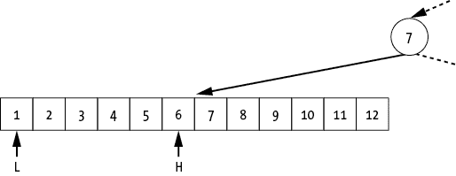

图 5-16：可以使用高低索引来跟踪当前考虑中的数组子集。

一旦我们创建了新节点，就可以使用相同的方法独立构建左右子树。具体来说，我们选择中间值，从该值创建一个新节点，划分剩余的范围，并利用这些范围来创建子树。当我们的范围中只剩下一个值时，过程结束。在这种情况下，我们创建一个包含该值且没有子节点的新叶节点。

## 为什么这很重要

二叉搜索树展示了我们如何将动态数据结构适应特定问题。这些树使用分支结构来捕捉并维护数据值中的顺序信息，从而实现高效搜索。此外，二叉搜索树的基于指针的结构使其能够在新数据被添加时持续适应。这种数据、问题和计算的相互作用为我们解决越来越复杂的计算挑战提供了基础。

在后续章节中，我们将继续构建动态数据结构的概念，将数据结构根据问题本身进行适配，并使用分支数据结构来实现高效的剪枝。这些技术出现在多种不同的数据结构中。理解这些基础知识，特别是这些技术如何在动态二叉搜索树中实现高效搜索，对于理解如何处理更复杂的数据结构和算法至关重要。下一章将介绍字典树（trie），展示如何将二叉搜索树的基于树的概念扩展到多叉分支，以提高某些类型搜索的效率。
