## 第十二章：B 树


第十一章展示了内存访问成本如何在不同介质之间有所不同。在本章中，我们将讨论这个问题如何超越访问单个值的成本，延伸到访问新数据块的成本，并引入一种新的数据结构来处理这种情况。

计算机科学中有很多实例，其中访问块内的数据是廉价的，但检索新块却相对昂贵。计算机可能会从硬盘读取整个信息块，称为*页面*，并将其存储在内存中。在软盘时代的电子游戏中，你可能会看到一条消息，指示你“插入第 5 张磁盘（共 7 张）”，或者等待游戏从 CD 中加载下一块数据。类似地，在线应用程序可能会从互联网服务器下载一致的数据块，使你可以在未下载完整个视频的情况下开始观看。

本章介绍了*B 树*，一种自平衡的基于树的数据结构，由计算机科学家鲁道夫·贝尔（Rudolf Bayer）和爱德华·麦克雷（Edward McCreight）设计，用于应对检索新数据块的成本。B 树将多个数据项存储在单个节点中，使我们只需为提取所有这些值支付一次昂贵的检索成本。一旦节点进入本地内存，我们可以迅速访问其中的值。其权衡是，在处理节点时增加了额外的复杂性。

在计算领域，我们在尝试为庞大的数据集建立索引时，可能会遇到这个问题。考虑一下一个字面上天文数字般的数据集的索引，它包含指向每颗星星、星系、星云、彗星、小行星和其他天体图像的指针。数据集仍然比索引大，但索引本身可能需要分布在多个慢速存储块中。B 树提供了一种创新的方法来结合索引和键，同时最小化检索成本。

B 树也是如何定义树的操作，以确保它们不会变得极度不平衡的一个例子。正如我们稍后将在本章中看到的，B 树始终保持完全平衡，所有叶节点都在相同的深度上。

## B 树结构

B 树采用我们在字典树或四叉树中看到的多路分支结构来存储单个键。实际上，这意味着它们允许内部节点有超过两个的分支，因此它们实际上充满了指针。它们还需要在每个节点中存储多个键。B 树节点充满了键，使它们既能跟踪多路分区，又能最大限度地提高通过提取单个节点来检索数据的效率。

我们可以在日常的在线购物场景中看到将多个物品打包进一个节点的好处。每个包裹的运输都会产生一定费用，如果我们发送许多小包裹，费用会迅速累积。这就相当于从昂贵的存储中检索多个小的树节点。但是，如果我们将多个物品放进同一个包裹，就可以通过一起运输来降低费用。同样，B 树通过将多个键一起检索来减少检索成本。

在形式上，我们定义 B 树节点的大小参数为*k*，它提供了非根节点可以存储的元素数量的界限。所有非根节点存储介于*k*与 2*k*之间的排序键。根节点更加灵活，允许包含介于 0 到 2*k*之间的键。像二叉搜索树一样，内部节点使用这些键的值来定义分支的范围。内部节点为每个可能的分割点存储指针，分割点位于节点中每个键的前后，从而使得除根节点外的所有内部节点可以拥有介于*k* + 1 和 2*k* + 1 之间的子节点，而根节点可以有介于 0 到 2*k* + 1 之间的子节点。这些分割点的概念与我们在二叉搜索树中做的事情相同——它们将空间划分为分割点前后的键。

图 12-1 展示了这种结构的一个例子。包含键 12、31 和 45 的节点定义了四个不同的区间：在 12 之前的键、在 12 和 31 之间的键、在 31 和 45 之间的键、以及在 45 之后的键。包含 13、17 和 26 的子树由父节点中的两个分割点定义。该节点中的所有键都必须大于 12，因为它们的子节点指针指向键 12 的右边。同样，所有的键都必须小于 31，因为指针指向键 31 的左边。


图 12-1：一个 B 树示例

设想这个结构应用于“全面有趣且富有信息的收藏品博物馆”的索引系统。为了实现动态的收藏，我们将每个物品的索引条目存储在一张小纸卡上，卡片上有物品名称、简短描述和在我们庞大收藏品仓库中的位置。我们可以将九百张卡片放入一个文件夹中，因此，对于我们一亿件物品的收藏，至少需要十万个文件夹来存储整个索引。

虽然我们希望将整个索引本地存储，但我们的办公室空间实在不足。一旦我们申请并取回了一个包含索引片段的文件夹，我们可以相对轻松地浏览其条目。然而，每次申请新的文件夹都需要前往档案馆并填写申请表。

在这种组织方案中，每张索引卡对应 B 树中的一个条目，其中名称字符串是键。绑定器对应于 B 树节点，每个节点有 900 个口袋，因此最多可容纳 900 个键。绑定器中的条目按排序顺序排列，使我们可以通过线性扫描或二分查找来搜索键。此外，我们在每个绑定器的口袋中存储一个额外的数据项，即指向另一个绑定器的指针，该绑定器包含当前索引卡的键和前一张索引卡的键之间的条目。如 图 12-2 所示，如果我们正在寻找目标“Caffeine Unlimited 咖啡杯”，我们首先会扫描经过“Caffeine Ten 咖啡杯”，它在字母顺序上排在目标之前，然后会遇到“Jeremy’s Gourmet High-Caffeine Experience”，它排在目标之后。此时，我们已经越过了目标键的潜在位置，并知道需要搜索当前条目前的绑定器。

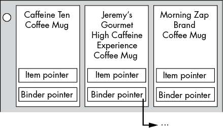

图 12-2：我们索引卡中的绑定指针指示应使用哪个绑定器来继续搜索。

我们在绑定器的最末尾存储一个额外的指针，该指针指向另一个绑定器，包含当前绑定器中最后一个键之后的所有键。总的来说，我们的绑定器最多可以包含 900 个键（以及它们指向相关收藏品的指针）和 901 个指向其他绑定器的指针。

与其他基于树的数据结构一样，我们通过一个顶级复合数据结构和一个节点特定数据结构来定义 B 树结构：

```py
BTree {
    BTreeNode: root
    Integer: k
}

BTreeNode {
    Integer: k
    Integer: size
    Boolean: is_leaf
    Array of Type: keys
    Array of BTreeNodes: children
}
```

在此数据结构和以下示例中，我们存储和检索单个键以保持代码简洁。与我们之前介绍的其他数据结构一样，在大多数情况下，存储一个包含键和指向该键数据的指针的复合数据结构（例如 图 12-2 中的项目指针）会更有用。

B 树结构的一个复杂之处在于，我们将键和子节点存储在两个不同大小的数组中。这意味着我们需要定义如何将索引 *i* 处的键映射到其相邻的子节点指针。对于任何给定的索引 *i*，我们可以访问 *keys*[*i*] 处的键，但我们还需要能够访问该键之前和之后的节点指针。我们定义指针，使得 *children*[*i*] 处的所有键值都小于 *keys*[*i*]，并且大于 *keys*[*i* *−* 1]（如果 *i* > 0），如 图 12-3 所示。

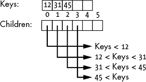

图 12-3：键数组条目与子数组对应元素的映射

根据定义，B 树是平衡的数据结构。每个叶子节点距离根节点的深度完全相同。在后面的章节中，我们将展示如何通过更新节点来保持这一结构，以便在插入和删除新键时进行维护。

## 搜索 B 树

我们使用与所有基于树的数据结构相同的一般程序来搜索 B 树：从树的顶部开始，逐层向下查找，直到找到感兴趣的键。B 树与二叉搜索树的主要区别在于，我们可能需要每个节点检查多个键。我们在每个节点中沿着键进行扫描，直到找到目标键或找到一个值大于目标键的键。在后一种情况下，如果我们处于内部节点，则会下降到适当的子节点并继续搜索，具体如下：

```py
BTreeSearch(BTree: tree, Type: target):
    return BTreeNodeSearch(tree.root, target)

BTreeNodeSearch(BTreeNode: node, Type: target):
    # Search the node's key list for the target.
    Integer: i = 0
  ❶ WHILE i < node.size AND target >= node.keys[i]:
      ❷ IF target == node.keys[i]:
            return node.keys[i]
        i = i + 1

    # Descend to the correct child.
  ❸ IF node.is_leaf:
        return null
  ❹ return BTreeNodeSearch(node.children[i], target)
```

这段搜索代码首先通过使用`WHILE`循环 ❶扫描当前节点中存储的键。循环会持续直到遇到键列表的末尾（`i == node.size`）或遇到比目标值大的键（`target < node.keys[i]`）。代码检查是否在当前节点中找到了匹配的键，如果找到了，就返回该键 ❷。虽然示例代码使用线性扫描来搜索节点以简化示例，但我们也可以使用二分搜索来提高效率。

如果代码在当前节点中没有找到匹配项且当前节点是叶子节点，则树中没有匹配项，代码返回`null` ❸。否则，代码会递归地探索正确的子节点。由于循环停止的条件是`i`表示最后一个子节点或`key[i] > target`，它可以通过循环迭代器`i`直接访问正确的子节点 ❹。

考虑之前在图 12-1 中展示的 B 树搜索键 17 的示例。在根节点，我们检查第一个键（51），发现它大于 17，因此使用第一个子节点指针下降一级。在下一层，我们检查两个键：12 小于目标键，因此继续跳过它；31 大于目标键，因此通过第二个子节点指针下降到键值小于 31 的子节点。这个过程在叶子节点继续进行。图 12-4 展示了这一搜索过程，用灰色标示出我们已访问并比较过的数组单元。


图 12-4：B 树的搜索示例。被阴影标记的单元格是算法检查过的单元格。

我们应该考虑搜索节点内的密钥如何影响运行时：与在单次比较后下移到下一层不同，我们现在可能需要在每个节点执行多个比较。这是一个可接受的权衡，原因有二。首先，记住 B 树是为了减少提取节点的数量而优化的。相比之下，节点内的数据访问预计是相对便宜的，因为它们发生在本地内存中，并不需要我们从昂贵的存储中提取另一个数据块。其次，同样重要的是，B 树的分支结构仍然提供了足够的修剪机会。每次比较仍然会消除整个子树。而且，与当前节点一样，每个被跳过的节点最多可以包含 2*k* 个密钥和 2*k* + 1 个子节点。

回到我们的收藏品示例，考虑查找某个特定的收藏品。我们从根目录文件夹开始。由于密钥按字母顺序存储，我们可以快速地扫过行，直到找到我们想要的密钥，或者经过它应该在的位置。如果我们没有看到目标密钥，我们就知道它不在这个文件夹里。我们嘟囔着对有限存储空间的不满，并注意到我们遇到的第一个紧跟目标密钥的密钥指针显示为“文件夹 #300”。我们又嘟囔了几句抱怨，并请求档案管理员提供文件夹 #300。

让我们将这种存储方法与如果我们将所有索引卡按排序顺序存储时的情况进行对比。文件夹 #1 包含从 *Aa* 到 *Ab* 的第一组卡片，文件夹 #2 包含 *Ac* 到 *Ad* 的卡片，以此类推。这对于静态数据集可能效果很好。我们可以对文件夹执行二分查找，每次请求当前范围内的中间文件夹，并将请求限制在对数数量的请求内。然而，随着我们添加或删除卡片，这种方法开始出现问题。文件夹变得过满，要求我们将卡片从一个文件夹转移到下一个文件夹。我们的收藏更新可能需要对许多文件夹进行级联更新，因为卡片必须被转移。最坏的情况下，如果我们将文件夹装得满满的，我们可能需要访问索引中的每个文件夹。正如我们接下来会看到的，B 树结构有助于数据集的动态变化。

## 添加密钥

向 B 树中添加密钥比向我们之前考虑的基于树的数据结构中添加密钥更为复杂。在这种情况下，我们需要保持结构的平衡，并限制每个节点中存储的密钥数量（在*k*到 2*k*之间）。有两种方法可以处理满节点。首先，我们可以在树的过程中进行分裂，确保我们永远不会在满节点上调用插入操作。其次，我们可以暂时插入到一个满节点中（允许它过满），然后在回溯时对其进行分裂。我们将探讨后者方法，它产生了一种两阶段算法来插入新密钥。

执行插入时，我们首先沿着树向下，寻找插入新键的位置。其次，我们沿树向上返回，拆分那些已满的节点。每次拆分都会增加节点的分支因子，但不一定增加树的高度。事实上，只有在拆分根节点时，树的高度才会增加，因为我们通过拆分根节点（同时将每个叶子深度增加 1）来增加高度，因此我们可以保证树始终保持平衡。

### 加法算法

在算法的第一阶段，我们递归地下降树，寻找插入新键的正确位置。如果在此过程中找到匹配的键，我们可以更新该键的数据。否则，我们继续向下直到叶子节点，在那里我们将键插入到数组中。

我们首先定义一个简单的辅助函数`BTreeNodeAddKey`，用于向一个未满的节点插入键。为了方便起见，我们还传入一个指向子节点的指针（表示新键之后的子节点），这样我们就可以在拆分节点时重用该函数。如果我们当前在叶子节点中（叶子节点不存储指向子节点的指针），则忽略这个`next_child`指针。

```py
BTreeNodeAddKey(BTreeNode: node, Type: key, 
                BTreeNode: next_child):
  ❶ Integer: i = node.size - 1
    WHILE i >= 0 AND key < node.keys[i]:
        node.keys[i+1] = node.keys[i]
        IF NOT node.is_leaf:
            node.children[i+2] = node.children[i+1]
        i = i - 1

 # Insert both the key and the pointer to the child node.
  ❷ node.keys[i+1] = key
    IF NOT node.is_leaf:
        node.children[i+2] = next_child
  ❸ node.size = node.size + 1
```

代码从`keys`数组的*末尾*（索引`node.size – 1`）开始，使用`WHILE`循环向索引 0 方向推进❶。每一步，它检查新键是否应当插入此处，如果不插入，则将`keys`和`children`数组中的当前元素都向后移动一个位置。循环在移动超过正确位置（可能是数组的起始位置）时终止。一旦找到新键的正确位置，我们已经将新键和后续元素移开了位置。我们可以直接插入新键和子元素❷。代码最后通过调整节点的大小来处理插入❸。

在这里，我们可能会因需要线性地将数组中的元素向下移动以为新元素腾出空间而感到失望，如图 12-5 所示。这就是我们在第三章中提到的所有问题。但请记住，我们是在用这些（有限的）线性成本来最小化节点访问。我们愿意忍受将卡片从文件夹中移开的麻烦，以最小化以后向其他文件夹请求数据的次数。


图 12-5：在`BTreeNodeAddKey`中移动元素以插入 26

我们需要一些额外的辅助函数来处理节点已满的情况。请记住，我们每个节点最多只能包含 2*k*个元素——超过这个数量就需要拆分节点。首先，我们定义一个简单的访问器函数`BTreeNodeIsOverFull`，该函数返回一个布尔值，指示节点是否包含超过 2*k*个元素：

```py
BTreeNodeIsOverFull(BTreeNode: node):
    return node.size == (2 * node.k + 1)
```

这相当于检查我们是否已经用完了文件夹中的所有口袋。

我们还添加了一个第二个辅助函数`BTreeNodeSplit`，该函数接收一个节点和一个子节点的索引，并分裂该子节点。该索引之前的所有内容保留在原始子节点中。该索引之后的所有内容从子节点中清除并添加到新创建的兄弟节点中。索引处的键从子节点中清除并添加到当前（父级）节点中。

```py
BTreeNodeSplit(BTreeNode: node, Integer: child_index): 
  ❶ BTreeNode: old_child = node.children[child_index]
    BTreeNode: new_child = BTreeNode(node.k)
    new_child.is_leaf = old_child.is_leaf

    # Get the index and key used for the split.
  ❷ Integer: split_index = Floor(old_child.size / 2.0)
    Type: split_key = old_child.keys[split_index]    

    # Copy the larger half of the keys (and their children) to 
    # new_child and erase them from old_child.
    Integer: new_index = 0
    Integer: old_index = split_index + 1
  ❸ WHILE old_index < old_child.size:
        new_child.keys[new_index] = old_child.keys[old_index]
        old_child.keys[old_index] = null

        IF NOT old_child.is_leaf:
            new_child.children[new_index] = old_child.children[old_index]
            old_child.children[old_index] = null
        new_index = new_index + 1
        old_index = old_index + 1

    # Copy the remaining child (after the last key).
  ❹ IF NOT old_child.is_leaf:
        new_child.children[new_index] = old_child.children[old_child.size]
        old_child.children[old_child.size] = null

    # Remove the key at index and add it to the current node.
  ❺ old_child.keys[split_index] = null
  ❻ BTreeNodeAddKey(node, split_key, new_child)

    # Update the sizes of the nodes.
  ❼ new_child.size = old_child.size - split_index - 1
    old_child.size = split_index
```

`BTreeNodeSplit`的代码首先查找需要分裂的节点（`old_child`），并创建一个新的（空的）兄弟节点（`new_child`）❶。该节点将与要分裂的子节点位于同一层级，因此我们复制`is_leaf`的值。接下来，代码确定用于`old_child`的分裂点的索引和值❷。然后，代码使用`WHILE`循环将`old_child`中`split_index`之后的所有内容从`keys`和`children`复制到`new_child`中的相应数组❸。代码使用一对索引来捕获旧位置的索引（`old_index`）和相应的新位置（`new_index`）。与此同时，代码通过将条目设置为`null`来从`old_child`的数组中删除这些元素。由于`children`数组比原来长一个元素，我们需要单独复制最后一个元素❹。最后，我们删除`split_index`处的键❺，将`split_key`和新的子节点指针添加到当前节点❻，并设置两个子节点的大小❼。

让我们在图 12-6 所示的收藏品存储索引的上下文中查看这个操作。当一个文件夹达到容量时，我们将其内容重新分配到两个文件夹中。首先，我们购买一个新的空文件夹。这个兄弟文件夹将存储约一半的超满文件夹内容。其次，我们小心地将超满文件夹的后半部分内容移动到新的文件夹中，同时保持已排序的顺序。第三，我们移除包含每个文件夹之间键的单个索引卡片，并将其插入到父级文件夹中，以指示两个子文件夹之间的划分。之前超满的子文件夹将包含键小于此分割的卡片，而新的文件夹将包含键大于此分割的卡片。

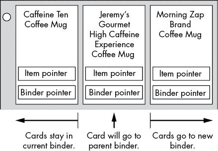

图 12-6：我们通过在中间卡片的键上进行分割来重新分配文件夹。

有了这些辅助函数，我们现在可以定义一个插入函数，该函数执行递归搜索和随后的添加。我们在叶节点执行添加操作。随着递归从树中返回，我们检查最近访问的子节点是否已满，因此需要分裂。

```py
BTreeNodeInsert(BTreeNode: node, Type: key):
    Integer: i = 0
  ❶ WHILE i < node.size AND key >= node.keys[i]:
      ❷ IF key == node.keys[i]:
            Update data.
            return
        i = i + 1

    IF node.is_leaf:
      ❸ BTreeNodeAddKey(node, key, null)
    ELSE:
      ❹ BTreeNodeInsert(node.children[i], key)
      ❺ IF BTreeNodeIsOverFull(node.children[i]):
          ❻ BTreeNodeSplit(node, i)
```

代码首先通过查找`keys`数组中`key`的正确位置来开始 ❶。`WHILE`循环遍历数组，直到到达键列表的末尾（`i == node.size`）或遇到一个比目标键大的键（`key < node.keys[i]`）。如果代码找到精确匹配，它会更新该键的数据并返回 ❷。否则，它需要插入新数据。

如果密钥被插入到叶子节点中，代码会使用`BTreeNodeAddKey`函数 ❸，该函数会移动数组元素并将新密钥插入到正确的位置。如果密钥被插入到内部节点中，索引`i`提供了插入的正确子节点指针。代码会递归地将密钥插入到该子节点 ❹，然后检查插入操作是否破坏了 B 树的性质（特别是节点的大小是否在*k*和 2*k*之间） ❺。

如果代码在一个节点中插入太多元素，它就会破坏 B 树的性质。我们可以使用辅助函数`BTreeNodeIsOverFull`来检查最近修改的节点是否包含过多元素。代码从父节点开始进行这个检查，因此我们可以保持修复 B 树的逻辑简单。它使用`BTreeNodeSplit`将过满的子节点拆分为两个节点 ❻。在这个插入过程中，我们可能会在插入新的分隔键时破坏当前节点，但没关系；我们会在返回到该节点的父节点时处理它。

我们使用了稍微多一点的存储空间，以简化代码。代码允许一个节点暂时过满，存储 2*k* + 1 个键和 2*k* + 2 个子节点，同时等待其父节点调用`BTreeNodeSplit`。我们可以通过简单地为键和子节点分配足够大的数组来创建这个缓冲区。

我们可以将代码的第一阶段看作是为我们的收藏添加一个新的咖啡杯。我们为这个咖啡杯创建一个索引卡，并将其插入到我们的索引文件夹中。我们从根文件夹开始，寻找插入卡片的位置。在搜索过程中，我们跟随适当的指针进入子文件夹。一旦到达叶子文件夹，且索引卡上没有标明的子文件夹，我们就将新卡片添加到这里。我们检查文件夹是否已满，如果已满，则开始重新分配其内容。之后，我们将文件夹按请求的顺序反向返回存储。如果我们刚刚拆分了一个文件夹并将新卡片转移到其父文件夹中，我们还需要检查是否需要拆分父文件夹。这个过程会一直继续，直到我们返回到根文件夹。

我们需要为根节点定义一个额外的特殊情况。请记住，拆分根节点是唯一允许我们增加树的高度的方法。我们需要定义一个包装函数来完成这个操作。幸运的是，我们可以重用之前的辅助函数：

```py
BTreeInsert(BTree: tree, Type: key): 
  ❶ BTreeNodeInsert(tree.root, key)

  ❷ IF BTreeNodeIsOverFull(tree.root):
      ❸ BTreeNode: new_root = BTreeNode(tree.k)
        new_root.is_leaf = False
        new_root.size = 0

      ❹ new_root.children[0] = tree.root
      ❺ BTreeNodeSplit(new_root, 0)
      ❻ tree.root = new_root
```

代码开始时通过`BTreeNodeInsert` ❶将`key`插入根节点。此函数递归地遍历树，找到正确的位置插入新键，并通过各层返回，修复除了根节点之外的所有节点的 B 树性质。然后，代码通过对根节点使用`BTreeNodeIsOverFull` ❷检查根节点是否有太多元素。如果根节点的元素太多，代码会通过创建一个新的空根节点来为树添加一层 ❸，并将旧根节点指定为新根的第一个子节点 ❹，分裂这个（过满的）子节点 ❺，并更新树的根 ❻。分裂后，新根节点将包含一个键和两个子节点。

在插入键的过程中，我们完成了一次从根节点到叶节点再返回的单一往返。我们需要访问（并修改）的节点数量与树的深度成正比。由于我们的 B 树始终保持平衡，所有叶节点都处于相同的深度，并且所有非根内部节点的分支因子至少为*k* + 1，因此节点的检索在*N*中呈对数增长。总的工作量还包括节点内部的线性操作，比如复制或移动键，因此所需的总工作量与*k* × log*k*成正比。

### 添加键的示例

让我们考虑几个例子，以更好地理解我们刚才介绍的功能。首先，拿最简单的情况来讲解，如图 12-7 所示，在一个不会过满的叶节点中添加键。假设*k* = 2，即我们的非根节点可以包含 2 到 2*k* = 4 个项目。如果我们将键 30 添加到图 12-7(a)中的子树，我们只需向下遍历到叶节点，并使用`BTreeNodeAddKey`辅助函数将新键添加到数组的正确位置。由于叶节点已有四个元素，我们不需要对其进行分裂。我们得到如图 12-7(b)所示的子树。

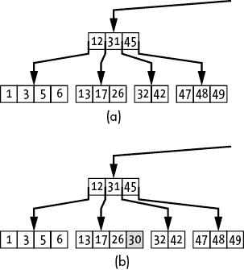

图 12-7：将键 30 插入一个非满的 B 树叶节点（a）会导致一个包含四个元素的叶节点（b）。

随着我们逐渐填充节点，逻辑变得更加复杂。考虑在图 12-8(a)中将键 29 添加到同一棵树的示例。在图 12-8(b)中插入新键后，叶节点变得过满。我们通过确定过满节点的分割点（键 = 26）并将其提升到父节点来处理这个问题。然后，我们使用辅助函数`BTreeNodeSplit`将叶节点分成两个兄弟节点，如图 12-8(c)所示。如果中间元素的提升使得内部节点也变得满了，我们还需要分裂它。

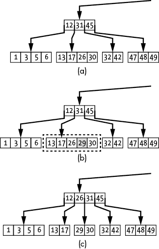

图 12-8：将键值 29 插入已满的叶子节点（a）会使叶子节点的元素过多（b）。我们必须将过满的叶子节点分裂，以恢复 B 树的条件（c）。

最后，考虑一下如果我们的分裂传播到根节点会发生什么情况。假设在插入之后，根节点本身过满，如图 12-9(a)所示。我们在图 12-9(b)中通过分裂根节点并为树创建一个新层次来解决这个问题。新的根节点只包含一个元素，即原根节点的中间键值。请注意，与所有其他节点不同，根节点可以包含少于*k*个元素。实际上，每次我们分裂根节点时，都会创建一个只包含一个元素的新根节点。

如本节中的示例所示，对 B 树的修改仅限于在初始查找插入位置时探索过的那些节点。由于我们不需要更新或修复其他分支，因此修改的节点总数由树的深度限制，从而与 log*k*成比例地扩展。

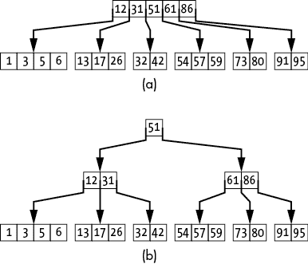

图 12-9：当 B 树的根节点过满时（a），我们将其分裂成两个兄弟节点，并将中间的元素提升为新的根节点（b）。

## 删除键值

删除键值的方法与添加键值类似。我们同样需要保持结构平衡，并限制每个节点中存储的键值数量（在*k*和 2*k*之间）。这导致了一个多阶段的删除算法。首先，我们沿着树向下查找，仿佛我们在查找该键值。一旦找到该键值，我们删除它。最后，我们向上返回树并检查并修复那些键值过少的节点。由于我们从不删除节点，除了空的根节点（它会使所有叶子节点的深度减少一），我们再次保证树始终保持平衡。

### 修复过少的节点

当我们从 B 树中删除键值时，存在节点键值少于*k*的风险。我们可以通过一个简单的辅助函数来检查这一条件：

```py
BTreeNodeIsUnderFull(BTreeNode: node):
    return node.size < node.k
```

根据 B 树的结构，我们可能需要使用两种不同的方法来修复节点不足的情况，我将在本节中讨论这两种方法。每种方法都依赖于从相邻的兄弟节点中增加键来扩展当前节点。在第一种情况下，我们直接将两个小的兄弟节点合并成一个节点。在第二种情况下，我们将一个较大兄弟节点的键转移到不足的节点中。我们使用哪种方法取决于两个兄弟节点的总键数。以上这两个辅助函数都从父节点调用，且需要提供分隔相邻兄弟节点的索引。

合并操作接收两个相邻的兄弟节点以及分隔它们的键，并将它们连接成一个大的子节点。因此，它要求这两个兄弟节点中键的总数必须*小于*2*k*，以确保新的子节点是有效的。图 12-10 展示了这一过程，其中图 12-10(a)显示了合并操作前的子树，中间的子节点只有一个键。图 12-10(b)显示了合并后的子树。

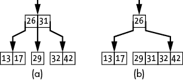

图 12-10：B 树节点的合并操作

清单 12-1 展示了合并两个相邻兄弟节点的代码。

```py
BTreeNodeMerge(BTreeNode: node, Integer: index):
  ❶ BTreeNode: childL = node.children[index]
    BTreeNode: childR = node.children[index + 1]

    # Copy over the parent's key and the right child's first child pointer.
  ❷ Integer: loc = childL.size
    childL.keys[loc] = node.keys[index]
    IF NOT childL.is_leaf:
        childL.children[loc + 1] = childR.children[0]
    loc = loc + 1

  ❸ # Copy over the right child's keys and children.
    Integer: i = 0
    WHILE i < childR.size:
        childL.keys[loc + i] = childR.keys[i]
        IF NOT childL.is_leaf:
            childL.children[loc + i + 1] = childR.children[i + 1]
        i = i + 1
    childL.size = childL.size + childR.size + 1

    # Remove the key from the current node.
    i = index
  ❹ WHILE i < node.size - 1:
        node.keys[i] = node.keys[i + 1]
        node.children[i + 1] = node.children[i + 2]
        i = i + 1
    node.keys[i] = null
    node.children[i + 1] = null
    node.size = node.size – 1
```

清单 12-1：合并两个子节点的代码

代码将右子节点的键和父节点的分隔键追加到左子节点上。首先，它通过获取两个子节点来开始操作，我们分别称之为`childL`和`childR`，代表左子节点和右子节点❶。根据定义，`childL`中的任何键都小于分隔键，`childR`中的任何键都大于分隔键。接着，代码将父节点的分隔键和右子节点的第一个子指针追加到左子节点的末尾❷。它使用`WHILE`循环复制右子节点剩余的键和指针❸。同时，更新左子节点的大小。此时，已成功地将两个子节点合并成一个新的节点。合并后的子节点指针存储在`node.children[index]`中。

代码最后通过清理父节点来结束操作❹。它通过将后续的键和指针向前移动，删除之前的分隔键和指向右子节点的指针，将最终的空位设置为`null`，并更新当前节点的大小。

在合并两个节点的过程中，我们从它们的父节点获取一个键。这可能会导致父节点的键数量少于*k*，因此我们需要在树的下一个更高层次进行修复。

这个过程直接类似于我们在存储索引示例中合并文件夹的操作。如果一个索引文件夹包含的键太少，它将浪费空间并占用请求时间。我们不想请求一个只有一张索引卡的文件夹。合并文件夹的过程是将一个子文件夹中的卡片和父文件夹中的分隔卡一同取出，并按正确的顺序放入另一个子文件夹中。由于我们已经请求了父文件夹和一个子文件夹（因此它们已经在本地内存中），我们可以通过仅对另一个子文件夹进行一次额外的请求，快速完成合并操作。

修复不足节点的第二种方法是将一个键（及可能的子节点）从其相邻的兄弟节点移动过来。这种方法只有在兄弟节点能够失去一个键时才有效，因此适用于兄弟节点的键总数至少为 2*k* 的情况。虽然我们可以合并并最优地重新分配相邻兄弟节点，但为了说明问题，我们使用一种更简单的方法，只转移一个键。由于在删除或合并操作期间我们只会从节点中删除一个键，转移一个键就足以修复我们的不足节点。

然而，如图 12-11 所示，我们不能简单地从一个子节点取出一个键并给另一个子节点。父节点中的分隔键限制了拆分的范围。因此，我们进行两阶段的转移。首先，我们将当前的分隔键从父节点转移到不足节点。然后，我们用另一个兄弟节点中的一个键替换父节点中的分隔键。

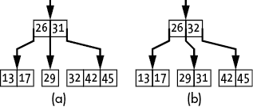

图 12-11：B 树节点上的左转移操作

如清单 12-2 所示，我们将代码拆分成两个辅助函数，一个用于将键从右子文件夹转移到左子文件夹，另一个用于反向转移。将键从右子文件夹转移到左子文件夹的代码会转移两个键：一个从右子文件夹转移到父文件夹，另一个从父文件夹转移到左子文件夹。

```py
BTreeNodeTransferLeft(BTreeNode: node, Integer: index):
  ❶ BTreeNode: childL = node.children[index]
    BTreeNode: childR = node.children[index + 1]
    Type: middle_key = node.keys[index]

  ❷ node.keys[index] = childR.keys[0]
  ❸ childL.keys[childL.size] = middle_key
    IF NOT childR.is_leaf:
        childL.children[childL.size + 1] = childR.children[0]
    childL.size = childL.size + 1

  ❹ Integer: i = 0
    WHILE i < childR.size - 1:
        childR.keys[i] = childR.keys[i + 1]
        IF NOT childR.is_leaf:
            childR.children[i] = childR.children[i + 1]
        i = i + 1

  ❺ childR.keys[i] = null
    IF NOT childR.is_leaf:
        childR.children[i] = childR.children[i + 1]
        childR.children[i + 1] = null
  ❻ childR.size = childR.size – 1
```

清单 12-2：将键和子指针从其右侧兄弟节点转移到不足节点的代码

代码首先通过检索两个相邻的兄弟节点和分隔键 ❶ 开始。它将第一个键从右侧子节点移到替换先前的分隔键 ❷。然后将来自父节点的先前分隔键（`middle_key`）和右侧子节点的第一个子节点指针添加到左侧子节点数组的末尾 ❸。此时，左侧子节点和父节点都已更新。接下来，代码清理右侧子节点。它使用 `WHILE` 循环将剩余的元素移到一边 ❹，将现在空的槽标记为 `null` ❺，并调整大小 ❻。

从左子节点向右子节点传输键的代码与 示例 12-3 中展示的类似。两键传输的方向相反：一个从左子节点到父节点，另一个从父节点到右子节点。

```py
BTreeNodeTransferRight(BTreeNode: node, Integer: index):
  ❶ BTreeNode: childL = node.children[index]
    BTreeNode: childR = node.children[index + 1]
    Type: middle_key = node.keys[index]

    # Make space in childR for the new key and pointer.
  ❷ Integer: i = childR.size - 1
    WHILE i >= 0:
        childR.keys[i+1] = childR.keys[i]
 IF NOT childR.is_leaf:
            childR.children[i+2] = childR.children[i+1]
        i = i – 1
    IF NOT childR.is_leaf:
        childR.children[1] = childR.children[0]

  ❸ childR.keys[0] = middle_key
    IF NOT childR.is_leaf:
        childR.children[0] = childL.children[childL.size]
    childR.size = childR.size + 1

  ❹ node.keys[index] = childL.keys[childL.size – 1]

  ❺ childL.keys[childL.size - 1] = null
    IF NOT childL.is_leaf:
        childL.children[childL.size] = null
    childL.size = childL.size – 1
```

示例 12-3：将键和子节点指针从其左兄弟传输到欠满节点的代码

代码再次通过检索两个相邻的兄弟节点和分隔键 ❶ 开始。然后，代码将右侧节点中的键和子节点移动，以为新的元素腾出空间 ❷。它将来自父节点的先前分隔键（`middle_key`）和来自左子节点的最后一个子节点指针添加到右侧节点的*开始*位置 ❸，并将其大小增加 1。接下来，代码将左侧子节点中的最后一个键移动到父节点中的分隔键位置 ❹。代码最后通过将现在空的条目标记为 `null` 来清理左侧子节点，并更新大小 ❺。

与合并操作不同，传输操作不会减少父节点中的键数量。因此，我们不需要在树的更高层级执行修复操作。这些传输操作的物理对应是请求一个兄弟存储绑定器，并在两个子节点和父节点之间移动两张索引卡。我们从父节点取出介于两个绑定器之间的中间卡片，并将其添加到较不满的子节点绑定器中。我们用来自拥有更多卡片的子节点的适当卡片替换父节点中的这张卡片。

我们可以将这三种修复功能以及选择它们的逻辑封装成一个辅助函数，该函数接受当前节点和欠满子节点的索引：

```py
BTreeNodeRepairUnderFull(BTreeNode: node, Integer: child):
  ❶ IF child == node.size:
        child = child - 1
  ❷ Integer: total = (node.children[child].size + 
                      node.children[child + 1].size)

    IF total < 2 * node.k:
      ❸ BTreeNodeMerge(node, child)
        return

 ❹ IF node.children[child].size < node.children[child + 1].size:
        BTreeNodeTransferLeft(node, child)
    ELSE:
        BTreeNodeTransferRight(node, child)
```

为了知道使用哪种修复策略，代码需要找到一个相邻的兄弟节点，并检查这两个子节点的总键数。在这里，为了说明，我们使用一种简单的策略，总是使用下一个子节点（`child + 1`）作为兄弟节点，除非我们正在修复数组中的最后一个子节点❶。如果我们正在修复数组中的最后一个子节点，则使用前一个子节点作为其兄弟节点。代码检查这两个子节点中键的总数❷。如果键的数量足够小（小于 2*k*），则将这两个节点与`BTreeNodeMerge`函数合并❸。否则，如果节点的键数为 2*k*或更多，代码使用`BTreeNodeTransferLeft`或`BTreeNodeTransferRight`将一个键移动到较小的节点❹。

### 查找最小值键

我们在删除操作中使用了一个额外的辅助函数——用于查找并返回给定节点下或以下的最小键的代码。此代码在清单 12-4 中，也可以单独使用，例如计算 B 树中键的范围。

```py
BTreeNodeFindMin(BTreeNode: node):
  ❶ IF node.size == 0:
        return null
  ❷ IF node.is_leaf:
        return node.keys[0]
    ELSE:
      ❸ return BTreeNodeFindMin(node.children[0])
```

清单 12-4：查找给定节点下或以下的最小键的代码

代码包含三种可能的情况。如果节点为空，代码返回`null`，表示那里没有最小键❶。这应该只发生在空的根节点中，因为所有其他节点至少会有*k*个键。如果节点是一个非空的叶子节点，代码返回节点数组中的第一个（即最小的）键❷。最后，如果节点是内部节点，代码递归检查第一个子节点❸。

### 删除算法

我们从顶层的包装函数开始描述删除算法。这个函数相对简单，它通过使用树的根节点调用递归删除函数。

```py
BTreeDelete(BTree: tree, Type: key):
    BTreeNodeDelete(tree.root, key)

    IF tree.root.size == 0 AND NOT tree.root.is_leaf:
        tree.root = tree.root.children[0]
```

就像我们在拆分节点时只添加一个级别一样，只有当根节点变为空时，才会从树中移除一个级别。如果 B 树不完全为空，空的根节点仍然会在数组位置 0 处有一个有效的子节点。我们使用这个子节点来替代原来的根节点。

核心删除算法递归地下降树，寻找要删除的键。由于我们可能会将键的数量减少到低于所需的*k*，因此需要检查修改后的子节点是否现在已不足满，如果是，则进行修复。

```py
BTreeNodeDelete(BTreeNode: node, Type: key):
  ❶ Integer: i = 0
    WHILE i < node.size AND key > node.keys[i]:
        i = i + 1

    # Deletion from a leaf node.
    IF node.is_leaf:
        IF i < node.size AND key == node.keys[i]:
          ❷ WHILE i < node.size - 1:
                node.keys[i] = node.keys[i + 1]
                i = i + 1
            node.keys[i] = null
            node.size = node.size - 1
        return

    # Deletion at an internal node.
    IF i < node.size AND key == node.keys[i]:
      ❸ Type: min_key = BTreeNodeFindMin(node.children[i+1])
        node.keys[i] = min_key

      ❹ BTreeNodeDelete(node.children[i+1], min_key)
        IF BTreeNodeIsUnderFull(node.children[i+1]):
            BTreeNodeRepairUnderFull(node, i+1)
    ELSE:
      ❺ BTreeNodeDelete(node.children[i], key)
        IF BTreeNodeIsUnderFull(node.children[i]):
            BTreeNodeRepairUnderFull(node, i)
```

代码通过扫描键数组来开始在当前节点中查找要删除的键❶。如果在此节点中找到匹配的键，`WHILE`循环终止，`i`将是匹配键的索引。

然后代码考虑叶子节点的情况。如果节点是叶子节点并且找到了键，代码通过移动键来删除它❷。代码还将最后一个元素设置为`null`并更新大小。由于叶子节点没有设置子指针，代码不需要更改子指针。如果节点是叶子节点但未找到键，代码则直接返回。

接下来，代码处理内部节点的情况。需要考虑两种情况：键在节点中，或者不在。如果代码在内部节点中找到了键，它会用在排序顺序中紧随目标键之后的键替换该键 ❸。代码通过调用`BTreeNodeFindMin`，从 Listing 12-4 中获取在目标键之后紧跟的子节点的最小键。代码然后通过调用`BTreeNodeDelete` ❹来从子树中删除这个紧随的键。接着，代码会检查子节点是否欠满，如果是，进行修复。

如果目标键不在内部节点中，那么代码会递归地在相应的子节点上调用`BTreeNodeDelete` ❺。再次需要检查该子节点是否现在是欠满的，如果是，进行修复。

与插入类似，我们的目标是限制在此操作中检索的节点数量。删除操作最多会从根节点到叶子节点进行一次遍历。即使我们从内部节点中删除，随后的替换和删除操作仍然只会继续遍历到一个单独的叶子节点。每当我们修复一个节点并检索欠满节点的兄弟节点时，我们就需要额外执行一次请求。

### 删除键的示例

让我们看几个刚才讨论过的删除例子。首先，考虑最简单的情况，展示在 Figure 12-12 中，即从包含超过*k* + 1 个键的叶子节点中删除键。假设*k* = 2，我们的非根节点可以包含 2 到 2*k* = 4 个元素。如果我们从 Figure 12-12(a)中的子树中移除键 5，我们只需继续向下到叶子节点并移除数组中的该键。由于结果叶子节点包含三个元素，我们无需修复它。我们得到 Figure 12-12(b)所示的子树。

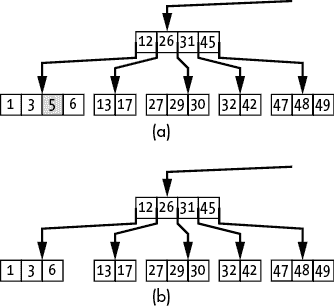

图 12-12：从 B 树叶节点中删除键 5（a）结果是一个包含三个元素的叶节点（b）。

接下来，我们考虑在不需要修复的情况下，从内部节点中移除一个键的情况，如 Figure 12-13 所示。如果我们从 Figure 12-13(a)中的子树中移除键 45，我们发现该键在一个内部节点中。为了移除它，我们用排序顺序中的下一个键替换它，即 47。由于结果节点至少有两个元素，因此我们不需要进行任何修复。我们得到 Figure 12-13(b)中所示的子树。

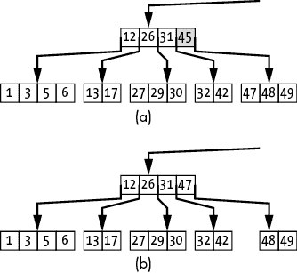

图 12-13：从内部 B 树节点中删除键 45（a）会导致从子节点中获取一个键（b）。

最后，我们考虑删除键时需要修复不足元素节点的不同情况。图 12-14 展示了一个可以合并两个节点的情况。我们从删除 图 12-14(a) 中的键 32 开始。图 12-14(b) 显示了我们用于合并操作的键：不足节点中的键、其右侧相邻兄弟节点中的键，以及父节点中分隔这两个节点的键。图 12-14(c) 显示了修复后的树。新的子节点包含四个键，原父节点包含三个键。

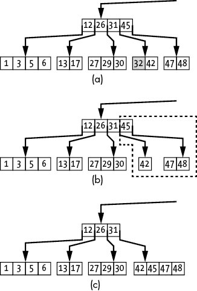

图 12-14：从几乎为空的节点中删除键 32（a）会使叶子节点的元素过少（b）。我们必须与相邻的兄弟节点合并，以恢复 B 树的条件（c）。

图 12-15 展示了一个可以从更大的兄弟节点转移键的情况。我们从删除 图 12-15(a) 中的键 32 开始。图 12-15(b) 显示了我们用来恢复平衡的键：不足节点中的键、其右侧相邻兄弟节点中的键，以及父节点中分隔这两个节点的键。图 12-15(c) 显示了哪些键将被移动以及移动到哪里。修复后的树显示在 图 12-15(d) 中。


图 12-15：从几乎为空的节点中删除键 32（a）导致叶子节点元素过少（b）。我们可以通过从相邻的兄弟节点（c）获取一个键来修复这一问题，以恢复 B 树的条件（d）。

最终，图 12-16 展示了通过合并根节点下唯一的两个子节点来删除树中的一个层级的情况。图 12-16(b)显示，合并后，根节点为空，其唯一的键已被移至合并后的节点。我们在图 12-16(c)中通过删除旧根节点，并将该节点的唯一子节点提升为新的根节点来修复此问题。

与插入操作不同，删除操作可能会修改其他分支的节点。在插入过程中，B 树的修改仅限于初次搜索插入位置时访问的节点，而删除操作则可能修改其他分支的节点。合并节点和转移键值都使用同一级别的兄弟节点。然而，被修改的节点总数仍然受树的深度限制。最多，我们每一层只能访问一个兄弟节点，访问的节点数随 *N* 的对数增长。

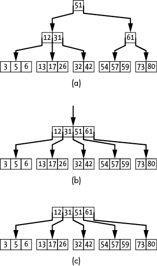

图 12-16：合并根节点下唯一的两个子节点（a）导致根节点为空（b）。我们通过将根节点的唯一子节点提升为新的根节点（c）来修复这一问题。

## 为什么这很重要

B 树展示了几个重要的概念。首先，它们展示了如何调整先前数据结构的行为，以处理节点间内存访问比节点内访问更昂贵的情况。B 树以某种方式将索引和存储结合起来，从而最小化所需的访问次数。这对于可能将信息存储在磁盘或外部服务器上的大数据集至关重要。通过强制每个非根节点至少有 *k* 个键，我们确保每个节点的分支因子至少为 *k* + 1，从而将整个数据结构“扁平化”。这有助于限制树的整体深度，从而减少搜索、插入或删除所需的检索次数。我们还保证每个非根节点始终保持至少半满，这意味着我们不会浪费时间去检索只有少量元素的节点（除了可能是根节点的情况）。

将 B 树的方式与我们收藏品的更专门化索引方案进行对比是有用的。我们可以开发一个数据结构，最初按类别进行划分。顶级索引将收藏品的类别（例如与咖啡相关的收藏品）映射到该特定类别的文件夹。每个类别的文件夹再映射到所有子类别，如咖啡杯或咖啡海报，依此类推。这也是一种有效的方法，建立在本书中看到的分支结构的基础上。其权衡在于通用性与效率。在许多情况下，我们可以将数据结构进一步优化以适应当前任务，但这可能会失去将其应用于其他问题的能力。在某些情况下，这种权衡可能是值得的，但在其他情况下则可能不值得。与聚焦于类别的索引方案相比，B 树提供了一种更为通用的方法，适用于任何可排序的键集。

B 树展示的第二个概念是数据结构本身的第二级动态性。B 树会不断调整其结构，以适应存储的数据分布，从而保持平衡。正如我们在第五章看到的那样，如果树变得高度不平衡，我们就会失去基于树的结构所带来的优势。B 树通过限制每个节点中键的数量（*k* 到 2*k*）以及确保所有叶子节点具有完全相同的深度来程序化地防止这一问题。它们通过重新平衡来适应“不良”数据分布——修正那些包含过多或过少项目的节点。虽然树的平衡策略有很多种，B 树提供了一个简单明了的例子，展示了我们如何通过添加额外的结构（在这种情况下，每个节点多个键）来避免最坏情况的发生。
