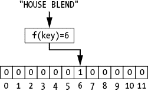
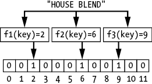
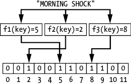
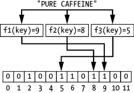
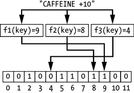

## 第十三章：布隆过滤器


正如我们在上一章中所看到的，我们经常需要意识到我们的数据结构如何适应本地内存，以及如何限制从较慢内存中的数据检索。随着数据结构的增长，它可以存储更多数据，但可能无法完全适应最快的内存。本章介绍了*布隆过滤器*，这是一种扩展哈希表核心概念的数据结构，用来限制过滤大范围键时所需的内存量。

布隆过滤器由计算机科学家伯顿·布隆（Burton Bloom）于 1970 年发明。布隆过滤器通过精心优化内存使用和执行时间，跟踪哪些键已被插入。它试图回答一个非常简单的是/否问题：我们之前是否见过这个键？例如，我们可能使用布隆过滤器来检查密码是否在已知弱密码的列表中。或者，我们可以在访问一个更大、更全面但较慢的数据结构之前，先使用布隆过滤器作为预筛选步骤。

在追求极致效率的过程中，布隆过滤器使用了一种可能导致假阳性的策略。这意味着布隆过滤器在某些非零的概率下，会错误地表示一个键已经插入，尽管实际上它并没有被插入。换句话说，一个用于筛选坏密码的布隆过滤器可能偶尔会拒绝一个好的密码。

正如我们将要看到的，低内存开销、快速执行时间以及保证没有假阴性（即实际存在的键在检查时未被识别）的组合，使得布隆过滤器在预筛选任务和访问更昂贵数据结构之前的初步检查中非常有用。这导致了类似于第十一章缓存方法的两阶段查找。为了检查记录是否在我们的数据集中，我们首先检查它是否已被插入布隆过滤器。由于布隆过滤器是一个紧凑的数据结构，存储在快速内存中，因此我们可以快速进行此检查。如果布隆过滤器返回假，说明该记录不在我们的数据集中，我们可以跳过在完整数据结构中的昂贵查找。如果布隆过滤器返回真，那么要么是我们遇到了假阳性，要么是该记录确实在我们的较大数据结构中，我们将执行完整的搜索。

想象一下，我们想要在进行更耗费计算的搜索之前，确定一个给定的记录是否存在于一个庞大的医疗记录数据库中。这个医疗数据库庞大，包含图像和视频，必须分布存储在多个大型硬盘上。此外，由于记录数以百万计，即使是索引也太大，无法完全适应本地内存。虽然它偶尔会返回一个假阳性，并让我们搜索一个不存在的记录，但布隆过滤器也会帮助我们避免许多无意义的搜索。每当布隆过滤器指示某个记录不在数据集中时，我们就可以立即停止搜索！

## 介绍布隆过滤器

从本质上讲，布隆过滤器是一个二进制值数组。每个桶跟踪我们是否曾见过任何与该哈希值相匹配的内容。值为 1 表示该桶之前已经被见过。值为 0 表示它之前没有被见过。

当我们想在大量值中轻松查找单个值时，布隆过滤器可以非常有用。可以想象，在一个大型、拥挤的舞厅里寻找朋友的情境中，这种过滤方式是如何工作的。我们可能需要花费数小时在舞池中徘徊、打量人群的面孔，最后才得出结论，发现我们的朋友并未出席。要简单得多的做法是，先询问一位知识渊博的活动组织者。我们向组织者描述我们的朋友，组织者记忆力非常好，可以确认是否有与描述相符的人在场。我们的描述和组织者的心理地图由一系列基本属性构成。我们的朋友个子高，穿着运动鞋，戴着眼镜。

活动组织者的回答可能仍然不是百分之百准确——我们使用的是一般属性，多个与之相符的人可能会共享这些描述。有时，组织者可能会给我们一个误报，说：“我见过一个有这些特征的人”，即便我们的朋友并不在场。但他们永远不会做出错误的否定，告诉我们朋友不在场，而实际上他们在。如果组织者没有见过任何与我们列出的三个特征相符的人，那么我们可以确保我们的朋友不在活动现场。这个回答不需要没有任何假阳性，就能在平均情况下帮助我们。如果组织者能帮我们节省每 10 次搜索中的 9 次，那将是一次巨大的胜利。

让我们看看如何将第十章中学到的哈希技术扩展到这个预过滤问题。我们从一个简单的指示器数组开始，并检查它的不足之处。然后我们展示如何使用多个哈希函数来提供更强大的过滤方案。

### 指示器哈希表

考虑最简单的过滤器，一个通过单一哈希函数映射到的二进制指示器数组。当我们插入一个键时，我们计算哈希值并用 1 标记相应的桶。当我们查找一个键时，我们计算哈希值并检查相应的桶。这很简单，也很优雅。遗憾的是，它在发生最轻微的哈希碰撞时就会失效。

假设我们为我们的千页咖啡日志实现了这个简单的单哈希函数过滤器。每当我们想在日志中查找某种咖啡时，我们首先询问过滤器一个简单的问题：“我以前尝试过这种咖啡吗？”如果我们知道以前没有尝试过这款咖啡，这个过滤器通常可以帮助我们避免在千页日志中进行二分查找。

在第一个月，它工作得非常完美。每当我们尝试一种新的咖啡时，我们将其添加到日志中，并将过滤器中相应的位从 0 翻转为 1，如图 13-1 所示。我们将咖啡名称作为哈希函数的输入，从而能够按名称检查未来的咖啡。



图 13-1：单个哈希函数可以将一个字符串映射到数组的索引。

对于前几个条目，单哈希函数布隆过滤器的行为类似于常规哈希表（没有冲突解决机制），它为每个条目存储二进制值。我们将 1 插入每个看到的键对应的槽中，0 表示我们没有看到任何哈希到该值的条目。当我们询问是否尝试过“House Blend”咖啡时，如果查找返回 1，我们会简单地得到“是”的回答。

然而，随着我们向过滤器中添加越来越多的值，问题开始显现。经过一天的咖啡饮用，我们的二进制数组开始填满。如图 13-2 所示，即使我们每天只喝几种不同的咖啡，我们也开始用 1 填充数组。


图 13-2：一个开始填满的二进制数组

由于布隆过滤器与哈希表不同，它不使用链式或任何其他机制来解决冲突，因此两个不同的咖啡有时会映射到相同的条目。很快，我们就无法知道我们是否真的品尝过“烧焦豆深烘焙”，还是那个对应的 1 只是由于我们之前品尝过“生豆，未烤，苦涩爆发”，它恰好也映射到相同的条目。记住在第十章中提到的，当我们从一个较大的键空间（咖啡名称集）映射到一个较小的键空间（数组中的条目）时，我们会遇到冲突。随着我们向日志中添加更多条目，这个问题会变得越来越严重。

一年内，我们最初的过滤器实际上变得无用。我们丰富的咖啡体验虽然令人愉快，但也将数组填满了 1。现在，我们的数组几乎变得像图 13-3 所示。我们的一半以上查询都会导致哈希冲突，因此产生假阳性。这个过滤器不再是一个高效的预过滤器。相反，它几乎总是增加了一个无用的检查开销，影响了实际的搜索。在我们的聚会示例中，这类似于只用一个属性来描述我们的朋友。如果我们只提供朋友的发色，活动组织者几乎总是见过符合该描述的人。


图 13-3：一个过于满的二进制数组，无法作为有效的咖啡追踪器

对于我们日益增加的碰撞，最简单的解决方法是增加哈希值的空间。我们可以扩大二进制数组的大小。我们可以尝试使用 1,000 个指示值，而不是 100 个。这减少了碰撞的可能性，但并没有完全消除它。单一的碰撞仍然会导致假阳性，正如我们在第十章中看到的那样，一些碰撞是不可避免的。然而，我们的哈希方法并非注定失败。通过采用一种减少每次碰撞*影响*的策略，我们可以做得更好。

### Bloom 过滤器

Bloom 过滤器通过极端化哈希函数的思想来解决碰撞问题。它不是为每个键使用单一哈希函数，而是采用*k*个独立的哈希函数，这些哈希函数将键映射到相同的哈希值范围。例如，如图 13-4 所示，我们可能会为我们的咖啡列表使用三个哈希函数。哈希函数*f1*将此键映射到索引 2；第二个函数*f2*将其映射到索引 6；第三个函数*f3*将其映射到索引 9\。



图 13-4：使用三个哈希函数将字符串 HOUSE BLEND 插入到 Bloom 过滤器中

正式地，我们将 Bloom 过滤器的操作定义如下：

1.  插入键 对于每个*k*哈希函数，将键映射到一个索引并将该索引处的值设为 1。

1.  查找键 对于每个*k*哈希函数，将键映射到一个索引并检查该索引处的值是否为 1。仅当所有*k*数组值都为 1 时，才返回 true。

乍一看，我们所做的似乎只是让问题变得更糟。我们不仅没有填充每个样本一个桶，而是填充了三个桶。我们的数组几乎可以保证更快地填满，并更早遇到碰撞。如果我们添加第二个条目，如图 13-5 所示，我们会向数组中添加更多的 1。



图 13-5：使用三个哈希函数将字符串 MORNING SHOCK 插入到 Bloom 过滤器中

相反，我们实际上改善了情况。Bloom 过滤器的强大功能使得我们能够高效地查找条目。与其在遇到单一碰撞时产生假阳性（如果我们看到一个 1），我们要求*所有*的桶都包含 1，正如图 13-6 所示。



图 13-6：在具有三个哈希函数的 Bloom 过滤器中查找字符串 PURE CAFFEINE

如果我们看到一个单独的 0，我们就知道这个条目没有被插入到数组中。在图 13-7 中，我们可以看到我们从未抽样过 Caffeine +10 烘焙咖啡。在舞厅中，活动组织者只需要知道我们的朋友戴着一顶圆顶礼帽，就能明确回答他们没有看到任何符合这种描述的人。他们见过符合身高和发色要求的人，但没有见过戴着这种帽子的人。我们可以安全地避免进行全面搜索。



图 13-7：在具有三个哈希函数的布隆过滤器中查找字符串 CAFFEINE +10

为了注册假阳性，*每个*哈希值必须与之前的条目发生碰撞。如果我们平衡数组的大小与哈希函数的数量，我们可以降低假阳性的概率。

我们可以通过与一位知识渊博的咖啡师的对话，形象地展示布隆过滤器如何处理碰撞。想象一下，在最近的一次旅行中，一位朋友递给我们一杯令人难以置信的咖啡。在享受了丰富的风味和浓烈的咖啡因之后，我们询问朋友关于这款新发现的咖啡。令我们失望的是，我们即将失去的朋友耸耸肩，指向一个大致方向，声称他们是在“那个方向”的一间店铺购买的。他们记不起咖啡师的名字、店铺名称，甚至连咖啡品牌也忘了。不幸的是，我们没有时间自己去找这家店并盘问店主，我们需要赶飞机回家。忍住失落的泪水，我们在一张纸上写下了一些特征，并决心追查这款神秘的咖啡。

回到家后，我们拜访了我们认识的最有经验的咖啡师，并展示了我们的笔记。我们已经记录下了五个关于咖啡的关键特征，比如“主要气味是巧克力”。显然，这些信息不足以唯一地识别出这款咖啡，但我们可以请咖啡师看看是否有符合这些描述的咖啡。在翻阅他们自己那本包含 10,000 页的咖啡日志之前，咖啡师独立地考虑了这些特征并排除了匹配项。尽管我们争辩说这些风味的搭配出奇地好，但这位专家从未听说过任何包含“额外甜美泡泡糖味”的咖啡。他们投来一瞥，嘟囔着些什么，说自己有标准。

在这种情况下，我们的五个属性实际上就是哈希函数，它们将复杂的咖啡体验映射到一个低维空间——一个描述词的数组。咖啡师会单独使用这些属性，检查是否知道有任何咖啡可能匹配，利用他们自己咖啡日志的索引。索引中的一项意味着至少有一个匹配项。每个属性的测试可能会遇到假阳性，但这没关系。在最坏的情况下，我们会浪费一些时间查看旧的咖啡日志条目，然后确认没有完美匹配。至少我们知道永远不会出现假阴性。如果其中一个特性是唯一的，咖啡师可以自信地说“不”，我们也可以放心地知道，咖啡师广泛的咖啡目录中没有我们正在寻找的那款神秘混合咖啡。

我们只需使用布隆过滤器步骤，就能快速做出当下的决策，而不必随后的搜索更大的数据结构。想象一下，我们可信赖的咖啡师维护着一个秘密的咖啡避免列表，包含世界各地 500 种糟糕得令人呕吐的咖啡，它们会让我们停止喝咖啡整整一个月。出于各种责任原因，他们不公开这个列表。但如果我们问咖啡师某个特定咖啡是否在列表上，他们会礼貌地提醒我们，或许我们更喜欢喝无咖啡因的咖啡。在品尝任何新咖啡之前，我们最好检查一下它是否在他们的列表上。

当然，每次我们有机会尝试新咖啡时，我们不可能每次都去找咖啡师，所以我们需要一种快速的决策方式。咖啡师利用五个信息属性，包括主要气味和粘稠度，为这些咖啡构建一个布隆过滤器，针对每个咖啡列表中的五个属性标记 1。当我们有机会品尝一种新咖啡时，我们会检查这五个属性是否与列表匹配。如果其中任何一个属性标记为 0，我们就可以放心地喝这杯新咖啡，保证它不在咖啡师的列表上。但是，如果所有属性都是 1，或许我们应该点别的东西。作为额外的好处，咖啡师也无需分发他们的秘密列表。

我们可以以类似的方式将布隆过滤器应用于计算机科学中的应用程序。考虑一下检查密码是否在已知弱密码列表中的问题。每次有人提出新密码时，我们可以系统地搜索整个列表。或者，我们可以创建一个布隆过滤器，快速检查是否应该拒绝该密码。偶尔我们可能会拒绝一个合理的密码，但我们可以保证永远不会让一个坏密码通过。

### 布隆过滤器代码

在最简单的形式中，布隆过滤器可以存储为仅包含二进制值的数组。为了使代码更清晰，我们将布隆过滤器封装在一个简单的复合数据结构中，包含参数，如大小和哈希函数的数量：

```py
BloomFilter {
    Integer: size
    Integer: k
    Array of bits: bins
    Array of hash functions: h
}
```

给定这个包装器，插入和查找功能的代码可以通过一个单一的`WHILE`循环来实现：

```py
BloomFilterInsertKey(BloomFilter: filter, Type: key):
    Integer: i = 0
 WHILE i < filter.k:
        Integer: index = filter.hi
        filter.bins[index] = 1
        i = i + 1

BloomFilterLookup(BloomFilter: filter, Type: key):
    Integer: i = 0
    WHILE i < filter.k:
        Integer: index = filter.hi
        IF filter.bins[index] == 0:
            return False
        i = i + 1
    return True
```

在这段代码中，`filter.hi`表示应用于`key`的布隆过滤器第`i`个哈希函数。两个函数都使用循环遍历* k * 个哈希函数，计算`key`的哈希值并访问布隆过滤器数组中的相应桶。在插入的情况下，代码将桶的值设置为`1`。在查找的情况下，代码检查桶是否包含`0`，如果是，则返回`False`。

在最坏的情况下，函数的成本随* k * 线性增长，因为我们需要对每个操作遍历每个哈希函数。查找结构提供了额外的潜在优势。查找可以在找到第一个 0 后立即终止，跳过任何进一步的哈希函数。重要的是，插入和查找的运行时间与布隆过滤器的大小（桶的数量）和插入的项数无关。

## 调整布隆过滤器参数

有多个参数会影响布隆过滤器的假阳性率，包括数组的大小和使用的哈希函数的数量。通过调整这些参数以适应当前问题，我们通常可以将假阳性率保持在非常低的水平，同时最小化使用的内存量。我们可以通过实际数据、模拟或者多种数学近似来进行调整。

一个常见且简单的近似公式是：

*FalsePositiveRate* = (1 – (1 – 1/*m*)^(*nk*))^(*k*)

其中，*n* 是插入到布隆过滤器中的项数，*m* 是数组的大小，*k* 是使用的哈希函数的数量。这个近似使用了简化的假设，但它能很好地展示各种参数如何相互作用：

+   增加数组的大小（*m*）总是会降低假阳性率，因为有更多的桶可以存储信息。

+   增加插入的项数（*n*）总是会增加假阳性率，因为我们将更多的桶设置为 1\。

+   增加哈希函数的数量（*k*）可以根据其他参数的不同而增加或减少假阳性率。如果使用过多的哈希函数，每次插入时都会填充大量的数组。如果使用的哈希函数太少，少量的碰撞可能会产生假阳性。

表 13-1 提供了布隆过滤器的大小（*m*）和哈希函数数量（*k*）如何影响假阳性率的见解，前提是插入的项数固定为(*n* = 100)。

表 13-1：不同参数（*m*，*k*）下的假阳性率示例（*n*=100）

| ***m*** | ***k* = 1** | ***k* = 3** | ***k* = 5** |
| --- | --- | --- | --- |
| 200 | 0.3942 | 0.4704 | 0.6535 |
| 400 | 0.2214 | 0.1473 | 0.1855 |
| 600 | 0.1536 | 0.0610 | 0.0579 |
| 800 | 0.1176 | 0.0306 | 0.0217 |
| 1000 | 0.0952 | 0.0174 | 0.0094 |

最终，最佳的参数设置将取决于具体的问题。我们需要在假阳性率、计算成本和内存成本之间选择一个最适合我们应用的权衡。

## Bloom 过滤器与哈希表

此时，怀疑的读者可能会再次举手抗议：“为什么不直接使用哈希表呢？每当一个键出现时，我们可以将它和一些微不足道的数据（如布尔值 True）一起添加到哈希表中。然后我们可以在这个表中搜索精确匹配的键。当然，我们可能会因为碰撞而进行一些链式处理，但我们会得到精确的答案。为什么你总是把事情弄得这么复杂？”

这是一个合理的观点。哈希表确实能回答与 Bloom 过滤器相同的问题，且答案更加准确。但正如我们怀疑的读者所指出的那样，它们是以额外的空间和潜在的运行时间为代价的。为了使哈希表能够完全解决碰撞问题，我们需要存储足够的信息来确定性地表示我们之前确实见过这个精确的键，这就意味着需要存储键本身。再加上链式哈希表中的指针开销，如图 13-8 所示，我们可能会使用显著更多的内存。


图 13-8：具有链式结构的哈希表需要为每个键分配内存，并至少需要一个指针。

相比之下，Bloom 过滤器不需要存储键或指向后续节点的指针。它只为每个桶保留一个二进制值。我们可以使用恰好 *m* 位来存储 *m* 个桶。这种极端的空间效率因多种原因而显得尤为宝贵。首先，它允许我们在保持内存可管理的情况下，大幅增加桶的数量（即过滤器的大小）。我们可以以一个 32 位整数的代价存储 32 个独立的桶。

第二点，更重要的是，对于计算密集型的应用，它通常允许我们将 Bloom 过滤器保持在内存中，甚至是在内存缓存中，以便快速访问。考虑我们在上一章中探索的关于结构化 B 树节点以减少从较慢内存中检索的次数的权衡。Bloom 过滤器的作用是最大化直接有助于过滤的数据结构量，目的是将整个数据结构保持在非常快速的内存中。

## 为什么这很重要

Bloom 过滤器在需要对内存使用和准确性之间进行超优化权衡时，可以成为强大的工具。它们将第十章中介绍的数学映射与第十二章中关于将数据压缩成可以存储在本地内存中的形式的重点结合起来。像缓存一样，它们提供了一个中间步骤来执行昂贵的查找操作，从而有助于平均降低成本。

更重要的是，布隆过滤器（Bloom filter）提供了一个全新类型数据结构的初步了解——一种可能会偶尔返回假阳性的结构。查找操作的准确性无法保证，而是概率性地依赖于数据。如果我们幸运的话，可能在没有看到假阳性之前就能插入大量元素。然而，如果运气不好，可能会早早遇到碰撞。这种数据结构提供了一种不同的思考方式，让我们重新审视如何组织数据及其相关的权衡。如果我们愿意接受一些（希望是少量的）错误，我们可以把效率提升到什么程度呢？

在下一章中，我们将考虑一种依赖于不同类型随机性的 数据结构。跳表（skip list）并非提供概率上正确的答案，而是通过使用随机性来避免最坏情况的表现，并在平均情况下提供高效的操作。
