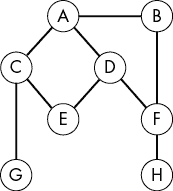
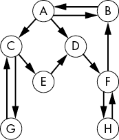
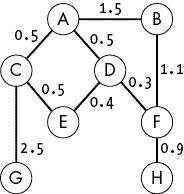
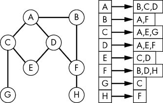
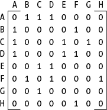
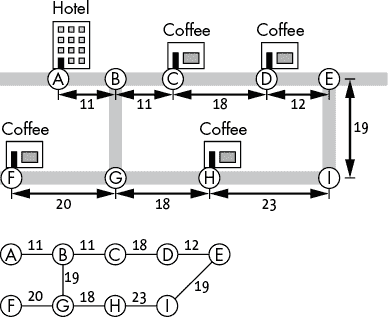
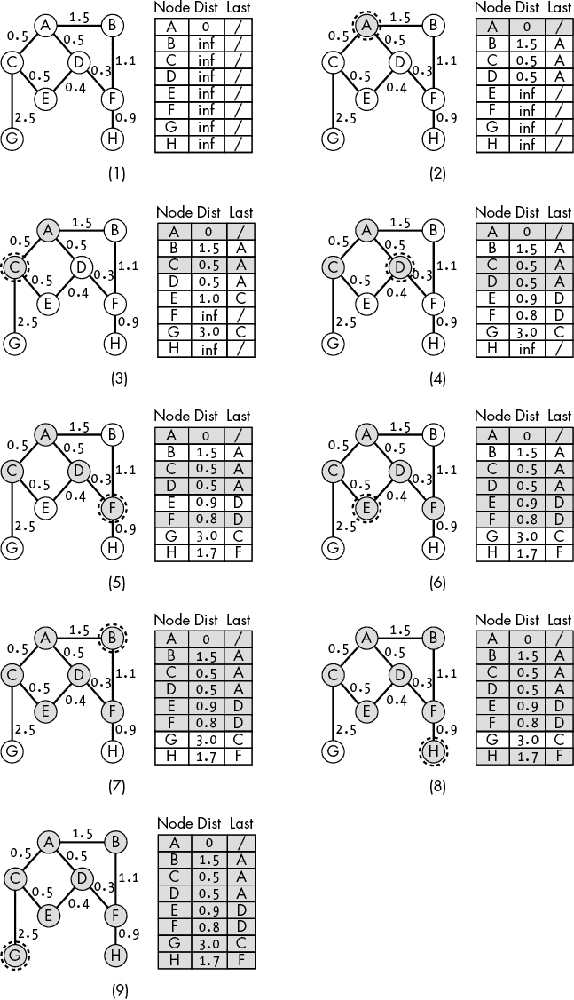
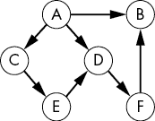

## 第十五章：图


图是计算机科学中最基本的数据结构之一。它们出现在许多问题和编程任务中。与本书中其他旨在优化特定计算的数据结构不同，*图*的结构自然地来源于数据本身。换句话说，图反映了它们所表示的数据。研究图算法让我们深入了解如何定义算法以利用数据的固有结构。

前面的章节集中讨论了如何构造数据以辅助算法的实现；高层次的问题，如查找某个值，推动并驱动了相关数据结构的设计。本章讨论的是相反的问题：图展示了数据的结构如何推动新算法的发展。换句话说，给定以图的形式呈现的数据，我们将探讨如何创建能够使用这些数据的算法。本章将研究三种图算法，它们利用了图的不同结构特性：用于最短路径的迪杰斯特拉算法、用于最小成本生成树的普里姆算法，以及用于拓扑排序的卡恩算法。

## 引入图

图由一组*节点*和一组*边*组成。如图 15-1 所示，每条边连接一对节点。这种结构与许多现实世界的系统相似，包括社交网络（节点是人，边是他们的连接）、交通网络（节点是城市，边代表路径）和计算机网络（节点是计算机，边表示它们之间的连接）。这种现实世界的类比使得图算法在可视化时充满乐趣，因为简单的搜索转变为对城堡的细致探索或在城市拥挤小巷中疯狂奔跑。



图 15-1：带有无向边的图

图的边可以具有额外的属性，以捕捉数据的现实复杂性，例如边是否是有向的。*无向边*，如图 15-1 中的图所示，表示双向关系，如大多数道路和美好的友谊。*有向边*，如图 15-2 中所示，类似单行道，表示单向流动。为了表示无向连接，我们使用一对有向边——每个方向一条——在节点之间连接。在社交背景下，有向边可以代表电视剧中的浪漫兴趣：从爱丽丝到鲍勃的边表示爱丽丝喜欢鲍勃，而鲍勃到爱丽丝的边缺失则表现出缺乏互惠的致命困境。



图 15-2：一个带有有向边的图

除了让我们建模单行道或单相思外，有向边还允许我们建模更抽象的问题，如任务依赖关系。我们可以将一组任务指定为节点，并使用有向边表示任务之间的顺序依赖关系。通过这种方式，我们可以创建一个图来表示酿造完美咖啡所需的任务，如图 15-3 所示。节点包括加热水、称量咖啡豆、研磨咖啡豆和将水加入咖啡粉等步骤。边表示这些步骤之间的依赖关系。我们需要在“研磨咖啡豆”节点和“将咖啡粉放入滤纸”节点之间添加一条有向边，表示我们必须先研磨咖啡豆。这两个步骤的顺序至关重要，任何尝试过直接用未研磨咖啡豆酿咖啡的人都能证明这一点。然而，我们不需要在“加热水”和“研磨咖啡豆”之间建立边，两个步骤可以并行进行。


图 15-3：使用图表示任务的操作顺序

边的权重进一步增强了图的建模能力。*加权边*不仅捕捉了节点之间的连接，还捕捉了该连接的成本。例如，我们可以根据位置之间的距离给运输图中的边加权。我们还可以在社交网络中加入亲密度度量，比如计算过去一个月两个节点之间交流的次数。图 15-4 展示了我们带有加权边的示例图。



图 15-4：一个带有加权边的图

使用加权和有向边的组合可以帮助我们捕捉节点之间复杂的相互关系。通过一个精心构建的图，整个社会剧本可以通过节点和边来表示并演绎出来。

### 图的表示

虽然图的抽象结构相对简单，但有多种方法可以在计算机的内存中表示节点和边。两种最常见的表示方法是*邻接矩阵*和*邻接表*。这两种表示方法都可以处理有向、无向、加权和非加权边。与本书中的其他数据结构一样，这些结构的差异在于数据如何存储在内存中，从而影响不同算法如何访问这些数据。

邻接表表示法为每个节点存储一个单独的邻居列表。我们可以在节点的复合数据结构中使用数组或链表来存储邻居：

```py
Node {
    String: name
    Array of Nodes: neighbors
}
```

或者我们甚至可以创建一个单独的边数据结构来存储关于边的辅助信息，如它们的方向性或权重。对于下面的示例，我们还为每个节点提供了一个单一的数字 ID，表示该节点在父图数据结构中的索引。

```py
Edge {
    Integer: to_node
    Integer: from_node
    Float: weight
}

Node {
    String: name
    Integer: id
    Array of Edges: edges
}
```

无论哪种情况，图本身都会包含一个节点数组：

```py
Graph {
    Integer: num_nodes
    Array of Nodes: nodes
}
```

无论具体实现如何，我们都可以通过从节点本身链接的列表访问任何给定节点的邻居。图 15-5 展示了这种结构的一个示例。

在有向边的情况下，节点的边或邻接节点列表仅包含那些在*离开*该节点时可以访问的节点。例如，节点 A 可能包含指向节点 B 的边，而节点 B 则不包含指向 A 的边。

邻接列表提供了一种本地化的邻居关系视图，反映了像社交网络这样的现实世界情况。每个节点只跟踪它连接的节点。类似地，在社交网络中，每个人会确定谁是他们的朋友，从而保持自己的连接列表。我们不需要一个单独的中央存储库来告诉我们谁是我们的朋友，而且我们可能并不完全了解其他人的朋友。可以说，我们甚至不知道我们的哪些朋友（出边）实际上把我们当做朋友（入边）。我们只知道自己发出的连接。



图 15-5：一个图（左）及其邻接列表表示（右）。每个节点存储一个邻接节点的列表。

相反，邻接矩阵将图表示为一个矩阵，如图 15-6 所示，每个节点都有一行和一列。第*i*行，第*j*列的值表示从节点*i*到节点*j*的边的权重。零值表示没有这样的边。此表示法允许我们直接查找是否存在任意两个节点之间的边，从单一的中央数据源中获取信息。



图 15-6：图的邻接矩阵表示

这种图的全局视图出现在现实世界中，当一个单一的规划者需要查看整个网络时。例如，航空公司可能会使用航线的全局视图，其中节点是机场，边表示机场之间的航班，用于规划新服务。

虽然邻接图表示法在某些情况下非常有用，但本章剩余部分我们将重点讨论邻接列表表示法。列表表示法与我们在其他数据结构中使用的基于指针的方法自然契合。此外，使用独立的节点数据结构允许在存储辅助数据方面提供更多的灵活性。

### 搜索图

如果我们回顾一下第四章中的网页爬行示例，当时我们为寻找与咖啡研磨机相关的信息而探索我们最喜欢的在线百科全书，我们可以立刻看到我们最喜欢的在线百科全书中的链接如何形成一个话题图，每个页面代表一个节点，每个超链接代表一个有向边。我们可以通过迭代地探索每个节点，并将新的节点添加到未来要探索的话题列表中，从而逐渐探索话题，深入了解咖啡研磨机的世界。这种探索方式构成了图搜索的基础。

想象一下，我们希望在图中找到一个特定的节点。也许我们正在进行在线研究，寻找一个我们早已忘记名字的咖啡品牌。我们一次浏览相关网页（图节点），在阅读完一页的信息后才移动到下一页。正如我们在第四章中看到的，我们探索节点的顺序会极大地影响我们的搜索模式。通过使用栈数据结构来跟踪我们未来的探索选项，我们在图中执行深度优先搜索。我们深入追寻每一条路径，直到遇到死胡同。然后我们回溯并尝试在过程中跳过的其他选项。如果我们改用队列来跟踪未来的搜索状态，我们将对节点执行广度优先搜索。我们会先检查离起始位置较近的节点，然后再逐步深入图中。当然，还有许多其他方法可以排序我们的搜索。例如，最佳优先搜索根据排名函数对未来的节点进行排序，首先集中探索高分节点。在我们寻找新城市附近的咖啡店时，这种对节点的优先级排序可以帮助我们避免浪费几个小时在住宅区闲逛，而是集中在商业区。

无论顺序如何，通过一次探索一个节点来搜索图的概念都体现了数据结构对算法的影响。我们利用节点之间的连接（边）来限制并引导探索。在接下来的几节中，我们将介绍一些常用的有用算法，它们正是这样做的。

## 使用 Dijkstra 算法寻找最短路径

处理实际图形时，可能最常见的任务就是找到两个节点之间的最短距离。假设我们第一次访问一个新城市。清晨时分，我们从酒店房间里走出来，时差困扰着我们，正在寻找一处可以提神的地方。作为优秀的旅行者，我们做了大量关于城市咖啡文化的研究，并列出了四家咖啡店，计划在此期间品尝。随着电梯到达大堂，我们拿出了一张城市街道地图，地图上仔细标出了酒店和这些咖啡店的位置。现在是时候决定如何前往我们清单上的咖啡店了。

*Dijkstra 算法*由计算机科学家 Edsger W. Dijkstra 发明，用于找到从任何给定起始节点到图中所有其他节点的最短路径。它可以在有向图、无向图、加权图或无权图上运行。唯一的限制是所有的边权重必须是非负的。你无法通过添加一条边来减少总路径长度。在我们的咖啡主题观光示例中，我们在搜索从酒店到每个咖啡店的最短路径。如图 Figure 15-7 所示，节点表示街道交叉口或街道上的商店。加权的无向边表示这些点之间沿道路的距离。



图 15-7：地图上的各个点及其对应的距离（上图）可以表示为一个加权图（下图）。

我们的目标是找到从起始节点到每个咖啡店节点的最短路径。交叉口节点本身并不是目标，而是允许我们的路径在不同街道之间分支。

Dijkstra 算法通过维护一组未访问的节点，并不断更新每个未访问节点的*暂定*距离来进行操作。在每次迭代中，我们访问最近的未访问节点。这样做后，我们将此新节点从未访问节点集合中移除，并更新其未访问邻居的距离。具体来说，我们检查新节点的邻居，询问是否找到了通向每个邻居的更短路径。我们通过计算到当前节点的距离并加上到邻居的距离（边权重），来计算新提议路径的长度。如果这个新距离小于目前为止看到的最短距离，我们就更新该距离。

```py
Dijkstras(Graph: G, Integer: from_node_index):
  ❶ Array: distance = inf for each node id in G
    Array: last = -1 for each node in G
    Set: unvisited = set of all node indices in G
    distance[from_node_index] = 0.0

  ❷ WHILE unvisited is NOT empty:
      ❸ Integer: next_index = the node index in unvisited
                              with the minimal distance
        Node: current = G.nodes[next_index]
        Remove next_index from unvisited

      ❹ FOR EACH edge IN current.edges:
          ❺ Float: new_dist = distance[edge.from_node] + 
                              edge.weight
          ❻ IF new_dist < distance[edge.to_node]:
                distance[edge.to_node] = new_dist
                last[edge.to_node] = edge.from_node
```

代码首先创建一系列辅助数据结构❶，包括到每个节点的距离数组（`distance`）、指示给定节点前一个访问节点的数组（`last`）和未访问节点的集合（`unvisited`）。然后，代码逐个处理未访问的节点。`WHILE`循环迭代，直到未访问的节点集合为空❷。在每次迭代中，代码选择具有最小距离的节点，并将其从未访问集合中移除❸。`FOR`循环迭代每个节点的邻居❹，计算通过当前节点到达该邻居的距离❺，并在代码发现更好的路径时更新`distance`和`last`数组❻。

图 15-8 展示了从图 15-4 中节点 A 出发的最短路径搜索示例。被圈出的节点是当前正在检查的节点。灰色的节点和列表条目表示已从未访问列表中移除的节点，因此不再考虑。

在图 15-8 中的搜索中，我们从所有距离初始化为无穷大开始执行 Dijkstra 算法，除了节点 A，它的距离设置为零（图 15-8(1)）。这种初始配置对应了我们关于最佳路径的初步知识。我们已经处于节点 A，所以到达那里最短路径是显而易见的。由于我们尚未找到通往其他任何节点的路径，它们可能距离我们很远。我们还会维护每个节点的前驱节点信息。`Last`列表示前驱节点。这些信息使我们能够追溯路径。并非所有情况都需要重建路径，但我们的咖啡搜索显然需要。找到到达咖啡的最短距离是没有意义的，如果我们没有找到实际路径的话。为了构建到节点 F 的路径，我们沿着前驱指针向回追溯，直到到达节点 A。

我们的搜索开始，如图 15-8(2)所示，选择具有最小距离的节点（节点 A），将其从未访问列表中移除，并检查其邻居。对于 A 的每个邻居，我们测试通过 A 到达该邻居是否比目前为止发现的任何路径都要短。由于到节点 A 的距离为零，通过 A 到达每个邻居的距离将等于相应的边权重。每次我们更新到未访问节点的距离时，也会更新回指针，以反映到目前为止的最佳路径。目前有三个节点指向 A（图 15-8(2)）。

搜索继续进行，选择下一个最接近的未访问节点。在这种情况下，它可以是 C 或 D。我们通过节点在列表中的顺序打破平局：节点 C 获胜！接着，我们再次考虑 C 的邻居，并更新它们的最佳距离（图 15-8(3)）。请记住，这些距离表示从起始节点到达每个节点的最佳总距离。新的距离是从 A 到 C 的距离加上从 C 到每个邻居的距离。



图 15-8：加权图上 Dijkstra 算法的一个例子

搜索进展到节点 D——新的未访问节点，且其具有最小距离（图 15-8(4)）。在检查节点 D 的邻居时，我们发现了通往节点 E 和 F 的新最短路径。节点 E 特别有趣，因为我们已经有了一条通过 C 到 E 的候选路径。我们可以从 A 到 C 再到 E，总距离为 1.0。然而，这并不是最佳路径。我们的搜索发现了一条新的路径，通过 D，比原路径稍短，总距离为 0.9。我们更新了潜在距离和回溯指针。现在我们通往 E 的最佳路径是通过 D。接下来，前往我们的下一个未访问节点 F！

搜索继续遍历剩余的节点，但没有发生其他有趣的事情。剩下的节点都位于最短路径的末尾，无法提供更短的路径。例如，当考虑节点 E 的邻居时（图 15-8(6)），我们检查了节点 C 和 D。从 E 路径到这两个节点的距离为 1.4，长于我们已发现的路径。事实上，C 和 D 都已经被访问过，所以我们根本不会再考虑它们。类似的逻辑适用于考虑节点 B、H 和 G，如 图 15-8(7)、15-8(8) 和 15-8(9) 所示。由于这些节点的邻居已经被访问过，因此我们不再考虑它们。

在检查 Dijkstra 算法如何遍历图形并找到最短路径时，我们可以清楚地看到数据结构与算法本身之间的紧密联系。像 Dijkstra 这样的最短路径算法之所以必要，是因为问题的结构本身。如果我们能轻松地从任何节点跳跃到其他节点，就不需要沿着边寻找路径。这就像是从酒店大堂瞬移到目标咖啡店——方便，但却不符合物理世界的结构。因此，在寻找最短路径时，我们需要遵循图本身的结构。

## 使用 Prim 算法寻找最小生成树

求解图的*最小生成树*问题提供了另一个例子，说明图数据的结构如何使我们能够提出新的问题，从而创造出适合回答这些问题的新算法。无向图的最小生成树是能够连接所有节点的最小边集（如果可能的话）。我们可以将这些树看作是一个精打细算的城市规划师，试图决定铺设哪些道路。为了确保每个人都能通过铺设的道路从一个地方（节点）到达任何其他地方（节点），需要铺设哪些最少的道路？如果边有权重，比如按距离或铺设道路的成本来计算，我们可以扩展这个概念，找到最小化总权重的边集：*最小成本生成树*是一个边集，其总权重最小，能够连接所有节点。

寻找最小生成树的一种方法是*普里姆算法*，该算法由包括计算机科学家 R.C.普里姆和数学家 Vojtˇech Jarník 在内的多位研究者独立提出。该算法的工作方式与前一节中的迪杰斯特拉算法非常相似，都是通过一个未访问的节点集，一次处理一个节点，逐步构建最小生成树。我们从一个包含所有节点的未访问集开始，随机选择一个节点进行访问。这个被访问的节点成为我们最小生成树的起点。然后，在每次迭代中，我们找到一个未访问的节点，其与我们已访问节点中*任何*一个的边权重最小。我们在问：“哪个节点离我们集合的边缘最近，因此可以以最小的成本加入？”我们将这个新节点从未访问集移除，并将对应的边添加到我们的最小成本生成树中。我们继续在每次迭代中添加一个节点和一条边，直到每个节点都被访问过。

我们可以把普里姆算法想象成一家公司，受雇建造连接群岛之间的桥梁。建设者从一个岛屿开始，逐渐向外扩展，连接更多的岛屿。在每一步，他们选择离当前已连接岛屿集最近的岛屿。桥的一端位于已连接岛屿集中的岛屿上，另一端位于未连接岛屿集中的岛屿上（将新岛屿加入已连接集）。通过始终从已连接集中的岛屿开始建造新桥，建设者能够利用现有的桥梁将设备运送到起始岛屿。并且通过始终将桥梁的另一端建在未连接集中的岛屿上，建设者能够在每一步扩大已连接集的覆盖范围。

我们可以通过跟踪更多信息来简化算法的代码。在每一步中，我们保持一份到每个节点的最佳边（包括权重）列表。每次从未访问集合中移除新节点时，我们检查该节点的未访问邻居，并检查是否有更好的（即，低成本的）边通向任何邻居。如果有，我们将该邻居的条目更新为新的边和权重。

```py
Prims(Graph G):
  ❶ Array: distance = inf for each node in G
    Array: last = -1 for each node in G
    Set: unvisited = set of all node indices in G
    Set: mst_edges = empty set

  ❷ WHILE unvisited is NOT empty:
      ❸ Integer: next_id = the node index in unvisited with
                           the minimal distance
      ❹ IF last[next_id] != -1:
            Add the edge between last[next_id] and
            next_id to mst_edges
        Remove next_id from unvisited

        Node: current = G.nodes[next_id]
      ❺ FOR EACH edge IN current.edges:
            IF edge.to_node is in unvisited:
                IF edge.weight < distance[edge.to_node]:
                    distance[edge.to_node] = edge.weight 
                    last[edge.to_node] = current.id
    return mst_edges
```

代码首先创建一系列辅助数据结构 ❶，包括到每个节点的距离数组（`distance`），一个指示在访问给定节点之前访问的最后一个节点的数组（`last`），未访问节点的集合（`unvisited`）和最小生成树的最终边集合（`mst_edges`）。与 Dijkstra 算法一样，伪代码（以及我们稍后将讨论的图示）使用列表和集合的组合来进行说明。我们可以通过将未访问节点存储在一个以距离为键的最小堆中来更高效地实现算法。目前，为了明确展示发生的过程，我们将按顺序列出所有值。

然后，代码像 Dijkstra 算法一样，逐一处理未访问的节点。`WHILE` 循环迭代，直到未访问的节点集合为空 ❷。在每次迭代中，选择与任何已访问节点的距离最小的节点，并将其从未访问节点集合中移除 ❸。代码检查是否存在通往该节点的入边，这是必要的，因为第一个被访问的节点不会有入边 ❹，并将相应的边加入到最小生成树中。添加新节点后，`FOR` 循环遍历该节点的每个邻居 ❺，检查邻居是否未被访问，如果是，则检查其与当前节点的距离。在这种情况下，距离就是边的权重。代码最后返回构成最小生成树的边集合。

考虑当我们在加权图上运行 Prim 算法时会发生什么，参考图 15-4 和图 15-9 中的示例。我们从将所有最后的边设置为 null（我们还没有找到任何边）以及所有“最佳”距离设置为无穷大开始。为了简单起见，我们将按照节点的字母顺序打破平局。

首先，我们从未访问集合中移除第一个节点 A。然后，我们考虑 A 的所有邻居，并检查是否存在从 A 到该邻居的低成本边。由于我们当前所有的最佳距离都是无穷大，这一点并不难。我们找到所有 A 的邻居的低成本边： (A, B)、(A, C) 和 (A, D)。图 15-9(1) 显示了这种新状态。

在第二次迭代中，我们发现未访问集合中有两个潜在的节点可以使用：C 和 D。通过字母顺序来打破平局，我们选择了 C。我们将 C 从未访问集合中移除，并将边（A, C）添加到最小成本生成树中。检查 C 的未访问邻居时，我们发现连接节点 E 和 G 的更好候选边（图 15-9(2)）。

下一个最近的节点是 D。我们将其从未访问集合中移除，并将边（A, D）添加到最小成本生成树中。当我们检查 D 的未访问邻居时，我们发现连接节点 E 和 F 的新低成本边（图 15-9(3)）。我们现在从节点 D 而不是节点 C 获得指向节点 E 的最佳候选边。

算法通过我们未访问节点集合中的其余节点进行处理。接下来，我们访问节点 F，添加边（D, F），如图 15-9(4)所示。然后，如图 15-9(5)所示，我们添加节点 E 和边（D, E）。算法通过按顺序添加节点 H、B 和 G 来完成。在每一步中，我们添加迄今为止看到的对应最佳边：（F, H）、（F, B）和（C, G）。最后三个步骤分别显示在图 15-9(6)、图 15-9(7)和图 15-9(8)中。


图 15-9：普里姆算法在加权图上的一个示例

普里姆算法不关心从起始节点到最终节点的总路径长度。我们关心的只是将新节点添加到已连接集合中的成本——将该节点连接到已访问集合中任何其他节点的边的权重。我们并不是在优化节点之间的最终行驶时间，只是在最小化铺设道路或建造新桥梁的成本。

如果我们随机打破平局，而不是按字母顺序来处理会怎样？在图 15-9(2)之后，决定在未访问集合中选择节点 D 或 E 时，我们可以选择任何一个。如果我们选择了 E 而不是 D，我们会发现一个更低成本的边权，将 D 连接到图中。算法将通过 E 而不是通过 A 来连接节点 D。这意味着我们可以为同一图找到不同的最小成本生成树。多个不同的树可能有相同的成本。普里姆算法仅保证我们找到其中一个具有最小成本的树。

## 使用卡恩算法进行拓扑排序

我们的最后一个图算法示例使用*有向无环图*（*DAG*）的边来排序节点。一个有向无环图是一个具有有向边的图，这些边的排列方式确保图中没有*循环*，即没有回到同一节点的路径，如图 15-10 所示。循环在现实世界的道路网络中至关重要。如果道路的建设方式是，我们可以从公寓到达最喜欢的咖啡店，但却永远无法返回，那将是非常糟糕的。然而，这正是无环图的特点——任何节点的出口路径都不会返回到该节点。



图 15-10：有向无环图

我们可以使用有向边表示节点的排序。如果图中有一条从 A 到 B 的边，则节点 A 必须在节点 B 之前。我们在本章开始时的咖啡冲泡示例中以这种方式对节点进行了排序：每个节点代表一个步骤，每条边表示一个步骤对下一个步骤的依赖。冲泡咖啡的人必须在执行任何后续步骤之前先完成某个特定步骤。这种依赖关系在计算机科学和现实生活中随处可见。将节点按边的顺序排序的算法称为*拓扑排序*。

计算机科学家亚瑟·B·卡恩开发了一种方法，现在被称为*卡恩算法*，用于对表示事件的有向无环图执行拓扑排序。该算法通过找到没有入度的节点，移除它们在待处理节点列表中的位置，将它们添加到排序后的列表中，然后删除该节点的出边来工作。算法重复这个过程，直到所有节点都添加到排序列表中。从直觉上讲，这种排序类似于我们在现实世界中完成复杂任务的方式。我们从一个可以完成的子任务开始——一个没有依赖关系的任务。完成这个子任务后，我们选择下一个任务。任何要求我们先完成其他任务的子任务，必须等待，直到我们完成所有依赖关系。

在实现卡恩算法时，我们不需要实际从图中删除边。只需保持一个辅助数组，统计每个节点的入度，并修改这些计数即可。

```py
Kahns(Graph G):
  ❶ Array: sorted = empty array to store result
    Array: count = 0 for each node in G
    Stack: next = empty stack for the next nodes to add

    # Count the incoming edges.
  ❷ FOR EACH node IN G.nodes:
         FOR EACH edge IN node.edges:
            count[edge.to_node] = count[edge.to_node] + 1

    # Find the initial nodes without incoming edges.
  ❸ FOR EACH node IN G.nodes:
        IF count[node.id] == 0:
            next.Push(node)

    # Iteratively process the remaining nodes without 
    # incoming connections.
  ❹ WHILE NOT next.IsEmpty():
        Node: current = next.Pop()
        Append current to the end of sorted
      ❺ FOR EACH edge IN current.edges:
            count[edge.to_node] = count[edge.to_node] - 1
          ❻ IF count[edge.to_node] == 0:
                next.Push(G.nodes[edge.to_node])

    return sorted
```

代码首先创建几个辅助数据结构 ❶，包括一个数组用于存储排序后的节点列表（`sorted`），一个数组用于存储每个节点的入度（`count`），以及一个栈用于存储下一个要添加到`sorted`的节点（`next`）。代码使用一对嵌套的`FOR`循环遍历节点（外循环）和每个节点的边（内循环），以计算每个节点的入度 ❷。然后，一个`FOR`循环遍历`count`数组，找到没有入度的节点并将它们插入到`next`中 ❸。

代码使用 `WHILE` 循环处理 `next` 栈，直到其为空 ❹。每次迭代时，代码从栈中弹出一个节点，并将其添加到 `sorted` 数组的末尾。`FOR` 循环遍历该节点的边，并减少每个邻居的入度计数（实际上是移除入边）❺。任何入度为零的邻居都会被加入到 `next` 中 ❻。最后，代码返回排序后的节点数组。

如果我们的图包含循环，排序列表将不完整。我们可能需要在函数的末尾增加一个额外的检查，确保排序列表中的元素数量等于图中节点的数量。

可以考虑在图 15-10 所示的图上运行该算法，如图 15-11 所示。我们首先统计每个节点的入边数（显示为每个节点旁边的数字），并确定节点 A 是唯一一个没有入边的节点（见图 15-11(1)）。然后，Kahn 的算法将 A 添加到排序列表中，并移除它的出边（通过减少相应的计数），如图 15-11(2)所示。


图 15-11：在有向无环图上的拓扑排序

我们继续处理节点 C（见图 15-11(3)），此时节点 C 已经没有任何入边。我们在处理节点 A 时已移除了它唯一的一条入边。我们将 C 从待处理节点列表（即栈`next`）中移除，去掉其边并将其添加到排序列表的末尾。在此过程中，节点 E 不再有任何入边，E 被加入到栈中。

排序过程继续进行，遍历列表中的其余节点。在处理节点 E 时，我们移除指向节点 D 的最后一条入边，使其成为算法接下来要处理的节点（见图 15-11(4)）。然后，排序依次将 D、F 和 B 添加到排序列表中，如图 15-11(5)、图 15-11(6) 和 图 15-11(7)所示。

Kahn 的算法展示了有向边在图中的重要性，并且说明了我们如何设计一个算法来处理这些边。边的方向性进一步限制了我们如何遍历节点。

## 为什么这很重要

图（Graph）在计算机科学中无处不在。它们的结构使得它们能够映射许多现实世界的现象，从街道到社交网络或计算机网络，再到复杂任务的集合。图在路径规划和确定编译程序源代码顺序等任务中非常有用。为这些数据结构设计了大量的算法，执行诸如图的搜索、确定最小生成树或计算图的最大流等任务。我们可以为这个极具影响力的数据结构写一本书。

然而，在本章中，我们专注于数据结构与操作它的算法之间的紧密耦合。数据的图结构会驱动新问题的产生，例如寻找最小生成树，从而引发新的算法。反过来，这些算法利用数据的图结构，遍历边缘并从一个节点探索到另一个节点。这种相互作用展示了在定义问题和新解决方案时理解数据结构的重要性。
