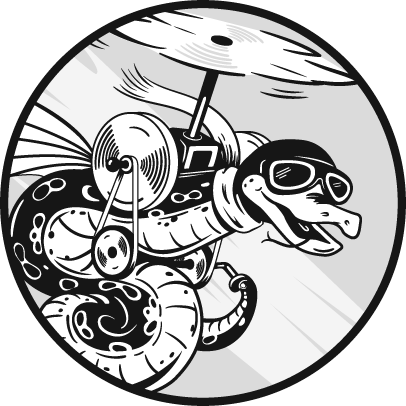

# 序言

Python 是一门独特的语言。作为一名软件开发人员，我已经开始欣赏它的独特性。一个写得好的 Python 程序具有某种艺术的美感。当我找到最“Pythonic”的解决方案时，我喜欢回过头来看，想知道我当时怎么会觉得其他答案会更好。

不幸的是，多年来，我一直被一种本能的欲望所困扰，总是通过我所知道的其他语言的视角来看待 Python。虽然我能读写 Python，但我无法看出某些做法的“显而易见性”。就像用翻译词典说西班牙语一样。我能写 Python，但我不能真正地*用 Python 思考*。这门语言的本质特性对我来说是迷失的。

一旦我开始真正理解 Python——用它思考——我在这门语言中找到了新的乐趣。解决方案变得显而易见。设计变成了享受，而不是谜题。

当一个全新的开发者开始接触 Python 时，他们几乎没有什么先入为主的观念。他们没有“母语”来妨碍他们对这门语言的学习。但对于一个将 Python 作为第二或第三门语言学习的资深开发者来说，过渡在某些方面要困难得多。他们不仅需要学习新的东西，而且在许多方面，他们还必须*忘记*一些旧的东西。

*Dead Simple Python* 是那段旅程的指南。

## 这本书适合谁阅读？

如果你已经熟悉其他编程语言，并且现在希望第一次学习 Python，而不想通过面向初学者的课程来消耗时间，那么这本书适合你。我将特别关注“Pythonic”的做事方式，并对底层的一般编程概念进行最小、针对性的解释。

如果你是中级 Python 开发者，你也会发现这本书对你有帮助。尽管我自己已经使用 Python 很多年了，但有些话题直到最近才真正“触动”我。这本书提供了我希望当初能得到的解释。

如果你还不懂编程，不要灰心。现在有数百本优秀的书籍和资源可以帮助你学习 Python 作为第一门编程语言。我特别推荐 Eric Matthes 的《*Python Crash Course*》第二版（No Starch Press, 2019）或 Al Sweigart 的《*Automate the Boring Stuff with Python*》第二版（No Starch Press, 2019）。然后，你可以回到本书中，巩固并扩展你刚刚学到的知识。

## “简单”意味着什么？

本书讨论的主题，乍一看，可能显得并不简单。你可能会想，这本书这么厚，怎么可能简单呢？

当我为本书命名为*死简单 Python*时，我描述的是对这些主题的回顾视角，而非前瞻性视角。应该认识到，任何值得学习的主题，在最初接触时都会显得难以逾越。同样，任何值得现有软件开发者学习的解释，都应该具有足够的深度，完全排除它作为“简单”的前瞻性标签。

相反，我的目标是以一种方式来剖析每个主题，使得在章节结束时，读者无法不觉得这个概念是完全显而易见的。无论主题最初看起来多么复杂，读者最终应该留下的印象是它其实是“死简单”的，到那时，他们就可以确信自己已经像一名本土 Python 开发者一样思考。

为了达到这个理解水平，我通常从最底层、最明确的形式开始剖析每个主题。一旦基础建立，我会层层递进，最终达到大多数人常用的隐性、习惯用法。通过这种方式，我希望帮助你，读者，获得对每个语言特性为什么以及如何工作的扎实、舒适的理解。

## 本书内容

*死简单 Python* 被分为五个部分。与许多面向初学者的课程不同，我假设你想尽快开始编写生产质量的代码（而不仅仅是过于简化的教程示例）。我的方法要求你做一些初步的工作，但通过确保你能更轻松地将新知识应用于实际项目，它最终会带来回报。

第一部分，“Python 环境”（第 1-4 章），为你扎实地奠定了 Python 世界的基础：其哲学、工具、基本语法和项目布局。这将为编写真正的、有意义的代码提供坚实的基础。

第二部分，“基本结构”（第 5-8 章），探讨了 Python 的基本结构元素——变量、函数、类和异常——并教你如何最大化它们的潜力。

第三部分，“数据与流”（第 9-12 章），涵盖了许多独特的控制执行流和操作数据的方法。它讨论了数据结构、循环、迭代、生成器、协程、文件和二进制数据。

第四部分，“高级概念”（第 13-17 章），解锁了可以使你的代码更强大的高级技巧，包括继承、反射和并发。它涉及了许多大多数课程和教程都会略过的“可怕”主题。

第五部分，“超越代码”（第 18-20 章），教你如何测试、调试和部署真实项目。

最后，第二十一章概述了你可以从这里开始的许多 Python 开发之路。

## 本书不包括的内容

由于本书面向的是已有编程经验的读者，我不会过多地重复一般性理论。读者应该已经知道（从语言无关的角度）什么是变量和函数，类和对象之间的区别等等。最多，我会简要定义那些在编程界并不完全普及的概念。

我的讨论内容远不全面。我更注重探讨 *为什么* 和 *如何*，从而提供一个坚实的基础。鼓励读者通过额外的独立阅读来扩展自己的理解，因此我会把库函数等的详尽列举留给文档。标准库中许多流行的功能，如随机数和日期时间操作，在例子中使用时往往只是得到简短的说明。

为了控制本书的范围，我也不会涉及大多数第三方工具和库。我经常被要求讨论与 Python 默认工具相对的流行替代品，但由于这些替代品像季节更替一样时有时无，我将主要坚持使用通用的默认工具。当然也有一些例外，只有在某个第三方工具已在生态系统中变得几乎无处不在，甚至超越了标准库时，我才会提及它。

通常，当一个第三方工具或库特别值得注意时，我会将读者引导到它的官方文档或网站。

## 如何阅读本书

*Dead Simple Python* 更像是一次引导式的旅程，而非桌面参考书。我建议从本书一开始读起，按顺序逐章阅读。无论你是刚接触这门语言的新手，还是已经尝试过一段时间却感觉自己始终没有“掌握”它的人，你会发现，这种方法能够填补你未曾意识到的许多知识空白。

然而，如果你知道自己 *现在* 需要更好理解某个特定话题，可以直接跳到相应的章节。大多数章节都是独立的，但我会始终假设你已经阅读并理解了前面章节的内容。

### 关于词汇

几乎所有的 Python 书籍或在线文章都会使用借自其他语言的词汇，例如 *element*（元素）、*body*（主体）和 *variable*（变量）等词汇。虽然这种做法常常被认为有助于将 Python 概念与读者已有的知识关联，但我认为借用这些词汇最终是适得其反的。主要通过其他语言的术语来理解 Python 会让很多尝试编写清晰、规范代码的努力变得更加艰难。而且，如果习惯了使用错误的词汇，官方文档也会显得非常难以阅读。

因此，我决定坚持使用官方术语，即使大多数社区成员认为某些近似同义词是可以接受的。这可能是为数不多的坚持这一立场的书籍之一，但我认为这是非常重要的。要成为本地人，你必须学会讲当地的方言！

### 理论回顾

根据你已经掌握的语言，你的理论知识库中可能会有一些空白。例如，如果你是 Haskell 开发者，可能对面向对象编程不太熟悉；如果你是 C++开发者，可能对纯函数式编程不太了解。

为了弥补这些空白，我提供了偶尔的*理论回顾*，简要概述与某些编程范式和模式相关的基本理论和最佳实践。这样，如果你已经熟悉某个概念，你可以跳过理论回顾，直接进入与 Python 相关的内容。

### 客观还是有偏见？

在一本技术书籍中，几乎不可能完全排除个人观点，尤其是像本书这样专注于惯用实践的书籍，但我希望自己尽力保持客观。

*简单 Python* 不是我个人对 Python 的看法，而是 Python 社区的集体智慧的浓缩。我不是开始写书时的那个开发者。经过两年的研究、实验和激烈辩论，我的开发实践发生了巨大的变化。

尽管如此，永远无法让每个人都满意。有时候，我会在文中特别提到那些永远没有得出令人满意结论的争论。即使是我认为已经解决的问题，也可能会引起一些 Python 开发者的强烈反应；事实上，直到我更好地理解它们，一些问题也曾让我产生过强烈的反应。

我建议你以开放的心态阅读这本书，即使你认为自己对编程或甚至对 Python 本身已经相当熟悉。我已经努力解释书中所有建议的理由，并且鼓励你期待*任何*有效的建议都能附带相同程度的推理。

### 示例

我在书中大多数示例的构造上都经过了精心设计，旨在展示我所讨论的每个主题的实际（尽管是简化的）用例。在很多情况下，我会故意让示例变得复杂，以突出教程中常常忽视的问题和惊讶。我已经尽力指出每次我的示例变得有些复杂的地方，但你需要知道，我也可能会简化某些内容，或者避开与当前主题无关的部分。

这种方法也常常需要比你习惯的教程更长的示例，因此章节可能比实际内容看起来要长。不要被页面数量吓到，一次专注于一个部分。

本书中的所有示例都可以运行，或者至少可以按预期失败，除非另有说明。我始终遵循 Python 风格规范。我强烈推荐你自己重新输入每个示例并进行实验。

我已经努力将 Python 代码中的部分保存到文件作为可运行示例的段落进行标注。每个文件名都有给出，段落也按 `:1`、`:2` 等编号。当某个段落被修改时，我会在段落后加一个字母，因此 `:2b` 会修改 `:2a`；这些修改本身是用**粗体**标出的。

本书中的几乎所有示例都可以在本书的官方 GitHub 仓库中找到：[`github.com/codemouse92/DeadSimplePython`](https://github.com/codemouse92/DeadSimplePython)

### 那么项目怎么办？

我曾被问到为什么不提供一个完整的项目让我们在书中一起做，答案其实很简单：我假设你可能已经有一个想用 Python 完成的项目。与其让你分心，不如专注于以一种你能应用到自己工作中的方式呈现材料。

如果你*没有*项目想法，现在可能是个很好的时机开始一个项目！想想一个你个人希望有解决方案（或更好的解决方案）的难题，然后去构建这个解决方案。挑选问题的一小部分，从那里开始。没有什么神奇的公式可以帮助你创建完美的第一个项目，唯一的原则就是它应该是你自己会使用的东西。不要担心第一次做的不完美，甚至做得不好。这个行业有句真理：“你总是会把第一个丢掉。”不要害怕一开始做错！这本书会给你工具，帮助你回过头来做对。

当然，如果某个项目对你来说完全不可行，你只需要完成本书中的示例就能做得很好。

无论如何，我***强烈***推荐你创建一个个人“靶场”项目，在一个能够尝试 Python 的环境中，在破坏东西不会有重大后果的情况下进行实验。我将在第二章和第三章介绍如何运行 Python 代码，并在第四章讲解项目结构。第十八章中，我会再次讨论项目结构，讲解打包和分发。

## 前提条件

+   你应该已经了解另一种编程语言的基本知识。本书教授的是 Python，而不是编程。

+   你应该有一台能够运行 Python 3.7 或更高版本的计算机。如果你还没有安装 Python，不用担心——我们将在第二章进行安装。

+   你应该了解如何在计算机上使用命令行，特别是相对路径和绝对路径，以及如何浏览文件系统。如果你不理解这些，去学一下吧。（我等你。）

+   你应该有网络连接，哪怕是较慢的网络，也能用来查看文档和偶尔下载软件包。不过，我尽力使得大部分示例都能在没有网络的情况下运行。

现在，去拿一杯你最喜欢的饮品，带上笔记本和钢笔，坐在电脑前。我们开始吧！
