## 第一章：序言


学会编写代码能让你解决复杂问题。通过利用现代 CPU 的能力，它们每秒可以执行数十亿次操作，我们可以快速且准确地解决困难的问题。

本书介绍了如何使用 Python 解决工程问题。我们将学习如何编写几何原语，这些原语将作为更复杂操作的基础，如何从文件中读取和写入数据，如何创建矢量图像和动画序列来展示结果，以及如何解决大规模线性方程组。最后，我们将把这些知识结合起来，构建一个解决桁架结构问题的应用程序。

### **本书适合谁阅读**

本书面向工程学学生、已毕业的工程师，或任何希望学习如何编写应用程序来解决工程问题的技术背景人士。

数学和力学的基础是必需的。我们将使用线性代数、二维几何和物理学的概念。我们还将使用一些材料力学和数值方法的知识，这些是许多工程学科的常见内容。为了让更多读者能从本书中获益，我们不会深入探讨这些主题。本书中学到的技术以后可以用来解决涉及更复杂概念的问题。

为了跟上本书的内容，你需要具备一定的编码技能和基本的 Python 知识。本书不是一本编程入门书；市面上有很多其他优秀的书籍可以覆盖这些内容。如果你正在寻找这样的书，我推荐 Eric Matthes 的 *Python Crash Course*（No Starch Press，2019 年）。网上也有很多很棒的资源，我最喜欢的是 [*https://realpython.com*](https://realpython.com)。官方的 Python 网站也有很多很好的教程和文档： *[`www.python.org/about/gettingstarted/`](https://www.python.org/about/gettingstarted/)*。

我们将编写大量代码，因此强烈建议你在阅读时随身携带计算机，并输入和测试本书中的所有代码。

### **你将学到的内容**

在本书中，我们将探讨编写健壮应用程序的技术，确保它们能够正确且快速地解决工程问题。为了确保正确性，我们将使用自动化测试来测试我们的代码。你构建的每个应用程序都应该通过自动化测试进行充分测试，正如我们在本书中所讨论的那样。

工程应用通常需要输入一些数据，因此我们还将学习如何从文件中读取程序的输入，并使用正则表达式进行解析。

工程应用通常需要解决大型方程组，因此我们将介绍如何编写数值方法来进行这些复杂的计算。我们将重点讲解线性方程组，但相同的技术也可以轻松应用于编写非线性方程的数值算法。

最后，工程应用需要产生结果。我们将学习如何将文本写入文件，以便稍后检查。我们还将学习如何生成漂亮的矢量图和动画序列，以展示程序的结果。正如他们所说，一张图胜过千言万语：看着一张清晰的图表，描述了最相关的解决方案值，能让程序的价值大大提升。

为了说明这些概念，我们将通过构建一个解决二维桁架结构的应用程序来结束本书。这款应用程序将包含你构建工程应用所需的一切知识。在构建这个应用程序时获得的知识可以轻松转化为编写其他类型工程应用的能力。

### **关于本书**

在本节中，我们将解释三件事：本书标题背后的含义、选择 Python 的原因，以及目录内容。

#### ***“Hardcore”是什么意思？***

本书标题中的*Hardcore*一词指的是我们将自己编写所有代码，只依赖 Python 标准库（Python 自带的库）；我们不会使用任何第三方库来解方程或绘制矢量图形。

你可能会想，为什么呢？如果已经有人写了能为我们做这些事情的代码，为什么不直接使用它呢？难道我们不是在重新发明轮子吗？

这是一本关于学习的书，而要学习，你需要亲自去做。除非你重新发明轮子，否则你永远不会理解轮子的原理。一旦你的软件技能扎实，写了成千上万行代码，并参与了大量项目，你就能很好地判断哪些外部库适合你的需求，以及如何利用它们。但是，如果你从一开始就使用这些库，你会习惯使用它们，并理所当然地接受这些解决方案。始终问问自己，这个库的代码是如何解决我的问题的，这一点很重要。

就像其他任何事情一样，编码需要练习。如果你想在编程上做得好，你需要写很多代码；没有捷径可走。如果你是为了赚钱写软件，或者希望尽快将一个想法推向市场，那么可以使用现有的库。但是，如果你是在学习并希望在编写代码的艺术上变得熟练，就不要使用库。自己编写代码。

#### ***为什么选择 Python？***

Python 是最受欢迎的编程语言之一。根据 Stack Overflow 2020 年的开发者调查（*[`insights.stackoverflow.com/survey/2020`](https://insights.stackoverflow.com/survey/2020)*），Python 是今天第三受欢迎的语言，有 66.7%的用户愿意在未来继续使用它，仅次于 TypeScript 和 Rust（参见图 1）。


*图 1：2020 年最受欢迎的编程语言（来源：Stack Overflow 调查）*

这项调查将 Python 排在了“最受欢迎”语言的首位：30% 的受访开发者表示，他们虽然目前没有使用 Python，但有兴趣学习它（见 图 2）。


*图 2：2020 年最受欢迎语言（来源：Stack Overflow 调查）*

这些结果并不令人惊讶；Python 是一门非常多才多艺且富有生产力的语言。用 Python 编写代码是一件愉快的事，它的标准库也非常完善：几乎任何你想做的事情，Python 都能提供相应的帮助。

我们在本书中使用 Python，不仅因为它的流行，还因为它易于使用且功能多样。Python 的一个优点是，如果你正在阅读本书且之前没有接触过这门语言，你也不需要太长时间就能上手。它是一门相对容易学习的语言，互联网上有大量的教程和课程可以帮助你。

Python 通常并不被视为一门快速的语言，实际上，Python 的执行速度并不是其强项。下面的 图 3 显示了用 Python 和 Go（Google 开发的一门非常快速的语言）编写的相同三个程序的执行时间（单位：秒）对比。在所有情况下，Python 的执行时间都远远长于 Go。

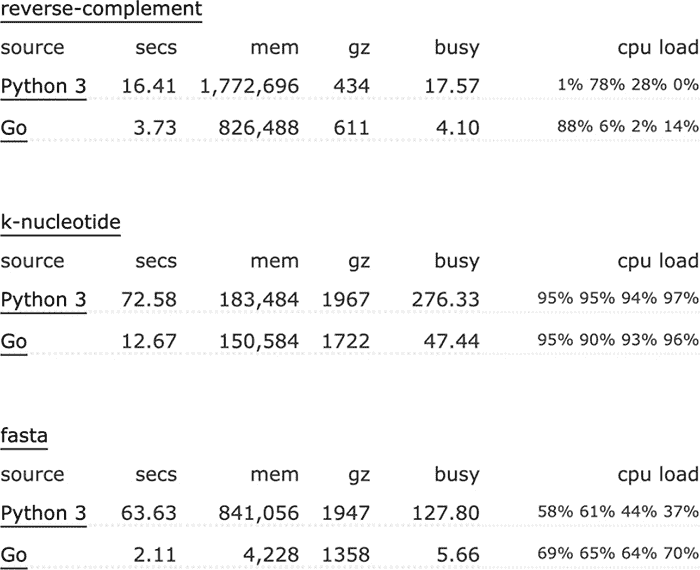

*图 3：Python 性能基准（来源：[`benchmarksgame-team.pages.debian.net/benchmarksgame/fastest/python3-go.html`](https://benchmarksgame-team.pages.debian.net/benchmarksgame/fastest/python3-go.html))*

那么，我们不关心速度吗？我们当然关心，但在本书中，我们更关心的是开发时间和开发体验。Python 拥有许多能让编码变得愉快的结构；例如，像过滤或映射集合这样的操作，Python 可以通过列表推导式轻松实现，而在 Go 中，你需要使用传统的 for 循环来做这些操作。对于我们将要编写的几乎每个程序，执行时间都不会成为问题，因为我们会获得足够好的结果。如果你在应用中遇到速度问题，本书中学到的技能将有助于你转向其他更快的语言。

在我们开始学习之前，先快速浏览一下你将在本书中遇到的主题。

#### ***概览***

本书将涵盖大量内容。每一章都在上一章的基础上展开，因此你需要确保按照顺序阅读本书，并完成每一章提供的代码练习。

本书包括以下章节：

**第一部分：基础**

**第一章：Python 简介** 介绍了一些中级 Python 主题，这些内容将在本书中贯穿始终。我们将讨论如何将代码分割成模块和包，如何使用 Python 的集合，以及如何运行 Python 脚本和导入模块。

**第二章：两种 Python 编程范式** 介绍函数式编程和面向对象编程范式，并探索在这些风格下编写代码的技巧。

**第三章：命令行** 教你如何使用命令行运行程序和执行其他简单任务，如创建文件。

**第二部分：二维几何**

**第四章：点与向量** 讲解最基础但至关重要的几何基本元素：点和向量。全书其余内容都依赖于这两种基本元素的实现，因此我们还将学习自动化测试，以确保我们的实现没有 bug。

**第五章：直线与线段** 将直线和线段这两个几何基本元素加入我们的几何工具箱。我们将学习如何检查两条线段或直线是否相交，以及如何计算交点。

**第六章：多边形** 将矩形、圆形和一般多边形加入我们的几何工具箱。

**第七章：仿射变换** 讲解仿射变换，这是一种有趣的代数构造，我们将利用它来生成美丽的图像和动画。

**第三部分：图形与仿真**

**第八章：绘制矢量图像** 介绍了可缩放矢量图形（SVG）图像格式。我们将编写自己的库，使用几何基本元素生成这些图像。

**第九章：通过三点构建圆** 综合前几章的知识，构建我们的第一个应用程序，找到通过三个给定点的圆，并将结果绘制成矢量图像。

**第十章：图形用户界面与画布** 讲解了 Tkinter 包的基础知识，Tkinter 用于在 Python 中构建用户界面。我们将大部分时间用于学习如何使用 Canvas 小部件，它用于在屏幕上绘制图像。

**第十一章：动画、仿真与时间循环** 带领你通过绘制 Tkinter 的 Canvas 中的动画过程。我们将探索工程仿真和视频游戏引擎中使用的时间循环概念，用于将场景渲染到屏幕上。

**第十二章：动画化仿射变换** 创建一个应用程序，动画化仿射变换对某些几何基本元素的影响。

**第四部分：方程组**

**第十三章：矩阵与向量** 介绍了向量和矩阵构造，并讲解如何编码这些基本元素，这对我们处理方程组时非常有用。

**第十四章：线性方程组** 讲解了如何实现数值方法来求解大规模线性方程组。我们将一起实现 Cholesky 分解法；该算法将用于求解本书最后部分将出现的方程组。

**第 V 部分：桁架结构**

**第十五章：结构模型** 回顾了我们将在本书这一部分使用的基本材料力学概念。我们还将编写类来表示桁架结构。通过这个桁架结构模型，我们将构建一个完整的结构分析应用程序。

**第十六章：结构解析** 利用上一章构建的模型，我们将讲解所有计算内容，以找到结构的位移、变形和应力。

**第十七章：从文件读取输入** 讲解了文件读取和解析的实现，以便我们的桁架分析应用能够依赖存储为纯文本的数据。

**第十八章：生成 SVG 图像和文本文件** 讨论了基于结构解生成 SVG 图像图表的过程。在这里，我们将使用我们自己的 SVG 包来绘制图表，图表中将包含所有相关细节，例如变形结构的几何形状以及每根杆件旁边的应力标签。

**第十九章：组装我们的应用程序** 解释了如何将前几章构建的各个部分组合起来，构建完整的桁架分析应用。

### **设置您的开发环境**

本书将使用 Python 3，并提供在开发环境程序 PyCharm 中工作的指导，PyCharm 让我们可以高效地进行工作。代码已在 Python 3.6 到 3.9 版本中测试过，但它很可能在未来的 Python 版本中也能正常工作。让我们下载本书随附的代码，安装最新的 Python 3 解释器，并设置 PyCharm。

#### ***下载书籍代码***

本书的所有代码都可以在 GitHub 上找到，地址是 [*https://github.com/angelsolaorbaiceta/Mechanics*](https://github.com/angelsolaorbaiceta/Mechanics)。再次提醒，虽然我强烈建议你自己编写所有代码，但将其作为参考是个好主意。

如果你熟悉 Git 和 GitHub，可能希望克隆该代码库。此外，我建议你不时从仓库中拉取更新，因为我可能会在项目中添加新功能或修复 bug。

如果你不熟悉 Git 版本控制系统或 GitHub，最好的选择是下载一份代码副本。你可以通过点击 **Clone** 按钮并选择 **下载 ZIP** 选项来完成此操作（参见 图 4）。

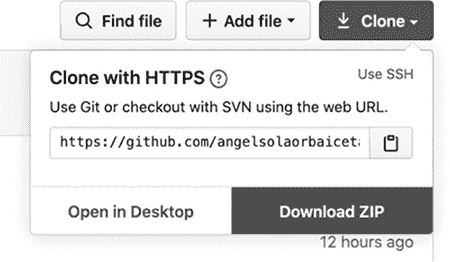

*图 4：从 GitHub 下载代码*

解压项目并将其放置在你选择的目录中。如你所见，我使用 *README 文件*（*README.md*）记录了项目中的每个包和子包。这些文件通常出现在软件项目中，它们解释并记录了项目的特性，并包含有关如何编译或运行代码的说明。README 文件是你打开软件项目时首先要阅读的内容，因为它们描述了如何配置项目并使代码运行。

**注意**

*README 文件是使用 Markdown 格式编写的。如果你想了解更多关于这种格式的内容，可以阅读这里的介绍：* [`www.markdownguide.org/`](https://www.markdownguide.org/)。

GitHub 上的 *Mechanics* 项目包含的代码比我们在本书中涵盖的要多。我们不想让本书太长，因此未能涵盖项目中包含的所有内容。

例如，在第十四章《线性方程》中，我们讨论了解决线性方程组的数值方法，并详细解释了 Cholesky 分解。项目中还有一些其他的数值方法，例如共轭梯度法，由于时间限制我们无法在书中涵盖；这些代码可以供你分析和使用。项目中还有很多自动化测试，我们为了简洁省略了它们；在编写自己的代码时可以参考这些测试。

是时候安装 Python 了。

#### ***安装 Python***

你可以从 [*https://www.python.org/downloads/*](https://www.python.org/downloads/) 下载适用于 macOS、Linux 和 Windows 的 Python。对于 Windows 和 macOS，你需要下载安装程序并运行它。

Linux 通常自带 Python。你可以通过在终端中使用以下命令检查你电脑上安装的版本：

```py
$ python3 -V
Python 3.8.2
```

要在 Linux 计算机上安装 Python 版本，你可以使用 *os* 包管理器。对于使用 *apt* 包管理器的 Ubuntu 用户，命令如下：

```py
$ sudo apt install python3.8
```

对于 Fedora 用户，使用 *dnf* 包管理器，命令如下：

```py
$ sudo dnf install python38
```

如果你使用的是其他 Linux 发行版，快速的 Google 搜索应该能帮你找到使用包管理器安装 Python 的说明。

重要的是，你下载的是 Python 3 的版本，比如 3.9，这是在写作时的当前版本。任何版本高于 3.6（包含 3.6）都会有效。

**注意**

*Python 2 和 3 不兼容；针对 Python 3 编写的代码很可能无法在 Python 2 解释器上运行。语言以一种不向后兼容的方式发展，版本 3 中的一些特性在版本 2 中不可用。*

#### ***安装和配置 PyCharm***

在我们开发代码时，我们需要使用 *集成开发环境*（简称 IDE），这是一种配备有帮助我们更高效写代码的功能的程序。IDE 通常提供自动补全功能，让你在输入时知道有哪些可用选项，并且还提供构建、调试和测试工具。花时间学习你所选择的 IDE 的主要功能是值得的：它会在开发阶段让你更加高效。

本书将使用 PyCharm，这是 JetBrains 创建的一个强大 IDE，JetBrains 不仅开发了市场上一些最优秀的 IDE，还开发了自己的编程语言 Kotlin。如果你已经有一定的 Python 经验，并且更喜欢使用其他 IDE，比如 Visual Studio Code，也可以使用，但你需要根据你的 IDE 文档自行解决一些问题。如果你之前没有太多 IDE 使用经验，我建议你坚持使用 PyCharm，这样你可以跟着本书一起学习。

要下载 PyCharm，请访问[*https://www.jetbrains.com/pycharm/*](https://www.jetbrains.com/pycharm/)，然后点击 **Download** 按钮（见 图 5）。


*图 5：下载 PyCharm IDE*

PyCharm 可用于 Linux、macOS 和 Windows。它有两个版本：专业版和社区版。你可以免费下载社区版。按照安装步骤将 PyCharm 安装到你的计算机上。

##### **打开 Mechanics 项目**

让我们使用 PyCharm 设置你之前下载的 *Mechanics* 项目，这样你就可以玩一下并将其代码作为参考。

打开 PyCharm，在欢迎界面点击 **Open** 选项。找到你之前下载或从 GitHub 克隆的 *Mechanics* 项目文件夹并选择它。PyCharm 应该会打开该项目并为其配置 Python 解释器，使用你计算机上安装的 Python 版本。

每个 PyCharm 项目都需要设置 Python 解释器。由于你的计算机上可能安装了多个不同版本的 Python，且你可能选择了自定义安装位置，因此你需要告诉 PyCharm 使用哪个 Python 版本来解释项目的代码，并且需要指明在系统中哪里可以找到 Python 解释器。对于 Windows 和 Linux 用户，打开菜单并选择 **File** ▸ **Settings**。对于 macOS 用户，选择 **PyCharm** ▸ **Preferences**。在 Settings/Preferences 窗口中，点击左侧栏的 **Project: Mechanics** 部分展开它，然后选择 **Python Interpreter**（见 图 6）。

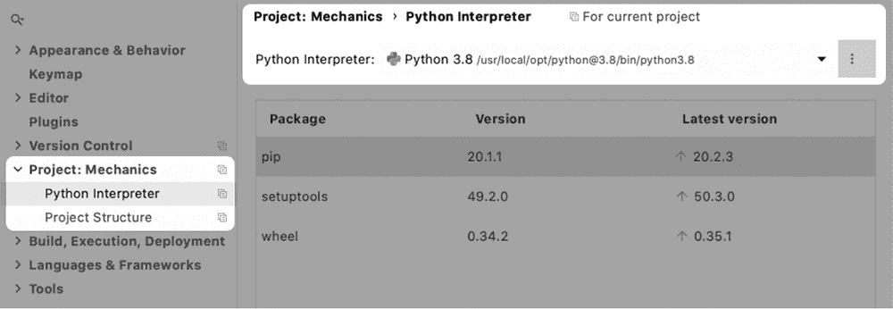

*图 6：设置项目的 Python 解释器*

在窗口右侧，点击 Python 解释器字段旁边的下拉箭头，从下拉菜单中选择你在计算机上安装的 Python 二进制版本。如果你按照之前的说明操作，Python 应该已安装到 PyCharm 可以找到的默认目录中，因此解释器应该出现在列表中。如果你将 Python 安装在其他地方，则需要告诉 PyCharm 安装目录。

**注意**

*如果在设置项目的解释器时遇到任何问题，请查看 PyCharm 的官方文档：* [`www.jetbrains.com/help/pycharm/configuring-python-interpreter.html`](https://www.jetbrains.com/help/pycharm/configuring-python-interpreter.html)*。该链接包含了详细的操作说明。*

现在你已经打开了 *Mechanics* 项目，项目应该已经设置好了。双击 PyCharm 中的 *README.md* 文件打开。默认情况下，当你在 PyCharm 中打开一个 Markdown 文件时，会显示分屏视图：左侧是 Markdown 原始文件，右侧是文件的渲染版本。参见 图 7。

这个 *README.md* 文件解释了项目的基本结构。随意浏览预览中的链接；给自己一些时间阅读每个包中的 README 文件。这将帮助你了解我们将在本书中一起完成的工作量。

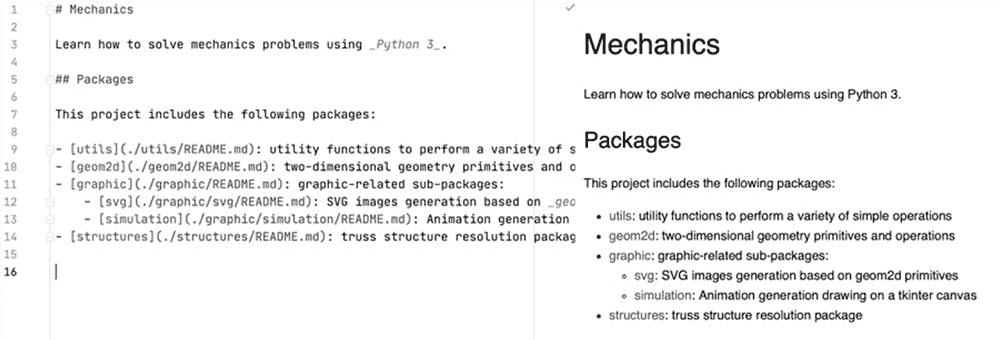

*图 7：带有 PyCharm 分屏视图的 README.md 文件*

##### **创建自己的 Mechanics 项目**

现在你已经设置好了下载的 *Mechanics* 项目作为参考，让我们创建一个新的空项目，在其中编写代码。如果你有打开的项目，关闭它（选择 **文件** ▸ **关闭项目**）。你应该会看到欢迎页面，如 图 8 所示。

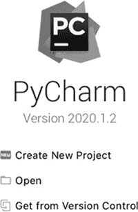

*图 8：PyCharm 欢迎界面*

在欢迎页面选择 **创建新项目**。系统会要求你为项目命名：使用 *Mechanics*。然后，在解释器选项中，选择 **现有解释器**（而不是默认的 New environment using）（参见 图 9）。找到你在引言中下载的 Python 版本并点击 **创建**。

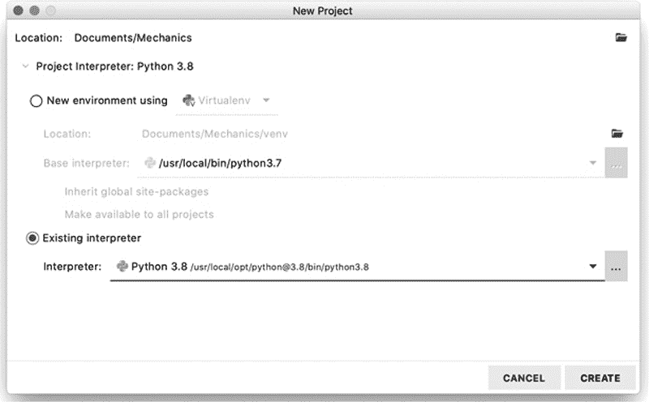

*图 9：PyCharm，创建新项目*

你应该已经创建了一个新的空项目，准备好编写代码了。让我们快速浏览一下 PyCharm 的主要功能。

### **PyCharm 介绍**

本节绝不是 PyCharm 使用的全面指南。要获取更完整的 IDE 概述，请阅读[ *https://www.jetbrains.com/help/pycharm* ](https://www.jetbrains.com/help/pycharm)上的文档。官方文档完整且包含最新功能。

PyCharm 是一个强大的 IDE，它的 Community（免费）版本即使如此，也包含了大量功能；它让使用 Python 的过程变得非常愉悦。它的用户界面（UI）可以分为四个主要部分（请参见图 10）。

**导航栏** 窗口顶部是导航栏。导航栏的左侧是当前打开文件的面包屑导航。右侧有运行和调试程序的按钮，以及显示当前运行配置的下拉列表（我们将在本书稍后介绍运行配置）。

**项目工具窗口** 这是你的项目的目录结构，包含所有的包和文件。

**编辑器** 这是你编写代码的地方。

**终端** PyCharm 配备了两个终端：系统终端和 Python 终端。我们将在全书中使用这两者。我们将在第三章中介绍这些内容。


*图 10：PyCharm 用户界面*

PyCharm 还在 UI 的右下角包含了项目的 Python 解释器。你可以从这里更改解释器的版本，从你系统中安装的版本列表中进行选择。

#### ***创建包和文件***

我们可以在项目中使用项目工具窗口创建新的 Python 包（我们将在第一章中介绍包的内容）。要创建一个新包，请打开项目工具窗口，右键点击你希望创建新包的文件夹或包；在出现的菜单中选择 **新建** ▸ **Python 包**。同样，选择 **新建** ▸ **Python 文件** 来创建 Python 文件。你可以在图 11 中看到这些选项。

你还可以通过选择 **新建** ▸ **目录** 来创建常规目录，通过 **新建** ▸ **文件** 创建各种类型的文件，后者会让你自己选择文件的扩展名。常规目录和 Python 包的区别在于，后者包含一个名为 *__init__.py* 的文件，该文件告诉 Python 解释器将该目录视为包含 Python 代码的包。你将在第一章中进一步了解此内容。

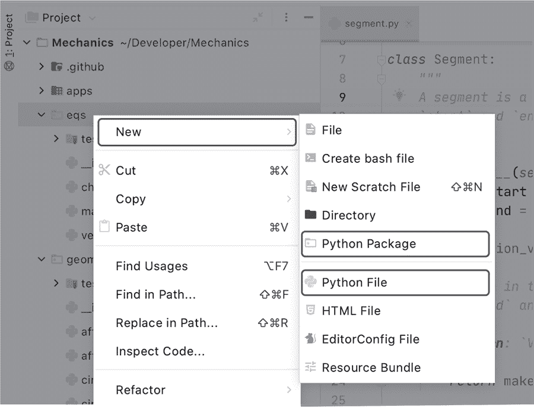

*图 11：PyCharm 新建包或文件*

#### ***创建运行配置***

*运行配置* 就是告诉 PyCharm 我们希望如何运行我们的项目（或其一部分）。我们可以保存这个配置，以便多次使用。配置好运行配置后，我们只需按一个按钮就能执行应用程序，而不需要在 shell 中写命令，这样就避免了复制粘贴参数、输入文件名等麻烦。

运行配置可以包含关于应用程序入口点、要重定向到标准输入的文件、必须设置的环境变量以及传递给程序的参数等信息。运行配置是开发中的便利工具；正如我们将在下一节看到的那样，它们还允许我们轻松调试 Python 代码。您可以在此处找到有关运行配置的官方文档：[*https://www.jetbrains.com/help/pycharm/run-debug-configuration.html*](https://www.jetbrains.com/help/pycharm/run-debug-configuration.html)。

让我们自己创建一个运行配置来积累一些实践经验。首先，让我们创建一个新的空项目。

##### **创建测试项目**

要从菜单创建新项目，请选择 **文件** ▸ **新建项目**。在创建项目对话框中，为项目命名为 *RunConfig*，选择 **现有解释器** 选项，然后点击 **创建**。

在这个新的空项目中，在项目工具窗口中右键单击 *RunConfig* 空目录，然后选择 **新建** ▸ **Python 文件**。命名为 *fibonacci*。打开文件并输入以下代码：

```py
def fibonacci(n):
    if n < 3:
        return 1

    return fibonacci(n - 1) + fibonacci(n - 2)

fib_30 = fibonacci(30)
print(f'the 30th Fibonacci number is {fib_30}')
```

我们编写了一个使用递归算法计算第 *n* 个斐波那契数的函数，然后用它来计算并打印第 30 个数。让我们创建一个新的运行配置来执行此脚本。

##### **创建新的运行配置**

要创建新的运行配置，请从菜单选择 **运行** ▸ **编辑配置**；对话框中应该出现 图 12。

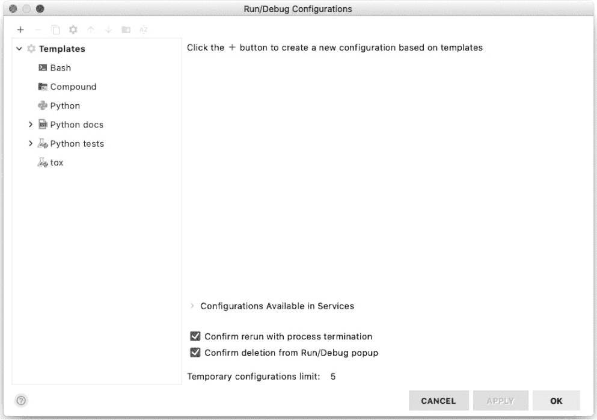

*图 12：运行/调试配置对话框*

如您所见，我们可以使用几个模板来创建新的运行配置。每个模板定义了帮助我们轻松创建正确类型配置的参数。在本书中，我们只会使用 Python 模板。此模板定义了一个运行配置，用于运行和调试 Python 文件。

在对话框中，点击左上角的 **+** 按钮，从可用模板列表中选择 **Python**（见图 13）。

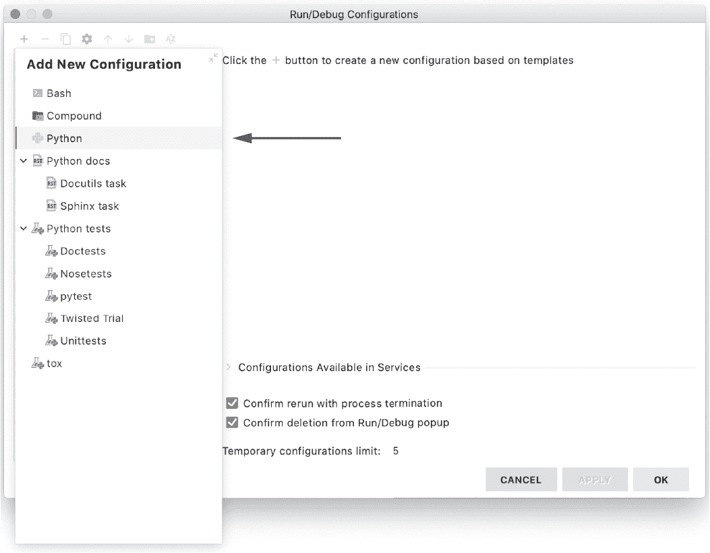

*图 13：创建新的 Python 运行配置*

选择配置模板后，对话框的右侧将显示我们需要为此配置提供的参数以运行我们的代码。我们只需要填写其中两个参数：配置名称和脚本路径。

找到对话框顶部的名称字段，并输入 **fibonacci**。然后找到配置部分下的脚本路径字段，并单击其右侧的文件夹图标。单击此图标后，文件对话框应该会打开，位于项目根文件夹内，正好是我们添加了 *fibonacci.py* 文件的地方。选择此文件作为脚本路径。您的新配置对话框应该类似于 图 14。点击 **确定**。

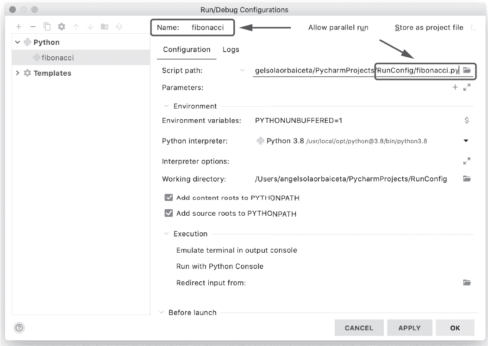

*图 14：运行配置参数*

你已经成功创建了一个运行配置。让我们使用它。

##### **使用运行配置**

在导航栏的右侧，找到运行配置选择器。图 15 展示了这个选择器。


*图 15：运行配置选择器*

在下拉列表中，选择你刚刚创建的运行配置，然后点击绿色播放按钮执行它。你应该会在 IDE 的终端看到以下消息：

```py
the 30th Fibonacci number is 832040

Process finished with exit code 0
```

你也可以通过菜单来启动运行配置，选择**运行** ▸ **运行‘fibonacci’**。

我们已成功使用运行配置启动了我们的*fibonacci.py* 脚本。现在让我们使用它来学习如何调试 Python 代码。

#### ***调试 Python 代码***

当我们的程序出现异常而我们不知道原因时，可以调试程序。要调试程序，我们可以逐行执行它，一次一步，检查变量的值。

在调试脚本之前，我们稍微修改一下斐波那契函数。假设该函数的用户抱怨它在处理大数字时太慢。例如，他们说在计算第 50 个斐波那契数时，必须等待几分钟：

```py
# this will fry your CPU... be prepared to wait
>>> fibonacci(50)
```

经过仔细分析，我们意识到目前实现的斐波那契函数可以通过缓存已计算的斐波那契数来改进，这样可以避免反复计算。为了加速执行，我们决定将已计算的数存储在字典中。请像这样修改你的代码：

```py
cache = {}

def fibonacci(n):
    if n < 3:
        return 1

    if n in cache:
        return cache[n]

    cache[n] = fibonacci(n - 1) + fibonacci(n - 2)
    return cache[n]

fib_30 = fibonacci(30)
print(f'the 30th Fibonacci number is {fib_30}')
```

在我们开始调试之前，尝试再次运行脚本，确保它仍然能够产生预期的结果。你可以进一步尝试计算第 50 个数字：这次它将在毫秒内完成计算。如下所示：

```py
--snip--

fib_50 = fibonacci(50)
print(f'the 50th Fibonacci number is {fib_50}')
```

结果如下：

```py
the 50th Fibonacci number is 12586269025

Process finished with exit code 0
```

现在让我们在调用函数的那一行停止执行：

```py
fib_50 = fibonacci(50)
```

为此，我们需要设置一个*断点*，在此断点处，Python 解释器会停止执行。你可以通过两种方式设置断点：要么点击编辑器中你想停止的位置，稍微靠近行号右侧（在图 16 中可以看到出现的点），要么点击行中的任何位置，然后从菜单中选择**运行** ▸ **切换断点** ▸ **行断点**。

如果你成功添加了断点，你应该会看到一个点，像图 16 中那样。

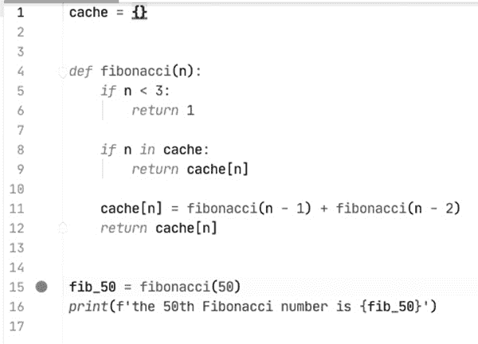

*图 16：在代码中设置断点*

要在调试模式下启动斐波那契运行配置，除了点击绿色播放按钮外，你还可以点击红色的调试按钮（参见图 15）或从菜单选择**运行** ▸ **调试‘fibonacci’**。

PyCharm 启动我们的脚本并检查断点；一旦找到一个断点，它会在执行该行之前停止执行。你的 IDE 应该在设置断点的那一行暂停了执行，并显示调试器控制项，如图 17 所示。

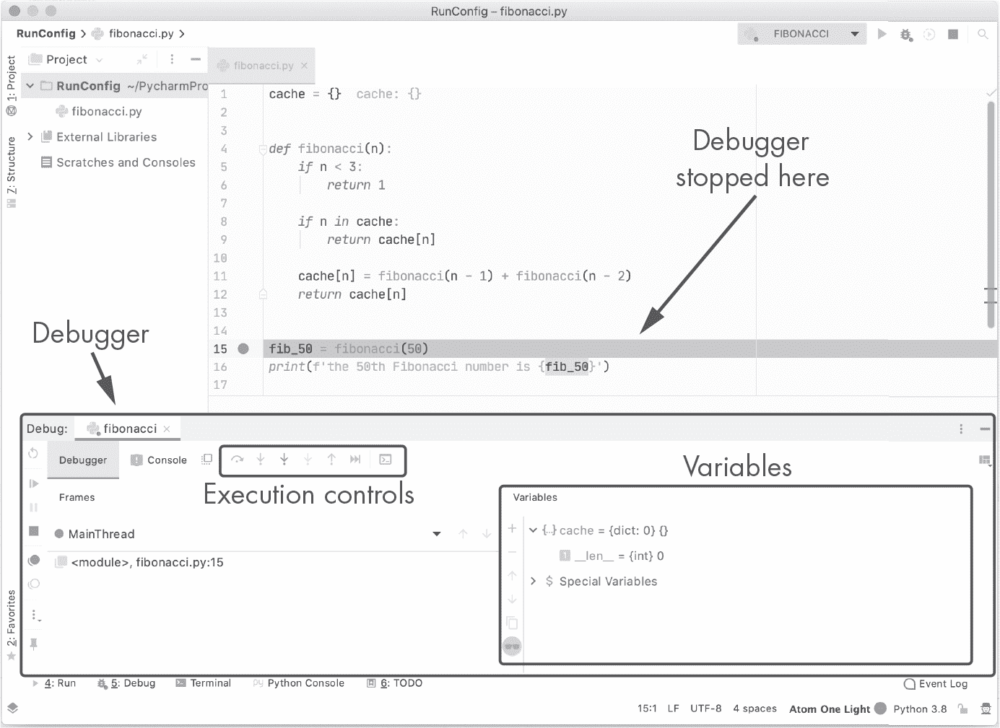

*图 17：PyCharm 的调试器*

调试器的顶部有一个控制条，用来控制程序的执行（参见图 18）。有一些图标，但我们主要关注前两个：步过（Step over）和步入（Step into）。选择“步过”选项时，我们可以执行当前行并跳到下一行。而“步入”选项则进入当前行的函数体。稍后我们会更详细地了解这两个选项。

调试器的右侧有一个变量面板，我们可以检查程序的当前状态：所有现有变量的值。例如，我们可以看到图 17 中的缓存变量，它目前是一个空字典。


*图 18：调试器执行控制*

现在让我们点击调试器中执行控制部分的“步入”图标。执行进入`fibonacci`函数体并在它的第一条指令处停止（参见图 19）。

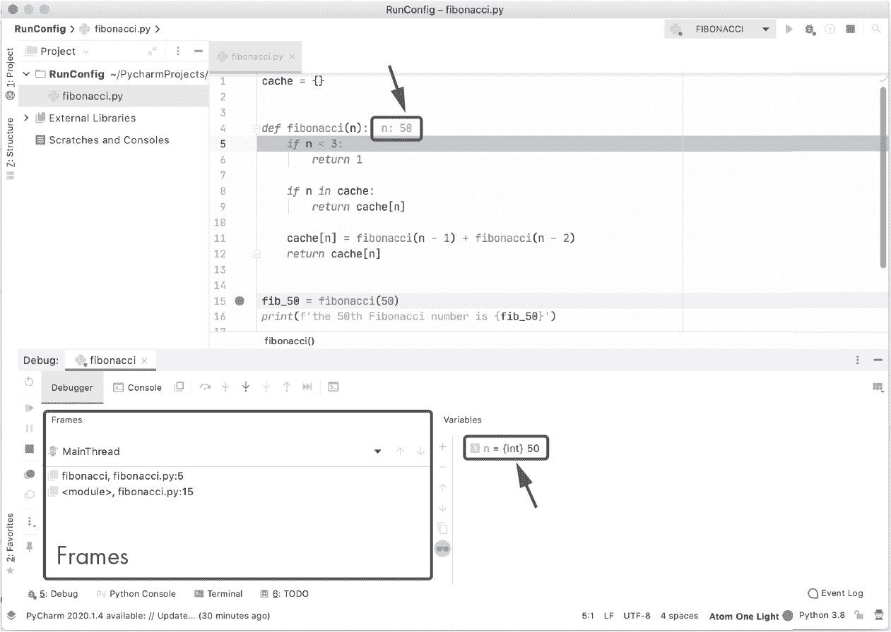

*图 19：进入 fibonacci 函数*

调试器的变量面板现在显示了`n`变量及其当前值 50。这个值也出现在`fibonacci`函数定义旁边，正如你在图 19 中看到的那样（两个位置都用箭头标出）。

调试器的左侧显示了帧面板。此面板包含程序的堆栈帧。每当执行一个函数时，都会将一个新的帧推入堆栈，其中包含该函数的局部变量及一些其他信息。你可以通过点击一个帧来回溯时间，查看该函数被调用之前程序的状态。例如，你可以点击<module>、fibonacci.py:15 堆栈帧来回到`fibonacci`函数被调用之前。要回到当前执行点，只需点击最顶部的堆栈帧，这里是`fibonacci`，位置是 fibonacci.py:5。

尝试继续使用“步过”（Step over）和“步入”（Step into）控制来调试程序。确保观察`cache`和`n`变量，它们的值会发生变化。实验完成后，要停止调试会话，你可以选择执行程序中的所有指令直到完成，或者点击调试器中的停止按钮。你也可以从菜单中选择**运行** ▸ **停止‘fibonacci’**，或者点击调试器左侧的红色方块图标。

让我们再做最后一个调试练习。再次以调试模式运行程序；当执行在断点处停止时，点击“逐步跳过”图标。检查“变量”面板中的缓存变量。如你所见，缓存现在已填充所有从 3 到 50 的斐波那契数。你可以展开字典查看其中的所有值，如图 20 所示。

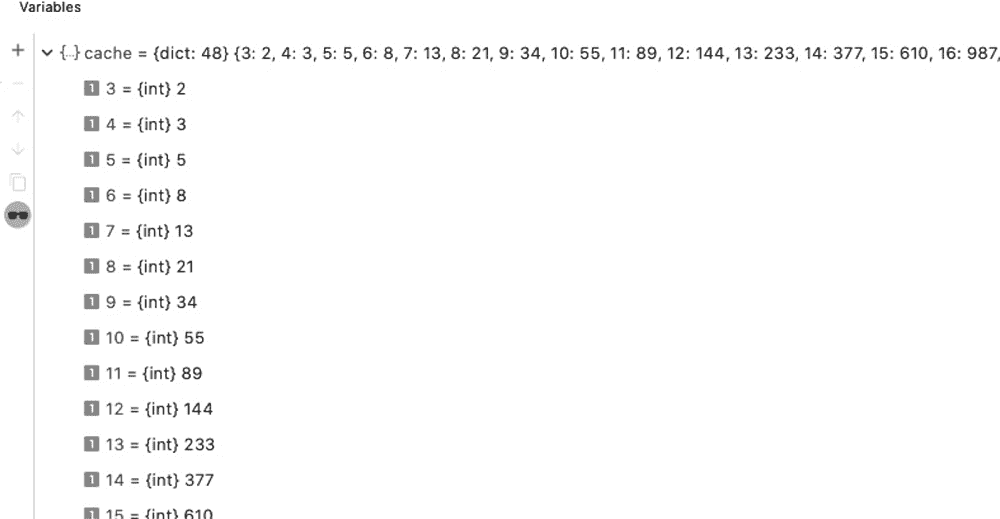

*图 20：调试器变量*

你还可以使用调试器的控制台与程序的当前状态进行交互（见图 21）。在调试器视图中，点击“控制台”标签，它位于“调试器”标签旁边。在这个控制台中，你可以与当前程序的状态进行交互，做一些事情，例如检查一个给定的斐波那契数是否已经被缓存：

```py
>>> 12 in cache
True
```

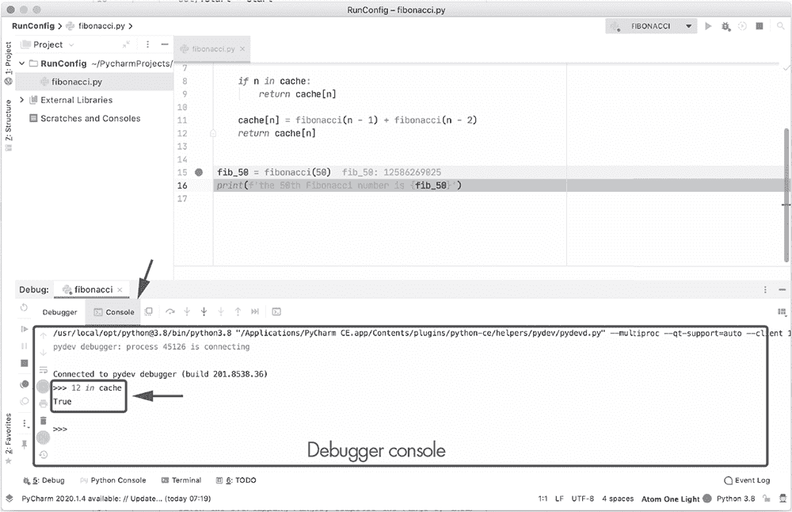

*图 21：调试器控制台*

### **总结**

在本引言章节中，我们已经了解了本书的内容以及你需要的前置条件，以便跟随并最大限度地利用它。我们还安装了 Python 并配置了环境，以便在全书中有效工作。

上一节是对 PyCharm 及其强大调试工具的简要介绍，但正如你想象的那样，我们才刚刚触及表面。要了解更多关于 PyCharm 调试的信息，可以快速浏览官方文档：[*https://www.jetbrains.com/help/pycharm/debugging-code.html*](https://www.jetbrains.com/help/pycharm/debugging-code.html)。

现在，让我们开始学习 Python。
