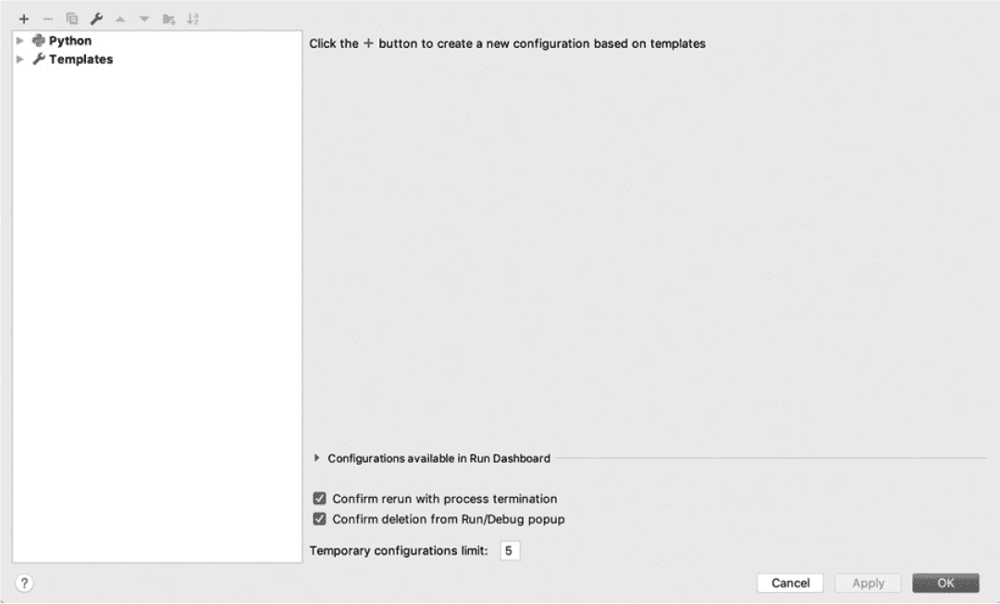
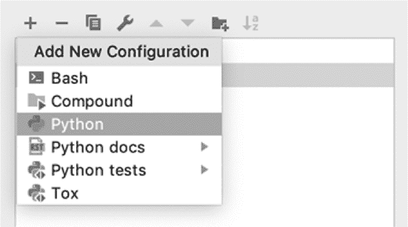
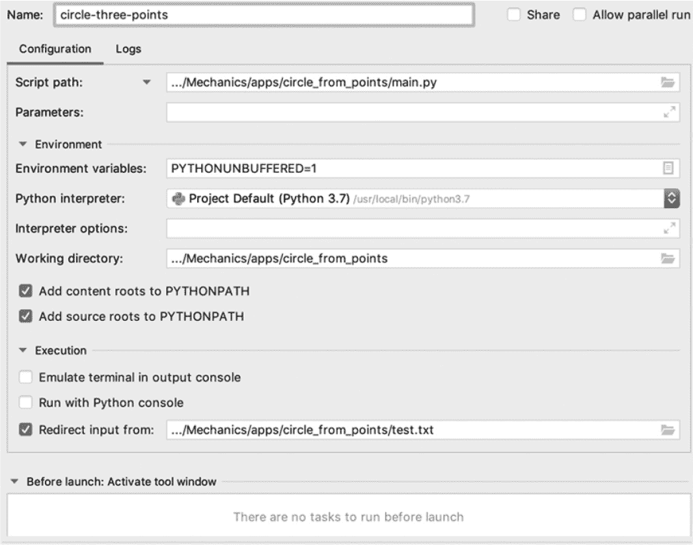
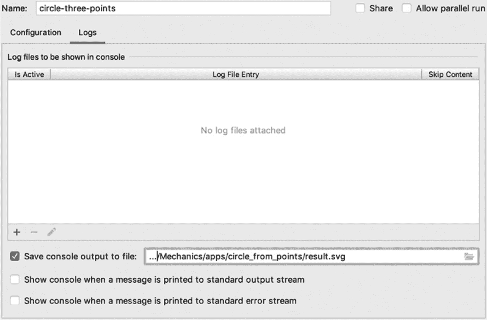
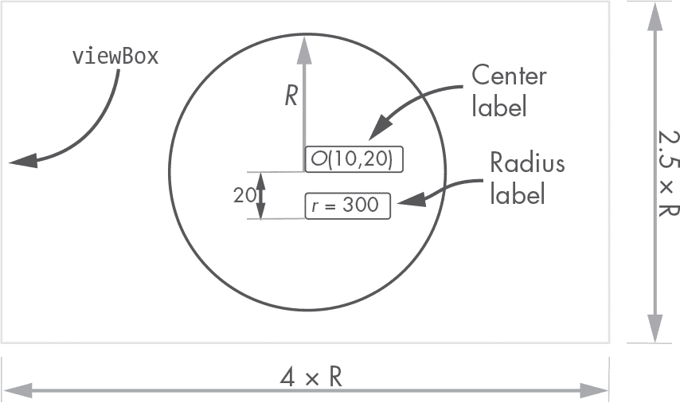
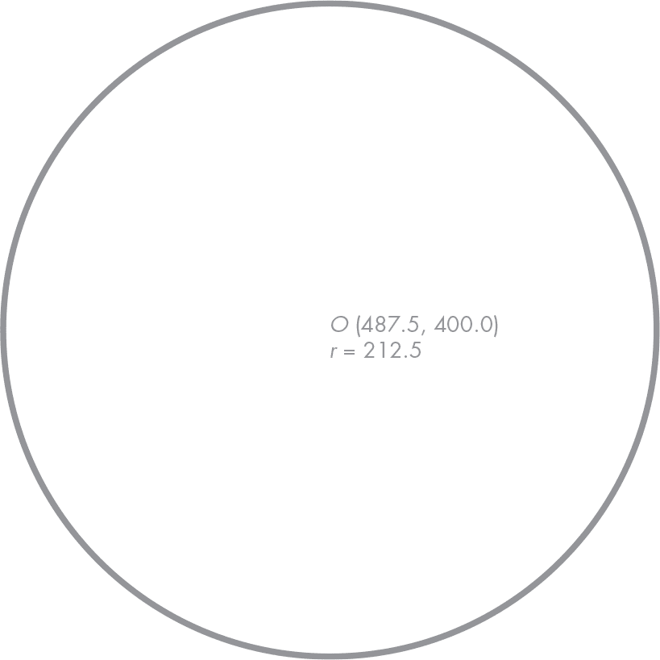
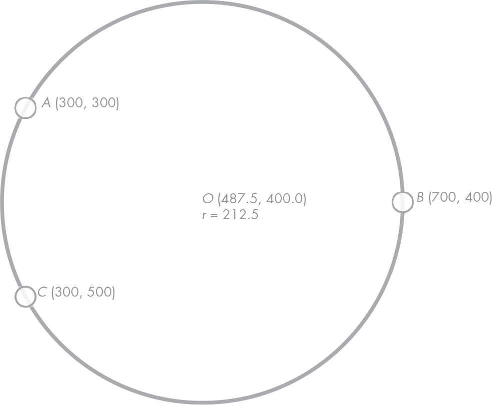

## 从三个点构建一个圆


在本章中，我们将构建一个完整的命令行程序来解决一个著名的问题：找出通过三个给定点的圆。你可能在高中时用尺子和圆规通过图形方式解决过这个问题；你甚至可能已经通过数值方法解决过。此次，我们将使用计算机来为我们解决这个问题，并生成一个包含结果的 SVG 图像。我们已经在第六章实现了这个算法；在本章中，我们将把这个算法嵌入到一个应用程序中。

这是一个简单的问题，但非常适合理解如何编写一个完整的应用程序。我们将使用正则表达式从文件中读取三个输入点，正则表达式的内容我们将在本章稍后学习。我们还将读取一个配置文件，其中包含程序输出的颜色和大小值。

然后我们将构建*模型*：一组实现我们称之为*领域逻辑*的对象，也就是解决问题所需的知识。在本例中，模型由三个点以及创建通过这三个点的圆的工厂函数组成。感谢我们在第六章的前期工作，这应该不会太复杂。我们将通过图形方式展示结果，呈现一个包含输入点和结果圆的矢量图像。

这是我们第一个完整的命令行程序，它包含了工程应用的所有要素：从输入文件读取、解决问题和输出结果图。构建完这个程序后，你应该有信心构建你自己的程序。可能性是无限的！

### **应用程序架构**

本书中我们一起构建的大多数命令行应用程序，可能还有你自己构建的许多其他程序，都将采用类似的架构。*软件架构*的概念指的是组成软件应用程序的各个组件的组织和设计。*架构*不仅涉及每个单独程序部分的设计，还包括各部分之间的通信和交互系统。

为了决定我们的应用程序应该由哪些组件组成，让我们思考一下我们的程序需要做什么。我们的应用程序通常将由三个主要阶段组成，每个阶段由不同的组件或架构构建模块执行：

**输入解析** 我们从传递给程序的文件中读取问题定义数据。这个阶段也可能包括读取外部配置文件，以调整程序的行为或输出。

**问题解决** 使用我们从输入定义数据中解析出的模型，我们找到问题的解决方案。

**输出生成** 我们将解决方案呈现给用户。根据需要的报告类型，我们可以选择生成图表、包含数据的文本文件、模拟结果，或它们的组合。解决问题本身固然重要，但生成易于理解且包含所有相关信息的输出，对于我们的程序能够发挥作用至关重要。

由于本章的问题相对简单，我们将把三个阶段分成三个文件：*input.py*、*main.py* 和 *output.py*。图 9-1 以图形化方式展示了我们应用程序的主要架构块。


*图 9-1：应用架构图*

输入文件将包含三个点，应该具有以下格式，

```py
x y
x y
x y
```

其中 x 和 y 是一个点的坐标，用空格分隔并且每个坐标在不同的行上。一个示例输入文件可能如下所示：

```py
300 300
700 400
300 500
```

这个文件定义了三个点：*A*(300, 300)、*B*(700, 400) 和 *C*(300, 500)。我们会规定坐标的值需要是正整数。这使得解析逻辑稍微简单一些，因为数字中不会有小数点或负号，这有助于我们使用正则表达式入门，但别担心：我们将在第十二章中学习如何识别浮动点数字和负号。

使用纯文本文件作为我们程序的输入有一个很大的优势：我们可以手动编写它们。而且，我们可以轻松地检查和编辑它们。缺点是纯文本文件通常占用的空间比其二进制文件大，但这对我们来说不是问题。我们会选择创建和操作的便利性，而不是文件大小。只要记住，在处理纯文本文件时，务必使用纯文本编辑器，而不是富文本编辑器。富文本编辑器（如 Word）有自己的存储格式，其中包括比你实际写入的内容更多的信息，例如关于粗体、使用的字体类型或字体大小的信息。我们需要我们的输入文件只包含我们写入的内容。

### **设置**

由于我们将在整本书中创建其他应用程序，让我们在 Python 项目的顶层创建一个新包（与 *geom2d*、*graphic* 和 *utils* 包处于同一级别）。右键点击 *Mechanics* 文件夹，在菜单中选择 **新建** ▸ **Python 包**，命名为 *apps*，然后点击 **确定**。

在 *apps* 中创建一个新包，这次命名为 *circle_from_points*。

你的项目目录结构应该类似于以下内容：

机制

|- apps

|    |- circle_from_points

|- geom2d

|    |- tests

|- graphic

|    |- svg

让我们创建主文件。这是我们将在命令行中执行的文件来运行应用程序。在 *circle_from_points* 中创建一个名为 *main.py* 的文件。输入清单 9-1 中的代码。

```py
if __name__ == '__main__':
   print('This is working')
```

*清单 9-1：主文件*

如果你还记得 第一章（在“运行文件”部分），我们使用的是“if name is main”模式来执行我们的主应用程序脚本。我们希望仅在检测到文件是单独运行时才执行这段代码，而不是在它被其他文件导入时执行。现在我们只会向终端输出一条消息，以确保我们的设置正常。

```py
$ python3 apps/circle_from_points/main.py
```

这应当会输出到终端：

这在正常工作

**注意**

*这次，我们的主文件没有定义任何可以被其他文件导入并使用的函数。但得益于“if name is main”模式，如果这个文件被导入（可能是误导入），那么不会导出任何内容，也不会执行任何代码。我们所有的“可运行”脚本都将使用这个模式。*

我们需要一个包含三个点坐标的文件来测试我们的进度。在 *circle_from_points* 文件夹中创建一个新文件，命名为 *test.txt*。在其中输入以下坐标：

```py
300 300
700 400
300 500
```

接下来，我们需要配置我们的 IDE，以便可以在其中本地测试应用程序。

#### ***创建运行配置***

为了使用我们刚刚编写的 *test.txt* 文件中的数据来测试应用程序的代码，我们需要在 PyCharm 中创建一个称为 *运行配置* 的内容（请参阅第“创建运行配置”部分，第 liv 页以复习）。运行配置是一个便捷功能，它能节省我们开发时的时间。

**注意**

*你可能需要参考在线文档以更好地理解运行配置：* [`www.jetbrains.com/help/pycharm/run-debug-configuration.html`](https://www.jetbrains.com/help/pycharm/run-debug-configuration.html)*。如果你使用的是除 PyCharm 之外的 IDE，请参考其文档。大多数 IDE 都有类似的运行配置概念，用于配置程序的测试运行。*

要创建运行配置，首先确保通过选择 **查看** ▸ **导航栏** 来显示导航栏。从顶部菜单中选择 **运行** ▸ **编辑配置**。将打开 图 9-2 中所示的对话框。



*图 9-2：运行配置对话框*

点击左上角的 **+** 图标，这将打开“添加新配置”下拉菜单，并选择 **Python**（见 图 9-3）。



*图 9-3：新的 Python 运行配置*

运行配置表单应该出现在窗口的右侧。在顶部的名称字段中输入名称*circle-three-points*。这将是你用来引用该配置的名称。在“配置”选项卡中，你应该能看到脚本路径字段。这是我们*main.py*文件的路径：程序的入口点。点击字段中的文件夹图标并选择*main.py*。在配置选项卡的末尾，找到“执行”部分。选中**从输入重定向**复选框，然后在字段中点击文件夹图标，选择包含点定义的测试文件：*test.txt*。这样，运行配置将始终将*test.txt*传递给程序的标准输入。你的配置对话框应该类似于图 9-4。



*图 9-4：运行配置数据*

我们需要做最后一件事。如果我们按照现在的配置执行运行，程序的输出将打印到终端（标准输出）。这没有问题，但因为我们要输出 SVG 代码，所以我们希望将标准输出重定向到一个具有 *.svg* 扩展名的文件。

转到配置右侧的日志标签。勾选**将控制台输出保存到文件**；然后点击文件夹图标，选择*circle_from_points*中的任何文件。选择文件后，只需将其名称更改为*result.svg*。或者，你可以复制并粘贴*circle_from_points*包的路径，然后在路径末尾添加*result.svg*文件的名称。你也可以创建一个空的*result.svg*文件，然后在这里选择它。无论你选择哪种方式，结果应该类似于图 9-5。



*图 9-5：将输出重定向到文件*

一切就绪，点击**确定**。在导航栏中，你应该看到新创建的运行配置被选中（参见图 9-6）。点击右侧的绿色播放按钮。这将执行运行配置，最终会在一个名为*result.svg*的文件中写入消息“这是有效的”。


*图 9-6：导航栏中的运行配置*

让我们快速回顾一下我们刚刚做了什么。我们在 PyCharm 中创建了一个配置，告诉它如何运行我们的项目。我们告知配置，*main.py* 是开始执行我们项目的入口点。然后，我们指定将包含测试数据的*test.txt*文件传递给程序的标准输入，并将程序的输出重定向到名为*result.svg*的文件。

#### ***为什么使用运行配置？***

你可能会问，为什么我们要创建一个运行配置，而不是直接从命令行执行脚本？

这是一个很好的问题。我们使用运行配置有两个主要原因。第一个是，在开发过程中，我们会更加高效。我们无需在 shell 中输入命令来运行程序，也不必在必要时重定向标准输入和输出。此外，这个配置还允许我们调试程序，这在 shell 中会变得相当困难。如果你在代码中的某个地方设置了断点，你可以点击绿色播放按钮旁边像虫子一样的按钮，程序将在断点处停止。

第二个原因是，正如我们在本章后面将看到的，如果你试图从 shell 运行 *main.py*，一旦开始导入我们的包（例如 *geom2d*），它就会根本无法工作。是的，这有点令人惊讶，但我们将学习为什么会发生这种情况，更重要的是，如何修复它。

### **读取输入和配置文件**

到目前为止，我们有了一个 *main.py* 文件和一个运行配置，使用标准输入将 *test.txt* 传递给它。现在我们对该文件的内容什么也不做，所以接下来的好步骤是读取文件的内容，并将每一行解析为 Point 类的实例。我们该如何做呢？我们需要使用正则表达式，一种强大的文本读取和信息提取技术。

在我们探索正则表达式之前，让我们在项目中创建一个新文件，用于读取输入和配置文件。同时，花些时间学习如何读取传递给我们程序标准输入的文件。

在 *circle_from_points* 中，创建一个名为 *input.py* 的新文件。你的 *circle_from_points* 目录应该如下所示：

circle_from_points

|- __init__.py

|- input.py

|- main.py

|- test.txt

让我们从小处开始，一步步来。在新创建的文件中输入清单 9-2 中的代码。

```py
def parse_points():
    return (
        input(),
        input(),
        input(),
    )
```

*清单 9-2：从输入文件读取行*

`parse_points` 函数实际上还没有解析点……目前为止，它返回一个包含三个字符串的元组，每个字符串对应于从标准输入读取的一行。每一行都是通过 Python 的 `input` 函数读取的，该函数一次读取一行输入。让我们从主程序中调用 `parse_points`，看看它是如何读取测试文件内容的。返回到 *main.py* 并修改代码，使其与清单 9-3 匹配。

```py
from apps.circle_from_points.input import parse_points

if __name__ == '__main__':
    (a, b, c) = parse_points()
    print(f'{a}\n{b}\n{c}')
```

*清单 9-3：将点打印到 shell*

你可能会想使用 Python 的相对导入，例如 `from .input import parse_points`，但是当从命令行运行进行导入的文件时，这样做不会正常工作。为了理解为什么会这样，来看一下 PEP 238 中的这段摘录：

相对导入使用模块的 __name__ 属性来确定该模块在包层次结构中的位置。如果模块的名称不包含任何包信息（例如，它被设置为'__main__'），则相对导入将被解析为模块是顶级模块，无论该模块在文件系统中的实际位置如何。

在清单 9-3 中，我们首先从*input.py*模块导入 parse_points。在“if name is main”条件中，我们调用 parse_points 函数并将其输出赋值给元组(a, b, c)，这将*解构*其元素为变量 a、b 和 c。

以下是实现相同结果的较不优雅的方法：

```py
points = parse_points()
a = points[0]
b = points[1]
c = points[2]
```

但我们选择前者，它稍微干净一些。最后一行将 a、b 和 c 的内容打印到终端，每个打印在自己的行上。通过点击我们之前创建的运行配置旁边的绿色播放按钮来运行该应用程序。你应该会看到以下内容被打印到 IDE 的终端：

```py
Input is being redirected from --snip--/test.txt
Console output is saving to: --snip--/result.svg
300 300
700 400
300 500

Process finished with exit code 0
```

前两行非常有趣。它们告诉我们，用于运行文件的配置正在从文件*test.txt*接收输入，并将输出写入文件*result.svg*。如果你打开*result.svg*，你应该能看到与*test.txt*中定义的三点相同，并且也与它们在终端中打印的方式相同。我们在这里取得了很好的进展！下一步是将这些用空格分隔的坐标转换为我们的 Point 类实例。为此，我们需要使用正则表达式。

#### ***正则表达式***

*正则表达式*（简写为*regex*）在解释文本时是强大的构造。因为我们将在本书中创建的大多数应用程序的输入都将从纯文本文件中读取，所以我们希望了解正则表达式。

**注意**

*如果你想了解更多关于正则表达式的信息，请查看这个超棒的互动教程：* [*https://regexone.com*](https://regexone.com)。

让我们快速回顾一下我们在这里要解决的问题：给定一个包含由空格分隔的两个整数的文本字符串，从字符串中提取它们，将它们转换为数字，并将它们作为 Point 类实例的坐标。正则表达式在这里如何帮助我们？

正则表达式是定义为字符串的模式。它用于在其他字符串中查找匹配项，并可选地提取它们的部分内容。

让我们试一个例子。请注意，正则表达式通过将它们写在两个斜杠字符之间来表示。假设我们正在寻找这个模式，

/重复 5 次/

并且我们有兴趣知道这个模式是否出现在以下任何句子中：

重复 5 次。

对于每个练习，重复 5 次。

对于那个特定的练习，重复 7 次。

让我们重复 3301 次。

/重复 5 次/ 正则表达式将自身与这些字符串进行比较，查找完全匹配文本 repeat 5 times，因此只会得到单一的粗体匹配：

重复 5 次。

对于每个练习，**重复 5 次**。

对于该特定练习，重复 7 次。

让我们重复 3301 次。

这很好，但灵活性不足。第一句话没有匹配，因为第一个字母 *R* 是大写的，而我们的模式是小写的。我们可以调整模式，使其接受两者：

/[Rr]epeat 5 次/

这次的匹配结果如下：

**重复 5 次**。

对于每个练习，**重复 5 次**。

对于该特定练习，重复 7 次。

让我们重复 3301 次。

为了同时处理两种 *r*，我们引入了一个 *字符集*：在文本的某个位置接受的一系列字符，任何一个字符都被视为有效。字符集通过方括号定义。

使用正则表达式，我们可以做更多的事情。那句中的重复次数怎么办？我们能否使任何重复次数都被视为有效匹配？当然可以。如果我们修改模式为

/[Rr]epeat \d times/

我们将得到以下匹配：

**重复 5 次**。

对于每个练习，**重复 5 次**。

对于该特定练习，**重复 7 次**。

让我们重复 3301 次。

模式 \d 匹配一个数字，0 到 9 之间的任何数字。那最后一句话呢？如果我们想匹配多个数字，我们需要为 \d 模式添加一个 *量词*。在这种情况下，最合适的量词是 +，它用于匹配一个或多个它量化的符号。模式

/[Rr]epeat \d+ times/

这将适用于任何重复次数，从而获得我们一直追求的完整匹配范围：

**重复 5 次**。

对于每个练习，**重复 5 次**。

对于该特定练习，**重复 7 次**。

让我们 **重复 3301 次**。

现在你开始理解正则表达式的基本概念了，让我们探索一些它们的基础概念。

##### **字符集**

正如我们所看到的，我们可以在方括号之间包含几个不同的字符，以使我们的正则表达式匹配其中任何一个。例如，我们可以使用

/[mbg]ore/

匹配 **more**、**bore** 和 **gore**。我们还可以包含像这样所有小写字母 *a* 到 *z* 的范围：

/[a-z]ore/

这将产生广泛的匹配，例如 **more**、**core** 和 exp**lore**。我们还可以包括大写字母的范围，

/[a-zA-Z]ore/

以包括像 **More** 或 **Core** 这样的匹配。需要注意的是，连续的字符范围之间没有空格。如果你用空格分隔它们，集合会把空格也视为有效字符。

##### **字符类**

有一些特殊字符可以用来匹配常见的元素，如数字、空白符或单个字母。第一个是点号 (**.**)，我们用它来匹配除换行符之外的任何内容。它匹配字母（包括大写和小写）、数字、标点符号和空白符。正如你所看到的，这是一个相当强大的 *匹配器*。例如，模式

/the end./

它将匹配 **the end.**、**the end?**、**the end!** 和更多情况。要匹配一个单独的点，我们需要使用反斜杠来转义点字符，

/the end\./

这将只产生一个匹配项：**the end.**

我们已经学习过类 \d，它匹配一个数字。如果我们想匹配所有的*非*数字字符，可以使用 \D（大写字母）。类似地，若要匹配字母，可以使用类 \w，而 \W 用于匹配非字母字符。最后，对于空白字符，我们使用 \s，而 \S 用于匹配任何非空白字符。

现在让我们将关于字符类的知识结合成一个正则表达式：

/code\s\w-\d\d/

这个正则表达式匹配像 **code f-44**、**code M-81** 和 **code p-29** 这样的字符串。

##### **量词**

量词修改了它们量化的符号的匹配次数。共有五个量词：

?     匹配零个或一个前面的符号

*     匹配零个或多个前面的符号

+     匹配一个或多个前面的符号

(n)     匹配前面符号的确切 n 个

(n,m)     匹配前面符号的 n 到 m 个

例如，

/o{2}m/

它将匹配 b**oom**、z**oom** 或 kab**oom**。但是，如果我们使用

/o+m/

我们的匹配结果可以是以下任何一种：n**om**ad，b**oooo**m，或 r**oom**。我们将在文中使用大多数这些量词，所以会有很多示例。

##### **捕获分组**

到目前为止，我们已经看到如何使用正则表达式匹配文本。但有时我们还想提取我们匹配到的文本。这时，分组就派上用场了。分组是在圆括号之间定义的。让我们尝试以下正则表达式，

/it takes (\d+) hours to go from (\w+) to (\w+)/

将其应用于句子“从巴塞罗那到庞普洛纳需要 4 小时”时，它会完全匹配并捕获以下组：

('4', 'Barcelona', 'Pamplona')

让我们在 Python 的 shell 中试一下。Python 的标准库包括一个强大的正则表达式包：re。打开你的 IDE 的 shell，尝试输入 示例 9-4 中的代码。

```py
>>> import re
>>> pattern = r'it takes (\d+) hours to go from (\w+) to (\w+)'
>>> target = 'it takes 4 hours to go from Barcelona to Pamplona'
>>> matches = re.match(pattern, target)
>>> matches.groups()
('4', 'Barcelona', 'Pamplona')
```

*示例 9-4：使用正则表达式捕获分组*

我们使用*原始字符串字面量*来定义模式，格式为 r''。这些字符串将反斜杠（\）视为有效字符，而不是将其解释为转义序列。正则表达式需要反斜杠来定义其结构。

在 示例 9-4 中，结果存储在名为 matches 的变量中，我们可以调用 groups 方法来获取捕获的三个分组：4、Barcelona 和 Pamplona。

分组的一个好处是，它们可以被赋予一个名称，稍后我们可以用这个名称来检索匹配的值。例如，考虑以下模式：

/(?P<name>\w+), but they call me (?P<nick>\w+)/

应用于像“我的名字是 Nelson，但他们叫我 Big Head”这样的句子时，它会捕获两个分组，我们可以通过名称来检索它们：

```py
name = matches.group('name')
nick = matches.group('nick')
```

正如你所猜测的，赋予分组名称的语法如下，

```py
(?P<name><regex>)
```

其中 name 是分配给该组的名称，regex 是实际用于匹配该组的模式。

#### ***正则表达式备忘单***

表 9-1、表 9-2、表 9-3 和 表 9-4 总结了我们已经探索的概念，并可以作为本书其余部分的参考。

**表 9-1：** 正则表达式字符集

| [abc] | 匹配 ’a’ 或 ’b’ 或 ’c’ |
| --- | --- |
| [^ab] | 匹配除了 ’a’ 和 ’b’ 之外的所有字符 |
| [a-z] | 匹配从 ’a’ 到 ’z’ 之间的所有字符 |

**表 9-2：** 正则表达式字符类

| \s | 匹配空白字符 |
| --- | --- |
| \S | 匹配除空白字符之外的所有字符 |
| \d | 匹配数字 |
| \D | 匹配除了数字之外的所有字符 |
| \w | 匹配字母 |
| \W | 匹配除了字母之外的所有字符 |

**表 9-3：** 正则表达式量词

| ? | 零个或一个 |
| --- | --- |
| * | 零个或多个 |
| + | 一个或多个 |
| {n} | 精确匹配 n |
| {n,m} | 匹配 n 到 m（包括 n 和 m）之间的字符 |

**表 9-4：** 正则表达式捕获组

| (...) | 捕获组位于圆括号之间 |
| --- | --- |
| (?P<name>...) | 一个命名的捕获组 |

#### ***匹配点***

我们已经知道了匹配由空格分隔的坐标定义的点所需的一切，并且可以通过名称捕获它们。因为坐标仅由整数定义，我们可以使用以下正则表达式：

/(?P<x>\d+)\s(?P<y>\d+)/

让我们将其分解。它有三个部分：

(?P<x>\d+)   捕获一个名为 x 的组，该组由一个或多个数字组成

\s   匹配一个空格

(?P<y>\d+)   捕获一个名为 y 的组，该组由一个或多个数字组成

让我们在应用程序的 *input.py* 文件中实现这个匹配模式。编辑我们编写的代码，使其看起来像 清单 9-5。

```py
➊ import re

  from geom2d import Point

  def parse_points():
      return (
          __point_from_string(input()),
          __point_from_string(input()),
          __point_from_string(input()),
      )

  def __point_from_string(string: str):
   ➋ matches = re.match(r'(?P<x>\d+)\s(?P<y>\d+)', string)
      return Point(
       ➌ int(matches.group('x')),
       ➍ int(matches.group('y'))
      )
```

*清单 9-5：解析点*

我们首先导入 re ➊。然后，我们修改 parse_points 函数，将通过 input() 读取的行映射到 Point 实例。这一转换由私有的 __point_from_string 函数处理，该函数通过 re.match，查找传入字符串中与模式匹配的部分 ➋。

从匹配项中我们知道应该有两个组，分别命名为 x 和 y。因此，该函数创建并返回一个 Point 实例，其 x 坐标是通过解析名称为 x 的组所捕获的字符串，结果为一个整数 ➌。y 坐标以类似的方式处理，通过解析名称为 y 的组 ➍ 获取结果。

运行应用程序（使用 *circle-three-points* 配置），点击绿色播放按钮。你应该看到类似下面的内容打印到 shell 中：

```py
Input is being redirected from --snip--/test.txt
Console output is saving to: --snip--/result.svg
(300, 300)
(700, 400)
(300, 500)

Process finished with exit code 0
```

恭喜！你刚刚从一个包含三行纯文本的文件中解析了三个点。从现在开始，我们将创建的所有命令行应用程序都可以期望从文件中获取输入数据，你已经知道如何使用强大的正则表达式解析和解释这些数据。

#### ***配置文件***

我们的应用将生成一个漂亮的矢量图，展示输入的点和结果圆形。为此，我们将使用不同的颜色和线条粗细，帮助直观区分它们的各个部分。我们可以直接将这些颜色和大小值硬编码到代码中，但这不是一个好主意；如果我们将配置值与实际逻辑分开，我们的应用将更容易维护。因此，我们将把配置值存储在一个单独的 JSON 文件中。我们选择使用 JSON 格式，因为它非常容易转换为 Python 字典。

**注意**

*当我们说某个东西是*硬编码*到代码中时，意思是没有办法改变它，除非修改程序的源代码。例如，配置值通常硬编码到主应用的逻辑中，无法改变，除非逐行阅读代码并可能需要重新编译应用程序。不要这样做。你需要编辑和重新编译现有代码的次数越少越好。始终将配置值从程序的逻辑中移到一个独立的文件中。*

在 *circle_from_points* 中，右键点击包名并选择 **新建** ▸ **文件**，创建一个新文件。输入文件名 *config.json*，然后在其中编写 Listing 9-6 的内容。

```py
{
  "input": {
    "stroke-color": "#4A90E2",
    "stroke-width": 2,
    "fill-color": "#ffffffbb",
    "label-size": 16,
    "font-family": "Helvetica"
  },
  "output": {
    "stroke-color": "#50E3C2",
    "stroke-width": 4,
    "fill-color": "#ffffff",
    "label-size": 14,
    "font-family": "Helvetica"
  }
}
```

*Listing 9-6: 配置文件中的应用程序配置*

这个文件是 JSON 格式的，这是一种广泛使用的格式。如果您对它不熟悉，可以在 [*www.json.org/*](http://www.json.org/) 阅读更多内容。它的结构类似于 Python 字典，以键值对的方式存储数据。幸运的是，Python 提供了一种简单的方法来读取 JSON 文件：标准库中包括了处理 JSON 数据的 *json* 包。

在 *input.py* 中，输入 Listing 9-7 中的函数（不要忘记导入）。

```py
import json
import re

import pkg_resources as res

def read_config():
    config = res.resource_string(__name__, 'config.json')
    return json.loads(config)

--snip--
```

*Listing 9-7: 读取配置文件*

使用 pkg_resources 模块，这个过程变得轻而易举。使用 res.resource_string() 将 *config.json* 文件的内容读取为二进制字符串，并传递给 json.loads，这样就能得到解析后的 Python 字典，准备好供使用。我们很快就会用到这些值。

### **问题模型与解决方案**

我们已经解析了问题的模型：我们的 Point 类的三个实例。利用这些，我们的应用现在应该计算出一个通过所有这些点的圆。我们之前的工作即将得到回报：我们已经有了完成此任务的代码（请参考 第 153 页的“圆形工厂”部分，了解更多）。

打开 *main.py* 并输入 Listing 9-8 中的代码。

```py
from apps.circle_from_points.input import parse_points
from geom2d import make_circle_from_points

if __name__ == '__main__':
    (a, b, c) = parse_points()
    circle = make_circle_from_points(a, b, c)
    print(circle)
```

*Listing 9-8: 计算通过三个点的圆*

这很简单！我们从 *geom2d* 导入 make_circle_from_points，并将三个点：a、b 和 c 传递给它。为了确保圆形计算正确，我们打印出计算结果的圆形。运行应用程序，您应该期待结果圆形的以下字符串表示：

```py
circle c = (487.5, 400.0), r = 212.5
```

如果你打开*result.svg*，它应该是这个内容。这个文件是我们将程序的输出重定向到的地方。程序中只缺少一件事：使用 SVG 格式绘制输出！

### **生成输出**

现在问题已经解决，我们需要绘制一个包含圆形和输入点的 SVG。首先，在*circle_from_points*目录中创建一个新的文件，命名为*output.py*。你的*circle_from_points*目录应该像下面这样：

circle_from_points

|- __init__.py

|- input.py

|- main.py

|- output.py

|- test.txt

在其中，输入代码到清单 9-9。

```py
from geom2d import Circle, Point

def draw_to_svg(points: [Point], circle: Circle, config):
    print("Almost there...")
```

*清单 9-9：生成输出图像的第一步*

我们定义了一个新函数 draw_to_svg，它接收一系列点（问题的输入点）、生成的圆形和配置字典。请注意，点序列的类型提示：[Point]；它由 Point 类在方括号中声明。这样定义的序列类型提示既可以接受列表也可以接受元组。

目前，函数只是将一条消息打印到标准输出，但我们会一步一步地更新它，直到它最终绘制出所有内容。这样，你就可以继续给*main.py*最终定型。修改你的代码，使其看起来像清单 9-10。

```py
from apps.circle_from_points.input import parse_points, read_config
from apps.circle_from_points.output import draw_to_svg
from geom2d import make_circle_from_points

if __name__ == '__main__':
    (a, b, c) = parse_points()
    circle = make_circle_from_points(a, b, c)
    draw_to_svg((a, b, c), circle, read_config())
```

*清单 9-10：主文件*

这段代码简洁明了。基本上有三行，分别读取输入、解决问题并绘制输出。我们的主文件已经设置好，现在让我们填写 draw_to_svg。

#### ***绘制输出圆形***

我们将从绘制圆形开始。打开*output.py*并输入清单 9-11 中的代码。

```py
from geom2d import make_rect_centered, Circle, Point, Vector
from graphic import svg

def draw_to_svg(points: [Point], circle: Circle, config):
 ➊ svg_output = output_to_svg(circle, config['output'])

 ➋ viewbox = make_viewbox(circle)
 ➌ svg_img = svg.svg_content(
        viewbox.size, svg_output, viewbox
    )

    print(svg_img)

def output_to_svg(circle: Circle, config):
 ➍ style = style_from_config(config)
 ➎ label_style = label_style_from_config(config)

    return [
     ➏ svg.circle(circle, style),
     ➐ svg.text(
            f'O {circle.center}',
            circle.center,
            Vector(0, 0),
            label_style
        ),
     ➑ svg.text(
            f'r = {circle.radius}',
            circle.center,
            Vector(0, 20),
            label_style
        )
    ]
```

*清单 9-11：绘制生成的圆形*

这看起来像是很多代码，但别担心，我们会逐步分析。首先，我们更新 draw_to_svg 函数。使用我们稍后在代码中定义的 output_to_svg 函数，我们为圆形创建 SVG 表示 ➊。请注意，我们传递给这个函数的是 config[’output’]，即配置字典中的*output*部分。

然后，使用 make_viewbox，这是一个我们还未定义的函数，我们计算图像的 viewBox ➋。利用这个 viewBox、它的大小和 svg_output，我们生成图像 ➌ 并将其打印到标准输出。

现在让我们来看一下 output_to_svg。这个函数使用我们稍后将定义的另一个函数（style_from_config），将圆形的 SVG 属性存储在一个名为 style 的变量中 ➍。对于我们将用于文本的样式属性，也是如此，它们由 label_style_from_config 生成 ➎。该函数返回一个包含三个 SVG 原语的数组：圆形和两个标签。

圆形部分很简单；我们使用了我们预先编写的 circle 函数 ➏。接下来是标注，指示圆形的中心位置 ➐，该标注的原点位于圆心。最后是圆形半径信息的标签。这个标签位于圆形的中心，但稍微偏移⟨0, 20⟩，使其出现在之前标签的下方 ➑。

**注意**

*你可能还记得我们曾说过，当通过向量* ⟨0, 20⟩* 移动标签时，它会出现在另一个标签下方。在向量的 y 坐标中使用正数应当导致标签向上移动，因此会将标签移到另一个标签的上方。但请记住，在 SVG 中，y 轴是向下的。我们本可以通过应用仿射变换来修正这一点，但我们现在不做这件事。*

要计算 viewBox，输入 清单 9-12 中的代码至 output_to_svg 函数下。

```py
--snip--

def make_viewbox(circle: Circle):
    height = 2.5 * circle.radius
    width = 4 * circle.radius
    return make_rect_centered(circle.center, width, height)
```

*清单 9-12：计算图像的 viewBox*

这个函数计算定义图像可见部分的矩形。如果你需要复习一下，回到 第 207 页 的“viewBox”章节。为了构建这个矩形，我们使用了 make_rect_centered 工厂函数，这在现在需要一个包含圆形的矩形时非常方便。矩形的高度是圆形半径的 2.5 倍，也就是直径加上一些边距。宽度是半径的 4 倍（或直径的 2 倍），因为我们需要为接下来绘制的标签留出空间。我是通过反复试验得出了这些值，但你可以根据自己的实验调整它们。它们基本上只是为你的绘图添加了更多或更少的边距，仅此而已。

图 9-7 描述了我们正在绘制的 SVG 图像布局，供参考。



*图 9-7：SVG 输出布局*

让我们实现生成 SVG 样式属性的函数。在你的文件 *output.py* 的末尾，输入 清单 9-13 中的代码。

```py
--snip--

def style_from_config(config):
    return [
        svg.stroke_color(config['stroke-color']),
        svg.stroke_width(config['stroke-width']),
        svg.fill_color(config['fill-color'])
    ]
```

*清单 9-13：从配置中创建样式*

style_from_config 函数使用配置字典中的值创建一个 SVG 属性列表。让我们对标签的样式做同样的事情（参见 清单 9-14）。

```py
--snip--

def label_style_from_config(config):
    return [
        svg.font_size(config['label-size']),
        svg.font_family(config['font-family']),
        svg.fill_color(config['stroke-color'])
    ]
```

*清单 9-14：从配置中创建标签样式*

就是这样！我们已经拥有绘制结果圆形所需的所有代码，并且使用了青色。现在运行应用程序，你应该会看到 shell 输出一些 SVG 代码，这些代码与文件 *result.svg* 中的内容相同。用你喜欢的浏览器打开这个文件，结果应该类似于 图 9-8。



*图 9-8：SVG 输出圆形*

就这样！我们解决了第一个几何问题，并将结果绘制成了矢量图像。不是很激动人心吗？快去试试配置，改变输出颜色并重新运行应用程序。

#### ***绘制输入点***

很高兴我们绘制了带有指示圆心位置和半径的标签的圆形，但生成的图像并没有包括关于生成圆形的输入点的信息。让我们将这些点也绘制出来，这样就能一眼看出生成该圆形所需的所有信息。

让我们创建一个新的函数，它类似于 output_to_svg，但生成代表输入点的 SVG 基本元素。我们也将这些点表示为圆形。在 *output.py* 中输入 列表 9-15 中的代码。

```py
--snip--

def input_to_svg(points: [Point], point_radius: float, config):
    style = style_from_config(config)
    label_style = label_style_from_config(config)
 ➊ [a, b, c] = points
 ➋ disp = Vector(1.25 * point_radius, 0)

 ➌ return [
        svg.circle(Circle(a, point_radius), style),
        svg.circle(Circle(b, point_radius), style),
        svg.circle(Circle(c, point_radius), style),
        svg.text(f'A {a}', a, disp, label_style),
        svg.text(f'B {b}', b, disp, label_style),
        svg.text(f'C {c}', c, disp, label_style)
    ]
```

*列表 9-15：绘制输入点*

input_to_svg 函数接收一个列表，其中包含三个输入点、用于表示点的半径以及输入配置字典。

如你所见，我们将使用生成的圆形大小的一部分作为输入点的半径。这样无论生成的图像大小如何，它们看起来都能很好。使用固定的半径值可能会导致某些输入点的圆形非常小，几乎不可见，而其他的则可能是比生成的圆形还大的巨大圆形。

点和标签的样式是使用我们之前使用的相同函数计算的：style_from_config 和 label_style_from_config。序列中的点被解构为变量 a、b 和 c，以便我们可以方便地使用它们 ➊。

因为我们需要将标签稍微向右移动，以避免与圆形重叠，我们构造了一个位移向量 disp ➋。该函数返回带有标签的圆形数组 ➌。

现在更新函数 draw_to_svg，使其也包含生成图像中的三个点（参见 列表 9-16）。

```py
def draw_to_svg(points: [Point], circle: Circle, config):
 ➊ pt_radius = circle.radius / 20
    svg_output = output_to_svg(circle, config['output'])
 ➋ svg_input = input_to_svg(points, pt_radius, config['input'])

    viewbox = make_viewbox(circle)
    svg_img = svg.svg_content(
     ➌ viewbox.size, svg_output + svg_input, viewbox
    )

    print(svg_img)

--snip--
```

*列表 9-16：绘制到 SVG*

如前所述，输入点的半径需要是生成的圆形半径的一部分，所以我们选择了其半径的五十分之一 ➊。如果你觉得生成的圆形太大或太小，可以更改这个值并进行实验，直到你对结果满意。这个值可以完全作为应用程序配置的一部分，但为了简单起见，我们将它保持为实现细节。

在计算出 pt_radius 后，我们像之前一样计算输出的 SVG 基本元素。然后，我们使用 input_to_svg 函数计算输入的 SVG 基本元素，并将结果存储在 svg_input ➋ 中。

创建 viewBox 后，我们通过将 svg_input 附加到 svg_output ➌ 来更新 SVG 图像的内容。重要的是，svg_input 要放在 svg_output 后面，因为图像元素是按顺序绘制的。如果你交换顺序，变成这样，

```py
svg_input + svg_output
```

你会看到输入点的圆形位于大圆形的后面。

现在你可以运行应用程序，然后在浏览器中重新加载 *result.svg* 文件。结果应当如下所示：图 9-9。



*图 9-9：带有完整结果的 SVG*

#### ***结果***

供参考，列表 9-17 包含了 *output.py* 的完整版本。

```py
from geom2d import make_rect_centered, Circle, Point, Vector
from graphic import svg

def draw_to_svg(points: [Point], circle: Circle, config):
    pt_radius = circle.radius / 20
    svg_output = output_to_svg(circle, config['output'])
    svg_input = input_to_svg(points, pt_radius, config['input'])

    viewbox = make_viewbox(circle)
    svg_img = svg.svg_content(
        viewbox.size, svg_output + svg_input, viewbox
    )

    print(svg_img)

def output_to_svg(circle: Circle, config):
    style = style_from_config(config)
    label_style = label_style_from_config(config)

    return [
        svg.circle(circle, style),
        svg.text(
            f'O {circle.center}',
            circle.center,
            Vector(0, 0),
            label_style
        ),
        svg.text(
            f'r = {circle.radius}',
            circle.center,
            Vector(0, 20),
            label_style
        )
    ]

def input_to_svg(points: [Point], point_radius: float, config):
    style = style_from_config(config)
    label_style = label_style_from_config(config)
    [a, b, c] = points
    disp = Vector(1.25 * point_radius, 0)

    return [
        svg.circle(Circle(a, point_radius), style),
        svg.circle(Circle(b, point_radius), style),
        svg.circle(Circle(c, point_radius), style),
        svg.text(f'A {a}', a, disp, label_style),
        svg.text(f'B {b}', b, disp, label_style),
        svg.text(f'C {c}', c, disp, label_style)
    ]

def style_from_config(config):
    return [
        svg.stroke_color(config['stroke-color']),
        svg.stroke_width(config['stroke-width']),
        svg.fill_color(config['fill-color'])
    ]

def label_style_from_config(config):
    return [
        svg.font_size(config['label-size']),
        svg.font_family(config['font-family']),
        svg.fill_color(config['stroke-color'])
    ]

def make_viewbox(circle: Circle):
    height = 2.5 * circle.radius
    width = 4 * circle.radius
    return make_rect_centered(circle.center, width, height)
```

*列表 9-17：绘制 SVG 结果*

#### ***翻转 Y 轴***

如你所知，SVG 的 y 轴是向下的。例如，点 *C* 在 *y* = 500 处，在 *y* = 300 的 *A* 之下。这不一定不好，但可能与你习惯的方式相反。

给你一个挑战：修改*output.py*，使得生成的 SVG 图像使用仿射变换，使得 y 轴被翻转，从而指向上方。如果你需要提示，可以回顾一下第八章中的“空间变换”部分。

注意，如果你选择添加一个仿射变换，使得整个 SVG 图像的 y 轴被翻转，如下所示，

```py
<svg --snip-- transform="matrix(1 0 0 -1 0 0)">
    --snip--
</svg>
```

所有文本标签也会垂直翻转，这使得它们无法读取。试着通过对所有标题添加仿射变换来解决这个问题，这样你就基本上翻转了它们两次。

这确实是个挑战，但对你来说是一个很好的练习。别担心，我们将在第 V 部分深入探讨这个问题。

### **分发我们的应用程序**

这个消息已经在你的朋友之间传开了，他们都听说了你的成就：你开发了一个可以计算经过三点的圆并绘制出漂亮矢量图像的应用程序。他们知道这完全是你自己完成的，没有使用任何第三方库。他们都感到惊讶，“真是太厉害了，”你甚至听到他们这样说。他们也想试试，并且准备了一些输入文件来测试你的程序。你把代码分享给他们，他们因为懂 Python，打开了命令行并尝试执行你的*main.py*脚本，却发现出现了一个奇怪的错误，导致程序无法运行。

很遗憾，为了加载你的应用程序所使用的所有模块，PyCharm 做了一个小技巧，我们需要考虑到这一点。但别担心，我们会探讨为什么会出现这个错误并提供解决方案。你可以将这里学到的内容应用到本书中构建的任何应用程序，甚至是你自己编写的程序。

#### ***理解问题***

让我们尝试从命令行运行我们最近创建的程序，不做任何更改，看看是否得到与 IDE 相同的结果。在 bash 命令行中（无论是在你的 IDE 中还是系统中），导航到应用程序的目录，

```py
$ cd apps/circle_from_points
```

然后运行这个：

```py
$ python3 main.py < test.txt
```

出乎意料的是，它没有起作用：

```py
    Traceback (most recent call last):
      File "main.py", line 6, in <module>
        from apps.circle_from_points.input import --snip--
    ModuleNotFoundError: No module named 'apps'
```

这是我们得到的错误：

```py
    ModuleNotFoundError: No module named 'apps'
```

这告诉我们 Python 在尝试导入 apps 模块时找不到它。但是如果是这样，为什么在使用 IDE 的运行配置时它能够正常运行呢？嗯，PyCharm 的运行配置在幕后做了一个技巧，而我们现在需要自己做这个技巧。

当脚本导入模块时，Python 会在特定的目录中查找它们。为了确切知道这些目录是什么，你可以在运行时查询它们：Python 将它们存储在 sys.path 中，这是一个包含 Python 在你的计算机上查找库的所有路径的列表。Python 还会将脚本本身的路径追加到这个列表中；这个路径被称为*工作目录*。

我们遇到的问题是，sys.path 并没有将我们项目的父路径添加进来。这很不幸，因为它应该去这个地方查找我们的 *geom2d*、*graphic* 和 *apps* 包。PyCharm 的运行配置之所以能正常工作，是因为它将这个路径添加到了 sys.path 中。让我们通过在主脚本中打印 sys.path 的内容来验证这一点，然后再使用运行配置运行它。打开 *main.py* 文件，在文件顶部添加以下内容：

```py
import sys
print(sys.path)

--snip--
```

请注意，打印语句紧跟在导入 sys 后，位于其他导入之前。你可能会收到 PyCharm 的警告，认为按照 PEP-8 标准，这种做法在概念上是错误的——忽略这个警告。我们希望在 Python 尝试加载其他内容之前先打印这行，否则当脚本从 shell 中运行时，我们会遇到和之前一样的错误，永远无法打印 sys.path。如果你现在使用运行配置重新运行项目，得到的输出应该类似于以下内容：

```py
/usr/local/bin/python3.7 --snip--/main.py
Input is being redirected from --snip--/test.txt
Console output is saving to: --snip--/result.svg

['--snip--/Mechanics/apps/circle_from_points',
'--snip--/Mechanics',
'--snip--/Python.framework/Versions/3.7/lib/python37.zip',
'--snip--/Python.framework/Versions/3.7/lib/python3.7',
'--snip--/Python.framework/Versions/3.7/lib/python3.7/lib-dynload',
'--snip--/Python/3.7/lib/python/site-packages',
'/usr/local/lib/python3.7/site-packages']
```

你能从 sys.path 列表中找到第二行（加粗部分）吗？这一行是解决我们程序中找不到包含模块问题的关键。现在我们从 shell 中运行脚本，看看该路径列表包含了什么。在 IDE 的 shell 中，导航到应用的目录并运行以下命令：

```py
$ python3 main.py < test.txt
```

这次的输出如下：

```py
['--snip--/Mechanics/apps/circle_from_points',
'--snip--/Python.framework/Versions/3.7/lib/python37.zip',
'--snip--/Python.framework/Versions/3.7/lib/python3.7',
'--snip--/Python.framework/Versions/3.7/lib/python3.7/lib-dynload',
'---snip--/Python/3.7/lib/python/site-packages',
'/usr/local/lib/python3.7/site-packages']
```

你能看到 *Mechanics* 目录没有作为搜索路径列在这里吗？如果这个目录没有被包括在内，Python 就无法在运行应用程序时从这个路径找到任何模块。

删除你在 *main.py* 中添加的那两行，让文件恢复到之前的样子，然后让我们来探索一些可能的解决方案。

#### ***寻找解决方案***

问题很明确：Python 无法加载我们的库，因为它没有将父目录列为搜索路径。我们来看看如何解决这个问题。我们将提供两个选项，在决定哪一个最适合我们之前，先了解它们的优缺点。

##### **添加到 sys.path**

一种可能的解决方案是做 PyCharm 运行配置所做的事：在 Python 尝试导入任何内容之前，将我们项目的父目录添加到 sys.path。我们可以修改 *main.py*，使其看起来像 清单 9-18。

```py
  import os
  import sys

➊ parent_path = os.path.normpath(os.path.join(os.getcwd(), '..', '..'))
➋ sys.path.append(parent_path)

  from apps.circle_from_points.input import parse_points, read_config
  from apps.circle_from_points.output import draw_to_svg
  from geom2d import make_circle_from_points

  if __name__ == '__main__':
      (a, b, c) = parse_points()
      circle = make_circle_from_points(a, b, c)
      draw_to_svg((a, b, c), circle, read_config())
```

*清单 9-18：添加到 sys.path*

我们首先导入 os 和 sys 模块。然后通过获取当前工作目录 (os.getcwd()) 并向上回溯两步（'..', '..'）来计算项目的父路径 ➊。

我们使用 os.path.normpath 函数来规范化路径，以确保路径中不包含表示目录树回溯的点。这个函数将像这样的路径：

/Documents/MechBook/code/Mechanics/../..

转换为以下内容：

/Documents/MechBook

这个路径在 Python 尝试从我们的项目中加载任何内容之前被添加到 sys.path ➋。如果你从 shell 中运行应用，应该不会再报错。

```py
$ python3 main.py < test.txt
```

这个解决方案有效，但似乎有点尴尬，我们必须让用户进入*apps/circle_from_points*目录才能运行我们的脚本：如果我们能从项目的父目录运行程序会更方便。此外，我们添加到*main.py*中的那些行看起来有点难看，而且与解决通过三点画圆的问题无关。我们不希望将这些行添加到我们实现的每个应用中；那样会增加不必要的复杂性，我们希望避免。

让我们尝试一种不同的方法，不涉及修改主脚本中的代码：我们创建一个 bash 脚本，将正确的工作目录路径附加到 Python 脚本的执行中。首先撤销 Listing 9-18 中所做的操作，使得你的*main.py*文件看起来和 Listing 9-10 中的一样。

##### **用脚本包装应用**

在上一节中我们看到的，对于我们的*main.py*脚本运行所需的每个包，应该可以从工作目录或 sys.path 中列出的任何其他路径访问。

**注意**

*记住，工作目录是执行文件（在本例中是*main.py*）所在的目录。*

除了在 Python 代码中将路径附加到 sys.path 之外，我们还可以在*环境变量*PYTHONPATH 中包含路径。当运行 Python 脚本时，它会将 PYTHONPATH 中定义的所有路径包括在 sys.path 中。

因此，我们可以在项目的顶层创建一个 bash 脚本，设置 PYTHONPATH 中的正确路径，然后执行我们应用的*main.py*。记住，我们使用 bash 脚本来将一组命令行语句组合在一起，通过执行一个文件来运行它们（请回顾第三章以刷新记忆）。

在项目的顶层（与*geom2d*或*apps*同一级别），创建一个名为*cifpts.sh*的新文件（“circle from points”的缩写）。在其中，写入 Listing 9-19 中的代码。

```py
PYTHONPATH=$PWD python3 apps/circle_from_points/main.py
```

*Listing 9-19：包装脚本*

在这一行的第一件事是定义一个环境变量 PYTHONPATH，值设置为当前目录；当前目录存储在另一个 Unix 环境变量中：PWD。

然后，在同一行中，我们运行位于*apps/circle_from_points*中的*main.py*。将 PYTHONPATH 的定义与脚本运行放在同一行内，使环境变量仅限于脚本的执行。这意味着，一旦脚本执行完成，变量将不再存在。

让我们尝试从 shell 运行脚本，传递文件*test.txt*：

```py
$ bash cifpts.sh < apps/circle_from_points/test.txt
```

这应该会将 SVG 输出打印到 shell 中。我们甚至可以通过更改用户权限，使 bash 脚本看起来像一个可执行文件：

```py
$ chmod +x cifpts.sh
```

这使我们能够进一步简化执行过程：

```py
$ ./cifpts.sh < apps/circle_from_points/test.txt
```

记住，如果我们希望将结果写入文件而不是打印到 shell 中，输出需要重定向到文件：

```py
$ ./cifpts.sh < apps/circle_from_points/test.txt > result.svg
```

这看起来更像是我们希望与朋友们分享的东西，所有朋友都渴望拥有一个可以计算通过任意三点的圆的脚本。

#### ***没有输入文件时运行应用程序***

值得注意的是，尽管我们已经传递了一个包含三点坐标定义的文件，我们的代码只期待从标准输入中获取三行数据。这意味着我们不必创建一个文件来传递给脚本。我们只需要执行脚本并输入预期的数据。如果你在 shell 中尝试这个，

```py
$ ./cifpts.sh > result.svg
$ 300 300
$ 700 400
$ 300 500
```

你将会在当前目录下得到一个名为*result.svg*的图像，图像中包含结果。如你所见，你可以直接从 shell 中向程序提供输入数据。

### **总结**

在本章中，我们开发了我们的第一个应用程序：一个命令行工具，它读取一个文件，使用正则表达式解析文件，并生成一个漂亮的 SVG 向量图像。这个应用程序整合了我们在过去几章中学到的很多知识，并教会了我们正则表达式的使用。

我们还分析了一个问题：当从 shell 运行应用程序时，Python 无法找到我们的模块。我们了解到，这个问题发生是因为我们项目的根文件夹*Mechanics*不在 Python 用来解析导入的目录列表中。现在，你可以轻松地将你的*Mechanics*项目分发给你的朋友们，这样他们就可以使用我们将在本书中创建的应用程序，这些应用程序将方便地打包成顶级 bash 脚本。
