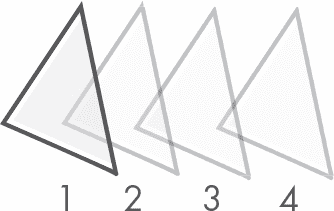
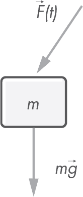
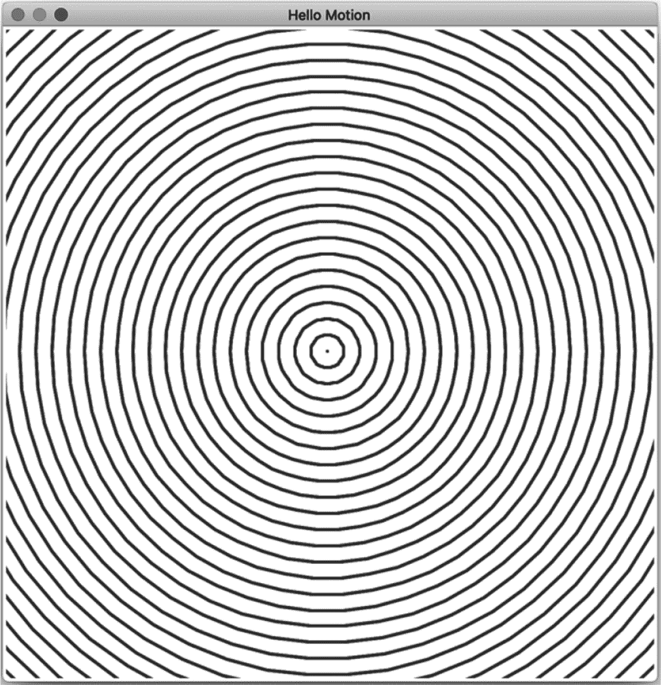
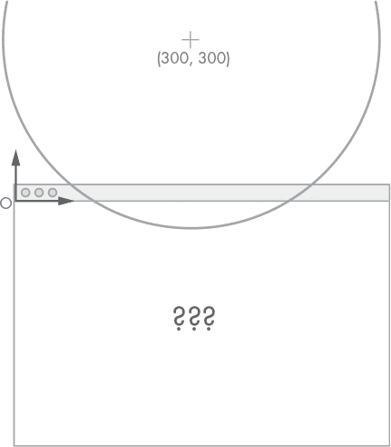
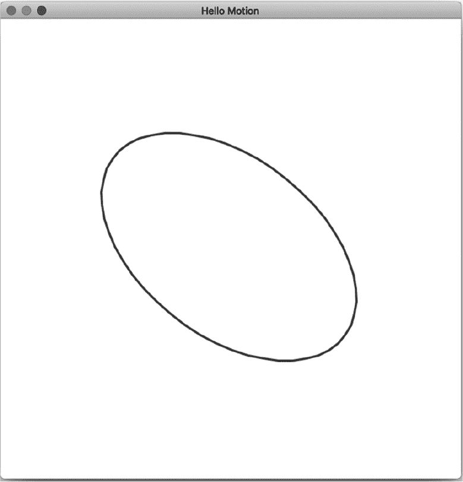

## 动画、仿真与时间循环


就像矢量图像用于可视化静态问题一样，动画帮助我们为动态问题建立直观的理解。单一的图像只能展示某一特定时刻的状态。当系统的属性随时间变化时，我们就需要动画来讲述完整的故事。

就像静态分析展示系统在某一时刻的状态一样，*仿真*展示了系统随时间的演变。动画是展示这种演变结果的好方法。工程师进行动态系统仿真有两个重要原因：它是巩固对这些系统理解的好方法，而且过程也相当有趣。

在本章中，我们将开始探索动画的迷人世界，从一些定义开始。然后我们将学习如何使图形在画布上移动。我们将使用 Tkinter 的画布，并且更重要的是，我们的 CanvasDrawing 包装类。

### **定义术语**

让我们定义一下在本节中将使用的几个术语。

#### ***什么是动画？***

*动画*是通过快速连续的图像生成的运动感知。因为计算机以极快的速度将这些图像绘制到屏幕上，所以我们的眼睛感知到了运动。

我们通过将图形绘制到画布上、清除画布，然后再绘制其他图形来制作动画。每个图形会在屏幕上停留极短的时间，这一帧图像被称为*帧*。

以图 11-1 为例，它展示了动画的每一帧：一个三角形向右移动。



*图 11-1：三角形的动画帧*

动画中的四个帧中，三角形的位置略有不同。如果我们将它们依次绘制到画布上，并清除之前的图形，三角形看起来就会移动。

很简单，不是吗？我们将在本章中构建我们的第一个动画，但首先让我们定义一下*系统*和*仿真*这两个术语，因为它们将在我们的讨论中频繁出现。

#### ***什么是系统？***

在我们的上下文中，*系统*一词指的是我们在动画中绘制到画布上的任何东西。它由一组物体组成，这些物体遵循某些物理定律并彼此相互作用。我们将使用这些定律推导出数学模型，通常是以微分方程组的形式。我们将使用数值方法求解这些方程，这些方法会在离散的时间点上给出描述系统的值。这些值可能是系统的位置或速度。

现在让我们来看一个系统的例子，并推导它的方程。假设我们有一个质量为*m*的物体，受一个关于时间的外力作用，。图 11-2 展示了一个*自由体图*。在这里，你可以看到施加的外力及其重力作用，其中是重力加速度矢量。



*图 11-2：受外力作用的物体*

使用牛顿第二定律，并将物体的位置向量表示为，我们得到以下方程：


求解加速度，


上述向量方程可以分解为其两个标量分量：


这两个方程表示物体加速度是时间的函数。为了模拟这个简单系统，我们需要为动画的每一帧获得物体的加速度、速度和位置的新值。我们稍后会看到这意味着什么。

#### ***什么是仿真？***

*仿真*是研究一个系统演化的过程，该系统的行为可以通过数学公式描述。仿真利用现代中央处理单元（CPU）的计算能力来理解在实际条件下给定系统的表现。

计算机仿真通常比实际实验更便宜且更易于设置，因此它们被广泛用于研究和预测许多工程设计的行为。

以我们在上一节中推导的系统为例。给定一个关于时间的外力表达式，如下所示：


物体的质量假设为*m* = 5kg 时，加速度方程变为以下形式。


这些标量方程给出了物体在每一时刻的加速度分量。由于这些方程简单，我们可以通过积分得到速度分量的表达式，


其中*Ẋ*[0]和*Ẏ*[0]是初始速度的分量：即时间*t* = 0 时的速度。我们知道物体在每一时刻的速度。如果我们想要为物体的运动制作动画，就需要一个位置的表达式，这可以通过积分速度方程得到，


其中*X*[0]和*Y*[0]是物体的初始位置分量。我们现在可以通过创建一系列时间值来生成动画，计算每个时间点的位置，然后在该位置上画一个矩形显示在屏幕上，从而理解物体在外力作用下如何运动。

与该例子中系统加速度如何随时间变化相关的*微分方程*是直接的，这使得我们能够通过积分得到解析解。我们通常无法为仿真中的系统获得解析解，因此我们倾向于使用数值方法。

*解析解*是精确解，而*数值解*是通过计算机算法寻找解的近似值。常见的数值方法，尽管不是最精确的，是*欧拉法*。

实时绘制模拟意味着我们需要在每次绘制帧时都解算一次方程。例如，如果我们希望以每秒 50 帧（fps）的速率进行模拟，那么我们需要每秒解算方程 50 次并绘制 50 帧。

在 50 帧每秒（fps）的情况下，帧之间的时间为 20 毫秒。考虑到计算机需要一些时间来重绘当前帧，我们只剩下很少的时间来进行数学计算。

模拟也可以提前计算好，然后稍后回放。通过这种方式，解算方程的时间可以根据需要延长；只有当所有帧都准备好时，动画才会进行。

视频游戏引擎使用实时模拟，因为它们需要模拟玩家与世界互动的过程，这种互动无法提前确定。这些引擎通常以速度换取精度；它们的结果在物理上不完全准确，但从肉眼看起来是逼真的。

复杂的工程系统需要提前模拟，因为这些问题的控制方程非常复杂，需要更精确的解决方案。

### **什么是时间循环？**

实时模拟发生在一个循环内，我们将其称为*时间循环*（time loop）或*主循环*（main loop）。这个循环每秒执行的次数与屏幕上绘制的帧数相同。以下是一些伪代码，展示时间循环可能的样子：

```py
while current_time < end_time:
    solve_system_equations()
    draw_system()
    sleep(time_delta - time_taken)
    current_time += time_delta
```

为了使动画看起来更流畅，我们需要保持稳定的帧率。这意味着模拟的绘制阶段应该在时间上均匀分布地进行。（虽然这并非绝对必要，但有些技术可以根据处理器和 GPU 的吞吐量调整帧率，不过在本书中我们不会深入探讨这些技术。）

连续帧之间的时间差称为*时间差*（time delta）或*δt*；它与帧率（fps）成反比，通常以秒或毫秒为单位进行度量： 。因此，时间循环中发生的所有事情都应该在一个时间差内完成。

循环的第一步是解算方程，找出系统在经过的时间差（delta）期间是如何演变的。然后，我们将系统的新配置绘制到屏幕上。我们需要测量当前循环中已经过去的时间，并将结果存储在`time_taken`变量中。

此时，程序会暂停或进入休眠状态，直到整个时间差已过。我们可以通过从`time_delta`中减去`time_taken`来计算需要休眠的时间。在结束循环之前的最后一步是将当前时间向前推进一个时间差；然后循环重新开始。图 11-3 展示了时间线和时间循环中的事件。


*图 11-3：时间循环事件*

现在我们已经了解了这些定义，接下来让我们实现一个时间循环并开始动画制作。

### **我们的第一个动画**

在本章开始时，我们解释了如何通过每秒绘制某些东西多次来实现运动的感觉。时间循环负责保持这些绘制的速率稳定。让我们实现我们的第一个时间循环。

#### ***设置***

我们将从创建一个新文件开始，以便进行实验。在*simulation*包中创建一个新文件，并命名为*hello_motion.py*。输入 Listing 11-1 中的代码。

```py
  import time
  from tkinter import Tk, Canvas

  tk = Tk()
  tk.title("Hello Motion")

  canvas = Canvas(tk, width=600, height=600)
  canvas.grid(row=0, column=0)

  frame_rate_s = 1.0 / 30.0
  frame_count = 1
  max_frames = 100

  def update_system():
      pass

  def redraw():
      pass

➊ while frame_count <= max_frames:
       update_start = time.time()
➋ update_system()
    ➌ redraw()
    ➍ tk.update()
       update_end = time.time()

    ➎ elapsed_s = update_end - update_start
       remaining_time_s = frame_rate_s - elapsed_s

       if remaining_time_s > 0:
        ➏ time.sleep(remaining_time_s)
      frame_count += 1

  tk.mainloop()
```

*Listing 11-1: hello_motion.py 文件*

在 Listing 11-1 中的代码中，我们首先创建一个 600 × 600 像素的画布，并将其添加到主窗口的网格中。然后，我们初始化一些变量：`frame_rate_s`保存两帧之间的时间，以秒为单位；`frame_count`是已经绘制的帧数；`max_frames`是我们将要绘制的总帧数。

**注意**

*请注意，存储时间相关量的变量在其名称中包含了它们使用的单位信息。* s *在* frame_rate_s *或* elapsed_s *中表示秒。这是一种良好的实践，因为它帮助开发者理解代码使用的单位，而无需阅读注释或遍历所有代码。当你每天花费许多小时编写代码时，这些小细节最终会为你节省大量时间和精力。*

然后是时间循环 ➊，它在每秒`frame_rate_s`的速度下执行`max_frames`次，至少在理论上是这样（稍后你会看到）。请注意，我们选择使用最大帧数来限制仿真，但我们也可以通过时间来限制，即在给定的时间过去后继续运行循环，就像我们在前面的伪代码中做的那样。这两种方法都可以正常工作。

在循环中，我们首先将当前时间存储在`update_start`中。系统更新和绘图完成后，我们再次存储时间，这次存储在`update_end`中。然后，通过从`update_end`中减去`update_start`来计算经过的时间，并将其存储在`elapsed_s` ➎中。我们使用这个值来计算循环需要睡眠多长时间，以保持帧率稳定，即从`frame_rate_s`中减去`elapsed_s`。该值存储在`remaining_time_s`中，如果它大于零，我们让循环休眠 ➏。

如果`remaining_time_s`小于零，说明循环比帧率要求的时间要长，意味着它无法跟上我们设定的节奏。如果这种情况经常发生，时间循环将变得不稳定，动画可能会显得卡顿，在这种情况下，最好减少帧率。

魔法发生在（或者更准确地说，将要发生在）update _system ➋ 和 redraw ➌ 中，我们在循环中调用它们以更新和重绘系统。这就是我们很快会写入绘图代码的地方。`pass`语句在 Python 中作为占位符使用：它不执行任何操作，但它允许我们例如拥有一个有效的函数体。

还调用了从主窗口 tk ➍ 更新，这告诉 Tkinter 运行主循环，直到所有待处理事件都被处理完。这是强制 Tkinter 查找可能触发用户界面小部件（包括我们的画布）变化的事件所必需的。

你现在可以运行文件了；你会看到一个空白窗口，表面上什么也没做，但它实际上正在运行最大帧数次数的循环。

#### ***添加帧计数标签***

让我们在画布下方添加一个标签，显示当前绘制到画布上的帧以及总帧数。我们可以在 update 中更新它的值。首先，向 tkinter 导入中添加 Label：

```py
from tkinter import Tk, Canvas, StringVar, Label
```

然后，在画布定义下方添加标签（Listing 11-2）。

```py
label = StringVar()
label.set('Frame ? of ?')
Label(tk, textvariable=label).grid(row=1, column=0)
```

*Listing 11-2: 向窗口添加标签*

最后，通过设置标签的文本变量 label 的值，在 update 中更新标签的文本（Listing 11-3）。

```py
def update():
    label.set(f'Frame {frame_count} of {max_frames}')
```

*Listing 11-3: 更新标签文本*

现在试着运行文件。画布仍然是空白的，但下面的标签现在显示了当前帧。你的程序应该像 Figure 11-4 那样：一个空白窗口，帧计数从 1 到 100。


*Figure 11-4: 帧计数标签*

仅供参考，此阶段你的代码应该像 Listing 11-4 这样。

```py
import time
from tkinter import Tk, Canvas, StringVar, Label

tk = Tk()
tk.title("Hello Motion")

canvas = Canvas(tk, width=600, height=600)
canvas.grid(row=0, column=0)

label = StringVar()
label.set('Frame ? of ?')
Label(tk, textvariable=label).grid(row=1, column=0)

frame_rate_s = 1.0 / 30.0
frame_count = 1
max_frames = 100

def update_system():
    pass

def redraw():
    label.set(f'Frame {frame_count} of {max_frames}')

while frame_count <= max_frames:
    update_start = time.time()
    update_system()
    redraw()
    tk.update()
    update_end = time.time()

    elapsed_s = update_end - update_start
    remaining_time_s = frame_rate_s - elapsed_s

    if remaining_time_s > 0:
        time.sleep(remaining_time_s)

    frame_count += 1

tk.mainloop()
```

*Listing 11-4: 画布与标签*

为了在画布上绘制任何内容，我们需要有一个系统。让我们先来看一下如何向我们的模拟中添加和更新一个系统。

#### ***更新系统***

在这个示例中，我们将保持简单，绘制一个圆，其中心始终位于画布的中心点（300, 300）。它的半径将从零开始增长。当半径大于画布并不再可见时，我们将其重置为零。这将生成一个类似迷幻隧道的效果。

我们可以通过 Circle 类的一个实例来表示我们的“系统”。由于我们将把圆绘制到画布上，所以我们还需要创建一个 Canvas Drawing 的实例，并使用身份仿射变换。在变量 frame_rate_s、frame_count 和 max_frames 的定义下，添加以下内容：

```py
transform = AffineTransform(sx=1, sy=1, tx=0, ty=0, shx=0, shy=0)
drawing = CanvasDrawing(canvas, transform)
circle = Circle(Point(300, 300), 0)
```

别忘了包含必要的导入：

```py
from geom2d import Point, Circle, AffineTransform
from graphic.simulation.draw import CanvasDrawing
```

我们需要在 update_system 中每帧更新半径的值，这样当重新绘制时，圆就会以更新后的半径值绘制。在 update_system 中，输入 Listing 11-5 中的代码。

```py
def update_system():
    circle.radius = (circle.radius + 15) % 450
    tk.update()
```

*Listing 11-5: 更新圆的半径*

半径的值通过将当前值加上 15 来更新。使用取模运算符（%），每当半径大于 450 时，值会回绕并重新归零。

**注意**

*温馨提示：取模运算符* % *返回两个操作数相除后的余数。例如，* 5 % 3 *等于* 2。

你可能已经意识到，我们修改了圆形的半径属性，而不是用新的半径值创建一个新的圆形；这是本书中第一次修改几何原件的属性。这样做的原因是，在模拟中，保持循环的吞吐量非常关键，而为每一帧创建一个新的系统实例会对性能产生较大的影响。

我们现在已经在每一帧中定义了系统：一个圆形，它的中心点始终保持在窗口的中心，而半径逐渐增大。让我们把它绘制到屏幕上吧！

#### ***创建运动***

为了创建运动效果，画布必须在每一帧中都被清空，并且系统要重新绘制。在主循环中调用重绘之前，`update_system`已经更新了圆形。在重绘中，我们只需清除画布上已经绘制的内容，再次绘制圆形。使用清单 11-6 中的代码更新重绘。

```py
def redraw():
    label.set(f'Frame {frame_count} of {max_frames}')
    drawing.clear_drawing()
    drawing.draw_circle(circle, 50)
```

*清单 11-6：每帧重绘圆形*

你可能已经等待了整个章节的这个重要时刻，现在可以执行文件了。你应该会看到一个圆形逐渐变大，直到从屏幕上消失，然后再重新开始。

仅供参考，此时你的*hello_motion.py*代码应该类似于清单 11-7。

```py
import time
from tkinter import Tk, Canvas, StringVar, Label

from geom2d import Point, AffineTransform, Circle
from graphic.simulation import CanvasDrawing

tk = Tk()
tk.title("Hello Motion")

canvas = Canvas(tk, width=600, height=600)
canvas.grid(row=0, column=0)

label = StringVar()
label.set('Frame ? of ?')
Label(tk, textvariable=label).grid(row=1, column=0)

frame_rate_s = 1.0 / 30.0
frame_count = 1
max_frames = 100

transform = AffineTransform(sx=1, sy=1, tx=0, ty=0, shx=0, shy=0)
drawing = CanvasDrawing(canvas, transform)
circle = Circle(Point(300, 300), 0)

def update_system():
    circle.radius = (circle.radius + 15) % 450
    tk.update()

def redraw():
    label.set(f'Frame {frame_count} of {max_frames}')
    drawing.clear_drawing()
    drawing.draw_circle(circle, 50)

while frame_count <= max_frames:
    update_start = time.time()
    update_system()
    redraw()
    tk.update()
    update_end = time.time()

    elapsed_s = update_end - update_start
    remaining_time_s = frame_rate_s - elapsed_s

    if remaining_time_s > 0:
        time.sleep(remaining_time_s)

    frame_count += 1

tk.mainloop()
```

*清单 11-7：结果模拟*

注意，在绘制任何内容之前，重绘函数会清除画布。如果我们忘记这么做，你能猜到会发生什么吗？将那一行注释掉，然后运行模拟。

```py
def redraw():
    label.set(f'Frame {frame_count} of {max_frames}')
    # drawing.clear_drawing()
    drawing.draw_circle(circle, 50)
```

所有绘制的圆形应保持在画布上，就像你在图 11-5 中看到的那样。

我们已经在画布上绘制了第一个动画，看起来很棒。然而，如果我们再写一个，我们就不得不复制并粘贴主循环的代码。为了避免这种不必要的重复，让我们将主循环代码移动到一个可以轻松重用的函数中。



*图 11-5：如果我们忘记清理画布，会是什么样子*

### **抽象化主循环函数**

我们刚刚编写的主循环包含了相当多的逻辑，这些逻辑在所有模拟中都是相同的。如果我们不断地复制和粘贴这些代码，不仅会违反编码规范，而且如果我们发现了改进之处或想要修改实现，我们就需要编辑所有模拟的代码。我们不希望重复知识：我们应该在一个地方定义主模拟循环的逻辑。

要实现一个通用版本的主循环，我们需要进行抽象化操作。让我们问自己以下几个问题，关于主循环的实现：其中有没有什么永远不会改变的部分，或者有没有什么特定于仿真的内容？while 循环、内部操作的顺序以及时间计算在每个仿真中都是相同的。相反，有三部分逻辑会因仿真不同而有所变化，即决定主循环是否继续的条件、更新操作和绘制操作。

如果我们将这些逻辑封装到仿真所实现的函数中，它们就可以被传递给我们的主循环抽象。我们实现的主循环只需要关注时序，即尽量保持帧率稳定。

在 *simulation* 包中创建一个名为 *loop.py* 的新文件。输入 示例 11-8 中的代码。

```py
import time

def main_loop(
        update_fn,
        redraw_fn,
        should_continue_fn,
        frame_rate_s=0.03
):
    frame = 1
    time_s = 0
    last_elapsed_s = frame_rate_s

 ➊ while should_continue_fn(frame, time_s):
        update_start = time.time()
     ➋ update_fn(last_elapsed_s, time_s, frame)
     ➌ redraw_fn()
        update_end = time.time()

        elapsed_s = update_end - update_start
        remaining_time_s = frame_rate_s - elapsed_s

        if remaining_time_s > 0:
            time.sleep(remaining_time_s)
            last_elapsed_s = frame_rate_s
        else:
            last_elapsed_s = elapsed_s

        frame += 1
        time_s += last_elapsed_s
```

*示例 11-8：仿真主循环函数*

你应该首先注意到，main_loop 函数的三个参数也是函数：update_fn、redraw_fn 和 should_continue_fn。这些函数包含了特定于仿真的逻辑，因此我们的主循环只需按需调用它们。

**注意**

*将函数作为参数传递给其他函数的内容已在第一章的第 27 页中介绍过。你可能想参考这一部分以便快速复习。*

main_loop 函数首先声明三个变量：frame，表示当前帧的索引；time_s，表示总的经过时间；以及 last_elapsed_s，表示上一个帧完成所用的秒数。继续循环的条件现在被委托给 should_continue_fn 函数 ➊。只要该函数返回 true，循环将继续。它接受两个参数：帧数和总的经过时间（秒）。如果你还记得，我们的大多数仿真将由其中一个值限制，因此我们将它们传递给该函数，以便它能够获得判断循环是否应该继续运行所需的信息。

接下来，update_fn 函数 ➋ 用于更新仿真系统和用户界面。该函数接收三个参数：自上一个帧以来的时间间隔 last_elapsed_s；仿真总的经过时间 time_s；以及当前的帧数 frame。正如我们在后续章节中会看到的，当我们将物理引擎引入仿真时，自上一个帧以来的时间间隔将成为一个重要的数据。最后是 redraw_fn ➌，用于将系统绘制到屏幕上。

多亏了我们对仿真主循环的抽象，我们不再需要编写这部分逻辑。让我们尝试使用这种主循环定义来重构上一节的仿真。

### **重构我们的仿真**

现在我们已经创建了主循环的抽象，让我们看看如何重构我们的仿真，来包含主循环函数。

创建一个新的文件，命名为 *hello_motion_refactor.py*，并输入列表 11-9 中的代码。你可能想要复制并粘贴 *hello_motion.py* 中的前几行，这些行定义了用户界面。请注意，为了让代码简短一些，我已从界面中移除了帧计数标签。

```py
from tkinter import Tk, Canvas

from geom2d import Point, Circle, AffineTransform
from graphic.simulation.draw import CanvasDrawing
from graphic.simulation.loop import main_loop

tk = Tk()
tk.title("Hello Motion")

canvas = Canvas(tk, width=600, height=600)
canvas.grid(row=0, column=0)

max_frames = 100

transform = AffineTransform(sx=1, sy=1, tx=0, ty=0, shx=0, shy=0)
drawing = CanvasDrawing(canvas, transform)
circle = Circle(Point(300, 300), 0)

def update_system(time_delta_s, time_s, frame):
    circle.radius = (circle.radius + 15) % 450
    tk.update()

def redraw():
    drawing.clear_drawing()
    drawing.draw_circle(circle, 50)

def should_continue(frame, time_s):
    return frame <= max_frames

main_loop(update_system, redraw, should_continue)
tk.mainloop()
```

*列表 11-9：重构后的 hello_motion.py 版本*

如果我们查看代码的结尾部分，找到调用 `main_loop` 的位置。我们传入了之前定义的函数，唯一的区别是，现在这些函数必须声明适当的参数，以匹配 `main_loop` 函数所期望的参数。

这段代码更加简洁易懂。所有保持稳定帧率的逻辑已经被移到它自己的函数中，这样我们就能专注于模拟本身，而不需要处理那些细节。现在，让我们花点时间玩一下模拟的一些参数，了解它们是如何影响最终结果的。

#### ***玩转圆形分段***

记住，CanvasDrawing 类在其状态中包括一个仿射变换，并且每个几何图形在绘制之前都会通过这个变换进行转换。还要记住，这也是为什么圆形会被转换成一个通用多边形，使用足够多的分段来近似圆周的原因。变换发生在绘制命令中；因此，必须传入分段数，否则会使用默认值 30。

回到列表 11-9 中的 `redraw` 函数，

```py
def redraw():
    drawing.clear_drawing()
    drawing.draw_circle(circle, 50)
```

你可以看到我们使用了 50 个分段，但我们也可以使用其他任何数字。例如，我们可以尝试 10 个分段：

```py
def redraw():
    drawing.clear_drawing()
    drawing.draw_circle(circle, 10)
```

重新运行文件。你能看到差异吗？如果你尝试使用 6 个分段，结果如何？图 11-6 显示了使用 50、10 和 6 个分段进行圆形模拟的结果。


*图 11-6：使用 50、10 和 6 个分段绘制的圆形*

经过这个有趣的实验后，我们可以清楚地看到分段数量如何影响圆形的近似效果。现在让我们来实验一下用于在绘制到画布之前转换几何图形的仿射变换。

#### ***玩转仿射变换***

在我们的模拟中应用的仿射变换是一个恒等变换：它保持点的位置不变。但我们可以使用这个变换做些不同的事，比如反转 y 轴，使其指向上方。例如，返回到 *hello_motion_refactor.py*，找到定义变换的那一行：

```py
transform = AffineTransform(sx=1, sy=1, tx=0, ty=0, shx=0, shy=0)
```

然后，编辑它以反转 y 轴：

```py
transform = AffineTransform(
    sx=1, sy=-1, tx=0, ty=0, shx=0, shy=0
)
```

再次运行模拟。你看到什么了？只是从画布顶部冒出来的一点边缘，对吧？发生的情况是，我们反转了 y 轴，但坐标原点仍然在左上角；因此，我们尝试绘制的圆形超出了窗口范围，如图 11-7 所示。



*图 11-7：y 轴翻转的模拟*

我们可以通过将坐标原点平移到画布的左下角来轻松解决这个问题。由于画布的高度是 600 像素，我们可以将变换设置为如下：

```py
transform = AffineTransform(
    sx=1, sy=-1, tx=0, ty=600, shx=0, shy=0
)
```

你可能会感到惊讶，垂直平移的值是 600 而不是-600，但请记住，在原始坐标系统中，y 方向是向下的，而这个仿射变换是基于该系统的。

如果你愿意，可以通过将两个更简单的变换连接起来，来更容易理解获取该变换的过程，第一个将原点向下平移 600 像素，第二个翻转 y 轴，

```py
>>> t1 = AffineTransform(sx=1, sy=1, tx=0, ty=-600, shx=0, shy=0)
>>> t2 = AffineTransform(sx=1, sy=-1, tx=0, ty=0, shx=0, shy=0)
>>> t1.then(t2).__dict__
{'sx': 1, 'sy': -1, 'tx': 0, 'ty': 600, 'shx': 0, 'shy': 0}
```

这会产生相同的变换，正如你所看到的。

现在，让我们在水平方向上添加一些剪切，看看圆形如何变形。尝试以下变换值，

```py
transform = AffineTransform(
    sx=1, sy=-1, tx=150, ty=600, shx=-0.5, shy=0
)
```

然后再次运行模拟。你应该看到一个类似于图 11-8 中的形状。



*图 11-8：使用水平剪切绘制的圆形*

现在轮到你来调整这些值，看看是否能建立更好的直觉，了解动画、绘图和变换是如何工作的。你已经从零开始创建了一些美丽的东西，所以花时间去实验一下。试着用三角形或矩形替代圆形原语来更新几何图形。你可以通过移动几何图形而不是改变其大小来更新它。玩转仿射变换值，尝试推理出在实际运行模拟之前绘图应呈现的效果。利用这个练习来加深你对仿射变换的直觉。

### **清理模块**

我们做两个小的重构来清理模块。首先，在*simulation*包中创建一个新的文件夹，命名为*examples*。我们将使用它来存放所有不属于模拟和绘图逻辑的文件，而是本章中编写的示例文件。所以，基本上将除了*draw.py*和*loop.py*之外的所有文件移到那里。你在*simulation*中的文件夹结构应如下所示：

simulation

|- examples

|    |- hello_canvas.py

|    |- hello_motion.py

|    |- ...

|

|- __init__.py

|- draw.py

|- loop.py

我们想做的第二件事是将 CanvasDrawing 类和 main_loop 函数添加到*simulation*包的默认导出中。打开*simulation*中的文件 __init__.py，并添加以下导入：

```py
from .draw import CanvasDrawing
from .loop import main_loop
```

就这样！从现在开始，我们将能够使用更简洁的语法导入两者。

### **总结**

在这一章中，我们学习了时间循环。时间循环在满足条件时不断执行，它的主要任务是保持帧率稳定。在这个循环中，有两件事发生：模拟系统的更新和屏幕的重绘。这些操作是定时的，当它们完成时，我们知道完成一个周期还剩下多少时间。

因为时间循环将在我们所有的模拟中出现，我们决定将其实现为一个函数。这个函数接收其他函数作为参数：一个用于更新系统，另一个用于将其绘制到屏幕上，最后一个用于决定模拟是否结束。

在下一章，我们将使用这个时间循环函数来动画仿射变换。
