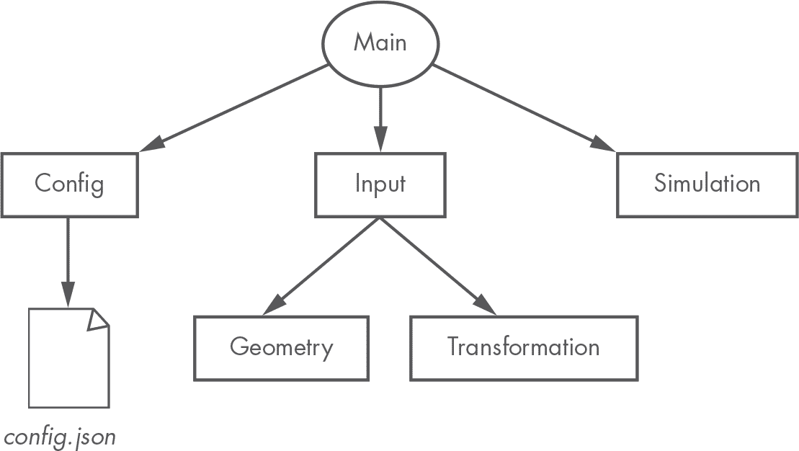
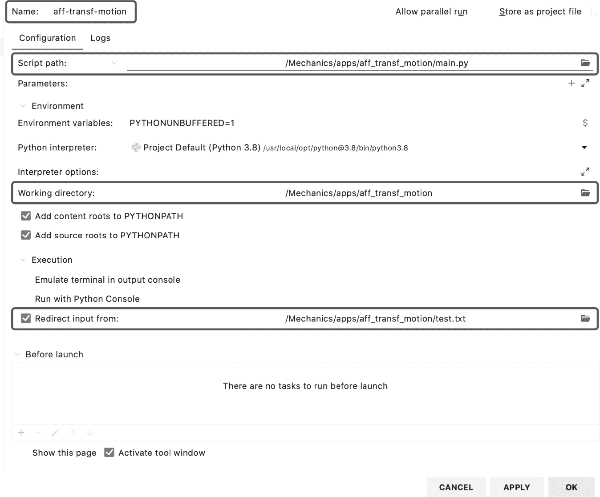
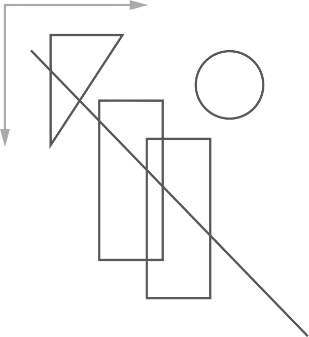
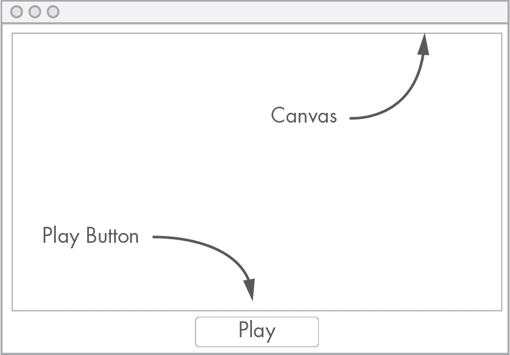
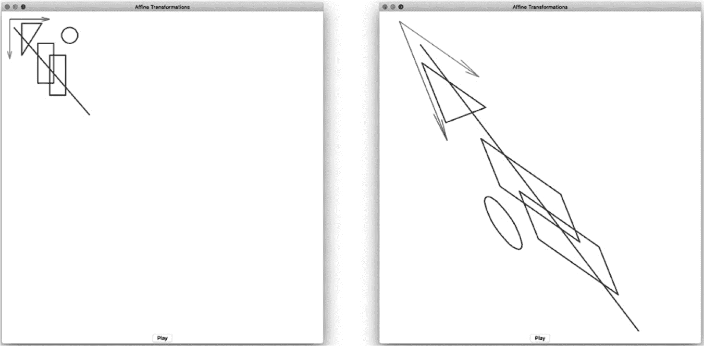

## 动画仿射变换


你刚刚学习了动画和 GUI 设计的基础知识。在本章中，我们将结合这两者，构建一个动画化仿射变换的应用程序。这将帮助你培养对这个可能令人困惑的主题的视觉直觉，并增强你的编程技能。

该应用程序将首先读取一个文本文件，定义仿射变换和需要变换的几何图形。然后，它将计算一个仿射变换的序列，从单位变换插值到给定的变换。这个序列中的每个变换将用于绘制动画的每一帧。

和我们在第九章中构建的圆形构建应用程序一样，我们将使用正则表达式从文本文件中读取原始数据。在这里，我们将使用一些更高级的正则表达式，我们会进行详细分析。本章会有很多代码。我们正在构建一个更大的应用程序，这是一个学习如何在代码中分配责任的绝佳机会。

和往常一样，我们将尽量保持架构和设计的简洁，解释我们所遇到的每个决策背后的理由。让我们开始吧！

### **应用程序架构和可见性图**

要讨论这个应用程序的架构，我们将引入一种新的图表类型：*可见性图*。可见性图通过箭头显示应用程序的各个组件，指示程序的每个部分知道什么——换句话说，谁能看到谁。请看图 12-1 中的图示。



*图 12-1：我们的应用程序架构*

图表的顶部是*Main*，即执行脚本。围绕它的圆圈表示它是应用程序的入口点。从*Main*出发有三条箭头，这意味着*Main*知道另外三个模块：*Config*、*Input*和*Simulation*。模块用矩形表示。

请注意，箭头是单向的。*Main*知道这些模块的存在，并依赖它们，但这些模块对*Main*的存在一无所知。这一点至关重要：我们希望尽量减少应用程序组件之间的相互了解。这确保了模块尽可能地*解耦*，也就是说，它们可以独立存在。

解耦设计的好处主要是简洁性，它使我们能够轻松地扩展和维护软件，并且具有可重用性。模块的依赖关系越少，越容易在其他地方使用它。

回到图 12-1 中的图示，我们说过*Main*使用了三个模块：*Config*、*Input*和*Simulation*。*Config*模块将负责加载存储在*config.json*中的应用程序配置——由箭头指示。

*Input*模块将读取用户提供的输入文件，并定义仿射变换和几何原始体。因此，这个模块将使用两个其他模块：*Geometry*，用于解析原始体，和*Transformation*，用于解析仿射变换。同样，箭头从*Input*指向其他两个模块，意味着这两个模块对*Input*一无所知：它们完全可以由其他模块使用。

最后，我们有*仿真*模块，它将负责执行实际的仿真。

**注意**

*我不能过分强调解耦架构的重要性。应用程序应由小的子模块构成，这些子模块暴露简单明了、简洁的接口，并隐藏它们的内部工作方式。只有在这些模块拥有尽可能少的依赖关系时，它们才更容易维护。不遵循这一简单原则的应用程序往往注定失败，相信我，当你在一个模块中修复了一个小 bug，却导致另一个看似无关的模块出现问题时，你会感到绝望。*

让我们继续并设置项目。

### **设置**

在*apps*文件夹中，创建一个名为*aff_transf_motion*的新 Python 包。在其中，添加以下树状结构中显示的所有文件。如果你通过右键点击*apps*并选择**新建** ▸ **Python 包**来创建新包，*__init__.py*会自动出现在目录中；IDE 为我们创建了它。如果你以其他方式创建包，请不要忘记添加这个文件。

apps

|- aff_transf_motion

|- __init__.py

|- config.json

|- config.py

|- input.py

|- main.py

|- parse_geom.py

|- parse_transform.py

|- simulation.py

|- test.txt

目前你所有的文件都是空的，但我们很快会用代码填充它们。

在我们进行之前，我们需要一个运行配置或 bash 脚本来在开发过程中运行项目，就像我们在第九章中做的那样。我们首先需要定义它将在*main.py*中执行的脚本。现在，我们将简单地打印一条信息到终端，以确保一切正常运行。打开文件并输入列表 12-1 中的代码。

```py
if __name__ == '__main__':
   print('Ready!')
```

*列表 12-1：主文件*

现在让我们探讨执行项目的两种选择：运行配置和 bash 脚本。你不需要设置两者；可以选择最适合你的一个，跳过另一个。

#### ***创建运行配置***

在菜单中选择**运行** ▸ **编辑配置**。点击左上角的**+**图标，选择**Python**来创建运行配置。命名为*aff-transf-motion*。与我们在第九章中做的类似，选择*main.py*作为脚本路径，*aff_transform_motion*作为工作目录。最后，勾选**重定向输入自**选项，选择*test.txt*。你的配置应该类似于图 12-2。



*图 12-2：运行配置*

为了确保运行配置正确设置，请从运行配置导航栏中选择它，并点击绿色的播放按钮。终端应该显示消息“Ready!”。如果你在设置过程中遇到任何问题，参考第九章，我们在那里详细讲解了这个过程。

#### ***创建一个 Bash 脚本***

要从命令行运行应用程序，我们将使用在第九章中探讨的技术：创建一个 Bash 脚本包装器，使用我们的项目根目录作为 Python 解析依赖项的工作区。在项目的根目录下（在 *Mechanics* 目录下）创建一个新文件：*aff_motion.sh*。在文件中，输入 Listing 12-2 中的代码。

```py
#!/usr/bin/env bash
PYTHONPATH=$PWD python3 apps/aff_transf_motion/main.py
```

*Listing 12-2: 执行项目的 Bash 脚本*

使用这个 Bash 脚本，我们现在可以像这样从命令行执行应用程序：

```py
$ bash ./aff_motion.sh < apps/aff_transf_motion/test.txt
```

我们可以让这个 Bash 脚本变得可执行：

```py
$ chmod +x aff_motion.sh
```

然后像这样运行它：

```py
$ ./aff_motion.sh < apps/aff_transf_motion/test.txt
```

### **读取配置文件**

因为我们希望将配置值与代码分离，所以我们将它们保存在一个 JSON 文件中。这使得我们可以在不触碰代码的情况下更改应用程序的行为。打开 *config.json* 并输入 Listing 12-3 中的内容。

```py
{
  "frames": 200,
  "axes": {
    "length": 100,
    "arrow-length": 20,
    "arrow-height": 15,
    "stroke-width": 2,
    "x-color": "#D53636",
    "y-color": "#33FF86"
  },
  "geometry": {
    "stroke-color": "#3F4783",
    "stroke-width": 3
  }
}
```

*Listing 12-3: 配置 JSON 文件*

该配置首先定义了用于仿真的帧数。接下来是坐标轴的尺寸和颜色，我们将绘制这些坐标轴来帮助我们可视化空间的变换。最后，我们为将要被变换的几何体设置配置值。这里我们定义了线条的颜色和宽度。

现在我们需要一种方法来读取这个配置的 JSON 文件，并将其内容转换成 Python 字典。让我们使用在第九章中使用的相同方法。在 *config.py* 中，输入 Listing 12-4 中的代码。

```py
import json

import pkg_resources as res

def read_config():
    config = res.resource_string(__name__, 'config.json')
    return json.loads(config)
```

*Listing 12-4: 读取配置文件*

配置部分完成后，让我们将注意力转向读取和解析输入。

### **读取输入**

我们希望用户传递给程序一个文件，文件包含仿射变换的定义和要变换的几何图形列表。让我们定义这些文件应该如何格式化。我们可以先读取仿射变换值，因为我们事先知道预期会有多少个值。由于几何图形的数量不固定，我们将它们放在最后。

#### ***格式化输入***

这里有一个很好的格式化仿射变换值的方法：

```py
sx <value>
sy <value>
shx <value>
shy <value>
tx <value>
ty <value>
```

这里每个值都在自己的行中定义，并且有一个标签指示它属于哪个术语。我们可以使用更简洁的格式，将所有这些值放在同一行中，像这样：

```py
transformation: <value> <value> <value> <value> <value> <value>
```

但这样做的缺点是对用户来说不够清晰。值的顺序是什么？第三个数字是 x 方向的剪切还是 y 方向的平移？要回答这个问题，你需要打开源代码，看看这些值是如何解析的。我倾向于在输入大小不大的情况下，优先考虑清晰度而非简洁性，因此我们将坚持使用第一种方法。

那么，几何原始形状怎么样呢？对于每一种几何原始形状，我们将使用不同的四个字母的代码：例如，圆形使用 circ。该代码后面会跟一堆定义原始形状属性的数字。

对于圆形，定义将如下所示

```py
circ <cx> <cy> <r>
```

其中 <*cx*> 和 <*cy*> 是中心点的坐标，<*r*> 是半径的值。

一个矩形看起来像

```py
rect <ox> <oy> <w> <h>
```

其中 <*ox*> 和 <*oy*> 定义了原点的坐标，<*w*> 是宽度，<*h*> 是高度。

一个多边形看起来像

```py
poly [<x1> <y1> <x2> <y2> <x3> <y3> ...]
```

其中 [<*x*> <*y*>] 表示一组 x 和 y 值，表示一个顶点的坐标。请记住，构建多边形的最小顶点数是三，因此这里需要至少六个值。

最后，一条线段的定义如下

```py
segm <sx> <sy> <ex> <ey>
```

其中 <*sx*> 和 <*sy*> 是起点的坐标，<*ex*> 和 <*ey*> 是终点的坐标。

#### ***添加示例输入***

让我们用一个示例输入填充 *test.txt* 文件。记住，我们在程序中将标准输入重定向到 *test.txt*，因此我们将用它来测试我们的代码。打开文件并输入清单 12-5 中的定义。

```py
sx 1.2
sy 1.4
shx 2.0
shy 3.0
tx 50.0
ty 25.0

circ 150 40 20
rect 70 60 40 100
rect 100 90 40 100
poly 30 10 80 10 30 90
segm 10 20 200 240
```

*清单 12-5：输入测试文件*

该文件首先定义了一个仿射变换，如下所示：


它还定义了一个圆形、两个矩形、一个多边形和一条线段。图 12-3 描述了在应用仿射变换之前，这些几何原始形状的大致布局。



*图 12-3：我们测试文件中的几何原始形状*

现在 *test.txt* 包含了这些定义，接下来让我们编写读取和解析输入的代码大纲。打开 *input.py* 并输入清单 12-6 中的代码。

```py
def read_input():
    transform = __read_transform()
    primitives = __read_primitives()
    return transform, primitives

def __read_transform():
    return None

def __read_primitives():
    return None
```

*清单 12-6：解析输入文件起始点*

我们首先定义一个函数 `read_input`，它将读取仿射变换和几何原始形状，并返回一个包含这两者的元组。为了完成这项工作，它将这两个任务委托给私有函数：__read_transform 和 __read_primitives。这些函数目前返回 None。我们将在接下来的两节中实现它们。

#### ***解析仿射变换***

输入文件中的仿射变换将始终跨越六行，每个项占一行。我们可以通过要求项总是以相同的、预定义的顺序出现来简化解析过程。我们将重新检查每个项是否具有适当的名称标签，以确保用户按照正确的顺序编写项，但我们不会在正则表达式中包含这部分内容，这应该会简化一些事情。

我们首先需要一个正则表达式，它能够匹配变换组件中的浮点数。设计这个正则表达式时需要确保它也能匹配整数；小数部分应该是可选的。我们还希望接受负数。结合所有这些特征的正则表达式可能是这样的：

/-?\d+(\.\d+)?/

这个正则表达式有三个部分。第一个 -? 匹配零次或一次的减号。第二个 \d+ 匹配小数分隔符之前的一个或多个数字：整数部分。最后是 (\.\d+)?，它匹配零次或一次由点和一个或多个数字组成的序列。请注意，我们使用了?来处理可选组件。

使用前面展示的正则表达式，我们可以准备另一个正则表达式来匹配所有的项值：

/(?P<val>-?\d+(\.\d+)?)/

这定义了一个名为 val 的组，使用前面的表达式捕获项的值。

让我们打开*parse_transform.py*（此时为空），并实现读取和解析仿射变换项的逻辑。输入清单 12-7 中的代码。

```py
import re

__TRANSF_VAL_RE = r'(?P<val>-?\d+(\.\d+)?)'

def parse_transform_term(term, line):
    __ensure_term_name(term, line)
    return __parse_transform_term(line)

def __ensure_term_name(name, line):
    if name not in line:
        raise ValueError(f'Expected {name} term')

def __parse_transform_term(line):
    matches = re.search(__TRANSF_VAL_RE, line)
    if not matches:
        raise ValueError('Couldn\'t read transform term')

    return float(matches.group('val'))
```

*清单 12-7：解析仿射变换项*

我们首先定义正则表达式来解析仿射变换项的值：__TRANSF_VAL_RE。然后是主函数：parse_transform_term，它有两个参数：要验证的项的名称和要解析的行。每个操作都由两个私有函数处理。

函数 __ensure_term_name 检查给定的名称是否出现在行中。如果没有，函数会引发一个 ValueError，并附上有用的消息，告诉用户哪个项无法正确解析。然后，__parse_transform_term 应用正则表达式 __TRANSF_VAL_RE 来匹配项的值。如果匹配成功，匹配的组 val 将被转换为浮动值并返回。如果字符串不符合正则表达式，则会引发错误。

现在，让我们在*Input*模块中使用这个解析函数（如图 12-1 所示）。打开你的*input.py*文件，并在顶部添加以下导入：

```py
from apps.aff_transf_motion.parse_transform import parse_transform_term
from geom2d import AffineTransform
```

然后，按照清单 12-8 中的方式重构 __read_transform 函数。

```py
--snip--

def __read_transform():
    return AffineTransform(
        sx=parse_transform_term('sx', input()),
        sy=parse_transform_term('sy', input()),
        shx=parse_transform_term('shx', input()),
        shy=parse_transform_term('shy', input()),
        tx=parse_transform_term('tx', input()),
        ty=parse_transform_term('ty', input())
    )
```

*清单 12-8：解析仿射变换*

我们可以通过编辑我们的*main.py*文件，将其内容与清单 12-9 进行匹配，轻松测试代码是否正常工作。

```py
from apps.aff_transf_motion.input import read_input

if __name__ == '__main__':
    (transform, primitives) = read_input()
    print(transform)
```

*清单 12-9：主文件：读取变换测试*

如果你使用之前创建的运行配置或 bash 脚本运行程序，终端输出应该如下所示：

```py
Input is being redirected from .../test.txt
(sx: 1.2, sy: 1.4, shx: 2.0, shy: 3.0, tx: 50.0, ty: 25.0)

Process finished with exit code 0
```

你需要确保我们在*test.txt*中定义的仿射变换的所有值都被正确解析。如果你还记得，这些值如下：

sx 1.2

sy 1.4

shx 2.0

shy 3.0

tx 50.0

ty 25.0

仔细检查程序输出是否与这些值匹配。如果一切正确，恭喜你！如果得到任何意外的值，请调试程序，直到找到问题并修复它。

#### ***解析几何图形***

几何图形可以按任意顺序出现，而且数量不确定，因此我们需要一种不同的解析策略。我们需要解决两个独立的问题：我们需要从输入中读取不确定数量的行，然后确定每行对应的几何图形类型。让我们分别解决这两个问题，从第一个开始。

##### **读取不确定数量的行**

要读取不确定数量的行，我们可以不断从标准输入读取，直到引发 EOFError（文件结束错误），这意味着我们已读取完所有可用行。打开*input.py*并通过在列表 12-10 中输入代码来重构 __read_primitives。

```py
--snip--

def __read_primitives():
    has_more_lines = True

    while has_more_lines:
        try:
            line = input()
            print('got line -->', line)

        except EOFError:
            has_more_lines = False
```

*列表 12-10：从标准输入读取行*

我们声明一个变量 has_more_lines 并将其赋值为 True。然后，在一个 while 循环中，只要变量保持 True，我们就尝试从标准输入中读取另一行。如果操作成功，我们将该行打印到输出中；否则，我们捕获 EOFError 并将 has_more_lines 设置为 False。

再次运行程序，确保输入文件中的所有行都由 __read_primitives 处理，并出现在终端输出中。程序的输出应包括以下行：

```py
got line -->
got line --> circ 150 40 20
got line --> rect 70 60 40 100
got line --> rect 100 90 40 100
got line --> poly 30 10 80 10 30 90
got line --> segm 10 20 200 240
```

第一个问题已经解决：我们的*input.py*模块知道如何读取输入文件中的所有行。请注意，空行也由 __read_primitives 函数处理；我们将在下一节处理这个问题。现在我们知道如何读取这些行，让我们将注意力转向第二个问题：识别每一行的几何图形类型。

##### **解析正确的图形**

我们先从一个我们确定的事实开始：我们需要为程序理解的每个几何图形定义正则表达式。在本章前面，我们已经定义了我们预期的每种图形的输入格式。我们只需要将其转换为正则表达式。我们将接受整数或浮点数作为每个图形的属性值。我们之前已经看到过如何做到这一点。我们将称捕获属性值的正则表达式为 NUM_RE，并使用以下定义：

/\d+(\.\d+)?/

使用这个正则表达式，我们可以为圆形定义正则表达式如下：

/circ (?P<cx>NUM_RE) (?P<cy>NUM_RE) (?P<r>NUM_RE)/

这里我们包括了三个捕获组：cx, cy 和 r。这些组与我们为前一个圆的输入表示所定义的属性一致。类似地，一个矩形可以通过以下正则表达式进行匹配：

/rect (?P<ox>NUM_RE) (?P<oy>NUM_RE) (?P<w>NUM_RE) (?P<h>NUM_RE)/

一个匹配线段的正则表达式可以是：

/segm (?P<sx>NUM_RE) (?P<sy>NUM_RE) (?P<ex>NUM_RE) (?P<ey>NUM_RE)/

最后，对于多边形，我们使用了一种稍微不同的方法来简化它的解析过程，正如我们现在将看到的那样。以下是我们将使用的正则表达式：

/poly (?P<coords>[\d\s\.]+)/

这个正则表达式匹配以*poly*开头，后跟一个空格和一串数字、空格或点（用作小数点分隔符）的字符串。通过它，我们将匹配多边形定义，具体如下：

poly 30 10 80.5 10 30 90.5

我们将其解析为由顶点(30, 10)，(80.5, 10) 和 (30, 90.5) 定义的多边形。

让我们将这些定义包括到我们的*parse_geom.py*文件中，并添加一些我们需要的导入，以创建几何原语。将代码输入到列表 12-11 中。

```py
import re

from geom2d import Circle, Point, Rect, Size, Segment
from geom2d import make_polygon_from_coords

__NUM_RE = r'\d+(\.\d+)?'

__CIRC_RE = rf'circ (?P<cx>{__NUM_RE}) (?P<cy>{__NUM_RE}) ' \
    rf'(?P<r>{__NUM_RE})'

__RECT_RE = rf'rect (?P<ox>{__NUM_RE}) (?P<oy>{__NUM_RE}) ' \
    rf'(?P<w>{__NUM_RE}) (?P<h>{__NUM_RE})'

__POLY_RE = rf'poly (?P<coords>[\d\s\.]+)'

__SEGM_RE = rf'segm (?P<sx>{__NUM_RE}) (?P<sy>{__NUM_RE}) ' \
    rf'(?P<ex>{__NUM_RE}) (?P<ey>{__NUM_RE})'
```

*列表 12-11：几何原语，正则表达式定义*

我们已经拥有了所有需要的正则表达式，所以我们的下一个目标是为每一行读取到的内容找到适当的原语。为了解决这个问题，我们将遵循“如果能<动词>，那么<动词>”的模式，在我们的情况下是“如果能解析，那么解析”。让我们看看这个是如何工作的。我们有一系列的解析函数，每个函数都期望接收到特定格式的字符串。如果它们试图从格式错误的字符串中解析几何原语，将会失败。因此，在使用这些函数之前，我们希望确保它们能够理解我们传递给它们的字符串。我们将为每个解析函数配备一个 can_parse 函数。这个第二个函数应该判断解析函数所期望的所有部分是否都存在于字符串中：即模式的“能解析”部分。

对于每一个几何原语，我们需要一对函数：一个用于确定给定的文本行是否可以解析为这个原语（即“能解析”部分），另一个则是实际进行解析的函数（即“然后解析”部分）。这个算法的代码如下：

```py
if can_parse_circle(line):
    parse_circle(line)

elif can_parse_rect(line):
    parse_rect(line)

elif can_parse_polygon(line):
    parse_polygon(line)

elif can_parse_segment(line):
    parse_segment(line)

else:
    handle_unknown_line(line)
```

我们首先检查给定的行是否可以解析为一个圆形。如果测试通过，我们继续解析圆形；否则，我们继续进行下一个比较，重复这个模式。可能会出现没有一个比较通过的情况，最终进入最后的 else 语句；我们将在 handle_unknown_line 函数中处理这种情况。例如，考虑那些从输入文件读取的空行，它们将无法匹配任何已知的原语。我们可以有几种方法来处理这些问题行。例如，我们可以在终端中打印它们，并附带警告消息，告知用户程序无法理解某些行。为了简化起见，我们将忽略这些未知行。

现在让我们为每个原始数据实现“可以解析”和“解析”函数。在 *parse_geom.py* 中，在我们刚定义的正则表达式之后，输入 清单 12-12 中的代码。这段代码处理圆形的情况。

```py
--snip--

def can_parse_circle(line):
    return re.match(__CIRC_RE, line)

def parse_circle(line):
    match = re.match(__CIRC_RE, line)
    return Circle(
        center=Point(
            float(match.group('cx')),
            float(match.group('cy'))
        ),
        radius=float(match.group('r'))
    )
```

*清单 12-12：解析圆形*

正如你所看到的，can_parse_circle 函数仅检查传入的行是否与圆形的正则表达式 __CIRC_RE 匹配。parse_circle 函数更进一步，假设该行与正则表达式匹配，它提取 cx 和 cy 组的值，即圆心的位置。它同样处理 r 组的值，即半径。

不要忘记，我们从正则表达式捕获组中提取的值始终是字符串。由于我们期望的是浮点数，因此需要使用 `float` 函数进行转换。

现在让我们为矩形的情况实现相同的函数。在你刚写的代码之后，输入 清单 12-13 中的代码。

```py
--snip--

def can_parse_rect(line):
    return re.match(__RECT_RE, line)

def parse_rect(line):
    match = re.match(__RECT_RE, line)
    return Rect(
        origin=Point(
            float(match.group('ox')),
            float(match.group('oy'))
        ),
        size=Size(
            float(match.group('w')),
            float(match.group('h'))
        )
    )
```

*清单 12-13：解析矩形*

这里没有什么惊讶。我们应用了相同的程序，这次提取了名为 ox、oy、w 和 h 的组，它们定义了矩形的原点和大小。让我们对多边形的情况做同样的处理。在 清单 12-14 中输入代码。

```py
--snip--

def can_parse_polygon(line):
    return re.match(__POLY_RE, line)

def parse_polygon(line):
    match = re.match(__POLY_RE, line)
    coords = [float(n) for n in match.group('coords').split(' ')]
    return make_polygon_from_coords(coords)
```

*清单 12-14：解析多边形*

在这种情况下，机制稍有不同。记住，我们在处理多边形时使用了略有不同的正则表达式。由于多边形由未知数量的顶点定义，因此用于匹配这些数字对的正则表达式必须更复杂。我们还需要使用列表推导式来正确解析坐标。

首先，名为 coords 的组捕获的字符串使用空格作为分隔符进行拆分。因此，数字字符串

'10 20 30 40 50 60'

将被转换为如下所示的字符串数组：

['10', '20', '30', '40', '50', '60']

然后每个字符串都将转换为浮点数：

[10.0, 20.0, 30.0, 40.0, 50.0, 60.0]

有了这个数字数组，我们可以轻松地使用工厂函数 make_polygon_from_coords 创建一个 Polygon 类的实例。别忘了在文件顶部添加导入：

```py
from geom2d import make_polygon_from_coords
```

我们需要的最后一对“可以解析”和“解析”函数是针对线段的。在 清单 12-15 中输入代码。

```py
--snip--

def can_parse_segment(line):
    return re.match(__SEGM_RE, line)

def parse_segment(line):
    match = re.match(__SEGM_RE, line)
    return Segment(
        start=Point(
            float(match.group('sx')),
            float(match.group('sy'))
        ),
        end=Point(
            float(match.group('ex')),
            float(match.group('ey'))
        )
    )
```

*清单 12-15：解析线段*

太棒了！我们现在有了需要的函数，可以应用我们的“如果可以解析则解析”的策略。打开 *input.py* 并导入这些函数：

```py
from apps.aff_transf_motion.parse_geom import *
```

我们使用星号导入语法，将 *parse_geom* 模块中定义的所有函数导入，而无需写出所有函数的名称。现在让我们重构 __read_primitives 函数（清单 12-16）。

```py
--snip--

def __read_primitives():
    prims = {'circs': [], 'rects': [], 'polys': [], 'segs': []}
    has_more_lines = True

    while has_more_lines:
        try:
            line = input()

            if can_parse_circle(line):
                prims['circs'].append(parse_circle(line))

            elif can_parse_rect(line):
                prims['rects'].append(parse_rect(line))

            elif can_parse_polygon(line):
                prims['polys'].append(parse_polygon(line))

            elif can_parse_segment(line):
                prims['segs'].append(parse_segment(line))

        except EOFError:
            has_more_lines = False

    return prims
```

*清单 12-16：从输入中读取原始数据*

我们开始定义一个名为 prims 的字典，其中包含每种几何原始图形的数组。字典中的每个数组都有一个名称：circs、rects、polys 和 segs。接下来是 while 循环，它遍历所有读取的行。我们没有将它们打印到控制台，而是添加了我们的解析函数，类似于之前在伪代码中所做的。每次解析到一个原始图形时，结果会被追加到 prims 字典中相应数组中。函数最后通过返回 prims 来结束。

清单 12-17 包含了*input.py*的最终结果。确保你的代码看起来类似。

```py
from apps.aff_transf_motion.parse_geom import *
from apps.aff_transf_motion.parse_transform import parse_transform_term
from geom2d import AffineTransform

def read_input():
    transform = __read_transform()
    primitives = __read_primitives()
    return transform, primitives

def __read_transform():
    return AffineTransform(
        sx=parse_transform_term('sx', input()),
        sy=parse_transform_term('sy', input()),
        shx=parse_transform_term('shx', input()),
        shy=parse_transform_term('shy', input()),
        tx=parse_transform_term('tx', input()),
        ty=parse_transform_term('ty', input())
    )

def __read_primitives():
    prims = {'circs': [], 'rects': [], 'polys': [], 'segs': []}
    has_more_lines = True

    while has_more_lines:
        try:
            line = input()

            if can_parse_circle(line):
                prims['circs'].append(parse_circle(line))

            elif can_parse_rect(line):
                prims['rects'].append(parse_rect(line))

            elif can_parse_polygon(line):
                prims['polys'].append(parse_polygon(line))

            elif can_parse_segment(line):
                prims['segs'].append(parse_segment(line))

        except EOFError:
            has_more_lines = False

    return prims
```

*清单 12-17：完整的输入读取代码*

现在我们已经可以完全解析输入，让我们继续实现模拟功能。

### **运行模拟**

一旦配置和输入完全读取并解析，它们将一起传递给我们稍后编写的模拟函数。该函数还会定义用户界面：一个画布来绘制形状，一个按钮来启动动画。图 12-4 展示了这些组件的布局方式。

模拟直到用户点击播放按钮才会开始。这样我们可以防止模拟过早开始；否则，用户可能会错过第一部分。此外，由于有按钮，我们还可以在不需要重新启动应用程序的情况下重新运行模拟。



*图 12-4：模拟的用户界面*

#### ***构建用户界面***

打开空的*simulation.py*并输入清单 12-18 中的代码。

```py
from tkinter import Tk, Canvas, Button

def simulate(transform, primitives, config):
    # ---------- UI DEFINITION ---------- #
    tk = Tk()
    tk.title("Affine Transformations")

    canvas = Canvas(tk, width=800, height=800)
    canvas.grid(row=0, column=0)

    def start_simulation():
        tk.update()
        print('Starting Simulation...')

    Button(tk, text='Play', command=start_simulation) \
        .grid(row=1, column=0)

    # ---------- UPDATE, DRAW & CONTINUE ---------- #
    def update_system(time_delta_s, time_s, frame):
        pass

    def redraw():
        pass

    def should_continue(frame, time_s):
        pass

    # ---------- MAIN LOOP ---------- #
    redraw()
    tk.mainloop()
```

*清单 12-18：模拟函数*

我们定义了一个名为 simulate 的函数，它接收目标变换、几何原始图形和应用程序的配置。回想一下，配置的 JSON 文件包含了用于模拟的帧数，以及我们将在屏幕上绘制的所有内容的大小和颜色。由于该函数会稍长，我们为每个部分添加了三个头部注释，以便轻松定位：用户界面定义；更新、绘制和 should_continue 函数；以及主循环。

函数的第一部分构建了用户界面。我们实例化了 Tk 类，并向其中添加了 Canvas 和 Button。使用网格系统，我们将画布放在第一行（row=0），按钮放在第二行（row=1）。我们还创建了一个名为 start_simulation 的函数，当按钮被点击时该函数会执行。现在，这个函数的作用不大；它只是告诉 Tkinter 处理所有待处理的事件（tk.update()）并向控制台打印一条消息。稍后我们将在这里添加模拟的更新逻辑。

然后我们定义了关键仿真函数的模板：update_system、redraw 和 should_continue。别忘了为每个函数声明适当的输入参数；否则，一旦我们把它们交给 main_loop 函数，Python 会报错。我们稍后会填充这些函数的内容。

最后，我们调用 redraw 来渲染几何图形的初始状态并启动 Tkinter 的主循环。为了测试我们的进展，让我们编辑*main.py*，使其显示用户界面。打开该文件并修改，使其看起来像清单 12-19 中的代码。

```py
from apps.aff_transf_motion.config import read_config
from apps.aff_transf_motion.input import read_input
from apps.aff_transf_motion.simulation import simulate

if __name__ == '__main__':
    (transform, primitives) = read_input()
    config = read_config()
    simulate(transform, primitives, config)
```

*清单 12-19：执行入口点*

现在我们的*main.py*文件已经准备好。接下来，我们来编写仿真代码。

#### ***实现仿真逻辑***

接下来我们进入仿真逻辑部分。如果你还记得第七章，为了绘制动画的不同帧，我们需要生成一系列插值仿射变换，从单位变换到我们从输入中解析出来的目标变换。如果你需要复习这个主题，可以参考第 192 页中的“插值变换”部分。得益于我们在第七章中实现的仿射变换插值函数 ease_in_out_interpolation，这段逻辑变得非常简单。在*simulation.py*文件中，进行清单 12-20 所示的更改。

```py
from tkinter import Tk, Canvas, Button

from geom2d import affine_transforms as tf

def simulate(transform, primitives, config):
    # ---------- UI DEFINITION ---------- #
    --snip--

    # ---------- UPDATE, DRAW & CONTINUE ---------- #
    frames = config['frames']
    transform_seq = __make_transform_sequence(transform, frames)

    --snip--

def __make_transform_sequence(end_transform, frames):
    start_transform = tf.AffineTransform(sx=1, sy=1, tx=20, ty=20)
    return tf.ease_in_out_interpolation(
        start_transform, end_transform, frames
    )
```

*清单 12-20：计算变换序列*

我们需要做的第一件事是确定插值的步数。这就是帧数的数量，一个我们从配置中读取并存储在变量 frames 中的值。为了计算插值序列，我们在文件中定义了一个私有函数：__make_transform_sequence。该函数接受目标仿射变换和帧数，并以以下变换作为起点来计算序列：


注意到在水平和垂直轴上各移动了 20 个像素。这个小偏移将坐标轴与画布的上边和左边分开。最终计算出的变换序列存储在 transform_seq 中。

现在让我们深入研究仿真的关键函数：update_system、redraw 和 should_continue。编辑*simulation.py*，使其与清单 12-21 中的代码相同。

```py
from tkinter import Tk, Canvas, Button

from geom2d import affine_transforms as tf
from graphic.simulation import CanvasDrawing

def simulate(transform, primitives, config):
    # ---------- UI DEFINITION ---------- #
    --snip--

    # ---------- UPDATE, DRAW & CONTINUE ---------- #
    frames = config['frames']
    transform_seq = __make_transform_sequence(transform, frames)
  ➊ drawing = CanvasDrawing(canvas, transform_seq[0])

    def update_system(time_delta_s, time_s, frame):
     ➋ drawing.transform = transform_seq[frame - 1]
        tk.update()

  ➌ def redraw():
        drawing.clear_drawing()

        drawing.outline_width = config['geometry']['stroke-width']
        drawing.outline_color = config['geometry']['stroke-color']

        for circle in primitives['circs']:
            drawing.draw_circle(circle)

        for rect in primitives['rects']:
            drawing.draw_rectangle(rect)

        for polygon in primitives['polys']:
            drawing.draw_polygon(polygon)

        for segment in primitives['segs']:
            drawing.draw_segment(segment)

    def should_continue(frame, time_s):
     ➍ return frame <= frames

    # ---------- MAIN LOOP ---------- #
    redraw()
    tk.mainloop()

--snip--
```

*清单 12-21：实现绘制和更新*

在我们最近计算的变换序列之后，我们实例化了 CanvasDrawing 类，传入 Tkinter 画布和第一个仿射变换➊。注意，我们在文件顶部导入了这个类，并且变换序列中的第一个变换是几何图形的初始变换。

然后，我们实现 `update_system` 函数。该函数根据当前帧数 ➋ 更新绘图的变换，并调用 Tk 的 `update` 方法。为了计算用于获取相应变换的索引，我们从帧数中减去 1。请记住，帧是从 1 开始计数的，而 Python 列表的第一个索引是 0。重要的是要意识到，在这个特定的模拟中，并不是由几何原始图形组成的系统每帧都会更新，而是 `CanvasDrawing` 类的一个属性——仿射变换——会获得一个新的值。

接下来是 `redraw` 函数 ➌。它首先清空画布并设置我们绘制的形状的轮廓大小和颜色。这两个值来自配置文件。然后，它遍历字典中的所有基本图形，调用 `CanvasDrawing` 类中的相应绘制命令。得益于我们之前在该类中的工作，绘制到画布上变得如此简单。

最后是 `should_continue` 的实现，它仅仅是将当前帧数与动画的总帧数进行比较 ➍。

#### ***绘制坐标轴***

我们快完成了！让我们添加一些代码来绘制 x 轴和 y 轴，并调用模拟的主循环（不要与 Tkinter 的 `mainloop` 函数混淆）。坐标轴将提供一个良好的视觉参考，帮助我们理解空间是如何变换的。请将这些更改包含在 清单 12-22 中。

```py
from tkinter import Tk, Canvas, Button

from geom2d import affine_transforms as tf, Segment, Point
from graphic.simulation import CanvasDrawing, main_loop

def simulate(transform, primitives, config):
    # ---------- UI DEFINITION ---------- #
    --snip--

    def start_simulation():
        tk.update()
     ➊ main_loop(update_system, redraw, should_continue)

    Button(tk, text='Play', command=start_simulation) \
        .grid(row=1, column=0)

    # ---------- UPDATE, DRAW & CONTINUE ---------- #
    frames = config['frames']
    transform_seq = __make_transform_sequence(transform, frames)
    axis_length = config['axes']['length']
 ➋ x_axis = Segment(Point(0, 0), Point(axis_length, 0))
 ➌ y_axis = Segment(Point(0, 0), Point(0, axis_length))
    drawing = CanvasDrawing(canvas, transform_seq[0])

    def update_system(time_delta_s, time_s, frame):
        drawing.transform = transform_seq[frame - 1]
        tk.update()

    def redraw():
        drawing.clear_drawing()

        drawing.outline_width = config['axes']['stroke-width']
        drawing.outline_color = config['axes']['x-color']
     ➍ drawing.draw_arrow(
            x_axis,
            config['axes']['arrow-length'],
            config['axes']['arrow-height']
        )

        drawing.outline_color = config['axes']['y-color']
     ➎ drawing.draw_arrow(
            y_axis,
            config['axes']['arrow-length'],
            config['axes']['arrow-height']
        )

        --snip--

    def should_continue(frame, time_s):
        return frame <= frames
    # ---------- MAIN LOOP ---------- #
    redraw()
    tk.mainloop()

--snip--
```

*清单 12-22：绘制坐标轴和主循环*

首先是最重要的新增内容：调用 `main_loop` 函数 ➊。我们传入接下来定义的函数来处理更新、重绘和模拟的继续。确保在文件顶部导入 `main_loop` 函数。

接下来是定义 `x_axis` ➋ 和 `y_axis` ➌，它们都被定义为线段。每个长度都是我们从配置文件中读取的参数，并存储在 `axis_length` 中。为了绘制坐标轴，我们需要考虑到它们的笔触宽度和颜色与其他几何图形不同。我们已将这些属性的代码添加到了 `redraw` 函数中，就在调用 `clear_drawing` 之后。

在设置了相应的轮廓宽度和颜色之后，我们使用 `CanvasDrawing` 类的 `draw_arrow` 方法，将定义 `x_axis` 几何的线段和箭头的大小 ➍ 传递给它。箭头的大小同样来自配置文件。我们需要添加相同的代码来绘制 `y_axis` ➎，但这次只需更新笔触颜色：两轴使用相同的笔触宽度绘制。

好的，我们已经逐步编写了很多代码。仅供参考，清单 12-23 展示了最终的 *simulation.py* 文件。看一下并确保你已经理解了全部内容。

```py
from tkinter import Tk, Canvas, Button

from geom2d import affine_transforms as tf, Segment, Point
from graphic.simulation import CanvasDrawing, main_loop

def simulate(transform, primitives, config):
    # ---------- UI DEFINITION ---------- #
    tk = Tk()
    tk.title("Affine Transformations")

    canvas = Canvas(tk, width=800, height=800)
    canvas.grid(row=0, column=0)

    def start_simulation():
        tk.update()
        main_loop(update_system, redraw, should_continue)

    Button(tk, text='Play', command=start_simulation) \
        .grid(row=1, column=0)

    # ---------- UPDATE, DRAW & CONTINUE ---------- #
    frames = config['frames']
    transform_seq = __make_transform_sequence(transform, frames)
    axis_length = config['axes']['length']
    x_axis = Segment(Point(0, 0), Point(axis_length, 0))
    y_axis = Segment(Point(0, 0), Point(0, axis_length))
    drawing = CanvasDrawing(canvas, transform_seq[0])

    def update_system(time_delta_s, time_s, frame):
        drawing.transform = transform_seq[frame - 1]
        tk.update()

    def redraw():
        drawing.clear_drawing()

        drawing.outline_width = config['axes']['stroke-width']
        drawing.outline_color = config['axes']['x-color']
        drawing.draw_arrow(
            x_axis,
            config['axes']['arrow-length'],
            config['axes']['arrow-height']
        )

        drawing.outline_color = config['axes']['y-color']
        drawing.draw_arrow(
            y_axis,
            config['axes']['arrow-length'],
            config['axes']['arrow-height']
        )

        drawing.outline_width = config['geometry']['stroke-width']
        drawing.outline_color = config['geometry']['stroke-color']

        for circle in primitives['circs']:
            drawing.draw_circle(circle)

        for rect in primitives['rects']:
            drawing.draw_rectangle(rect)

        for polygon in primitives['polys']:
            drawing.draw_polygon(polygon)

        for segment in primitives['segs']:
            drawing.draw_segment(segment)

    def should_continue(frame, time_s):
        return frame <= frames

    # ---------- MAIN LOOP ---------- #
    redraw()
    tk.mainloop()

def __make_transform_sequence(end_transform, frames):
    start_transform = tf.AffineTransform(sx=1, sy=1, tx=20, ty=20)
    return tf.ease_in_out_interpolation(
        start_transform, end_transform, frames
    )
```

*清单 12-23：完整的模拟代码*

最后！我们现在准备看到结果了，因此请使用运行配置或 bash 脚本执行该应用程序。一个显示几何原语的窗口应当出现，原语如输入文件中所定义（参见图 12-5 中的左侧图片）。还要注意我们绘制的 x 轴和 y 轴，它们以箭头的形式显示；你能发现我们给原点留出的 20 像素的间距吗？

现在点击**播放**并观察结果。模拟应该开始得较慢，然后逐渐加速，最后在结束时减速。我们通过使用“ease-in-out”插值方法实现了这一效果，使动画看起来平滑且逼真。



*图 12-5：仿射变换的模拟*

现在是回顾第 192 页上“插值变换”部分并再次阅读的好时机。在看到“ease-in-out”效果的实际应用后，你可以建立起对方程 7.11（第 194 页）的直观理解，该方程定义了你刚刚看到的动画的节奏。

花点时间玩一下你的应用程序。改变一些参数，看看对模拟结果的影响。例如，尝试更改初始仿射变换的偏移量（平移组件 tx 和 ty）。在配置文件中调整线条宽度和颜色，编辑帧数。另一个有趣的练习是编辑仿射变换和输入文件*test.txt*中定义的几何图形。

### **总结**

在本章中，我们开发了第二个应用程序，动画效果展示了仿射变换的效果。像之前一样，我们使用正则表达式解析输入，并利用我们的几何库进行复杂计算。这次的输出是一个动画，由于前几章的工作，这一实现变得非常简单。

本章结束了第三部分的内容。在这一部分中，我们学习了如何从几何原语创建 SVG 矢量图形和动画模拟，这是构建优质工程软件的关键技能。我们运用这些知识构建了两个简单的应用程序：一个用来确定通过三点的圆，另一个用于在仿射变换下进行几何原语动画。这些虽然是简单的应用，但它们展示了几何和视觉原语的强大功能。

在书的下一部分，我们将研究如何解方程组，这是任何工程应用中的另一个关键内容。这是我们*力学*包所需的最后一项工具。在探讨了这一主题后，书的其余部分将专注于使用我们自己编写的强大原语解决力学问题。
