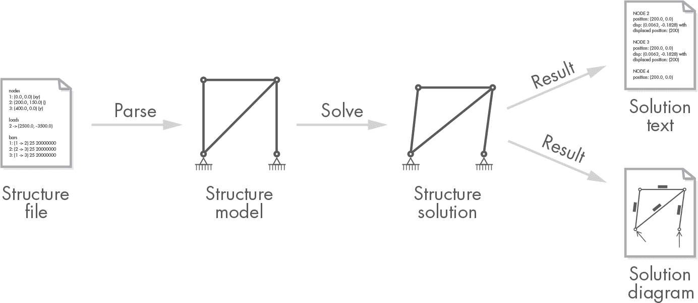
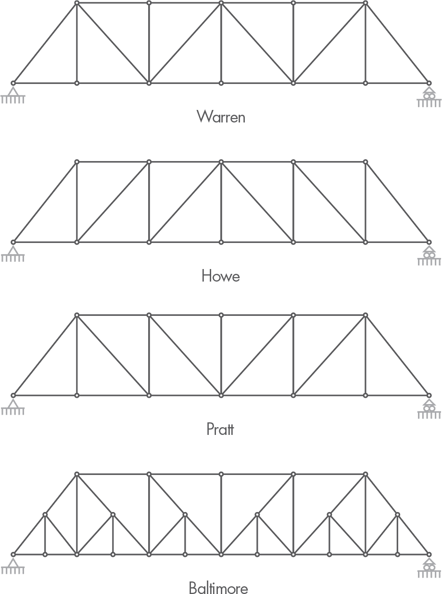
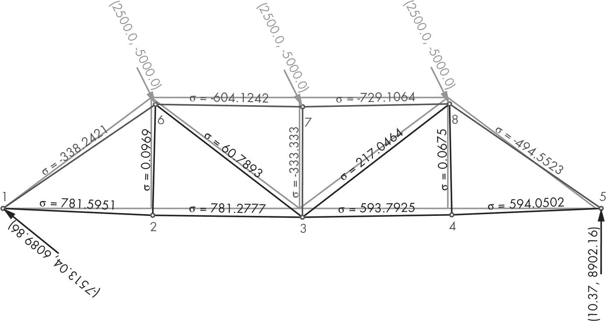
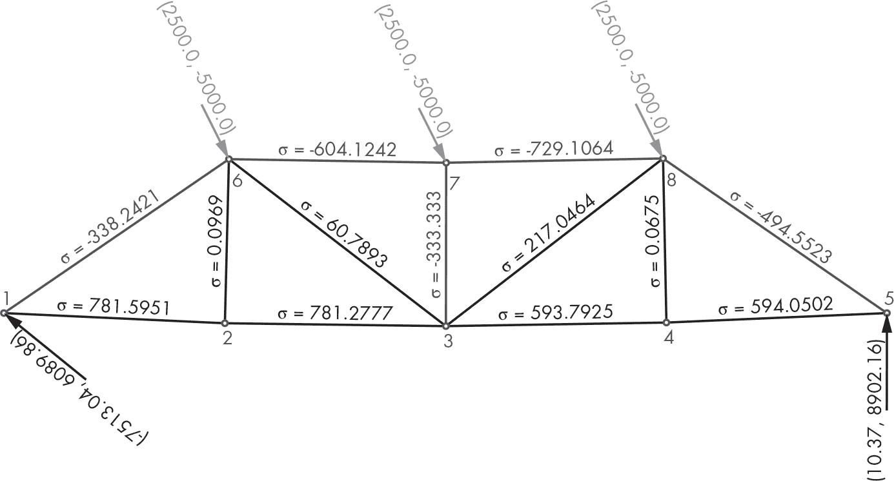
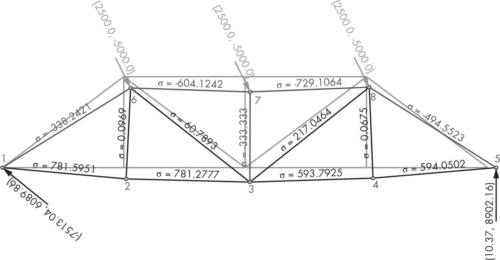
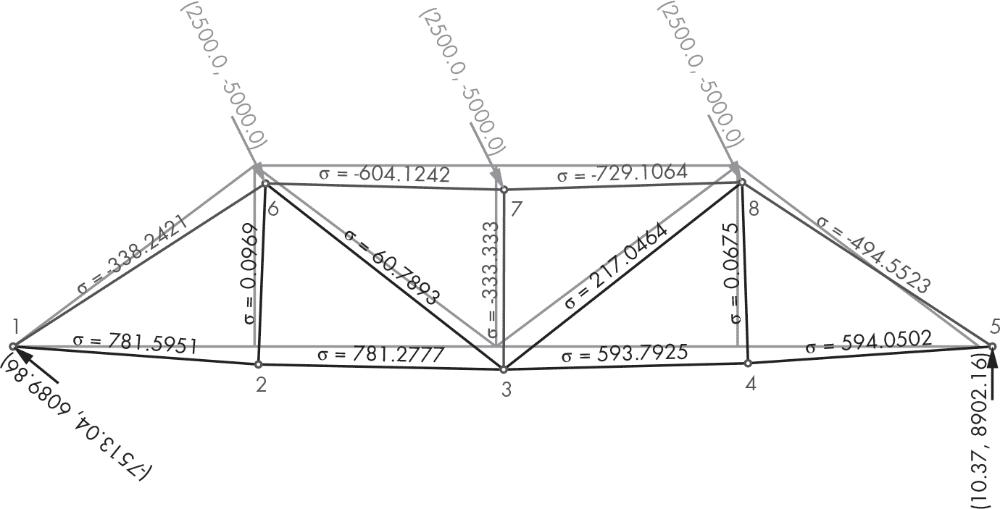

## 第二十章：组装我们的应用程序


我们已经实现了所有的构件，现在是时候将它们组合成一个可以从命令行运行的应用程序了。我们将在本章编写的应用程序将解析输入文件为结构模型，使用结构类中的 solve_structure 方法来组装已解算的结构，然后利用我们在前一章实现的函数创建一个 SVG 图表和一个描述解决方案的文本文件。

### **概述**

为了概览如何将不同的模块组装成最终的应用程序，让我们看看图 19-1。这张图说明了当我们的应用程序执行时的各个阶段。



*图 19-1：结构解析步骤*

首先，我们的应用程序会提供一个文本文件来定义结构。这个文件是按照我们在第十七章中定义的规则格式化的。在第一步，我们将读取文件的内容并将其解析为一个基于我们结构类构建的模型。

一旦结构模型构建完成，结构类的 solve_structure 方法会进行分析并创建结构解决方案模型。如果你记得的话，StructureSolution 类是表示解决方案的顶级实体。

最后一步是将结果以图表形式保存（保存为 SVG 文件），并以文本报告的形式保存（保存为纯文本文件）。因此，我们程序的输出将是两个文件。

不过，在我们做任何事情之前，我们首先需要为应用程序设置一个新的目录。

### **设置**

首先，让我们在 *apps* 目录中创建一个新的包。命名为 *truss_structures*。你的目录结构应如下所示：

apps

|- aff_transf_motion

|   |- ...

|- circle_from_points

|   |- ...

|- truss_structures

|    |- __init__.py

如果你将包文件夹创建为常规文件夹，别忘了包含一个空的 *__init__.py* 文件，以使其成为一个 Python 包。在该包中，现在让我们添加主文件。创建一个新的 Python 文件，命名为 *main.py*，并在其中简单地添加以下几行：

```py
if __name__ == '__main__':
    print('Main')
```

你的 *truss_structures* 包现在应该包含两个文件：

truss_structures

|- __init__.py

|- main.py

在本章中，我们将不使用 IDE 中的运行配置；我们将依赖一个包装程序的 bash 脚本。让我们现在准备好这个脚本，以便在整章中使用它。在项目目录的最上层，即 *Mechanics* 文件夹中，创建一个新的 bash 文件并命名为 *truss.sh*。输入清单 19-1 中的代码。

```py
#!/usr/bin/env bash
PYTHONPATH=$PWD python3 apps/truss_structures/main.py $@
```

*清单 19-1：Bash 包装脚本*

我们必须更改文件的权限，以使其可执行。可以从 Shell 运行以下命令：

```py
$ chmod +x truss.sh
```

如果你从 Shell 运行这个脚本，

```py
$ ./truss.sh
```

你应该看到 “Main” 被打印出来。我们已经准备好了一切，现在开始编码吧！

### **输入参数**

我们的命令行应用程序将接受几个参数：绘图的总体比例、节点位移的比例、负载的比例，以及是否绘制原始几何图形（有关详细信息，请参见 表 18-1 和 第 497 页）。

我们这样将这些参数传递给我们的程序：

```py
$ ./truss.sh --scale=1.25 --disp-scale=100 --load-scale=0.1 --no-draw-original
```

我们希望读取这些参数，解析它们的值，并在用户没有提供值时使用默认值。我们可以使用 Python 标准库中的一个实用工具：*argparse* 来实现。Argparse 还将为用户生成关于不同参数的帮助信息，并验证传入的值。

在 *apps/truss_structures* 包中创建一个新文件，命名为 *arguments.py*。你的 *truss_structures* 包现在应该是这样的：

truss_structures

|- __init__.py

|- arguments.py

|- main.py

输入 清单 19-2 中的代码。

```py
import argparse

def parse_arguments():
 ➊ parser = argparse.ArgumentParser(
        description='Solves a truss structure'
    )

 ➋ parser.add_argument(
        '--scale',
        help='scale applied to the geometry (for plotting)',
        default=2,
        type=float
    )

 ➌ parser.add_argument(
        '--disp-scale',
        help='scale applied to the displacements (for plotting)',
        default=500,
        type=float
    )

 ➍ parser.add_argument(
        '--load-scale',
        help='scale applied to the loads (for plotting)',
        default=0.02,
        type=float
    )

 ➎ parser.add_argument(
        '--no-draw-original',
        help='Should draw the original geometry?',
        action='store_true'
    )

 ➏ return parser.parse_args()
```

*清单 19-2：解析命令行参数*

在这个文件中，我们定义了一个名为 parse_arguments 的函数。这个函数配置了 ArgumentParser ➊ 类的一个实例，用于识别我们的参数并解析它们。我们将程序的描述传递给构造函数。如果用户传入 --help 标志，则此描述会作为帮助信息显示，像这样：

```py
$ ./truss.sh --help
```

这将为用户提供以下描述：

```py
usage: main.py [--help] [--scale SCALE] [--disp-scale DISP_SCALE]
               [--load-scale LOAD_SCALE] [--no-draw-original]

Solves a truss structure

optional arguments:
  -h, --help            show this help message and exit
  --scale SCALE         scale applied to the geometry (for plotting)
  --disp-scale DISP_SCALE
                        scale applied to the displacements (for plotting)
  --load-scale LOAD_SCALE
                        scale applied to the loads (for plotting)
  --no-draw-original    Should draw the original geometry?
```

我们添加的第一个参数是 --scale ➋；我们为它提供一个帮助信息和一个默认值 2，并将其类型设置为浮动点数。

然后是 --disp-scale 参数 ➌，其默认值为 500。不要忘记，位移通常相较于杆件的大小要小，因此我们需要一个较大的比例才能更好地观察它们。每个结构解的位移量级不同，因此这个比例最好通过反复试验来调整。

接下来是 --load-scale 参数 ➍，其默认值为 0.02。这个比例会缩小负载，使它们适应绘图。

最后是 --no-draw-original 标志 ➎，它控制是否绘制原始结构的几何图形。如果参数中没有这个标志，我们会绘制原始几何图形，但会使用较浅的颜色，以便将重点放在解答图形上。这看起来像是 图 19-2。


*图 19-2：绘制原始几何图形（使用较浅的颜色）*

--no-draw-original 标志与其他参数不同：它不需要关联的值；我们只关心标志是否出现在参数列表中。我们通过使用 add_argument 方法和 action 参数将此标志添加到解析器中。当这个参数出现在参数列表中时，将执行一个动作。在这种情况下，我们使用 'store_true' 动作，它会在标志存在时将 True 值保存在参数中，反之则为 False。*argsparse* 包中定义了几个动作，你可以在文档中查看。我们只需要 'store_true'。

最后一行返回了调用 `parse_args` 方法 ➏ 的结果。该方法从 `sys.argv` 中读取参数，`sys.argv` 是 Python 存储传递给程序的参数的地方，并按照我们之前定义的规则解析值。

结果是一个类似字典的结构，包含参数的值。如我们稍后将看到的，字典的键名与命令行参数相同，但去掉了前导的破折号（--），并且使用了下划线代替中间的破折号。例如，`--load-scale` 变成了 `load_scale`，这更符合 Python 的命名风格。此外，Python 中不允许使用破折号作为变量名。

现在，让我们编写生成应用程序输出文件的代码。

### **生成输出**

我们在上一章准备了两个函数，分别生成 SVG 和文本的解表示。我们将在应用中使用这些函数，并将它们的结果写入外部文件。

首先，创建一个名为 *output.py* 的新文件。现在你的 *truss_structures* 包应该如下所示：

truss_structures

|- __init__.py

|- arguments.py

|- main.py

|- output.py

在 *output.py* 中，输入 示例 19-3 中的代码。

```py
import os

from structures.out.svg import structure_solution_to_svg
from structures.out.text import structure_solution_to_string
from structures.solution.structure import StructureSolution

def save_solution_to_svg(solution: StructureSolution, arguments):
 ➊ solution_svg = structure_solution_to_svg(solution, arguments)
    __write_to_file('result.svg', solution_svg)

def save_solution_to_text(solution: StructureSolution):
 ➋ solution_text = structure_solution_to_string(solution)
    __write_to_file('result.txt', solution_text)

def __write_to_file(filename, content):
 ➌ file_path = os.path.join(os.getcwd(), filename)
 ➍ with open(file_path, 'w') as file:
        file.write(content)
```

*示例 19-3：处理结构输出*

我们定义了三个函数：一个用于将解保存为 SVG 图像文件（`save_solution_to_svg`），另一个将解保存为文本文件（`save_solution_to_text`），还有一个用于创建新文件并将其保存在当前工作目录中的函数（`__write_to_file`）。

`save_solution_to_svg` 函数调用了上一章的 `structure_solution_to_svg` 函数 ➊，并将生成的 SVG 字符串传递给 `__write_to_file` 函数。请注意，我们将命令行参数的字典传递给此函数；这些参数是我们用来生成 SVG 矢量图像的设置。为了使其正常工作，我们必须确保命令行参数使用与 `structure_solution_to_svg` 预期的设置相同的名称进行解析。SVG 图表创建后，我们使用 `__write_to_file` 在程序的工作目录中创建一个名为 *result.svg* 的文件。

`save_solution_to_text` 函数类似于 `save_solution_to_svg`：它使用 `structure_solution_to_string` 函数 ➋ 生成文本结果，然后将结果写入 *result.txt* 文件。

在 `__write_to_file` 中，我们首先通过将当前工作目录与文件名（文件名应已包括扩展名）连接来确定文件路径。然后，我们将文件路径存储在 `file_path` 变量 ➌ 中。最后，我们使用 `with` 块以写入模式（'w'）打开文件，这将创建文件（如果文件不存在），然后将传入的内容字符串写入文件 ➍。

我们差不多完成了！接下来我们只需要将输入、解析和输出连接起来。

### **主脚本**

让我们回到*main.py*文件。打开它并输入列表 19-4 中的代码（你可以删除我们之前写的 print(’Main’)这一行）。

```py
import sys
import time

import apps.truss_structures.output as out
from apps.truss_structures.arguments import parse_arguments
from structures.parse.str_parse import parse_structure_from_lines

if __name__ == '__main__':
 ➊ arguments = parse_arguments()
 ➋ lines = sys.stdin.readlines()

    start_time = time.time()

 ➌ structure = parse_structure_from_lines(lines)
 ➍ solution = structure.solve_structure()
    out.save_solution_to_svg(solution, arguments)
    out.save_solution_to_text(solution)

    end_time = time.time()
    elapsed_secs = end_time - start_time
 ➎ print(f'Took {round(elapsed_secs, 3)} seconds to solve')
```

*列表 19-4：主脚本*

在“if name is main”块中，我们解析从命令行传递给脚本的参数。为此，我们使用从*arguments.py*模块导入的 parse_arguments 函数 ➊。如果解析失败，因为缺少了必需的标志或类似的原因，执行会停止，并向用户发送一条有用的提示信息。

一旦解析了参数，我们就读取通过标准输入传递给程序的所有行，并将它们保存在 lines 变量中 ➋。

接下来，我们解析传入的行，使用我们在第十七章中开发的 parse_structure_from_lines 函数创建结构模型 ➌。一旦我们得到结构模型，就调用它的 solve_structure 方法来计算解决方案 ➍。

然后，我们调用前一节中编写的两个函数来生成输出文件：save_solution_to_svg 和 save_solution_to_text。

最后，我们计算程序运行所花费的时间，作为参考，并比较解决不同大小结构所需的时间。在开始解析和计算结构之前，我们将时间存储在 start_time 变量中。在生成输出文件后，我们将时间存储在 end_time 中。从 end_time 中减去 start_time，得到经过的秒数，也就是我们的应用程序花费的时间。我们在应用程序执行完成前，打印出这个结果时间（秒） ➎。

我相信你和我一样迫不及待地想试试我们的新应用。让我们手动编写一个结构文件并求解它。

### **尝试应用**

我们来创建一个结构文件，试试这个应用。图 19-3 展示了桥梁中常见的四种桁架配置。我们将从这些标准设计中选择沃伦型桁架作为第一次测试。我们将手动编写一个文件，定义一个按照桁架中杆件配置的结构。



*图 19-3：桁架类型*

在*apps/truss_structures*目录中创建一个名为*warren.txt*的新文件。输入以下结构定义：

```py
# Warren truss with 4 spans

nodes
# lower nodes
1: (0.0, 0.0) (xy)
2: (400.0, 0.0) ()
3: (800.0, 0.0) ()
4: (1200.0, 0.0) ()
5: (1600.0, 0.0) (y)
# upper nodes
6: (400.0, 300.0) ()
7: (800.0, 300.0) ()
8: (1200.0, 300.0) ()

loads
6 -> (2500.0, -5000.0)
7 -> (2500.0, -5000.0)
8 -> (2500.0, -5000.0)

bars
# horizontal bars
1: (1 -> 2) 20.0 20000000.0
2: (2 -> 3) 20.0 20000000.0
3: (3 -> 4) 20.0 20000000.0
4: (4 -> 5) 20.0 20000000.0
5: (6 -> 7) 20.0 20000000.0
6: (7 -> 8) 20.0 20000000.0
# vertical bars
7: (2 -> 6) 15.0 20000000.0
8: (3 -> 7) 15.0 20000000.0
9: (4 -> 8) 15.0 20000000.0
# diagonal bars
10: (1 -> 6) 30.0 20000000.0
11: (6 -> 3) 30.0 20000000.0
12: (3 -> 8) 30.0 20000000.0
13: (8 -> 5) 30.0 20000000.0
```

或者，为了避免自己写这些代码，你可以复制并粘贴书中提供的代码文件内容。图 19-4 可能帮助你直观地理解沃伦结构示例文件中节点和杆件的排列方式。


*图 19-4：沃伦桁架结构来测试我们的应用*

现在是时候求解这个结构，并查看我们的应用程序产生的美丽结果了。从终端运行以下命令：

```py
$ ./truss.sh --scale=1.25 --disp-scale=250 < apps/truss_structures/warren.txt
```

这应该会输出到终端：

```py
Took 0.058 seconds to solve
```

在前一个命令中，我们执行了一个封装了我们代码的 bash 脚本，并传递了两个参数：一个 1.25 的全局绘图比例和 250 的位移比例。其他参数将使用默认值，回忆一下，它们分别是 0.02 的载荷比例和--no-draw-original 标志的值为 False。

两个新文件应该已经出现在你的项目中，与*truss.sh* bash 文件在同一层级：*result.svg*和*result.txt*。如果你打开第二个文件——解决方案的文本表示，你会看到类似于列表 19-5 的内容。

```py
NODE 1
    original position: (0.0, 0.0)
    displacement: (0.0, 0.0) with norm 0.0
    displaced position: (0.0, 0.0)
    reaction: (-7513.0363, 6089.8571) with norm 9671.1981

--snip--

NODE 8
    original position: (1200.0, 300.0)
    displacement: (0.0185, -0.0693) with norm 0.0717
    displaced position: (1200.0185, 299.9307)

------------------------------------------

BAR 1 (1 → 2) : ⊕ TENSION
    Δl (elongation) = 0.0156
    ϵ  (strain)     = 3.908e-05
    σ  (stress)     = 781.5951

--snip--

BAR 13 (8 → 5) : ⊖ COMPRESSION
    Δl (elongation) = -0.0124
    ϵ  (strain)     = -2.473e-05
    σ  (stress)     = -494.5523
```

*列表 19-5：沃伦桁架纯文本解决方案*

纯文本解决方案报告有助于检查所有的解决方案值。例如，你可以检查节点 1 和节点 5 的反应（外部约束节点）。ID 为 1 的节点（节点 1）在水平和垂直方向上均受约束，其大约反作用力为 = ⟨–7513, 6090⟩。该节点的位移必然为零。ID 为 5 的节点（节点 5）仅在垂直方向上受约束，其位移向量为 = ⟨0.055, 0.0⟩。

现在看看每个桁架部分。你可以轻松识别出被压缩和被拉长的桁架，检查它们的伸长、应变和应力值。如果我们想分析在给定载荷下的结构，这份报告提供了所有所需的数据。

最精彩的部分在*result.svg*文件中。用你最喜欢的浏览器打开生成的图片。你的结果应该像图 19-5 那样。



*图 19-5：沃伦解法示意图*

正如你在屏幕上看到的，如果桁架受压，它们会显示为红色；如果受拉，它们会显示为绿色。与桁架对齐的标签显示了它们的应力。原始几何图形以浅蓝色绘制在背景中，这使我们能够更好地可视化载荷如何使结构变形。

**注意**

*你可以在 PyCharm 中查看 SVG 图像，但如果我们尝试在 IDE 中打开并可视化我们的图表，你会惊讶地发现它们是倒过来的。别慌张：你没有弄错。只是（从 2021.1 版本开始）PyCharm 不支持我们添加到 SVG 中的*transform*属性，正如你从前面记得的那样，我们需要它来翻转 y 轴。我建议你改用浏览器。*

你能看到桁架线条粗细的区别吗？使用线条粗细来表示桁架的截面有助于我们识别出能够承受更大载荷的桁架。我们为桁架添加的应力标签使我们可以迅速检查每根桁架上的应力，从而提前获取最重要的信息之一。从我们的图表中，我们只需一眼就能收集到很多信息；这正是这种图形表示法的价值所在。

为了理解程序的参数作用，我们可以玩玩这些参数，看看能得到什么样的结果。

#### ***玩弄参数***

让我们先检查一下，如果我们传递--no-draw-original 标志会发生什么。

```py
$ ./truss.sh --scale=1.25 --disp-scale=250 --no-draw-original
  < apps/truss_structures/warren.txt
```

如果你在你喜欢的浏览器中打开*result.svg*图像，你应该能看到类似 Figure 19-6 的图像。



*Figure 19-6：沃伦解法图，没有原始几何形状*

没有原始几何形状的情况下，我们可以看到变形后的结构更加简洁；同时，我们无法看到节点和杆件相对于原始位置的运动。

那么，使用更大的位移比例怎么样呢？让我们试试下面的操作：

```py
$ ./truss.sh --scale=1.25 --disp-scale=500
  < apps/truss_structures/warren.txt
```

使用 500 的位移缩放值会夸大变形，以便我们能够清楚地看到它们。现在，图表应该像 Figure 19-7 一样。



*Figure 19-7：沃伦解法图，位移比例较大*

我们还没有使用荷载图；我们一直在使用默认值 0.02。让我们尝试编辑这个值，看看它的效果：

```py
$ /truss.sh --scale=1.25 --disp-scale=400 --load-scale=0.01
  < apps/truss_structures/warren.txt
```

如果我们使用荷载比例为 0.01，也就是我们目前使用的荷载比例的一半，你可以看到荷载向量的长度缩小了，正如 Figure 19-8 所示。



*Figure 19-8：沃伦解法图，荷载比例较小*

如你所见，荷载比例对于正确的荷载向量可视化非常重要。较小的值会将向量缩小到几乎没有空间来妥善放置它们的标签。你可以尝试使用较大的荷载比例，比如 0.5。标签应该会从图表中消失。在这种情况下，我们绘制的向量非常长，以至于它们的中心点位于绘图范围外，因此，我们放置在起始点附近的荷载标题根本看不见。

#### ***解决大型结构***

在代码与书籍一起分发的*apps/truss_structures*目录中，有一个文件，*baltimore.txt*，它定义了一个有 10 个跨度的巴尔的摩桁架结构。将此文件复制到你的项目中，放在同一文件夹里。或者，你也可以手动创建并编写该文件（Listing 19-6）：

```py
# Baltimore truss with 10 spans

nodes
# lower nodes
1: (0.0, 0.0) (xy)
2: (200.0, 0.0) ()
3: (400.0, 0.0) ()
4: (600.0, 0.0) ()
5: (800.0, 0.0) ()
6: (1000.0, 0.0) ()
7: (1200.0, 0.0) ()
8: (1400.0, 0.0) ()
9: (1600.0, 0.0) ()
10: (1800.0, 0.0) ()
11: (2000.0, 0.0) ()
12: (2200.0, 0.0) ()
13: (2400.0, 0.0) ()
14: (2600.0, 0.0) ()
15: (2800.0, 0.0) ()
16: (3000.0, 0.0) ()
17: (3200.0, 0.0) ()
18: (3400.0, 0.0) ()
19: (3600.0, 0.0) ()
20: (3800.0, 0.0) ()
21: (4000.0, 0.0) (y)
# middle nodes
22: (200.0, 150.0) ()
23: (600.0, 150.0) ()
24: (1000.0, 150.0) ()
25: (1400.0, 150.0) ()
26: (1800.0, 150.0) ()
27: (2200.0, 150.0) ()
28: (2600.0, 150.0) ()
29: (3000.0, 150.0) ()
30: (3400.0, 150.0) ()
31: (3800.0, 150.0) ()
# upper nodes
32: (400.0, 300.0) ()
33: (800.0, 300.0) ()
34: (1200.0, 300.0) ()
35: (1600.0, 300.0) ()
36: (2000.0, 300.0) ()
37: (2400.0, 300.0) ()
38: (2800.0, 300.0) ()
39: (3200.0, 300.0) ()
40: (3600.0, 300.0) ()

loads
1 -> (0.0, -500.0)
2 -> (0.0, -500.0)
--snip--
40 -> (0.0, -500.0)

bars
# zig-zag bars
1: (1 -> 22) 20.0 20000000.0
2: (22 -> 3) 20.0 20000000.0
3: (3 -> 23) 20.0 20000000.0
4: (23 -> 5) 20.0 20000000.0
5: (5 -> 24) 20.0 20000000.0
6: (24 -> 7) 20.0 20000000.0
7: (7 -> 25) 20.0 20000000.0
8: (25 -> 9) 20.0 20000000.0
9: (9 -> 26) 20.0 20000000.0
10: (26 -> 11) 20.0 20000000.0
11: (11 -> 27) 20.0 20000000.0
12: (27 -> 13) 20.0 20000000.0
13: (13 -> 28) 20.0 20000000.0
14: (28 -> 15) 20.0 20000000.0
15: (15 -> 29) 20.0 20000000.0
16: (29 -> 17) 20.0 20000000.0
17: (17 -> 30) 20.0 20000000.0
18: (30 -> 19) 20.0 20000000.0
19: (19 -> 31) 20.0 20000000.0
20: (31 -> 21) 20.0 20000000.0
# left diagonal bars
21: (32 -> 22) 20.0 20000000.0
22: (32 -> 23) 20.0 20000000.0
23: (33 -> 24) 20.0 20000000.0
24: (34 -> 25) 20.0 20000000.0
25: (35 -> 26) 20.0 20000000.0
# right diagonal bars
26: (37 -> 27) 20.0 20000000.0
27: (38 -> 28) 20.0 20000000.0
28: (39 -> 29) 20.0 20000000.0
29: (40 -> 30) 20.0 20000000.0
30: (40 -> 31) 20.0 20000000.0
# vertical bars
31: (2 -> 22) 20.0 20000000.0
32: (3 -> 32) 20.0 20000000.0
33: (4 -> 23) 20.0 20000000.0
34: (5 -> 33) 20.0 20000000.0
35: (6 -> 24) 20.0 20000000.0
36: (7 -> 34) 20.0 20000000.0
37: (8 -> 25) 20.0 20000000.0
38: (9 -> 35) 20.0 20000000.0
39: (10 -> 26) 20.0 20000000.0
40: (11 -> 36) 20.0 20000000.0
41: (12 -> 27) 20.0 20000000.0
42: (13 -> 37) 20.0 20000000.0
43: (14 -> 28) 20.0 20000000.0
44: (15 -> 38) 20.0 20000000.0
45: (16 -> 29) 20.0 20000000.0
46: (17 -> 39) 20.0 20000000.0
47: (18 -> 30) 20.0 20000000.0
48: (19 -> 40) 20.0 20000000.0
49: (20 -> 31) 20.0 20000000.0
# lower horizontal bars
50: (1 -> 2) 20.0 20000000.0
51: (2 -> 3) 20.0 20000000.0
52: (3 -> 4) 20.0 20000000.0
53: (4 -> 5) 20.0 20000000.0
54: (5 -> 6) 20.0 20000000.0
55: (6 -> 7) 20.0 20000000.0
56: (7 -> 8) 20.0 20000000.0
57: (8 -> 9) 20.0 20000000.0
58: (9 -> 10) 20.0 20000000.0
59: (10 -> 11) 20.0 20000000.0
60: (11 -> 12) 20.0 20000000.0
61: (12 -> 13) 20.0 20000000.0
62: (13 -> 14) 20.0 20000000.0
63: (14 -> 15) 20.0 20000000.0
64: (15 -> 16) 20.0 20000000.0
65: (16 -> 17) 20.0 20000000.0
66: (17 -> 18) 20.0 20000000.0
67: (18 -> 19) 20.0 20000000.0
68: (19 -> 20) 20.0 20000000.0
69: (20 -> 21) 20.0 20000000.0
# upper horizontal bars
70: (32 -> 33) 20.0 20000000.0
71: (33 -> 34) 20.0 20000000.0
72: (34 -> 35) 20.0 20000000.0
73: (35 -> 36) 20.0 20000000.0
74: (36 -> 37) 20.0 20000000.0
75: (37 -> 38) 20.0 20000000.0
76: (38 -> 39) 20.0 20000000.0
77: (39 -> 40) 20.0 20000000.0
```

*Listing 19-6：巴尔的摩桁架结构定义*

请注意，在这段代码中，我们对每个节点施加相同的荷载，但我们省略了一些荷载行。如果你手动编写代码，应该包括这些荷载定义行。

让我们将定义这个大型结构的文件传递给我们的程序：

```py
$ ./truss.sh --scale=0.75 --disp-scale=100 --load-scale=0.2
  < apps/truss_structures/baltimore.txt
```

程序生成的输出应该类似于以下内容：

```py
Took 0.106 seconds to solve
```

即使是具有 40 个节点和 77 条杆件的巴尔的摩类型，计算时间也是一秒钟的一小部分。如果你打开*solution.svg*文件，你会看到类似于 Figure 19-9 的内容。


*Figure 19-9：巴尔的摩解法图*

现在你已经完成了这一部分，花些时间玩玩你的应用程序。尝试使用不同的结构和参数来检查结果。

### **总结**

在本章中，我们将之前章节中构建的所有结构分析模块整合成一个命令行应用程序，用于求解桁架结构。我们的应用程序从标准输入读取结构文件，并生成两个结果文件：一个是表示解的矢量图，另一个是包含所有相关数值的纯文本报告。

这是本书第五部分的最后一章。这几章内容很密集，但我希望结果是值得的。我们为文件制定了一个定义结构的格式，编写了一个函数将其解析到我们的模型中，实施了解决方案算法以生成解决方案模型，编写了一种将此解决方案导出为图表和文本报告的方式，最后将这一切整合成一个最终应用程序。

我们选择了一个求解桁架结构的应用来举例说明编写工程应用程序的过程，但我们本可以选择任何其他主题——如热传导、流体动力学、梁分析等。过程和技巧是相同的。你所学到的知识应该能让你编写适用于任何工程领域的代码。

这也是本书的最后一章。我希望你喜欢学习如何构建工程应用、将它们拆分成模块，并且当然也学会如何测试它们。剩下的就是开始创建你自己的应用了。正如本书介绍中所提到的，成为专家的唯一途径就是通过实践：构建很多应用，从错误中学习，然后再继续构建。祝你好运！
