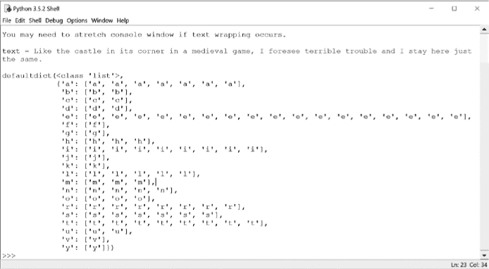
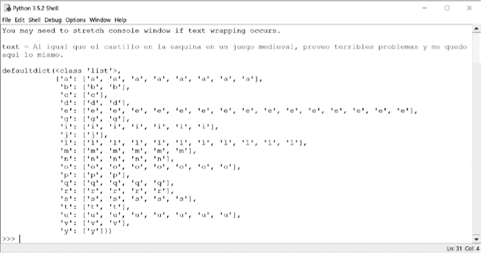

## **傻名字生成器**


美国电视网曾播出一部侦探喜剧叫做*Psych*，其中超观察力的业余侦探肖恩·斯宾塞在假装使用超能力的同时解决案件。该剧的一个特色是肖恩总是用临时编造的搞笑名字来介绍他的配角加斯，比如 Galileo Humpkins、Lavender Gooms 和 Bad News Marvin Barnes。正如肖恩可能会说的，这些名字有些荒唐得让人忍不住想中风，而且不是那种好的类型！

### **项目 #1：生成化名**

在这个热身项目中，你将编写一个简单的 Python 程序，通过随机组合名字和姓氏来生成疯狂的名字。如果运气好的话，你将产生大量的别名，让任何配角都感到骄傲。你还将回顾最佳编码实践指南，并应用外部程序来帮助你编写符合这些指南的代码。

*心理学*不是你的兴趣吗？将我代码列表中的名字替换成你自己的笑话或主题。你可以轻松地将这个项目变成*权力的游戏*名字生成器，或者你可能想发现属于你自己的“本尼迪克特·康伯巴奇”名字；我最喜欢的是 Bendylick Cricketbat。

**目标**

使用符合既定风格指南的 Python 代码随机生成有趣的配角名字。

### **规划和设计项目**

规划时间从来都不是浪费的时间。不管你是为了乐趣还是为了盈利编程；在某个时刻，你需要相对准确地估算项目将需要多长时间，可能遇到哪些障碍，以及你需要什么工具和资源来完成工作。而为了做到这一点，你首先需要知道你究竟想创造什么！

一位成功的经理曾告诉我，他的秘诀就是不断提问：*你*想做什么？*为什么*要做这个？为什么要*以这种方式*做？你有多少*时间*？有多少*金钱*？回答这些问题对设计过程非常有帮助，并能让你清晰地看到目标。

在他所著的《*Think Python, 第二版*》（O'Reilly，2015）一书中，艾伦·道尼描述了两种软件开发计划：“原型和修补”以及“设计开发”。使用原型和修补，你从一个简单的程序开始，然后使用*修补*，或编辑的代码，来处理测试过程中遇到的问题。这种方法在你处理一个自己不太理解的复杂问题时是很好的。然而，它也可能产生复杂且不可靠的代码。如果你对问题和解决方法有清晰的认识，你应该使用设计开发计划来避免未来出现的问题及其随之而来的修补。这种方法可以使编码更容易高效，并通常会导致更强大、更可靠的代码。

对于本书中的所有项目，你将从一个明确定义的问题或目标开始，这将成为你设计决策的基础。接下来，我们将讨论策略，以更好地理解问题并创建一个设计开发计划。

#### ***策略***

你将从两个列表开始——名字的“名”和“姓”。这些列表相对较短，因此它们不会占用大量内存，也不需要动态更新，也不应该在运行时出现问题。由于你只需要从列表中读取名字，你将使用元组作为容器。

使用你两个名字的元组，你可以通过点击一个按钮生成新名字——将一个名和一个姓配对。这样，用户可以轻松地重复该过程，直到出现足够搞笑的名字。

你还应该在解释器窗口中以某种方式突出显示名字，使其从命令提示符中脱颖而出。IDLE shell 提供的字体选项不多，但你可能知道——太清楚了——错误会以红色显示。`print()` 函数的默认输出是标准输出，但加载 `sys` 模块后，你可以使用 `file` 参数将输出重定向到错误通道，且带有标志性的红色显示：`print(`something`, file=sys.stderr)`。

最后，你将确定 Python 编程中有哪些风格推荐。这些指南不仅应该涵盖代码本身，还应涵盖嵌入代码中的文档。

#### ***伪代码***

“你总是可以指望美国人在尝试一切其他方法后做出正确的决定。” 这句名言，虽然与温斯顿·丘吉尔的联系微弱，却总结了许多人写伪代码时的方式。

*伪代码* 是一种高级的、非正式的描述计算机程序的方式，使用结构化的英语或任何人类语言。它应该像一种简化的编程语言，包含关键词和正确的缩进。开发人员使用它忽略真正编程语言的所有复杂语法，专注于底层逻辑。尽管伪代码被广泛使用，但它没有官方标准——只有一些指南。

如果你发现自己已经陷入沮丧的境地，可能是因为你没有花时间写伪代码。我是真正的伪代码信徒，因为伪代码——毫无例外——曾在我迷失方向时将我引导到了解决方案。因此，在本书的大多数项目中，你将使用某种形式的伪代码。至少，我希望你能看到它的实用性，但我也希望你能养成在自己项目中写伪代码的习惯。

我们的搞笑名字生成器的一个非常高层次的伪代码可能看起来像这样：

```py
Load a list of first names
Load a list of surnames
Choose a first name at random
Assign the name to a variable
Choose a surname at random
Assign the name to a variable
Print the names to the screen in order and in red font
Ask the user to quit or play again
If user plays again:
    repeat
If user quits:
    end and exit
```

除非你正在努力通过编程课程或向他人提供清晰的指示，否则要关注伪代码的*目的*；不要过于担心死板地遵循（非标准的）书写规则。而且，不要仅仅局限于编程——你可以将伪代码的过程应用到更多的事情上。一旦你掌握了它，你可能会发现它有助于你完成其他任务，比如做税务、规划投资、建造房屋或准备露营旅行。这是一种很好的方式，可以帮助你集中思维，并将编程的成功经验带入现实生活。如果国会也能使用它就好了！

### **代码**

清单 1-1 是生成有趣名字的代码，*pseudonyms.py*，它从两个名字元组中编译并打印一个假名列表。如果你不想输入所有名字，可以输入其中一部分，或者从*[`nostarch.com/impracticalpython/`](https://nostarch.com/impracticalpython/)*下载代码。

*pseudonyms.py*

```py
➊ import sys, random

➋ print("Welcome to the Psych 'Sidekick Name Picker.'\n")
   print("A name just like Sean would pick for Gus:\n\n")

   first = ('Baby Oil', 'Bad News', 'Big Burps', "Bill 'Beenie-Weenie'",
            "Bob 'Stinkbug'", 'Bowel Noises', 'Boxelder', "Bud 'Lite' ",
            'Butterbean', 'Buttermilk', 'Buttocks', 'Chad', 'Chesterfield',
            'Chewy', 'Chigger", "Cinnabuns', 'Cleet', 'Cornbread', 'Crab Meat',
            'Crapps', 'Dark Skies', 'Dennis Clawhammer', 'Dicman', 'Elphonso',
            'Fancypants', 'Figgs', 'Foncy', 'Gootsy', 'Greasy Jim', 'Huckleberry',
            'Huggy', 'Ignatious', 'Jimbo', "Joe 'Pottin Soil'", 'Johnny',
            'Lemongrass', 'Lil Debil', 'Longbranch', '"Lunch Money"',
            'Mergatroid', '"Mr Peabody"', 'Oil-Can', 'Oinks', 'Old Scratch',
            'Ovaltine', 'Pennywhistle', 'Pitchfork Ben', 'Potato Bug',
            'Pushmeet','Rock Candy', 'Schlomo', 'Scratchensniff', 'Scut',
            "Sid 'The Squirts'", 'Skidmark', 'Slaps', 'Snakes', 'Snoobs',
            'Snorki', 'Soupcan Sam', 'Spitzitout', 'Squids', 'Stinky',
            'Storyboard', 'Sweet Tea', 'TeeTee', 'Wheezy Joe',
            "Winston 'Jazz Hands'", 'Worms')

   last = ('Appleyard', 'Bigmeat', 'Bloominshine', 'Boogerbottom',
           'Breedslovetrout', 'Butterbaugh', 'Clovenhoof', 'Clutterbuck',
           'Cocktoasten', 'Endicott', 'Fewhairs', 'Gooberdapple', 'Goodensmith',
           'Goodpasture', 'Guster', 'Henderson', 'Hooperbag', 'Hoosenater',
           'Hootkins', 'Jefferson', 'Jenkins', 'Jingley-Schmidt', 'Johnson',
           'Kingfish', 'Listenbee', "M'Bembo", 'McFadden', 'Moonshine', 'Nettles',
           'Noseworthy', 'Olivetti', 'Outerbridge', 'Overpeck', 'Overturf',
           'Oxhandler', 'Pealike', 'Pennywhistle', 'Peterson', 'Pieplow',
           'Pinkerton', 'Porkins', 'Putney', 'Quakenbush', 'Rainwater',
           'Rosenthal', 'Rubbins', 'Sackrider', 'Snuggleshine', 'Splern',
           'Stevens', 'Stroganoff', 'Sugar-Gold', 'Swackhamer', 'Tippins',
           'Turnipseed', 'Vinaigrette', 'Walkingstick', 'Wallbanger', 'Weewax',
           'Weiners', 'Whipkey', 'Wigglesworth', 'Wimplesnatch', 'Winterkorn',
           'Woolysocks')

➌ while True:
    ➍ firstName = random.choice(first)

    ➎ lastName = random.choice(last)

       print("\n\n")
    ➏ print("{} {}".format(firstName, lastName), file=sys.stderr)
       print("\n\n")

    ➐ try_again = input("\n\nTry again? (Press Enter else n to quit)\n ")
       if try_again.lower() == "n":
           break

➑ input("\nPress Enter to exit.")
```

*清单 1-1：从名字元组中生成傻乎乎的假名*

首先，导入`sys`和`random`模块 ➊。你将使用`sys`来访问系统特定的错误消息功能，这样你就可以在 IDLE 窗口中将输出颜色设置为醒目的红色。而`random`模块则可以让你随机选择名字列表中的项。

➋处的`print`语句向用户介绍程序。换行命令`\n`强制换行，单引号`''`允许你在打印输出中使用引号，而无需使用反斜杠转义字符，这样可以提高代码可读性。

接下来，定义你的名字元组。然后初始化`while`循环 ➌。将`while = True`设置为“保持运行，直到我告诉你停止”。最终，你会使用`break`语句来结束循环。

循环开始时，从`first`元组中随机选择一个名字，并将其赋值给变量`firstName` ➍。它使用`random`模块的`choice`方法从一个非空序列中返回一个随机元素——在这种情况下，就是第一个名字的元组。

接下来，从`last`元组中随机选择一个姓，并将其赋值给变量`lastName` ➎。现在你有了两个名字，打印它们，并通过在`print`语句 ➏中提供可选参数`file=sys.stderr`来欺骗 IDLE 使用红色的“错误”字体。使用更新的字符串格式*方法*，而不是较旧的字符串格式*操作符*（`%`），将名字变量转换为字符串。要了解更多关于新方法的信息，请参阅*[`docs.python.org/3.7/library/string.html`](https://docs.python.org/3.7/library/string.html)*。

一旦显示出名字，要求用户选择是重新玩一轮还是退出，通过`input`提供带引号的提示。在这种情况下，还需要加入几行空白，以便在 IDLE 窗口中让有趣的名字更加明显。如果用户通过按下 ENTER 键进行响应，`try_again`变量➐不会返回任何内容。由于没有返回内容，`if`语句中的条件不成立，`while`循环继续执行，并且打印出一个新名字。如果用户按下 N 键，`if`语句会导致`break`命令，循环结束，因为`while`语句不再被评估为`True`。使用小写字符串方法`.lower()`来避免玩家启用 CAPS LOCK 键。换句话说，无论用户输入小写 N 还是大写 N，程序都会将其读取为小写。

最后，要求用户通过按下 ENTER 键退出➑。按下 ENTER 不会将`input()`的返回值赋给一个变量，程序结束，控制台窗口关闭。在 IDLE 编辑器窗口按 F5 执行完成的程序。

这段代码是可行的，但仅仅能运行是不够的——Python 程序应该以*优雅*的方式运行。

#### ***使用 Python 社区的风格指南***

根据*Python 禅意*（*[`www.python.org/dev/peps/pep-0020/`](https://www.python.org/dev/peps/pep-0020/)*），“应该有一种——最好只有一种——明显的做事方式。”为了提供一种明显的“正确做法”并在这些实践中建立共识，Python 社区发布了*Python 增强提案*，这些提案是用于 Python 标准库的编码约定。最重要的提案是*PEP 8*，这是 Python 编程的风格指南。PEP 8 随着时间的推移不断发展，因为新的约定被发现，而过去的约定随着语言的变化而变得过时。

PEP 8（*[`www.python.org/dev/peps/pep-0008/`](https://www.python.org/dev/peps/pep-0008/)）规定了命名约定、空白行、制表符和空格的使用、最大行长度、注释等标准。其目标是提高代码的可读性，并使其在广泛的 Python 程序中保持一致。当你开始编程时，应努力学习并遵循公认的约定，避免坏习惯的养成。本书中的代码将严格遵循 PEP 8，但我在某些约定上做了一些调整（例如，使用较少的注释代码、较少的空白行和较短的文档字符串），以适应出版行业的需求。

当你在跨职能团队中工作时，标准化的名称和程序尤为重要。科学家和工程师之间的交流常常会出现误解，就像 1999 年工程师因为不同团队使用不同的测量单位而导致火星气候轨道器失败一样。在近二十年的时间里，我构建了地球的计算机模型，并将其转移给工程部门。工程师们使用脚本将这些模型加载到他们自己的专有软件中。他们会在项目之间共享这些脚本，以提高效率并帮助没有经验的人。由于这些“命令文件”是根据每个项目定制的，当模型更新时属性名称发生变化时，工程师们常常感到恼火。事实上，他们的一项内部准则是：“乞求、贿赂或威胁模型设计师使用一致的属性名称！”

#### ***使用 Pylint 检查你的代码***

你应该熟悉 PEP 8，但你仍然会犯错误，而且与指南进行代码对比会很麻烦。幸运的是，像 Pylint、pycodestyle 和 Flake8 这样的程序可以帮助你轻松遵循 PEP 8 的风格建议。在这个项目中，你将使用 Pylint。

##### **安装 Pylint**

Pylint 是 Python 编程语言的源代码、错误和质量检查工具。要下载免费的副本，请访问 *[`www.pylint.org/#install`](https://www.pylint.org/#install)* 并找到适合你平台的安装按钮。此按钮将显示安装 Pylint 的命令。例如，在 Windows 中，进入包含你 Python 副本的文件夹（如 *C:\Python35*），使用 SHIFT-右键点击打开上下文菜单，然后根据你的 Windows 版本选择 **在此处打开命令窗口** 或 **在此处打开 PowerShell 窗口**。运行 `pip install pylint`（如果同时安装了 Python 2 和 3，则使用 `pip3`）。

##### **运行 Pylint**

在 Windows 中，Pylint 从命令窗口运行，或者在更新的系统中使用 PowerShell（你可以通过在包含你想检查的 Python 模块的文件夹中 SHIFT-右键点击来打开这两者）。输入 `pylint 文件名` 来运行程序（参见 图 1-1）。*.py* 扩展名是可选的，并且你的目录路径会有所不同。在 macOS 或其他基于 Unix 的系统中，使用终端模拟器。


*图 1-1：Windows 命令窗口与运行 Pylint 的命令*

命令窗口将显示 Pylint 的结果。以下是一个有用的输出示例：

```py
C:\Python35\Python 3 Stuff\Psych>pylint pseudonyms.py
No config file found, using default configuration
************* Module pseudonyms
C: 45, 0: No space allowed around keyword argument assignment
    print(firstName, lastName, file = sys.stderr)
                                    ^ (bad-whitespace)
C:  1, 0: Missing module docstring (missing-docstring)
C:  2, 0: Multiple imports on one line (sys, random) (multiple-imports)
C:  7, 0: Invalid constant name "first" (invalid-name)
C: 23, 0: Invalid constant name "last" (invalid-name)
C: 40, 4: Invalid constant name "firstName" (invalid-name)
C: 42, 4: Invalid constant name "lastName" (invalid-name)
C: 48, 4: Invalid constant name "try_again" (invalid-name)
```

每行开头的资本字母是消息代码。例如，`C: 15, 0`表示在第 15 行、第 0 列发生了编码标准违规。你可以参考以下的键值对来了解不同的 Pylint 消息代码：

**R** 重构，表示违反了“最佳实践”度量

**C** 规范，表示违反了编码标准

**W** 警告，表示风格问题或小的编程问题

**E** 错误，表示重要的编程问题（即很可能是一个 bug）

**F** 致命错误，表示阻止进一步处理的问题

Pylint 将在报告结束时评分，评估程序是否符合 PEP 8。此时，您的代码得到了 4 分（满分 10 分）：

```py
Global evaluation
-----------------
Your code has been rated at 4.00/10 (previous run: 4.00/10, +0.00)
```

##### **处理虚假常量名称错误**

您可能注意到，Pylint 错误地认为所有全局空间中的变量名都表示常量，因此应该全部使用大写字母。您可以通过多种方式解决这个问题。首先是将代码嵌入到 `main()` 函数中（如 清单 1-2 所示）；这样，它就不在全局空间中了。

```py
   def main():
       some indented code
       some indented code
       some indented code
➊ if __name__ == "__main__":
    ➋ main()
```

*清单 1-2：定义并调用一个* main() *函数*

`__name__` 变量是一个特殊的内建变量，您可以用它来评估程序是以独立模式运行，还是作为一个导入的模块运行；请记住，模块只是一个在另一个 Python 程序中使用的 Python 程序。如果您直接运行程序，`__name__` 会被设置为 `__main__`。在 清单 1-2 中，`__name__` 被用来确保当程序被导入时，`main()` 函数不会被执行，直到您有意调用它；但是当您直接运行程序时，`if` 语句中的条件会被满足 ➊，`main()` 会自动调用 ➋。您并不总是需要这种约定。例如，如果您的代码仅定义了一个函数，您可以将其作为模块加载并调用，而不需要 `__name__`。

让我们将除了 `import` 语句以外的所有内容都嵌入到 *pseudonyms.py* 文件中的 `main()` 函数下，然后将 `main()` 函数调用嵌入到一个 `if` 语句下，如 清单 1-2 所示。您可以自己进行更改，也可以从网站上下载 *pseudonyms_main.py* 程序。重新运行 Pylint。您应该会在命令窗口中看到以下结果。

```py
C:\Python35\Python 3 Stuff\Psych>pylint pseudonyms_main
No config file found, using default configuration
************* Module pseudonyms_main
C: 47, 0: No space allowed around keyword argument assignment
        print(firstName, lastName, file = sys.stderr)
                                        ^ (bad-whitespace)
C:  1, 0: Missing module docstring (missing-docstring)
C:  2, 0: Multiple imports on one line (sys, random) (multiple-imports)
C:  4, 0: Missing function docstring (missing-docstring)
C: 42, 8: Invalid variable name "firstName" (invalid-name)
C: 44, 8: Invalid variable name "lastName" (invalid-name)
```

现在，那些关于无效常量名称的烦人评论已经消失了，但您还没有完全解决问题。尽管我喜欢它们，但 Python 的约定不允许使用 *驼峰命名法*（camel case），例如 `firstName`。

##### **配置 Pylint**

在评估小型脚本时，我倾向于使用 Pylint 默认设置，并忽略虚假的“常量名称”错误。我还喜欢运行 `-rn` 选项（`-reports=n` 的简写）来抑制 Pylint 返回的大量冗余统计信息：

```py
C:\Python35\Python 3 Stuff\Psych>pylint -rn pseudonyms_main.py
```

请注意，使用 `-rn` 会禁用代码评分选项。

Pylint 的另一个问题是，其最大行长度默认值为 100 个字符，而 PEP 8 推荐 79 个字符。为了遵循 PEP 8，您可以使用以下选项运行 Pylint：

```py
C:\Python35\Python 3 Stuff\Psych>pylint --max-line-length=79 pseudonyms_main
```

现在，您会看到为 `main()` 函数缩进名称导致一些行超出了规范：

```py
C: 12, 0: Line too long (80/79) (line-too-long)
C: 14, 0: Line too long (83/79) (line-too-long)
--snip--
```

您可能不想每次运行 Pylint 时都进行配置，幸运的是，您不必这样做。相反，您可以使用命令 `–-generate-rcfile` 创建自己的自定义配置文件。例如，要抑制报告并将最大行长度设置为 79，请在命令提示符下输入以下内容：

```py
your pathname>pylint -rn --max-line-length=79 --generate-rcfile > name.pylintrc
```

在 `--generate-rcfile >` name`.pylintrc` 语句之前放置你想要的更改，并在 `.pylintrc` 扩展名之前提供你自己的名称。你可以独立创建一个配置文件，如前所示，或者在评估 Python 程序时同时创建。*.pylintrc* 文件会自动保存在当前工作目录中，尽管也可以选择添加目录路径（有关更多详情，请参见 *[`pylint.org`](https://pylint.org)* 和 *[`pylint.readthedocs.io/en/latest/user_guide/run.html`](https://pylint.readthedocs.io/en/latest/user_guide/run.html)*）。

要重用你自定义的配置文件，使用 `--rcfile` 选项，后面跟着你的个人配置文件名称和你正在评估的程序名称。例如，要在 *pseudonyms_main.py* 程序上运行 *myconfig.pylintrc*，请输入以下内容：

```py
C:\Python35\Python 3 Stuff\Psych>pylint --rcfile myconfig.pylintrc pseudonyms_main
```

#### ***用文档字符串描述你的代码***

Pylint 发现 *pseudonyms_main.py* 程序缺少文档字符串。根据 PEP 257 风格指南 (*[`www.python.org/dev/peps/pep-0257/`](https://www.python.org/dev/peps/pep-0257/)*)，文档字符串是出现在模块、函数、类或方法定义中的第一条语句的字符串字面量。文档字符串基本上是对你的代码做什么的简短描述，它可能包括代码的特定方面，如所需的输入。以下是一个单行文档字符串示例，使用三重引号表示：

```py
def circ(r):
    """Return the circumference of a circle with radius of r."""
    c = 2 * r * math.pi
    return c
```

前面的文档字符串只是简单地说明了函数的作用，但文档字符串可以更长，并包含更多的信息。例如，以下是一个多行的文档字符串，描述了相同函数的输入和输出信息：

```py
def circ(r):
    """Return the circumference of a circle with radius of r.

    Arguments:
    r – radius of circle

    Returns:
        float: circumference of circle
    """
    c = 2 * r * math.pi
    return c
```

不幸的是，文档字符串是与个人、项目和公司相关的事情，你会发现有很多相互矛盾的指导方针。Google 有自己的格式和优秀的风格指南。科学界的一些成员使用 `NumPy` 文档字符串标准。而 *reStructuredText* 是一种流行的格式，主要与 Sphinx 配合使用——一个利用文档字符串生成 Python 项目文档的工具，支持如 HTML 和 PDF 等格式。如果你曾经阅读过 Python 模块的文档（*[`readthedocs.org/`](https://readthedocs.org/)*)，那么你就看到了 Sphinx 的实际应用。你可以在 “Further Reading” 里找到这些不同风格的指南链接，第 14 页。

你可以使用一个名为 pydocstyle 的免费工具检查你的文档字符串是否符合 PEP 257 标准。在 Windows 或其他操作系统上安装它，打开命令窗口并运行 `pip install pydocstyle`（如果安装了 Python 2 和 3，请使用 `pip3`）。

要运行 pydocstyle，在包含你想检查的代码的文件夹中打开命令窗口。如果不指定文件名，pydocstyle 将在文件夹中的 *所有* Python 程序上运行，并给出反馈：

```py
C:\Python35\Python 3 Stuff\Psych>pydocstyle
.\OLD_pseudonyms_main.py:1 at module level:
        D100: Missing docstring in public module
.\OLD_pseudonyms_main.py:4 in public function `main`:
        D103: Missing docstring in public function
.\ pseudonyms.py:1 at module level:
        D100: Missing docstring in public module
.\ pseudonyms_main_broken.py:1 at module level:
        D200: One-line docstring should fit on one line with quotes (found 2)
.\ pseudonyms_main_broken.py:6 in public function `main`:
        D205: 1 blank line required between summary line and description
(found 0)
```

如果你指定的文件没有文档字符串问题，pydocstyle 将不会返回任何内容：

```py
C:\Python35\Python 3 Stuff\Psych>pydocstyle pseudonyms_main_fixed.py

C:\Python35\Python 3 Stuff\Psych>
```

在本书的所有项目中，我将使用相对简单的文档字符串，以减少注释代码的视觉噪音。如果你想练习，随时可以扩展这些文档字符串。你也可以通过 pydocstyle 来检查你的结果。

#### ***检查代码风格***

我小时候，叔叔会从我们的小镇开车到大城市去“做发型”。我一直搞不懂这与普通理发有什么区别，但我知道怎么“设计”我们的有趣名字生成器代码，使其符合 PEP 8 和 PEP 257 的规范。

将 *pseudonyms_main.py* 复制一份，命名为 *pseudonyms_main_fixed.py*，然后立即使用以下命令通过 Pylint 对其进行评估：

```py
your_path>pylint --max-line-length=79 pseudonyms_main_fixed
```

不要使用 `-rn` 来抑制报告。你应该在命令窗口底部看到以下输出：

```py
Global evaluation
-----------------
Your code has been rated at 3.33/10
```

现在根据 Pylint 输出修正代码。在以下示例中，我用粗体标出了修正部分。我修改了名称元组，以解决行长度问题。你还可以从本书的资源中下载修正后的代码 *pseudonyms_main_fixed.py*，链接在 *[`www.nostarch.com/impracticalpython/`](https://www.nostarch.com/impracticalpython/)*。

*pseudonyms_main_fixed.py*

```py
"""Generate funny names by randomly combining names from 2 separate lists."""
import sys
import random

def main():
    """Choose names at random from 2 tuples of names and print to screen."""
    print("Welcome to the Psych 'Sidekick Name Picker.'\n")
    print("A name just like Sean would pick for Gus:\n\n")

    first = ('Baby Oil', 'Bad News', 'Big Burps', "Bill 'Beenie-Weenie'",
             "Bob 'Stinkbug'", 'Bowel Noises', 'Boxelder', "Bud 'Lite'",
             'Butterbean', 'Buttermilk', 'Buttocks', 'Chad', 'Chesterfield',
             'Chewy', 'Chigger', 'Cinnabuns', 'Cleet', 'Cornbread',
             'Crab Meat', 'Crapps', 'Dark Skies', 'Dennis Clawhammer',
             'Dicman', 'Elphonso', 'Fancypants', 'Figgs', 'Foncy', 'Gootsy',
             'Greasy Jim', 'Huckleberry', 'Huggy', 'Ignatious', 'Jimbo',
             "Joe 'Pottin Soil'", 'Johnny', 'Lemongrass', 'Lil Debil',
             'Longbranch', '"Lunch Money"', 'Mergatroid', '"Mr Peabody"',
             'Oil-Can', 'Oinks', 'Old Scratch', 'Ovaltine', 'Pennywhistle',
             'Pitchfork Ben', 'Potato Bug', 'Pushmeet', 'Rock Candy',
             'Schlomo', 'Scratchensniff', 'Scut', "Sid 'The Squirts'",
             'Skidmark', 'Slaps', 'Snakes', 'Snoobs', 'Snorki', 'Soupcan Sam',
             'Spitzitout', 'Squids', 'Stinky', 'Storyboard', 'Sweet Tea',
             'TeeTee', 'Wheezy Joe', "Winston 'Jazz Hands'", 'Worms')

    last = ('Appleyard', 'Bigmeat', 'Bloominshine', 'Boogerbottom',
            'Breedslovetrout', 'Butterbaugh', 'Clovenhoof', 'Clutterbuck',
            'Cocktoasten', 'Endicott', 'Fewhairs', 'Gooberdapple',
            'Goodensmith', 'Goodpasture', 'Guster', 'Henderson', 'Hooperbag',
            'Hoosenater', 'Hootkins', 'Jefferson', 'Jenkins',
            'Jingley-Schmidt', 'Johnson', 'Kingfish', 'Listenbee', "M'Bembo",
            'McFadden', 'Moonshine', 'Nettles', 'Noseworthy', 'Olivetti',
            'Outerbridge', 'Overpeck', 'Overturf', 'Oxhandler', 'Pealike',
            'Pennywhistle', 'Peterson', 'Pieplow', 'Pinkerton', 'Porkins',
            'Putney', 'Quakenbush', 'Rainwater', 'Rosenthal', 'Rubbins',
            'Sackrider', 'Snuggleshine', 'Splern', 'Stevens', 'Stroganoff',
            'Sugar-Gold', 'Swackhamer', 'Tippins', 'Turnipseed',
            'Vinaigrette', 'Walkingstick', 'Wallbanger', 'Weewax', 'Weiners',
            'Whipkey', 'Wigglesworth', 'Wimplesnatch', 'Winterkorn',
            'Woolysocks')

    while True:         
        first_name = random.choice(first)
        last_name = random.choice(last)

        print("\n\n")
        # Trick IDLE by using "fatal error" setting to print name in red.
        print("{} {}".format(first_name, last_name), file=sys.stderr)
        print("\n\n")

        try_again = input("\n\nTry again? (Press Enter else n to quit)\n ")

        if try_again.lower() == "n":
            break

    input("\nPress Enter to exit.")

if __name__ == "__main__":
    main()
```

Pylint 对修改后的代码打出了 10 分（满分）的评分：

```py
Global evaluation
-----------------
Your code has been rated at 10.00/10 (previous run: 3.33/10, +6.67)
```

正如你在上一节看到的，运行 pydocstyle 对 *pseudonyms_main_fixed.py* 进行检查时没有报错，但不要以为这就代表代码没有问题，甚至可以认为它已经足够好。例如，这个文档字符串也能通过检查：`"""ksjkdls lskjds kjs jdi wllk sijkljs dsdw noiu sss."""`

编写简洁、有用且有效的文档字符串和注释是很难的。PEP 257 会帮助你处理文档字符串，但注释更具自由性和“开放范围”。注释过多会造成视觉噪音，可能让用户感到反感，并且通常不需要，因为写得好的代码本身就能自解释。添加注释的好理由包括澄清意图和避免潜在的用户错误，例如当要求特定的度量单位或输入格式时。为了找到合适的注释平衡，遇到好的例子时要注意。此外，想一想如果你在五年后重新接手自己写的代码，你希望看到什么！

Pylint 和 pydocstyle 易于安装，易于使用，它们将帮助你学习并遵守 Python 社区接受的编码标准。在你将代码发布到网络论坛寻求帮助之前，使用 Pylint 运行代码也是一种良好的做法，这样可以促使你收到“更温和、更友好”的回应！

### **总结**

现在你应该知道如何编写符合 Python 社区期望的代码和文档了。更重要的是，你已经为一个伙伴、黑帮分子、线人，或者其他任何角色生成了一些非常有趣的名字。以下是我最喜欢的几个：

| Pitchfork Ben Pennywhistle | ‘Bad News’ Bloominshine |
| --- | --- |
| Chewy Stroganoff | ‘Sweet Tea’ Tippins |
| Spitzitout Winterkorn | Wheezy Joe Jenkins |
| ‘Big Burps’ Rosenthal | Soupcan Sam Putney |
| Bill ‘Beenie-Weenie’ Clutterbuck | Greasy Jim Wigglesworth |
| Dark Skies Jingley-Schmidt | Chesterfield Walkingstick |
| Potato Bug Quakenbush | Jimbo Woolysocks |
| Worms Endicott | Fancypants Pinkerton |
| Cleet Weiners | Dicman Overpeck |
| Ignatious Outerbridge | Buttocks Rubbins |

### **进一步阅读**

若要查看这些资源的可点击版本，请访问 *[`www.nostarch.com/impracticalpython/`](https://www.nostarch.com/impracticalpython/)*。

#### ***伪代码***

一些相对正式的伪代码标准的描述可以在 *[`users.csc.calpoly.edu/~jdalbey/SWE/pdl_std.html`](http://users.csc.calpoly.edu/~jdalbey/SWE/pdl_std.html)* 和 *[`www.slideshare.net/sabiksabz/pseudo-code-basics/`](http://www.slideshare.net/sabiksabz/pseudo-code-basics/)* 找到。

#### ***风格指南***

以下是您在创建 Python 程序时可以参考的风格指南列表。

+   PEP 8 风格指南可以在 *[`www.python.org/dev/peps/pep-0008/`](https://www.python.org/dev/peps/pep-0008/)* 找到。

+   PEP 257 指南可以在 *[`www.python.org/dev/peps/pep-0257/`](https://www.python.org/dev/peps/pep-0257/)* 找到。

+   Google 有自己格式和风格指南，地址是 *[`google.github.io/styleguide/pyguide.html`](https://google.github.io/styleguide/pyguide.html)*。

+   Google 风格的示例可以在 *[`sphinxcontrib-napoleon.readthedocs.io/en/latest/example_google.html`](https://sphinxcontrib-napoleon.readthedocs.io/en/latest/example_google.html)* 找到。

+   `NumPy` 文档字符串标准可以在 *[`numpydoc.readthedocs.io/en/latest/`](https://numpydoc.readthedocs.io/en/latest/)* 找到。

+   `NumPy` 的文档字符串示例可以在 *[`sphinxcontrib-napoleon.readthedocs.io/en/latest/example_numpy.html`](https://sphinxcontrib-napoleon.readthedocs.io/en/latest/example_numpy.html)* 找到。

+   您可以通过 *[`docs.python.org/devguide/documenting.html`](https://docs.python.org/devguide/documenting.html)*、 *[`docs.python.org/3.1/documenting/rest.html`](https://docs.python.org/3.1/documenting/rest.html)* 和 *[`wiki.python.org/moin/reStructuredText/`](https://wiki.python.org/moin/reStructuredText/)* 了解 reStructuredText。

+   *《Python 编程指南》* (*[`docs.python-guide.org/en/latest/writing/style/`](http://docs.python-guide.org/en/latest/writing/style/)*) 包含关于代码风格和 *autopep8* 的一节，

    将自动为 PEP 8 代码重新格式化（一定程度上）。

+   Brett Slatkin 所著的 *《Effective Python》*（Addison-Wesley，2015 年）包含了一节有用的关于文档编写的内容。

#### ***第三方模块***

以下是一些使用第三方模块的资源。

+   Pylint 的详细信息请见 *[`docs.pylint.org/en/1.8/tutorial.html`](https://docs.pylint.org/en/1.8/tutorial.html)*。

+   pydocstyle 的详细信息请见 *[`www.pydocstyle.org/en/latest/`](http://www.pydocstyle.org/en/latest/)*。

### **实践项目**

尝试这些与字符串处理相关的项目。我的解决方案可以在附录中找到。

#### ***猪拉丁语***

要构成“猪拉丁语”（Pig Latin），你需要取一个以辅音字母开头的英语单词，将辅音字母移到单词的末尾，然后在单词后加上“ay”。如果单词是以元音字母开头，则只需在单词后加上“way”。历史上最著名的“猪拉丁语”短语之一是“Marty Feldman”在梅尔·布鲁克斯的喜剧杰作*《年轻的弗兰肯斯坦》*中说的“ixnay on the ottenray”。

编写一个程序，输入一个单词，并使用索引和切片返回它的猪拉丁语等价词。运行 Pylint 和 pydocstyle 检查你的代码，并修正任何样式错误。你可以在附录中找到解决方案，或者从*[`www.nostarch.com/impracticalpython/`](https://www.nostarch.com/impracticalpython/)*下载*pig_latin_practice.py*。

#### ***贫穷人士的条形图***

英语中六个最常用的字母可以通过助记法“etaoin”来记住（发音为*eh-tay-oh-in*）。编写一个 Python 脚本，输入一个句子（字符串），并返回一个简单的条形图类型的显示，参见图 1-2。提示：我使用了一个字典数据结构和两个尚未介绍的模块，`pprint`和`collections/defaultdict`。



*图 1-2：附录中 ETAOIN_practice.py 程序生成的条形图样输出*

### **挑战项目**

对于挑战项目不提供解决方案。你需要独立完成这些项目！

#### ***贫穷外籍人士的条形图***

使用在线翻译工具将你的文本转换成另一种基于拉丁字母的书写系统（如西班牙语或法语），重新运行“贫穷人士的条形图”代码，并比较结果。例如，西班牙语版本的图 1-2 中的文本会生成图 1-3 中的结果。



*图 1-3：在西班牙语翻译的文本上运行* EATOIN_challenge.py *的结果，参见图 1-2*

西班牙语句子中出现的*L*字母数量是原来的两倍，*U*字母的数量是原来的三倍。为了使不同输入的条形图能够直接比较，请更改代码，使得每个字母都在图表中有一个键，即使没有相应的值也要显示出来。

#### ***中间部分***

重写有趣名字生成器的代码，加入中间名。首先，创建一个新的`middle_name`元组，然后拆分现有的名字-中间名组合（如“Joe ‘Pottin Soil’”或“Sid ‘The Squirts’”），并将其添加到元组中。你还应将一些明显的昵称（如“Oil Can”）移到`middle_name`元组中。最后，添加一些新的中间名（如“The Big News”或“Grunts”或“Tinkie Winkie”）。使用 Python 的`random`模块，使得每次生成中间名的概率为一半或三分之一。

#### ***完全不同的东西***

开始自己的一份有趣名字列表，并将其添加到有趣名字生成器中。提示：电影片尾名单是一个丰富的猎取资源！
