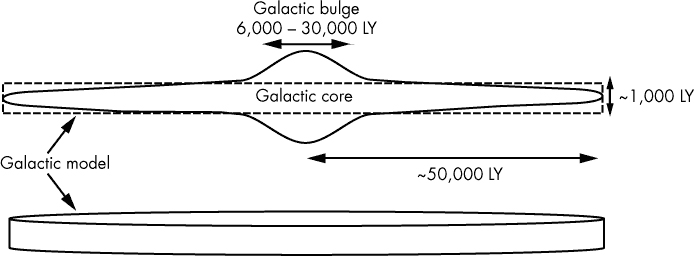
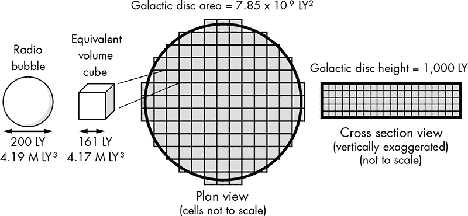
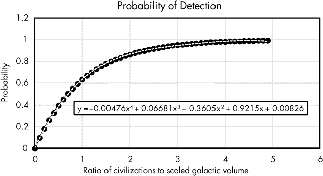
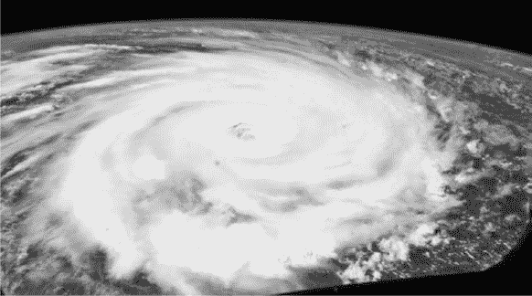
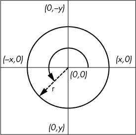
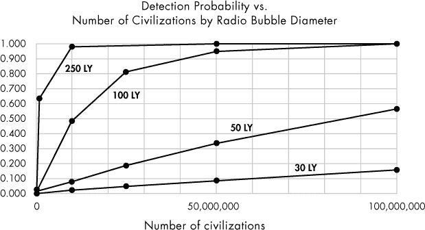
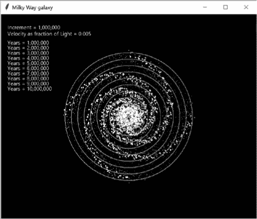

## 我们是孤独的吗？探索费米悖论**


科学家们使用*德雷克方程*来估算当前在银河系内可能存在的能够产生电磁辐射（如无线电波）的文明数量。在 2017 年，这个方程被更新，以考虑到 NASA 开普勒卫星发现的新系外行星。这个结果发布在科学期刊*天体生物学*上，令人震惊。为了让人类成为第一个也是唯一的技术先进物种，在宜居外星行星上出现高级文明的概率必须低于 1000 万亿分之一！然而，正如诺贝尔物理学奖得主恩里科·费米（Enrico Fermi）著名的观察，“他们都在哪儿？”

费米对星际旅行的怀疑超过了对外星生命存在的怀疑，但他的这个问题后来成为了*费米悖论*，并转变为推测：“如果他们在那里，他们早该到这里了。”根据 SETI 研究所的说法，即使只有适度的火箭技术，一个渴望的文明也能在 1000 万年内探索整个银河系，甚至可能殖民银河系。虽然这听起来像是很长的时间，但它只有银河系年龄的 1/1000！因此，有些人开始接受费米悖论作为我们在宇宙中孤独的证据，另一些人则发现这个论点存在漏洞。

在本章中，你将通过根据德雷克方程的传输量和输出计算一个文明检测另一个文明的概率，来研究外星无线电信号的缺失。你还将使用 Python 的事实标准 GUI 包`tkinter`，快速且轻松地创建银河系的图形模型。

### **项目 #17：模拟银河系**

我们的银河系是一个相当常见的螺旋星系，就像图 10-1 所示的那样。


*图 10-1：螺旋星系 NGC 6744，银河系的“亲兄弟”*

从横截面看，银河系是一个扁平的盘状结构，中央膨胀区很可能包含一个超大质量黑洞。四条“螺旋臂”——由相对密集的气体、尘埃和恒星组成——从这个中央质量辐射开来。银河系的尺寸如图 10-2 所示。



*图 10-2：银河系的示意轮廓（边缘视图）（LY = 光年）和简化模型*

由于与更密集的恒星相关的高辐射水平，银河系的中心被认为对生命相当不适宜。因此，对于本项目，你可以将银河系简化为一个简单的盘状结构，忽略一些膨胀区的体积，但仍为核心附近的一些高级文明留出空间（参见图 10-2 中的银河模型）。

**目标**

对于给定数量的高级银河文明和平均无线电气泡大小，估算*任何*文明检测到*任何其他*文明无线电传输的概率。为了提供视角，可以将地球当前的无线电气泡大小绘制在银河系的二维图形表示上。

### **策略**

以下是完成此项目所需的步骤：

1.  使用德雷克方程估算传输文明的数量。

1.  选择它们无线电气泡的大小范围。

1.  生成一个公式来估算一个文明检测到另一个文明的概率。

1.  构建银河系的图形模型，并绘制地球的无线电辐射气泡。

为了使描述尽可能接近代码，以下任务将在各自的章节中详细描述。请注意，前两步并不需要使用 Python。

### **估算文明数量**

您可以手动使用德雷克方程估算高级文明的数量：

*N* = *R^** · *f*[p] · *n*[e] · *f*[l] · *f*[i] · *f*[c] · *L*

其中：

*N* = 我们银河系中电磁辐射可被检测到的文明数量

*R*^* = 银河系中恒星的平均形成率（每年新恒星数量）

*f*^p = 拥有行星的恒星比例

*n*^e = 对于拥有行星的恒星，适合生命存在的行星的平均数量

*f*^l = 发展出生命的行星的比例

*f*^i = 具有智能、文明生命的生命承载行星的比例

*f*^c = 将其存在迹象释放到太空中的文明的比例

*L* = 文明释放可检测信号的时间长度（单位：年）

得益于近年来系外行星探测的进展，前三个组件（*R*^*，*f*^p，*n*^e）正变得越来越受限制。对于*n*^e，近期的研究表明，所有行星中可能有 10%到 40%的行星适合某种形式的生命存在。

对于其余的组件，地球是唯一的例子。在地球的 45 亿年历史中，*智人*只存在了 20 万年，文明只存在了 6,000 年，无线电传输也仅有 112 年的历史。关于*L*，战争、瘟疫、冰河时代、小行星撞击、超级火山、超新星爆炸和日冕物质抛射等都可能破坏文明传播无线电信号的能力。传输时间越短，文明共存的可能性越小。

根据维基百科上关于德雷克方程的文章（*[`en.wikipedia.org/wiki/Drake_equation`](https://en.wikipedia.org/wiki/Drake_equation)*），在 1961 年，德雷克及其同事估计银河系中有通讯的文明数量在 1,000 到 1 亿之间。最近的更新将这一范围定为 1（只有我们）到 15,600,000（表格 10-1）。

**表格 10-1：** 一些德雷克方程的输入和结果

| **参数** | **德雷克 1961 年** | **德雷克 2017 年** | **您的选择** |
| --- | --- | --- | --- |
| *R*^* | 1 | 3 |  |
| *f*[p] | 0.35 | 1 |  |
| *n*^e | 3 | 0.2 |  |
| *f*[l] | 1 | 0.13 |  |
| *f*[i] | 1 | 1 |  |
| *f*[c] | 0.15 | 0.2 |  |
| *L* | 50 × 10⁶ | 1 × 10⁹ |  |
| *N* | 7.9 × 10⁶ | 15.6 × 10⁶ |  |
| **显示的范围的中点 |

对于程序的输入，您可以使用表中的估算值、在网上找到的估算值或您自己计算的值（在表格的最后一列）。

### **选择射电气泡的尺寸**

没有聚焦成束以进行定向传输的射电波是附带的。可以将这些视为“行星泄漏”。因为我们选择不向可能来吃掉我们的外星人广播我们的位置，所以我们几乎所有的传输都是附带的。这些传输目前形成了一个围绕地球扩展的球体，直径大约为 225 光年（LY）。

一个 225 光年的气泡听起来很震撼，但真正重要的是 *可探测* 的大小。射电波前受到 *平方反比定律* 的制约，这意味着它在扩展过程中持续失去功率密度。由于吸收或散射，额外的功率损失可能会发生。在某个时刻，信号变得太弱，无法与背景噪声区分开。即使是我们最先进的技术——*突破监听*计划中的射电望远镜——也只能探测到我们自己射电气泡大约 16 光年远的地方。

由于我们实际上是在调查为什么 *我们* 没有探测到外星人，您应该假设在这个项目中，其他文明的技术与我们相似。另一个假设应该是，像我们一样，所有外星人都有一种偏执的行星意识，并且没有广播“我们在这里”的信号来宣布它们的存在。研究那些比我们目前可以探测到的气泡稍小到稍大的气泡尺寸，应该是一个合理的起点。这将建议一个 30 到 250 光年的直径范围。尽管我们无法探测到一个 250 光年的气泡，但如果我们能够探测到的话，看看概率会是多少也会很有趣。

### **生成检测概率的公式**

随着银河系中高级文明数量的增加，发现另一个文明的概率也随之增加。这是直观的，但如何分配实际的概率呢？

计算机的一个优点是，它们允许我们通过暴力破解的方式，找到那些可能直观也可能不直观的解决方案。这里的一种方法是制作一个银河系盘面的三维模型，随机分布文明，并使用 Python 的许多工具之一来计算它们之间的欧几里得距离。但由于需要分析的文明数量可能达到数亿，这种方法在计算上将非常昂贵。

由于我们处理的是巨大的未知数，没必要追求超精确。我们只需要大致正确，因此一个简单的简化方法是将银河系划分为一系列无线电气泡“等效体积”，方法是将银河圆盘体积除以无线电气泡体积（见图 10-3）。



*图 10-3：用体积等同于 200 光年无线电气泡的立方体来建模银河系*

你可以使用以下方程来求体积，其中*R*是银河圆盘的半径，*r*是无线电气泡的半径：

圆盘体积 = π × *R*² × 圆盘高度

无线电气泡体积 = 4/3 × π × *r*³

缩放圆盘体积 = 圆盘体积 / 无线电气泡体积

缩放圆盘体积是“适合”银河系的等效体积数量。可以把这些当作从 1 到最大体积数编号的盒子。

要放置文明，你只需随机选择一个盒子编号。重复选择表示在同一个盒子内有多个文明。假设同一个盒子内的文明可以相互检测。这并不完全正确（见图 10-4），但由于你将使用大量文明，误差往往会相互抵消，就像求和大量四舍五入的数字一样。


*图 10-4：单个等效体积级别的检测问题*

为了避免每次更改文明数量和/或无线电气泡尺寸时都要重复这个过程，你可以将结果以公式的形式保存——一个*多项式方程*——该公式可以用于生成所有未来的概率估算。*多项式*是多个代数项的和或差。我们在学校学过的著名*二次方程*就是一个二次多项式方程（意味着变量的指数不大于 2）：

*ax*² + *bx* + *c* = 0

多项式会形成漂亮的曲线，因此它们非常适合解决这个问题。但为了让公式适用于不同数量的文明和气泡大小，你需要使用文明数量与总体积的*比率*。总体积由缩放圆盘体积表示，这与等效体积的总数相同。

在图 10-5 中，每个点代表其下方比率的检测概率。图中显示的方程是多项式表达式，它生成了连接各点的线。通过这个公式，你可以预测任何文明数量与体积比率的概率，最大值为 5（超过这个值时，我们假设概率为 1.0）。



*图 10-5：检测概率与文明数量与缩放银河体积比率的关系*

在图 10-5 中，文明与体积的比率被显示在 x 轴上。例如，比率为 0.5 意味着文明的数量是可用广播泡泡等效体积的二分之一，比率为 2 则意味着文明的数量是体积的两倍，依此类推。y 轴表示一个等效体积中包含多个文明的概率。

另一个需要注意的点来自于图 10-5，即需要许多文明才能确保它们每个都有一个室友。假设 1000000 个等效体积中有 999999 个包含至少两个文明，你利用上帝般的力量随机放置一个新的文明。那么，新的文明最终出现在唯一一个有单一居民的剩余体积中的概率是百万分之一。那个最后的等效体积就像是大海捞针！

**注意**

*计算机建模的一个公理是从简单开始，再逐步增加复杂性。最简单的“基本假设”是，先进文明在银河系中是随机分布的。在第 214 页的“挑战项目”中，你将有机会利用银河适居区的概念来挑战这一假设。*

### **检测概率代码**

检测概率代码随机选择一组位置（广播泡泡等效体积）进行定位，并统计其中有多少位置仅出现一次（即只包含一个文明），然后多次重复实验以收敛到一个概率估计。接着，该过程会为新的文明数量重新执行。输出结果以概率与每体积中文明的*比率*为横坐标，而非实际文明数量，并将其转化为多项式表达式，以便结果能够轻松迁移。这意味着这个程序只需运行一次。

为了生成多项式方程并检查它是否符合数据，你将使用`NumPy`和`matplotlib`。`NumPy`库支持大规模的多维数组和矩阵，并包含许多可以对其进行操作的数学函数。`matplotlib`库支持二维绘图和基本的三维绘图，而`NumPy`则是其数值数学扩展。

安装这些科学 Python 发行版有几种方法。一种方法是使用`SciPy`，这是一个用于科学和技术计算的开源 Python 库（见 *[`scipy.org/index.html`](https://scipy.org/index.html)*）。如果你打算进行大量的数据分析和绘图，你可能想要下载并使用一个免费的包，比如 Anaconda 或 Enthought Canopy，它们支持 Windows、Linux 和 macOS。这些包免去了你需要查找并安装所有必要的数据科学库的麻烦，且能保证正确的版本。你可以在 *[`scipy.org/install.html`](https://scipy.org/install.html)* 上找到这些类型包的列表，并附带有它们的网站链接。

另外，你可能希望直接使用 pip 下载这些产品。我使用了 *[`scipy.org/install.html`](https://scipy.org/install.html)* 中的说明来执行这个操作。由于`matplotlib`需要大量的依赖项，这些依赖项需要同时安装。对于 Windows，我从我的 *Python35* 文件夹中启动 PowerShell，并运行以下特定于 Python 3 的命令（如果你没有安装多个版本的 Python，`python3`中的 *3* 可以省略）：

```py
$ python3 -m pip install --user numpy scipy matplotlib ipython jupyter pandas sympy nose
```

你需要的所有其他模块都已经捆绑在 Python 中。至于 清单 10-1 和 10-2 中的代码，你可以手动输入，也可以从 *[`www.nostarch.com/impracticalpython/`](https://www.nostarch.com/impracticalpython/)* 下载副本。

#### ***计算一系列文明的检测概率***

清单 10-1 导入模块并完成所有刚才描述的工作，除了拟合多项式和显示`matplotlib`质量检查。

*probability_of_detection.py,* 第一部分

```py
➊ from random import randint
   from collections import Counter
   import numpy as np
   import matplotlib.pyplot as plt

➋ NUM_EQUIV_VOLUMES = 1000  # number of locations in which to place civilizations
   MAX_CIVS = 5000  # maximum number of advanced civilizations
   TRIALS = 1000  # number of times to model a given number of civilizations
   CIV_STEP_SIZE = 100  # civilizations count step size

➌ x = []  # x values for polynomial fit
   y = []  # y values for polynomial fit

➍ for num_civs in range(2, MAX_CIVS + 2, CIV_STEP_SIZE):
       civs_per_vol = num_civs / NUM_EQUIV_VOLUMES
       num_single_civs = 0
    ➎ for trial in range(TRIALS):
           locations = []  # equivalent volumes containing a civilization
        ➏ while len(locations) < num_civs:
               location = randint(1, NUM_EQUIV_VOLUMES)
               locations.append(location)
        ➐ overlap_count = Counter(locations)
           overlap_rollup = Counter(overlap_count.values())
           num_single_civs += overlap_rollup[1]

    ➑ prob = 1 - (num_single_civs / (num_civs * TRIALS))

       # print ratio of civs-per-volume vs. probability of 2+ civs per location
    ➒ print("{:.4f}  {:.4f}".format(civs_per_vol, prob))
    ➓ x.append(civs_per_vol)
       y.append(prob)
```

*清单 10-1：导入模块，随机选择无线电气泡等效体积位置，并计算每个位置的多文明概率*

导入熟悉的`random`模块和`Counter`模块，用于计算每个位置的文明数量（由该位置被选择的次数来表示）➊。关于`Counter`的工作原理稍后会解释。你将使用`NumPy`和`matplotlib`的导入来拟合并显示多项式。

为一些常量赋值，这些常量表示用户输入的等效体积数、最大文明数、试验次数——即，给定文明数下重复实验的次数——以及计数的步长➋。因为结果是可预测的，你可以使用一个较大的步长值 100 而不影响精度。注意，无论等效体积数是 100 还是 100,000+，你都会得到非常相似的结果。

你需要一系列配对的(*x*, *y*)值来表示多项式表达式，因此先创建两个列表来存储这些值➌。x 值将是每单位体积的文明数量，y 值将是相应的检测概率。

开始一系列嵌套循环，最高层循环表示要模拟的文明数量➍。你至少需要两个文明才能让一个发现另一个，将最大值设置为`MAX_CIVS`加 2，以便在计算多项式时超出范围。使用`CIV_STEP_SIZE`常量作为步长值。  

然后，计算总体的`civs_per_vol`比率，并启动一个名为`num_single_civs`的计数器，用于跟踪包含单一文明的位置数量。  

你已经选择了要分配的文明数量，现在使用`for`循环遍历试验次数➎。对于每个试验，你分配相同数量的文明。将一个空列表分配给变量`locations`，然后对于每个文明➏，随机选择一个位置编号并将其添加到列表中。列表中的重复值将表示包含多个文明的位置。

在这个列表➐上运行`Counter`并获取结果。通过获取仅出现一次的位置数量来结束循环，并将其添加到`num_single_civs`计数器中。以下是这三个语句如何工作的示例：  

```py
>>> from collections import Counter
>>> alist = [124, 452, 838, 124, 301]
>>> count = Counter(alist)
>>> count
Counter({124: 2, 452: 1, 301: 1, 838: 1})
>>> value_count = Counter(count.values())
>>> value_count
Counter({1: 3, 2: 1})
>>> value_count[1]
3
```

`alist`列表包含五个数字，其中一个（124）是重复的。在这个列表上运行`Counter`会生成一个字典，数字作为键，出现的次数作为值。将`Counter`与`count`中的值一起传递——使用`values()`方法——会创建另一个字典，原先的值变为键，出现的次数变为新值。你需要知道哪些数字只出现一次，因此使用字典方法`value_count[1]`返回未重复的数字数量。当然，这些数字将代表包含单一文明的无线电气泡等效体积。  

现在使用`Counter`的结果来计算每个位置上多个文明的概率，针对当前文明分布数量➑。这等于 1 减去单一占用位置的数量，除以每次试验中的文明数量，再乘以试验次数。  

接下来打印文明与体积的比率，以及多个文明共享一个位置的概率➒。输出的前几行如下：  

```py
0.0020  0.0020
0.1020  0.0970
0.2020  0.1832
0.3020  0.2607
0.4020  0.3305
0.5020  0.3951
0.6020  0.4516
0.7020  0.5041
```

这个输出用于初步的质量检查步骤，属于可选项；如果你想加快运行速度，可以将其注释掉。最后将这些值添加到`x`和`y`列表➓中。  

#### ***生成预测公式并检查结果***  

列表 10-2 使用`NumPy`对列表 10-1 中计算的每单位体积的文明比率与探测概率进行多项式回归。你将在下一个程序中使用这个多项式方程来获取概率估算值。为了检查结果曲线是否与数据点吻合，`matplotlib`将显示实际值和预测值。  

*probability_of_detection.py,* 第二部分  

```py
➊ coefficients = np.polyfit(x, y, 4)  # 4th order polynomial fit
➋ p = np.poly1d(coefficients)
   print("\n{}".format(p))
➌ xp = np.linspace(0, 5)
➍ _ = plt.plot(x, y, '.', xp, p(xp), '-')
➎ plt.ylim(-0.5, 1.5)
➏ plt.show()
```

*列表 10-2：执行多项式回归并显示质量检查图*  

从将变量`coefficients`赋值为`NumPy`的`polyfit()`方法的输出 ➊ 开始。该方法的参数是`x`和`y`列表以及表示拟合多项式次数的整数。它返回一个系数向量`p`，该向量最小化平方误差。

如果你打印`coefficients`变量，你将得到以下输出：

```py
[-0.00475677  0.066811   -0.3605069   0.92146096  0.0082604 ]
```

为了获得完整的表达式，将`coefficients`变量传递给`poly1d`并将结果赋值给一个新变量 ➋。打印该变量，你将看到与图 10-5 中所示的类似方程：

```py
           4           3          2
-0.004757 x + 0.06681 x - 0.3605 x + 0.9215 x + 0.00826
```

为了检查多项式是否足够好地再现输入，你需要绘制文明与体积的比值在 x 轴上的图，y 轴则表示概率。为了得到 x 轴的值，你可以使用`NumPy`的`linspace()`方法，它会返回指定区间内均匀分布的数字。使用区间`(0, 5)`，因为这个范围几乎涵盖了完整的概率范围。

要发布计算值和预测值的符号，首先将`plot()`方法的`x`和`y`列表传递进去，使用圆点（点）进行绘制，这相当于图 10-5 中的点 ➍。然后传递预测的 x 轴值（`xp`），并且为了得到预测的 y 轴概率，传递`p`相同的变量，使用破折号绘制结果。

最后，将 y 轴限制在`–0.5`和`1.5`之间 ➎，并使用`show()`方法实际显示图表（图 10-6） ➏。得到的图形简单且稀疏，因为它的唯一目的是确认多项式回归按预期工作。你可以通过增加或减少步骤 ➊ 中第三个参数来改变多项式拟合。


*图 10-6：计算结果（点）与多项式预测结果（线）*

拥有这些结果，你现在可以在眨眼之间估算任何数量文明的检测概率。Python 所需要做的就是解一个多项式方程。

### **构建图形模型**

图形模型将是一个银河盘的 2D 顶视图。在此显示上绘制地球当前排放气泡的大小，将有助于把银河系的规模与我们在其中微小的位置进行对比。

模拟银河系的关键是模拟螺旋臂。每个螺旋臂代表一个*对数螺旋*，这一几何特征在自然界中极为常见，因此被称为*spira mirabilis*——“奇迹螺旋”。如果你将图 10-7 与图 10-1 进行对比，你可以看到飓风的结构与银河系的结构有着惊人的相似性。飓风的眼睛甚至可以被认为是一个超大质量黑洞，眼墙则代表了事件视界！



*图 10-7：飓风伊戈尔*

由于螺旋线是从中心点或*极点*向外辐射的，你可以更容易地使用*极坐标*来绘制它们（图 10-8）。在极坐标中，传统笛卡尔坐标系中的（*x*，*y*）坐标被（*r*，θ）替代，其中 *r* 是距离中心的距离，θ 是 *r* 和 x 轴之间的角度。极点的坐标是（0，0）。



*图 10-8：极坐标系示例*

对数螺旋的极坐标方程为：

*r* = *ae*^(bθ)

其中 *r* 是从原点的距离，θ 是从 x 轴起的角度，*e* 是自然对数的底数，*a* 和 *b* 是任意常数。

你可以使用这个公式绘制单个螺旋线；然后，旋转并重新绘制螺旋线三次，以产生银河系的四条臂。你将通过不同大小的圆圈构建螺旋线，这些圆圈代表星星。图 10-9 是图形模型的一种实现示例。由于这些模拟是随机的，每个模拟结果会略有不同，而且你可以调整多个变量来改变外观。


*图 10-9：使用对数螺旋模型的银河系*

我是通过 `tkinter`（发音为“tee-kay-inter”）生成图 10-9 中的图像的，`tkinter` 是 Python 中用于开发桌面应用程序的默认图形用户界面（GUI）库。尽管主要用于图形用户界面元素，如窗口、按钮、滚动条等，但 `tkinter` 也可以生成图表、曲线图、屏幕保护程序、简单游戏等。它的一个优势是，作为 Python 标准发行版的一部分，它在所有操作系统之间都具有可移植性，无需安装外部库。同时，它也有很好的文档支持，易于使用。

大多数 Windows、macOS 和 Linux 机器上都已预装 `tkinter`。如果你的系统没有安装，或者需要最新版本，可以从*[`www.activestate.com/`](https://www.activestate.com/)*下载并安装它。和往常一样，如果模块已安装，你应该能够在解释器窗口中导入它而不会出现错误：

```py
>>> import tkinter
>>>
```

入门级的 Python 书籍有时会介绍 `tkinter`，你可以在*[`docs.python.org/3/library/tk.html`](https://docs.python.org/3/library/tk.html)*找到官方在线文档。有关 `tkinter` 的一些其他参考资料可以在“进一步阅读”中找到，位于第 212 页。

#### ***图形模型的缩放***

图形模型的比例单位是光年每像素，每个像素的宽度等同于一个无线电气泡的直径。因此，当被研究的无线电气泡直径发生变化时，比例单位将会改变，图形模型需要重新构建。以下公式将根据气泡的大小调整模型：

缩放盘半径 = 盘半径 / 气泡直径

其中盘面半径为 50,000，长度单位为光年。

当选定的电波气泡较小时，图形模型“放大”，当它较大时，则“缩小”（见图 10-10）。


*图 10-10：电波气泡直径对银河模型外观的影响*

#### ***银河模拟器代码***

银河模拟器代码将计算任何数量的文明和电波气泡大小的检测概率，然后生成银河图形模型。当使用与我们当前排放气泡相同大小的气泡时，它将在太阳系的大致位置用红色标记并注释我们的气泡。你可以从*[`www.nostarch.com/impracticalpython/`](https://www.nostarch.com/impracticalpython/)*下载代码。

##### **输入数据和关键参数**

清单 10-3 通过导入模块并将常用的用户输入放在顶部来启动*galaxy_simulator.py*。

*galaxy_simulator.py,* 第一部分

```py
➊ import tkinter as tk
   from random import randint, uniform, random
   import math

   #=============================================================================
➋ # MAIN INPUT

   # scale (radio bubble diameter) in light-years:
➌ SCALE = 225  # enter 225 to see Earth's radio bubble

   # number of advanced civilizations from the Drake equation:
➍ NUM_CIVS = 15600000
   #=============================================================================
```

*清单 10-3：导入模块并分配常量*

导入`tkinter`为`tk`，这样你在调用`tkinter`类时就不用输入全名 ➊。如果你使用的是 Python 2，请使用大写字母的`Tkinter`。你还需要`random`和`math`模块。

使用注释突出显示主要的用户输入部分 ➋，并分配两个输入值。使用`SCALE`表示每个文明周围可检测到的电磁气泡直径（单位：光年） ➌；`NUM_CIVS`表示要模拟的文明数量，可以根据德雷克方程或完全猜测来确定 ➍。

##### **设置 tkinter 画布并分配常量**

清单 10-4 中的代码实例化了一个`tkinter`窗口对象，并创建了一个画布，你可以在上面绘制内容。这就是银河图或图形模型将显示的地方。它还分配了与银河系维度相关的常量。

*galaxy_simulator.py,* 第二部分

```py
   # set up display canvas
➊ root = tk.Tk()
   root.title("Milky Way galaxy")
➋ c = tk.Canvas(root, width=1000, height=800, bg='black')
➌ c.grid()
➍ c.configure(scrollregion=(-500, -400, 500, 400))

   # actual Milky Way dimensions (light-years)
➎ DISC_RADIUS = 50000
   DISC_HEIGHT = 1000
➏ DISC_VOL = math.pi * DISC_RADIUS**2 * DISC_HEIGHT
```

*清单 10-4：设置* tkinter *窗口和画布并分配常量*

首先创建一个窗口，通常命名为`root` ➊。这是一个*顶层*窗口，将容纳其他所有内容。在下一行，给窗口设置一个标题——“银河系”——该标题将显示在窗口框架的左上角（参见图 10-9 示例）。

接下来，向根窗口添加一个组件，称为*小部件*。*小部件*代表“Windows 小工具”。`tkinter`中有 21 个核心小部件，包括标签、框架、单选按钮和滚动条。将`Canvas`小部件分配给包含所有绘图对象的画布 ➋。这是一个通用的小部件，用于图形和其他复杂布局。指定父窗口、屏幕的宽度和高度以及背景颜色。将画布命名为`c`，表示*画布*。

你可以将`Canvas`小部件分成行和列，像表格或电子表格一样。这个网格中的每个单元格可以容纳不同的小部件，而这些小部件可以跨越多个单元格。在单元格内，你可以使用`STICKY`选项来对齐小部件。为了管理窗口中的每个小部件，你需要使用`grid`几何管理器。由于你在这个项目中只使用了一个小部件，因此不需要向管理器传递任何东西 ➌。

最后，通过配置`canvas`使用`scrollregion` ➍。这将原点坐标`(0, 0)`设置为`canvas`的中心。你需要这样做才能用极坐标绘制银河系的螺旋臂。如果没有它，默认原点将是`canvas`的左上角。

传递给`configure`的参数设置了`canvas`的限制。这些应该是`canvas`宽度和高度的一半；例如，`600, 500`的滚动限制将需要`canvas`的尺寸为`1200, 1000`。这里显示的值在小型笔记本上效果很好，但如果你发现需要更大的窗口，可以稍后更改它们。

在输入部分之后跟上银河系的尺寸常量 ➎。你可以在函数中为这些变量赋值，但将它们放在全局空间中能使代码解释的流程更加逻辑化。前两个常量是银河圆盘的半径和高度，见图 10-2。最后一个常量代表圆盘体积 ➏。

##### **缩放银河系并计算探测概率**

列表 10-5 定义了根据使用中的无线电气泡直径来缩放银河系尺寸的函数，并计算一个文明探测到另一个文明的概率。后者的函数是你应用先前描述的*probability_of_detection.py*程序中构建的多项式方程的地方。

*galaxy_simulator.py,* 第三部分

```py
➊ def scale_galaxy():
       """Scale galaxy dimensions based on radio bubble size (scale)."""
       disc_radius_scaled = round(DISC_RADIUS / SCALE)
    ➋ bubble_vol = 4/3 * math.pi * (SCALE / 2)**3
    ➌ disc_vol_scaled = DISC_VOL/bubble_vol
    ➍ return disc_radius_scaled, disc_vol_scaled

➎ def detect_prob(disc_vol_scaled):
       """Calculate probability of galactic civilizations detecting each other."""
    ➏ ratio = NUM_CIVS / disc_vol_scaled  # ratio of civs to scaled galaxy volume
    ➐ if ratio < 0.002:  # set very low ratios to probability of 0
           detection_prob = 0
       elif ratio >= 5:  # set high ratios to probability of 1
           detection_prob = 1
    ➑ else:
           detection_prob = -0.004757 * ratio**4 + 0.06681 * ratio**3 - 0.3605 * \
                            ratio**2 + 0.9215 * ratio + 0.00826
    ➒ return round(detection_prob, 3)
```

*列表 10-5：缩放银河尺寸并计算探测概率*

定义一个名为`scale_galaxy()`的函数，将银河系的尺寸缩放到无线电气泡的大小 ➊。它将使用全局空间中的常量，因此不需要传递任何参数。计算缩放后的圆盘半径，然后使用球体体积公式计算无线电气泡的体积，并将结果赋值给`bubble_vol` ➋。

接下来，将实际的圆盘体积除以`bubble_vol`以获得缩放后的圆盘体积 ➌。这是可以容纳在银河系中的无线电气泡“等效体积”数量。每个气泡代表一个文明可能存在的位置。

通过返回`disc_radius_scaled`和`disc_vol_scaled`变量来结束函数 ➍。

现在，定义一个名为 `detect_prob()` 的函数来计算检测概率，该函数将缩放后的盘面体积作为参数 ➎。对于多项式中的 `x` 项，计算文明数量与缩放后的盘面体积之比 ➏。由于多项式回归在端点可能出现问题，因此使用条件语句将非常小的比率设置为 `0`，将大比率设置为 `1` ➐。否则，应用由 *probability_of_detection.py* 代码生成的多项式表达式 ➑，然后返回保留三位小数的概率 ➒。

##### **使用极坐标**

清单 10-6 定义了一个函数，用于使用极坐标随机选择 (*x*, *y*) 位置。这个函数将选择在图形模型中展示的一些恒星的位置。由于显示是二维的，因此无需选择 *z* 位置。

*galaxy_simulator.py,* 第四部分

```py
➊ def random_polar_coordinates(disc_radius_scaled):
       """Generate uniform random (x, y) point within a disc for 2D display."""
    ➋ r = random()
    ➌ theta = uniform(0, 2 * math.pi)
    ➍ x = round(math.sqrt(r) * math.cos(theta) * disc_radius_scaled)
       y = round(math.sqrt(r) * math.sin(theta) * disc_radius_scaled)
    ➎ return x, y
```

*清单 10-6：定义一个函数，随机选择一个 (*x, y*) 极坐标位置*

该函数以缩放后的盘面半径作为参数 ➊。使用 `random()` 函数选择一个介于 0.0 和 1.0 之间的浮动值，并将其赋给变量 `r` ➋。接下来，从 0 到 360 度之间的均匀分布中随机选择 `theta`（2π 是 360 度的弧度等效值） ➌。

生成点以 *均匀* 分布在 *单位* 圆盘上的转换公式是：


方程式得出的 (*x*, *y*) 值在 -1 到 1 之间。为了将结果缩放到银河盘面，乘以缩放后的盘面半径 ➍。函数的最后返回 `x` 和 `y` ➎。

##### **构建螺旋臂**

清单 10-7 定义了一个函数，该函数使用对数螺旋方程构建螺旋臂。这个螺旋可能很神奇，但大部分魔法在于对初始的简单螺旋进行调整，逐步完善螺旋臂。你将通过改变恒星的大小，随机微调它们的位置，并为每个臂复制螺旋，稍微将其向后移动并使恒星变暗，从而实现这一点。

*galaxy_simulator.py,* 第五部分

```py
➊ def spirals(b, r, rot_fac, fuz_fac, arm):
       """Build spiral arms for tkinter display using logarithmic spiral formula.

       b = arbitrary constant in logarithmic spiral equation
       r = scaled galactic disc radius
       rot_fac = rotation factor
       fuz_fac = random shift in star position in arm, applied to 'fuzz' variable
       arm = spiral arm (0 = main arm, 1 = trailing stars)
       """
    ➋ spiral_stars = []
    ➌ fuzz = int(0.030 * abs(r)) # randomly shift star locations
       theta_max_degrees = 520
    ➍ for i in range(theta_max_degrees):  # range(0, 600, 2) for no black hole
           theta = math.radians(i)
           x = r * math.exp(b * theta) * math.cos(theta + math.pi * rot_fac)\
               + randint(-fuzz, fuzz) * fuz_fac
           y = r * math.exp(b * theta) * math.sin(theta + math.pi * rot_fac)\
               + randint(-fuzz, fuzz) * fuz_fac
           spiral_stars.append((x, y))
    ➎ for x, y in spiral_stars:
        ➏ if arm == 0 and int(x % 2) == 0:
               c.create_oval(x-2, y-2, x+2, y+2, fill='white', outline='')
           elif arm == 0 and int(x % 2) != 0:
               c.create_oval(x-1, y-1, x+1, y+1, fill='white', outline='')
        ➐ elif arm == 1:
               c.create_oval(x, y, x, y, fill='white', outline='')
```

*清单 10-7：定义 *spirals()* 函数*

定义一个名为 `spirals()` 的函数 ➊。其参数在函数文档字符串中列出。前两个参数 `b` 和 `r` 来自对数螺旋方程。接下来的 `rot_fac` 是旋转因子，它允许你围绕中心点移动螺旋，从而生成新的螺旋臂。模糊因子 `fuz_fac` 让你调整恒星与螺旋线中心的距离。最后，`arm` 参数让你指定是前导臂还是尾随臂，后者会稍微偏移——即绘制在前导臂之后——并且恒星较小。

初始化一个空列表，用于存储构成螺旋的恒星位置 ➋。定义一个`fuzz`变量，将一个任意常数与缩放后的圆盘半径的绝对值相乘 ➌。仅靠螺旋方程会生成排列整齐的星星（见图 10-11 中的左侧两个面板）。通过模糊化，星星会在螺旋线上来回移动，位于螺旋线两侧。你可以在图 10-11 的最右面板中看到这一效果，特别是在亮星部分。我是通过反复试验确定这些值的；如果你喜欢，可以随意调整。


*图 10-11：通过移动螺旋线并随机改变星星位置填充螺旋臂*

现在是时候构建螺旋线了。首先，使用一个值范围来表示对数螺旋方程中的θ ➍。大约`520`的范围将生成如图 10-9 所示的银河系，它有一个中央“黑洞”。否则，使用范围`(0, 600, 2)`—或类似的值—生成一个明亮的中央核心，星星密集分布（参见图 10-12）。你可以调整这些值，直到得到你喜欢的效果。遍历`theta`中的值，并应用对数螺旋方程，使用余弦计算 x 值，使用正弦计算 y 值。请注意，你要将`fuzz`值乘以模糊因子后加到结果中。将每对(*x*, *y*)坐标添加到`spiral_stars`列表中。


*图 10-12：没有中央黑洞的图形模型（与图 10-9 比较）*

后面在`main()`函数中，你将指定`rot_fac`变量，它将使螺旋围绕中心旋转。在程序构建完四个主臂后，它将使用`rot_fac`来构建四个新的臂，这些臂会略微偏移第一个四个臂，从而生成图 10-11 中每条亮星弧线左侧的暗淡拖尾星星带。

现在你已经有了恒星位置列表，开始在(*x*, *y*)坐标上执行`for`循环 ➎。然后使用条件语句选择主臂、引导臂以及`x`为偶数的位置 ➏。对于这些位置，使用`canvas`小部件的`create_oval()`方法来创建一个星星对象并显示。此方法的前四个参数定义了一个边界框，椭圆将适应该框。`x`和`y`后面的数字越大，椭圆就越大。将填充颜色设置为白色，并且不要使用轮廓；默认的轮廓是细黑线。

如果`x`值为奇数，将星星的尺寸缩小一个等级。如果`arm`值为`1`，则星星位于偏移臂上，因此将其尽可能小 ➐。

**注意**

*这些星星对象仅用于视觉效果。它们的大小和数量并不按比例缩放。为了更现实，它们应该要小得多，而且数量要多得多（超过 1000 亿颗！）*

##### **散射星雾**

螺旋臂之间的空间并非完全没有星星，因此下一个函数（清单 10-8）会在星系模型中随机散布点，而不考虑螺旋臂的分布。可以把这个想象为在遥远星系的照片中看到的光晕效果。

*galaxy_simulator.py,* 第六部分

```py
➊ def star_haze(disc_radius_scaled, density):
       """Randomly distribute faint tkinter stars in galactic disc.

       disc_radius_scaled = galactic disc radius scaled to radio bubble diameter
       density = multiplier to vary number of stars posted
       """
    ➋ for i in range(0, disc_radius_scaled * density):
        ➌ x, y = random_polar_coordinates(disc_radius_scaled)
        ➍ c.create_text(x, y, fill='white', font=('Helvetica', '7'), text='.')
```

*清单 10-8：定义了* star_haze() *函数*

定义 `star_haze()` 函数，并传递两个参数：缩放后的圆盘半径和一个整数倍增因子，函数将使用该因子来增加随机星星的基本数量 ➊。因此，如果你希望雾霾更浓厚，而不是轻微的雾霾，可以在调用 `main()` 中的函数时增加密度值。

启动一个`for`循环，其中最大范围值等于缩放后的圆盘半径乘以`density` ➋。通过使用半径值，你将星星的数量缩放到显示的圆盘大小。然后调用`random_polar_coordinates()`函数来获取一个（*x*，*y*）坐标对 ➌。

最后，通过使用（*x*，*y*）坐标对 ➍ 来为画布创建显示对象。由于你已经使用了最小的椭圆大小来表示沿着和周围螺旋臂的星星，因此可以使用 `create_text()` 方法，而不是 `create_oval()`。通过此方法，你可以使用一个句号来代表星星。字体大小参数将允许你缩放雾霾星星，直到找到一个美观的效果。

图 10-13 是没有星际雾霾的星系模型（左）与有星际雾霾的星系模型（右）的对比图。


*图 10-13：没有星际雾霾的星系模型（左）与有星际雾霾的星系模型（右）*

你可以对雾霾进行创意设计。例如，可以增加星星的数量并将其着色为灰色，或者使用循环来变化星星的大小和颜色。但是，不要使用绿色，因为宇宙中没有绿色的星星！

##### **定义 main() 函数**

清单 10-9 在 *galaxy_simulator.py* 中定义了 `main()` 函数。它会调用相应函数来缩放星系、计算探测概率、构建星系显示和发布统计信息。它还将运行 `tkinter` 主循环。

*galaxy_simulator.py,* 第八部分

```py
def main():
       """Calculate detection probability & post galaxy display & statistics."""
    ➊ disc_radius_scaled, disc_vol_scaled = scale_galaxy()
       detection_prob = detect_prob(disc_vol_scaled)

       # build 4 main spiral arms & 4 trailing arms
    ➋ spirals(b=-0.3, r=disc_radius_scaled, rot_fac=2, fuz_fac=1.5, arm=0)
       spirals(b=-0.3, r=disc_radius_scaled, rot_fac=1.91, fuz_fac=1.5, arm=1)
       spirals(b=-0.3, r=-disc_radius_scaled, rot_fac=2, fuz_fac=1.5, arm=0)
       spirals(b=-0.3, r=-disc_radius_scaled, rot_fac=-2.09, fuz_fac=1.5, arm=1)
       spirals(b=-0.3, r=-disc_radius_scaled, rot_fac=0.5, fuz_fac=1.5, arm=0)
       spirals(b=-0.3, r=-disc_radius_scaled, rot_fac=0.4, fuz_fac=1.5, arm=1)
       spirals(b=-0.3, r=-disc_radius_scaled, rot_fac=-0.5, fuz_fac=1.5, arm=0)
       spirals(b=-0.3, r=-disc_radius_scaled, rot_fac=-0.6, fuz_fac=1.5, arm=1)
       star_haze(disc_radius_scaled, density=8)

       # display legend
    ➌ c.create_text(-455, -360, fill='white', anchor='w',
                     text='One Pixel = {} LY'.format(SCALE))
       c.create_text(-455, -330, fill='white', anchor='w',
                     text='Radio Bubble Diameter = {} LY'.format(SCALE))
       c.create_text(-455, -300, fill='white', anchor='w',
                     text='Probability of detection for {:,} civilizations = {}'.
                     format(NUM_CIVS, detection_prob))

       # post Earth's 225 LY diameter bubble and annotate
    ➍ if SCALE == 225:
        ➎ c.create_rectangle(115, 75, 116, 76, fill='red', outline='')
           c.create_text(118, 72, fill='red', anchor='w',
                         text="<---------- Earth's Radio Bubble")

       # run tkinter loop
    ➏ root.mainloop()
➐ if __name__ == '__main__':
       main()
```

*清单 10-9：定义并调用了* main() *函数*

通过调用 `scale_galaxy()` 函数来启动 `main()`，获取缩放后的圆盘体积和半径 ➊。然后调用 `detect_prob()` 函数，并传递 `disc_vol_scaled` 变量。将结果赋值给名为 `detection_prob` 的变量。

现在构建银河系显示（图形模型） ➋。这会多次调用`spirals()`函数，每次调用都有小的变化。`arm`参数指定明亮的主臂和微弱的拖尾臂。`rot_fac`（旋转因子）变量确定螺旋线的绘制位置。主臂和拖尾臂之间的微小旋转因子变化（例如，从`2`到`1.91`）使得微弱的臂略微偏离明亮的臂绘制。通过调用`star_haze()`函数完成显示。再次提醒，可以随意尝试这些参数。

接下来，显示图例和统计信息。从尺度 ➌ 和无线电气泡直径开始，然后是给定数量文明的探测概率。参数包括 x 和 y 坐标、填充（文本）颜色、对齐锚点——其中左对齐表示`w`（“west”）——以及文本。注意使用`{:,}`来插入千位分隔符的逗号。这是较新的*字符串格式化方法*的一部分。你可以在*[`docs.python.org/3/library/string.html#string-formatting`](https://docs.python.org/3/library/string.html#string-formatting)*查看更多内容。

如果用户选择了`225`光年的无线电气泡直径 ➍，那么显示的尺度与我们自己的辐射气泡相同，因此会在大致的位置处显示一个红色像素，标注出我们的太阳系 ➎。使用`tkinter`显示单个像素有很多方法。在这里，使用`create_rectangle()`方法，但你也可以用以下语句绘制一条长度为一个像素的线：

```py
c.create_line(115, 75, 116, 75, fill='red')
```

使用`create_rectangle()`方法时，前两个参数是点（`x0`，`y0`），它们对应左上角的位置，和（`x1`，`y1`），即底部右角外部像素的位置。使用`create_line()`方法时，参数对应起始和结束点。默认的线宽为一个像素。

通过执行`tkinter`的`mainloop()`函数，也称为*事件循环* ➏，结束`main()`函数。这样可以保持`root`窗口打开，直到你关闭它。

返回到全局空间，通过允许程序作为独立程序运行或作为模块被另一个程序调用来结束程序 ➐。

最终的显示将类似于图 10-14，展示了地球的无线电气泡和一个中央黑洞。


*图 10-14：最终显示，地球 225 光年直径的无线电气泡显示在银河系地图上*

请注意，尽管在这个尺度下我们的无线电气泡比针孔还小，如果文明的探测范围为 112.5 光年，并且如果这些文明的数量如当前德雷克方程式的高端参数所预测的那样多，那么探测的概率就是 1！

### **结果**

鉴于输入的不确定性和简化假设的使用，你不应在这里追求精确。你要寻找的是*方向性*。我们（或任何类似我们的人）是否应该期望探测到一个没有主动尝试与我们联系的文明？根据图 10-15，可能不会。



*图 10-15：不同无线电气泡直径和不同文明数量下，一个文明探测到另一个文明的概率*

根据我们目前的技术，我们可以探测到来自 16 光年远的文明发出的辐射，这相当于一个直径为 32 光年的无线电气泡。即使银河系中有 1560 万先进文明，正如维基百科更新版的德雷克方程预测的那样，探测到 32 光年无线电气泡的机会也不到 4%！

再看看图 10-14，你就能开始欣赏我们银河系的广袤和空旷。天文学家甚至为此有一个词：*Laniakea*，夏威夷语为“不可衡量的天国”。

地球，就像卡尔·萨根所描述的那样，只是“悬浮在阳光中的一粒尘埃”。而最近的研究表明，探测文明的无线电波的机会窗口比我们想象的要小得多。如果其他文明效仿我们，转向数字信号和卫星通信，那么它们的偶然无线电泄漏将至少减少四倍。我们都变得不经意间“隐身”，大约盛开一百年左右，然后逐渐消逝。

鉴于这些事实，政府不再资助使用射电望远镜寻找外星智能生命也就不足为奇了。如今，努力转向寻找外星行星大气层中气体的光学方法，比如生命和工业活动的废弃物。

### **总结**

在本章中，你获得了使用`tkinter`、`matplotlib`和`NumPy`的经验。你生成了一个多项式表达式，用于合理估算探测到外星无线电信号的可能性，并且使用了随时可用的`tkinter`模块，为分析添加了一个酷炫的视觉组件。

### **进一步阅读**

*我们是否孤独？外星生命发现的哲学意义*（BasicBooks，1995 年）由 Paul Davies 撰写，是一部深刻探讨寻找外星生命的著作，由一位杰出的科学家和获奖的科普作家讲述。

《描述螺旋星系支架结构的新公式》（*皇家天文学会月刊*，2009 年 7 月 21 日）由 Harry I. Ringermacher 和 Lawrence R. Mead 撰写 (*[`arxiv.org/abs/0908.0892v1`](https://arxiv.org/abs/0908.0892v1)*)，提供了用于建模哈勃望远镜观测到的螺旋星系形状的公式。

“Tkinter 8.5 参考：Python 的 GUI”（新墨西哥科技大学计算机中心，2013）由 John W. Shipman 编写，是官方`tkinter`文档的有用补充。可以在* [`infohost.nmt.edu/tcc/help/pubs/tkinter/tkinter.pdf`](http://infohost.nmt.edu/tcc/help/pubs/tkinter/tkinter.pdf)*找到。

另一个有用的在线`tkinter`资源是* [`wiki.python.org/moin/TkInter/`](https://wiki.python.org/moin/TkInter/)*。

*Tkinter GUI 应用开发 HOTSHOT*（Packt Publishing，2013）由 Bhaskar Chaudhary 编写，采用基于项目的方式教授`tkinter`。

### **实践项目**

尝试这三个衍生项目。你可以在附录中找到它们，或者从* [`www.nostarch.com/impracticalpython/`](https://www.nostarch.com/impracticalpython/)*下载它们。

#### ***一个遥远的银河系***

厌倦了生活在银河系中？谁不厌倦呢？幸运的是，天地间不只有对数螺旋。使用 Python 和`tkinter`为我们建造一个新家——但不一定是一个现实的家。为了获取灵感，可以访问 Alexandre Devert 在他的 Marmakoide 博客上的文章《在圆盘和球面上散布点》（* [`blog.marmakoide.org/`](http://blog.marmakoide.org/)*）。图 10-16 中的示例就是用*galaxy_practice.py*构建的。


*图 10-16：由* galaxy_practice.py *程序生成的星系*

#### ***建立一个银河帝国***

选择星系中的一个位置，设定平均旅行速度为光速的 5 到 10%，时间步长为 50 万年。然后模拟一个太空帝国的扩展。在每个时间步中，计算扩展中的*殖民泡泡*的大小并更新星系图。通过将家园位置设置为星系中心，速度设置为`1`，并确认到达星系边缘需要 50,000 年来检查结果。

当程序运行起来时，你可以进行有趣的实验。例如，你可以测试我们需要以多快的速度才能在 1000 万年内探索银河系，正如本章介绍中提到的那样（见图 10-17）。



*图 10-17：核心位置帝国在低于光速的旅行下，经过 1000 万年的扩展*

你还可以估算*星际迷航*联邦在其前 100 年中能够探索多少银河系，假设他们在 4 倍曲速下的平均速度为光速的 100 倍（见图 10-18）。


*图 10-18：* 星际迷航 *联邦在 4 倍曲速下的前 100 年扩展*

这些图形是通过*empire_practice.py*程序构建的。

#### ***预测可探测性的间接方法***

预测探测概率的另一种方法是使用极坐标将文明分布在银河盘中——作为 xyz 点——然后将这些点四舍五入到最近的无线电气泡*半径*。共享相同位置的点代表可能相互探测到的文明。但是要小心——这种方法是用立方体而不是球体来进行四舍五入，因此你需要将半径转换为产生相同体积的立方体边长。

编写程序，以预测在给定的 15,600,000 个随机分布在银河系中的传输文明的情况下，探测 16 光年*半径*气泡的概率（这是我们当前技术的极限）。在分布文明时，使用完整的 50,000 光年半径和 1,000 光年高度的银河模型。

解决方案见*rounded_detection_practice.py*。请注意，程序运行可能需要几分钟。

### **挑战项目**

这里有一些后续项目，供你自行尝试。记住，我不会提供挑战项目的解决方案。

#### ***创建棒旋星系***

随着我们获得并分析新的天文数据，对银河系的理解也在不断发展。科学家现在认为银河系的核心是拉长的，呈棒状。使用 Ringermacher 和 Mead 论文中提供的方程，参考“进一步阅读”中的第 212 页，创建一个新的`tkinter`可视化银河模型，体现棒旋星系的概念。

#### ***将宜居区添加到你的银河系中***

太阳系有*金发姑娘区*，适合生命的诞生。位于这些区域的行星温暖足够，至少部分水体保持液态。

还有一种理论认为，像太阳系一样，星系也有*宜居区*，其中生命更有可能发展。对于银河系的宜居区的一种定义是，其内边界约在距银河中心 13,000 光年处，外边界约在距银河中心 33,000 光年处（见图 10-19）。由于核心区域有高水平的辐射、大量超新星以及由于众多密集星体引起的复杂的轨道扰动引力场，因此被排除在外。边缘区域因金属含量低而被排除，而金属元素对行星的发展至关重要。


*图 10-19：近似银河宜居区（阴影部分）叠加在银河模型上*

宜居区模型的一个改进排除了螺旋臂，原因类似于核心排除的原因。我们的存在并不与此相悖。地球位于猎户“蹄”区域，这是位于射手臂和英仙臂之间的一个相对较小的特征。

编辑*galaxy_simulation.py*程序，使其仅使用银河适居区的体积，不管你如何定义它。你应该研究这些体积可能是什么，以及它们对德雷克方程计算的文明数量（*N*）会产生什么影响。考虑使用*区域*，比如核心、螺旋臂、外缘等，在这些区域内，*N*的值不同，但文明仍然是随机分布的。在银河地图上突出显示这些区域，并发布它们的探测概率估算值。
