## **10

我们是否孤独？探索费米悖论**

科学家使用*德雷克方程*来估算当前在银河系中产生电磁辐射（如无线电波）的文明数量。2017 年，德雷克方程进行了更新，以考虑到 NASA 开普勒卫星的新外星行星发现。这个结果在科学期刊《天体生物学》上发表，令人震惊。为了使人类成为第一个也是唯一一个技术先进的物种，在宜居的外星行星上发展出一个先进文明的概率必须低于 1/10000 万亿！然而，正如诺贝尔奖得主恩里科·费米著名的观察到的那样，“他们在哪里？”

费米对星际旅行的怀疑超过了对外星生命存在的怀疑，但他的问题成为了*费米悖论*，并发展成了这样一个猜想：“如果他们在那里，他们就应该出现在这里。”根据 SETI 研究所的说法，即使使用适度的火箭技术，一个渴望的文明也能在 1000 万年内探索整个银河系，甚至是殖民它。听起来可能像是很长的时间，但这仅仅是银河系年龄的千分之一！因此，有些人开始接受费米悖论作为我们在宇宙中孤独的证据。也有人在这个论点中找到了漏洞。

在这一章中，你将通过计算基于文明传输体积和德雷克方程输出的探测概率，调查外星无线电信号缺失的问题。你还将使用 Python 的事实标准 GUI 包 tkinter，快速而轻松地创建银河系的图形模型。

### **项目 #17：建模银河系**

我们的银河系，银河系，是一个相当常见的螺旋星系，像图 10-1 中所示。

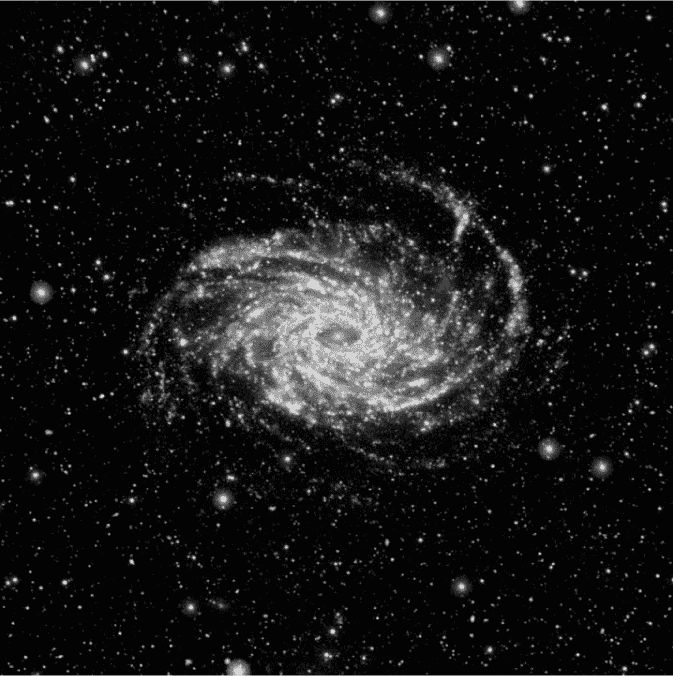

*图 10-1：螺旋星系 NGC 6744，银河系的“哥哥”*

从横截面来看，银河系是一个扁平的盘状结构，中央凸起部分最可能包含一个超大质量黑洞。四条“螺旋臂”——由相对密集的气体、尘埃和恒星组成——从这个中央物质区辐射出去。银河系的尺寸见于图 10-2。

*图 10-2：银河系的示意剖面图（边缘视图）（LY = 光年）及简化模型*

由于与更紧密分布的恒星相关的高辐射水平，银河系的中心被认为对生命来说是相当不适宜的。因此，对于这个项目，你可以将银河系视为一个简单的盘面，忽略掉一些与凸起部分相关的体积，但仍为核心附近的一些先进文明留下空间（见图 10-2 中的银河模型）。

**目标**

对于给定数量的高级银河系文明和平均无线电气泡大小，估算*任何*文明检测到*其他任何*文明的无线电信号的概率。为了更好理解，可以将地球当前无线电气泡的大小绘制在银河系的二维图形中。

### **策略**

完成这个项目需要的步骤如下：

1.  使用德雷克方程估算发射无线电信号的文明数量。

1.  选择它们无线电气泡的大小范围。

1.  生成一个公式，用于估算一个文明检测到另一个文明的概率。

1.  构建一个银河系的图形模型，并展示地球的无线电辐射气泡。

为了使描述更贴近代码，每个任务将会在各自的章节中详细描述。请注意，前两个步骤不需要使用 Python。

### **估算文明的数量**

你可以使用德雷克方程手动估算高级文明的数量：

*N* = *R^** · *f*[p] · *n*[e] · *f*[l] · *f*[i] · *f*[c] · *L*

其中：

*N* = 我们银河系中电磁辐射可被探测的文明数量

*R*^* = 银河系中恒星的平均形成率（每年新星数量）

*f*^p = 拥有行星的恒星的比例

*n*^e = 有行星的恒星中，适合生命存在的行星的平均数量

*f*^l = 发展出生命的行星的比例

*f*^i = 具有智慧和文明生命的适生行星的比例

*f*^c = 发射可检测到的存在信号到太空的文明比例

*L* = 文明释放可检测信号的时间长度——单位为年

得益于近期在系外行星探测方面的进展，前三个组件（*R*^*、*f*^p、*n*^e）变得越来越受限制。对于 *n*^e，最近的研究表明，10%到 40%的行星可能适合某种形式的生命。

对于其余的组件，地球是唯一的例子。在地球的 45 亿年历史中，*智人*仅存在 20 万年，文明存在 6000 年，无线电传播只有 112 年的历史。关于 *L*，战争、瘟疫、冰河时代、陨石撞击、超级火山、超新星爆发和日冕物质抛射等事件都可能扰乱文明传输无线电信号的能力。而且，传输时间越短，文明共存的可能性就越低。

根据德雷克方程的维基百科文章（*[`en.wikipedia.org/wiki/Drake_equation`](https://en.wikipedia.org/wiki/Drake_equation)*），在 1961 年，德雷克和他的同事估算银河系中进行通讯的文明数量在 1000 到 1 亿之间。近期的更新将范围设置为从 1（只有我们）到 1560 万（见表 10-1）。

**表 10-1：** 一些德雷克方程的输入和结果

| **参数** | **德雷克 1961** | **德雷克 2017** | **你的选择** |
| --- | --- | --- | --- |
| *R*^* | 1 | 3 |  |
| *f*[p] | 0.35 | 1 |  |
| *n*^e | 3 | 0.2 |  |
| *f*[l] | 1 | 0.13 |  |
| *f*[i] | 1 | 1 |  |
| *f*[c] | 0.15 | 0.2 |  |
| *L* | 50 × 10⁶ | 1 × 10⁹ |  |
| *N* | 7.9 × 10⁶ | 15.6 × 10⁶ |  |
| **范围的中点** |

对于你的程序输入，你可以使用表格中的估算值，网上找到的值，或者你自己计算的值（表格的最后一列）。

### **选择无线电气泡的尺寸**

无线电波如果没有聚焦成一个用于定向传输的波束，就是偶然的。可以把这些看作是“行星泄漏”。因为我们选择不向可能会来吃掉我们的外星人广播我们的存在，几乎我们所有的传输都是偶然的。这些传输目前形成了一个扩展中的球体，围绕地球，直径大约是 225 光年（LY）。

225 光年的气泡听起来令人印象深刻，但真正重要的是*可检测*的大小。无线电波前受到*平方反比定律*的影响，这意味着它在扩展时会不断失去能量密度。额外的能量损失可能来自吸收或散射。某个时刻，信号变得太弱，无法与背景噪声区分开来。即使是我们的最佳技术——*突破聆听*项目的射电望远镜——我们也只能检测到自己大约 16 光年外的无线电气泡。

由于我们真正要探讨的是为什么*我们*还没有发现外星人，因此你应该假设，对于这个项目，其他文明的技术水平类似于我们自己。另一个假设是，像我们一样，所有外星人都具有偏执的行星意识，并且没有广播“我们在这里”的信号来宣布它们的存在。调查从当前可检测到的气泡稍小到比我们自身传输稍大的气泡大小应该是一个合理的起点。这将建议一个直径范围在 30 到 250 光年之间。尽管我们无法检测到 250 光年的气泡，但如果能够检测到，那会很有趣，看看几率是多少。

### **生成检测概率的公式**

随着银河系中先进文明数量的增加，检测到其他文明的概率也会增加。这是直观的，但如何分配实际的概率呢？

计算机的一个好处是它们允许我们通过蛮力寻找解决方案，这些解决方案可能直观也可能不直观。这里的一种方法是制作一个银河系盘面的三维模型，随机分布文明，并使用 Python 的多个工具计算欧几里得距离来测量它们之间的距离。但由于可能需要分析数亿个文明，这种方法在计算上会非常昂贵。

由于我们处理的是巨大的未知数，因此无需非常精确或准确。我们只需要大致估算，所以一个简单的简化方法是将银河系分割成一系列无线电气泡的“等效体积”，通过将银河圆盘的体积除以无线电气泡的体积来实现（请参见图 10-3）。

*图 10-3: 使用体积等于 200 光年无线电气泡的立方体来建模银河系*

您可以使用以下方程来找到体积，其中 *R* 是银河圆盘的半径，*r* 是无线电气泡的半径：

圆盘体积 = π × *R*² × 圆盘高度

无线电气泡体积 = 4/3 × π × *r*³

缩放圆盘体积 = 圆盘体积 / 无线电气泡体积

缩放圆盘体积是能够“容纳”在银河系中的等效体积数量。可以将这些看作是从 1 到最大体积数量的编号箱子。

要放置文明，您只需随机选择一个箱子编号。重复选择表示同一个箱子内有多个文明。假设同一箱子中的文明可以彼此检测到。虽然这并不完全正确（请参见图 10-4），但由于您将使用大量文明，这些差异通常会相互抵消，就像对很多四舍五入的数字求和时一样。

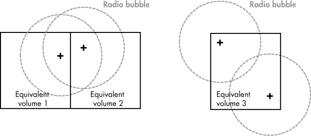

*图 10-4: 在个体等效体积级别上的检测问题*

为了避免每次更改文明数量和/或无线电气泡维度时都需要重复此操作，您可以将结果作为公式—一个*多项式方程*—来捕获，这样就可以用来生成所有未来的概率估算。*多项式*是代数项的加法或减法。我们在学校学过的著名的*二次方程*就是一个二次多项式方程（意味着变量的指数不大于 2）：

*ax*² + *bx* + *c* = 0

多项式形成了美丽的曲线，因此它们非常适合这个问题。但为了让这个公式适用于变动的文明数量和气泡大小，您需要使用文明数量与总体积的*比率*。总体积由缩放后的圆盘体积表示，它与等效体积的总和相同。

在图 10-5 中，每个点代表与其下方比率对应的检测概率。图中的方程是多项式表达式，它生成连接这些点的曲线。使用这个公式，您可以预测任何每体积文明数量比率的概率，直到比率值为 5（超过此值时，我们假设概率为 1.0）。

*图 10-5: 检测概率与文明数量与缩放银河体积比率的关系*

在图 10-5 中，文明与体积的比率显示在 x 轴上。例如，比率为 0.5 意味着文明数量是可用的无线电气泡等效体积的一半，比率为 2 意味着文明数量是体积的两倍，以此类推。y 轴表示一个等效体积包含多个文明的概率。

从图 10-5 中还可以注意到，要确保每个文明都有伴侣，文明的数量需要非常多。假设在 1000000 个等效体积中，999999 个包含至少两个文明，而你用神一样的力量随机放置一个新的文明。这个新文明有 100 万分之一的概率会落入剩下的那个只有一个居民的体积。那个最后的等效体积，正如俗话所说，是“大海捞针”！

**注意**

*计算机建模的一个公理是从简单开始，逐步增加复杂性。最简单的“基础假设”是高级文明在银河系中随机分布。在第 214 页的“挑战项目”中，你将有机会使用银河宜居区的概念来挑战这一假设。*

### **检测概率代码**

检测概率代码随机选择位置（无线电气泡等效体积）用于设定的地点和文明数量，计算仅出现一次的位置数（即只包含一个文明的位置），并重复多次实验以收敛到一个概率估计值。然后对于新的文明数量，重复该过程。输出结果是概率与每个体积的*文明比率*的关系，而不是文明的实际数量，并将其转换为多项式表达式，使结果便于传输。这意味着该程序只需要运行一次。

为了生成多项式方程并检查其是否符合数据，你将使用 NumPy 和 matplotlib。NumPy 库支持大型多维数组和矩阵，并包括许多对其操作的数学函数。matplotlib 库支持 2D 绘图和基础的 3D 绘图，NumPy 则是其数值数学扩展。

安装这些科学 Python 发行版有几种方式。一种方法是使用 SciPy，这是一个用于科学和技术计算的开源 Python 库（见 *[`scipy.org/index.html`](https://scipy.org/index.html)*）。如果你要进行大量的数据分析和绘图，可能想要下载并使用一个免费的包，如 Anaconda 或 Enthought Canopy，这些工具可以在 Windows、Linux 和 macOS 上使用。这些包可以帮你避免寻找并安装所有必要的数据科学库的麻烦，它们也会确保安装的是正确版本。可以在 *[`scipy.org/install.html`](https://scipy.org/install.html)* 找到这些包的列表及其网站链接。

另外，你也可以直接使用 pip 下载产品。我就是通过 *[`scipy.org/install.html`](https://scipy.org/install.html)* 上的说明进行操作的。由于 matplotlib 需要大量依赖项，因此这些依赖项需要同时安装。对于 Windows，我从 PowerShell 运行了以下 Python 3 特定命令，PowerShell 是从我的 *Python35* 文件夹中启动的（除非你安装了多个版本的 Python，否则可以省略 *python3* 中的 *3*）：

$ python3 -m pip install --user numpy scipy matplotlib ipython jupyter pandas sympy nose

你还需要的其他模块都已捆绑在 Python 中。至于 列表 10-1 和 10-2 中的代码，你可以手动输入或从 *[`www.nostarch.com/impracticalpython/`](https://www.nostarch.com/impracticalpython/)* 下载副本。

#### ***计算不同文明数量的探测概率***

列表 10-1 导入模块并完成刚才描述的所有工作，除了拟合多项式和显示 matplotlib 的质量检查。

*probability_of_detection.py,* 第一部分

➊ from random import randint

from collections import Counter

import numpy as np

import matplotlib.pyplot as plt

➋ NUM_EQUIV_VOLUMES = 1000  # 放置文明的位置数量

MAX_CIVS = 5000  # 高级文明的最大数量

TRIALS = 1000  # 模拟给定文明数量的次数

CIV_STEP_SIZE = 100  # 文明数量步长

➌ x = []  # 用于多项式拟合的 x 值

y = []  # 用于多项式拟合的 y 值

➍ 对于 num_civs 从 2 遍历到 MAX_CIVS + 2，步长为 CIV_STEP_SIZE:

civs_per_vol = num_civs / NUM_EQUIV_VOLUMES

num_single_civs = 0

➎ 对于每次试验，遍历范围(TRIALS):

locations = []  # 包含文明的等效体积

➏ 当 locations 的长度小于 num_civs 时:

location = randint(1, NUM_EQUIV_VOLUMES)

locations.append(location)

➐ overlap_count = Counter(locations)

overlap_rollup = Counter(overlap_count.values())

num_single_civs += overlap_rollup[1]

➑ prob = 1 - (num_single_civs / (num_civs * TRIALS))

# 打印每个体积中的文明数与每个位置出现 2 个以上文明的概率之比

➒ print("{:.4f}  {:.4f}".format(civs_per_vol, prob))

➓ x.append(civs_per_vol)

y.append(prob)

*列表 10-1：导入模块，随机选择无线电泡沫等效体积的位置，并计算每个位置的多个文明的概率*

导入熟悉的 random 模块和 Counter，用于计算每个位置的文明数量（由位置被选择的次数表示） ➊。稍后将解释 Counter 如何工作。你将使用 NumPy 和 matplotlib 导入来拟合并显示多项式。

分配一些常量来表示用户输入的等效体积数量、最大文明数量、实验次数——即，在给定数量的文明下实验重复多少次——以及计数的步长 ➋。由于结果是可预测的，你可以使用较大的步长值 100，而不影响准确性。请注意，无论等效体积数量是 100 还是 100,000+，你将得到非常相似的结果。

你需要一系列配对的 (*x*, *y*) 值来表示多项式表达式，因此启动两个列表来保存这些 ➌。x 值将是每个体积中的文明比率，而 y 值将是相应的探测概率。

启动一系列嵌套循环，最外层循环表示要建模的文明数量 ➍。至少需要两个文明才能彼此探测，并将最大值设置为 MAX_CIVS 加 2，以便在计算多项式时超出预期。使用 CIV_STEP_SIZE 常量作为步长值。

接下来，计算整体的 civs_per_vol 比率，并启动一个名为 num_single_civs 的计数器来跟踪包含单一文明的地点数量。

你已经选择了要分配多少个文明，现在使用 for 循环遍历实验次数 ➎。对于每次实验，分配相同数量的文明。将一个空列表分配给变量 locations，然后对于每个文明 ➏，随机选择一个地点编号并将其添加到列表中。列表中的重复值将表示包含多个文明的位置。

在这个列表 ➐ 上运行 Counter 并获取值。通过获取只出现一次的地点数量并将它们加到 num_single_civs 计数器中来结束循环。以下是这三个语句如何工作的示例：

>>> from collections import Counter

>>> alist = [124, 452, 838, 124, 301]

>>> count = Counter(alist)

>>> count

Counter({124: 2, 452: 1, 301: 1, 838: 1})

>>> value_count = Counter(count.values())

>>> value_count

Counter({1: 3, 2: 1})

>>> value_count[1]

3

alist 列表包含五个数字，其中一个（124）重复。在此列表上运行 Counter 会生成一个字典，数字作为键，数字出现的次数作为值。将 count 中的值传递给 Counter——通过 values() 方法——会创建另一个字典，之前的值作为键，出现次数作为新的值。你需要知道有多少个数字只出现一次，因此可以使用字典方法 value_count[1] 来返回没有重复的数字个数。这些数字当然代表了包含单一文明的无线电气泡等效体积。

现在使用来自 Counter 的结果，计算每个位置上多个文明的概率，以当前文明数量为基础进行分布 ➑。这个值为 1 减去单一占据位置的数量，除以每次试验中的文明数量，再乘以试验次数。

接下来打印文明与体积的比率，以及多个文明共享一个位置的概率 ➒。以下是此输出的前几行：

0.0020  0.0020

0.1020  0.0970

0.2020  0.1832

0.3020  0.2607

0.4020  0.3305

0.5020  0.3951

0.6020  0.4516

0.7020  0.5041

这个输出作为初步 QC 步骤，是可选的；如果你想加快运行速度，可以将其注释掉。最后，将这些值附加到 x 和 y 列表 ➓。

#### ***生成预测公式并检查结果***

清单 10-2 使用 NumPy 对检测概率与每单位体积中文明比率进行多项式回归，这些比率在 清单 10-1 中进行了计算。你将在下一个程序中使用此多项式方程来获取概率估计。为了检查结果曲线是否与数据点拟合，matplotlib 会显示实际值和预测值。

*probability_of_detection.py,* 第二部分

➊ coefficients = np.polyfit(x, y, 4)  # 4 次多项式拟合

➋ p = np.poly1d(coefficients)

print("\n{}".format(p))

➌ xp = np.linspace(0, 5)

➍ _ = plt.plot(x, y, '.', xp, p(xp), '-')

➎ plt.ylim(-0.5, 1.5)

➏ plt.show()

*清单 10-2：执行多项式回归并显示 QC 图*

首先将一个变量 coefficients 赋值为 NumPy polyfit() 方法的输出 ➊。该方法的参数为 x 和 y 列表以及表示拟合多项式次数的整数。它返回一个最小化平方误差的系数向量 p。

如果你打印 coefficients 变量，你将得到如下输出：

[-0.00475677  0.066811   -0.3605069   0.92146096  0.0082604 ]

要获得完整的表达式，将 coefficients 变量传递给 poly1d 并将结果赋值给一个新的变量 ➋。打印此变量，你将看到与 图 10-5 中类似的方程：

4           3          2

-0.004757 x + 0.06681 x - 0.3605 x + 0.9215 x + 0.00826

为了检查多项式是否充分再现了输入数据，你需要在 x 轴上绘制文明与体积的比率，在 y 轴上绘制概率。为了获取 x 轴的值，你可以使用 NumPy 的 linspace()方法，该方法返回指定区间内均匀间隔的数字。使用区间（0, 5），因为这将覆盖几乎完整的概率范围。

要发布计算值和预测值的符号，首先将 x 和 y 列表传递给 plot()方法，用点（dot）绘制它们，这与图 10-5 中的点相同 ➍。然后传递预测的 x 轴值（xp），并且为了得到预测的 y 轴概率，传递 p 相同的变量，用破折号绘制结果。

最后将 y 轴的值限制在–0.5 到 1.5 之间 ➎，并使用 show()方法来实际显示图形（图 10-6） ➏。生成的图表简单且稀疏，其唯一目的是确认多项式回归按预期工作。你可以通过增加或减少步骤➊中的第三个参数来更改多项式拟合。

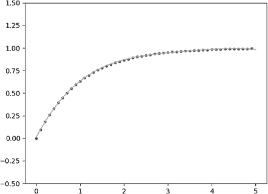

*图 10-6：计算结果（点）与多项式预测结果（线）*

有了这些结果，你现在可以在眨眼间估算任何数量文明的检测概率。Python 所需要做的，就是解一个多项式方程。

### **构建图形模型**

图形模型将是银河盘的 2D 俯视图。在此显示中绘制地球当前排放气泡的大小，可以帮助我们将银河的大小和我们在其中微小的位置放在合适的视角下。

模拟银河系的关键在于模拟螺旋臂。每个螺旋臂代表一个*对数螺旋*，这一几何特征在自然界中极为常见，因此被称为*奇迹螺旋*（*spira mirabilis*）。如果你将图 10-7 与图 10-1 进行对比，你会发现飓风的结构与银河系非常相似。飓风的眼睛甚至可以被视为一个超大质量黑洞，眼墙则代表了事件视界！

*图 10-7：飓风伊戈尔*

由于螺旋是从一个中心点或*极点*辐射出来的，你可以更轻松地使用*极坐标*来绘制它们（图 10-8）。在极坐标系中，常用的笛卡尔坐标系中的（*x*，*y*）坐标被替换为（*r*，θ），其中*r*是距离中心的距离，θ是*r*与 x 轴之间的角度。极点的坐标是（0，0）。

*图 10-8：极坐标系示例*

对数螺旋的极坐标方程为：

*r* = *ae*^(bθ)

其中*r*是距离原点的距离，θ是相对于 x 轴的角度，*e*是自然对数的底数，*a*和*b*是任意常数。

你可以使用这个公式绘制一个单独的螺旋线；然后，旋转并重新绘制螺旋线三次，来形成银河的四条臂。你将用不同大小的圆圈来构建螺旋，这些圆圈代表恒星。图 10-9 是图形模型实现的一个例子。由于模拟是随机的，每次都会略有不同，并且有多个变量可以调整以改变外观。

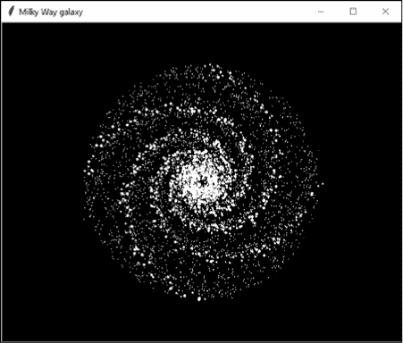

*图 10-9：使用对数螺旋模型的银河系*

我在 图 10-9 中生成的图像使用了 tkinter（发音为“tee-kay-inter”），它是用于开发 Python 桌面应用程序的默认 GUI 库。虽然 tkinter 主要用于开发 GUI 元素，如窗口、按钮、滚动条等，但它也可以生成图表、屏幕保护程序、简单的游戏等。它的优势之一是，作为标准 Python 发行版的一部分，它能够跨所有操作系统运行，并且不需要安装额外的库。它还有良好的文档和易于使用的特点。

大多数 Windows、macOS 和 Linux 机器都已预装 tkinter。如果你没有安装或者需要最新版本，可以从 *[`www.activestate.com/`](https://www.activestate.com/)* 下载并安装它。和往常一样，如果模块已经安装，你应该可以在解释器窗口中正常导入而不出现错误：

>>> import tkinter

>>>

一些入门级的 Python 书籍中会包括 tkinter 的概述，你可以在 *[`docs.python.org/3/library/tk.html`](https://docs.python.org/3/library/tk.html)* 找到官方在线文档。关于 tkinter 的一些其他参考资料可在“进一步阅读”中找到，位于 第 212 页。

#### ***缩放图形模型***

图形模型的尺度单位是每像素光年，每个像素的宽度等于一个射电气泡的直径。因此，当研究中的射电气泡直径发生变化时，尺度单位也会变化，图形模型需要重新构建。以下方程将根据气泡调整模型的尺度：

缩放盘半径 = 盘半径 / 气泡直径

其中，盘半径为 50,000，长度单位为光年。

当选择的射电气泡较小时，图形模型会“放大”，而当它较大时，模型会“缩小”（图 10-10）。

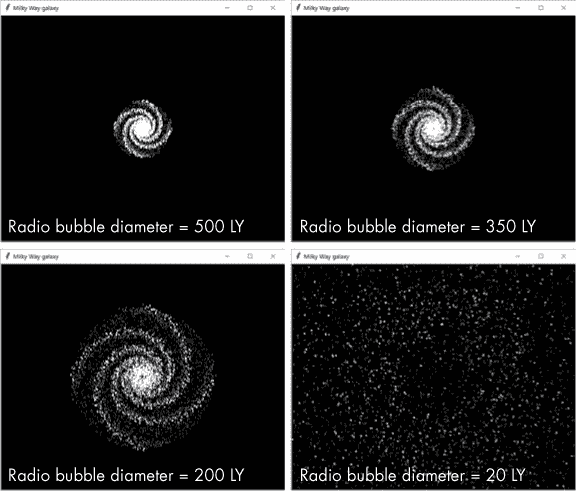

*图 10-10：射电气泡直径对银河模型外观的影响*

#### ***银河模拟器代码***

银河模拟器代码将计算任何数量的文明和电波气泡大小的检测概率，然后生成银河系的图形模型。当使用与我们当前排放气泡大小相同的气泡时，它将在大致位置标出我们的气泡，并以红色注释，标示出大致太阳系的位置。你可以从* [`www.nostarch.com/impracticalpython/`](https://www.nostarch.com/impracticalpython/)* 下载代码。

##### **输入数据和关键参数**

清单 10-3 通过导入模块并将常用的用户输入放在顶部来启动 *galaxy_simulator.py*。

*galaxy_simulator.py，* 第一部分

➊ import tkinter as tk

从 random 导入 randint、uniform、random

导入数学模块

#=============================================================================

➋ # 主要输入

# 比例（电波气泡直径，单位光年）：

➌ SCALE = 225  # 输入 225 查看地球的电波气泡

# 根据德雷克方程计算的高级文明数量：

➍ NUM_CIVS = 15600000

#=============================================================================

*清单 10-3：导入模块并分配常量*

导入 tkinter 为 tk，这样在调用 tkinter 类时就不必输入全名 ➊。如果你使用的是 Python 2，应该使用 Tkinter（注意 *T* 大写）。你还需要 random 和 math 模块。

使用注释突出显示主要的用户输入部分 ➋ 并分配两个输入。使用 SCALE 表示可以探测到的电磁气泡的直径（单位：光年），即每个文明周围的可探测电磁气泡 ➌；NUM_CIVS 是要建模的文明数量，你可以通过德雷克方程或者完全猜测来确定 ➍。

##### **设置 tkinter 画布并分配常量**

清单 10-4 中的代码实例化了一个 tkinter 窗口对象，并在其上创建一个画布，你可以在上面绘制内容。这就是银河地图或图形模型将展示的地方。它还分配了与银河系尺寸相关的常量。

*galaxy_simulator.py，* 第二部分

# 设置显示画布

➊ root = tk.Tk()

root.title("银河系")

➋ c = tk.Canvas(root, width=1000, height=800, bg='black')

➌ c.grid()

➍ c.configure(scrollregion=(-500, -400, 500, 400))

# 实际的银河系尺寸（光年）

➎ DISC_RADIUS = 50000

DISC_HEIGHT = 1000

➏ DISC_VOL = math.pi * DISC_RADIUS**2 * DISC_HEIGHT

*清单 10-4：设置* tkinter *窗口和画布并分配常量*

首先创建一个名为 root 的窗口 ➊。这个是一个*顶级*窗口，它将包含其他所有元素。在接下来的代码行中，为窗口设置一个标题——“银河系”——它将在窗口框架的左上角显示（示例见图 10-9）。

接下来，将一个组件，称为*widget*，添加到根窗口中。*Widget* 代表“Windows 小工具”。在 tkinter 中有 21 个核心小工具，包括标签、框架、单选按钮和滚动条。分配一个 Canvas 小工具来包含所有绘图对象 ➋。这是一个通用的小工具，适用于图形和其他复杂布局。指定父窗口、屏幕宽度和高度以及背景颜色。将画布命名为 c，代表*canvas*。

你可以将 Canvas 小工具划分为行和列，就像表格或电子表格一样。此网格中的每个单元格可以容纳不同的小工具，这些小工具可以跨越多个单元格。在单元格内，你可以使用 STICKY 选项对齐小工具。为了管理窗口中的每个小工具，你需要使用 grid 布局管理器。由于在这个项目中你只使用了一个小工具，所以不需要传递任何管理器给它 ➌。

最后，配置画布以使用滚动区域 ➍。这将原点坐标 (0, 0) 设置为画布的中心。你需要这个来用极坐标绘制银河的螺旋臂。如果没有它，默认的原点将是画布的左上角。

传递给配置的参数设置了画布的限制。它们应该是画布宽度和高度的一半；例如，滚动限制为 600, 500 时，画布尺寸应为 1200, 1000。这里显示的值在小型笔记本电脑上运行良好，但如果你发现需要更大的窗口，可以稍后更改它们。

接下来是跟随输入部分的银河系维度常数 ➎。你可以在函数内分配一些变量，但将它们放在全局空间可以让代码解释的流程更加合理。前两个常数是银河盘的半径和高度，来自图 10-2。最后一个常数表示盘的体积 ➏。

##### **缩放银河系并计算探测概率**

列表 10-5 定义了基于所使用的无线电气泡直径来缩放银河系尺寸的函数，并计算一个文明探测另一个文明的概率。后者的函数是应用之前描述的*probability_of_detection.py*程序所构建的多项式方程的地方。

*galaxy_simulator.py,* 第三部分

➊ def scale_galaxy():

"""根据无线电气泡大小（缩放）来缩放银河系尺寸。"""

disc_radius_scaled = round(DISC_RADIUS / SCALE)

➋ bubble_vol = 4/3 * math.pi * (SCALE / 2)**3

➌ disc_vol_scaled = DISC_VOL/bubble_vol

➍ return disc_radius_scaled, disc_vol_scaled

➎ def detect_prob(disc_vol_scaled):

"""计算银河系文明互相探测的概率。"""

➏ ratio = NUM_CIVS / disc_vol_scaled  # 文明数量与缩放后的银河体积的比率

➐ if ratio < 0.002:  # 将非常低的比率设置为概率 0

detection_prob = 0

elif ratio >= 5:  # 将高比率设置为概率 1

detection_prob = 1

➑ else:

detection_prob = -0.004757 * ratio**4 + 0.06681 * ratio**3 - 0.3605 * \

ratio**2 + 0.9215 * ratio + 0.00826

➒ return round(detection_prob, 3)

*列表 10-5：缩放银河系尺寸并计算探测概率*

定义一个名为 scale_galaxy()的函数，用于将银河系的尺寸缩放到电波气泡的大小 ➊。它将使用全局空间中的常量，因此无需传递任何参数。计算缩放后的盘面半径，然后使用球体体积公式计算电波气泡体积，并将结果赋值给 bubble_vol ➋。

接下来，将实际的盘面体积除以 bubble_vol，以得到缩放后的盘面体积 ➌。这表示可以容纳在银河系中的电波气泡“等效体积”的数量。每个气泡代表一个可能的文明位置。

通过返回 disc_radius_scaled 和 disc_vol_scaled 变量来结束函数 ➍。

现在，定义一个名为 detect_prob()的函数，用于计算探测概率，该函数以缩放后的盘面体积作为参数 ➎。对于多项式中的 x 项，计算文明数量与缩放后的盘面体积的比率 ➏。由于多项式回归在端点可能存在问题，使用条件语句将非常小的比率设置为 0，将大比率设置为 1 ➐。否则，应用由*probability_of_detection.py*代码生成的多项式表达式 ➑，然后返回保留三位小数的概率 ➒。

##### **使用极坐标**

列表 10-6 定义了一个函数，使用极坐标随机选择(*x*, *y*)位置。这个函数将选择图形模型中一些恒星的位置。由于显示是二维的，所以不需要选择*z*位置。

*galaxy_simulator.py*，第四部分

➊ 定义函数 random_polar_coordinates(disc_radius_scaled):

"""在盘面内生成均匀随机的(x, y)点，供二维显示使用。"""

➋ r = random()

➌ theta = uniform(0, 2 * math.pi)

➍ x = round(math.sqrt(r) * math.cos(theta) * disc_radius_scaled)

y = round(math.sqrt(r) * math.sin(theta) * disc_radius_scaled)

➎ 返回 x，y

*列表 10-6：定义了一个函数，用于随机选择一个具有极坐标的(*x, y*)对*

该函数以缩放后的盘面半径作为参数 ➊。使用`random()`函数从 0.0 到 1.0 之间随机选择一个浮动值，并将其赋值给变量 r ➋。接下来，从 0 到 360 度之间的均匀分布中随机选择 theta（2π是 360 度的弧度值） ➌。

生成均匀分布的点以覆盖*单位*盘面的变换是：

这些方程产生了介于-1 和 1 之间的(*x*, *y*)值。为了将结果缩放到银河盘面，将其乘以缩放后的盘面半径 ➍。通过返回 x 和 y 来结束函数 ➎。

##### **构建螺旋臂**

列表 10-7 定义了一个使用对数螺旋方程构建螺旋臂的函数。这个螺旋可能很神奇，但大部分的魔力来自于对最初的简单螺旋进行调整，逐步完善这个臂形。你可以通过变化星星的大小、随机改变它们的位置，并且为每个臂复制螺旋，轻微地向后偏移并使星星变暗，从而完成这项工作。

*galaxy_simulator.py,* 第五部分

➊ def spirals(b, r, rot_fac, fuz_fac, arm):

"""使用对数螺旋公式构建 tkinter 显示的螺旋臂。

b = 对数螺旋方程中的任意常数

r = 缩放后的银河盘半径

rot_fac = 旋转因子

fuz_fac = 星星位置在臂上的随机偏移，应用于 'fuzz' 变量

arm = 螺旋臂（0 = 主臂，1 = 尾随星星）

"""

➋ spiral_stars = []

➌ fuzz = int(0.030 * abs(r))  # 随机偏移星星位置

theta_max_degrees = 520

➍ for i in range(theta_max_degrees):  # range(0, 600, 2) 用于没有黑洞的情况

theta = math.radians(i)

x = r * math.exp(b * theta) * math.cos(theta + math.pi * rot_fac)\

+ randint(-fuzz, fuzz) * fuz_fac

y = r * math.exp(b * theta) * math.sin(theta + math.pi * rot_fac)\

+ randint(-fuzz, fuzz) * fuz_fac

spiral_stars.append((x, y))

➎ for x, y in spiral_stars:

➏ if arm == 0 and int(x % 2) == 0:

c.create_oval(x-2, y-2, x+2, y+2, fill='white', outline='')

elif arm == 0 and int(x % 2) != 0:

c.create_oval(x-1, y-1, x+1, y+1, fill='white', outline='')

➐ elif arm == 1:

c.create_oval(x, y, x, y, fill='white', outline='')

*列表 10-7: 定义了* spirals() *函数*

定义一个名为 spirals() 的函数 ➊。它的参数在函数文档字符串中列出。前两个参数 b 和 r 来自对数螺旋方程。接下来的参数 rot_fac 是旋转因子，它让你将螺旋绕中心点旋转，从而产生一个新的螺旋臂。fuz_fac 是模糊因子，它允许你微调星星相对于螺旋线中心的偏移。最后，arm 参数让你指定是主臂还是尾随的微弱星星。尾随臂会被稍微向后偏移——也就是绘制在主臂之后，并且星星会变小。

初始化一个空列表来存储将构成螺旋的星星位置 ➋。赋值一个 fuzz 变量，在其中将任意常数与缩放后的银河盘半径的绝对值相乘 ➌。仅仅使用螺旋方程会生成排成一行的星星（见图 10-11 的左侧两面板）。通过模糊处理，星星会在螺旋线上前后轻微偏移，向螺旋线的两侧移动。你可以在图 10-11 的最右面板中看到这个效果。通过反复试验，我确定了这些值；如果你愿意，可以随意调整它们。

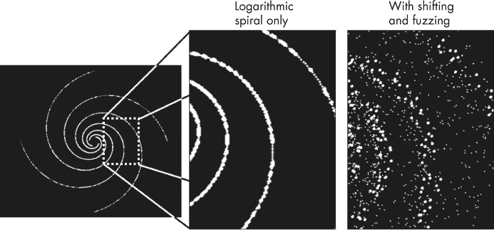

*图 10-11：通过偏移螺旋并随机改变星星位置来填充螺旋臂*

现在是时候构建螺旋线了。首先，使用一系列值来表示对数螺旋方程中的θ ➍。大约 520 的范围会产生如图 10-9 所示的银河，它有一个中央的“黑洞”。否则，使用范围（0，600，2）——或类似范围——来产生一个亮度集中、星星密集的核心（见图 10-12）。你可以调整这些值，直到获得你喜欢的效果。遍历θ值，并应用对数螺旋方程，使用余弦值作为 x 值，正弦值作为 y 值。注意，你要将模糊值乘以模糊因子并加到结果中。将每个(*x*，*y*)坐标对附加到 spiral_stars 列表中。

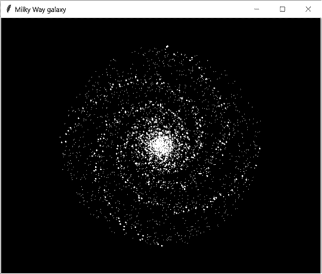

*图 10-12：没有中央黑洞的图形模型（与图 10-9 对比）*

后面，在 main()函数中，你将指定 rot_fac 变量，它将使螺旋围绕中心旋转。程序构建了四个主要的臂后，它将使用 rot_fac 来构建四个新的臂，这些臂稍微偏移于前四个臂，形成左侧的暗淡、拖尾星星带，这在图 10-11 中可见。

现在你已经得到了星星位置的列表，开始通过(*x*，*y*)坐标执行 for 循环 ➎。然后，使用条件语句来选择主要的、前导臂以及 x 值为偶数的位置 ➏。对于这些位置，使用 canvas 控件的 create_oval()方法来创建一个星星对象并显示。此方法的前四个参数定义了一个包围框，椭圆形状将适应这个框。x 和 y 后面的数字越大，椭圆也就越大。填充颜色为白色，并且不使用轮廓；默认轮廓是细黑线。

如果 x 值是奇数，星星的步长要小一些。如果臂长值为 1，星星就在偏移的臂上，所以要尽量让它变小 ➐。

**注意**

*星星对象仅用于视觉效果。它们的大小和数量并不按比例缩放。要真实的话，它们应该小得多，而且数量会多得多（超过 1000 亿颗！）。*

##### **星星散布效果**

螺旋臂之间的空间并非完全没有星星，因此接下来的函数（见代码清单 10-8）会随机地在银河模型中投射点，而不考虑螺旋臂。可以把这看作是你在远处银河照片中看到的光晕效果。

*galaxy_simulator.py,* 第六部分

➊ def star_haze(disc_radius_scaled, density):

"""在银河盘中随机分布微弱的 tkinter 星星。

disc_radius_scaled = 银河盘半径，按无线电气泡直径缩放

density = 用来变化显示星星数量的乘数

"""

➋ for i in range(0, disc_radius_scaled * density):

➌ x, y = random_polar_coordinates(disc_radius_scaled)

➍ c.create_text(x, y, fill='white', font=('Helvetica', '7'), text='.')

*代码清单 10-8：定义了* star_haze() *函数*

定义 star_haze()函数并传递两个参数：缩放后的圆盘半径和一个整数倍数，函数将用它来增加随机星星的基础数量 ➊。因此，如果你更喜欢浓雾而非轻雾，在调用主函数中的该函数时，请增加密度值。

开始一个 for 循环，其中最大范围值等于缩放后的圆盘半径乘以密度 ➋。通过使用半径值，你可以将星星的数量缩放到显示的圆盘大小。然后调用 random_polar_coordinates()函数来获取(*x*, *y*)对 ➌。

最后，使用(*x*, *y*)对 ➍ 创建一个画布显示对象。由于你已经使用最小的椭圆大小来表示沿螺旋星系分布的星星，改用 create_text()方法代替 create_oval()方法。在这个方法中，你可以用句点表示星星。字体大小参数将允许你缩放星雾星星，直到找到一个令人赏心悦目的效果。

图 10-13 是没有星雾（左）和有星雾（右）的银河模型的比较。

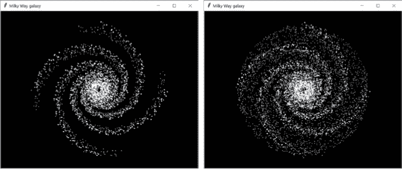

*图 10-13：没有星雾（左）与有星雾（右）的银河模型*

你可以发挥创意来设计星雾。例如，你可以增加星星的数量并将它们涂成灰色，或者使用循环来变化星星的大小和颜色。然而，不要使用绿色，因为宇宙中没有绿色的星星！

##### **定义 main()函数**

列表 10-9 定义了*galaxy_simulator.py*中的 main()函数。它将调用缩放银河、计算检测概率、构建银河图像并发布统计数据。它还将运行 tkinter 的主循环。

*galaxy_simulator.py*，第八部分

def main():

"""计算检测概率并显示银河系图像及统计数据。"""

➊ disc_radius_scaled, disc_vol_scaled = scale_galaxy()

detection_prob = detect_prob(disc_vol_scaled)

# 构建 4 个主螺旋臂和 4 个拖尾臂

➋ spirals(b=-0.3, r=disc_radius_scaled, rot_fac=2, fuz_fac=1.5, arm=0)

spirals(b=-0.3, r=disc_radius_scaled, rot_fac=1.91, fuz_fac=1.5, arm=1)

spirals(b=-0.3, r=-disc_radius_scaled, rot_fac=2, fuz_fac=1.5, arm=0)

spirals(b=-0.3, r=-disc_radius_scaled, rot_fac=-2.09, fuz_fac=1.5, arm=1)

spirals(b=-0.3, r=-disc_radius_scaled, rot_fac=0.5, fuz_fac=1.5, arm=0)

spirals(b=-0.3, r=-disc_radius_scaled, rot_fac=0.4, fuz_fac=1.5, arm=1)

spirals(b=-0.3, r=-disc_radius_scaled, rot_fac=-0.5, fuz_fac=1.5, arm=0)

spirals(b=-0.3, r=-disc_radius_scaled, rot_fac=-0.6, fuz_fac=1.5, arm=1)

star_haze(disc_radius_scaled, density=8)

# 显示图例

➌ c.create_text(-455, -360, fill='white', anchor='w',

text='一个像素 = {} 光年'.format(SCALE))

c.create_text(-455, -330, fill='white', anchor='w',

text='无线电气泡直径 = {} 光年'.format(SCALE))

c.create_text(-455, -300, fill='white', anchor='w',

text='检测到{:，}个文明的概率 = {}'。

format(NUM_CIVS, detection_prob))

# 显示地球 225 光年直径的气泡并注释

➍ 如果 SCALE == 225：

➎ c.create_rectangle(115, 75, 116, 76, fill='red', outline='')

c.create_text(118, 72, fill='red', anchor='w',

text="<---------- 地球的广播气泡")

# 运行 tkinter 循环

➏ root.mainloop()

➐ 如果 __name__ == '__main__'：

main()

*列表 10-9：定义并调用* main() *函数*

通过调用 scale_galaxy()函数来启动 main()，以获取缩放后的盘面体积和半径 ➊。然后调用 detect_prob()函数，并将 disc_vol_scaled 变量传递给它。将结果赋值给一个名为 detection_prob 的变量。

现在构建星系显示（图形模型） ➋。这会多次调用 spirals()函数，每次调用时稍作调整。arm 参数指定明亮的主臂和微弱的拖尾臂。rot_fac（旋转因子）变量决定了螺旋的绘制位置。臂 0 和臂 1 之间的旋转因子（例如，从 2 到 1.91）的微小变化是导致微弱臂稍微偏离明亮臂绘制的原因。通过调用 star_haze()函数来完成显示。同样，你可以尝试修改这些参数。

接下来，显示图例和统计数据。从比例 ➌ 和广播气泡直径开始，接着是给定文明数量的检测概率。参数包括 x 和 y 坐标、填充（文本）颜色、对齐锚点——其中左对齐用 w 代表“west”——以及文本。注意使用{:，}来插入千位分隔符。这是更新的*字符串格式方法*的一部分。你可以在*[`docs.python.org/3/library/string.html#string-formatting`](https://docs.python.org/3/library/string.html#string-formatting)* 上了解更多。

如果用户选择了 225 光年直径的广播气泡 ➍，则显示的尺度与我们自己的辐射气泡相同，因此在大约我们的太阳系位置上放置一个红色像素并进行注释 ➎。使用 tkinter 显示单个像素有多种方法。在这里，你使用 create_rectangle()方法，但也可以使用以下语句绘制一个长为一个像素的线：

c.create_line(115, 75, 116, 75, fill='red')

使用 create_rectangle()方法时，前两个参数是点(x0, y0)，对应左上角，以及(x1, y1)，即位于右下角外侧的像素位置。使用 create_line()方法时，参数则是起点和终点。默认线宽为一个像素。

通过执行 tkinter 的 mainloop()函数来结束 main()函数，该函数也称为*事件循环* ➏。这会保持根窗口一直打开，直到你关闭它。

回到全局空间，通过允许程序独立运行或作为模块在另一个程序中调用来结束程序 ➐。

最终显示效果如图 10-14 所示，展示了地球的广播气泡和一个中央黑洞。

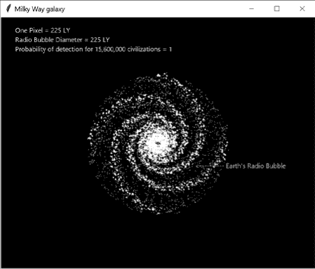

*图 10-14：最终显示，地球 225 光年直径的无线电气泡标注在银河系地图上*

请注意，尽管在这个尺度下我们的无线电气泡小得像一个针孔，如果文明的探测范围是 112.5 光年，并且如果按照当前德雷克方程的高端参数预测有那么多的文明，那么探测的概率为 1！

### **结果**

鉴于输入数据的巨大不确定性以及简化假设的使用，你不应追求准确性。在这里，你追求的是*方向性*。我们（或像我们一样的任何人）应该期待探测到没有主动联系我们的其他文明吗？根据图 10-15，可能不会。

*图 10-15：不同无线电气泡直径和银河系中不同文明数量下，一种文明探测到另一种文明的概率*

通过我们目前的技术，我们可以探测到最远 16 光年外的文明发出的信号，这相当于一个直径为 32 光年的无线电气泡。即使银河系中充满了 1560 万个先进文明，正如维基百科中更新后的德雷克方程所预测的那样，探测到 32 光年无线电气泡的机会仍然不到 4%！

再看看图 10-14，你可以开始理解我们银河系的巨大与空旷。天文学家甚至有一个词来形容它：*拉尼亚凯亚*，夏威夷语意为“不可测量的天堂”。

正如卡尔·萨根所描述的，地球只是“一粒尘埃，悬浮在阳光束中”。而最近的研究表明，使用无线电波探测文明的机会窗口比我们想象的要小得多。如果其他文明效仿我们，转向数字信号和卫星通信，那么它们的偶然无线电泄漏将至少减少四倍。我们都变得不经意地隐形，绽放大约一百年，然后逐渐消失。

鉴于这些事实，政府不再资助使用射电望远镜寻找外星智慧生命并不令人惊讶。如今，研究重点转向了光学方法，寻找外星行星大气层中的特征气体，如生命和工业活动的废弃物。

### **总结**

在本章中，你获得了使用 tkinter、matplotlib 和 NumPy 的经验。你生成了一个多项式表达式，用于合理估计探测到偶然外星无线电信号的可能性，并且使用了随时可用的 tkinter 模块，为分析添加了一个酷炫的视觉组件。

### **进一步阅读**

*我们是否孤单？外星生命发现的哲学意义*（BasicBooks, 1995）由保罗·戴维斯（Paul Davies）编著，是一本由杰出的科学家和获奖科普作家讲述的关于寻找外星生命的深思熟虑之作。

“描述螺旋星系支架结构的新公式”（《皇家天文学会月刊》，2009 年 7 月 21 日）由 Harry I. Ringermacher 和 Lawrence R. Mead 编写 (*[`arxiv.org/abs/0908.0892v1`](https://arxiv.org/abs/0908.0892v1)*) 提供了用于建模哈勃望远镜观测到的螺旋星系形状的公式。

“Tkinter 8.5 参考：Python 的 GUI” （新墨西哥科技计算机中心，2013 年）由 John W. Shipman 编写，是官方 tkinter 文档的有用补充。可以在 *[`infohost.nmt.edu/tcc/help/pubs/tkinter/tkinter.pdf`](http://infohost.nmt.edu/tcc/help/pubs/tkinter/tkinter.pdf)* 找到。

另一个有用的在线 tkinter 资源是 *[`wiki.python.org/moin/TkInter/`](https://wiki.python.org/moin/TkInter/)*。

*Tkinter GUI 应用程序开发热潮*（Packt Publishing，2013 年）由 Bhaskar Chaudhary 编写，采用项目驱动的方法教授 tkinter。

### **实践项目**

尝试这三个衍生项目。你可以在附录中找到它们，或者从 *[`www.nostarch.com/impracticalpython/`](https://www.nostarch.com/impracticalpython/)* 下载它们。

#### ***遥远的银河系***

厌倦了生活在银河系吗？谁不厌倦呢？幸运的是，天上地下不只有对数螺旋。使用 Python 和 tkinter 来为我们建造一个新家——但不一定是一个现实的家。为了获取灵感，可以访问像 Alexandre Devert 在他的 Marmakoide 博客上的文章《在圆盘和球体上分布点》(*[`blog.marmakoide.org/`](http://blog.marmakoide.org/)*)。图 10-16 中展示的示例是使用 *galaxy_practice.py* 构建的。

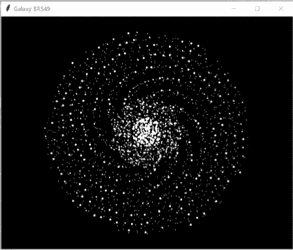

*图 10-16：由* galaxy_practice.py *程序生成的银河系*

#### ***构建银河帝国***

选择银河系中的一个位置，设定旅行速度为光速的 5% 到 10%，时间步长为 50 万年。然后模拟一个太空帝国的扩张。在每个时间步长中，计算扩展的 *殖民气泡* 的大小，并更新银河系地图。通过将家园位置放在银河系的中心，设置速度为 1，确认到达银河系边缘需要 50,000 年，来检查你的结果。

当程序运行起来时，你可以进行有趣的实验。例如，你可以测试一下，按照本章引言中提到的内容（见图 10-17），我们需要多快的速度才能在 1000 万年内探索银河系。

*图 10-17：一个核心位置帝国在超过 1000 万年的时间内，利用亚光速旅行进行扩张*

你还可以估算一下 *星际迷航* 联邦在其前 100 年里，假设他们在 Warp 4 状态下以 100 倍光速航行，能够探索银河系的多少区域（见图 10-18）。

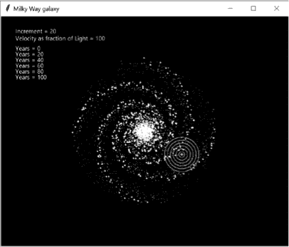

*图 10-18：星际迷航* 联邦在前 100 年内，在 4 级曲速下的扩展

这些图形是通过*empire_practice.py* 程序构建的。

#### ***预测可探测性的曲折方法***

另一种预测探测概率的方法是使用极坐标将文明分布在银河盘面上——作为 xyz 坐标点——然后将这些点四舍五入到最近的无线电气泡*半径*。共享同一位置的点代表可以相互探测到的文明。但要小心——这种方法是使用立方体而不是球体来四舍五入的，所以你需要将半径转换为能产生相同体积的立方体的边长。

编写程序，预测在银河系内随机分布的 15,600,000 个传输文明的情况下，能够探测到 16 光年*半径*气泡（我们当前技术的极限）的概率（更新自维基百科的德雷克方程输出）。在分布这些文明时，使用银河模型的完整 50,000 光年半径和 1,000 光年高度。

有关解决方案，请参见*rounded_detection_practice.py*。请注意，程序运行可能需要几分钟。

### **挑战项目**

这里有一些后续项目，供你自己尝试。记住，我不会提供挑战项目的解决方案。

#### ***创建条状螺旋星系***

随着我们获取和分析新的天文数据，我们对银河系的理解不断发展。科学家们现在认为，银河系的核心是延长的，并且呈条状。使用 Ringermacher 和 Mead 论文中提供的方程（该论文在“进一步阅读”部分的 212 页中引用）来创建一个新的 tkinter 银河系可视化模型，尊重条状螺旋的概念。

#### ***为你的银河系添加可居住区***

太阳系有*金发女孩区*，这是有利于生命发展的区域。处于这些区域的行星温暖到足以使它们的一部分水保持液态。

还有一种理论认为，像太阳系一样，星系也有*可居住区*，在这些区域中生命更有可能发展。银河系可居住区的一个定义是，其内边界大约距离银河中心 13,000 光年，外边界大约距离银河中心 33,000 光年（图 10-19）。核心区域被排除在外，因为那里有高辐射、大量超新星以及由于密集星体所带来的复杂轨道扰动引力场。边缘地区也因低金属含量而被排除，而金属含量对于行星的形成至关重要。

*图 10-19：大致的银河可居住区（阴影部分）叠加在银河系模型上*

可居住区模型的一个改进排除了螺旋臂，原因与核心区域类似。我们的存在并不与这一点相矛盾。地球位于猎户座“辐射臂”中，这是位于人马臂和英仙臂之间的一个相对较小的特征。

编辑*galaxy_simulation.py*程序，使其仅使用银河适居带中的体积，无论你如何定义它。你应该研究这些体积可能是什么，以及它们对德雷克方程计算的文明数量（*N*）的影响。考虑使用*区域*，例如核心、螺旋臂、外缘等，在这些区域内，*N*不同，但文明仍然是随机分布的。突出显示这些区域在银河地图上的位置，并发布它们的探测概率估计值。
