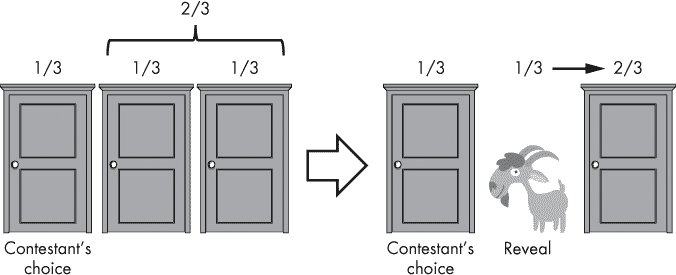
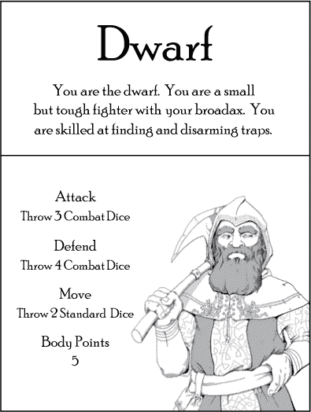
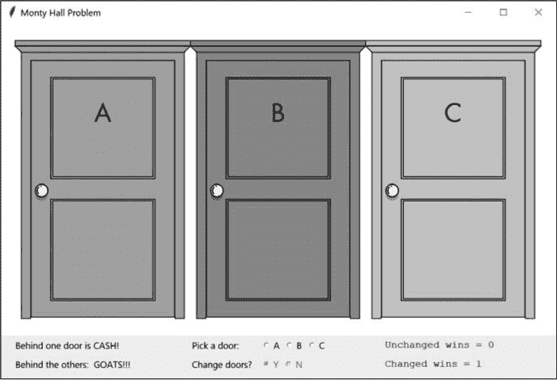
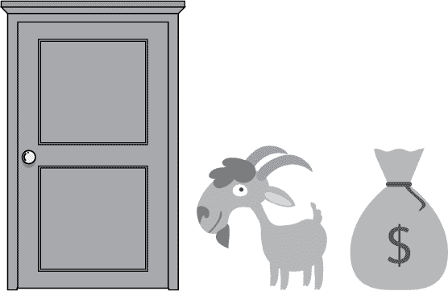
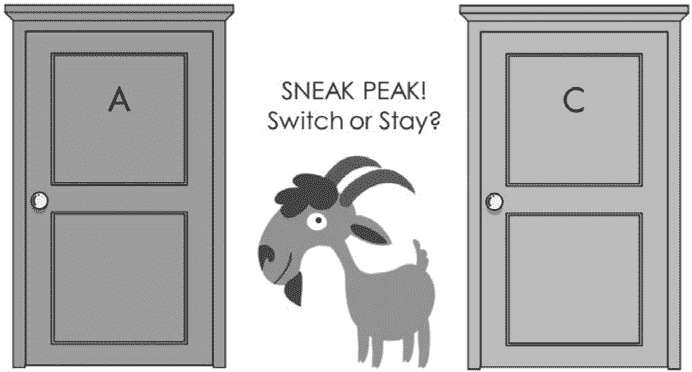

## **蒙提霍尔问题**


作为电视游戏节目《*让我们做交易*》的主持人，蒙提·霍尔会给参赛者展示三扇关闭的门，并要求他们选择其中一扇。背后有一个珍贵的奖品；另外两扇门后面是臭臭的山羊。参赛者一选择了门，蒙提就会打开剩下的其中一扇，露出一只山羊。然后，参赛者会得到最后的选择：换门还是坚持原来的选择。

在 1990 年，"世界上最聪明的女人"玛丽琳·沃斯·萨万特在她的周刊《*Parade*》杂志专栏《问玛丽琳》中表示，参赛者应该选择换门。尽管她的答案是正确的，但却引发了一场关于仇恨邮件、性别刻板印象和学术迫害的风暴。许多数学教授在这个过程中让自己尴尬，但这场丑陋事件也有光明的一面。激烈的讨论让公众接触到了统计学的科学，沃斯·萨万特提出的一个练习也进入了成千上万的课堂。这些手动测试——后来被计算机复制——都证实了她被嘲笑的“女性逻辑”是正确的。

在这一章中，你将使用*蒙特卡洛模拟（MCS）*，这是一种通过对一系列随机输入的不同结果建模来验证沃斯·萨万特是对的。之后，你将使用`tkinter`来构建一个有趣的图形界面，来响应她要求学生们帮助做实验的请求。

### **蒙特卡洛模拟**

假设你想知道掷骰子六次，每次都得到不同的面朝上的概率。如果你是数学天才，你可能会直接使用确定性公式 6! / 6⁶来计算，或者


得到 0.015。如果你不那么擅长数学，也可以通过 Python 和大量掷骰子得到相同的答案：

```py
>>> from random import randint

>>> trials = 100000

>>> success = 0

>>> for trial in range(trials):

           faces = set()

           for rolls in range(6):

               roll = randint(1, 6)

               faces.add(roll)

           if len(faces) == 6:

               success += 1

>>> print("probability of success = {}".format(success/trials))

probability of success = 0.01528
```

这个例子使用了`for`循环和`randint`函数，随机选择 1 到 6 之间的一个数字，代表骰子的一面，并重复 6 次。它将每个结果添加到名为`faces`的集合中，该集合不允许重复。集合长度达到 6 的唯一方式是每次掷骰子都会得到一个唯一的数字，这样就算作一次成功。外层的`for`循环会执行这个六次掷骰子的实验 100,000 次。成功次数与实验次数的比值就是与确定性公式相同的概率 0.015。

蒙特卡洛模拟使用*重复随机抽样*——在这个例子中，每一次掷骰子就是一次随机抽样——来预测在指定条件范围下的不同结果。在这个例子中，条件范围是一个六面骰子，每次掷骰子没有重复，进行 100,000 次试验。当然，MCS 通常应用于更复杂的问题——那些有许多变量和不确定性范围广的问题，其结果无法轻易预测。

有多种类型的 MCS，但大多数应用遵循以下基本步骤：

+   列出输入变量。

+   为每个变量提供概率分布。

+   启动循环：

    +   从每个输入的分布中随机选择一个值。

    +   使用确定性计算中的值，确定性计算是一种总是从相同输入产生相同输出的计算。

    +   重复指定的次数。

+   聚合结果并生成统计数据，例如计算的平均结果。

对于掷骰子的示例，步骤如下：

+   输入变量 = 六次掷骰子的结果。

+   投掷概率分布 = 均匀分布（每个面朝上的概率为 1/6）。

+   循环：

    +   随机选择的值 = 掷骰子结果（从分布中抽取）。

    +   计算 = 将六个值添加到一个集合中，并且如果集合的长度等于 6，则将 `success` 变量加 1。

    +   重复 = 100,000 次。

+   聚合：将 `success` 变量除以 100,0000 以计算概率。

纳西姆·塔勒布（Nassim Taleb），《黑天鹅》和《随机的愚弄》一书的广受好评作者，是 MCS 的支持者。他认为我们的大脑是为了迅速摆脱困境而设计的，而不是处理复杂的不确定性或概率问题。我们不擅长处理高度偏斜的分布和非线性，但有些人的大脑天生更能够通过 MCS 理解风险，而不是其他方法。在现实生活中，我们不会观察概率分布；我们只是观察事件。

每次 MCS 运行代表一个单一事件，例如你在退休期间是否会用完钱。对于许多人来说，MCS 使风险变得真实。它帮助我们理解事情可能变得多糟或多好——这是我们无法仅从数学抽象中得到的。通过 MCS 获得的洞察力，我们可以为防范风险和利用机遇做好准备。

为了支持蒙提霍尔问题背后的数学原理，你将使用如前面的掷骰子示例这样的 MCS 应用。然后，在第十二章中，你将使用 MCS 构建一个退休金模拟器，规划你（或你父母）的安全退休生活。

### **项目 #18：验证 vos Savant**

为了验证 vos Savant 的说法是否正确，使用蒙特卡洛方法模拟成千上万次“游戏”，以观察结果如何。这可以是一个简化的程序，因为目标只是简单地确认，没有任何附加内容。

**目标**

编写一个简单的 Python 程序，使用蒙特卡洛模拟来确定通过更改初始选择来赢得蒙提霍尔问题的概率。

#### ***策略***

蒙提霍尔问题的正确解答是在蒙提揭示了山羊后换门。从统计学角度来看，这将使你赢的机会翻倍！

查看图 11-1。在游戏开始时，所有的门都是关闭的，每个门隐藏奖品的概率是 1/3。用户只能选择一扇门，这意味着奖品隐藏在其他两扇门中的概率是 2/3。在揭示羊之后，概率仍然是 2/3，但它会转移到剩下的那扇门。记住，蒙提知道奖品在哪里隐藏，并且他永远不会揭示*那个*门。所以，留在原选择的成功概率是 1/3，而切换选择的成功概率是 2/3。



*图 11-1：蒙提霍尔问题在揭示羊之后的获胜概率*

如果你对数学计算有疑虑，你可以使用 MCS 来提供支持证据，就像我们在掷骰子示例中所做的那样。你只需随机选择一扇中奖门，随机选择一个参赛者的选择，并记录两者匹配的次数。重复这个过程数千次，你将会收敛到确定性的数学解。

#### ***Vos Savant 验证代码***

本节中描述的*monty_hall_mcs.py*程序将自动化选择门和记录结果的过程，使你能够运行数千次试验并在不到一秒钟的时间内评估它们。你可以从*[`www.nostarch.com/impracticalpython.com/`](https://www.nostarch.com/impracticalpython.com/)*下载代码。

##### **获取运行次数输入**

清单 11-1 通过询问用户他们希望模拟多少次运行（或游戏）来启动*monty_hall_mcs.py*程序。你还会为用户提供一个默认值。这是引导用户给出合理首次回应的好方法，同时也能节省他们一些按键操作。

*monty_hall_mcs.py*，第一部分

```py
➊ import random

➋ def user_prompt(prompt, default=None):
       """Allow use of default values in input."""
    ➌ prompt = '{} [{}]: '.format(prompt, default)
    ➍ response = input(prompt)
    ➎ if not response and default:
           return default
       else:
           return response

   # input number of times to run simulation
➏ num_runs = int(user_prompt("Input number of runs", "20000"))
```

*清单 11-1：导入模块并定义* user_prompt() *函数*

首先导入`random`模块以运行 MCS ➊。接下来，定义一个名为`user_prompt()`的函数，提示用户输入要运行的游戏次数，或者在提供默认值的情况下接受默认值 ➋。此函数接受两个参数；第一个是提示用户执行操作的文本，第二个是默认值，初始值为`None`。立即重新定义`prompt`变量，以便按照约定在括号中显示默认值 ➌。将用户的输入赋值给名为`response`的变量 ➍。如果用户按下 ENTER 键而没有输入任何内容，并且存在默认值，`user_prompt()`函数将返回默认值 ➎。否则，函数将返回用户的输入。使用此函数通过将返回值赋给`num_runs`变量来确定运行的次数 ➏。每次运行将代表一个参赛者进行一次游戏。

##### **运行 MCS 并显示结果**

列表 11-2 随机选择获胜的门和用户的第一次选择，然后汇总并展示统计数据。有趣的是，用户的第二次选择——是否换门——并不是获得正确答案所必需的。如果最初选择的是获胜的门，正确答案是不要换门。同样，如果最初选择和获胜的门不同，正确答案是换门。没有必要模拟参赛者可能会做什么或不做什么。

*monty_hall_mcs.py*，第二部分

```py
   # assign counters for ways to win
➊ first_choice_wins = 0
   pick_change_wins = 0
➋ doors = ['a', 'b', 'c']

   # run Monte Carlo
➌ for i in range(num_runs):
       winner = random.choice(doors)
       pick = random.choice(doors)

    ➍ if pick == winner:
           first_choice_wins += 1
       else:
           pick_change_wins += 1

➎ print("Wins with original pick = {}".format(first_choice_wins))
   print("Wins with changed pick = {}".format(pick_change_wins))
   print("Probability of winning with initial guess: {:.2f}"
         .format(first_choice_wins / num_runs))
   print("Probability of winning by switching: {:.2f}"
         .format(pick_change_wins / num_runs))

➏ input("\nPress Enter key to exit.")
```

*列表 11-2：运行蒙特卡洛模拟并展示结果*

分配两个变量来跟踪切换或不切换是否是获胜的结果 ➊。然后，创建一个列表来表示三个门 ➋。

MCS 从一个 `for` 循环开始，该循环遍历运行次数 ➌。在该循环内部，使用 `random.choice()` 从 `doors` 列表中选择获胜的门和用户的第一次选择，并将它们分配给变量。

由于这是一个二进制系统——用户切换或者不切换——你只需要一个条件，根据 `pick` 变量和 `winning` 变量的关系来增加计数器 ➍。

完成程序，展示最终结果。显示实际的计数值，以及计算出的概率 ➎。然后，让用户知道程序已经完成 ➏。

这是默认情况下 20,000 次运行的示例输出：

```py
Input number of runs [20000]:
Wins with original pick = 6628
Wins with changed pick = 13372
Probability of winning with initial guess: 0.33
Probability of winning by switching: 0.67

Press Enter key to exit.
```

有些人对计算机打印输出不感兴趣，他们需要更有说服力的东西。所以在下一个项目中，你将以更具互动性的方式重新包装代码——包括门、奖品和山羊。这样也能满足 Marilyn vos Savant 对学童参与并帮助恢复她的荣誉的呼吁。

### **项目 #19：蒙提霍尔游戏**

蒙提霍尔问题中的三扇门游戏足够简单，你可以使用 `tkinter` 构建。你在第十章中已经开始使用 `tkinter` 图形界面。现在，你将通过添加交互按钮让用户点击来进一步构建这些知识。

**目标**

使用 `tkinter` 构建的 GUI 模拟蒙提霍尔问题。跟踪切换门或保持不变是否会导致获胜。此外，在游戏进行时更新并展示这些统计数据。

#### ***面向对象编程简介***

`tkinter` 模块是使用*面向对象编程（OOP）*编写的。OOP 是一种围绕数据结构构建的语言模型，这些数据结构称为*对象*，由*数据*和*方法*以及它们之间的交互组成——与过程式编程中使用的*操作*和*逻辑*不同。对象是由*类*构建的，类就像是对象的蓝图。

OOP 是一个抽象的概念，写大型复杂程序时更容易理解。它减少了代码重复，使代码更容易更新、维护和重用。因此，现在大多数商业软件都是使用 OOP 构建的。

如果你在小程序中实现了面向对象编程（OOP），就像我们到目前为止写的那些程序，大部分程序会显得过于复杂。事实上，我最喜欢的一句名言，来自英国计算机科学家乔·阿姆斯特朗，正是关于 OOP 的这一方面：“面向对象语言的问题在于它们携带了所有这些隐式环境。你想要的是一根香蕉，但你得到的是一只拿着香蕉和整个丛林的猩猩！”

尽管如此，OOP 生成的对象非常适合图形用户界面（GUI）和游戏，甚至适用于一些小型项目。我们来看一个例子，使用类似《龙与地下城》类型的桌面游戏，在游戏中玩家可以扮演不同的角色，比如矮人、精灵和巫师。这些游戏使用角色卡来列出每个角色类型的重要信息。如果你让你的棋子代表一个矮人，它将继承卡片上的特征（见图 11-2）。



*图 11-2：角色扮演桌游中的矮人角色卡*

清单 11-3 和 11-4 再现了桌游风格的玩法，让你创建虚拟卡片，表示矮人和精灵，命名你的棋子并让它们进行战斗。战斗的结果将影响其中一个角色的*生命值*，即角色的健康状况。请务必注意，OOP 可以让你轻松创建许多相同的对象——在这种情况下，是矮人或精灵——通过从预定义的模板“打印”它们，这个模板叫做*类*。

```py
➊ >>> import random
➋ >>> class Dwarf(object):
        ➌ def __init__(self, name):
            ➍ self.name = name
               self.attack = 3
               self.defend = 4
               self.body = 5
        ➎ def talk(self):
               print("I'm a blade-man, I'll cut ya!!!")
➏ >>> lenn = Dwarf("Lenn")
   >>> print("Dwarf name = {}".format(lenn.name))
   Dwarf name = Lenn
   >>> print("Lenn's attack strength = {}".format(lenn.attack))
   Lenn's attack strength = 3
   >>>
➐ >>> lenn.talk()
   I'm a blade-man, I'll cut ya!!!
```

*清单 11-3：导入* random *模块，创建一个* Dwarf *类，并实例化一个矮人对象*

首先导入`random`模块来模拟掷骰子 ➊；这将是你角色战斗的方式。现在定义一个矮人角色的类，将类名的首字母大写，并传递一个`object`参数，这将是你的矮人名字 ➋。类是创建某种类型对象的模板。例如，当你创建一个列表或字典时，你是在从一个类创建它们。

`Dwarf`类的定义就像图 11-2 中的卡片；它基本上是一个矮人的遗传蓝图。它将分配*属性*，比如力量和活力，以及*方法*，比如角色如何移动或说话。属性是类的*实例*范围内的变量，而方法是属性，它们恰好是函数，当运行时会传递一个指向它们实例的引用。类是一种数据类型，当你创建该数据类型的对象时，它也被称为该类的一个实例。设置实例的初始值和行为的过程称为*实例化*。

接下来，定义一个*构造函数*方法，也称为*初始化*方法。它为你的对象设置初始属性值 ➌。`__init__()`方法是一个特殊的内建方法，Python 会在创建新对象时自动调用它。在这种情况下，你将传递两个参数：`self`和对象的`name`。

`self`参数是对正在创建的类实例的引用，或者是对调用方法时实例的引用，技术上称为*上下文*实例。如果你创建一个新的矮人并命名为“Steve”，那么幕后`self`将变成 Steve。例如，`self.attack`就变成了“Steve 的攻击”。如果你再创建一个名为“Sue”的矮人，那么这个对象的`self`就会变成“Sue”。这样，Steve 的生命属性的作用域就与 Sue 的分开了。

接下来，在构造函数定义下方列出一些矮人的属性 ➍。你需要一个名字，以便区分不同的矮人，还需要一些关键战斗特征的数值。注意，这个列表与图 11-2 中的卡片很相似。

定义一个`talk()`方法，并传递`self` ➎。通过传递`self`，你将方法与对象关联起来。在更复杂的游戏中，方法可能包括移动行为和解除陷阱的能力。

完成类定义后，创建一个`Dwarf`类的实例，并将该对象赋值给本地变量`lenn`，即矮人的名字 ➏。接着，打印名字和攻击属性，以证明你可以访问它们。最后，调用`talk()`方法 ➐，此时应显示一条信息。

清单 11-4 创建了一个精灵角色，采用了与清单 11-3 中相同的过程，并让它与矮人对战。精灵的`body`属性被更新，以反映战斗结果。

```py
➊ >>> class Elf(object):
           def __init__(self, name):
               self.name = name
               self.attack = 4
               self.defend = 4
               self.body = 4
   >>> esseden = Elf("Esseden")
   >>> print("Elf name = {}".format(esseden.name))
   Elf name = Esseden
   >>> print("Esseden body value = {}".format(esseden.body))
   Esseden body value = 4
   >>>
➋ >>> lenn_attack_roll = random.randrange(1, lenn.attack + 1)
   >>> print("Lenn attack roll = {}".format(lenn_attack_roll))
   Lenn attack roll = 3
➌ >>> esseden_defend_roll = random.randrange(1, esseden.defend + 1)
   >>> print("Esseden defend roll = {}".format(esseden_defend_roll))
   Esseden defend roll = 1
   >>>
➍ >>> damage = lenn_attack_roll - esseden_defend_roll
   >>> if damage > 0:
       esseden.body -= damage
➎ >>> print("Esseden body value = {}".format(esseden.body))
   Esseden body value = 2
```

*清单 11-4：创建一个* Elf *类，实例化一个精灵对象，模拟战斗，并更新对象属性*

定义一个`Elf`类，并提供一些属性 ➊。使它们与矮人的属性略有不同，并且平衡得当，像一个精灵一样。实例化一个名为`Esseden`的精灵，并使用`print`访问他的`name`和`body`属性。

让你的两个角色通过掷一个虚拟骰子来互动，骰子的最大值等于角色的攻击或防御值。使用`random`模块在 1 到 Lenn 的`attack`属性加 1 之间选择一个骰子值 ➋，然后重复此过程以获得 Esseden 的防御值 ➌。通过将 Esseden 的掷骰值从 Lenn 的掷骰值中减去 ➍，计算对 Esseden 的伤害，如果伤害为正数，则从 Esseden 的`body`属性中减去它。使用`print()`确认精灵的当前生命值 ➎。

正如你所想象的那样，构建许多相似的角色并跟踪它们不断变化的属性，在过程化编程中会变得非常复杂。面向对象编程（OOP）为你的程序提供了模块化结构，使得隐藏复杂性和作用域所有权变得简单，并且允许以小块解决问题，同时生成可以共享、修改并在其他地方使用的模板。

#### ***策略和伪代码***

现在回到我们的三门游戏。游戏的规则构成了程序的伪代码的主体：

```py
Initialize game window and show closed doors and instructions
Choose winning door at random
Get player's door choice
Reveal a door that isn't the winning door or the player's choice
Get player's choice to switch doors or not
If player switches:
    Reveal new door
    If winner:
        Record as win for switching
    Otherwise:
        Record as win for staying put
Else if player stays with first choice:
    Reveal chosen door
    If winner:
        Record as win for staying put
    Otherwise:
        Record as win for switching
Display number of wins for each strategy in game window
Reset game and close all doors
```

开始设计游戏时，首先画出游戏窗口的样子是很有用的，窗口应该包含指令、消息和按钮类型。我怀疑你不会想看到我粗糙的草图，所以不如看看图 11-3。



*图 11-3：游戏窗口在第一轮播放后的视图*

这是游戏完成后第一轮的样子，右侧显示了获胜统计信息。注意，在做出初次选择之前，更换门的单选按钮是灰色的。

#### ***游戏资源***

*游戏资源*是指构建游戏时所需要的物品。这些资源将包括一系列用于表示门、山羊和奖品的图像（见图 11-4）。



*图 11-4：* monty_hall_gui.py *程序的构建块图像*

我使用了 Microsoft PowerPoint 将 3 个基础图像合成成 10 个图像，代表游戏的所有可能状态（见图 11-5）。这是一个设计决策；通过增加几行代码，我也可以仅使用基础图像获得相同的结果。


*图 11-5：* monty_hall_gui.py *程序的合成图像*

#### ***蒙提·霍尔游戏代码***

*monty_hall_gui.py*程序将蒙提·霍尔问题转变为一个有趣且具有教育意义的游戏。你还将需要图 11-5 中显示的 10 个游戏资源。从* [`www.nostarch.com/impracticalpython/`](https://www.nostarch.com/impracticalpython/)* 下载它们，并将所有文件保存在同一文件夹中。

##### **导入模块并定义游戏类**

清单 11-5 导入模块并定义`Game`类以及初始化方法`__init__()`。

*monty_hall_gui.py,* 第一部分

```py
➊ import random
   import tkinter as tk

➋ class Game(tk.Frame):
       """GUI application for Monty Hall Problem game."""

    ➌ doors = ('a', 'b', 'c')

    ➍ def __init__(self, parent):
           """Initialize the frame."""
        ➎ super(Game, self).__init__(parent)  # parent will be the root window
        ➏ self.parent = parent
           self.img_file = 'all_closed.png'  # current image of doors
           self.choice = ''  # player's door choice
           self.winner = ''  # winning door
           self.reveal = ''  # revealed goat door
        ➐ self.first_choice_wins = 0  # counter for statistics
           self.pick_change_wins = 0  # counter for statistics
        ➑ self.create_widgets()
```

*清单 11-5：导入模块并定义* Game *类和* _ _init_ _() *方法*

首先导入`random`和`tkinter`模块 ➊。接下来，定义一个名为`Game`的类 ➋。这个类的*祖先*（在括号中显示）将是`tkinter`的`Frame`类。这意味着`Game`类是从现有的`Frame`“基础”类派生出来的，并将方便地继承它的一些有用方法。`Frame`小部件主要作为其他小部件的几何布局主控，帮助将它们组合成复杂的布局。

请注意，类有其自己的文档字符串规范，你可以在*[`www.python.org/dev/peps/pep-0257/`](https://www.python.org/dev/peps/pep-0257/)*上找到。正如在第一章中所述，为了简洁起见，本书将主要展示单行文档字符串。

每个`Game`实例都将使用相同的三个门，因此可以使用*类属性*来实现 ➌。任何在方法外部赋值的变量都会成为类属性，类似于在过程化程序中函数外部赋值的变量会成为全局变量。为了防止该属性被意外修改，可以通过使用元组使其不可变。稍后，当你想操作门时，可以从该元组创建列表。

现在，就像之前的矮人和精灵示例一样，为游戏对象定义一个初始化方法 ➍。需要一个`self`参数，但你还需要一个`parent`，它将是容纳游戏的`root`窗口。

基类也可以称为*超类*，而`super()`函数让你调用超类的方法，从而访问继承的方法——在这种情况下，来自父类的方法。首先，将`Game`传递给`super()`，这意味着你想调用`Game`的超类方法，即`Frame` ➎。然后，将`self`作为参数传递，引用新实例化的`Game`对象。`__init__(parent)`语句部分调用`Frame`的初始化方法，并将`parent`（根窗口）作为参数传递。现在，你的`Game`对象可以使用预构建的`tkinter` `Frame`类中的属性。注意，这个语句可以简化为`super().__init__()`。

接下来，给一系列实例属性赋值 ➏。最好通过`__init__()`方法初始化属性，因为这是在创建对象后第一个被调用的方法。这样，这些属性将立即对类中的其他方法可用。首先，将`parent`（即根窗口）赋给实例。然后，命名一个属性来保存图像文件之一（如图 11-5 所示），并将其赋值为显示所有门关闭的图像，这将在每局游戏开始时显示给玩家。接下来，命名属性以保存玩家选择的门、获胜的门以及用来揭示第一只山羊的门。

使用一个计数器来跟踪玩家选择第一个门时获得的胜利次数，另一个计数器来记录玩家换门后获得的胜利次数 ➐。最后，调用一个方法，创建运行游戏所需的标签、按钮和文本控件 ➑。

##### **为图像和说明创建控件**

列表 11-6 定义了`create_widgets()`方法的第一部分，该方法用于构建游戏所需的标签、按钮和文本控件。前两个控件将是`tkinter`标签，用于显示图 11-5 中的图像以及提供游戏说明。

*monty_hall_gui.py,* 第二部分

```py
    ➊ def create_widgets(self):
           """Create label, button, and text widgets for game."""
           # create label to hold image of doors
        ➋ img = tk.PhotoImage(file='all_closed.png')
        ➌ self.photo_lbl = tk.Label(self.parent, image=img,
                                     text='', borderwidth=0)
        ➍ self.photo_lbl.grid(row=0, column=0, columnspan=10, sticky='W')
        ➎ self.photo_lbl.image = img

           # create the instruction label
        ➏ instr_input = [
               ('Behind one door is CASH!', 1, 0, 5, 'W'),
               ('Behind the others:  GOATS!!!', 2, 0, 5, 'W'),
               ('Pick a door:', 1, 3, 1, 'E')
               ]
        ➐ for text, row, column, columnspan, sticky in instr_input:
               instr_lbl = tk.Label(self.parent, text=text)
               instr_lbl.grid(row=row, column=column, columnspan=columnspan,
                              sticky=sticky, ➑ipadx=30)
```

*列表 11-6：定义了一个创建小部件的方法*

定义一个方法，称为 `create_widgets()`，它以 `self` 作为参数 ➊。然后为保存门的图像分配一个属性 ➋。注意，不需要在属性名前加上 `self`，因为该属性只会在方法内部使用。`PhotoImage` 类接受图像文件名作为参数，`tkinter` 使用它在画布、标签、文本或按钮小部件中显示图像。完成此步骤后，可以在 `tkinter` 标签中使用图像，因此为 `photo_lbl` 变量分配一个值，将父窗口和图像作为参数传递，并指定没有文本和细边框 ➌。

要将标签放置到父窗口中，请使用 `grid()` 方法并将其传递到第一行和第一列，让图像跨越 10 列，并使用 `W` 进行左对齐 ➍。这样，窗口的上部分将显示关闭门的图像。`columnspan` 选项允许小部件跨越多个列。该值不会影响图像大小，但 *会* 改变放置说明文本和其他小部件的位置数量。例如，如果设置 `columnspan=2`，那么只有两列可用于放置说明、按钮和消息。

通过创建图像对象 ➎ 的引用来完成照片标签。如果不这样做，图像将无法始终显示。

根据 `tkinter` 文档，`tkinter` 是建立在另一个产品（`Tk`）之上的一个层，而这两个之间的接口没有正确处理图像对象的引用。`Tk` 小部件保存对内部对象的引用，但 `tkinter` 不会。Python 使用垃圾回收模块自动回收不再需要的对象的内存。当 Python 内存分配器的垃圾回收器丢弃 `tkinter` 对象时，`tkinter` 告诉 `Tk` 释放图像。但由于图像正在使用中，`Tk` 无法释放它，因此它会将图像设置为透明。解决该问题的建议包括使用全局变量、使用实例属性，或者像这里一样，向小部件实例添加一个属性（`photo_lbl.image = img`）。更多信息请参阅 *[`effbot.org/tkinterbook/photoimage.htm`](http://effbot.org/tkinterbook/photoimage.htm)*。

最后，将说明文本作为标签小部件添加。这个过程是提供一组参数列表，然后遍历这些参数来构建小部件。首先从一个包含元组 ➏ 的列表开始，其中每个元组包含创建 `Label` 对象的选项；你可以在下一条语句 ➐ 中看到每个元组的含义。随着 `for` 循环的进行，在 `parent` 窗口中创建每个标签，并为其分配一些文本。然后使用 `grid()` 方法将文本放置到窗口中，位置依据元组列表中的信息。

使用`ipadx`选项与`grid()` ➑。该选项指的是标签内 x 方向的内边距，因此你可以调整它以微调窗口中文本的外观。在这种情况下，你为标签添加了 30 像素，使文本在视觉上对齐。

##### **创建单选按钮和文本小部件**

Listing 11-7 通过为三个门创建单选按钮小部件，继续定义`create_widgets()`方法。玩家通过选择 A、B 或 C 单选按钮来做出初始的门选择。然后，由`win_reveal()`方法处理他们的选择，你稍后会定义这个方法。该方法将确定获胜的门并揭示一只山羊。

另一个单选按钮组被创建用来获取玩家是否选择换门。结果将由稍后定义的`show_final()`方法处理。除了揭示玩家最终选择的门背后是什么，这个方法还将使用在本列表末尾定义的`Text`小部件更新胜利统计数据。

*monty_hall_gui.py,* 第三部分

```py
          # create radio buttons for getting initial user choice
        ➊ self.door_choice = tk.StringVar()
           self.door_choice.set(None)

        ➋ a = tk.Radiobutton(self.parent, text='A', variable=self.door_choice,
                              value='a', command=self.win_reveal)
           b = tk.Radiobutton(self.parent, text='B', variable=self.door_choice,
                              value='b', command=self.win_reveal)
           c = tk.Radiobutton(self.parent, text='C', variable=self.door_choice,
                              value='c', command=self.win_reveal)

           # create widgets for changing door choice
        ➌ self.change_door = tk.StringVar()
           self.change_door.set(None)

        ➍ instr_lbl = tk.Label(self.parent, text='Change doors?')
           instr_lbl.grid(row=2, column=3, columnspan=1, sticky='E')

        ➎ self.yes = tk.Radiobutton(self.parent, state='disabled', text='Y',
                                     variable=self.change_door, value='y',
                                     command=self.show_final)
           self.no = tk.Radiobutton(self.parent, state='disabled', text='N',
                                    variable=self.change_door, value='n',
                                    command=self.show_final)

           # create text widgets for win statistics
        ➏ defaultbg = self.parent.cget('bg')
        ➐ self.unchanged_wins_txt = tk.Text(self.parent, width=20,
                                             height=1, wrap=tk.WORD,
                                             bg=defaultbg, fg='black',
                                             borderwidth=0)
           self.changed_wins_txt = tk.Text(self.parent, width=20,
                                           height=1, wrap=tk.WORD, bg=defaultbg,
                                           fg='black', borderwidth=0)
```

*Listing 11-7: 为* create_widgets() *方法构建单选按钮和文本小部件*

首先创建 A、B 和 C 门的单选按钮。当用户与`tkinter`小部件进行交互时，结果是一个*事件*。你可以使用变量来跟踪这些事件，例如，当玩家通过按下单选按钮选择一个门时。对于小部件特定的变量，`tkinter`有一个变量类。使用*string*变量类`StringVar`，并将其分配给名为`door_choice`的变量 ➊。立即使用`set()`方法将该变量的值设置为`None`。

接下来，为三个门设置按钮小部件 ➋。玩家将点击其中一个作为他们的第一个门选择。使用`Radiobutton`类，并传递父窗口、要显示的文本、你刚分配的`door_choice`变量、与门名相等的值和一个命令。该命令调用`win_reveal()`方法，你很快会定义它。请注意，方法名后面不包括括号。

对按钮 B 和 C 重复此过程。这主要是一个复制粘贴的练习，因为你只需要更改门的标识。

现在，构建切换门的单选按钮。首先创建另一个字符串变量，就像你为初始门选择所做的那样 ➌。这个变量将保存`y`或`n`，取决于选择了哪个单选按钮。

使用`Label`类构建一个说明标签 ➍。然后构建`self.yes`单选按钮 ➎。使用`Radiobutton`类，传入父窗口，将其状态设置为`disabled`。这样，窗口将在初始化时将是灰色的“是/否”按钮，玩家无法在选择一个门之前尝试更改门。文本参数是按钮的名称；使用简写 Y 表示*yes*。将控件的变量参数设置为`change_door`变量，将其值设置为`y`，然后调用`show_final()`函数。对“否”按钮重复此过程。

你需要的最后一个控件是`Text`控件，用于显示换门和不换门的计数。使用`Text`类来显示统计信息，并将文本框的颜色设置为与父窗口匹配。为此，使用`cget()`方法获取`parent`的背景色(`bg`)，然后将其赋值给一个变量 ➏。`cget()`方法返回`tkinter`选项的当前值，类型为字符串。

创建一个文本对象，用于显示坚持原选择所获得的胜利次数 ➐。你需要传递给控件父窗口、宽度和高度、如果文本超出一行时如何换行、背景色、前景色（文本颜色）以及文本框的边框宽度。注意，此时不包含任何实际文本；这些将在稍后由`show_final()`方法添加。

使用另一个文本控件来显示由于换门而赢得的次数。

##### **排列控件**

列表 11-8 通过使用`tkinter`的`Grid`几何管理器来定位游戏窗口中其余未定位的控件，从而完成了`create_widgets()`方法。

*monty_hall_gui.py,* 第四部分

```py
           # place the widgets in the frame
        ➊ a.grid(row=1, column=4, sticky='W', padx=20)
           b.grid(row=1, column=4, sticky='N', padx=20)
           c.grid(row=1, column=4, sticky='E', padx=20)
           self.yes.grid(row=2, column=4, sticky='W', padx=20)
           self.no.grid(row=2, column=4, sticky='N', padx=20)
        ➋ self.unchanged_wins_txt.grid(row=1, column=5, columnspan=5)
           self.changed_wins_txt.grid(row=2, column=5, columnspan=5)
```

*列表 11-8：调用* grid() *方法将控件定位到框架中*

使用`grid()`方法将门按钮定位到父窗口 ➊。将三个门按钮放在同一行同一列，并使用`sticky`对齐方式将它们分开：`W`表示左对齐，`N`表示居中，`E`表示右对齐。使用`padx`稍微调整按钮的位置。对剩余的按钮重复此过程，然后将胜利统计文本控件定位到窗口右侧的五列上 ➋。

##### **更新门图片**

你需要在游戏中多次开关门，因此列表 11-9 定义了一个辅助方法，根据需要更新门图片。请注意，使用面向对象编程时，不需要将文件名作为参数传递给方法。对象的所有方法可以直接访问以`self`开头的属性。

*monty_hall_gui.py,* 第五部分

```py
    ➊ def update_image(self):
           """Update current doors image."""
        ➋ img = tk.PhotoImage(file=self.img_file)
        ➌ self.photo_lbl.configure(image=img)
        ➍ self.photo_lbl.image = img
```

*列表 11-9：定义了一个方法来更新当前的门图片*

定义一个函数，名为`update_image()`，它将`self`作为参数 ➊。然后像在列表 11-6 中那样使用`PhotoImage`类 ➋。文件名*self.img_file*将在其他方法中更新。

因为你已经创建了持有门图像的标签，所以使用`configure()`方法来更改标签——在这种情况下，通过加载一张新图像 ➌。你可以使用`configure()`或`config()`方法。最后，将图像分配给一个小部件属性，以防止垃圾回收 ➍，如代码清单 11-6 所述。

##### **选择获胜的门并揭示山羊**

代码清单 11-10 定义了一个方法，选择获胜的门并揭示门，然后打开并关闭揭示的门。它还激活了“是/否”按钮，这些按钮在玩家做出第一次门选择之前是灰显的。

*monty_hall_gui.py，* 第六部分

```py
    ➊ def win_reveal(self):
           """Randomly pick winner and reveal unchosen door with goat."""
        ➋ door_list = list(self.doors)
        ➌ self.choice = self.door_choice.get()
           self.winner = random.choice(door_list)

        ➍ door_list.remove(self.winner)

        ➎ if self.choice in door_list:
               door_list.remove(self.choice)
               self.reveal = door_list[0]
           else:
               self.reveal = random.choice(door_list)

        ➏ self.img_file = ('reveal_{}.png'.format(self.reveal))
           self.update_image()

           # turn on and clear yes/no buttons
        ➐ self.yes.config(state='normal')
           self.no.config(state='normal')
           self.change_door.set(None)

           # close doors 2 seconds after opening
        ➑ self.img_file = 'all_closed.png'
           self.parent.after(2000, self.update_image)
```

*代码清单 11-10：定义一个方法来随机选择获胜的门并揭示门*

定义一个方法，叫做`win_reveal()`，该方法以`self`作为参数 ➊。立即创建一个来自类属性`doors`的门列表 ➋。你将根据玩家的第一次门选择以及程序随机选择的获胜门来修改这个列表。

现在，将`self.choice`属性赋值为`self.door_choice`字符串变量，通过`get()`方法访问 ➌。这个属性的值是用户第一次选择的门单选按钮所决定的。接下来，从门列表中随机选择获胜的门。

从门列表中移除获胜的门 ➍。然后使用条件语句检查玩家的选择是否仍在门列表中；如果是，移除它，以防被揭示 ➎。这样，列表中只会剩下一个门，因此将其分配给`self.reveal`属性。

如果玩家选择了获胜的门，那么列表中剩下两扇门，随机选择其中一扇并将其分配给`self.reveal`。然后更新该门的`self.img_file`属性 ➏，接着调用更新图片标签以显示新图像的方法。图 11-6 是门 B 的揭示图像示例。



*图 11-6：门 B 的揭示图像*

接下来，将“是”和“否”按钮的状态设置为`normal` ➐。此后，它们将不再被灰显。方法的最后，将图像文件更改为*all_closed.png*，并在 2000 毫秒后调用`self.update_image()`方法，作用于`parent`窗口 ➑。这将确保门保持开启状态不超过 2 秒钟。

##### **揭示玩家的最终选择**

代码清单 11-11 定义了一个函数的第一部分，该函数接收玩家的最终门选择并揭示门后面的内容。该函数还将跟踪更换门和坚持原选择的获胜次数。

*monty_hall_gui.py，* 第七部分

```py
    ➊ def show_final(self):
           """Reveal image behind user's final door choice & count wins."""
        ➋ door_list = list(self.doors)

        ➌ switch_doors = self.change_door.get()

        ➍ if switch_doors == 'y':
               door_list.remove(self.choice)
               door_list.remove(self.reveal)
            ➎ new_pick = door_list[0]
            ➏ if new_pick == self.winner:
                   self.img_file = 'money_{}.png'.format(new_pick)
                   self.pick_change_wins += 1
               else:
                   self.img_file = 'goat_{}.png'.format(new_pick)
                   self.first_choice_wins += 1
        ➐ elif switch_doors == 'n':
            ➑ if self.choice == self.winner:
                   self.img_file = 'money_{}.png'.format(self.choice)
                   self.first_choice_wins += 1
               else:
                   self.img_file = 'goat_{}.png'.format(self.choice)
                   self.pick_change_wins += 1

           # update door image
        ➒ self.update_image()
```

*代码清单 11-11：定义一个方法来揭示玩家的最终选择并更新胜利列表*

定义一个名为 `show_final()` 的方法，接受 `self` 作为参数 ➊。创建一个新的门列表副本 ➋，然后获取 `self.change_doors` 变量，并将其赋值给名为 `switch_doors` 的属性 ➌。这个变量将保存 `'y'` 或 `'n'`，具体取决于玩家点击了哪个单选按钮。

如果玩家选择换门 ➍，则从列表中删除他们的第一次选择和已揭示的门，并为剩下的门分配一个 `new_pick` 属性 ➎。如果这个新选择是获胜的门 ➏，则引用正确的图像并增加 `self.pick_change_wins` 计数器。否则，将图像设置为山羊并增加 `self.first_choice_wins` 计数器。

如果玩家决定不换门 ➐ 且他们的第一次选择是获胜的门 ➑，则展示钱袋并增加 `self.first_choice_``wins` 计数器。否则，展示一只山羊并增加 `self.pick_change_wins` 计数器。

最后，调用 `update_image()` 方法来更新图像 ➒。再次强调，你不需要传递新的图像文件名，因为它可以访问你在前面的代码中更改过的 `self.img_file` 属性。

##### **显示统计信息**

清单 11-12 完成了 `show_final()` 方法，通过更新游戏窗口的获胜统计、禁用是/否按钮并关闭所有的门。

*monty_hall_gui.py,* 第八部分

```py
           # update displayed statistics
        ➊ self.unchanged_wins_txt.delete(1.0, 'end')
        ➋ self.unchanged_wins_txt.insert(1.0, 'Unchanged wins = {:d}'
                                          .format(self.first_choice_wins))
           self.changed_wins_txt.delete(1.0, 'end')
           self.changed_wins_txt.insert(1.0, 'Changed wins = {:d}'
                                        .format(self.pick_change_wins))

           # turn off yes/no buttons and clear door choice buttons
        ➌ self.yes.config(state='disabled')
           self.no.config(state='disabled')
        ➍ self.door_choice.set(None)

        ➎ # close doors 2 seconds after opening
           self.img_file = 'all_closed.png'
           self.parent.after(2000, self.update_image)
```

*清单 11-12：显示获胜统计，禁用是/否按钮，并关闭所有的门*

从 `self.unchanged_wins_txt` 文本小部件 ➊ 中删除任何文本。删除从文本索引 `1.0` 开始。格式为 `line.column`，因此你指定的是文本小部件的第一行和第一列（行号从 1 开始，列号从 0 开始）。以 `'end'` 结束，这样可以确保从起始索引后面的所有文本都被删除。

接下来，使用 `insert()` 方法将 `self.first_choice_wins` 属性的值和一些描述性文本添加到文本小部件 ➋。插入从文本索引 `1.0` 开始。

对 `self.changed_wins_txt` 文本小部件重复这个过程，然后通过将其 `config` 状态设置为 `'disabled'` 来禁用是/否按钮 ➌。将 `self.door_choice` 字符串变量重置为 `None`，这样你就可以开始新的一局游戏了 ➍。

通过关闭门结束方法，正如你在 清单 11-10 中所做的 ➎。

##### **设置根窗口并运行事件循环**

清单 11-13 完成了 *monty_hall_gui.py* 程序，通过设置 `tkinter` 的 `root` 窗口、实例化游戏对象并运行 `mainloop()`。或者，这段代码可以封装在一个 `main()` 函数中。

*monty_hall_gui.py,* 第九部分

```py
   # set up root window & run event loop
➊ root = tk.Tk()
➋ root.title('Monty Hall Problem')
➌ root.geometry('1280x820')  # pics are 1280 x 720
➍ game = Game(root)
   root.mainloop()
```

*清单 11-13：设置* root *窗口，创建游戏对象，并运行* mainloop()

`Tk` 类无参数实例化 ➊。这会创建一个顶级的 `tkinter` 小部件，它将是游戏应用程序的主窗口。将其赋值给一个名为 `root` 的变量。

给窗口设置标题➋和像素大小➌。注意，图像的大小会影响几何布局，确保它们在窗口中吸引人地适配，并且在窗口下方留出足够空间显示说明和信息。

现在，创建游戏➍。将`root`窗口传递给它，它将是包含游戏的*主窗口*。这将导致新游戏被放置在`root`窗口中。

通过调用`mainloop()`方法来结束，它会在`root`上保持窗口打开，并等待处理事件。

### **总结**

在这一章中，你使用了简单的蒙特卡洛模拟来验证更换门是蒙提霍尔问题的最佳策略。然后，你使用`tkinter`构建了一个有趣的界面，允许学生通过手动测试来验证这个结论，一局一局地进行。最重要的是，你学会了如何使用面向对象编程来构建响应用户输入的交互式控件。

### **进一步阅读**

有关`tkinter`的有用参考可以在 “进一步阅读” 和第 212 页找到。

你可以在网上找到 1990 年蒙提霍尔问题争议的总结，链接为 *[`marilynvossavant.com/game-show-problem/`](http://marilynvossavant.com/game-show-problem/)*。

### **练习项目：生日悖论**

需要多少人才能确保有 50/50 的机会，两个人人会有相同的生日月和日期？根据*生日悖论*，其实不需要那么多！和蒙提霍尔问题一样，结果是反直觉的。

使用 MCS 来确定需要多少人才能达到 50%的概率。让程序打印出人数和一系列房间人数的概率。如果你发现自己查找日期格式化的方法，停下来简化一下！你可以在附录中找到解决方案，*birthday_paradox_practice.py*，或在 *[`www.nostarch.com/impracticalpython/`](https://www.nostarch.com/impracticalpython/)* 在线查找。
