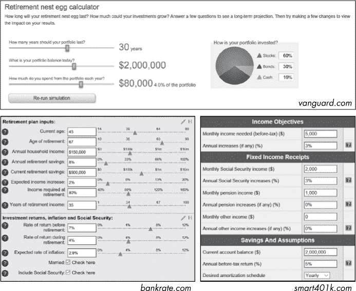
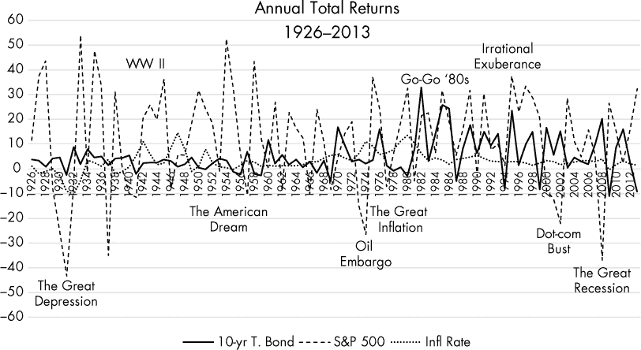
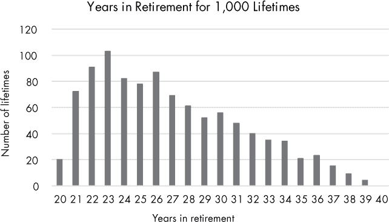
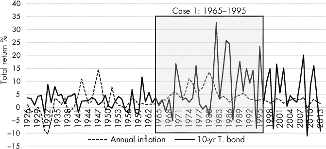

## **12

**确保你的退休基金**

婴儿潮一代是指 1946 年到 1964 年间出生的美国人。他们形成了一个庞大的群体——约占美国人口的 20%——因此对美国文化的各个方面产生了巨大的影响。金融行业迅速迎合他们的需求，这些需求几十年来一直关注投资增长。但到了 2011 年，最年长的婴儿潮一代成员已满 65 岁，并开始大量退休，退休日均达到 10,000 人！由于平均寿命比前几代人更长，婴儿潮一代的退休期可能和他们的职业生涯一样长。为期 30 到 40 年的退休资金问题既是一个大问题，也是一个大商机。

在金融顾问主要关注*增长*婴儿潮一代财富的那些年，他们依赖于简单的“4%规则”进行退休规划。简而言之，对于每一年你退休的时间，如果你每年支出的金额不超过退休第一年储蓄的 4%，你就永远不会用光资金。但正如马克·吐温所说，“所有的泛化都是错误的，包括这条！”我们投资的价值和支出的金额不断变化，往往是由于我们无法控制的外部因素。

作为 4%规则的更复杂替代方案，金融行业采用了蒙特卡洛模拟（有关 MCS 的概述请参见第十一章）。通过 MCS，你可以在数千个人生中测试和比较退休策略。目标是根据你的预期寿命，确定你每年在退休期间可以支出的金额，而不会耗尽储蓄。

MCS 相对于其他方法的优势随着不确定性来源的增加而增加。在第十一章中，你应用了 MCS 来分析具有简单概率分布的单一变量。在这里，你将关注寿命的不确定性，同时捕捉股票和债券市场以及通货膨胀的真实周期性和相互依赖性。这将帮助你评估并比较不同的策略，以实现安全和幸福的退休生活。

### **项目#20：模拟退休寿命**

如果你认为自己太年轻，不必担心退休问题，那就再想一想吧。婴儿潮一代曾有同样的想法，现在他们当中超过一半的人没有足够的退休储蓄。对大多数人来说，退休后是吃神户牛肉还是狗粮，关键在于他们开始储蓄的时间有多早。由于复利的魔力，即使是适度的储蓄，也能在几十年后积累成可观的财富。早早知道你将来需要的数额，可以帮助你设定现实的目标，为顺利过渡到黄金岁月做好准备。

**目标**

构建一个蒙特卡洛模拟，估算退休期间资金用尽的概率。将退休期间的年份视为一个关键的不确定因素，并使用历史的股票、债券和通货膨胀数据来捕捉这些变量的周期性和相互依赖性。

### **策略**

为了规划你的项目，不妨看看竞争对手。网上有许多免费的退休计算器。如果你试用这些，你会发现它们在输入参数方面有很高的可变性。

具有许多参数的计算器看起来可能更好（见图 12-1），但每增加一个细节，你就会开始深入复杂的问题，特别是在涉及美国复杂的税法时。当你预测未来 30 到 40 年的结果时，细节可能变成噪音。因此，你最好保持简洁，专注于最重要且可控的因素。你可以控制退休时间、投资资产配置、存款和支出金额，但你无法控制股市、利率和通货膨胀。

*图 12-1：三个在线退休计算器的输入面板示例*

当你无法知道问题的“正确”答案时，查看一系列情景并基于概率做出决策是最好的方法。对于涉及“致命错误”的决策，如资金耗尽，理想的解决方案是降低这种事件发生的可能性。

在开始之前，你需要了解相关术语，因此我整理了一份你在这个项目中将使用的财务术语列表：

**债券** 债券是一种债务投资，您将钱贷给一个实体——通常是政府或公司——一段固定的时间。借款方按照约定的利率（债券的*收益率*）支付利息，并在期限结束时归还贷款的全部金额，前提是发行实体没有破产或违约。债券的价值可能会随时间波动，因此如果你提前卖出债券，可能会亏损。债券对于退休人员来说具有吸引力，因为它们提供安全、稳定、可预测的回报。美国政府发行的国债被认为是最安全的。然而，不幸的是，大多数债券的回报率较低，因此它们容易受到通货膨胀的影响。

**有效税率** 这是个人或已婚夫妇所缴纳税款的平均税率。它包括地方税、州税和联邦税。税收制度可能很复杂，州和地方税率差异巨大，扣除和调整的机会很多，不同类型的收入（如短期与长期资本利得）的税率也不同。税法还是*累进的*，这意味着随着收入的增加，你所缴纳的税款也会按比例增加。根据金融服务公司 The Motley Fool 的数据，2015 年，美国普通人的总体收入税率为 29.8%。而这还不包括销售税和财产税！你还可以指望国会至少在 30 年的退休生活中对这些税率进行调整。由于这些复杂性，在这个项目中，你应该调整你的*取款*（支出）参数来考虑税务问题。

**指数** 投资于多种资产比将所有（储备）鸡蛋放在一个篮子里更安全。指数是一个假设的证券投资组合，或一组篮子，旨在代表金融市场的广泛部分。例如，标准普尔 500（S&P 500）代表美国最大的 500 家公司，其中大多数是支付股息的公司。基于指数的投资——如指数型共同基金——允许投资者便捷地购买一个包含数百家公司股票的投资产品。

**通货膨胀** 通货膨胀是由于需求增加、货币贬值、能源成本上升等因素导致价格随时间上涨。通货膨胀是财富的潜在破坏者。通货膨胀率是可变的，但自 1926 年以来平均约为 3% 年增长率。以该速度计算，货币的价值每 24 年就会减半。适度的通货膨胀（1 到 3%）通常表明经济在增长，工资在上升。较高的通货膨胀和负通货膨胀都是不受欢迎的。

**案例数量** 这些是 MCS 过程中进行的试验或运行；每个案例代表一个单独的退休生命周期，并通过一组新的随机选择的值进行模拟。对于你将要运行的模拟，50,000 到 100,000 个案例应该能够提供一个适当可重复的答案。

**破产概率** 破产概率是指在退休结束前用完资金的概率。可以通过将没有资金的案例数量除以总案例数来计算该概率。

**起始值** 起始值是退休开始时所持有的所有流动性投资的总值，包括支票账户、经纪账户、税延退休账户（IRA）等。这与*净资产*不同，净资产包括房产、汽车和法贝热蛋等资产。

**股票** 股票是一种证券，代表公司所有权，并表示对公司部分资产和收益的索赔。许多股票支付*股息*，这是一种类似于债券或银行账户支付的利息的定期支付。对于普通人来说，股票是快速增长财富的方式，但它们并非没有风险。股票价格可以在短时间内快速波动——既因为公司的业绩，也因为投资者的贪婪或恐惧引发的投机。退休人员倾向于投资于美国最大的支付股息的公司，因为它们提供定期收入，并且股票价格波动较小，风险小于小型公司。

**总回报** 总回报是资本利得（资产价值的变化，如股票价格）、利息和股息的总和，通常以年度为单位报价。

**取款** 也称为费用或支出，取款是你每年在税前所需的总收入，用以支付所有开支。对于 4%规则来说，这代表了退休第一年起始值的 4%。此数值应在之后的每一年根据通货膨胀进行调整。

#### ***历史回报很重要***

使用固定投资回报和通货膨胀值的“蛋巢模拟器”（见图 12-1）会严重扭曲现实。预测能力的好坏取决于基础假设，而回报可能会非常波动、相互依赖并且具有周期性。这种波动性对退休人员影响最大，特别是当退休开始的时刻或某个大的意外开支恰逢市场的大幅下跌时。

图 12-2 中的图表显示了美国最大公司的标准普尔 500 指数与 10 年期国债的年回报，后者是一种相对安全的中等风险固定收益投资。图表还包括了年度通货膨胀率和重大金融事件，比如大萧条。

*图 12-2：1926 年至 2013 年间，股票和债券市场的年通胀率加总回报*

财务学者对图 12-2 中趋势的长期研究，提出了一些关于美国市场的有用观察：

+   上涨的（牛市）市场通常持续的时间是下跌（熊市）市场的五倍。

+   有害的高通货膨胀率可能会持续长达十年之久。

+   债券通常提供低回报，难以跟上通货膨胀的步伐。

+   股票回报轻松超过通货膨胀，但代价是价格的大幅波动。

+   股票和债券的回报通常是反向相关的；这意味着，当股票回报上升时，债券回报会下降，反之亦然。

+   无论是大公司的股票还是国债，都无法保证你能顺利度过每一段时间。

基于这些信息，财务顾问建议大多数退休人员持有一个多元化的投资组合，其中包括多种投资类型。这种策略使用一种投资类型作为另一种投资类型的“对冲”，既能减少高点，又能提高低点，从理论上讲，降低了波动性。

在图 12-3 中，年投资回报使用标准普尔 500 指数以及一种假设的 40/50/10 比例组合来绘制，分别代表标准普尔 500 指数、10 年期国债和现金。三个月期国债是一种非常短期的债券，价格稳定且收益较低（类似于将钱塞进床垫里），代表现金。

*图 12-3：1926 年至 2013 年间，标准普尔 500 指数与标准普尔 500、10 年期国债和现金的组合的年回报*

这个多元化的投资组合提供比单纯的股市更平稳的走势，同时仍能提供通货膨胀的保护。但它显然会产生与假设回报*始终*恒定且为正的在线计算器不同的结果。

通过使用历史数据，你可以捕捉到好时光和坏时光的真实*度量*持续时间，以及最高的高点和最低的低点。你还考虑到了 4%规则完全忽视的一个因素：*黑天鹅事件*。

黑天鹅事件是具有重大影响且不太可能发生的事件。这些事件可以是好的，比如遇到你的配偶，或者是坏的，比如 1987 年 10 月的“黑色星期一”股市崩盘。MCS 的一个优势是它能够考虑这些意外事件；缺点是你需要编程处理这些事件，如果它们确实是无法预见的，那你又怎么知道该包含哪些内容呢？

已经发生的黑天鹅事件，例如大萧条，已经在历史回报列表中的年度数据中体现出来。因此，一个常见的方法是使用历史结果，并假设未来不会发生比现在更糟糕或更好的事情。当一个模拟使用大萧条时期的数据时，模拟的投资组合将经历与当时真实投资组合相同的股票、债券和通货膨胀行为。

如果使用过去的数据感觉过于局限，你可以随时编辑过去的结果，以反映更低的低点和更高的高点。但大多数人是实际的，且更愿意处理他们*知道*已经发生的事件——而不是僵尸末日或外星人入侵——因此，真实的历史结果提供了一种*可信的*方式，将现实引入财务规划。

一些经济学家认为 1980 年之前的通货膨胀和回报数据的使用价值有限，因为美联储现在在货币政策和控制通货膨胀方面扮演着更为积极的角色。另一方面，正是这种*确切*的思维方式让我们暴露于黑天鹅事件之中！

#### ***最大的不确定性***

退休规划中最大的未知数是你——或者你幸存的配偶——去世的日期，金融顾问通常称之为“计划结束”。这种不确定性影响着与退休相关的每一个决策，比如你何时退休、退休后花费多少、何时开始领取社会保障、你会留给继承人多少等等。

保险公司和政府通过*精算寿命表*来应对这种不确定性。基于一个人群的死亡率经验，精算寿命表预测在给定年龄时的预期寿命，并表示为死亡前预期的平均剩余年数。你可以在* [`www.ssa.gov/oact/STATS/table4c6.html`](https://www.ssa.gov/oact/STATS/table4c6.html) *找到社会保障表。根据这个表格，2014 年一位 60 岁的女性的预期寿命为 24.48 年；这意味着计划结束将发生在她的第 84 年。

精算表对大群体来说非常有效，但对于个人而言，它们只是一个起点。在制定个人退休计划时，你应当根据家庭历史和个人健康问题，检查一系列的数值。

为了处理模拟中的不确定性，可以将退休年数视为一个*随机变量*，其数值从频率分布中随机选择。例如，你可以输入预期退休的最可能年数、最小年数和最大年数，并利用这些数值构建三角分布。最可能的值可以参考精算表，但端点应基于你的个人健康预期和家庭历史。

一个基于退休年数三角分布的例子，针对一位 60 岁男性的结果，展示在图 12-4 中。最小退休年数设定为 20 年，最可能年数为 22 年，最大年数为 40 年。此次模拟从该分布中抽取了 1,000 次。

*图 12-4：基于 1,000 次三角分布抽样的退休年数与寿命数量的关系*

如你所见，最小值和最大值之间的每一个可能的时间间隔都可以进行模拟，但这些间隔的频率从最可能的值到最大值逐渐递减，这表明活到 100 岁是可能的，但不太可能。同时，注意到图表明显偏向高值的一侧。这将确保保守的结果，因为从财务角度来看，早逝是一个乐观的结果，而超出预期的长寿则代表着最大的财务风险。

#### ***一种定性展示结果的方法***

MCS 的一个问题是如何理解成千上万次模拟的结果，并以易于理解的方式呈现结果。大多数在线计算器通过类似图 12-5 的图表展示结果。在这个例子中，针对 10,000 次模拟，计算器将选定的几个结果绘制出来，横轴表示年龄，纵轴表示投资价值。这些曲线在左侧汇聚，代表退休时的投资起始值，在右侧结束，代表计划结束时的投资价值。还可能会展示资金在退休期间能够持续的整体概率。财务顾问认为低于 80%到 90%的概率是有风险的。

*图 12-5：典型财务行业退休模拟器的示例显示*

此类分析中最重要的信息是资金耗尽的概率。观察终点和平均结果以及输入参数的总结也很有趣。在你的 Python 模拟器中，可以像下面这样在解释器窗口打印这些结果：

投资类型：债券

起始金额：$1,000,000

每年提取金额：$40,000

退休年数（最小-最可能-最大）：17-25-40

模拟次数：20,000

资金耗尽的概率：36.1%

平均结果：$883,843

最小结果：$0

最大结果：$7,607,789

对于图形展示，区别于别人所做的重复工作，让我们找一种新的方式来呈现结果。每个案例的部分结果——即退休结束时剩余的资金——可以在条形图中作为垂直线展示，如图 12-6 所示。

*图 12-6：模拟退休期间的结果以垂直柱状图形式展示*

在这张图表中，每一条条形代表单一模拟寿命的退休部分，每个条形的高度代表该生命结束时剩余的资金。由于每个条形代表一个单独的类别，而不是连续测量的区间，因此你可以随意排列这些条形，而不会影响数据的呈现。可以将表示资金耗尽的间隙按它们在模拟中发生的顺序排列。通过解释器窗口中记录的定量统计数据，这个图表提供了一种定性的方式来展示结果。

这张图表的峰值和谷值代表许多可能未来的财富变动。在某一生中，你可能会一贫如洗；而在另一生中，你可能会是个百万富翁。这让人联想到古老的说法：“如果不是上帝的恩典，我也许就是那个命运多舛的人。”然而，从另一个角度看，它也印证了艾森豪威尔将军的观察：“计划无用，但规划不可或缺。”通过财务规划，你可以“提高”图表中的谷值，并消除或大大减少在退休中破产的概率。

要绘制此图表，你将使用 matplotlib，这是一个支持二维绘图和基本三维绘图的库。要了解更多有关 matplotlib 的信息以及如何安装它，请参阅《检测概率代码》，位于第 194 页。

### **伪代码**

根据前面的讨论，程序设计策略应聚焦于几个重要的退休参数，并使用金融市场的历史行为模拟结果。以下是高层次的伪代码：

获取用户输入的投资类型（全股票、全债券或混合型）

将投资类型选择映射到历史回报列表

获取用户输入的初始投资值

获取用户输入的初始年提款金额

获取用户输入的退休最短、最可能和最长时长

获取用户输入的案例数量

启动列表以保存结果

遍历所有案例：

对每个案例：

从回报列表中提取随机的连续样本作为持续期

从通货膨胀列表中提取相同的区间

对每个年份进行处理：

如果年份不等于年份 1：

调整提款以应对通货膨胀

从投资中扣除提款

调整投资以获得回报

如果投资 <= 0：

投资 = 0

终止

将投资值附加到结果列表中

显示输入参数

计算并显示破产的概率

计算并显示统计数据

以条形图显示一部分结果

### **查找历史数据**

你可以在许多网站上找到回报和通货膨胀信息（例如，参见“进一步阅读”在第 263 页的示例），但我已经将你所需要的信息整理为一系列可下载的文本文件。如果你选择自己编制列表，请注意，通货膨胀和回报的估算值可能会略有不同，具体取决于不同网站。

对于回报，我使用了三种投资工具：标准普尔 500 指数、10 年期国债和三个月期国库券，数据覆盖了 1926 到 2013 年（1926–1927 年国库券的数据为估算值）。我使用这些数据生成了额外的混合回报数据，涵盖了相同的时间段。以下是文件名和内容的说明：

***SP500_returns_1926-2013_pct.txt*** 标准普尔 500 指数的总回报（1926–2013）

***10-yr_TBond_returns_1926-2013_pct.txt*** 10 年期国债的总回报（1926–2013）

***3_mo_TBill_rate_1926-2013_pct.txt*** 三个月期国库券利率（1926–2013）

***S-B_blend_1926-2013_pct.txt*** 50/50 百分比混合的标准普尔 500 指数和 10 年期国债（1926–2013）

***S-B-C_blend_1926-2013_pct.txt*** 40/50/10 百分比混合的标准普尔 500 指数、10 年期国债和三个月期国库券（1926–2013）

***annual_infl_rate_1926-2013_pct.txt*** 美国年均通货膨胀率（1926–2013）

以下是标准普尔 500 指数文本文件的前七行示例：

11.6

37.5

43.8

-8.3

-25.1

-43.8

-8.6

这些值是百分比，但在代码中加载时你需要将它们转换为小数值。请注意，年份没有包含在内，因为这些值是按时间顺序排列的。如果所有文件涵盖相同的时间段，实际的年份并不重要，但为了便于记账，你应在文件名中包含年份。

### **代码**

将你的退休储蓄模拟器命名为 *nest_egg_mcs.py*。你将需要在“查找历史数据”中描述的文本文件，位于第 249 页。从 *[`www.nostarch.com/impracticalpython/`](https://www.nostarch.com/impracticalpython/)* 下载这些文件，并将它们保存在与 *nest_egg_mcs.py* 相同的文件夹中。

#### ***导入模块并定义函数以加载数据并获取用户输入***

列表 12-1 导入模块并定义一个函数，用于读取历史回报和通货膨胀数据，以及另一个函数用于获取用户输入。在程序启动后，您可以自由修改或添加历史数据以进行实验。

*nest_egg_mcs.py*，第一部分

导入 sys

导入随机库

➊ 导入 matplotlib.pyplot 作为 plt

➋ 定义 read_to_list 函数（file_name）:

"""打开一个百分比数据文件，将其转换为小数并返回列表。"""

➌ 使用 open(file_name) 作为 in_file:

➍ lines = [float(line.strip()) for line in in_file]

➎ decimal = [round(line / 100, 5) for line in lines]

➏ 返回小数

➐ 定义默认输入函数（prompt, default=None）:

"""允许在输入中使用默认值。"""

➑     prompt = '{} [{}]: '.format(prompt, default)

➒     response = input(prompt)

➓     if not response and default:

return default

else:

return response

*列表 12-1：导入模块并定义函数以加载数据并获取用户输入*

导入语句应该都很熟悉。需要使用 matplotlib 库来构建结果的柱状图。你只需要导入图形功能，如导入语句中所指定的 ➊。

接下来，定义一个名为 read_to_list() 的函数来加载数据文件并处理其内容 ➋。你将传递文件名作为参数。

使用 with 打开文件，这样会自动关闭文件 ➌，然后使用列表推导式构建文件内容的列表 ➍。立即将列表项（以百分比形式）转换为五位小数的十进制值 ➎。历史回报通常最多以两位小数表示，因此四舍五入到五位小数应该足够。你可能会注意到一些数据文件中的值更精确，但那只是经过 Excel 预处理后的结果。最后返回十进制列表 ➏。

现在，定义一个名为 default_input() 的函数来获取用户输入 ➐。该函数接受提示和默认值作为参数。在调用该函数时，会指定提示和默认值，并且程序会在括号中显示默认值 ➑。将响应变量赋值为用户的输入 ➒。如果用户未输入任何内容且存在默认值，则返回默认值；否则，返回用户的响应 ➓。

#### ***获取用户输入***

列表 12-2 加载数据文件，使用字典将结果列表映射为简单名称，并获取用户输入。字典将用于向用户提供多个投资类型的选择。总体来说，用户输入包括：

+   要使用的投资类型（股票、债券或两者的组合）

+   他们退休储蓄的起始金额

+   每年提取或支出的金额

+   他们预期退休后生活的最小、最可能和最大年数

+   要运行的案例数量

*nest_egg_mcs.py,* 第二部分

# 使用原始数据加载数据文件，数据以百分比形式表示

➊ print("\n 注意：输入数据应以百分比表示，而非小数！\n")

try:

bonds = read_to_list('10-yr_TBond_returns_1926-2013_pct.txt')

stocks = read_to_list('SP500_returns_1926-2013_pct.txt')

blend_40_50_10 = read_to_list('S-B-C_blend_1926-2013_pct.txt')

blend_50_50 = read_to_list('S-B_blend_1926-2013_pct.txt')

infl_rate = read_to_list('annual_infl_rate_1926-2013_pct.txt')

except IOError as e:

print("{}. \n 程序终止。".format(e), file=sys.stderr)

sys.exit(1)

# 获取用户输入；使用字典作为投资类型参数

➋ investment_type_args = {'bonds': bonds, 'stocks': stocks,

'sb_blend': blend_50_50, 'sbc_blend': blend_40_50_10}

➌ # 为用户打印输入说明

print("   stocks = SP500")

print("    bonds = 10 年期国债")

print(" sb_blend = 50% SP500/50% TBond")

print("sbc_blend = 40% SP500/50% TBond/10% Cash\n")

print("按 ENTER 键接受显示在[括号]中的默认值。\n")

# 获取用户输入

➍ invest_type = default_input("请输入投资类型：（stocks, bonds, sb_blend，"\

" sbc_blend)：\n", 'bonds').lower()

➎ while invest_type not in investment_type_args:

invest_type = input("无效投资类型。请输入投资类型 " \

"如提示中列出：")

start_value = default_input("输入投资的起始金额：\n", \

'2000000')

➏ while not start_value.isdigit():

start_value = input("无效输入！仅输入整数：")

➐ withdrawal = default_input("输入年度税前取款金额" \

"（今天的$）：\n", '80000')

while not withdrawal.isdigit():

withdrawal = input("无效输入！仅输入整数：")

min_years = default_input("输入退休的最小年数：\n", '18')

while not min_years.isdigit():

min_years = input("无效输入！仅输入整数：")

most_likely_years = default_input("输入退休时最可能的年数：\n",

'25')

while not most_likely_years.isdigit():

most_likely_years = input("无效输入！仅输入整数：")

max_years = default_input("输入退休的最大年数：\n", '40')

while not max_years.isdigit():

max_years = input("无效输入！仅输入整数：")

num_cases = default_input("输入运行案例的数量：\n", '50000')

while not num_cases.isdigit():

num_cases = input("无效输入！仅输入整数：")

*清单 12-2：加载数据，将选择映射到列表，并获取用户输入*

在打印警告提示输入数据应以百分比形式给出后，使用 read_to_list() 函数加载六个数据文件 ➊。使用 try 打开文件以捕获与缺失文件或文件名错误相关的异常。然后使用 except 块处理这些异常。如果你需要复习 try 和 except，请参考 “Handling Exceptions When Opening Files” 第 21 页中的内容。

用户将有选择不同投资工具进行测试的机会。为了让他们输入简单的名称，使用字典将这些名称映射到你刚刚加载的数据列表 ➋。稍后，你将把这个字典及其键作为参数传递给一个函数：montecarlo(investment_type_args[invest_type])。在请求输入之前，先打印一个图例帮助用户 ➌。

接下来，获取用户的投资选择 ➍。使用 default_input() 函数列出可选的投资类型，这些类型会映射回数据列表。将默认值设置为 'bonds'，以便查看这个所谓的“安全”选择的表现。一定要加上 .lower() 方法，以防用户不小心输入了大写字母。对于其他可能的输入错误，使用 while 循环检查输入是否与 investment_type_args 字典中的名称匹配；如果未找到匹配项，提示用户输入正确的答案 ➎。

继续收集输入，并使用默认值引导用户合理输入。例如，$80,000 是 $2,000,000 启动值的 4%；另外，对于 60 岁开始退休的女性，25 年是一个较好的最可能值，最大值设为 40 年可让她们活到 100 岁，而 50,000 个案例应该能快速得出破产概率的良好估计。

对于数值输入，使用 while 循环检查输入是否为数字，以防用户在数字中加入美元符号（$）或逗号 ➏。对于提款金额，使用提示引导用户，告知他们输入的是*今天*的金额，而不必担心通货膨胀 ➐。

#### ***检查其他错误输入***

清单 12-3 检查是否存在其他输入错误。退休的最小、最可能和最大年数应该是合乎逻辑的，并且强制规定最大年数为 99 年。允许较长的退休时间可以让乐观的用户评估医学科学在抗衰老治疗方面取得重大进展的情况！

*nest_egg_mcs.py,* 第三部分

# 检查其他错误输入

➊ if not int(min_years) < int(most_likely_years) < int(max_years) \

或者 int(max_years) > 99:

➋ print("\n 输入年数有问题。", file=sys.stderr)

print("要求最小 < 最可能 < 最大，并且最大年数 <= 99。", file=sys.stderr)

sys.exit(1)

*清单 12-3：检查退休年数输入中的错误并设置限制*

使用条件判断确保最小年数输入小于最可能年数，最可能年数小于最大年数，并且最大年数不超过 99 ➊。如果遇到问题，提示用户 ➋，提供一些澄清说明，并退出程序。

#### ***定义蒙特卡罗引擎***

清单 12-4 定义了运行蒙特卡罗模拟的函数的第一部分。程序使用循环运行每个案例，并且退休年数的输入将用于抽取历史数据。对于回报和通货膨胀列表，程序随机选择一个起始年份或索引。退休年数，将其分配给一个持续时间变量，是从用户输入的三角分布中抽取的。如果选择了 30 年，那么 30 年会被加到这个起始索引上，创建结束索引。随机的起始年将决定退休者未来一生的财务命运！正如人们所说，时机就是一切。

*nest_egg_mcs.py,* 第四部分

➊ def montecarlo(returns):

"""运行蒙特卡罗模拟并返回计划结束时的投资值和破产计数。"""

➋ case_count = 0

bankrupt_count = 0

outcome = []

➌ while case_count < int(num_cases):

investments = int(start_value)

➍ start_year = random.randrange(0, len(returns))

➎ duration = int(random.triangular(int(min_years), int(max_years),

int(most_likely_years)))

➏ end_year = start_year + duration

➐ lifespan = [i for i in range(start_year, end_year)]

bankrupt = 'no'

# 为每个案例构建临时列表

➑ lifespan_returns = []

lifespan_infl = []

for i in lifespan:

➒ lifespan_returns.append(returns[i % len(returns)])

lifespan_infl.append(infl_rate[i % len(infl_rate)])

*列表 12-4：定义蒙特卡罗函数并开始循环遍历各个案例*

`montecarlo()` 函数将回报列表作为参数 ➊。第一步是启动一个计数器，用来跟踪当前正在运行的是哪个案例 ➋。记住，你不需要使用实际的日期；列表中的第一年是索引 0，而不是 1926 年。此外，启动一个计数器来记录提前用尽资金的案例数。然后，启动一个空列表，用来保存每次运行的结果，也就是每次运行结束时剩余的金额。

开始运行将遍历各个案例的 `while` 循环 ➌。为开始投资值指定一个新的变量 `investments`，该值由用户指定。由于 `investments` 变量会不断变化，因此你需要保留原始输入变量以在每个案例中重新初始化。而且，由于所有用户输入的值都是字符串类型，你需要在使用它们之前将这些值转换为整数。

接下来，指定一个 `start_year` 变量，并从可用年份范围中随机选择一个值 ➍。为了获得模拟寿命中的退休时间，使用 `random` 模块的 `triangular()` 方法从一个由用户的 `min_years`、`most_likely_years` 和 `max_years` 输入定义的三角分布中抽取数据 ➎。根据文档，`triangular()` 会返回一个随机的浮动值 *N*，使得低值 <= *N* <= 高值，并且模式位于这两个边界之间。

将这个持续时间变量加到 `start_year` 变量上，并将结果赋值给 `end_year` 变量 ➏。现在，创建一个新的列表，命名为 `lifespan`，该列表包含从起始年份到结束年份之间的所有索引 ➐。这些索引将用来将退休期与历史数据匹配。接下来，将 `bankrupt` 变量赋值为 'no'。`bankrupt` 意味着你已用尽资金，稍后此结果将通过 `break` 语句提前结束 `while` 循环。

使用两个列表来存储所选寿命 ➑ 的适用回报和通货膨胀数据。使用 `for` 循环填充这些列表，循环使用寿命中的每个项目作为回报和通货膨胀列表的索引。如果寿命索引相对于其他列表超出范围，则使用模运算符（%）来包装索引 ➒。

让我们稍微补充一些关于这个列表的背景信息。随机选择的 start_year 变量和计算得到的 end_year 变量决定了回报和通货膨胀列表的采样方式。该样本是一段连续的金融历史，并构成一个案例。随机选择一个*区间*将这个程序与选择单独*年份*的在线计算器区分开来，后者可能会为每个资产类别和通货膨胀使用*不同的年份*！市场结果不是纯粹的混乱；牛市和熊市是周期性的，通货膨胀趋势也是如此。导致股票下跌的同样事件也会影响债券价格和通货膨胀率。随机选择年份忽略了这种相互依赖性，扰乱了已知的行为，导致不现实的结果。

在图 12-7 中，退休人员（案例 1）选择在 1965 年退休——即大通货膨胀的开始——并投资于债券。由于结束年份发生在回报列表的结束之前，退休时间段恰好适合这个列表。回报和通货膨胀在相同的区间内被采样。

*图 12-7：债券和通货膨胀列表的图示，标注了 1965 年开始的退休情况*

在图 12-8 中，退休人员或案例 2 选择在 2000 年退休。由于列表在 2013 年结束，MCS 函数所取的 30 年样本必须“环绕”并覆盖 1926 年到 1941 年的年份。这迫使退休人员经历两次衰退和一次大萧条。

*图 12-8：债券和通货膨胀列表的图示，标注了案例 2 中使用的区间*

程序需要模拟你在案例 2 中看到的环绕区间——因此使用模运算符，它允许你将列表视为无限循环。

#### ***模拟案例中的每一年***

列表 12-5 继续执行 montecarlo() 函数，并循环通过给定案例的每一年退休期间，根据该年份的回报增加或减少投资值，从投资中减去调整过通货膨胀的取款金额，并检查投资是否已耗尽。程序将最终的投资值——表示死亡时剩余的储蓄——保存到一个列表中，以便在最后计算整体的破产概率。

*nest_egg_mcs.py,* 第五部分

# 对每个案例运行的退休每一年进行循环

➊ 对于 index, i 在 enumerate(lifespan_returns) 中：

➋ infl = lifespan_infl[index]

➌ # 第一年的通货膨胀不调整

如果 index == 0：

withdraw_infl_adj = int(withdrawal)

else:

withdraw_infl_adj = int(withdraw_infl_adj * (1 + infl))

➍ investments -= withdraw_infl_adj

investments = int(investments * (1 + i))

➎ 如果投资 <= 0：

bankrupt = 'yes'

break

➏ 如果 bankrupt == 'yes'：

outcome.append(0)

bankrupt_count += 1

else:

outcome.append(investments)

➐ case_count += 1

➑ 返回 outcome, bankrupt_count

*清单 12-5: 模拟退休期间每一年的结果（每种情况）*

开始一个 for 循环，遍历每种情况中的所有年份 ➊。对 returns 列表使用 enumerate()，并使用 enumerate() 生成的索引从 inflation 列表中获取该年的平均通胀值 ➋。使用条件语句在第一年之后开始应用通胀 ➌。这将根据你是否处于通货膨胀或通货紧缩时期，逐渐增加或减少提款金额。

从调整过通胀的提款金额中减去投资金额，然后根据该年的回报调整投资金额 ➍。检查投资金额是否大于 0。如果不是，则将 bankrupt 变量设为“是”并结束循环 ➎。对于破产情况，向 outcome 列表中追加 0 ➏。否则，循环继续直到退休年限结束，因此将投资的剩余金额追加到 outcome 中。

一个人的生命刚刚结束：30 到 40 年的假期、孙子、宾果游戏和疾病都在不到一秒钟的时间里消失。因此，在进入下一个生命周期之前，先将案例计数器推进 ➐。通过返回 outcome 和 bankrupt_count 变量来结束函数 ➑。

#### ***计算破产概率***

清单 12-6 定义了一个计算破产概率的函数，也被称为“破产概率”。如果你比较厌恶风险或想要留下相当大的一笔遗产给你的继承人，你可能希望这个数字小于 10%。而那些风险偏好较高的人，可能会接受高达 20% 或更多的概率。毕竟，你不能把它带走！

*nest_egg_mcs.py，* 第六部分

➊ def bankrupt_prob(outcome, bankrupt_count):

"""计算并返回破产的机会及其他统计数据。"""

➋ total = len(outcome)

➌ odds = round(100 * bankrupt_count / total, 1)

➍ print("\n 投资类型: {}".format(invest_type))

print("起始值: ${:,}".format(int(start_value)))

print("年提款金额: ${:,}".format(int(withdrawal)))

print("退休年份（最小-最可能-最大）：{}-{}-{}"

.format(min_years, most_likely_years, max_years))

print("运行次数: {:,}\n".format(len(outcome)))

print("破产概率: {}%\n".format(odds))

print("平均结果: ${:,}".format(int(sum(outcome) / total)))

print("最小结果: ${:,}".format(min(i for i in outcome)))

print("最大结果: ${:,}".format(max(i for i in outcome)))

➎ return odds

*清单 12-6: 计算并显示“破产概率”及其他统计数据*

定义一个名为 bankrupt_prob() 的函数，接受从 montecarlo() 函数返回的 outcome 列表和 bankrupt_count 变量作为参数 ➊。将 outcome 列表的长度赋值给一个名为 total 的变量 ➋。然后，通过将破产案例数除以总案例数 ➌，计算破产概率并将其四舍五入到小数点后一位。

现在，显示输入参数和模拟结果 ➍。你在“定性方式呈现结果”一节中看到过这种文本输出示例，见第 246 页。最后返回 odds 变量 ➎。

#### ***定义并调用 main() 函数***

示例 12-7 定义了 main() 函数，调用 montecarlo() 和 bankrupt_count() 函数并创建柱状图显示。各种案例的结果可能有很大差异——有时你破产了，有时你成了百万富翁！如果打印的统计数据没有清楚地说明这一点，柱状图肯定能显示出来。

*nest_egg_mcs.py,* 第七部分

➊ def main():

"""调用 MCS 和 bankrupt 函数并绘制结果的柱状图。"""

➋ outcome, bankrupt_count = montecarlo(investment_type_args[invest_type])

odds = bankrupt_prob(outcome, bankrupt_count)

➌ plotdata = outcome[:3000]  # 仅绘制前 3000 次运行

➍ plt.figure('按案例结果（显示前{}次运行）'.format(len(plotdata)),

figsize=(16, 5))  # 大小是宽度，高度单位为英寸

➎ index = [i + 1 for i in range(len(plotdata))]

➏ plt.bar(index, plotdata, color='black')

plt.xlabel('模拟生命数', fontsize=18)

plt.ylabel('$ 剩余', fontsize=18)

➐ plt.ticklabel_format(style='plain', axis='y')

➑ ax = plt.gca()

ax.get_yaxis().set_major_formatter(plt.FuncFormatter(lambda x, loc: "{:,}"

.format(int(x))))

plt.title('资金耗尽的概率 = {}%'.format(odds),

fontsize=20, color='red')

➒ plt.show()

# 运行程序

➓ if __name__ == '__main__':

main()

*示例 12-7: 定义并调用 main() 函数*

定义一个不需要参数的 main() 函数 ➊，并立即调用 montecarlo() 函数来获取 outcome 列表和 bankrupt_count() 函数 ➋。使用你在示例 12-2 中创建的投资名称到回报列表的字典映射。你传递给 montecarlo() 函数的参数是字典名称 investment_type_args，并以用户输入的 invest_type 作为键。将返回的值传递给 bankrupt_prob() 函数以获取资金耗尽的概率。

将新变量 plotdata 指定为 outcome 列表中的前 3,000 项 ➌。柱状图可以容纳更多项，但显示它们会很慢且不必要。由于结果是随机的，通过显示更多的案例，你不会获得太多额外的信息。

现在你将使用 matplotlib 创建并显示柱状图。从创建一个绘图窗口 ➍ 开始。文本条目将作为新窗口的标题。figsize 参数是窗口的宽度和高度，以英寸为单位。你可以通过添加每英寸点数（dpi）参数来调整大小，例如 dpi=200。

接下来，使用列表推导式根据 plotdata 列表的长度，构建索引，从第 1 年开始 ➎。每个垂直条形的 x 轴位置将由索引定义，每个条形的高度将是对应的 plotdata 项，表示每个模拟生命结束时剩余的钱。将这些传递给 plt.bar()方法，并将条形的颜色设置为黑色 ➏。请注意，条形还有其他显示选项，例如改变条形轮廓的颜色（edgecolor='black'）或其厚度（linewidth=0）。

为 x 轴和 y 轴提供标签，并将字体大小设置为 18。结果可以达到百万级别，默认情况下，matplotlib 在标注 y 轴时会使用科学计数法。为了覆盖这个设置，可以调用 ticklabel_format()方法，将 y 轴的样式设置为'plain' ➐。这样可以处理科学计数法，但没有千位分隔符，使得数字难以阅读。为了解决这个问题，首先使用 plt.gca()获取当前坐标轴 ➑。然后，在下一行中，获取 y 轴并使用 set_major_formatter()和 Func_Formatter()方法，以及一个 lambda 函数，应用 Python 的字符串格式化技术来添加逗号分隔符。

对于图表的标题，使用引人注目的红色大字体显示用以表达资金耗尽概率的变量——odds。然后，用 plt.show() ➒将图表绘制到屏幕上。在全局空间中，最后编写允许程序作为模块导入或以独立模式运行的代码 ➓。

### **使用模拟器**

*nest_egg_mcs.py*程序大大简化了退休规划的复杂世界，但不要因此而对它有所偏见。简单的模型通过挑战假设、提高意识并聚焦问题，创造了价值。在退休规划或任何复杂问题中，很容易陷入细节，所以最好从了解大致情况开始。

让我们通过一个假设的例子来工作，假设初始值为$2,000,000，采用“安全可靠”的债券投资组合，4%的提款率（即每年$80,000），退休年限为 29-30-31 年，模拟 50,000 个案例。如果运行这个场景，结果应该和图 12-9 类似。你几乎每次都要耗尽资金！由于相对较低的收益率，债券无法跟上通货膨胀的步伐——记住，你不能盲目地应用 4%规则，因为你的资产配置很重要。

*图 12-9：使用* matplotlib *制作的条形图，表示一个仅包含债券的投资组合的蒙特卡洛模拟*

请注意，$80,000 的提款是*税前*的。假设有效税率为 25%，这将导致净收入仅为 $60,000。根据皮尤研究中心的数据，美国中产阶级的中位数可支配（税后）收入目前为 $60,884，因此，尽管你是百万富翁，但并不算是高枕无忧。如果你想要 $80,000 的*可支配*收入，你必须除以 1 减去有效税率；在这种情况下，即 $80,000 / (1 – 0.25) = $106,667。为了做到这一点，你需要每年提取超过 5% 的金额，而破产的概率根据投资类型的不同，可能在 20% 到 70% 之间！

表 12-1 记录了变化资产类型和提款率的前述情境的结果。被广泛认为安全的结果以灰色标示。如果你避免使用全债券投资组合，那么 4% 法则的效果很好。超过 4% 时，股票的增长潜力提供了最好的机会——在考虑的选项中——减少破产的概率，而且风险比大多数人认为的要小。这就是为什么理财顾问建议在退休投资组合中包含一定比例的股票。

**表 12-1：** 30 年退休期内，按资产类型和提款率的破产概率

| **资产类型** | **年度（税前）提款百分比** |
| --- | --- |
|  | **3%** | **4%** | **5%** | **6%** |
| --- | --- | --- | --- | --- |
| 10 年期国债 | 0.135 | 0.479 | 0.650 | 0.876 |
| 标普 500 股票 | 0 | 0.069 | 0.216 | 0.365 |
| 50/50 混合 | 0 | 0.079 | 0.264 | 0.466 |
| 40/50/10 混合 | 0 | 0.089 | 0.361 | 0.591 |

理财顾问还建议在退休初期不要过度支出。为大家庭安排几次邮轮旅行，购买豪华新房，或开始一个昂贵的新爱好，可能会在你后期生活中导致破产。为了研究这一点，复制 *nest_egg_mcs.py* 并将副本命名为 *nest_egg_mcs_1st_5yrs.py*；按照 清单 12-8、12-9 和 12-10 中描述的方式调整代码：

*nest_egg_mcs_1st_5yrs.py*，第一部分

start_value = default_input("输入投资的初始金额：\n"，\

'2000000')

while not start_value.isdigit():

start_value = input("无效输入！请输入整数：")

➊ withdrawal_1 = default_input("输入年度税前提款金额（单位：") \

"前 5 年（今天的$）：\n"，'100000')

while not withdrawal_1.isdigit():

withdrawal_1 = input("无效输入！请输入整数：")

➋ withdrawal_2 = default_input("输入年度税前提款金额（单位：") \

"其余部分（今天的$）：\n"，'80000')

while not withdrawal_2.isdigit():

withdrawal_2 = input("无效输入！请输入整数：")

min_years = default_input("输入退休最少年数：\n"，'18')

*清单 12-8：将用户的提款输入分为两部分*

在用户输入部分，将原来的取款变量替换为两个取款变量，并编辑提示信息，请求在前五年取款（➊）和剩余退休期间取款（➋）。设置默认值以表明用户应该预期前五年取款较高。包括验证用户输入的 while 循环。

在 montecarlo()函数中，更改调整取款金额以适应通货膨胀的代码。

*nest_egg_mcs_1st_5yrs.py，* 第二部分

# 第一年的取款不调整通货膨胀

如果 index == 0：

➊ withdraw_infl_adj_1 = int(withdrawal_1)

➋ withdraw_infl_adj_2 = int(withdrawal_2)

否则：

➌ withdraw_infl_adj_1 = int(withdraw_infl_adj_1 * (1 + infl))

➍ withdraw_infl_adj_2 = int(withdraw_infl_adj_2 * (1 + infl))

➎ 如果 index < 5：

➏ withdraw_infl_adj = withdraw_infl_adj_1

否则：

withdraw_infl_adj = withdraw_infl_adj_2

investments -= withdraw_infl_adj

investments = int(investments * (1 + i))

*列表 12-9：调整两个取款变量以适应通货膨胀并确定使用哪一个*

将通货膨胀调整后的取款设为仅适用于第一年的输入取款➊➋。否则，两个取款都要调整通货膨胀➌➍。这样，第二笔取款金额将在五年后切换时“准备好”。

使用条件语句来指定何时应用每个通货膨胀调整后的取款➎。将这些赋值给现有的 withdraw_infl_adj 变量，这样你就不需要修改更多代码了➏。

最后，在 bankrupt_prob()函数中更新打印的统计数据，以包括新的取款值，如列表 12-10 所示。这些应替换旧的取款打印语句。

*nest_egg_mcs_1st_5yrs.py，* 第三部分

print("前五年的年取款：${:,}".format(int(withdrawal_1)))

print("5 年后的年取款：${:,}".format(int(withdrawal_2)))

*列表 12-10：打印两个取款期间的取款值*

你现在可以运行新的实验（请参见表 12-2）。

**表 12-2：** 30 年退休期内按资产类型和多次取款率计算的破产概率

| **资产配置** | **年取款百分比（前五年/剩余部分）** |
| --- | --- |
|  | **4% / 4%** | **5% / 4%** | **6% / 4%** | **7% / 4%** |
| --- | --- | --- | --- | --- |
| 10 年期美国国债 | 0.479 | 0.499 | 0.509 | 0.571 |
| 标普 500 股票 | 0.069 | 0.091 | 0.116 | 0.194 |
| 50/50 混合配置 | 0.079 | 0.115 | 0.146 | 0.218 |
| 40/50/10 混合配置 | 0.089 | 0.159 | 0.216 | 0.264 |

安全的结果在表 12-2 中以灰色阴影标示，第一列重复了 4%的常量结果，作为对照。通过增加股票比例，你可以承受一些早期支出，因此一些顾问用 4.5%规则或 5%规则替代了 4%规则。但如果你提前退休——比如在 55 岁到 60 岁之间——无论你是否经历过高支出年份，破产的风险都会更大。

如果你运行一个股票和债券的 50/50 组合模拟器，使用不同的退休年数，你应该得到与表格 12-3 相似的结果。只有一个结果（灰色阴影部分）的破产概率低于 10%。

**表格 12-3：** 4%提款率下的破产概率与退休年限的关系（50/50 股票-债券组合）

| **退休年数** | **4% 提款率** |
| --- | --- |
| 30 | 0.079 |
| 35 | 0.103 |
| 40 | 0.194 |
| 45 | 0.216 |

像这样的模拟迫使人们面对艰难的决策，并为他们一生的大部分时间制定现实的计划。虽然该模拟每年都会“卖出”资产来资助退休，但一个更好的现实解决方案是 *护栏策略*，即首先支出利息和股息，并维持现金储备以避免在市场低谷时出售资产。假设你能保持投资者的纪律性，这个策略将使你能够在模拟器计算的安全提款额度之外，适当延长提款时间。

### **总结**

在本章中，你编写了一个基于蒙特卡罗的退休计算器，它从历史金融数据中进行现实的采样。你还使用了 matplotlib 提供了一种查看计算器输出的替代方法。虽然所使用的示例本可以是确定性建模，但如果你加入更多随机变量——如未来税率、社会保障支付和医疗费用——蒙特卡罗模拟很快就成为建模退休策略的唯一实用方法。

### **进一步阅读**

*《聪明的投资者：价值投资的权威书籍，修订版》*（《哈珀商业出版社》，2006 年）由本杰明·格雷厄姆所著，被许多人，包括亿万富翁投资者沃伦·巴菲特，认为是有史以来关于投资的最佳书籍。

*《被随机性愚弄：生活与市场中偶然性隐藏的作用，修订版》*（《随机之家贸易平装版》，2005 年）由纳西姆·尼古拉斯·塔勒布（Nassim Nicholas Taleb）所著，是“对我们在统计学方面自我欺骗的历史和原因的生动剖析”。书中还讨论了蒙特卡罗模拟在金融分析中的应用。

*《黑天鹅：高度不可能事件的影响，第 2 版》*（《随机之家贸易平装版》，2010 年）由纳西姆·尼古拉斯·塔勒布所著，是“一部穿越历史、经济学和人类脆弱性的愉快之旅”，并讨论了蒙特卡罗模拟在金融中的应用。

你可以在 *[`www.investopedia.com/terms/f/four-percent-rule.asp`](https://www.investopedia.com/terms/f/four-percent-rule.asp)* 找到关于 4%提款规则的概述。

4% 提款规则的可能例外情况可以参考 *[`www.cnbc.com/2015/04/21/the-4-percent-rule-no-longer-applies-for-most-retirees.html`](https://www.cnbc.com/2015/04/21/the-4-percent-rule-no-longer-applies-for-most-retirees.html)*。

你可以在以下网站找到历史金融数据：

+   *[`pages.stern.nyu.edu/~adamodar/New_Home_Page/datafile/histretSP.html`](http://pages.stern.nyu.edu/~adamodar/New_Home_Page/datafile/histretSP.html)*

+   *[`www.econ.yale.edu/~shiller/data.htm`](http://www.econ.yale.edu/~shiller/data.htm)*

+   *[`www.moneychimp.com/features/market_cagr.htm`](http://www.moneychimp.com/features/market_cagr.htm)*

+   *[`www.usinflationcalculator.com/inflation/historical-inflation-rates/`](http://www.usinflationcalculator.com/inflation/historical-inflation-rates/)*

+   *[`inflationdata.com/Inflation/Inflation_Rate/HistoricalInflation.aspx`](https://inflationdata.com/Inflation/Inflation_Rate/HistoricalInflation.aspx)*

### **挑战项目**

通过完成这些挑战项目，成为注册认证财务分析师（CFA）^(1)。

#### ***一图胜千言***

想象你是一个 CFA，你的潜在客户是一个富有的德州石油勘探者，他不理解你对他 1000 万美元投资组合的 MCS 结果。“天啊，伙计！这是什么样的破机器，居然能让我在一个案例中破产，在下一个案例中变成 8000 万美元？”

通过编辑 *nest_egg_mcs.py* 程序，使其运行单个 30 年期的案例，使用历史区间进行实验，这些区间将导致糟糕和良好的结果，例如从大萧条开始的年份与二战结束时的年份进行比较，但只运行极端案例。对于每一个年份，打印出年份、回报率、通货膨胀率以及结果。更好的是，编辑条形图显示，使其使用每个*年份*的结果，而不是每个*案例*的结果，以便给出一个有说服力的视觉解释。

#### ***混搭组合***

编辑 *nest_egg_mcs.py* 使得用户可以生成自己的投资组合。使用我在本章开始时提供的标准普尔 500 指数、10 年期国债和三个月期国库券文本文件，此外还可以添加其他任何你喜欢的内容，比如小型股票、国际股票或甚至黄金。只要记住，每个文件或列表中的时间区间应该保持一致。

让用户选择投资类型和每种类型的百分比。确保他们的输入加起来为 100%。然后通过加权和累加每年的回报，创建一个综合列表。最后，在条形图显示的顶部显示投资类型和百分比。

#### ***真是我的运气！***

编辑 *nest_egg_mcs.py* 来计算在 30 年的退休期间遭遇大萧条（1939–1949）或大衰退（2007–2009）的概率。你需要确定回报列表中哪些指数对应这些事件，然后统计它们在运行的所有案例中发生的次数。将结果显示在终端。

#### ***全盘赌注***

为了以不同的方式查看结果，复制并编辑 *nest_egg_mcs.py*，使得条形图按从最小到最大排序显示所有结果。
