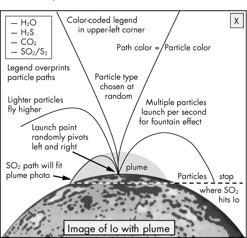
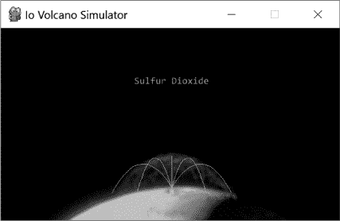
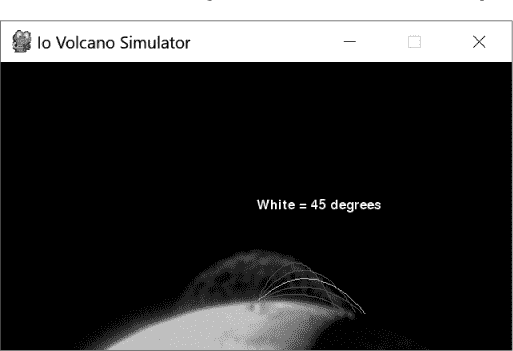

## 第十四章：**模拟外星火山**


快！说出太阳系中最具火山活动的天体！如果你认为是地球，那你就错了——它是木星的四颗伽利略卫星之一——木卫一（Io，“EYE-oh”）。

对木卫一火山活动的首次证据出现在 1979 年，当时*旅行者 1 号*飞越木星系统并拍摄了著名的照片。但这些壮观的照片并不令人感到意外。天体物理学家 Stan Peale 和两位合著者已经根据木卫一内部模型发布了这一结果。

计算机建模是理解自然和做出预测的强大工具。以下是一般的工作流程：

1.  收集数据。

1.  分析、解释并整合数据。

1.  生成解释数据的数值方程。

1.  构建一个最佳“拟合”数据的计算机模型。

1.  使用模型进行预测并研究误差范围。

计算机建模的应用范围广泛，包括野生动物管理、天气预报、气候预测、碳氢化合物生产以及黑洞模拟等领域。

在本章中，你将使用一个名为`pygame`的 Python 包——通常用于创建游戏——来模拟木卫一的一个火山。你还将尝试不同类型的*喷发物*（喷发粒子），并将它们的模拟行为与木卫一巨大 Tvashtar 羽流的照片进行比较。

### **项目#21：木卫一的羽流**

*潮汐加热*是木卫一火山活动的罪魁祸首。随着木卫一的椭圆轨道将其带过木星及其姐妹卫星的引力场，木卫一经历了潮汐拉力的变化。它的表面上下弯曲最多可达 100 米，导致其内部发生显著的摩擦加热和熔化。炽热的岩浆迁移到表面，形成巨大的熔岩湖，喷射出脱气的硫（S[2]）和二氧化硫（SO[2]），喷射速度达到每秒 1 公里。由于木卫一的低重力和缺乏大气层，这些气体羽流可以达到数百公里的高度（参见图 13-1a 中的 Tvashtar 羽流）。


*图 13-1：a) 木卫一，顶部是 330 公里的 Tvashtar 羽流，9 点钟位置是较短的 Prometheus 羽流；b) 木卫一的火山环沉积物（NASA 图片）*

当气体和尘土向上喷射，然后四面八方下落时，形成了伞形的喷发羽流。这些表面沉积物形成了同心的红色、绿色、黑色和黄色环状结构。如果图 13-1b 是彩色的，它看起来有点像发霉的意大利辣香肠比萨。

### **pygame 的一片天地**

`pygame`包是一套跨平台的 Python 模块，通常用于编程 2D 街机风格的视频游戏。它支持图形、动画、音效、音乐和多种输入设备，如键盘和鼠标。学习`pygame`不仅仅是学习编程的一种有趣方式。街机风格的游戏因智能手机和平板电脑的普及而重新流行起来，而移动游戏现在的收入几乎与主机和 PC 游戏的总和相当。

`pygame`包使用*简单直接媒体库（SDL）*，这是一种*应用程序编程接口（API）*。API 是可重用的代码库，能够使图形处理变得相对简单，让你可以专注于游戏设计，同时使用像 Python 这样的高级语言。微软的*DirectX* API 用于为 Windows 平台创建游戏和多媒体应用程序。为了跨平台工作，有两个开源库——SDL，主要用于 2D 工作，以及*OpenGL（开放图形库）*，用于 3D 应用程序。如前所述，你将使用 SDL，它正式支持 Windows、macOS、Linux、iOS 和 Android。

`pygame`包还使用面向对象编程（OOP）。如果你不熟悉 OOP 或需要复习，可以参考“面向对象编程简要介绍”在第 223 页的内容。此外，许多 Python 入门书籍通常会包括关于`pygame`的章节，且有专门的书籍讲解该包（关于一些例子，请参见第 281 页的“进一步阅读”）。

在继续之前，你需要将`pygame`安装到你的系统中。有关在你喜欢的平台上安装免费版本的说明，请访问*[`pygame.org/wiki/GettingStarted#Pygame%20Installation`](http://pygame.org/wiki/GettingStarted#Pygame%20Installation)*。

关于如何安装`pygame`的视频教程也可以在网上找到。为了确保视频适合你的情况，务必检查视频的日期、讨论的平台以及所使用的`pygame`和 Python 的版本。你可以在*[`brysonpayne.com/2015/01/10/setting-up-pygame-on-a-mac/`](http://brysonpayne.com/2015/01/10/setting-up-pygame-on-a-mac/)*找到适用于安装了较旧版本 Python 的 Mac 用户的额外说明。

**目标**

使用`pygame`构建一个基于重力的 2D 模拟，展示木卫二（Io）的 Tvashtar 火山喷发。使用 NASA 的图像校准喷发物的尺寸。在喷发中使用多种粒子类型，追踪粒子的飞行轨迹，并让喷发自动运行，直到被停止。

### **策略**

构建一个全面的、全物理的 Io 羽流模拟最好是通过超级计算机来完成。由于你可能没有超级计算机，并且目标是制作一个酷炫的 `pygame` 显示，你将通过逆向工程所需的参数来让 SO[2] 符合 Tvashtar 羽流。记住，作弊是人类赠送给自己的礼物；这就是我们与动物的不同——除了猎豹！

由于 Io 羽流的组成已经知道，你将根据 SO[2] 和硫气体（S[2]）的原子质量来调整你的重力场，它们恰好具有相同的原子质量。当这些粒子的飞行路径与 NASA 照片中的 Tvashtar 羽流的尺寸相匹配时，你将根据新粒子与 SO[2] 之间的原子质量差异，调整其他喷射粒子的速度，以观察粒子类型如何影响羽流的尺寸。较轻的粒子将被喷射得更高，反之亦然。

#### ***使用游戏草图进行规划***

我建议你在开始任何 `pygame` 项目时，先画出游戏应该是什么样的，行动将如何展开。即使是最简单的街机游戏也可能变得复杂，草图将帮助你管理这种复杂性。在典型游戏中，你必须考虑的事情有：玩家行为、计分、消息与指令、游戏实体及其交互（例如碰撞、音效和音乐）以及游戏结束条件。

绘制游戏草图——或者在这种情况下，是绘制模拟——最好是在白板上完成，可以是实际白板或数字白板。我为 Io 火山模拟器设计的布局如 图 13-2 所示。



*图 13-2：Io 火山模拟器的游戏草图*

图 13-2 中的草图包含了火山模拟器的指南和关键行为：

+   **没有直接的玩家交互。** 你将通过编辑 Python 代码来控制模拟，而不是通过鼠标或键盘。

+   **背景将是 NASA 的羽流图像。** 为了将模拟与 SO[2]/S[2] 粒子进行校准，你需要一个实际的 Tvashtar 羽流背景。

+   **发射点是可旋转的。** 粒子应从羽流图像的中央基座喷出，并以一定角度范围内喷射，而不仅仅是直线上升。

+   **粒子是随机选择的。** 程序会随机选择粒子的类型。每个粒子将有一个独特的颜色，用以与其他粒子区分。

+   **粒子的飞行路径应可见且持久。** 每个粒子的飞行轨迹应作为一条线被记录下来，并在整个模拟过程中保持可见，且该线的颜色应与粒子的颜色相匹配。

+   **有色标图例列出了粒子类型。** 程序应在屏幕的左上角显示一个粒子名称的图例。图例中的字体颜色应与粒子的颜色匹配，且图例应显示在粒子路径上方，以确保始终可见。

+   **粒子运动应在 SO**[2] **粒子与木卫一表面相交的高度停止。** 仿真已调校为 SO[2]的行为，因此下落的粒子应在 SO[2]羽流的适当位置停止。

+   **没有音效。** 在太空中，没有人能听到你的尖叫声。

一旦完成你的图示，你可以开始从中挑选部分，并按逻辑顺序列出它们；这样就把计划分解成一系列可管理的步骤。例如，你需要找到并准备一个合适的背景图像，决定要模拟哪些粒子并查找它们的原子质量，定位发射点，校准 SO[2]行为以适应羽流图像，等等。你仍在编写伪代码，但游戏草图使得这个过程变得更加有趣！

#### ***规划粒子类***

由于这个仿真是基于*粒子*的，因此有一个面向对象的`Particle`类作为多个粒子类型的蓝图是合乎逻辑的。该类应支持随机生成粒子类型，并且所有粒子共有的常量和其他属性可以作为*类属性*存储。这些属性是与方法处于同一级缩进的属性。`Particle`类还应包含方法，使类的实例能够被抛出、受重力影响、可见，并在移动超出仿真边界时销毁。

类中使用的属性和方法分别显示在表 13-1 和 13-2 中。类属性——即所有类实例共享的属性——以斜体显示；其他则为实例属性。

**表 13-1：** `Particle`类的属性（*斜体* = 类属性）

| **Attributes** | **属性描述** |
| --- | --- |
| *gases_colors* | 可用粒子类型及其颜色的字典 |
| *VENT_LOCATION_XY* | Tvashtar 火山口的 x 和 y 位置（图像中的位置） |
| *IO_SURFACE_Y* | 木卫一表面 y 值，在 SO[2]羽流边界的 y 值 |
| *VELOCITY_SO2* | SO[2]粒子的速度（每帧像素数） |
| *GRAVITY* | 重力加速度（每帧像素数） |
| *vel_scalar* | SO[2]/粒子原子量比率的字典 |
| screen | 游戏屏幕 |
| background | Tvashtar 羽流的 NASA 图像 |
| image | 表示粒子的`pygame`矩形表面 |
| rect | 用于获取表面尺寸的矩形对象 |
| gas | 单个粒子的类型（SO[2]、CO[2]等） |
| color | 单个粒子类型的颜色 |
| vel | 粒子的速度，相对于 SO[2]速度 |
| x | 粒子的 x 位置 |
| y | 粒子的 y 位置 |
| dx | 粒子的 delta-x |
| dy | 粒子的 delta-y |

**表 13-2：** `Particle`类的方法

| **Method** | **方法描述** |
| --- | --- |
| `__init__()` | 初始化并设置随机选择的粒子类型的参数 |
| `vector()` | 随机选择喷射方向并计算运动向量（dx 和 dy） |
| `update()` | 调整粒子轨迹以适应重力，绘制粒子后方的轨迹，并销毁超出模拟边界的粒子 |

我将在下一节中更详细地解释这些属性和方法。

### **代码**

*tvashtar.py* 代码将生成基于 `pygame` 的 Io 火山羽流模拟。你还需要背景图像 *tvashtar_plume.gif*。从 *[`www.nostarch.com/impracticalpython/`](https://www.nostarch.com/impracticalpython/)* 下载这两个文件，并将它们保存在同一个文件夹中。

#### ***导入模块、初始化 pygame 和定义颜色***

从一些设置步骤开始，例如选择颜色，正如在清单 13-1 中所示。

*tvashtar.py,* 第一部分

```py
➊ import sys
   import math
   import random
   import pygame as pg

➋ pg.init()  # initialize pygame

➌ # define color table
   BLACK = (0, 0, 0)
   WHITE = (255, 255, 255)
   LT_GRAY = (180, 180, 180)
   GRAY = (120, 120, 120)
   DK_GRAY = (80, 80, 80)
```

*清单 13-1：导入模块，初始化* pygame， *并定义颜色表*

从一些常见的 `import` 开始，并为 `pygame` ➊ 添加一个。接下来，调用 `pygame.init()` 函数。这将初始化 `pygame` 模块并启动所有底层部分，让它能够使用声音、检查键盘输入、运行图形等等 ➋。请注意，`pygame` 可以从多个地方进行初始化，比如在 `main()` 函数中的第一行：

```py
def main():
    pg.init()
```

或者在程序结束时，当 `main()` 函数以独立模式调用时：

```py
if __name__ == "__main__":
    pg.init()
    main()
```

停下来并使用 RGB 颜色模型 ➌ 分配一些颜色变量。该模型混合了红色、绿色和蓝色，其中每种颜色的值范围从 0 到 255。如果你在网上搜索“RGB 颜色代码”，可以找到数百万种颜色的数值代码。但由于你将使用的 NASA 图像是灰度的，所以只需使用黑色、白色和灰色阴影即可。现在定义这个表格将使你在以后 `pygame` 需要定义颜色时，只需输入一个名字。

#### ***定义粒子类***

清单 13-2 定义了 `Particle` 类及其初始化方法。你将使用这些来实例化一个粒子对象。粒子的关键属性，如类型、速度、颜色等，都是通过初始化方法来设定的。

*tvashtar.py,* 第二部分

```py
➊ class Particle(pg.sprite.Sprite):
       """Builds ejecta particles for volcano simulation."""

    ➋ gases_colors = {'SO2': LT_GRAY, 'CO2': GRAY, 'H2S': DK_GRAY, 'H2O': WHITE}

    ➌ VENT_LOCATION_XY = (320, 300)
       IO_SURFACE_Y = 308
       GRAVITY = 0.5  # pixels-per-frame; added to dy each game loop
       VELOCITY_SO2 = 8  # pixels-per-frame

       # scalars (SO2 atomic weight/particle atomic weight) used for velocity
    ➍ vel_scalar = {'SO2': 1, 'CO2': 1.45, 'H2S': 1.9, 'H2O': 3.6}

    ➎ def __init__(self, screen, background):
           super().__init__()
           self.screen = screen
           self.background = background
        ➏ self.image = pg.Surface((4, 4))
           self.rect = self.image.get_rect()
        ➐ self.gas = random.choice(list(Particle.gases_colors.keys()))
           self.color = Particle.gases_colors[self.gas]
        ➑ self.vel = Particle.VELOCITY_SO2 * Particle.vel_scalar[self.gas]
        ➒ self.x, self.y = Particle.VENT_LOCATION_XY
        ➓ self.vector()
```

*清单 13-2：定义了* Particle *类和* Particle *初始化方法*

定义一个名为 `Particle` 的类，用来表示可能形成火山羽流的 *任何* 气体分子 ➊。这个类的 *祖先*（如括号中所示）将是 `Sprite` 类。这意味着 `Particle` 类是从一个名为 `Sprite` 的内建 `pygame` 类型派生的。精灵（Sprite）只是代表离散游戏对象（如导弹或小行星）的 2D 位图。你通过将 `pg.sprite.Sprite` 传递给你的 `Particle` 类，就可以 *继承* `Sprite` 类，即将其属性和方法添加到你的新类中，就像你给函数传递参数一样。

将所有粒子共有的属性作为类属性进行分配。第一个是一个字典，将粒子类型映射到颜色，以便在模拟过程中区分不同的粒子 ➋。这些颜色将用于粒子、粒子的路径以及图例中的名称。

现在，分配四个常量，`VENT_LOCATION_XY`、`IO_SURFACE_Y`、`GRAVITY`和`VELOCITY_SO2` ➌。第一个常量是图像中 Tvashtar 火山口的 x 和 y 坐标，它将代表所有粒子的“发射点”（见图 13-3）。我最初猜测了这些值，然后在模拟运行时进行了微调。


*图 13-3：带有粒子发射点注释的模拟背景图*

第二个常量是图像中与 SO[2]烟羽外缘相交的 Io 表面最高点的 y 值（见图 13-2）。你将在这个 y 值处停止所有下落的粒子，因此视图将优化为 SO[2]。

第三个常量表示重力加速度，地球上的值为 9.86 m/s²，Io 上的值为 1.796 m/s²。但你在这里处理的是像素和帧，而非现实世界的单位，因此你需要通过实验来找到一个在游戏/模拟的尺度下看起来合适的值。我选择的`0.5`是随意的，但在一定程度上受到街机游戏中有效参数的指导。

第四个常量是 SO[2]粒子被喷射时的速度，以像素/帧为单位。记住，烟羽主要由 SO[2]组成，因此你希望使用能使 SO[2]粒子“适应”Tvashtar 烟羽图像的参数，然后调整其他粒子的速度*相对于*SO[2]。`GRAVITY`和`VELOCITY_SO2`的值并不唯一。如果我选择了更大的`GRAVITY`值，我就需要增加`VELOCITY_SO2`，以便 SO[2]粒子仍然能“填满”NASA 图像中的烟羽区域。

接下来，为粒子速度➍构建一个标量字典。对于每个粒子，将 SO[2]的原子质量（64）除以该粒子的原子质量，即可得到该粒子的标量。由于 SO[2]是参考粒子，其标量为 1。之后，为了获得非 SO[2]粒子的速度，你需要将`VELOCITY_SO2`常量乘以标量。如你所见，其他所有粒子的质量都比 SO[2]轻，因此会产生较大的烟羽。

为粒子对象定义一个构造方法 ➎。你需要一个`self`参数以及用于绘制和检查模拟边界的`screen`，还需要一个`background`，它将是 Tvashtar 羽流的图像。你将在`main()`函数中稍后分配`screen`和`background`，该函数定义在程序的末尾。请注意，虽然在本书中为了简洁我使用了一行文档字符串，但你应该在类文档字符串中包括这些类型的参数。有关类文档字符串的更多指南，请参见 *[`www.python.org/dev/peps/pep-0257/`](https://www.python.org/dev/peps/pep-0257/)*。

在`__init__()`方法中，立即通过`super`调用内置`Sprite`类的初始化方法。这将初始化精灵，并建立它所需的`rect`和`image`属性。使用`super`时，你不需要显式引用基类（`Sprite`）。有关`super`的更多信息，请访问文档 *[`docs.python.org/3/library/functions.html#super`](https://docs.python.org/3/library/functions.html#super)*。

接下来，让粒子（`self`）知道它将使用`screen`和`background`变量，将它们分配给属性。

图像和图形由`pygame`放置在一个矩形表面上。事实上，`Surface`对象是`pygame`的核心；甚至`screen`属性也是`Surface`的一个实例。将粒子图像分配给`Surface`对象，并使其成为一个边长为 4 像素的正方形 ➏。

接下来，你需要为图像表面获取一个`rect`对象。它基本上是一个与`Surface`对象*关联*的矩形，`pygame`需要它来确定`Surface`对象的尺寸和位置。

通过从`gases_colors`字典中的键中随机选择，选择一个粒子（`gas`）类型 ➐。请注意，你需要将其转换为列表才能进行选择。由于有可能在`__init__()`方法中为实例属性命名为`gases_colors`，请包括类名——而不是`self`——以确保引用的是*类*属性。

一旦你有了类型，就可以将其用作之前构建的字典中的键，来访问诸如颜色和标量之类的内容。从为所选粒子获取正确的颜色开始，然后获取其`vel_scalar`值，并利用它来确定粒子的速度 ➑。

粒子对象将在火山口处实例化，因此通过解包`VENT_LOCATION_XY`元组来获取其初始的 x 和 y 位置 ➒。最后调用`vector()`方法，它将计算粒子的运动向量 ➓。

#### ***喷射粒子***

列表 13-3 定义了`vector()`方法，它决定粒子的发射方向，并计算其初始的 delta-x 和 delta-y 向量分量。

*tvashtar.py,* 第三部分

```py
    ➊ def vector(self):
           """Calculate particle vector at launch."""
        ➋ orient = random.uniform(60, 120)  # 90 is vertical
        ➌ radians = math.radians(orient)
        ➍ self.dx = self.vel * math.cos(radians)
           self.dy = -self.vel * math.sin(radians)
```

*列表 13-3：定义了* vector() *方法，属于* Particle *类*

`vector()` 方法 ➊ 用于计算粒子的运动矢量。首先选择一个粒子的发射方向，并将其赋值给 `orient` 变量 ➋。由于爆炸性的火山喷发物质是沿多个方向喷射，而不是垂直向上，因此需要随机选择一个方向，使用的范围是从 90 度左右 30 度的区间，其中 90 度代表垂直发射方向。

`orient` 变量的范围是通过反复试验确定的。这个参数，结合 `VELOCITY_SO2` 和 `GRAVITY` 常数，代表了可以调整的“旋钮”，用来校准 SO[2] 粒子与喷发柱图像的行为。调整这些常数，直到粒子的最大高度与喷发柱的顶点对齐后，你可以进一步调整角度范围，使 SO[2] 粒子达到喷发柱的侧向极限（但不超过该范围）（参见 图 13-4）。



*图 13-4：将* orient *变量校准到 Tvashtar 喷发柱*

`math` 模块使用 *弧度* 而非度数，因此需要将 `orient` 转换为弧度 ➌。弧度是标准的角度单位，当半径围绕圆圈一圈时所形成的角度（参见 图 13-5 左侧）。一个弧度稍小于 57.3 度。右侧的 图 13-5 是弧度与度数的对比，列出了常见的角度。要将度数转换为弧度，你可以将度数乘以π再除以 180——像个傻瓜一样——或者直接使用 `math` 模块！


*图 13-5：弧度的定义（左）及常见角度的弧度与度数（右）*

在 `pygame` 中，物体是按 x 和 y 增量移动的。粒子的方向和速度用来得到它的 *delta-x (dx)* 和 *delta-y (dy)* 矢量分量。这些分量表示粒子初始位置与完成单次游戏循环后位置之间的差异。

你可以使用三角函数计算矢量分量。有关有用的三角函数公式，请参见 图 13-6。


*图 13-6：游戏中常用的三角函数公式*

对于角度 θ，使用 `orient` 变量。`self.vel` 属性等价于 *r*。知道这两个分量后，可以使用三角函数公式来推导 `self.dx` 和 `self.dy` ➍。推导 `self.dx` 时，将 `self.vel` 乘以 `orient` 的余弦值，推导 `self.dy` 时，将 `self.vel` 乘以 `orient` 的正弦值。需要注意的是，`self.dy` 必须为负，因为粒子是向上喷射的，而在 `pygame` 中，y 值是 *向下* 增加的。

#### ***更新粒子并处理边界条件***

清单 13-4 通过定义一个更新粒子的方法，完成了`Particle`类，该方法使粒子在屏幕上移动。这包括应用重力、绘制线条追踪粒子的路径，以及当粒子移出屏幕或下沉至 Io 表面时“杀死”粒子。

*tvashtar.py,* 第四部分

```py
    ➊ def update(self):
           """Apply gravity, draw path, and handle boundary conditions."""
        ➋ self.dy += Particle.GRAVITY
        ➌ pg.draw.line(self.background, self.color,(self.x, self.y),
                          (self.x + self.dx, self.y + self.dy))
        ➍ self.x += self.dx
           self.y += self.dy

        ➎ if self.x < 0 or self.x > self.screen.get_width():
            ➏ self.kill()
        ➐ if self.y < 0 or self.y > Particle.IO_SURFACE_Y:
               self.kill()
```

*清单 13-4：定义了 update()方法并完成了 Particle 类*

定义`update()`方法，方法接收`self`作为参数➊。在每个游戏循环中，通过将`GRAVITY`类属性添加到`self.dy`来应用重力➋。重力是一个只在垂直方向起作用的力向量，因此只有`self.dy`受到影响。

为了在粒子后面绘制路径，使用`pygame`的`draw.line()`方法，该方法将 Io 的背景图像、粒子的颜色以及粒子之前和当前的位置坐标作为参数➌。要获取当前位置，你需要将`self.dx`和`self.dy`加到`self.x`和`self.y`上。

接下来，像在`draw.line()`方法中那样，通过将`self.dx`和`self.dy`加到`self.x`和`self.y`上，更新粒子的`self.x`和`self.y`属性➍。

现在，检查粒子是否已经越过屏幕的左边或右边界➎。对于左侧，使用`self.x`等于零，对于右侧，获取`screen`属性的宽度。如果粒子已经越过屏幕的任一边缘，则使用内置的`kill()`方法将其从包含它的所有组中移除➏。正如你稍后会看到的，`pygame`使用容器——称为*组*——来管理精灵，而将精灵从组中移除会使其不再参与游戏。

对 y 方向重复此过程➐，但对于最大值，使用`Particle`类的`IO_SURFACE_Y`常量，它将使粒子停在接近 Io 表面的位置，就像 SO[2]粒子停的位置（参见图 13-2 和 13-4）。

#### ***定义 main()函数***

清单 13-5 定义了`main()`函数的第一部分，该部分设置了游戏屏幕、窗口标题、图例、精灵组和游戏时钟。

*tvashtar.py,* 第五部分

```py
def main():
    """Set up and run game screen and loop."""
 ➊ screen = pg.display.set_mode((639, 360))
 ➋ pg.display.set_caption('Io Volcano Simulator')
 ➌ background = pg.image.load('tvashtar_plume.gif')

    # Set up color-coded legend
 ➍ legend_font = pg.font.SysFont('None', 24)
 ➎ water_label = legend_font.render('--- H2O', True, WHITE, BLACK)
    h2s_label = legend_font.render('--- H2S', True, DK_GRAY, BLACK)
    co2_label = legend_font.render('--- CO2', True, GRAY, BLACK)
    so2_label = legend_font.render('--- SO2/S2', True, LT_GRAY, BLACK)

 ➏ particles = pg.sprite.Group()

 ➐ clock = pg.time.Clock()
```

*清单 13-5：定义了 main()函数的第一部分*

第一步是使用`pygame`的`display.set_mode()`方法分配`screen`变量➊。参数是像素维度；在这种情况下，你使用稍微比 NASA 图像尺寸小的值来确保良好的适配。请注意，尺寸必须以元组形式提供，因此需要包含两组括号。

接下来，使用`pygame`的`display.set_caption()`方法➋为你的游戏窗口命名，然后将`background`变量分配为 Tvashtar 喷流的 NASA 照片➌。使用`pygame`的`image.load()`方法从图像创建一个新的`Surface`对象。`pygame`包支持多种图像格式，包括 PNG、JPG 和 GIF。返回的`Surface`将继承图像文件的颜色和透明度信息。由于你在这里导入的是灰度图像，所以你的颜色选择将受到限制。

现在，添加一些代码以构建将在屏幕左上方显示的图例。

命名一个`legend_font`变量，并使用`pygame`的`font.SysFont()`方法选择大小为 24 的`None`字体 ➍。你将在渲染文本时使用这个。`pygame`包的`font`模块让你将新的字体集（称为 TrueType 字体）渲染到一个新的`Surface`对象上。如果你不想指定字体，`pygame`自带了一个内置的默认字体，你可以通过传递`None`作为字体名称来访问它。

按照重量顺序发布粒子名称，最轻的放在最上面。要创建标签，调用之前创建的`legend_font`对象的`render()`方法来生成一个新的 surface 对象 ➎。传递一些文本，然后传递`True`（以开启抗锯齿，使文本看起来更平滑），接着是所描述粒子的颜色。最后一个参数`BLACK`是可选的，它将标签的背景颜色设置为黑色，以便文本在屏幕上绘制的所有粒子路径上方清晰可见。为剩下的三个粒子重复这个过程，并将`S2`添加到`so2_label`中，因为这两种气体具有相同的原子质量，在模拟中将表现相同。

现在，启动一个名为`particles`的精灵组 ➏。由于游戏通常有多个精灵在屏幕上移动，`pygame`使用一个容器——精灵组——来管理它们。事实上，你*必须*将精灵放入一个组，否则它们不会起作用。

完成这一部分，创建一个`Clock`对象来跟踪和控制模拟的帧率 ➐。`pygame`的“时钟”控制游戏运行的速度，基于每秒显示的*帧数（fps）*。你将在下一部分设置这个值。

#### ***完成 main()函数***

Listing 13-6 通过设置模拟的运行速度（以每秒帧数为单位）并启动实际运行模拟的`while`循环来完成`main()`函数。它还处理*事件*，当用户通过鼠标、操纵杆或键盘控制程序时，这些事件会发生。由于这是一个模拟程序而非真正的游戏，用户控制仅限于关闭窗口。此列表以全局作用域结束，包含作为模块或独立模式运行程序的标准代码。

*tvashtar.py，* 第六部分

```py
    ➊ while True:
        ➋ clock.tick(25)
        ➌ particles.add(Particle(screen, background))
        ➍ for event in pg.event.get():
               if event.type == pg.QUIT:
                   pg.quit()
                   sys.exit()

        ➎ screen.blit(background, (0, 0))
           screen.blit(water_label, (40, 20))
           screen.blit(h2s_label, (40, 40))
           screen.blit(co2_label, (40, 60))
           screen.blit(so2_label, (40, 80))

        ➏ particles.update()
           particles.draw(screen)

        ➐ pg.display.flip()

➑ if __name__ == "__main__":
       main()
```

*Listing 13-6：启动游戏时钟和循环，并处理 main()函数中的事件*

启动一个`while`循环来运行模拟 ➊。然后使用`clock.tick()`方法设置模拟的速度限制 ➋。传入`25`，这将设置最大帧率为每秒 25 帧。如果你想要更有活力的火山，可以增加此值。

现在是时候让这场演出的主角登场了。使用`Particle`类实例化一个粒子，传入`screen`和`background`作为参数，并将新粒子添加到`particles`精灵组中 ➌。每一帧，都会随机生成一个新粒子并从火山口发射，产生一阵令人愉悦的粒子喷雾（见图 13-7）。


*图 13-7：模拟启动，随机粒子以每秒 25 帧的速度生成*

启动一个`for`循环来处理事件 ➍。所有在当前帧中发生的事件都被`pygame`记录并保存在*事件缓冲区*中。它的`event.get()`方法创建了一个包含所有这些事件的列表，便于你逐一评估它们。如果发生`QUIT`事件（即用户关闭了游戏窗口），则调用`pygame`的`quit()`方法和系统的`exit()`方法来结束模拟。

为了渲染游戏对象并更新视觉显示，`pygame`使用了一种叫做*blitting*的过程。*Blit*是*块传输*的缩写，指的是将一个矩形`Surface`对象中的像素复制到另一个矩形对象中。通过将背景绘制到屏幕上，你可以用 Io 图像覆盖整个屏幕。通过 blitting，你可以将同一张图像多次绘制到屏幕上的不同位置。这个过程可能较慢，因此游戏开发者使用巧妙的技术来解决这一缺陷，比如只在当前更新的区域周围进行 blitting，而不是每次游戏循环都绘制整个屏幕。

要将背景绘制到屏幕上，调用屏幕的`blit()`方法，并传入源和目标的相关参数 ➎。在第一个例子中，`background`变量是源，而目标是背景的*左上角*坐标。由于背景将覆盖整个屏幕，使用屏幕的原点坐标`(0, 0)`。对图例标签重复此操作，将它们放置在屏幕的左上角。

接下来，调用`particles`组的`update()`方法 ➏。此方法不会更新屏幕，而是让精灵运行各自的`self.update()`方法。之后，使用`draw()`方法根据每个精灵的`rect`属性将精灵绘制到屏幕上。该方法需要一个绘图表面，因此传入`screen`。

`draw()`方法负责绘制精灵，所以现在你只需要使用`flip()`方法更新实际的游戏图形 ➐。*翻转*是一种双缓冲技术，在这种技术中，你将所有内容从`screen`对象复制到实际的显示屏上。翻转通过在后台矩形上完成工作，避免了显示图形这一固有的缓慢过程，从而防止屏幕闪烁，然后使用`blit()`方法的一个版本将图形复制到最终显示。

列表在`main()`函数外结束，代码允许程序以模块或独立模式运行 ➑。

### **运行模拟**

图 13-8 展示了运行模拟器约一分钟的结果。水蒸气羽流延伸至窗口顶部。第二高的羽流由硫化氢形成，接着是二氧化碳，然后是二氧化硫/硫（S[2]）气体，这与设计上完美匹配 Tvashtar 羽流。


*图 13-8：运行* tvashtar.py *一分钟的结果*

要仅使用 SO[2]运行模拟器，请进入`Particle`类的`__init__`方法，修改选择`gas`和`color`实例属性的代码行：

```py
        self.gas = 'SO2'
        self.color = random.choice(list(Particle.gases_colors.values()))
```

通过随机选择颜色，你可以在所有可能的`self.orient`角度用尽后，保持羽流的运动感。如果你想加速或减慢喷发速度，可以进入`main()`函数，尝试调整`clock.tick()`方法的每秒帧数参数。

在现实生活中，羽流物质的成分通过*光谱学*推测，光谱学是一种分析光如何与物质相互作用的测量技术。它包括可见光和非可见光波长，这些波长会被吸收、发射或散射。通过“喷发物的光谱”以及表面上的颜色，提供了硫丰富羽流的关键证据。

### **总结**

在本章中，你学习了如何使用`pygame`包来模拟重力并构建外星火山的动画。在下一章中，你将使用`pygame`构建一个真正的街机游戏，涉及玩家互动和胜负条件。

### **进一步阅读**

*游戏编程：L 线，学习的快捷通道*（Wiley, 2007）由 Andy Harris 编写，是一本极其有用且全面的 570 页`pygame`入门书。

*更多 Python 编程从零开始*（Cengage Learning Course Technology, 2012）由 Jonathon Harbour 编写，是《Python 编程从零开始》的续集，采用了一个（py）游戏为主的教学方法。

*用 Python 发明自己的计算机游戏，第四版*（No Starch Press, 2016）由 Al Sweigart 编写，是一本适合初学者的 Python 和游戏设计入门书籍。

`pygame` 的在线“新手指南”可以在 *[`www.pygame.org/docs/tut/newbieguide.html`](https://www.pygame.org/docs/tut/newbieguide.html)* 找到，“备忘单”可以在 *[`www.cogsci.rpi.edu/~destem/gamedev/pygame.pdf`](http://www.cogsci.rpi.edu/~destem/gamedev/pygame.pdf)* 中找到。

*《木卫一 Pele 羽状云中的气体和尘土的三维模拟》*，作者 William J. McDoniel 等，记录了使用直接蒙特卡罗模拟和德克萨斯大学德克萨斯先进计算中心的超级计算机模拟木卫一 Pele 羽状云的过程。该文章可在 *[`cfpl.ae.utexas.edu/wp-content/uploads/2016/01/McDoniel_PeleDust.pdf`](http://cfpl.ae.utexas.edu/wp-content/uploads/2016/01/McDoniel_PeleDust.pdf)* 获取。

### **实践项目：走得更远**

你是亨利国王的弓箭手，参加了阿金库尔战役。法国人正在冲锋，你想尽可能远地击中他们。你应该把长弓拿成什么角度？

如果你上过物理课，你大概知道答案是 45 度。但是你能相信那个脖子细长的物理学家吗？最好快速运行一个计算机模拟来验证一下。复制并编辑 *tvashtar.py* 代码，随机发射粒子在 25、35、45、55 和 65 度。将 `self.color` 设置为 `WHITE` 用于 45 度，将所有其他角度设置为 `GRAY`（见 图 13-9）。



*图 13-9：修改后的木卫一火山模拟器，发射角度为 25、35、45、55 和 65 度*

你可以在附录中找到一个解决方案，*practice_45.py*，或者从 *[`www.nostarch.com/impracticalpython/`](https://www.nostarch.com/impracticalpython/)* 下载。将它保存在与 *tvashtar_plume.gif* 文件相同的文件夹中。

### **挑战项目**

继续进行这些挑战项目的实验。不提供解决方案。

#### ***冲击 canopy***

被认为，木卫一（Io）巨大的羽状云的可见性是通过气体凝结成尘土，在 *冲击 canopy* 中增强的，即气体粒子达到最高点并开始落回表面的位置。使用 `self.dy` 属性编辑路径颜色，在 *tvashtar.py* 程序的副本中，羽状云的顶点路径应比下方的路径更亮（见 图 13-10）。像所有挑战项目一样，提供的没有解决方案。


*图 13-10：使用更亮的路径颜色高亮显示冲击 canopy*

#### ***源头***

复制并编辑 *tvashtar.py* 代码，使得只模拟 SO[2]，并用没有拖尾路径的小白色圆圈表示粒子（见 图 13-11）。


*图 13-11：SO[2] 模拟的屏幕截图，圆圈表示单个粒子*

#### ***带有子弹***

如果你在没有大气的星球上垂直发射一颗子弹，子弹落地时的速度会与它离开枪口时相同吗？这个问题让许多人感到困惑，但你可以使用 Python 来解答。复制并编辑*tvashtar.py*代码，使其发射一个 90 度朝向的 SO[2]粒子。打印粒子的`self.y`属性以及发射点坐标（y = 300）处`self.dy`的绝对值。比较这个点的起始速度和结束速度，看看它们是否相同或相似。

**注意**

*电视节目《破坏神话》第 50 集*探讨了一个神话，即子弹被射向空中后，当它们最终落回地面时，仍然保持致命的威力。他们发现，垂直发射的子弹在地球上由于风阻会翻滚并减速。如果发射角度稍微偏离垂直，子弹则会保持旋转和弹道轨迹，并以致命的速度返回地球。这是唯一一个获得三项评级（破除、可信、证实）的神话！*
