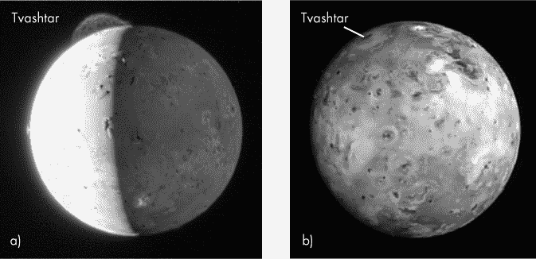
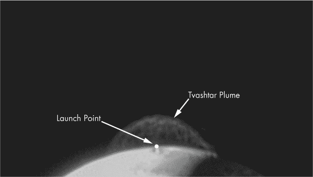
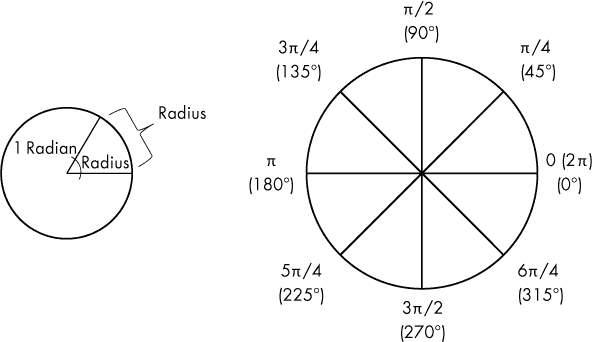
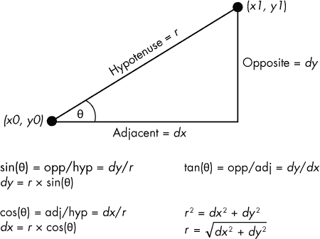
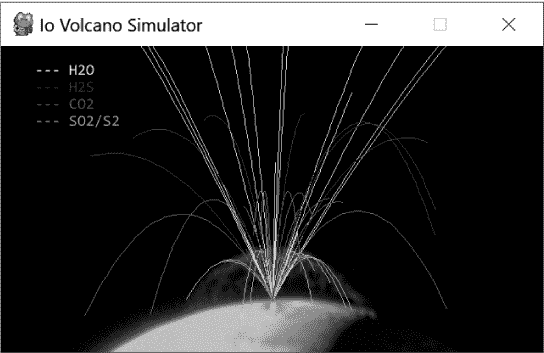
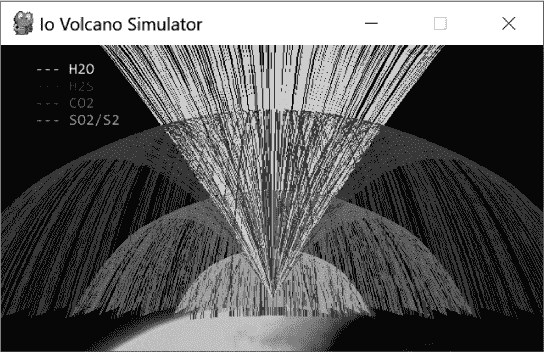
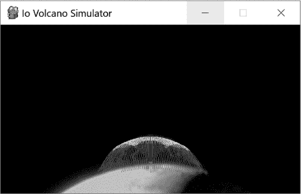
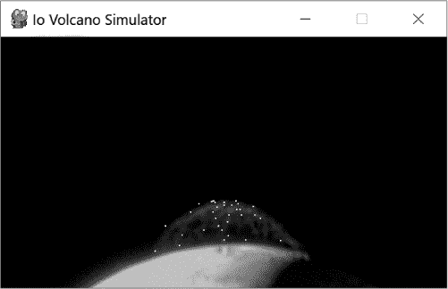

## **13

模拟外星火山**

快！说出太阳系中火山活动最频繁的天体！如果你认为是地球，那你就错了——其实是木卫一（"EYE-oh"），它是木星的四颗伽利略卫星之一。

1979 年，当*旅行者 1 号*成功飞掠木星系统时，首次获得了木卫一火山活动的证据。但它拍摄的壮观照片并不令人惊讶。天体物理学家 Stan Peale 和两位合著者已经根据木卫一内部模型发布了这一结果。

计算机建模是理解自然和进行预测的强大工具。以下是一般的工作流程：

1.  收集数据。

1.  分析、解释并整合数据。

1.  生成解释数据的数值方程。

1.  构建最能“拟合”数据的计算机模型。

1.  使用模型进行预测并调查误差范围。

计算机建模的应用领域广泛，包括野生动物管理、天气预报、气候预测、碳氢化合物生产和黑洞模拟等领域。

在本章中，你将使用一个名为 pygame 的 Python 包——这个包通常用于制作游戏——来模拟木卫一的火山之一。你还将尝试不同类型的*喷发物*（喷出的颗粒），并将其模拟行为与木卫一巨大 Tvashtar 喷流的照片进行对比。

### **项目 #21：木卫一的火山喷发**

*潮汐加热*是木卫一火山活动的原因。由于其椭圆轨道使其穿越木星及其卫星的引力场，木卫一经历潮汐拉力的变化。其表面上下弯曲最多可达 100 米，从而在内部产生显著的摩擦加热和熔化。热熔岩迁移到表面，形成巨大的熔岩湖，并喷出含硫气体（S[2]）和二氧化硫（SO[2]），这些气体以每秒 1 公里的速度喷射向空中。由于木卫一的低重力和缺乏大气层，这些气体喷流可以达到数百公里的高度（见图 13-1a 中的 Tvashtar 喷流）。

*图 13-1：a) 木卫一，顶部是 330 公里的 Tvashtar 喷流，9 点钟位置是较短的 Prometheus 喷流；b) 木卫一及其火山环形沉积物（NASA 图片）*

喷流那美丽的伞形结构是因为气体和尘土向上喷射，然后在各个方向上落下。由此形成的表面沉积物会形成红色、绿色、黑色和黄色的同心环。如果图 13-1b 是彩色的，它看起来有点像一张发霉的意大利辣香肠披萨。

### **pygame 简介**

pygame 包是一个跨平台的 Python 模块集，通常用于编写 2D 街机风格的视频游戏。它支持图形、动画、音效、音乐和多种输入设备，如键盘和鼠标。学习 pygame 不仅仅是一个有趣的编程学习方式。随着智能手机和平板电脑的普及，街机风格的游戏重新受到欢迎，现在移动游戏的收入几乎与主机和 PC 游戏的总收入相当。

pygame 包使用了 *简单直接媒体库（SDL）*，它是一个 *应用程序编程接口（API）*。API 是可重用的代码库，它使得处理图形变得相当简单，允许你在使用像 Python 这样的高级语言时，专注于游戏设计。微软的 *DirectX* API 用于为 Windows 平台创建游戏和多媒体应用。为了跨平台工作，有两个开源库：SDL，主要用于 2D 工作；以及 *OpenGL（开放图形库）*，用于 3D 应用。如前所述，你将使用 SDL，它正式支持 Windows、macOS、Linux、iOS 和 Android。

pygame 包还使用了面向对象编程（OOP）。如果你不熟悉 OOP 或需要复习，可以参见 “面向对象编程简明介绍” 在 第 223 页。此外，Python 的入门书籍通常包括有关 pygame 的章节，也有整本书专门讲解这个包（参见 “进一步阅读” 在 第 281 页 的一些示例）。

在继续之前，你需要将 pygame 安装到你的系统中。有关在你首选平台上安装免费副本的说明，可以参考 *[`pygame.org/wiki/GettingStarted#Pygame%20Installation`](http://pygame.org/wiki/GettingStarted#Pygame%20Installation)*。

如何安装 pygame 的视频教程也可以在线找到。为了确保视频适合你的情况，务必检查视频的日期、讨论的平台以及使用的 pygame 和 Python 版本。你可以在 *[`brysonpayne.com/2015/01/10/setting-up-pygame-on-a-mac/`](http://brysonpayne.com/2015/01/10/setting-up-pygame-on-a-mac/)* 查找关于 Mac 用户安装较旧 Python 版本的额外说明。

**目标**

使用 pygame 构建一个基于重力的 2D 模拟，模拟木卫二 Io 的 Tvashtar 火山羽流。使用 NASA 的图像来校准羽流的尺寸。在羽流中使用多种粒子类型，追踪粒子的飞行路径，并允许喷发自动运行直到停止。

### **策略**

构建一个完整的木卫一喷发云的物理模拟，最好的方式是使用超级计算机。由于您可能没有这样的计算机，并且您的目标是制作一个酷炫的 pygame 显示器，您将通过逆向工程所需的参数来让 SO[2]适应 Tvashtar 喷发云。记住，作弊是人类赋予自己的礼物；它使我们与动物区分开来——除了猎豹！

由于木卫一喷发云的组成已经知道，您将把重力场标定为 SO[2]和硫（S[2]）气体，它们恰好具有相同的原子质量。当这些颗粒的飞行路径与 NASA 照片中 Tvashtar 喷发云的尺寸匹配时，您将基于新颗粒与 SO[2]之间的原子质量差异，调整其他喷发颗粒的速度，以查看颗粒类型如何影响喷发云的尺寸。较轻的颗粒将被喷射得更高，反之亦然。

#### ***使用游戏草图进行规划***

我建议您在任何 pygame 项目开始时，先草拟出游戏应该如何呈现，动作应该如何进行。即使是最简单的街机游戏也可能变得复杂，而草图将帮助您管理这种复杂性。在典型游戏中，您必须考虑的许多事项包括玩家动作、计分、信息和指示、游戏实体及其交互（例如碰撞、音效和音乐）以及游戏结束条件。

游戏草图——或者在这个案例中是模拟草图——最好在白板上完成，可以是真实的白板或数字白板。我的木卫一火山模拟器布局如图 13-2 所示。

*图 13-2：木卫一火山模拟器的游戏草图*

图 13-2 中的草图包含了火山模拟器的指南和关键行为：

+   **没有直接的玩家交互。** 您将通过编辑 Python 代码来控制模拟，而不是通过鼠标或键盘进行控制。

+   **背景将是 NASA 的一张喷发云图像。** 要将模拟调整到 SO[2]/S[2]颗粒，您需要使用实际的 Tvashtar 喷发云作为背景。

+   **发射点是可旋转的。** 颗粒应从喷发云图像的中央基座喷出，并且应以一定范围的角度喷射，而不仅仅是直接向上。

+   **颗粒是随机选择的。** 程序将随机选择颗粒类型。每个颗粒都会有一个独特的颜色，用以区分其他颗粒。

+   **颗粒的飞行路径应当可见且持久。** 每个颗粒的飞行路径应记录为一条线，并在整个模拟过程中始终可见，且该线的颜色应与颗粒的颜色匹配。

+   **彩色编码图例列出了颗粒类型。** 程序应该在屏幕的左上角显示一个图例，图例中包含颗粒名称。字体颜色应与颗粒颜色匹配，图例应覆盖在颗粒路径上方，以确保始终可见。

+   **粒子运动应停止在 SO**[2] **粒子与 Io 表面相交的地方。** 模拟已经调整为 SO[2]的行为，因此下落的粒子应停止在 SO[2]羽流的适当位置。

+   **没有音效。** 在太空中，没有人能听见你尖叫。

一旦完成了你的图示，就可以开始从中挑选部分并按逻辑顺序列出它们；这会将计划分解为一系列可管理的步骤。例如，你需要找到并准备合适的背景图像，决定模拟哪些粒子并查找它们的原子量，确定一个发射点，校准 SO[2]行为到羽流图像等等。你仍在编写伪代码，但有了游戏草图，这个过程会变得更加愉快！

#### ***规划粒子类***

由于该模拟基于*粒子*，因此拥有一个面向对象的粒子类来作为多种粒子类型的蓝图是合理的。该类应支持粒子类型的随机生成，常见于所有粒子的常量和其他属性可以作为*类属性*存储。这些属性与方法具有相同的缩进级别。粒子类还应包含方法，使类的实例可以被抛出、受重力影响、可见，并在其移动超出模拟边界时被销毁。

类中使用的属性和方法分别列在表 13-1 和 13-2 中。类属性——即所有类实例共享的属性——以斜体显示；其他情况下，则显示实例属性。

**表 13-1：** 粒子类的属性（*斜体* = 类属性）

| **属性** | **属性描述** |
| --- | --- |
| *gases_colors* | 可用粒子类型及其颜色的字典 |
| *VENT_LOCATION_XY* | 图像中 Tvashtar 火山口的 x 和 y 位置 |
| *IO_SURFACE_Y* | 图片中 SO[2]羽流边缘处 Io 表面的 y 值 |
| *VELOCITY_SO2* | SO[2]粒子的速度（像素/帧） |
| *GRAVITY* | 每帧的重力加速度（像素） |
| *vel_scalar* | SO[2]/粒子原子量比的字典 |
| screen | 游戏屏幕 |
| background | NASA 的 Tvashtar 羽流图像 |
| image | 表示粒子的 pygame 表面（方形） |
| rect | 用于获取表面尺寸的矩形对象 |
| gas | 单个粒子的类型（SO[2]，CO[2]等） |
| color | 单个粒子类型的颜色 |
| vel | 粒子相对于 SO[2]粒子速度的速度 |
| x | 粒子的 x 位置 |
| y | 粒子的 y 位置 |
| dx | 粒子的 delta-x |
| dy | 粒子的 delta-y |

**表 13-2：** 粒子类的方法

| **方法** | **方法描述** |
| --- | --- |
| __init__() | 初始化并设置随机选择的粒子类型的参数 |
| vector() | 随机选择喷射方向并计算运动向量（dx 和 dy） |
| update() | 调整粒子轨迹以适应重力，绘制粒子后方的路径，并销毁超出模拟边界的粒子 |

我将在下一节中更详细地解释这些属性和方法。

### **代码**

*tvashtar.py* 代码将生成一个基于 pygame 的 Io 行星 Tvashtar 喷流模拟。你还需要背景图像 *tvashtar_plume.gif*。从 *[`www.nostarch.com/impracticalpython/`](https://www.nostarch.com/impracticalpython/)* 下载这两个文件，并将它们保存在同一个文件夹中。

#### ***导入模块，初始化 pygame，并定义颜色***

从一些设置步骤开始，例如选择颜色，如 列表 13-1 所示。

*tvashtar.py，* 第一部分

➊ import sys

导入 math

导入 random

导入 pygame 作为 pg

➋ pg.init()  # 初始化 pygame

➌ # 定义颜色表

BLACK = (0, 0, 0)

WHITE = (255, 255, 255)

LT_GRAY = (180, 180, 180)

GRAY = (120, 120, 120)

DK_GRAY = (80, 80, 80)

*列表 13-1：导入模块，初始化* pygame，*并定义颜色表*

从一些常见的导入开始，并为 pygame 导入一个模块 ➊。接下来，调用 pygame.init() 函数。这将初始化 pygame 模块并启动所有底层组件，使其能够使用声音、检查键盘输入、运行图形等 ➋。请注意，pygame 可以从多个位置初始化，例如在 main() 函数中的第一行：

def main():

pg.init()

或者在程序结束时，当 main() 以独立模式调用时：

如果 __name__ == "__main__":

pg.init()

main()

停下来并使用 RGB 颜色模型分配一些颜色变量 ➌。这个模型混合红色、绿色和蓝色，每个颜色的值在 0 到 255 之间。如果你在线搜索 “RGB 颜色代码”，你可以找到数百万种颜色的数字代码。但是，由于你将校准的 NASA 图像是灰度图像，因此只使用黑色、白色和灰色的不同色调。现在定义这个表格将允许你在 pygame 后面需要定义颜色时，只需输入一个名称。

#### ***定义 Particle 类***

列表 13-2 定义了 Particle 类及其初始化方法。你将使用这些来实例化粒子对象。粒子的关键属性，如类型、速度、颜色等，都是通过初始化方法来设置的。

*tvashtar.py，* 第二部分

➊ class Particle(pg.sprite.Sprite):

"""构建火山模拟的喷发颗粒。"""

➋ gases_colors = {'SO2': LT_GRAY, 'CO2': GRAY, 'H2S': DK_GRAY, 'H2O': WHITE}

➌ VENT_LOCATION_XY = (320, 300)

IO_SURFACE_Y = 308

GRAVITY = 0.5  # 每帧像素数；每个游戏循环中加到 dy 上

VELOCITY_SO2 = 8  # 每帧像素数

# 用于速度的标量（SO2 原子量/粒子原子量）

➍ vel_scalar = {'SO2': 1, 'CO2': 1.45, 'H2S': 1.9, 'H2O': 3.6}

➎ def __init__(self, screen, background):

super().__init__()

self.screen = screen

self.background = background

➏ self.image = pg.Surface((4, 4))

self.rect = self.image.get_rect()

➐ self.gas = random.choice(list(Particle.gases_colors.keys()))

self.color = Particle.gases_colors[self.gas]

➑ self.vel = Particle.VELOCITY_SO2 * Particle.vel_scalar[self.gas]

➒ self.x, self.y = Particle.VENT_LOCATION_XY

➓ self.vector()

*代码清单 13-2：定义了* Particle *类和* Particle *初始化方法*

定义一个名为 Particle 的类，用来表示可能形成火山羽流的*任何*气体分子 ➊。这个类的*祖先*（如括号中所示）是 Sprite 类。这意味着 Particle 类是从 pygame 内建的 Sprite 类派生的。精灵（Sprites）是表示离散游戏对象（如导弹或小行星）的二维位图。你通过将 pg.sprite.Sprite 传递给 Particle 类来*继承*Sprite 类的属性和方法，正如你向函数传递参数一样。

将所有粒子共享的属性作为类属性进行赋值。第一个是一个字典，将粒子类型映射到颜色，以便在模拟过程中区分粒子 ➋。这些颜色将用于粒子、其路径以及图例中的名称。

现在，定义四个常量：VENT_LOCATION_XY、IO_SURFACE_Y、GRAVITY 和 VELOCITY_SO2 ➌。第一个常量是图像中 Tvashtar 火山口的 x 和 y 坐标，代表所有粒子的“发射点”（见图 13-3）。我最初猜测了这些值，然后在模拟运行起来后进行了微调。

*图 13-3：模拟背景图，并标注了粒子发射点*

第二个常量是 Io 表面（图像中的）与 SO[2]羽流外缘相交的最高点的 y 值（见图 13-2）。你将在这个 y 值处停止所有下落的粒子，因此视图将为 SO[2]进行优化。

第三个常量表示重力加速度，在地球上为 9.86 m/s²，在木卫一（Io）上为 1.796 m/s²。但这里处理的是像素和帧，而非现实世界的单位，因此你需要进行实验，以找到在你的游戏/模拟的尺度下，看起来合适的数值。我选择的 0.5 是随意的，但也受到街机游戏中有效数值的启发。

第四个常量是 SO[2]粒子被喷出时的速度，单位是每帧像素。记住，羽流主要由 SO[2]组成，因此你需要使用能够让 SO[2]粒子“适应”Tvashtar 羽流图像的参数，然后根据 SO[2]的速度调整其他粒子的速度。无论是重力（GRAVITY）还是 SO[2]的速度（VELOCITY_SO2）值都不是唯一的。如果我选择了更大的 GRAVITY 值，那么我需要增加 VELOCITY_SO2，以确保 SO[2]粒子仍能“填充”NASA 图像中羽流的区域。

接下来，为粒子速度构建一个标量字典➍。对于每个粒子，将 SO[2]的原子质量（64）除以粒子的原子质量即可得到标量。由于 SO[2]是参考粒子，它的标量为 1\. 后来，为了获得非 SO[2]粒子的速度，你将用 VELOCITY_SO2 常量乘以标量。正如你所看到的，所有其他粒子都比 SO[2]轻，并且应该产生更大的羽流。

为粒子对象定义一个构造方法➎。你将需要一个 self 参数和用于绘制的屏幕，以及用于检查模拟边界的背景图像，它将是 Tvashtar 羽流的图像。稍后，你将在程序的 main()函数中分配 screen 和 background。请注意，虽然在本书中出于简洁性我使用了单行文档字符串，但你应在类的文档字符串中包含这些类型的参数。有关类文档字符串的更多指南，请参见：[`www.python.org/dev/peps/pep-0257/`](https://www.python.org/dev/peps/pep-0257/)。

在 __init__()方法内部，立即使用 super 调用内置 Sprite 类的初始化方法。这将初始化精灵，并建立它所需的 rect 和 image 属性。通过 super，你不需要显式地引用基类（Sprite）。有关 super 的更多信息，请访问文档：[`docs.python.org/3/library/functions.html#super`](https://docs.python.org/3/library/functions.html#super)，*请查看*。

接下来，让粒子（self）知道它将使用 screen 和 background 变量，通过将它们分配给属性来实现。

图片和图形通过 pygame 放置在一个矩形表面上。实际上，Surface 对象是 pygame 的核心；甚至屏幕属性也表示 Surface 的一个实例。将粒子图像分配给一个 Surface 对象，并使其成为一个边长为 4 像素的正方形➏。

接下来，你需要为图像表面获取一个 rect 对象。这基本上是一个*与*Surface 对象相关的矩形，pygame 需要它来确定 Surface 对象的尺寸和位置。

通过从 gases_colors 字典中的键中随机选择来选择粒子（气体）类型➐。注意，你需要将其转换为列表以进行此操作。由于有可能在 __init__()方法中分配一个名为 gases_colors 的实例属性，确保使用类名而非 self，以确保引用的是*类*属性。

一旦你得到一个类型，你就可以使用它作为你早些时候构建的字典中的键来访问颜色和标量等信息。首先获取所选粒子的正确颜色，然后获取其 vel_scalar 值，并利用该值来确定粒子的速度➑。

粒子对象将被实例化在火山口，因此通过解包 VENT_LOCATION_XY 元组来获取其初始 x 和 y 位置➒。最后，调用 vector()方法，这将计算粒子的运动向量➓。

#### ***发射粒子***

清单 13-3 定义了 vector() 方法，该方法决定了粒子的发射方向，并计算其初始的 delta-x 和 delta-y 向量分量。

*tvashtar.py，* 第三部分

➊ def vector(self):

"""计算粒子发射时的向量。"""

➋ orient = random.uniform(60, 120)  # 90 是垂直方向

➌ radians = math.radians(orient)

➍ self.dx = self.vel * math.cos(radians)

self.dy = -self.vel * math.sin(radians)

*清单 13-3：定义了* vector() *方法，属于* Particle *类*

vector() 方法 ➊ 用来计算粒子的运动向量。首先为粒子选择一个发射方向并将其赋值给 orient 变量 ➋。由于火山爆发会将物质向多个方向喷发，而不是仅仅向上喷发，因此选择一个随机方向，范围设定为 90 度左右各 30 度，其中 90 度表示垂直发射。

orient 变量的范围是通过反复试验确定的。这个参数与 VELOCITY_SO2 和 GRAVITY 常量一起，代表了你可以调整的“旋钮”，用来校准 SO[2] 粒子与羽流图像的行为。当你调整常量，使得粒子的最大高度与羽流的顶点相对应时，你可以调整角度范围，使得 SO[2] 粒子能够达到（但不超过）羽流的横向边界（参见 图 13-4）。

*图 13-4：将* orient *变量与 Tvashtar 羽流进行校准*

math 模块使用的是 *弧度*，而不是度数，因此需要将 orient 转换为弧度 ➌。弧度是一个标准的角度测量单位，等于半径绕圆周的角度（见 图 13-5 左侧）。1 弧度略小于 57.3 度。图 13-5 右侧是一些常见角度的弧度和度数的比较。要将度数转换为弧度，你可以将度数乘以 π 然后除以 180 ——就像个傻瓜一样 ——或者直接使用 math 模块！

*图 13-5：弧度的定义（左）以及常见角度的弧度和度数（右）*

在 pygame 中，物体是通过 x 和 y 的增量来移动的。粒子的方向和速度用来获取其 *delta-x (dx)* 和 *delta-y (dy)* 向量分量。这些代表了粒子初始位置和经过一轮游戏循环后的最终位置之间的差异。

你可以使用三角函数来计算向量分量。有关有用的三角函数公式，可以参见 图 13-6。

*图 13-6：游戏中常用的三角函数公式*

对于角度θ，使用 orient 变量。self.vel 属性等同于*r*。知道这两个组成部分后，你可以使用三角函数方程来推导 self.dx 和 self.dy ➍。要推导 self.dx，将 self.vel 乘以 orient 的余弦值；要推导 self.dy，将 self.vel 乘以 orient 的正弦值。注意，必须将 self.dy 设置为负值，因为粒子是向上喷射的，而 pygame 中的 y 值是*向下*增加的。

#### ***更新粒子并处理边界条件***

清单 13-4 通过定义一个方法来更新粒子，完成了 Particle 类。这个方法包括施加重力、绘制一条线来追踪粒子的路径，并在粒子移出屏幕或低于 Io 的表面时“杀死”粒子。

*tvashtar.py,* 第四部分

➊ def update(self):

"""施加重力，绘制路径，并处理边界条件。"""

➋ self.dy += Particle.GRAVITY

➌ pg.draw.line(self.background, self.color,(self.x, self.y),

(self.x + self.dx, self.y + self.dy))

➍ self.x += self.dx

self.y += self.dy

➎ if self.x < 0 or self.x > self.screen.get_width():

➏ self.kill()

➐ if self.y < 0 or self.y > Particle.IO_SURFACE_Y:

self.kill()

*清单 13-4: 定义了* update() *方法并完成了* Particle *类*

定义 update()方法，将 self 作为参数 ➊。在每次游戏循环中，通过将 GRAVITY 类属性加到 self.dy 上来施加重力 ➋。重力是一个仅在垂直方向起作用的力向量，因此只有 self.dy 受到影响。

要绘制粒子的路径，使用 pygame 的 draw.line()方法，它接受 Io 的背景图像、粒子的颜色，以及粒子前后位置的坐标作为参数 ➌。要获取当前位置，可以将 self.dx 和 self.dy 加到 self.x 和 self.y 上。

接下来，像在 draw.line()方法中那样，更新粒子的 self.x 和 self.y 属性，方法是将 self.dx 和 self.dy 分别加到 self.x 和 self.y 上 ➍。

现在，检查粒子是否越过了屏幕的左边或右边界 ➎。左侧使用 self.x 等于零，右侧使用获取屏幕宽度的属性。如果粒子越过了屏幕的任一边，使用内置的 kill()方法将其从包含它的所有组中移除 ➏。正如你稍后会看到的，pygame 使用容器——称为*组*——来管理精灵，移除精灵从组中意味着它不再参与游戏。

对 y 方向重复这个过程 ➐，但对于最大值，使用 Particle 类的 IO_SURFACE_Y 常量，它会将粒子停留在接近 Io 表面的位置，SO[2]粒子也会停在那里（见图 13-2 和 13-4）。

#### ***定义 main()函数***

清单 13-5 定义了 main()函数的第一部分，设置了游戏屏幕、窗口标题、图例、精灵组和游戏时钟。

*tvashtar.py,* 第五部分

def main():

"""设置并运行游戏屏幕和循环。"""

➊ screen = pg.display.set_mode((639, 360))

➋ pg.display.set_caption('Io 火山模拟器')

➌ background = pg.image.load('tvashtar_plume.gif')

# 设置带颜色的图例

➍ legend_font = pg.font.SysFont('None', 24)

➎ water_label = legend_font.render('--- H2O', True, WHITE, BLACK)

h2s_label = legend_font.render('--- H2S', True, DK_GRAY, BLACK)

co2_label = legend_font.render('--- CO2', True, GRAY, BLACK)

so2_label = legend_font.render('--- SO2/S2', True, LT_GRAY, BLACK)

➏ particles = pg.sprite.Group()

➐ clock = pg.time.Clock()

*列表 13-5：定义了* main() *函数的第一部分*

第一步是使用 pygame 的 display.set_mode()方法 ➊ 为屏幕变量赋值。参数是像素尺寸；在这种情况下，你使用的数值略小于 NASA 图像的尺寸，以确保图像合适。请注意，尺寸必须以元组的形式提供，因此你需要包含两组括号。

接下来，使用 pygame 的 display.set_caption()方法 ➋ 为你的游戏窗口命名，然后将背景变量赋值为 Tvashtar 羽流的 NASA 照片 ➌。使用 pygame 的 image.load()方法从图片创建一个新的 Surface 对象。pygame 包支持多种图片格式，包括 PNG、JPG 和 GIF。返回的 Surface 将继承图片文件的颜色和透明度信息。由于这里导入的是灰度图像，因此你的颜色选择将受到限制。

现在，添加一些代码来构建将在屏幕左上角显示的图例。

创建一个 legend_font 变量，并使用 pygame 的 font.SysFont()方法选择 None 字体，大小为 24 ➍。在渲染文本时你将使用它。pygame 包的字体模块允许你将一组新的字体（称为 TrueType 字体）渲染到一个新的 Surface 对象上。如果你不想指定字体，pygame 自带一个默认字体，你可以通过传递 None 作为字体名称来访问它。

按重量顺序显示粒子名称，最轻的在最上面。要创建一个标签，调用之前创建的 legend_font 对象的 render()方法，生成一个新的 Surface 对象 ➎。传入一些文本，然后是 True（开启抗锯齿，使文本更平滑），接着是描述粒子的颜色。最后一个参数 BLACK 是可选的，用于将标签的背景颜色设置为黑色，以便文本能够在屏幕上绘制的所有粒子路径上方清晰可见。对其余三个粒子重复此过程，并将 S2 添加到 so2_label 中，因为这两种气体具有相同的原子质量，并且在模拟中会有相同的行为。

现在，创建一个名为 particles 的精灵组 ➏。由于游戏通常有多个精灵在屏幕上移动，pygame 使用一个容器——精灵组——来管理它们。事实上，你*必须*将精灵放入一个组中，否则它们不会有任何效果。

通过创建一个 Clock 对象来跟踪和控制模拟的帧率 ➐，从而完成本节内容。一个 pygame “时钟”控制游戏的运行速度，基于每秒显示的*帧数 (fps)*。你将在下一节中设置此值。

#### ***完成 main() 函数***

列表 13-6 通过设置模拟运行的速度——以每秒帧数（fps）为单位——并启动实际运行模拟的 while 循环，来完成 main() 函数。它还处理*事件*，这些事件发生在用户通过鼠标、操纵杆或键盘对程序进行控制时。由于这是一个模拟程序，而非真正的游戏，用户控制仅限于关闭窗口。此列表在全局作用域结束，并包含标准代码，用于将程序作为模块或独立模式运行。

*tvashtar.py,* 第六部分

➊ while True:

➋ clock.tick(25)

➌ particles.add(Particle(screen, background))

➍ for event in pg.event.get():

if event.type == pg.QUIT:

pg.quit()

sys.exit()

➎ screen.blit(background, (0, 0))

screen.blit(water_label, (40, 20))

screen.blit(h2s_label, (40, 40))

screen.blit(co2_label, (40, 60))

screen.blit(so2_label, (40, 80))

➏ particles.update()

particles.draw(screen)

➐ pg.display.flip()

➑ if __name__ == "__main__":

main()

*列表 13-6：启动游戏时钟和循环，并在* main() *函数中处理事件*

启动一个 while 循环来运行模拟 ➊。然后使用 clock.tick() 方法设置模拟的速度限制 ➋。传入 25，将最大帧率设置为每秒 25 帧。如果你希望火山更加生动，可以增加这个值。

现在是主角登场的时刻了。使用 Particle 类实例化一个粒子，传入屏幕和背景作为参数，并将新粒子添加到粒子精灵组 ➌。每帧都会随机创建一个新粒子，并从火山口发射，产生一个美丽的粒子喷射效果（见 图 13-7）。

*图 13-7：模拟启动，随机粒子以每秒 25 帧的速率生成*

启动一个 for 循环来处理事件 ➍。pygame 会记录当前帧期间发生的所有事件，并保存在*事件缓冲区*中。其 event.get() 方法会创建一个包含所有这些事件的列表，以便你逐一评估它们。如果发生了 QUIT 事件（用户关闭游戏窗口时），则调用 pygame 的 quit() 和系统的 exit() 方法来结束模拟。

为了渲染游戏对象并更新视觉显示，pygame 使用一种叫做*blitting*的过程。*Blit* 代表 *块传输*，它只是将像素从一个矩形 Surface 对象复制到另一个。通过将背景绘制到屏幕上，你将 Io 图像覆盖在屏幕上。使用 blitting，你可以在屏幕的不同地方多次绘制相同的图像。这可能是一个慢过程，因此游戏开发人员使用巧妙的技术来解决这个问题，例如只在当前更新的区域进行 blitting，而不是每次游戏循环都进行全屏绘制。

要将背景图像绘制到屏幕上，调用屏幕上的 blit() 方法，并传入源和目标的必要参数 ➎。在第一个例子中，背景变量是源，目标是背景的*左上角*坐标。由于背景会覆盖整个屏幕，因此使用屏幕的原点(0, 0)。对图例标签重复此操作，将它们放置在屏幕的左上角。

接下来，调用粒子组上的 update() 方法 ➏。这个方法不会更新屏幕，而是让精灵运行它们自己的 self.update() 方法。之后，使用 draw() 方法根据每个精灵的 rect 属性将精灵绘制到屏幕上。这个方法需要一个绘图表面，因此将屏幕传递给它。

draw() 方法已经处理了精灵的 blitting，因此现在你需要做的就是使用 flip() 方法来更新实际的游戏图形 ➐。*翻转* 是一种双缓冲技术，它将所有内容从屏幕对象绘制到实际显示器上。翻转通过在幕后矩形上进行工作，然后使用 blit() 方法的版本将其复制到最终显示器，绕过了显示图形的固有慢速过程，从而避免了屏幕闪烁。

列表在 main() 函数外结束，包含使程序以模块模式或独立模式运行的代码 ➑。

### **运行模拟**

图 13-8 显示了运行模拟器大约一分钟的结果。水蒸气羽流延伸到窗口的顶部之外。第二高的羽流由硫化氢形成，其次是二氧化碳，然后是二氧化硫/硫(S[2])气体，这与 Tvashtar 羽流完美匹配。

*图 13-8：运行* tvashtar.py *一分钟的结果*

要仅运行带有 SO[2] 的模拟器，请进入 Particle 类的 __init__ 方法并更改选择气体和颜色实例属性的行：

self.gas = 'SO2'

self.color = random.choice(list(Particle.gases_colors.values()))

通过随机选择颜色，在所有可能的自我定向角度都用尽后，你仍能保持羽流的运动感。如果你想加速或减慢喷发，可以进入 main()函数，实验 clock.tick()方法中的每秒帧数参数。

在现实生活中，羽流物质的组成是通过*光谱学*推测的，这是一种分析光与物质相互作用的测量技术。它包括可见光和不可见波长的光，这些光会被吸收、发射或散射。“喷发物的光谱”，以及表面上绘制的颜色，为富硫羽流提供了关键证据。

### **摘要**

在本章中，你学习了如何使用 pygame 包来模拟重力，并构建一个外星火山的动画。在下一章中，你将使用 pygame 来构建一个真正的街机游戏，包含玩家互动和胜负条件。

### **进一步阅读**

*《游戏编程：L-Line，通往学习的快速通道》*（Wiley，2007 年）由 Andy Harris 编写，是一本极其有用且全面的 570 页 pygame 入门书。

*《Python 初学者教程》*（Cengage Learning Course Technology，2012 年）由 Jonathon Harbour 编写，基于前作《Python 初学者教程》，采用以（py）game 为中心的方法。

*《用 Python 发明你自己的计算机游戏，第 4 版》*（No Starch Press，2016 年）由 Al Sweigart 编写，是一本适合初学者的 Python 和游戏设计入门书。

pygame 的在线“新手指南”可通过*[`www.pygame.org/docs/tut/newbieguide.html`](https://www.pygame.org/docs/tut/newbieguide.html)*访问，“备忘单”可通过*[`www.cogsci.rpi.edu/~destem/gamedev/pygame.pdf`](http://www.cogsci.rpi.edu/~destem/gamedev/pygame.pdf)*找到。

*《木卫一佩尔羽流中的气体和尘埃的三维模拟》*，由 William J. McDoniel 等人撰写，记录了使用直接蒙特卡罗模拟和德克萨斯大学德克萨斯先进计算中心的超级计算机对木卫一佩尔羽流的模拟。文章可通过*[`cfpl.ae.utexas.edu/wp-content/uploads/2016/01/McDoniel_PeleDust.pdf`](http://cfpl.ae.utexas.edu/wp-content/uploads/2016/01/McDoniel_PeleDust.pdf)*访问。

### **实践项目：走向远方**

你是亨利国王在阿金库尔战役中的一名弓箭手。法国人正在冲锋，而你想尽可能远地打击他们。你该以什么角度拉弓？

如果你上过物理课，你大概知道答案是 45 度。但你能相信那个瘦脖子物理学家吗？最好快速跑个计算机模拟来验证一下。复制并编辑*tvashtar.py*代码，随机发射粒子于 25、35、45、55 和 65 度。将 self.color 设置为 WHITE（白色）表示 45 度，其他角度设置为 GRAY（灰色）（见图 13-9）。

*图 13-9：为 25、35、45、55 和 65 度喷射角度修改的木卫一火山模拟器*

你可以在附录中找到解决方案，*practice_45.py*，或者在 *[`www.nostarch.com/impracticalpython/`](https://www.nostarch.com/impracticalpython/)* 上下载。将它保存在与 *tvashtar_plume.gif* 文件相同的文件夹中。

### **挑战项目**

继续你的实验，挑战项目将帮助你进一步探索。没有提供解决方案。

#### ***冲击罩***

木卫一（Io）巨型羽状物的可见性被认为是通过气体凝结成尘土，在*冲击罩*中增强的，气体粒子到达顶点并开始返回表面的地方。使用 self.dy 属性编辑*tvashtar.py*程序中路径的颜色。羽状物顶点的路径应比下面的路径更亮（参见图 13-10）。与所有挑战项目一样，未提供解决方案。

*图 13-10：使用较浅的路径颜色突出显示冲击罩*

#### ***源泉***

复制并编辑 *tvashtar.py*，使其仅模拟 SO[2]，并且粒子用小的白色圆圈表示，且没有拖尾路径（参见图 13-11）。

*图 13-11：SO[2]模拟的截图，圆圈表示单个粒子*

#### ***带有子弹***

如果你在没有大气的行星上直线发射一颗子弹，子弹是否会以离开枪口时相同的速度撞击地面？许多人对此问题感到困惑，但你可以使用 Python 来解答。复制并编辑 *tvashtar.py* 代码，使其发射一个 SO[2]粒子，方向为 90 度。在发射点坐标（y = 300）处，打印该粒子的 self.y 属性和 self.dy 的绝对值。比较该点的起始速度和结束速度，看看它们是否相同或相似。

**注意**

*电视节目《破 myths》中的第 50 集探讨了一个关于子弹射向空中后会保持其致命能力，直到它们最终掉回地面这一神话。研究发现，完美垂直发射的子弹会在下落过程中由于风阻而翻滚并减速。如果稍微偏离垂直发射，子弹会保持旋转和弹道轨迹，并以致命速度重新落回地球。这是唯一一个获得了三种评级（破除、可能、确认）的神话！*
