## 使用火星轨道探测器进行火星映射**


*火星轨道探测器*已经成功进入火星轨道，但情况并不理想。轨道是高度椭圆形的，而项目的映射目标需要低轨道的圆形轨道。幸运的是，探测器上有足够的推进剂来进行修正，前提是控制中心的技术人员有足够的耐心和技能来完成任务！

在本章中，你将根据这个场景设计并构建一个游戏。你将再次使用`pygame`（有关`pygame`的概述，请参见第 267 页的“A Slice of `pygame`”），通过让游戏足够真实，帮助推进 STEM（科学、技术、工程和数学）教育，教会玩家轨道力学的基本知识。

**注意**

*尽管它们共享相同的名称，*游戏中的火星轨道探测器*与 2014 年由*印度空间研究组织（ISRO）*发射的*火星轨道探测任务*并无直接关系。游戏中的探测器是模仿 1996 年由 NASA 发射的*火星全球探测器*。*

### **游戏中的天体动力学**

因为你希望游戏尽可能真实，所以需要快速回顾一下与太空飞行相关的一些基本科学知识。这部分内容简短、精炼，并专门针对游戏开发和玩法。

#### ***万有引力定律***

重力理论认为，像恒星和行星这样的巨大物体会扭曲它们周围的时空，就像一个沉重的保龄球放在床垫上一样，保龄球会造成一个突然且剧烈的凹陷，凹陷在球的周围，但很快就会平缓开来。这种行为通过艾萨克·牛顿的万有引力定律在数学上得以描述：


其中 *F* 是重力作用力，*m*[1] 是物体 1 的质量，*m*[2] 是物体 2 的质量，*d* 是物体之间的距离，*G* 是万有引力常数（6.674 × 10^(–11) *N* · *m*² · kg^(–2)）。

两个物体根据它们的质量乘积除以它们之间距离的平方相互吸引。因此，当物体靠得很近时，重力会更强，就像保龄球下方床垫的深凹形状一样。举例来说，一个 220 磅（100 公斤）的人，在珠穆朗玛峰顶上的体重会比在海平面上轻超过半磅，因为他离地球中心要少 8,848 米。（这假设地球的质量为 5.98 × 10²⁴公斤，海平面距离地球中心 6.37 × 10⁶米。）

今天，我们通常将重力视为一种*场*——就像保龄球类比中的床垫——而不是像牛顿所定义的引力点。这个场仍然用牛顿的定律来定义，结果是*加速度*，通常以米/秒²表示。

根据牛顿的第二定律，力等于质量 × 加速度。你可以通过将引力方程重新写成如下形式来计算物体 1 (*m*[1]) 对物体 2 (*m*[2]) 施加的力：


其中 *a* = 加速度，*G* 是引力常数，*m*[1] 是物体的质量，*d* 是物体之间的距离。力的方向是从物体 2 指向物体 1 的质量中心 (*m*[1])。

极小物体对大物体的引力通常可以忽略不计。例如，一个质量为 1000 千克的卫星对火星施加的力大约是火星对该卫星施加的力的 1.6 × 10^(–21) 倍！因此，在你的模拟中可以安全地忽略卫星的质量。

**注意**

*作为本项目的简化，距离是从物体的中心点计算的。在现实生活中，围绕行星运行的卫星会因为行星形状、地形、地壳密度等的变化，经历引力加速度的微小变化。根据《大英百科全书》，这些变化会导致地球表面引力加速度的变化约为 0.5%。*

#### ***开普勒行星运动定律***

1609 年，天文学家约翰·开普勒发现行星轨道是椭圆形的，从而使他能够解释和预测行星的运动。他还发现，连接太阳和绕行行星之间的线段在相等的时间间隔内扫过相等的面积。这个概念被称为开普勒行星运动第二定律，见于 图 14-1，图中展示了行星在其轨道上不同点的位置。

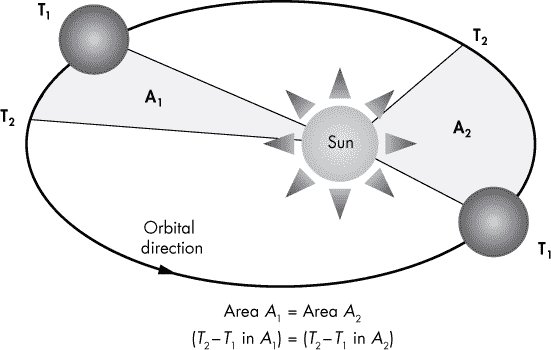

*图 14-1：开普勒行星运动第二定律：行星靠近太阳时，轨道速度增加。*

这一规律适用于所有天体，这意味着一个绕行物体在靠近它所围绕的天体时会加速，而在远离时会减速。

#### ***轨道力学***

围绕行星运行本质上是永远自由下落。你正朝着行星引力井的核心下落——这个核心位于行星的实际中心——但是你的切向速度足够快，使得你不断“错过”行星（见 图 14-2）。只要你平衡你的动量和引力的作用，轨道将永远持续下去。

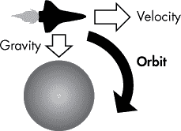

*图 14-2：当宇宙飞船的速度使其保持“自由下落”绕天体运动时，就实现了轨道。*

在太空的真空中围绕行星运行时，可能会发生一些违反直觉的现象。由于没有摩擦或风阻，宇宙飞船可能以意想不到的方式运动。

##### **向后飞行**

如果你曾经看过一集《星际迷航》，你可能注意到，绕行的*企业号*似乎像一辆汽车绕轨道行驶一样绕着行星行驶。这当然是可以做到的——而且看起来确实很酷——但它需要消耗宝贵的燃料。如果没有必要持续将航天器的某个部分指向行星，那么航天器的机头将始终指向轨道中的相同方向。因此，在每次轨道运动中，它会有一些时刻看起来像是飞行反向（参见图 14-3）。

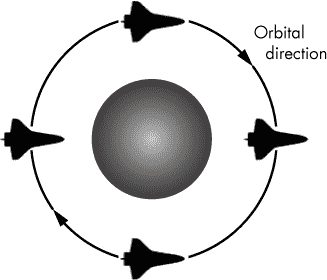

*图 14-3：航天器在轨道中保持相同的姿态，除非被迫改变。*

你可以将此归咎于牛顿和他的惯性定律，该定律指出，静止的物体保持静止，运动中的物体以相同的速度和相同的方向保持运动，除非受到不平衡力的作用。

##### **提升和降低轨道**

刹车在太空中不起作用，没有摩擦力，惯性非常顽固。为了降低航天器的轨道，你必须启动推进器来减速，使其进入行星的引力井。为了实现这一点，你必须*逆行*航天器，使它的机头朝向与当前速度矢量相反——这是一种说法，即你必须尾部先行。当然，这假设主推进器位于航天器的后部。相反，如果你想提高轨道，则需要*顺行*航天器，使其机头朝着你前进的方向。这两个概念在图 14-4 中有所展示。

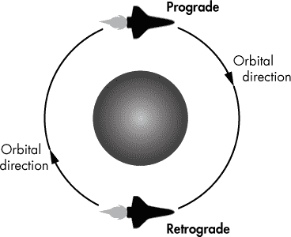

*图 14-4：顺行和逆行的定义是根据航天器的机头相对于其绕行天体的旅行方向来确定的。*

##### **采取内轨道**

如果你在轨道上追逐另一艘航天器，你是加速还是减速去追上它？根据开普勒的第二定律，你需要减速。这将降低你的轨道，从而导致更快的轨道速度。就像赛马一样，你要选择内轨道。

在图 14-5 的左侧，两个航天飞机并排在几乎相同的轨道上，以相同的速度行驶。

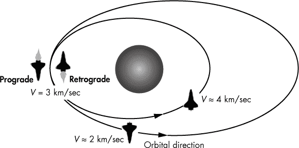

*图 14-5：轨道悖论：减速以加速！*

靠近行星的航天器旋转 180 度，进行逆行推进以减慢其即时速度。外侧的航天器进行顺行推进以增加其即时速度。它们同时停止推进，内侧航天器下降到较低的轨道，而外侧航天器转移到较高的轨道。大约一个小时后，由于离行星较近，内侧航天器的速度会变得更快，并且顺利追上并超过外侧航天器。

##### **使椭圆轨道圆化**

你可以通过在*远地点*或*近地点*施加发动机脉冲来将高椭圆轨道转为圆形轨道，具体取决于情况。远地点（如果物体绕地球轨道运行，则称为*远地点*）是椭圆轨道中的最高点——物体离其绕行天体最远的点（见图 14-6）。近地点（如果物体绕地球轨道运行，则称为*近地点*）是轨道中的最低点。


*图 14-6：椭圆轨道中远地点和近地点的位置*

为了提高近地点，航天器在远地点施加顺行推力（见图 14-7 左侧）。为了在环形化轨道的同时降低轨道，航天器必须在近地点施加逆行推力（见图 14-7 右侧）。

该机动的一个有些反直觉的部分是，初始轨道——即本应存在的轨道——和最终的实际轨道将在施加发动机脉冲的点重合。

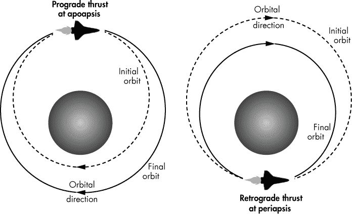

*图 14-7：在远地点环形化并提高轨道（左侧），在近地点环形化并降低轨道（右侧）*

##### **使用霍曼转移提高和降低轨道**

*霍曼转移轨道*使用椭圆轨道在同一平面内的两个圆形轨道之间进行切换（见图 14-8）。轨道可以被提升或降低。该机动相对较慢，但它消耗的燃料最少。

要改变一个轨道，使其具有不同的近地点*和*远地点，航天器需要进行两次发动机脉冲。一种脉冲将航天器推入转移轨道，另一种脉冲则将其推入最终目的地轨道。当提高轨道时，航天器将按运动方向施加速度变化，而当降低轨道时，它将施加与运动方向相反的速度变化。这些速度变化必须发生在轨道的对侧，如图 14-8 所示。如果没有第二次推力，轨道将仍然在第一次推力的点相交，如图 14-7 右侧所示。

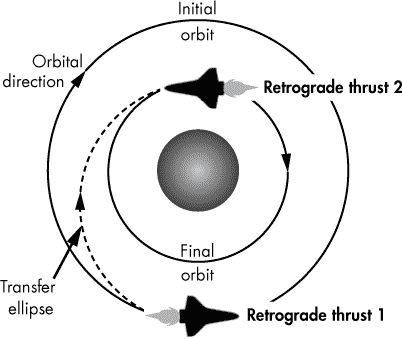

*图 14-8：使用霍曼转移技术转移到较低的圆形轨道*

##### **使用单切线烧蚀提高和降低轨道**

*单切线烧蚀*技术比霍曼转移更快地将航天器从一个轨道转移到另一个轨道，但效率较低。*烧蚀*是推力或脉冲的另一种说法。与霍曼转移一样，轨道可以被提升或降低。

这个机动需要两次发动机冲击，第一次是与轨道切线的，第二次是非切线的（见图 14-9）。如果初始轨道是圆形的，如图所示，那么轨道上的所有点都代表远地点和近地点，航天器可以在任何时候施加第一次燃烧。

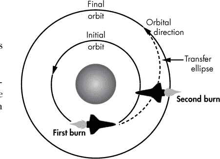

*图 14-9：通过一次切线燃烧转移到更高的圆形轨道*

就像霍曼转移一样，顺行燃烧会抬高轨道，而逆行燃烧则会降低轨道。如果轨道是椭圆形的，第一次燃烧将在远地点进行顺行燃烧以抬高轨道，或者在近地点进行逆行燃烧以降低轨道。

##### **执行螺旋轨道转移**

*螺旋转移*利用连续的低推力燃烧来改变轨道的大小。在游戏中，你可以通过使用逆行或顺行的燃烧来模拟这一过程，这些燃烧通常很短且间隔均匀，如图 14-10 所示。

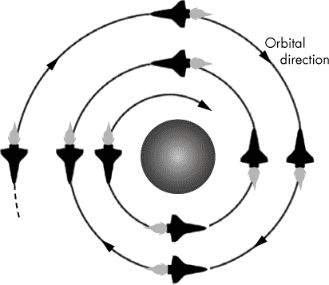

*图 14-10：通过在规则间隔内进行短时间逆行燃烧执行螺旋轨道*

为了降低轨道，所有燃烧必须是逆行的；为了抬高轨道，航天器使用顺行燃烧。

##### **执行同步轨道**

在*同步轨道*中，航天器绕行行星一圈所需的时间与行星绕其轴自转一圈的时间相同。如果同步轨道平行于赤道且没有轨道倾斜，则它是*静止轨道*；对于在被环绕体上的观察者而言，卫星在天空中的固定位置上看起来是静止的。通信卫星通常使用*地球静止轨道*，其高度为 22,236 英里，环绕地球。类似的轨道在火星上叫做*气静止轨道*，在月球上叫做*月静止轨道*。

### **项目 #22：火星轨道器游戏**

在现实生活中，一系列方程被用来精确执行轨道机动。在游戏中，你将依靠直觉、耐心和反应能力！你还需要在一定程度上依赖仪器飞行，主要使用航天器的高度显示和轨道圆形度的测量。

**目标**

使用`pygame`构建一款教学游戏，教授轨道力学的基础知识。游戏的目标是将卫星轻推到一个圆形的映射轨道中，而不至于耗尽燃料或在大气层中燃烧殆尽。

### **策略**

从游戏草图设计阶段开始，正如你在第十三章中所做的那样。这张草图应当捕捉游戏的所有关键点，比如游戏的外观、声音、运动方式以及如何与玩家进行互动（见图 14-11）。

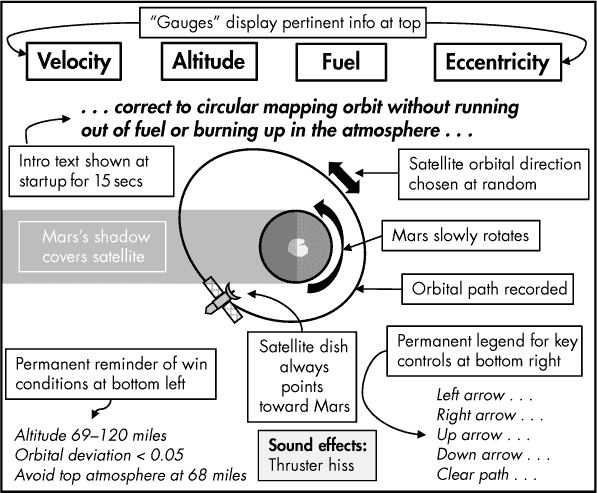

*图 14-11：火星轨道器游戏的主要玩法草图*

图 14-11 中的草图描述了主要的游戏玩法。你需要一个单独的草图来描述胜负条件。对于主要的游戏玩法，关键点如下：

+   **视角是任务控制中心。** 游戏画面应类似于任务控制中心的监视器，玩家可以通过它操作迷失的航天探测器。

+   **火星位于正中央。** 每个人都喜欢红色星球，所以它将占据漆黑屏幕的中央位置。

+   **火星是动态的。** 火星的地球仪将缓慢地围绕其轴旋转并投下阴影。当卫星经过这个阴影时，亮度会显著降低。

+   **卫星的初始轨道是随机选择的。** 卫星在启动时会以随机但受限的方向和速度出现。偶尔，这可能会导致游戏瞬间失败。这仍然比现实任务要好，现实任务有 47%的失败率！

+   **无需调整卫星的进退轨道。** 在点燃推进器之前不断旋转航天探测器会极大地削弱游戏体验。假设姿态推进器环绕在机身周围，玩家可以使用箭头键选择要点燃的推进器。

+   **点燃推进器时会发出嗡嗡声。** 尽管太空中没有声音，但每当玩家点燃推进器时，给他们带来听到一声愉快的嗡嗡声的满足感。

+   **卫星天线始终指向火星。** 卫星会慢慢地自动旋转，以使其遥感天线始终指向火星。

+   **卫星的轨道路径可见。** 一条细白线将从卫星后方延伸出来，并持续存在，直到玩家按下空格键清除它。

+   **数据读数显示在屏幕顶部。** 你将在窗口顶部的框中显示对游戏玩法有用的信息。关键数据包括航天探测器的速度、高度、燃料和轨道偏心率（轨道圆形度的度量）。

+   **启动时会显示简短的介绍。** 游戏开始时，介绍文字会出现在屏幕中央，并持续约 15 秒。该文字不会干扰游戏玩法，因此玩家可以立即开始操作卫星。

+   **胜利条件和关键控制显示在永久图例中。** 关键的信息，如任务目标和控制键，将永久显示在屏幕的左下角和右下角。

图 14-12 中的游戏草图描述了成功和失败的情况。玩家在获胜时需要奖励，而在失败时则需要有趣的结果。

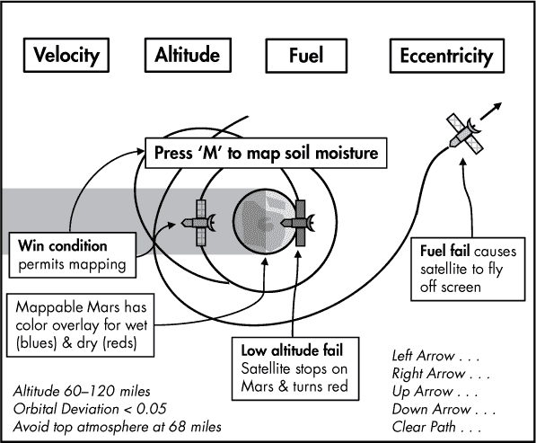

*图 14-12：火星探测器游戏中的胜负结果草图*

胜负结果的关键点如下：

+   **改变卫星图像以显示坠毁燃烧。** 如果卫星的高度降到 68 英里以下，它将在大气中燃烧。移动的卫星图像将被一个发光的红色版本替换，粘附在火星的侧面；这类似于你可能在真实的任务控制显示屏上看到的场景。

+   **卫星如果燃料耗尽，将在太空中迷失。** 尽管不现实，但如果卫星燃料耗尽，让它飞出屏幕并进入太空深处。这会让玩家感到非常沮丧！

+   **胜利条件解锁奖品。** 如果卫星在目标高度范围内达到圆形轨道，新文本会促使玩家按下 M 键。

+   **按下 M 键更换火星图像。** 当 M 键解锁后，按下它会使火星图像变为彩虹图像，其中冷色表示土壤湿度较高的区域，暖色则表示较干燥的区域。

对于游戏玩法，卫星的大小和轨道速度不会现实，但整体行为是正确的。你应该能够正确执行在《游戏中的天体动力学》一书中第 286 页描述的所有轨道机动。

### **游戏资源**

你将需要的火星轨道器游戏资源包括两张卫星图像、两张行星图像和一个音效文件。你可以在过程开始时将这些准备好，也可以在需要时再制作它们。后者的方法让你可以在编码过程中适当休息，这是一些人偏好的方式。

找到好的无版权图形和音效文件可能是一项挑战。你可以在线找到合适的资源——无论是免费的还是付费的——但最好是尽可能自己制作。这可以避免未来出现任何法律问题。

我为这个项目使用的精灵（2D 图标或图像）见图 14-13。你需要一颗卫星、一颗红色“烧毁”版的卫星、一张火星的极冠居中的视图，以及同一视图上带有彩色叠加层的图像，表示映射的土壤湿度梯度。我在免费的图标网站 AHA-SOFT (*[`www.aha-soft.com/`](http://www.aha-soft.com/)*) 找到卫星精灵，然后复制并重新着色制作了坠毁版本。两个火星精灵都是修改过的 NASA 图像，专为游戏制作。

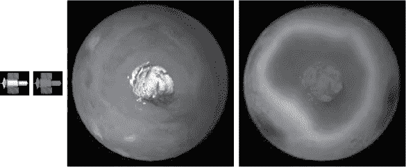

*图 14-13：用于游戏精灵的卫星、坠毁卫星、火星和火星叠加图像*

我为卫星启动推进器时制作了一个声音文件，使用开源程序 Audacity 中的白噪声生成器。你可以在 *[`www.audacityteam.org/`](https://www.audacityteam.org/)* 下载 Audacity 的免费版本。我将文件保存为 *Ogg Vorbis* 格式，这是一种开源标准音频压缩格式，免费且与 Python 和 `pygame` 配合良好。你也可以使用其他格式，如 MP3 和 WAV，但有些格式存在已知问题，或包含专有组件，在你尝试将游戏商业化时可能会引发法律问题。

你可以从本书的官方网站下载这些文件，文件名分别为 *[`www.nostarch.com/impracticalpython/`](https://www.nostarch.com/impracticalpython/)* 中的 *satellite.png*、*satellite_crash_40x33.png*、*mars.png*、*mars_water.png* 和 *thrust_audio.ogg*。下载时，请保留文件名，并将其存放在与代码相同的文件夹中。

### **代码**

图 14-14 是你将构建的最终游戏屏幕示例。你可以参考此图来了解代码的作用。

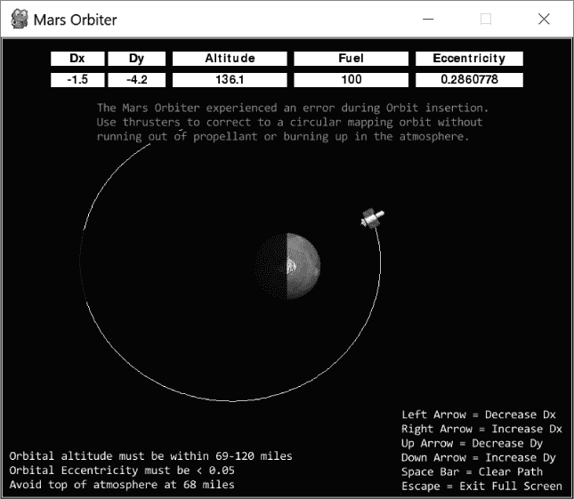

*图 14-14：最终版本的 mars_orbiter.py 游戏启动屏幕示例*

你可以在 *[`www.nostarch.com/impracticalpython/`](https://www.nostarch.com/impracticalpython/)* 下载完整的程序 (*mars_orbiter.py*)。

#### ***导入并构建颜色表***

列表 14-1 导入所需的模块并构建一个颜色表。

*mars_orbiter.py,* 第一部分

```py
➊ import os
   import math
   import random
   import pygame as pg

➋ WHITE = (255, 255, 255)
   BLACK = (0, 0, 0)
   RED = (255, 0, 0)
   GREEN = (0, 255, 0)
   LT_BLUE = (173, 216, 230)
```

*列表 14-1：导入模块并构建颜色表*

首先，导入操作系统模块，使用 `os` ➊。游戏将在全屏模式下启动，但玩家可以选择退出全屏。这个模块将允许你在玩家按下 ESC 后控制游戏窗口的位置。

你将使用 `math` 模块进行重力和三角计算，使用 `random` 来为卫星生成随机位置和速度。像 第十三章 中一样导入 `pygame`，并用 `pg` 代替 `pygame`，以减少输入量。

最后，像 第十三章 中一样，构建一个 RGB 颜色表 ➋。这让你在需要分配颜色时，可以直接输入颜色名称，而不是 RGB 值元组。

#### ***定义卫星类的初始化方法***

列表 14-2 定义了 `Satellite` 类及其初始化方法，你将在游戏中使用这个方法来实例化卫星对象。由于该方法定义较长，所以分为两个列表展示。

*mars_orbiter.py,* 第二部分

```py
➊ class Satellite(pg.sprite.Sprite):
       """Satellite object that rotates to face planet & crashes & burns."""

    ➋ def __init__(self, background):
        ➌ super().__init__()
        ➍ self.background = background
        ➎ self.image_sat = pg.image.load("satellite.png").convert()
           self.image_crash = pg.image.load("satellite_crash_40x33.png").convert()
        ➏ self.image = self.image_sat
        ➐ self.rect = self.image.get_rect()
        ➑ self.image.set_colorkey(BLACK)  # sets transparent color
```

*列表 14-2：定义卫星类初始化方法的第一部分*

为`Satellite`对象 ➊ 定义一个类；如果你需要复习面向对象编程，阅读第十一章。将`pygame`的`Sprite`类传递给它，因为从`Satellite`类实例化的对象将是精灵。如第十三章所述，`Sprite`是一个内置类，用于作为创建精灵的模板。你的新类将从这个基类继承精灵所需的特性，包括重要的属性如`rect`和`image`，你稍后会处理这些属性。

接下来，为`Satellite`对象 ➋ 定义`__init__()`方法，并传入`self`，这个名字在类定义中有特殊含义，指代当前对象。你还需要传入一个`background`对象。卫星的轨迹将会绘制在这个对象上。

在`__init_()`方法内，立即使用`super` ➌ 调用内置`Sprite`类的初始化方法。这将初始化精灵并建立它所需的`rect`和`image`属性。通过`super`，你无需显式引用基类（`Sprite`）。有关`super`的更多信息，请参见清单 11-5 和第 229 页，或访问文档* [`docs.python.org/3/library/functions.html?highlight=super#super`](https://docs.python.org/3/library/functions.html?highlight=super#super) *。

接下来，将`background`作为对象属性 ➍ 赋值给`self`。然后使用`pygame`的`image.load()`方法加载你的两个卫星图像——一个是正常的，另一个是烧毁后的——并在同一步骤中对它们运行`convert()`方法 ➎。此方法将对象转换为`pygame`可以高效使用的图形格式，一旦游戏循环开始。如果没有这一步，游戏可能会明显变慢，因为`png`格式会在每秒 30 次或更多的速度下动态转换。

你一次只会使用一个卫星图像，取决于玩家是否在大气层中烧毁，因此使用通用的`self.image`属性来保存加载和转换后的图像 ➏。未烧毁的卫星图像将作为默认图像；如果卫星对象接近火星，这个图像将被红色的烧毁图像替换。

现在，获取图像的矩形信息 ➐。记住，`pygame`将精灵放置在矩形表面对象上，它需要知道这些矩形的尺寸和位置，以便在游戏运行时进行处理。

最后，使卫星图像的黑色部分变得透明 ➑。卫星图标位于黑色背景上（见图 14-13），你希望烧毁后的图像部分覆盖火星，因此使用`BLACK`常量与图像对象的`colorkey()`方法将图标的背景设置为透明。否则，你会看到一个黑色框和一个红色的卫星图像重叠在火星上。注意，如果你想输入黑色的 RGB 值，你需要将其作为元组输入：`(0, 0, 0)`。

#### ***设置卫星的初始位置、速度、燃料和音效***

清单 14-3 完成了`Satellite`类初始化方法的定义。卫星对象的初始位置和速度是从有限范围内随机选择的；遥感天线的方向被初始化，油箱被加满，音效被添加。

*mars_orbiter.py,* 第三部分

```py
        ➊ self.x = random.randrange(315, 425)
           self.y = random.randrange(70, 180)
        ➋ self.dx = random.choice([-3, 3])
        ➌ self.dy = 0
        ➍ self.heading = 0  # initializes dish orientation
        ➎ self.fuel = 100
           self.mass = 1
           self.distance = 0  # initializes distance between satellite & planet
        ➏ self.thrust = pg.mixer.Sound('thrust_audio.ogg')
        ➐ self.thrust.set_volume(0.07)  # valid values are 0-1
```

*清单 14-3：通过初始化参数完成* Satellite *类初始化方法*

游戏开始时，卫星将在屏幕顶部附近的一个随机点出现。你将从一系列 x 和 y 值中选择准确的位置 ➊。

你还将随机选择卫星的速度，但它会足够慢，确保卫星无法逃脱轨道。将速度随机设置为-3 或 3。负值会导致卫星沿逆时针方向运行，反之亦然。仅使用 delta-x（`dx`）属性 ➋，让重力来处理`dy`。正如在第十三章中讨论的那样，`pygame`通过改变 x 坐标（称为 delta-x 或*dx*）和 y 坐标（称为 delta-y 或*dy*）来移动精灵。这些向量分量会在每个游戏循环中被计算并加到精灵的当前位置（`self.x`，`self.y`）上。

接下来，将`dy`属性设置为`0` ➌。稍后，`gravity()`方法将在加速新实例化的卫星向行星下方移动时建立一个初始的`dy`值。

为卫星的航向分配一个属性 ➍。遥感天线将读取行星表面的土壤湿度，应始终指向火星。如果你记得图 14-3，除非克服惯性，否则这不会发生。你将使用一个方法来实际旋转卫星，所以现在只需将`heading`属性初始化为`0`。

现在，将油箱加满 100 单位燃料 ➎。若想与现实生活相联系，它可能代表 100 千克的肼，类似于*麦哲伦*探测器上用于绘制金星表面的燃料。

接下来，将物体的质量设置为`1`。这基本上意味着你将在重力方程中仅使用火星的质量，因为你需要将两个物体的质量相乘。如前所述，卫星对火星的引力可以忽略不计，因此不需要计算它。卫星的`mass`属性是为了完整性和作为占位符，以便以后如果你想尝试不同的值时可以使用。

以下`distance`属性存储了卫星与它正在绕行的天体之间的距离。实际值将通过稍后你定义的方法来计算。

现在是时候添加音效了。你将在 `main()` 函数中初始化 `pygame` 的声音混音器，但目前，先为推力音效命名一个 `thrust` 属性 ➏。将白噪声的短片段以 Ogg Vorbis 格式（*.ogg*）传递给混音器的 `Sound` 类。最后，设置播放音量，使用 0 到 1 之间的值 ➐。你可能需要根据你的 PC 来校准这个值。理想情况下，你希望设置一个值，让每个玩家至少能够*听到*，然后通过他们自己的计算机音量控制进行微调。

#### ***启动推进器并检查玩家输入***

清单 14-4 定义了 `Satellite` 类的 `thruster()` 和 `check_keys()` 方法。第一个方法确定当卫星的某个推进器被启动时执行的操作。第二个方法检查玩家是否通过按下箭头键与推进器进行了交互。

*mars_orbiter.py* 第四部分

```py
    ➊ def thruster(self, dx, dy):
           """Execute actions associated with firing thrusters."""
        ➋ self.dx += dx
           self.dy += dy
        ➌ self.fuel -= 2
        ➍ self.thrust.play()

    ➎ def check_keys(self):
           """Check if user presses arrow keys & call thruster() method."""
        ➏ keys = pg.key.get_pressed()
           # fire thrusters
        ➐ if keys[pg.K_RIGHT]:
            ➑ self.thruster(dx=0.05, dy=0)
           elif keys[pg.K_LEFT]:
               self.thruster(dx=-0.05, dy=0)
           elif keys[pg.K_UP]:
               self.thruster(dx=0, dy=-0.05)
           elif keys[pg.K_DOWN]:
               self.thruster(dx=0, dy=0.05)
```

*清单 14-4：为* Satellite *类定义了* thruster() *和* check_keys() *方法*

`thruster()` 方法以 `self`、`dx` 和 `dy` 作为参数 ➊。后两个参数可以是正数或负数，它们会立即加到卫星的 `self.dx` 和 `self.dy` 速度分量上 ➋。接下来，燃料水平减少两个单位 ➌。改变这个值是一种让游戏变得更难或更容易的方法。最后，调用 `thrust` 音频属性的 `play()` 方法，播放嘶嘶声 ➍。请注意，面向对象编程（OOP）方法不是*返回*值，而是*更新*现有的对象属性。

`check_keys()` 方法以 `self` 作为参数 ➎。首先，你使用 `pygame` 的 `key` 模块来判断玩家是否按下了某个键 ➏。`get_pressed()` 方法返回一个布尔值元组——`1` 表示 `True`，`0` 表示 `False`——代表当前每个键的状态。`True` 表示该键已被按下。你可以通过使用键常量来索引这个元组。你可以在 *[`www.pygame.org/docs/ref/key.html`](https://www.pygame.org/docs/ref/key.html)* 查找所有键盘常量的列表。

例如，右箭头键是 `K_RIGHT`。如果按下了这个键 ➐，调用 `thruster()` 方法，并传递 `dx` 和 `dy` 值 ➑。在 `pygame` 中，x 值向屏幕右侧增大，y 值向屏幕下方增大。因此，如果用户按下左箭头键，应该从 `dx` 中减去；同样地，如果按下上箭头键，应该减小 `dy` 值。右箭头键将增加 `dx`，下箭头键将增加 `dy`。屏幕顶部的数据显示将帮助玩家将卫星的运动与底层的 `dx` 和 `dy` 值联系起来（见 图 14-14）。

#### ***定位卫星***

仍然在`卫星`类中，列表 14-5 定义了`locate()`方法。这个方法计算卫星与行星之间的距离，并确定指向行星的天线航向。你稍后会使用距离属性来计算引力和轨道的*偏心率*。偏心率是衡量轨道偏离完美圆形的程度。

*mars_orbiter.py*，第五部分

```py
    ➊ def locate(self, planet):
           """Calculate distance & heading to planet."""
        ➋ px, py = planet.x, planet.y
        ➌ dist_x = self.x - px
           dist_y = self.y - py
           # get direction to planet to point dish
        ➍ planet_dir_radians = math.atan2(dist_x, dist_y)
        ➎ self.heading = planet_dir_radians * 180 / math.pi
        ➏ self.heading -= 90  # sprite is traveling tail-first
        ➐ self.distance = math.hypot(dist_x, dist_y)
```

*列表 14-5：为*卫星*类定义了`locate()`方法*

要定位卫星，你需要将`locate()`方法传递给`卫星`（`self`）和`行星`对象 ➊。首先，确定对象在 x-y 平面上的距离。获取行星的 x 和 y 属性 ➋；然后从卫星的 x 和 y 属性中减去它们 ➌。

现在，使用这些新的距离变量来计算卫星航向与行星之间的角度，从而可以将卫星天线旋转到指向行星的位置。`math`模块使用弧度，因此分配一个名为`planet_dir_radians`的局部变量来存储方向的弧度，并将`dist_x`和`dist_y`传递给`math.atan2()`函数来计算反正切 ➍。由于`pygame`使用的是角度（唉），你需要使用标准公式将弧度转换为角度；或者，你可以使用`math`模块来完成这项操作，但有时候看到幕后的人会更好 ➎。这个应该是卫星对象的一个共享属性，命名为`self.heading`。

在`pygame`中，精灵的前方默认是朝东的，这意味着卫星精灵是尾部优先地绕行的（参见图 14-13 中的卫星图标）。为了让天线指向火星，你需要从航向角度减去 90 度，因为负角度在`pygame`中会导致*顺时针*旋转 ➏。这一操作不会使用玩家的任何燃料配额。

最后，使用`math`模块计算卫星与火星之间的欧几里得距离，通过计算 x 和 y 分量的斜边 ➐。你应该将这个值设为卫星对象的一个属性，因为稍后在其他函数中你将会用到它。

**注意**

*在实际生活中，有多种方法可以使卫星的天线始终指向行星，而不消耗大量的燃料。技术包括缓慢翻滚或旋转卫星、使天线端比另一端更重、使用磁力矩或使用内部飞轮——也叫做反应轮或动量轮。飞轮使用电动机，可以通过太阳能电池板提供电力，从而消除了对重型和有毒液体推进剂的需求。*

#### ***旋转卫星并绘制其轨道***

列表 14-6 通过为卫星天线旋转指向行星并绘制轨迹定义了`卫星`类的后续方法。稍后，在`main()`函数中，你将添加代码，让玩家按下空格键即可删除并重新开始轨迹。

*mars_orbiter.py,* 第六部分

```py
    ➊ def rotate(self):
           """Rotate satellite using degrees so dish faces planet."""
        ➋ self.image = pg.transform.rotate(self.image_sat, self.heading)
        ➌ self.rect = self.image.get_rect()

    ➍ def path(self):
           """Update satellite’s position & draw line to trace orbital path."""
        ➎ last_center = (self.x, self.y)
        ➏ self.x += self.dx
           self.y += self.dy
        ➐ pg.draw.line(self.background, WHITE, last_center, (self.x, self.y))
```

*列表 14-6：定义了* rotate() *和* path() *方法用于* Satellite *类*

`rotate()`方法将使用在`locate()`方法中计算的`heading`属性来将卫星天线指向火星。将`self`传递给`rotate()` ➊，这意味着当它被调用时，`rotate()`方法将自动将卫星对象的名称作为参数。

现在，使用`pygame`的`transform.rotate()`方法旋转卫星图像 ➋。将原始图像传递给它，然后传递`heading`属性；将这些赋值给`self.image`属性，这样你就不会破坏原始的主图像。你需要在每次游戏循环中都对图像进行变换，而快速变换图像会导致它质量下降。因此，每次进行变换时，始终保留一张主图像，并基于主图像创建一个新的副本来进行操作。

通过获取变换后的图像的`rect`对象来结束该函数 ➌。

接下来，定义一个名为`path()`的方法，并将`self`传递给它 ➍。这个方法将绘制一条线标记卫星的路径，并且因为绘制一条线需要两个点，所以在移动卫星之前，先分配一个变量来记录卫星的中心位置（元组） ➎。然后使用`dx`和`dy`属性增加 x 和 y 的位置 ➏。最后，使用`pygame`的`draw.line()`方法来定义这条线 ➐。该方法需要一个绘图对象，因此传递`background`属性，然后是线条颜色以及之前和当前的 x-y 位置元组。

#### ***更新卫星对象***

列表 14-7 更新卫星对象并完成类定义。精灵对象几乎总是有一个`update()`方法，该方法在游戏运行时每帧调用一次。所有发生在精灵上的操作，比如移动、颜色变化、用户交互等，都包括在这个方法中。为了避免它们变得过于复杂，`update()`方法通常会调用其他方法。

*mars_orbiter.py,* 第七部分

```py
    ➊ def update(self):
           """Update satellite object during game."""
        ➋ self.check_keys()
        ➌ self.rotate()
        ➍ self.path()
        ➎ self.rect.center = (self.x, self.y)
           # change image to fiery red if in atmosphere
        ➏ if self.dx == 0 and self.dy == 0:
               self.image = self.image_crash
               self.image.set_colorkey(BLACK)
```

*列表 14-7：定义了* update() *方法用于* Satellite *类*

从定义`update()`方法并将对象或`self`传递给它开始 ➊。接下来，调用你之前定义的方法。第一个方法检查玩家通过键盘进行的交互 ➋。第二个方法旋转卫星对象，使得天线始终指向火星 ➌。最后一个方法更新卫星的 x-y 位置，并在它后面绘制路径，以便你可以看到轨道 ➍。

程序需要跟踪卫星精灵的位置，因为它绕火星轨道运行，所以要分配一个`rect.center`属性，并将其设置为卫星当前的 x-y 位置 ➎。

最后一部分代码在玩家在大气层中坠毁时会更改卫星图像 ➏。火星大气层的顶部大约位于其*表面*上方 68 英里。出于我稍后解释的原因，假设 68 的高度值——这是从*行星中心*测量的像素数——等同于大气层的顶部。如果卫星在游戏过程中低于此高度，`main()`函数将把它的速度——由`dx`和`dy`表示——设置为`0`。检查这两个值是否为`0`，如果是，则将图像更改为`image_crash`，并将其背景设置为透明（就像之前为主卫星图像所做的那样）。

#### ***定义 Planet 类初始化方法***

列表 14-8 定义了`Planet`类，你将用它来实例化一个`planet`对象。

*mars_orbiter.py,* 第八部分

```py
➊ class Planet(pg.sprite.Sprite):
       """Planet object that rotates & projects gravity field."""

    ➋ def __init__(self):
           super().__init__()
        ➌ self.image_mars = pg.image.load("mars.png").convert()
           self.image_water = pg.image.load("mars_water.png").convert()
        ➍ self.image_copy = pg.transform.scale(self.image_mars, (100, 100))
        ➎ self.image_copy.set_colorkey(BLACK)
        ➏ self.rect = self.image_copy.get_rect()
           self.image = self.image_copy
        ➐ self.mass = 2000
        ➑ self.x = 400
           self.y = 320
           self.rect.center = (self.x, self.y)
        ➒ self.angle = math.degrees(0)
           self.rotate_by = math.degrees(0.01)
```

*列表 14-8：开始定义* Planet *类*

你现在可能已经非常熟悉创建`Planet`类的初步步骤。首先，你用大写字母命名类，然后将`Sprite`类传递给它，这样它就可以方便地继承这个内置`pygame`类的特性 ➊。接下来，你为`planet`对象定义一个`__init__()`初始化方法 ➋。然后，像在`Satellite`类中一样调用`super()`初始化方法。

将图像作为属性加载，并同时将其转换为`pygame`的图形格式 ➌。你需要正常的火星图像和用于映射土壤湿度的图像。你可以使用原始尺寸的卫星精灵，但火星图像太大。将图像缩放到 100 像素 × 100 像素 ➍，并将缩放后的图像分配给一个新属性，这样重复转换就不会损坏原始图像。

现在，将变换后的图像的透明颜色设置为黑色，正如你之前对卫星图像所做的那样 ➎。`pygame`中的精灵都“安装”在矩形表面上，如果你不让黑色透明，行星表面的角落可能会重叠并覆盖卫星绘制的白色轨道路径（见图 14-15）。

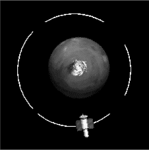

*图 14-15：火星* rect *覆盖轨道路径的角落*

和往常一样，获取精灵的`rect`对象 ➏。接下来会有另一个转换，所以再次复制图像属性并将其命名为`self.image`。

为了施加重力，行星需要质量，因此命名一个`mass`属性并将其值设为`2000` ➐。之前你将卫星的质量设为`1`；这意味着火星的质量是卫星的 2000 倍！这没问题，因为你并不是使用现实世界的单位，时间和距离的尺度也与现实不同。如果你将距离缩放，使得卫星离火星只有几百个像素，你也需要缩放重力。尽管如此，卫星仍会根据重力表现得非常现实。

行星的质量值是通过实验确定的。为了缩放重力，你可以在之后更改此质量值，或者使用引力常数（`G`）变量。

将 `planet` 对象的 `x` 和 `y` 属性设置为屏幕的中心点——你将在 `main()` 函数中使用 800 × 645 的屏幕大小——并将这些值分配给 `rect` 对象的中心 ➑。

最后，分配你需要的属性来慢慢旋转火星绕其轴 ➒。你将使用与旋转卫星时相同的 `transform.rotate()` 方法，因此你需要创建一个 `angle` 属性。然后，使用一个 `rotate_by` 属性来指定每次游戏循环中旋转角度的增量（单位：度）。

#### ***旋转行星***

清单 14-9 通过定义 `rotate()` 方法继续实现 `Planet` 类。该方法使行星绕其轴旋转，并在每个游戏循环中进行微小的变化。

*mars_orbiter.py,* 第九部分

```py
    ➊ def rotate(self):
           """Rotate the planet image with each game loop."""
        ➋ last_center = self.rect.center
        ➌ self.image = pg.transform.rotate(self.image_copy, self.angle)
           self.rect = self.image.get_rect()
        ➍ self.rect.center = last_center
        ➎ self.angle += self.rotate_by
```

*清单 14-9：定义了一个使行星绕其轴旋转的方法*

`rotate()` 方法还将对象作为参数 ➊。随着方形火星图像的旋转，边界矩形对象（`rect`）保持不动，并且必须扩展以适应新的配置（参见 图 14-16）。这种大小的变化可能会影响 `rect` 的中心点，因此需要分配一个 `last_center` 变量，并将其设置为行星的当前中心点 ➋。如果不这样做，火星在游戏运行时会绕其轴心晃动。

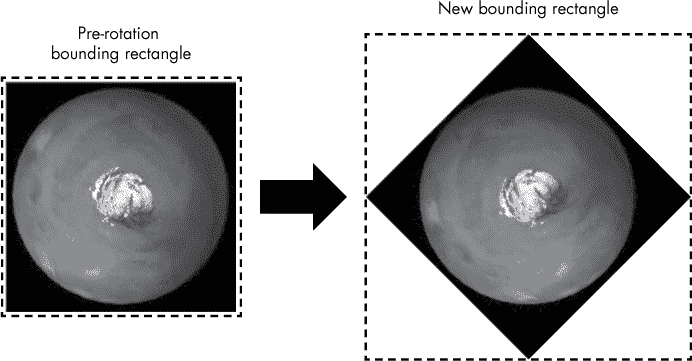

*图 14-16：边界矩形的大小发生变化，以适应旋转的图像。*

接下来，使用 `pygame` 的 `transform.rotate()` 方法旋转复制的图像，并将其分配给 `self.image` 属性 ➌；你需要将复制的图像和 `angle` 属性传递给该方法。旋转后，立即重置图像的 `rect` 属性，并将其中心位置移回 `last_center`，以避免旋转过程中发生的 `rect` 偏移 ➍。

当 `planet` 对象被实例化时，角度属性将从 0 度开始，然后每帧增加 0.1——通过 `rotate_by` 属性进行赋值 ➎。

#### ***定义 gravity() 和 update() 方法***

清单 14-10 通过定义 `gravity()` 和 `update()` 方法来完成 `Planet` 类。在第十三章中，你将重力视为一个施加在 y 轴方向的常量。此处应用的方法稍微复杂一些，因为它考虑了两个物体之间的距离。

*mars_orbiter.py,* 第十部分

```py
    ➊ def gravity(self, satellite):

           """Calculate impact of gravity on satellite."""

        ➋ G = 1.0  # gravitational constant for game

        ➌ dist_x = self.x - satellite.x

           dist_y = self.y - satellite.y

           distance = math.hypot(dist_x, dist_y)

           # normalize to a unit vector

        ➍ dist_x /= distance

           dist_y /= distance

           # apply gravity (dx & dy represent pixels/frame)

        ➎ force = G * (satellite.mass * self.mass) / (math.pow(distance, 2))

        ➏ satellite.dx += (dist_x * force)

           satellite.dy += (dist_y * force)

    ➐ def update(self):

           """Call the rotate method."""

           self.rotate()
```

*清单 14-10：定义了 `Planet` 类的* gravity() *和* update() *方法*

定义 `gravity()` 方法并传递 `self` 和卫星对象 ➊。你仍然在 `Planet` 类中，所以这里的 `self` 代表火星。

首先命名一个本地变量 `G`；大写的 G 是 *万有引力常数*，也叫做 *比例常数* ➋。现实中，这个数值非常小，是通过经验得出的，基本上是一个转换数，用于将所有单位计算正确。由于在游戏中你不使用现实世界的单位，因此将其设置为 `1`；这样它就不会对重力方程产生影响。在游戏开发过程中，你可以调节这个常数的大小，以微调重力的强度及其对轨道物体的影响。

你需要知道这两个物体之间的距离，因此先获取它们在 x 方向和 y 方向上的距离 ➌。然后，使用 `math` 模块的 `hypot()` 方法来获取欧几里得距离。这将表示重力方程中的 *r*。

由于你将直接在重力方程中处理卫星与火星之间的距离的 *大小*，你从距离向量中需要的只是 *方向*。因此，将 `dist_x` 和 `dist_y` 除以 `distance` 来“归一化”这个向量，使其成为一个大小为 `1` 的单位向量 ➍。你基本上是在将直角三角形每条边的长度除以它的斜边。这保留了向量的方向，由 `dist_x` 和 `dist_y` 的相对差异表示，但将其大小设置为 `1`。注意，如果你不执行此归一化步骤，结果将是不现实但有趣的（见 图 14-17）。

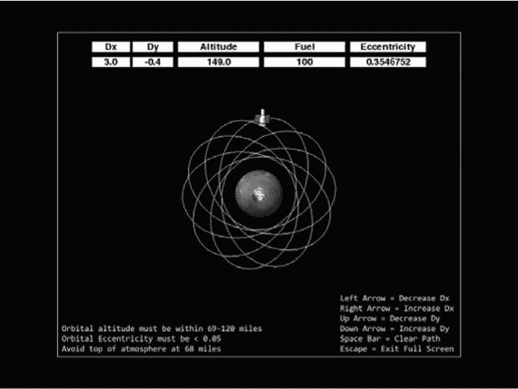

*图 14-17：“Spirograph” 轨道，使用未归一化的距离向量产生*

使用牛顿的公式计算重力，公式我在 “万有引力定律” 中已经描述过，见 第 286 页 ➎。最后，将归一化的距离乘以 `force`——计算每一步加速度如何改变速度——并将这些值加到卫星对象的 `dx` 和 `dy` 属性上 ➏。

请注意，你并没有将这些变量作为 `self` 的属性进行赋值。这些只是方法中的中间步骤，不需要与其他方法共享，你可以像在过程式编程中一样将它们当作局部变量来处理。

最后，定义一个将在每个游戏循环中调用的方法，用于更新 `planet` 对象 ➐。使用它来调用 `rotate()` 方法。

#### ***计算偏心率***

你已经完成了类的定义。现在是时候定义一些函数，帮助你运行游戏了。清单 14-11 定义了一个计算卫星轨道偏心率的函数。玩家需要在某个特定的高度范围内实现一个圆形轨道，而这个函数将提供圆形度的测量。

*mars_orbiter.py,* 第十一部分

```py
➊ def calc_eccentricity(dist_list):
       """Calculate & return eccentricity from list of radii."""
    ➋ apoapsis = max(dist_list)
       periapsis = min(dist_list)
    ➌ eccentricity = (apoapsis - periapsis) / (apoapsis + periapsis)
       return eccentricity
```

*清单 14-11：定义一个用于测量轨道偏心率的函数*

定义`calc_eccentricity()`函数，并传入一个距离列表 ➊。在`main()`函数中，每次游戏循环时，你将把`sat.distance`属性——记录卫星高度——添加到该列表中。要计算偏心率，你需要知道轨道的远地点和近地点。通过在该列表中查找最大值和最小值来获得它们 ➋。然后，计算`eccentricity` ➌。稍后，在`main()`函数中，你将以八位小数显示这个数值，让它在数据输出中看起来既酷又精确。

注意，圆形轨道的远地点和近地点值相同，因此对于完美的圆形轨道，计算结果将为`0`。通过返回`eccentricity`变量来结束该函数。

#### ***定义函数以创建标签***

游戏将需要大量的文本用于指令和遥测数据输出。逐行显示这些文本会导致代码冗余，因此列表 14-12 将定义两个函数——一个用于发布指令，另一个用于显示你需要与玩家分享的速度、高度、燃料和偏心率数据流。

*mars_orbiter.py,* 第十二部分

```py
➊ def instruct_label(screen, text, color, x, y):
       """Take screen, list of strings, color, & origin & render text to screen."""
    ➋ instruct_font = pg.font.SysFont(None, 25)
    ➌ line_spacing = 22
    ➍ for index, line in enumerate(text):
           label = instruct_font.render(line, True, color, BLACK)
           screen.blit(label, (x, y + index * line_spacing))

➎ def box_label(screen, text, dimensions):
       """Make fixed-size label from screen, text & left, top, width, height."""
       readout_font = pg.font.SysFont(None, 27)
    ➏ base = pg.Rect(dimensions)
    ➐ pg.draw.rect(screen, WHITE, base, 0)
    ➑ label = readout_font.render(text, True, BLACK)
    ➒ label_rect = label.get_rect(center=base.center)
    ➓ screen.blit(label, label_rect)
```

*列表 14-12：定义函数以创建指令和输出标签*

定义一个名为`instruct_label()`的函数，用于在游戏屏幕上显示指令 ➊。将屏幕、包含文本的列表、文本颜色以及`pygame` `surface`对象的左上角坐标传递给它，这个`surface`对象将用于承载文本。

接下来，告诉`pygame`使用哪个字体 ➋。`font.SysFont()`方法的参数包括字体和大小。使用`None`作为字体类型时，会调用`pygame`的内置默认字体，这个字体应该能在多个平台上工作。注意，该方法接受`None`和`'None'`两种格式。

介绍和指令文本将占用多行（参见图 14-14 中的示例）。你需要指定文本字符串之间的行间距（单位：像素），因此为此分配一个变量，并将其设置为`22` ➌。

现在，开始遍历文本字符串列表 ➍。使用`enumerate()`获取索引，这个索引将与`line_spacing`变量一起，用于将字符串显示在正确的位置。文本需要被放置在一个表面上。将此表面命名为`label`，并将你想显示的文本行传递给`font.render()`方法，启用抗锯齿以使文本更平滑，设置文本颜色，并将背景色设置为黑色。最后，通过 blit 将该表面绘制到屏幕上。将`label`变量和左上角坐标传递给方法，`y`的值定义为`y + index * line_spacing`。

接下来，定义一个名为`box_label()`的函数，用于屏幕顶部作为仪表显示的数据输出标签（参见图 14-18） ➎。此函数的参数包括屏幕、文本和一个包含矩形表面尺寸的元组，矩形表面将用于形成仪表。


*图 14-18：游戏窗口顶部的读数标签（上方为标题标签，下方为数据标签）*

`instruct_label()` 函数创建的表面会根据显示的文本量自动调整大小。这对于静态显示很好用，但读数数据会不断变化，导致仪表随着调整文本大小而扩展或收缩。为了解决这个问题，你将使用一个单独的 `rect` 对象，指定大小来作为文本对象的基础。

从设置字体开始，正如你在 ➋ 中做的那样。将一个变量 `base` 赋值为 `pygame` 的 `rect` 对象；使用 `dimensions` 参数来指定大小 ➏。该参数允许你通过指定矩形的左上角坐标、宽度和高度，精确地放置矩形的位置。生成的矩形应该足够宽，以容纳游戏将要显示的最长数据读数。

现在，使用 `draw_rect()` 方法 ➐ 绘制 `base`。参数包括绘图表面、填充颜色、`rect` 的名称和宽度为 `0`，这样填充矩形而不是绘制边框。你将把文本对象放在这个白色矩形的顶部。

重复渲染文本 ➑ 的代码，然后获取 `label` 的 `rect` ➒。注意，在 `get_rect()` 方法中有一个参数，将中心设置为 `base` 的中心。这使得你可以将文本标签放置在白色的基础矩形上方。最后，将其绘制到屏幕上，指定源矩形和目标矩形 ➓。

#### ***映射土壤湿度***

清单 14-13 定义了允许玩家在满足游戏胜利条件时“映射”火星的函数。当玩家按下 M 键时，这些函数将由 `main()` 函数调用，行星的图像将被一个彩色叠加图层替换，我们假装它表示土壤湿度。当玩家松开按键时，火星的正常视图将恢复。键盘检查也将在 `main()` 函数中执行。

*mars_orbiter.py,* 第十三部分

```py
➊ def mapping_on(planet):
       """Show soil moisture image of planet."""
    ➋ last_center = planet.rect.center
    ➌ planet.image_copy = pg.transform.scale(planet.image_water, (100, 100))
    ➍ planet.image_copy.set_colorkey(BLACK)
       planet.rect = planet.image_copy.get_rect()
       planet.rect.center = last_center

➎ def mapping_off(planet):
       """Restore normal planet image."""
    ➏ planet.image_copy = pg.transform.scale(planet.image_mars, (100, 100))
       planet.image_copy.set_colorkey(BLACK)
```

*清单 14-13：定义函数，使玩家能够制作火星的土壤湿度地图*

首先定义一个函数，该函数以 `planet` 对象作为参数 ➊。开始时，像在 清单 14-9 中一样赋值一个 `last_center` 变量；它将用于防止行星在轴上摇晃 ➋。

接下来，将火星的水图像缩放为与正常图像相同的大小，并将其赋值给行星的 `image_copy` 属性，因为如果反复使用转换，会降低图像质量 ➌。将图像的背景设置为透明 ➍，获取其 `rect`，并将 `rect` 的中心设置为 `last_center` 变量；这样火星就能保持在屏幕中央。

现在，定义另一个函数，用于当玩家停止主动绘制火星时 ➎。它也将`planet`对象作为参数。你只需要做的就是将行星图像重置为原始版本 ➏。因为你仍在使用`image_copy`属性，所以无需重新获取`rect`，但需要设置透明色。

#### ***投射阴影***

清单 14-14 定义了一个函数，为火星添加“黑暗面”并在行星后方投射阴影。阴影将是一个黑色的半透明矩形，其右边缘与行星精灵的中心对齐（参见图 14-19）。这假设太阳位于屏幕的右侧，并且火星上是春分或秋分。

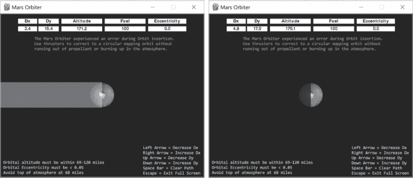

*图 14-19：半透明白色的阴影矩形（左）和最终的半透明黑色（右）*

*mars_orbiter.py,* 第十四部分

```py
➊ def cast_shadow(screen):
       """Add optional terminator & shadow behind planet to screen."""
    ➋ shadow = pg.Surface((400, 100), flags=pg.SRCALPHA)  # tuple is w,h
    ➌ shadow.fill((0, 0, 0, 210))  # last number sets transparency
       screen.blit(shadow, (0, 270))  # tuple is top left coordinates
```

*清单 14-14：定义一个函数，为火星添加一个黑暗面并让它投射阴影*

`cast_shadow()`函数将`screen`对象作为参数 ➊。分配一个 400 像素×100 像素的`pygame`表面给一个名为`shadow`的对象 ➋。使用`pygame`的`SRCALPHA`标志——表示“源 alpha”——来指示将使用每像素的 alpha（透明度）。将对象填充为黑色，并将 alpha 值——由最后一个数字表示——设置为`210` ➌。Alpha 是 RGBA 颜色系统的一部分，值的范围是 0 到 255，所以这个值非常暗，但不是完全不透明。最后，将表面绘制到屏幕上，并指定其左上角的坐标。要关闭阴影，只需注释掉`main()`中的函数调用或将 alpha 值设置为`0`。

#### ***定义 main() 函数***

清单 14-15 开始定义运行游戏的`main()`函数。初始化了`pygame`包和声音混音器，设置了游戏屏幕，并将玩家指令存储为列表。

*mars_orbiter.py,* 第十五部分

```py
def main():
       """Set up labels & instructions, create objects & run the game loop."""
    ➊ pg.init()  # initialize pygame

       # set up display:
    ➋ os.environ['SDL_VIDEO_WINDOW_POS'] = '700, 100'  # set game window origin
    ➌ screen = pg.display.set_mode((800, 645), pg.FULLSCREEN)
    ➍ pg.display.set_caption("Mars Orbiter")
    ➎ background = pg.Surface(screen.get_size())

    ➏ pg.mixer.init()  # for sound effects

    ➐ intro_text = [
           ' The Mars Orbiter experienced an error during Orbit insertion.',
           ' Use thrusters to correct to a circular mapping orbit without',
           ' running out of propellant or burning up in the atmosphere.'
           ]

       instruct_text1 = [
           'Orbital altitude must be within 69-120 miles',
           'Orbital Eccentricity must be < 0.05',
           'Avoid top of atmosphere at 68 miles'
           ]

       instruct_text2 = [
           'Left Arrow = Decrease Dx',
           'Right Arrow = Increase Dx',
           'Up Arrow = Decrease Dy',
           'Down Arrow = Increase Dy',
           'Space Bar = Clear Path',
           'Escape = Exit Full Screen'
           ]
```

*清单 14-15：通过初始化`pygame`和声音混音器并设置游戏屏幕和指令，启动`main()`函数*

通过初始化`pygame` ➊，开始`main()`函数。然后，使用`os`模块的`environ()`方法来分配游戏窗口左上角的坐标 ➋。这一步不是严格必要的，但我想演示你可以控制窗口在桌面上的显示位置。

接下来，分配一个变量来保存`screen`对象，并将显示模式设置为全屏 ➌。如果玩家退出全屏模式，则使用元组`(800, 645)`来指定屏幕大小。

现在使用`pygame`的`display.set_caption()`方法将游戏窗口命名为“火星轨道器” ➍。然后，使用`pygame`的`Surface`类创建一个与屏幕大小相同的游戏背景对象 ➎。

初始化`pygame`的声音混音器，以便播放推进器的音效 ➏。你在卫星的初始化方法中已经定义了这个声音。

游戏将从一个简短的介绍开始，该介绍将在 15 秒后消失。描述键盘控制和获胜条件的永久性图例位于屏幕的底部角落。将这些内容作为列表输入➐。稍后，你将把这些列表传递给你在 Listing 14-12 中编写的`instruct_label()`函数。列表中的每个项目，通过逗号分隔，将在游戏窗口中作为单独的行显示（见 Figure 14-19）。

#### ***实例化对象，设置轨道验证，映射和计时功能***

Listing 14-16，仍然在`main()`函数中，实例化了`planet`和`satellite`对象，分配了一些有用的变量来确定轨道偏心率，准备了函数中的游戏时钟，并分配了一个变量来跟踪映射功能的状态。

*mars_orbiter.py,* 第十六部分

```py
       # instantiate planet and satellite objects
    ➊ planet = Planet()
    ➋ planet_sprite = pg.sprite.Group(planet)
    ➌ sat = Satellite(background)
    ➍ sat_sprite = pg.sprite.Group(sat)

       # for circular orbit verification
    ➎ dist_list = []
    ➏ eccentricity = 1
    ➐ eccentricity_calc_interval = 5  # optimized for 120 mile altitude

       # time keeping
    ➑ clock = pg.time.Clock()
       fps = 30
       tick_count = 0

       # for soil moisture mapping functionality
    ➒ mapping_enabled = False
```

*Listing 14-16：在*main()中实例化对象并分配有用变量

继续编写`main()`函数，创建一个`planet`对象，来自`Planet`类➊，然后将其放入一个精灵组中➋。记住，在第十三章中提到，`pygame`使用名为*groups*的容器来管理精灵。

接下来，实例化一个卫星对象，将`Satellite`类的初始化方法与`background`对象传递➌。卫星需要`background`来绘制它的轨迹。

创建卫星后，将其放入自己的精灵组中 ➍。通常，你应将截然不同的精灵类型放在自己的容器中。这使得管理显示顺序和碰撞处理变得更容易。

现在，分配一些变量来帮助计算偏心率。开始一个空列表，用来存储每个游戏循环中计算出的距离值➎，然后将`eccentricity`变量设置为占位符值`1`➏，表示一个非圆形的起始轨道。

你需要定期更新`eccentricity`变量，以评估玩家对轨道所做的任何更改。记住，你需要轨道的远地点和近地点来计算偏心率，对于大的椭圆轨道，可能需要一段时间来实际采样这些值。好消息是，你只需要考虑“获胜”轨道在 69 到 120 英里之间。因此，你可以优化 120 英里以下轨道的采样率，通常卫星精灵完成这些轨道所需时间不到 6 秒。使用 5 秒并将该值分配给`eccentricity_calc_interval`变量➐。这意味着，对于高于 120 英里的轨道，计算出的偏心率可能不完全正确，但考虑到轨道在该高度不符合获胜条件，它足够准确。

接下来处理时间管理。使用一个`clock`变量来保存`pygame`的游戏时钟，它将控制游戏的速度，单位是每秒帧数 ➑。每一帧代表时钟的一个刻度。将名为`fps`的变量赋值为`30`，这意味着游戏每秒更新 30 次。接下来，赋值一个`tick_count`变量，用于判断何时清除介绍文本，以及何时调用`calc_eccentricity()`函数。

在这一部分结束时，命名一个变量来启用映射功能，并将其设置为`False` ➒。如果玩家达到获胜条件，你将把它改为`True`。

#### ***启动游戏循环并播放声音***

列表 14-17，仍然在`main()`函数中，启动了游戏时钟和`while`循环，也称为*游戏循环*。它还会接收事件，例如玩家使用方向键发射推进器。如果玩家发射推进器，则播放 Ogg Vorbis 音频文件，玩家会听到令人满意的嘶嘶声。

*mars_orbiter.py*，第十七部分

```py
    ➊ running = True
       while running:
        ➋ clock.tick(fps)
           tick_count += 1
        ➌ dist_list.append(sat.distance)

           # get keyboard input
        ➍ for event in pg.event.get():
            ➎ if event.type == pg.QUIT:  # close window
                   running = False
            ➏ elif event.type == pg.KEYDOWN and event.key == pg.K_ESCAPE:
                   screen = pg.display.set_mode((800, 645))  # exit full screen
            ➐ elif event.type == pg.KEYDOWN and event.key == pg.K_SPACE:
                   background.fill(BLACK)  # clear path
            ➑ elif event.type == pg.KEYUP:
                ➒ sat.thrust.stop()  # stop sound
                   mapping_off(planet)  # turn off moisture map view
            ➓ elif mapping_enabled:
                   if event.type == pg.KEYDOWN and event.key == pg.K_m:
                       mapping_on(planet)
```

*列表 14-17：在* main() *中启动游戏循环，获取事件并播放声音*

首先为`while`循环分配一个`running`变量，用来控制运行游戏的状态 ➊，然后开始循环。使用时钟的`tick()`方法设置游戏速度，并传入你在前一个列表中命名的`fps`变量 ➋。如果游戏感觉很慢，可以将速度设置为 40 fps。对于每一帧—即每一轮循环—通过时钟递增计数器 1。

接下来，将卫星对象的`sat.distance`值添加到`dist_list` ➌。这个值表示卫星与行星之间的距离，每个游戏循环通过卫星的`locate()`方法进行计算。

现在，收集玩家通过键盘输入的数据 ➍。正如前一章所述，`pygame`会记录每一次用户交互—称为*事件*—并保存在事件缓冲区中。`event.get()`方法创建一个事件列表，你可以使用`if`语句对其进行评估。在开始时，检查玩家是否关闭了窗口以退出游戏 ➎。如果为`True`，将`running`设置为`False`以结束游戏循环。

如果玩家按下 ESC 键，则表示退出全屏模式，因此使用在`main()`开始时调用的`display.set_mode()`方法将屏幕大小重置为 800 × 645 像素 ➏。如果玩家按下空格键，将背景填充为黑色，这样可以擦除卫星的白色轨道路径 ➐。

当玩家按下方向键时，卫星对象会播放嘶嘶声，但`check_keys()`方法中并没有任何指示它停止播放的内容。因此，传递`pygame`任何`KEYUP`事件 ➑；当`pygame`检测到玩家释放方向键时，调用`stop()`方法来停止`thrust`播放声音 ➒。

为了绘制火星，玩家必须按住 M 键，因此使用相同的`KEYUP`事件来调用`mapping_off()`函数。这将把行星图像重置为正常的未映射状态。

最后，检查`mapping_enabled`变量是否为`True`，意味着玩家已经达成胜利条件并准备绘制火星 ➓。如果玩家按下 M 键，调用`mapping_on()`函数以显示土壤湿度覆盖层，替代行星的常规视图。

#### ***应用重力、计算偏心率并处理失败情况***

清单 14-18 通过对卫星施加重力并计算其轨道的偏心率，继续执行`main()`函数的`while`循环。偏心率值将决定轨道是否为圆形，这是游戏的一个胜利条件。该清单还绘制背景并响应燃料耗尽或在大气层中烧毁的失败条件。

*mars_orbiter.py*，第十八部分

```py
           # get heading & distance to planet & apply gravity
        ➊ sat.locate(planet)
           planet.gravity(sat)

           # calculate orbital eccentricity
        ➋ if tick_count % (eccentricity_calc_interval * fps) == 0:
               eccentricity = calc_eccentricity(dist_list)
            ➌ dist_list = []

           # re-blit background for drawing command - prevents clearing path
        ➍ screen.blit(background, (0, 0))

           # Fuel/Altitude fail conditions
        ➎ if sat.fuel <= 0:
            ➏ instruct_label(screen, ['Fuel Depleted!'], RED, 340, 195)
               sat.fuel = 0
               sat.dx = 2
        ➐ elif sat.distance <= 68:
               instruct_label(screen, ['Atmospheric Entry!'], RED, 320, 195)
               sat.dx = 0
               sat.dy = 0
```

*清单 14-18：应用重力，计算偏心率并处理失败条件*

调用卫星的`locate()`方法，并将`planet`对象作为参数传递 ➊。该方法计算指向火星的航向和距离，您可以使用这些信息来调整天线、计算轨道偏心率并应用重力。然后，为了施加重力，调用行星的`gravity()`方法并将卫星对象传递给它。

如果`tick_count`与`eccentricity_calc_interval` `*` `fps`的模运算结果为`0` ➋，调用计算偏心率的函数，并将`dist_list`变量传递给它。然后，将`dist_list`变量重置为`0`，以重新开始距离采样 ➌。

接下来，调用屏幕的`blit()`方法，并将背景和左上角的坐标传递给它 ➍。此语句的位置很重要。例如，如果将它移到更新精灵的代码之后，您将无法在游戏屏幕上看到卫星或火星。

现在，处理玩家在未实现圆形轨道之前燃料耗尽的情况。首先，从卫星对象的`fuel`属性获取当前燃料水平 ➎。如果燃料水平为`0`或以下，使用`instruct_label()`函数宣布燃料已耗尽 ➏，然后将卫星的`dx`属性设置为`2`。这将使卫星精灵快速飞出屏幕并进入太空深处，海拔读数会越来越大。尽管不太现实，这可以确保玩家知道他们已经失败！

最后一个失败案例是当玩家在大气层中烧毁时。如果卫星的`distance`属性小于或等于`68` ➐，在屏幕中央附近显示一个标签，告知玩家他们已经进入大气层，然后将卫星的速度属性设置为`0`。这将使重力将精灵锁定在行星上（图 14-20）。此外，当`dx`和`dy`为`0`时，卫星的`update()`方法（清单 14-7）将把卫星的图像切换为红色的“坠毁”版本。

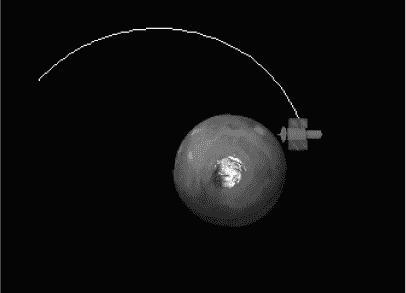

*图 14-20：卫星在坠毁配置下*

高度参数有点像作弊，因为高度等同于`distance`属性，它是从行星和卫星精灵的*中心*测量的，而不是从行星的*表面*到卫星的距离。这归结于比例问题。行星的大气层是非常薄的薄层——在游戏的比例下，火星的大气层厚度不到 2 像素！根据游戏设计，当卫星天线的尖端擦到行星时，卫星会燃烧，但由于卫星精灵的大小不现实地大，因此精灵的 68 英里的中心点必须推得更远。

#### ***奖励成功、更新和绘制精灵***

清单 14-19，仍在`main()`函数的`while`循环中，通过启用功能让获胜玩家能够映射火星土壤的湿度。在现实生活中，这可能通过雷达或微波共振器来完成，它们可以远程测量裸土中的湿度，深度可以达到几英寸。该清单还会更新行星和卫星精灵，并将它们绘制到屏幕上。

*mars_orbiter.py,* 第十九部分

```py
           # enable mapping functionality
        ➊ if eccentricity < 0.05 and sat.distance >= 69 and sat.distance <= 120:
            ➋ map_instruct = ['Press & hold M to map soil moisture']
               instruct_label(screen, map_instruct, LT_BLUE, 250, 175)
            ➌ mapping_enabled = True
           else:
               mapping_enabled = False

        ➍ planet_sprite.update()
        ➎ planet_sprite.draw(screen)
           sat_sprite.update()
           sat_sprite.draw(screen)
```

*清单 14-19：启用映射功能并在游戏循环中更新精灵*

如果轨道是圆形并且满足高度要求➊，显示一条信息，提示玩家按 M 键映射土壤湿度➋。将文本放在括号中，因为`instruct_label()`函数期望的是一个列表。将文本颜色设置为浅蓝色，并将其放置在屏幕中央附近。

接下来，将`mapping_enabled`变量设置为`True` ➌；否则，如果轨道偏离目标参数，则将其设置为`False`。

最后，通过精灵组➍调用行星精灵的`update()`方法，然后实际将其绘制到屏幕上➎。`draw()`方法的参数是`screen`，即绘制精灵的对象。对卫星精灵重复这些步骤。

#### ***显示指令和遥测并投射阴影***

清单 14-20 通过显示指令、数据读取和行星的阴影来完成`while`循环和`main()`函数。游戏介绍文本只会在启动时短暂显示。

*mars_orbiter.py,* 第二十部分

```py
           # display intro text for 15 seconds
        ➊ if pg.time.get_ticks() <= 15000:  # time in milliseconds
               instruct_label(screen, intro_text, GREEN, 145, 100)

           # display telemetry and instructions
        ➋ box_label(screen, 'Dx', (70, 20, 75, 20))
           box_label(screen, 'Dy', (150, 20, 80, 20))
           box_label(screen, 'Altitude', (240, 20, 160, 20))
           box_label(screen, 'Fuel', (410, 20, 160, 20))
           box_label(screen, 'Eccentricity', (580, 20, 150, 20))

        ➌ box_label(screen, '{:.1f}'.format(sat.dx), (70, 50, 75, 20))
           box_label(screen, '{:.1f}'.format(sat.dy), (150, 50, 80, 20))
           box_label(screen, '{:.1f}'.format(sat.distance), (240, 50, 160, 20))
           box_label(screen, '{}'.format(sat.fuel), (410, 50, 160, 20))
           box_label(screen, '{:.8f}'.format(eccentricity), (580, 50, 150, 20))

        ➍ instruct_label(screen, instruct_text1, WHITE, 10, 575)
           instruct_label(screen, instruct_text2, WHITE, 570, 510)

           # add terminator & border
        ➎ cast_shadow(screen)
        ➏ pg.draw.rect(screen, WHITE, (1, 1, 798, 643), 1)

        ➐ pg.display.flip()

➑ if __name__ == "__main__":
       main()
```

*清单 14-20：显示文本和行星阴影，并调用* main() *函数*

概述游戏的文本应该悬停在屏幕中央，足够时间让玩家阅读，然后消失。使用`if`语句和`pygame`的`tick.get_ticks()`方法来控制，后者返回自游戏开始以来经过的毫秒数。如果过去的时间少于 15 秒，则使用`instruct_label()`函数以绿色显示清单 14-15 中的文本列表。

接下来，制作数据读数的仪表，从头部框开始。使用`box_label()`函数，并为每一个五个读数仪表调用它 ➋。对数据读数 ➌ 重复此操作。请注意，当你将文本传递给函数时，可以使用字符串格式方法。

使用`instruct_label()`函数将清单 14-15 中制作的指令放置在屏幕的底角 ➍。如果你想区分描述获胜条件的指令和定义关键功能的指令，可以自由更改文本颜色。

现在，调用显示行星阴影的函数 ➎，然后作为最后的修饰，使用`pygame`的`draw.rect()`方法添加一个边框 ➏。传递给它`screen`对象、边框颜色、角落坐标和线宽。

完成`main()`函数及其游戏循环，通过翻转显示器 ➐。正如前一章所描述的，`flip()`方法将所有内容从屏幕对象复制到可视显示器上。

最后，在全局空间中调用`main()`，使用标准语法使其独立运行或作为模块 ➑。

### **总结**

在本章中，你使用`pygame`构建了一个 2D 街机风格的游戏，包含图像精灵、音效和键盘游戏控制。你还创造了一种有趣的启发式方法来学习轨道力学。在《游戏中的天体动力学》一节中展示的所有技术都应该适用于此游戏。在接下来的“挑战项目”部分，你可以继续改进游戏和玩家体验。

### **挑战项目**

通过根据以下建议改进火星轨道器游戏并添加新挑战，打造属于你自己的游戏。和往常一样，挑战项目没有提供解决方案。

#### ***游戏标题画面***

复制并编辑*mars_orbiter.py*程序，使得标题画面在主游戏画面之前短暂出现。让标题画面显示一个类似于*火星全球探测器*的 NASA 任务徽章（参见图 14-21），但要使其在游戏中独特于火星轨道器。你可以在*[`space.jpl.nasa.gov/art/patches.html`](https://space.jpl.nasa.gov/art/patches.html)*查看一些其他彩色的 NASA 徽章。


*图 14-21:* 火星全球探测器 *任务徽章*

#### ***智能仪表***

复制并编辑*mars_orbiter.py*程序，使得当高度和偏心率读数超出目标范围时，使用红色背景或红色文本颜色。注意：圆形偏心率值应该保持红色，直到高度值处于范围内！

#### ***无线电黑障***

复制并编辑*mars_orbiter.py*程序，使得当卫星位于`shadow`矩形区域内时，键盘控制被锁定。

#### ***得分系统***

复制并编辑 *mars_orbiter.py* 程序，使其能够对玩家进行评分，并保持最佳成绩在可显示的高分榜中。最高得分会奖励那些达到最低允许轨道同时使用最少燃料并在最短时间内完成任务的玩家。例如，得分中的燃料部分可以是剩余燃料的数量；轨道部分可以是最大允许高度（120）减去圆形轨道的高度；时间部分可以是达到圆形轨道所花时间的倒数乘以 1,000。将三个部分加在一起，得到最终得分。

#### ***策略指南***

复制并编辑 *mars_orbiter.py* 程序，使其包含一个弹出式策略指南或帮助文件，可以通过加入“为玩家设计的天体动力学”中的一些图像来实现，见第 286 页。例如，在说明中添加一行，告诉玩家按住 H 键以获得帮助。这样可以显示并循环显示不同轨道机动的图像，如霍曼转移轨道或单切点烧制。务必包含对每种技术的优缺点的评论，并在指南打开时暂停游戏。

#### ***气动刹车***

气动刹车是一种节省燃料的技术，通过大气摩擦减缓航天器的速度（图 14-22）。复制并编辑 *mars_orbiter.py* 程序以包含气动刹车。在 `main()` 函数中，将最低获胜高度设置为 70 英里，最低安全高度设置为 60 英里。如果卫星的高度在 60 到 70 英里之间，减少其速度。

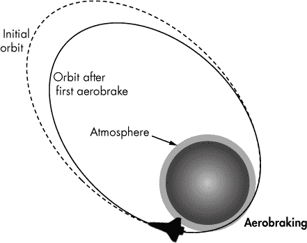

*图 14-22：使用大气层代替逆行烧制来圆化轨道*

图 14-23 是游戏中使用气动刹车来圆化椭圆轨道的示例。大气层的顶部设置为 80 英里。气动刹车起到了类似于在近日点进行逆行烧制的作用，但你必须小心且有耐心，先将轨道从大气层中抬升，再将其圆化。

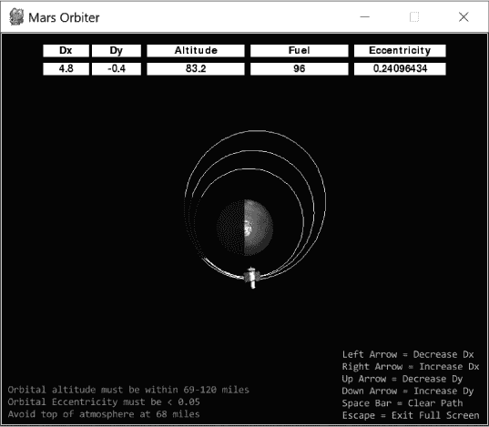

*图 14-23：使用气动刹车圆化轨道。注意低燃料消耗。*

NASA 使用了类似的技术将 *Mars Global Surveyor* 从其椭圆捕获轨道移动到最终的绘图轨道。这个过程花费了几个月的时间，因为他们需要保护航天器免于在大气中过热。

#### ***入侵警报！***

复制并编辑 *mars_orbiter.py* 程序，创建一个新的 `planet` 对象，并让它在屏幕上飞行，通过引力干扰卫星的轨道。创建一个新的精灵来表示彗星或小行星，并以随机间隔发射它（但不要发射得 *太* 频繁！）。不要将火星的 `gravity()` 方法应用于该对象，以免它进入火星轨道，而是将新对象的 `gravity()` 方法应用于卫星。调整新对象的质量，使其能明显扰动卫星的轨道，扰动范围大约为 100 像素左右。允许该对象经过火星或卫星而不发生碰撞。

#### ***过顶***

当前，火星轨道器使用的是 *赤道* 轨道。这是为了简化编码，因为只需要旋转一个火星图像。但真实的映射轨道使用极轨道——即垂直于赤道轨道的轨道——并经过行星的两极（见 图 14-24）。随着行星在轨道下方旋转，卫星能够映射其整个表面。而在赤道轨道上，由于行星表面的曲率，高纬度区域基本无法映射（见 图 14-24 中的虚线）。

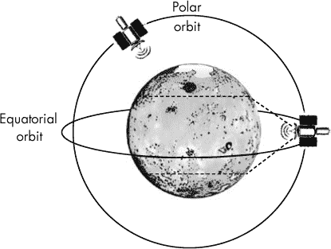

*图 14-24：极轨与赤道轨道；赤道轨道的假想北极和南极映射边界由虚线表示。*

复制并编辑 *mars_orbiter.py* 程序，使卫星沿极轨道运行。这只需要更换火星图像。但你不能再使用单一的俯视图像；视角需要垂直于行星的自转轴。视频示例见 *[`youtu.be/IP2SDbhFbXk`](https://youtu.be/IP2SDbhFbXk)*；火星动画 gif 示例见 *[`gph.is/2caBKKS`](http://gph.is/2caBKKS)*。你不能直接在 `pygame` 中使用动画 gif，但可以将它们分解并使用单独的帧。在线可以找到分解帧的工具，在下一章中，你将使用这些工具从视频中提取图像。
