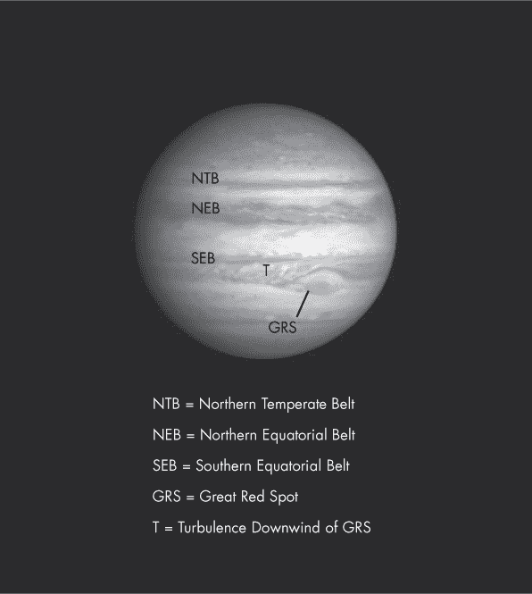
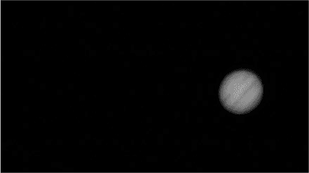
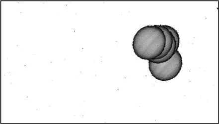
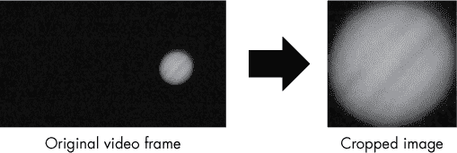
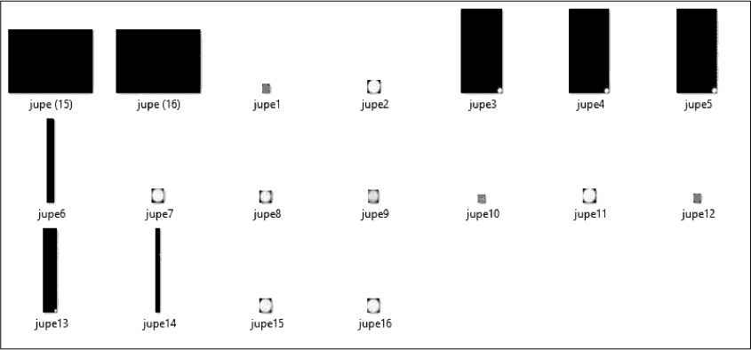
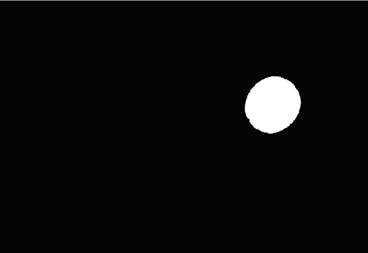
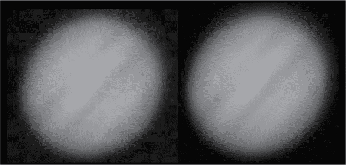
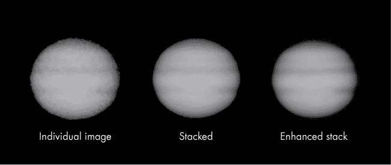
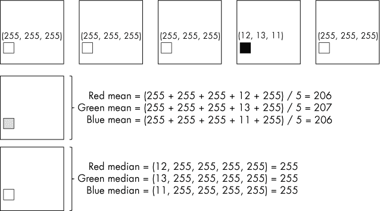
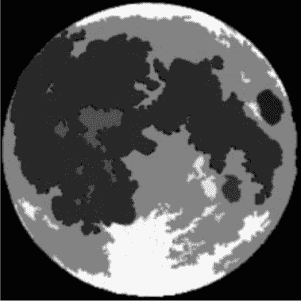

## **15

**通过行星叠加提高天体摄影质量**

如果你曾通过望远镜观察木星、火星或土星，可能会感到有些失望。行星看起来小而无特色。你想放大并增加倍率，但没有效果。任何超过大约 200 倍的放大镜头往往会变得模糊。

问题出在空气湍流，或天文学家所称的*视像*。即使在一个晴朗的夜晚，空气也在不断流动，伴随着热气上升和下降气流，这些气流很容易使代表天体的光点模糊不清。但是，随着 1980 年代*电荷耦合器件（CCD）*的商业化，天文学家找到了一种克服湍流的方法。数字摄影允许一种名为*图像叠加*的技术，通过这种技术，许多照片——有些好，有些差——被一起平均或叠加成一张单独的图像。通过足够多的照片，持久且不变的特征（如行星的表面）会占据短暂变化的特征（如偶尔的云层）。这使得天体摄影师能够提高放大极限，并弥补不理想的视像条件。

在本章中，你将使用一个名为 pillow 的第三方 Python 模块来叠加数百张木星的照片。结果将是一个信噪比比任何单独的帧都要高的图像。你还将处理与 Python 代码不同文件夹中的文件，并使用 Python 的操作系统（os）和 Shell 工具（shutil）模块来操作这些文件和文件夹。

### **项目 #23：叠加木星**

巨大、明亮且色彩斑斓的气体巨星木星是天体摄影师的热门拍摄对象。即使是业余望远镜也能分辨出木星的橙色条纹，这些条纹由线状云带形成，以及大红斑——一个椭圆形的风暴，巨大到足以吞噬地球（见图 15-1）。

*图 15-1：卡西尼号拍摄的木星*

木星是研究图像叠加的绝佳对象。它的线状云带和大红斑为眼睛提供了校准点，用来判断边缘定义和清晰度的改善，而且它相对较大的尺寸使得噪声更容易被检测到。

噪声表现为“颗粒感”。每个颜色带都有其自己的伪影，导致图像中出现彩色斑点。噪声的主要来源是相机（电子读取噪声和热信号）以及来自光本身的光子噪声，因为随时间推移，传感器接收到的光子数量是可变的。幸运的是，噪声伪影本质上是随机的，可以通过叠加图像在很大程度上被消除。

**目标**

编写程序裁剪、缩放、叠加和增强图像，以创建更清晰的木星照片。

### **pillow 模块**

要处理图像，你需要一个免费的第三方 Python 模块，叫做 Pillow。它是 Python 图像库（PIL）的继任项目，而 PIL 在 2011 年已经停用。Pillow 模块是从 PIL 仓库“分叉”出来的，并且将代码升级到了 Python 3。

你可以在 Windows、macOS 和 Linux 上使用 Pillow，它支持多种图像格式，包括 PNG、JPEG、GIF、BMP 和 TIFF。它提供了标准的图像处理程序，例如更改单个像素、遮罩、处理透明度、过滤和增强，以及添加文本。但 Pillow 的真正优势在于它能轻松编辑大量图像。

使用 pip 工具安装 Pillow 非常简单（有关 pip 的更多信息，请参见“使用 python-docx 操作 Word 文档”第 110 页）。在命令行中输入 pip install pillow 即可。

大多数主要的 Linux 发行版已经将 Pillow 包含在以前包含 PIL 的包中，因此你可能已经在系统上安装了 Pillow。无论你使用的是哪个平台，如果 PIL 已经安装，你需要先卸载它，再安装 Pillow。有关更多安装说明，请参见 *[`pillow.readthedocs.io/en/latest/installation.html`](http://pillow.readthedocs.io/en/latest/installation.html)*。

### **操作文件和文件夹**

在本书的所有前面项目中，你将支持文件和模块保存在与 Python 代码相同的文件夹中。这对于简单项目来说很方便，但对于广泛使用来说并不现实，尤其是在处理本项目中将生成的数百个图像文件时，这肯定不适合。幸运的是，Python 提供了几个可以帮助处理这一问题的模块，如 os 和 shutil。但首先，我会简要讨论目录路径。

#### ***目录路径***

目录路径是文件或文件夹的地址。它从根目录开始，在 Windows 中用一个字母表示（例如 *C:\*），而在基于 Unix 的系统中用正斜杠 (*/*) 表示。Windows 中的其他驱动器会分配不同于 *C* 的字母，macOS 中的驱动器位于 */volume* 下，Unix 中的驱动器位于 */mnt* 下（表示“挂载”）。

**注意**

*我在本章中的示例使用的是 Windows 操作系统，但你也可以在 macOS 和其他系统上实现相同的效果。并且，像通常那样，我在这里交替使用了*目录* 和 *文件夹* 这两个术语。*

路径名在不同操作系统上表现不同。Windows 使用反斜杠 (*\*) 来分隔文件夹，而 macOS 和 Unix 系统使用正斜杠 (*/*)。另外，在 Unix 中，文件夹和文件名是区分大小写的。

如果你在 Windows 中编写程序并输入带有反斜杠的路径名，其他平台将无法识别这些路径。幸运的是，os.path.join() 方法将自动确保你的路径名适合 Python 正在运行的操作系统。让我们在 Listing 15-1 中看一下这个示例，和其他一些例子。

➊ >>> import os

➋ >>> os.getcwd()

'C:\\Python35\\Lib\\idlelib'

➌ >>> os.chdir('C:\\Python35\\Python 3 Stuff')

>>> os.getcwd()

'C:\\Python35\\Python 3 Stuff'

➍ >>> os.chdir(r'C:\Python35\Python 3 Stuff\Planet Stacking')

>>> os.getcwd()

➎ 'C:\\Python35\\Python 3 Stuff\\Planet Stacking'

➏ >>> os.path.join('Planet Stacking', 'stack_8', '8file262.jpg')

'Planet Stacking\\stack_8\\8file262.jpg'

➐ >>> os.path.normpath('C:/Python35/Python 3 Stuff')

'C:\\Python35\\Python 3 Stuff'

➑ >>> os.chdir('C:/Python35')

>>> os.getcwd()

'C:\\Python35'

*清单 15-1：使用* os *模块处理 Windows 路径名*

在导入 os 模块以访问操作系统相关的功能 ➊ 后，获取*当前工作目录*，或 *cwd* ➋。cwd 在进程启动时会被分配；也就是说，当你从 shell 运行脚本时，shell 和脚本的 cwd 会相同。对于 Python 程序，cwd 就是包含程序的文件夹。当你获取 cwd 时，会显示完整路径。注意，你必须使用额外的反斜杠来转义作为文件分隔符的反斜杠字符。

接下来，使用 os.chdir() 方法 ➌，传入带引号的完整路径，并使用双反斜杠来更改当前工作目录（cwd）。然后再次获取 cwd，以查看新的路径。

如果你不想输入双反斜杠，可以在路径名参数字符串前加上 r，将其转换为*原始字符串* ➍。原始字符串使用不同的反斜杠转义规则，但即便是原始字符串，也不能以单个反斜杠结尾。路径仍然会显示为双反斜杠 ➎。

如果你希望你的程序兼容所有操作系统，可以使用 os.path.join() 方法，并将文件夹名和文件名传递给它，且不使用分隔符字符 ➏。os.path 方法会根据你使用的系统返回正确的分隔符，这使得文件名和文件夹名可以在不同平台之间独立操作。

os.path.normpath() 方法会根据你使用的系统纠正分隔符 ➐。以 Windows 示例为例，不正确的 Unix 类型分隔符会被替换为反斜杠。原生 Windows 系统也支持使用正斜杠，并会自动进行转换 ➑。

完整的目录路径，从根目录开始，称为*绝对路径*。你可以使用称为*相对路径*的快捷方式，使得目录操作更加简便。相对路径是从当前工作目录的角度进行解析的。而绝对路径从正斜杠或驱动器标签开始，相对路径则不是。以下代码片段中，你可以在不输入绝对路径的情况下更改目录——Python 会意识到新的位置，因为它*位于* cwd 之内。幕后，Python 会将相对路径与通向 cwd 的路径连接起来，形成一个完整的绝对路径。

>>> os.getcwd()

'C:\\Python35\\Python 3 Stuff'

>>> os.chdir('Planet Stacking')

>>> os.getcwd()

'C:\\Python35\\Python 3 Stuff\\Planet Stacking'

你可以通过点（.）和点点（..）来识别文件夹并减少输入。例如，在 Windows 中，.\ 指代当前工作目录（cwd），而..\ 指代包含当前工作目录的父目录。你还可以使用点来获取当前工作目录的绝对路径：

>>> os.path.abspath('.')

'C:\\Python35\\Python 3 Stuff\\Planet Stacking\\for_book'

点文件夹可以在 Windows、macOS 和 Linux 中使用。有关 os 模块的更多信息，请参阅 *[`docs.python.org/3/library/os.html`](https://docs.python.org/3/library/os.html)*。

#### ***Shell 工具模块***

shell 工具模块 shutil 提供了用于处理文件和文件夹的高级功能，如复制、移动、重命名和删除。由于它是 Python 标准库的一部分，你只需输入 `import shutil` 就可以加载该模块。在本章的代码部分，你将看到该模块的示例用法。同时，你可以在 *[`docs.python.org/3.7/library/shutil.html`](https://docs.python.org/3.7/library/shutil.html)* 查阅该模块的文档。

### **视频**

Brooks Clark 在德克萨斯州休斯敦的一个有风的夜晚录制了本项目中使用的木星彩色视频。视频文件为 101 MB 的 *.mov* 文件，时长约 16 秒。

视频的长度故意设置得很短。木星的自转周期大约为 10 小时，这意味着在曝光时间仅为一分钟的情况下，静态照片可能会模糊，而你希望通过堆叠视频帧来增强的特征可能会发生位置变化，极大地增加了处理的复杂性。

为了将视频帧转换为单独的图像，我使用了 Free Studio，这是一个由 DVDVideoSoft 开发的多媒体免费软件集。Free Video to JPG Converter 工具可以按固定时间或帧间隔捕捉图像。我将间隔设置为覆盖整个视频的帧，以提高在空气平静、能见度良好的时候捕捉到一些图像的概率。

几百张图像应该足以通过堆叠显示出可见的改善。在这个例子中，我捕捉了 256 帧。

你可以在书籍的在线资源中找到名为 *video_frames* 的图像文件夹，网址为 *[`www.nostarch.com/impracticalpython/`](https://www.nostarch.com/impracticalpython/)*。下载此文件夹并保持文件夹名称不变。

来自视频的示例帧（灰度图）显示在图 15-2 中。木星的云带模糊且淡薄，大红斑不明显，图像对比度低，这是放大常见的副作用。噪声伪影也使木星看起来颗粒感较强。

*图 15-2：来自木星视频的示例帧*

除了这些问题外，风还摇动了相机，不精确的跟踪导致行星向画面左侧漂移。你可以在图 15-3 中看到 *横向漂移* 的示例，其中我将五个随机选定的帧叠加，并将黑色背景设为透明。

*图 15-3：基于五个随机选择的帧，在木星视频中出现的抖动和漂移示例*

运动不一定是坏事，因为移动图像可以平滑与 CCD 传感器表面、镜头或传感器上的灰尘等相关的缺陷。但图像堆叠的关键假设是，图像能够完美对齐，以便持久特征，如木星的云带，在平均图像时互相增强。为了使信噪比高，图像必须经过配准。

*图像配准*是将数据转换为相同坐标系的过程，以便进行比较和整合。配准可以说是图像堆叠中最困难的部分。天文学家通常使用商业软件——如 RegiStax、RegiStar、Deep Sky Stacker 或 CCDStack——帮助他们对齐并堆叠他们的天文照片。然而，你将亲自动手，使用 Python 自己完成这项工作。

### **策略**

堆叠图像所需的步骤如下（第一个步骤已完成）：

1.  从视频录制中提取图像。

1.  裁剪木星周围的图像。

1.  将裁剪后的图像缩放到相同大小。

1.  将图像堆叠成一张单一的图像。

1.  增强并过滤最终图像。

### **代码**

你可以将所有步骤整合到一个程序中，但我选择将它们分布到三个程序中。这是因为你通常希望在过程中停下来检查结果，此外你可能希望运行后续处理，例如增强，而不必完全重新运行整个工作流。第一个程序将裁剪和缩放图像，第二个程序将堆叠它们，第三个程序将增强它们。

#### ***裁剪和缩放代码***

首先，你需要对图像进行配准。对于像月球和木星这样的巨大亮度物体，在天文摄影中，一种方法是裁剪每张图像，使其四个边缘与天体的表面相切。这可以去除大部分天空区域，减少抖动和漂移问题。对裁剪后的图像进行缩放，确保它们的大小一致，并略微平滑图像以减少噪声。

你可以从*[`www.nostarch.com/impracticalpython/`](https://www.nostarch.com/impracticalpython/)*下载*crop_n_scale_images.py*。将其保存在包含捕获视频帧的文件夹的目录中。

##### **导入模块并定义 main()函数**

清单 15-2 执行导入操作并定义了运行*crop_n_scale_images.py*程序的 main()函数。

*crop_n_scale_images.py,* 第一部分

➊ import os

import sys

➋ import shutil

➌ from PIL import Image, ImageOps

def main():

"""获取起始文件夹，复制文件夹，运行裁剪函数，清理文件夹。"""

# 获取当前工作目录中包含原始视频图像的文件夹名称

➍ frames_folder = 'video_frames'

# 准备文件和文件夹

➎ del_folders('cropped')

➏ shutil.copytree(frames_folder, 'cropped')

# 运行裁剪函数

print("开始裁剪和缩放...")

➐ os.chdir('cropped')

crop_images()

➑ clean_folder(prefix_to_save='cropped')  # 删除未裁剪的原始文件

print("Done! \n")

*列表 15-2：导入模块并定义* main() *函数*

首先导入操作系统（os）和系统（sys）模块 ➊。os 模块的导入已经包括了 sys 模块的导入，但这个功能未来可能会消失，因此最好手动导入 sys 模块。shutil 模块包含了之前提到的 shell 工具 ➋。从图像处理库中，你将使用 Image 来加载、裁剪、转换和过滤图像；你还将使用 ImageOps 来缩放图像 ➌。请注意，在导入语句中必须使用 PIL，而不是 pillow。

通过将起始文件夹的名称赋值给 frames_folder 变量 ➍ 来启动 main() 函数。这个文件夹包含了从视频中捕获的所有原始图像。

你将把裁剪后的图像存储在一个名为 *cropped* 的新文件夹中，但如果该文件夹已存在，shell 工具将无法创建它，因此需要调用稍后会编写的 del_folders() 函数 ➎。按当前的实现，如果文件夹不存在，该函数不会抛出错误，因此可以在任何时候安全地运行。

你应该始终在原始图像的副本上工作，因此可以使用 shutil.copytree() 方法将包含原始图像的文件夹复制到一个名为 *cropped* 的新文件夹中 ➏。接着，切换到该文件夹 ➐ 并调用 crop_images() 函数，它将裁剪并缩放图像。随后调用 clean_folder() 函数，清理 *cropped* 文件夹中仍然存在的原始视频帧 ➑。请注意，当传递参数给 clean_folder() 函数时，使用参数名称，因为这样可以让函数的目的更加明确。

打印 Done!，以便通知用户程序已完成。

##### **删除和清理文件夹**

列表 15-3 定义了帮助函数，用于删除 *crop_n_scale_images.py* 中的文件和文件夹。如果目标目录中已经存在同名的文件夹，shutil 模块将拒绝创建新文件夹。如果你希望多次运行程序，首先必须删除或重命名已有的文件夹。程序还会在裁剪图像后对其进行重命名，在开始堆叠它们之前，你需要删除原始图像。由于图像文件会有数百个，这些函数可以自动化本来繁琐的任务。

*crop_n_scale_images.py，* 第二部分

➊ def del_folders(name):

"""如果目录中存在以指定前缀命名的文件夹，删除该文件夹。"""

➋ contents = os.listdir()

➌ for item in contents:

➍ if os.path.isdir(item) and item.startswith(name):

➎ shutil.rmtree(item)

➏ def clean_folder(prefix_to_save):

"""删除文件夹中的所有文件，除了那些带有指定前缀的文件。"""

➐ files = os.listdir()

for file in files:

➑ if not file.startswith(prefix_to_save):

➒ os.remove(file)

*列表 15-3：定义了删除文件夹和文件的函数*

定义一个名为 del_folders() 的函数，用于删除文件夹 ➊。唯一的参数将是你想删除的文件夹的名称。

接下来，列出文件夹的内容 ➋，然后开始遍历内容 ➌。若函数遇到以文件夹名称开头且本身是目录的项目 ➍，则使用 shutil.rmtree() 删除该文件夹 ➎。正如你稍后会看到的，删除文件夹与删除文件使用的是不同的方法。

**注意**

*使用* rmtree() *方法时要小心，因为它* 永久 *删除文件夹及其内容。你可能会擦除系统中的大部分内容，丢失与 Python 项目无关的重要文档，甚至可能破坏你的电脑！*

现在，定义一个辅助函数来“清理”一个文件夹，并传入你*不想删除*的文件名 ➏。一开始这可能有点反直觉，但由于你只想保留最后一批处理过的图像，因此不需要明确列出文件夹中的任何其他文件。如果文件名没有以你提供的前缀（如 *cropped*）开头，那么它们会被自动删除。

这个过程与上一个函数类似。列出文件夹的内容 ➐，然后开始循环遍历列表。如果文件名没有以你提供的前缀 ➑ 开头，使用 os.remove() 删除该文件 ➒。

##### **裁剪、缩放和保存图像**

Listing 15-4 通过围绕木星拟合一个框并裁剪图像到该框来注册从视频中捕获的帧（图 15-4）。这种技术对于黑色背景上的亮图像非常有效（有关另一个示例，请参见进一步阅读，第 343 页）。

*图 15-4：裁剪原始视频帧到木星，以对齐图像*

通过将图像紧密裁剪到木星周围，你解决了所有的漂移和抖动问题。

每个裁剪后的图像还会被缩放到一个更大且一致的尺寸，并稍微平滑以减少噪点。裁剪并缩放后的图像将保存在它们自己的文件夹中，主函数 `main()` 会在稍后创建该文件夹。

*crop_n_scale_images.py,* 第三部分

➊ def crop_images():

"""裁剪并缩放行星图像，使其围绕行星的框进行裁剪。"""

➋ files = os.listdir()

➌ for file_num, file in enumerate(files, start=1):

➍ with Image.open(file) as img:

➎ gray = img.convert('L')

➏ bw = gray.point(lambda x: 0 if x < 90 else 255)

➐ box = bw.getbbox()

padded_box = (box[0]-20, box[1]-20, box[2]+20, box[3]+20)

➑ cropped = img.crop(padded_box)

scaled = ImageOps.fit(cropped, (860, 860),

Image.LANCZOS, 0, (0.5, 0.5))

file_name = 'cropped_{}.jpg'.format(file_num)

➒ scaled.save(file_name, "JPEG")

if __name__ == '__main__':

main()

*Listing 15-4：裁剪初始视频帧到木星周围的框并重新缩放*

crop_images() 函数不接受任何参数 ➊，但最终会作用于包含原始视频帧的文件夹的副本——名为 *cropped*。你是在调用此函数之前，在 main() 函数中创建了这个副本。

通过列出当前（*裁剪过的*）文件夹内容 ➋ 来启动该函数。程序会依次为每张图像编号，因此请在 for 循环中使用 enumerate()，并将 start 选项设置为 1 ➌。如果你之前没有使用过 enumerate()，它是一个非常实用的内置函数，可以充当自动计数器；计数值将被赋给 file_num 变量。

接下来，给一个变量命名为 img，用于保存图像，并使用 open() 方法打开该文件 ➍。

为了让边界框适应木星的边缘，你需要确保图像中所有非木星部分都为黑色（0, 0, 0）。不幸的是，木星之外存在一些噪声导致的非黑色像素，并且行星的边缘是模糊渐变的。这些问题会导致不规则的边界框形状，如 图 15-5 所示。幸运的是，你可以通过将图像转换为黑白图像轻松解决这些问题。然后，你可以使用转换后的图像来确定每张彩色照片的正确边框尺寸。

*图 15-5：由于无法正确定义边界框尺寸，裁剪后的图像大小不规则*

为了消除影响边界框技术的噪声效应，将加载的图像转换为“L”模式——该模式由 8 位黑白像素组成——并将变量命名为 gray，表示灰度 ➎。使用此模式时，图像只有一个通道（与 RGB 彩色图像的三个通道不同），因此在进行阈值处理时，你只需要决定一个单一的值——即设置一个上限或下限，超出该范围就会触发某种操作。

为了保存一张真实的黑白图像，给一个新变量命名为 bw ➏。使用 point() 方法（该方法用于更改像素值）和一个 lambda 函数，将小于 90 的像素值设置为黑色（0），将其他像素值设置为白色（255）。该阈值是通过反复试验得出的。现在，point() 方法返回了一张干净的图像，用于拟合边界框（见 图 15-6）。

*图 15-6：将原始视频帧之一转换为纯黑白的屏幕截图*

现在，调用 Image 模块的 getbox() 方法在 bw 上 ➐。此方法通过为图像的非零区域拟合一个边界框来修剪掉黑色边框。它返回一个元组，其中包含框的左、上、右、下像素坐标。

如果你使用框架来裁剪视频帧，你会得到一张边缘与木星表面相切的图像（见图 15-7 中的中间图像）。这是你想要的效果，但视觉上并不太美观。因此，通过定义一个新的框架变量，命名为 padded_box，并将其边缘在四个方向上扩展 20 像素，添加一些黑色填充（见图 15-7 中的最右图像）。由于填充一致且应用于所有图像，它不会影响裁剪的结果。

*图 15-7：最初裁剪与木星表面相切（*box*）和最终带有填充的裁剪（*padded_box*）*

继续使用 crop() 方法裁剪每一张图像 ➑。此方法以 padded_box 作为参数。

要缩放图像，使用 ImageOps.fit() 方法。此方法接收图像、尺寸（像素宽度和高度元组）、重采样方法、边框（0 = 无边框），甚至是从中心裁剪，由元组（0.5，0.5）指定。Pillow 模块提供了几种图像缩放算法供选择，但我选择了流行的 *Lanczos* 滤镜。放大图像往往会降低其清晰度，但 Lanczos 可以在强边缘产生 *振铃伪影*；这有助于提高 *感知* 锐利度。这种意外的边缘增强有助于眼睛集中注意力于那些在原始视频帧中模糊且微弱的感兴趣特征上。

缩放后，定义一个 file_name 变量。每张裁剪后的图像将以 *cropped_* 开头，并以图像的编号结尾，你将该编号传递给 format() 方法的替换字段。最后，保存文件 ➒。

在全局作用域中，添加使程序可以作为模块或独立模式运行的代码。

**注意**

*我使用 JPEG 格式保存文件，因为它是通用的、能够很好地处理颜色渐变且占用的内存很少。然而，JPEG 使用的是“有损”压缩，每次保存文件时都会有轻微的图像退化；你可以调整压缩的程度，以换取存储空间的大小。在大多数情况下，当处理天文照片时，你会希望使用诸如 TIFF 等多种无损格式之一。*

在工作流的这一点上，你已经将原始视频帧裁剪成围绕木星的框架；然后你将裁剪后的图像缩放到更大且一致的尺寸（见图 15-8）。

*图 15-8：裁剪和缩放后图像的相对大小*

在下一节中，你将编写堆叠裁剪和缩放图像的代码。

#### ***堆叠代码***

*stack_images.py* 代码会将上一个程序生成的图像进行平均处理，从而生成一张堆叠图像。你可以从本书的资源页面下载它，网址是 *[`www.nostarch.com/impracticalpython/`](https://www.nostarch.com/impracticalpython/)*。将它与 *crop_n_scale_images.py* 程序保存在同一文件夹中。

清单 15-5 导入模块，加载图像，创建颜色通道（红色、蓝色、绿色）列表，平均各个通道，重新组合这些通道，创建并保存最终堆叠的图像。它足够简单，以至于我们不需要使用 main()函数。  

*stack_images.py*  

➊ import os  

from PIL import Image  

print("\n 开始堆叠图像...")  

# 列出目录中的图像  

➋ os.chdir('cropped')  

images = os.listdir()  

# 遍历图像并提取 RGB 通道作为单独的列表  

➌ red_data = []  

green_data = []  

blue_data = []  

➍ for image in images:  

with Image.open(image) as img:  

if image == images[0]:  # 获取第一个裁剪图像的大小  

img_size = img.size  # 宽度-高度元组，后续使用  

➎ red_data.append(list(img.getdata(0)))  

green_data.append(list(img.getdata(1)))  

blue_data.append(list(img.getdata(2)))  

➏ ave_red = [round(sum(x) / len(red_data)) for x in zip(*red_data)]  

ave_blue = [round(sum(x) / len(blue_data)) for x in zip(*blue_data)]  

ave_green = [round(sum(x) / len(green_data)) for x in zip(*green_data)]  

➐ merged_data = [(x) for x in zip(ave_red, ave_green, ave_blue)]  

➑ stacked = Image.new('RGB', (img_size))  

➒ stacked.putdata(merged_data)  

stacked.show()  

➓ os.chdir('..')  

stacked.save('jupiter_stacked.tif', 'TIFF')

*清单 15-5：拆分并平均颜色通道，然后重新组合成单个图像*  

从重复你在前一个程序中使用的某些导入开始 ➊。接下来，将当前目录更改为*cropped*文件夹，该文件夹包含了木星的裁剪和缩放图像 ➋，并立即使用 os.listdir()列出该文件夹中的图像。  

使用 Pillow 库，你可以操作单个像素或像素组，并且可以针对单独的颜色通道进行操作，例如红色、蓝色和绿色。为了演示这一点，你将对单独的颜色通道进行操作，来堆叠图像。  

创建三个空列表来存储 RGB 像素数据 ➌，然后开始循环遍历图像列表 ➍。首先，打开图像。然后，获取第一张图像的宽度和高度，以像素为单位，作为一个元组。请记住，在前一个程序中，你将所有小的裁剪图像缩放为较大的尺寸。你稍后需要这些尺寸来创建新的堆叠图像，size 会自动为你检索这些信息。  

现在使用 getdata()方法获取所选图像的像素数据 ➎。将颜色通道的索引传递给该方法：0 表示红色，1 表示绿色，2 表示蓝色。根据需要将结果添加到数据列表中。每个图像的数据将形成数据列表中的一个单独列表。  

要平均每个列表中的值，使用列表推导式对所有图像中的像素求和，并除以图像的总数 ➏。请注意，你使用了带有展开（*）运算符的 zip。例如，你的 red_data 列表是一个包含列表的列表，每个嵌套列表代表 256 个图像文件中的一个。使用 zip 和*会展开这些列表的内容，使得图像 1 中的第一个像素与图像 2 中的第一个像素相加，依此类推。

要合并平均后的颜色通道，使用带有 zip 的列表推导式 ➐。接下来，使用 Image.new() ➑创建一张新的图像，命名为 stacked。将方法传递一个颜色模式（'RGB'）和 img_size 元组，其中包含之前从裁剪图像中获取的图像宽度和高度。

使用 putdata()方法填充新的堆叠图像，并将合并后的数据列表传递给它 ➒。该方法将序列对象中的数据复制到图像中，从左上角（0, 0）开始。使用 show()方法显示最终图像。最后，切换到父目录并将图像保存为名为*jupiter_stacked.tif*的 TIFF 文件 ➓。

如果你将其中一帧原始视频帧与最终的堆叠图像（*jupiter_stacked.tif*）进行比较，如图 15-9 所示，你会看到边缘定义和信噪比有了明显改善。这在彩色图像中最为显著，因此如果你还没有运行程序，可以花点时间从网站上下载*Figure 15-9.pdf*。当图像以彩色显示时，堆叠的优势包括更平滑、更“奶油”状的白色带、更清晰的红色带以及更明显的伟大红斑。然而，仍然有改进的空间，因此接下来你将编写程序来增强最终的堆叠图像。

*图 15-9：一帧原始视频与最终堆叠图像（*jupiter_stacked.tif*）的对比*

**注意**

*如果在堆叠图像中，大红斑看起来有点粉红色，那是因为它真的就是粉红色！它时不时会褪色，很多已发布的木星照片由于处理过程的原因颜色被夸大，所以这种微妙的颜色变化就被忽略了。这可能是最好的，因为“伟大的粉红色斑点”听起来总是差了点意思。*

#### ***增强代码***

你已经成功堆叠了所有视频帧，但木星仍然歪斜，且其特征模糊。你可以通过使用 pillow 中的滤镜、增强器和变换来进一步改善堆叠图像。随着图像增强的进行，你会越来越远离“真实数据”。因此，我选择将增强过程隔离在一个独立的程序中。

一般来说，堆叠后的第一步是增强细节，使用高通滤波器或非锐化掩模算法，然后再微调亮度、对比度和颜色。代码将利用 pillow 的图像增强功能应用这些步骤，虽然顺序有所不同。你可以从* [`nostarch.com/impracticalpython/`](https://nostarch.com/impracticalpython/)* 下载代码作为 *enhance_image.py*，并将其与之前的 Python 程序保存在同一文件夹内。

**注意**

*天文图像的处理可以相当复杂，关于这一主题已经有整本书籍进行了详细讨论。这个工作流省略了一些标准步骤。例如，原始视频没有进行校准，因湍流造成的失真效应也未被修正。像 RegiStax 或 AviStack 这样的高级软件可以通过扭曲单独图像来防止模糊，使得失真特征（如云带的边缘）在所有图像中重叠正确。*

列表 15-6 导入 pillow 类，并打开、增强并保存由前面代码生成的堆叠图像。因为增强图像有很多可能的选项，尽管程序较小，我还是选择将其模块化。

*enhance_image.py*

➊ from PIL import Image, ImageFilter, ImageEnhance

➋ def main():

"""获取图像并进行增强、显示和保存。"""

➌ in_file = 'jupiter_stacked.tif'

img = Image.open(in_file)

➍ img_enh = enhance_image(img)

img_enh.show()

img_enh.save('enhanced.tif', 'TIFF')

➎ def enhance_image(image):

"""使用 pillow 滤镜和变换改善图像。"""

➏ enhancer = ImageEnhance.Brightness(image)

➐ img_enh = enhancer.enhance(0.75)  # 0.75 看起来很好

➑ enhancer = ImageEnhance.Contrast(img_enh)

img_enh = enhancer.enhance(1.6)

enhancer = ImageEnhance.Color(img_enh)

img_enh = enhancer.enhance(1.7)

➒ img_enh = img_enh.rotate(angle=133, expand=True)

➓ img_enh = img_enh.filter(ImageFilter.SHARPEN)

return img_enh

if __name__ == '__main__':

main()

*列表 15-6：打开图像，增强图像，并使用新名称保存它*

导入部分与之前相似，除了最后两个➊。这些新模块，ImageFilter 和 ImageEnhance，包含了可以用来改变图像的预定义滤镜和类，例如模糊、锐化、亮度调整、平滑处理等（参见* [`pillow.readthedocs.io/en/5.1.x/`](https://pillow.readthedocs.io/en/5.1.x/)*，查看每个模块的完整列表）。

首先定义 main()函数➋。将堆叠图像赋值给一个名为 in_file 的变量，然后通过 Image.open()打开文件 ➌。接下来，调用 enhance_image()函数并将图像变量传递进去 ➍。显示增强后的图像，然后将其保存为 TIFF 文件，这样图像质量不会受损。

现在，定义一个增强函数 enhance_image()，它接受一张图像作为参数➎。用通俗的语言来说，所有增强类都实现了一个公共接口，其中包含一个名为 enhance(factor)的单一方法，该方法返回一张增强后的图像。factor 参数是一个控制增强效果的浮动值。值为 1.0 时返回原图副本；较低的值会减弱颜色、亮度、对比度等；较高的值则会增强这些特性。

要改变图像的亮度，首先创建 ImageEnhance 模块的 Brightness 类的实例，传入原始图像➏。模仿 Pillow 文档，将此对象命名为 enhancer。要生成最终增强后的图像，调用该对象的 enhance()方法并传入 factor 参数➐。在此情况下，通过 0.25 降低亮度。行尾的# 0.75 注释是实验不同因子的有用方式。使用此注释存储你喜欢的值；这样，如果其他测试值没有带来满意的结果，你可以记住并恢复它们。

继续增强图像，调整对比度➑。如果不想手动调整对比度，你可以尝试使用 Pillow 的自动对比度方法。首先，从 PIL 导入 ImageOps。然后，用以下单行代码替换以步骤➑开头的两行：img_enh = ImageOps.autocontrast(img_enh)。

接下来，提高色彩饱和度。这将有助于让大红斑更加清晰可见。

没有人想看一个倾斜的木星，因此通过旋转图像，将其转换为更“常规”的视角，使云带呈水平，且大红斑位于右下角。调用图像模块的 rotate()方法并传入一个角度（按逆时针方向测量，单位为度），并让它自动扩展输出图像，使其足够大以容纳整个旋转后的图像➒。

现在，锐化图像。即使是在高质量的图像中，锐化也可能是必要的，以改善转换数据、调整大小和旋转图像等过程中的插值效应。尽管一些天文摄影资源建议将锐化放在最前面，但在大多数图像处理工作流中，它通常是在最后进行的。这是因为锐化依赖于图像的最终大小（观看距离）以及所使用的媒介。锐化还可能增加噪点伪影，是一种“有损”操作，可能会去除数据——这些你不希望在其他编辑之前发生的事情。

锐化与之前的增强略有不同，因为你需要使用 ImageFilter 类。无需中间步骤；你只需通过调用图像对象的 filter()方法，并传入预定义的 SHARPEN 滤镜➓，即可生成新图像。Pillow 模块还有其他可以帮助定义边缘的滤镜，如 UnsharpMask 和 EDGE_ENHANCE，但对于这张图像而言，结果与 SHARPEN 滤镜几乎无差。

最后，通过返回图像并应用代码以将程序作为模块或独立模式运行。

最终增强图像与图 15-10 中的随机视频画面和最终堆叠图像进行了对比。所有图像都已旋转，方便比较。

*图 15-10：一帧随机视频画面，堆叠 256 帧后的结果，以及最终增强的图像*

你可以通过查看或下载网站上的*Figure 15-10.pdf*文件，来查看程序运行前的彩色版本，从而看到最佳的改进效果。

**注意**

*如果你熟悉* pillow*，你可能知道你可以使用* Image.blend() *方法通过仅几行代码堆叠图像。然而，在我看来，结果图像的噪点明显多于通过分离并平均每个颜色通道得到的图像，正如你在* stack_images.py *程序中所做的那样。*

### **总结**

图 15-10 中的最终图像不会赢得任何奖项，也不会出现在*天空与望远镜*杂志上，但重点是接受挑战。结果比从视频中捕获的单一图像有了显著改进。颜色更鲜艳，云带更清晰，大红斑也更加明显。你还可以看到大红斑下风区的湍流带（参考图 15-1）。

尽管从粗糙的输入开始，你依然能够注册图像，通过堆叠去除噪声，并使用滤镜和变换增强最终图像。而这些步骤都可以通过免费的 Python 图像库（pillow fork）实现。你还通过使用 Python 的 shutil 和 os 模块，学习了如何操作文件和文件夹。

对于更高级的图像处理，你可以使用开源计算机视觉库（OpenCV），通过安装并导入 cv2 和 NumPy 模块来实现。其他选择包括 matplotlib、SciPy 和 NumPy。像往常一样，Python 有多种方法可以解决同一个问题！

### **进一步阅读**

*Automate the Boring Stuff with Python: Practical Programming for Total Beginners*（Al Sweigart 著，No Starch Press，2015 年）包括几章有关处理文件、文件夹和 pillow 的实用内容。

在线资源中有关于使用 Python 进行天文学应用的资料，包括《Python for Astronomers》(*[`prappleizer.github.io/`](https://prappleizer.github.io/)*) 和《Practical Python for Astronomers》(*[`python4astronomers.github.io/`](https://python4astronomers.github.io/)*).

如果你想了解更多关于 OpenCV-Python 库的内容，可以在*[`docs.opencv.org/3.4.2/d0/de3/tutorial_py_intro.html`](https://docs.opencv.org/3.4.2/d0/de3/tutorial_py_intro.html)*找到相关教程。请注意，学习这些教程并编写优化的 OpenCV 代码需要具备 NumPy 的知识。另一个选择是 SimpleCV，它让你能够以较低的学习曲线开始计算机视觉和图像处理，但仅支持 Python 2。

*天文摄影*（Rocky Nook, 2014）由 Thierry Legault 编写，是任何有意从事严肃天文摄影的人不可或缺的资源。这本全面而易读的参考书涵盖了该领域的各个方面，从设备选择到图像处理。

“使用 Python 对太阳图像进行对齐”（LabJG, 2013）是 James Gilbert 的博客，包含了使用边界框技术裁剪太阳图像的代码。它还包括了一种巧妙的方法，用太阳黑子作为注册点，重新对齐旋转过的太阳图像。你可以在*[`labjg.wordpress.com/2013/04/01/aligning-sun-images-using-python/`](https://labjg.wordpress.com/2013/04/01/aligning-sun-images-using-python/)*找到它。

一支 Google 研究团队找到了如何利用堆叠技术去除库存摄影网站上图像中的水印，同时也研究了这些网站如何能更好地保护他们的财产。你可以在*[`research.googleblog.com/2017/08/making-visible-watermarks-more-effective.html`](https://research.googleblog.com/2017/08/making-visible-watermarks-more-effective.html)*阅读相关内容。

### **挑战项目：消失的魔法**

图像堆叠技术不仅能去除噪点——它们还能去除照片中任何运动的物体，包括人。举例来说，Adobe Photoshop 就有一款堆叠脚本，能够让非静止的物体神奇地消失。它依赖于一种称为*中位数*的统计平均数，简单来说，就是按从小到大的顺序排列的数字列表中的“中间”值。这个过程需要多张照片——最好是使用三脚架固定的相机拍摄——这样你想要移除的物体在不同的图像中位置发生变化，而背景保持不变。通常你需要拍摄 10 到 30 张照片，间隔大约 20 秒，或者从视频中提取相似间隔的帧。

对于均值，你将数字相加并除以总数。对于中位数，你需要对数字进行排序并选择中间的值。在图 15-11 中，展示了一排五张图片，每张图的相同像素位置都有标出。在第四张图片中，一只乌鸦飞过并破坏了原本完美的白色背景。如果使用均值堆叠，鸟的存在将依然保留。但如果对这些图像进行中位数堆叠——即对红色、绿色和蓝色通道进行排序并取中间值——你将得到每个通道的背景值（255）。此时鸟的踪迹完全消失。

*图 15-11：五张白色图像，显示相同的像素并展示其 RGB 值。中值堆叠去除了黑色像素。*

使用中值平均时，虚假的值会被推到列表的两端。这使得去除异常值变得容易，例如天文照片中的卫星或飞机，只要包含异常值的图像数量少于图像总数的一半。

拿到这些知识后，编写一个图像堆叠程序，去除你度假照片中的不需要的游客。在测试时，你可以从网站下载*moon_cropped*文件夹，里面包含了五张合成的月球图像，每张图像都被一架经过的飞机“破坏”了（见图 15-12）。

*图 15-12：用于测试中值平均方法的合成月球照片*

你最终的堆叠图像应该不包含飞机的痕迹（见图 15-13）。

*图 15-13：使用中值平均堆叠*moon_cropped*文件夹中的图像结果*

由于这是一个挑战项目，因此没有提供解决方案。
