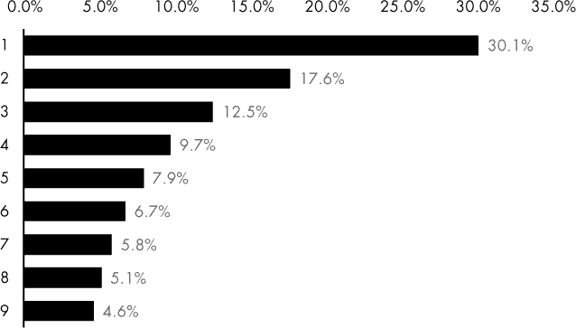
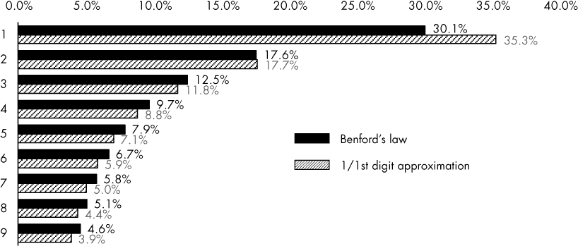
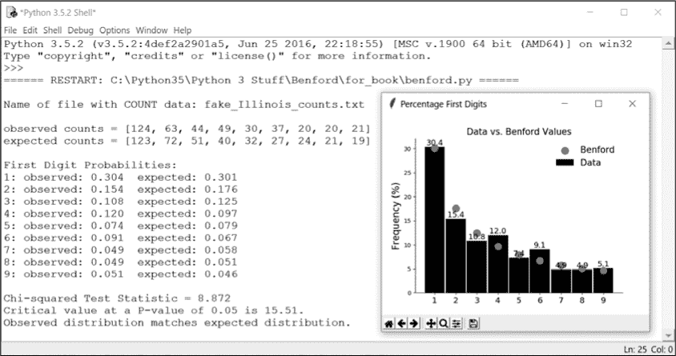

## **16

使用本福德定律发现欺诈行为**

在电子计算器发明之前，如果需要计算一个数字的对数，你会查找表格。天文学家西蒙·纽科姆使用了这样的表格，在 1881 年，他注意到，用来查找以最小数字开头的数字的前面几页比后面的页数更磨损。通过这一平凡的观察，他意识到——至少对于自然界的度量和常数——领先数字小的可能性远大于大的。他发表了一篇简短的文章，并继续前行。

几十年来，这一统计学上的好奇现象，如同托尔金的“魔戒”，“消失在所有人的记忆中”。直到 1938 年，物理学家弗兰克·本福德通过收集超过 20,000 个真实世界数字样本重新发现并确认了这一现象，数据来源包括河流测量、街道地址、*《读者文摘》*杂志中的数字、分子质量、棒球统计、死亡率等各类数据。作为普及这一科学发现的人，他获得了所有的荣誉。

根据*本福德定律*，也称为*首位数字定律*，自然发生的数字分布中，领先数字的出现频率是可预测的且不均匀的。事实上，一个数字以 1 开头的概率是以 9 开头的六倍！这一点非常反直觉，因为大多数人会预期数字的分布是均匀的，每个数字有九分之一（11.1%）的概率占据首位。由于这种认知上的脱节，本福德定律已成为金融、科学和选举数据中用于欺诈检测的有力工具。

在本章中，你将编写一个 Python 程序，将现实生活中的数据集与本福德定律进行比较，并判断它们是否可能存在欺诈行为。你还将最后一次使用 matplotlib，为分析增添一个有用的可视化组件。数据集将使用 2016 年美国总统选举中的选票。

### **项目#24：领先数字的本福德定律**

图 16-1 展示了遵循本福德定律的一组数字中领先有效数字的条形图。令人惊讶的是，尺度并不重要。无论是以英里、公里还是古代长度单位来记录澳大利亚的道路长度，都将遵循本福德定律！作为一个统计学原理，它是*尺度不变*的。

*图 16-1：根据本福德定律，领先数字的出现频率*

数学家们花了大约一百年的时间才提出一个他们认为令人满意的本福德定律解释。对于我们其他人来说，可以这么说：宇宙中小的东西比大的东西更多。Frank Benford 用了一个类比，拥有*一*英亩土地比拥有*九*英亩土地要容易。实际上，你可以通过简单地假设 1 的数量是 2 的两倍，1 的数量是 3 的三倍，依此类推，来紧密复制本福德定律所产生的频率。你只需要取每个数字的倒数（1 / *d*），然后除以所有倒数之和（2.83）。然后，将结果乘以 100 得到百分比（见图 16-2）。

*图 16-2：本福德定律与近似值的比较，近似值与首位数字的倒数成比例*

由于前面讨论的大小关系，本福德定律可以通过*对数*刻度进行可视化，后者用于绘制符合指数关系的数据。在*半对数*（“semilog”）图中，一个变量通常会受到限制，比如领先数字的集合（1-9），而另一个变量则覆盖包含多个数量级的广泛值范围。

在半对数图纸上，水平 x 轴的数值是对数值，垂直 y 轴的数值由水平线表示，并不是（见图 16-3）。在 x 轴上，水平分隔线不规则，这种非线性模式以 10 的幂次方重复。在对数纸的每个*十年*（如从 1 到 10，或从 10 到 100）上，数字之间分隔线的*宽度*与图 16-1 中的条形*长度*成比例。例如，图 16-3 中 1 和 2 之间的距离是 1 和 10 之间距离的 30.1%。正如一位作者所说，你可以通过简单地在对数纸上扔飞镖来推导本福德定律！

*图 16-3：两十年期半对数图纸示例*

为了使一组数字数据符合本福德定律，必须满足一些条件。这些数字需要是随机的，而不是指定的，不应存在强加的最小值或最大值。这些数字应涵盖多个数量级，且数据集应较大；文献中的建议是至少 100 到 1000 个样本，尽管本福德定律已被证明适用于包含多达 50 个数字的数据集。不会遵循本福德定律的分布示例包括职业篮球运动员的身高、美国电话号码（其中只有最后四位数字是真正随机的）、受到心理障碍影响的价格（如 1.99 美元与 2.00 美元）以及医疗共付费用。

#### ***应用本福德定律***

大多数财务和会计数据都符合自然发生的数字，因此符合本福德定律。例如，假设你拥有一个价值$1,000 的股票共同基金。为了让你的基金达到$2,000 的价值，它必须增长 100%。而从$2,000 增长到$3,000，则只需要增长 50%。要让首位数字为 4，基金还需要再增长 33%。正如本福德定律所预测的那样，首位数字从 1 变为 2 时，需要比从 3 变为 4 时更多的增长，依此类推。因为本福德分布是一个“分布的分布”，所以财务数据集通常会符合这种模式，因为它们是由多个数字组合而成——尽管也会有例外情况。

因为人们通常不了解本福德定律，所以在伪造数字记录时并未考虑到这一点。这为法务会计师提供了一个强大的工具，能够快速识别可能存在欺诈的数据集。事实上，与本福德定律的对比可以作为证据在美国联邦、州和地方的刑事案件中合法地作为证据使用。

在 1993 年的*亚利桑那州诉纳尔逊案*中，被告将近 200 万美元转移给虚假供应商，试图欺诈州政府。尽管小心地让假支票看起来合法，但首位数字的分布明显违反了本福德定律（见图 16-4），最终导致了定罪。

*图 16-4：欺诈支票的首位数字频率与预期的本福德定律频率对比，亚利桑那州诉韦恩·詹姆斯·纳尔逊案（CV92-18841）*

本福德定律对于内部商业审计也非常有用。假设某公司要求任何超过$10,000 的差旅和娱乐费用必须得到公司副总裁的批准。这类财务门槛可能会诱使员工采取分割发票等手段来规避制度。图 16-5 基于一组费用数据，范围从$100 到$12,000，其中所有大于$9,999 的金额都被分割为两等份。正如你所猜测的，首位数字的频率在 5 和 6 周围出现了明显的峰值，明显违反了本福德定律。

*图 16-5：将超过$9,999 的发票分割成$100 到$12,000 区间的数据集，违反了本福德定律。*

在更宏观的层面上，本福德定律揭示了大型企业财务数据中的不规则性——例如收入数字。例如，在安然公司（Enron）的案例中，安然是一家进行制度化会计欺诈的公司，见图 16-6。安然在 2001 年的破产是当时历史上最大的破产事件，导致多名高层管理人员入狱。此丑闻还导致了“全球五大”会计事务所之一的安达信会计事务所的解散，安达信曾是全球最大的跨国公司之一。

*图 16-6：安然公司 2000 年财务数据的首位数字频率与根据本福德定律预测的频率（摘自《华尔街日报》）*

显然，本福德定律在欺诈检测中的效果最佳，前提是犯罪分子没有意识到这一点。如果你知道定律的运作方式，你就可以欺骗它，这将在本章末的一个实操项目中展示。因此，你可以利用本福德定律标记可能存在欺诈的数据集，但不能用它来证明相反的结论。

#### ***执行卡方检验***

审计人员和调查员使用多种统计方法来验证数据集是否符合本福德定律。在本项目中，你将使用*卡方拟合优度检验*，这是一种常用的方法，用于判断经验（观察到的）分布是否与理论（期望的）分布显著不同。显著性水平或*p*-值用于作为判别标准。最常见的显著性水平是 0.05，但其他常见的还包括 0.01 和 0.10。显著性水平为 0.05 表示有 5%的风险错误地得出存在差异的结论。

以下是进行卡方拟合优度检验的步骤：

1.  找到*自由度*（*df*），它定义为类别数（*k*）减去 1：

    *df* = *k* – 1

    对于本福德定律，类别级别是首位数字（1–9），所以*df* = 8。

1.  通过将样本大小与每个级别的理论比例相乘来计算每个级别的期望频数：

    *E[i]* = *np*[*i*]

    其中，*E*是第*i*级别的期望频率，*n*是样本大小，*p*是第*i*级别的理论概率。对于 1,000 个样本，根据本福德定律，期望以 1 开头的样本数量为 1,000 × 0.301 = 301（参见图 16-1）。

1.  计算卡方随机变量（*X*²），也叫做*检验统计量*，它可以帮助你判断两个分布是否相同：

    

    其中，*O*是类别变量第*i*级别的观察频数，*E*是类别变量第*i*级别的期望频数，*df*表示*自由度*。

1.  查阅*卡方分布表*（表 16-1），读取与计算得出的自由度相对应的行。如果检验统计量*小于*在*p*-值列中显示的显著性值，则不能拒绝观察分布和理论分布相同的假设。

**表 16-1：卡方分布表**

| **自由度** | **超过临界值的概率** |
| --- | --- |
| **0.99** | **0.95** | **0.90** | **0.75** | **0.50** | **0.25** | **0.10** | **0.05** | **0.01** |
| --- | --- | --- | --- | --- | --- | --- | --- | --- |
| 1 | 0.000 | 0.004 | 0.016 | 0.102 | 0.455 | 1.32 | 2.71 | 3.84 | 6.63 |
| 2 | 0.020 | 0.103 | 0.211 | 0.575 | 1.386 | 2.77 | 4.61 | 5.99 | 9.21 |
| 3 | 0.115 | 0.352 | 0.584 | 1.212 | 2.366 | 4.11 | 6.25 | 7.81 | 11.34 |
| 4 | 0.297 | 0.711 | 1.064 | 1.923 | 3.357 | 5.39 | 7.78 | 9.49 | 13.28 |
| 5 | 0.554 | 1.145 | 1.610 | 2.675 | 4.351 | 6.63 | 9.24 | 11.07 | 15.09 |
| 6 | 0.872 | 1.635 | 2.204 | 3.455 | 5.348 | 7.84 | 10.64 | 12.59 | 16.81 |
| 7 | 1.239 | 2.167 | 2.833 | 4.255 | 6.346 | 9.04 | 12.02 | 14.07 | 18.48 |
| 8 | 1.647 | 2.733 | 3.490 | 5.071 | 7.344 | 10.22 | 13.36 | 15.51 | 20.09 |
| 9 | 2.088 | 3.325 | 4.168 | 5.899 | 8.343 | 11.39 | 14.68 | 16.92 | 21.67 |
| 10 | 2.558 | 3.940 | 4.865 | 6.737 | 9.342 | 12.55 | 15.99 | 18.31 | 23.21 |
|  | 不显著 | 显著 |

在表 16-2 中，0.05 的 *p* 值对应的临界值——在 8 自由度下——为 15.51。如果你计算出的检验统计量小于 15.51，则相应的 *p* 值大于 0.05，你将得出结论，观察到的分布与本福特定律预测的分布之间*没有统计学上的显著差异*。这里的 *p* 值是指具有 8 自由度的检验统计量超过 15.51 的概率。

请注意，你应该对 *计数* 进行卡方检验。如果你的数据是百分比、平均数、比率等，你需要在进行检验前将数据转换为计数值。

**目标**

编写一个 Python 程序，加载数值数据，记录首位数字的出现频率，使用卡方拟合优度检验将这些频率与本福特定律进行比较，并以表格和图形两种形式呈现比较结果。

### **数据集**

2016 年美国总统选举充斥着选民欺诈的指控。最著名的是，俄罗斯被指控支持唐纳德·特朗普，民主党全国委员会被指控在该党提名过程中偏袒希拉里·克林顿而非伯尼·桑德斯。特朗普总统还声称有 500 万到 600 万人非法投票，并且在 2017 年 5 月，他签署了一项行政命令，成立委员会来审查选民欺诈和选民压制问题。

对于这个项目，你将使用来自 2016 年总统选举的投票记录数据集。该数据集包含伊利诺伊州 102 个县的最终 *按县* 投票结果，希拉里·克林顿赢得了该州。从 2016 年 6 月开始，伊利诺伊州选民注册系统数据库成为了一次来源不明的恶意网络攻击的受害者。伊利诺伊州选举官员确认黑客已经访问了成千上万的记录，但显然没有更改任何数据。

伊利诺伊州总统选举的候选人出人意料地多，因此数据集已被解析，只包含希拉里·克林顿、唐纳德·特朗普、加里·约翰逊和吉尔·斯坦。这些候选人的选票已合并到一个包含 408 行文本的文件中，以下是前 5 行：

962

997

1020

1025

1031

你可以在*[`www.elections.il.gov/ElectionInformation/DownloadVoteTotals.aspx`](https://www.elections.il.gov/ElectionInformation/DownloadVoteTotals.aspx)*在线查看完整的候选人和投票计数。

对于这个项目，你只需要选票数据，可以从*[`www.nostarch.com/impracticalpython/`](https://www.nostarch.com/impracticalpython/)*下载*Illinois_votes.txt*。你需要将这个文件与 Python 代码保存在同一文件夹中。

### **策略**

假设你是一名调查员，正在调查 2016 年总统选举中的选民欺诈指控，并且你被分配了伊利诺伊州。在深入分析数据之前，你需要标记任何明显的异常情况。费尔本德定律不能帮助你判断选民是否违法投票，但它是检测选票*篡改*的一个好起点——也就是说，在选票投出后修改选票。

在这种情况下，能够有效地传达结果与定量分析同样重要。投票委员会不仅包括专家，还包括许多对统计学了解有限的普通人。而陪审团可能根本没有一个专家。为了说服自己和他人——无论选票统计是否有效——你需要展示多种比较方式，比如表格、图表和定量的卡方检验统计量。

分析过程中涉及的各个步骤非常适合封装成函数。所以，先看一下你可能需要的函数，而不是伪代码：

load_data() 将数据加载为列表。

count_first_digits() 将每个县的观察投票总数的首位数字列出。

get_expected_counts() 确定每个首位数字的预期计数，这些计数是根据费尔本德定律预测的。

chi_square_test() 对观察到的投票数据与预期数据进行卡方拟合优度检验。

bar_chart() 生成条形图，将观察到的首位数字百分比与预期的数字进行比较。

main() 获取数据集文件名，调用相关函数，并打印统计信息。

### **代码**

在这一部分，你将使用*benford.py*代码来调查选民欺诈，但它足够灵活，可以应用于*任何*已进行计数的分类数据集，例如医疗测试结果、所得税收入或客户退款。与欺诈无关的应用也可以，例如检测由大量低价值交易引起的流程低效；数据收集和处理中的问题，如缺失数据、截断值或拼写错误；以及测量策略或调查中的偏差，例如偏向最佳或最坏情况抽样。

你可以从*[`www.nostarch.com/impracticalpython/`](https://www.nostarch.com/impracticalpython/)*下载代码。你还需要下载文本文件*Illinois_votes.txt*，它在第 353 页的“数据集”部分有所描述。

#### ***导入模块并加载数据***

清单 16-1 导入模块并定义一个函数来加载数据。对于这个项目，你将使用从 Microsoft Excel 导出的以制表符分隔的文本文件形式的数据，并将其作为字符串列表加载。

*benford.py*，第一部分

导入 sys

导入 math

➊ 从 collections 导入 defaultdict

➋ 导入 matplotlib.pyplot 作为 plt

# Benford 法则的首位数字百分比（1-9）

➌ BENFORD = [30.1, 17.6, 12.5, 9.7, 7.9, 6.7, 5.8, 5.1, 4.6]

➍ def load_data(filename):

"""打开文本文件并返回一个字符串列表。"""

➎ 使用 open(filename) 作为 f:

返回 f.read().strip().split('\n')

*清单 16-1：导入模块并定义加载数据的函数*

到目前为止，大多数导入的模块应该已经很熟悉了。`collections` 模块提供了标准 Python 容器（如集合、元组、列表和字典）的一些专用替代品➊。对于计算首位数字频率，你需要使用 `defaultdict`，它是 `dict` 的一个子类，通过调用工厂函数来提供缺失的值。使用 `defaultdict`，你可以通过循环构建字典，并且它会自动创建新键，而不是抛出错误。它返回一个字典对象。

最后的导入是用于绘制图形的 matplotlib ➋。有关 matplotlib 及其安装方法的更多信息，请参阅 “检测概率代码” 在 第 194 页。

现在，赋一个变量给一个包含 Benford 法则百分比的列表，从 1 到 9 排序 ➌。然后，定义一个函数来读取文本文件并返回一个列表 ➍。如你之前所做，使用 with，它将在完成时自动关闭文件 ➎。

#### ***计数首位数字***

清单 16-2 定义了一个函数来计算首位数字并将结果存储在字典数据结构中。最终的计数和每个计数的频率（以百分比表示）作为列表返回，供后续函数使用。该函数还会对数据进行质量控制。

*benford.py*，第二部分

➊ def count_first_digits(data_list):

"""在数字列表中计数首位数字；返回计数和频率。"""

➋ first_digits = defaultdict(int)  # int 的默认值是 0

➌ 对于 sample 在 data_list 中:

➍ 如果 sample == '':

continue

尝试:

int(样本)

除了 ValueError 异常作为 e:

print(e, file=sys.stderr)

print("样本必须是整数。退出中", file=sys.stderr)

sys.exit(1)

➎ first_digits[sample[0]] += 1

# 检查缺失的数字

keys = [str(digit) for digit in range(1, 10)]

对于 key 在 keys 中:

如果 key 不在 first_digits 中:

first_digits[key] = 0

➏ data_count = [v for (k, v) in sorted(first_digits.items())]

total_count = sum(data_count)

data_pct = [(i / total_count) * 100 for i in data_count]

➐ 返回 data_count, data_pct, total_count

*清单 16-2：定义一个函数来计算首位数字并返回计数和频率*

count_first_digits() 函数接受从 load_data() 函数返回的字符串列表作为参数 ➊。你将在 main() 中调用它。

使用`defaultdict`➋启动一个名为`first_digits`的字典。这个步骤只是为后续填充字典做准备。`defaultdict`的第一个参数是任何可调用对象（无参数）。在这种情况下，可调用对象是`int`的类型构造器，因为你希望统计整数。在使用`defaultdict`时，每当操作遇到一个缺失的键时，会调用名为`default_factory`的函数，且该函数无参数，返回的输出将作为该键的值。不存在的键会获得`default_factory`返回的值。

现在开始一个`for`循环，遍历`data_list`中的样本➌。如果样本为空——也就是说，如果文本文件包含空行 ➍——则使用`continue`跳过。否则，使用`try`尝试将样本转换为整数。如果发生异常，说明样本不是有效的计数值，程序将提示用户并退出。在以下输出示例中，输入文件包含一个浮动值（0.01），`main()`函数会打印文件名。

包含 COUNT 数据的文件名：bad_data.txt

无效的整数文字：'0.01'

样本必须是整数。程序退出。

如果样本通过测试，将其第一个元素（领先数字）作为字典的键，并将值➎加 1。因为你使用了`defaultdict`并指定了`int`，所以键会被自动赋予默认值 0。

为了将计数与本福德定律分布进行比较，你需要按数字顺序列出键，因此可以使用列表推导和`sorted`来生成`first_digits`的一个新版本，命名为`data_count`➏。这样会按键排序返回值，如下所示：

[129, 62, 45, 48, 40, 25, 23, 21, 15]

接下来，计算计数的总和，然后创建一个新列表，将计数转换为百分比。最后通过返回这两个列表和总计数➐来结束函数。由于列表中的计数是从 1 到 9 排序的，因此不需要关联的第一个数字——它在排序中是隐含的。

#### ***获取预期的计数***

Listing 16-3 定义了`get_expected_counts()`函数，该函数接收观测数据并根据本福德定律计算领先数字的预期计数。这些预期计数会作为一个列表返回，之后你将使用该列表与卡方拟合度检验一起检查观测数据是否符合本福德定律。

*benford.py,* 第三部分

➊ def get_expected_counts(total_count):

"""返回一个包含预期本福德定律计数的列表，基于总样本数量。"""

➋ return [round(p * total_count / 100) for p in BENFORD]

*Listing 16-3: 定义了一个函数，用于计算数据集的预期本福德定律计数*

该函数的参数是你从 列表 16-2 中的 count_first_digits() 函数返回的总计数值 ➊。为了获得本福德定律的期望频数，你需要使用每个数字的频率 *概率*，因此通过将 BENFORD 列表中的百分比除以 100 来转换它们。然后，将 total_count 变量乘以这个概率。你可以通过列表推导式在返回语句中完成这一切 ➋。

#### ***确定拟合优度***

列表 16-4 定义了一个函数，用于实现 “卡方检验” 在 第 352 页 中描述的卡方检验。该检验计算观测频数与根据本福德定律预测的期望频数的拟合优度。该函数首先计算卡方检验统计量，然后将其与自由度为 8 且 *p*-值为 0.05 的卡方分布表中的临界值进行比较。根据比较结果，函数返回 True 或 False。

*benford.py,* 第四部分

➊ def chi_square_test(data_count, expected_counts):

"""返回卡方检验的布尔值（自由度 8，P 值 = 0.05）。"""

➋ chi_square_stat = 0  # 卡方检验统计量

➌ for data, expected in zip(data_count, expected_counts):

➍ chi_square = math.pow(data - expected, 2)

chi_square_stat += chi_square / expected

➎ print("\n 卡方检验统计量 = {:.3f}".format(chi_square_stat))

print("在 P 值为 0.05 时的临界值是 15.51。")

➏ return chi_square_stat < 15.51

*列表 16-4：定义了一个函数，用于衡量观测数据与本福德定律的拟合优度*

卡方检验基于频数，因此该函数需要 count_first_digits() 和 get_expected_counts() 函数返回的频数列表 ➊。定义一个名为 chi_square_stat 的变量，用于存储卡方检验统计量，并将其初始值设置为 0 ➋。

使用 zip 函数遍历 data_count 和 expected_counts 中的九个值；zip 将把一个列表中的第一个项与另一个列表中的第一个项配对，依此类推 ➌。为了计算卡方统计量，首先计算每个数字的观测频数与期望频数之差并平方 ➍。然后，将这个值除以该数字的期望频数，并将结果加到 chi_square_stat 变量中。最后，打印结果，保留三位小数 ➎。

返回卡方检验统计量 chi_square_stat 与 15.51 之间的布尔值，15.51 是自由度为 8 且 *p*-值为 0.05 时的临界值（参见 表 16-1） ➏。如果 chi_square_stat 小于此值，则函数返回 True；否则，返回 False。

#### ***定义柱状图函数***

Listing 16-5 定义了一个函数的第一部分，用于将观察到的计数百分比显示为 matplotlib 柱状图。你在第十二章中使用了类似的代码来绘制退休资金模拟的结果。这个函数还将把本福德定律的百分比绘制为红色圆点，以便你可以直观地估计观察数据与预期分布的吻合程度。

matplotlib 网站包含了许多构建各种图表的代码示例。这段代码部分基于 *[`matplotlib.org/examples/api/barchart_demo.html`](https://matplotlib.org/examples/api/barchart_demo.html)* 上的示例。

*benford.py,* 第五部分

➊ def bar_chart(data_pct):

"""制作观察值与预期的首位数字频率（%）的柱状图。"""

➋ fig, ax = plt.subplots()

➌ index = [i + 1 for i in range(len(data_pct))]  # x 轴的首位数字

# 标签、标题和刻度的文本

➍ fig.canvas.set_window_title('百分比首位数字')

➎ ax.set_title('数据 vs. 本福德值', fontsize=15)

➏ ax.set_ylabel('频率（%）', fontsize=16)

➐ ax.set_xticks(index)

ax.set_xticklabels(index, fontsize=14)

*Listing 16-5: 定义了* bar_chart() *函数的第一部分*

定义 bar_chart() 函数，接受一个参数，该参数是观察数据中首位数字的频率列表（以百分比表示）➊。plt.subplots() 函数返回一个包含图形和坐标轴对象的元组；将该元组解包为名为 fig 和 ax 的变量➋。

接下来，使用列表推导式创建一个从 1 到 9 的数字列表➌。这个索引变量将定义柱状图中每个垂直条形的位置。

设置图表的标题、标签等。将图表的*窗口*命名为 '百分比首位数字' ➍，然后在图表*内部*显示标题 ➎。这里使用的是通用标题，你可以根据需要自定义这些标题。使用 fontsize 关键字参数将文本大小设置为 15。注意，窗口标题是 fig 的属性，而其他标签将是 ax 的属性。

使用 set_ylabel() 设置 y 轴的名称为“频率（%）”➏，然后根据索引变量设置 x 轴的刻度标记➐。刻度标签将是数字 1 到 9，因此再次使用索引变量，并将字体大小设置为 14。

#### ***完成柱状图函数***

Listing 16-6 完成了 bar_chart() 函数，通过定义柱形图，注释每个柱形顶部的频率值，并将本福德分布的值绘制为红色填充圆点。

*benford.py,* 第六部分

# 构建柱状图

➊ rects = ax.bar(index, data_pct, width=0.95, color='black', label='数据')

# 在每个柱形图上方附加一个文本标签，显示其高度

➋ for rect in rects:

➌ height = rect.get_height()

➍ ax.text(rect.get_x() + rect.get_width()/2, height,

'{:0.1f}'.format(height), ha='center', va='bottom',

fontsize=13)

# 绘制本福德值作为红点

➎ ax.scatter(index, BENFORD, s=150, c='red', zorder=2, label='本福德')

# 隐藏右边和上边的坐标轴线并添加图例

➏ ax.spines['right'].set_visible(False)

ax.spines['top'].set_visible(False)

➐ ax.legend(prop={'size':15}, frameon=False)

➑ plt.show()

*列表 16-6：完成生成条形图的函数*

给矩形命名一个变量，叫做 rects，并用它来保存条形图的条形 ➊。通过 bar() 方法生成这些条形，它返回一个包含所有条形的容器。将 index 变量和按百分比表示的频率计数列表传递给它，将每个条形的宽度设置为 0.95，填充为黑色，并将标签参数设置为 'Data'。最后一个参数是一个非常方便的方式来自动生成图例。你将在函数的后面部分利用这个功能。

我是将实际的条形值绘制在条形上方的粉丝，这样你就不需要眯着眼睛去看 y 轴并尝试猜测它的值。为此，从遍历每个条形（矩形）开始，在 rects ➋ 中获取它的高度 ➌，也就是它的 y 轴值。然后，调用 ax 对象的 text() 方法 ➍，传入条形左侧的 x 位置——通过 get_x() 方法获得——并加上条形宽度的一半，以便将标签居中于条形上方。由于你使用了 get_width() 方法，你只需要在步骤 ➊ 中为条形宽度赋值一次。接下来是条形的高度——格式化为一位小数——后面是水平和垂直对齐方式。将它们分别设置为文本边框的中心和底部。最后，设置文本的大小。

现在，开始构建 matplotlib “标记”——在这种情况下是圆点——标记每个首位数字的 Benford 分布频率的位置。使用 scatter() 方法来实现，它用于构建散点图 ➎。

scatter() 的前两个参数是每个标记的 x-y 位置，这些位置由 index 和 BENFORD 列表中的连续对组成。接下来是标记的大小，设置为 150，然后是颜色。红色和 DodgerBlue 都很好。你希望标记显示在条形图的上方，因此将 zorder 设置为 2。图中的元素被称为 matplotlib “艺术家”，具有更高 zorder 值的艺术家会绘制在具有较低值的艺术家之上。最后，使用 label 参数来生成图例。

接下来的两条语句是为了美观。默认情况下，matplotlib 会在图表内部绘制一个框，而上边框可能会干扰条形顶部的标签。因此，通过将它们的可见性设置为 False ➏ 来去掉上边框和右边框。

使用 legend() 为图表构建图例 ➐。这可以不带任何参数工作，但将其大小属性设置为 15，并关闭图例周围的框架，以获得更具吸引力的效果。最后，调用 plt.show() 显示图表 ➑。示例条形图如 图 16-7 所示。

*图 16-7：* bar_chart() *函数的示例输出*

在 main() 函数中，你将以文本形式显示更多信息，这些信息将在解释器窗口中显示。包括卡方检验统计量的值。

#### ***定义和运行 main() 函数***

清单 16-7 定义了 main() 函数，并以模块或独立程序的形式运行。由于大部分工作在各个单独的函数中完成，main() “主要”调用这些函数并打印一些统计信息。

*benford.py,* 第七部分

def main():

"""调用函数并打印统计信息。"""

# 加载数据

while True:

➊ filename = input("\n 包含 COUNT 数据的文件名：")

try:

data_list = load_data(filename)

except IOError as e:

print("{}. 请再试一次。".format(e), file=sys.stderr)

else:

break

➋ data_count, data_pct, total_count = count_first_digits(data_list)

➌ expected_counts = get_expected_counts(total_count)

print("\n 观察到的计数 = {}".format(data_count))

print("预期计数 = {}".format(expected_counts), "\n")

➍ print("首位数字概率：")

➎ for i in range(1, 10):

print("{}: 观察到: {:.3f}  预期: {:.3f}"。

format(i, data_pct[i - 1] / 100, BENFORD[i - 1] / 100))

➏ if chi_square_test(data_count, expected_counts):

print("观察到的分布与预期分布一致。")

else:

print("观察到的分布与预期不符。",

file=sys.stderr)

➐ bar_chart(data_pct)

➑ if __name__ == '__main__':

main()

*清单 16-7: 定义了* main() *函数并以模块或独立程序的形式运行*

首先，要求用户输入要分析的包含计数数据的文件名 ➊；将此请求嵌入一个 while 循环，直到用户输入有效的文件名或关闭窗口为止。用户可以输入文件名或完整路径名，如果他们想加载存储在当前工作目录之外的数据集。例如，在 Windows 上：

文件名（包含 COUNT 数据）：C:\Python35\Benford\Illinois_votes.txt

使用 try 语句调用你之前构建的 load_data() 函数，并将文件名传递给该函数。如果文件名有效，返回的列表将赋值给 data_list 变量。如果发生异常，捕获并打印错误信息。否则，跳出 while 循环。

接下来，将返回的数据计数列表传递给 count_first_digits() 函数，并将结果解包为变量 data_count、data_pct 和 total_count，它们分别是首位数字计数、百分比和总计数的列表 ➋。然后，通过调用 get_expected_counts() 函数并传递 total_count 变量，生成一个符合本福特定律分布的预期计数列表 ➌。打印观察到的计数和预期计数列表。

现在，制作一个表格，将数据中的首位数字频率与预期值进行比较。使用概率，因为十进制值在 shell 中易于对齐。首先使用一个标题打印语句 ➍，然后循环遍历数字 1 到 9，打印观察到的计数（数据）结果，接着是预期计数，每个结果保留三位小数 ➎。注意，两列表中的索引从零开始，因此你必须从 i 中减去 1。

将两个计数列表传递给 chi_square_test()函数，以计算观察到的数据与预期分布的契合度 ➏。如果该函数返回 True，使用打印语句告诉用户观察到的分布符合本福德定律（或者，更技术性地说，*两者之间没有显著差异*）。否则，报告它们不匹配，并且对于 shell 用户，将字体颜色设置为红色。

chi_square_test()函数将在解释器窗口中显示其结果，因此调用 bar_chart() 函数来生成柱状图 ➐。将数据计数的百分比列表传递给它。

回到全局空间，用运行程序的代码结束它，可以作为模块或独立模式运行 ➑。

如果你在 *Illinois_votes.txt* 数据集上运行程序，你将看到图 16-8 所示的输出。根据本福德定律，选票结果没有明显异常。

*图 16-8：* benford.py *程序对数据集 Illinois_votes.txt 的输出*

如果只使用特朗普的选票运行程序，然后再使用克林顿的选票，你将获得图 16-9 所示的结果。特朗普的分布，检验统计量为 15.129，刚好通过卡方检验。

*图 16-9：特朗普结果（左）与克林顿结果（右）的比较（伊利诺伊州）*

在这种情况下，你应该小心立即得出结论。数据集很小——每个候选人只有 102 个样本——结果可能受到农村和城市地区的选民构成以及选民投票率差异的影响。有关这种城乡差距的有趣文章可以在 *[`www.chicagotribune.com/news/data/ct-illinois-election-urban-rural-divide-2016-htmlstory.html`](http://www.chicagotribune.com/news/data/ct-illinois-election-urban-rural-divide-2016-htmlstory.html)* 找到。

在“实践项目：击败本福德”中，第 364 页将有机会篡改伊利诺伊州的选票统计，并改变结果。然后你将使用前面的代码来查看结果与本福德定律的契合度。

### **总结**

在第一章中，我们使用了第 15 页的“穷人条形图”实践项目和第 16 页的“穷外国人条形图”挑战项目，分析了语言中字母出现频率的不规则性和可预测性。这为密码分析提供了强大的工具。在书的结尾，我们已经回到了起点，并发现即使是数字也具有这种特性，从而为欺诈检测提供了一个强有力的工具。只需一个简短简单的 Python 程序，你就能动摇天柱，把那些高高在上的人拉到地面——这一切都是因为有人注意到一本书的封面脏了。

好吧，这就是*《不实用的 Python 项目》*的全部内容。希望你玩得开心，学到了新知识，并且激发了你自己创造不实用项目的灵感！

### **进一步阅读**

*《本福德定律：法务会计、审计与欺诈检测的应用*（John Wiley & Sons，2012 年）*由马克·尼格里尼（Mark Nigrini）撰写，涵盖了本福德定律的数学、理论和测试，并提供了实际应用的例子，包括欺诈、逃税和庞氏骗局。

### **实践项目：战胜本福德**

通过这个实践项目，测试你在操控选举方面的技能。你可以在附录中找到解决方案，文件名为*beat_benford_practice.py*，或者从*[`www.nostarch.com/impracticalpython/`](https://www.nostarch.com/impracticalpython/)*下载。

数据集仅因遵循本福德定律而不应被认为是有效的。原因很简单：如果你了解本福德定律，那么你就能战胜它。

为了证明这一点，假设你是一个为邪恶外国政府工作的高级黑客，拥有伊利诺伊州所有选票记录的访问权限。编写一个 Python 程序，篡改全县选票，使唐纳德·特朗普赢得该州，但选票计数仍然遵循本福德定律。小心；伊利诺伊州是一个“蓝色”州，因此你不希望制造压倒性的胜利（通常定义为流行票中 10-15 个百分点的优势）。为了避免引起怀疑，特朗普应该以几个百分点的微弱优势获胜。

**注意**

*各州对于重新计票有相应的规定。在操控选举之前，欺诈者需要了解这些规则，以避免重新计票所带来的审查。每个州的实际法定规则都不好读，但明尼苏达州选举公正市民组织提供了简明的总结。伊利诺伊州的总结可以在* [`ceimn.org/searchable-databases/recount-database/illinois/`](https://ceimn.org/searchable-databases/recount-database/illinois/) *找到。

你的程序应该从其他候选人那里偷取选票，同时保留按县划分的总票数；这样，投出的选票总数就不会改变。作为质量控制步骤，打印出特朗普和克林顿按县的旧票数和新票数，以及他们的旧的和新的全州票数。然后，写出一个文本文件，输入到*benford.py*中，这样你可以检查自己是否符合本福德定律。

每个候选人的数据集已经准备好并列在这里；你可以从*[`www.nostarch.com/impracticalpython/`](https://www.nostarch.com/impracticalpython/)*下载它们。每个数据集只是按县字母顺序排列的投票数列（所以不要改变顺序！）。

*Clinton_votes_Illinois.txt*

*Johnson_votes_Illinois.txt*

*Stein_votes_Illinois.txt*

*Trump_votes_Illinois.txt*

图 16-10 显示了在我的尝试*beat_benford_practice.py*的输出上运行*benford.py*的结果，使用了上述数据集。该分布通过了卡方检验，并且在视觉上与本福德定律所预测的值相匹配——尽管有些不完美，但依然有说服力。

*图 16-10：在*beat_benford_practice.py*输出中运行分布的结果，使用*benford.py*。恶作剧已完成！*

这里展示了*beat_benford_practice.py*的一些输出行，包含按县划分的旧投票总数和新投票总数：

从顶部第三行开始表示库克县（Cook County），该县包括芝加哥。请注意，克林顿仍然在这里获胜，但获胜幅度较小。如果特朗普直接赢得这个蓝色县，那么即使他仅凭微弱优势赢得整个州，这也会是一个巨大的红旗，表明可能发生了选举舞弊！

### **挑战项目**

尝试一下这些挑战项目。没有提供解决方案。

#### ***本福德定律与战场州***

没有候选人需要在自己必胜的州作弊。如果你是一个调查选民舞弊的调查员，你很可能会从战场州开始。战场州的选举结果可能朝任何一方倾斜，候选人会在这些地方花费大部分的选战资金和时间。根据 Ballotpedia (*[`ballotpedia.org`](https://ballotpedia.org)*)，特朗普在 2016 年的战场州包括亚利桑那州、爱荷华州、密歇根州、威斯康星州、俄亥俄州、宾夕法尼亚州、北卡罗来纳州和佛罗里达州。克林顿的战场州包括科罗拉多州、内华达州、新罕布什尔州和弗吉尼亚州。

各州的在线投票记录通常以多种格式提供，例如 Microsoft Excel 电子表格。收集战场州的投票记录，将其转换为文本文件，并通过*benford.py*运行它们。为了帮助你入门，你可以在这里找到俄亥俄州的记录：*[`www.sos.state.oh.us/elections/`](https://www.sos.state.oh.us/elections/)*。

#### ***当无人注意时***

美国众议院前议长蒂普·奥尼尔（Tip O’Neill）曾以一句话而闻名：“所有政治都是地方性的。”牢记这一点，使用*benford.py*程序查看你所在地区的一些选举，比如法官、市长、县监事、警长和市议会成员的选举。这些选举通常比参议员、州长或总统的选举吸引的关注少。如果你发现了不规则情况，务必确保选举数据集符合本福德定律的适用条件，然后再大张旗鼓地反映问题！
