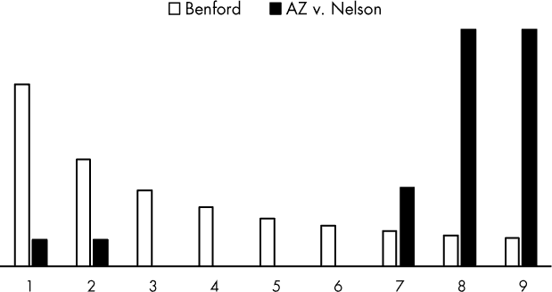
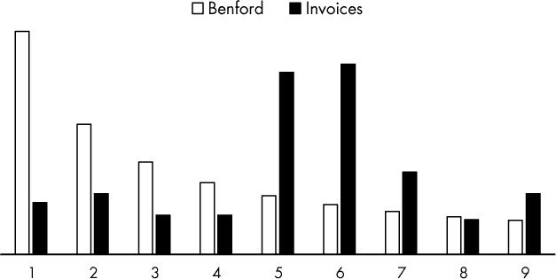
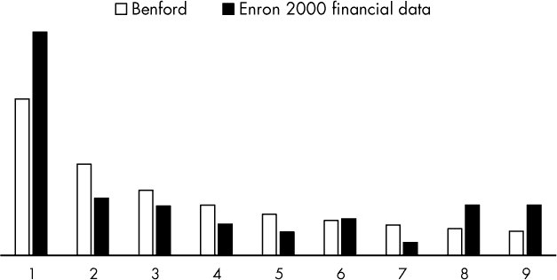
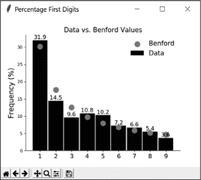
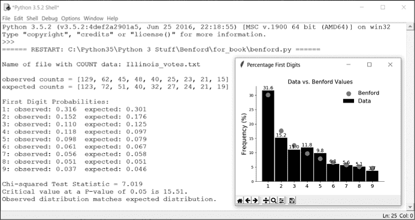
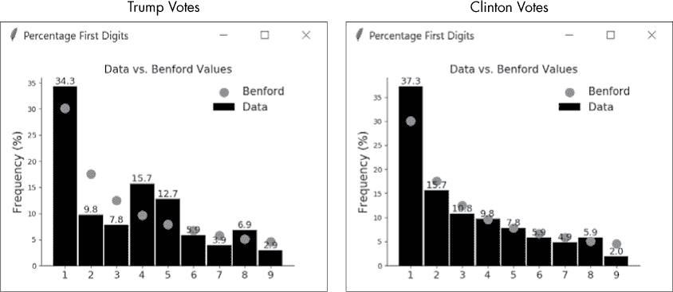

## **利用本福德定律发现欺诈**


在电子计算器发明之前，如果你需要计算一个数字的对数，你需要查阅表格。天文学家西蒙·纽康（Simon Newcomb）使用过这样的表格，并且在 1881 年，他注意到前面几页表格上用于查找以最小数字开头的数字，比后面几页的表格更加磨损。通过这一平凡的观察，他意识到——至少对于自然界中的测量值和常数——首位数字更有可能是小数字，而不是大数字。他发表了一篇简短的文章并继续前行。

几十年来，这一统计学现象，像托尔金的魔戒一样，“被人们所遗忘。”直到 1938 年，物理学家弗兰克·本福德重新发现并证实了这一现象，他收集了超过 20,000 个真实世界数据样本，数据来源包括河流的测量、街道地址、《读者文摘》杂志中的数字、分子质量、棒球统计、死亡率等等。作为推广这一科学发现的人，他得到了所有的荣誉。

根据*本福德定律*，也被称为*首位数字定律*，自然发生的数字分布中，首位数字的出现频率是可预测的，并且是不均匀的。事实上，一个数字以 1 开头的概率是以 9 开头的概率的六倍！这一点非常反直觉，因为大多数人会认为数字的分布是均匀的，每个数字以 1/9（11.1%）的概率出现在第一位。由于这种认知偏差，本福德定律已成为财务、科学和选举数据中用于欺诈检测的有力工具。

在这一章中，你将编写一个 Python 程序，比较现实生活中的数据集与本福德定律，并判断它们是否存在欺诈行为。你还将最后一次使用`matplotlib`，为分析添加一个有用的可视化组件。作为数据集，你将使用 2016 年美国总统选举中投出的选票。

### **项目 #24：本福德的首位数字定律**

图 16-1 显示了一组符合本福德定律的数字的首位有效数字的条形图。令人惊讶的是，尺度并不重要。无论澳大利亚道路的长度是以英里、公里还是古比特为单位，统计出来的结果都会遵循本福德定律！作为一个统计原理，它是*尺度不变*的。


*图 16-1：根据本福德定律，首位数字的出现频率*

数学家们花了大约一百年的时间来找出一个他们认为令人满意的本福特定律解释。对于我们其他人来说，让我们只说宇宙中的小事物比大事物多。弗兰克·本福特用拥有*一*英亩土地比拥有*九*英亩更容易的类比。事实上，你可以通过假设 1 的个数是 2 的两倍，3 的个数是 1 的三倍，依此类推，来紧密地复制本福特定律产生的频率。只需取每个九个数字的倒数（1 / *d*），然后除以所有倒数的总和（2.83）。然后将结果乘以 100 以获得百分比（见图 16-2）。


*图 16-2：本福特定律与首位数字的倒数成比例的近似比较*

由于刚讨论的尺寸关系，本福特定律可以通过*对数*刻度进行可视化，该刻度用于绘制按指数关系相关的数据。在*半对数*（“半对数”）图中，一个变量往往受限，如前导数字集（1–9），而另一个变量则覆盖包括几个数量级的广泛数值。

在半对数图纸上，水平 x 轴值为对数值，垂直 y 轴值由水平线表示，不是（见图 16-3）。在 x 轴上，水平划分不规则，这种非线性模式随 10 的幂重复。在对数纸上的每*十年*，如 1 至 10 或 10 至 100，数值之间的划分宽度与图 16-1 中条形的长度成比例。例如，图 16-3 中 1 和 2 之间的距离是 1 和 10 之间距离的 30.1％。正如一位作者所说，你可以通过简单地将飞镖扔到对数纸上来得出本福特定律！


*图 16-3：两个十年半对数图纸示例*

要使数字数据集符合本福特定律，必须满足一定条件。数字必须是随机的，没有指定的最小值或最大值。数字应覆盖几个数量级，并且数据集应该足够大；文献中的建议要求至少 100 到 1,000 个样本，尽管已经证明即使包含 50 个数字的数据集也可以符合本福特定律。不遵循本福特定律的分布示例包括职业篮球运动员的身高、美国电话号码（仅最后四位数字是真正随机的）、受心理障碍影响的价格（$1.99 与$2.00 之间）以及医疗保险的赔款。

#### ***应用本福特定律***

大多数财务和会计数据遵循自然出现的数字，因此符合 Benford 定律。例如，假设你拥有一个价值 1,000 美元的股票共同基金。为了使基金的价值增长到 2,000 美元，它需要通过增长 100%来实现翻倍。而从 2,000 美元增加到 3,000 美元，仅需增长 50%。若要使首位数字为 4，基金需要再增长 33%。正如 Benford 定律预测的那样，首位数字从 1 变成 2 所需要的增长量大于从 3 变成 4 所需的增长量，依此类推。由于 Benford 分布是一种“分布的分布”，因此财务数据集通常符合这一规律，因为它们是由数字的组合而成——尽管也会有例外。

因为人们通常没有意识到 Benford 定律，在伪造数字记录时往往没有考虑到这一点。这为法务会计师提供了一个强有力的工具，能够迅速识别可能存在欺诈行为的数据集。事实上，与 Benford 定律的比较在美国的联邦、州及地方刑事案件中作为证据是合法可接受的。

在 1993 年 *State of Arizona v. Nelson* 案中，被告将近 200 万美元转移到虚假的供应商账户，企图诈骗州政府。尽管被告小心翼翼地伪造了看似合法的支票，但首位数字的分布明显违反了 Benford 定律（见图 16-4），最终导致定罪。



*图 16-4：欺诈支票中的首位数字频率与预期的 Benford 定律频率的比较，State of Arizona v. Wayne James Nelson (CV92-18841)*

Benford 定律对于内部商业审计也很有用。假设有一条规定，所有超过$10,000 的差旅和娱乐费用必须由公司副总裁批准。这种财务阈值可能会诱使员工采取拆分发票等手段来规避系统。图 16-5 基于一组范围从$100 到$12,000 的费用，其中所有超过$9,999 的值都被拆分为两等份。正如你可以猜到的，首位数字的频率在 5 和 6 附近出现了尖峰，明显违反了 Benford 定律。



*图 16-5：针对范围在$100 到$12,000 之间的账单，将金额超过$9,999 的发票拆分，违反了 Benford 定律。*

在更广泛的层面上，Benford 定律揭示了大型企业财务数据中的不规则性——例如收入数字。一个来自安然公司的例子，该公司曾经实行制度化的财务欺诈，见于图 16-6。安然公司在 2001 年的破产是当时历史上最大的破产事件，导致多名高层管理人员入狱。此丑闻还导致了全球最大的一家跨国会计公司之一、“五大”会计事务所之一——安达信的解散。



*图 16-6：来自恩隆 2000 年财务数据的首位数字频率与基于本福特定律的预期频率对比（摘自*《华尔街日报》*）*

显然，当犯罪分子不知道本福特定律时，这一规律在欺诈检测中最有效。如果你了解这一规律的工作原理，你可以欺骗它，而我们将在本章末的实践项目中进行这一操作。因此，你可以使用本福特定律标记可能存在欺诈的数据集，但不能用它证明相反的情况。

#### ***进行卡方检验***

审计员和调查员使用多种统计方法验证数据集是否遵循本福特定律。在这个项目中，你将使用*卡方拟合优度检验*，这是一种常用的方法，用于确定经验（观察到的）分布是否与理论（预期）分布有显著差异。显著性水平或*p*-值用于区分两者。最常见的显著性水平是 0.05，但其他常用的包括 0.01 和 0.10。显著性水平为 0.05 表示 5%的风险，即错误地得出存在差异的结论。

以下是进行卡方拟合优度检验的步骤：

1.  找到*自由度*（*df*），它定义为类别数（*k*）减去 1：

    *df* = *k* – 1

    对于本福特定律，类别水平是首位数字（1–9），因此*df* = 8。

1.  通过将样本大小乘以每个级别的理论比例来计算每个级别的预期频数：

    *E[i]* = *np*[*i*]

    其中，*E*是第*i*级的预期频率，*n*是样本大小，*p*是第*i*级的理论概率。对于 1,000 个样本，根据本福特定律分布，预期以 1 开头的样本数量为 1,000 × 0.301 = 301（见图 16-1）。

1.  计算卡方随机变量（*X*²），也称为*检验统计量*，它可以帮助你判断两个分布是否相同：

    

    其中，*O*是类别变量第*i*级的观察频数，*E*是类别变量第*i*级的预期频数，*df*代表*自由度*。

1.  查阅*卡方分布表*（表 16-1），读取与计算得出的自由度对应的行。如果检验统计量*小于*在*p*-值列中显示的显著性值，那么你无法拒绝观察分布和理论分布相同的假设。

**表 16-1：** 卡方分布表

| **自由度** | **超过临界值的概率** |
| --- | --- |
| **0.99** | **0.95** | **0.90** | **0.75** | **0.50** | **0.25** | **0.10** | **0.05** | **0.01** |
| --- | --- | --- | --- | --- | --- | --- | --- | --- |
| 1 | 0.000 | 0.004 | 0.016 | 0.102 | 0.455 | 1.32 | 2.71 | 3.84 | 6.63 |
| 2 | 0.020 | 0.103 | 0.211 | 0.575 | 1.386 | 2.77 | 4.61 | 5.99 | 9.21 |
| 3 | 0.115 | 0.352 | 0.584 | 1.212 | 2.366 | 4.11 | 6.25 | 7.81 | 11.34 |
| 4 | 0.297 | 0.711 | 1.064 | 1.923 | 3.357 | 5.39 | 7.78 | 9.49 | 13.28 |
| 5 | 0.554 | 1.145 | 1.610 | 2.675 | 4.351 | 6.63 | 9.24 | 11.07 | 15.09 |
| 6 | 0.872 | 1.635 | 2.204 | 3.455 | 5.348 | 7.84 | 10.64 | 12.59 | 16.81 |
| 7 | 1.239 | 2.167 | 2.833 | 4.255 | 6.346 | 9.04 | 12.02 | 14.07 | 18.48 |
| 8 | 1.647 | 2.733 | 3.490 | 5.071 | 7.344 | 10.22 | 13.36 | 15.51 | 20.09 |
| 9 | 2.088 | 3.325 | 4.168 | 5.899 | 8.343 | 11.39 | 14.68 | 16.92 | 21.67 |
| 10 | 2.558 | 3.940 | 4.865 | 6.737 | 9.342 | 12.55 | 15.99 | 18.31 | 23.21 |
|  | 不显著 | 显著 |

在表 16-2 中，对于*P*-值为 0.05 时，具有 8 个自由度的临界值为 15.51。如果你计算出的检验统计量小于 15.51，则对应的*P*-值大于 0.05，你将得出结论，观察到的分布与本福德定律预测的分布之间*没有统计显著差异*。这里的*P*-值是指 8 个自由度的检验统计量比 15.51 更极端的概率。

请注意，你应当对*计数*进行卡方检验。如果你的数据是百分比、平均值、比率等，需先将这些值转换为计数再进行检验。

**目标**

编写一个 Python 程序，加载数值数据，记录首位数字的出现频率，使用卡方拟合优度检验将这些频率与本福德定律进行比较，并以表格和图形形式呈现比较结果。

### **数据集**

2016 年美国总统选举充满了选民舞弊的指控。最著名的是，俄罗斯被指控支持唐纳德·特朗普，而民主党全国委员会被指控在党内提名过程中偏袒希拉里·克林顿，而不是伯尼·桑德斯。特朗普总统还指控有 500 万到 600 万人非法投票，并且在 2017 年 5 月签署了一项行政命令，成立了一个委员会来审查选民舞弊和选民压制问题。

对于这个项目，你将使用 2016 年总统选举的投票记录数据集。这包括了伊利诺伊州 102 个县的最终*按县*划分的投票结果，该州由希拉里·克林顿赢得。自 2016 年 6 月以来，伊利诺伊州选民注册系统数据库成为了一次来源不明的恶意网络攻击的受害者。伊利诺伊州选举官员确认，黑客访问了成千上万的记录，但显然没有修改任何数据。

伊利诺伊州的总统选票上有出人意料的多位候选人，因此该数据集已被解析，仅包括希拉里·克林顿、唐纳德·特朗普、加里·约翰逊和吉尔·斯坦。这些候选人的投票结果被汇总在一个包含 408 行的文本文件中，前五行如下：

```py
962
997
1020
1025
1031
```

你可以在 *[`www.elections.il.gov/ElectionInformation/DownloadVoteTotals.aspx`](https://www.elections.il.gov/ElectionInformation/DownloadVoteTotals.aspx)* 在线查找候选人和选票的完整统计信息。

对于这个项目，你只需要选票，可以从 *[`www.nostarch.com/impracticalpython/`](https://www.nostarch.com/impracticalpython/)* 下载 *Illinois_votes.txt*。你需要将这个文件与 Python 代码保存在同一个文件夹中。

### **策略**

假设你是一个调查员，正在调查 2016 年总统选举中的选民欺诈指控，且你被分配到伊利诺伊州。在深入分析数据之前，你需要标记任何明显的异常。贝福德定律不能帮助你确定是否有人非法投票，但它是检测选票 *篡改* 的一个不错的起点——即，在选票投下后改变选票。

在这种情况下，沟通结果的能力与定量分析同样重要。选举委员会不仅包括专家，还包括许多对统计学知识有限的普通人。陪审团可能也不会有任何专家。为了说服自己——以及他人——投票结果是有效的（或无效的），你需要展示多个比较结果，例如表格、图表和定量卡方变量（检验统计量）。

分析中涉及的各个步骤非常适合封装成函数。因此，我们不看伪代码，而是来看一下你可能需要的函数：

load_data() 将数据加载为列表。

count_first_digits() 统计每个县的观察选票总数中的首位数字。

get_expected_counts() 确定根据本福德定律预测的每个首位数字的计数。

chi_square_test() 对观察值与预期值进行卡方拟合优度检验。

bar_chart() 生成一个柱状图，将观察到的首位数字百分比与预期百分比进行比较。

main() 获取数据集文件名，调用函数并打印统计信息。

### **代码**

你将在本节中使用 *benford.py* 代码来研究选民欺诈，但它足够灵活，可以用于 *任何* 数据集，其中包含分类值的计数，例如医学测试结果、所得税收入或客户退款。也可以用于与欺诈无关的应用，如检测由大量低价值交易引起的流程低效；数据收集和处理中的问题，如缺失数据、截断值或拼写错误；以及测量策略或调查中的偏差，如偏向最佳情况或最差情况的抽样。

你可以从 *[`www.nostarch.com/impracticalpython/`](https://www.nostarch.com/impracticalpython/)* 下载代码。你还需要在第 353 页的 “数据集”中描述的 *Illinois_votes.txt* 文本文件。

#### ***导入模块和加载数据***

清单 16-1 导入模块并定义加载数据的函数。在此项目中，你将使用一种格式为制表符分隔的文本文件（从 Microsoft Excel 导出），并将其作为字符串列表加载。

*benford.py，* 第一部分

```py
   import sys
   import math
➊ from collections import defaultdict
➋ import matplotlib.pyplot as plt

   # Benford's law percentages for leading digits 1-9
➌ BENFORD = [30.1, 17.6, 12.5, 9.7, 7.9, 6.7, 5.8, 5.1, 4.6]

➍ def load_data(filename):
       """Open a text file & return a list of strings."""
    ➎ with open(filename) as f:
           return f.read().strip().split('\n')
```

*清单 16-1：导入模块并定义加载数据的函数*

此时，大部分导入的模块应该已经熟悉了。`collections`模块提供了标准 Python 容器（如集合、元组、列表和字典）的专用替代方案 ➊。为了统计首位数字的频率，你需要`defaultdict`，它是`dict`的一个子类，通过调用工厂函数来提供缺失的值。使用`defaultdict`时，你可以通过循环构建字典，它会自动创建新键，而不是抛出错误。它返回一个字典对象。

最后的导入是用于与`matplotlib`绘图 ➋。有关`matplotlib`及其安装方法的更多信息，请参见第 194 页的“检测概率代码”。

现在，将一个变量赋值为一个包含从 1 到 9 的本福德定律百分比的列表 ➌。然后，定义一个函数来读取文本文件并返回一个列表 ➍。像之前一样，使用`with`，因为它会在完成后自动关闭文件 ➎。

#### ***统计首位数字***

清单 16-2 定义了一个函数，用于统计首位数字并将结果存储在字典数据结构中。最终的计数以及每个计数的频率（以百分比形式）会作为列表返回，以便在后续函数中使用。该函数还将对数据进行质量控制。

*benford.py，* 第二部分

```py
➊ def count_first_digits(data_list):

       """Count 1st digits in list of numbers; return counts & frequency."""

    ➋ first_digits = defaultdict(int)  # default value of int is 0

    ➌ for sample in data_list:

        ➍ if sample == '':

               continue

           try:

               int(sample)

           except ValueError as e:

               print(e, file=sys.stderr)

               print("Samples must be integers. Exiting", file=sys.stderr)

               sys.exit(1)

        ➎ first_digits[sample[0]] += 1

       # check for missing digits

       keys = [str(digit) for digit in range(1, 10)]

       for key in keys:

           if key not in first_digits:

               first_digits[key] = 0

    ➏ data_count = [v for (k, v) in sorted(first_digits.items())]

       total_count = sum(data_count)

       data_pct = [(i / total_count) * 100 for i in data_count]

    ➐ return data_count, data_pct, total_count
```

*清单 16-2：定义一个函数来统计首位数字并返回计数和频率*

`count_first_digits()`函数接受由`load_data()`函数返回的字符串列表作为参数 ➊。你将在`main()`中调用它。

创建一个名为`first_digits`的字典，使用`defaultdict` ➋。这个步骤只是为后续填充字典做准备。`defaultdict`的第一个参数是一个可调用对象（无参数）。在此例中，可调用对象是`int`的类型构造器，因为你需要计数整数。使用`defaultdict`时，每当操作遇到缺失的键时，会调用一个名为`default_factory`的函数，并且不传递任何参数，返回的结果将作为该键的值。不存在的键会得到`default_factory`返回的值。

现在，启动一个`for`循环，遍历`data_list`中的样本 ➌。如果样本为空——即，如果文本文件中包含空行 ➍——使用`continue`跳过它。否则，使用`try`将样本转换为整数。如果发生异常，说明样本不是有效的计数值，因此通知用户并退出程序。在下面的输出示例中，输入文件包含一个浮动值（`0.01`），而`main()`函数打印出文件名。

```py
Name of file with COUNT data: bad_data.txt
invalid literal for int() with base 10: '0.01'
Samples must be integers. Exiting.
```

如果样本通过了检验，将其第一个元素（前导数字）作为字典键，并将值加 1 ➎。因为你使用了`defaultdict`并设置为`int`，所以键会自动初始化为`0`。

为了将计数与本福德定律分布进行比较，你需要将键按数字顺序列出，因此使用列表推导式和`sorted`来创建一个新的`first_digits`版本，命名为`data_count` ➏。这将按键排序并返回值，如下所示：

```py
[129, 62, 45, 48, 40, 25, 23, 21, 15]
```

接下来，求和计数，然后创建一个新列表并将计数转换为百分比。最后，通过返回这两个列表和总计数来结束函数 ➐。由于列表中的计数从 1 到 9 排序，因此你不需要关联的前导数字——它已隐含在排序中。

#### ***获取预期计数***

列表 16-3 定义了`get_expected_counts()`函数，该函数接受观察数据并根据本福德定律计算出前导数字的预期计数。这些预期计数作为一个列表返回，稍后你将使用它与卡方拟合优度检验一起，查看观察数据与本福德定律的符合程度。

*benford.py,* 第三部分

```py
➊ def get_expected_counts(total_count):
       """Return list of expected Benford's law counts for a total sample count."""
    ➋ return [round(p * total_count / 100) for p in BENFORD]
```

*列表 16-3：定义了一个函数，用于计算数据集的预期本福德定律计数*

该函数的参数是你从列表 16-2 中的`count_first_digits()`函数返回的总计数 ➊。为了获得本福德定律下你应该预期的计数，你需要使用每个数字的频率*概率*，因此通过除以 100 将`BENFORD`列表中的百分比转换为概率。然后将`total_count`变量乘以此概率。你可以通过列表推导式在`return`语句中完成这一切 ➋。

#### ***确定拟合优度***

列表 16-4 定义了一个函数，用于实现“执行卡方检验”中的卡方检验，该检验描述在第 352 页中。这一检验计算观察计数与本福德定律预测的预期计数之间的拟合优度。该函数将首先计算卡方检验统计量，然后将其与卡方分布表中自由度为 8、*p* 值为 0.05 的条目进行比较。根据比较结果，函数返回`True`或`False`。

*benford.py,* 第四部分

```py
➊ def chi_square_test(data_count, expected_counts):
       """Return boolean on chi-square test (8 degrees of freedom & P-val=0.05)."""
    ➋ chi_square_stat = 0  # chi-square test statistic
    ➌ for data, expected in zip(data_count, expected_counts):
        ➍ chi_square = math.pow(data - expected, 2)
           chi_square_stat += chi_square / expected
    ➎ print("\nChi Squared Test Statistic = {:.3f}".format(chi_square_stat))
       print("Critical value at a P-value of 0.05 is 15.51.")

    ➏ return chi_square_stat < 15.51
```

*列表 16-4：定义了一个函数，用于衡量观察数据与本福德定律的拟合优度*

卡方检验作用于计数，因此该函数需要`count_first_digits()`和`get_expected_counts()`函数返回的数据计数和预期计数列表 ➊。定义一个名为`chi_square_stat`的变量来存储卡方检验统计量，并将其值初始化为`0` ➋。

使用 `zip` 遍历 `data_count` 和 `expected_counts` 中的九个值；`zip` 会将一个列表中的第一个项目与第二个列表中的第一个项目配对，依此类推 ➌。要计算卡方统计量，首先减去每个数字的计数并平方结果 ➍。然后，将此值除以该数字的预期计数，并将结果加到 `chi_square_stat` 变量中。接着，将结果打印至小数点后三位 ➎。

返回 `chi_square_stat` 变量与 15.51 的布尔值测试，这是与 8 自由度下 *p* 值为 0.05 对应的临界值（见 表 16-1） ➏。如果 `chi_square_stat` 小于该值，函数将返回 `True`；否则返回 `False`。

#### ***定义条形图函数***

列表 16-5 定义了一个函数的第一部分，用于以 `matplotlib` 条形图的形式显示观察到的计数百分比。在第十二章中，你使用了类似的代码来绘制退休储备模拟的结果。这个函数还将以红点的形式绘制本福德法则的百分比，这样你可以通过视觉估算观察数据与期望分布的拟合程度。

`matplotlib` 网站包含了许多用于构建各种图表的代码示例。此代码部分基于 *[`matplotlib.org/examples/api/barchart_demo.html`](https://matplotlib.org/examples/api/barchart_demo.html)* 上的演示示例。

*benford.py,* 第五部分

```py
➊ def bar_chart(data_pct):
       """Make bar chart of observed vs expected 1st-digit frequency (%)."""
    ➋ fig, ax = plt.subplots()

    ➌ index = [i + 1 for i in range(len(data_pct))]  # 1st digits for x-axis

       # text for labels, title, and ticks
    ➍ fig.canvas.set_window_title('Percentage First Digits')
    ➎ ax.set_title('Data vs. Benford Values', fontsize=15)
    ➏ ax.set_ylabel('Frequency (%)', fontsize=16)
    ➐ ax.set_xticks(index)
       ax.set_xticklabels(index, fontsize=14)
```

*列表 16-5：定义了* bar_chart() *函数的第一部分*

定义 `bar_chart()` 函数，它接受一个参数，即观察数据中首位数字的频率列表——以百分比表示 ➊。`plt.subplots()` 函数返回一个包含图形和坐标轴对象的元组；将此元组解包到名为 `fig` 和 `ax` 的变量中 ➋。

接下来，使用列表推导式创建一个从 1 到 9 的数字列表 ➌。这个 `index` 变量将定义图表中每个竖直条形的 x 轴位置。

设置图表的标题、标签等。将图表窗口命名为*窗口* `'Percentage` `First Digits'` ➍，然后在图表内显示标题 ➎。这里我使用了通用标题，但你可以根据需要进行自定义。使用 `fontsize` 关键字参数将文本大小设置为 `15`。请注意，窗口标题是 `fig` 的属性，而其他标签将是 `ax` 的属性。

使用 `set_ylabel()` 将 y 轴命名为 “Frequency (%)” ➏，然后根据 `index` 变量设置 x 轴的刻度标记 ➐。刻度标签将是数字 1 到 9，因此再次使用 `index` 变量并将字体大小设置为 `14`。

#### ***完成条形图函数***

列表 16-6 通过定义条形图、在每个条形的顶部标注其频率值，并将本福德分布的值绘制为红色圆点，完成了 `bar_chart()` 函数。

*benford.py,* 第六部分

```py
       # build bars
    ➊ rects = ax.bar(index, data_pct, width=0.95, color='black', label='Data')

       # attach a text label above each bar displaying its height
    ➋ for rect in rects:
        ➌ height = rect.get_height()
        ➍ ax.text(rect.get_x() + rect.get_width()/2, height,
                   '{:0.1f}'.format(height), ha='center', va='bottom',
                   fontsize=13)

       # plot Benford values as red dots
    ➎ ax.scatter(index, BENFORD, s=150, c='red', zorder=2, label='Benford')

       # Hide the right and top spines & add legend
    ➏ ax.spines['right'].set_visible(False)
       ax.spines['top'].set_visible(False)
    ➐ ax.legend(prop={'size':15}, frameon=False)

    ➑ plt.show()
```

*列表 16-6：完成了生成条形图的函数*

给变量命名为 `rects`，表示矩形，并用它来保存条形图中的条形 ➊。你可以使用 `bar()` 方法生成这些条形，它会返回一个包含所有条形的容器。传递给它索引变量和百分比频率的列表，将每个条形的宽度设置为 0.95，填充为黑色，并将 `label` 参数设置为 `'Data'`。最后一个参数是非常方便的方式来自动生成图例。你将在函数的后面部分利用这一点。

我喜欢在条形图上方绘制实际的条形值，这样就不需要眯眼看 y 轴并尝试猜测值了。为此，首先通过循环遍历 `rects` ➋ 中的每个条形图（`rect`），获取其高度 ➌，即其 y 轴值。然后，调用 `ax` 对象的 `text()` 方法 ➍，并传入条形的左侧位置——通过 `get_x()` 方法获取——然后加上条形宽度的一半，以将标签居中放置在条形上方。由于使用了 `get_width()` 方法，因此你只需为条形宽度赋值一次，这在步骤 ➊ 中已完成。接下来是条形高度——格式化为一位小数——然后是水平和垂直对齐方式。将这些设置为文本边界框的中心和底部。最后，设置文本大小。

现在，开始构建 `matplotlib` 的“标记”——在这种情况下是圆点——用于标示 Benford 分布频率在每个首位数字的位置。使用 `scatter()` 方法来完成这项工作，它用于生成散点图 ➎。

`scatter()` 的前两个参数是每个标记的 x-y 位置，由 `index` 和 `BENFORD` 列表中的连续对表示。接下来是标记的大小，设置为 `150`，然后是颜色。`red` 和 `DodgerBlue` 都可以很好地使用。你希望标记显示在条形图的顶部，所以将 `zorder` 设置为 `2`。图形中的元素被称为 `matplotlib` 的“艺术家”，具有较高 `zorder` 值的艺术家将覆盖具有较低值的艺术家。最后，使用 `label` 参数来创建图例。

接下来的两条语句用于美学效果。默认情况下，`matplotlib` 会在图表内部绘制一个边框，而上边框可能会干扰放置在每个条形顶部的标签。因此，通过将其可见性设置为 `False` ➏，移除顶部和右侧的边框。

使用 `legend()` 构建图形的图例 ➐。它可以不带参数工作，但可以将其大小属性设置为 `15`，并关闭图例周围的边框，以获得一个可能更具吸引力的结果。最后调用 `plt.show()` 来显示图表 ➑。一个示例的条形图如图 16-7 所示。



*图 16-7：* bar_chart() *函数的示例输出*

在 `main()` 函数中，你将以文本的形式在解释器窗口中显示附加信息。包括卡方检验统计量的值。

#### ***定义并运行 main() 函数***

清单 16-7 定义了 `main()` 函数并以模块或独立模式运行程序。由于大部分工作都在各个函数中完成，`main()` “主要”调用这些函数并打印一些统计数据。

*benford.py,* 第七部分

```py
   def main():
       """Call functions and print stats."""
       # load data
       while True:
        ➊ filename = input("\nName of file with COUNT data: ")
           try:
               data_list = load_data(filename)
           except IOError as e:
               print("{}. Try again.".format(e), file=sys.stderr)
           else:
               break
    ➋ data_count, data_pct, total_count = count_first_digits(data_list)
    ➌ expected_counts = get_expected_counts(total_count)
       print("\nobserved counts = {}".format(data_count))
       print("expected counts = {}".format(expected_counts), "\n")

    ➍ print("First Digit Probabilities:")
    ➎ for i in range(1, 10):
           print("{}: observed: {:.3f}  expected: {:.3f}".
                 format(i, data_pct[i - 1] / 100, BENFORD[i - 1] / 100))

    ➏ if chi_square_test(data_count, expected_counts):
           print("Observed distribution matches expected distribution.")
       else:
           print("Observed distribution does not match expected.",
                 file=sys.stderr)

    ➐ bar_chart(data_pct)

➑ if __name__ == '__main__':
       main()
```

*清单 16-7：定义了* main() *函数并以模块或独立模式运行程序*

首先，提示用户输入需要分析的计数数据文件名 ➊；将这个请求嵌入一个 `while` 循环中，直到用户输入有效的文件名或关闭窗口为止。用户可以输入文件名或完整路径名，如果他们想加载存储在当前工作目录之外的数据集。例如，在 Windows 中：

```py
Name of file with COUNT data: C:\Python35\Benford\Illinois_votes.txt
```

使用 `try` 语句调用之前构建的 `load_data()` 函数，并传递文件名给该函数。如果文件名有效，则返回的列表将赋值给 `data_list` 变量。如果发生异常，则捕获并打印错误。否则，从 `while` 循环中 `break` 退出。

接下来，将返回的数据计数列表传递给 `count_first_digits()` 函数，并解包结果为变量 `data_count`、`data_pct` 和 `total_count`，它们分别是首位数字计数、百分比和总计数的列表 ➋。然后，通过调用 `get_expected_counts()` 函数并传递 `total_count` 变量，生成本福德定律分布下预期的计数列表 ➌。打印观察到的计数和预期的计数列表。

现在，制作一个表格，比较数据中首位数字的频率与预期值。使用概率值，因为小数值在终端中易于对齐。首先使用一个 `print` 语句输出表头 ➍，然后循环打印数字 1 到 9，对于每个数字，输出观察到的计数（数据），接着是预期的计数，每个值保留三位小数 ➎。注意，两个列表的索引从零开始，因此必须从 `i` 中减去 1。

将这两个计数列表传递给 `chi_square_test()` 函数，以计算观察到的数据与预期分布的匹配程度 ➏。如果函数返回 `True`，使用 `print` 语句告知用户观察到的分布符合本福德定律（或者，更准确地说，*两者之间没有显著差异*）。否则，报告它们不匹配，对于终端用户，可以将字体颜色设置为红色。

`chi_square_test()` 函数将在解释器窗口中显示其结果，因此调用 `bar_chart()` 函数生成柱状图 ➐。将数据计数列表作为百分比传递给它。

回到全局空间，使用运行程序作为模块或独立模式的代码结束程序 ➑。

如果你在 *Illinois_votes.txt* 数据集上运行程序，你将看到如图 16-8 所示的输出。根据本福德定律，投票结果没有明显的异常。



*图 16-8：benford.py 对数据集* Illinois_votes.txt *的输出结果*

如果你只使用特朗普的选票运行程序，然后只使用希拉里的选票，你将得到如图 16-9 所示的结果。特朗普的分布，检验统计量为 15.129，勉强通过卡方检验。



*图 16-9：特朗普结果（左）与希拉里结果（右）在伊利诺伊州的比较*

在这种情况下，你应该小心得出立即结论。数据集很小——每个候选人只有 102 个样本——结果可能受到人口统计和城乡投票率差异等因素的影响。关于这种城乡差异的有趣文章可以在*[`www.chicagotribune.com/news/data/ct-illinois-election-urban-rural-divide-2016-htmlstory.html`](http://www.chicagotribune.com/news/data/ct-illinois-election-urban-rural-divide-2016-htmlstory.html)*找到。

在“实践项目：打败本福德”（见第 364 页）中，你将有机会篡改伊利诺伊州的选票计数并改变结果。然后，你将使用前面的代码查看结果与本福德定律的符合程度。

### **总结**

很久以前，在第一章中，我们使用了“穷人条形图”实践项目（见第 15 页）和“穷外国人条形图”挑战项目（见第 16 页），探讨了语言中字母出现频率的不规则性和可预测性。这为密码分析提供了强大的工具。在书的结尾，我们回到了原点，发现即使是数字也有这种特征，从而成为欺诈检测的强大工具。只需一段简短而简单的 Python 程序，你就能撼动天柱，把高高在上的人拉下凡尘——这一切都源于有人注意到书的封面很脏。

好了，这就是*《不切实际的 Python 项目》*的全部内容。希望你玩得开心，学到新知识，并受到启发，创造自己的不切实际的项目！

### **进一步阅读**

*《本福德定律：法医会计、审计与欺诈检测的应用》（John Wiley & Sons，2012）*由马克·尼格里尼（Mark Nigrini）编著，涵盖了本福德定律的数学、理论和测试，并结合示例应用，包括欺诈、逃税和庞氏骗局。

### **实践项目：打败本福德**

通过这个实践项目测试你在操控选举方面的技能。你可以在附录中找到解决方案，*beat_benford_practice.py*，或者从*[`www.nostarch.com/impracticalpython/`](https://www.nostarch.com/impracticalpython/)*下载。

一个数据集不应该仅仅因为它符合本福德定律而被认为有效。原因很简单：如果你了解本福德定律，那么你就可以破解它。

为了证明这一点，假设你是一个高级黑客，受一个邪恶的外国政府指使，能够访问伊利诺伊州所有的选票记录。编写一个 Python 程序，篡改按县的选票，使唐纳德·特朗普赢得该州，但选票总数依然遵守本福德法则。要小心；伊利诺伊州是一个“蓝色”州，因此你不希望制造出压倒性的胜利（通常定义为在普选中领先 10-15 个百分点）。为了避免引起怀疑，特朗普应该以少数几个百分点险胜。

**注意**

*各州对选票重计有相关规定。在篡改选举之前，欺诈者需要了解这些规则，以避免重计带来的审查。每个州的实际法定规则阅读起来并不有趣，但明尼苏达州公民选举诚信组织提供了易于理解的摘要。伊利诺伊州的摘要可以在* [`ceimn.org/searchable-databases/recount-database/illinois/`](https://ceimn.org/searchable-databases/recount-database/illinois/) 找到。*

你的程序应该从其他候选人那里窃取选票，同时保留按县的总票数；这样，总的投票数不会发生变化。作为质量控制步骤，打印出特朗普和克林顿按县的旧票数和新票数，以及他们的旧全州票数和新全州票数。然后，写出一个文本文件，供你输入到*benford.py*中，这样你就可以检查你在本福德法则方面的表现了。

每个候选人的数据集已经准备好并列在这里；你可以从*[`www.nostarch.com/impracticalpython/`](https://www.nostarch.com/impracticalpython/)*下载它们。这些数据集每个都是一列数字，代表选票，按县名字母顺序排序（所以不要更改顺序！）。

*Clinton_votes_Illinois.txt*

*Johnson_votes_Illinois.txt*

*Stein_votes_Illinois.txt*

*Trump_votes_Illinois.txt*

图 16-10 显示了我运行*benford.py*时的结果，输出来自我的尝试 *beat_benford_practice.py*，该程序使用了前面的数据集。分布通过了卡方检验，并且在视觉上给出一个令人信服的——但可以理解为不完美的——拟合，符合本福德法则预测的值。


*图 16-10：运行 *beat_benford_practice.py* 输出的分布结果，在 *benford.py* 中执行的结果。恶作剧成功！*

这里显示的是来自 *beat_benford_practice.py* 的一些输出行，包含按县的旧票数和新票数：


从上往下的第三行代表库克县，其中包含芝加哥。注意，这里克林顿依然获胜，但胜利的幅度较小。如果特朗普在这个蓝色县城完全获胜，那将是一个巨大的红色警告，表明可能发生了选票篡改，即使他只以微弱的优势赢得整个州！

### **挑战项目**

尝试完成这些挑战项目。这里不提供解决方案。

#### ***本福德法则与战场州***

在一个注定会获胜的州，候选人不需要作弊。如果你是调查选民舞弊的调查员，你很可能会从关键摇摆州开始。这些州的选举结果可能会有较大的波动，候选人也会在这些州花费大量的选举资金和时间。根据 Ballotpedia 的资料（*[`ballotpedia.org`](https://ballotpedia.org)*），特朗普 2016 年的关键摇摆州是亚利桑那州、爱荷华州、密歇根州、威斯康星州、俄亥俄州、宾夕法尼亚州、北卡罗来纳州和佛罗里达州。希拉里的摇摆州是科罗拉多州、内华达州、新罕布什尔州和弗吉尼亚州。

各州的在线投票记录通常以多种格式提供，例如 Microsoft Excel 电子表格。收集关键摇摆州的记录，将它们转换为文本文件，并通过*benford.py*程序进行处理。为了帮助你入门，你可以在这里找到俄亥俄州的选举记录：*[`www.sos.state.oh.us/elections/`](https://www.sos.state.oh.us/elections/)*。

#### ***当无人注意时***

美国众议院前议长蒂普·奥尼尔（Tip O'Neill）曾著名地说：“所有政治都是地方性的。”请牢记这一点，并使用*benford.py*程序检查一些地方选举，比如法官、市长、县监督、警长和市议会成员等选举。这些选举通常比参议院席位、州长或总统选举受到的关注要少。如果你发现任何不规则现象，在大声疾呼之前，确保投票数据集符合本福德定律的有效应用！
