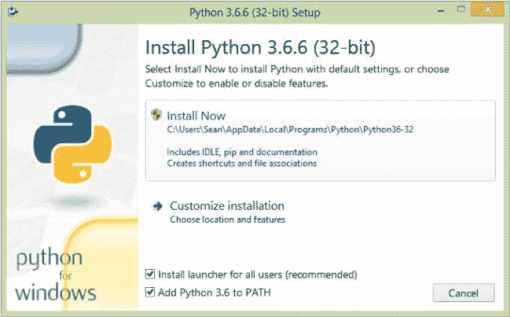
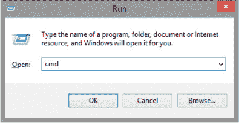
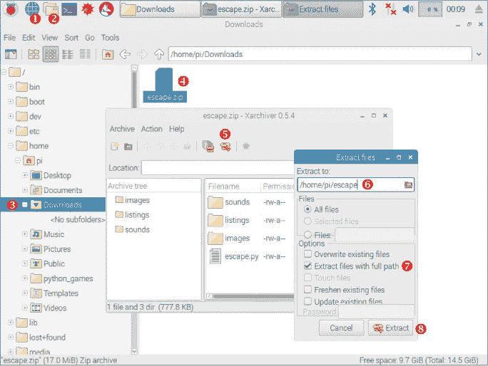
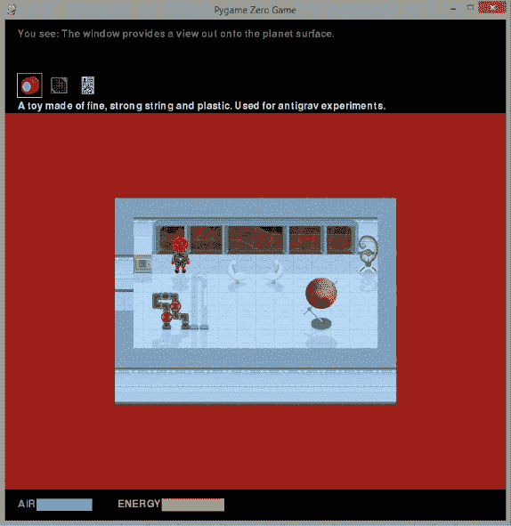

## 序言


空气正在耗尽。太空站出现了泄漏，所以你必须迅速行动。你能找到安全的出路吗？你需要在太空站中导航，找到门的通行卡，并修理你受损的太空服。冒险已经开始！

一切从这里开始：地球，任务指挥中心，也就是你的计算机。本书将向你展示如何使用 Python 构建一个火星太空站，探索该太空站，并在冒险游戏中逃脱危险，游戏包括图形内容。你能像宇航员一样思考，成功找到安全的出路吗？

### **如何使用本书**

通过本书中的指引，你可以构建一个名为*逃脱*的游戏，游戏中有地图可以探索和谜题可以解答。它使用了 Python 语言，这是一种易于阅读的流行编程语言。它还使用了 Pygame Zero，它提供了一些管理图像和声音等的指令。一步步，我将向你展示如何制作游戏以及代码的主要部分如何工作，这样你就可以根据我的游戏代码定制或创建自己的游戏。你还可以下载所需的所有代码。如果你卡住了，或者只是想直接开始玩游戏并查看它是如何工作的，你也可以这样做。所有你需要的软件都是免费的，我还提供了 Windows PC 和 Raspberry Pi 的安装指南。我建议你使用 Raspberry Pi 3 或 Raspberry Pi 2。Pi Zero、原始的 Model B+ 和旧型号可能运行游戏太慢，无法享受游戏体验。

你可以通过几种不同的方式使用本书和游戏：

+   **下载游戏，先玩它，然后通过本书了解它是如何工作的。** 这样，你可以避免在玩游戏之前看到书中的任何剧透！虽然我尽量将剧透最小化，但你可能会在阅读代码时注意到一些线索。如果你在游戏中遇到困难，可以尝试阅读代码来找到解决方案。无论如何，我建议你至少运行一次游戏，看看你将要构建的内容，并学习如何运行你的程序。

+   **构建游戏，然后玩它。** 本书将引导你从头到尾地创建游戏。当你逐章进行时，你会为游戏添加新部分并看到它们的运行效果。如果在任何阶段你无法让代码正常工作，你可以使用我提供的代码版本并从那里继续构建。如果选择这种方法，直到你完成构建、玩游戏并完成游戏前，不要对游戏做任何自定义修改。否则，你可能会不小心让游戏变得无法完成。（你可以按照练习中的建议进行修改。）

+   **自定义游戏。** 当你理解了程序的工作原理后，你可以通过使用自己的地图、图形、物品和谜题来进行修改。*逃脱* 游戏设定在太空站中，但你的游戏可以设定在丛林中、海底，甚至几乎任何地方。你可以先使用这本书来构建自己的 *逃脱* 版本，或者使用我提供的最终版本进行自定义。我很期待看到你使用这个程序作为起点所制作的内容！你可以通过 Twitter 联系我，用户名是 @musicandwords，或者访问我的网站 *[www.sean.co.uk](http://www.sean.co.uk)*。

### **这本书有什么内容？**

这是你开始任务之前的简要介绍。

+   **第一章** 向你展示了如何进行太空行走。你将学习如何使用 Pygame Zero 在 Python 程序中使用图形，并发现一些制作 Python 程序的基础知识。

+   **第二章** 介绍了 *列表*，它们存储了 *逃脱* 游戏中的大量信息。你将学习如何使用列表来制作地图。

+   **第三章** 向你展示了如何让程序的某些部分重复执行，以及如何利用这些知识显示地图。你还将设计太空站的房间布局，使用墙柱和地板砖。

+   在 **第四章** 中，你将开始构建 *逃脱* 游戏，打下太空站的蓝图。你将看到程序如何理解太空站的布局，并利用它来创建房间的框架，放置墙壁和地板。

+   在 **第五章** 中，你将学习如何在 Python 中使用 *字典*，这是一种存储信息的重要方式。你将为游戏使用的所有对象添加信息，并且你将看到如何创建自己房间设计的预览。当你在 **第六章** 中扩展程序时，你将看到所有场景都已就位，并能够查看所有房间。

+   在建造完太空站后，你可以搬进去。在 **第七章** 中，你将添加你的宇航员角色，并学习如何在房间中移动并进行动画效果。

+   **第八章** 向你展示了如何通过阴影、渐变墙壁和一个新功能来修复剩余的图形故障，从而完善游戏的图形。

+   当太空站投入使用时，你可以拆开个人物品。在 **第九章** 中，你将放置玩家可以检查、捡起和丢弃的物品。在 **第十章** 中，你将看到如何使用和组合物品，从而在游戏中解决谜题。

+   太空站快要建成了。**第十一章** 增加了安全门，用于限制对某些区域的访问。当你放松身心，庆祝工作圆满完成时，危险也悄然逼近，因为你将在 **第十二章** 中添加动态危险。

在你完成本书的学习时，你将完成一些训练任务，借此机会测试你的程序和编码技能。如果你需要答案，它们会在每章的末尾提供。

本书末尾的附录也会对你有所帮助。**附录 A** 包含了整个游戏的代码清单。如果你不确定该将一段新代码放在哪里，可以在此查找。**附录 B** 包含了最重要的变量、列表和字典的表格，如果你记不住某些内容存储在哪里，可以查阅它；**附录 C** 提供了一些调试技巧，帮助你解决程序无法运行的问题。

欲获取更多信息和本书的支持资源，请访问本书网站 *[www.sean.co.uk/books/mission-python/](http://www.sean.co.uk/books/mission-python/)*。你也可以在 *[`nostarch.com/missionpython/`](https://nostarch.com/missionpython/)* 上找到相关信息和资源。

### **安装软件**

该游戏使用 Python 编程语言和 Pygame Zero，这是一个简化图形和声音处理的软件。在开始之前，你需要先安装这两个软件。

**注意**

*欲查看更新的安装说明，请访问本书的网页* [`nostarch.com/missionpython/`](https://nostarch.com/missionpython/)。

#### **在 Raspberry Pi 上安装软件**

如果你使用的是 Raspberry Pi，Python 和 Pygame Zero 已经预安装好了。你可以直接跳到第 7 页中的“下载游戏文件”部分。

#### **在 Windows 上安装 Python**

在 Windows PC 上安装软件，请按照以下步骤操作：

1.  打开浏览器，访问 *[`www.python.org/downloads/`](https://www.python.org/downloads/)*。

1.  在撰写本文时，Python 3.7 是最新版本，但 Pygame 目前尚无法在此版本上轻松安装。我建议你改用 Python 3.6 的最新版本（撰写时为 3.6.6）。你可以在下载页面下方找到旧版本的 Python（参见图 1）。将文件保存到桌面或其他便于查找的位置。（Pygame Zero 仅支持 Python 3，因此如果你通常使用 Python 2，你需要切换到 Python 3 来进行本书的学习。）

    

    *图 1：Python 下载页面*

1.  文件下载完成后，双击运行它。

1.  在弹出的窗口中，选择勾选框以将 Python 3.6 添加到 PATH 中（参见图 2）。

1.  点击 **立即安装**。

    

    *图 2：Python 安装程序*

1.  如果系统提示你是否允许该应用程序对设备进行更改，点击 **是**。

1.  Python 安装需要几分钟时间。安装完成后，点击 **关闭** 以完成安装。

#### **在 Windows 上安装 Pygame Zero**

现在你已经在电脑上安装了 Python，可以继续安装 Pygame Zero。请按照以下步骤操作：

1.  按住**Windows 开始键**并按**R**。运行窗口应会打开（见图 3）。

1.  输入 cmd（见图 3）。按 ENTER 或点击**确定**。

    

    *图 3：Windows 运行对话框*

1.  命令行窗口应会打开，如图 4 所示。在这里，你可以输入用于管理文件或启动程序的指令。输入 pip install pgzero 并在行尾按下 ENTER。

    

    *图 4：命令行窗口*

1.  Pygame Zero 应该开始安装。它会花费一些时间，你会在`>`提示符再次出现时知道它已经完成。

1.  如果你收到错误消息说 pip 无法识别，请尝试重新安装 Python。你可以通过重新运行安装程序或使用 Windows 控制面板卸载 Python。确保在安装 Python 时选中 PATH 的框（见图 2）。重新安装 Python 后，尝试再次安装 Pygame Zero。

1.  当 Pygame Zero 下载完成并且你可以再次输入时，输入以下内容：

    ```py
    echo print("Hello!") > test.py
    ```

1.  这行代码创建了一个名为*test.py*的新文件，文件中包含指令`print("Hello!")`。我将在第一章中解释`print()`指令，但目前这只是一个快速创建测试文件的方式。输入括号（圆括号）和引号时要小心：如果漏掉一个，文件将无法正常工作。

1.  输入以下内容以打开测试文件：

    ```py
    pgzrun test.py
    ```

1.  稍等片刻，一个空白窗口应该会打开，标题为*Pygame Zero Game*。再次点击命令行窗口将其带到前面：你应该能看到文本`Hello!`。按 CTRL-C 停止命令行窗口中的程序。

1.  如果你想删除你的测试程序，输入 del test.py。

#### **在其他机器上安装软件**

Python 和 Pygame Zero 也可以用于其他计算机系统。Pygame Zero 部分是为了使游戏能够跨不同计算机运行，因此*Escape*代码应该在任何运行 Pygame Zero 的地方都能运行。本书仅为 Windows 和 Raspberry Pi 计算机用户提供指导。但如果你使用其他计算机，可以在*[`www.python.org/downloads/`](https://www.python.org/downloads/)*下载 Python，并在*[`pygame-zero.readthedocs.io/en/latest/installation.html`](http://pygame-zero.readthedocs.io/en/latest/installation.html)*找到安装 Pygame Zero 的建议。

### **下载游戏文件**

我已经提供了所有你需要的程序文件、声音和图像，用于*Escape*游戏。你也可以下载本书中的所有列表，所以如果你无法让其中某个工作，你可以使用我的文件。所有本书的内容会作为一个名为*escape.zip*的 ZIP 文件下载。

#### **在树莓派上下载并解压文件**

在 Raspberry Pi 上下载游戏文件，请按照以下步骤操作，并参考图 5。图 5 中的数字会告诉你每个步骤应该在哪里进行。

➊ 打开网页浏览器，访问*[`nostarch.com/missionpython/`](https://nostarch.com/missionpython/)*。点击链接下载文件。

➋ 从桌面上，点击屏幕顶部任务栏中的文件管理器图标。

➌ 双击打开“下载”文件夹。

➍ 双击*escape.zip*文件。

➎ 点击**提取文件**按钮，打开提取文件对话框。

➏ 更改将要提取的文件夹路径，使其显示*/home/pi/escape*。

➐ 确保选中了“提取带完整路径的文件”选项。

➑ 点击**提取**。



*图 5：你应该采取的解压文件步骤*

#### **在 Windows PC 上解压文件**

在 Windows PC 上解压文件，请按照以下步骤操作。

1.  打开你的网页浏览器，访问*[`nostarch.com/missionpython/`](https://nostarch.com/missionpython/)*。点击链接下载文件。将 ZIP 文件保存在桌面、*Documents*文件夹中，或其他你能轻松找到的地方。

1.  根据你使用的浏览器，ZIP 文件可能会自动打开，或者可能在屏幕底部有一个选项可以打开它。如果没有，按住**Windows 开始键**并按**E**键，Windows 资源管理器窗口应该会打开。前往你保存 ZIP 文件的文件夹。双击该 ZIP 文件。

1.  点击窗口顶部的**提取全部**。

1.  我建议你在*Documents*文件夹中创建一个名为*escape*的文件夹，并将文件解压到那里。我的文档文件夹是*C:\Users\Sean\Documents*，所以我只需在文件夹名称的末尾输入*\escape*，就可以在该文件夹中创建一个新文件夹（参见图 6）。如果需要，你可以使用**浏览**按钮先进入*Documents*文件夹。

1.  点击**提取**。

    

    *图 6：设置解压游戏文件的文件夹*

#### **ZIP 文件中包含的内容**

你刚刚下载的 ZIP 文件包含三个文件夹和一个 Python 程序，*escape.py*（参见图 7）。这个 Python 程序是*Escape*游戏的最终版本，所以你可以立即开始玩。*images*文件夹包含了游戏以及本书其他项目所需的所有图片。*sounds*文件夹包含了音效。

在*listings*文件夹中，你将找到本书中的所有编号列表。如果你无法使某个程序正常运行，可以尝试从这个文件夹复制我的版本。你需要先从*listings*文件夹中复制它，然后粘贴到现在*escape.py*程序所在的*escape*文件夹中。这样做的原因是程序需要与*images*和*sounds*文件夹一起放在同一个位置才能正常工作。


*图 7：ZIP 文件的内容，在 Windows 中可能呈现的样子*

### **运行游戏**

当你下载 Python 时，另一个名为 IDLE 的程序也会与其一起下载。IDLE 是一个集成开发环境（IDE），是你用来编写 Python 程序的软件。你可以按照提供的说明，通过 IDLE Python 编辑器运行本书中的某些清单。然而，大多数程序使用 Pygame Zero，你必须从命令行运行这些程序。按照这里的说明来运行 *Escape* 游戏和其他任何 Pygame Zero 程序。

#### **在树莓派上运行 Pygame Zero 程序**

如果你使用的是树莓派，请按照以下步骤运行 *Escape* 游戏：

1.  使用文件管理器，进入 *pi* 文件夹中的 *escape* 文件夹。

1.  点击菜单中的 **工具**，选择 **在终端中打开当前文件夹**，或者按 F4 键。命令行窗口（也称为 *shell*）应该会打开，如图 8 所示。你可以在这里输入指令来管理文件或启动程序。

    

    *图 8：树莓派中的命令行窗口*

1.  输入以下命令并按下回车键。游戏开始！

    ```py
    pgzrun escape.py
    ```

这是在树莓派上运行 Pygame Zero 程序的方式。要再次运行相同的程序，请重复上一步。要运行保存在同一文件夹中的不同程序，重复上一步，但在 `pgzrun` 后更改文件名。要在不同的文件夹中运行 Pygame Zero 程序，请从第 1 步开始，打开包含你要运行程序的文件夹的命令行。

#### **在 Windows 上运行 Pygame Zero 程序**

如果你使用的是 Windows，请按照以下步骤运行程序：

1.  进入你的 *escape* 文件夹。（按住 **Windows 启动键**，然后按 **E** 键重新打开文件资源管理器。）

1.  点击文件上方的长条，如图 9 所示。输入 cmd 并按回车键。

    

    *图 9：查找 Pygame 文件的路径*

1.  命令行窗口将打开。你的名为 *escape* 的文件夹将出现在最后一行的 `>` 之前，如图 10 所示。

    

    *图 10：Windows 中的命令行窗口*

1.  在命令行窗口中输入 pgzrun escape.py，按下回车键，*Escape* 游戏开始。

这是在 Windows 计算机上运行 Pygame Zero 程序的方式。你可以通过重复上一步来再次运行该程序。要运行保存在同一文件夹中的不同程序，重复上一步，但在 `pgzrun` 后更改文件名。要在不同的文件夹中运行 Pygame Zero 程序，请从第 1 步开始，打开包含你要运行程序的文件夹的命令行。

### **玩游戏**

你正在火星的空间站上独自工作，离家数百万公里远。其他队员正在执行一项长途任务，探索峡谷中的生命迹象，他们几天内不会回来。生命支持系统的低沉嗡嗡声环绕在你四周。

当警报声响起时，你被吓了一跳！空间站的墙壁出现了裂缝，你的空气正在慢慢泄漏到火星的大气层中。你迅速但小心地穿上宇航服，但电脑提示宇航服损坏。你的生命处于危险之中。

你的首要任务是修复你的宇航服，确保可靠的供氧系统。第二任务是通过无线电求救，但空间站的无线电系统出现故障。昨晚，由地球发射的“贵宾犬”号登陆器在火星尘土中迫降。如果你能找到它，或许可以使用它的无线电发出求救信号。

使用箭头键在空间站内移动。要检查一个物体，站在上面并按下空格键。或者，如果物体是你不能走上去的，按下空格键并走向它。

要捡起物品，走到物品上并按下 G 键（代表*获取*）。

要选择你的物品栏中的物品，物品栏显示在屏幕的顶部（见图 11），按 TAB 键在物品间切换。要丢弃选中的物品，按 D 键。



*图 11：你的冒险开始了！*

要使用物品，可以在物品栏中选择它，或者走到物品上或进入物品，并按下 U 键。当你携带一个物品并站在另一个物品上，或携带一个物品并走进另一个物品时，你可以将物品组合或一起使用。

你需要创造性地利用有限的资源，解决障碍并找到安全的地方。祝你好运！
