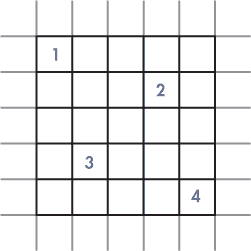
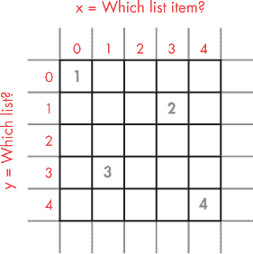
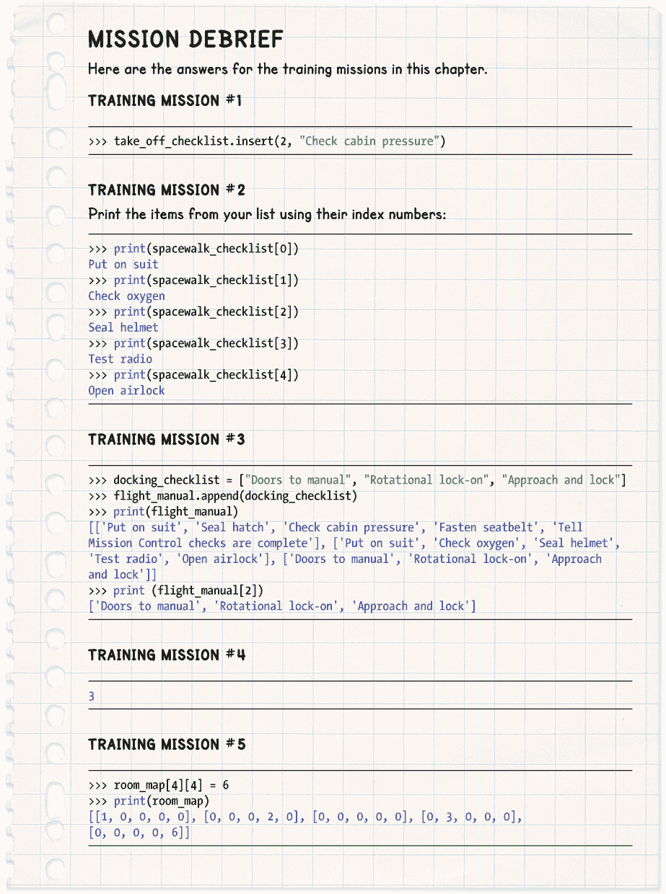

## 第二章：列表能救你的命**


宇航员的生活离不开列表。他们使用的安全检查单有助于确保所有系统在他们将生命托付给这些系统之前正常运作。例如，紧急检查单告诉宇航员在紧急情况下该怎么做，以防止他们慌乱。程序性检查单确认他们正确使用设备，以防设备出现故障，阻碍他们回到家园。这些列表有可能在某天拯救他们的生命。

在本章中，你将学习如何在 Python 中管理列表，以及如何将它们用于检查单、地图和几乎宇宙中的任何事物。当你制作 *Escape* 游戏时，你将使用列表来存储空间站的布局信息。

### **创建你的第一个列表：起飞检查单**

起飞是太空旅行中最危险的环节之一。当你被绑在火箭上时，你会想在发射前对一切进行仔细检查。一个简单的起飞检查单可能包含以下步骤：

  穿上宇航服

  密封舱口

  检查舱内压力

  系好安全带

Python 有一种完美的方式来存储这些信息：Python *列表* 就像一个变量，存储多个项目。如你所见，你可以将其用于数字和文本，甚至是数字与文本的组合。

让我们在 Python 中创建一个名为 `take_off_checklist` 的列表供宇航员使用。因为我们只是用一个简短的例子进行练习，所以我们将在 Python shell 中输入代码，而不是创建一个程序。（如果你需要复习如何使用 Python shell，请参阅 第 15 页 中的 “介绍 Python Shell”）。在 IDLE shell 中输入以下内容，在每一行结束时按 ENTER 键开始新的一行：

```py
>>> take_off_checklist = ["Put on suit",
                          "Seal hatch",
                          "Check cabin pressure",
                          "Fasten seatbelt"]
```

**红色警报**

*确保代码中的括号、引号和逗号都准确无误。如果遇到任何错误，请重新输入列表代码，并仔细检查括号、引号和逗号是否放置正确。为了避免重新输入代码，可以使用鼠标高亮选中 shell 中的文本，右键点击选中的文本，选择 **复制**，然后再次右键点击并选择 **粘贴**。*

让我们更仔细地看看 `take_off_checklist` 列表是如何创建的。你通过一个开括号标记列表的开始，Python 会知道列表尚未结束，直到它检测到最终的闭括号。这意味着你可以在每一行结束时按 ENTER 键继续输入指令，Python 会知道你还没有完成，直到你输入了最终的括号。

引号告诉 Python 你给它的是文本，并且标明每段文本的开始和结束。每个条目需要自己的开引号和闭引号。你还需要用逗号分隔不同的文本项。最后一个条目后面不需要逗号，因为它后面没有其他列表项。

#### **查看你的列表**

要查看你的检查清单，你可以像我们在第一章中做的那样使用`print()`函数。将你的列表名称添加到`print()`函数中，像这样：

```py
>>> print(take_off_checklist)
['Put on suit', 'Seal hatch', 'Check cabin pressure', 'Fasten seatbelt']
```

你不需要在`take_off_checklist`周围加上引号，因为它是一个列表的名称，而不是一段文本。如果你加上引号，Python 会直接在屏幕上输出文本`take_off_checklist`，而不是返回你的列表。试试看会发生什么。

#### **添加和删除项目**

即使在你创建了一个列表之后，你仍然可以使用`append()`命令向其中添加一个项目。*append*这个词的意思是将某样东西添加到末尾（想象一下书籍的附录，在书的最后）。你可以像这样使用`append()`命令：

```py
>>> take_off_checklist.append("Tell Mission Control checks are complete")
```

你输入列表的名称（不加引号），然后加上一个点，再加上`append()`命令，然后将要添加的项目放在圆括号中。该项目将被添加到列表的末尾，如你再次打印列表时所看到的：

```py
>>> print(take_off_checklist)
['Put on suit', 'Seal hatch', 'Check cabin pressure', 'Fasten seatbelt', 'Tell
Mission Control checks are complete']
```

你还可以使用`remove()`命令从列表中删除项目。让我们删除`Seal hatch`项目：

```py
>>> take_off_checklist.remove("Seal hatch")
>>> print(take_off_checklist)
['Put on suit', 'Check cabin pressure', 'Fasten seatbelt', 'Tell Mission
Control checks are complete']
```

再次，你输入列表的名称，后面跟一个点，再加上`remove()`命令，然后在圆括号中指定你要删除的项目。

**红色警报**

*当你从列表中删除一个项目时，确保你输入的内容与该项目完全匹配，包括大写字母和标点符号。否则，Python 将无法识别它并给你一个错误。*

### **使用索引号**

嗯，我们可能应该把`Seal hatch`检查项重新放回列表中，以免任务控制中心的任何人注意到。你可以通过使用该项目的索引号在列表中的特定位置插入一个项目。*索引*是项目在列表中的位置。Python 从 0 开始计数，而不是从 1，所以列表中的第一个项目总是索引 0，第二个项目的索引是 1，以此类推。

#### **插入一个项目**

使用位置索引，我们将把`Seal hatch`放回它该在的位置：

```py
>>> take_off_checklist.insert(1, "Seal hatch")
>>> print(take_off_checklist)
['Put on suit', 'Seal hatch', 'Check cabin pressure', 'Fasten seatbelt', 'Tell
Mission Control checks are complete']
```

呼！我想我们挺过来了。因为索引从 0 开始，当我们插入`Seal hatch`时，我们把它放在了位置 1，即列表中的第二个项目。列表中的其他项目向下移动，以腾出空间，它们的索引号也随之增加，如图 2-1 所示。


*图 2-1：在索引 1 处插入一个项目。上排：插入前。下排：插入后。*

#### **访问单个项目**

你还可以通过使用列表名称和你想访问的项目的索引号，在方括号内访问列表中的特定项目。例如，要打印列表中的特定项目，你可以输入以下内容：

```py
>>> print(take_off_checklist[0])
Put on suit
>>> print(take_off_checklist[1])
Seal hatch
>>> print(take_off_checklist[2])
Check cabin pressure
```

现在你可以看到列表中的各个项目了！

**红色警报**

*不要混淆你的括号。大致来说：当你告诉 Python 使用哪个列表项目时，使用方括号。当你对列表或其中的项目执行某些操作时，比如打印列表或将项目附加到列表时，使用圆括号。每一个开括号都需要有一个相同类型的闭括号。*

#### **替换项目**

你也可以通过索引号替换项。只需输入列表名称，后跟你要替换的项的索引，然后使用等号 (`=`) 告诉 Python 你希望在该索引位置插入什么，例如：

```py
>>> take_off_checklist[3] = "Take a selfie"
>>> print(take_off_checklist)
['Put on suit', 'Seal hatch', 'Check cabin pressure', 'Take a selfie', 'Tell
Mission Control checks are complete']
```

索引为 3 的旧项被删除，并被新项替换。请注意，当你替换一项时，Python 会忘记原来的项。回想你的训练，把它放回去，如下所示：

```py
>>> take_off_checklist[3] = "Fasten seatbelt"
>>> print(take_off_checklist)
['Put on suit', 'Seal hatch', 'Check cabin pressure', 'Fasten seatbelt', 'Tell
Mission Control checks are complete']
```

#### **删除项目**

如果你知道列表中某项的位置，也可以通过它的索引号删除该项，例如：

```py
>>> del take_off_checklist[2]
>>> print(take_off_checklist)
['Put on suit', 'Seal hatch', 'Fasten seatbelt', 'Tell Mission Control checks
are complete']
```

`"检查舱内压力"` 这一项从列表中消失了。

**训练任务 #1**

是时候练习你的技能了！我们刚刚删除了列表中的第 2 项。你能把它重新插入列表并放到正确的位置吗？打印列表以检查它是否成功。

### **创建太空行走检查清单**

如你从第一章中所知，对于宇航员来说，另一个危险的活动是仅凭宇航服保护自己，进入漆黑的太空真空中，宇航服为你提供氧气保护。以下是一个检查清单，帮助你在太空行走时保持安全：

 穿上宇航服

 检查氧气

 密封头盔

 测试无线电

 打开气闸

让我们把这个检查清单转换成 Python 列表。我们将其命名为 `spacewalk_checklist`，如以下代码所示：

```py
>>> spacewalk_checklist = ["Put on suit",
                           "Check oxygen",
                           "Seal helmet",
                           "Test radio",
                           "Open airlock"]
```

记得小心处理逗号和括号。

**训练任务 #2**

测试你的代码总是一个好主意，这样你就能确保它按预期工作。你能尝试打印所有列表项，以检查它们是否在正确的位置吗？

### **列表中的列表：飞行手册**

现在我们有两个检查清单：一个是起飞清单，一个是太空行走清单。我们可以通过将它们放入另一个列表中来组织它们，从而创建我们的“飞行手册”。可以把飞行手册想象成一个文件夹，里面有两张纸，每张纸上有一个清单。

#### **创建列表中的列表**

这是我们创建飞行手册列表的方式：

```py
>>> flight_manual = [take_off_checklist, spacewalk_checklist]
```

我们给 IDLE 提供 `flight_manual` 列表名称，使用等号 (`=`)，然后将我们希望放入 `flight_manual` 列表的两个列表放入方括号中。就像我们之前创建列表时一样，用逗号分隔两个项。新的 `flight_manual` 列表包含两个项：`take_off_checklist` 和 `spacewalk_checklist`。当你打印 `flight_manual` 时，它会显示如下：

```py
>>> print(flight_manual)
[['Put on suit', 'Seal hatch', 'Check cabin pressure', 'Fasten seatbelt',
'Tell Mission Control checks are complete'], ['Put on suit', 'Check oxygen',
'Seal helmet', 'Test radio', 'Open airlock']]
```

**提示**

记住，列表名称不需要加引号；只有在你向列表中输入文本时才需要使用引号。

**红色警报**

*如果你在列表中没有看到* '检查舱内压力' *，那是因为你跳过了训练任务 #1。为了更容易跟上进度，我建议你回去完成那个任务。如果需要，你可以在章节末尾查看训练任务的答案。*

输出看起来很乱！要弄清楚发生了什么，仔细看看括号。方括号标记了每个列表的开始和结束。如果你去掉列表项，输出看起来是这样的：

```py
[ [ first list is here ], [ second list is here ] ]
```

在中间部分，你可以看到第一个列表以一个闭括号结束，然后是一个逗号，接着下一个列表以开括号开始。那么，当你尝试打印 `flight_manual` 列表中的第一个项目时会发生什么呢？

```py
>>> print(flight_manual[0])
```

第一个项目是`take_off_checklist`，因此输出看起来是这样的：

```py
['Put on suit', 'Seal hatch', 'Check cabin pressure', 'Fasten seatbelt', 'Tell
Mission Control checks are complete']
```

**训练任务 #3**

尝试将其他清单添加到 `flight_manual` 中并打印出来。例如，你可以添加一个着陆或与其他飞船对接的清单。

#### **在飞行手册中查找项目**

如果你想查看 `flight_manual` 中某个特定项目，你必须给 Python 提供两项信息：该项目所在的列表以及该项目在列表中的索引，顺序不能错。对于每一项信息，你可以使用索引数字，像这样：

```py
>>> print(flight_manual[0][1])
Seal hatch
```

将你的结果与上面打印出的清单进行对比。`Seal hatch` 项目位于第一个列表（索引 0）中，即 `take_off_checklist`，它是该列表中的第二个项目（索引 1）。这就是我们用来找到它的两个索引号码。接下来我们从第二个列表中选择一个项目：

```py
>>> print(flight_manual[1][3])
Test radio
```

这次，我们从第二个列表（索引 1）中打印，并且从该列表中打印第四个项目（索引 3）。虽然看起来可能有些困惑，因为 Python 是从 0 开始计数的，但很快你会习惯从你想要的位置减去一。小心，不要在购物时少买了一件东西！

**小贴士**

要在屏幕上打印一个列表或变量，当你在 shell 中输入时，可以省略 `print()` 命令，像这样：

```py
>>> flight_manual[0][2]
‘Check cabin pressure’
```

然而，这种方法只在 shell 中有效，而不适用于程序。通常，你在 Python 中会有多种方式做同一件事。本书聚焦于那些最能帮助你制作 *Escape* 游戏的技巧。在学习 Python 的过程中，你会找到自己的风格和偏好。

### **合并列表**

你可以使用加号（`+`）将两个列表合并成一个列表。让我们创建一个包含起飞和太空行走所需技能的列表，并称之为 `skills_list`：

```py
>>> skills_list = take_off_checklist + spacewalk_checklist
>>> print(skills_list)
['Put on suit', 'Seal hatch', 'Check cabin pressure', 'Fasten seatbelt', 'Tell
Mission Control checks are complete', 'Put on suit', 'Check oxygen', 'Seal
helmet', 'Test radio', 'Open airlock']
```

你在这里看到的输出是一个包含来自我们已经创建的两个列表的宇航员所需技能的单一列表。我们还可以通过输入合并后的列表名称并使用 `+=` 来将单个项目或其他列表添加到末尾。 （在第一章中，你学会了如何使用 `+=` 来为变量的值添加一个数字。）

很少有人能进入太空，因此宇航员角色的一个重要部分是分享这种经历。让我们添加一个名为 `pr_list` 的列表，用于宇航员可能需要的公共关系（PR）技能。我想或许“自拍技能”真的有用处！

```py
>>> pr_list = ["Taking a selfie",
               "Delivering lectures",
               "Doing TV interviews",
               "Meeting the public"]
>>> skills_list += pr_list
>>> print(skills_list)
['Put on suit', 'Seal hatch', 'Check cabin pressure', 'Fasten seatbelt',
'Tell Mission Control checks are complete', 'Put on suit', 'Check oxygen',
'Seal helmet', 'Test radio', 'Open airlock', 'Taking a selfie', 'Delivering
lectures', 'Doing TV interviews', 'Meeting the public']
```

`skills_list` 现在包含了 `pr_list` 中的项目。`skills_list` 仍然是一个包含单个项目的简单列表，不像 `flight_manual`，它内部有两个独立的列表。

**提示**

你可能已经注意到这行代码：

```py
skills_list += pr_list
```

这只是更简洁的写法：

```py
skills_list = skills_list + pr_list
```

这是一个非常有用的快捷方式！

### **从列表制作地图：急救室**

导航是宇航员的一项基本技能。你必须始终知道自己身处何地，最近的避难所在哪里，甚至空气的来源，以便在紧急情况下随时准备好。*逃生*游戏会记录玩家所在房间的地图，以便正确绘制房间并使玩家与物品互动。让我们来看一下如何使用列表制作急救物资室的地图。

#### **制作地图**

现在你已经知道如何管理列表和嵌套列表，可以开始制作地图了。这一次，我们将创建一个程序，而不是在 shell 中工作。在 Python 窗口的顶部，选择 **文件** ▸ **新建文件** 打开一个新窗口。

将 Listing 2-1 输入到你的新程序窗口中：

*listing2-1.py*

```py
room_map = [ [1, 0, 0, 0, 0],
             [0, 0, 0, 2, 0],
             [0, 0, 0, 0, 0],
             [0, 3, 0, 0, 0],
             [0, 0, 0, 0, 4]
           ]
print(room_map)
```

*Listing 2-1：设置急救室*

请注意，列表中的最后一行不需要逗号。此程序创建并显示一个名为 `room_map` 的列表。我们的新急救室是五米乘五米的。`room_map` 列表包含五个列表。每个列表包含五个数字，表示地图中的一行。我已经在代码中排列好数字，让它看起来像 图 2-2 中显示的网格，这是房间的地图。比较图示和程序，你会发现第一个列表是顶行，第二个列表是第二行，依此类推。0 代表网格中的空地，数字 1 到 4 用于表示房间中的各种急救物品。本章使用的数字代表以下物品：



*图 2-2：我们的第一个简单地图*

1.  化肥

1.  备用氧气瓶

1.  剪刀

1.  牙膏

1.  急救毯

1.  紧急无线电

**红色警报**

*确保你的括号和逗号放在正确的位置。将 Listing 2-1 放入程序中的原因之一是，如果你犯了错误，可以轻松进行更正，而不是直接在 shell 中输入。*

点击 **文件** ▸ **保存**，并将你的程序保存为 *listing2-1.py*。此程序不使用 Pygame Zero，因此我们可以从 IDLE 运行它。点击窗口顶部的 **运行**，然后点击 **运行模块**。你应该在 Shell 窗口中看到以下输出：

```py
[[1, 0, 0, 0, 0], [0, 0, 0, 2, 0], [0, 0, 0, 0, 0], [0, 3, 0, 0, 0],
[0, 0, 0, 0, 4]]
```

当列表以这种方式显示时，很难弄清楚你正在查看什么，这就是为什么我在程序清单中将数字排列成网格的原因。但是这个 shell 输出是相同的地图和相同的数据，因此一切都在应该在的位置：它只是以不同的方式呈现。在第三章中，你将学习如何打印这个地图数据，使其看起来更像我们创建的清单。

#### **寻找紧急物品**

要找出地图中特定点上的物品，你需要给 Python 一个坐标来检查。*坐标*是由 *y* 位置（从上到下）和 *x* 位置（从左到右）组成的，顺序是这样的。*y* 位置将是你要检查的 `room_map` 中的列表（网格中的一行）。*x* 位置将是你想查看的该列表中的物品（该列）（请参见图 2-3）。和往常一样，记住索引号从 0 开始。



*图 2-3：y 坐标表示我们要查看的列表。x 坐标表示该列表中的物品。*

**红色警报**

*如果你以前使用过坐标系，你会知道通常将 x 坐标放在 y 坐标之前。我们这里做的是相反的，因为这样可以让代码更简单。如果我们将* x *放在前面，我们必须让每个*room_map*中的列表代表地图的一列，从上到下，而不是一行，从左到右。那样的话，我们的代码中的地图看起来会错乱：地图会被旋转并成为镜像图像，这会让人非常困惑！只要记住，我们的地图坐标是先* y *然后* x*。*

让我们通过一个例子来做一下：我们将找出在简单地图图示中标记为 2 的位置上的物品。我们需要知道以下几点：

+   `2`位于第二行（从上到下），因此它位于`room_map`中的第二个列表。索引从 0 开始，因此我们从 2 中减去 1 来得到 *y* 位置的索引号，结果是`1`。请使用图 2-3 来检查这个索引号：行的索引号显示在网格左侧的红色区域。

+   `2`位于列表的第四列（从左到右）。同样，我们减去 1 来得到 *x* 位置的索引号，结果是`3`。请使用图 2-3 来检查此索引号。列的索引号显示在网格顶部的红色区域。

转到 shell 并输入以下 `print()` 命令，以查看地图上该位置的数字：

```py
>>> print(room_map[1][3])
2
```

正如预期的那样，结果是数字 2，它恰好是备用氧气罐。你已经成功地浏览了你的第一个地图！

**训练任务 #4**

在你将以下命令输入到 shell 之前，尝试预测输出：

```py
>>> print(room_map[3][1])
```

参考图 2-2 中的地图和你的代码清单来做出预测。如果你需要更多的帮助，可以查看图 2-3。然后通过在 shell 中输入指令来检查你的答案。

#### **交换房间中的物品**

你也可以改变房间中的物品。我们来检查一下地图左上角的位置存放的是什么物品，再次使用 shell：

```py
>>> print(room_map[0][0])
1
```

1 是肥料。我们在急诊室不需要肥料，所以我们将把地图中的该物品改成急救毯，用 5 来表示它们。还记得我们是如何用等号 (`=`) 来改变列表中项目的值吗？我们可以同样用它来改变地图中的数字，像这样：

```py
>>> room_map[0][0] = 5
```

我们输入坐标后，输入一个新数字来替换原有的数字。我们可以通过再次打印该坐标的值来检查代码是否有效，刚才的值是 1。我们还可以打印 `room_map`，确认急救毯是否出现在正确的位置：

```py
>>> print(room_map[0][0])
5
>>> print(room_map)
[[5, 0, 0, 0, 0], [0, 0, 0, 2, 0], [0, 0, 0, 0, 0], [0, 3, 0, 0, 0], [0, 0, 0,
0, 4]]
```

完美！急救毯存放在房间的左上角。物品 5 是第一个列表中的第一个物品。

**训练任务 #5**

在急诊室，空间是宝贵的！将牙膏（4）替换为急救无线电（6）。你需要先找到 4 的坐标，然后输入命令来改变它。如果需要更多帮助，参考 图 2-2 和 图 2-3，这些内容涉及索引号。

在 *Escape* 游戏中，`room_map` 列表用于记住玩家当前所在房间中的物品。地图存储每个位置上的物品编号，或者如果该位置为空地则存储 0。游戏中的房间将比这个 5 × 5 的网格大，因此 `room_map` 的大小会根据玩家所处房间的宽度和高度而有所不同。

### **你适合飞行吗？**

勾选以下框以确认你已掌握本章的关键内容。

 Python 列表可以存储单词、数字或两者的混合。

 要查看列表中的项目，使用其索引号并放在方括号中：例如，`print(take_off_checklist[2])`。

 `append()` 函数将项目添加到列表的末尾。

 `remove()` 函数可以从列表中删除项目：例如，`spacewalk _checklist.remove("Seal helmet")`。

 你可以使用索引号来删除或插入列表中特定位置的项。

 索引号从 0 开始。

 你可以使用等号 (`=`) 来改变列表中的项目：例如，`take_off_checklist[3] = "Test comms"`。

 你可以创建一个包含其他列表的列表来构建一个简单的地图。

 你可以使用坐标查看地图中的物品：例如，使用 `room_map[`y 坐标`][`x 坐标`]`。

 一定要先使用 *y* 再使用 *x* 来表示坐标。在太空中，一切都是颠倒的。

 坐标是索引号，因此两者都是从 0 开始的，而不是 1。

 你可以使用`+=`将一个项目添加到列表中，或者将两个列表连接起来。


