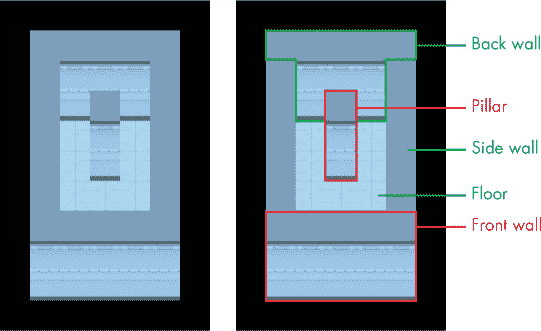
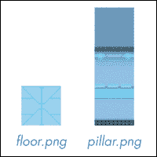
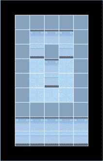
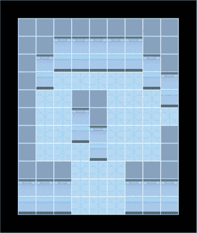
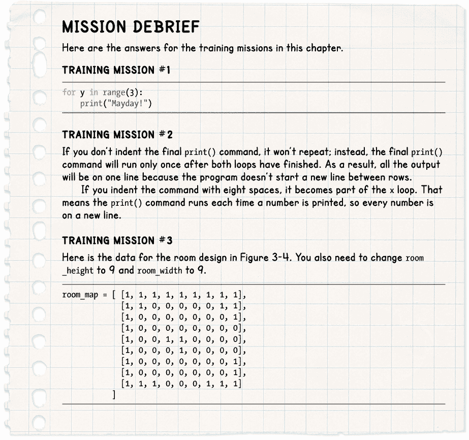

## REPEAT AFTER ME**


每个人都在谈论太空旅行的英雄主义和光彩，但其中一些其实是日常的、重复的工作。当你在太空站温室里清洁、种植，或者锻炼保持体力时，你是在遵循详细的计划，以确保团队的安全和太空站的正常运行。幸运的是，机器人会处理一些繁重的工作，而且它们从不抱怨需要重复同样的任务。

无论你是在编程机器人还是构建游戏，循环都是你基本的编程构建块之一。*循环*是程序中的一部分，它会重复执行：有时它会重复一定次数，有时会一直执行，直到发生特定事件。有时，你甚至会设置一个循环让它永远运行。在本章中，你将学习如何使用循环在程序中重复指令一定次数。你将结合对列表的理解，使用循环来显示地图并绘制 3D 房间图像。

### **使用循环显示地图**

在 *Escape* 游戏中，我们将广泛使用循环。我们经常使用它们从列表中提取信息并执行某些操作。

让我们从使用循环显示文本地图开始。

#### **制作房间地图**

我们将为本章示例创建一个新地图，使用 `1` 表示墙壁，`0` 表示地面空间。我们的房间四周都有墙壁，中间附近有一根柱子。柱子与墙壁一段相同，因此也用 1 来表示。我选择了它的位置，这样当我们稍后绘制 3D 房间时，看起来会更好。房间中没有其他物体，因此目前我们不会使用其他数字。

在 IDLE 中，打开一个新的 Python 程序，输入列表 3-1 中的代码，并将其保存为 *listing3-1.py*：

*listing3-1.py*

```py
room_map = [ [1, 1, 1, 1, 1],
             [1, 0, 0, 0, 1],
             [1, 0, 1, 0, 1],
             [1, 0, 0, 0, 1],
             [1, 0, 0, 0, 1],
             [1, 0, 0, 0, 1],
             [1, 1, 1, 1, 1]
           ]
print(room_map)
```

*列表 3-1：添加房间地图数据*

这个程序创建了一个名为 `room_map` 的列表，包含七个其他列表。每个列表以方括号开始和结束，并且用逗号与下一个列表分隔。正如你在第二章中学到的，最后一个列表后面不需要逗号。每个列表代表地图中的一行。点击 **运行** ▸ **运行模块** 来运行程序，你应该能在 shell 窗口中看到以下内容：

```py
[[1, 1, 1, 1, 1], [1, 0, 0, 0, 1], [1, 0, 1, 0, 1], [1, 0, 0, 0, 1], [1, 0, 0, 0, 1], [1, 0, 0,
0, 1], [1, 1, 1, 1, 1]]
```

正如你在第二章中看到的，打印地图列表会将所有行挤在一起，这样查看地图并不方便。我们将使用循环以更易读的方式显示地图。

#### **使用循环显示地图**

为了按行列显示地图，删除程序中的最后一行，并添加列表 3-2 中显示的两行新代码。和之前一样，别输入灰色的行——它们只是帮助你定位在程序中的位置。将程序保存为 *listing3-2.py*。

*listing3-2.py*

```py
   --snip--
             [1, 0, 0, 0, 1],
             [1, 1, 1, 1, 1]
           ]
➊ for y in range(7):
➋     print(room_map[y])
```

*列表 3-2：使用循环显示房间地图*

**红色警报**

*记得在第一行的末尾加上冒号！没有它，程序将无法正常工作。第二行应该缩进四个空格，以告诉 Python 你希望重复执行哪些指令。如果你在`for`语句行末加上冒号，按下 ENTER 进入下一行时，空格会自动添加。*

当你再次运行程序时，应该会在命令行中看到以下内容：

```py
[1, 1, 1, 1, 1]
[1, 0, 0, 0, 1]
[1, 0, 1, 0, 1]
[1, 0, 0, 0, 1]
[1, 0, 0, 0, 1]
[1, 0, 0, 0, 1]
[1, 1, 1, 1, 1]
```

这是一种更有用的地图查看方式。现在你可以轻松看到围绕地图四周的墙壁（由`1`表示）。那么代码是如何工作的呢？这里的引擎是`for`命令➊。它是一个循环命令，告诉 Python 重复执行某段代码指定的次数。Listing 3-2 告诉 Python 为`room_map`列表中的每个项重复执行`print()`指令➋。`room_map`中的每个项都是一个包含地图一行数据的列表，所以逐行打印它们就能逐行显示我们的地图，从而得到这种有序的展示效果。

让我们更详细地分解一下代码。我们使用`range()`函数来创建一个数字序列。通过`range(7)`，我们告诉 Python 生成一个不包含 7 的数字序列。为什么不包括最后一个数字呢？这就是`range()`函数的工作方式！如果我们只给`range()`函数一个数字，Python 会默认从`0`开始计数。所以`range(7)`生成的数字序列是 0、1、2、3、4、5 和 6。

每次代码重复时，`for`命令中的变量会从序列中取出下一个项。在这种情况下，`y`变量依次取值`0`、`1`、`2`、`3`、`4`、`5`和`6`。这与`room_map`中的索引值完美匹配。

我选择`y`作为变量名，因为我们用它来表示我们想要显示的地图行，地图上的行被称为 y 坐标。

`print(room_map[y])`命令➋缩进了四个空格，告诉 Python 这是我们希望`for`循环➊重复执行的代码块。

循环第一次执行时，`y`的值为`0`，所以`print(room_map[y])`打印`room_map`中的第一个项，即包含地图第一行数据的列表。第二次执行时，`y`的值为`1`，所以`print(room_map[y])`打印第二行。代码会一直重复，直到打印完`room_map`中的所有七个列表。

**训练任务 #1**

在太空站的紧急情况下，你可能需要发出求救信号。编写一个简单的程序，使用循环仅打印三次*Mayday!*。

如果你卡住了，从 Listing 3-2 开始，它用于打印地图。你只需要改变程序打印的内容以及它循环打印代码的次数。

### **循环循环**

我们的地图输出变得更好了，但仍然有几个限制。其中一个是逗号和括号让它看起来有些杂乱。另一个限制是我们无法对房间中单独的墙面板或空间做任何处理。我们需要能够单独处理房间中每个位置的内容，以便能够正确显示其图像。为此，我们需要使用更多的循环。

#### **嵌套循环获取房间坐标**

*listing3-2.py*程序使用循环来提取地图的每一行。现在，我们需要使用另一个循环来检查每行中的每个位置，以便能够单独访问那里的对象。这样做将使我们能够完全控制物品的显示方式。

你刚刚看到我们可以在循环内重复一段代码。我们还可以将一个循环放入另一个循环中，这种结构被称为*嵌套循环*。为了查看其工作原理，我们首先使用这种技巧来打印房间中每个位置的坐标。编辑你的代码，使其与清单 3-3 匹配：

*listing3-3.py*

```py
   --snip--
             [1, 0, 0, 0, 1],
             [1, 1, 1, 1, 1]
           ]
➊ for y in range(7):
➋     for x in range(5):
➌         print("y=", y, "x=", x)
➍     print()
```

*清单 3-3：打印坐标*

**红色警报**

*正如每个宇航员所知道的那样，太空可能是危险的。空间也是如此。如果循环中的缩进不正确，程序将无法正常工作。将第一个*print()*命令➌*缩进八个空格，使其成为内层* x *循环的一部分。确保最后的*print()*指令➍*与第二个*for*命令➋*(缩进四个空格)对齐，这样它就留在外层循环中。当你开始新的一行时，Python 会像上一行一样自动缩进，但当你不再需要缩进时，你可以删除它。*

将你的程序保存为*listing3-3.py*并通过点击**运行** ▸ **运行模块**来运行程序。你将看到以下输出：

```py
y= 0 x= 0
y= 0 x= 1
y= 0 x= 2
y= 0 x= 3
y= 0 x= 4

y= 1 x= 0
y= 1 x= 1
y= 1 x= 2
y= 1 x= 3
y= 1 x= 4

y= 2 x= 0
y= 2 x= 1
y= 2 x= 2
--snip--
```

输出继续并以`y= 6 x= 4`结束。

我们已经像之前一样设置了`y`循环，它会重复七次 ➊，每次处理从`0`到`6`的数字，并将该值赋给`y`变量。这就是我们这次程序不同的地方：在`y`循环内，我们启动了一个新的`for`循环，使用`x`变量，并给它一个包含五个值的`range`，从`0`到`4` ➋。第一次执行`y`循环时，`y`是`0`，此时`x`依次取值`0`、`1`、`2`、`3`和`4`，而`y`保持为`0`。第二次执行`y`循环时，`y`变为`1`。我们重新启动一个`x`循环，它再次依次取值`0`、`1`、`2`、`3`和`4`，而`y`保持为`1`。这种循环会一直持续，直到`y`为`6`且`x`为`4`。

通过查看程序的输出，你可以看到循环是如何工作的：在 `x` 循环内部，我们每次重复 `x` 循环时都会打印 `y` 和 `x` 的值➌。当 `x` 循环完成时，我们会打印一个空行 ➍，然后进入 `y` 循环的下一次迭代。我们通过让 `print()` 函数的括号为空来实现这一点。空行将 `y` 循环的重复内容分隔开，而输出将展示每次 `x` 循环中 `x` 和 `y` 的值。正如你所看到的，程序输出了房间中每个位置的 y 坐标和 x 坐标。

**提示**

我们在循环中使用了变量名`y`和`x`，但这些变量名并不会影响程序的运行。你可以把它们叫作`sausages`（香肠）和`eggs`（鸡蛋），程序仍然可以正常工作。不过，这样做就不太容易理解了。因为我们获取的是 x 和 y 坐标，使用 `x` 和 `y` 作为变量名更为合理。

#### **清理地图**

我们将使用循环中的坐标打印地图，且不显示括号和逗号。请按照 Listing 3-4 中所示的方式修改程序，改变内部嵌套循环的内容：

*listing3-4.py*

```py
--snip--
for y in range(7):
    for x in range(5):
        print(room_map[y][x], end="")
    print()
```

*Listing 3-4: 整理地图显示*

将程序保存为 *listing3-4.py* 并通过点击 **Run** ▸ **Run Module** 来运行程序。你应该会在终端中看到以下输出：

```py
11111
10001
10101
10001
10001
10001
11111
```

这个地图看起来更简洁，更容易理解。它的工作方式与 Listing 3-3 中的程序类似。它通过 `y` 循环逐行遍历坐标，然后通过 `x` 循环获取每一行中的每个位置。这一次，我们不是打印坐标，而是查看每个位置的 `room_map` 中的内容，并打印出来。正如你在 第二章 中学到的那样，你可以通过 `room_map[y 坐标][x 坐标]` 的形式来获取地图中的任何项目。

我们格式化输出的方式使得地图看起来像房间的布局：我们把同一行中的所有数字放在一起，只有当开始新的一行（`y` 循环的下一次迭代）时，屏幕上才会开始新的一行。

`x` 循环中的 `print()` 指令以 `end=""`（引号之间没有空格）结尾，以防在每个数字后面开始新的一行。否则，默认情况下，`print()` 函数会在每一项输出后添加一个换行符。但我们告诉它在输出后不加任何内容（`""`）。因此，来自一次完整 `x` 循环（从 `0` 到 `4`）的所有项会显示在同一行。

每行打印后，我们会使用一个空的 `print()` 命令来开始新的一行。由于我们只用四个空格缩进这个命令，它属于 `y` 循环，而不是 `x` 循环中重复的部分。这意味着它每次只会在 `y` 循环执行时运行一次，并且是在 `x` 循环打印完一行数字后执行的。

**训练任务 #2**

最后的`print()`命令使用了四个空格缩进。试试看如果你将其缩进八个空格，或者不缩进的话会发生什么。每次都记录它运行了多少次，并观察缩进如何影响输出。

### **显示 3D 房间图像**

现在你已经掌握了足够的地图知识，可以显示一个 3D 房间图像了。在第一章中，你学会了如何使用 Pygame Zero 将图像放置到屏幕上。让我们将这一知识与新获得的从`room_map`中获取数据的技能结合起来，这样我们就可以用图像而不是`0`和`1`来显示我们的地图。

点击**文件** ▸ **新建文件**来开始一个新的 Python 文件，然后输入 Listing 3-5 中的代码。你可以复制本章最新程序中的`room_map`数据。

*listing3-5.py*

```py
   room_map = [ [1, 1, 1, 1, 1],
                [1, 0, 0, 0, 1],
                [1, 0, 1, 0, 1],
                [1, 0, 0, 0, 1],
                [1, 0, 0, 0, 1],
                [1, 0, 0, 0, 1],
                [1, 1, 1, 1, 1]
              ]

➊ WIDTH = 800 # window size
➋ HEIGHT = 800
   top_left_x = 100
   top_left_y = 150

➌ DEMO_OBJECTS = [images.floor, images.pillar]

   room_height = 7
   room_width = 5

➍ def draw():
       for y in range(room_height):
           for x in range(room_width):
➎             image_to_draw = DEMO_OBJECTS[room_map[y][x]]
➏             screen.blit(image_to_draw,
                     (top_left_x + (x*30),
                     top_left_y + (y*30) - image_to_draw.get_height()))
```

*Listing 3-5：显示房间 3D 图像的代码*

将程序保存为*listing3-5.py*。你需要将它保存到*escape*文件夹中，因为程序会使用存储在该文件夹内的*images*文件夹中的文件。不要把文件保存*在*images 文件夹里：文件应该和 images 文件夹并列保存。如果你还没有下载*Escape*游戏文件，请参见“下载游戏文件”（第 7 页）获取下载说明。

*listing3-5.py*程序使用了 Pygame Zero，因此你需要进入命令行并输入指令 pgzrun listing3-5.py 来运行程序。关于如何运行使用 Pygame Zero 的程序，包括最终的*Escape*游戏，请参见“运行游戏”（第 9 页）。

*listing3-5.py*程序使用了*Escape*游戏的图像文件来创建房间的图像。图 3-1 显示了房间和它的单个柱子。*Escape*游戏采用了简化的 3D 透视法，我们可以看到物体的前面和顶部表面。房间前后的物体绘制成相同的大小。

在第一章中创建太空行走模拟器时，你看到了对象绘制顺序如何决定哪些对象在其他对象前面。在*Escape*游戏和 Listing 3-5 中，物体从房间的后面绘制到前面，这样我们就能创建 3D 效果。离观察者（坐在电脑前的人）更近的物体，看起来会在房间后方的物体前面。



*图 3-1：你的第一个 3D 房间（左）和标注部件的同一房间（右）*

### **理解房间是如何绘制的**

现在让我们来看一下 *listing3-5.py* 程序是如何工作的。程序中的大部分内容你会在第一章和第二章中见过。`WIDTH` ➊ 和 `HEIGHT` ➋ 变量保存了窗口的大小，我们使用 `draw()` 函数告诉 Pygame Zero 要在屏幕上绘制什么 ➍。`y` 和 `x` 循环来自 Listing 3-4，为我们提供房间中每个位置的坐标。

我们不再像以前那样在 `range()` 函数中使用数字来告诉 Python 循环多少次，而是使用了新的变量 `room_height` 和 `room_width`。这两个变量存储了房间地图的大小，并告诉 Python 循环应当执行多少次。例如，如果我们将 `room_height` 变量更改为 10，`y` 循环将执行 10 次，遍历地图中的 10 行。`room_width` 变量控制了 `x` 循环重复的次数，类似地，我们就可以显示更宽的房间。

**红色警报**

*如果你使用的房间宽度和高度大于实际的* room_map *数据，将会导致错误。*

*listing3-5.py* 程序使用了来自 *images* 文件夹中的两张图像：一张地板砖（文件名为 *floor.png*）和一张墙壁柱子（名为 *pillar.png*），如图 3-2 所示。*PNG（便携式网络图形）* 是一种 Pygame Zero 可以使用的图像文件类型。PNG 格式允许图像的某些部分透明，这对于我们的 3D 游戏视角非常重要。否则，我们就无法通过植物的空隙看到背景景物，比如宇航员的周围会出现一个方形的光环。



*图 3-2：用于创建你的第一个 3D 房间的图像*

在 `draw()` 函数 ➍ 内，我们使用 `y` 和 `x` 循环依次查看房间地图中的每个位置。如你之前所见，我们可以通过访问 `room_map``[y][x]` 来查找地图中每个位置的数字。在这张地图中，数字为 `1` 代表墙壁柱子，数字为 `0` 代表空的地板空间。我们不再像之前那样在屏幕上打印数字，而是使用数字在 `DEMO_OBJECTS` 列表 ➎ 中查找对应的物品图像。该列表包含了我们的两个图像 ➌：地板砖在索引位置 `0`，墙壁柱子在索引位置 `1`。例如，如果 `room_map` 中我们查看的位置包含 `1`，我们就会从 `DEMO_OBJECTS` 列表的索引位置 `1` 中获取墙壁柱子的图像。我们将该图像存储在变量 `image_to_draw` ➎ 中。

然后，我们使用 `screen.blit()` 在屏幕上绘制该图像，并给定它的 `x` 和 `y` 坐标，表示我们希望将图像绘制到屏幕上的哪个像素位置 ➏。这条指令跨越了三行，以便更易于阅读。第二行和第三行的缩进量不重要，因为这些行都被 `screen.blit()` 的括号所包围。

### **计算每个物品的绘制位置**

为了计算每幅构成房间的图像应该绘制的位置，我们需要在 ➏ 处进行一次计算。我们将了解这个计算的过程，但在此之前，我会先解释一下太空站是如何设计的。所有图像的设计都适应网格。我们用来衡量计算机图像的单位叫做 *像素*，它是你屏幕上能看到的最小点的大小。我们将每个网格的方格称为 *砖块*。每个砖块在屏幕上是 30 像素宽，30 像素高，大小与一个地砖相同。我们是按砖块来定位物体的，因此一把椅子可能位于 4 个砖块的下方和 4 个砖块的右侧，从左上角开始计算。

图 3-3 显示了我们刚刚创建的房间，并且在上面叠加了一个网格。每个地砖和柱子都是一块砖宽。柱子很高，因此它覆盖了三个砖块位置：墙柱的前表面高两块砖，而柱子的顶部表面覆盖了另外一块砖。



*图 3-3：覆盖在第一个房间上的砖块网格*

`top_left_x` 和 `top_left_y` 变量存储我们希望开始绘制房间的第一幅图像在窗口中的坐标。我们在本章中从不更改这些变量。我选择从 `x` 为 100 和 `y` 为 150 开始绘制，这样我们在房间图像周围会有一些边距。

为了计算绘制一块墙壁或地板的位置，我们需要将我们的地图位置（例如，`x` 方向上范围为 `0` 到 `4`）转换为窗口中的像素位置。

每个砖块空间是 30 像素见方，所以我们将 `x` 循环次数乘以 `30`，并加上 `top_left_x` 位置，以获得图像的 x 坐标。在 Python 中，`*` 符号用于乘法运算。`top_left_x` 的值为 `100`，所以第一幅图像绘制在 `100 + (0 * 30)`，即 `100` 位置。第二幅图像绘制在 `100 + (1 * 30)`，即 `130`，它位于第一幅图像的右侧一个砖块位置。第三幅图像绘制在 `100 + (2 * 30)`，即 `160`。这些位置确保图像紧密地并排显示。

*y* 位置的计算方式类似。我们使用 `top_left_y` 作为垂直方向的起始位置，然后加上 `y * 30`，以便让图像精准地连接在一起。不同之处在于，我们需要减去正在绘制图像的高度，这样可以确保图像在底部对齐。因此，高大的物体可以从砖块空间中突出出来，遮挡其后面的风景或地砖，使房间显示出三维效果。如果我们没有在底部对齐图像，它们就会在顶部对齐，这会破坏 3D 效果。例如，第二行和第三行的地砖会遮挡住后墙的前表面。

**训练任务 #3**

现在你知道如何展示一个 3D 房间了，试着调整地图，改变房间的布局，添加新的柱子或地板空间。你可以编辑`room_map`数据，向地图中添加新的行或列。记得也要修改`room_height`和`room_width`变量。

你或许可以尝试设计一个有更多行的房间，并通过将柱子上的 1 替换为 0 来添加一个门。在最终的*Escape*游戏中，每个门的宽度将是三格。为了获得最佳效果，设计房间时最好使用奇数的宽度和高度，这样就可以将门居中放置在墙上。

图 3-4 展示了我设计的一个房间，宽度和高度均为 9。如果你愿意，可以尝试复制我的设计。我已添加了一个网格，以便更轻松地计算`room_map`列表的数据。墙柱从地面上升了两格，所以显示的网格高度为 11 格。请查看墙柱的底部，而不是顶部，以确定它们的位置。查看本章结尾处的代码，了解如何创建这个房间。



*图 3-4：一种可能的新的房间设计*

在真实的*Escape*游戏中，高大的墙柱仅会用于房间的边缘。如果它们位于房间中央，特别是当它们接触到后墙时，可能会显得有些奇怪。当我们在本书后续添加阴影时，房间中央的物体看起来不会像是漂浮在空中，这是模拟 3D 透视时的一大风险。

### **你准备好飞了吗？**

勾选以下框框，确认你已经学习了本章的关键内容。

  `for`循环会重复执行一段代码指定次数。

  `range()`函数生成一系列数字。

  你可以使用`range()`来告诉`for`循环要重复多少次。

  `for`行末的冒号是必不可少的。

  为了让 Python 知道在循环中哪些行需要重复，请使用四个空格缩进这些行。

  一个循环嵌套在另一个循环中，称为*嵌套循环*。

  图片被对齐到底部，以创造出从地面上升起的高大物体的 3D 错觉。

  `room_height`和`room_width`变量存储*Escape*中的房间大小，并用于设置显示房间的循环。


