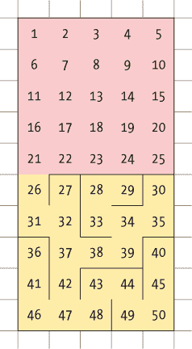
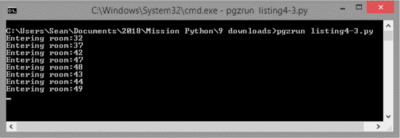

## 创建空间站**


在本章中，你将为火星上的空间站绘制地图。通过在本章中添加的简单*Explorer*代码，你将能够查看每个房间的墙壁并开始找到方向。我们将使用列表、循环以及你在第一章、第二章和第三章中学到的技巧来创建地图数据并以 3D 方式展示房间。

### **自动化地图生成过程**

我们当前的`room_map`数据的问题是数据量非常大。*Escape*游戏包括 50 个位置。如果你必须为每个位置输入`room_map`数据，这将需要大量时间，而且极其低效。举个例子，如果每个房间由 9×9 个方格组成，那么每个房间将有 81 条数据，总共有 4,050 条数据。仅房间数据就会占据本书的 10 页。

其中许多数据是重复的：0 表示地板和出口，1 表示周围的墙壁。从第三章中你已经知道，我们可以使用循环有效地管理重复数据。我们可以利用这一知识编写一个程序，当我们提供特定信息（例如房间大小和出口位置）时，它将自动生成`room_map`数据。

### **自动地图生成器工作原理**

*Escape*程序将按以下方式工作：当玩家进入一个房间时，我们的代码将获取该房间的数据（其大小和出口位置），并将其转换为`room_map`数据。`room_map`数据将包括代表地板、周围墙壁以及应有出口位置的空隙的列和行。最终，我们将使用`room_map`数据以正确的位置绘制房间的地板和墙壁。

图 4-1 显示了空间站的地图。我将每个位置称为房间，尽管 1 到 25 号位置是站内地面上的区域，类似于花园。26 到 50 号是空间站内部的房间。

室内布局是一个简单的迷宫，包含许多走廊、死胡同和可探索的房间。当你自己制作地图时，尝试创建蜿蜒的路径和拐角供探索，即使地图并不大。一定要通过在每个走廊的尽头放置一个有用或吸引人的物品来奖励玩家的探索。玩家在探索游戏世界时通常感觉从左到右移动更为舒适，因此玩家的角色将从地图的左侧、第 31 号房间开始。

在外面，玩家可以自由走动，但围栏将阻止他们离开站区（或走出游戏地图）。由于空间站内部有一种幽闭的氛围，玩家在外面会体验到一种自由感，能够在空旷的地方漫游。



*图 4-1：空间站地图*

当你在玩最终的*逃脱*游戏时，你可以参考这张地图，但你可能会发现没有地图，或者自己制作一张地图，探索起来会更有趣。这张地图并没有标明门的位置，在最终的游戏中，玩家需要找到正确的钥匙卡才能进入地图的某些部分。

### **创建地图数据**

让我们来创建地图数据。我们空间站中的房间都会相互连接，所以我们只需要存储一侧墙壁上出口的位置。例如，房间 31 右侧的出口和房间 32 左侧的出口实际上是连接这两个房间的同一个门口。我们不需要为这两个房间都指定这个出口。对于地图中的每个房间，我们将存储它是否在顶部或右侧有出口。程序可以自己计算是否存在底部或左侧的出口（稍后我会解释）。这种方法还确保地图的一致性，走过的出口不会消失。如果你能通过某个出口走出去，你也能从另一侧回来。

地图中的每个房间都需要以下数据：

+   房间的简短描述。

+   高度（以瓦片为单位），即房间从顶部到底部在屏幕上的大小。（这与地面到天花板的距离无关。）

+   宽度（以瓦片为单位），即房间从左到右在屏幕上的大小。

+   是否在顶部有出口（`True`或`False`）。

+   是否在右侧有出口（`True`或`False`）。

**提示**

`True` 和 `False` 被称为*布尔值*。在 Python 中，这些值必须以大写字母开头，并且不需要加引号，因为它们不是字符串。

我们用来测量房间大小的单位称为*瓦片*，因为它与地砖的大小相同。正如你在第三章中学到的，瓦片将是我们所有物体的基本测量单位。例如，房间中的一个物体，比如椅子或柜子，通常会占据一个瓦片的大小。在第三章（见图 3-1 和清单 3-5）中，我们制作了一个房间地图，该地图有七行，每行五个列表项，这样这个房间就会是七个瓦片高和五个瓦片宽。

不同大小的房间为地图增添了多样性：有些房间可以像走廊一样狭窄，有些则可以像公共休息室一样宽敞。为了适应我们的游戏窗口，房间的最大尺寸为 15 个瓦片高、25 个瓦片宽。然而，大型房间或包含很多物体的房间可能会在旧电脑上运行得较慢。

这是房间 26 的数据示例：它是一个狭窄的房间，高 13 个瓦片，宽 5 个瓦片，顶部有出口，但右侧没有出口（见图 4-1 中的地图）。

```py
["The airlock", 13, 5, True, False]
```

我们给房间命名（或描述），分别为高度和宽度设置数字，并为顶部和右侧边缘是否有出口设置`True`和`False`值。在这个游戏中，每面墙只能有一个出口，并且该出口会自动放置在墙的中间。

当程序为隔壁的 27 号房间生成`room_map`数据时，它会检查 26 号房间，看看是否有右侧出口。由于 26 号房间没有右侧出口，程序就会知道 27 号房间没有左侧出口。

我们会将每个房间的数据列表存储在一个名为`GAME_MAP`的列表中。

### **编写 GAME_MAP 代码**

点击**文件** ▸ **新建文件**，开始创建一个 Python 文件。输入清单 4-1 中的代码，开始构建空间站。将你的清单保存为*listing4-1.py*。

**提示**

记得在编写较长程序时定期保存你的工作。像许多应用程序一样，你可以按 CTRL-S 在 IDLE 中保存。

*listing4-1.py*

```py
   # Escape - A Python Adventure
   # by Sean McManus / www.sean.co.uk
   # Typed in by PUT YOUR NAME HERE

   import time, random, math

   ###############
   ## VARIABLES ##
   ###############

   WIDTH = 800 # window size
   HEIGHT = 800

   #PLAYER variables
➊ PLAYER_NAME = "Sean" # change this to your name!
   FRIEND1_NAME = "Karen" # change this to a friend's name!
   FRIEND2_NAME = "Leo" # change this to another friend's name!
   current_room = 31 # start room = 31

➋ top_left_x = 100
   top_left_y = 150

➌ DEMO_OBJECTS = [images.floor, images.pillar, images.soil]

   ###############
   ##    MAP    ##
   ###############  

➍ MAP_WIDTH = 5
   MAP_HEIGHT = 10
   MAP_SIZE = MAP_WIDTH * MAP_HEIGHT

➎ GAME_MAP = [ ["Room 0 - where unused objects are kept", 0, 0, False, False] ]

   outdoor_rooms = range(1, 26)
➏ for planetsectors in range(1, 26): #rooms 1 to 25 are generated here
       GAME_MAP.append( ["The dusty planet surface", 13, 13, True, True] )

➐ GAME_MAP += [
           #["Room name", height, width, Top exit?, Right exit?]
           ["The airlock", 13, 5, True, False], # room 26
           ["The engineering lab", 13, 13, False, False], # room 27
           ["Poodle Mission Control", 9, 13, False, True], # room 28
           ["The viewing gallery", 9, 15, False, False], # room 29
           ["The crew's bathroom", 5, 5, False, False], # room 30
           ["The airlock entry bay", 7, 11, True, True], # room 31
           ["Left elbow room", 9, 7, True, False], # room 32
           ["Right elbow room", 7, 13, True, True], # room 33
           ["The science lab", 13, 13, False, True], # room 34
           ["The greenhouse", 13, 13, True, False], # room 35
           [PLAYER_NAME + "'s sleeping quarters", 9, 11, False, False], # room 36
           ["West corridor", 15, 5, True, True], # room 37
           ["The briefing room", 7, 13, False, True], # room 38
           ["The crew's community room", 11, 13, True, False], # room 39
           ["Main Mission Control", 14, 14, False, False], # room 40
           ["The sick bay", 12, 7, True, False], # room 41
           ["West corridor", 9, 7, True, False], # room 42
           ["Utilities control room", 9, 9, False, True], # room 43
           ["Systems engineering bay", 9, 11, False, False], # room 44
           ["Security portal to Mission Control", 7, 7, True, False], # room 45
➑         [FRIEND1_NAME + "'s sleeping quarters", 9, 11, True, True], # room 46
           [FRIEND2_NAME + "'s sleeping quarters", 9, 11, True, True], # room 47
           ["The pipeworks", 13, 11, True, False], # room 48
           ["The chief scientist's office", 9, 7, True, True], # room 49
           ["The robot workshop", 9, 11, True, False] # room 50
           ]

   # simple sanity check on map above to check data entry
➒ assert len(GAME_MAP)-1 == MAP_SIZE, "Map size and GAME_MAP don't match"
```

*清单 4-1：* GAME_MAP *数据*

让我们仔细看一下这段设置房间地图数据的代码。请记住，在我们构建*逃脱*游戏时，我们会不断地往程序中添加内容。为了帮助你在程序中找到自己的位置，我会用类似这样的标题来标记不同的部分：

```py
###############
## VARIABLES ##
###############
```

`#`符号标记了注释，并告诉 Python 忽略同一行中`#`之后的内容，因此游戏即使没有这些注释也能正常运行。注释将帮助你更容易地理解自己在代码中的位置，以及在程序变得更大时需要在哪里添加新的指令。我使用注释符号绘制了框架，使得标题在浏览程序代码时更加突出。

三名宇航员驻扎在空间站上，你可以在代码中个性化他们的名字 ➊。将`PLAYER_NAME`改为你自己的名字，并为`FRIEND1_NAME`和`FRIEND2_NAME`变量添加两个朋友的名字。在整个代码中，我们将在需要使用你朋友名字的地方使用这些变量：例如，每个宇航员都有自己的寝室。我们现在需要设置这些变量，因为稍后在程序中设置某些房间描述时会用到它们。你会带谁一起去火星呢？

程序还设置了一些我们在本章后面需要用来绘制房间的变量：`top_left_x`和`top_left_y`变量 ➋ 指定了绘制房间的起始位置；而`DEMO_OBJECTS`列表包含了要使用的图像 ➌。

首先，我们设置了包含地图高度、宽度和总体大小的变量 ➍。我们创建了`GAME_MAP`列表 ➎ 并为它提供了房间 0 的数据：这个房间用于存储游戏中尚未出现的物品，因为玩家还没有发现或创造它们。它不是玩家可以访问的真实房间。

然后我们使用一个循环➏，为构成复合体的 25 个行星表面房间添加相同的数据。`range(1, 26)`函数用于重复 25 次。第一个数字是我们希望开始的数字，第二个是我们希望结束的数字再加 1（`range()`不包括你给出的最后一个数字，记住这一点）。每次循环时，程序都会将相同的数据添加到`GAME_MAP`的末尾，因为所有的行星表面“房间”大小相同，并且每个方向都有出口。每个表面房间的数据如下：

```py
["The dusty planet surface", 13, 13, True, True]
```

当这个循环完成后，`GAME_MAP`将包括房间 0，并且房间 1 到 25 将拥有相同的“尘土行星表面”数据。我们还设置了`outdoor_rooms`范围，用于存储房间号 1 到 25。当我们需要检查一个房间是位于空间站内还是外时，会用到这个范围。

最后，我们将房间 26 到 50 添加到`GAME_MAP`中➐。我们通过使用`+=`将一个新列表添加到`GAME_MAP`的末尾。这个新列表包含剩余房间的数据。每个房间的数据都不同，所以我们需要分别输入它们的数据。你之前看到过房间 26 的信息：数据包括房间名称、房间的高度和宽度，以及它是否有上方和右方的出口。每个房间的数据都是一个列表，因此它的开始和结束都有方括号。在每个房间数据的末尾（除了最后一个）我们必须用逗号将其与下一个数据分开。我还在每行的末尾加了房间号的注释，帮助跟踪房间号。这些注释在你开发游戏时会很有帮助。像这样注释代码是一个好习惯，这样当你再次查看代码时就能理解它。

房间 46 和 47 将变量`FRIEND1_NAME`和`FRIEND2_NAME`添加到房间描述中，因此你将有两个房间，它们的名字可能是“Karen 的睡眠区”，使用你朋友的名字➑。除了使用`+`符号来加法和合并列表外，你还可以用它来合并字符串。

在*listing4-1.py*的结尾，我们使用`assert()`进行简单检查，确保地图数据是合理的➒。我们检查`GAME_MAP`的长度（地图数据中的房间数量）是否与我们在➍通过将其宽度与高度相乘计算出的地图大小相同。如果不同，说明我们缺少一些数据或数据太多。

我们必须从`GAME_MAP`的长度中减去 1，因为它还包括房间 0，而在我们计算地图大小时没有包含该房间。这个检查不能捕获所有错误，但它可以告诉你在输入地图数据时是否遗漏了一行数据。只要可能，我会尽量包含像这样的简单测试，帮助你在输入程序代码时检查错误。

### **测试和调试代码**

通过点击**运行** ▸ **运行模块**或者按 F5（快捷键）来运行*listing4-1.py*。应该不会发生什么。Shell 窗口只会显示一条消息，显示`"RESTART:"`以及你的文件名。原因是我们要求程序做的只是设置一些变量和一个列表，所以没有任何可见的东西。但如果你在输入代码时犯了错误，你也可能在 Shell 窗口看到一条红色的错误信息。如果你看到错误，请仔细检查以下细节：

+   引号位置正确吗？在 Python 程序窗口中，字符串是绿色的，所以寻找大面积的绿色，表示你没有关闭字符串。如果房间描述是黑色的，说明你没有打开字符串。这两种情况都表明缺少引号。

+   你在正确的位置使用了正确的括号和圆括号吗？在这个列表中，方括号用来括住列表项，圆括号（括号）用于函数，例如`range()`和`append()`。大括号{…}完全没有使用。

+   你是否漏掉了任何括号或圆括号？检查的简单方法是数一下打开和关闭的括号和圆括号的数量。每个打开的括号或圆括号应该都有一个相同形状的闭合括号或圆括号。

+   你必须按照打开括号和圆括号的顺序来关闭它们。如果你有一个打开的圆括号，然后是一个打开的方括号，你必须先用闭合的方括号关闭它们，然后再用闭合的圆括号。这个格式是正确的：([ … ])。这个格式是错误的：（[ … ) ]。

+   你的逗号位置正确吗？记住，`GAME_MAP`中每个房间的列表后必须有一个逗号，用来分隔下一个房间的数据（除了最后一个房间）。

**提示**

为什么不请朋友帮你一起做这个游戏？程序员常常成对工作，互相帮助提出创意，也许最重要的是，两个人的眼睛检查一切。你们还可以轮流打字！

### **从数据生成房间**

现在，空间站地图存储在我们的`GAME_MAP`列表中。下一步是添加一个功能，从`GAME_MAP`中获取当前房间的数据，并将其扩展到`room_map`列表中，*逃脱*游戏将使用这个列表来查看房间中每个位置的内容。`room_map`列表始终存储玩家当前所在房间的信息。当玩家进入不同的房间时，我们用新房间的地图替换`room_map`中的数据。书中的后续部分，我们会往`room_map`中添加景物和道具，这样玩家也能与物品互动。

`room_map`数据是由我们将要创建的一个函数`generate_map()`生成的，见列表 4-2。

将列表 4-2 中的代码添加到列表 4-1 的末尾。灰色部分的代码显示了列表 4-1 的结束位置。确保所有的缩进都是正确的。缩进决定了代码属于`get_floor_type()`还是`generate_map()`函数，而某些代码缩进得更深，告诉 Python 它属于哪个`if`或`for`命令。

将你的程序保存为*listing4-2.py*，然后点击**运行** ▸ **运行模块**，运行它并检查 shell 中是否有任何错误信息。

**红色警报**

*不要仅仅从列表 4-2 中的代码开始新的程序：确保将列表 4-2 添加到列表 4-1 的末尾。在本书中跟随步骤时，你将逐步向现有程序中添加内容，来构建*逃脱*游戏。*

*listing4-2.py*

```py
   --snip--
   # simple sanity check on map above to check data entry
   assert len(GAME_MAP)-1 == MAP_SIZE, "Map size and GAME_MAP don't match"

   ###############
   ## MAKE MAP  ##
   ###############

➊ def get_floor_type():
       if current_room in outdoor_rooms:
           return 2 # soil
       else:
           return 0 # tiled floor       

   def generate_map():
   # This function makes the map for the current room,
   # using room data, scenery data and prop data.
       global room_map, room_width, room_height, room_name, hazard_map
       global top_left_x, top_left_y, wall_transparency_frame
➋     room_data = GAME_MAP[current_room]
       room_name = room_data[0]
       room_height = room_data[1]
       room_width = room_data[2]

➌     floor_type = get_floor_type()
       if current_room in range(1, 21):
           bottom_edge = 2 #soil
           side_edge = 2 #soil
       if current_room in range(21, 26):
           bottom_edge = 1 #wall
           side_edge = 2 #soil
       if current_room > 25:
           bottom_edge = 1 #wall
           side_edge = 1 #wall

       # Create top line of room map.
➍     room_map=[[side_edge] * room_width]
       # Add middle lines of room map (wall, floor to fill width, wall).
➎     for y in range(room_height - 2):
           room_map.append([side_edge]
                           + [floor_type]*(room_width - 2) + [side_edge])
       # Add bottom line of room map.
➏     room_map.append([bottom_edge] * room_width)

       # Add doorways.
➐     middle_row = int(room_height / 2)
       middle_column = int(room_width / 2)

➑     if room_data[4]: # If exit at right of this room
           room_map[middle_row][room_width - 1] = floor_type
           room_map[middle_row+1][room_width - 1] = floor_type
           room_map[middle_row-1][room_width - 1] = floor_type

➒     if current_room % MAP_WIDTH != 1: # If room is not on left of map
           room_to_left = GAME_MAP[current_room - 1]
           # If room on the left has a right exit, add left exit in this room
           if room_to_left[4]:
               room_map[middle_row][0] = floor_type
               room_map[middle_row + 1][0] = floor_type
               room_map[middle_row - 1][0] = floor_type

➓     if room_data[3]: # If exit at top of this room
           room_map[0][middle_column] = floor_type
           room_map[0][middle_column + 1] = floor_type
           room_map[0][middle_column - 1] = floor_type

       if current_room <= MAP_SIZE - MAP_WIDTH: # If room is not on bottom row
           room_below = GAME_MAP[current_room+MAP_WIDTH]
           # If room below has a top exit, add exit at bottom of this one
           if room_below[3]:
               room_map[room_height-1][middle_column] = floor_type
               room_map[room_height-1][middle_column + 1] = floor_type
               room_map[room_height-1][middle_column - 1] = floor_type
```

*列表 4-2：生成* room_map *数据*

你可以构建*逃脱*游戏，甚至制作自己的游戏地图，而不需要理解`room_map`代码是如何工作的。但如果你有兴趣，继续阅读，我会带你一步步理解。

#### **房间生成代码的工作原理**

让我们先回顾一下`generate_map()`函数需要做的事情。给定房间的高度和宽度，以及出口的位置，我们希望它生成一个房间地图，可能看起来像这样：

```py
[
[1, 1, 1, 1, 0, 0, 0, 1, 1, 1, 1],
[1, 0, 0, 0, 0, 0, 0, 0, 0, 0, 1],
[1, 0, 0, 0, 0, 0, 0, 0, 0, 0, 0],
[1, 0, 0, 0, 0, 0, 0, 0, 0, 0, 0],
[1, 0, 0, 0, 0, 0, 0, 0, 0, 0, 0],
[1, 0, 0, 0, 0, 0, 0, 0, 0, 0, 1],
[1, 1, 1, 1, 1, 1, 1, 1, 1, 1, 1]
]
```

这是地图上的 31 号房间，玩家开始游戏的房间。它的高度是 7 格，宽度是 11 格，顶部和右侧都有出口。地面空间（以及墙上的出口）用 0 表示。房间周围的墙壁用 1 表示。图 4-2 展示了相同房间的网格布局，列表的索引号显示在顶部和左侧。


*图 4-2：一个表示 31 号房间的网格；1 表示墙柱，0 表示空的地面空间。*

玩家当前所在的房间号存储在`current_room`变量中，你在程序的`VARIABLES`部分设置了这个变量（见列表 4-1）。`generate_map()`函数首先从`GAME_MAP` ➋中收集当前房间的数据，并将其放入一个名为`room_data`的列表中。

如果你回想一下我们设置`GAME_MAP`时的情况，`room_data`列表中的信息现在将类似于此：

```py
["The airlock", 13, 5, True, False]
```

这种列表格式使我们能够通过取该列表中索引为 0 的第一个元素来设置`room_name`。我们可以通过取接下来的元素，找到房间的高度（索引 1）和宽度（索引 2）。`generate_map()`函数将高度和宽度信息存储在`room_height`和`room_width`变量中。

#### **创建基本房间形状**

下一步是设置我们用来构建房间的材料，并使用这些材料创建基本的房间形状。我们稍后会添加出口。每个房间将使用三个元素：

+   *地面类型*，它存储在`floor_type`变量中。在空间站内，我们使用地板砖（在`room_map`中表示为 0），在外部使用土壤（在`room_map`中表示为 2）。

+   *边缘类型*，出现在房间边缘的每个空间中。对于室内房间，这是一个墙柱，表示为 1。对于室外房间，这是土壤。

+   *底边类型*，这是站内的墙壁，外部通常是土壤。外部复合体的最底行，与空间站接触的地方是一个特殊情况，因为这里可见站墙，所以`bottom_edge`类型是墙柱（见图 4-3）。

    

    *图 4-3：根据房间在空间站复合体中的位置，使用不同的材料来构建房间的边缘和底边。（注意，宇航员和额外的景物暂时不会出现在你的游戏中。）*

我们使用一个名为`get_floor_type()`的函数➊来查找房间的正确地面类型。函数可以通过`return`指令将信息返回到程序的其他部分，就像在这个函数中看到的那样。`get_floor_type()`函数检查`current_room`值是否位于`outdoor_rooms`范围内。如果是，函数返回数字 2，代表火星土壤。否则，它返回数字 0，代表瓷砖地面。这个检查在一个单独的函数中，这样程序的其他部分也可以使用它。`generate_map()`函数将`get_floor_type()`返回的数字放入`floor_type`变量中。通过一条指令➌，`generate_map()`将`floor_type`变量设置为`get_floor_type()`返回的值，并指示`get_floor_type()`函数现在也要执行。

`generate_map()`函数还为`bottom_edge`和`side_edge`设置了变量。这些变量存储将用于构建房间边缘的材料类型，如图 4-3 所示。侧边材料用于顶部、左侧和右侧，而底边材料用于底边。如果房间号在 1 到 20 之间（含），则是常规的行星表面房间，底边和边缘是土壤。在房间号在 21 到 25 之间时，它是一个与空间站底部接触的行星表面房间。这是一个特殊情况：侧边材料是土壤，但底边由墙柱构成。如果房间号大于 25，则侧边和底边由墙柱构成，因为这是一个室内房间。（你可以在图 4-1 中检查这些房间号是否合理。）

我们开始创建`room_map`列表，首先构建顶部行，这一行将是外部的土壤或内部的后墙。顶部行由相同的材料构成，所以我们可以使用一个快捷方式。可以在终端中尝试这个：

```py
>>> print([1] * 10)
[1, 1, 1, 1, 1, 1, 1, 1, 1, 1]
```

`print()`指令中的`[1]`是一个只包含一个元素的列表。当我们将其乘以 10 时，得到的是一个包含该元素 10 次的列表。在我们的程序中，我们将使用的边缘类型乘以房间的宽度 ➍。如果顶部边缘有出口，我们稍后会添加这一部分。

房间的中间行是通过一个循环 ➎生成的，该循环将每一行依次添加到`room_map`的末尾。房间中的所有中间行都是相同的，构成这些行的内容如下：

1.  房间左侧的边缘瓦片（可以是墙或土壤）。

1.  中间的地板。我们可以在这里再次使用我们的快捷方式。我们将`floor_type`乘以房间中间空间的大小。也就是`room_width`减去 2，因为有两个边缘空间。

1.  右侧的边缘瓦片。

然后添加底部的那一行 ➏，并且它的生成方式与顶部的一行相同。

#### **添加出口**

接下来，我们在需要的地方在墙上添加出口。我们将出口放置在墙的中间，所以我们首先通过将房间的高度和宽度除以 2 来计算中间的行和中间的列的位置 ➐。有时这个计算会得到一个带小数的数字。我们需要一个整数作为索引位置，因此我们使用`int()`函数去掉小数部分 ➐。`int()`函数将小数转换为整数（*整数*）。

我们首先检查右侧是否有出口 ➑。记住，`room_data`包含这个房间的信息，它最初是从`GAME_MAP`获取的。值`room_data[4]`告诉我们这个房间的右边是否有出口。这个指令：

```py
if room_data[4]:
```

是以下指令的简写：

```py
if room_data[4] == True:
```

我们使用`==`来检查两个事物是否相同。布尔值之所以常常是处理数据的一个很好的选择，是因为它们让代码更容易阅读和编写，正如这个例子所展示的那样。

当有右侧出口时，我们会将右墙中间的三个位置从边缘类型改为地板类型，从而在墙上留下一个空隙。值`room_width-1`找到右边缘的*x*位置：我们减去 1 是因为索引从 0 开始。例如，在图 4-2 中，你可以看到房间的宽度是 11 个瓦片，但右墙的索引位置是 10。在行星表面上，这段代码并不会改变任何东西，因为那里没有墙可以留空隙。但为了简化程序，我们还是让它添加地板瓦片，这样就不需要为特殊情况编写代码了。

在检查左侧墙壁是否需要出口之前，我们确保房间不在地图的左边缘，因为左边缘不能有出口 ➒。`%` 操作符可以得到两个数相除后的余数。如果我们使用 `%` 操作符将当前房间号除以地图宽度 5，当房间位于左边缘时，我们会得到 1。左边缘的房间号包括 1、6、11、16、21、26、31、36、41 和 46。所以只有当余数不是 1 时，我们才继续检查左侧出口（`!=` 表示“不等于”）。

为了查看这个房间是否需要左侧出口，我们通过将当前房间号减去 1 来计算出墙的另一边是哪一个房间。然后我们检查该房间是否有右侧出口。如果有，则说明当前房间需要左侧出口，我们就添加它。

上下出口的添加方式类似 ➓。我们直接检查 `room_data` 来判断房间顶部是否有出口，如果有，则在该墙壁中添加一个缝隙。我们还可以检查下方的房间，看看是否应该在该房间添加底部出口。

#### **测试程序**

当你运行程序时，可以确认在 Python shell 中没有看到任何错误。你还可以通过生成地图并从 shell 中打印出来的方式来检查程序是否工作正常，像这样：

```py
>>> generate_map()
>>> print(room_map)
[[1, 1, 1, 1, 0, 0, 0, 1, 1, 1, 1], [1, 0, 0, 0, 0, 0, 0, 0, 0, 0, 1], [1, 0, 0, 0, 0, 0, 0, 0, 0, 0, 0], [1, 0,
0, 0, 0, 0, 0, 0, 0, 0, 0], [1, 0, 0, 0, 0, 0, 0, 0, 0, 0, 0], [1, 0, 0, 0, 0, 0, 0, 0, 0, 0, 1], [1, 1, 1, 1, 1, 1, 1, 1,
1, 1, 1]]
```

`current_room` 变量默认设置为房间 31，这是游戏中的起始房间，因此打印出来的是 `room_map` 数据。从我们的 `GAME_MAP` 数据（以及 图 4-2）中可以看到，这个房间有 7 行和 11 列，输出结果也证实我们有 7 个列表，每个列表包含 11 个数字：完美。更重要的是，我们可以看到第一行有四个墙柱，三个空格，然后是另外四个墙柱，因此该函数在此处添加了一个出口，正如我们所期望的那样。三个列表的最后一个数字是 0，表示右侧有出口。看起来程序运行正常！

**训练任务 #1**

你可以通过 shell 更改 `current_room` 的值来打印不同的房间。尝试输入不同的房间值，重新生成地图并打印出来。检查输出结果与地图以及 `GAME_MAP` 代码是否匹配，确保结果符合预期。以下是一个示例：

```py
>>> current_room = 45
>>> generate_map()
>>> print(room_map)
[[1, 1, 0, 0, 0, 1, 1], [1, 0, 0, 0, 0, 0, 1], [1, 0, 0, 0, 0, 0, 1],
[1, 0, 0, 0, 0, 0, 1], [1, 0, 0, 0, 0, 0, 1], [1, 0, 0, 0, 0, 0, 1],
[1, 1, 0, 0, 0, 1, 1]]
```

当你为其中一个行星表面房间输入值时会发生什么？

### **在 3D 中探索空间站**

让我们将房间地图转换为房间！我们将把第三章 中将房间地图转换为 3D 房间的代码与提取游戏地图中的房间地图的代码结合起来。然后我们可以参观空间站并开始定位。

我们程序中的 *Explorer* 功能将使我们能够查看空间站上的所有房间。我们将为它在程序中创建一个单独的 `EXPLORER` 部分。这是一个临时措施，方便我们快速查看结果。我们将在第七章 和第八章 中，用更好的代码来替换 *Explorer*，以便查看房间。

将清单 4-3 中的代码添加到你程序的末尾，放在清单 4-2 中显示为灰色的指令之后。然后将程序保存为*listing4-3.py*。记得将其与本书的其他程序一起保存在*escape*文件夹中，这样*images*文件夹才能正确放置（参见 “下载游戏文件” 第 7 页）。

*listing4-3.py*

```py
               room_map[room_height-1][middle_column] = floor_type 
               room_map[room_height-1][middle_column + 1] = floor_type
               room_map[room_height-1][middle_column - 1] = floor_type

   ###############
   ## EXPLORER  ##
   ###############

   def draw():
       global room_height, room_width, room_map
➊     generate_map()
       screen.clear()

➋     for y in range(room_height):
           for x in range(room_width):
               image_to_draw = DEMO_OBJECTS[room_map[y][x]]
               screen.blit(image_to_draw,
                   (top_left_x + (x*30),
                   top_left_y + (y*30) - image_to_draw.get_height()))

➌ def movement():
       global current_room
       old_room = current_room

       if keyboard.left:
           current_room -= 1
       if keyboard.right:
           current_room += 1
       if keyboard.up:
           current_room -= MAP_WIDTH
       if keyboard.down:
           current_room += MAP_WIDTH

➍     if current_room > 50:
➎         current_room = 50
       if current_room < 1:
           current_room = 1

➏     if current_room != old_room:
➐         print("Entering room:" + str(current_room))

➑ clock.schedule_interval(movement, 0.1)
```

*清单 4-3：*Explorer *代码*

清单 4-3 中的新添加内容应该对你来说比较熟悉。我们调用`generate_map()`函数来为当前房间创建`room_map`数据➊。然后，我们使用第三章中的清单 3-5 创建的代码来显示它➋。我们使用键盘控制来改变`current_room`变量➌，类似于我们在第一章中如何改变太空行走宇航员的*x*和*y*位置（参见清单 1-4）。要在地图中上下移动一行，我们通过游戏地图的宽度来改变`current_room`的数字。例如，要从 32 号房间上移一行，我们减去 5 进入 27 号房间（参见图 4-1）。如果房间号发生变化，程序会打印出`current_room`变量➏。`str()`函数将房间号转换为字符串➐，以便与`"Entering room:"`字符串连接。若不使用`str()`函数，无法将数字与字符串连接。

最后，我们安排`movement`函数按固定间隔运行➑，就像我们在第一章中所做的那样。这次，我们将函数运行之间的间隔时间加长（0.1 秒），因此按键响应会稍微迟钝一些。

从命令行进入你的*escape*文件夹，并使用命令行运行程序，命令为`pgzrun listing4-3.py`。

屏幕应该与图 4-4 相似，显示的是 31 号房间的墙壁和门道。


*图 4-4：*Explorer *以 3D 展示你的起始房间。*

现在，你可以使用箭头键来探索地图。程序将为你绘制房间，并允许你通过按箭头键进入邻近房间。此时，你只能看到房间的外壳：墙壁和地板。稍后我们将在房间中添加更多物体以及你的角色。

目前，你可以朝任何方向走，包括穿过墙壁：程序不会检查任何移动错误。如果你走出地图的左边，你会在右边重新出现，高一个行。如果你走出右边，你会在左边重新出现，低一个行。如果你试图走出地图的顶部或底部，程序会将你带回房间 1（顶部）或房间 50（底部）。例如，如果房间号超过（`>`）50 ➍，它会重置为 50 ➎。在这段代码中，我降低了键盘的灵敏度，以减少快速穿过房间的风险。如果你发现控制反应迟钝或缓慢，可能需要稍微按住键更长时间。

探索太空站，并将你在屏幕上看到的内容与图 4-1 中的地图进行对比。如果发现任何错误，返回`GAME_MAP`数据检查数据，然后再检查`generate_map()`函数，确保其输入正确。为了帮助你跟随地图，当你进入新房间时，其编号会出现在你输入`pgzrun`命令的命令行窗口中，如图 4-5 所示。



*图 4-5：命令行窗口告诉你正在进入哪个房间。*

同时，检查出口是否存在于两侧：如果你通过一扇门，而从另一侧看时它不在那里，说明`generate_map()`输入错误。在开始调试之前，先跟随地图，确保自己没有走出地图的边界并从另一侧返回。此时，花时间确保你的地图数据和函数是正确的非常值得，因为破损的地图数据会使得无法完成*Escape*游戏！

**训练任务 #2**

为了更好地享受玩*Escape*并解决谜题，我建议你使用我为游戏地图提供的数据。在完成游戏并决定重新设计之前，最好不要更改数据。否则，物品可能会出现在你无法到达的位置，导致游戏无法完成。

但是，你可以安全地扩展地图。最简单的方法是，在地图底部再添加一排房间，确保至少有一扇门将新房间与现有的底部行连接。记得修改`MAP_HEIGHT`变量。你还需要将*Explorer*代码（*listing4-3.py*）中的数字 50 更改为你的最高房间编号（见 ➍ 和 ➎）。为什么不现在就加一个走廊呢？

### **制作你自己的地图**

完成构建和游玩*Escape*后，你可以使用这段代码自定义地图或设计自己的游戏布局。

如果你想为房间 1 到 25 添加自己的地图数据，可以删除自动生成它们数据的代码（见 ➏ 在 Listing 4-1 中）。然后你可以为这些房间添加自己的数据。

或者，如果你不想使用星球表面的位置，可以直接阻止出口通向它们。通往星球表面的出口位于第 26 号房间。修改该房间在`GAME_MAP`列表中的条目，使其没有顶部出口。你可以从第 26 号房间开始使用房间编号，向下扩展地图，制作一个完全在室内的游戏。这样，你就不需要对星球表面进行任何代码修改。

如果你从*逃脱*游戏地图中移除一个门（包括第 26 号房间的门），你可能还需要移除一扇门。房间顶部和底部的一些出口会有门将其封闭。（我们将在第十一章中添加门到*逃脱*游戏中。）

### **你适合飞行吗？**

勾选以下框，以确认你已经学会了本章的关键知识点。

 `GAME_MAP`列表存储*逃脱*游戏的主要地图数据。

 `GAME_MAP`只需要存储房间顶部和右侧的出口。

 当玩家访问一个房间时，`generate_map()`函数会为当前房间生成`room_map`列表。`room_map`列表描述了房间内墙壁和物体的位置。

 位置 1 到 25 在星球表面，循环会生成它们的地图数据。位置 26 到 50 是太空站房间，你需要手动输入它们的数据。

 我们使用注释帮助我们在*逃脱*程序列表中找到位置。

 当使用脚本模式的程序添加数据时，你可以使用 shell 检查列表和变量的内容，以确保程序正常工作。记得先运行程序来设置数据！

 *Explorer*代码允许你使用箭头键查看游戏地图中的每个房间。

 确保游戏地图与图 4-1 相匹配非常重要。否则，玩家可能无法完成*逃脱*游戏。你可以使用*Explorer*程序来检查这一点。


