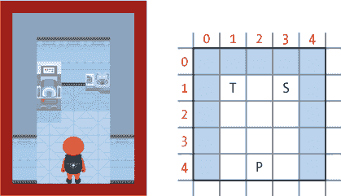
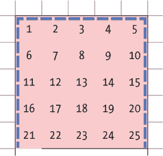
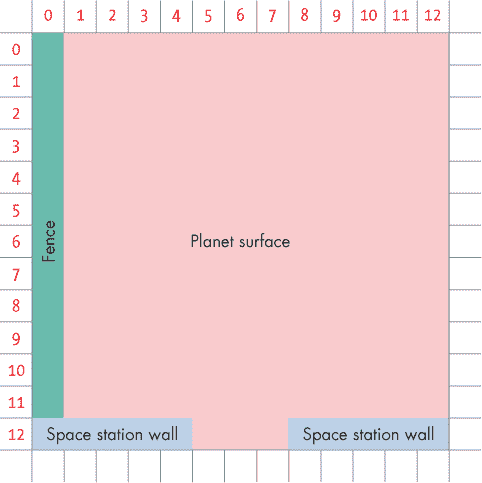
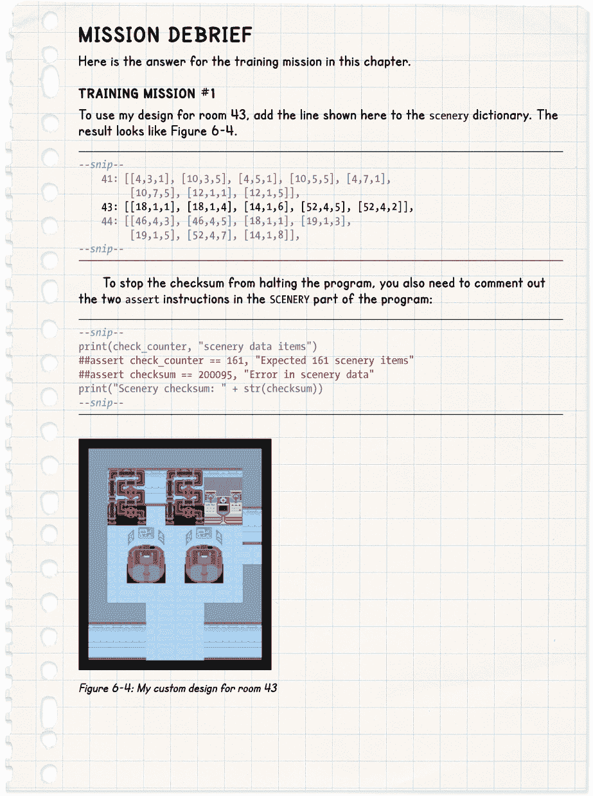

## **6

安装太空站设备**

在第五章中，你准备了关于任务中将使用的所有设备的信息。在本章中，你将把其中一些设备安装到太空站，并使用*Explorer*查看任何房间或星球表面的位置。这是你第一次有机会探索将成为你家的火星基地设计。

### **理解场景数据的字典**

太空站上有两种不同类型的物体：

+   **场景** 是在整个*逃脱*游戏中保持不变的位置的设备，包括家具、管道和电子设备。

+   **道具** 是在游戏过程中可以出现、消失或移动的物品。它们包括玩家可以创建和拾取的东西。道具还包括门，门在关闭时出现在房间里，打开时则消失。

场景定位数据和道具数据是分开存储并且组织方式不同的。在本章中，我们只添加场景数据。

我们的程序已经知道游戏中所有物体的图像和描述，因为它们已经包含在你在第五章中创建的对象字典里。现在，我们将告诉程序将场景物体放置在太空站的哪些位置。为此，我们将创建一个名为“scenery”的新字典。以下是我们为一个房间创建条目的方式：

房间编号：[[物体编号，y，x]，[物体编号，y，x]]

字典的键将是房间编号。对于每个房间编号，字典会存储一个列表，列表的开头和结尾都有方括号。列表中的每个项目是另一个列表，告诉程序将*一个*物体放置在房间中的哪个位置。在这里，我将一个物体做成红色，另一个做成绿色，这样你就能看到它们的起始和结束位置。

这是每个物体所需的三条信息：

**物体编号** 这与用于对象字典中的键的编号相同。例如，编号 5 代表一张桌子。

**物体的 *y* 位置** 这是物体在房间中的位置，从前到后。后墙通常位于第 0 行，因此我们通常从第 1 行开始放置物体。最大的有效数字通常是房间高度减去 2：我们减去 1，因为地图位置是从 0 开始的，再减去 1 是因为前墙占据了空间。实际上，最好在房间前面留出更多空间，因为前墙可能会遮挡其他物体。你可以在第四章中你添加的 GAME_MAP 代码中查看房间的大小。

**物体的 *x* 位置** 这告诉程序物体应该在房间中从左到右的哪个位置。通常情况下，墙壁的位置是 0。最大的有效数字通常是房间宽度减去 2。

为了更好地理解这些数字，让我们看看 图 6-1，它展示了空间站上的一个房间的截图和地图。在这张图中，水槽（S）位于从后面数来的第二行，所以它的 *y* 坐标是 1。记住，后排的第一行墙壁位于 *y* = 0。水槽的 *x* 坐标是 3。水槽左边还有两个瓷砖格子，墙壁位于 *x* = 0 的位置。

*图 6-1：游戏中看到的空间站房间示例（左）以及通过地图表示的房间（右）。T = 马桶，S = 水槽，P = 玩家。*

让我们来看看这个房间的数据。现在不要输入这段代码。我会很快给你所有的风景数据。

scenery = {

--省略--

30: [[34,1,1], [35,1,3]],

--省略--

}

这段代码告诉程序关于房间 30 的物体。房间 30 在左上角位置（*y* = 1 和 *x* = 1）有物体编号 34 的马桶，另外在位置 *y* = 1 和 *x* = 3 处，靠近马桶的位置有物体编号 35 的水槽。

你可以通过为每个位置添加一个列表并使用相同的物体编号多次出现在房间里。例如，你可以在不同的位置放置多个马桶，尽管这样做可能会显得有点怪异。

你不需要在风景数据中包含墙壁，因为程序会在创建 `room_map` 列表时自动将它们添加到房间中，正如你之前所看到的那样。

即使将每个物体的信息放入一个列表中需要更多的括号，但这样一眼就能看出数据，方便理解。括号帮助你看到房间里有多少个物体，哪些是物体编号，哪些是位置编号。

### **添加风景数据**

打开 *listing5-8.py*，这是 第五章中的最后一个列表示例。这个列表包含了你的游戏地图和物体数据。现在我们将向其中添加风景数据。

列表 6-1 显示了风景数据。请在 MAKE MAP 部分之前添加这个新的 SCENERY 部分。确保括号和逗号的位置正确。记住，每一项风景需要一个由三个数字组成的列表，每个列表之间也用逗号分隔。如果你不想手动输入所有数据，可以使用 *data-chapter6.py* 文件，它在 *listings* 文件夹中，里面包含了风景字典，供你复制并粘贴到程序中。

*listing6-1.py*

--省略--

items_player_may_stand_on = items_player_may_carry + [0, 39, 2, 48]

###############

## 风景 ##

###############

# 风景描述的是无法在房间间移动的物体。

# 房间编号: [[物体编号, y 坐标, x 坐标]...]

scenery = {

26: [[39,8,2]],

27: [[33,5,5], [33,1,1], [33,1,8], [47,5,2],

[47,3,10], [47,9,8], [42,1,6]],

28: [[27,0,3], [41,4,3], [41,4,7]],

29: [[7,2,6], [6,2,8], [12,1,13], [44,0,1],

[36,4,10], [10,1,1], [19,4,2], [17,4,4]],

30: [[34,1,1], [35,1,3]],

31: [[11,1,1], [19,1,8], [46,1,3]],

32: [[48,2,2], [48,2,3], [48,2,4], [48,3,2], [48,3,3],

[48,3,4], [48,4,2], [48,4,3], [48,4,4]],

33: [[13,1,1], [13,1,3], [13,1,8], [13,1,10], [48,2,1],

[48,2,7], [48,3,6], [48,3,3]],

34: [[37,2,2], [32,6,7], [37,10,4], [28,5,3]],

35: [[16,2,9], [16,2,2], [16,3,3], [16,3,8], [16,8,9], [16,8,2], [16,1,8],

[16,1,3], [12,8,6], [12,9,4], [12,9,8],

[15,4,6], [12,7,1], [12,7,11]],

36: [[4,3,1], [9,1,7], [8,1,8], [8,1,9],

[5,5,4], [6,5,7], [10,1,1], [12,1,2]],

37: [[48,3,1], [48,3,2], [48,7,1], [48,5,2], [48,5,3],

[48,7,2], [48,9,2], [48,9,3], [48,11,1], [48,11,2]],

38: [[43,0,2], [6,2,2], [6,3,5], [6,4,7], [6,2,9], [45,1,10]],

39: [[38,1,1], [7,3,4], [7,6,4], [5,3,6], [5,6,6],

[6,3,9], [6,6,9], [45,1,11], [12,1,8], [12,1,4]],

40: [[41,5,3], [41,5,7], [41,9,3], [41,9,7],

[13,1,1], [13,1,3], [42,1,12]],

41: [[4,3,1], [10,3,5], [4,5,1], [10,5,5], [4,7,1],

[10,7,5], [12,1,1], [12,1,5]],

44: [[46,4,3], [46,4,5], [18,1,1], [19,1,3],

[19,1,5], [52,4,7], [14,1,8]],

45: [[48,2,1], [48,2,2], [48,3,3], [48,3,4], [48,1,4], [48,1,1]],

46: [[10,1,1], [4,1,2], [8,1,7], [9,1,8], [8,1,9], [5,4,3], [7,3,2]],

47: [[9,1,1], [9,1,2], [10,1,3], [12,1,7], [5,4,4], [6,4,7], [4,1,8]],

48: [[17,4,1], [17,4,2], [17,4,3], [17,4,4], [17,4,5], [17,4,6], [17,4,7],

[17,8,1], [17,8,2], [17,8,3], [17,8,4],

[17,8,5], [17,8,6], [17,8,7], [14,1,1]],

49: [[14,2,2], [14,2,4], [7,5,1], [5,5,3], [48,3,3], [48,3,4]],

50: [[45,4,8], [11,1,1], [13,1,8], [33,2,1], [46,4,6]]

}

checksum = 0

check_counter = 0

对于 scenery 中的每个键值对，遍历 room_scenery_list:

对于 room_scenery_list 中的每个 scenery_item_list:

➊          checksum += (scenery_item_list[0] * key

+ scenery_item_list[1] * (key + 1)

+ scenery_item_list[2] * (key + 2))

check_counter += 1

print(check_counter, "景观项目")

➋ assert check_counter == 161, "期望有 161 个景观项目"

➌ assert checksum == 200095, "景观数据错误"

print("景观校验和: " + str(checksum))

###############

## 制作地图  ##

###############

--省略--

*列表 6-1：添加景观数据*

将您的列表保存为 *listing6-1.py*，然后在命令行中使用 pgzrun listing6-1.py 运行它。我们已经添加了一些数据，但我们还没有让程序对它做任何操作，因此您不会看到任何变化。但如果在输入数据时犯了错，程序应该会停止并显示“景观数据错误”的信息。在这种情况下，请返回并仔细检查您的代码是否与书中的内容一致。首先检查您是否正确输入了校验和数值！ ➌

这段代码的后半部分是一个安全措施，叫做 *校验和*。它通过对数据进行计算并将结果与正确答案进行比对，检查所有数据是否完整且正确。如果您输入的数据有错误，这部分代码会停止程序，直到您修正它。这能防止您的游戏在有缺陷的情况下运行。（虽然一些错误可能仍然会通过，但这段代码能捕获大多数错误。）

该程序使用 assert 指令来检查数据。第一条指令检查程序是否有正确数量的数据项。如果没有，程序会停止并显示错误信息 ➋。程序还会检查校验和（计算结果）是否是预期的数字，如果不是，它会停止程序 ➌。注意，在 Listing 6-1 中的一条指令跨越了三行 ➊：Python 知道在我们关闭最后一个括号之前，我们还没有完成指令。

**提示**

如果你想更改景观数据、重新设计房间或添加自己的房间，你需要关闭校验和。这是因为基于你更改的数据进行的计算会有所不同，因此校验和会失败，程序也不会运行。你可以简单地在以 assert 开头的两行前加上 # 符号 ➋➌ 来关闭它们。正如你所知道的，# 符号用于注释，Python 会忽略同一行上的所有内容。当你在构建或测试程序时，它是一个非常方便的关闭开关。

### **为行星表面添加围栏**

你可能注意到我们还没有为房间 1 到 25 添加任何景观。我们的数据从房间 26 开始。正如你可能记得的，前 25 个位置在行星表面外部。为了简便起见，我们仍然称它们为房间，尽管它们没有墙壁。

图 6-2 显示了房间 1 到 25 在地图上的位置。围栏（如图 6-2 中的虚线所示）围绕这些房间的外部。围栏阻止人们走出大院并离开游戏地图。

*图 6-2: 为行星表面位置添加围栏*

我们需要在以下位置添加围栏：

+   在房间 1、6、11、16 和 21 的左侧

+   在房间 1、2、3、4 和 5 的顶部

+   在房间 5、10、15、20、25 的右侧

每个外部房间也有一个行星表面景观项，它是从一小部分合适的项目中随机选择的，这些项目包括岩石、灌木丛和陨石坑。对于游戏来说，景观项目的位置并不重要，因此它们也可以随机定位。

Listing 6-2 显示了生成随机行星表面景观并添加围栏的代码。将代码添加到你刚刚创建的 SCENERY 部分的末尾，并将程序保存为 *listing6-2.py*。你可以使用 pgzrun listing6-2.py 来检查程序是否报告任何错误。

*listing6-2.py*

--snip--

print("景观校验和: " + str(checksum))

for room in range(1, 26): # 在行星位置添加随机景观。

➊     if room != 13: # 跳过房间 13。

➋         scenery_item = random.choice([16, 28, 29, 30])

➌         scenery[room] = [[scenery_item, random.randint(2, 10),

random.randint(2, 10)]]

# 使用循环为行星表面房间添加围栏。

➍ for room_coordinate in range(0, 13):

➎     for room_number in [1, 2, 3, 4, 5]: # 添加顶部围栏

➏         scenery[room_number] += [[31, 0, room_coordinate]]

➐     for room_number in [1, 6, 11, 16, 21]: # 添加左侧围栏

➑         scenery[room_number] += [[31, room_coordinate, 0]]

for room_number in [5, 10, 15, 20, 25]: # 添加右侧围栏

➒         scenery[room_number] += [[31, room_coordinate, 12]]

➓ del scenery[21][-1] # 删除房间 21 中的最后一块围栏

del scenery[25][-1] # 删除房间 25 中的最后一块围栏

###############

## 创建地图 ##

###############

--snip--

*清单 6-2：生成随机星球表面场景*

你不需要理解这段代码就可以享受建造和玩*Escape*，但是如果你想深入了解，我会更详细地解释这段代码。

清单 6-2 的第一部分添加了随机景物。对于每个房间，random.choice() ➋ 随机选择一个景物项。就像 random.randint()给我们一个随机数（就像掷骰子），random.choice()给我们一个随机景物项（就像抓好运气袋或者幸运抽奖）。该项从列表[16, 28, 29, 30]中选择。这些对象编号分别代表灌木、巨石、小石块和陨石坑。

我们还为房间 ➌ 的景物字典添加了一个新条目。这个条目包含了随机景物项和该项的随机*y*和*x*位置。*y*和*x*位置将景物放置在房间内，但不会太靠近边缘。

!= 运算符 ➊ 意味着“不等于”，因此只有当房间号*不是*13 时，才会添加景物。谁知道呢？也许在你的任务中，星球表面有一个空旷的地方会派上用场…

在清单 6-2 的第二部分，我们添加了围栏。所有的星球表面位置都是 13 个瓦片高，13 个瓦片宽，所以我们可以用一个循环 ➍ 来添加顶部和侧面的围栏。循环的变量，room_coordinate，从 0 计数到 12，每次循环时，围栏面板会被放置在适当房间的顶部和侧面。

在 room_coordinate 循环内部，有三个针对 room_number 的循环。第一个 room_number 循环 ➎ 在顶部房间的顶行添加围栏。这次我们没有使用 range()，而是通过一个列表进行循环。每次循环时，变量 room_number 从列表[1, 2, 3, 4, 5]中取下一个数字。我们为该房间的景物列表添加一项景物，使用+= ➏。这是景物项 31（一块围栏），位于房间的顶行（位置*y* = 0）。room_coordinate 的值用于*x*位置。这将把顶部围栏添加到房间 1 到 5 的顶行。

在 room_coordinate 循环内部还有两个其他的 room_number 循环。第一个循环将左侧围栏添加到 1、6、11、16 和 21 号房间 ➐。这次，程序使用 room_coordinate 变量来表示 *y* 位置，并使用 0 作为 *x* 位置 ➑。这样可以在这些房间的左边缘放置围栏面板。第二个循环将右侧围栏添加到 5、10、15、20 和 25 号房间。这也使用 room_coordinate 来表示围栏面板的 *y* 位置，但使用 12 作为 *x* 坐标，将围栏放在这些房间的右边缘 ➒。

我们不希望在外部区域与空间站墙壁连接的地方有侧围栏面板。图 6-3 展示了 21 号房间的地图。房间的左下角应该是墙壁，所以这里不应该有围栏面板。然而，我们使用的循环只是添加了一个围栏面板到这里，因此我们使用指令 ➓ 删除该房间最后添加的景观项，同时也删除 25 号房间的围栏面板（该房间位于建筑物的另一侧，见 图 6-2）。添加这两个面板并再删除它们，比编写避免在此处放置围栏面板的代码要容易。索引号 -1 是一个方便的快捷方式，用于引用列表中的最后一项。

*图 6-3：展示围栏如何触及空间站旁边的外部房间墙壁的地图*

使用随机景观和循环来定位围栏使我们能够探索一个大区域，而不必为超过 200 个围栏面板和景观项目输入数据。

**提示**

如果你正在自定义游戏，并且不希望在 1 到 25 号房间中添加随机景观或围栏，可以删除 清单 6-2 中显示的代码部分。

### **将景观加载到每个房间**

现在我们已经将景观数据添加到程序中，让我们添加一些代码，以便在空间站中看到这些景观！你可能还记得，generate_map() 函数为你当前探索的房间创建 room_map 列表。room_map 列表用于显示和导航房间。

到目前为止，generate_map() 函数仅计算房间的大小以及门的位置，并放置了地板和墙壁。我们需要添加一些代码，从我们的新字典中提取景观，并将其添加到 room_map 中。但首先，我们将对程序进行一个小而重要的调整。在 VARIABLES 部分，靠近程序开头的位置，添加 清单 6-3 中显示的新行。将程序保存为 *listing6-3.py*。

*listing6-3.py*

--snip--

###############

## 变量 ##

###############

--snip--

LANDER_SECTOR = random.randint(1, 24)

LANDER_X = random.randint(2, 11)

LANDER_Y = random.randint(2, 11)

TILE_SIZE = 30

###############

##    地图    ##

###############

--snip--

*清单 6-3：设置* TILE_SIZE *变量*

这一行创建了一个变量，用于存储瓦片的大小。使用它使得程序更易于阅读，因为我们可以用更有意义的词组来代替数字 30。这样，我们不再需要记住数字 30 代表什么，而是看到“TILE SIZE”，这给了我们代码功能的提示。

接下来，找到程序中的 MAKE MAP 部分：它位于 EXPLORER 部分之前。在 MAKE MAP 部分的末尾添加 Listing 6-4 以将景物添加到当前房间。所有 Listing 6-4 中的代码都属于 generate_map() 函数，因此我们需要将第一行缩进四个空格，接着按示例缩进其余行。将程序保存为 *listing6-4.py*。

*listing6-4.py*

--snip--

def generate_map():

--snip--

➊     if current_room in scenery:

➋         for this_scenery in scenery[current_room]:

➌             scenery_number = this_scenery[0]

➍             scenery_y = this_scenery[1]

➎             scenery_x = this_scenery[2]

➏             room_map[scenery_y][scenery_x] = scenery_number

➐             image_here = objects[scenery_number][0]

➑             image_width = image_here.get_width()

➒             image_width_in_tiles = int(image_width / TILE_SIZE)

➓             for tile_number in range(1, image_width_in_tiles):

room_map[scenery_y][scenery_x + tile_number] = 255

###############

## EXPLORER  ##

###############

--snip--

*Listing 6-4: 额外的代码，用于* generate_map() *函数，将当前房间的景物添加到* room_map *列表中*

我们来解析一下。➊ 这一行检查当前房间是否存在于 scenery 字典中。这个检查非常重要，因为我们游戏中的某些房间可能没有景物，如果我们尝试使用一个不存在的字典键，Python 会抛出错误并停止运行。

然后，我们设置了一个循环 ➋，它遍历房间中的所有景物项，并将它们复制到一个名为 this_scenery 的列表中。第一次循环时，this_scenery 包含第一个景物项的列表；第二次循环时，包含第二个景物项的列表，以此类推，直到遍历到当前房间的最后一个景物项。

每个景物项都包含一个列表，列表中包含其物品编号、*y* 坐标和 *x* 坐标。程序通过索引提取这些细节，并将它们放入名为 scenery_number ➌、scenery_y ➍ 和 scenery_x ➎ 的变量中。

现在，程序拥有了添加景物到 room_map 所需的所有信息。你可能还记得，room_map 存储了房间中每个位置的物品编号。它使用房间中的 *y* 和 *x* 坐标作为列表索引。这个程序利用 scenery_y 和 scenery_x 的值作为列表索引，把景物编号 scenery_number 放入 room_map ➏。

如果我们的所有对象都是一个瓷砖宽，那么这就是我们所需要做的一切。但是有些对象更宽，覆盖了多个瓷砖。例如，一个放置在一个瓷砖上的宽物体可能会覆盖其右侧的两个瓷砖，但目前程序只看到它处于那一个瓷砖内。

我们需要在那些额外的空格中向 room_map 添加一些内容，以便程序知道玩家无法在这些瓷砖上行走。我使用了数字 255 来表示没有物体的空间，但也无法行走。

为什么是数字 255？它是一个足够大的数字，能够让你在需要时为游戏添加更多对象，允许在对象字典中有 254 个项。而且，对我来说，它是一个不错的数字：它是你可以用一个字节数据表示的最大数字（在我开始写游戏的 1980 年代，那时计算机只有大约 65,000 字节的内存来存储所有数据、图形和程序代码）。

首先，我们需要弄清楚图像的宽度，以便知道它填充了多少个瓷砖。我们使用 scenery_number 作为字典键，从 objects 字典中获取有关对象的信息 ➐。我们知道 objects 字典返回一个包含信息的列表，列表中的第一个项是图像。因此，我们使用索引 0 来提取图像并将其放入变量 image_here 中。

然后，我们可以使用 Pygame Zero 来查找图像的宽度，通过在其名称后添加 get_width() ➑。我们将这个数字存入名为 image_width 的变量中。因为我们需要知道图像覆盖了多少个瓷砖，程序会将图像宽度（以像素为单位）除以瓷砖大小 30，并将其转换为整数（一个整数） ➒。我们必须将数字转换为整数，因为我们将它用于 range() 函数 ➓，而 range() 只接受整数。如果我们不转换数字，宽度将是浮动数——带有小数点的数字。

最后，我们设置了一个循环，将值 255 添加到景物项右侧的空格中， wherever the tile is covered ➓。

如果图像的宽度是 90 像素，我们将它除以瓷砖大小 30，并将结果 3 存储在 image_width_in_tiles 中。然后，循环使用 range() 计算 2，因为我们给它的范围是从 1 到 image_width_in_tiles ➓。我们将循环数字加到对象的 *x* 位置，这些位置在 room_map 中标记为 255。现在，覆盖三个瓷砖的大物体，其右侧的下两个空格也标记为 255。

现在我们的程序包含了所有景物，并且可以将其添加到 room_map 中，准备进行显示。接下来，我们将对 EXPLORER 部分做一些小改动，以便我们能够在空间站上进行巡游。

### **更新 EXPLORER 以便巡游空间站**

程序的 EXPLORER 部分让你查看空间站的所有房间，并使用箭头键在地图上移动。让我们更新这一部分，以便你能看到所有的景物。

如果你的 *Explorer* 代码中包含了任何用于向 room_map 添加景物的代码，现在需要将它们关闭。尽管这些代码是试验房间设计的好方法，但它们会强制在每个房间中显示相同的景物，并覆盖实际的房间设计。由于这些代码可能包含你对房间设计的构思，建议你不要删除它们，而是将其注释掉，这样 Python 就会忽略它们。点击并拖动鼠标一次性选中所有这些行，然后点击 **格式** ▸ **注释掉区域**（或者使用快捷键 ALT-3）。注释符号将被添加到选中行的开头，如清单 6-5 所示：

*listing6-5.py*

--snip--

###############

## EXPLORER  ##

###############

def draw():

global room_height, room_width, room_map

print(current_room)

generate_map()

screen.clear()

##    room_map[2][4] = 7

##    room_map[2][6] = 6

##    room_map[1][1] = 8

##    room_map[1][2] = 9

##    room_map[1][8] = 12

##    room_map[1][9] = 10

--snip--

*清单 6-5：在* EXPLORER *部分注释掉代码*

现在我们需要对显示房间的代码做一个小的改动，防止它尝试为标记为 255 的地板空间绘制图像。那个空间将被左侧的图像覆盖，并且我们没有在对象字典中为 255 设置条目。

清单 6-6 显示了你需要添加到程序中 EXPLORER 部分的新行。if 语句确保只有当对象编号不等于 255 时，绘制该对象的指令才会执行。

添加完这一行后，将后续代码缩进四个空格。缩进告诉 Python 这些指令属于 if 语句。你可以在接下来的两行开头输入四个空格，或者可以选中它们并点击 **格式** ▸ **缩进区域**。

*listing6-6.py*

--snip--

###############

## EXPLORER  ##

###############

--snip--

for y in range(room_height):

for x in range(room_width):

if room_map[y][x] != 255:

image_to_draw = objects[room_map[y][x]][0]

screen.blit(image_to_draw,

(top_left_x + (x*30),

top_left_y + (y*30) - image_to_draw.get_height()))

--snip--

*清单 6-6：更新* Explorer *，使其不再尝试显示图像 255*

现在你已经准备好进行基地的参观。将程序保存为 *listing6-6.py*，然后通过输入 `pgzrun listing6-6.py` 来运行它。使用箭头键在地图上移动，熟悉空间站的布局。如同之前一样，*Explorer* 程序允许你在地图上任意方向移动，即使在游戏过程中墙壁会阻挡你的路径。

所有的景物应该已经正确显示在房间中。宽物体现在应该能正确显示，你应该能再次查看所有的房间，因为你之前在清单 6-5 中做出的更改。某些物体下方仍会有一个黑色的方块，因为没有地板瓷砖，但我们将在第八章中修复这个问题。

太空站地图和景物现在已经完成。是时候进入太空站了。在下一章中，你将传送到表面，最终踏上火星。

**训练任务#1**

你能将自己的房间设计添加到景物数据中吗？房间编号 43 已经为你留空，你可以填充它。它的大小为 9 × 9 格，因此你可以在每个方向的 1 到 7 位置放置物品（记得墙壁！）。你可以基于你之前在*探险者*中创建的房间设计（见第五章），或者发明一个新的布局。记住，你需要关闭断言指令，以防止当景物编号不匹配时，校验和出现错误。

你的程序中的物品字典（见第五章）会告诉你每个物品的编号。使用 1 到 47 之间的物品编号，以确保你不会创建任何可能影响代码的问题，这样在以后完成并玩*逃脱*游戏时就不会出错。

如果你遇到困难，可以尝试构建我的示例，示例展示在任务回顾的第 110 页。将 VARIABLES 部分中的 current_room 值改为 43，这样当你第一次运行程序时就能看到你重新设计的房间。记得完成后将 current_room 改回 31。

### **你适合飞行吗？**

勾选以下框来确认你已掌握本章的关键内容。

  在*逃脱*游戏中，无法移动的物品称为*景物*。

  景物字典使用房间编号作为键，并提供每个房间中固定物品的列表。

  每个景物项都以列表的形式存储，其中包含物品编号、*y*位置和*x*位置。

  校验和检查数据是否已更改或输入错误。

  循环可以用于将物品添加到景物字典中。有些景物也可以随机放置。

  generate_map()函数从景物字典中获取当前房间的物品，并将它们放入 room_map 列表中。然后这些物品就可以在房间中显示出来。

  房间地图中的数字 255 表示一个被大物体覆盖的空间，但该物体并未从该空间开始。

