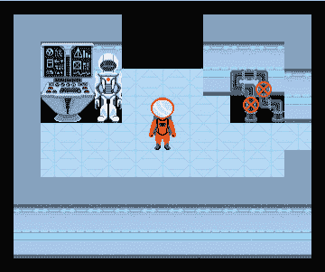
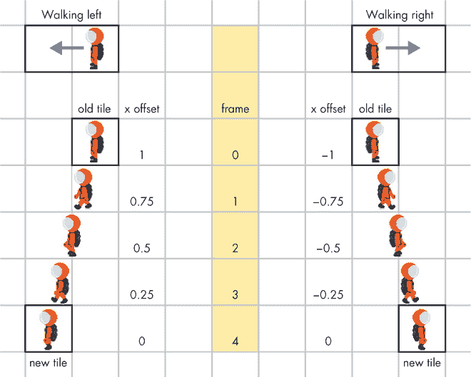
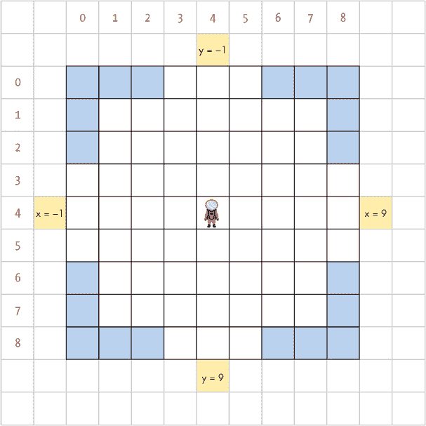
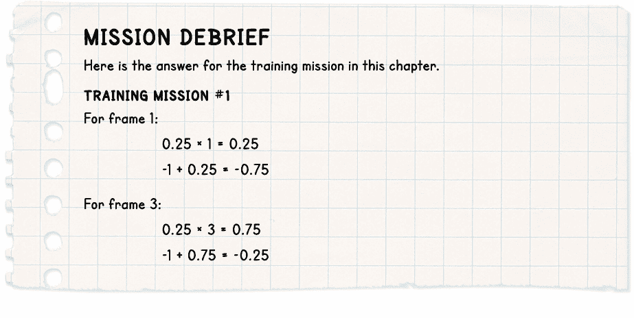

## **进入空间站**


现在我们已经为空间站配备了景观、生命支持系统和其他设备，是时候搬进来了。在这一章中，你将第一次看到自己在空间站的样子，并且能够四处走动，探索各个房间。刚开始你可能会因为旅途而感到有些僵硬，但很快你就会在基地里四处行走。

你将学习如何给宇航员动画，并使用键盘控制让他们移动。你还将添加代码，使宇航员能够在房间之间移动。火星上有生命吗？现在有了。

### **到达空间站**

我们将在本章中以第六章的清单 6-6 为起点，因此请打开*listing6-6.py*。我们将添加代码，展示你穿着太空服的样子在空间站内。最终，你将能够使用箭头键进行移动。

#### **禁用探索者部分的房间导航控制**

到目前为止，我们一直在使用`EXPLORER`部分的箭头键来显示地图上的不同房间。现在我们将开始使用这些键来移动宇航员在房间内。首先，我们需要禁用现有的控制功能。向下滚动到程序中的`EXPLORER`部分，并高亮显示清单 7-1 中的指令。点击**格式** ▸ **注释区域**，将这些指令变为注释，这样程序就会忽略它们。（如果你更喜欢，也可以直接删除它们。）将程序保存为*listing7-1.py*。

*listing7-1.py*

```py
--snip--
##def movement():
##    global current_room
##    old_room = current_room
##    
##    if keyboard.left:
##        current_room -= 1
##    if keyboard.right:
##        current_room += 1
##    if keyboard.up:
##        current_room -= MAP_WIDTH
##    if keyboard.down:
##        current_room += MAP_WIDTH
##
##    if current_room > 50:
##        current_room = 50
##    if current_room < 1:
##        current_room = 1
##
##    if current_room != old_room:
##        print("Entering room:" + str(current_room))
##
##clock.schedule_interval(movement, 0.08)
--snip--
```

*清单 7-1：禁用*EXPLORER*部分的键盘控制*

现在我们可以添加代码，使用箭头键来移动宇航员。

#### **添加新变量**

让我们从设置一些变量开始。最重要的变量是你传送进入的起始坐标。像之前一样，我们将变量添加到程序的`VARIABLES`部分，靠近程序的开始位置。在清单 7-2 中添加新行。将程序保存为*listing7-2.py*。

*listing7-2.py*

```py
   --snip--
   TILE_SIZE = 30

➊ player_y, player_x = 2, 5
➋ game_over = False

➌ PLAYER = {
       "left": [images.spacesuit_left, images.spacesuit_left_1,
                images.spacesuit_left_2, images.spacesuit_left_3,
                images.spacesuit_left_4
                ],
       "right": [images.spacesuit_right, images.spacesuit_right_1,
                 images.spacesuit_right_2, images.spacesuit_right_3,
                 images.spacesuit_right_4
                 ],
       "up": [images.spacesuit_back, images.spacesuit_back_1,
              images.spacesuit_back_2, images.spacesuit_back_3,
              images.spacesuit_back_4
              ],
       "down": [images.spacesuit_front, images.spacesuit_front_1,
                images.spacesuit_front_2, images.spacesuit_front_3,
                images.spacesuit_front_4
                ]
       }

➍ player_direction = "down"
➎ player_frame = 0
➏ player_image = PLAYER[player_direction][player_frame]
   player_offset_x, player_offset_y = 0, 0

   --snip--
```

*清单 7-2：添加玩家变量*

`VARIABLES`部分已经包含了`current_room`的值，它是你开始时所在的房间。（如果你在第六章中实验时更改了`current_room`的值，请确保将其改回 31。）我们创建了新的`player_y`和`player_x`变量➊，用于存储你在房间中的起始位置的数字。这里，我们在一行中设置了两个变量。数字按它们的列出顺序放入变量中，所以`2`被放入`player_y`（第一个数字放入第一个变量），而`5`被放入`player_x`。这些变量会随着你在空间站中房间的移动而变化，并且将用于检查你的位置并在正确的地方绘制你。你的位置信息使用与景观位置相同的瓦片坐标来衡量。

我们还设置了一个`game_over`变量 ➋ 用于告诉程序游戏是否已经结束。在程序开始时，我们将该变量设置为`False`。它会保持`False`，直到游戏结束后变为`True`。程序会检查这个变量，看看玩家是否可以继续移动。如果玩家在死后还继续移动，那就显得很奇怪了！

接下来，我们将设置玩家的行走动画图像。动画是一种视觉技巧。你从一系列相似的图片开始，每张图片之间有细微的差别，展示了小的运动。当你快速切换这些图片时，可以欺骗眼睛，让它认为图像在移动。在我们的游戏中，我们将使用一系列宇航员行走的图片，展示宇航员腿部的不同位置。当我们快速切换这些图片时，宇航员的腿看起来就像在移动。

**提示**

使动画生效的关键是确保图像足够相似。如果图像差别太大，效果就无法实现。

动画中的每一张图片称为*帧*。表 7-1 展示了我们将使用的动画帧。我们将从 0 开始编号帧，这将是宇航员不行走时的静止位置。当玩家向上走时，我们会看到他们的背面，因为他们是在背离我们走出房间。

**表 7-1：** 宇航员的动画帧

| **键** | **帧 0** | **帧 1** | **帧 2** | **帧 3** | **帧 4** |
| --- | --- | --- | --- | --- | --- |
| `left` |  |  |  |  |  |
| `right` |  |  |  |  |  |
| `up` |  |  |  |  |  |
| `down` |  |  |  |  |  |

`PLAYER` 字典 ➌ 存储动画帧。方向名称——上、下、左、右——是字典的键。每个字典条目是一个列表，其中包含玩家站立的图像，以及该方向行走的四个动画帧（参见表 7-1）。`PLAYER` 字典将与玩家面朝的方向 ➍ 以及动画帧的编号 ➎ 一起使用，以在玩家行走或静止时显示正确的图像。`player_image` 变量 ➏ 存储当前的宇航员图像。

**提示**

附录 B 在书的后面描述了*Escape*程序中的重要变量，如果你不记得某个变量的作用，可以去那里查看。

#### **传送到太空站**

准备好传送下去吧！有了起始坐标后，让我们添加代码让你出现在太空站上。

清单 7-3 显示了你需要添加到程序的 `EXPLORER` 部分的代码行。如前所述，你只需要添加新行，不要更改其他行。只需用它们来帮助你理解程序代码。第一行新代码 ➊ 缩进了八个空格，因为它在一个函数内，且在一个循环内。将你的程序保存为 *listing7-3.py*。

*listing7-3.py*

```py
   --snip--
       for y in range(room_height):
        for x in range(room_width):
               if room_map[y][x] != 255: 
                   image_to_draw = objects[room_map[y][x]][0]
                   screen.blit(image_to_draw,
                       (top_left_x + (x*30),
                        top_left_y + (y*30) - image_to_draw.get_height()))
➊         if player_y == y:
➋             image_to_draw = PLAYER[player_direction][player_frame]
➌             screen.blit(image_to_draw,
                           (top_left_x + (player_x*30)+(player_offset_x*30),
                            top_left_y + (player_y*30)+(player_offset_y*30)
                            - image_to_draw.get_height()))
   --snip--
```

*清单 7-3：在房间中绘制玩家*

这些新指令会将你绘制在房间中。`y` 循环从后往前绘制房间。`x` 循环在每一行中从左到右绘制景物。

每一行绘制完成后，程序会检查玩家是否站在该行 ➊ 中。此指令应该与 `for x in range(room_width)` 行对齐，而不是进一步缩进，因为它不在 `x` 循环内。它将在 `x` 循环完成后执行一次。

如果玩家*位于*程序刚绘制的那一行中，下一行 ➋ 会将玩家的图像放入变量 `image_to_draw` 中。图像来自 `PLAYER` 动画帧字典，使用玩家的方向和动画帧编号。

最后一行新代码 ➌ 使用你刚设置的 `image_to_draw` 变量绘制玩家图像，该变量包含图像。它还使用玩家的 *x* 和 *y* 位置变量来计算图像在屏幕上的绘制位置。第三章 解释了如何计算屏幕上的位置（见 “计算绘制每个物品的位置” 第 56 页）。`player_offset_x` 和 `player_offset_y` 变量在 清单 7-2 中设置，用于在玩家走过瓷砖时将其部分位置放置在瓷砖之间。你稍后会了解更多关于这些变量的内容。

准备好传送吧！做好准备！深呼吸。

使用 pgzrun 运行你的程序 listing7-3.py。如果传送成功，你应该在太空站上（见 图 7-1）。如果没有，检查你在本章中所做的程序更改。

传送的一个副作用是，刚开始你无法移动。随着代码的增加，你会发现这个副作用会逐渐消失。



*图 7-1：宇航员到达了！*

### **添加移动代码**

现在，我们将添加一个全新的部分，称为 `游戏循环`。这是程序的核心。`game_loop()` 函数将每秒运行多次，并允许你移动。稍后在书中，我们将在这里添加更多指令，让你可以与发现的物体进行交互。

将这个新部分添加到 `MAKE MAP` 和 `EXPLORER` 部分之间。清单 7-4 会展示它的样子。将程序保存为 *listing7-4.py*。

*listing7-4.py*

```py
   --snip--
               for tile_number in range(1, image_width_in_tiles):
                   room_map[scenery_y][scenery_x + tile_number] = 255

   ###############
   ## GAME LOOP ##
   ###############

➊ def game_loop():
➋     global player_x, player_y, current_room
       global from_player_x, from_player_y
       global player_image, player_image_shadow
       global selected_item, item_carrying, energy
       global player_offset_x, player_offset_y
       global player_frame, player_direction

➌     if game_over:
           return
➍     if player_frame > 0:
           player_frame += 1
           time.sleep(0.05)
           if player_frame == 5:
               player_frame = 0
               player_offset_x = 0
               player_offset_y = 0

➎ # save player's current position
       old_player_x = player_x
       old_player_y = player_y

➏ # move if key is pressed
       if player_frame == 0:
           if keyboard.right:
               from_player_x = player_x
               from_player_y = player_y
               player_x += 1
               player_direction = "right"
               player_frame = 1
           elif keyboard.left: #elif stops player making diagonal movements
               from_player_x = player_x
               from_player_y = player_y
               player_x -= 1
               player_direction = "left"
               player_frame = 1
           elif keyboard.up:
               from_player_x = player_x
               from_player_y = player_y
               player_y -= 1
               player_direction = "up"
               player_frame = 1
           elif keyboard.down:
               from_player_x = player_x
               from_player_y = player_y
               player_y += 1
               player_direction = "down"
               player_frame = 1

➐     # If the player is standing somewhere they shouldn't, move them back.
       # Keep the 2 comments below - you'll need them later
       if room_map[player_y][player_x] not in items_player_may_stand_on: #\
       #           or hazard_map[player_y][player_x] != 0:
           player_x = old_player_x
           player_y = old_player_y
➑         player_frame = 0

➒     if player_direction == "right" and player_frame > 0:
           player_offset_x = -1 + (0.25 * player_frame)
       if player_direction == "left" and player_frame > 0:
           player_offset_x = 1 - (0.25 * player_frame)
       if player_direction == "up" and player_frame > 0:
           player_offset_y = 1 - (0.25 * player_frame)
       if player_direction == "down" and player_frame > 0:
           player_offset_y = -1 + (0.25 * player_frame)

   ###############
   ## EXPLORER  ##
   ###############

   --snip--
```

*清单 7-4：添加玩家移动*

在程序的最后，你还需要添加一个名为`START`的新部分，它将使`game_loop()`函数每 0.03 秒运行一次。清单 7-5 展示了你需要添加的行。这条指令没有缩进，因为它不属于任何函数。Python 会按照程序中出现的顺序从上到下执行不在函数中的指令。这条指令会在所有变量、地图、景物和道具数据被设置好，并且函数在上面被定义之后执行。将你的程序保存为*listing7-5.py*。

*listing7-5.py*

```py
--snip--
###############
##   START   ##
###############

clock.schedule_interval(game_loop, 0.03)

--snip--
```

*清单 7-5：使* game_loop() *函数定期运行*

使用 pgzrun 运行程序，命令为 listing7-5.py。你应该已经在房间里（如图 7-1 所示），并且能够使用箭头键进行移动！你可能会注意到当你向上走时，你的腿会消失。这是瞬移的副作用，当我们在第八章改进绘制房间的代码时，这个问题会消失。

此时，如果你走出房间，程序可能不会正常工作，但它应该能阻止你穿过墙壁或家具。如果你*能够*穿过物体，请再次检查你刚刚添加的代码。如果仍然有问题，仔细检查在程序的`OBJECTS`部分末尾设置`items_player_may_stand_on`列表的那一行。

### **理解运动代码**

如果你想玩这个游戏并自定义它的设计，你不需要理解本章节中的代码是如何工作的。你只需要替换图像和地图、景物及道具的数据。这段运动代码，以及你将在本章节稍后添加的在房间间移动的代码，应该仍然能够正常运行。然而，如果你想理解这些代码是如何工作的，并且希望了解如何为程序添加动画效果，我现在会详细解释。这段代码是游戏的真正引擎，所以在很多方面，它是最令人兴奋的部分！

如果你有一种似曾相识的感觉，那是因为你已经见过大部分代码。在第二章中，你使用代码通过键盘控制改变玩家的位置，并使用名为`game_loop()`的函数控制运动。让我们回顾一下，并看看清单 7-4 中的新内容。

在清单 7-4 中，我们在这个新章节的开始定义了一个名为`game_loop()`的函数➊。我们在程序末尾添加的`clock.schedule_interval()`函数（见清单 7-5）让`game_loop()`函数每 0.03 秒执行一次。每次`game_loop()`函数运行时，它会检查你是否按下了箭头键或正在行走，如果是，它会更新你的当前位置。

在 `game_loop()` 开始时，我们告诉 Python 哪些变量是全局变量 ➋（如需复习为什么要这样做，请参考 “理解太空漫步示例” 在 第 27 页）。这些变量有些目前还未使用，但稍后会用到。

然后我们检查 `game_over` 变量。如果它被设置为 `True` ➌，`game_loop()` 函数将结束，不再执行其余的指令，因为游戏已经结束。这个变量会在游戏结束时阻止玩家继续移动。目前它不会起作用，因为程序中没有任何部分会导致游戏结束。

`game_loop()` 函数检查玩家是否已经在行走 ➍。走一步需要四帧动画来跨越一个屏幕格子。如果玩家在移动，`player_frame` 变量的值在 1 和 4 之间，表示当前使用的动画帧。如果玩家在行走，程序会将 `player_frame` 变量加 1，切换到下一个动画帧。这意味着 `EXPLORER` 部分中的 `draw()` 函数将在下一次运行时显示下一个动画帧。

当 `player_frame` 达到 5 时，意味着所有动画帧都已经显示完毕，动画结束。在这种情况下，程序将重置 `player_frame` 为 0，结束动画。当动画结束时，程序还会重置 `player_offset_x` 和 `player_offset_y` 变量。我稍后会告诉你这些变量的作用。

接下来，我们检查玩家是否按下了某个键来启动新的行走动画。在允许玩家移动之前，我们通过将 *x* 位置存储在 `old_player_x` 变量中，并将 *y* 位置存储在 `old_player_y` 变量中来保存他们的当前位置 ➎。我们将使用这些变量来将玩家移回原位，如果他们试图走到不该去的地方，例如走进墙壁或柱子里。

程序接着使用一段熟悉的代码来改变玩家的 *x* 和 *y* 位置变量，前提是玩家按下了箭头键 ➏。我们以格子为单位来衡量玩家的位置，这与我们用来定位场景的单位相同。这与我们在第一章中使用像素作为度量单位不同。

当玩家按下右箭头键时，程序会将 *x* 位置加 1。如果玩家按下左箭头键，程序会将 *x* 位置减 1。类似的代码用于在玩家按下上下箭头键时改变 *y* 位置。

当玩家移动时，全局变量 `from_player_x` 和 `from_player_y` 存储玩家行走的起始位置。这些变量稍后将用于检查玩家在行走过程中是否被障碍物撞到。同时，`player_direction` 变量也会被设置为玩家移动的方向，`player_frame` 设置为 1，即动画序列中的第一帧。

如第一章所示，我们使用`elif`来结合我们对按键的检查。这确保玩家不能同时改变*x*和*y*位置，从而进行对角线移动。在我们的 3D 房间中，对角线行走会让玩家穿过障碍物，挤过不可能的缝隙。

在移动玩家后，我们检查新位置是否把他们放在允许站立的地方 ➐。我们通过使用`room_map`查看他们站立位置的物品，并与`items_player_may_stand_on`列表进行比较来实现这一点。这里也有一些被注释掉的代码，我们稍后需要启用它来防止玩家穿越危险区域。

我们可以使用关键字`in`来检查某个元素是否在列表中。通过与`not`一起使用，我们可以看到某个元素是否缺失在列表中。以下代码的意思是：“如果玩家站立的地图位置中的数字不在物品列表中，玩家可以站立在……”

```py
if room_map[player_y][player_x] not in items_player_may_stand_on:
```

如果玩家站在不在`items_player_may_stand_on`列表中的物体上，我们会将玩家的*x*和*y*位置重置为他们移动前的位置。

所有这些过程发生得非常快，以至于玩家几乎察觉不到。如果他们尝试走进墙壁，看起来就像他们从没移动过一样！这种方式比在每次移动前都检查是否允许更简单地防止玩家穿墙。

如果玩家的位置必须重置，程序还会将`player_frame`变量设置为 0 ➑。这会再次关闭玩家的动画。

当你按下右箭头键时，宇航员会向右走一个瓦片。这需要四个帧来动画化，因此在此动画播放过程中，宇航员会显示在瓦片的中途位置。`player_offset_x`和`player_offset_y`变量用于计算绘制宇航员的位置。这些变量是在`game_loop()`函数的末尾计算的 ➒。`draw()`函数（见列表 7-3）将偏移值乘以瓦片的大小（30 像素），因为图像是以像素为单位绘制的。例如，如果偏移量是 0.25 瓦片，宇航员大约会被绘制在距离新瓦片中心 7 个像素的位置。计算机会四舍五入这个数值，因为你不能用半个像素来定位物体。

查看图 7-2 的左侧。对于宇航员向左行走的第一个动画帧，我们需要将四分之三的瓦片添加到玩家的新瓦片位置（0.75）。对于第二个动画帧，我们在绘制之前将半个瓦片（0.5）添加到玩家的新瓦片位置。对于第三个动画帧，我们将四分之一的瓦片添加到玩家的新瓦片位置。



*图 7-2：理解宇航员在动画过程中的定位*

我们可以通过帧编号计算这些偏移量。以下是向左行走的计算方法：

```py
player_offset_x = 1 - (0.25 * player_frame)
```

通过自己算一算，检查这个计算是否合理。例如，当动画帧为 2 时，计算如下：

0.25 × 2 = 0.5

1 − 0.5 = 0.5

在图 7-2 中，0.5 是帧 2 的正确偏移量。

当玩家向右走时，我们需要从玩家的位置中减去一部分瓦片，因此偏移量是负数。请查看图 7-2 的右侧。对于帧 1，添加−0.75 将宇航员放置在其新位置的*左侧*三分之四的位置。

我们也可以通过帧编号来计算向右行走的* x *偏移量。这里是公式：

```py
player_offset_x = -1 + (0.25 * player_frame)
```

**训练任务 #1**

你能检查一下公式是否有效吗？使用它来查找帧 1 和帧 3 的偏移值，并检查它们是否与图 7-2 中的偏移值相符。

* y *方向的偏移量计算方式相同。当宇航员向上移动时，我们使用与向左偏移量相同的公式计算* y *偏移量。当宇航员向下移动时，我们使用与向右偏移量相同的公式计算* y *偏移量。

总结一下，`game_loop()`函数的作用如下：

+   如果你没有在行走，按下一个键时会启动行走动画。

+   如果你正在行走，它会计算下一个动画帧，以及在绘制你时用于部分跨越瓦片的位置信息。

+   如果你已经到达动画序列的末尾，它会重置动画，这样你就可以继续移动了。移动非常流畅，所以如果你按住一个键，你将会在动画帧 1 到 4 之间循环，直到停止行走才会看到站立姿势。

### **房间间移动**

现在你已经站起来了，应该完全探索一下空间站。让我们在`game_loop()`函数中添加一些代码，允许你走进下一个房间。把新代码添加到清单 7-6 中，位置是在检查按键之后和检查玩家是否站在不该站的位置之前。确保包括带有注释符号（`#`）的指令。我们稍后需要它们。

清单 7-6 中的灰色行告诉你在哪些地方添加新代码。将程序保存为*listing7-6.py*。使用 pgzrun 运行 listing7-6.py，然后在空间站内四处走走！现在正是一个好时机，可以环顾四周，在门装上之前，某些区域尚未锁定。

*listing7-6.py*

```py
   --snip--

   def game_loop():

   --snip--
               player_direction = "down"
               player_frame = 1   
   # check for exiting the room
➊     if player_x == room_width: # through door on RIGHT
           #clock.unschedule(hazard_move)
➋         current_room += 1
➌         generate_map()
➍         player_x = 0 # enter at left
➎         player_y = int(room_height / 2) # enter at door
➏         player_frame = 0
➐         #start_room()
➑         return

➒     if player_x == -1: # through door on LEFT
           #clock.unschedule(hazard_move)
           current_room -= 1
           generate_map()
           player_x = room_width - 1  # enter at right
           player_y = int(room_height / 2) # enter at door
           player_frame = 0
           #start_room()
           return

➓     if player_y == room_height: # through door at BOTTOM
           #clock.unschedule(hazard_move)
           current_room += MAP_WIDTH
           generate_map()
           player_y = 0 # enter at top
           player_x = int(room_width / 2) # enter at door
           player_frame = 0
           #start_room()
           return

       if player_y == -1: # through door at TOP
           #clock.unschedule(hazard_move)
           current_room -= MAP_WIDTH
           generate_map()
           player_y = room_height - 1 # enter at bottom
           player_x = int(room_width / 2) # enter at door
           player_frame = 0
           #start_room()
           return

     # If the player is standing somewhere they shouldn't, move them back.
       if room_map[player_y][player_x] not in items_player_may_stand_on: #\ 
       #           or hazard_map[player_y][player_x] != 0:
           player_x = old_player_x
   --snip--
```

*清单 7-6：启用玩家在房间间移动*

为了查看这段代码是如何工作的，让我们使用一个示例房间地图。图 7-3 显示了一个 9 个瓦片宽和 9 个瓦片高的房间，每面墙都有出口。我们将使用这张图来理解玩家离开房间时的位置。

如你所知，地图上的位置从左上角的 0 开始编号。黄色方块表示玩家走出房间后可能的位置：

+   如果玩家的* y *位置是−1，说明他们走出了顶部出口。

+   如果玩家的* x *位置是−1，说明他们走出了左侧出口。

+   如果玩家的* y *位置与`room_height`变量相同，他们已经走出了底部。瓦片位置从 0 开始编号，所以如果玩家进入了一个有 9 行的房间的第 9 行，他们已经离开了房间。

+   类似地，如果玩家的* x *位置与`room_width`变量相同，则表示他们已经从右侧出口走了出去。



*图 7-3：判断玩家是否走过出口*

新的代码行检查玩家的位置是否意味着他们已经走出了房间。如果玩家的* x *位置与`room_width`相同 ➊，他们就在右侧门外，如图 7-3 所示。

当玩家离开房间时，我们需要改变他们所在的房间编号，这个编号保存在`current_room`变量中。当他们通过右侧门时，房间编号会增加 1 ➋。再次查看房间地图（翻回图 4-1 在第 60 页），以确认这一点：房间编号是从左到右递增的。例如，如果玩家在房间 33 中，走过右侧出口，他们将进入房间 34。

然后程序生成一个新的`room_map`列表 ➌，用于显示和导航新房间。玩家被重新定位到房间的另一侧 ➍，看起来像是他们已经走过了门口。如果玩家从房间的右侧出口出去，他们将从左侧进入下一个房间 ➍。

房间有很多不同的大小，所以我们还需要改变玩家的* y *位置，将他们放置在门口的中央。否则，玩家可能会从墙壁里出来！我们将玩家的位置设置为房间高度的一半 ➎，这样他们就正好站在门口的中央。当他们进入房间时，我们也会重置玩家动画 ➏。

我在这里包含了几个我们稍后需要的功能，所以确保你包括了`clock.unschedule(hazard_move)` ➊和`start_room()` ➐指令。`start_room()`函数将在玩家进入新房间时显示房间名称。我们将在书中的后面部分进一步讨论这些指令。

最后，`return`指令退出`game_loop()`函数 ➑。此时函数中的任何进一步指令都不会执行。当函数重新开始时，它将像往常一样从头开始。

下一个代码块 ➒ 检查玩家是否走过左侧门。要通过左侧门，程序执行以下操作：

+   检查`player_x`变量是否包含`-1`（见图 7-3）。

+   从当前房间编号中减去 1，进入左侧房间。

+   将玩家的* x *位置设置为刚好位于右侧门口内部。这个位置是`room_width`减去 1。（你可以在图 7-3 中检查这一点。在一个`room_width`为 9 的房间中，玩家的* x *位置应该是 8。）

+   使用`room_height`将玩家的*y*位置设置为中间。这与通过右侧出口行走的方式相同。

对于上下出口➓，使用了相同的代码结构。但是，程序会检查玩家的*y*位置，看看他们是否使用了出口，并将他们的新位置设置为通过上方或下方的门进入。

这次，我们通过 5 来改变房间号，而不是 1，因为游戏地图宽度是 5 个房间（见图 4-1）。例如，如果你在房间 37，走过上方出口，你将进入房间 32（37 减去 5）。如果你在房间 37，走过下方出口，你将进入房间 42（37 加上 5）。我们之前将数字 5 存储在变量`MAP_WIDTH`中，程序在这里使用它。

现在你可以自由探索空间站了。在下一章，我们将修复房间显示中的剩余几个错误。

### **你准备好飞行了吗？**

勾选以下框以确认你已经掌握了本章的关键知识点。

  玩家在*逃脱*游戏中的位置是以格子为单位的，就像风景一样。

  `game_loop()`函数控制玩家移动，并计划每 0.03 秒运行一次。

  如果玩家移动到一个不允许的位置，他们会迅速被送回到之前的位置，快到你几乎看不见他们移动。

  程序检查玩家的*x*和*y*位置，以查看他们是否已走出出口。如果是，他们将在下一个房间的相对出口中间出现。

  动画帧存储在`PLAYER`字典中，并为每个方向列出了图像。字典的键是方向名称，索引号获取所需的特定帧。

  帧 0 是静止位置。帧 1、2、3 和 4 显示宇航员行走的动画。

  `game_loop()`函数在玩家行走时增加使用的动画帧数。

  `player_offset_x`和`player_offset_y`变量用于在进入新格子时正确地定位宇航员。


