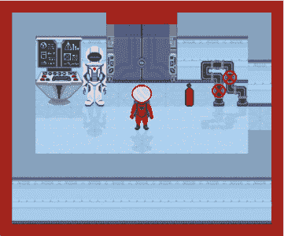
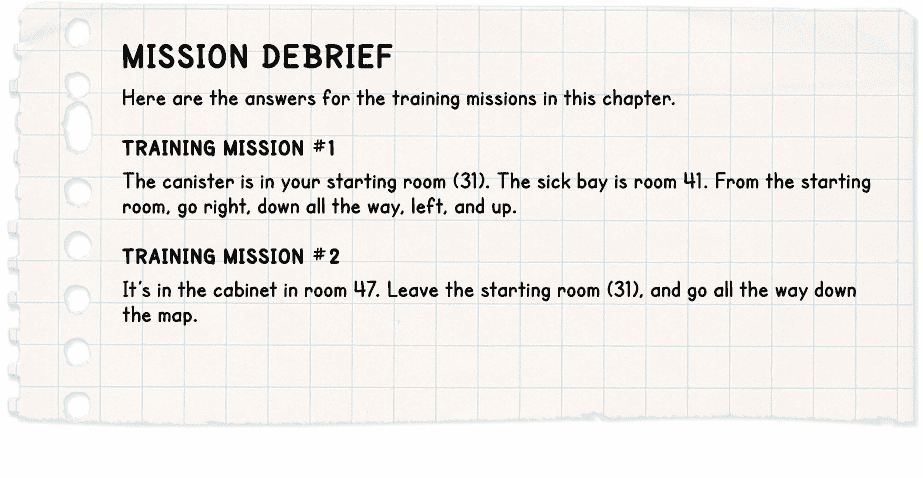

## **9**

拆开你的个人物品**

现在，空间站已经投入使用，是时候拆开你的个人物品和你在执行工作时所需要的各种工具和设备了。

在这一章中，你将编写能够在房间之间移动的物体代码（*道具*）。当你玩游戏时，你将能够发现新物品，捡起它们，移动它们，并利用它们来解谜。

### **添加道具信息**

你在第五章时，已经向物体字典中添加了一些关于道具的信息，当时你将图片文件名和描述添加到物体字典中。物体字典包含了有关 *物品是什么* 的信息。在这一章，我们将添加信息来告诉游戏 *道具放在哪里*。

你可能会想知道为什么我们要将道具与景物分开处理。我们这么做是因为它们的信息使用方式不同：景物字典使用房间作为键来存储信息。这是合理的，因为程序需要一次性获取一个房间中所有景物的信息。在景物信息被添加到房间地图后，景物字典在玩家进入新房间之前不再需要。

相比之下，道具是可以移动的，因此道具的信息可能在任何时候、任何房间中都需要。如果这些信息被埋藏在一长串景物项目中，就很难找到和更改。

我们将创建一个新的字典，叫做 props，用于存储道具的信息。我们将使用物体编号作为键，每个条目将是一个包含以下内容的列表：

+   道具所在房间的编号

+   道具在房间中的 *y* 位置（以瓦片为单位）

+   道具在房间中的 *x* 位置（以瓦片为单位）

例如，这里是锤子的条目，它是物体 65：

65: [50, 1, 7]

它位于 50 房间，*y* 位置为 1，*x* 位置为 7。

不在游戏世界中或由玩家携带的物体，其房间编号为 0，这在游戏中并不是真实位置。例如，有些物体在被创建或摧毁之前并不在游戏世界中，这些物体将存储在 0 房间。

**提示**

道具字典和物体字典使用相同的键。如果你想知道道具字典中物品 65 的内容，可以查看物体字典中的详细信息。

示例 9-1 展示了将道具信息添加到游戏中的代码。打开 *listing8-10.py*，你在上一章中的最终程序。在 DISPLAY 部分的 `show_text()` 函数后面和 START 部分之前添加新的 PROPS 部分。只需添加新的行，并将新程序保存为 *listing9-1.py*。如果你不想手动输入数据，可以从 *data-chapter9.py* 文件中复制并粘贴。

你可以运行程序，通过 `pgzrun listing9-1.py`。它目前还不会做任何新操作，但你可以检查命令行窗口是否有错误消息。

*listing9-1.py*

--省略--

screen.draw.text(text_to_show,

(20, text_lines[line_number]), color=GREEN)

###############

##   属性   ##

###############

# 属性是可以在房间之间移动、出现或消失的物体。

# 所有属性必须在这里设置。游戏中尚未出现的属性放入房间 0。

# 对象编号 : [房间, y, x]

➊ props = {

20: [31, 0, 4], 21: [26, 0, 1], 22: [41, 0, 2], 23: [39, 0, 5],

24: [45, 0, 2],

➋     25: [32, 0, 2], 26: [27, 12, 5], # 同一扇门的两侧

40: [0, 8, 6], 53: [45, 1, 5], 54: [0, 0, 0], 55: [0, 0, 0],

56: [0, 0, 0], 57: [35, 4, 6], 58: [0, 0, 0], 59: [31, 1, 7],

60: [0, 0, 0], 61: [36, 1, 1], 62: [36, 1, 6], 63: [0, 0, 0],

64: [27, 8, 3], 65: [50, 1, 7], 66: [39, 5, 6], 67: [46, 1, 1],

68: [0, 0, 0], 69: [30, 3, 3], 70: [47, 1, 3],

➌     71: [0, LANDER_Y, LANDER_X], 72: [0, 0, 0], 73: [27, 4, 6],

74: [28, 1, 11], 75: [0, 0, 0], 76: [41, 3, 5], 77: [0, 0, 0],

78: [35, 9, 11], 79: [26, 3, 2], 80: [41, 7, 5], 81: [29, 1, 1]

}

checksum = 0

for key, prop in props.items():

➍     if key != 71: # 71 被跳过，因为它在每个游戏中都不同。

checksum += (prop[0] * key

+ prop[1] * (key + 1)

+ prop[2] * (key + 2))

➎ print(len(props), "属性")

assert len(props) == 37, "预期有 37 个属性项"

print("属性校验和:", checksum)

➏ assert checksum == 61414, "属性数据错误"

➐ in_my_pockets = [55]

selected_item = 0 # 第一个物品

item_carrying = in_my_pockets[selected_item]

###############

##   开始   ##

###############

--snip--

*列表 9-1：将属性信息添加到* Escape

我们通过创建字典来开始新的 PROPS 部分，用于存储关于属性的信息 ➊。这个字典列出了所有属性的位置，从一些门（20 到 24）开始，包括一个救援飞船（40）和从 53 开始的可携带物品。

这里有一个小小的特殊情况需要注意。我们将门视为属性而非场景，因为它们并不总是存在：当它们打开时，会从房间中移除。大多数门一旦打开就会保持打开状态，直到游戏结束。然而，连接房间 27 和 32 的门也可以关闭，这意味着玩家可以从两个方向看到它。因此，我们需要两个属性来表示这扇门 ➋，分别显示在房间 27 的顶部和房间 32 的底部。这两个门的对象编号是 25 和 26。

属性 71 是 Poodle 着陆器，它在游戏开始前坠落在行星表面。我们使用程序中 VARIABLES 部分的 LANDER_Y 和 LANDER_X 变量 ➌ 来定位着陆器，因为它的位置会随着每个新游戏而变化。Poodle 着陆时力道极大，可能已经被火星土覆盖。它会一直待在房间 0，直到玩家能够将其挖掘出来。

就像景物信息（参见第六章）一样，我在这里使用了校验和来帮助你发现是否在输入数据时犯了错误。如果在这里出错，可能无法将游戏玩到最后。唯一没有包含在校验和计算中的道具是编号 71，因为它的位置在每次游戏中都会使用不同的随机数 ➍。

如果你想更改道具数据，最简单的方法是像这样注释掉两个校验和指令 ➏，以关闭它们：

#assert len(props) == 37, "Expected 37 prop items"

#assert checksum == 61414, "Error in props data"

程序会在命令行窗口中显示校验和总数和数据项数量➎，所以如果你更改了道具数据，可以使用这些信息更新两个 assert 语句中的数字，以确保它们与你自定义的数据一致。如果你这样做，可以继续使用这些行，而不是注释掉它们。

程序还设置了两个新变量和一个稍后在本章需要的列表。in_my_pockets ➐ 列表存储了玩家捡起的所有物品，也就是他们的*背包*。其中一个物品始终是选中的，因此玩家可以随时使用它。selected_item 变量存储着它在 in_my_pockets 列表中的索引号。item_carrying 变量存储着玩家选择的物品的对象编号。你可以把 item_carrying 变量看作是玩家手中物品的编号。我将在本章稍后详细介绍这些变量。

### **将道具添加到房间地图**

我们已经添加了关于道具位置的信息，现在让我们显示这些道具。当道具位于当前房间时，它们会在玩家进入房间时被加入到 room_map 列表中。然后，draw()函数会使用这个列表来绘制房间。

我们将在程序的 MAKE MAP 部分，即 generate_map()函数内，添加将道具加入房间地图的指令。我们会在你在第八章中添加用于计算 top_left_x 和 top_left_y 变量的指令之后，简单地加入这些指令，放在 GAME LOOP 部分开始之前。

因为这些新指令都属于 generate_map()函数的一部分，所以你需要至少缩进四个空格。

将 Listing 9-2 中显示的新指令添加到程序中，并将其保存为*listing9-2.py*。使用 pgzrun 运行程序 listing9-2.py。你应该会看到一些房间中出现了新物体，如图 9-1 所示。

*图 9-1：那扇门刚才还不在！不过那个气罐可能会派上用场。*

*listing9-2.py*

--snip--

top_left_x = center_x - 0.5 * room_pixel_width

top_left_y = (center_y - 0.5 * room_pixel_height) + 110

➊     for prop_number, prop_info in props.items():

➋         prop_room = prop_info[0]

prop_y = prop_info[1]

prop_x = prop_info[2]

➌         if (prop_room == current_room and

➍             room_map[prop_y][prop_x] in [0, 39, 2]):

➎                 room_map[prop_y][prop_x] = prop_number

➏                 image_here = objects[prop_number][0]

image_width = image_here.get_width()

image_width_in_tiles = int(image_width / TILE_SIZE)

➐                 for tile_number in range(1, image_width_in_tiles):

room_map[prop_y][prop_x + tile_number] = 255

###############

## 游戏循环 ##

###############

--snip--

*Listing 9-2: 将道具添加到当前房间地图中*

在新代码中，我们首先设置一个循环，遍历 props 字典中的条目➊。对于每一项，字典的键值被赋给变量 prop_number，包含位置信息的列表则被赋给列表 prop_info。

为了让程序更易于阅读，我设置了一些变量来存储 prop_info 列表中的信息➋。程序提取房间号信息（并将其放入 prop_room 中）以及*y*和*x*位置（分别放入 prop_y 和 prop_x 变量）。

我们添加了一个检查，查看 prop_room 是否与玩家所在的房间匹配➌，以及道具是否放在地板上➍。地板检查将三种不同的地板类型放入列表中（0 代表室内，2 代表土壤，39 代表第 26 房间的压力垫）。程序检查道具的位置，看看房间地图中该位置的内容。如果是这些地板类型之一，则表示物体正坐落在地板上，完全可见。如果不是，则道具隐藏在景物中，暂时不可见。例如，如果一个柜子占据了道具的位置而不是地板，道具将不会出现在屏幕上。不过，玩家仍然可以通过检查该位置的柜子来找到道具。

如果道具在房间内并且在地板上，则更新房间地图，使用道具编号➎。

有些道具，如门，比一个瓦片要宽。因此，我们将数字 255 添加到道具覆盖的其他瓦片上，而不是第一个瓦片➐。这与我们在 generate_map()函数中标记宽景物时使用的代码类似（见 Listing 6-4，位于第 106 页）。

**从函数中获取信息：掷骰子**

在第八章中，你学习了如何向函数发送信息（或*参数*）。让我们更仔细地看看如何从函数中获取信息。我们将利用这一技能创建一个函数，告诉我们玩家站在什么物体上。

Listing 9-3 展示了一个简单的程序，该程序从函数中返回一个数字并将其放入变量中。这不是*Escape*游戏的一部分，所以首先点击**文件** ▸ **新建**来创建一个新文件。

将程序保存为*listing9-3.py*。该程序没有使用 Pygame Zero，因此你可以在脚本窗口中使用**运行** ▸ **运行模块**来运行它。该程序模拟一个 10 面骰子。

*listing9-3.py*

➊ import random

➋ def get_number():

➌     die_number = random.randint(1, 10)

➍     return die_number

➎ random_number = get_number()

➏ print(random_number)

*示例 9-3：一个 10 面骰模拟器展示了如何从函数中返回一个数字。*

这个程序首先告诉 Python 使用 random 模块 ➊，这会为 Python 提供一些新的函数来做随机选择。接着我们创建了一个新函数叫 get_number() ➋，它生成一个 1 到 10 之间的随机数 ➌，并将结果放入名为 dice_number 的变量中。

通常，当你启动一个函数时（在 Python 术语中称为*调用*函数），你使用它的名称，像这样：

get_number()

这次，我们不仅启动了函数，还告诉 Python 将函数的结果存入一个名为 random_number 的变量 ➎。当函数通过返回命令 ➍ 发送结果时，结果会存入 random_number 变量。程序的主部分随后可以打印出它的值 ➏。

这段代码展示了从函数中获取信息的方法：当函数启动时，设置一个变量来存储信息 ➎，当函数执行完毕时，通过返回指令将信息发送回来 ➍。你不仅可以返回数字，还可以返回字符串和列表。在可能的情况下，这是让程序其他部分使用函数信息的最佳方法。这个技巧让程序的主程序能够从函数的局部变量（在这个例子中是 dice_number）中获取信息，而这个局部变量通常只在该函数内部可见。

你以后不需要再使用这个程序，因此在完成实验后可以关闭它。

### **从房间地图中找到物体编号**

很快，我们将添加代码以便让你在太空站中捡起物体。首先，我们需要一种方法来找出正在被捡起的物体是什么。

当玩家与场景或道具互动时，我们需要找出玩家正在使用的物体编号。通常，这很简单。如果房间地图显示玩家位置的道具编号是 65，那就是一把锤子。程序可以展示锤子的描述，并让玩家捡起或使用它。

识别物体编号在处理跨越多个瓦片的大型物体时变得棘手。我们使用数字 255 来标记被大物体覆盖的瓦片，但这个数字并不对应任何道具。程序需要通过在房间地图中向左移动，直到找到一个不是 255 的数字，来计算出实际的物体编号。

例如，如果玩家检查门的最右侧第三部分，程序会发现这个位置包含 255，于是它会检查左边的位置。该位置也包含 255，程序继续向左检查。如果该瓦片包含一个非 255 的数字，程序就知道它找到了真正的物体编号，举例来说，可能是 20（其中一个门）。通过物体编号 20，程序就可以让玩家检查或打开这扇门。

我们将创建两个函数来计算物体编号，详见 Listing 9-4。你需要将它们添加到 Listing 9-2，如果需要，请点击**文件** ▸ **打开**再次打开*listing9-2.py*。我们将开始一个新部分，命名为道具交互（PROP INTERACTIONS）。把它放在道具（PROPS）部分后面。这个新部分将是我们编写拾取和丢弃道具代码的地方。

将更新后的程序保存为*listing9-4.py*。它暂时不会做任何新事情，但你可以使用`pgzrun listing9-4.py`运行它，检查是否没有添加错误。查看命令行窗口是否有错误信息。

*listing9-4.py*

--snip--

in_my_pockets = [55]

selected_item = 0 # 第一个物品

item_carrying = in_my_pockets[selected_item]

#######################

## 道具交互 ##

#######################

➊ def find_object_start_x():

➋      checker_x = player_x

➌      while room_map[player_y][checker_x] == 255:

➍          checker_x -= 1

➎      return checker_x

➏ def get_item_under_player():

➐      item_x = find_object_start_x()

➑      item_player_is_on = room_map[player_y][item_x]

➒      return item_player_is_on

--snip--

*Listing 9-4: 查找真实的物体编号*

在我们深入讨论这段代码如何工作之前，我先解释一下游戏循环如何让玩家与道具和景物互动：

1.  当玩家按下移动键时，程序会改变玩家的位置（即使这会把他们移动到不可能的位置，例如进入墙壁内部）。

1.  程序根据玩家要求，使用玩家当前位置的物体执行相应的操作。这意味着此时玩家和物体位于房间中的同一位置。

1.  如果玩家站在不允许站立的地方（比如墙壁内部），程序会将他们移回原来的位置。

这个过程发生得非常快，你几乎看不见玩家进入墙壁或其他景物。这样，玩家可以使用移动键和动作键来检查或使用景物。例如，你可以走进墙壁并按下空格键来检查墙壁并查看它的描述。这个过程同样适用于玩家站立的物体，比如地上的道具。

我们在 Listing 9-4 中添加的第一个新函数是`find_object_start_x()` ➊。这个函数找到玩家所在位置的物体起始位置，如果该位置包含 255，它会向左查找真实的物体编号。

为了实现这一点，函数将变量`checker_x`设置为与玩家的*x*位置相同 ➋。我们使用一个循环，该循环在`checker_x`的*x*位置和玩家的*y*位置上，房间地图中包含 255 时持续执行 ➌。在这个循环内部，有一条指令将`checker_x`减去 1 ➍，即向左移动 1 个格子。当循环结束时，`checker_x`包含了物体开始的左侧位置。然后，这个数字会被返回 ➎，传递给启动该函数的指令。

第二个新函数是 get_item_under_player() ➏，它计算出玩家位置的物品是什么。它使用第一个函数来找出物品的起始位置，并将*x*位置存储在变量 item_x ➐中。然后它查看该位置的房间地图数据，以确认该位置是什么物品 ➑，并将该编号返回给启动该函数的指令 ➒。

### **拾取物品**

现在这些函数已经就绪，我们可以创建几个用于拾取物品并将其存入玩家背包的函数。然后我们将添加一些键盘控制。

#### **拾取道具**

将清单 9-5 中显示的两个函数添加到程序的 PROP INTERACTIONS 部分的末尾，紧接着你在清单 9-4 中添加的代码之后。

将此程序保存为*listing9-5.py*。你可以通过运行 pgzrun listing9-5.py 来检查是否有任何错误，但目前还看不出任何区别。此代码添加了一些新函数，但没有包含任何启用玩家使用它们的键盘控制。

*listing9-5.py*

--snip--

item_player_is_on = room_map[player_y][item_x]

return item_player_is_on

def pick_up_object():

global room_map

➊     item_player_is_on = get_item_under_player()

➋     if item_player_is_on in items_player_may_carry:

➌         room_map[player_y][player_x] = get_floor_type()

➍         add_object(item_player_is_on)

show_text("现在携带的物品是 " + objects[item_player_is_on][3], 0)

sounds.pickup.play()

time.sleep(0.5)

➎     else:

show_text("你无法携带那个物品！", 0)

➏ def add_object(item): # 将物品添加到背包。

global selected_item, item_carrying

➐     in_my_pockets.append(item)

➑     item_carrying = item

➒     selected_item = len(in_my_pockets) - 1

display_inventory()

➓     props[item][0] = 0 # 捡起的物品进入房间 0（地图之外）。

def display_inventory():

print(in_my_pockets)

--snip--

*清单 9-5: 添加拾取物品的函数*

pick_up_object()函数将在玩家按下*获取*键（G）以拾取物品时启动。它首先将玩家当前位置的物品编号放入变量 item_player_is_on ➊。如果该物品可以携带 ➋，则函数的其余部分将拾取该物品。

为了将物品从地板上移除，程序将玩家位置的房间地图替换为地板的物品编号（无论是土壤还是地砖） ➌。get_floor_type()函数用于找出此房间的地板类型。重新绘制房间时，物品会从地板上消失，看起来像是已经被捡起。然后，物品通过 add_object()函数 ➍添加到玩家的背包物品列表中。

然后，我们在屏幕上显示一条信息，告诉玩家他们捡起了一个物品，并播放一个音效。我们使用 time.sleep(0.5)指令添加了半秒的短暂延迟，以确保如果玩家长时间按住键，确认信息不会被覆盖。

如果物品不能被携带，我们会显示一条消息告诉玩家他们不能携带这个物品➎。例如，景物是不能携带的，所以我们需要告诉玩家这一点。否则，他们可能会以为自己按错了键，或者程序没有正常工作。

add_object()函数将物品添加到 in_my_pockets 列表中，该列表存储玩家携带的物品（即他们的背包）。在函数开始时，传入的物品编号会被放入局部变量 item➏。然后，物品会通过 append()方法被添加到 in_my_pockets_list 的末尾➐。

我们使用全局变量 item_carrying 来存储玩家手中物品的编号，所以它被设置为这个物品➑的编号。我们将 selected_item 变量设置为列表中的最后一个物品，这意味着玩家刚刚拾取的物品被选中➒。这些变量在物品后续使用时会很重要，并且在 display_inventory()函数显示屏幕上的物品列表时也会用到。目前，这个函数只会在命令行窗口中打印出物品列表。

最后，我们将物品的位置在 props 字典中设置为房间 0➓。这意味着刚拾取的物品在游戏地图上不会再显示。如果我们不这么做，物品在玩家下次进入该房间时会重新出现。

#### **添加键盘控制**

为了使新的功能发挥作用，我们还需要添加键盘控制。我们将使用 G 键作为获取键。

将这些新的指令，参见列表 9-6，放在程序的 GAME LOOP 部分中的 game_loop()函数内。新的指令应该放在退出检查之后，并且在玩家如果站在不该站的位置时被移回之前。

*listing9-6.py*

--snip--

player_frame = 0

start_room()

return

➊     if keyboard.g:

➋         pick_up_object()

# 如果玩家站在不应该站的地方，将他们移回。

if room_map[player_y][player_x] not in items_player_may_stand_on: #\

#           或者 hazard_map[player_y][player_x] != 0:

--snip--

*列表 9-6：添加键盘控制*

你需要将第一条新的指令缩进四个空格➊，因为它位于 game_loop()函数内部。将第二条指令再缩进四个空格➋，因为它属于上面的 if 语句。这些指令会在玩家按下 G 键➊时运行 pick_up_object()函数➋。

将列表保存为*listing9-6.py*。当你运行 pgzrun listing9-6.py 时，你应该能够拾取物品。

从第一个房间的气瓶开始测试。只需走到气瓶上并按下 G 键。你会听到一个声音并看到一条消息，物体会从房间中消失。

命令行窗口（你输入 pgzrun 指令的地方）每次你拾取物品时也会显示物品列表，像这样：

[55, 59]

每次，你都会看到一个新物品被添加到列表的末尾。物品 55，溜溜球，在游戏开始时就在你的口袋里。

### **添加背包功能**

现在你可以捡起在太空站周围找到的道具了。我们应该添加一个简单的方式来查看你所携带的物品，并选择不同的物品进行使用。我们将创建一个新的 display_inventory() 函数，在游戏窗口的顶部显示玩家所携带的物品。

然后我们将添加控制功能，允许玩家按 TAB 键选择列表中的下一个物品。选中的物品会被框起来，描述信息会显示在物品下方。图 9-2 展示了它的外观。

*图 9-2:* 游戏窗口顶部的背包

#### **显示背包物品**

列表 9-7 展示了你需要添加的代码。列表 9-5 包含了 display_inventory() 函数的一些代码。将其替换为新代码。将这个列表保存为 *listing9-7.py*。当你使用 pgzrun 运行程序 listing9-7.py 时，你将能够在屏幕顶部看到你收集的物品被添加到背包中。

*listing9-7.py*

--snip--

selected_item = len(in_my_pockets) - 1

display_inventory()

props[item][0] = 0 # 被携带的物品进入房间 0（地图外）。

def display_inventory():

➊     box = Rect((0, 45), (800, 105))

screen.draw.filled_rect(box, BLACK)

➋     if len(in_my_pockets) == 0:

return

➌     start_display = (selected_item // 16) * 16

➍     list_to_show = in_my_pockets[start_display : start_display + 16]

➎     selected_marker = selected_item % 16

➏     for item_counter in range(len(list_to_show)):

item_number = list_to_show[item_counter]

image = objects[item_number][0]

➐         screen.blit(image, (25 + (46 * item_counter), 90))

box_left = (selected_marker * 46) - 3

➑     box = Rect((22 + box_left, 85), (40, 40))

screen.draw.rect(box, WHITE)

item_highlighted = in_my_pockets[selected_item]

description = objects[item_highlighted][2]

➒     screen.draw.text(description, (20, 130), color="white")

###############

##   开始   ##

###############

clock.schedule_interval(game_loop, 0.03)

generate_map()

clock.schedule_interval(adjust_wall_transparency, 0.05)

➓ clock.schedule_unique(display_inventory, 1)

*列表 9-7：显示背包物品*

新的 display_inventory() 函数开始时，会在背包区域绘制一个黑色框，以清除该区域 ➊。如果玩家没有携带任何物品，函数会直接返回，因为没有物品可以显示 ➋。

屏幕上只能显示 16 个物品，但玩家可以携带更多的物品。如果 in_my_pockets 列表中的物品太多，无法完全显示在屏幕上，程序会每次显示 16 个物品。玩家可以按 TAB 键从左到右浏览这些物品，选择任何一个显示在屏幕上的物品。如果最后一个显示的物品被选中，按 TAB 键时，列表的下一部分会显示出来。如果玩家在列表的最后一个物品上按 TAB 键，列表会从头开始显示。

我们将当前显示在屏幕上的 in_my_pockets 列表的部分内容存储在另一个列表中，名为 list_to_show，并使用循环显示它 ➏。该循环将数字放入名为 item_counter 的变量中，用于每次提取正确的图像并绘制，同时还计算绘制的位置 ➐。

关键在于确定哪些物品应该进入 list_to_show。我们在 start_display 变量中存储着 in_my_pockets 中程序应该绘制的第一个物品的索引号 ➌。// 运算符将所选物品编号除以 16，并向下取整。结果再乘以 16，得到批次中第一个物品的索引号。例如，如果选定物品编号为 9，你需要将 9 除以 16（0.5625），向下取整（0），再乘以 16（仍然是 0），结果为 0。这是列表的起始位置，这很有道理，因为我们知道屏幕上有 16 个物品的显示空间，并且 9 小于 16。如果你想看到包含物品 22 的物品组，你需要将 22 除以 16（1.375），向下取整（1），再乘以 16，得到结果为 16。这是下一批次的起始位置，因为第一批次的索引号范围从 0 到 15。

我们使用一种叫做 *列表切片* 的技术来创建 list_to_show 列表，这实际上就是只使用列表的一部分。当你给 Python 两个带冒号的列表索引时，程序会从中切出那部分内容。我们使用的部分从 start_display 索引开始，并且 15 项之后结束 ➍。列表切片会排除最后一项，所以我们使用 start_display + 16 作为结束点。

我们还需要另一个计算来确定在新列表中高亮显示的选定物品 ➎。该物品的索引号将在 0 到 15 之间，并且我们将其存储在 selected_marker 中。我们通过将选定物品编号除以 16 之后的余数来计算。例如，如果选定物品是编号 18，那么当第二组物品显示时，它将位于索引号 2。（记住，第一个物品位于索引号 0。）Python 有一个取余运算符 %，你可以用它来获得除法后的余数。

为了在屏幕上高亮显示选定物品，我们使用一个矩形（Rect）围绕它绘制一个框，矩形的位置位于物品的左边缘 ➑。与你看到的填充矩形不同（例如 ➊），这个指令绘制的是一个白色边框的空心框。

选定项目的描述显示在物品栏下方 ➒，这样玩家可以通过 TAB 键浏览物品，重新查看它们的描述。

最后，当程序首次运行时，需要显示物品栏。这个操作通过轻微的延迟 ➓ 来安排，以避免在 Pygame Zero 启动完成之前尝试使用 screen.blit() 指令时出现问题。clock.schedule_interval() 用于定期运行函数，而 clock.schedule_unique() 用于在延迟后只运行一次函数。

#### **添加 TAB 键盘控制**

当你运行程序时，你可以看到物品栏，但此时还没有办法在物品之间循环选择，因此你收集的最新物品总是被选中。让我们添加一个键盘控制，使你能够通过 TAB 键在物品栏中选择不同的物品。

将新的指令放入 清单 9-8 中，放在你在 清单 9-6 中添加获取物品的键盘控制之后。你需要将它们缩进至少四个空格，因为它们在 game_loop() 函数内部。

将此清单保存为 *listing9-8.py*。当你使用 pgzrun listing9-8.py 运行程序时，你将能够按 TAB 键在物品栏中选择不同的物品。（TAB 键通常位于键盘的左侧，可能带有两个箭头的图标。）

在测试新的键盘控制之前，先捡起一些物品，或者跳到下一节用更多物品填充你的物品栏以供测试。

*listing9-8.py*

--省略--

如果 keyboard.g:

pick_up_object()

➊     如果 keyboard.tab 且 len(in_my_pockets) > 0:

➋         selected_item += 1

➌         如果 selected_item > len(in_my_pockets) - 1:

selected_item = 0

➍         item_carrying = in_my_pockets[selected_item]

➎         display_inventory()

➏     如果 keyboard.d 且 item_carrying:

➐         drop_object(old_player_y, old_player_x)

➑     如果 keyboard.space:

➒         examine_object()

--省略--

*清单 9-8：启用 TAB 键在物品栏中选择物品*

第一段指令会在玩家按下 TAB 键时执行，但仅当 in_my_pockets 列表中有物品时（即其长度大于 0） ➊。

要选择物品栏中的下一个物品，当按下 TAB 键时，我们将 selected_item 变量增加 1 ➋。该变量存储一个索引编号（从 0 开始），因此程序会从列表的长度中减去 1，以查看 selected_item 是否已超出列表的末尾 ➌。若超出，则选中的物品将重置为第一个物品，即 0。

我们将变量 item_carrying 设置为所选物品的对象编号（该编号来自 in_my_pockets 列表） ➍。例如，如果 in_my_pockets 列表包含对象编号 55 和 65，而 selected_item 为 0，则 item_carrying 将包含 55（in_my_pockets 中的第一个物品）。最后，使用你之前创建的 display_inventory() 函数显示物品栏 ➎。

在我们处理程序的这部分时，我们还添加了键盘控制功能，用于丢弃和检查物品。当玩家按下 D 键，并且 item_carrying 变量不为 False 时，drop_object() 函数将执行 ➏。该函数将玩家的旧 *y* 和 *x* 坐标作为丢弃物品的位置 ➐。请记住，由于我们所在的游戏循环位置，玩家当前的位置可能位于墙壁内。我们知道，玩家在任何移动之前的最新位置是一个安全的丢弃物品的地方。

我们还添加了指令，当按下空格键时启动 `examine_object()` 函数 ➒。

暂时不要在游戏中按 D 键或空格键：按下它们会导致程序崩溃，因为我们还没有添加相应的函数。我们稍后会添加它们。

#### **测试背包**

我们需要正确地测试程序，但目前你的背包里没有很多物品。为了节省时间，我们将调整代码，给你一个更丰富的物品清单，以便你测试显示和 TAB 控件。

我们将在游戏开始时用物品填充 `in_my_pockets` 列表。最快的做法是修改程序中 PROPS 部分设置该列表的指令，像这样（但暂时不要这样做！）：

in_my_pockets = items_player_may_carry

这意味着你开始游戏时携带所有可能携带的物品。不过，如果你这么做，可能会破坏你对游戏的乐趣。你将携带一些你可能希望直到游戏后期才看到的物品，这会让某些谜题的解法变得显而易见。

相反，我建议你创建一个类似这样的测试列表：

in_my_pockets = [55, 59, 61, 64, 65, 66, 67] * 3

这一行代码创建了一个包含物品序列三次的列表。你最终会得到一个包含每种物品三份的背包（这在真实游戏中是不可能的），但它可以让你测试当背包中有超过 16 个物品时，背包是否正常工作。

测试完成后，记得把代码改回原样。否则，你在玩游戏时可能会遇到意想不到的结果。以下是该行代码应该是什么样子的：

in_my_pockets = [55]

### **丢弃物品**

能够收集散落在空间站各处的物品非常有趣，但有时你会想放下它们，以便操作或将它们留在某个地方。我们需要两个新函数来丢弃物品，它们的作用与捡起物品的函数相反。

`drop_object()` 函数（与 `pick_up_object()` 函数相反）将允许你将物品丢到玩家最近站立的位置。你已经在 Listing 9-8 中为启动此函数添加了键盘控制。

`remove_object()` 函数类似于 `add_object()` 函数的反向操作：它从背包中移除物品并更新背包。

将新函数（见 Listing 9-9）添加到程序 PROP INTERACTIONS 部分的末尾。将新程序保存为 *listing9-9.py*。

当你使用 `pgzrun listing9-9.py` 运行程序时，你将能够丢弃物品。这包括你开始游戏时携带的悠悠球，以及你在探索空间站时捡到的任何新物品。

*listing9-9.py*

--snip--

description = objects[item_highlighted][2]

screen.draw.text(description, (20, 130), color="white")

➊ def drop_object(old_y, old_x):

global room_map, props

➋     if room_map[old_y][old_x] in [0, 2, 39]: # 可以丢弃物品的地方

➌         props[item_carrying][0] = current_room

props[item_carrying][1] = old_y

props[item_carrying][2] = old_x

➍         room_map[old_y][old_x] = item_carrying

show_text("你已经丢弃了 " + objects[item_carrying][3], 0)

sounds.drop.play()

➎         remove_object(item_carrying)

time.sleep(0.5)

➏     else: # 只有当此位置已经有道具时才会发生

show_text("你不能在这里丢弃物品。", 0)

time.sleep(0.5)

def remove_object(item): # 从背包中移除物品

global selected_item, in_my_pockets, item_carrying

➐     in_my_pockets.remove(item)

➑     selected_item = selected_item - 1

➒     if selected_item < 0:

selected_item = 0

➓     if len(in_my_pockets) == 0: # 如果他们没有携带任何物品

item_carrying = False # 设置 item_carrying 为 False

else: # 否则设置为新选择的物品

item_carrying = in_my_pockets[selected_item]

display_inventory()

###############

##   开始   ##

###############

--省略--

*列出 9-9：添加丢弃物品的函数*

`drop_object()`函数需要两条信息：玩家的旧 *y* 和 *x* 坐标。如果玩家这次通过 `game_loop()` 函数移动过，这将是他们尝试移动前的位置。如果没有，这些数字将与玩家当前的位置相同。我们知道这是一个合理的丢弃物品的地方，它不会把物品放入墙壁内。玩家的旧位置会存储到这个函数中的变量`old_y`和`old_x`里 ➊。

程序会检查玩家旧位置的房间地图是否是地板类型。如果是，那么可以在这里丢弃道具，因此使用丢弃指令。如果不是 ➏，玩家会看到一条信息，告诉他们不能在此丢弃物品。例如，如果该位置已经有一个道具，这种情况就会发生。

如果玩家能够丢弃物品，我们需要更新道具字典。变量`item_carrying`包含玩家正在携带物品的编号。它在道具字典中的条目是一个列表。列表的第一个元素（索引 0）是物品所在的房间，第二个元素（索引 1）是它的 *y* 坐标，第三个元素（索引 2）是它的 *x* 坐标。这些值被设置为当前房间和玩家的旧位置 ➌。

当前房间的房间地图也需要更新，因此房间中会包含丢弃的物品 ➍。游戏会显示一条信息并播放声音，告诉玩家他们成功丢弃了某物，随后物品会通过`remove_object()`函数 ➎从背包中移除。

remove_object() 函数从玩家的背包中取出一个物品，并更新 selected_item 变量。传递给该函数的物品编号存储在变量 item 中，然后 remove() ➐ 将其从 in_my_pockets 列表中移除。现在，已选物品已被移除，所选物品的数量减少了 1 ➑，因此列表中的上一个物品现在被选中。如果这意味着所选物品的数量小于 0，则所选物品将重置为 0 ➒。如果玩家从背包中丢弃第一个物品，就会发生这种情况。

如果玩家的手现在是空的，item_carrying 变量将被设置为 False ➓。否则，它将设置为玩家选择的物品编号。最后，display_inventory() 会重新绘制背包，显示物品已被移除。

**训练任务 #1**

是时候进行一次安全演练了。你能拿起空气罐并将其送到医务室吗？把它放在中间的床旁边。为了测试程序是否正常工作，在你交付后离开房间并重新回来，确认物品是否还在那儿。

### **检查物品**

在你探索空间站时，你会想要仔细研究物体，看它们是否能帮助你的任务。*examine* 指令会显示物体的详细描述，并适用于场景和道具。通过检查物体，你有时还会发现其他物品。例如，当你检查一个橱柜时，可能会发现里面有东西。

按空格键触发 examine_object() 函数。（你在 Listing 9-8 中添加了键盘控制。）将新函数（如 Listing 9-10 中所示）放在你在 Listing 9-9 中添加的 remove_object() 函数后面。

将程序保存为 *listing9-10.py*。使用 pgzrun listing9-10.py 运行程序。现在，你可以通过走到物体旁边并按空格键来查看物体。例如，如果你在房间的墙壁前按上箭头键和空格键，你可以检查墙壁。

*listing9-10.py*

--snip--

item_carrying = in_my_pockets[selected_item]

display_inventory()

def examine_object():

➊     item_player_is_on = get_item_under_player()

➋     left_tile_of_item = find_object_start_x()

➌     if item_player_is_on in [0, 2]: # 不描述地面

return

➍     description = "你看到的是: " + objects[item_player_is_on][2]

➎     for prop_number, details in props.items():

# props = 物品编号: [房间编号, y, x]

➏         if details[0] == current_room: # 如果物体在当前房间

# 如果物品隐藏（= 在玩家位置但不在地图上）

if (details[1] == player_y

and details[2] == left_tile_of_item

and room_map[details[1]][details[2]] != prop_number):

➐                 add_object(prop_number)

➑                 description = "你找到了 " + objects[prop_number][3]

sounds.combine.play()

➒     show_text(description, 0)

➓     time.sleep(0.5)

###############

##   开始   ##

###############

--snip--

*列表 9-10：添加检查物品的代码*

列表 9-10 基于你在本章中已经完成的函数添加工作。我们从获取玩家希望检查的物品编号开始，并将其存储在 item_player_is_on ➊ 中。在此时的 game_loop() 函数中，玩家的位置将位于他们想要检查的物品上，或者如果是风景物品，可能会在物品内部。我们将物品的起始 *x* 坐标存入变量 left_tile_of_item ➋。如果玩家所在位置没有物品可检查，函数将结束而不进行任何进一步的操作 ➌。忽略空白位置比描述地板要自然，特别是当你控制失误时。如果玩家位置上有物品，物品的描述将存入描述变量，这些描述来自物品字典中的长描述 ➍。

程序接着检查玩家正在检查的物品是否有物品隐藏在其*内部*。我们使用循环遍历 props 字典中的所有物品 ➎。如果某个物品位于玩家位置所在的房间内，但该位置的房间地图没有包含这个道具编号 ➏，这意味着物品被隐藏了。因此，我们将隐藏的物品添加到玩家的背包中 ➐，并给玩家一个消息，告诉他们发现了某物。此消息使用物品的简短描述来告知他们找到了什么 ➑。

在函数的结尾，描述会显示 ➒，我们在这里添加了一个短暂的暂停，以防止玩家按住键不放时立即覆盖描述 ➓。

如果你想在自己的游戏设计中将道具隐藏在风景中，请确保给玩家提供强烈的提示，告诉他们你把某些东西藏在哪儿。在 *Escape* 中，你可能会在橱柜里找到物品。如果你看到某些异常的东西，通常检查它是个好主意，你可能会发现一些其他有趣的东西。不过，你不需要搜索每一把椅子、床和墙面板。

如果你决定在宽广的风景物品中隐藏道具（比如床），请确保将道具隐藏在风景物品的 *x* 坐标位置，而不是隐藏在房间地图中由 255 覆盖的区域。

**训练任务 #2**

你能找到 MP3 播放器吗？它在你在第四章中命名为 FRIEND2 的人物的寝室里。如果你使用的是我的代码，它位于 Leo 的寝室里。

现在所有道具都已经解包完毕，你可以放松一下，玩玩悠悠球，看看还能找到什么。在下一章中，你将向程序中添加一个新部分，让你能够使用你遇到的道具。

### **你准备好飞了吗？**

勾选以下框以确认你已经掌握了本章的关键内容。

  关于道具位置的信息存储在 props 字典中。

 道具编号是字典的键，每个条目包含一个列表，其中有房间编号以及道具的*y*和*x*位置。

 要从一个函数中接收一个数字，在调用函数时设置一个变量来存储该信息。例如，variable_name = function_name()。

 要从函数中返回一个数字（或其他任何东西），使用返回语句。

 // 运算符用于除法并将结果向下取整，去除答案中的小数部分。

 % 运算符在两个数字相除后返回余数：5 % 2 等于 1。

 你可以改变变量和列表的值来帮助测试程序，例如，在开始时创建一个完整的库存。记得之后要把它们改回来！

 你可以把道具隐藏在景物中，但确保它们位于景物开始的位置，并给玩家一个强烈的提示，告诉他们值得去搜索的地方。

