## 机器学习**


机器学习几乎在计算机科学的每个领域都有应用。在过去几年中，我参加了多个计算机科学领域的会议，涵盖了分布式系统、数据库和流处理等不同领域，无论走到哪里，机器学习都已经成为其中的一部分。在一些会议中，展示的研究创意中，有超过一半的依赖了机器学习方法。

作为一名计算机科学家，你必须了解基本的机器学习理念和算法，以完善你的整体技能。本章介绍了最重要的机器学习算法和方法，并提供了 10 个实用的单行代码，帮助你在自己的项目中应用这些算法。

### **监督学习的基础**

机器学习的主要目的是利用现有数据做出准确的预测。假设你想编写一个算法，预测未来两天某只股票的价值。为此，你需要训练一个机器学习模型。那么，到底什么是一个*模型*呢？

从机器学习用户的角度来看，机器学习模型像一个黑箱（图 4-1）：你输入数据，输出预测结果。

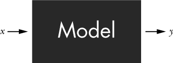

*图 4-1：机器学习模型，表示为黑箱*

在这个模型中，你将输入数据称为*特征*，并用变量*x*表示，它可以是一个数值或一个多维数值向量。然后，模型会进行处理并完成它的“魔法”，在经过一段时间后，你会得到预测结果*y*，这是模型基于输入特征所预测的输出。对于回归问题，预测结果由一个或多个数值组成——就像输入特征一样。

监督学习分为两个独立的阶段：训练阶段和推理阶段。

#### ***训练阶段***

在*训练阶段*，你将给模型提供一个特定输入*x*和你期望的输出*y’*。当模型输出预测结果*y*时，你会将其与*y’*进行比较，如果它们不相同，你就更新模型，以便生成一个更接近*y’*的输出，如图 4-2 所示。让我们看一个图像识别的例子。假设你训练一个模型，当给定图像（输入）时，预测水果名称（输出）。例如，你的训练输入是一个香蕉的图像，但模型错误地预测为*苹果*。由于你的期望输出与模型预测不同，你将调整模型，使得下次模型能正确预测*香蕉*。

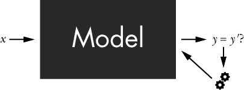

*图 4-2：机器学习模型的训练阶段*

当你不断向模型提供不同输入的期望输出并调整模型时，你就在使用*训练数据*训练模型。随着时间的推移，模型将学习你希望在某些输入下得到的输出。这就是为什么数据在 21 世纪如此重要：你的模型将与其训练数据一样好。没有好的训练数据，模型注定会失败。粗略地说，训练数据监督着机器学习过程。这就是我们将其称为*有监督学习*的原因。

#### ***推理阶段***

在*推理阶段*，你使用训练好的模型来预测新输入特征*x*的输出值。请注意，模型具有预测在训练数据中从未观察过的输入的输出的能力。例如，*训练阶段*中的水果预测模型现在可以识别它从未见过的图像中（在训练数据中学到的）水果名称。换句话说，合适的机器学习模型具备*概括能力*：它们利用训练数据中的经验来预测新输入的结果。粗略地说，能够良好概括的模型会为新输入数据产生准确的预测。对于未见过的输入数据的泛化预测是机器学习的一个强项，也是它在广泛应用中受欢迎的主要原因。

### **线性回归**

*线性回归*是你在初学者级别的机器学习教程中最常见的机器学习算法。它通常用于*回归问题*，其中模型通过使用现有的数据预测缺失的数据值。线性回归的一个显著优势是其简洁性，这对教师和用户都非常有利。但这并不意味着它不能解决实际问题！线性回归在市场研究、天文学和生物学等各个领域都有很多实际应用。在这一节中，你将学到开始使用线性回归所需的所有知识。

#### ***基础知识***

如何使用线性回归预测某一天的股价？在我回答这个问题之前，让我们先从一些定义开始。

每个机器学习模型都由模型参数组成。*模型参数*是从数据中估算出来的内部配置变量。这些模型参数决定了给定输入特征时，模型如何准确地计算预测值。对于线性回归，模型参数被称为*系数*。你可能还记得学校时学过的二维直线公式：*f(x)* = *ax* + *c*。这两个变量*a*和*c*就是线性方程*ax* + *c*中的系数。你可以描述每个输入*x*是如何转化为输出*f(x)*的，使得所有输出一起描述二维空间中的一条直线。通过改变系数，你可以描述二维空间中的任何一条直线。

给定输入特征*x*[1]、*x*[2]、...、*x**[k]*，线性回归模型将输入特征与系数*a*[1]、*a*[2]、...、*a**[k]*结合，通过使用该公式计算预测输出*y*：

*y* = *f*(*x*) = *a*[0] + *a*[1] × *x*[1] + *a*[2] × *x*[2] + ... + *a*[*k*] × *x*[*k*]

在我们的股价示例中，你有一个输入特征*x*，即日期。你输入日期*x*，期望得到股价，即输出*y*。这将线性回归模型简化为二维直线公式：

*y* = *f*(*x*) = *a*[0] + *a*[1]*x*

让我们看看在图 4-3 中，只改变两个模型参数*a*[0]和*a*[1]的三条直线。第一轴描述输入*x*，第二轴描述输出*y*。直线表示输入与输出之间的（线性）关系。

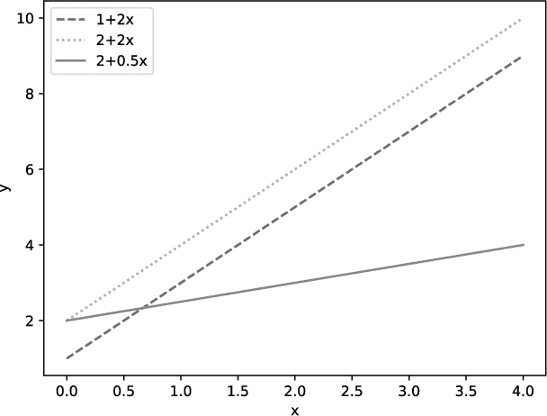

*图 4-3：由不同模型参数（系数）描述的三条线性回归模型（直线）。每条线代表输入与输出变量之间的独特关系。*

在我们的股价示例中，假设我们的训练数据是三天的索引`[0, 1, 2]`，与股价`[155, 156, 157]`相对应。换句话说：

+   输入`x=0`应导致输出`y=155`

+   输入`x=1`应导致输出`y=156`

+   输入`x=2`应导致输出`y=157`

现在，哪条直线最适合我们的训练数据？我在图 4-4 中绘制了训练数据。

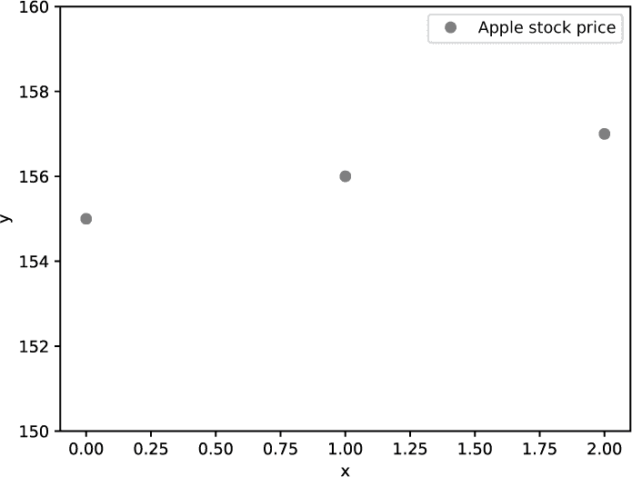

*图 4-4：我们的训练数据，其在数组中的索引作为*x*坐标，价格作为*y*坐标*

要找到最能描述数据的直线，从而创建线性回归模型，我们需要确定系数。这就是机器学习的作用所在。确定线性回归模型参数的主要方法有两种。首先，你可以通过解析方法计算出最佳拟合线，即通过这些数据点的直线（这是线性回归的标准方法）。其次，你可以尝试不同的模型，逐个对比标记样本数据，最终选择最合适的模型。无论如何，你通过一种叫做*误差最小化*的过程来确定“最佳”，在这个过程中，模型最小化预测模型值和理想输出之间的平方差（或选择能导致最小平方差的系数），从而选择误差最小的模型。

对于我们的数据，你得到的系数是*a*[0] = 155.0 和 *a*[1] = 1.0。然后你将它们代入我们的线性回归公式：

*y* = *f*(*x*) = *a*[0] + *a*[1]*x* = 155.0 + 1.0 × *x*

并且在同一坐标系中绘制直线和训练数据，如图 4-5 所示。

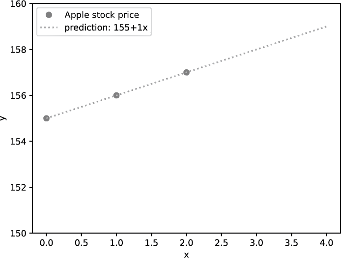

*图 4-5：使用我们的线性回归模型制作的预测线*

完美的拟合！线（模型预测）和训练数据之间的平方距离为零——因此你已经找到了最小化误差的模型。使用这个模型，你现在可以预测任何 *x* 值下的股票价格。例如，假设你想预测第 *x* 天 = 4 的股票价格。为了做到这一点，你只需使用模型计算 *f(x)* = 155.0 + 1.0 × 4 = 159.0。第 4 天的预测股票价格是 159 美元。当然，这个预测是否准确反映了现实世界是另一个问题。

这就是发生的高层次概览。让我们更仔细地看看如何用代码实现这一点。

#### ***代码***

清单 4-1 展示了如何用一行代码构建一个简单的线性回归模型（你可能需要先通过在命令行中运行`pip install sklearn`来安装 scikit-learn 库）。

```py
from sklearn.linear_model import LinearRegression

import numpy as np

## Data (Apple stock prices)

apple = np.array([155, 156, 157])

n = len(apple)

## One-liner

model = LinearRegression().fit(np.arange(n).reshape((n,1)), apple)

## Result & puzzle

print(model.predict([[3],[4]]))
```

*清单 4-1：一个简单的线性回归模型*

你能猜出这个代码片段的输出吗？

#### ***工作原理***

这个一行代码使用了两个 Python 库：NumPy 和 scikit-learn。前者是数值计算（如矩阵运算）的事实标准库，后者是最全面的机器学习库，包含了数百种机器学习算法和技术的实现。

你可能会问：“为什么在 Python 的一行代码中使用库？这不是作弊吗？”这是个好问题，答案是肯定的。任何 Python 程序——无论是否使用库——都使用了基于低级操作构建的高级功能。在可以重用现有代码库的情况下，重新发明轮子是没有太大意义的（也就是站在巨人的肩膀上）。有抱负的编码者往往有一种冲动，想要自己实现所有功能，但这会降低他们的编码生产力。在这本书中，我们将使用，而不是拒绝，世界上一些最优秀的 Python 编程者和先驱者实现的强大功能。这些库的每一个都经过了熟练的编码者多年的开发、优化和调整。

让我们一步步分析清单 4-1。首先，我们创建一个包含三个值的简单数据集，并将其长度存储在一个单独的变量 `n` 中，以便代码更加简洁。我们的数据是三天内的三次苹果股票价格。变量 `apple` 将这个数据集作为一维的 NumPy 数组保存。

其次，我们通过调用 `LinearRegression()` 来构建模型。那么模型的参数是什么呢？为了找到它们，我们调用 `fit()` 函数来训练模型。`fit()` 函数接受两个参数：训练数据的输入特征和这些输入的理想输出。我们的理想输出是苹果股票的实际股票价格。但是对于输入特征，`fit()` 需要一个以下格式的数组：

```py
[<training_data_1>,

<training_data_2>,

--snip--

<training_data_n>]
```

其中每个训练数据值都是一组特征值的序列：

```py
<training_data> = [feature_1, feature_2, ..., feature_k]
```

在我们的案例中，输入仅包含一个特征 *x*（当前日期）。此外，预测也仅包含一个值 *y*（当前股票价格）。为了将输入数组调整为正确的形状，你需要将其重塑为这种看起来奇怪的矩阵形式：

```py
[[0],

 [1],

 [2]]
```

只有一列的矩阵称为 *列向量*。你可以使用 `np.arange()` 创建一个递增的 *x* 值序列；然后使用 `reshape((n, 1))` 将一维的 NumPy 数组转换为一个具有一列和 `n` 行的二维数组（见 第三章）。请注意，scikit-learn 允许输出为一维数组（否则，你还需要重塑 `apple` 数据数组）。

一旦获得了训练数据和理想的输出，`fit()` 就会进行误差最小化：它会找到模型参数（这意味着*直线*），使得预测模型值与期望输出之间的差异最小。

当 `fit()` 对它的模型感到满意时，它会返回一个模型，你可以使用 `predict()` 函数预测两个新的股票值。`predict()` 函数与 `fit()` 函数有相同的输入要求，所以为了满足这些要求，你需要传入一个包含我们想要预测的两个新值的一列矩阵：

```py
print(model.predict([[3],[4]]))
```

由于我们的误差最小化为零，你应该得到完美的线性输出 158 和 159。这个结果很好地符合在 图 4-5 中绘制的拟合直线。但通常情况下，很难找到这样一个完美拟合的单一直线模型。例如，如果我们的股票价格是 `[157, 156, 159]`，然后你运行相同的函数并绘制它，你应该得到在 图 4-6 中的直线。

在这种情况下，`fit()` 函数会找到一条最小化训练数据和预测之间平方误差的直线，正如之前所描述的那样。

让我们总结一下。线性回归是一种机器学习技术，在这种技术中，模型通过学习系数作为模型参数来进行训练。得到的线性模型（例如二维空间中的一条直线）直接为你提供新的输入数据的预测值。当给定数值输入时，预测数值的问题属于回归问题的范畴。在下一节，你将学习机器学习中的另一个重要领域——分类。

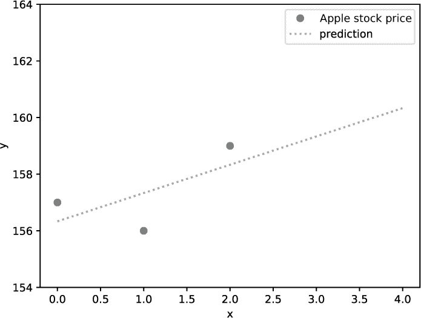

*图 4-6：一个拟合不完美的线性回归模型*

### **一行代码实现逻辑回归**

逻辑回归通常用于*分类问题*，在这些问题中，你预测一个样本是否属于某个特定的类别（或类）。这与回归问题不同，回归问题中给定一个样本并预测一个数值，该数值属于一个连续的范围。例如，一个分类问题是根据不同的输入特征（如*发帖频率*或*推文回复数*）将 Twitter 用户分为男性和女性。逻辑回归模型属于最基础的机器学习模型之一。本节中介绍的许多概念将构成更高级机器学习技术的基础。

#### ***基础知识***

为了介绍逻辑回归，我们先简要回顾一下线性回归是如何工作的：给定训练数据，你计算出一条拟合这些数据的直线，并预测输入 *x* 的结果。一般来说，线性回归非常适合预测*连续*输出，其值可以取无限多个数值。例如，之前预测的股价，理论上可以是任何正数值。

但如果输出不是连续的，而是*分类的*，属于有限数量的组或类别呢？例如，假设你想预测一个患者吸烟量与得肺癌的可能性。每个患者要么得肺癌，要么不。这与股价预测不同，这里只有两种可能的结果。预测分类结果的可能性是逻辑回归的主要动机。

##### **Sigmoid 函数**

而线性回归拟合训练数据中的一条直线，逻辑回归则拟合一条 S 形曲线，这条曲线称为*Sigmoid 函数*。S 形曲线帮助你做出二元决策（例如， 是/否）。对于大多数输入值，Sigmoid 函数的输出值要么非常接近 0（一个类别），要么非常接近 1（另一个类别）。在实际应用中，很少会有输入值生成模糊的输出。请注意，虽然对于某些输入值，可能会生成 0.5 的概率值，但曲线的形状设计上是为了最小化这种情况（对于横轴上的大多数可能值，概率值要么非常接近 0，要么非常接近 1）。图 4-7 展示了肺癌情景下的逻辑回归曲线。

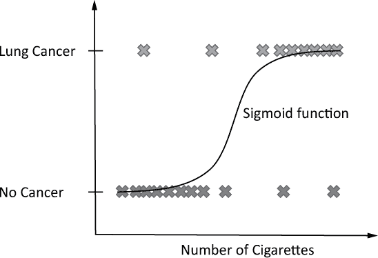

*图 4-7：基于吸烟量预测癌症的逻辑回归曲线*

**注意**

*你可以应用逻辑回归进行* 多项分类 *，将数据分类为两个以上的类别。为此，你将使用 sigmoid 函数的推广版本，称为* softmax 函数，* 它返回一个包含每个类别概率的元组。Sigmoid 函数将输入特征转换为单一的概率值。然而，为了清晰和可读性，我将在本节中重点讨论* 二项分类 *和 sigmoid 函数。*

图 4-7 中的 sigmoid 函数近似了一个病人是否患有肺癌的概率，给定他吸烟的数量。当你唯一掌握的信息是病人的吸烟量时，这个概率帮助你做出更有依据的决策：病人是否患有肺癌？

看一下图 4-8 中的预测，它展示了两个新病人（图表底部的浅灰色部分）。你对他们一无所知，只知道他们的吸烟数量。你已经训练了我们的逻辑回归模型（sigmoid 函数），它会根据任何新的输入值 *x* 返回一个概率值。如果 sigmoid 函数给出的概率超过 50%，模型预测为*肺癌阳性*；否则，它预测为*肺癌阴性*。

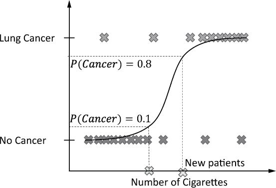

*图 4-8：使用逻辑回归估算结果的概率*

##### **寻找最大似然模型**

逻辑回归的主要问题是如何选择最佳拟合训练数据的正确 sigmoid 函数。答案在于每个模型的*似然性*：即模型生成观察到的训练数据的概率。你想选择具有最大似然性的模型。你的直觉是，该模型最好地近似了生成训练数据的真实世界过程。

要计算给定模型在一组训练数据上的似然性，你需要计算每一个单独训练数据点的似然性，然后将这些似然性相乘，得到整个训练数据集的似然性。如何计算单个训练数据点的似然性？只需将该模型的 sigmoid 函数应用于该训练数据点；它会给出该数据点在此模型下的概率。为了选择对所有数据点具有最大似然的模型，你需要对不同的 sigmoid 函数重复相同的似然性计算（稍微调整一下 sigmoid 函数），如图 4-9 所示。

在前一段中，我描述了如何确定最大似然的 sigmoid 函数（模型）。这个 sigmoid 函数最能拟合数据——因此，你可以用它来预测新的数据点。

现在我们已经讨论了理论，让我们看看如何将逻辑回归实现为一行 Python 代码。

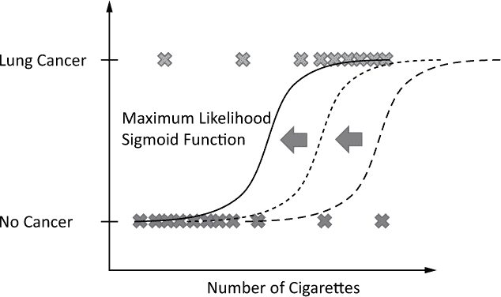

*图 4-9：测试多个 sigmoid 函数以确定最大似然性*

#### ***代码***

你已经看到过一个健康应用程序的逻辑回归示例（将吸烟量与癌症概率相关联）。这个“虚拟医生”应用程序将是一个非常棒的智能手机应用程序创意，不是吗？让我们使用逻辑回归编写你的第一个虚拟医生，代码如清单 4-2 所示——仅需一行 Python 代码！

```py
from sklearn.linear_model import LogisticRegression

import numpy as np

## Data (#cigarettes, cancer)

X = np.array([[0, "No"],

              [10, "No"],

              [60, "Yes"],

              [90, "Yes"]])

## One-liner

model = LogisticRegression().fit(X[:,0].reshape(n,1), X[:,1])

## Result & puzzle

print(model.predict([[2],[12],[13],[40],[90]]))
```

*清单 4-2：一个逻辑回归模型*

猜猜看：这段代码的输出结果是什么？

#### ***工作原理***

训练数据`X`包含四条患者记录（行），每条记录有两列。第一列是患者吸烟的数量（*输入特征*），第二列是*类别标签*，表示他们是否最终患上了肺癌。

你通过调用`LogisticRegression()`构造函数来创建模型。你在该模型上调用`fit()`函数；`fit()`函数接受两个参数，分别是输入（吸烟量）和输出的类别标签（癌症）。`fit()`函数期望输入是一个二维数组格式，其中每一行代表一个训练数据样本，每一列代表该样本的一个特征。在此案例中，你只有一个特征值，因此你通过使用`reshape()`操作将一维输入转换为二维 NumPy 数组。`reshape()`的第一个参数指定行数，第二个参数指定列数。你只关心列数，这里是`1`。你将传递`-1`作为期望的行数，这意味着 NumPy 会自动决定行数。

经过调整形状后的输入训练数据如下所示（本质上，你只是去除了类别标签，保持了二维数组的形状）：

```py
[[0],

 [10],

 [60],

 [90]]
```

接下来，你需要根据患者吸烟的数量预测他们是否患有肺癌：输入的数据为 2、12、13、40、90 支香烟。输出结果如下：

```py
# ['No' 'No' 'Yes' 'Yes' 'Yes']
```

模型预测前两位患者为肺癌阴性，而后面三位患者为肺癌阳性。

让我们详细看看 sigmoid 函数计算出的概率，看看是如何得出这个预测的！只需在清单 4-2 之后运行以下代码片段：

```py
for i in range(20):

    print("x=" + str(i) + " --> " + str(model.predict_proba([[i]])))
```

`predict_proba()`函数接受香烟数量作为输入，并返回一个数组，其中包含肺癌阴性的概率（索引 0）和肺癌阳性的概率（索引 1）。当你运行此代码时，你应该得到如下输出：

```py
x=0 --> [[0.67240789 0.32759211]]

x=1 --> [[0.65961501 0.34038499]]

x=2 --> [[0.64658514 0.35341486]]

x=3 --> [[0.63333374 0.36666626]]

x=4 --> [[0.61987758 0.38012242]]

x=5 --> [[0.60623463 0.39376537]]

x=6 --> [[0.59242397 0.40757603]]

x=7 --> [[0.57846573 0.42153427]]

x=8 --> [[0.56438097 0.43561903]]

x=9 --> [[0.55019154 0.44980846]]

x=10 --> [[0.53591997 0.46408003]]

x=11 --> [[0.52158933 0.47841067]]

x=12 --> [[0.50722306 0.49277694]]

x=13 --> [[0.49284485 0.50715515]]

x=14 --> [[0.47847846 0.52152154]]

x=15 --> [[0.46414759 0.53585241]]

x=16 --> [[0.44987569 0.55012431]]

x=17 --> [[0.43568582 0.56431418]]

x=18 --> [[0.42160051 0.57839949]]

x=19 --> [[0.40764163 0.59235837]]
```

如果肺癌为负的概率大于肺癌为正的概率，那么预测结果将是*肺癌阴性*。这发生在`x=12`时。如果患者吸烟超过 12 支香烟，算法将把他们分类为*肺癌阳性*。

总结来说，你已经学会了如何使用 scikit-learn 库轻松地用逻辑回归进行问题分类。逻辑回归的思想是将一个 S 形曲线（即 sigmoid 函数）拟合到数据上。这个函数为每个新数据点和每个可能的类别分配一个介于 0 和 1 之间的数值。这个数值表示该数据点属于给定类别的概率。然而，在实际应用中，你通常会有训练数据，但没有为训练数据分配类别标签。例如，你有客户数据（比如他们的年龄和收入），但你不知道每个数据点的类别标签。为了从这种数据中提取有用的见解，接下来你将学习另一类机器学习：无监督学习。具体来说，你将学习如何找到相似的数据点聚类，这是无监督学习的一个重要子集。

### **K-均值聚类的一行代码**

如果有一个聚类算法是你必须了解的，无论你是计算机科学家、数据科学家，还是机器学习专家，那就是*K-均值算法*。在本节中，你将学习其基本概念，并且通过一行 Python 代码来了解何时以及如何使用它。

#### ***基础知识***

前面的章节讲解了有监督学习，在这种学习中，训练数据是*标注过的*。换句话说，你知道训练数据中每个输入值的输出值。但在实际应用中，情况并非总是如此。你常常会遇到*未标注*的数据，尤其是在许多数据分析应用中，这些数据无法明确说明“最优输出”是什么意思。在这种情况下，预测是不可能的（因为没有输出值可供参考），但你仍然可以从这些未标注的数据集中提取有用的知识（例如，找到相似的未标注数据聚类）。使用未标注数据的模型属于*无监督学习*的范畴。

例如，假设你在一家初创公司工作，该公司为不同目标市场提供服务，目标市场的收入水平和年龄各不相同。你的老板告诉你，找出最符合目标市场的若干目标人物。你可以使用聚类方法来识别公司服务的*平均客户画像*。图 4-10 展示了一个示例。

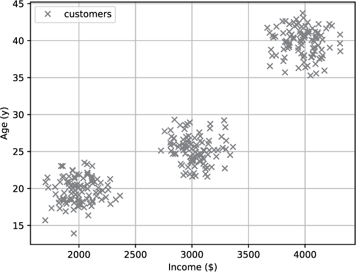

*图 4-10：二维空间中观察到的客户数据*

在这里，你可以轻松地识别出三种不同类型的画像，它们的收入和年龄各不相同。但如何通过算法来找到这些呢？这就是聚类算法的应用领域，比如广泛使用的 K-均值算法。给定数据集和一个整数*k*，K-均值算法会找到*k*个数据聚类，使得每个聚类的中心（称为*质心*）与该聚类中的数据点之间的差异最小。换句话说，你可以通过对数据集运行 K-均值算法来找到不同的目标画像，如图 4-11 所示。

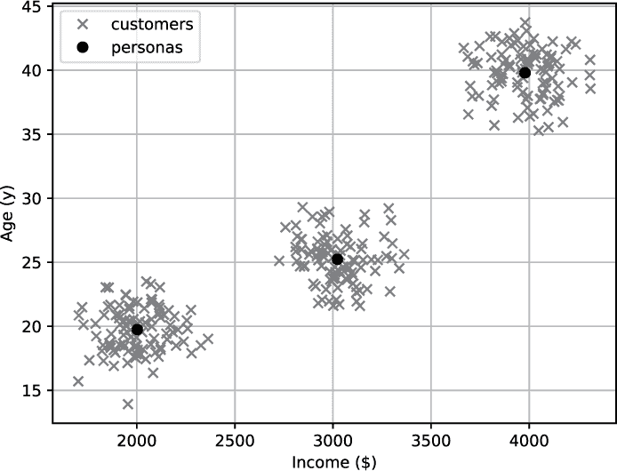

*图 4-11：具有客户画像（聚类中心）的客户数据在二维空间中的分布*

聚类中心（黑点）与聚类后的客户数据相匹配。每个聚类中心可以视为一个客户画像。因此，你有三个理想化的画像：一个 20 岁的员工赚 $2000，一个 25 岁的员工赚 $3000，和一个 40 岁的员工赚 $4000。最棒的是，K-Means 算法甚至可以在高维空间中找到这些聚类中心（在这些空间中，人类很难通过视觉找到这些画像）。

K-Means 算法需要“聚类中心的数量 *k*”作为输入。在这种情况下，你观察数据并“神奇地”定义 *k* = 3。更高级的算法可以自动找到聚类中心的数量（例如，可以参考 Greg Hamerly 和 Charles Elkan 在 2004 年的论文《Learning the k in K-Means》）。

那么 K-Means 算法是如何工作的呢？简而言之，它执行以下步骤：

```py
Initialize random cluster centers (centroids).

Repeat until convergence

    Assign every data point to its closest cluster center.

Recompute each cluster center as the centroid of all data points assigned to it.
```

这将导致多个循环迭代：首先，你将数据分配到 *k* 个聚类中心，然后重新计算每个聚类中心，作为分配给它的数据的质心。

让我们实现它吧！

考虑以下问题：给定二维薪资数据（*工作小时数*，*薪资收入*），在给定数据集中找到两个工作时长相似且薪资相似的员工聚类。

#### ***代码***

如何在一行代码中完成这一切？幸运的是，Python 中的 scikit-learn 库已经高效地实现了 K-Means 算法。清单 4-3 显示了运行 K-Means 聚类的一行代码。

```py
## Dependencies

from sklearn.cluster import KMeans

import numpy as np

## Data (Work (h) / Salary ($))

X = np.array([[35, 7000], [45, 6900], [70, 7100],

              [20, 2000], [25, 2200], [15, 1800]])

## One-liner

kmeans = KMeans(n_clusters=2).fit(X)

## Result & puzzle

cc = kmeans.cluster_centers_

print(cc)
```

*清单 4-3：一行代码实现 K-Means 聚类*

这段代码的输出是什么？即使你不理解每个语法细节，也试着猜出一个解决方案。这将帮助你发现知识空白，并为大脑更好地吸收算法做准备。

#### ***原理***

在前几行中，你从 `sklearn.cluster` 包中导入了 `KMeans` 模块。这个模块负责执行聚类操作。你还需要导入 NumPy 库，因为 `KMeans` 模块是基于 NumPy 数组工作的。

我们的数据是二维的。它将工作小时数与一些工人的薪资进行了关联。图 4-12 显示了这个员工数据集中的六个数据点。

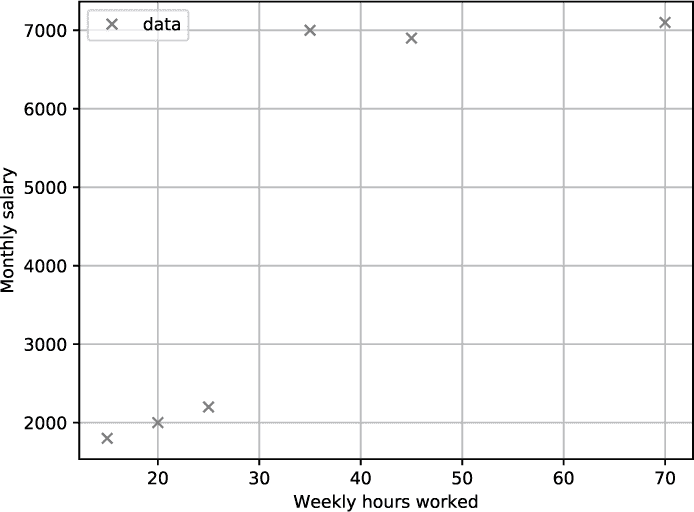

*图 4-12：员工薪资数据*

目标是找到两个最适合这些数据的聚类中心：

```py
## One-liner

kmeans = KMeans(n_clusters=2).fit(X)
```

在这行代码中，你创建了一个新的 `KMeans` 对象，负责为你处理算法。当你创建 `KMeans` 对象时，通过使用 `n_clusters` 函数参数来定义聚类中心的数量。然后你只需调用实例方法 `fit(X)` 来对输入数据 `X` 运行 K-Means 算法。此时，`KMeans` 对象将保存所有结果。剩下的就是从其属性中获取结果：

```py
cc = kmeans.cluster_centers_

print(cc)
```

请注意，在 `sklearn` 包中，约定使用尾部下划线来表示一些属性名称（例如，`cluster_centers_`），以表明这些属性是在训练阶段动态生成的（即 `fit()` 函数）。在训练阶段之前，这些属性并不存在。这并不是 Python 的通用约定（尾部下划线通常仅用于避免与 Python 关键字的命名冲突——例如，使用 `variable list_` 而不是 `list`）。然而，如果你习惯了这种方式，你会更欣赏 `sklearn` 包中属性的一致性。那么，聚类中心是什么？这段代码片段的输出是什么？请看 图 4-13。

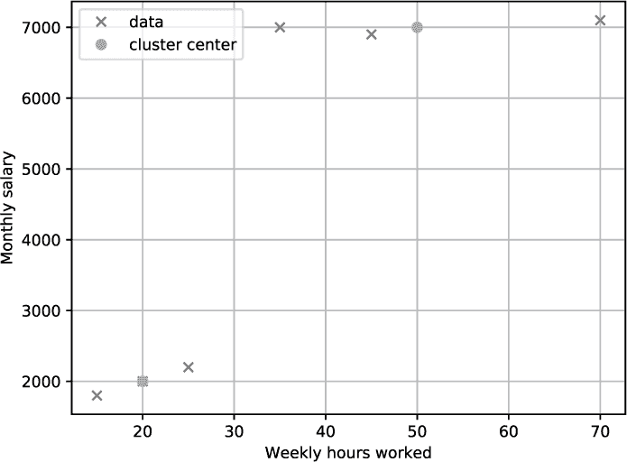

*图 4-13：员工薪资数据和二维空间中的聚类中心*

你可以看到，两个聚类中心分别是 (20, 2000) 和 (50, 7000)。这也是 Python 一行代码的结果。这些聚类对应着两种理想化的员工角色：第一个每周工作 20 小时，月薪 2000 美元；而第二个每周工作 50 小时，月薪 7000 美元。这两种角色合理地符合了数据。因此，这段一行代码的结果如下：

```py
## Result & puzzle

cc = kmeans.cluster_centers_

print(cc)

'''

[[  50\. 7000.]

 [  20\. 2000.]]

'''
```

总结一下，本节介绍了无监督学习中的一个重要子主题：聚类。K-Means 算法是一种简单、高效且广泛使用的方法，可以从多维数据中提取 *k* 个聚类。在背后，算法会反复计算聚类中心，并将每个数据值分配给其最近的聚类中心，直到找到最优的聚类。但聚类并不总是适合找到相似的数据项。许多数据集并不表现出聚类行为，但你仍然希望利用距离信息进行机器学习和预测。让我们继续留在多维空间，探索另一种利用（欧几里得）数据值距离的方法：K-最近邻算法。

### **K-最近邻算法一行代码实现**

流行的 *K-最近邻算法*（*KNN*）广泛应用于回归和分类任务，涉及推荐系统、图像分类和金融数据预测等多个领域。它是许多高级机器学习技术的基础（例如，信息检索中的应用）。毫无疑问，理解 KNN 是你掌握计算机科学教育中重要组成部分的基石。

#### ***基础知识***

KNN 算法是一种稳健、直接且流行的机器学习方法。它易于实现，但仍然是一种具有竞争力且快速的机器学习技术。我们迄今讨论的所有其他机器学习模型都使用训练数据来计算原始数据的*表示*。你可以使用这种表示来预测、分类或聚类新数据。例如，线性回归和逻辑回归算法定义学习参数，而聚类算法则根据训练数据计算聚类中心。然而，KNN 算法不同。与其他方法相比，它不会计算新的模型（或表示），而是将*整个数据集*作为模型。

是的，你没看错。机器学习模型不过是一组观察结果。你的训练数据中的每一个实例都是你模型的一部分。这有优点也有缺点。一个缺点是，随着训练数据的增长，模型可能迅速膨胀——这可能需要在预处理步骤中进行采样或过滤。然而，一个很大的优点是训练阶段的简单性（只需将新数据值添加到模型中）。此外，你还可以使用 KNN 算法进行预测或分类。给定输入向量*x*，你执行以下策略：

1.  找到*x*的*k*个最近邻（根据预定义的距离度量）。

1.  将*k*个最近邻聚合成一个单一的预测或分类值。你可以使用任何聚合函数，比如平均值、均值、最大值或最小值。

让我们通过一个例子来说明。你的公司为客户销售房屋，已收集了大量客户和房价数据库（参见图 4-14）。有一天，客户问你 52 平方米的房子大概多少钱。你查询 KNN 模型，它立即给出答案 $33,167。事实上，客户在同一周就找到了一套价格为 $33,489 的房子。KNN 系统是如何做出这个惊人准确的预测的？

首先，KNN 系统简单地使用欧几里得距离计算查询 *D = 52 平方米* 的*k = 3* 个最近邻。三个最近邻分别是 A、B 和 C，价格分别为 $34,000、$33,500 和 $32,000。然后，它通过计算这些值的简单平均值来聚合这三个最近邻。由于本例中 *k = 3*，你将模型表示为*3NN*。当然，你可以改变相似度函数、参数*k*以及聚合方法，以便得出更复杂的预测模型。

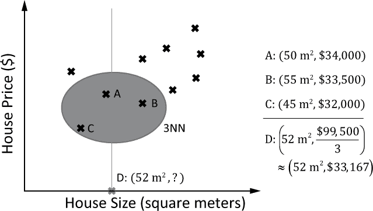

*图 4-14：根据三个最近邻 A、B 和 C 计算房子 D 的价格*

KNN 的另一个优点是，当有新观察数据时，它可以轻松适应。这对于大多数机器学习模型来说并不常见。在这方面的明显弱点是，随着你增加更多的数据点，寻找 *k* 个最近邻的计算复杂度会越来越高。为了适应这一点，你可以不断从模型中移除过时的值。

如我之前提到的，你也可以使用 KNN 解决分类问题。你可以使用投票机制：每个最近邻对它的类别进行投票，得票最多的类别获胜，而不是对 *k* 个最近邻的平均值进行计算。

#### ***代码***

让我们深入了解如何在 Python 中使用 KNN——用一行代码来实现（见清单 4-4）。

```py
## Dependencies

from sklearn.neighbors import KNeighborsRegressor

import numpy as np

## Data (House Size (square meters) / House Price ($))

X = np.array([[35, 30000], [45, 45000], [40, 50000],

              [35, 35000], [25, 32500], [40, 40000]])

## One-liner

KNN = KNeighborsRegressor(n_neighbors=3).fit(X[:,0].reshape(-1,1), X[:,1])

## Result & puzzle

res = KNN.predict([[30]])

print(res)
```

*清单 4-4：在一行 Python 代码中运行 KNN 算法*

猜猜看：这段代码的输出是什么？

#### ***工作原理***

为了帮助你查看结果，让我们在图 4-15 中绘制来自这段代码的住房数据。

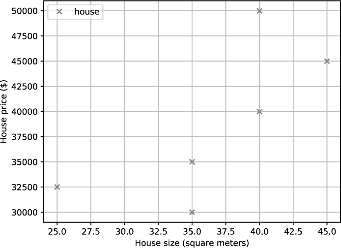

*图 4-15：二维空间中的住房数据*

你能看到一般趋势吗？随着房屋面积的增加，你可以预期它的市场价格会呈线性增长。将面积翻倍，价格也会翻倍。

在代码中（见清单 4-4），客户端请求你预测一栋 30 平方米房屋的价格。使用 *k = 3* 的 KNN（简称 3NN）预测结果如何？看看图 4-16。

漂亮吧？KNN 算法找到三个与房屋大小最接近的房子，并将预测的房价作为 *k=3* 个最近邻的平均值。因此，结果是 $32,500。

如果你对这行代码中的数据转换感到困惑，让我快速解释一下这里发生了什么：

```py
KNN = KNeighborsRegressor(n_neighbors=3).fit(X[:,0].reshape(-1,1), X[:,1])
```

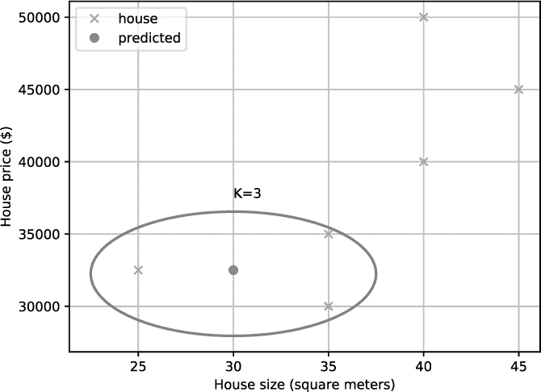

*图 4-16：二维空间中的住房数据，使用 KNN 预测新数据点（房屋面积为 30 平方米）的房价*

首先，你创建一个新的机器学习模型，叫做 `KNeighborsRegressor`。如果你想用 KNN 解决分类问题，则使用 `KNeighborsClassifier`。

其次，你通过使用 `fit()` 函数并传入两个参数来训练模型。第一个参数定义输入（房屋大小），第二个参数定义输出（房屋价格）。这两个参数的形状必须是类似数组的数据结构。例如，要使用 `30` 作为输入，你必须将其传递为 `[30]`。原因是，通常情况下，输入可以是多维的，而不仅仅是一维的。因此，你需要重塑输入：

```py
print(X[:,0])

"[35 45 40 35 25 40]"

print(X[:,0].reshape(-1,1))

"""

[[35]

 [45]

 [40]

 [35]

 [25]

 [40]]

"""
```

请注意，如果你将这个 1D 的 NumPy 数组作为 `fit()` 函数的输入，函数将无法工作，因为它期望的是一个类似数组的观察数据结构，而不是一个整数数组。

总结一下，这行代码教你如何在一行代码中创建第一个 KNN 回归器。如果你有大量变化的数据和模型更新，KNN 是你最好的朋友！接下来，我们将讨论目前非常流行的一个机器学习模型：神经网络。

### **一行代码中的神经网络分析**

神经网络在近年来获得了广泛的流行。这部分归功于该领域的算法和学习技术的改进，但也得益于硬件的提升和通用 GPU（GPGPU）技术的兴起。在这一部分，你将学习到*多层感知器*（*MLP*），它是最流行的神经网络表示之一。阅读完这部分后，你将能够用一行 Python 代码编写自己的神经网络！

#### ***基础知识***

对于这一行代码，我准备了一个与我的 Python 同事在电子邮件列表上共同参与的数据集。我的目标是创建一个有相关性的真实世界数据集，所以我请我的电子邮件订阅者参与了这章的数据生成实验。

##### **数据**

如果你正在阅读这本书，你一定有学习 Python 的兴趣。为了创建一个有趣的数据集，我请我的电子邮件订阅者就他们的 Python 专业知识和收入回答了六个匿名问题。这些问题的回答将作为简单神经网络示例的训练数据（作为 Python 一行代码）。

训练数据基于以下六个问题的答案：

+   过去七天里，你一共看了多少小时的 Python 代码？

+   你从几年前开始学习计算机科学的？

+   你书架上有多少本编程书？

+   你在 Python 时间中有多少百分比是用于处理真实世界的项目？

+   你每月通过销售技术技能（广义上的技术）赚取多少收入（四舍五入到 1000 美元）？

+   你大约的 Finxter 评分是多少，四舍五入到 100 分？

前五个问题将作为你的输入，第六个问题将作为神经网络分析的输出。在这一行代码部分，你将分析神经网络回归。换句话说，你根据数字输入特征预测一个数值（你的 Python 技能）。本书中我们不会探讨神经网络分类，这是神经网络的另一个重要优势。

第六个问题大致反映了 Python 编程者的技能水平。Finxter（[*https://finxter.com/*](https://finxter.com/)）是我们的基于谜题的学习应用，它根据 Python 编程者在解决 Python 谜题中的表现，分配一个评分值给每个 Python 编码者。通过这种方式，它帮助你量化自己的 Python 技能水平。

让我们从可视化每个问题如何影响输出（即 Python 开发者的技能评分）开始，如图 4-17 所示。

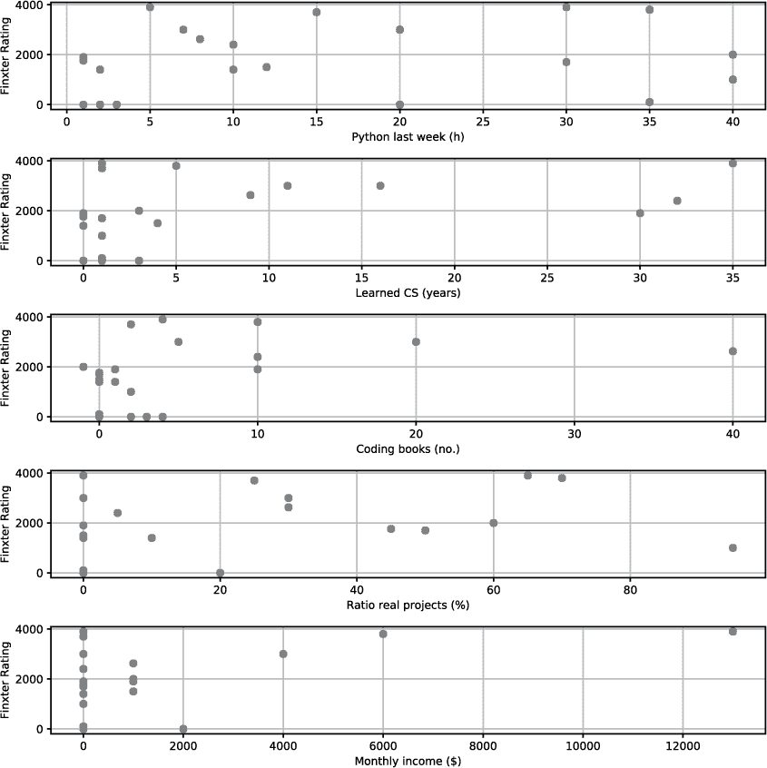

*图 4-17：问卷答案与 Python 技能评分之间的关系*

请注意，这些图表仅展示了每个单独特征（问题）如何影响最终的 Finxter 评分，但它们并没有告诉你两个或更多特征组合的影响。此外，还要注意，一些 Python 爱好者并没有回答所有六个问题；在这些情况下，我使用了虚拟值 `-1`。

##### **什么是人工神经网络？**

创建人脑（生物神经网络）理论模型的想法在近几十年得到了广泛研究。但人工神经网络的基础理论早在 1940 年代和 1950 年代就已经提出！从那时起，人工神经网络的概念不断被改进和完善。

基本思路是将学习和推理的大任务分解为多个微任务。这些微任务不是独立的，而是相互依赖的。大脑由数十亿个神经元组成，这些神经元通过数万亿个突触连接。在简化模型中，学习仅仅是调整突触的*强度*（在人工神经网络中也称为*权重*或*参数*）。那么，如何在模型中“创建”一个新的突触呢？很简单——你将其权重从零增加到非零值。

图 4-18 展示了一个基本的神经网络，包含三个层次（输入层、隐藏层、输出层）。每一层由多个神经元组成，神经元从输入层通过隐藏层连接到输出层。

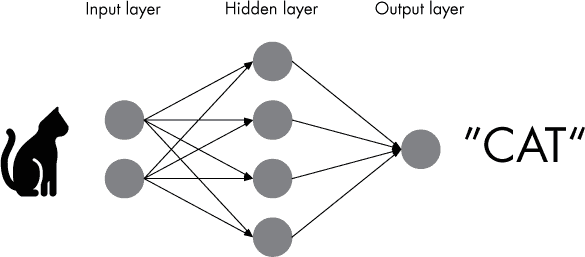

*图 4-18：一种用于动物分类的简单神经网络分析*

在这个例子中，神经网络被训练用来检测图像中的动物。实际上，你会为图像的每个像素使用一个输入神经元作为输入层。这可能导致数百万个输入神经元与数百万个隐藏神经元相连接。通常，每个输出神经元负责整个输出的一位。例如，要检测两种不同的动物（例如，猫和狗），你只会在输出层使用一个神经元来表示两种不同的状态（`0=猫`，`1=狗`）。

这个思想是，每个神经元在接收到某个输入脉冲时可以被激活，或者“发射”。每个神经元根据输入脉冲的强度独立决定是否发射。通过这种方式，你模拟了人脑中神经元通过脉冲相互激活的过程。输入神经元的激活通过网络传播，直到到达输出神经元。一些输出神经元会被激活，而其他则不会。输出神经元的发射模式形成了你人工神经网络的最终输出（或预测）。在你的模型中，激活的输出神经元可以表示 1，而未激活的输出神经元可以表示 0。通过这种方式，你可以训练你的神经网络来预测任何可以用一系列 0 和 1 表示的事物（即计算机能表示的任何事物）。

让我们详细了解神经元如何在数学上工作，参见图 4-19。


*图 4-19：单个神经元的数学模型：输出是三个输入的函数。*

每个神经元都与其他神经元相连，但并非所有连接都相等。相反，每个连接都有一个相关的权重。严格来说，一个激活的神经元会向外部邻居传播一个值为 1 的脉冲，而一个非激活的神经元则传播一个值为 0 的脉冲。你可以将权重视为表示激活输入神经元的脉冲通过连接传递给目标神经元的程度。数学上，你将脉冲乘以连接的权重来计算下一个神经元的输入。在我们的示例中，神经元简单地对所有输入进行求和来计算其自身的输出。这就是*激活函数*，它描述了神经元的输入如何生成输出。在我们的示例中，如果相关的输入神经元也被激活，那么神经元激活的可能性就会更高。这就是脉冲如何在神经网络中传播的方式。

学习算法是做什么的？它使用训练数据来选择神经网络的权重 *w*。给定一个训练输入值 *x*，不同的权重 *w* 会导致不同的输出。因此，学习算法会逐步调整权重 *w*——在多次迭代中——直到输出层产生与训练数据相似的结果。换句话说，训练算法逐渐减少正确预测训练数据的误差。

网络结构、训练算法和激活函数有很多种。本章将向你展示如何在一行代码中使用神经网络的实用方法。然后，你可以根据需要深入学习更详细的内容（例如，你可以从阅读维基百科上的“神经网络”条目开始，[*https://en.wikipedia.org/wiki/Neural_network*](https://en.wikipedia.org/wiki/Neural_network)）。

#### ***代码***

目标是创建一个神经网络，通过使用五个输入特征（对问题的回答）来预测 Python 技能水平（Finxter 评分）：

**`周`** 在过去七天里，你接触 Python 代码的小时数是多少？

**`年`** 你是什么时候开始学习计算机科学的？

**`书籍`** 你的书架上有多少本编程书？

**`项目`** 你花费多少百分比的 Python 时间来实现现实世界的项目？

**`收入`** 你每月通过销售你的技术技能（广义上讲）赚多少钱（以 $1000 为单位）？

再次让我们站在巨人的肩膀上，使用 scikit-learn (`sklearn`) 库进行神经网络回归，就像在清单 4-5 中一样。

```py
## Dependencies

from sklearn.neural_network import MLPRegressor

import numpy as np

## Questionaire data (WEEK, YEARS, BOOKS, PROJECTS, EARN, RATING)

X = np.array(

    [[20,  11,  20,  30,  4000,  3000], 

     [12,   4,   0,   0, 1000,  1500],

     [2,   0,   1,  10,   0,  1400],

     [35,   5,  10,  70,  6000,  3800],

     [30,   1,   4,  65,   0,  3900],

     [35,   1,   0,   0,   0, 100],

     [15,   1,   2,  25,   0,  3700],

     [40,   3,  -1,  60,  1000,  2000],

     [40,   1,   2,  95,   0,  1000],

     [10,   0,   0,   0,   0,  1400],

     [30,   1,   0,  50,   0,  1700],

     [1,   0,   0,  45,   0,  1762],

     [10,  32,  10,   5,   0,  2400],

     [5,  35,   4,   0, 13000,  3900],

     [8,   9,  40,  30,  1000,  2625],

     [1,   0,   1,   0,   0,  1900],

     [1,  30,  10,   0,  1000,  1900],

     [7,  16,   5,   0,   0,  3000]])

## One-liner

neural_net = MLPRegressor(max_iter=10000).fit(X[:,:-1], X[:,-1])

## Result

res = neural_net.predict([[0, 0, 0, 0, 0]])

print(res)
```

*清单 4-5：用一行代码进行神经网络分析*

人类是不可能正确地计算出输出的——但你想试试吗？

#### ***工作原理***

在前几行，你创建了数据集。scikit-learn 库中的机器学习算法使用类似的输入格式。每一行是一个单独的观测值，包含多个特征。行数越多，训练数据就越多；列数越多，每个观测值的特征就越多。在这种情况下，你的输入有五个特征，每个训练数据的输出只有一个特征。

这个一行代码通过使用`MLPRegressor`类的构造函数创建了一个神经网络。我传递了`max_iter=10000`作为参数，因为在使用默认的迭代次数（`max_iter=200`）时，训练无法收敛。

之后，你调用`fit()`函数，它决定了神经网络的参数。调用`fit()`后，神经网络已经成功初始化。`fit()`函数接收一个多维输入数组（每行一个观测值，每列一个特征）和一个一维输出数组（大小 = 观测值的数量）。

剩下的就是在一些输入值上调用预测函数：

```py
## Result

res = neural_net.predict([[0, 0, 0, 0, 0]])

print(res)

# [94.94925927]
```

请注意，由于该函数的非确定性特性以及不同的收敛行为，实际输出可能会略有不同。

用简单的英语来说：如果 . . .

+   . . . 你在过去一周没有进行任何训练，

+   . . . 你从零年前开始学习计算机科学，

+   . . . 你书架上没有任何 Python 编程书籍，

+   . . . 你把 0%的时间用来实现真正的 Python 项目，并且

+   . . . 你通过出售编程技能赚取了$0，

神经网络估计你的技能水平是*非常*低（Finxter 评分 94 意味着你在理解 Python 程序`print("hello, world")`时有困难）。

那么让我们来改变这一点：如果你每周投入 20 小时进行学习，并在一周后重新审视神经网络，会发生什么呢：

```py
## Result

res = neural_net.predict([[20, 0, 0, 0, 0]])

print(res)

# [440.40167562]
```

不错——你的技能进步了不少！但你对这个评分还是不满意吧？（一个高于平均水平的 Python 程序员在 Finxter 上的评分至少是 1500–1700。）

没问题。买 10 本 Python 书（这本买完后就剩下 9 本）。让我们看看你的评分会发生什么变化：

```py
## Result

res = neural_net.predict([[20, 0, 10, 0, 0]])

print(res)

# [953.6317602]
```

再次，你取得了显著进展，并且将你的评分翻倍！但仅仅买 Python 书籍并不会帮到你太多。你需要学习它们！我们来做一年：

```py
## Result

res = neural_net.predict([[20, 1, 10, 0, 0]])

print(res)

# [999.94308353]
```

并没有发生太多事情。这是我对神经网络不太信任的地方。在我看来，你本应该达到更好的表现，至少 1500 的评分。但这也说明了，神经网络的表现仅能依赖于其训练数据。你有的数据非常有限，神经网络无法突破这个限制：数据点太少，知识量太少。

但你不会放弃，对吧？接下来，你将 50%的 Python 时间用来作为 Python 自由职业者出售你的技能：

```py
## Result

res = neural_net.predict([[20, 1, 10, 50, 1000]])

print(res)

# [1960.7595547]
```

哇！突然间，神经网络认为你是一个专家级的 Python 编程者。的确，神经网络做出了明智的预测！学习 Python 至少一年并做一些实际项目，你就会成为一个优秀的程序员。

总结一下，你已经了解了神经网络的基础知识，以及如何通过一行 Python 代码使用它们。有趣的是，问卷调查数据显示，开始时做一些实际项目——甚至从一开始就做自由职业项目——对你的学习成功非常重要。神经网络显然知道这一点。如果你想了解我成为自由职业者的确切策略，可以参加[*https://blog.finxter.com/webinar-freelancer/*](https://blog.finxter.com/webinar-freelancer/)的免费网络研讨会。

在下一节中，你将更深入地了解另一种强大的模型表示方法：决策树。虽然神经网络的训练可能非常昂贵（它们通常需要多台机器和很多小时，有时甚至几周的时间来训练），但决策树则相对轻量。然而，它们是从训练数据中提取模式的快速而有效的方式。

### **一行代码实现决策树学习**

*决策树*是机器学习工具箱中强大而直观的工具。决策树的一个大优点是，与许多其他机器学习技术不同，它们是人类可读的。你可以轻松地训练一个决策树并展示给你的主管，他们无需了解机器学习的任何内容就能理解你的模型是如何工作的。这对于经常需要为自己的结果向管理层辩护和展示的资料科学家来说尤为重要。在本节中，我将向你展示如何通过一行 Python 代码使用决策树。

#### ***基础知识***

与许多机器学习算法不同，决策树背后的思想可能源于你自己的经验。它们代表了一种有结构的决策方式。每一个决策都会打开新的分支。通过回答一系列问题，最终你会得出推荐的结果。图 4-20 展示了一个例子。

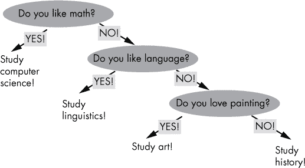

*图 4-20：一个简化的决策树，用于推荐学习科目*

决策树用于分类问题，比如“根据我的兴趣，我应该学习哪个科目？”你从顶部开始，然后反复回答问题并选择最能描述你特征的选项。最终，你会到达树的*叶节点*，一个没有*子节点*的节点。这就是基于你选择的特征推荐的类别。

决策树学习有许多微妙之处。在前面的示例中，第一个问题比最后一个问题更重要。如果您喜欢数学，决策树将永远不会推荐艺术或语言学。这很有用，因为某些特征对分类决策可能比其他特征重要得多。例如，一个预测您当前健康状况的分类系统可能使用您的性别（特征）来实际上排除许多疾病（类别）。

因此，决策节点的顺序有助于性能优化：将对最终分类影响较大的特征置于顶部。在决策树学习中，您将聚合对最终分类影响较小的问题，如图 4-21 所示。

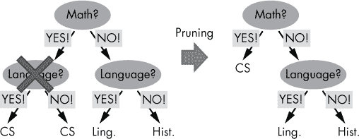

*图 4-21：修剪提升了决策树学习的效率。*

假设完整的决策树看起来像左侧的树。对于任何特征组合，都有单独的分类结果（树叶）。然而，某些特征可能不会为分类问题提供任何额外信息（例如，示例中的第一个语言决策节点）。出于效率原因，决策树学习会有效地去除这些节点，这个过程称为*修剪*。

#### ***代码***

您可以用一行 Python 代码创建自己的决策树。清单 4-6 展示了具体操作方法。

```py
## Dependencies

from sklearn import tree

import numpy as np

## Data: student scores in (math, language, creativity) --> study field

X = np.array([[9, 5, 6, "computer science"],

              [1, 8, 1, "linguistics"],

              [5, 7, 9, "art"]])

## One-liner

Tree = tree.DecisionTreeClassifier().fit(X[:,:-1], X[:,-1])

## Result & puzzle

student_0 = Tree.predict([[8, 6, 5]])

print(student_0)

student_1 = Tree.predict([[3, 7, 9]])

print(student_1)
```

*清单 4-6：单行代码中的决策树分类*

猜测这段代码的输出！

#### ***工作原理***

此代码中的数据描述了三名学生在数学、语言和创造力三个领域的估计技能水平（从 1 到 10 的评分）。您还知道这些学生的研究课题。例如，第一个学生在数学方面技能高超，学习计算机科学。第二个学生在语言方面的技能远远超过其他两个技能，学习语言学。第三个学生在创造力方面技能高超，学习艺术。

一行代码创建一个新的决策树对象，并使用`fit()`函数在标记的训练数据上训练模型（最后一列是标签）。在内部，它创建三个节点，分别为数学、语言和创造力特征。当预测`student_0`的类别（数学 = 8，语言 = 6，创造力 = 5）时，决策树返回`计算机科学`。它学习到这种特征模式（高、中、中）是第一类的指标。另一方面，当要求（3, 7, 9）时，决策树预测`艺术`，因为它学习到分数（低、中、高）暗示第三类。

请注意，该算法是非确定性的。换句话说，当两次执行相同的代码时，可能会得到不同的结果。这在使用随机生成器的机器学习算法中是常见的情况。在这种情况下，特征的顺序是随机组织的，因此最终的决策树可能会有不同的特征顺序。

总结一下，决策树是创建可供人类阅读的机器学习模型的一种直观方式。每个分支表示基于新样本的某个特征作出的选择。树的叶子表示最终的预测（分类或回归）。接下来，我们将暂时离开具体的机器学习算法，探讨机器学习中的一个关键概念：方差。

### **在一行中获取最小方差的行**

你可能听说过大数据中的 Vs：体量（volume）、速度（velocity）、多样性（variety）、真实性（veracity）和价值（value）。*方差*是另一个重要的 V：它衡量数据从其均值的期望（平方）偏差。实际上，方差是一个重要的度量，在金融服务、天气预测和图像处理等领域有着相关的应用。

#### ***基础知识***

方差衡量数据在一维或多维空间中围绕其平均值的分布情况。稍后你会看到一个图形示例。事实上，方差是机器学习中最重要的特性之一。它以概括的方式捕捉数据的模式——而机器学习的核心就是模式识别。

许多机器学习算法依赖于方差的某种形式。例如，*偏差-方差权衡*是机器学习中的一个著名问题：复杂的机器学习模型可能会导致数据过拟合（高方差），但能够非常准确地表示训练数据（低偏差）。另一方面，简单模型通常能很好地进行泛化（低方差），但无法准确表示数据（高偏差）。

那么，方差究竟是什么呢？它是一个简单的统计特性，衡量数据集从其均值的扩展程度。图 4-22 展示了一个例子，绘制了两个数据集：一个具有低方差，另一个具有高方差。

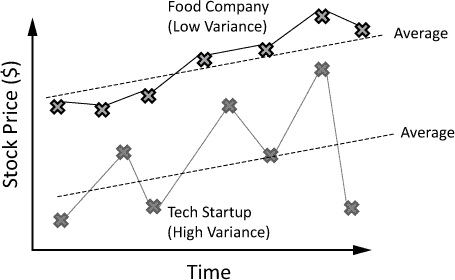

*图 4-22：两家公司股票价格的方差比较*

这个例子展示了两家公司的股票价格。科技初创公司的股票价格围绕其平均值大幅波动。食品公司的股票价格则非常稳定，围绕平均值的波动很小。换句话说，科技初创公司具有较高的方差，而食品公司具有较低的方差。

在数学术语中，你可以通过以下公式计算一组数值*X*的方差*var(X)*：


该值是*X*数据的平均值。

#### ***代码***

随着年龄的增长，许多投资者希望降低其投资组合的整体风险。根据主流的投资哲学，应该将方差较小的股票视为风险较低的投资工具。粗略来说，投资于稳定、可预测的大公司要比投资小型科技创业公司损失更少。

Listing 4-7 中的单行代码的目标是找出投资组合中方差最小的股票。通过向该股票投资更多资金，你可以期望你的投资组合的整体方差会更低。

```py
## Dependencies

import numpy as np

## Data (rows: stocks / cols: stock prices)

X = np.array([[25,27,29,30],

              [1,5,3,2],

              [12,11,8,3],

              [1,1,2,2],

              [2,6,2,2]])

## One-liner

# Find the stock with smallest variance

min_row = min([(i,np.var(X[i,:])) for i in range(len(X))], key=lambda x: x[1])

## Result & puzzle

print("Row with minimum variance: " + str(min_row[0]))

print("Variance: " + str(min_row[1]))
```

*Listing 4-7：在一行代码中计算最小方差*

这段代码的输出是什么？

#### ***它是如何工作的***

和往常一样，你首先定义你想要在其上运行单行代码的数据（见 Listing 4-7 顶部）。NumPy 数组 `X` 包含五行（每行代表投资组合中的一只股票），每行有四个值（股票价格）。

目标是找到方差最小的股票的 ID 和方差。因此，单行代码的最外层函数是 `min()` 函数。你在元组序列 `(a,b)` 上执行 `min()` 函数，其中第一个元组值 `a` 是行索引（股票索引），第二个元组值 `b` 是该行的方差。

你可能会问：一序列元组的最小值是什么？当然，在使用之前，你需要正确定义此操作。为此，你使用 `min()` 函数的 `key` 参数。`key` 参数接受一个函数，该函数根据序列值返回一个可比较的对象值。再次强调，我们的序列值是元组，你需要找到方差最小的元组（即第二个元组值）。由于方差是第二个值，因此你将返回 `x[1]` 作为比较的基础。换句话说，方差最小的第二个元组值所在的元组获胜。

让我们来看一下如何创建元组值的序列。你可以使用列表推导式为每个行索引（股票）创建一个元组。第一个元组元素只是行索引 *i*。第二个元组元素是这一行的方差。你使用 NumPy 的 `var()` 函数结合切片来计算行的方差。

因此，单行代码的结果如下：

```py
"""

Row with minimum variance: 3

Variance: 0.25

"""
```

我想补充一下，这个问题还有一种替代的解决方法。如果这不是一本关于 Python 单行代码的书，我更倾向于以下的解决方案，而不是单行代码：

```py
var = np.var(X, axis=1)

min_row = (np.where(var==min(var)), min(var))
```

在第一行，你计算 NumPy 数组 `X` 沿列（`axis=1`）的方差。在第二行，你创建元组。第一个元组值是方差数组中的最小值索引。第二个元组值是方差数组中的最小值。注意，可能有多个行具有相同的（最小）方差。

这个解决方案更具可读性。所以很明显，简洁性和可读性之间存在权衡。仅仅因为你可以把所有内容挤进一行代码并不意味着你应该这么做。在所有条件相同的情况下，编写简洁*且*可读的代码远比将代码搞得冗长、包含不必要的定义、注释或中间步骤要好。

在本节学习了方差的基础知识后，你现在准备好吸收如何计算基础统计数据。

### **一行代码实现基本统计**

作为数据科学家和机器学习工程师，你需要掌握基础统计学。一些机器学习算法完全基于统计学（例如，贝叶斯网络）。

例如，从矩阵中提取基本统计数据（如平均值、方差和标准差）是分析各种数据集（如金融数据、健康数据或社交媒体数据）的关键组成部分。随着机器学习和数据科学的兴起，了解如何使用 NumPy —— 它是 Python 数据科学、统计学和线性代数的核心 —— 将变得越来越有价值。

在这行代码中，你将学习如何使用 NumPy 计算基本统计数据。

#### ***基础知识***

本节解释了如何沿着轴计算平均值、标准差和方差。这三个计算非常相似；如果你理解了其中一个，你就能理解所有的。

你想要实现的目标是：给定一个包含股票数据的 NumPy 数组，行表示不同的公司，列表示它们的每日股票价格，目标是找到每个公司股票价格的平均值和标准差（见图 4-23）。

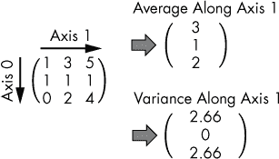

*图 4-23：沿轴 1 计算平均值和方差*

这个例子展示了一个二维的 NumPy 数组，但在实际中，数组可能具有更高的维度。

##### **简单平均值、方差、标准差**

在研究如何在 NumPy 中完成这些操作之前，让我们逐步建立你需要知道的背景知识。假设你想计算 NumPy 数组中所有值的简单平均值、方差或标准差。你已经在本章中看过了平均值和方差函数的例子。标准差就是方差的平方根。你可以通过以下函数轻松实现这一点：

```py
import numpy as np

X = np.array([[1, 3, 5],

              [1, 1, 1],

              [0, 2, 4]])

print(np.average(X))

# 2.0

print(np.var(X))

# 2.4444444444444446

print(np.std(X))

# 1.5634719199411433
```

你可能已经注意到你在二维 NumPy 数组 `X` 上应用了这些函数。但 NumPy 会简单地将数组展平，并在展平后的数组上计算这些函数。例如，展平后的 NumPy 数组 `X` 的简单平均值计算如下：

(1 + 3 + 5 + 1 + 1 + 1 + 0 + 2 + 4) / 9 = 18 / 9 = 2.0

##### **沿轴计算平均值、方差、标准差**

然而，有时你可能希望沿某个轴计算这些函数。你可以通过将`axis`关键字作为参数传递给平均值、方差和标准差函数来实现这一点（参见第三章了解`axis`参数的详细介绍）。

#### ***代码***

列表 4-8 展示了如何沿着某一轴计算平均值、方差和标准差。我们的目标是计算一个二维矩阵中所有股票的平均值、方差和标准差，其中行表示股票，列表示每日价格。

```py
## Dependencies

import numpy as np

## Stock Price Data: 5 companies

# (row=[price_day_1, price_day_2, ...])

x = np.array([[8, 9, 11, 12],

              [1, 2, 2, 1], 

              [2, 8, 9, 9],

              [9, 6, 6, 3],

              [3, 3, 3, 3]])

## One-liner

avg, var, std = np.average(x, axis=1), np.var(x, axis=1), np.std(x, axis=1)

## Result & puzzle

print("Averages: " + str(avg))

print("Variances: " + str(var))

print("Standard Deviations: " + str(std))
```

*列表 4-8：沿某轴计算基本统计数据*

猜猜这个难题的输出是什么！

#### ***工作原理***

这个一行代码使用了`axis`关键字来指定沿哪个轴计算平均值、方差和标准差。例如，如果你沿着`axis=1`执行这三个函数，则每一行会被聚合为一个单一的值。因此，结果的 NumPy 数组会减少一个维度。

这个难题的结果如下：

```py
"""

Averages: [10.   1.5  7.   6.   3\. ]

Variances: [2.5  0.25 8.5  4.5  0.  ]

Standard Deviations: [1.58113883 0.5   2.91547595 2.12132034 0.   ]

"""
```

在继续下一个一行代码之前，我想展示如何用相同的思路处理一个更高维度的 NumPy 数组。

在对高维度 NumPy 数组进行轴向平均时，你总是会在`axis`参数中定义的轴上进行汇总。这里是一个示例：

```py
import numpy as np

x = np.array([[[1,2], [1,1]],

              [[1,1], [2,1]],

              [[1,0], [0,0]]])

print(np.average(x, axis=2))

print(np.var(x, axis=2))

print(np.std(x, axis=2))

"""

[[1.5 1\. ]

 [1.  1.5]

 [0.5 0\. ]]

[[0.25 0.  ]

 [0.   0.25]

 [0.25 0.  ]]

[[0.5 0\. ]

 [0.  0.5]

 [0.5 0\. ]]

"""
```

有三个例子展示了如何沿着轴 2 计算平均值、方差和标准差（参见第三章；最内层轴）。换句话说，轴 2 上的所有值将合并为一个单一值，结果是轴 2 从结果数组中消失。深入这三个例子，弄清楚轴 2 是如何被压缩成一个平均值、方差或标准差的。

总结来说，广泛的数据集（包括金融数据、健康数据和社交媒体数据）要求你能够从数据集中提取基本的见解。本节内容让你更深入地理解如何利用强大的 NumPy 工具集，从多维数组中快速高效地提取基本统计数据。这是许多机器学习算法所需的基本预处理步骤。

### **使用支持向量机进行分类，仅一行代码**

*支持向量机*（*SVMs*）在近年来广受欢迎，因为它们在高维空间中仍然具有强大的分类性能。令人惊讶的是，SVM 即使在特征数（维度）大于数据项的情况下也能工作。这对分类算法来说是非常不同寻常的，因为存在*维度灾难*：随着维度的增加，数据变得非常稀疏，这使得算法很难从数据集中发现模式。理解 SVM 的基本概念是成为一名成熟的机器学习工程师的基础步骤。

#### ***基础知识***

分类算法是如何工作的？它们使用训练数据找到一个决策边界，将一个类别的数据与另一个类别的数据分开（在第 89 页的“Logistic 回归一行代码”中，决策边界是 sigmoid 函数的概率是否高于或低于 0.5 的阈值）。

##### **分类的高级视角**

图 4-24 展示了一个通用分类器的例子。

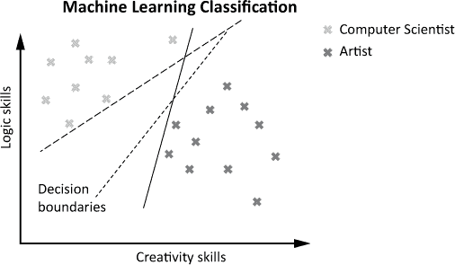

*图 4-24：计算机科学家和艺术家的多样化技能组合*

假设你想为有志的大学生建立一个推荐系统。图示展示了训练数据，数据由根据逻辑和创造力两个领域的技能对用户进行分类。一些人具有较高的逻辑能力，而创造力相对较低；另一些人则具有较高的创造力，而逻辑能力相对较低。第一组被标记为*计算机科学家*，第二组被标记为*艺术家*。

为了分类新用户，机器学习模型必须找到一个决策边界，将计算机科学家和艺术家区分开。大致来说，你将根据用户在决策边界的哪一侧进行分类。在这个例子中，你会将落在左侧区域的用户分类为计算机科学家，将落在右侧区域的用户分类为艺术家。

在二维空间中，决策边界要么是直线，要么是（更高阶的）曲线。前者称为*线性分类器*，后者称为*非线性分类器*。在这一节中，我们只讨论线性分类器。

图 4-24 展示了三个有效的数据分隔决策边界。在我们的例子中，无法量化哪个决策边界更好；它们在分类训练数据时都能达到完美的准确度。

##### **但最佳决策边界是什么？**

支持向量机为这个问题提供了一个独特而美妙的答案。可以说，最佳的决策边界提供了最大的安全边距。换句话说，SVM 最大化最接近数据点与决策边界之间的距离。目标是最小化新数据点接近决策边界时的误差。

图 4-25 展示了一个例子。

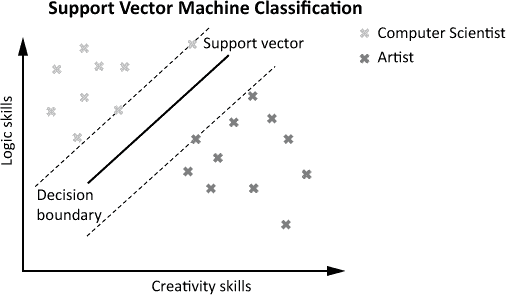

*图 4-25：支持向量机最大化边距误差。*

SVM 分类器找到相应的支持向量，使得支持向量之间的区域尽可能厚实。在这里，支持向量是位于与决策边界平行的两条虚线上的数据点。这些线被称为*边际*。决策边界是位于两条边际之间的线，且与边际的距离最大。由于最大化了边际和决策边界之间的区域，因此在分类新数据点时，*误差边际*预计将是最大的。这一思想对于许多实际问题展示了高分类准确性。

#### ***代码***

是否可以用一行 Python 代码创建你自己的 SVM？查看列表 4-9。

```py
## Dependencies

from sklearn import svm

import numpy as np

## Data: student scores in (math, language, creativity) --> study field

X = np.array([[9, 5, 6, "computer science"],

              [10, 1, 2, "computer science"],

              [1, 8, 1, "literature"],

              [4, 9, 3, "literature"],

              [0, 1, 10, "art"],

              [5, 7, 9, "art"]])

## One-liner

svm = svm.SVC().fit(X[:,:-1], X[:,-1])

## Result & puzzle

student_0 = svm.predict([[3, 3, 6]])

print(student_0)

student_1 = svm.predict([[8, 1, 1]])

print(student_1)
```

*列表 4-9：单行代码实现 SVM 分类*

猜猜这段代码的输出是什么。

#### ***它是如何工作的***

这段代码展示了如何在 Python 中以最基本的形式使用支持向量机。NumPy 数组保存了带标签的训练数据，每行代表一个用户，每列代表一个特征（数学、语言和创造力的技能水平）。最后一列是标签（类别）。

因为你有三维数据，支持向量机通过使用二维平面（线性分隔符）来分离数据，而不是使用一维的直线。如你所见，支持向量机不仅能分离两个类别，也能分离三个类别，如前面的例子所示。

这行代码本身很简洁：你首先通过使用 `svm.SVC` 类的构造函数来创建模型（*SVC* 代表 *支持向量分类*）。然后，调用 `fit()` 函数基于已标记的训练数据进行训练。

在代码片段的结果部分，你对新观察结果调用 `predict()` 函数。因为 `student_0` 的技能被标示为数学=3，语言=3，创造力=6，支持向量机预测该学生的标签是*艺术*。类似地，`student_1` 的技能被标示为数学=8，语言=1，创造力=1，因此支持向量机预测该学生的标签是*计算机科学*。

这是该单行代码的最终输出：

```py
## Result & puzzle

student_0 = svm.predict([[3, 3, 6]])

print(student_0)

# ['art']

student_1 = svm.predict([[8, 1, 1]])

print(student_1)

## ['computer science']
```

总结来说，SVM 即使在高维空间中也表现良好，尤其当特征数多于训练数据向量时。最大化*安全边际*的思想直观且有助于在分类*边界案例*时实现稳健的性能——即，位于安全边际内的向量。在本章的最后一部分，我们将后退一步，看看一个用于分类的元算法：随机森林的集成学习。

### **使用随机森林进行分类的单行代码**

让我们继续讨论一种令人兴奋的机器学习技术：*集成学习*。如果你的预测准确率不足，但你需要在最后时刻完成工作，下面是我的快速建议：尝试这种元学习方法，结合多个机器学习算法的预测（或分类）。在许多情况下，它将为你提供更好的最后时刻结果。

#### ***基础知识***

在前面的章节中，你已经学习了多个机器学习算法，可以用来快速获取结果。然而，不同的算法有不同的优势。例如，神经网络分类器可以为复杂问题生成出色的结果。然而，由于它们强大的记忆能力，能够记住数据中的细粒度模式，因此也容易发生过拟合。集成学习在分类问题中部分解决了你常常无法预先知道哪种机器学习技术最有效的问题。

这是如何工作的？你创建了一个由多种类型或实例的基本机器学习算法组成的元分类器。换句话说，你训练了多个模型。为了对单个观察值进行分类，你让所有模型独立地对输入进行分类。接下来，你返回根据输入返回次数最多的类别，作为*元预测*。这就是集成学习算法的最终输出。

*随机森林*是一种特殊类型的集成学习算法。它们专注于决策树学习。一个森林由许多树组成。同样，随机森林由许多决策树组成。每棵决策树通过在训练阶段树生成过程中注入随机性来构建（例如，选择哪个树节点作为第一个）。这导致了不同的决策树——这正是你所需要的。

图 4-26 显示了如何使用以下场景来进行训练后的随机森林预测。Alice 具有较高的数学和语言技能。*集成学习*由三棵决策树组成（构建随机森林）。为了对 Alice 进行分类，每棵决策树都会询问 Alice 的分类结果。两棵决策树将 Alice 分类为计算机科学家。由于这是获得最多票数的类别，它将作为分类的最终输出返回。

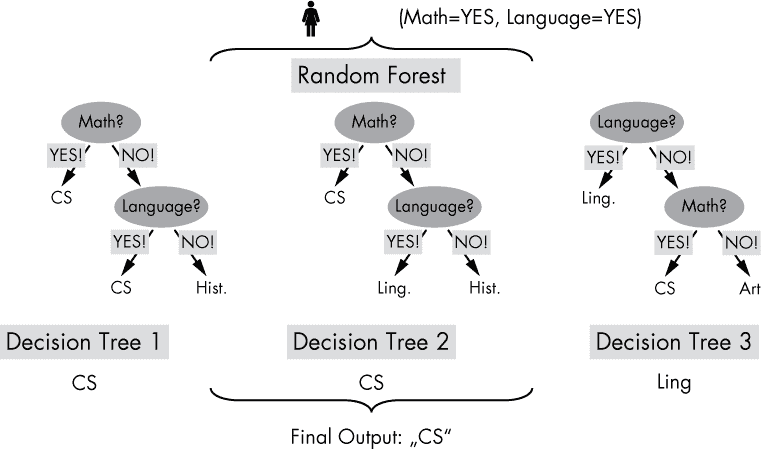

*图 4-26：随机森林分类器聚合三棵决策树的输出*

#### ***代码***

让我们坚持这个例子，根据学生在三个领域（数学、语言、创造力）的技能水平来分类学习领域。你可能认为在 Python 中实现集成学习方法很复杂。但实际上并不复杂，得益于功能强大的 scikit-learn 库（参见 列表 4-10）。

```py
## Dependencies

import numpy as np

from sklearn.ensemble import RandomForestClassifier

## Data: student scores in (math, language, creativity) --> study field

X = np.array([[9, 5, 6, "computer science"],

              [5, 1, 5, "computer science"],

              [8, 8, 8, "computer science"],

              [1, 10, 7, "literature"],

              [1, 8, 1, "literature"],

              [5, 7, 9, "art"],

              [1, 1, 6, "art"]])

## One-liner

Forest = RandomForestClassifier(n_estimators=10).fit(X[:,:-1], X[:,-1])

## Result

students = Forest.predict([[8, 6, 5],

                           [3, 7, 9],

                           [2, 2, 1]])

print(students)
```

*列表 4-10：使用随机森林分类器的集成学习*

猜猜看：这段代码的输出是什么？

#### ***原理***

在清单 4-10 中初始化标注的训练数据后，代码使用`RandomForestClassifier`类的构造函数创建一个随机森林，构造函数接受一个参数`n_estimators`，定义森林中的树木数量。接下来，通过调用`fit()`函数来填充先前初始化（一个空森林）的模型。为此，输入的训练数据由数组`X`的所有列（除了最后一列）组成，而训练数据的标签定义在最后一列。如同前面的示例，你使用切片来从数据数组`X`中提取相应的列。

这段代码的分类部分略有不同。我想向你展示如何对多个观察值进行分类，而不仅仅是一个。你可以通过创建一个多维数组，每行代表一个观察值，来实现这一点。

这是代码片段的输出：

```py
## Result

students = Forest.predict([[8, 6, 5],

                           [3, 7, 9],

                           [2, 2, 1]])

print(students)

# ['computer science' 'art' 'art']
```

请注意，结果仍然是非确定性的（不同执行代码时结果可能不同），因为随机森林算法依赖于随机数生成器，该生成器在不同的时间点返回不同的数字。你可以通过使用整数参数`random_state`使此调用变为确定性。例如，你可以在调用随机森林构造函数时设置`random_state=1`：`RandomForestClassifier(n_estimators=10, random_state=1)`。在这种情况下，每次创建一个新的随机森林分类器时，都会得到相同的输出，因为生成的随机数相同：它们都是基于种子整数 1。

总结来说，本节介绍了一种分类的元方法：使用各种决策树的输出以减少分类误差的方差。这是集成学习的一种形式，它将多个基本模型组合成一个单一的元模型，能够利用它们各自的优点。

**注意**

*两棵不同的决策树可能导致高方差的错误：一棵产生良好的结果，而另一棵则没有。通过使用随机森林，你可以减轻这一效果。*

这种思想的变种在机器学习中很常见——如果你需要快速提高预测准确性，只需运行多个机器学习模型，并评估它们的输出以找到最佳模型（这是机器学习从业者的一个快速而粗糙的秘密）。某种程度上，集成学习技术自动执行了在实际机器学习流程中通常由专家完成的任务：选择、比较并结合不同机器学习模型的输出。集成学习的最大优势是，这一过程可以在运行时对每个数据值单独进行。

### **总结**

本章涵盖了 10 个基础的机器学习算法，这些算法对于你在该领域的成功至关重要。你已经学习了回归算法，如线性回归、KNN 和神经网络，用于预测数值。你也学习了分类算法，如逻辑回归、决策树学习、SVM 和随机森林。此外，你还学会了如何计算多维数据数组的基本统计量，并使用 K-Means 算法进行无监督学习。这些算法和方法是机器学习领域中最重要的算法之一，如果你想成为一名机器学习工程师，还有很多内容需要学习。这些学习将会带来回报——机器学习工程师在美国通常能赚到六位数的薪水（一个简单的网络搜索应该能验证这一点）！对于那些希望深入了解机器学习的学生，我推荐 Andrew Ng 的优秀（且免费的）Coursera 课程。你可以通过你最喜欢的搜索引擎找到该课程的在线材料。

在下一章，你将学习高效程序员最重要（也是最被低估）的一项技能：正则表达式。虽然这一章更侧重于概念性内容（你了解了基本的概念，但实际的重担由 scikit-learn 库承担），但下一章将会是高度技术性的内容。所以，挽起袖子，继续阅读吧！
