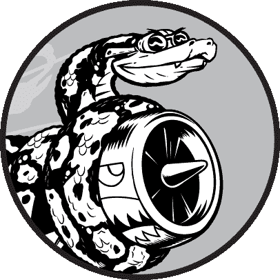
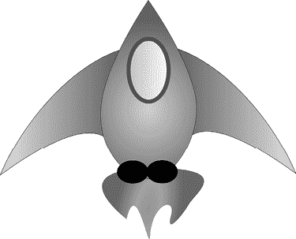
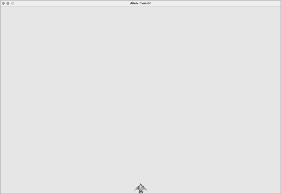

# 第二部分：项目

恭喜你！现在你已经掌握了足够的 Python 知识，可以开始构建互动性强且富有意义的项目。创建自己的项目将帮助你学习新技能，并加深对第一部分所介绍概念的理解。

第二部分包含三种项目，你可以按任意顺序选择做任何一个或所有这些项目。以下是每个项目的简要描述，帮助你决定先做哪个。

## 外星入侵：用 Python 制作游戏

在外星入侵项目中（**第十二章**、**第十三章**和**第十四章**），你将使用 Pygame 包来开发一个 2D 游戏。游戏的目标是击落从屏幕上方掉下来的外星人舰队，随着游戏的进行，关卡速度和难度会逐步增加。项目结束时，你将学会开发自己的 2D 游戏所需的技能。

## 数据可视化

数据可视化项目从**第十五章**开始，在这一章中，你将学习如何生成数据并使用 Matplotlib 和 Plotly 创建一系列功能强大且美观的数据可视化。**第十六章**教你如何从在线源获取数据，并将其输入到可视化包中，生成天气数据图表和全球地震活动地图。最后，**第十七章**展示了如何编写程序自动下载和可视化数据。学习制作可视化图表将让你探索数据科学领域，这是目前编程中需求量最大的领域之一。

## Web 应用

在 Web 应用项目中（**第十八章**、**第十九章**和**第二十章**），你将使用 Django 包来创建一个简单的 web 应用，允许用户记录他们正在学习的不同主题。用户将创建一个账户，设置用户名和密码，输入一个主题，然后记录他们正在学习的内容。你还将把应用部署到远程服务器，这样全世界的人都能访问它。

完成这个项目后，你将能够开始构建自己的简单 web 应用，并且准备深入了解更多关于使用 Django 构建应用的资源。

<!-- split -->
## 发射子弹的舰船



让我们来制作一个叫做*外星入侵*的游戏！我们将使用 Pygame，这是一个包含有趣而强大的 Python 模块集合，可以管理图形、动画，甚至声音，帮助你更容易地构建复杂的游戏。通过 Pygame 处理像绘制图像到屏幕这样的任务，你可以专注于游戏动态的更高级逻辑。

在这一章中，你将设置 Pygame，然后创建一艘能够左右移动并根据玩家输入发射子弹的火箭。在接下来的两章中，你将创建一个外星人舰队来摧毁，然后通过限制可用舰船数量并添加记分板来进一步完善游戏。

在制作这个游戏的过程中，你还将学会如何管理跨多个文件的大型项目。我们会重构大量代码并管理文件内容，以便组织项目并提高代码效率。

制作游戏是学习一门语言的理想方式，同时还能玩得很开心。能玩自己写的游戏非常令人满足，写一个简单的游戏将教你很多关于专业开发人员如何制作游戏的知识。在你完成本章时，输入并运行代码，了解每个代码块如何促进整体游戏玩法。通过实验不同的值和设置，更好地理解如何完善游戏中的互动。

## 项目规划

在你构建大型项目时，开始编写代码之前制定一个计划非常重要。你的计划将帮助你保持专注，并增加你完成项目的可能性。

让我们写一个关于总体游戏玩法的描述。虽然以下描述没有涵盖*Alien Invasion*的所有细节，但它为你提供了如何开始制作游戏的清晰思路：

> 在*Alien Invasion*中，玩家控制一艘出现在屏幕底部中央的火箭船。玩家可以使用箭头键左右移动船只，使用空格键发射子弹。游戏开始时，一支外星人舰队填满了天空并在屏幕上方和下方移动。玩家射击并摧毁外星人。如果玩家摧毁了所有外星人，一支新的舰队将出现，移动速度比前一支舰队更快。如果任何外星人撞击到玩家的船只或到达屏幕底部，玩家将失去一艘船。若玩家失去三艘船，游戏结束。

在开发的第一阶段，我们将制作一个船只，当玩家按下箭头键时，船只可以左右移动，按下空格键时发射子弹。设置好这个行为后，我们可以创建外星人并完善游戏玩法。

## 安装 Pygame

在你开始编码之前，安装 Pygame。我们将像第十一章中安装 pytest 一样通过 pip 来安装。如果你跳过了第十一章或需要回顾 pip 的使用方法，请参见第 210 页的“使用 pip 安装 pytest”。

要安装 Pygame，请在终端提示符下输入以下命令：

```py
$ **python -m pip install --user pygame**
```

如果你使用除`python`以外的命令来运行程序或启动终端会话，比如`python3`，请确保使用那个命令。

## 开始游戏项目

我们将通过创建一个空的 Pygame 窗口来开始构建游戏。稍后，我们会在这个窗口中绘制游戏元素，比如船只和外星人。我们还会让游戏响应用户输入，设置背景颜色，并加载船只图像。

### 创建 Pygame 窗口并响应用户输入

我们将通过创建一个类来表示游戏，来制作一个空的 Pygame 窗口。在你的文本编辑器中，创建一个新文件并将其保存为*alien_invasion.py*；然后输入以下内容：

**alien_invasion.py**

```py
import sys

import pygame

class AlienInvasion:
    """Overall class to manage game assets and behavior."""

    def __init__(self):
        """Initialize the game, and create game resources."""
❶         pygame.init()

❷         self.screen = pygame.display.set_mode((1200, 800))
        pygame.display.set_caption("Alien Invasion")

    def run_game(self):
        """Start the main loop for the game."""
❸         while True:
            # Watch for keyboard and mouse events.
❹             for event in pygame.event.get():
❺                 if event.type == pygame.QUIT:
                    sys.exit()

            # Make the most recently drawn screen visible.
❻             pygame.display.flip()

if __name__ == '__main__':
    # Make a game instance, and run the game.
    ai = AlienInvasion()
    ai.run_game()
```

首先，我们导入`sys`和`pygame`模块。`pygame`模块包含了制作游戏所需的功能。我们将使用`sys`模块中的工具，当玩家退出游戏时退出程序。

*外星人入侵*是一个名为`AlienInvasion`的类。在`__init__()`方法中，`pygame.init()`函数初始化了 Pygame 正常运行所需的背景设置❶。接着我们调用`pygame.display.set_mode()`来创建一个显示窗口❷，在这个窗口中我们将绘制所有的游戏图形元素。参数`(1200, 800)`是一个元组，定义了游戏窗口的尺寸，宽度为 1200 像素，高度为 800 像素。（你可以根据显示器的尺寸调整这些值。）我们将这个显示窗口赋值给属性`self.screen`，这样它就可以在类的所有方法中使用。

我们赋值给`self.screen`的对象被称为一个表面。在 Pygame 中，*表面*是屏幕的一部分，游戏元素可以在其上显示。游戏中的每个元素，比如外星人或飞船，都是一个独立的表面。`display.set_mode()`返回的表面代表了整个游戏窗口。当我们激活游戏的动画循环时，这个表面将在每次通过循环时被重绘，以便根据用户输入的变化更新显示内容。

游戏由`run_game()`方法控制。这个方法包含一个持续运行的`while`循环❸。`while`循环中包含了事件循环和管理屏幕更新的代码。*事件*是用户在玩游戏时执行的动作，例如按键或移动鼠标。为了让程序响应事件，我们编写一个*事件循环*来*监听*事件，并根据发生的事件类型执行相应的任务。`while`循环中的嵌套`for`循环❹就是一个事件循环。

为了访问 Pygame 检测到的事件，我们将使用`pygame.event.get()`函数。这个函数返回自上次调用该函数以来发生的事件列表。任何键盘或鼠标事件都会触发此`for`循环。在循环内，我们会编写一系列的`if`语句来检测并响应特定事件。例如，当玩家点击游戏窗口的关闭按钮时，会检测到一个`pygame.QUIT`事件，我们会调用`sys.exit()`来退出游戏❺。

调用`pygame.display.flip()`❻会告诉 Pygame 将最近绘制的屏幕显示出来。在这个例子中，它在每次通过`while`循环时简单地绘制一个空白屏幕，擦除旧的屏幕内容，只显示新的屏幕。当我们移动游戏元素时，`pygame.display.flip()`会不断更新显示，展示游戏元素的新位置并隐藏旧的位置，从而创造出平滑运动的假象。

在文件的末尾，我们创建一个游戏实例，然后调用`run_game()`。我们将`run_game()`放在一个`if`块中，只有在文件被直接调用时才会运行。当你运行这个*alien_invasion.py*文件时，你应该会看到一个空的 Pygame 窗口。

### 控制帧率

理想情况下，游戏应该在所有系统上以相同的速度，或*帧率*运行。控制能够在多个系统上运行的游戏的帧率是一个复杂的问题，但 Pygame 提供了一种相对简单的方法来实现这一目标。我们将创建一个时钟，确保时钟在每次经过主循环时都滴答一次。任何时候循环处理的速度超过我们定义的速率时，Pygame 都会计算出正确的暂停时间，以确保游戏以一致的速率运行。

我们将在`__init__()`方法中定义时钟：

**alien_invasion.py**

```py
 def __init__(self):
 """Initialize the game, and create game resources."""
 pygame.init()
 self.clock = pygame.time.Clock()
  *--snip--*
```

在初始化`pygame`后，我们创建`Clock`类的实例，来自`pygame.time`模块。然后我们会在`run_game()`中的`while`循环结束时让时钟滴答作响：

```py
 def run_game(self):
 """Start the main loop for the game."""
 while True:
  *--snip--*
 pygame.display.flip()
            self.clock.tick(60)
```

`tick()`方法接受一个参数：游戏的帧率。这里我使用的是 60 的值，Pygame 会尽力确保循环每秒执行 60 次。

### 设置背景颜色

Pygame 默认创建一个黑色屏幕，但这太单调了。让我们设置一个不同的背景色。我们将在`__init__()`方法的末尾进行此设置。

**alien_invasion.py**

```py
 def __init__(self):
  *--snip--*
 pygame.display.set_caption("Alien Invasion")

        # Set the background color.
❶         self.bg_color = (230, 230, 230)

 def run_game(self):
  *--snip--*
 for event in pygame.event.get():
 if event.type == pygame.QUIT:
 sys.exit()

            # Redraw the screen during each pass through the loop.
❷             self.screen.fill(self.bg_color)

 # Make the most recently drawn screen visible.
 pygame.display.flip()
 self.clock.tick(60)
```

Pygame 中的颜色是以 RGB 颜色指定的：红色、绿色和蓝色的混合。每个颜色值的范围是 0 到 255。颜色值`(255, 0, 0)`是红色，`(0, 255, 0)`是绿色，`(0, 0, 255)`是蓝色。你可以混合不同的 RGB 值来创建最多 1600 万种颜色。颜色值`(230, 230, 230)`混合了等量的红色、绿色和蓝色，产生一种浅灰色的背景色。我们将此颜色赋值给`self.bg_color`❶。

我们使用`fill()`方法❷填充屏幕背景色，该方法作用于一个表面并只接受一个参数：颜色。

### 创建一个 Settings 类

每当我们为游戏引入新功能时，我们通常也会创建一些新的设置。为了避免在代码中到处添加设置，我们将编写一个名为`settings`的模块，其中包含一个名为`Settings`的类，将所有这些值存储在一个地方。这种方法使我们每次需要访问单个设置时，只需操作一个`settings`对象。这也使得随着项目的增长，我们更容易修改游戏的外观和行为。为了修改游戏，我们将更改接下来要创建的*settings.py*中的相关值，而不是在整个项目中搜索不同的设置。

在你的*alien_invasion*文件夹中创建一个新的文件，命名为*settings.py*，并添加这个初始的`Settings`类：

**settings.py**

```py
class Settings:
    """A class to store all settings for Alien Invasion."""

    def __init__(self):
        """Initialize the game's settings."""
        # Screen settings
        self.screen_width = 1200
        self.screen_height = 800
        self.bg_color = (230, 230, 230)
```

为了在项目中创建`Settings`类的实例并使用它来访问我们的设置，我们需要按照以下方式修改*alien_invasion.py*：

**alien_invasion.py**

```py
*--snip--*
import pygame

from settings import Settings

class AlienInvasion:
 """Overall class to manage game assets and behavior."""

 def __init__(self):
 """Initialize the game, and create game resources."""
 pygame.init()
 self.clock = pygame.time.Clock()
❶  self.settings = Settings()

❷         self.screen = pygame.display.set_mode(
            (self.settings.screen_width, self.settings.screen_height))
 pygame.display.set_caption("Alien Invasion")

 def run_game(self):
  *--snip--*
 # Redraw the screen during each pass through the loop.
❸             self.screen.fill(self.settings.bg_color)

 # Make the most recently drawn screen visible.
 pygame.display.flip()
 self.clock.tick(60)
*--snip--*
```

我们将 `Settings` 导入主程序文件。然后我们创建一个 `Settings` 的实例，并将其赋值给 `self.settings` ❶，在调用 `pygame.init()` 之后。创建屏幕 ❷ 时，我们使用 `self.settings` 的 `screen_width` 和 `screen_height` 属性，然后在填充屏幕时使用 `self.settings` 来访问背景颜色 ❸。

当你现在运行 *alien_invasion.py* 时，你不会看到任何变化，因为我们所做的只是将之前已经使用的设置移到其他地方。现在我们准备开始将新的元素添加到屏幕上。

## 添加飞船图像

让我们将飞船添加到我们的游戏中。为了在屏幕上绘制玩家的飞船，我们将加载一张图像，然后使用 Pygame 的 `blit()` 方法来绘制图像。

当你为你的游戏选择艺术作品时，务必注意版权许可。最安全、最便宜的起步方式是使用可以自由使用和修改的授权图像，像 [`opengameart.org`](https://opengameart.org) 这样的网站提供了这类资源。

你几乎可以在游戏中使用任何类型的图像文件，但使用位图 (*.bmp*) 文件最为简便，因为 Pygame 默认加载位图。虽然你可以配置 Pygame 使用其他文件类型，但某些文件类型依赖于特定的图像库，这些库必须安装在你的计算机上。大多数你能找到的图像文件都是 *.jpg* 或 *.png* 格式，但你可以使用 Photoshop、GIMP 或 Paint 等工具将它们转换为位图。

特别注意你选择的图像的背景颜色。尽量找一个带有透明或纯色背景的文件，你可以使用图像编辑器将其替换为任何背景颜色。如果图像的背景颜色与你游戏的背景颜色匹配，游戏的效果会更好。或者，你也可以将游戏的背景颜色与图像的背景颜色匹配。

对于 *Alien Invasion*，你可以使用文件 *ship.bmp*（图 12-1），该文件在本书的资源页面提供，地址为 [`ehmatthes.github.io/pcc_3e`](https://ehmatthes.github.io/pcc_3e)。该文件的背景颜色与我们在这个项目中使用的设置相匹配。请在主 *alien_invasion* 项目文件夹内创建一个名为 *images* 的文件夹，并将文件 *ship.bmp* 保存在 *images* 文件夹中。



图 12-1：*Alien Invasion* 的飞船

### 创建飞船类

在选择了飞船的图像之后，我们需要将其显示在屏幕上。为了使用我们的飞船，我们将创建一个新的 `ship` 模块，其中包含类 `Ship`。这个类将管理玩家飞船的大部分行为：

**ship.py**

```py
import pygame

class Ship:
    """A class to manage the ship."""

    def __init__(self, ai_game):
        """Initialize the ship and set its starting position."""
❶         self.screen = ai_game.screen
❷         self.screen_rect = ai_game.screen.get_rect()

        # Load the ship image and get its rect.
❸         self.image = pygame.image.load('images/ship.bmp')
        self.rect = self.image.get_rect()

        # Start each new ship at the bottom center of the screen.
❹         self.rect.midbottom = self.screen_rect.midbottom

❺     def blitme(self):
        """Draw the ship at its current location."""
        self.screen.blit(self.image, self.rect)
```

Pygame 非常高效，因为它允许你将所有游戏元素视为矩形（*rects*），即使它们的形状并不完全是矩形。将元素视为矩形是高效的，因为矩形是简单的几何形状。例如，当 Pygame 需要判断两个游戏元素是否发生碰撞时，如果将每个对象视为矩形，它可以更快速地进行判断。这种方法通常足够有效，以至于没有玩家会注意到我们并没有使用每个游戏元素的精确形状。我们将在这个类中将飞船和屏幕视为矩形。

我们在定义类之前导入了`pygame`模块。`Ship`的`__init__()`方法接受两个参数：`self`引用和`AlienInvasion`类当前实例的引用。这将使得`Ship`能够访问在`AlienInvasion`中定义的所有游戏资源。然后，我们将屏幕赋值给`Ship`的一个属性❶，这样就可以在这个类中的所有方法中轻松访问它。我们使用`get_rect()`方法访问屏幕的`rect`属性，并将其赋值给`self.screen_rect`❷。这样，我们就可以将飞船放置在屏幕上的正确位置。

为了加载图像，我们调用`pygame.image.load()`❸并提供飞船图像的位置。此函数返回一个表示飞船的表面，我们将其赋值给`self.image`。当图像加载完成后，我们调用`get_rect()`访问飞船表面的`rect`属性，以便稍后使用它来定位飞船。

当你处理`rect`对象时，可以使用矩形的顶部、底部、左侧和右侧的* x *和* y *坐标，以及矩形的中心来定位对象。你可以设置这些值中的任何一个来确定`rect`的当前位置。当你需要将游戏元素居中时，可以操作`rect`的`center`、`centerx`或`centery`属性。当你需要在屏幕的边缘工作时，可以操作`top`、`bottom`、`left`或`right`属性。还有一些结合了这些属性的属性，如`midbottom`、`midtop`、`midleft`和`midright`。当你调整`rect`的水平或垂直位置时，你可以直接使用`x`和`y`属性，它们是矩形左上角的* x *和* y *坐标。这些属性让你无需像过去那样进行繁琐的计算，游戏开发者以前必须手动完成的计算现在由这些属性简化，你将会频繁使用它们。

我们将飞船放置在屏幕的底部中央。为此，将`self.rect.midbottom`的值与屏幕`rect`的`midbottom`属性匹配❹。Pygame 使用这些`rect`属性来定位飞船图像，使其在水平方向居中，并与屏幕的底部对齐。

最后，我们定义了`blitme()`方法❺，它将图像绘制到指定位置的屏幕上，位置由`self.rect`指定。

### 将飞船绘制到屏幕上

现在让我们更新*alien_invasion.py*，使其创建一个飞船并调用飞船的`blitme()`方法：

**alien_invasion.py**

```py
*--snip--*
from settings import Settings
from ship import Ship

class AlienInvasion:
 """Overall class to manage game assets and behavior."""

 def __init__(self):
  *--snip--*
 pygame.display.set_caption("Alien Invasion")

❶         self.ship = Ship(self)

 def run_game(self):
  *--snip--*
 # Redraw the screen during each pass through the loop.
 self.screen.fill(self.settings.bg_color)
❷             self.ship.blitme()

 # Make the most recently drawn screen visible.
 pygame.display.flip()
 self.clock.tick(60)
*--snip--*
```

我们导入`Ship`，然后在屏幕创建后实例化一个`Ship`对象❶。调用`Ship()`时需要一个参数：`AlienInvasion`的实例。这里的`self`参数指的是当前`AlienInvasion`的实例。这是允许`Ship`访问游戏资源的参数，例如`screen`对象。我们将这个`Ship`实例赋值给`self.ship`。

在填充背景之后，我们通过调用`ship.blitme()`将船只绘制到屏幕上，这样船只就会出现在背景之上❷。

当你现在运行*alien_invasion.py*时，应该会看到一个空的游戏画面，火箭船位于屏幕的底部中央，如图 12-2 所示。



图 12-2：*外星入侵*游戏，船只位于屏幕底部中央

## 重构：`_check_events()`和`_update_screen()`方法

在大型项目中，你通常会在添加更多代码之前重构你之前编写的代码。重构可以简化你已编写代码的结构，使其更易于扩展。在本节中，我们将把越来越冗长的`run_game()`方法分解为两个辅助方法。*辅助方法*在类内部工作，但不打算被类外的代码使用。在 Python 中，单个前导下划线表示一个辅助方法。

### `_check_events()`方法

我们将管理事件的代码移到一个名为`_check_events()`的独立方法中。这将简化`run_game()`，并将事件管理循环单独隔离开来。隔离事件循环使你能够将事件管理与游戏的其他方面分开，例如更新屏幕。

这是包含新`_check_events()`方法的`AlienInvasion`类，它仅影响`run_game()`中的代码：

**alien_invasion.py**

```py
 def run_game(self):
 """Start the main loop for the game."""
 while True:
❶  self._check_events()

 # Redraw the screen during each pass through the loop.
  *--snip--*

❷  def _check_events(self):
        """Respond to keypresses and mouse events."""
        for event in pygame.event.get():
 if event.type == pygame.QUIT:
 sys.exit()
```

我们创建了一个新的`_check_events()`方法❷，并将检查玩家是否点击关闭窗口的代码移到这个新方法中。

要从类中调用方法，可以使用点符号，结合变量`self`和方法名称❶。我们在`run_game()`中的`while`循环内调用这个方法。

### `_update_screen()`方法

为了进一步简化`run_game()`，我们将更新屏幕的代码移到一个名为`_update_screen()`的独立方法中：

**alien_invasion.py**

```py
 def run_game(self):
 """Start the main loop for the game."""
 while True:
 self._check_events()
  self._update_screen()
 self.clock.tick(60)

 def _check_events(self):
  *--snip--*

 def _update_screen(self):
        """Update images on the screen, and flip to the new screen."""
        self.screen.fill(self.settings.bg_color)
 self.ship.blitme()

 pygame.display.flip()
```

我们将绘制背景、船只和翻转屏幕的代码移到了`_update_screen()`方法中。现在`run_game()`主循环的主体部分变得更加简洁。很容易看出，我们在每次循环中都在寻找新的事件、更新屏幕，并且每次都在更新时钟。

如果你已经构建过多个游戏，你可能会通过将代码分解为像这样的多个方法来开始。但如果你从未处理过这样的项目，你可能一开始并不清楚如何结构化你的代码。这种方法给了你一个现实的开发流程的概念：你一开始会尽可能简单地写代码，然后随着项目变得更加复杂，再进行重构。

现在我们已经重新组织了代码，使其更易于扩展，我们可以着手处理游戏的动态方面了！

## 驾驶飞船

接下来，我们将赋予玩家左右移动飞船的能力。我们将编写代码，以便玩家按下右箭头或左箭头时做出响应。我们首先专注于向右移动，然后将相同的原则应用于控制向左移动。在添加这些代码的过程中，你将学习如何控制屏幕上图像的移动并响应用户输入。

### 响应按键输入

每当玩家按下某个键时，Pygame 会将该按键注册为一个事件。每个事件都由 `pygame.event.get()` 方法捕捉。我们需要在 `_check_events()` 方法中指定我们希望游戏检查的事件类型。每个按键都被注册为一个 `KEYDOWN` 事件。

当 Pygame 检测到 `KEYDOWN` 事件时，我们需要检查按下的键是否触发某个特定的动作。例如，如果玩家按下右箭头键，我们希望增加飞船的 `rect.x` 值以将飞船向右移动：

**alien_invasion.py**

```py
 def _check_events(self):
 """Respond to keypresses and mouse events."""
 for event in pygame.event.get():
 if event.type == pygame.QUIT:
 sys.exit()
❶             elif event.type == pygame.KEYDOWN:
❷                 if event.key == pygame.K_RIGHT:
                    # Move the ship to the right.
❸                     self.ship.rect.x += 1
```

在 `_check_events()` 中，我们在事件循环里添加一个 `elif` 块，以便在 Pygame 检测到 `KEYDOWN` 事件时做出响应 ❶。我们检查按下的键 `event.key` 是否是右箭头键 ❷。右箭头键由 `pygame.K_RIGHT` 表示。如果按下了右箭头键，我们通过将 `self.ship.rect.x` 的值增加 1 来向右移动飞船 ❸。

当你运行 *alien_invasion.py* 时，飞船应该会在每次按下右箭头键时向右移动一个像素。虽然这已经是一个开始，但这并不是控制飞船的高效方式。我们可以通过允许连续移动来改进这种控制。

### 允许连续移动

当玩家按住右箭头键时，我们希望飞船继续向右移动，直到玩家松开按键。我们将让游戏检测 `pygame.KEYUP` 事件，以便知道何时松开右箭头键；然后我们将结合 `KEYDOWN` 和 `KEYUP` 事件，以及一个名为 `moving_right` 的标志来实现连续移动。

当 `moving_right` 标志为 `False` 时，飞船将停止移动。当玩家按下右箭头键时，我们将把标志设置为 `True`，当玩家松开按键时，我们会将标志重新设置为 `False`。

`Ship` 类控制飞船的所有属性，因此我们将为它添加一个名为 `moving_right` 的属性，以及一个 `update()` 方法来检查 `moving_right` 标志的状态。`update()` 方法将在标志被设置为 `True` 时改变飞船的位置。我们将在每次通过 `while` 循环时调用此方法，以更新飞船的位置。

以下是对 `Ship` 类的修改：

**ship.py**

```py
class Ship:
 """A class to manage the ship."""

 def __init__(self, ai_game):
  *--snip--*
 # Start each new ship at the bottom center of the screen.
 self.rect.midbottom = self.screen_rect.midbottom

 # Movement flag; start with a ship that's not moving.
❶         self.moving_right = False

❷     def update(self):
        """Update the ship's position based on the movement flag."""
        if self.moving_right:
            self.rect.x += 1

 def blitme(self):
  *--snip--*
```

我们在`__init__()`方法中添加一个`self.moving_right`属性，并将其初始值设置为`False` ❶。然后我们添加`update()`方法，如果标志为`True`，则将船向右移动 ❷。`update()`方法将在类外部调用，因此它不被视为辅助方法。

现在我们需要修改`_check_events()`，以便当按下右箭头键时将`moving_right`设置为`True`，并在松开该键时将其设置为`False`：

**alien_invasion.py**

```py
 def _check_events(self):
 """Respond to keypresses and mouse events."""
 for event in pygame.event.get():
  *--snip--*
 elif event.type == pygame.KEYDOWN:
 if event.key == pygame.K_RIGHT:
❶                     self.ship.moving_right = True
❷             elif event.type == pygame.KEYUP:
                if event.key == pygame.K_RIGHT:
                    self.ship.moving_right = False
```

在这里，我们修改了游戏对玩家按下右箭头键时的响应：我们不直接改变船的位置，而是仅仅将`moving_right`设置为`True` ❶。然后我们添加一个新的`elif`块，响应`KEYUP`事件 ❷。当玩家松开右箭头键（`K_RIGHT`）时，我们将`moving_right`设置为`False`。

接下来，我们修改`run_game()`中的`while`循环，使其在每次循环时调用船的`update()`方法：

**alien_invasion.py**

```py
 def run_game(self):
 """Start the main loop for the game."""
 while True:
 self._check_events()
  self.ship.update()
 self._update_screen()
 self.clock.tick(60)
```

在检查完键盘事件并更新屏幕之前，船的位置将被更新。这使得船的位置能够响应玩家的输入，并确保更新后的位置信息在绘制船只时被使用。

当你运行*alien_invasion.py*并按住右箭头键时，船应该持续向右移动，直到你松开键盘。

### 同时向左和向右移动

现在船可以持续向右移动，添加向左的移动就变得简单了。我们将再次修改`Ship`类和`_check_events()`方法。以下是`__init__()`和`update()`方法在`Ship`中的相关修改：

**ship.py**

```py
 def __init__(self, ai_game):
  *--snip--*
     # Movement flags; start with a ship that's not moving.
 self.moving_right = False
     self.moving_left = False

 def update(self):
     """Update the ship's position based on movement flags."""
 if self.moving_right:
 self.rect.x += 1
     if self.moving_left:
            self.rect.x -= 1
```

在`__init__()`中，我们添加了一个`self.moving_left`标志。在`update()`中，我们使用两个独立的`if`块，而不是`elif`，以允许在按住两个箭头键时船的`rect.x`值先增加再减少。这将导致船停在原地。如果我们使用`elif`来控制向左移动，那么右箭头键会总是具有优先权。使用两个`if`块可以在玩家可能同时按住两个键改变方向时，使运动更加准确。

我们需要在`_check_events()`中做出两处修改：

**alien_invasion.py**

```py
 def _check_events(self):
 """Respond to keypresses and mouse events."""
 for event in pygame.event.get():
  *--snip--*
 elif event.type == pygame.KEYDOWN:
 if event.key == pygame.K_RIGHT:
 self.ship.moving_right = True
                elif event.key == pygame.K_LEFT:
                    self.ship.moving_left = True

 elif event.type == pygame.KEYUP:
 if event.key == pygame.K_RIGHT:
 self.ship.moving_right = False
                elif event.key == pygame.K_LEFT:
                    self.ship.moving_left = False
```

如果发生了`KEYDOWN`事件并按下`K_LEFT`键，我们将`moving_left`设置为`True`。如果发生`KEYUP`事件并松开`K_LEFT`键，我们将`moving_left`设置为`False`。由于每个事件仅与一个键相关联，我们可以在这里使用`elif`块。如果玩家同时按下两个键，将会检测到两个独立的事件。

当你现在运行*alien_invasion.py*时，你应该能够让船持续向右和向左移动。如果同时按住两个键，船应该停止移动。

接下来，我们将进一步精细调整船的移动。让我们调整船的速度，并限制船的最大移动范围，防止它消失在屏幕两侧。

### 调整船的速度

当前，飞船每次循环通过`while`循环时都会移动一个像素，但我们可以通过为`Settings`类添加一个`ship_speed`属性来更精细地控制飞船的速度。我们将使用这个属性来决定每次通过循环时飞船应该移动的距离。以下是*settings.py*中的新属性：

**settings.py**

```py
class Settings:
 """A class to store all settings for Alien Invasion."""

 def __init__(self):
  *--snip--*

        # Ship settings
        self.ship_speed = 1.5
```

我们将`ship_speed`的初始值设置为`1.5`。现在飞船移动时，每经过一次循环，它的位置会调整 1.5 个像素（而不是 1 个像素）。

我们使用浮动值来设置速度，以便在后续提高游戏节奏时能更精确地控制飞船的速度。然而，`rect`属性（如`x`）仅存储整数值，因此我们需要对`Ship`进行一些修改：

**ship.py**

```py
class Ship:
 """A class to manage the ship."""

    def __init__(self, ai_game):
 """Initialize the ship and set its starting position."""
 self.screen = ai_game.screen
❶         self.settings = ai_game.settings
  *--snip--*

 # Start each new ship at the bottom center of the screen.
  self.rect.midbottom = self.screen_rect.midbottom

        # Store a float for the ship's exact horizontal position.
❷         self.x = float(self.rect.x)

 # Movement flags; start with a ship that's not moving.
 self.moving_right = False
 self.moving_left = False

 def update(self):
 """Update the ship's position based on movement flags."""
        # Update the ship's x value, not the rect.
 if self.moving_right:
❸             self.x += self.settings.ship_speed
 if self.moving_left:
            self.x -= self.settings.ship_speed

        # Update rect object from self.x.
❹         self.rect.x = self.x

 def blitme(self):
  *--snip--*
```

我们为`Ship`类创建了一个`settings`属性，这样我们就可以在`update()`中使用它 ❶。由于我们是通过像素的小数部分来调整飞船的位置，我们需要将位置赋值给一个可以存储浮动值的变量。你可以使用浮动值来设置`rect`的属性，但`rect`只会保留该值的整数部分。为了准确跟踪飞船的位置，我们定义了一个新的`self.x` ❷。我们使用`float()`函数将`self.rect.x`的值转换为浮动值，并将该值赋给`self.x`。

现在当我们在`update()`中改变飞船的位置时，`self.x`的值会根据`settings.ship_speed`中存储的数值进行调整 ❸。在更新`self.x`后，我们使用新值来更新`self.rect.x`，该值控制飞船的位置 ❹。只有`self.x`的整数部分会被赋值给`self.rect.x`，但这对于显示飞船的位置是足够的。

现在我们可以改变`ship_speed`的值，任何大于 1 的值都会使飞船的速度变快。这将帮助飞船足够快速地反应，射击外星人，并且可以随着玩家的游戏进度调整游戏的节奏。

### 限制飞船的移动范围

此时，如果你长按方向键，飞船将会消失在屏幕的任一边缘。让我们修正这个问题，确保飞船在到达屏幕边缘时停止移动。我们通过修改`Ship`中的`update()`方法来做到这一点：

**ship.py**

```py
 def update(self):
 """Update the ship's position based on movement flags."""
 # Update the ship's x value, not the rect.
❶      if self.moving_right and self.rect.right < self.screen_rect.right:
 self.x += self.settings.ship_speed
❷      if self.moving_left and self.rect.left > 0:
 self.x -= self.settings.ship_speed

 # Update rect object from self.x.
 self.rect.x = self.x
```

这段代码在改变`self.x`的值之前检查飞船的位置。代码`self.rect.right`返回飞船`rect`右边缘的*x*坐标。如果这个值小于`self.screen_rect.right`返回的值，说明飞船尚未到达屏幕的右边缘 ❶。左边缘也是如此：如果`rect`左侧的值大于 0，说明飞船还没有到达屏幕的左边缘 ❷。这样就能确保飞船在调整`self.x`的值之前，始终在这些边界范围内。

当你现在运行*alien_invasion.py*时，飞船应该会在屏幕的边缘停止移动。这很酷；我们所做的只是添加了一个条件判断，但感觉飞船在屏幕的两端撞上了墙或力场！

### 重构 _check_events()

随着游戏的不断开发，`_check_events()`方法会变得越来越长，因此我们将把`_check_events()`拆分成两个独立的方法：一个处理`KEYDOWN`事件，另一个处理`KEYUP`事件：

**alien_invasion.py**

```py
 def _check_events(self):
 """Respond to keypresses and mouse events."""
 for event in pygame.event.get():
 if event.type == pygame.QUIT:
 sys.exit()
 elif event.type == pygame.KEYDOWN:
  self._check_keydown_events(event)
 elif event.type == pygame.KEYUP:
  self._check_keyup_events(event)

    def _check_keydown_events(self, event):
        """Respond to keypresses."""
 if event.key == pygame.K_RIGHT:
 self.ship.moving_right = True
 elif event.key == pygame.K_LEFT:
 self.ship.moving_left = True

    def _check_keyup_events(self, event):
        """Respond to key releases."""
 if event.key == pygame.K_RIGHT:
 self.ship.moving_right = False
 elif event.key == pygame.K_LEFT:
 self.ship.moving_left = False
```

我们创建了两个新的辅助方法：`_check_keydown_events()`和`_check_keyup_events()`。每个方法都需要一个`self`参数和一个`event`参数。这两个方法的代码体是从`_check_events()`复制过来的，我们将旧的代码替换为对新方法的调用。现在，`_check_events()`方法结构更简洁，这将使我们更容易开发进一步响应玩家输入的功能。

### 按 Q 退出

现在我们已经有效地响应键盘按键，可以再添加一种退出游戏的方式。每次测试新功能时，点击游戏窗口顶部的 X 关闭游戏会显得很麻烦，因此我们将添加一个快捷键，当玩家按下 Q 时可以退出游戏：

**alien_invasion.py**

```py
 def _check_keydown_events(self, event):
  *--snip--*
 elif event.key == pygame.K_LEFT:
 self.ship.moving_left = True
        elif event.key == pygame.K_q:
            sys.exit()
```

在`_check_keydown_events()`中，我们添加了一个新模块，当玩家按下 Q 键时结束游戏。现在，测试时你可以按 Q 关闭游戏，而无需使用鼠标关闭窗口。

### 在全屏模式下运行游戏

Pygame 有一个全屏模式，可能比在普通窗口中运行游戏更适合你。某些游戏在全屏模式下表现更好，而且在某些系统上，全屏模式下的游戏可能整体表现更好。

要在全屏模式下运行游戏，请在`__init__()`中做以下更改：

**alien_invasion.py**

```py
 def __init__(self):
 """Initialize the game, and create game resources."""
 pygame.init()
 self.settings = Settings()

❶         self.screen = pygame.display.set_mode((0, 0), pygame.FULLSCREEN)
❷         self.settings.screen_width = self.screen.get_rect().width
        self.settings.screen_height = self.screen.get_rect().height
        pygame.display.set_caption("Alien Invasion")
```

在创建屏幕表面时，我们传入`(0, 0)`的尺寸和参数`pygame.FULLSCREEN` ❶。这告诉 Pygame 计算出一个可以填满屏幕的窗口尺寸。由于我们事先不知道屏幕的宽度和高度，因此在屏幕创建后更新这些设置 ❷。我们使用屏幕`rect`的`width`和`height`属性来更新`settings`对象。

如果你喜欢游戏在全屏模式下的显示或行为，可以保留这些设置。如果你更喜欢游戏在独立窗口中运行，可以恢复到之前的方法，我们为游戏设置了特定的屏幕尺寸。

## 快速回顾

在接下来的部分，我们将增加射击子弹的功能，这涉及到添加一个名为*bullet.py*的新文件，并对我们已经使用的部分文件进行一些修改。目前，我们有三个文件，其中包含多个类和方法。为了清楚了解项目的组织方式，让我们在添加更多功能之前，先回顾一下这些文件。

### alien_invasion.py

主要文件 *alien_invasion.py* 包含 `AlienInvasion` 类。该类创建了多个在游戏中使用的重要属性：设置被分配给 `settings`，主显示表面分配给 `screen`，并且在此文件中创建了一个 `ship` 实例。游戏的主循环，一个 `while` 循环，也存储在这个模块中。`while` 循环调用 `_check_events()`、`ship.update()` 和 `_update_screen()`，并且每次通过循环时都会更新时钟。

`_check_events()` 方法检测相关事件，如按键和释放，并通过 `_check_keydown_events()` 和 `_check_keyup_events()` 方法处理这些事件。目前，这些方法管理船只的移动。`AlienInvasion` 类还包含 `_update_screen()`，它在每次通过主循环时重新绘制屏幕。

*alien_invasion.py* 文件是你在玩 *Alien Invasion* 时唯一需要运行的文件。其他文件，如 *settings.py* 和 *ship.py*，包含的代码会被导入到这个文件中。

### settings.py

*settings.py* 文件包含 `Settings` 类。该类只有一个 `__init__()` 方法，用于初始化控制游戏外观和船只速度的属性。

### ship.py

*ship.py* 文件包含 `Ship` 类。`Ship` 类有一个 `__init__()` 方法，一个 `update()` 方法用于管理船只的位置，以及一个 `blitme()` 方法用于将船只绘制到屏幕上。船只的图像存储在 *ship.bmp* 文件中，该文件位于 *images* 文件夹中。

## 发射子弹

现在让我们添加发射子弹的功能。当玩家按下空格键时，我们将编写代码来发射一颗子弹，子弹用一个小矩形表示。子弹将直线向上移动，直到它从屏幕顶部消失。

### 添加子弹设置

在 `__init__()` 方法的结尾，我们将更新 *settings.py*，以包括我们为新的 `Bullet` 类所需的值：

**settings.py**

```py
 def __init__(self):
  *--snip--*
        # Bullet settings
        self.bullet_speed = 2.0
     self.bullet_width = 3
     self.bullet_height = 15
     self.bullet_color = (60, 60, 60)
```

这些设置创建了宽度为 `3` 像素、高度为 `15` 像素的深灰色子弹。子弹的速度会稍微快于船只。

### 创建 Bullet 类

现在创建一个 *bullet.py* 文件来存储我们的 `Bullet` 类。以下是 *bullet.py* 的第一部分：

**bullet.py**

```py
import pygame
from pygame.sprite import Sprite

class Bullet(Sprite):
    """A class to manage bullets fired from the ship."""

    def __init__(self, ai_game):
        """Create a bullet object at the ship's current position."""
        super().__init__()
        self.screen = ai_game.screen
        self.settings = ai_game.settings
        self.color = self.settings.bullet_color

        # Create a bullet rect at (0, 0) and then set correct position.
❶         self.rect = pygame.Rect(0, 0, self.settings.bullet_width,
            self.settings.bullet_height)
❷         self.rect.midtop = ai_game.ship.rect.midtop

        # Store the bullet's position as a float.
❸         self.y = float(self.rect.y)
```

`Bullet` 类继承自 `Sprite`，我们从 `pygame.sprite` 模块中导入它。当你使用精灵时，可以将游戏中的相关元素分组，并对所有分组元素进行操作。为了创建一个子弹实例，`__init__()` 需要当前的 `AlienInvasion` 实例，我们调用 `super()` 来正确地继承自 `Sprite`。我们还为屏幕和设置对象设置属性，以及子弹的颜色。
