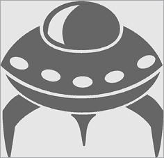
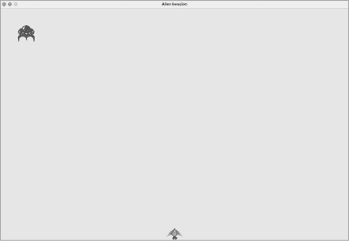
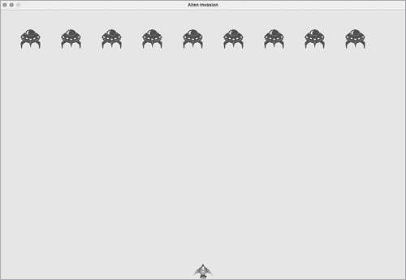
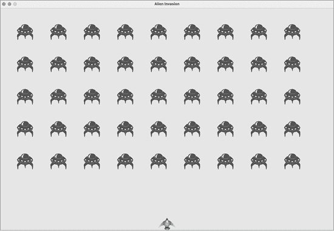
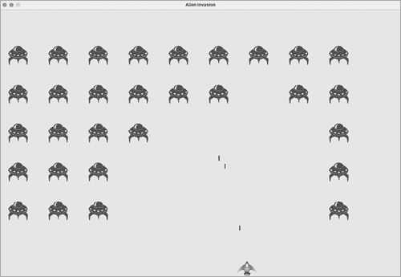
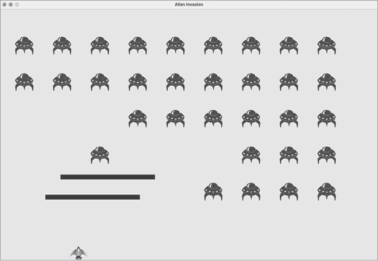

# 第十三章：外星人！


在本章中，我们将向*外星人入侵*游戏中添加外星人。我们将在屏幕的顶部附近添加一个外星人，然后生成一整队外星人。我们将使这支舰队向横向和纵向移动，并且在外星人被子弹击中时将其移除。最后，我们将限制玩家可使用的飞船数量，并在玩家用完所有飞船时结束游戏。

在本章的过程中，你将学到更多关于 Pygame 的知识，以及如何管理一个大型项目。你还将学到如何检测游戏对象之间的碰撞，比如子弹和外星人。检测碰撞帮助你定义游戏中元素之间的互动。例如，你可以把角色限制在迷宫的墙壁内，或者在两个角色之间传递一个球。我们将继续遵循一个偶尔会重新审视的计划，以保持我们编写代码时的专注。

在我们开始编写新代码，向屏幕添加外星人舰队之前，让我们先看看项目并更新我们的计划。

## 回顾项目

当你在大型项目中开始一个新的开发阶段时，重新审视你的计划并明确你想要通过编写的代码实现什么目标总是一个好主意。在本章中，我们将进行以下操作：

+   在屏幕的左上角添加一个外星人，并确保周围有适当的间距。

+   填满屏幕上方的区域，尽可能水平地排列多个外星人。然后我们将继续创建额外的外星人行，直到形成一支完整的舰队。

+   让舰队横向和纵向移动，直到整个舰队被击落、外星人撞到飞船，或外星人到达地面。如果整个舰队被击落，我们将创建一个新的舰队。如果外星人撞到飞船或地面，我们将摧毁飞船并创建一个新的舰队。

+   限制玩家可以使用的飞船数量，并在玩家用尽所有飞船时结束游戏。

我们将在实现功能时完善这个计划，但这个计划已经足够具体，足以开始编写代码。

当你开始为项目中的新功能编写代码时，你也应该回顾现有的代码。因为每一个新阶段通常会使项目变得更加复杂，所以最好清理任何杂乱或低效的代码。我们在进行时已经进行了重构，因此目前没有任何需要重构的代码。

## 创建第一个外星人

在屏幕上放置一个外星人就像放置一艘飞船一样。每个外星人的行为由一个名为`Alien`的类控制，我们将像`Ship`类一样构建它。为了简化，我们将继续使用位图图像。你可以为外星人选择自己的图像，或者使用在图 13-1 中显示的图像，该图像在本书的资源中可找到，网址为[`ehmatthes.github.io/pcc_3e`](https://ehmatthes.github.io/pcc_3e)。这张图像有一个灰色背景，和屏幕的背景颜色匹配。确保你将选择的图像文件保存在*images*文件夹中。



图 13-1：我们将用来建立舰队的外星人

### 创建外星人类

现在我们将编写`Alien`类，并将其保存为*alien.py*：

**alien.py**

```py
import pygame
from pygame.sprite import Sprite

class Alien(Sprite):
    """A class to represent a single alien in the fleet."""

    def __init__(self, ai_game):
        """Initialize the alien and set its starting position."""
        super().__init__()
        self.screen = ai_game.screen

        # Load the alien image and set its rect attribute.
        self.image = pygame.image.load('images/alien.bmp')
        self.rect = self.image.get_rect()

        # Start each new alien near the top left of the screen.
❶         self.rect.x = self.rect.width
        self.rect.y = self.rect.height

        # Store the alien's exact horizontal position.
❷         self.x = float(self.rect.x)
```

这个类的大部分内容与`Ship`类相似，除了外星人在屏幕上的位置。我们最初将每个外星人放置在屏幕的左上角附近；在它的左侧添加一个与外星人宽度相等的空隙，在它的上方添加一个与外星人高度相等的空隙 ❶，这样更容易查看。我们主要关注外星人的水平速度，因此我们将精确跟踪每个外星人的水平位置 ❷。

这个`Alien`类不需要绘制它到屏幕上的方法；相反，我们将使用 Pygame 的组方法，它会自动将组中的所有元素绘制到屏幕上。

### 创建外星人实例

我们想创建一个`Alien`实例，这样就可以在屏幕上看到第一个外星人。由于这属于我们的设置工作，我们会在`AlienInvasion`中的`__init__()`方法末尾添加这个实例的代码。最终，我们将创建一个完整的外星舰队，这将是相当繁重的工作，所以我们将创建一个新的辅助方法，命名为`_create_fleet()`。

类中的方法顺序并不重要，只要它们的位置保持一致。我将把`_create_fleet()`放在`_update_screen()`方法之前，但在`AlienInvasion`类中的任何地方都可以。首先，我们将导入`Alien`类。

以下是*alien_invasion.py*的更新`import`语句：

**alien_invasion.py**

```py
*--snip--*
from bullet import Bullet
from alien import Alien
```

这是更新后的`__init__()`方法：

**alien_invasion.py**

```py
 def __init__(self):
  *--snip--*
 self.ship = Ship(self)
 self.bullets = pygame.sprite.Group()
        self.aliens = pygame.sprite.Group()

        self._create_fleet()
```

我们创建一个组来存放外星舰队，并调用我们即将编写的`_create_fleet()`方法。

这是新的`_create_fleet()`方法：

**alien_invasion.py**

```py
 def _create_fleet(self):
        """Create the fleet of aliens."""
        # Make an alien.
        alien = Alien(self)
        self.aliens.add(alien)
```

在这个方法中，我们创建了一个`Alien`实例，然后将其添加到存放舰队的组中。外星人将被放置在屏幕的默认左上角区域。

为了让外星人出现，我们需要在`_update_screen()`中调用该组的`draw()`方法：

**alien_invasion.py**

```py
 def _update_screen(self):
  *--snip--*
 self.ship.blitme()
  self.aliens.draw(self.screen)

 pygame.display.flip()
```

当你在一个组上调用`draw()`时，Pygame 会在由该组的`rect`属性定义的位置绘制组内的每个元素。`draw()`方法需要一个参数：一个表面，在该表面上绘制组中的元素。图 13-2 展示了屏幕上出现的第一个外星人。



图 13-2：第一个外星人出现。

现在第一个外星人正确出现了，我们将编写代码来绘制整个舰队。

## 建立外星舰队

为了绘制一支舰队，我们需要弄清楚如何在屏幕的上半部分填充外星人，而不让游戏窗口变得过于拥挤。实现这个目标有多种方法。我们将通过在屏幕顶部从左到右添加外星人，直到没有空间再添加新的外星人为止。然后，只要我们有足够的垂直空间再添加一行外星人，我们就会重复这个过程。

### 创建一行外星人

现在我们准备生成完整的一排外星人。为了生成完整的一排，首先我们需要制作一个单独的外星人，以便获取外星人的宽度。我们将一个外星人放在屏幕的左侧，然后继续添加外星人，直到没有足够的空间为止：

**alien_invasion.py**

```py
 def _create_fleet(self):
 """Create the fleet of aliens."""
        # Create an alien and keep adding aliens until there's no room left.
        # Spacing between aliens is one alien width.
 alien = Alien(self)
        alien_width = alien.rect.width

❶         current_x = alien_width
❷         while current_x < (self.settings.screen_width - 2 * alien_width):
❸             new_alien = Alien(self)
❹             new_alien.x = current_x
            new_alien.rect.x = current_x
            self.aliens.add(new_alien)
❺             current_x += 2 * alien_width
```

我们从第一个创建的外星人中获取外星人的宽度，然后定义一个变量`current_x` ❶。它表示我们打算放置下一个外星人时的水平位置。我们最初将其设置为一个外星人的宽度，以便将舰队中的第一个外星人与屏幕的左边缘偏移。

接下来，我们开始`while`循环 ❷；我们将继续添加外星人，*只要*有足够的空间放置一个外星人。为了确定是否还有空间放置另一个外星人，我们将`current_x`与某个最大值进行比较。定义这个循环的第一次尝试可能看起来像这样：

```py
while current_x < self.settings.screen_width:
```

这看起来可能有效，但它会将最后一个外星人放置在屏幕的最右边。因此，我们在屏幕右侧添加了一些边距。只要屏幕右边至少有两个外星人宽度的空间，我们就会进入循环并向舰队中添加另一个外星人。

每当有足够的水平空间继续循环时，我们需要做两件事：在正确的位置创建一个外星人，并定义这一排中下一个外星人的水平位置。我们创建一个外星人并将其分配给`new_alien` ❸。然后我们将精确的水平位置设置为`current_x`的当前值 ❹。我们还将外星人的`rect`位置设置为这个相同的 *x* 值，并将新外星人添加到`self.aliens`组中。

最后，我们增加`current_x`的值 ❺。我们将水平位置增加两个外星人宽度，以便跳过刚刚添加的外星人，并且在外星人之间留出一些空隙。Python 会在`while`循环开始时重新评估条件，并决定是否还有足够的空间放置另一个外星人。当没有空间时，循环结束，我们应该已经有了一整排外星人。

当你现在运行 *Alien Invasion* 时，你应该能看到第一排外星人出现，正如图 13-3 所示。



图 13-3：第一排外星人

### 重构 `_create_fleet()`

如果到目前为止我们编写的代码足够用来创建一个舰队，我们可能会保持`_create_fleet()`不变。但我们还有更多工作要做，所以我们稍微清理一下这个方法。我们将添加一个新的辅助方法`_create_alien()`，并在`_create_fleet()`中调用它：

**alien_invasion.py**

```py
 def _create_fleet(self):
  *--snip--*
 while current_x < (self.settings.screen_width - 2 * alien_width):
            self._create_alien(current_x)
            current_x += 2 * alien_width

❶     def _create_alien(self, x_position):
        """Create an alien and place it in the row."""
 new_alien = Alien(self)
        new_alien.x = x_position
        new_alien.rect.x = x_position
 self.aliens.add(new_alien)
```

方法`_create_alien()`除了`self`外，还需要一个参数：指定外星人放置位置的 *x* 值 ❶。`_create_alien()`方法中的代码与`_create_fleet()`中的代码相同，只是我们将参数名`x_position`替换了`current_x`。这种重构使得添加新的一排并创建整个舰队变得更加简单。

### 添加新的一排

为了完成舰队的创建，我们将不断添加更多的行，直到没有空间为止。我们将使用嵌套循环——在当前的`while`循环外再包裹一个循环。内层循环通过关注外星人的* x *坐标，将外星人横向放置在一行中。外层循环通过关注* y *坐标，将外星人纵向放置。我们将在接近屏幕底部时停止添加行，留出足够的空间给飞船并留有一些空间来开始向外星人开火。

这是如何在`_create_fleet()`中嵌套两个`while`循环的：

```py
 def _create_fleet(self):
 """Create the fleet of aliens."""
 # Create an alien and keep adding aliens until there's no room left.
        # Spacing between aliens is one alien width and one alien height.
 alien = Alien(self)
❶         alien_width, alien_height = alien.rect.size

❷         current_x, current_y = alien_width, alien_height
❸         while current_y < (self.settings.screen_height - 3 * alien_height):
            while current_x < (self.settings.screen_width - 2 * alien_width):
❹                 self._create_alien(current_x, current_y)
                current_x += 2 * alien_width

❺             # Finished a row; reset x value, and increment y value.
            current_x = alien_width
            current_y += 2 * alien_height
```

我们需要知道外星人的高度，以便放置行，所以我们通过外星人`rect`的`size`属性来获取外星人的宽度和高度 ❶。一个`rect`的`size`属性是一个包含其宽度和高度的元组。

接下来，我们为舰队中第一个外星人的放置设置初始的* x *和* y *坐标 ❷。我们将其放置在离左边一外星人宽度的位置，并向下放置一个外星人高度的距离。然后我们定义一个`while`循环来控制有多少行外星人被放置到屏幕上 ❸。只要下一行的* y *坐标小于屏幕高度减去三倍外星人高度，我们就会继续添加行。（如果这没有留下足够的空间，我们可以稍后调整。）

我们调用`_create_alien()`并传递* y *坐标以及其* x *位置 ❹。稍后我们会修改`_create_alien()`方法。

注意最后两行代码的缩进 ❺。它们位于外层`while`循环内，但在内层`while`循环外。这段代码在内层循环完成后运行；每添加一行后它就执行一次。每添加一行后，我们重置`current_x`的值，以便下一行的第一个外星人放置在与上一行的第一个外星人相同的位置。然后我们将`current_y`的当前值加上两个外星人高度，这样下一行就会放得更低。缩进在这里非常重要；如果在本节末尾运行`alien_invasion.py`时看不到正确的舰队，请检查这些嵌套循环中所有行的缩进。

我们需要修改`_create_alien()`方法来正确设置外星人的垂直位置：

```py
 def _create_alien(self, x_position, y_position):
        """Create an alien and place it in the fleet."""
 new_alien = Alien(self)
 new_alien.x = x_position
 new_alien.rect.x = x_position
        new_alien.rect.y = y_position
 self.aliens.add(new_alien)
```

我们修改方法的定义，使其接受新外星人的* y *坐标，并在方法体内设置`rect`的垂直位置。

现在运行游戏时，你应该能看到一个完整的外星人舰队，如图 13-4 所示。



图 13-4：完整的舰队出现了。

在下一节中，我们将让舰队开始移动！

## 让舰队移动

现在，让我们让外星人舰队向右移动，直到碰到屏幕边缘，然后向下移动一定的距离并朝相反方向移动。我们将继续这个移动，直到所有外星人被击败、其中一个与飞船碰撞，或者某个外星人到达屏幕底部。我们先从让舰队向右移动开始。

### 让外星人向右移动

为了移动外星人，我们将在*alien.py*中使用一个`update()`方法，这个方法将会对外星人群体中的每个外星人进行调用。首先，添加一个设置来控制每个外星人的速度：

**settings.py**

```py
 def __init__(self):
  *--snip--*
        # Alien settings
        self.alien_speed = 1.0
```

然后使用此设置来实现*alien.py*中的`update()`方法：

**alien.py**

```py
 def __init__(self, ai_game):
 """Initialize the alien and set its starting position."""
 super().__init__()
 self.screen = ai_game.screen
        self.settings = ai_game.settings
        *--snip--*

def update(self):
    """Move the alien to the right."""
❶     self.x += self.settings.alien_speed
❷     self.rect.x = self.x
```

我们在`__init__()`中创建了一个`settings`参数，这样我们就可以在`update()`中访问外星人的速度。每次更新外星人位置时，我们都将其向右移动，移动的距离由`alien_speed`存储。我们通过`self.x`属性跟踪外星人确切的位置，`self.x`可以存储浮动值❶。然后，我们使用`self.x`的值来更新外星人`rect`的位置❷。

在主`while`循环中，我们已经有了更新飞船和子弹位置的调用。现在我们将添加一个调用来更新每个外星人的位置：

**alien_invasion.py**

```py
 while True:
 self._check_events()
 self.ship.update()
 self._update_bullets()
            self._update_aliens()
 self._update_screen()
 self.clock.tick(60)
```

我们即将编写一些代码来管理舰队的移动，因此我们创建了一个名为`_update_aliens()`的新方法。在子弹更新之后，我们会更新外星人的位置，因为我们很快就会检查是否有子弹击中外星人。

你将此方法放置在模块中的位置并不关键。但为了保持代码的组织性，我会将它放在`_update_bullets()`方法之后，以便与`while`循环中的方法调用顺序一致。以下是`_update_aliens()`的第一个版本：

**alien_invasion.py**

```py
 def _update_aliens(self):
        """Update the positions of all aliens in the fleet."""
        self.aliens.update()
```

我们在`aliens`组上使用`update()`方法，这将调用每个外星人的`update()`方法。现在运行*Alien Invasion*时，你应该会看到舰队向右移动并消失在屏幕的一侧。

### 创建舰队方向的设置

现在，我们将创建设置，使得当舰队撞到屏幕右边缘时，舰队会向下和向左移动。以下是实现这种行为的方法：

**settings.py**

```py
# Alien settings
self.alien_speed = 1.0
self.fleet_drop_speed = 10
# fleet_direction of 1 represents right; -1 represents left.
self.fleet_direction = 1
```

设置`fleet_drop_speed`控制每次外星人到达任何一侧时，舰队下移的速度。将这个速度与外星人的水平速度分开是有帮助的，这样你就可以独立调整这两个速度。

为了实现`fleet_direction`设置，我们可以使用类似`'left'`或`'right'`的文本值，但那样我们最终会得到测试舰队方向的`if`-`elif`语句。相反，因为我们只有两个方向要处理，我们使用值`1`和`-1`，每次舰队改变方向时交换它们。（使用数字也更有意义，因为向右移动涉及到增加每个外星人的*x*坐标值，而向左移动则是从每个外星人的*x*坐标值中减去。）

### 检查外星人是否撞到边缘

我们需要一个方法来检查外星人是否位于任一边缘，同时我们需要修改`update()`方法，以允许每个外星人向适当的方向移动。这段代码是`Alien`类的一部分：

**alien.py**

```py
def check_edges(self):
    """Return True if alien is at edge of screen."""
    screen_rect = self.screen.get_rect()
❶     return (self.rect.right >= screen_rect.right) or (self.rect.left <= 0)

def update(self):
    """Move the alien right or left."""
❷     self.x += self.settings.alien_speed * self.settings.fleet_direction
    self.rect.x = self.x
```

我们可以对任何外星人调用新的`check_edges()`方法，查看它是否位于左侧或右侧边缘。如果外星人的`rect`的`right`属性大于或等于屏幕`rect`的`right`属性，则它位于右边缘。如果它的`left`值小于或等于 0 ❶，则它位于左边缘。我们没有把这个条件判断放在`if`语句块中，而是直接把判断放在了`return`语句中。这个方法会在外星人位于右边缘或左边缘时返回`True`，否则返回`False`。

我们修改了`update()`方法，允许外星人向左或向右移动，方法是将外星人的速度乘以`fleet_direction`的值 ❷。如果`fleet_direction`为 1，外星人的当前位置会加上`alien_speed`的值，外星人向右移动；如果`fleet_direction`为−1，值会从外星人的位置中减去，外星人向左移动。

### 舰队下降并改变方向

当外星人到达屏幕边缘时，整个舰队需要下降并改变方向。因此，我们需要在`AlienInvasion`中添加一些代码，因为我们将在这里检查是否有外星人处于左侧或右侧边缘。我们将通过编写`_check_fleet_edges()`和`_change_fleet_direction()`方法来实现这一点，然后修改`_update_aliens()`。我会把这些新方法放在`_create_alien()`之后，但方法在类中的位置并不重要。

**alien_invasion.py**

```py
 def _check_fleet_edges(self):
        """Respond appropriately if any aliens have reached an edge."""
❶         for alien in self.aliens.sprites():
            if alien.check_edges():
❷                 self._change_fleet_direction()
                break

    def _change_fleet_direction(self):
 """Drop the entire fleet and change the fleet's direction."""
        for alien in self.aliens.sprites():
❸             alien.rect.y += self.settings.fleet_drop_speed
        self.settings.fleet_direction *= -1
```

在`_check_fleet_edges()`中，我们遍历整个舰队，并对每个外星人调用`check_edges()` ❶。如果`check_edges()`返回`True`，我们就知道有外星人处于边缘，整个舰队需要改变方向；因此，我们调用`_change_fleet_direction()`并跳出循环 ❷。在`_change_fleet_direction()`中，我们遍历所有外星人并使用`fleet_drop_speed`设置让它们下降 ❸；然后我们将`fleet_direction`的值乘以−1 来改变方向。改变舰队方向的那一行代码不是`for`循环的一部分。我们希望改变每个外星人的垂直位置，但只希望改变舰队的方向一次。

以下是对`_update_aliens()`的修改：

**alien_invasion.py**

```py
 def _update_aliens(self):
        """Check if the fleet is at an edge, then update positions."""
        self._check_fleet_edges()
        self.aliens.update()
```

我们通过在更新每个外星人位置之前调用`_check_fleet_edges()`方法来修改了这个方法。

当你现在运行游戏时，舰队应该会在屏幕的边缘之间来回移动，每次碰到边缘时就会下降。现在我们可以开始射击外星人，并观察任何碰到飞船或到达屏幕底部的外星人。

## 射击外星人

我们已经建造了我们的飞船和一支外星人舰队，但当子弹击中外星人时，它们会直接穿透过去，因为我们没有检测碰撞。在游戏编程中，*碰撞*发生在游戏元素重叠时。为了让子弹击落外星人，我们将使用`sprite.groupcollide()`函数来检查两个组成员之间的碰撞。

### 检测子弹碰撞

我们希望在子弹击中外星人时立即得知，这样我们就能在外星人被击中时立即让它消失。为此，我们将在更新所有子弹的位置后，立即检查碰撞。

`sprite.groupcollide()`函数将一个组中每个元素的`rect`与另一个组中每个元素的`rect`进行比较。在这种情况下，它将每颗子弹的`rect`与每个外星人的`rect`进行比较，并返回一个包含发生碰撞的子弹和外星人的字典。字典中的每个键将是一个子弹，而对应的值将是被击中的外星人。（我们将在第十四章实现评分系统时使用这个字典。）

将以下代码添加到`_update_bullets()`的末尾，以检查子弹与外星人之间的碰撞：

**alien_invasion.py**

```py
 def _update_bullets(self):
 """Update position of bullets and get rid of old bullets."""
  *--snip--*

        # Check for any bullets that have hit aliens.
        #   If so, get rid of the bullet and the alien.
        collisions = pygame.sprite.groupcollide(
                self.bullets, self.aliens, True, True)
```

我们添加的新代码比较了`self.bullets`中所有子弹和`self.aliens`中所有外星人的位置，并识别出任何重叠的部分。每当子弹和外星人的`rect`重叠时，`groupcollide()`会将一个键值对添加到它返回的字典中。两个`True`参数告诉 Pygame 删除已经碰撞的子弹和外星人。（要制作一颗可以穿越屏幕顶部并摧毁其路径上所有外星人的高能子弹，你可以将第一个布尔参数设置为`False`，并将第二个布尔参数保持为`True`。被击中的外星人会消失，但所有子弹会一直保持活动状态，直到它们消失在屏幕顶部。）

当你现在运行*外星人入侵*时，击中的外星人应该会消失。图 13-5 展示了一个部分被击落的舰队。



图 13-5：我们可以击落外星人！

### 为测试制作更大的子弹

你可以通过运行游戏来测试*外星人入侵*的许多功能，但某些功能在游戏的正常版本中测试起来很繁琐。例如，测试代码是否正确响应空舰队时，必须多次击落屏幕上的每个外星人，这是一项繁重的工作。

要测试特定功能，你可以更改某些游戏设置以集中测试特定区域。例如，你可以缩小屏幕，使需要击落的外星人更少，或增加子弹速度并一次性给予自己许多子弹。

我测试*外星人入侵*时最喜欢的更改是使用非常宽的子弹，即使它们击中外星人后仍保持活动状态（见图 13-6）。试试将`bullet_width`设置为 300，甚至 3,000，看看你能多快击落舰队！



图 13-6：超强子弹使游戏中的某些方面更容易进行测试。

这样的更改将帮助你更高效地测试游戏，并可能激发为玩家提供额外能力的创意。只需记得在测试完某个功能后，将设置恢复到正常状态。

### 重新填充舰队

*外星入侵*的一个关键特点是外星人是无情的：每当舰队被摧毁时，新的舰队应当出现。

为了在舰队被摧毁后让新的外星舰队出现，我们首先检查`aliens`组是否为空。如果为空，我们会调用`_create_fleet()`。我们将在`_update_bullets()`的最后进行此检查，因为那是个别外星人被摧毁的地方。

**alien_invasion.py**

```py
 def _update_bullets(self):
  *--snip--*
❶         if not self.aliens:
 # Destroy existing bullets and create new fleet.
❷             self.bullets.empty()
            self._create_fleet()
```

我们检查`aliens`组是否为空 ❶。一个空的组会被评估为`False`，所以这是一种简单的方法来检查组是否为空。如果为空，我们通过使用`empty()`方法清除所有现有的子弹，该方法会从组中移除所有剩余的精灵 ❷。我们还会调用`_create_fleet()`，重新填充屏幕上的外星人。

现在，一旦你摧毁当前舰队，新的舰队就会出现。

### 加速子弹

如果你尝试过在当前状态下向外星人开火，你可能会发现子弹的速度不适合游戏玩法。它们可能有些太慢，或者有些太快。此时，你可以修改设置，使游戏玩法更有趣。请记住，游戏会逐渐加速，所以开始时不要让游戏速度过快。

我们通过调整*settings.py*中`bullet_speed`的值来修改子弹的速度。在我的系统上，我将`bullet_speed`的值调整为 2.5，这样子弹会稍微快一点：

**settings.py**

```py
 # Bullet settings
        self.bullet_speed = 2.5
        self.bullet_width = 3
  *--snip--*
```

这个设置的最佳值取决于你对游戏的经验，因此需要找到适合你的值。你还可以调整其他设置。

### 重构 _update_bullets()

让我们重构`_update_bullets()`，让它不再做这么多不同的任务。我们将处理子弹和外星人碰撞的代码移到一个单独的方法中：

**alien_invasion.py**

```py
 def _update_bullets(self):
  *--snip--*
 # Get rid of bullets that have disappeared.
 for bullet in self.bullets.copy():
 if bullet.rect.bottom <= 0:
 self.bullets.remove(bullet)

  self._check_bullet_alien_collisions()

  def _check_bullet_alien_collisions(self):
        """Respond to bullet-alien collisions."""
        # Remove any bullets and aliens that have collided.
 collisions = pygame.sprite.groupcollide(
 self.bullets, self.aliens, True, True)

 if not self.aliens:
 # Destroy existing bullets and create new fleet.
 self.bullets.empty()
 self._create_fleet()
```

我们创建了一个新方法`_check_bullet_alien_collisions()`，用来检查子弹和外星人之间的碰撞，并在整个舰队被摧毁时作出适当反应。这样做避免了`_update_bullets()`变得过长，并简化了后续的开发。

## 结束游戏

玩一个无法失败的游戏有什么乐趣和挑战呢？如果玩家没有足够快地击落舰队，我们会让外星人摧毁飞船，当它们接触到飞船时。同时，我们会限制玩家可使用的飞船数量，当外星人到达屏幕底部时，飞船会被摧毁。游戏将在玩家用完所有飞船后结束。

### 检测外星飞船碰撞

我们将从检查外星人和飞船之间的碰撞开始，以便在外星人撞击飞船时做出适当反应。我们会在更新每个外星人的位置后立即检查外星人-飞船碰撞，在`AlienInvasion`中执行：

**alien_invasion.py**

```py
 def _update_aliens(self):
  *--snip--*
 self.aliens.update()

        # Look for alien-ship collisions.
❶         if pygame.sprite.spritecollideany(self.ship, self.aliens):
❷             print("Ship hit!!!")
```

`spritecollideany()`函数接受两个参数：一个精灵和一个组。该函数查找组中任何与精灵发生碰撞的成员，并在找到一个发生碰撞的成员后立即停止遍历组。在这里，它遍历`aliens`组，并返回第一个与`ship`发生碰撞的外星人。

如果没有发生碰撞，`spritecollideany()`将返回`None`，`if`语句块不会执行❶。如果它找到了与飞船发生碰撞的外星人，它将返回该外星人，`if`语句块将执行：打印`Ship hit!!!`❷。当外星人撞击飞船时，我们需要执行一些任务：删除所有剩余的外星人和子弹，重新定位飞船，并创建一个新的舰队。在编写代码之前，我们想确保我们检测外星人-飞船碰撞的方法是正确的。通过编写一个`print()`调用是确保我们正确检测碰撞的一种简单方法。

现在，当你运行*Alien Invasion*时，每当外星人撞到飞船时，终端中应该会显示消息*Ship hit!!!*。在测试此功能时，将`fleet_drop_speed`设置为更高的值，例如 50 或 100，这样外星人会更快地到达飞船。

### 响应外星人-飞船碰撞

现在我们需要弄清楚当外星人和飞船发生碰撞时到底会发生什么。我们将通过追踪游戏的统计数据来计算飞船被击中的次数，而不是销毁`ship`实例并创建一个新的。追踪统计数据对于得分也很有用。

让我们编写一个新的类`GameStats`来跟踪游戏统计数据，并将其保存为*game_stats.py*：

**game_stats.py**

```py
class GameStats:
    """Track statistics for Alien Invasion."""

    def __init__(self, ai_game):
        """Initialize statistics."""
        self.settings = ai_game.settings
❶         self.reset_stats()

    def reset_stats(self):
        """Initialize statistics that can change during the game."""
        self.ships_left = self.settings.ship_limit
```

我们将在*Alien Invasion*运行的整个过程中创建一个`GameStats`实例，但每次玩家开始新游戏时，我们需要重置一些统计数据。为此，我们将在`reset_stats()`方法中初始化大部分统计数据，而不是直接在`__init__()`中初始化。我们将在`__init__()`中调用此方法，以便在首次创建`GameStats`实例时正确设置统计数据❶。但我们也可以在玩家开始新游戏时随时调用`reset_stats()`。目前我们只有一个统计数据，`ships_left`，它的值会在整个游戏过程中发生变化。

玩家起始的飞船数量应该保存在*settings.py*中，作为`ship_limit`：

**settings.py**

```py
# Ship settings
        self.ship_speed = 1.5
        self.ship_limit = 3
```

我们还需要在*alien_invasion.py*中做一些修改，以便创建一个`GameStats`实例。首先，我们将更新文件顶部的`import`语句：

**alien_invasion.py**

```py
import sys
from time import sleep

import pygame

from settings import Settings
from game_stats import GameStats
from ship import Ship
*--snip--*
```

我们从 Python 标准库的`time`模块导入`sleep()`函数，这样当飞船被击中时，我们可以暂停游戏片刻。我们还导入了`GameStats`。

我们将在`__init__()`中创建一个`GameStats`实例：

**alien_invasion.py**

```py
 def __init__(self):
  *--snip--*
 self.screen = pygame.display.set_mode(
 (self.settings.screen_width, self.settings.screen_height))
 pygame.display.set_caption("Alien Invasion")

        # Create an instance to store game statistics.
        self.stats = GameStats(self)

 self.ship = Ship(self)
  *--snip--*
```

我们在创建游戏窗口后，但在定义其他游戏元素（如飞船）之前创建实例。

当外星人撞击飞船时，我们会将剩余飞船数量减去 1，销毁所有现有的外星人和子弹，创建一个新的舰队，并将飞船重新定位到屏幕中央。我们还会暂停游戏片刻，以便玩家能够注意到碰撞，并在新舰队出现之前重新集结。

让我们把大部分代码放在一个名为`_ship_hit()`的新方法中。当外星人撞击飞船时，我们会从`_update_aliens()`中调用这个方法：

**alien_invasion.py**

```py
 def _ship_hit(self):
        """Respond to the ship being hit by an alien."""
        # Decrement ships_left.
❶         self.stats.ships_left -= 1

        # Get rid of any remaining bullets and aliens.
❷         self.bullets.empty()
        self.aliens.empty()

        # Create a new fleet and center the ship.
❸         self._create_fleet()
        self.ship.center_ship()

 # Pause.
❹         sleep(0.5)
```

新方法`_ship_hit()`协调外星人撞击飞船时的响应。在`_ship_hit()`中，剩余飞船的数量减少 1❶，然后我们清空`bullets`和`aliens`两个组❷。

接下来，我们创建一个新的舰队并将飞船置于屏幕中央❸。（稍后我们会在`Ship`类中添加`center_ship()`方法。）然后，我们在更新所有游戏元素后但在任何更改绘制到屏幕之前添加一个暂停，以便玩家可以看到他们的飞船被撞击❹。`sleep()`调用会暂停程序执行半秒钟，足够让玩家看到外星人撞击飞船。当`sleep()`函数结束时，代码执行会转到`_update_screen()`方法，该方法将新的舰队绘制到屏幕上。

在`_update_aliens()`中，当外星人撞击飞船时，我们将`print()`调用替换为对`_ship_hit()`的调用：

**alien_invasion.py**

```py
 def _update_aliens(self):
  *--snip--*
 if pygame.sprite.spritecollideany(self.ship, self.aliens):
            self._ship_hit()
```

这是新的`center_ship()`方法，它属于*ship.py*：

**ship.py**

```py
def center_ship(self):
        """Center the ship on the screen."""
        self.rect.midbottom = self.screen_rect.midbottom
        self.x = float(self.rect.x)
```

我们以和`__init__()`中相同的方式将飞船居中。居中后，我们重置`self.x`属性，这样就可以跟踪飞船的准确位置。

运行游戏，射击几个外星人，让一个外星人撞击飞船。游戏应该暂停，并且一个新的舰队应该出现，飞船重新居中出现在屏幕底部。

### 到达屏幕底部的外星人

如果外星人到达屏幕底部，游戏会像外星人撞击飞船时那样做出响应。为了检查何时发生这种情况，请在*alien_invasion.py*中添加一个新方法：

**alien_invasion.py**

```py
 def _check_aliens_bottom(self):
        """Check if any aliens have reached the bottom of the screen."""
        for alien in self.aliens.sprites():
❶             if alien.rect.bottom >= self.settings.screen_height:
                # Treat this the same as if the ship got hit.
                self._ship_hit()
                break
```

方法`_check_aliens_bottom()`检查是否有外星人到达屏幕底部。当外星人的`rect.bottom`值大于或等于屏幕高度时，外星人就到达底部❶。如果外星人到达底部，我们调用`_ship_hit()`。如果一个外星人撞到底部，就不需要检查其他外星人，因此在调用`_ship_hit()`后，我们会跳出循环。

我们将在`_update_aliens()`中调用这个方法：

**alien_invasion.py**

```py
 def _update_aliens(self):
  *--snip--*
 # Look for alien-ship collisions.
 if pygame.sprite.spritecollideany(self.ship, self.aliens):
 self._ship_hit()

        # Look for aliens hitting the bottom of the screen.
        self._check_aliens_bottom()
```

在更新所有外星人位置并检查外星人与飞船的碰撞后，我们调用`_check_aliens_bottom()`。现在每次飞船被外星人撞击或外星人到达屏幕底部时，都会出现一个新的舰队。

### 游戏结束！

*外星人入侵*现在感觉更完整了，但游戏永远不会结束。`ships_left`的值会越来越负。让我们添加一个`game_active`标志，这样当玩家用尽船只时，我们就可以结束游戏。我们将在`AlienInvasion`类的`__init__()`方法末尾设置此标志：

**alien_invasion.py**

```py
 def __init__(self):
  *--snip--*
        # Start Alien Invasion in an active state.
        self.game_active = True
```

现在我们向`_ship_hit()`中添加代码，当玩家用尽所有船只时，将`game_active`设置为`False`：

**alien_invasion.py**

```py
 def _ship_hit(self):
 """Respond to ship being hit by alien."""
        if self.stats.ships_left > 0:
            # Decrement ships_left.
 self.stats.ships_left -= 1
  *--snip--*
 # Pause.
 sleep(0.5)
        else:
            self.game_active = False
```

`_ship_hit()`的大部分内容保持不变。我们将所有现有代码移动到了一个`if`语句块中，用于检查玩家是否至少剩下一个船只。如果有，我们创建一个新的舰队，暂停并继续。如果玩家没有剩余的船只，我们将`game_active`设置为`False`。

### 确定游戏中哪些部分应该运行

我们需要确定游戏中应该始终运行的部分以及仅在游戏处于活动状态时才运行的部分：

**alien_invasion.py**

```py
 def run_game(self):
 """Start the main loop for the game."""
 while True:
 self._check_events()

       if self.game_active:
 self.ship.update()
 self._update_bullets()
 self._update_aliens()

 self._update_screen()
 self.clock.tick(60)
```

在主循环中，我们始终需要调用`_check_events()`，即使游戏处于非活动状态。例如，我们仍然需要知道用户是否按下 Q 键退出游戏，或者是否点击了关闭窗口的按钮。我们还需要继续更新屏幕，以便在等待玩家选择是否开始新游戏时，我们可以对屏幕进行更改。其余的函数调用只有在游戏处于活动状态时才需要执行，因为当游戏不活动时，我们不需要更新游戏元素的位置。

现在，当你玩*外星人入侵*时，当你用完所有船只后，游戏应该暂停。

## 总结

在本章中，你学会了如何通过创建外星人舰队将大量相同的元素添加到游戏中。你使用了嵌套循环创建了一个元素网格，并通过调用每个元素的`update()`方法使大量游戏元素移动。你学会了控制屏幕上物体的方向，并响应特定情况，例如舰队到达屏幕边缘时。你还检测并响应了子弹击中外星人和外星人撞击船只的碰撞。你还学会了如何跟踪游戏中的统计数据，并使用`game_active`标志来判断游戏是否结束。

在本项目的下一章，也是最后一章，我们将添加一个“播放”按钮，让玩家可以选择何时开始他们的第一局游戏，并在游戏结束时选择是否重新开始。每次玩家击败整个舰队时，我们将加速游戏，并且我们会添加一个计分系统。最终的结果将是一个完全可玩的游戏！
