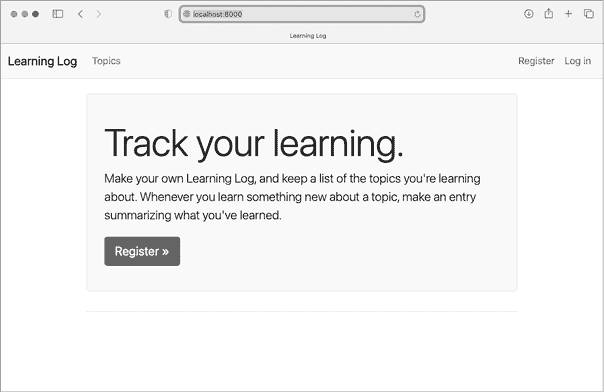
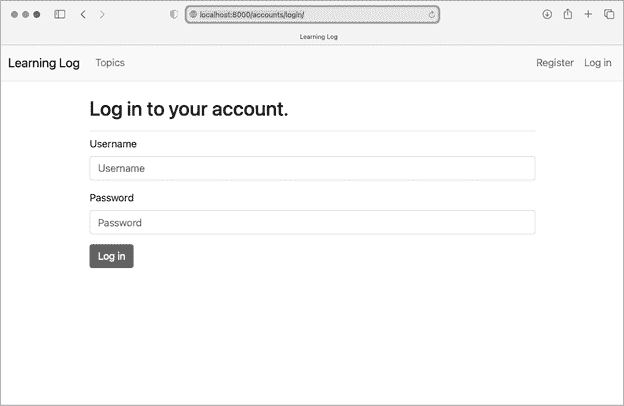
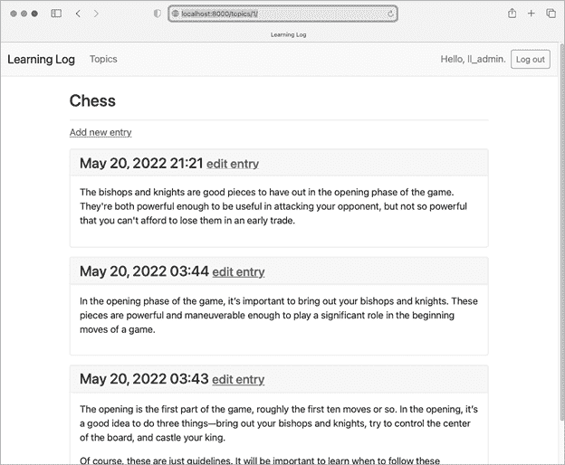

# 第二十章：样式和部署应用程序


Learning Log 现在已经完全可用，但它没有样式，仅在本地计算机上运行。在这一章中，你将以简单但专业的方式为项目添加样式，然后将其部署到实时服务器，使世界上任何人都可以注册并使用它。

对于样式，我们将使用*Bootstrap*库，这是一组用于为 Web 应用程序添加样式的工具，使其在所有现代设备上看起来都很专业，从小型手机到大型桌面显示器。为此，我们将使用 django-bootstrap5 应用程序，它还将帮助你练习使用其他 Django 开发者创建的应用程序。

我们将使用*Platform.sh*部署 Learning Log，这是一个允许你将项目推送到其服务器的站点，从而使其对任何有互联网连接的人可用。我们还将开始使用一种名为 Git 的版本控制系统来跟踪项目的变更。

当你完成 Learning Log 后，你将能够开发简单的 Web 应用程序，赋予它们专业的外观与感觉，并将其部署到实时服务器上。你还将能够在提升技能的过程中使用更高级的学习资源。

## 为 Learning Log 添加样式

我们故意推迟了样式设置，直到现在才开始，以便首先关注 Learning Log 的功能。这是一种不错的开发方式，因为一个应用程序只有在其功能正常时才有用。一旦应用程序能够正常工作，它的外观就变得至关重要，这样用户才会想使用它。

在这一部分，我们将安装 django-bootstrap5 应用程序并将其添加到项目中。然后，我们将使用它为项目中的各个页面添加样式，以便所有页面具有一致的外观和感觉。

### django-bootstrap5 应用程序

我们将使用 django-bootstrap5 将 Bootstrap 集成到我们的项目中。这个应用程序会下载所需的 Bootstrap 文件，将其放置在项目中的适当位置，并在项目的模板中提供样式指令。

要安装 django-bootstrap5，请在活动的虚拟环境中执行以下命令：

```py
(ll_env)learning_log$ **pip install django-bootstrap5**
`--snip--`
Successfully installed beautifulsoup4-4.11.1 django-bootstrap5-21.3
    soupsieve-2.3.2.post1
```

接下来，我们需要将 django-bootstrap5 添加到`INSTALLED_APPS`中的*settings.py*：

**settings.py**

```py
*--snip--*
INSTALLED_APPS = [
 # My apps.
 'learning_logs',
 'accounts',

    # Third party apps.
    'django_bootstrap5',

 # Default django apps.
 'django.contrib.admin',
  *--snip--*
```

为由其他开发者创建的应用程序启动一个新的部分，命名为 `Third party apps`，并将 `'django_bootstrap5'` 添加到该部分。确保将此部分放在 `My apps` 之后，但在包含 Django 默认应用程序的部分之前。

### 使用 Bootstrap 为 Learning Log 添加样式

Bootstrap 是一个庞大的样式工具集。它还提供了若干模板，可以应用到你的项目中，从而创建整体样式。使用这些模板比单独使用个别样式工具要简单得多。要查看 Bootstrap 提供的模板，请访问 [`getbootstrap.com`](https://getbootstrap.com) 并点击 **Examples**。我们将使用*Navbar static*模板，它提供了一个简单的顶部导航栏和一个页面内容的容器。

图 20-1 展示了应用 Bootstrap 模板并稍微修改*index.xhtml*后，主页的样子。



图 20-1：使用 Bootstrap 的学习日志主页

### 修改 base.xhtml

我们需要使用 Bootstrap 模板重写*base.xhtml*。我们将分段开发新的*base.xhtml*。这是一个较大的文件，你可以从[`ehmatthes.github.io/pcc_3e`](https://ehmatthes.github.io/pcc_3e)的在线资源中复制该文件。如果你复制了该文件，仍然应该阅读以下部分，以了解所做的更改。

#### 定义 HTML 头部

我们对*base.xhtml*所做的第一个修改是定义文件中的 HTML 头部。我们还将为在模板中使用 Bootstrap 添加一些要求，并为页面设置标题。删除*base.xhtml*中的所有内容，并用以下代码替换它：

**base.xhtml**

```py
❶ <!doctype html>
❷ <html lang="en">
❸ <head>
  <meta charset="utf-8">
  <meta name="viewport" content="width=device-width, initial-scale=1">
❹   <title>Learning Log</title>

❺   
  
  

</head>
```

我们首先将此文件声明为一个用英语编写的 HTML 文档 ❶。HTML 文件分为两个主要部分：*头部*和*主体*。文件的头部以一个`<head>`标签开始 ❸。HTML 文件的头部不包含页面内容；它只是告诉浏览器如何正确显示页面所需的信息。我们为页面包含一个`<title>`元素，该元素将在浏览器的标题栏中显示每当“学习日志”页面被打开时 ❹。

在关闭头部部分之前，我们加载 django-bootstrap5 中可用的模板标签集 ❺。模板标签``是 django-bootstrap5 的一个自定义标签，它加载实现 Bootstrap 样式所需的所有 CSS 文件。接下来的标签启用页面上可能使用的所有交互行为，例如可折叠的导航栏。最后一行是关闭的`</head>`标签。

所有 Bootstrap 样式选项现在可以在任何继承自*base.xhtml*的模板中使用。如果你想在模板中使用 django-bootstrap5 的自定义模板标签，则每个模板都需要包含``标签。

#### 定义导航栏

定义页面顶部导航栏的代码相当长，因为它必须在狭窄的手机屏幕和宽大的桌面显示器上都能很好地工作。我们将分段处理导航栏。

这是导航栏的第一部分：

**base.xhtml**

```py
*--snip--*
</head>
<body>

❶   <nav class="navbar navbar-expand-md navbar-light bg-light mb-4 border">
    <div class="container-fluid">
❷       <a class="navbar-brand" href="">
          Learning Log</a>

❸       <button class="navbar-toggler" type="button" data-bs-toggle="collapse"
        data-bs-target="#navbarCollapse" aria-controls="navbarCollapse"
        aria-expanded="false" aria-label="Toggle navigation">
        <span class="navbar-toggler-icon"></span>
      </button>

❹       <div class="collapse navbar-collapse" id="navbarCollapse">
❺         <ul class="navbar-nav me-auto mb-2 mb-md-0">
❻           <li class="nav-item">
❼             <a class="nav-link" href="">
              Topics</a></li>
        </ul> <!-- End of links on left side of navbar -->
      </div> <!-- Closes collapsible parts of navbar -->

    </div> <!-- Closes navbar's container -->
  </nav> <!-- End of navbar -->

❽ 

</body>
</html>
```

第一个新元素是开启的 `<body>` 标签。HTML 文件的 *body* 部分包含用户将在页面上看到的内容。接下来是一个 `<nav>` 元素，它开启了页面顶部导航栏的代码❶。这个元素中包含的所有内容都按照由选择器 `navbar`、`navbar-expand-md` 以及你在这里看到的其他选择器定义的 Bootstrap 样式规则进行样式设置。*选择器* 决定了哪些页面元素应用某个样式规则。`navbar-light` 和 `bg-light` 选择器为导航栏设置了浅色主题背景。`mb` 在 `mb-4` 中是 *margin-bottom*（下外边距）的缩写；该选择器确保在导航栏与页面其他部分之间出现一点空间。`border` 选择器为浅色背景提供了一条细边框，使其与页面其他部分略有区分。

下一行的 `<div>` 标签打开了一个可调整大小的容器，用于容纳整个导航栏。*div* 是 *division* 的缩写；你通过将网页分为几个部分来构建页面，并定义适用于该部分的样式和行为规则。任何在 `<div>` 开启标签中定义的样式或行为规则会影响从开启标签到其对应闭合标签 `</div>` 之间的所有内容。

接下来我们将项目名称 `Learning Log` 设置为导航栏中的第一个元素❷。它还将作为首页的链接，就像在我们之前两章构建的简洁版项目中那样。`navbar-brand` 选择器为此链接设置样式，使其从其他链接中脱颖而出，并帮助为网站增加品牌元素。

Bootstrap 模板定义了一个按钮，当浏览器窗口太窄，无法水平显示整个导航栏时，按钮会显示出来❸。当用户点击该按钮时，导航元素会以下拉列表的形式显示。`collapse` 参考标记会在用户缩小浏览器窗口或网站在小屏设备上显示时，使导航栏折叠。

接下来，我们开启导航栏的新部分（`<div>`）❹。这是导航栏的可折叠部分，取决于浏览器窗口的大小。

Bootstrap 将导航元素定义为无序列表中的项目❺，并设置样式规则使其看起来不像列表。你需要在导航栏中包含的每个链接或元素都可以作为无序列表中的一项❻。这里，列表中唯一的项目是指向主题页面的链接❼。注意链接末尾的闭合 `</li>` 标签；每个开启标签都需要对应的闭合标签。

这里显示的其余行关闭了所有已打开的标签。在 HTML 中，注释的写法如下：

```py
<!-- This is an HTML comment. -->
```

关闭标签通常没有注释，但如果你是 HTML 新手，给一些关闭标签加上注释是非常有帮助的。一个遗漏的标签或一个多余的标签可能会影响整个页面的布局。我们也包括了`content`块❽以及关闭的`</body>`和`</html>`标签。

我们还没有完成导航栏，但现在我们已经有了一个完整的 HTML 文档。如果`runserver`当前正在运行，停止当前的服务器并重新启动它。访问项目的主页，你应该能看到一个导航栏，里面包含了图 20-1 中显示的一些元素。现在，让我们将其余的元素添加到导航栏中。

#### 添加用户账户链接

我们仍然需要添加与用户账户相关的链接。我们将首先添加所有与账户相关的链接，除了注销表单。

对*base.xhtml*进行以下更改：

**base.xhtml**

```py
 *--snip--*
 </ul> <!-- End of links on left side of navbar -->

        <!-- Account-related links -->
❶         <ul class="navbar-nav ms-auto mb-2 mb-md-0">

❷           
            <li class="nav-item">
❸               <span class="navbar-text me-2">Hello, {{ user.username }}.
                </span></li>
❹           
            <li class="nav-item">
              <a class="nav-link" href="">
                  Register</a></li>
            <li class="nav-item">
              <a class="nav-link" href="">
                  Log in</a></li>
          

        </ul> <!-- End of account-related links -->

 </div> <!-- Closes collapsible parts of navbar -->
  *--snip--*
```

我们通过使用另一个开口的`<ul>`标签❶开始一组新的链接。你可以根据需要在页面上拥有多个链接组。选择器`ms-auto`是*margin-start-automatic*的缩写：这个选择器会检查导航栏中的其他元素，并计算出一个左（开始）边距，将这一组链接推到浏览器窗口的右侧。

`if`块与我们之前用来根据用户是否登录显示适当信息的条件块相同❷。这个块现在稍微长了一些，因为在条件标签内部有一些样式规则。对已认证用户的问候被包裹在一个`<span>`元素中❸。*span 元素*用于样式化长行文本或页面元素的部分，而`div`元素则在页面中创建自己的分区。虽然许多页面有深层嵌套的`div`元素，但在这里我们使用`span`元素来样式化导航栏中的信息文本：在这种情况下，是已登录用户的姓名。

在`else`块中，针对未认证用户，我们包含了注册新账户和登录的链接❹。这些链接应该与指向主题页面的链接样式相同。

如果你想在导航栏中添加更多的链接，你可以在我们已经定义的`<ul>`组中添加另一个`<li>`项，使用像你在这里看到的样式指令。

现在让我们将注销表单添加到导航栏中。

#### 将注销表单添加到导航栏

当我们第一次编写注销表单时，我们将其添加到了*base.xhtml*的底部。现在，让我们把它放到一个更合适的位置——导航栏中：

**base.xhtml**

```py
 *--snip--*
 </ul> <!-- End of account-related links -->

        
          <form action="" method='post'>
            
❶             <button name='submit' class='btn btn-outline-secondary btn-sm'>
                Log out</button>
          </form>
        

 </div> <!-- Closes collapsible parts of navbar -->
  *--snip--*
```

注销表单应放在与账户相关链接的后面，但要放在导航栏的可折叠部分中。表单中唯一的变化是`<button>`元素中加入了一些 Bootstrap 样式类，这些类将 Bootstrap 的样式应用到注销按钮上❶。

重新加载主页，你应该能够使用你创建的任何账户进行登录和登出。

我们仍然需要在 *base.xhtml* 中添加一些内容。我们需要定义两个区块，供各个页面使用，以便放置与这些页面特定内容相关的内容。

#### 定义页面的主体部分

*base.xhtml* 的其余部分包含了页面的主体部分：

**base.xhtml**

```py
 *--snip--*
 </nav> <!-- End of navbar -->

❶   <main class="container">
❷     <div class="pb-2 mb-2 border-bottom">
      
    </div>
❸     <div>
      
    </div>
  </main>

</body>
</html>
```

我们首先打开一个 `<main>` 标签 ❶。*main* 元素用于页面主体中最重要的部分。在这里，我们为它分配了 Bootstrap 选择器 `container`，这是一个简单的方式来将页面元素进行分组。我们将在这个容器中放置两个 div 元素。

第一个 div 元素包含一个 `page_header` 区块 ❷。我们将使用这个区块为大多数页面命名。为了让这个部分从页面的其他部分中突出，我们在标题下方添加了一些填充。*填充*是指元素内容与其边框之间的空间。选择器 `pb-2` 是一个 Bootstrap 指令，它在被样式化元素的底部提供适量的填充。*边距*是指元素的边框与页面上其他元素之间的空间。选择器 `mb-2` 在这个 div 的底部提供适量的边距。我们希望在这个区块的底部加上边框，因此我们使用选择器 `border-bottom`，它在 `page_header` 区块的底部提供一个细边框。

然后我们再定义一个 div 元素，包含 `content` 区块 ❸。我们没有为这个区块应用任何特定的样式，因此可以根据页面的需求来样式化任何页面的内容。*base.xhtml* 文件的结尾部分包含了 `main`、`body` 和 `html` 元素的闭合标签。

当你在浏览器中加载 Learning Log 的主页时，你应该看到一个专业外观的导航栏，和 图 20-1 中显示的相匹配。尝试调整窗口的宽度，使其变得非常窄；此时，导航栏应该会被一个按钮替代。点击这个按钮，所有链接应该会以下拉列表的形式出现。

### 使用 Jumbotron 样式化主页

为了更新主页，我们将使用一个叫做 *jumbotron* 的 Bootstrap 元素，一个从页面其他部分突出的较大框。通常它用于主页，放置项目的简短描述以及一个呼吁行动的按钮，邀请观众参与进来。

这是修改后的 *index.xhtml* 文件：

**index.xhtml**

```py


❶ 
❷   <div class="p-3 mb-4 bg-light border rounded-3">
    <div class="container-fluid py-4">
❸       <h1 class="display-3">Track your learning.</h1>

❹       <p class="lead">Make your own Learning Log, and keep a list of the
      topics you're learning about. Whenever you learn something new
      about a topic, make an entry summarizing what you've learned.</p>

❺       <a class="btn btn-primary btn-lg mt-1"
        href="">Register &raquo;</a>
    </div>
  </div>

```

我们首先告诉 Django，我们即将定义 `page_header` 区块的内容 ❶。Jumbotron 是通过一对 div 元素实现的，并对它们应用了一些样式指令 ❷。外部 div 具有填充和边距设置、浅色背景以及圆角。内部 div 是一个容器，它会随着窗口大小的变化而改变，并且也有一些填充。`py-4` 选择器为 div 元素的上下添加了填充。你可以随意调整这些设置中的数字，看看主页的变化。

jumbotron 内部有三个元素。第一个是一个简短的信息，`Track your learning`，它让新访客了解 Learning Log 的功能 ❸。`<h1>` 元素是一个一级标题，`display-3` 选择器为这个标题添加了更瘦更高的外观。我们还包括了一条更长的信息，提供有关用户可以如何使用学习日志的更多信息 ❹。这段文字格式化为 `lead` 段落，旨在与普通段落区分开来。

我们没有仅仅使用文本链接，而是创建了一个按钮，邀请用户在 Learning Log 上注册帐户 ❺。这是与标题中相同的链接，但按钮在页面上更为突出，向查看者展示了他们需要做什么才能开始使用这个项目。这里看到的选择器将其样式化为一个大型按钮，表示一个行动号召。代码 `&raquo;` 是一个 *HTML 实体*，看起来像两个右尖括号（>>）结合在一起。最后，我们提供了关闭的 div 标签并结束了 `page_header` 块。由于该文件中只有两个 div 元素，标记关闭的 div 标签并没有太大帮助。我们不会再往这个页面添加内容，因此不需要在这个模板中定义 `content` 块。

主页现在看起来像 图 20-1。这比项目的未样式化版本有了显著的改进！

### 样式化登录页面

我们已经优化了登录页面的整体外观，但登录表单本身还没有任何样式。让我们通过修改 *login.xhtml*，让表单的样式与页面的其余部分保持一致：

**login.xhtml**

```py

❶ 

❷ 
  <h2>Log in to your account.</h2>




 <form action="" method='post'>
 
❸     
❹     
 </form>


```

我们首先将 `bootstrap5` 模板标签加载到这个模板中 ❶。然后我们定义了 `page_header` 块，告诉用户这个页面的用途 ❷。注意，我们已经从模板中移除了 `` 块；django-bootstrap5 会自动处理表单错误。

为了显示表单，我们使用了模板标签 `` ❸；这替代了我们在第十九章中使用的 `{{ form.as_div }}` 元素。`` 模板标签会在渲染表单时，将 Bootstrap 样式规则插入到表单的各个元素中。为了生成提交按钮，我们使用了 `` 标签，并通过参数指定它为提交按钮，标签为 `Log in` ❹。

图 20-2 显示了现在的登录表单。页面变得更加简洁，样式一致且目的明确。尝试使用错误的用户名或密码登录；你会看到，即使是错误信息的样式也与整个网站的样式一致，并且能够很好地融入其中。



图 20-2：用 Bootstrap 样式化的登录页面

### 样式化话题页面

让我们确保查看信息的页面也得到了适当的样式化，从话题页面开始：

**topics.xhtml**

```py



❶   <h1>Topics</h1>




❷   <ul class="list-group border-bottom pb-2 mb-4">
 
❸       <li class="list-group-item border-0">
        <a href="">
          {{ topic.text }}</a>
      </li>
 
❹       <li class="list-group-item border-0">No topics have been added yet.</li>
 
 </ul>

 <a href="">Add a new topic</a>


```

我们不需要 `` 标签，因为在这个文件中我们没有使用任何自定义的 bootstrap5 模板标签。我们将标题 `Topics` 移动到 `page_header` 块，并将其改为 `<h1>` 元素，而不是简单的段落 ❶。

该页面的主要内容是一个话题列表，因此我们使用 Bootstrap 的*列表组*组件来渲染页面。此组件为整体列表以及每个列表项应用了一组简单的样式指令。当我们打开 `<ul>` 标签时，我们首先包含 `list-group` 类，以便将默认的样式指令应用到列表上 ❷。我们通过在列表的底部添加一个边框、在列表下方添加一点内边距（`pb-2`），并在底部边框下方添加一个边距（`mb-4`）来进一步定制列表。

列表中的每个项都需要 `list-group-item` 类，我们通过去掉单独项的边框来定制默认样式 ❸。当列表为空时显示的消息也需要这些相同的类 ❹。

当你现在访问话题页面时，应该能看到一个与主页样式匹配的页面。

### 为话题页面上的条目添加样式

在话题页面，我们将使用 Bootstrap 的卡片组件，使每个条目更加突出。一个*卡片*是一个可以嵌套的 div 集合，具有灵活的预定义样式，完美适用于展示话题的条目：

**topic.xhtml**

```py


❶ 
  <h1>{{ topic.text }}</h1>



 <p>
 <a href="">Add new entry</a>
 </p>

 
❷     <div class="card mb-3">
      <!-- Card header with timestamp and edit link -->
❸       <h4 class="card-header">
        {{ entry.date_added|date:'M d, Y H:i' }}
❹         <small><a href="">
          edit entry</a></small>
      </h4>
      <!-- Card body with entry text -->
❺       <div class="card-body">{{ entry.text|linebreaks }}</div>
    </div>
 
❻     <p>There are no entries for this topic yet.</p>
 


```

我们首先将话题放置在 `page_header` 块中 ❶。然后我们删除了之前在此模板中使用的无序列表结构。我们不再将每个条目作为列表项，而是打开一个带有 `card` 选择器的 div 元素 ❷。这个卡片有两个嵌套元素：一个用来显示时间戳和编辑条目的链接，另一个用来显示条目的正文。`card` 选择器负责为这个 div 提供大部分样式；我们通过为每个卡片的底部添加一个小的边距（`mb-3`）来定制卡片。

卡片中的第一个元素是一个头部，它是一个带有 `card-header` 选择器的 `<h4>` 元素 ❸。这个头部包含了条目创建的日期和一个编辑条目的链接。围绕 `edit_entry` 链接的 `<small>` 标签使其看起来比时间戳略小 ❹。第二个元素是一个带有 `card-body` 选择器的 div ❺，它将条目的文本放入卡片的一个简单框中。请注意，包含页面信息的 Django 代码没有变化；只是影响页面外观的元素发生了变化。由于我们不再使用无序列表，因此我们用简单的段落标签替换了空列表消息周围的列表项标签 ❻。

图 20-3 显示了带有新外观的话题页面。学习日志的功能没有变化，但看起来明显更专业，且更能吸引用户。

如果你想为项目使用不同的 Bootstrap 模板，可以按照本章中到目前为止的过程进行操作。将你想使用的模板复制到*base.xhtml*中，并修改包含实际内容的元素，使模板显示你项目的信息。然后使用 Bootstrap 的单独样式工具来为每个页面的内容进行样式设置。



图 20-3：具有 Bootstrap 样式的主题页面

## 部署 Learning Log

现在我们有了一个专业外观的项目，让我们将其部署到实时服务器，这样任何有互联网连接的人都可以使用它。我们将使用 Platform.sh，这是一个基于网络的平台，可以让你管理 Web 应用程序的部署。我们将把 Learning Log 部署到 Platform.sh 上并运行。

### 创建 Platform.sh 账户

要创建一个账户，请访问 [`platform.sh`](https://platform.sh) 并点击 **免费试用** 按钮。Platform.sh 提供免费套餐，截至本文写作时，无需信用卡即可注册。试用期允许你以最小的资源部署应用程序，这使得你可以在正式使用付费托管计划前，先在实际部署环境中测试你的项目。

### 安装 Platform.sh CLI

要在 Platform.sh 上部署和管理项目，你需要使用命令行界面（CLI）中的工具。要安装最新版本的 CLI，请访问 [`docs.platform.sh/development/cli.xhtml`](https://docs.platform.sh/development/cli.xhtml)，并根据你的操作系统遵循相应的安装指南。

在大多数系统上，你可以通过在终端中运行以下命令来安装 CLI：

```py
$ curl -fsS https://platform.sh/cli/installer | php
```

该命令运行完成后，你需要打开一个新的终端窗口，才能使用 CLI。

### 安装 platformshconfig

你还需要安装一个额外的软件包，`platformshconfig`。这个软件包帮助检测项目是运行在本地系统还是 Platform.sh 服务器上。在一个激活的虚拟环境中，执行以下命令：

```py
(ll_env)learning_log$ **pip install platformshconfig**
```

我们将使用这个软件包来修改项目在实时服务器上运行时的设置。

### 创建 requirements.txt 文件

远程服务器需要知道 Learning Log 依赖哪些软件包，因此我们将使用 pip 来生成一个列出这些软件包的文件。同样，在一个已激活的虚拟环境中，执行以下命令：

```py
(ll_env)learning_log$ **pip freeze > requirements.txt**
```

`freeze` 命令告诉 pip 将当前项目中所有已安装软件包的名称写入 *requirements.txt* 文件。打开此文件以查看项目中已安装的软件包及其版本号：

**requirements.txt**

```py
asgiref==3.5.2
beautifulsoup4==4.11.1
Django==4.1
django-bootstrap5==21.3
platformshconfig==2.4.0
soupsieve==2.3.2.post1
sqlparse==0.4.2
```

Learning Log 已经依赖于七个不同软件包的特定版本，因此它需要一个匹配的环境才能在远程服务器上正常运行。（我们手动安装了其中三个软件包，剩下的四个软件包作为这些包的依赖项自动安装。）

当我们部署 Learning Log 时，Platform.sh 将安装*requirements.txt*中列出的所有软件包，从而创建一个与我们本地使用的相同软件包环境。因此，我们可以确信，部署后的项目将像在本地系统中一样正常运行。采用这种管理项目的方式，在你开始构建和维护多个项目时至关重要。

### 附加部署要求

生产服务器需要两个额外的软件包。这些软件包用于在生产环境中服务项目，在这种环境中，许多用户可能同时发出请求。

在保存*requirements.txt*的相同目录下，创建一个新文件，命名为*requirements_remote.txt*。将以下两个软件包添加到该文件中：

**requirements_remote.txt**

```py
# Requirements for live project.
gunicorn
psycopg2
```

`gunicorn`软件包会响应传入的请求，这取代了我们在本地使用的开发服务器。`psycopg2`软件包是必需的，它允许 Django 管理 Platform.sh 使用的 Postgres 数据库。*Postgres*是一种开源数据库，非常适合生产环境中的应用。

### 添加配置文件

每个托管平台都需要一些配置才能使项目在其服务器上正确运行。在这一节中，我们将添加三个配置文件：

*.platform.app.yaml* 这是项目的主要配置文件。它告诉 Platform.sh 我们正在尝试部署什么类型的项目以及我们项目需要什么类型的资源，同时包含了在服务器上构建项目的命令。

*.platform/routes.yaml* 该文件定义了我们项目的路由。当 Platform.sh 接收到请求时，正是这个配置帮助将这些请求导向我们的特定项目。

*.platform/services.yaml* 该文件定义了我们项目所需的任何额外服务。

这些都是 YAML（YAML Ain’t Markup Language）文件。*YAML*是一种为编写配置文件而设计的语言，旨在让人类和计算机都能轻松读取。你可以手动编写或修改典型的 YAML 文件，计算机也能无歧义地读取和解释该文件。

YAML 文件非常适合部署配置，因为它们让你能够很好地控制部署过程中的行为。

#### 显示隐藏文件

大多数操作系统都会隐藏以点（.）开头的文件和文件夹，例如*.platform*。当你打开文件浏览器时，默认情况下是看不到这些文件和文件夹的。但是，作为程序员，你需要查看它们。根据操作系统的不同，下面是查看隐藏文件的方法：

+   在 Windows 上，打开 Windows 资源管理器，然后打开一个文件夹，例如*桌面*。点击**查看**标签页，确保**文件扩展名**和**隐藏的项目**已勾选。

+   在 macOS 上，你可以在任何 Finder 窗口按下⌘-SHIFT-.（点号）来查看隐藏的文件和文件夹。

+   在 Linux 系统（如 Ubuntu）上，您可以在任何文件浏览器中按 CTRL-H 来显示隐藏的文件和文件夹。要使此设置永久生效，请打开文件浏览器（如 Nautilus），点击选项卡（三条线所示），然后勾选 **显示隐藏的文件** 复选框。

#### .platform.app.yaml 配置文件

第一个配置文件最长，因为它控制整个部署过程。我们将分部分展示，您可以通过手动输入到文本编辑器中，或者从在线资源 [`ehmatthes.github.io/pcc_3e`](https://ehmatthes.github.io/pcc_3e) 下载副本。

这是 *.platform.app.yaml* 的第一部分，应保存在与 *manage.py* 同一目录中：

**.platform.app.yaml**

```py
❶ name: "ll_project"
type: "python:3.10"

❷ relationships:
    database: "db:postgresql"

# The configuration of the app when it's exposed to the web.
❸ web:
    upstream:
        socket_family: unix
    commands:
❹         start: "gunicorn -w 4 -b unix:$SOCKET ll_project.wsgi:application"
❺     locations:
        "/":
            passthru: true
        "/static":
 root: "static"
            expires: 1h
            allow: true

# The size of the persistent disk of the application (in MB).
❻ disk: 512
```

保存此文件时，请确保文件名开头包含点（`.`）。如果省略点，Platform.sh 将无法找到该文件，您的项目将无法部署。

您目前不需要理解 *.platform.app.yaml* 中的所有内容；我将重点讲解配置中最重要的部分。该文件首先指定了项目的 `name`，我们将其命名为 `'ll_project'`，以保持与启动项目时使用的名称一致 ❶。我们还需要指定所使用的 Python 版本（本文编写时为 3.10）。您可以在 [`docs.platform.sh/languages/python.xhtml`](https://docs.platform.sh/languages/python.xhtml) 查看支持的版本列表。

接下来是一个标记为 `relationships` 的部分，定义了项目所需的其他服务 ❷。这里唯一的关系是与 Postgres 数据库的连接。接下来是 `web` 部分 ❸。`commands:start` 部分告诉 Platform.sh 使用哪种进程来处理传入请求。我们在这里指定使用 `gunicorn` 来处理请求 ❹。该命令替代了我们在本地使用的 `python manage.py runserver` 命令。

`locations` 部分告诉 Platform.sh 将传入请求发送到哪里 ❺。大部分请求应传递给 `gunicorn`；我们的 *urls.py* 文件将告诉 `gunicorn` 如何处理这些请求。静态文件的请求将单独处理，并每小时刷新一次。最后一行显示我们请求在 Platform.sh 的服务器上分配 512MB 的磁盘空间 ❻。

[.platform.app.yaml](http://.platform.app.yaml)的其余部分如下所示：

```py
*--snip--*
disk: 512

# Set a local read/write mount for logs.
❶ mounts:
    "logs":
        source: local
        source_path: logs

# The hooks executed at various points in the lifecycle of the application.
❷ hooks:
    build: |
❸         pip install --upgrade pip
        pip install -r requirements.txt
        pip install -r requirements_remote.txt

        mkdir logs
❹         python manage.py collectstatic
        rm -rf logs
❺     deploy: |
        python manage.py migrate
```

`mounts` 部分 ❶ 让我们定义可以在项目运行时读写数据的目录。此部分为已部署的项目定义了一个 *logs/* 目录。

`hooks`部分 ❷ 定义了在部署过程中不同阶段执行的操作。在 `build` 部分，我们安装了所有在实际环境中提供项目所需的包 ❸。我们还运行 `collectstatic` ❹，它将项目所需的所有静态文件收集到一个地方，以便高效地提供服务。

最后，在 `deploy` 部分 ❺，我们指定每次部署项目时都应运行迁移操作。在一个简单的项目中，如果没有变化，这个操作不会产生任何效果。

另外两个配置文件要短得多；让我们现在写它们。

#### routes.yaml 配置文件

*route* 是请求在服务器处理时所经过的路径。当 Platform.sh 接收到请求时，它需要知道将请求发送到哪里。

创建一个名为 *.platform* 的新文件夹，放在与 *manage.py* 相同的目录下。确保文件夹名称前有一个点。在该文件夹内，创建一个名为 *routes.yaml* 的文件，并输入以下内容：

**.platform/routes.yaml**

```py
# Each route describes how an incoming URL will be processed by Platform.sh.

"https://{default}/":
    type: upstream
    upstream: "ll_project:http"

"https://www.{default}/":
    type: redirect
    to: "https://{default}/"
```

这个文件确保像 *https://project_url.com* 和 *www.project_url.com* 这样的请求都会被路由到相同的位置。

#### services.yaml 配置文件

最后的这个配置文件指定了我们项目运行所需的服务。将此文件保存在 *.platform/* 目录中，和 *routes.yaml* 一起：

**.platform/routes.yaml**

```py
# Each service listed will be deployed in its own container as part of your
#   Platform.sh project.

db:
    type: postgresql:12
    disk: 1024
```

这个文件定义了一个服务，一个 Postgres 数据库。

### 为 Platform.sh 修改 settings.py

现在我们需要在 *settings.py* 的末尾添加一个部分，修改一些 Platform.sh 环境的设置。将以下代码添加到 *settings.py* 的最后：

**settings.py**

```py
*--snip--*
# Platform.sh settings.
❶ from platformshconfig import Config

config = Config()
❷ if config.is_valid_platform():
❸     ALLOWED_HOSTS.append('.platformsh.site')

❹     if config.appDir:
        STATIC_ROOT = Path(config.appDir) / 'static'
❺     if config.projectEntropy:
        SECRET_KEY = config.projectEntropy

    if not config.in_build():
❻         db_settings = config.credentials('database')
        DATABASES = {
            'default': {
                'ENGINE': 'django.db.backends.postgresql',
                'NAME': db_settings['path'],
                'USER': db_settings['username'],
                'PASSWORD': db_settings['password'],
                'HOST': db_settings['host'],
                'PORT': db_settings['port'],
            },
        }
```

我们通常将 `import` 语句放在模块的开头，但在这种情况下，将所有远程特定的设置保存在一个部分中更为方便。在这里，我们从 `platformshconfig` 导入 `Config` ❶，它有助于确定远程服务器上的设置。我们只有在方法 `config.is_valid_platform()` 返回 `True` ❷ 时才修改设置，这表明这些设置正在使用 Platform.sh 服务器。

我们修改 `ALLOWED_HOSTS` 以允许项目通过以 *.platformsh.site* 结尾的主机提供服务 ❸。所有部署到免费层的项目将使用此主机。如果设置正在加载到已部署应用的目录中 ❹，我们设置 `STATIC_ROOT` 以确保静态文件正确提供。我们还在远程服务器上设置了一个更安全的 `SECRET_KEY` ❺。

最后，我们配置生产数据库 ❻。只有在构建过程完成并且项目开始提供服务时，这才会被设置。这里的所有内容都是必要的，以便让 Django 与 Platform.sh 为项目设置的 Postgres 服务器进行通信。

### 使用 Git 跟踪项目的文件

正如第十七章所讨论的，Git 是一个版本控制程序，它允许你在每次成功实现一个新功能时拍摄项目代码的快照。如果出现问题，你可以轻松回到上一个工作正常的快照；例如，如果你在开发新功能时不小心引入了一个 bug。每个快照被称为一个 *commit*。

使用 Git，你可以尝试实现新功能，而不用担心破坏项目。当你将项目部署到生产服务器时，需要确保部署的是一个可用的项目版本。想了解更多关于 Git 和版本控制的信息，请参阅附录 D。

#### 安装 Git

Git 可能已经安装在你的系统中。要检查这一点，打开一个新的终端窗口并执行`git --version`命令：

```py
(ll_env)learning_log$ **git --version**
git version 2.30.1 (Apple Git-130)
```

如果你收到提示信息表明 Git 没有安装，请参见附录 D 中的安装说明。

#### 配置 Git

Git 会跟踪谁对项目进行了更改，即使只有一个人正在进行项目开发。为了做到这一点，Git 需要知道你的用户名和电子邮件。你必须提供用户名，但可以为你的练习项目随意设置一个电子邮件：

```py
(ll_env)learning_log$ **git config --global user.name "eric"**
(ll_env)learning_log$ **git config --global user.email "eric@example.com"**
```

如果你忘记了这一步，Git 会在你第一次提交时提示你输入这些信息。

#### 忽略文件

我们不需要 Git 跟踪项目中的每个文件，因此我们会告诉它忽略一些文件。在包含*manage.py*的文件夹中创建一个名为*.gitignore*的文件。注意，这个文件名以点（.）开头，并且没有文件扩展名。下面是放入*.gitignore*中的代码：

**.gitignore**

```py
ll_env/
__pycache__/
*.sqlite3
```

我们告诉 Git 忽略整个*ll_env*目录，因为我们可以随时自动重新创建它。我们还不跟踪包含*.pyc*文件的*__pycache__*目录，*.pyc*文件是执行*.py*文件时自动生成的。我们不跟踪本地数据库的更改，因为这是一种不好的习惯：如果你在服务器上使用 SQLite，可能会不小心将生产环境数据库覆盖为本地测试数据库，尤其是在将项目推送到服务器时。`*.sqlite3`中的星号告诉 Git 忽略所有以*.sqlite3*结尾的文件。

#### 提交项目

我们需要为 Learning Log 初始化一个 Git 仓库，将所有必要的文件添加到仓库中，并提交项目的初始状态。以下是操作步骤：

```py
❶ (ll_env)learning_log$ **git init**
Initialized empty Git repository in /Users/eric/.../learning_log/.git/
❷ (ll_env)learning_log$ **git add .**
❸ (ll_env)learning_log$ **git commit -am "Ready for deployment to Platform.sh."**
[main (root-commit) c7ffaad] Ready for deployment to Platform.sh.
 42 files changed, 879 insertions(+)
 create mode 100644 .gitignore
 create mode 100644 .platform.app.yaml
 `--snip--`
 create mode 100644 requirements_remote.txt
❹ (ll_env)learning_log$ **git status**
On branch main
nothing to commit, working tree clean
(ll_env)learning_log$
```

我们执行`git init`命令在包含 Learning Log 的目录中初始化一个空的 Git 仓库❶。接着，我们使用`git add .`命令，将所有未被忽略的文件添加到仓库中❷。（别忘了点。）接下来，我们执行`git commit -am` `"``commit message``"`命令：`-a`标志告诉 Git 将所有已更改的文件包含在此次提交中，`-m`标志则告诉 Git 记录一条日志信息❸。

执行`git status`命令❹表明我们当前位于*main*分支，并且工作树是*干净*的。这是每次将项目推送到远程服务器时希望看到的状态。

### 在 Platform.sh 上创建项目

到目前为止，Learning Log 项目仍然运行在我们的本地系统上，并且已经配置为在远程服务器上正确运行。我们将使用 Platform.sh CLI 在服务器上创建一个新项目，然后将我们的项目推送到远程服务器。

确保你处于终端的*learning_log/*目录下，并执行以下命令：

```py
(ll_env)learning_log$ **platform login**
Opened URL: http://127.0.0.1:5000
Please use the browser to log in.
`--snip--`
❶ Do you want to create an SSH configuration file automatically? [Y/n] **Y**
```

该命令会打开一个浏览器标签，供你登录。一旦登录，你可以关闭浏览器标签并返回终端。如果系统提示你创建一个 SSH 配置文件❶，请输入`Y`，这样你以后就可以连接到远程服务器了。

现在我们将创建一个项目。由于输出信息较多，我们将分部分查看创建过程。首先输入`create`命令：

```py
(ll_env)learning_log$ **platform create**
* Project title (--title)
Default: Untitled Project
❶ > **ll_project**

* Region (--region)
The region where the project will be hosted
  `--snip--`
  [us-3.platform.sh] Moses Lake, United States (AZURE) [514 gC02eq/kWh]
❷ > **us-3.platform.sh**
* Plan (--plan)
Default: development
Enter a number to choose:
  [0] development
  `--snip--`
❸ > **0**

* Environments (--environments)
The number of environments
Default: 3
❹ > **3**

* Storage (--storage)
The amount of storage per environment, in GiB
Default: 5
❺ > **5**
```

第一个提示要求为项目命名❶，所以我们使用了名称`ll_project`。下一个提示询问我们希望服务器在哪个区域❷。选择离你最近的服务器；对我来说是`us-3.platform.sh`。对于其余的提示，你可以接受默认设置：最低开发计划的服务器❸，为项目设置三个环境❹，以及为整个项目提供 5GB 的存储空间❺。

还有三个提示需要回应：

```py
Default branch (--default-branch)
The default Git branch name for the project (the production environment)
Default: main
❶ > **main**

Git repository detected: /Users/eric/.../learning_log
❷ Set the new project ll_project as the remote for this repository? [Y/n] **Y**

The estimated monthly cost of this project is: $10 USD
❸ Are you sure you want to continue? [Y/n] **Y**

The Platform.sh Bot is activating your project

      ▀▄   ▄▀
    █▄█▀███▀█▄█
    ▀█████████▀
     ▄▀     ▀▄

The project is now ready!
```

一个 Git 仓库可以有多个分支；Platform.sh 在询问我们是否将`main`设置为项目的默认分支❶。接着它会询问是否将本地项目的仓库连接到远程仓库❷。最后，我们被告知，如果我们在免费试用期结束后继续运行该项目，每月大约需要支付 10 美元❸。如果你还没有输入信用卡信息，应该不必担心这笔费用。Platform.sh 会在你超过免费试用的限制而没有添加信用卡时暂停你的项目。

### 推送到 Platform.sh

在查看项目的在线版本之前，最后一步是将我们的代码推送到远程服务器。为此，输入以下命令：

```py
(ll_env)learning_log$ **platform push**
❶ Are you sure you want to push to the main (production) branch? [Y/n] **Y**
`--snip--`
The authenticity of host 'git.us-3.platform.sh (...)' can't be established.
RSA key fingerprint is SHA256:Tvn...7PM
❷ Are you sure you want to continue connecting (yes/no/[fingerprint])? **Y**
Pushing HEAD to the existing environment main
  `--snip--`
  To git.us-3.platform.sh:3pp3mqcexhlvy.git
   * [new branch]      HEAD -> main
```

当你输入`platform push`命令时，会要求你再次确认是否推送项目❶。如果这是你第一次连接到该网站，你可能还会看到关于 Platform.sh 真实性的提示❷。对于这些提示，你可以输入`Y`，然后会看到一大段输出。刚开始可能会觉得这些输出很混乱，但如果出现任何问题，这些输出在排查问题时非常有用。如果你粗略浏览这些输出，你可以看到 Platform.sh 安装了必要的软件包、收集静态文件、应用迁移以及为项目设置了 URL。

### 查看在线项目

推送完成后，你可以打开项目：

```py
(ll_env)learning_log$ **platform url**
Enter a number to open a URL
  [0] https://main-bvxea6i-wmye2fx7wwqgu.us-3.platformsh.site/
  `--snip--`
 > **0**
```

`platform url`命令列出了与已部署项目相关的 URL；你将看到几个有效的 URL 供选择。选择其中一个，你的项目应该会在新浏览器标签中打开！这将看起来和我们之前本地运行的项目一样，但你可以将这个 URL 分享给世界上的任何人，他们也可以访问并使用你的项目。

### 完善 Platform.sh 部署

现在我们通过创建一个超级用户来完善部署，就像我们本地做的那样。我们还将通过将`DEBUG`设置为`False`来增强项目的安全性，这样错误信息就不会向用户展示任何他们可以用来攻击服务器的额外信息。

#### 在 Platform.sh 上创建超级用户

实时项目的数据库已经设置好了，但它完全为空。我们之前创建的所有用户仅存在于本地项目版本中。

要在实时版本的项目中创建超级用户，我们将启动一个 SSH（安全套接字外壳）会话，在其中运行远程服务器上的管理命令：

```py
(ll_env)learning_log$ **platform environment:ssh**

 ___ _      _    __                    _
| _ \ |__ _| |_ / _|___ _ _ _ __    __| |_
|  _/ / _` |  _|  _/ _ \ '_| '  \ _(_-< ' \
|_| |_\__,_|\__|_| \___/_| |_|_|_(_)__/_||_|

 Welcome to Platform.sh.

❶ web@ll_project.0:~$ **ls**
accounts  learning_logs  ll_project  logs  manage.py  requirements.txt
    requirements_remote.txt  static
❷ web@ll_project.0:~$ **python manage.py createsuperuser**
❸ Username (leave blank to use 'web'): **ll_admin_live**
Email address:
Password:
Password (again):
Superuser created successfully.
❹ web@ll_project.0:~$ **exit**
logout
Connection to ssh.us-3.platform.sh closed.
❺ (ll_env)learning_log$
```

当您第一次运行`platform environment:ssh`命令时，可能会出现一个关于此主机真实性的提示。如果您看到此消息，请输入`Y`，您应该会登录到远程终端会话。

运行`ssh`命令后，您的终端行为就像是在远程服务器上的终端一样。注意，您的提示符已经改变，表明您正处于与名为`ll_project`的项目相关联的`web`会话中❶。如果您执行`ls`命令，您将看到已推送到 Platform.sh 服务器的文件。

执行我们在第十八章❷中使用的相同`createsuperuser`命令。这一次，我输入了一个与本地使用的用户名不同的管理员用户名`ll_admin_live`❸。当您完成远程终端会话后，输入`exit`命令❹。您的提示符将显示您正在本地系统中工作❺。

现在，您可以在实时应用的 URL 末尾添加*/admin/*并登录到管理员站点。如果其他人已经开始使用您的项目，请注意，您将能够访问他们的所有数据！请认真对待这项责任，用户将继续信任您处理他们的数据。

#### 保护实时项目

当前我们项目部署方式中存在一个显著的安全问题：在*settings.py*中设置了`DEBUG = True`，这会在发生错误时提供调试信息。Django 的错误页面在开发项目时会为您提供重要的调试信息；然而，如果在实时服务器上启用它们，它们会向攻击者泄露过多的信息。

为了查看问题的严重性，请访问您已部署项目的主页。登录到一个用户账户，并在主页 URL 末尾添加*/topics/999/*。假设您没有创建成千上万的主题，您应该会看到一个页面，显示信息*DoesNotExist at /topics/999/*。如果您向下滚动，您会看到关于项目和服务器的许多信息。您不希望用户看到这些信息，而且肯定不希望攻击者能看到这些信息。

我们可以通过在只适用于已部署项目版本的*settings.py*文件中设置`DEBUG = False`，防止这些信息显示在实时网站上。这样，您仍然可以在本地查看调试信息，这些信息在本地有用，但它不会显示在实时网站上。

在文本编辑器中打开*settings.py*，并在修改 Platform.sh 设置的部分添加一行代码：

**settings.py**

```py
*--snip--*
if config.is_valid_platform():
 ALLOWED_HOSTS.append('.platformsh.site')
    DEBUG = False
    *--snip--*
```

所有配置部署版本项目的工作都得到了回报。当我们想要调整项目的在线版本时，只需修改之前设置的相关配置部分。

#### 提交并推送更改

现在我们需要提交对*settings.py*所做的更改，并将这些更改推送到 Platform.sh。以下是显示此过程第一部分的终端会话：

```py
❶ (ll_env)learning_log$ **git commit -am "Set DEBUG False on live site."**
[main d2ad0f7] Set DEBUG False on live site.
  1 file changed, 1 insertion(+)
❷ (ll_env)learning_log$ **git status**
On branch main
nothing to commit, working tree clean
(ll_env)learning_log$
```

我们发出`git commit`命令并附上简短而描述性的提交信息❶。记住，`-am`标志确保 Git 提交所有已更改的文件，并记录日志消息。Git 识别到一个文件已被更改并将此更改提交到仓库。

运行`git status`命令显示我们正在处理仓库的`main`分支，并且现在没有新的更改需要提交❷。在推送到远程服务器之前检查状态非常重要。如果你看到的状态不干净，那么某些更改尚未提交，这些更改将不会推送到服务器。你可以尝试重新发出`commit`命令；如果你不确定如何解决问题，可以阅读附录 D 以更好地了解如何使用 Git。

现在让我们将更新后的仓库推送到 Platform.sh：

```py
(ll_env)learning_log$ **platform push**
Are you sure you want to push to the main (production) branch? [Y/n] **Y**
Pushing HEAD to the existing environment main
`--snip--`
  To git.us-3.platform.sh:wmye2fx7wwqgu.git
     fce0206..d2ad0f7  HEAD -> main
(ll_env)learning_log$
```

Platform.sh 识别到仓库已更新，并重新构建项目以确保所有更改都已被考虑。它不会重新构建数据库，因此我们没有丢失任何数据。

为了确保此更改生效，请再次访问*/topics/999/* URL。你应该只看到*Server Error (500)*的消息，并且没有任何项目的敏感信息。

### 创建自定义错误页面

在第十九章中，我们配置了 Learning Log，以便当用户请求一个不属于他们的主题或条目时返回 404 错误。现在你也看到了 500 服务器错误。404 错误通常意味着你的 Django 代码是正确的，但请求的对象不存在。500 错误通常意味着你写的代码有问题，例如*views.py*中的某个函数错误。Django 目前在这两种情况下都会返回相同的通用错误页面，但我们可以编写自己的 404 和 500 错误页面模板，使其与 Learning Log 的整体外观相匹配。这些模板应放在根模板目录中。

#### 创建自定义模板

在*learning_log*文件夹中，创建一个名为*templates*的新文件夹。然后创建一个名为*404.xhtml*的新文件；该文件的路径应为*learning_log/templates/404.xhtml*。以下是该文件的代码：

**404.xhtml**

```py



  <h2>The item you requested is not available. (404)</h2>

```

这个简单的模板提供了通用的 404 错误页面信息，但样式与网站的其余部分保持一致。

使用以下代码再创建一个名为*500.xhtml*的文件：

**500.xhtml**

```py



  <h2>There has been an internal error. (500)</h2>

```

这些新文件需要对*settings.py*做一些轻微的修改。

**settings.py**

```py
*--snip--*
TEMPLATES = [
 {
 'BACKEND': 'django.template.backends.django.DjangoTemplates',
        'DIRS': [BASE_DIR / 'templates'],
 'APP_DIRS': True,
  *--snip--*
 },
]
*--snip--*
```

这个更改告诉 Django 在根模板目录中查找错误页面模板和其他未关联到特定应用的模板。

#### 将更改推送到 Platform.sh

现在，我们需要提交刚才做出的更改并将其推送到 Platform.sh：

```py
❶ (ll_env)learning_log$ **git add .**
❷ (ll_env)learning_log$ **git commit -am "Added custom 404 and 500 error pages."**
 3 files changed, 11 insertions(+), 1 deletion(-)
 create mode 100644 templates/404.xhtml
 create mode 100644 templates/500.xhtml
❸ (ll_env)learning_log$ **platform push**
`--snip--`
  To git.us-3.platform.sh:wmye2fx7wwqgu.git
     d2ad0f7..9f042ef  HEAD -> main
(ll_env)learning_log$
```

我们首先执行 `git add .` 命令 ❶，因为我们在项目中创建了一些新文件。然后我们提交更改 ❷ 并将更新后的项目推送到 Platform.sh ❸。

现在，当错误页面出现时，它应该与网站的其他部分保持一致的样式，使得在出现错误时用户体验更加顺畅。

### 持续开发

在你将 Learning Log 初次推送到在线服务器后，可能还想进一步开发它，或者你可能想开发自己的项目进行部署。在此过程中，更新项目有一个相对一致的流程。

首先，你需要对本地项目做出必要的更改。如果你的更改涉及到新的文件，使用命令 `git add .` 将这些文件添加到 Git 仓库中（确保命令末尾有点号）。任何需要数据库迁移的更改都需要使用这个命令，因为每次迁移都会生成一个新的迁移文件。

其次，使用 `git commit -am "``commit message``"` 将更改提交到你的仓库。然后，使用命令 `platform push` 将更改推送到 Platform.sh。访问你的在线项目，确保你期望看到的更改已经生效。

在这个过程中很容易犯错，所以当出现问题时不要感到惊讶。如果代码不起作用，回顾一下你做过的操作，试着找出错误。如果你找不到错误，或者不知道如何撤销操作，可以参考附录 C 中关于寻求帮助的建议。不要害怕寻求帮助：其他人也是通过问你现在可能会问的问题来学会构建项目的，因此有人一定会愿意帮助你。解决每个出现的问题有助于你稳步提升技能，直到你能构建有意义、可靠的项目，并解答他人的问题。

### 删除 Platform.sh 上的项目

多次使用同一个项目或一系列小项目来运行部署过程是很好的练习，这有助于你熟悉部署过程。但你需要知道如何删除已经部署的项目。Platform.sh 还限制了你可以免费托管的项目数量，别让练习项目占满了你的账户。

你可以通过 CLI 删除项目：

```py
(ll_env)learning_log$ **platform project:delete**
```

系统会要求你确认是否要执行这个破坏性操作。根据提示回应，项目就会被删除。

命令 `platform create` 还为本地 Git 仓库提供了一个指向 Platform.sh 服务器上远程仓库的引用。你也可以通过命令行删除这个远程仓库：

```py
(ll_env)learning_log$ **git remote**
platform
(ll_env)learning_log$ **git remote remove platform**
```

命令 `git remote` 列出了当前仓库所有关联的远程 URL 名称。命令 `git remote remove``remote_name` 会将这些远程 URL 从本地仓库中删除。

你也可以通过登录 Platform.sh 网站并访问你的仪表盘 [`console.platform.sh`](https://console.platform.sh) 来删除项目的资源。该页面列出了所有你的活跃项目。点击项目框中的三个点，然后点击 **Edit Plan**。这是项目的定价页面；点击页面底部的 **Delete Project** 按钮，你将看到一个确认页面，按照提示进行删除。即使你使用 CLI 删除了项目，熟悉任何托管服务提供商的仪表盘也是一个好主意。

## 总结

在本章中，你学习了如何使用 Bootstrap 库和 django-bootstrap5 应用为你的项目赋予简单而专业的外观。借助 Bootstrap，你选择的样式将在几乎所有访问你项目的设备上保持一致。

你学习了 Bootstrap 的模板，并使用了 *Navbar static* 模板为学习日志（Learning Log）创建了一个简洁的外观。你使用了一个 jumbotron 让主页的信息更加突出，并学会了如何为网站的所有页面保持一致的样式。

在项目的最后部分，你学习了如何将一个项目部署到远程服务器，这样任何人都可以访问它。你创建了一个 Platform.sh 账户并安装了一些帮助管理部署过程的工具。你使用 Git 将工作中的项目提交到仓库，并将仓库推送到 Platform.sh 的远程服务器。最后，你学习了如何通过在生产服务器上设置 `DEBUG = False` 来开始保护你的应用程序。你还创建了自定义的错误页面，这样不可避免的错误也能看起来处理得当。

现在你已经完成了学习日志，你可以开始构建自己的项目。可以从简单的项目开始，并确保项目在添加复杂性之前正常工作。享受你持续的学习过程，并祝你的项目好运！
