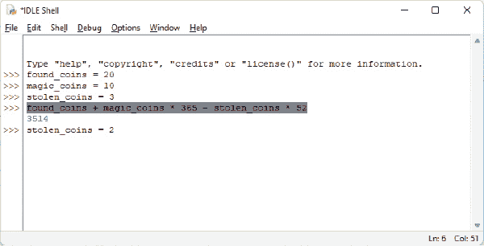
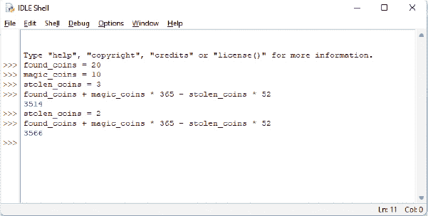

## 计算与变量


现在你已经安装了 Python，并且知道如何启动 Python Shell，你准备开始使用它了。我们将从一些简单的计算开始，然后学习如何使用变量。变量是用来在计算机程序中存储数据的，它们能帮助你编写有用的程序。

### 使用 Python 进行计算

通常，当要求找出两个数字的积，例如 8 × 3.57，你会使用计算器或铅笔和纸。那么，如何使用 Python Shell 来进行这个计算呢？我们试试看。

双击桌面上的 IDLE 图标启动 Python Shell，或者如果你使用的是 Ubuntu，可以在应用程序菜单中点击 IDLE 图标。在提示符下，输入这个计算：

```py
>>> 8 * 3.57
28.56
```

在 Python 中输入乘法计算时，你需要使用星号符号（*）而不是乘号（×）。

我们来试试一个更有用的方程怎么样？

假设你在后院挖掘，发现了一个装有 20 枚金币的袋子。第二天，你偷偷跑到地下室，把金币放进了你祖父的蒸汽驱动复制机器里（幸运的是，你可以*刚好*把 20 枚金币塞进去）。你听到了一阵嗖嗖声和一声爆响，几个小时后，又飞出另外 10 枚闪闪发光的金币。

如果你每天都这样做一年，你的宝箱里会有多少枚金币？在纸面上，这些方程可能长得像这样：

10 × 365 = 3650

3650 + 20 = 3670

当然，用计算器或者纸笔做这些计算很简单，但我们同样可以用 Python Shell 来做这些计算。首先，我们将 10 枚金币乘以一年 365 天，得到 3650。接着，我们再加上原来的 20 枚金币，得到 3670。

```py
>>> 10 * 365
3650
>>> 3650 + 20
3670
```

现在，如果一只乌鸦看到你房间里闪亮的金币，每周飞进来偷走三枚金币，那你一年后还剩多少金币呢？这个计算在 Python Shell 中长得像这样：

```py
>>> 3 * 52
156
>>> 3670 - 156
3514
```

首先，我们将 3 枚金币乘以一年 52 周。结果是 156。然后我们从总金币数（3670）中减去这个数字，得出一年结束时我们剩下的金币数是 3514。

尽管你可以轻松地用计算器完成这个计算，但通过 Python Shell 来处理它，有助于学习编写简单的计算机程序。在本书中，你将学习如何扩展这些思路，编写更有用的程序。

### Python 运算符

你可以在 Python Shell 中进行加法、减法、乘法和除法等数学运算，我们稍后会探索更多其他运算。Python 用来进行数学运算的基本符号，被称为*运算符*，它们列在 表 2-1 中。

**表 2-1：** 基本 Python 运算符

| **符号** | **运算** |
| --- | --- |
| + | 加法 |
| - | 减法 |
| * | 乘法 |
| / | 除法 |

*斜杠*（/）用于除法，因为它类似于你在写分数时使用的除法线。例如，如果你有 100 个海盗和 20 个大桶，你想计算每个桶可以藏多少个海盗，你可以通过在 Python Shell 中输入 100 / 20 来计算 100 个海盗除以 20 个桶（100 ÷ 20）。只需要记住，斜杠的上半部分是向右倾斜的。

### 运算顺序

我们在编程语言中使用括号来控制运算顺序。*运算*是任何使用运算符的操作。乘法和除法的优先级高于加法和减法，因此它们会先执行。换句话说，如果你在 Python 中输入一个方程式，乘法或除法会先于加法或减法执行。

例如，在下面的方程中，首先将数字 30 和 20 相乘，然后将数字 5 加到它们的积上：

```py
>>> 5 + 30 * 20
605
```

这个方程是另一种表达方式：“将 30 乘以 20，然后将结果加上 5。” 结果是 605。我们可以通过在前两个数字周围加上括号来改变运算顺序，像这样：

```py
>>> (5 + 30) * 20
700
```

这个方程的结果是 700（而不是 605），因为括号告诉 Python 先做括号内的运算，然后再做括号外的运算。这个例子表示：“将 5 加到 30，然后将结果乘以 20。”

括号可以*嵌套*，这意味着括号可以嵌套在括号内，像这样：

```py
>>> ((5 + 30) * 20) / 10
70.0
```

在这种情况下，Python 首先计算最内层的括号，然后是外层的括号，最后是除法运算符。换句话说，这个方程表示：“将 5 加到 30，然后将结果乘以 20，再将结果除以 10。” 发生了以下情况：

1.  将 5 加到 30 得到 35。

1.  将 35 乘以 20 得到 700。

1.  将 700 除以 10 得到最终答案 70。

如果我们没有使用括号，结果会稍有不同：

```py
>>> 5 + 30 * 20 / 10
65.0
```

在这种情况下，30 首先乘以 20（得到 600），然后 600 除以 10（得到 60）。最后，加上 5 得到结果 65。

**注意**

*记住，除非使用括号来控制运算顺序，否则乘法和除法总是先于加法和减法。*

### 变量就像标签一样

在编程中，*变量*一词描述了一个存储信息的地方，如数字、文本、数字和文本的列表等等。变量本质上是某物的标签。

例如，要创建一个名为 fred 的变量，我们使用等号（ = ）然后告诉 Python 这个变量应该为哪个信息贴上标签。这里，我们创建了变量 fred，并告诉 Python 它是数字 100 的标签（请注意，这并不意味着另一个变量不能具有相同的值）：

```py
>>> fred = 100
```

要找到一个变量的值，在 Python Shell 中输入 print，然后是变量名并加上括号，像这样：

```py
>>> print(fred)
100
```

我们还可以告诉 Python 改变变量 fred 使其标记其他内容。例如，下面是如何将 fred 改为数字 200：

```py
>>> fred = 200
>>> print(fred)
200
```

在第一行，我们说 fred 给数字 200 贴上了标签。在第二行，我们打印出 fred 的值，只是为了确认变化。Python 在最后一行打印结果。

我们还可以为同一项使用多个标签（或变量）：

```py
>>> fred = 200
>>> john = fred
>>> print(john)
200
```

在这个例子中，我们告诉 Python，我们希望变量 john 和 fred 标签相同的内容，通过在 john 和 fred 之间使用等号。

当然，fred 可能不是一个很有用的变量名，因为它很可能并没有告诉我们变量的用途。让我们把变量叫做 number_of_coins，而不是 fred，如下所示：

```py
>>> number_of_coins = 200
>>> print(number_of_coins)
200
```

这清楚地表明我们在讨论 200 枚硬币。变量名可以由字母、数字和下划线（_）组成，但不能以数字开头。你可以使用从单个字母（如 a）到长句子的变量名。（变量名不能包含空格，所以使用下划线分隔单词。）有时，如果你只是做些快速操作，一个简短的变量名会比较好。你选择的变量名应该根据你对变量名的意义要求来定。

现在你知道了如何创建变量，接下来让我们看看如何使用它们。

### 使用变量

还记得我们用来计算如果你能用祖父在地下室的神秘发明魔法地创造新硬币，到年底你会有多少硬币的方程吗？我们有这个方程：

```py
>>> 20 + 10 * 365
3670
>>> 3 * 52
156
>>> 3670 - 156
3514
```

我们可以将其转化为一行代码：

```py
>>> 20 + 10 * 365 - 3 * 52
3514
```

这不太容易阅读，但如果我们把数字转成变量呢？试试输入以下内容：

```py
>>> found_coins = 20
>>> magic_coins = 10
>>> stolen_coins = 3
```

这些条目创建了变量 found_coins、magic_coins 和 stolen_coins。

现在，我们可以像这样重新输入方程：

```py
>>> found_coins + magic_coins * 365 - stolen_coins * 52
3514
```

你可以看到，这样我们得到了相同的结果。那么，谁在乎呢，对吧？啊，但这就是变量的魔力。如果你在窗户上放了一个稻草人，而乌鸦只偷了两枚硬币而不是三枚呢？当我们使用变量时，我们只需将变量更改为新的数字，它会在方程式中的所有使用位置自动更新。我们可以通过输入以下内容将 stolen_coins 变量改为 2：

```py
>>> stolen_coins = 2
```

然后我们可以复制并粘贴方程来重新计算结果，如下所示：

1.  通过点击鼠标并从行首拖动到行尾来选择要复制的文本，如图 2-1 所示。



*图 2-1：在 Python Shell 中选择内容*

1.  按住 CTRL 键（如果你使用的是 Mac，则是 COMMAND 键 ⌘）并按 C 键复制选中的文本。（从现在起你会看到 CTRL-C）。

1.  点击最后一行提示（在 stolen_coins = 2 后）。

1.  按住 CTRL（或 COMMAND）键，然后按 V 键粘贴选中的文本。（从现在起你会看到 CTRL-V）。

1.  按 ENTER 键查看新结果。



*图 2-2：在 Python Shell 中粘贴内容*

这比重新输入整个方程要简单得多！

你可以尝试改变其他变量，然后复制（CTRL-C）并粘贴（CTRL-V）计算结果，看看你改变的效果。例如，如果你在正确的时刻敲打你祖父的发明，它每次会吐出三个额外的硬币，你会发现到年底你将得到 4661 个硬币：

```py
>>> magic_coins = 13
>>> found_coins + magic_coins * 365 stolen_coins * 52
4661
```

当然，对于像这样的简单方程使用变量仍然只是*稍微*有用。我们还没有进入*真正*有用的部分。现在，记住变量是标记事物的一种方式，方便你稍后使用它们。

### 你学到的内容

在本章中，你学习了如何使用 Python 运算符进行简单的方程计算，以及如何使用括号来控制运算顺序（即 Python 评估方程各部分的顺序）。接着，我们创建了变量来标记值，并在计算中使用了这些变量。
