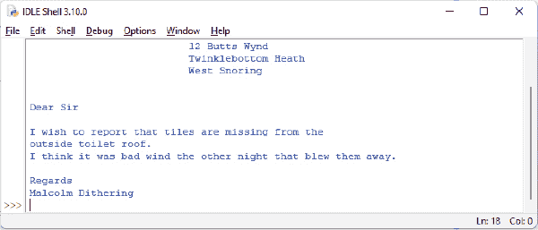

## 字符串、列表、元组和字典


在第二章中，我们用 Python 做了一些基本的计算，并学习了变量。在本章中，我们将处理 Python 程序中的其他元素：字符串、列表、元组和字典。你将使用字符串在程序中显示消息（例如游戏中的“准备好”和“游戏结束”消息）。你还将发现如何使用列表、元组和字典来存储事物的集合。

### 字符串

在编程中，我们通常将文本称为*字符串*。把字符串想象成字母的集合。书中的所有字母、数字和符号都可以是一个字符串，你的名字和地址也是如此。事实上，我们在第一章中创建的第一个 Python 程序就使用了一个字符串：“Hello World”。

### 创建字符串

在 Python 中，我们通过将引号放在文本周围来创建字符串，因为编程语言需要区分不同类型的值。（我们需要告诉计算机一个值是数字、字符串还是其他类型。）例如，我们可以从第二章中取出 fred 变量，并用它来标记一个字符串：


```py
fred = "Why do gorillas have big nostrils? Big fingers!!"
```

然后，为了查看“fred”里面的内容，我们可以输入 print(fred)：

```py
>>> print(fred)
Why do gorillas have big nostrils? Big fingers!!
```

你也可以使用单引号来创建一个字符串，像这样：

```py
>>> fred = 'What is pink and fluffy? Pink fluff!!'
>>> print(fred)
What is pink and fluffy? Pink fluff!!
```

然而，如果你试图使用单引号（′）或双引号（"）输入超过一行的文本，或者如果你以一种类型的引号开始，以另一种类型的引号结束，你将会在 Python Shell 中看到一个错误消息。例如，输入以下内容：

```py
>>> fred = "How do dinosaurs pay their bills?
```

你会看到这个结果：

```py
SyntaxError: EOL while scanning string literal
```

这是一个关于语法错误的错误信息，因为你没有遵循用单引号或双引号结束字符串的规则。

*语法*意味着句子中单词的排列和顺序，或者在这种情况下，程序中单词和符号的排列和顺序。所以*语法错误*意味着你做了一些 Python 没有预料到的事情，或者 Python 期待你做的事情你却漏掉了。*EOL*表示*行尾*，因此错误消息的其余部分告诉你 Python 到达了行尾，但没有找到一个双引号来关闭（或结束）字符串。

要在字符串中使用多行文本（称为*多行字符串*），请使用三个单引号（’’’），然后在行与行之间按 ENTER 键，像这样：

```py
>>> fred = '''How do dinosaurs pay their bills?
    With tyrannosaurus checks!'''
```

让我们打印出 fred 的内容，看看是否成功：

```py
>>> print(fred)
How do dinosaurs pay their bills?
With tyrannosaurus checks!
```

### 处理字符串问题

现在考虑这个傻乎乎的字符串示例，它会导致 Python 显示错误消息：

```py
>>> silly_string = 'He said, "Aren't can't shouldn't wouldn't."'
SyntaxError: invalid syntax
```

在第一行，我们试图创建一个由单引号包围的字符串（定义为变量 silly_string），但它也包含了单引号（在单词 can't、shouldn't 和 wouldn't 中）和双引号。真是一团糟！

请记住，Python 没有人类那样的智慧，它看到的只是一个字符串，其中包含了 He said, "Aren，然后是一些它无法预期的字符。当 Python 看到一个引号（无论是单引号还是双引号）时，它期望在第一个引号之后跟随一个字符串，并且该字符串会在下一个匹配的引号（无论是单引号还是双引号）出现时结束。在这种情况下，字符串的开始是 He 前的单引号，而对于 Python 来说，字符串的结束是 Aren 后的单引号。

在最后一行中，Python 告诉我们发生了什么类型的错误——在这个例子中，是一个语法错误。

使用双引号代替单引号仍然会产生错误：

```py
>>> silly_string = "He said, "Aren't can't shouldn't wouldn't.""
SyntaxError: invalid syntax
```

在这里，Python 看到的是一个由双引号括起来的字符串，包含字母 He said,（和一个空格）。接下来跟着的内容（从 Aren’t 开始）会导致错误。

这是因为从 Python 的角度来看，所有多余的内容本不应该存在。Python 会寻找下一个匹配的引号，并且不知道你希望它如何处理紧跟在该引号后面的内容。

解决这个问题的方法是使用多行字符串，我们之前学过的，采用*三个*单引号（'''）。这使得我们可以在字符串中同时使用单引号和双引号而不会导致错误。事实上，如果我们使用三个单引号，我们可以在字符串内放置任何组合的单引号和双引号（只要我们不尝试在其中放入三个单引号）。我们字符串的无错版本如下所示：


```py
silly_string = '''He said, "Aren't can't shouldn't wouldn't."'''
```

但等等，还有更多。如果你真的想使用单引号或双引号来包围 Python 中的字符串，那么可以在每个引号前面添加一个反斜杠（∖）。这被称为*转义*。这是一种告诉 Python，“是的，我知道我的字符串中有引号，我希望你忽略它们，直到你看到结束引号。”

转义字符串可能会使它们更难以阅读，因此通常建议使用多行字符串。不过，你仍然可能会遇到使用转义的代码，因此了解为什么反斜杠存在是有帮助的。

下面是一些转义如何工作的示例：

```py
➊ >>> single_quote_str = 'He said, "Aren\'t can\'t shouldn\'t
       wouldn\'t."'
➋ >>> double_quote_str = "He said, \"Aren't can't shouldn't 
       wouldn't.\""
   >>> print(single_quote_str)
   He said, "Aren't can't shouldn't wouldn't."
   >>> print(double_quote_str)
   He said, "Aren't can't shouldn't wouldn't."
```

首先，在 ➊ 处，我们创建了一个包含单引号的字符串，并在该字符串中的单引号前使用了反斜杠。接着，在 ➋ 处，我们创建了一个包含双引号的字符串，并在这些引号前使用了反斜杠。在接下来的几行中，我们打印了刚刚创建的变量。注意，当我们打印它们时，反斜杠字符并不会出现在字符串中。

### 将值嵌入字符串

如果你想使用变量的内容显示消息，你可以将其嵌入到一个特殊的字符串中，称为*f-string*（也叫*格式化字符串字面量*）。你将变量名放在大括号中，这样它就会被实际的值替代。（*嵌入值*，也叫做*字符串替换*，是程序员用语，意思是“插入值”。）

例如，为了让 Python 计算或存储你在游戏中得分的点数，然后将其添加到类似 “I scored 10 points” 的句子中，你只需在第一个引号前加上 f，然后将数字 10 替换为用大括号 {} 包围的变量，像这样：

```py
>>> myscore = 1000
>>> message = f'I scored {myscore} points'
>>> print(message)
I scored 1000 points
```

在这里，我们创建了变量 myscore，值为 1000，并创建了包含 f-string 'I scored {myscore} points' 的变量 message。在下一行中，我们调用 print(message) 来查看字符串替换的结果。打印此消息的结果是 "I scored 1000 points"。我们不需要为消息使用变量。我们可以做同样的示例，只使用这个：

```py
print(f'I scored {myscore} points')
```

我们还可以在字符串中使用多个变量：

```py
>>> first = 0
>>> second = 8
>>> print(f'What did the number {first} say to the number {second}? Nice belt!!')
What did the number 0 say to the number 8? Nice belt!!
```

我们甚至可以在 f-string 中放入表达式，像这样：

```py
>>> print(f'Two plus two equals {2 + 2}')
Two plus two equals 4
```

在这个示例中，Python 会计算大括号中的简单方程式，所以打印出来的字符串包含了结果。

### 乘法字符串

10 乘以 5 是多少？答案当然是 50。那么 10 乘以*a*呢？这是 Python 的回答：

```py
>>> print(10 * 'a')
aaaaaaaaaa
```

Python 程序员可能出于多种原因乘以字符串，例如在 Python Shell 中显示消息时，按照特定的空格数量来对齐文本。试着在 Python Shell 中打印以下字母（选择**文件** ▸ **新建文件**，然后输入以下代码）：

```py
spaces = ' ' * 25
print('{} 12 Butts Wynd')
print('{} Twinklebottom Heath')
print('{} West Snoring')
print()
print()
print('Dear Sir')
print()
print('I wish to report that tiles are missing from the')
print('outside toilet roof.')
print('I think it was bad wind the other night that blew them away.')
print()
print('Regards')
print('Malcolm Dithering')
```

一旦你在 Python Shell 窗口中输入了代码，选择**文件** ▸ **另存为**。将文件命名为*myletter.py*。然后你可以通过选择**运行** ▸ **运行模块**来运行代码（就像我们之前做的那样）。

在这个示例的第一行，我们通过将一个空格字符乘以 25 来创建变量空间。然后，我们在接下来的三行中使用这个变量，将文本对齐到 Python Shell 的右侧。你可以在下面看到这些打印语句的结果：



*图 3-1：在 Python Shell 中运行字母代码*

什么是文件和文件夹？

一个*文件*是某种类型的数据（或信息），可以存储在你的计算机上。文件可能包括照片、视频、电子书，甚至是你在 Microsoft Word 中写的学校报告。

一个*文件夹*（也叫做*目录*）是其他文件夹和文件的集合。当你点击**另存为**来保存你的*myletter.py*文件时，它被保存在一个文件夹里。

正如我们所看到的，文件和文件夹在编程中非常重要。

除了使用乘法进行对齐，我们还可以用它来填充屏幕上烦人的消息。试试以下示例：

```py
>>> print(1000 * 'snirt')
```

### 列表比字符串更强大

“蜘蛛腿、青蛙脚趾、蝙蝠翅膀、蛞蝓黄油和蛇的头皮屑”不是一个非常正常的购物清单（除非你恰好是个巫师），但我们将它作为字符串和列表之间差异的第一个例子。我们可以通过使用如下的字符串将这个物品清单存储在 wizard_list 变量中：


```py
>>> wizard_list = 'spider legs, toe of frog, bat wing, slug butter, snake dandruff'
>>> print(wizard_list)
spider legs, toe of frog, bat wing, slug butter, snake dandruff
```

但我们也可以创建一个*列表*，这是一个可以操作的有些神奇的 Python 对象。以下是将这些物品写成列表后的样子：

```py
>>> wizard_list = ['spider legs', 'toe of frog', 'bat wing',
                   'slug butter', 'snake dandruff']
>>> print(wizard_list)
['spider legs', 'toe of frog', 'bat wing', 'slug butter',
'snake dandruff']
```

创建一个列表需要比创建字符串更多的输入，但列表比字符串更有用，因为列表中的项可以轻松地进行操作。我们可以通过在方括号内输入一个数字（称为*索引位置*）来打印列表中的某个项，如下所示：

```py
>>> print(wizard_list[2])
bat wing
```

如果你本来期待第二项是“青蛙脚趾”，你可能会想知道为什么打印的是“蝙蝠翅膀”。这是因为列表从索引位置 0 开始，所以列表中的第一个项是 0，第二个是 1，第三个是 2。对人类来说可能没有什么意义，但对计算机来说是可以理解的。

我们也可以改变列表中的项。也许我们的巫师朋友刚刚告诉我们，我们需要为他们拿蜗牛舌头，而不是蝙蝠翅膀。以下是我们如何改变列表中的项：

```py
>>> wizard_list[2] = 'snail tongue'
>>> print(wizard_list)
['spider legs', 'toe of frog', 'snail tongue', 'slug butter',
'snake dandruff']
```

这将把索引位置 2（之前是蝙蝠翅膀）的项设置为蜗牛舌头。

我们还可以显示列表中的子列表。我们通过在方括号内使用冒号（:）来做到这一点。例如，输入以下内容来查看我们列表中的第三到第五项（这是制作美味三明治的绝佳配料）：


```py
>>> print(wizard_list[2:5])
['snail tongue', 'slug butter', 'snake dandruff']
```

写 [2:5] 就等同于说，“显示从索引位置 2 到（但不包括）索引位置 5 的项”——换句话说，是项 3、4 和 5。

列表可以用来存储各种各样的项，比如数字：

```py
>>> some_numbers = [1, 2, 5, 10, 20]
```

它们也可以保存字符串：

```py
>>> some_strings = ['Which', 'Witch', 'Is', 'Which']
```

它们可能包含数字和字符串的混合：

```py
>>> numbers_and_strings = ['Why', 'was', 6, 'afraid', 'of', 7, 
                           'because', 7, 8, 9]
>>> print(numbers_and_strings)
['Why', 'was', 6, 'afraid', 'of', 7, 'because', 7, 8, 9]
```

并且列表甚至可以存储其他列表：

```py
>>> numbers = [1, 2, 3, 4]
>>> strings = ['I', 'kicked', 'my', 'toe', 'and', 'it', 
               'is', 'sore']
>>> mylist = [numbers, strings]
>>> print(mylist)
[[1, 2, 3, 4], ['I', 'kicked', 'my', 'toe', 'and', 'it',
'is', 'sore']]
```

这个列表中的列表示例创建了三个变量：包含四个数字的 numbers，包含八个字符串的 strings，以及使用数字和字符串的 mylist。第三个列表（mylist）只有两个元素，因为它是变量名的列表，而不是变量的内容。

我们可以尝试分别打印 mylist 的两个元素：

```py
>>> print(mylist[0])
[1, 2, 3, 4]
>>> print(mylist[1])
['I', 'kicked', 'my', 'toe', 'and', 'it', 'is', 'sore']
```

在这里，我们可以看到 mylist[0] 包含了数字列表，而 mylist[1] 是字符串列表。

### 向列表中添加项

要向列表的末尾添加项，我们使用 append 函数。例如，要将一声熊打嗝（我敢肯定确实有这么一回事）添加到巫师的购物清单中，可以输入以下内容：

```py
>>> wizard_list.append('bear burp')
>>> print(wizard_list)
['spider legs', 'toe of frog', 'snail tongue', 'slug butter', 
'snake dandruff', 'bear burp']
```

你可以像这样继续添加更多的魔法物品到巫师的清单中：

```py
>>> wizard_list.append('mandrake')
>>> wizard_list.append('hemlock')
>>> wizard_list.append('swamp gas')
```

现在巫师的清单看起来是这样的：

```py
>>> print(wizard_list)
['spider legs', 'toe of frog', 'snail tongue', 'slug butter',
'snake dandruff', 'bear burp', 'mandrake', 'hemlock', 'swamp gas']
```

巫师显然准备施展一些真正的魔法了！

### 从列表中删除项

要从列表中删除项，可以使用 del 命令（简写为*delete*）。例如，要删除巫师清单中的第五项蛇的头皮屑，可以这样做：

```py
>>> del wizard_list[4]
>>> print(wizard_list)
['spider legs', 'toe of frog', 'snail tongue', 'slug butter',
'bear burp', 'mandrake', 'hemlock', 'swamp gas']
```

**注意**

*记住，位置从零开始，所以 wizard_list[4] 实际上指的是列表中的第五个项目。*

尝试通过输入以下内容来移除我们刚刚添加的项目（曼德拉草、毒芹和沼气）：

```py
>>> del wizard_list[7]
>>> del wizard_list[6]
>>> del wizard_list[5]
>>> print(wizard_list)
['spider legs', 'toe of frog', 'snail tongue', 'slug butter',
'bear burp']
```

### 列表算术

我们可以通过将列表相加来连接它们，就像加法一样，使用加号 (+) 符号。例如，假设我们有两个列表：list1，包含数字 1 到 4，以及 list2，包含一些单词。我们可以使用 + 符号将它们加在一起，如下所示：

```py
>>> list1 = [1, 2, 3, 4]
>>> list2 = ['I', 'tripped', 'over', 'and', 'hit', 'the', 'floor']
>>> print(list1 + list2)
[1, 2, 3, 4, 'I', 'tripped', 'over', 'and', 'hit', 'the', 'floor']
```

我们也可以将两个列表相加，并将结果赋值给另一个变量：

```py
>>> list1 = [1, 2, 3, 4]
>>> list2 = ['I', 'ate', 'chocolate', 'and', 'I', 'want', 'more']
>>> list3 = list1 + list2
>>> print(list3)
[1, 2, 3, 4, 'I', 'ate', 'chocolate', 'and', 'I', 'want', 'more']
```

我们还可以通过数字来乘以一个列表。例如，要将 list1 乘以 5，我们写 list1 * 5：

```py
>>> list1 = [1, 2]
>>> print(list1 * 5)
[1, 2, 1, 2, 1, 2, 1, 2, 1, 2]
```

这告诉 Python 将 list1 重复五次，结果是 1, 2, 1, 2, 1, 2, 1, 2, 1, 2。另一方面，除法（/）和减法（-）会导致错误，如以下示例所示：

```py
>>> list1 / 20
Traceback (most recent call last):
File "<pyshell>", line 1, in <module>
    list1 / 20
TypeError: unsupported operand type(s) for /: 'list' and 'int'

>>> list1 - 20
Traceback (most recent call last):
File "<pyshell>", line 1, in <module>
    list1 - 20
TypeError: unsupported operand type(s) for -: 'list' and 'int'
```

那为什么呢？嗯，使用 + 连接列表和用 * 重复列表是足够直接的操作。这些概念在现实世界中也很有意义。例如，如果我递给你两张纸质购物清单并说：“把这两个清单加在一起，”你可能会把所有项目按顺序写在另一张纸上，从头到尾。如果我说：“将这个清单乘以 3，”你也可以想象把列表中的所有项目写三遍在另一张纸上。

但你如何将一个列表划分呢？例如，考虑一下如何将六个数字（1 到 6）的列表分成两部分。这里有三种不同的方式：

```py
[1, 2, 3]     [4, 5, 6]
[1]           [2, 3, 4, 5, 6]
[1, 2, 3, 4]  [5, 6]
```

我们是将列表从中间分开，分开第一个项目后再分，还是随便挑个地方分开呢？没有简单的答案，当你请求 Python 对列表进行除法操作时，它也不知道该怎么做。这就是为什么它会返回错误的原因。


由于同样的原因，你不能将除列表之外的任何东西添加到列表中。例如，下面是我们试图将数字 50 加入 list1 时发生的情况：

```py
>>> list1 + 50
Traceback (most recent call last):
  File "<pyshell>", line 1, in <module>
    list1 + 50
TypeError: can only concatenate list (not "int") to list
```

为什么这里会出现错误呢？嗯，将 50 加入一个列表是什么意思？是将 50 加到每个项目吗？但如果项目不是数字呢？是将数字 50 加到列表的末尾还是开头呢？

在计算机编程中，命令每次输入时应该表现得完全相同。你的计算机只能看到黑白的东西。让它做一个复杂的决策时，它就会抛出错误。

### 元组

*元组*就像一个使用括号的列表，如这个例子所示：

```py
>>> fibs = (0, 1, 1, 2, 3)
>>> print(fibs[3])
2
```

这里我们将变量 fibs 定义为数字 0、1、1、2 和 3。然后，就像操作列表一样，我们使用 print(fibs[3]) 来打印元组中索引位置 3 的项目。

元组和列表的主要区别在于，一旦你创建了一个元组，它就不能改变。例如，如果我们试图将元组 fibs 中的第一个值替换为数字 4（就像我们在 wizard_list 中替换值一样），我们会收到错误消息：

```py
>>> fibs[0] = 4
Traceback (most recent call last):
File "<pyshell>", line 1, in <module>
    fibs[0] = 4
TypeError: 'tuple' object does not support item assignment
```

为什么你会选择使用元组而不是列表呢？有时候，使用一个你知道永远不会改变的东西是有用的。如果你创建一个包含两个元素的元组，它将始终包含这两个元素。

### Python 字典

在 Python 中，*dict*（字典的缩写）是一个集合，类似于列表和元组。字典和列表或元组的区别在于，字典中的每个项都有一个*键*和相应的*值*。

例如，假设我们有一个人及其最爱运动的列表。我们可以将这些信息放入 Python 列表中，每个人的名字后面跟着他们的运动，像这样：

```py
>>> favorite_sports = ['Ralph Williams, Football',
                       'Michael Tippett, Basketball',
                       'Edward Elgar, Baseball',
                       'Rebecca Clarke, Netball',
                       'Ethel Smyth, Badminton',
                       'Frank Bridge, Rugby']
```

如果我问你丽贝卡·克拉克最喜欢的运动是什么，你可以浏览这个列表并找到答案是网球。但是如果这个列表包括 100 个（或者更多）人呢？


如果我们将相同的信息存储在字典中，以人的名字为键，最爱运动为值，那么代码将是这样：

```py
>>> favorite_sports = {'Ralph Williams' : 'Football', 
                       'Michael Tippett' : 'Basketball',
                       'Edward Elgar' : 'Baseball',
                       'Rebecca Clarke' : 'Netball',
                       'Ethel Smyth' : 'Badminton',
                       'Frank Bridge' : 'Rugby'}
```

我们使用冒号将每个键与其值分开，每个键和值都被单引号括起来。还要注意，字典中的项被大括号（{}）括起来，而不是圆括号或方括号。结果是一个字典（每个键指向一个特定的值），如表 3-1 所示。

**表 3-1：** 字典中指向值的键：最爱运动

| **键** | **值** |
| --- | --- |
| 拉尔夫·威廉姆斯 | 足球 |
| 迈克尔·蒂佩特 | 篮球 |
| 爱德华·埃尔加 | 棒球 |
| 丽贝卡·克拉克 | 网球 |
| 埃塞尔·史密斯 | 羽毛球 |
| 弗兰克·布里奇 | 橄榄球 |

现在，要获取丽贝卡·克拉克最喜欢的运动，我们通过使用她的名字作为键，访问我们的字典 favorite_sports，如下所示：

```py
>>> print(favorite_sports['Rebecca Clarke'])
Netball
```

答案是网球。

要在字典中删除一个值，使用它的键。例如，让我们移除埃塞尔·史密斯：

```py
>>> del favorite_sports['Ethel Smyth']
>>> print(favorite_sports)
{'Rebecca Clarke': 'Netball', 'Michael Tippett': 'Basketball', 
'Ralph Williams': 'Football', 'Edward Elgar': 'Baseball', 
'Frank Bridge': 'Rugby'}
```

要在字典中替换一个值，我们也需要使用它的键。假设我们需要将拉尔夫·威廉姆斯的最爱运动从足球改为冰球，我们可以像这样操作：

```py
>>> favorite_sports['Ralph Williams'] = 'Ice Hockey'
>>> print(favorite_sports)
{'Rebecca Clarke': 'Netball', 'Michael Tippett': 'Basketball', 
'Ralph Williams': 'Ice Hockey', 'Edward Elgar': 'Baseball', 
'Frank Bridge': 'Rugby'}
```

我们通过使用拉尔夫·威廉姆斯这个键，将最爱运动从足球替换为冰球。

如你所见，处理字典有点像处理列表和元组，唯一的不同是，你不能使用加号运算符（+）连接字典。如果你尝试这样做，你会收到一个错误消息，正如下面的例子所示：

```py
>>> favorite_sports = {'Rebecca Clarke': 'Netball',
                       'Michael Tippett': 'Basketball',
                       'Ralph Williams': 'Ice Hockey',
                       'Edward Elgar': 'Baseball',
                       'Frank Bridge': 'Rugby'}
>>> favorite_colors = {'Malcolm Warner' : 'Pink polka dots',
                       'James Baxter' : 'Orange stripes',
                       'Sue Lee' : 'Purple paisley'}
>>> favorite_sports + favorite_colors

Traceback (most recent call last):
File "<pyshell>", line 1, in <module>
    favorite_sports + favorite_colors
TypeError: unsupported operand type(s) for +: 'dict' and 'dict'
```

Python 无法理解连接字典，所以它放弃了。

### 你学到的内容

在本章中，你学到了 Python 如何使用字符串存储文本，以及如何使用列表和元组处理多个项。你看到列表中的项是可以修改的，并且你可以将一个列表与另一个列表连接，但元组中的值不能改变。你还学到了如何使用字典来存储带有键的值，以便识别它们。

### 编程难题

以下是你可以自己尝试的一些实验。答案可以在*[`python-for-kids.com`](http://python-for-kids.com)*找到。

#### #1: 收藏夹

列出你最喜欢的爱好，并将这个列表命名为 games。现在列出你最喜欢的食物，并将该列表命名为 foods。将这两个列表合并，命名合并后的结果为 favorites。最后，打印变量 favorites。

#### #2: 计算战斗者

如果有三座楼，每座楼的屋顶上藏着 25 个忍者，而有两个隧道，每个隧道里藏着 40 个武士，那么忍者和武士即将展开战斗的数量是多少？（你可以在 Python Shell 中通过一个方程式来解决这个问题。）

#### #3: 问候！

创建两个变量：一个指向你的名字，一个指向你的姓氏。现在创建一个字符串，使用占位符来打印你的名字并附带一条消息，类似于“你好，Brando Ickett！”

#### #4: 多行信件

使用我们在本章前面创建的信件，尝试通过一次打印调用（并使用多行字符串）打印出完全相同的文本。
