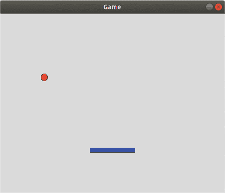
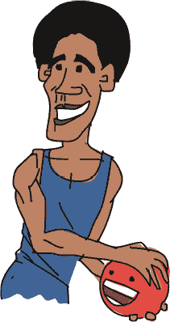
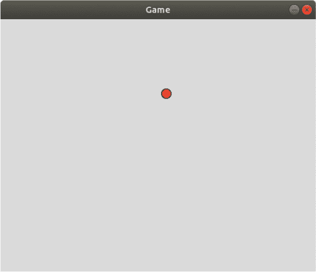
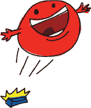
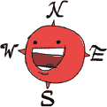

## 开始你的第一个游戏：Bounce!


到目前为止，我们已经涵盖了计算机编程的基础知识。你已经学会了如何使用变量来存储信息，如何使用 if 语句进行条件判断，如何使用 for 循环来重复执行代码。你还学会了如何创建函数来重用代码，以及如何使用类和对象将代码分成更小、更易理解的块。你已经学会了如何使用 turtle 和 tkinter 模块在屏幕上绘制图形。现在，是时候用这些知识来创建你的第一个游戏了。

### 打击弹跳球

我们将开发一个带有弹跳球和挡板的游戏。球会在屏幕上飞来飞去，玩家需要用挡板将球弹回。如果球撞到屏幕底部，游戏就结束了。图 11-1 展示了完成游戏的预览。



*图 11-1: Bounce! 游戏*

我们的游戏看起来可能相当简单，但代码将比我们之前编写的稍微复杂一些，因为它需要处理很多内容。例如，它需要为挡板和球进行动画处理，并检测球何时碰到挡板或墙壁。

在本章中，我们将开始通过添加游戏画布和一个弹跳球来创建游戏。在下一章中，我们将通过添加挡板来完成游戏。

### 创建游戏画布

要创建你的游戏，首先在 IDLE 中打开一个新文件，选择**文件** **▸** **新建文件**。然后导入 tkinter 并创建一个画布来绘制：

```py
   from tkinter import *
   import random
   import time
   tk = Tk()
➊ tk.title('Bounce Game')
   tk.resizable(0, 0)
   tk.wm_attributes('-topmost', 1)
   canvas = Canvas(tk, width=500, height=400, bd=0, highlightthickness=0)
   canvas.pack()
   tk.update()
```

这段代码与之前的例子有些不同。首先，我们通过`import random`和`import time`导入 time 和 random 模块，稍后将在代码中使用。random 模块提供了（其中之一）用于创建随机数的函数，而 time 模块有一个有用的函数，可以让 Python 暂停当前操作一段时间。

使用`tk.title('Bounce Game')` ➊时，我们调用了我们通过`tk = Tk()`创建的 tk 对象的 title 函数，为窗口设置标题。然后，我们使用 resizable 来将窗口的大小固定。参数（0, 0）表示“窗口的大小既不能水平改变，也不能垂直改变”。接下来，我们调用`wm_attributes`来告诉 tkinter 将包含画布的窗口置于所有其他窗口之前（‘-topmost’）。

当我们创建一个 Canvas 对象时，与之前的例子相比，我们传入了更多的命名参数。例如，`bd=0`和`highlightthickness=0`确保画布外面没有边框，这使得游戏屏幕看起来更美观。`canvas.pack()`这一行告诉画布根据前面给定的宽度和高度参数来调整自身大小。最后，`tk.update()`告诉 tkinter 为我们的游戏动画进行初始化。如果没有这一行，游戏将无法按预期工作。

在编写代码时，一定要定期保存。第一次保存时，给它取个有意义的文件名，例如*paddleball.py*。


### 创建 Ball 类

现在我们将创建球的类。我们将从使球能够在画布上绘制自己的代码开始。我们需要做以下几件事：

1.  创建一个名为 Ball 的类，接受画布和我们要绘制的球的颜色作为参数。

1.  将画布保存为一个对象变量，因为我们将在其上绘制球。

1.  使用颜色参数的值作为填充颜色，在画布上绘制一个填充的圆形。

1.  保存 tkinter 绘制圆形（椭圆）时返回的标识符，因为我们将用它来移动球。

1.  将椭圆移动到画布的中央。

这段代码应该在文件的前三行后添加（在导入 time 之后）：

```py
from tkinter import *
import random
import time

class Ball:
    def __init__(self, canvas, color):
        self.canvas = canvas
        self.id = canvas.create_oval(10, 10, 25, 25, fill=color)
        self.canvas.move(self.id, 245, 100)

    def draw(self):
        pass
```

首先，我们将类命名为 Ball。然后，我们创建一个初始化函数（如第 109 页的“初始化对象”部分所述），它接受画布和颜色作为参数。我们将对象变量 canvas 设置为同名参数的值。接着我们调用 create_oval 函数，传入五个参数：椭圆的左上角的*x*和*y*坐标（10 和 10），右下角的*x*和*y*坐标（25 和 25），以及椭圆的填充颜色。

create_oval 函数返回一个表示所绘制形状的标识符，我们将其存储在对象变量 id 中。我们将椭圆移动到画布的中央（坐标 245, 100）。画布知道该移动什么，因为我们使用存储的形状标识符（id）来识别它。

在 Ball 类的最后两行，我们创建了 draw 函数，使用 def draw(self)，函数的主体只是 pass 关键字。目前它什么也不做，但我们很快就会为这个函数添加更多的内容。



现在我们已经创建了 Ball 类，我们需要创建这个类的一个对象（记住：类描述它能做什么，但对象才是实际执行这些操作的东西）。将以下代码添加到程序底部来创建一个红色的球对象：

```py
ball = Ball(canvas, 'red')
```

你可以使用**运行** **▸** **运行模块**来运行这个程序。如果你在 IDLE 外运行，它的画布会显示一瞬间然后消失。为了防止窗口立即关闭，我们需要添加一个动画循环，这个循环被称为游戏的*主循环*。（IDLE 已经有一个主循环，这就是为什么在 IDLE 中运行时窗口不会消失的原因。）

主循环是程序的核心部分，通常控制程序的大部分功能。目前，我们的主循环只是告诉 tkinter 重绘屏幕。这个循环，也叫做*无限循环*，会一直运行下去（或者至少直到我们关闭窗口），不断地告诉 tkinter 重绘屏幕，然后通过使用 time.sleep 使程序暂停百分之一秒。我们将在程序的最后添加这段代码：

```py
ball = Ball(canvas, 'red')

while True:
    tk.update_idletasks()
    tk.update()
    time.sleep(0.01)
```

现在如果你运行代码，球应该会出现在画布的中央，如图 11-2 所示。



*图 11-2：画布中央的球*

### 增加一些动作

现在我们已经设置好了 Ball 类，接下来是让球动起来。我们将让它移动、弹跳并改变方向。


#### 让球运动起来

要移动球，修改 draw 函数如下：

```py
class Ball:
    def __init__(self, canvas, color):
 self.canvas = canvas
        self.id = canvas.create_oval(10, 10, 25, 25, fill=color)
        self.canvas.move(self.id, 245, 100)

    def draw(self):
        self.canvas.move(self.id, 0, -1)
```

由于 __init__ 已经将画布参数保存为 canvas 对象变量，我们使用 self.canvas 这个变量并调用 canvas 上的 move 函数。

我们向 move 函数传递三个参数：椭圆的 id 和数字 0 和 -1。数字 0 告诉球不水平移动，而 -1 告诉球向屏幕上方移动 1 像素。

我们做出这个小改动是因为在开发过程中尝试不同的方式是有益的。试想一下，如果我们一次性编写了整个游戏代码，然后发现它无法运行，我们该从哪里开始找出问题所在？

我们还将修改程序底部的主循环。在 while 循环块中（我们的主循环），我们添加对球对象的 draw 函数的调用，如下所示：

```py
while True:
    ball.draw()
    tk.update_idletasks()
    tk.update()
    time.sleep(0.01)
```

如果你现在运行这段代码，球应该会向上移动并从屏幕顶部消失——这些命令更新了 _idletasks 和 update，告诉 tkinter 加快速度并绘制画布上的内容。

time.sleep 命令是对 time 模块的 sleep 函数的调用，它告诉 Python 程序暂停一百分之一秒（0.01）。这确保了我们的程序不会运行得太快，以至于在你看到球之前它就消失了。

这个循环基本上是在说：“稍微移动一下球，重新绘制屏幕上的新位置，暂停片刻，然后重新开始。”

**注意**

*当你关闭游戏窗口时，你可能会看到 Python Shell 中写入错误信息。这是因为关闭窗口中断了 tkinter 的操作，Python 对此发出了警告。我们可以安全地忽略这些类型的错误。*

你的游戏代码现在应该如下所示：

```py
from tkinter import *
import random
import time

class Ball:
    def __init__(self, canvas, color):
        self.canvas = canvas
        self.id = canvas.create_oval(10, 10, 25, 25, fill=color)
        self.canvas.move(self.id, 245, 100)

    def draw(self):
        self.canvas.move(self.id, 0, -1)

tk = Tk()
tk.title('Bounce Game')
tk.resizable(0, 0)
tk.wm_attributes('-topmost', 1)
canvas = Canvas(tk, width=500, height=400, bd=0, highlightthickness=0)
canvas.pack()
tk.update()

ball = Ball(canvas, 'red')

while True:
    ball.draw()
    tk.update_idletasks()
    tk.update()
    time.sleep(0.01)
```

如果你运行这段代码，球将开始向上移动，并从窗口顶部飞出去。

#### 让球弹跳起来

一个从屏幕顶部消失的球对于我们的游戏来说并没有什么用处，所以让我们让它弹跳起来。首先，我们将在 Ball 类的初始化函数中保存一些额外的对象变量，如下所示：

```py
    def __init__(self, canvas, color):
        self.canvas = canvas
        self.id = canvas.create_oval(10, 10, 25, 25, fill=color)
        self.canvas.move(self.id, 245, 100)
        self.x = 0
        self.y = -1
        self.canvas_height = self.canvas.winfo_height()
```

我们向程序中添加了三行代码。通过 self.x = 0，我们将对象变量 x 设置为 0；通过 self.y = -1，我们将变量 y 设置为 -1。最后，我们通过调用 winfo_height 画布函数设置了对象变量 canvas_height。该函数返回画布的当前高度。

接下来，我们再次修改 draw 函数：

```py
    def draw(self):
        self.canvas.move(self.id, self.x, self.y)
        pos = self.canvas.coords(self.id)
        if pos[1] <= 0:
            self.y = 1 
        if pos[3] >= self.canvas_height:
            self.y = -1
```

我们首先通过传递 x 和 y 对象变量来修改对 canvas 的 move 函数的调用。接下来，我们通过调用 coords 画布函数创建一个名为 pos 的变量。该函数返回任何绘制在画布上的物体的当前 *x* 和 *y* 坐标，只要你知道它的标识号码。在这个例子中，我们将对象变量 id 传递给 coords，id 包含椭圆的标识符。

coords 函数返回四个数字的坐标列表。如果我们打印调用这个函数的结果，我们会看到类似下面的输出：

```py
print(self.canvas.coords(self.id))
[255.0, 29.0, 270.0, 44.0]
```

列表中的前两个数字（255.0 和 29.0）包含椭圆的左上角坐标（*x1* 和 *y1*），第二对数字（270.0 和 44.0）是右下角的 *x2* 和 *y2* 坐标。我们将在接下来的几行代码中使用这些值。

我们继续编写代码，检查 *y1* 坐标（也就是球的顶部！）是否小于或等于 0。如果是，我们将 y 对象变量设置为 1。实际上，我们是在说，如果你碰到屏幕顶部，tkinter 就会停止从垂直位置减去 1，球就会停止向上移动（这是一种简单的 *碰撞检测*）。



接下来，我们检查 *y2* 坐标（也就是球的底部！）是否大于或等于 canvas_height 变量。如果是，我们将 y 对象变量重置为 -1。现在，球将停止向下移动并再次向上移动。

现在运行这段代码，球应该会在画布上上下弹跳，直到你关闭窗口。

#### 改变球的起始方向

让球慢慢上下弹跳并不算什么游戏，所以我们来稍微增强一下，通过改变球的起始方向——即游戏开始时球的移动角度。



在 __init__ 函数中，修改这两行代码：

```py
    self.x = 0
    self.y = -1
```

到以下代码（确保每行的开头有正确的空格数——每行前面有八个空格）：

```py
 starts = [-3, -2, -1, 1, 2, 3]
    self.x = random.choice(starts)
    self.y = 3
```

我们首先创建一个 starts 变量，包含六个数字的列表。然后，我们使用 random.choice 函数设置 x 变量的值，该函数从列表中返回一个随机项。通过使用这个函数，x 可以是列表中的任何一个数字，从 –3 到 3。

最后，我们将 y 改为 –3（让球开始时向上移动）。现在我们的球可以朝任意方向移动，但我们还需要做一些补充，以确保它不会从屏幕的一侧消失。将以下代码添加到 __init__ 函数的末尾，将画布的宽度保存到一个新的 canvas_width 对象变量中：

```py
    self.canvas_width = self.canvas.winfo_width()
```

我们将在绘制函数中使用这个新的对象变量，检查球是否碰到了画布的左侧或右侧：

```py
    if pos[0] <= 0 or pos[2] >= self.canvas_width:
        self.x = self.x * -1
```

如果球的最左边位置小于或等于 0，或者球的最右边位置大于或等于画布的宽度，我们就会进行这个奇怪的小计算 `self.x = self.x * -1`。x 变量被设置为当前 x 值乘以 –1。所以如果 x 的值是 2，新值将是 –2。如果 x 的值是 –3，新值将是 3。所以当球撞到一边时，它会反弹到相反方向。我们也可以对画布的顶部和底部做类似的检查，使用画布的高度，并将 y 变量乘以 –1。现在你的绘制函数应该看起来像这样：

```py
    def draw(self):
        self.canvas.move(self.id, self.x, self.y)
        pos = self.canvas.coords(self.id)
        if pos[0] <= 0 or pos[2] >= self.canvas_width:
            self.x = self.x * -1
        if pos[1] <= 0 or pos[3] >= self.canvas_height:
            self.y = self.y * -1
```

完整的程序应该是这样的：

```py
from tkinter import *
import random
import time

class Ball:
    def __init__(self, canvas, color):
        self.canvas = canvas
        self.id = canvas.create_oval(10, 10, 25, 25, fill=color)
        self.canvas.move(self.id, 245, 100)
        starts = [-3, -2, -1, 1, 2, 3]
        self.x = random.choice(starts)
        self.y = -3
        self.canvas_height = self.canvas.winfo_height()
        self.canvas_width = self.canvas.winfo_width()

    def draw(self):
        self.canvas.move(self.id, self.x, self.y)
        pos = self.canvas.coords(self.id)
        if pos[0] <= 0 or pos[2] >= self.canvas_width:
            self.x = self.x * -1
        if pos[1] <= 0 or pos[3] >= self.canvas_height:
            self.y = self.y * -1

tk = Tk()
tk.title('Bounce Game')
tk.resizable(0, 0)
tk.wm_attributes('-topmost', 1)
canvas = Canvas(tk, width=500, height=400, bd=0, highlightthickness=0)
canvas.pack()
tk.update()

ball = Ball(canvas, 'red')

while True:
    ball.draw()
    tk.update_idletasks()
    tk.update()
    time.sleep(0.01)
```

保存并运行代码，小球应该会在屏幕上弹跳而不会消失。

### 你学到了什么

在这一章中，我们开始使用 tkinter 模块创建我们的第一个游戏。我们创建了一个 Ball 对象，并使它动起来在屏幕上移动。我们使用坐标来检查小球是否碰到画布的边缘，这样我们就可以让它反弹。我们还使用了 random 模块中的选择函数，以确保小球不会总是朝同一方向开始移动。在下一章中，我们将通过添加挡板来完成游戏。

### 编程难题

#### #1：改变颜色

尝试改变小球的起始颜色和画布的背景颜色——试试不同的颜色组合，看看你喜欢哪几种。

#### #2：闪烁的颜色

因为我们代码的底部有一个循环，所以当小球在屏幕上移动时，改变小球的颜色应该是相当简单的。我们可以在循环中添加一些代码来选择不同的颜色（可以参考我们在本章之前使用的选择函数），然后更新小球的颜色（可能通过在 Ball 类中调用一个新函数）。为了做到这一点，你需要在画布上使用 itemconfig 函数（请参见第 165 页的“更多使用标识符的方法”）。

#### #3：就位！

尝试修改代码，让小球从屏幕上的不同位置开始。你可以使用 random 模块使位置随机（请参见第 145 页中“绘制许多矩形”一节，了解如何使用该模块中的 randrange 函数）。但是你必须确保小球不会从离挡板太近或在挡板下方的位置开始，否则游戏就无法进行。

#### #4：添加挡板……？

根据我们到目前为止写的代码，你能在进入下一个章节之前弄明白如何添加挡板吗？如果你回顾一下第十章，你或许能弄明白如何在继续之前画出它。然后查看接下来的几页，看看你是否做对了！
