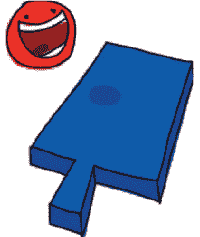
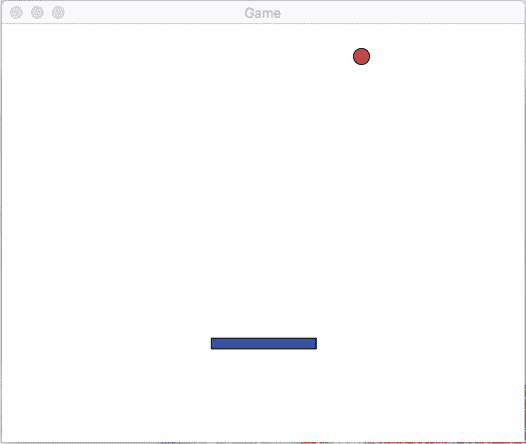
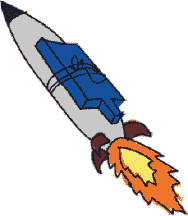
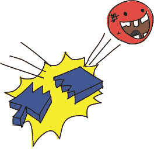
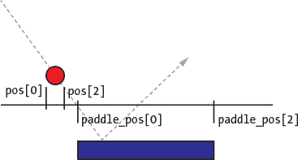
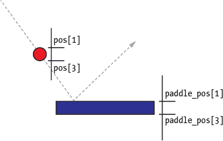
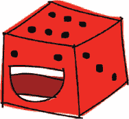
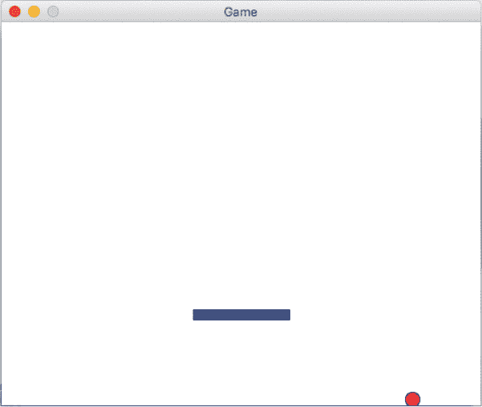
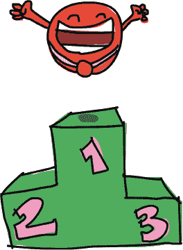

## 完成你的第一个游戏：Bounce！


在上一章中，我们开始构建我们的第一个游戏*Bounce*！通过创建画布并将一个弹跳球添加到我们的代码中。目前，我们的球会永远在屏幕上弹跳，这并不能算是一个有趣的游戏。在这一章中，我们将为玩家添加一个挡板。我们还会给游戏加入一些随机元素，让它更具挑战性和趣味性。

### 添加挡板

如果没有东西能击打弹跳球，那就没有什么乐趣可言了。所以，让我们创建一个挡板吧！

我们首先在 Ball 类后面直接添加以下代码来创建一个挡板（你需要将其放在球的 draw 函数下方的一行）：



```py
class Paddle:
    def __init__(self, canvas, color):
        self.canvas = canvas
        self.id = canvas.create_rectangle(0, 0, 100, 10, fill=color)
        self.canvas.move(self.id, 200, 300)

    def draw(self):
        pass

```

这段新增的代码几乎与我们为 Ball 类编写的第一版代码完全相同，唯一的区别是我们调用的是 create_rectangle（而不是 create_oval），并将矩形移动到位置 200, 300（水平 200 像素，垂直 300 像素）。

接下来，在代码列表的底部创建一个 Paddle 类的对象，然后更改主循环以调用挡板的 draw 函数，如下所示：

```py
➊ paddle = Paddle(canvas, 'blue')
   ball = Ball(canvas, 'red')

   while True:
       ball.draw()
    ➋ paddle.draw()
       tk.update_idletasks()
       tk.update()
       time.sleep(0.01)

```

更改可以在➊和➋看到。如果你现在运行游戏，你应该会看到弹跳球和一个静止的矩形挡板（图 12-1）。



*图 12-1：球和挡板*

### 让挡板移动

为了让挡板左右移动，我们将使用事件绑定，将*左*箭头和*右*箭头键分别绑定到 Paddle 类中的新函数。当玩家按下左箭头键时，x 变量将被设置为−2（向左移动）。按下右箭头键时，x 变量将被设置为 2（向右移动）。



第一步是将 x 对象变量添加到 Paddle 类的 __init__ 函数中，并像在 Ball 类中那样添加一个画布宽度的变量：

```py
    def __init__(self, canvas, color):
        self.canvas = canvas
        self.id = canvas.create_rectangle(0, 0, 100, 10, fill=color)        
        self.canvas.move(self.id, 200, 300)
      ➊ self.x = 0
      ➋ self.canvas_width = self.canvas.winfo_width()

```

请参见➊和➋了解更改。现在我们将在 draw 函数之后添加用于改变方向的函数，分别是左转（turn_left）和右转（turn_right）：

```py
    def turn_left(self, evt):
        self.x = -2

    def turn_right(self, evt):
        self.x = 2

```

我们可以通过这两行代码在类的 __init__ 函数中将这些函数绑定到正确的键位。在第 162 页的“让对象对某些事情作出反应”部分，我们使用了绑定方法使 Python 在按下某个键时调用函数。在这种情况下，我们将 Paddle 类的 turn_left 函数绑定到左箭头键，使用事件名称<KeyPress-Left>。然后我们将 turn_right 函数绑定到右箭头键，使用事件名称<KeyPress-Right>。我们的 __init__ 函数现在看起来是这样的：

```py
    def __init__(self, canvas, color):
        self.canvas = canvas
        self.id = canvas.create_rectangle(0, 0, 100, 10, fill=color)
        self.canvas.move(self.id, 200, 300)
        self.x = 0
        self.canvas_width = self.canvas.winfo_width()
      ➊ self.canvas.bind_all('<KeyPress-Left>', self.turn_left)
      ➋ self.canvas.bind_all('<KeyPress-Right>', self.turn_right)

```

请参见➊和➋了解更改。Paddle 类的 draw 函数与 Ball 类的 draw 函数类似：

```py
    def draw(self):
        self.canvas.move(self.id, self.x, 0)
        pos = self.canvas.coords(self.id)
        if pos[0] <= 0 or pos[2] >= self.canvas_width:
            self.x = 0

```

我们使用画布的 move 函数通过 self.canvas.move(self.id, self.x, 0)将球拍移动到 x 变量的方向。然后，我们获取球拍的坐标，查看它是否碰到屏幕的左侧或右侧，使用 pos 中的值。与球弹跳不同，球拍应该停止移动。因此，当左侧的*x*坐标(pos[0])小于或等于 0(<= 0)时，我们将 x 变量设置为 0，使用 self.x = 0。同样地，当右侧的*x*坐标(pos[2])大于或等于画布宽度(>= self.canvas_width)时，我们也将 x 变量设置为 0。

注意

*如果你现在运行程序，可能需要点击画布，才能让游戏识别左右箭头键的操作。点击画布会使画布获得焦点，这意味着它知道在有人按下键盘时应该接管控制。*

### 查找球何时碰到球拍

在我们代码的这一部分，球不会碰到球拍。实际上，球会直接穿过球拍。球需要知道何时碰到球拍，就像它需要知道何时碰到墙壁一样。



我们可以通过在绘制函数中添加代码来解决这个问题（在该函数中，我们已有检查墙壁的代码），但更好的做法是将这些代码移到新的函数中，把事情拆分成更小的部分。如果我们把太多代码放在一个地方（例如在一个函数内部），就会使代码变得更难理解。让我们进行必要的更改。

首先，我们修改球的 __init__ 函数，以便可以将球拍对象作为参数传递：

```py
class Ball:
  ➊ def __init__(self, canvas, paddle, color):
        self.canvas = canvas
     ➋ self.paddle = paddle
        self.id = canvas.create_oval(10, 10, 25, 25, fill=color)
        self.canvas.move(self.id, 245, 100)
        starts = [-3, -2, -1, 1, 2, 3]
        self.x = random.choice(starts)
        self.y = -3
        self.canvas_height = self.canvas.winfo_height() 
        self.canvas_width = self.canvas.winfo_width()

```

注意，我们改变了 __init__ 函数的参数，加入了球拍 ➊。然后，我们将球拍参数赋值给对象变量 paddle ➋。

保存了球拍对象后，我们需要更改创建球对象的代码。这个更改位于程序的底部，就在主 while 循环之前：

```py
paddle = Paddle(canvas, 'blue')
ball = Ball(canvas, paddle, 'red')

while True:
    ball.draw()
    paddle.draw()
    tk.update_idletasks()
    tk.update()
    time.sleep(0.01)

```

要判断球是否碰到球拍，我们需要一些比之前添加的检查墙壁的代码更复杂的代码。我们将这个函数命名为 hit_paddle，并在 Ball 类的绘制函数中调用它，那里我们检查球是否碰到屏幕底部：

```py
    def draw(self):
        self.canvas.move(self.id, self.x, self.y)
        pos = self.canvas.coords(self.id)
        if pos[1] <= 0 or pos[3] >= self.canvas_height:
            self.y = self.y * -1
      ➊ if self.hit_paddle(pos) == True:
          ➋ self.y = self.y * -1
        if pos[0] <= 0 or pos[2] >= self.canvas_width:
            self.x = self.x * -1

```

在新添加的代码中，如果 hit_paddle 返回 True ➊，我们通过将 y 对象变量设置为其值乘以-1 ➋（与球碰到画布顶部或底部时一样）来改变球的方向。通过这段代码，我们基本上是在说：“如果球(self)碰到球拍，那么我们就反转它的垂直方向。”

我们可以将顶部、底部和球拍的检查合并到一个 if 语句中——但如果我们将它们分开，新的程序员会更容易理解这段代码。

还不要尝试运行游戏；我们还需要创建 hit_paddle 函数。让我们现在就做这个。在 Ball 类的绘制函数前面添加 hit_paddle 函数：

```py
    def hit_paddle(self, pos):
        paddle_pos = self.canvas.coords(self.paddle.id)
        if pos[2] >= paddle_pos[0] and pos[0] <= paddle_pos[2]:
            if pos[3] >= paddle_pos[1] and pos[3] <= paddle_pos[3]:
                return True
        return False

```

首先，我们定义一个带有 pos 参数的函数。这个参数包含球的当前坐标。然后，我们获取挡板的坐标，并将其存储在 paddle_pos 变量中。

接下来，我们有了 if-then 语句的第一部分，它表示：“如果球的右侧大于挡板的左侧，并且球的左侧小于挡板的右侧……”在这里，pos[2] 包含球的右侧的 *x* 坐标，pos[0] 包含球的左侧的 *x* 坐标。变量 paddle_pos[0] 包含挡板左侧的 *x* 坐标，paddle_pos[2] 包含挡板右侧的 *x* 坐标。图 12-2 显示了球即将击中挡板时这些坐标的样子。



*图 12-2：球即将击中挡板—显示水平坐标*

球正在朝着挡板下落，但在这种情况下，您可以看到球的右侧 (pos[2]) 还没有越过挡板的左侧 (那就是 paddle_pos[0])。

接下来，我们检查球的底部 (pos[3]) 是否在挡板的顶部 (paddle_pos[1]) 和底部 (paddle_pos[3]) 之间。在图 12-3 中，您可以看到球的底部 (pos[3]) 还没有击中挡板的顶部 (paddle_pos[1])。



*图 12-3：球即将击中挡板—显示垂直坐标*

因此，基于当前球的位置，hit_paddle 函数会返回 False。

注意

*为什么我们需要检查球的底部是否在挡板的上下边缘之间？为什么不直接检查球的底部是否击中了挡板的顶部？因为每次我们在画布上移动球时，都会以 3 像素为单位跳跃。如果我们只检查球是否到达挡板的顶部（pos[1]），可能会跳过该位置。这样，球会继续移动，并会穿过挡板而停不下来。*

### 添加一个随机因素

现在是时候将我们的程序变成一个游戏，而不仅仅是一个弹跳的球和一个挡板。游戏需要一个*随机因素*，或者一种让玩家失去的方式。在我们当前的游戏中，球会永远弹跳，因此没有任何东西可以失去。



我们将通过添加代码来完成游戏，使得当球击中画布底部时游戏结束（换句话说，一旦球触地）。

首先，我们将 hit_bottom 对象变量添加到 Ball 类的 __init__ 函数的底部：

```py
        self.canvas_height = self.canvas.winfo_height()
        self.canvas_width = self.canvas.winfo_width()
        self.hit_bottom = False

```

然后我们更改程序底部的主循环，如下所示：

```py
while True:
  ➊ if ball.hit_bottom == False:
        ball.draw()
        paddle.draw()
    tk.update_idletasks()
    tk.update()
    time.sleep(0.01)

```

现在，循环不断检查 hit_bottom ➊，以查看球是否已经碰到屏幕底部。只有当球没有碰到底部时，代码才会继续移动球和挡板，正如前面的 if 语句所示。游戏在球和挡板停止移动时结束。（我们不再对它们进行动画处理。）

最后的修改是对 Ball 类的 draw 函数进行的：

```py
    def draw(self):
        self.canvas.move(self.id, self.x, self.y)
        pos = self.canvas.coords(self.id)
        if pos[1] <= 0:
            self.y = self.y * -1
     ➊ if pos[3] >= self.canvas_height:
            self.hit_bottom = True
        if self.hit_paddle(pos) == True:
            self.y = self.y * -1
        if pos[0] <= 0 or pos[2] >= self.canvas_width:
            self.y = self.y * -1

```

我们修改了 if 语句，检查球是否击中屏幕底部（即，球的位置是否大于或等于 canvas_height） ➊。如果是这样，在接下来的行中，我们将 hit_bottom 设置为 True，而不是改变 y 变量的值，因为一旦球击中屏幕底部，就不需要让球反弹了。

现在运行游戏，当你未能用球拍击中球时，屏幕上的所有动作应该停止。当球触及画布底部时，游戏应该结束，如图 12-4 所示。



*图 12-4：球击中屏幕底部*

你的程序现在应该看起来像下面的代码。如果你在让游戏运行时遇到问题，请检查你的输入是否与这段代码一致：

```py
from tkinter import *
import random
import time

class Ball:
    def __init__(self, canvas, paddle, color):
        self.canvas = canvas
        self.paddle = paddle
        self.id = canvas.create_oval(10, 10, 25, 25, fill=color)
        self.canvas.move(self.id, 245, 100)
        starts = [-3, -2, -1, 1, 2, 3]
        self.x = random.choice(starts)
        self.y = -3
        self.canvas_height = self.canvas.winfo_height()
        self.canvas_width = self.canvas.winfo_width()
        self.hit_bottom = False

    def hit_paddle(self, pos):
 paddle_pos = self.canvas.coords(self.paddle.id)
        if pos[2] >= paddle_pos[0] and pos[0] <= paddle_pos[2]:
            if pos[3] >= paddle_pos[1] and pos[3] <= paddle_pos[3]:
                return True
        return False

    def draw(self):
        self.canvas.move(self.id, self.x, self.y)
        pos = self.canvas.coords(self.id)
        if pos[1] <= 0:
            self.y = self.y * -1
        if pos[3] >= self.canvas_height:
            self.hit_bottom = True
        if self.hit_paddle(pos) == True:
            self.y = self.y * -1
        if pos[0] <= 0 or pos[2] >= self.canvas_width:
            self.y = self.y * -1

class Paddle:
    def __init__(self, canvas, color):
        self.canvas = canvas
        self.id = canvas.create_rectangle(0, 0, 100, 10, fill=color)
        self.canvas.move(self.id, 200, 300)
        self.x = 0
        self.canvas_width = self.canvas.winfo_width()
        self.canvas.bind_all('<KeyPress-Left>', self.turn_left)
        self.canvas.bind_all('<KeyPress-Right>', self.turn_right)

    def draw(self):
        self.canvas.move(self.id, self.x, 0)
        pos = self.canvas.coords(self.id)
        if pos[0] <= 0 or pos[2] >= self.canvas_width:
            self.x = 0

    def turn_left(self, evt):
        self.x = -2

    def turn_right(self, evt):
        self.x = 2

tk = Tk()
tk.title('Bounce Game')
tk.resizable(0, 0)
tk.wm_attributes('-topmost', 1)
canvas = Canvas(tk, width=500, height=400, bd=0, highlightthickness=0)
canvas.pack()
tk.update()

paddle = Paddle(canvas, 'blue')
ball = Ball(canvas, paddle, 'red')

while True:
    if ball.hit_bottom == False:
        ball.draw()
        paddle.draw()
    tk.update_idletasks()
    tk.update()
    time.sleep(0.01) 
```

### 你学到了什么

在本章中，我们完成了使用 tkinter 模块创建我们的第一个游戏。我们为游戏中的球拍创建了类，并使用坐标来检查球何时击中球拍或游戏画布的墙壁。我们使用事件绑定将左右箭头键绑定到球拍的移动，并使用主循环调用 draw 函数来进行动画。最后，我们修改了代码，添加了一个随机元素，使得当玩家未能击中球并且球触及画布底部时，游戏结束。



### 编程难题

目前，我们的游戏相当简单。你可以做很多修改来创建一个更有趣的游戏。尝试通过以下方式改进你的代码，然后将你的答案与* [`python-for-kids.com`](http://python-for-kids.com)*上的解决方案进行比较。

#### #1：延迟游戏开始

我们的游戏启动很快，你需要点击画布才能让它识别键盘上的左右箭头键。你能否在游戏开始时添加延迟，以便给玩家足够的时间点击画布？或者更好的是，你能否添加鼠标点击的事件绑定，只有在点击时才开始游戏？

提示 1：你已经为 Paddle 类添加了事件绑定，所以可以从那里开始。

提示 2：左键鼠标的事件绑定是字符串’<Button-1>’。

#### #2：一个合适的“游戏结束”

游戏结束时一切冻结，这对玩家来说不太友好。当球触及画布底部时，尝试添加“游戏结束”文字。你可以使用 create_text 函数，但你可能也会发现命名参数 state 很有用（它的取值包括 normal 和 hidden）。请查看第 165 页的“更多使用标识符的方法”中的 itemconfig。作为额外挑战，添加一个延迟，这样文字就不会立刻出现。

#### #3：加速球

在网球中，当球击中你的球拍时，球有时会比到达时的速度飞得更快，这取决于你挥拍的力度。在我们的游戏中，无论球拍是否在移动，球的速度都是相同的。尝试修改程序，使得球拍的速度传递给球的速度。

#### #4: 记录玩家的得分

那么，如何记录得分呢？每次球击中球拍时，得分应该增加。尝试在画布的右上角显示得分。你可能想回顾一下第 165 页中“更多使用标识符的方法”部分的 itemconfig 来获取一些提示。
