## 开发 Mr. Stick Man 游戏


现在我们已经创建了 *Mr. Stick Man Races for the Exit* 的图像，可以开始编写代码了。上一章对游戏的描述让我们知道需要什么：一个可以跑步和跳跃的火柴人，以及他必须跳到的平台。我们将编写代码来显示火柴人并让它在屏幕上移动，同时显示平台。但在编写这些代码之前，我们需要先创建画布来显示我们的背景图像。

### 创建 Game 类

首先，我们将创建一个名为 Game 的类，它将作为我们程序的主要控制器。Game 类将有一个 __init__ 函数用于初始化游戏，还有一个 mainloop 函数用于执行动画。

### 设置窗口标题并创建画布

在 __init__ 函数的第一部分，我们将设置窗口标题并创建画布。正如你所看到的，这部分代码与我们在第十一章为 *Bounce!* 编写的代码类似。在 IDLE 中打开一个新文件，输入以下代码，并将文件保存为 *stickmangame.py*。确保将文件保存在我们在第十三章中创建的 *stickman* 文件夹中：

```py
from tkinter import *
import random
import time  

class Game:
    def __init__(self):
        self.tk = Tk()
        self.tk.title('Mr. Stick Man Races for the Exit')
        self.tk.resizable(0, 0)
        self.tk.wm_attributes('-topmost', 1)
        self.canvas = Canvas(self.tk, width=500, height=500,
                             highlightthickness=0)
        self.canvas.pack()
        self.tk.update()
        self.canvas_height = self.canvas.winfo_height()
        self.canvas_width = self.canvas.winfo_width()

```

在程序的前半部分（从 tkinter import * 到 self.tk.wm_attributes 的代码行），我们创建了 tk 对象，然后通过 self.tk.title 设置窗口标题为（“Mr. Stick Man Races for the Exit”）。我们通过调用 resizable 函数使窗口 *固定*（以防止窗口大小被调整），然后通过 wm_attributes 函数将窗口移到所有其他窗口的前面。

接下来，我们通过 self.canvas = Canvas 行创建了画布，并调用了 tk 对象的 pack 和 update 函数。最后，我们为 Game 类创建了两个变量 height 和 width，用于存储画布的高度和宽度（我们使用 winfo_height 和 winfo_width 函数来获取画布的尺寸）。

注意

*在代码行 self.canvas = Canvas 中的反斜杠 (\) 仅用于分隔一行较长的代码。虽然在此情况下并不需要它，但为了提高可读性，我在此包含了它，因为整行代码无法在页面上显示完整。*

### 完成 __init__ 函数

现在，在你刚才创建的 *stickman game.py* 文件中输入其余的 __init__ 函数代码。此代码将加载背景图片，并将其显示在画布上：

```py
        self.tk.update()
        self.canvas_height = self.canvas.winfo_height()
        self.canvas_width = self.canvas.winfo_width()
        self.bg = PhotoImage(file='background.gif')
        w = self.bg.width()
        h = self.bg.height()
     ➊ for x in range(0, 5):
         ➋ for y in range(0, 5):
                self.canvas.create_image(x * w, y * h, 
                        image=self.bg, anchor='nw')
        self.sprites = []
        self.running = True

```

在以 self.bg 开头的代码行中，我们创建了一个名为 bg 的变量，它包含一个 PhotoImage 对象——我们在第十三章的第 210 页中创建的背景图片文件 *background.gif*。接下来，我们将图片的宽度和高度存储在 w 和 h 变量中。PhotoImage 类的 width 和 height 函数返回加载后的图片大小。

接下来是函数内部的两个循环。为了理解它们的作用，想象你有一个小的橡皮图章、一个印泥垫和一张大纸。你如何用这个图章将纸张填满彩色的小方块呢？你可以随机地把图章盖在纸上，直到纸被填满。结果会很乱，而且需要花费一段时间，但最终会填满页面。或者你可以从一列开始盖印，然后回到顶部，开始在下一列上盖印，正如图 14-1 所示。

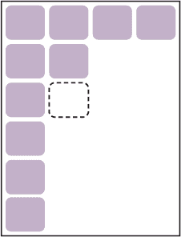

*图 14-1：在页面上盖印*

我们在前一章创建的背景图像就是我们的“印章”。我们知道画布的宽度是 500 像素，高度也是 500 像素，而且我们创建了一个 100 像素见方的背景图像。这意味着我们需要五列和五行才能填满屏幕上的图像。我们使用一个 for 循环➊来计算横向的列数，再用另一个 for 循环➋来计算纵向的行数。

接下来，我们将第一个循环变量 x 乘以图像的宽度（x * w），以确定绘制的横向位置，然后将第二个循环变量 y 乘以图像的高度（y * h），以计算绘制的纵向位置。我们使用画布对象（self.canvas.create_image）的 create_image 函数，根据这些坐标将图像绘制到屏幕上。

最后，我们创建了 sprites 变量，它保存一个空列表，和 running 变量，它包含 True 布尔值。稍后我们将在游戏代码中使用这些变量。

### 创建 mainloop 函数

我们将使用 Game 类中的 mainloop 函数来动画化我们的游戏。这个函数看起来和我们在第十一章中为*Bounce!*游戏创建的主循环（或动画循环）非常相似。

我们的函数如下：

```py
        for x in range(0, 5):
            for y in range(0, 5):
                self.canvas.create_image(x * w, y * h, 
                        image=self.bg, anchor='nw')
        self.sprites = []
        self.running = True

    def mainloop(self):
        while True:
           if self.running == True:
               for sprite in self.sprites:
                   sprite.move()
            self.tk.update_idletasks()
            self.tk.update()
            time.sleep(0.01)

```

我们创建了一个 while 循环，它会一直运行直到游戏窗口关闭（while True 是一个无限循环，我们第一次在第 175 页看到）。接下来，我们检查 running 变量是否等于 True。如果是，我们就遍历 sprites 列表中的所有精灵（self.sprites），并为每个精灵调用 move 函数。（我们还没有创建任何精灵，所以如果现在运行程序，这段代码不会有任何效果，但它以后会很有用。）

函数的最后三行强制 tk 对象重新绘制屏幕，并休眠片刻，就像我们在*Bounce!*游戏中所做的那样。

你可以运行这段代码，添加以下两行（注意没有缩进）并保存文件：


```py
g = Game()
g.mainloop()
```

注意

*确保将这段代码添加到游戏文件的底部。同时，确保你的图像和 Python 文件都在你在第十三章中创建的*stickman*文件夹中。*

这段代码创建了一个 Game 类的对象，并将其保存为 g 变量。然后，我们在这个新对象上调用 mainloop 函数来绘制屏幕。

保存程序后，在 IDLE 中通过 **运行** ▸ **运行模块** 来执行它。一个窗口应该会出现，背景图像填充画布，如图 14-2 所示。

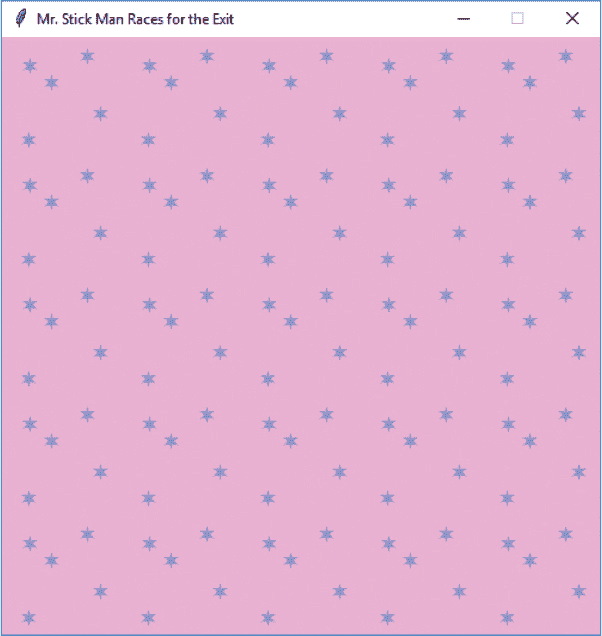

*图 14-2：游戏背景*

有了这个，我们为我们的游戏添加了一个漂亮的背景，并创建了一个动画循环，用于绘制精灵（在我们创建精灵后）。

### 创建 Coords 类

现在我们将创建一个类，用于指定精灵在游戏屏幕上的位置。这个类将存储游戏中任何组件的左上角（*x1* 和 *y1*）和右下角（*x2* 和 *y2*）坐标。

图 14-3 展示了如何使用这些坐标记录小人图像的位置。

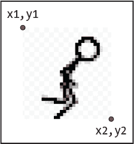

*图 14-3：x 和 y 坐标在小人图像中的位置*

我们的新类 Coords 将只包含一个 __init__ 函数，我们将四个参数（x1, y1, x2 和 y2）传递给它。将这段代码放在 *stickmangame.py* 文件的开头：

```py
class Coords:
    def __init__(self, x1=0, y1=0, x2=0, y2=0):
        self.x1 = x1
        self.y1 = y1
        self.x2 = x2
        self.y2 = y2

```

注意到每个参数都作为同名的对象变量（x1, y1, x2 和 y2）保存。我们很快会使用这个类的对象。

### 检测碰撞

一旦我们知道如何存储游戏精灵的位置，我们就需要一种方法来判断一个精灵是否与另一个精灵发生了碰撞，比如当小人跳动并撞到平台时。为了简化这个问题，我们可以将其分解为两个较小的问题：检查精灵是否在垂直方向发生碰撞，以及检查精灵是否在水平方向发生碰撞。然后，我们可以将这两个解决方案结合起来，查看精灵是否在任何方向上发生碰撞！

### 水平碰撞的精灵

首先，我们将创建 within_x 函数，来判断一组 *x* 坐标（*x1* 和 *x2*）是否与另一组 *x* 坐标（同样是 *x1* 和 *x2*）相交。直接在 Coords 类下方添加以下代码：

```py
class Coords:
    def __init__(self, x1=0, y1=0, x2=0, y2=0):
        self.x1 = x1
        self.y1 = y1
        self.x2 = x2
        self.y2 = y2

def within_x(co1, co2):
 ➊ if co1.x1 > co2.x1 and co1.x1 < co2.x2:
        return True
 ➋ elif co1.x2 > co2.x1 and co1.x2 < co2.x2:
        return True
    elif co2.x1 > co1.x1 and co2.x1 < co1.x2:
        return True
    elif co2.x2 > co1.x1 and co2.x2 < co1.x2:
        return True
    else:
        return False

```

within_x 函数接收两个参数 co1 和 co2，它们都是 Coords 对象。我们首先检查第一个坐标对象（co1.x1）的最左边位置是否位于第二个坐标对象的最左边位置（co2.x1）和最右边位置（co2.x2）之间 ➊。如果是，返回 True。


让我们来看看两条有重叠的 *x* 坐标的线条，以理解它是如何工作的。图 14-4 中的每条线从 x1 开始，到 x2 结束。

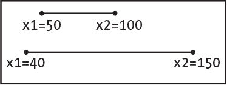

*图 14-4：重叠的水平 (x) 坐标*

图中的第一条线（co1）从像素位置 50（x1）开始，到 100（x2）结束。第二条线（co2）从位置 40 开始，到 150 结束。在这种情况下，由于第一条线的 x1 位置位于第二条线的 x1 和 x2 位置之间，因此该函数中的 if 语句对于这两组坐标是成立的。

在第一个 `elif` 语句 ➋ 中，我们检查第一条线的最右位置（`co1.x2`）是否在第二条线的最左位置（`co2.x1`）和最右位置（`co2.x2`）之间。如果是，我们返回 `True`。接下来的两个 `elif` 语句做的几乎是一样的：它们检查第二条线（`co2`）的最左和最右位置与第一条线（`co1`）的位置是否重叠。

如果没有任何 `if` 语句匹配，我们会进入 `else` 并返回 `False`。这实际上是在说：“不，这两个坐标对象在水平方向上没有重叠。”

要查看该函数如何工作的示例，请回顾 图 14-4。第一个坐标对象的 `x1` 和 `x2` 位置分别是 50 和 100，第二个坐标对象的 `x1` 和 `x2` 位置分别是 40 和 150。以下是我们调用已创建的 `within_x` 函数时发生的情况：

```py
>>> c1 = Coords(50, 50, 100, 100)
>>> c2 = Coords(40, 40, 150, 150)
>>> print(within_x(c1, c2))
True

```

该函数返回 `True`。这是确定一个精灵是否与另一个精灵发生碰撞的第一步。例如，当我们为小人和平台创建类时，我们就能判断它们的 *x* 坐标是否互相交叉。

在一个函数中有很多返回相同值的 `if` 或 `elif` 语句并不是最佳实践。为了解决这个问题，我们可以通过将每个条件用括号括起来，并用 `or` 关键字将它们连接，来简化 `within_x` 函数。为了使函数更简洁、代码行数更少，可以将其改为如下形式：

```py
def within_x(co1, co2):
    if (co1.x1 > co2.x1 and co1.x1 < co2.x2) \
            or (co1.x2 > co2.x1 and co1.x2 < co2.x2) \
            or (co2.x1 > co1.x1 and co2.x1 < co1.x2) \
            or (co2.x2 > co1.x1 and co2.x2 < co1.x2):
        return True
    else:
        return False

```

为了将 `if` 语句扩展到多行，以避免出现包含所有条件的长行，我们使用反斜杠（`\`），如上所示。

### 精灵垂直碰撞

我们还需要知道精灵是否发生了垂直碰撞。`within_y` 函数与 `within_x` 函数非常相似。为了创建它，我们检查第一个坐标的 *y1* 位置是否与第二个坐标的 *y1* 和 *y2* 位置发生重叠，然后反过来进行检查。

在 `within_x` 函数下面添加以下函数。这次我们将使用代码的简短版本（而不是大量的 `if` 语句）：

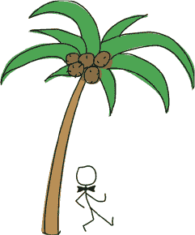

```py
def within_y(co1, co2):
    if (co1.y1 > co2.y1 and co1.y1 < co2.y2) \
            or (co1.y2 > co2.y1 and co1.y2 < co2.y2) \
            or (co2.y1 > co1.y1 and co2.y1 < co1.y2) \
            or (co2.y2 > co1.y1 and co2.y2 < co1.y2):
        return True
    else:
        return False

```

我们的 `within_x` 和 `within_y` 函数看起来非常相似，因为最终它们执行的操作是类似的。

### 将所有内容整合在一起：我们的最终碰撞检测代码

一旦我们确定了一个 *x* 坐标是否与另一个 *x* 坐标发生重叠，并且对 *y* 坐标做了同样的判断，我们就可以编写函数来判断一个精灵是否撞上了另一个精灵以及撞击在哪一侧。我们将通过 `collided_left`、`collided_right`、`collided_top` 和 `collided_bottom` 函数来实现这一点。

#### `collided_left` 函数

在我们刚刚创建的两个 `within` 函数下面，添加以下 `collided_left` 函数的代码：

```py
def collided_left(co1, co2):
    if within_y(co1, co2):
        if co1.x1 >= co2.x1 and co1.x1 <= co2.x2:
            return True
    return False

```

该函数告诉我们第一个坐标对象的左侧（`x1` 值）是否与另一个坐标对象发生碰撞。

该函数接受两个参数：co1（第一个坐标对象）和 co2（第二个坐标对象）。我们使用`within_y`函数检查这两个坐标对象是否在垂直方向上发生了交叉。毕竟，如果小人漂浮在平台上方，检查他是否与平台碰撞就没有意义了（如图 14-5 所示）。

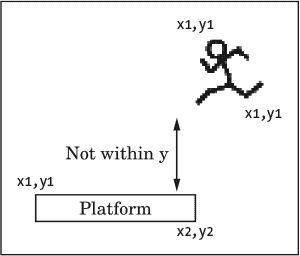

*图 14-5：小人位于平台上方*

然后，我们检查第一个坐标对象的最左侧位置（co1.x1）是否已经碰到第二个坐标对象的 x2 位置（co2.x2）。如果是这样，它应该小于或等于 x2 位置。我们还检查它是否没有超过 x1 位置。如果它碰到了侧面，我们返回 True。如果没有任何 if 语句为真，我们返回 False。

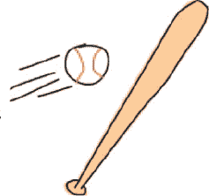

#### collided_right 函数

collided_right 函数看起来与 collided_left 非常相似：

```py
def collided_right(co1, co2):
    if within_y(co1, co2):
        if co1.x2 >= co2.x1 and co1.x2 <= co2.x2:
            return True
    return False

```

与 collided_left 类似，我们检查*y*坐标是否发生交叉，使用`within_y`函数。然后，我们检查第一个坐标对象的 x2 值是否介于第二个坐标对象的 x1 和 x2 位置之间，如果是，返回 True。否则，返回 False。

#### collided_top 函数

collided_top 函数与我们刚刚添加的两个函数非常相似：

```py
def collided_top(co1, co2):
    if within_x(co1, co2):
        if co1.y1 >= co2.y1 and co1.y1 <= co2.y2:
            return True
    return False

```

这次，我们检查坐标是否在水平方向上发生了交叉，使用`within_x`函数。接下来，我们检查第一个坐标的最顶部位置（co1.y1）是否已经超过第二个坐标的 y2 位置，但没有超过其 y1 位置。如果是这样，我们返回 True（第一个坐标的顶部已经碰到第二个坐标）。

#### collided_bottom 函数

我们的最后一个函数，collided_bottom，稍微有点不同：

```py
def collided_bottom(y, co1, co2):
    if within_x(co1, co2):
        y_calc = co1.y2 + y
     ➊ if y_calc >= co2.y1 and y_calc <= co2.y2:
            return True
     return False

```

这个函数接受一个额外的参数 y，这是我们加到第一个坐标 y 位置的值。我们的 if 语句检查坐标是否在水平方向上发生了交叉（就像在 collided_top 函数中一样）。接下来，我们将 y 参数的值加到第一个坐标的 y2 位置，并将结果存储在 y_calc 变量中。如果新计算的值介于第二个坐标的 y1 和 y2 值之间 ➊，我们返回 True，因为坐标 co1 的底部已经碰到坐标 co2 的顶部。然而，如果没有任何 if 语句为真，我们返回 False。

我们需要额外的 y 参数，因为小人可能会从平台上掉下来。与其他碰撞函数不同，我们需要能够测试他*是否*会在底部发生碰撞，而不是是否已经碰撞。如果他从平台上走下来并继续漂浮在空中，我们的游戏就不太现实；因此，当他行走时，我们会检查他是否与左侧或右侧的物体发生碰撞。当我们检查他下面时，我们查看他是否会与平台发生碰撞；如果不会，他就需要摔下去了！

### 创建 Sprite 类

我们游戏项目的父类 Sprite 提供了两个函数：move 用于移动精灵，coords 用于返回精灵当前在屏幕上的位置。我们将 Sprite 类的代码添加到 collided_bottom 函数下面，如下所示：

```py
class Sprite:
    def __init__(self, game):
 self.game = game
        self.endgame = False
        self.coordinates = None

    def move(self):
        pass

    def coords(self):
        return self.coordinates 
```

Sprite 类的 __init__ 函数接受一个参数 game，它将是游戏对象。我们需要它，以便我们创建的任何精灵都能访问游戏中其他精灵的列表。我们将 game 参数存储为对象变量。

然后，我们将对象变量 endgame 存储起来，用于表示游戏结束。（目前它被设置为 False。）最后一个对象变量 coordinates 被设置为 None（无）。

move 函数在这个父类中什么都不做，因此我们在该函数的主体中使用 pass 关键字。coords 函数仅仅返回对象变量 coordinates。

所以我们的 Sprite 类有一个什么都不做的 move 函数和一个不返回坐标的 coords 函数。这听起来并不是很有用，对吧？然而，任何以 Sprite 作为父类的类都会拥有 move 和 coords 函数。所以，在游戏的主循环中，当我们遍历精灵列表时，调用 move 函数不会导致任何错误，因为每个精灵都有这个函数。

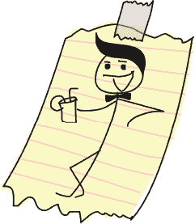

注意

*在编程中，具有功能不多的函数的类是相当常见的。从某种意义上讲，它们是一种约定，确保类的所有子类提供相同类型的功能，即使在某些情况下，子类中的函数什么都不做。*

### 添加平台

现在我们将添加平台。我们的平台对象类 PlatformSprite 将是 Sprite 的子类。这个类的 __init__ 函数将接受一个 game 参数（就像 Sprite 父类一样），还需要图像、x 和 y 位置以及图像的宽度和高度。下面是 PlatformSprite 类的代码，直接位于 Sprite 类下面：

```py
class PlatformSprite(Sprite):
    def __init__(self, game, photo_image, x, y, width, height):
        Sprite.__init__(self, game)
        self.photo_image = photo_image
        self.image = game.canvas.create_image(x, y, 
                image=self.photo_image, anchor='nw')
        self.coordinates = Coords(x, y, x + width, y + height)

```

当我们定义 PlatformSprite 类时，给它一个参数：父类的名称（Sprite）。__init__ 函数有七个参数：self、game、photo_image、x、y、width 和 height。

我们使用 self 和 game 作为参数值来调用父类 Sprite 的 __init__ 函数，因为除了 self 参数外，Sprite 类的 __init__ 函数只接受一个参数：game。

此时，如果我们创建一个 PlatformSprite 对象，它将拥有父类（game、endgame 和 coordinates）中的所有对象变量，仅仅因为我们调用了 Sprite 中的 __init__ 函数。

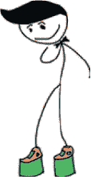

接下来，我们将 photo_image 参数保存为对象变量，并使用游戏对象的 canvas 变量通过 create_image 在屏幕上绘制图像。

最后，我们创建一个 Coords 对象，将 x 和 y 参数作为前两个参数。然后，我们将宽度和高度参数添加到这些参数中，作为后两个参数。

尽管在 Sprite 父类中坐标变量被设置为 None，但我们在 PlatformSprite 子类中将其更改为实际的 Coords 对象，包含平台图像在屏幕上的当前位置。

### 添加一个平台对象

让我们给游戏添加一个平台，看看它的样子。修改游戏文件的最后两行（*stickmangame.py*）：

```py
   g = Game()
➊ platform1 = PlatformSprite(g, PhotoImage(file='platform1.gif'), 
                              0, 480, 100, 10)
➋ g.sprites.append(platform1)
   g.mainloop()

```

我们创建了一个 PlatformSprite 类的对象，将我们的游戏变量（g）和一个 PhotoImage 对象（它使用我们的第一个平台图像，*platform1.gif*） ➊ 传递给它。我们还传递了绘制平台的位置（横向 0 像素，纵向 480 像素，接近画布底部），以及图像的高度和宽度（宽 100 像素，高 10 像素）。我们将这个精灵添加到游戏对象中的精灵列表 ➋。

如果你现在运行游戏，你应该能看到屏幕左下角有一个平台，像是图 14-6。

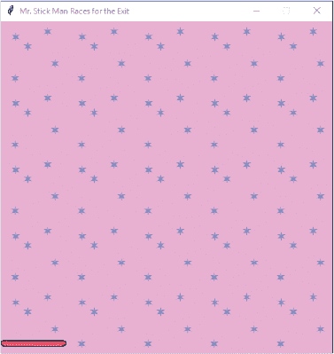

*图 14-6：显示一个平台*

### 添加多个平台

让我们添加许多平台。每个平台将具有不同的 *x* 和 *y* 坐标，因此它们会分散在屏幕上。使用以下代码：

```py
g = Game()
platform1 = PlatformSprite(g, PhotoImage(file='platform1.gif'), 
                           0, 480, 100, 10)
platform2 = PlatformSprite(g, PhotoImage(file='platform1.gif'), 
                           150, 440, 100, 10)
platform3 = PlatformSprite(g, PhotoImage(file='platform1.gif'), 
                           300, 400, 100, 10)
platform4 = PlatformSprite(g, PhotoImage(file='platform1.gif'), 
                           300, 160, 100, 10)
platform5 = PlatformSprite(g, PhotoImage(file='platform2.gif'), 
                           175, 350, 66, 10)
platform6 = PlatformSprite(g, PhotoImage(file='platform2.gif'), 
                           50, 300, 66, 10)
platform7 = PlatformSprite(g, PhotoImage(file='platform2.gif'), 
                           170, 120, 66, 10)
platform8 = PlatformSprite(g, PhotoImage(file='platform2.gif'), 
                           45, 60, 66, 10)
platform9 = PlatformSprite(g, PhotoImage(file='platform3.gif'), 
                           170, 250, 32, 10)
platform10 = PlatformSprite(g, PhotoImage(file='platform3.gif'), 
                            230, 200, 32, 10)
g.sprites.append(platform1)
g.sprites.append(platform2)
g.sprites.append(platform3)
g.sprites.append(platform4)
g.sprites.append(platform5)
g.sprites.append(platform6)
g.sprites.append(platform7)
g.sprites.append(platform8)
g.sprites.append(platform9)
g.sprites.append(platform10)
g.mainloop()

```

我们首先创建了大量的 PlatformSprite 对象，将它们保存为变量 platform1、platform2、platform3 等，直到 platform10。然后我们将每个平台添加到我们在 Game 类中创建的精灵变量中。如果你现在运行游戏，它应该看起来像是图 14-7。

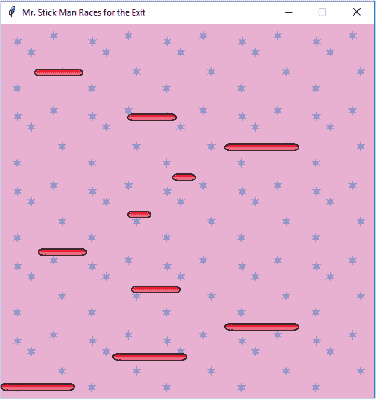

*图 14-7：显示所有平台*

我们已经创建了游戏的基础！现在我们准备添加我们的主角——火柴人先生。

### 你学到了什么

在本章中，你创建了 Game 类并将背景图像绘制到屏幕上。你学会了如何通过创建 within_x 和 within_y 函数来判断一个水平或垂直位置是否在另外两个水平或垂直位置的范围内。接着，你利用这些函数创建了新函数来判断一个坐标对象是否与另一个坐标对象发生碰撞。我们将在接下来的章节中使用这些函数，当我们为“火柴人先生”添加动画并需要检测他在画布上移动时是否与平台发生碰撞。

我们还创建了一个父类 Sprite 以及它的第一个子类 PlatformSprite，用来将平台绘制到画布上。

### 编程难题

以下编程难题是一些可以用来尝试游戏背景图像的方式。在 *[`python-for-kids.com`](http://python-for-kids.com)* 检查你的答案。

#### #1：棋盘格

尝试修改 Game 类，使背景图像像棋盘格一样绘制，如图 14-8 所示。

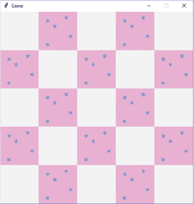

*图 14-8：背景为棋盘格*

#### #2：双图像棋盘格

一旦你弄明白如何创建棋盘格效果，试着使用两张交替的图片。创建另一张壁纸图像（使用你的图形程序），然后修改 Game 类，让它显示一个由两张交替图像组成的棋盘，而不是一张图像和空白背景。

#### #3: 书架与灯

你可以创建不同的壁纸图像，使游戏背景更有趣。创建背景图像的副本；然后画一个简单的书架、一张带灯的桌子或一扇窗户。通过修改 Game 类，让它显示一些不同的壁纸图像，将这些图像随机分布在屏幕上。

#### #4: 随机背景

作为两张图像棋盘格的替代方案，尝试创建五张不同的背景图像。你可以将它们画成一个重复的背景图案（1, 2, 3, 4, 5, 1, 2, 3, 4, 5，依此类推），或者你可以将它们随机绘制。

提示：如果你导入了 random 模块并将图片放在一个列表中，可以尝试使用 random.choice() 随机选择一张图片。
