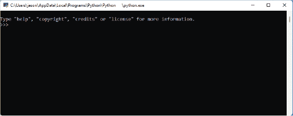

## 第二十章：C

故障排除


在本附录中，你将找到一些解决 Python 较少见问题的方法。如果你使用的是某些操作系统的较旧版本，可能会遇到这些问题。

### 在 Ubuntu 上导入 Turtle 时的 “TK” 错误

如果你正在使用较旧版本的 Ubuntu Linux，并且在导入 turtle 时遇到错误，可能需要安装一个叫做 *tkinter* 的软件。为此，请打开 Ubuntu 软件中心并在搜索框中输入 **python-tk**。窗口中应显示“Tkinter—使用 Python 编写 Tk 应用程序”。点击 **安装** 来安装此软件包。如果你使用的是较新版的 Ubuntu，通常不需要这样做——如果可能，建议让电脑的拥有者为你更新系统。

### 使用 Turtle 时的属性错误

一些新程序员在尝试使用 turtle 时，会遇到奇怪的 *属性* 错误：

```py
>>> import turtle
>>> t = turtle.Turtle()
Traceback (most recent call last):
  File "<stdin>", line 1, in <module>
AttributeError: module 'turtle' has no attribute 'Turtle'

```

这个错误最常见的原因是你在主文件夹中创建了一个名为 *turtle.py* 的文件。在这种情况下，当你输入 import turtle 时，实际上是导入了你自己创建的文件，而不是 Python 的 turtle 模块。如果你删除或重命名该文件，正确的模块应该会正常导入。

### 运行 Turtle 时的问题

如果你在使用 turtle 模块时遇到问题，并且 turtle 窗口似乎没有正常工作，可以尝试使用 Python 控制台而不是 Python Shell，如下所示：

+   在 Windows 中，输入 **Python** 在搜索框中并点击应用列表中的 **Python 3.1*x***。你也可以使用 Windows 命令提示符（点击 Windows 图标并在搜索框中输入 **cmd**）。打开命令提示符后，你需要输入 python.exe 程序的路径。如果你安装了 Python 3.10，路径可能类似于：*AppData\Local\Programs\Python \Python310\python.exe*。然而，这取决于你安装的 Python 版本，因此此方法通常应该是最后的选择（你可以在 图 C-1 中查看运行结果）。

    *图 C-1：从 Windows 命令提示符运行 Python 控制台*

+   在 macOS 中，点击屏幕右上角的聚光灯搜索图标（应该像一个放大镜），然后在输入框中输入 **终端**。终端打开后，输入 python3。

+   在 Ubuntu Linux 中，从 **显示应用程序** 菜单打开终端并输入 python3.10（请注意，版本号可能不同）。

+   在 Raspberry Pi 中，点击屏幕顶部菜单栏的终端图标，或者在 **附件** 菜单中点击 **终端**，然后输入 /usr/local/opt/python-3.10.0（此方法仅在你按照 第一章 的安装说明进行安装时有效；请注意，版本号可能不同）。

Python 控制台类似于 Python Shell（IDLE），但它没有语法高亮（彩色文本）、便捷的保存选项和其他有益的功能。然而，如果你在 Python Shell 中运行 turtle 时遇到问题，使用 Python 控制台可能会有所帮助。

### 类不接受任何参数

一些读者常见的错误是 TypeError，通常在第十一章首次出现。你可能会看到类似以下的错误：

```py
b = Ball(canvas, 'red')
Traceback (most recent call last):
  File "/usr/lib/python3.10/idlelib/run.py", line 573, in runcode
    exec(code, self.locals)
  File "<pyshell#4>", line 1, in <module>
TypeError: Ball() takes no arguments 
```

造成这种情况的原因通常是缺少下划线。Ball 类首先是这样定义的：

```py
class Ball:
    def __init__(self, canvas, color):
        self.canvas = canvas
        self.id = canvas.create_oval(10, 10, 25, 25, fill=color)
        self.canvas.move(self.id, 245, 100)

```

然而，如果你在输入 `__init__` 函数时错误地使用了单个下划线（_init_），Python 将不再将其识别为初始化函数。这就是为什么调用 Ball(...) 并传入任何参数会导致错误——Python 认为没有初始化函数可调用（实际上，它会为你创建一个没有参数的默认初始化函数）。
