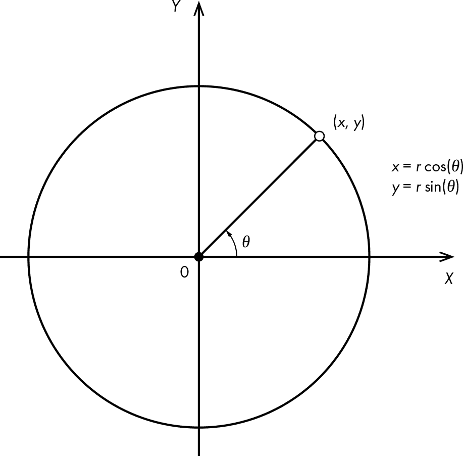
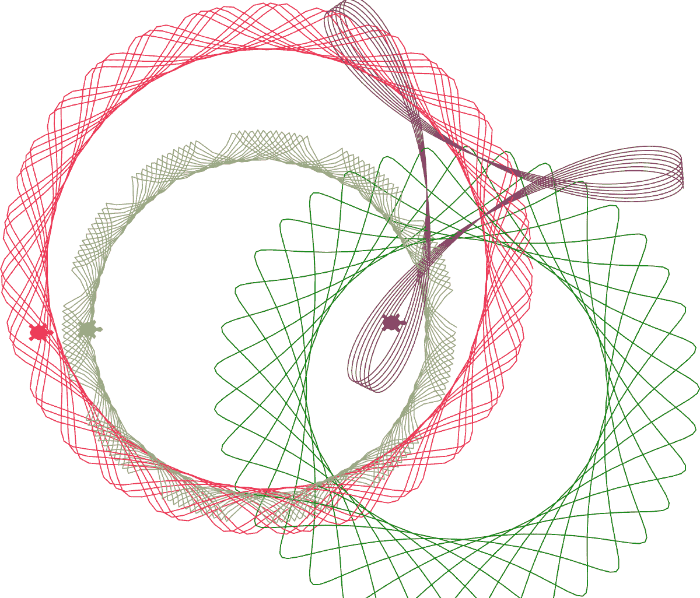
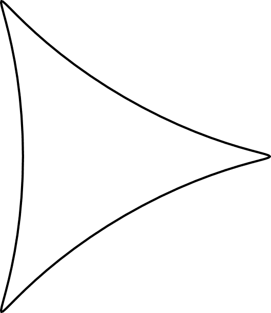

# 2

# 螺旋图

你可以使用一个螺旋图玩具（如图 2-1 所示）来绘制数学曲线。这个玩具由两个不同大小的带有塑料齿轮的圆环组成，一个大环和一个小环。小环上有几个孔。你将一支钢笔或铅笔穿过其中一个孔，然后在大环内旋转小环（大环的内侧有齿轮），保持两个轮子相互接触，从而绘制出无数复杂且对称的图案。

在这个项目中，你将使用 Python 创建一个类似螺旋图的曲线动画。程序将使用参数方程来描述螺旋图的环的运动，并绘制这些曲线（我称之为*螺旋*）。你将把完成的绘图保存为 PNG 格式的图片文件。程序会随机绘制螺旋图，或者你可以使用命令行选项来绘制具有特定参数的螺旋图。

图 2-1：螺旋图玩具

在这个项目中，你将学习如何在计算机上绘制螺旋图案。你还将学习如何完成以下任务：

+   • 使用参数方程生成曲线。

+   • 使用`turtle`模块将曲线绘制成一系列直线。

+   • 使用定时器来动画化图形。

+   • 将图形保存为图片文件。

提个小心：我选择使用`turtle`模块来绘制螺旋图，主要是出于说明的目的，并且因为它很有趣，但`turtle`比较慢，在需要高性能的图形创建时并不理想。（你对乌龟期望什么呢？）如果你想快速绘制图形，有更好的方法可以做到，接下来的项目中你将探索这些选择。

## 它是如何工作的

本项目的核心是使用*参数方程*，这些方程将曲线上的点的坐标表示为一个或多个变量的函数，这些变量叫做*参数*。你将把参数的值代入方程，计算出形成螺旋图案的点。然后你会把这些点传递给`turtle`模块来绘制曲线。

### 理解参数方程

为了理解参数方程是如何工作的，我们将从一个简单的例子开始：一个圆。考虑一个半径为*r*，并且以二维平面原点为中心的圆。这个圆由所有满足方程*x*² + *y*² = *r*²的点组成。然而，这不是一个参数方程。一个参数方程会根据某个变量（即参数）的变化，给出所有可能的*x*和*y*值。

现在，考虑以下方程：

*x* = *r* cos(θ)

*y* = *r* sin(θ)

这两个方程一起构成了我们圆的*参数*表示，其中参数是 θ，即点 (*x*, *y*) 相对于正 x 轴的角度。任何在这些方程中得到的 (*x*, *y*) 值都将满足原始方程 *x*² + *y*² = *r*²。当 θ 从 0 变化到 2π 时，这些方程生成的 x 和 y 坐标将形成圆。图 2-2 展示了这一方案。

图 2-2：用参数方程描述圆

记住，这两个方程适用于以坐标系原点为中心的圆。你可以通过将圆心从点 (0, 0) 平移到点 (*a*, *b*)，将圆放置在 XY 平面中的任何位置。然后，参数方程变为 *x* = *a* + *r* cos(θ) 和 *y* = *b* + *r* sin(θ)。

开发表示 Spirograph 玩具的参数方程与开发圆的参数方程没有太大区别，因为从本质上讲，Spirograph 只是绘制两个交错的圆。图 2-3 展示了类似 Spirograph 运动的数学模型。该模型没有齿轮齿；齿轮齿仅用于 Spirograph 玩具中防止打滑，在理想的数学模型世界中，你不需要担心任何打滑的问题。

图 2-3：Spirograph 玩具的数学模型

在图 2-3 中，*C* 是小圆的中心，*P* 是笔尖，*q* 是相对于正 x 轴的 *C* 角度。大圆的半径是 *R*，小圆的半径是 *r*。你可以通过以下方式表示半径的比率，设为变量 *k*：

线段  告诉你笔尖离小圆心的距离。你可以通过将  与小圆半径 *r* 的比率表示为变量 *l*，如下所示：

现在，你可以将这些变量组合成以下参数方程，表示点 *P*（笔尖）在小圆旋转进入大圆时的 x 和 y 坐标：

注意：这些曲线被称为 *内接摆线*。尽管方程看起来可能有些复杂，但推导过程相当直接。如果你想深入了解数学，可以查看维基百科上的 Spirograph 页面：[`en.wikipedia.org/wiki/Spirograph`](http://en.wikipedia.org/wiki/Spirograph)。

图 2-4 展示了用这些方程绘制的示例曲线。对于这条曲线，我设置*R*为 220，*r*为 65，*l*为 0.8。通过选择这三个参数的不同值，然后逐步增加角度θ，你可以绘制出各种各样迷人的曲线。

图 2-4：一个示例曲线

唯一剩下的任务是确定何时停止绘制，因为螺旋图形可能需要小圆绕大圆旋转许多圈才能完成一个完整的图案。你可以通过查看内外圆的半径比来计算螺旋图形的*周期性*（螺旋图形开始重复的时间）：

通过将分子和分母除以*最大公约数（**GCD）*，简化这个分数。然后，分子告诉你曲线完成自身所需的周期数。例如，在图 2-4 中，(*r*, *R*)的 GCD 是 5：

这告诉你，曲线将在小圆绕大圆旋转 13 圈后开始重复。分母中的 44 告诉你小圆围绕其自身中心旋转的次数，这也为你提供了曲线形状的线索。如果你数一数图 2-4 中的花瓣（或叶片），你会发现正好有 44 个！

一旦你将半径比表达为简化形式*r*/*R*，绘制螺旋线的参数θ的范围就是[0, 2π*r*]。这告诉你何时停止绘制特定的螺旋线。在图 2-4 中，当θ达到 26π（即 2π × 13）时，你应该停止。如果不知道角度的结束范围，你将会不停地循环，重复绘制相同的曲线。

### 使用 turtle 图形绘制曲线

Python 的`turtle`模块没有绘制曲线的功能。相反，你将通过使用上一节讨论的参数方程，计算出不同点之间的直线，从而绘制一个螺旋线。只要从一个点到下一个点的角度变化θ足够小，结果就会呈现曲线效果。

为了演示，下面的程序使用`turtle`绘制一个圆。它使用我们基本的圆形参数方程，*x* = *a* + *r* cos(θ) 和 *y* = *b* + *r* sin(θ)，来计算圆上的点，并将这些点用直线连接起来。从技术上讲，程序实际上是绘制一个*N*边形，但由于角度参数的变化非常小，*N*将非常大，因此该多边形看起来就像一个圆。输入以下代码，将其保存为*drawcircle.py*，并在 Python 中运行：

import math

import turtle

# 使用 turtle 绘制圆形

def drawCircleTurtle(x, y, r):

# 移动到圆的起始点

turtle.up()

❶ turtle.setpos(x + r, y)

turtle.down()

# 绘制圆形

❷ for i in range(0, 365, 5):

❸ a = math.radians(i)

❹ turtle.setpos(x + r*math.cos(a), y + r*math.sin(a))

❺ drawCircleTurtle(100, 100, 50)

turtle.mainloop()

这里你定义了`drawCircleTurtle()`函数，参数是要绘制的圆的中心坐标（*x*，*y*）和圆的半径（*r*）。函数开始时将海龟移动到圆的水平轴上的第一个点：(*x* + *r*, *y*)❶。调用`up()`和`down()`可以防止海龟在进入位置时画出线条。接下来，你开始使用`range(0, 365, 5)`的循环，每次将变量`i`递增 5，从 0 到 360❷。`i`变量是你将传递给参数方程的角度参数，但首先你需要将它从度数转换为弧度❸。（大多数计算机程序在角度计算中都要求使用弧度。）

使用两个参数方程计算下一个圆的坐标，然后根据计算结果设置海龟的位置❹。这将从上一个海龟位置画一条直线到新计算出来的位置。由于每次仅改变 5 度角参数，直线将呈现出圆形的效果。

现在你已经有了函数，可以调用它来绘制一个圆❺。调用`turtle.mainloop()`将保持`tkinter`窗口打开，这样你就可以欣赏你的作品了。（`tkinter`是 Python 默认的 GUI 库。）

现在你准备好绘制一些旋画了！你将使用之前介绍的相同`turtle`方法。唯一需要改变的是用来计算点的参数方程的细节。

## 需求

你将使用以下方法来创建你的旋画：

+   • `turtle`模块用于绘图

+   • `Pillow`，*Python Imaging Library（**PIL**）*的一个分支，用于保存旋画图像

## 代码

首先你将定义一个类`Spiro`来绘制曲线。你可以使用这个类来绘制单个曲线并自定义参数，或者作为一个动画的一部分，绘制多个随机的旋画。为了协调动画，你将定义另一个名为`SpiroAnimator`的类。在程序的顶层，你将编写一个函数来将绘图保存为图像文件，并使用`main()`函数来获取用户输入并启动绘制。

要查看完整的项目代码，请跳转到“完整代码”部分，位于第 36 页。你也可以从[`github.com/mkvenkit/pp2e/blob/main/spirograph/spiro.py`](https://github.com/mkvenkit/pp2e/blob/main/spirograph/spiro.py)下载该项目的代码。

### 绘制旋画

`Spiro` 类提供了用于绘制单个螺旋图案的方法。以下是 `Spiro` 类的构造函数：

class Spiro:

# 构造函数

def __init__(self, xc, yc, col, R, r, l):

# 创建海龟对象

❶ self.t = turtle.Turtle()

# 设置光标形状

❷ self.t.shape('turtle')

# 设置步长（以度为单位）

❸ self.step = 5

# 设置绘图完成标志

❹ self.drawingComplete = False

# 设置参数

self.setparams(xc, yc, col, R, r, l)

# 初始化绘图

self.restart()

`Spiro` 构造函数创建了一个新的 `turtle` 对象 ❶。这样，每个单独的 `Spiro` 对象将拥有自己的 `turtle` 对象，也就是说，你可以创建多个 `Spiro` 对象同时绘制多个螺旋图案。你将海龟光标的形状设置为海龟 ❷。（你可以在 `turtle` 文档中找到其他选择，访问 [`docs.python.org/3/library/turtle.xhtml`](https://docs.python.org/3/library/turtle.xhtml)）。你将参数化绘图的角度增量设置为 5 度 ❸，并创建一个布尔类型的 `drawingComplete` 标志，用于指示螺旋图案是否完成 ❹。当多个 `Spiro` 对象同时绘图时，这个标志将非常有用，它帮助你追踪某个特定的螺旋图案是否已完成。构造函数最后通过调用两个设置方法完成初始化，接下来将讨论这两个方法。

#### 设置方法

`Spiro` 类的 `setparams()` 和 `restart()` 方法都帮助完成在绘制螺旋图案之前需要做的一些设置。我们先来看 `setparams()` 方法：

def setparams(self, xc, yc, col, R, r, l):

# 螺旋图案的参数

self.xc = xc

self.yc = yc

self.R = int(R)

self.r = int(r)

self.l = l

self.col = col

# 通过与最大公约数（GCD）相除来将 r/R 简化为最小形式

❶ gcdVal = math.gcd(self.r, self.R)

❷ self.nRot = self.r//gcdVal

# 获取半径比例

self.k = r/float(R)

# 设置颜色

self.t.color(*col)

# 存储当前角度

❸ self.a = 0

首先，你存储螺旋中心的坐标（`xc` 和 `yc`）。然后，你将每个圆的半径（`R` 和 `r`）转换为整数并存储这些值。你还存储了 `l`，它定义了笔的位置，以及 `col`，它决定了螺旋的颜色。接下来，你使用 Python 内置的 `math` 模块中的 `gcd()` 方法计算半径的最大公约数（GCD） ❶。你用这个信息来确定曲线的周期性，并将其保存为 `self.nRot` ❷。最后，你将角度参数 `a` 的初始值设置为 `0` ❸。

`restart()` 方法通过重置 `Spiro` 对象的绘图参数，继续进行设置，并将其定位以绘制螺旋图案。这个方法使得可以重复使用同一个 `Spiro` 对象，依次绘制多个螺旋图案，作为程序动画的一部分。每当对象准备好绘制新的螺旋图案时，程序会调用 `restart()`。以下是该方法：

def restart(self):

# 设置标志

self.drawingComplete = False

# 显示海龟

self.t.showturtle()

# 转到第一个点

❶ self.t.up()

❷ R, k, l = self.R, self.k, self.l

a = 0.0

❸ x = R*((1-k)*math.cos(a) + l*k*math.cos((1-k)*a/k))

y = R*((1-k)*math.sin(a) - l*k*math.sin((1-k)*a/k))

❹ self.t.setpos(self.xc + x, self.yc + y)

❺ self.t.down()

你将 `drawingComplete` 标志重置为 `False`，表示对象已准备好绘制新的螺旋线。然后，你显示海龟光标（如果它被隐藏了）。接着，抬起画笔 ❶，这样你就可以在 ❹ 处移动到第一个位置而不绘制线条。到 ❷ 时，你只是使用一些局部变量来保持代码简洁。然后，你将这些变量传递给螺旋线的参数方程，计算曲线起点的 x 和 y 坐标，使用 `0` 作为角度 `a` 的初始值 ❸。最后，一旦海龟到达位置，你将画笔放下，让海龟开始绘制螺旋线 ❺。

#### draw() 方法

如果你使用命令行选项来设置螺旋线的参数，程序将只绘制这一个螺旋线，使用 `Spiro` 类的 `draw()` 方法。这个方法会一次性绘制整个螺旋线，作为一系列连续的直线段：

def draw(self):

# 绘制其余的点

R, k, l = self.R, self.k, self.l

❶ for i in range(0, 360*self.nRot + 1, self.step):

a = math.radians(i)

❷ x = R*((1-k)*math.cos(a) + l*k*math.cos((1-k)*a/k))

y = R*((1-k)*math.sin(a) - l*k*math.sin((1-k)*a/k))

try:

❸ self.t.setpos(self.xc + x, self.yc + y)

except:

print("异常，程序退出。")

exit(0)

# 绘图已完成，因此隐藏海龟光标

❹ self.t.hideturtle()

在这里，你遍历参数 `i` 的完整范围，`i` 以度数表示，为 360 倍的 `nRot` ❶。你使用参数方程来计算每个 `i` 值对应的 x 和 y 坐标 ❷，并调用海龟的 `setpos()` 方法 ❸，从一个点绘制到下一个点。这个方法被包含在一个 `try` 块中，这样如果出现异常（例如用户在绘制过程中关闭了窗口），你可以捕获它并优雅地退出。最后，由于绘图已完成，你将隐藏光标 ❹。

#### update() 方法

如果你不使用任何命令行选项，程序将绘制多个随机的螺旋线动画。这种方法需要对我们刚才看到的绘图代码进行一些重构。你需要一个方法来绘制螺旋线的单一线段，而不是一次性绘制整个螺旋线。然后，你将在每个时间步调用这个方法来绘制动画。这段 `update()` 方法适用于 `Spiro` 类：

def update(self):

# 如果完成，跳过其余步骤

❶ if self.drawingComplete:

return

# 增加角度

❷ self.a += self.step

# 绘制一步

R, k, l = self.R, self.k, self.l

# 设置角度

❸ a = math.radians(self.a)

x = self.R*((1-k)*math.cos(a) + l*k*math.cos((1-k)*a/k))

y = self.R*((1-k)*math.sin(a) - l*k*math.sin((1-k)*a/k))

try:

❹ self.t.setpos(self.xc + x, self.yc + y)

except:

print("异常，程序退出。")

exit(0)

# 如果绘制完成，设置标志

❺ if self.a >= 360*self.nRot:

self.drawingComplete = True

# 绘制完成后，隐藏海龟光标

self.t.hideturtle()

你首先检查`drawingComplete`标志是否已经设置❶；如果没有，你就继续执行剩下的代码。你会增加当前角度❷，计算对应当前角度的(*x*, *y*)位置❸，并将海龟移到那里，同时绘制出线段❹。这就像是在`draw()`方法中的`for()`循环里的代码，只不过它只执行一次。

当我讨论 Spirograph 的参数方程时，我提到了曲线的周期性。Spirograph 在某个角度之后开始重复自己。你通过检查角度是否已经达到为该特定曲线计算的完整范围❺来结束`update()`函数。如果是这样，你将设置`drawingComplete`标志，因为 spiro 已经完成。最后，你会隐藏海龟光标，这样你就可以看到你美丽的创作。

### 协调动画

`SpiroAnimator`类允许你同时绘制多个随机 spiro 作为动画。这个类通过定时器定期调用每个`Spiro`对象的`update()`方法，协调多个`Spiro`对象的活动，这些对象的参数是随机分配的。这个技术周期性地更新图形，并允许程序处理按钮按下、鼠标点击等事件。

让我们首先看看`SpiroAnimator`类的构造函数：

class SpiroAnimator:

# 构造函数

def __init__(self, N):

# 设置计时器的时间值（毫秒）

❶ self.deltaT = 10

# 获取窗口尺寸

❷ self.width = turtle.window_width()

self.height = turtle.window_height()

# 重启中

❸ self.restarting = False

# 创建 Spiro 对象

self.spiros = []

for i in range(N):

# 生成随机参数

❹ rparams = self.genRandomParams()

# 设置 spiro 参数

❺ spiro = Spiro(*rparams)

self.spiros.append(spiro)

# 调用计时器

❻ turtle.ontimer(self.update, self.deltaT)

`SpiroAnimator`构造函数将`deltaT`设置为`10`，这是你在计时器中使用的时间间隔，单位为毫秒❶。接着，你会存储海龟窗口的尺寸❷，并初始化一个标志，表示重启正在进行中❸。在一个重复*N*次的循环中（`N`通过构造函数传递给`SpiroAnimator`），你会创建新的`Spiro`对象❺并将它们添加到`spiros`列表中。在创建每个`Spiro`对象之前，你调用`genRandomParams()`辅助方法❹，随机分配 spiro 的参数（我们接下来会看这个方法）。这里的`rparams`是一个元组，你需要将其传递给`Spiro`构造函数。然而，构造函数期望多个参数，因此你使用 Python 的`*`运算符将元组解包为多个参数。最后，你设置`turtle.ontimer()`方法，在`deltaT`毫秒后调用`update()`❻，从而启动动画。

#### 生成随机参数

你将使用 `genRandomParams()` 方法生成随机参数，并将其传递给每个 `Spiro` 对象，在其创建时生成各种不同的曲线。每次一个 `Spiro` 对象完成绘制一个螺旋图并准备开始绘制一个新的螺旋图时，你也会调用此方法：

def genRandomParams(self):

width, height = self.width, self.height

R = random.randint(50, min(width, height)//2)

r = random.randint(10, 9*R//10)

l = random.uniform(0.1, 0.9)

xc = random.randint(-width//2, width//2)

yc = random.randint(-height//2, height//2)

col = (random.random(),

random.random(),

random.random())

❶ 返回 (xc, yc, col, R, r, l)

为了生成随机数，你使用 Python `random` 模块中的三种方法：`randint()`，它返回指定范围内的随机整数；`uniform()`，它对浮点数做同样的操作；`random()`，它返回一个 0 到 1 之间的浮点数。你将 `R` 设置为一个介于 50 和窗口最小尺寸的一半之间的随机整数，并将 `r` 设置为 `R` 的 10% 到 90% 之间。然后，你将 `l` 设置为介于 0.1 和 0.9 之间的一个随机小数。

接下来，你会从屏幕内随机选择一个点来放置 spiro 的中心，随机选择 x 和 y 坐标（`xc` 和 `yc`）。你通过为红色、绿色和蓝色的颜色分量设置随机值（这些值在 0 到 1 的范围内）来为曲线分配一个随机颜色 `col`。最后，所有计算出的参数都会作为一个元组 ❶ 返回。

#### 重启动画

`SpiroAnimator` 类有它自己的 `restart()` 方法，用于重启动画，绘制一组新的 spiros：

def restart(self):

# 如果已经在重启过程中，则忽略重启

❶ 如果 self.restarting:

返回

否则：

self.restarting = True

对于 spiro 在 self.spiros 中：

# 清除

spiro.clear()

# 生成随机参数

rparams = self.genRandomParams()

# 设置 spiro 参数

spiro.setparams(*rparams)

# 重启绘制

spiro.restart()

# 重启完成

❷ self.restarting = False

这个方法会遍历所有的 `Spiro` 对象。对于每一个对象，清除之前的绘制，并随机生成一组新的 spiro 参数。然后你会使用 `Spiro` 对象的设置方法 `setparams()` 和 `restart()` 来分配新参数，并让对象准备好绘制下一个 spiro。`self.restarting` 标志 ❶ 防止在完成之前调用此方法，如果用户反复按空格键，这可能会发生。标志会在方法末尾重置，这样下一个重启就不会被忽略 ❷。

#### 更新动画

以下代码展示了 `SpiroAnimator` 中的 `update()` 方法，该方法每 10 毫秒由定时器调用，用于更新动画中所有的 `Spiro` 对象：

def update(self):

# 更新所有的 spiros

❶ nComplete = 0

对于 spiro 在 self.spiros 中：

# 更新

❷ spiro.update()

# 计算已完成的 spiros

❸ 如果 spiro.drawingComplete:

nComplete += 1

# 如果所有涡旋图形完成，则重新启动

❹ if nComplete == len(self.spiros):

self.restart()

# 调用定时器

try:

❺ turtle.ontimer(self.update, self.deltaT)

except:

print("发生异常，退出程序。")

exit(0)

`update()`方法使用一个计数器`nComplete`来跟踪已经完成绘制的`Spiro`对象数量 ❶。该方法遍历`Spiro`对象的列表并更新它们 ❷，每个涡旋图形会绘制一段新的线段。如果某个`Spiro`已完成，你会增加计数器 ❸。

在循环外，你检查计数器以确定所有对象是否已完成绘制 ❹。如果是这样，你通过调用`restart()`方法重新启动动画，使用新的涡旋图形。`update()`方法以调用`turtle`模块的`ontimer()`方法结束 ❺，该方法在`deltaT`毫秒后再次调用`update()`。这就是保持动画继续进行的方式。

#### 显示或隐藏光标

你使用`SpiroAnimator`类的以下方法来切换海龟光标的显示与隐藏。关闭光标会使绘图速度更快。

def toggleTurtles(self):

for spiro in self.spiros:

if spiro.t.isvisible():

spiro.t.hideturtle()

else:

spiro.t.showturtle()

这个方法使用内置的`turtle`方法，如果光标可见则隐藏它，或者如果不可见则显示光标。稍后你将看到如何通过在动画运行时按键触发`toggleTurtles()`方法。

### 保存曲线

在你辛苦生成涡旋图形后，最好有一种方式来保存结果。独立的`saveDrawing()`函数将绘图窗口的内容保存为 PNG 图像文件：

def saveDrawing():

# 隐藏海龟光标

❶ turtle.hideturtle()

# 生成唯一的文件名

❷ dateStr = (datetime.now()).strftime("%d%b%Y-%H%M%S")

fileName = 'spiro-' + dateStr

print('保存绘图到{} .eps/png'.format(fileName))

# 获取 tkinter 画布

canvas = turtle.getcanvas()

# 将绘图保存为 PostScript 图像

❸ canvas.postscript(file = fileName + '.eps')

# 使用 Pillow 模块将 PostScript 图像文件转换为 PNG

❹ img = Image.open(fileName + '.eps')

❺ img.save(fileName + '.png', 'png')

# 显示海龟光标

turtle.showturtle()

你隐藏了海龟光标，这样它们就不会出现在最终的绘图中 ❶。然后，你使用`datetime()`生成基于时间戳的唯一文件名（格式为*日-月-年-时-分-秒*）❷。你将这个字符串附加到*spiro-*，生成文件名。

`turtle`程序使用由`tkinter`创建的用户界面（UI）窗口，你使用`tkinter`的`canvas`对象将窗口保存为嵌入式 PostScript（EPS）文件格式 ❸。由于 EPS 是基于矢量的，你可以用它打印高分辨率的图像，但 PNG 格式更为通用，所以你使用`Pillow`打开 EPS 文件 ❹并将其保存为 PNG 文件 ❺。最后，你重新显示海龟光标。

### 解析命令行参数和初始化

本书中的大多数项目都有命令行参数，用于定制代码。与其尝试手动解析这些参数并弄得一团糟，不如将这一繁琐任务交给 Python 的`argparse`模块。你在 spiro 程序的`main()`函数的第一部分中就是这么做的：

def main():

❶ parser = argparse.ArgumentParser(description=descStr)

# 添加预期的参数

❷ parser.add_argument('--sparams', nargs=3, dest='sparams', required=False,

help="sparams 中的三个参数：R，r，l。"

# 解析参数

❸ args = parser.parse_args()

你创建了一个`ArgumentParser`对象来管理命令行参数 ❶。然后将`--sparams`参数添加到解析器中 ❷。它由三个组成部分构成，分别是*R*、*r*和*l*参数。你使用`dest`选项来指定在解析完参数后，值应存储在哪个变量中，`required=False`表示该参数是可选的。你调用`parse_args()`方法 ❸ 来实际解析参数。这使得参数作为`args`对象的属性可用。在本例中，`--sparams`参数的值将通过`args.sparams`访问。

注意：你将在本书中遵循这里描述的相同基本模式来创建并解析每个项目的命令行参数。

`main()`函数继续通过设置一些`turtle`参数：

# 将绘图窗口的宽度设置为屏幕宽度的 80%

❶ turtle.setup(width=0.8)

# 设置光标形状为海龟

turtle.shape('turtle')

# 将标题设置为 Spirographs!

turtle.title("Spirographs!")

# 添加键盘处理程序以保存我们的绘图

❷ turtle.onkey(saveDrawing, "s")

# 开始监听

❸ turtle.listen()

# 隐藏主海龟光标

❹ turtle.hideturtle()

你使用`setup()`将绘图窗口的宽度设置为屏幕宽度的 80%。(你也可以给`setup()`指定特定的高度和原点参数。)然后将光标形状设置为海龟形状，并将程序窗口的标题设置为*Spirographs!*接下来，使用`onkey()`与`saveDrawing()`函数指示程序在按下键盘上的 S 键时保存绘图 ❷。调用`listen()`使绘图窗口监听用户事件（如按键） ❸。最后，隐藏海龟光标 ❹。

`main()`函数的其余部分如下：

# 检查是否有任何传递给`--sparams`的参数，并绘制 Spirograph

❶ 如果有`args.sparams`：

❷ params = [float(x) for x in args.sparams]

# 使用给定参数绘制 Spirograph

col = (0.0, 0.0, 0.0)

❸ spiro = Spiro(0, 0, col, *params)

❹ spiro.draw()

else:

# 创建动画器对象

❺ spiroAnim = SpiroAnimator(4)

# 添加键盘处理程序以切换海龟光标

turtle.onkey(spiroAnim.toggleTurtles, "t")

# 添加键盘处理程序以重新启动动画

turtle.onkey(spiroAnim.restart, "space")

# 启动海龟主循环

❻ turtle.mainloop()

你首先检查是否给`--sparams`传入了任何参数 ❶；如果有，程序将只绘制由这些参数定义的单个螺旋图。参数目前是以字符串形式存在的，但你需要将它们解释为数字。你使用列表推导式将它们转换为浮动列表 ❷。（*列表推导式*是 Python 的一种构造，可以用简洁且强大的方式创建列表。例如，`a = [2*x for x in range(1, 5)]`会创建一个包含前四个偶数的列表。）然后，你使用这些参数构造一个`Spiro`对象 ❸（借助 Python 的`*`操作符，它可以将列表展开为一系列参数），并调用`draw()`来绘制螺旋图 ❹。

如果在命令行没有指定任何参数，程序将进入随机动画模式。在这种模式下，你创建一个`SpiroAnimator`对象 ❺，并传入参数`4`，这会让它一次绘制四个螺旋图。然后，你使用两个`onkey`调用来捕捉额外的按键事件。按下 T 键会通过`toggleTurtles()`方法显示或隐藏乌龟光标，而按下空格键（`space`）则会调用`restart()`，在任何时刻中断动画并开始绘制四个不同的随机螺旋图。最后，你调用`mainloop()`，让`tkinter`窗口保持打开，等待事件 ❻。

## 运行螺旋图动画

现在是时候运行你的程序了：

$ `python spiro.py`

默认情况下，*spiro.py*程序同时绘制四个随机螺旋图，如图 2-5 所示。按下 S 键保存绘图，按下 T 键切换光标，按下空格键重新启动动画。

图 2-5：*spiro.py*的示例运行

现在再次运行程序，这次在命令行传入参数来绘制特定的螺旋图：

$ `python spiro.py --sparams 300 100 0.9`

图 2-6 展示了输出结果。如你所见，这段代码绘制了一个由用户指定参数定义的单一螺旋图，区别于图 2-5，后者展示了多个随机螺旋图的动画。

图 2-6：使用特定参数的*spiro.py*示例运行

尝试不同的参数，看它们如何影响结果曲线，玩得开心。

## 总结

在这个项目中，你学会了如何创建类似 Spirograph 的曲线。你还学会了如何调整输入参数，生成各种不同的曲线，并在屏幕上进行动画。我希望你喜欢创作这些螺旋图。（你会在第十三章中发现一个惊喜，届时你将学会如何将螺旋图投影到墙上！）

## 实验！

以下是一些进一步实验螺旋图的方法：

1.  1\. 现在你知道如何绘制圆形了，写一个程序绘制随机的*螺旋线*。找到*对数螺旋*的参数方程，并用它来绘制螺旋线。

1.  2\. 你可能已经注意到，当曲线被绘制时，海龟光标总是面朝右侧，但这并不是海龟的移动方式！将海龟朝向改为在绘制曲线时始终朝着绘制的方向。(提示：计算每一步的两个点之间的方向向量，并使用`turtle`.`setheading()`方法重新调整海龟的方向。)

## 完整代码

这是完整的涡轮图程序：

"""

spiro.py

一个模拟绘制涡轮图的 Python 程序。

作者：Mahesh Venkitachalam

"""

import random, argparse

import numpy as np

import math

import turtle

import random

from PIL import Image

from datetime import datetime

# 一个绘制涡轮图的类

class Spiro:

# 构造函数

def __init__(self, xc, yc, col, R, r, l):

# 创建自己的海龟

self.t = turtle.Turtle()

# 设置光标形状

self.t.shape('turtle')

# 设置角度步长

self.step = 5

# 设置绘图完成标志

self.drawingComplete = False

# 设置参数

self.setparams(xc, yc, col, R, r, l)

# 初始化绘图

self.restart()

# 设置参数

def setparams(self, xc, yc, col, R, r, l):

# 涡轮图参数

self.xc = xc

self.yc = yc

self.R = int(R)

self.r = int(r)

self.l = l

self.col = col

# 将 r/R 除以最大公约数以得到最简形式

gcdVal = math.gcd(self.r, self.R)

self.nRot = self.r//gcdVal

# 获取半径比

self.k = r/float(R)

# 设置颜色

self.t.color(*col)

# 当前角度

self.a = 0

# 重新开始绘图

def restart(self):

# 设置标志

self.drawingComplete = False

# 显示海龟

self.t.showturtle()

# 移动到第一个点

self.t.up()

R, k, l = self.R, self.k, self.l

a = 0.0

x = R*((1-k)*math.cos(a) + l*k*math.cos((1-k)*a/k))

y = R*((1-k)*math.sin(a) - l*k*math.sin((1-k)*a/k))

try:

self.t.setpos(self.xc + x, self.yc + y)

except:

print("异常，退出。")

exit(0)

self.t.down()

# 绘制整个图形

def draw(self):

# 绘制其余的点

R, k, l = self.R, self.k, self.l

for i in range(0, 360*self.nRot + 1, self.step):

a = math.radians(i)

x = R*((1-k)*math.cos(a) + l*k*math.cos((1-k)*a/k))

y = R*((1-k)*math.sin(a) - l*k*math.sin((1-k)*a/k))

try:

self.t.setpos(self.xc + x, self.yc + y)

except:

print("异常，退出。")

exit(0)

# 完成 - 隐藏海龟

self.t.hideturtle()

# 更新一步

def update(self):

# 完成则跳过

if self.drawingComplete:

return

# 增加角度

self.a += self.step

# 绘制步骤

R, k, l = self.R, self.k, self.l

# 设置角度

a = math.radians(self.a)

x = self.R*((1-k)*math.cos(a) + l*k*math.cos((1-k)*a/k))

y = self.R*((1-k)*math.sin(a) - l*k*math.sin((1-k)*a/k))

try:

self.t.setpos(self.xc + x, self.yc + y)

except:

print("异常，退出。")

exit(0)

# 检查绘图是否完成并设置标志

if self.a >= 360*self.nRot:

self.drawingComplete = True

# 完成 - 隐藏海龟

self.t.hideturtle()

# 清空所有内容

def clear(self):

# 提笔

self.t.up()

# 清除 turtle

self.t.clear()

# 一个用于动画化 spiros 的类

class SpiroAnimator:

# 构造函数

def __init__(self, N):

# 定时器值（毫秒）

self.deltaT = 10

# 获取窗口尺寸

self.width = turtle.window_width()

self.height = turtle.window_height()

# 重启中

self.restarting = False

# 创建 spiro 对象

self.spiros = []

for i in range(N):

# 生成随机参数

rparams = self.genRandomParams()

# 设置 spiro 参数

spiro = Spiro(*rparams)

self.spiros.append(spiro)

# 调用定时器

turtle.ontimer(self.update, self.deltaT)

# 重启 spiro 绘图

def restart(self):

# 如果正在重启中，则忽略重启

if self.restarting:

return

else:

self.restarting = True

# 重启

for spiro in self.spiros:

# 清除

spiro.clear()

# 生成随机参数

rparams = self.genRandomParams()

# 设置 spiro 参数

spiro.setparams(*rparams)

# 重启绘图

spiro.restart()

# 完成重启

self.restarting = False

# 生成随机参数

def genRandomParams(self):

width, height = self.width, self.height

R = random.randint(50, min(width, height)//2)

r = random.randint(10, 9*R//10)

l = random.uniform(0.1, 0.9)

xc = random.randint(-width//2, width//2)

yc = random.randint(-height//2, height//2)

col = (random.random(),

random.random(),

random.random())

return (xc, yc, col, R, r, l)

def update(self):

# 更新所有 spiros

nComplete = 0

for spiro in self.spiros:

# 更新

spiro.update()

# 计数已完成的数量

if spiro.drawingComplete

nComplete+= 1

# 如果所有 spiros 完成，则重启

if nComplete == len(self.spiros):

self.restart()

# 调用定时器

try:

turtle.ontimer(self.update, self.deltaT)

except:

print("异常，退出。")

exit(0)

# 切换 turtle 开/关

def toggleTurtles(self):

for spiro in self.spiros:

if spiro.t.isvisible():

spiro.t.hideturtle()

else:

spiro.t.showturtle()

# 将 spiros 保存为图像

def saveDrawing():

# 隐藏 turtle

turtle.hideturtle()

# 生成唯一的文件名

dateStr = (datetime.now()).strftime("%d%b%Y-%H%M%S")

fileName = 'spiro-' + dateStr

print('正在保存绘图到 {}.eps/png'.format(fileName))

# 获取 tkinter 画布

canvas = turtle.getcanvas()

# 保存 PostScript 图像

canvas.postscript(file = fileName + '.eps')

# 使用 PIL 转换为 PNG

img = Image.open(fileName + '.eps')

img.save(fileName + '.png', 'png')

# 显示 turtle

turtle.showturtle()

# main() 函数

def main():

# 如有需要，使用 sys.argv

print('正在生成 spirograph...')

# 创建解析器

descStr = """这个程序使用 Turtle 模块绘制 spirographs。

当没有参数运行时，程序会绘制随机的 spirographs。

术语：

R: 外圆的半径。

r: 内圆的半径。

l: 孔距与 r 的比例。

"""

parser = argparse.ArgumentParser(description=descStr)

# 添加期望的参数

parser.add_argument('--sparams', nargs=3, dest='sparams', required=False,

help="sparams 中的三个参数：R，r，l。")

# 解析参数

args = parser.parse_args()

# 设置为 80% 屏幕宽度

turtle.setup(width=0.8)

# 设置光标形状

turtle.shape('turtle')

# 设置标题

turtle.title("旋转图形！")

# 添加键盘处理器以保存图像

turtle.onkey(saveDrawing, "s")

# 开始监听

turtle.listen()

# 隐藏主海龟光标

turtle.hideturtle()

# 检查参数并绘制

if args.sparams:

params = [float(x) for x in args.sparams]

# 使用给定参数绘制旋转图形

# 默认黑色

col = (0.0, 0.0, 0.0)

spiro = Spiro(0, 0, col, *params)

spiro.draw()

else:

# 创建动画对象

spiroAnim = SpiroAnimator(4)

# 添加键盘处理器以切换海龟光标

turtle.onkey(spiroAnim.toggleTurtles, "t")

# 添加键盘处理器以重新启动动画

turtle.onkey(spiroAnim.restart, "space")

# 启动海龟主循环

turtle.mainloop()

# 调用 main

if __name__ == '__main__':

main()
