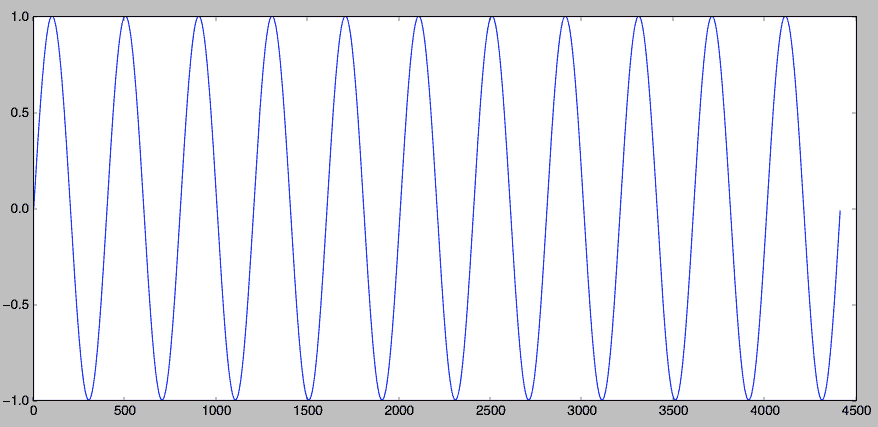
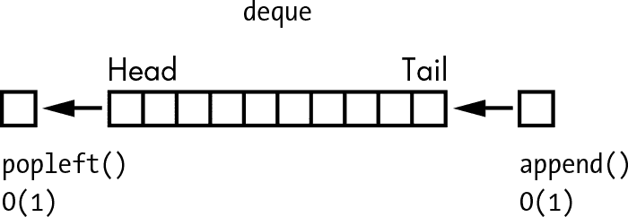

## 第四章：# 使用 Karplus-Strong 的音乐泛音


任何音乐声音的主要特征之一就是其音高，或称*频率*。这是声音每秒钟的振动次数，单位为赫兹（Hz）。例如，原声吉他的第四根弦发出 D 音符，其频率为 146.83 Hz。你可以通过在计算机上生成频率为 146.83 Hz 的正弦波来大致模拟这种声音，如图 4-1 所示。

不幸的是，如果你在计算机上播放这个正弦波，它听起来不会像吉他。它也不会像钢琴，或者任何其他现实中的乐器那样发声。那么，为什么计算机播放相同音符时，声音和乐器如此不同呢？



图 4-1：频率为 146.83 Hz 的正弦波

当你拨动吉他的弦时，乐器会发出多种频率的声音，且其强度不同。音调在刚击打时最为强烈，随时间衰减。以拨动吉他的 D 弦为例，你听到的主要频率，称为*基频*，是 146.83 Hz，但声音中还包含了该频率的某些倍频，称为*泛音*。事实上，任何乐器上的音符都由基频和泛音组成，正是这些不同频率的组合和不同强度的声音，使得吉他听起来像吉他，钢琴听起来像钢琴，等等。相比之下，由计算机生成的纯正弦波只包含基频，而没有泛音。

你可以通过*频谱图*看到泛音的证据，就像图 4-2 中表示吉他 D 弦的频谱图一样。频谱图显示了某一时刻声音中所有频率的存在情况以及这些频率的强度。请注意，图中的频谱图有许多不同的峰值，这告诉我们吉他 D 弦拨动的声音中存在多种频率。在图的最左侧，最高的峰值代表基频。其他峰值代表泛音，它们的强度较低，但仍然对声音的品质有所贡献。


图 4-2：吉他上弹奏 D3 音符的频谱图

如你所见，要在计算机上模拟拔弦乐器的声音，你需要能够生成基频和泛音。诀窍是使用 Karplus-Strong 算法。在这个项目中，你将使用 Karplus-Strong 算法生成五个类似吉他的音符，构成一个音阶（一系列相关的音符）。你将可视化生成这些音符所使用的算法，并将声音保存为 WAV 文件。你还将创建一个随机播放它们的方法，并学习如何完成以下操作：

+   • 使用 Python 的 `deque` 类实现环形缓冲区。

+   • 使用 `numpy` 数组。

+   • 使用 `pyaudio` 播放 WAV 文件。

+   • 使用 `matplotlib` 绘制图表。

+   • 播放五声音阶。

## 它是如何工作的

想象一根两端固定的弦，就像吉他上的弦。当你拨动这根弦时，它会震动一段时间，发出声音，然后回到静止位置。在弦震动的任何时刻，弦的不同部分将会处于与静止位置不同的位移状态。这些位移也可以看作是弦振动所产生的声波的振幅。Karplus-Strong 算法是一系列步骤，用于生成和更新这些位移或振幅值，以表示拨动弦上波动的运动。将这些值作为 WAV 文件回放，你会得到一个相当逼真的拔弦声音模拟。

Karplus-Strong 算法将位移值存储在一个 *环形缓冲区*（也叫 *循环缓冲区*）中，这是一个固定长度的缓冲区（就是一个值的数组），它会自我环绕。换句话说，当你到达缓冲区的末尾时，下一个访问的元素将是缓冲区的第一个元素。（有关环形缓冲区的更多信息，请参见 “使用 deque 实现环形缓冲区”，见 第 66 页）

环形缓冲区的长度（*N*）与您想要模拟的音符的基频有关，具体公式为 *N* = *S*/*f*，其中 *S* 是采样率（稍后会详细讲解），*f* 是频率。在模拟开始时，缓冲区被填充了范围为 [−0.5, 0.5] 的随机值，你可以将这些值理解为弦在刚被拨动时的随机位移。随着模拟的进行，这些值会根据 Karplus-Strong 算法的步骤进行更新，接下来我们将概述这些步骤。

除了环形缓冲区，你还将使用一个 *样本缓冲区* 来存储某一时刻的声音强度。这个缓冲区代表最终的声音数据，它是根据环形缓冲区中的值构建的。样本缓冲区的长度和采样率决定了声音片段的长度。

### 模拟过程

在每个时间步长的模拟过程中，环形缓冲区中的一个值被存储到样本缓冲区中，然后环形缓冲区中的值会在一种反馈机制下进行更新，如图 4-3 所示。一旦样本缓冲区满了，你就可以将其内容写入 WAV 文件，以便模拟的音符可以作为音频回放。对于每一个时间步长的模拟，你按照这些步骤操作，这些步骤一起构成了 Karplus-Strong 算法：

1.  1\. 将环形缓冲区中的第一个值存储到样本缓冲区中。

1.  2\. 计算环形缓冲区前两个元素的平均值。

1.  3\. 将这个平均值乘以衰减因子（在这个例子中是 0.995）。

1.  4\. 将该值附加到环形缓冲区的末尾。

1.  5\. 移除环形缓冲区的第一个元素。


图 4-3：环形缓冲区和 Karplus-Strong 算法

这个反馈机制旨在模拟波动通过振动弦的传播。环形缓冲区中的数字表示波在弦上每个点的能量。根据物理学，振动弦的基频与其长度成反比。由于我们感兴趣的是生成特定频率的声音，我们选择一个与所需频率成反比的环形缓冲区长度（这就是前面提到的*N* = *S*/*f*公式）。算法第二步中的平均值计算充当了一个*低通滤波器*，它切断了较高的频率并允许较低的频率通过，从而消除较高的谐波（即基频的更高倍数），因为你主要关心的是基频。第三步中的衰减因子模拟了波在弦上来回传播时能量的损失。这对应于声音随时间的衰退。

在模拟的第一步中，你添加到的样本缓冲区代表了生成的声音随时间变化的幅度。将衰减后的值存储到环形缓冲区的末尾（第 4 步），并移除环形缓冲区的第一个元素（第 5 步），确保了逐渐衰减的值会持续传递到样本缓冲区，从而构建出模拟的声音。

让我们来看一个 Karplus-Strong 算法的简单例子。表 4-1 表示两个连续时间步长下的环形缓冲区。环形缓冲区中的每个值代表声音的幅度，这与拨弦时弦上某一点从静止位置的位移相同。缓冲区有五个元素，初始时被填充了一些数字。

表 4-1：Karplus-Strong 算法中两个时间步长的环形缓冲区

| 时间步长 1 | 0.1 | −0.2 | 0.3 | 0.6 | −0.5 |
| --- | --- | --- | --- | --- | --- |
| 时间步长 2 | −0.2 | 0.3 | 0.6 | −0.5 | −0.04975 |

当你从时间步长 1 走到时间步长 2 时，你应用 Karplus-Strong 算法如下：第一行中的第一个值 0.1 被移除，时间步长 1 中的所有后续值按顺序加入到第二行，第二行表示时间步长 2。时间步长 2 中的最后一个值是时间步长 1 中第一个和第二个值的衰减平均值，计算方法是 0.995 × ((0.1 + −0.2) ÷ 2) = −0.04975。

### WAV 文件格式

*Waveform Audio File Format (WAV)* 用于存储音频数据。这个格式适用于小型音频项目，因为它简单且不需要担心复杂的压缩技术。

在最简单的形式中，WAV 文件由一系列值组成，每个值表示在给定时间点存储的声音的幅度。每个值分配了一定数量的比特，称为 *分辨率*。在这个项目中，你将使用 16 位分辨率。WAV 文件还具有一个 *采样率*，即每秒钟音频被 *采样* 或读取的次数。在这个项目中，你将使用 44,100 Hz 的采样率，这也是音频 CD 使用的采样率。总的来说，当你生成一个模拟拨弦声音的 WAV 文件时，它将包含每秒 44,100 个 16 位的值。

对于这个项目，你将使用 Python 的 `wave` 模块，它包含了处理 WAV 文件的方法。为了熟悉如何操作，我们用 Python 生成一个持续五秒的 220 Hz 正弦波音频片段。首先，你可以用以下公式表示一个正弦波：

*A* = sin(2π*ft*)

在这里，*A* 是波的幅度，*f* 是频率，*t* 是当前的时间索引。现在你可以将这个方程式改写如下：

*A* = sin(2π*fi*/*R*)

在这个方程中，*i* 是采样的索引，*R* 是采样率。使用这两个方程，你可以创建一个持续五秒的 200 Hz 正弦波 WAV 文件，具体如下。（此代码可以在本章的 GitHub 仓库中的 *sine.py* 文件中找到。）

```py
import numpy as np
import wave, math
sRate = 44100
nSamples = sRate * 5
❶ x = np.arange(nSamples)/float(sRate)
❷ vals = np.sin(2.0*math.pi*220.0*x)
❸ data = np.array(vals*32767, 'int16').tostring()
file = wave.open('sine220.wav', 'wb')
❹ file.setparams((1, 2, sRate, nSamples, 'NONE', 'uncompressed'))
❺ file.writeframes(data)
file.close()

```

你创建一个从 `0` 到 `nSamples − 1` 的 `numpy` 数字数组，并通过采样率将这些数字除以，以得到每个音频片段采样时的时间值，单位为秒 ❶。这个数组代表了前面提到的正弦波方程中的 *i*/*R* 部分。接下来，你用这个数组创建第二个 `numpy` 数组，包含正弦波的幅度值，依旧遵循正弦波方程 ❷。`numpy` 数组是一个快速且便捷的方式，可以将诸如 `sin()` 函数等操作应用到多个数值上。

计算出的正弦波值在范围[−1, 1]内被缩放到 16 位值，并转换为字符串，以便写入 WAV 文件❸。然后，你设置 WAV 文件的参数；在这种情况下，它是单声道（mono）、2 字节（16 位）、无压缩格式❹。最后，你将数据写入文件❺。图 4-4 显示了在 Audacity（一款免费的音频编辑器）中生成的*sine220.wav* 文件。正如预期的那样，你会看到频率为 220 Hz 的正弦波，当你播放该文件时，会听到一个持续五秒钟的 220 Hz 音调。（注意，你需要使用 Audacity 中的缩放工具才能看到图 4-4 中所示的正弦波。）


图 4-4：220 Hz 正弦波，放大显示

在你的项目中，一旦你用音频数据填充了样本缓冲区，你将使用与图 4-4 中所示的相同模式将其写入 WAV 文件。

### 小调五声音阶

*音乐音阶*是一个音高（频率）升高或降低的音符序列。通常，一首音乐作品中的所有音符都是从某一特定音阶中选择的。*音乐音程*是两种音高之间的差距。*半音*是音阶的基本构成单位，是西方音乐中最小的音程。*全音*是半音的两倍长度。*大调音阶*是最常见的音乐音阶之一，其音程模式为*全音-全音-半音-全音-全音-全音-半音*。

我们将在这里简要介绍五声音阶，因为你将生成该音阶中的音符。本节将解释用于最终程序生成音符的频率数值来源，这些音符是通过 Karplus-Strong 算法生成的。*五声音阶*是一种五个音符的音乐音阶。这种音阶的变体是*小调五声音阶*，它的音程模式为*(全音+半音)-全音-全音-(全音+半音)-全音*。因此，C 小调五声音阶包括音符 C、E-flat、F、G 和 B-flat。表 4-2 列出了你将使用 Karplus-Strong 算法生成的 C 小调五声音阶中五个音符的频率。（这里，C4 指的是钢琴的第四个八度中的 C 音，或称为*中央 C*，这是约定俗成的表示方式。）

表 4-2：小调五声音阶中的音符

| 音符 | 频率（Hz） |
| --- | --- |
| C4 | 261.6 |
| E-flat | 311.1 |
| F | 349.2 |
| G | 392.0 |
| B-flat | 466.2 |

本项目的一个方面是将随机音符序列串联起来，创作旋律。我们专注于小调五声音阶的原因之一是，无论这些音符以何种顺序播放，都听起来都很悦耳。因此，这种音阶特别适合生成随机旋律，而其他音阶（如大调音阶）则不具备这种特点。

## 要求

在这个项目中，你将使用 Python 的`wave`模块来创建 WAV 格式的音频文件。为了实现 Karplus-Strong 算法，你将使用 Python `collections`模块中的`deque`类作为环形缓冲区，并使用`numpy`数组作为样本缓冲区。你还将使用`matplotlib`来可视化模拟的吉他弦，并使用`pyaudio`模块播放 WAV 文件。

## 代码

现在，让我们开发实现 Karplus-Strong 算法所需的各个代码片段，然后将它们组合成完整的程序。要查看完整的项目代码，请跳转到《完整代码》页面的第 74 页。你还可以从本书的 GitHub 仓库下载代码，网址是[`github.com/mkvenkit/pp2e/tree/main/karplus`](https://github.com/mkvenkit/pp2e/tree/main/karplus)。

### 使用 deque 实现环形缓冲区

回顾之前，Karplus-Strong 算法使用环形缓冲区生成音符。你将使用`deque`容器（发音为“deck”）来实现环形缓冲区，它是 Python `collections`模块中专用容器数据类型的一部分。你可以从`deque`的开头（头部）或末尾（尾部）插入和移除元素（参见图 4-5）。这个插入和移除过程是一个`O(1)`，即“常数时间”操作，这意味着无论`deque`容器多大，它所需的时间都是相同的。



图 4-5：使用`deque`实现的环形缓冲区

以下代码展示了如何在 Python 中使用`deque`的一个示例：

```py
>>> `from collections import deque`
❶ >>> `d = deque(range(10), maxlen=10)`
>>> `print(d)`
deque([0, 1, 2, 3, 4, 5, 6, 7, 8, 9], maxlen=10)
❷ >>> `d.append(10)`
>>> `print(d)`
deque([1, 2, 3, 4, 5, 6, 7, 8, 9, 10], maxlen=10)

```

你通过传入使用`range()`函数创建的列表❶来创建`deque`容器。你还指定了`deque`的最大长度`maxlen`为`10`。接下来，你将元素`10`附加到`deque`容器的末尾❷。当你打印`deque`时，可以看到`10`已被附加到`deque`的末尾，而第一个元素`0`已被自动移除，以保持`deque`容器的最大长度为 10 个元素。这个方案将允许你同时实现 Karplus-Strong 算法的第 4 步和第 5 步——在环形缓冲区的末尾添加新值，同时移除第一个值。

### 实现 Karplus-Strong 算法

现在，你将在`generateNote()`函数中实现 Karplus-Strong 算法，使用`deque`容器实现环形缓冲区，并使用`numpy`数组实现样本缓冲区。在同一个函数中，你还将使用`matplotlib`可视化算法。图表将显示拨动弦的幅度如何随时间变化，从而展示弦在振动时的运动。

你从一些设置开始：

```py
# initialize plotting
❶ fig, ax = plt.subplots(1)
❷ line, = ax.plot([], [])
def generateNote(freq):
    """generate note using Karplus-Strong algorithm"""
    nSamples = 44100
    sampleRate = 44100
  ❸ N = int(sampleRate/freq)
  ❹ if gShowPlot:
        # set axis
        ax.set_xlim([0, N])
        ax.set_ylim([-1.0, 1.0])
        line.set_xdata(np.arange(0, N))
    # initialize ring buffer
  ❺ buf = deque([random.random() - 0.5 for i in range(N)], maxlen=N)
    # init samples buffer
  ❻ samples = np.array([0]*nSamples, 'float32')

```

首先，你创建一个 `matplotlib` 图形 ❶ 和一条线性图 ❷，然后将数据填充到图形中。接下来，你开始定义 `generateNote()` 函数，该函数以要生成的音符频率作为参数。你将音频片段的样本数和采样率都设置为 44,100，这意味着生成的音频片段将是 1 秒钟长。然后，你将采样率除以所需的频率，以设置 Karplus-Strong 环形缓冲区的长度 `N` ❸。如果设置了 `gShowPlot` 标志 ❹，你将初始化图表的 x 和 y 范围，并使用 `arange()` 函数将 x 值初始化为 `[0, ... N-1]`。

接下来，你将环形缓冲区初始化为一个包含范围在 [−0.5, 0.5] 之间的随机数的 `deque` 容器，并将 `deque` 的最大长度设置为 `N` ❺。你还将样本缓冲区初始化为一个 `numpy` 浮动数组 ❻。你将数组的长度设置为音频片段所包含的样本数。

接下来是 `generateNote()` 函数的核心，在这里你实现了 Karplus-Strong 算法的步骤，并创建了可视化：

```py
    for i in range(nSamples):
      ❶ samples[i] = buf[0]
      ❷ avg = 0.995*0.5*(buf[0] + buf[1])
      ❸ buf.append(avg)
        # plot of flag set
      ❹ if gShowPlot:
            if i % 1000 == 0:
                line.set_ydata(buf)
                fig.canvas.draw()
                fig.canvas.flush_events()
    # samples to 16-bit to string
    # max value is 32767 for 16-bit
  ❺ samples = np.array(samples * 32767, 'int16')
  ❻ return samples.tobytes()

```

在这里，你遍历样本缓冲区中的每个元素，并执行 Karplus-Strong 算法的步骤。在每次迭代中，你将环形缓冲区中的第一个元素复制到样本缓冲区 ❶。然后，你通过对环形缓冲区中的前两个元素求平均并将结果乘以 0.995 来执行低通滤波和衰减 ❷。这个衰减后的值被附加到环形缓冲区的末尾 ❸。由于表示环形缓冲区的 `deque` 具有最大长度，`append()` 操作还会移除缓冲区中的第一个元素。

`samples` 数组通过将每个值乘以 32,767 转换为 16 位格式 ❺（16 位有符号整数只能取值从 −32,768 到 32,767，而 0.5 × 65,534 = 32,767）。然后，数组被转换为 `wave` 模块的字节表示，你将使用该模块将数据保存到文件 ❻。

当算法运行时，你可以可视化环形缓冲区的演变 ❹。每当有一千个样本时，你就使用环形缓冲区中的值更新 `matplotlib` 图表，显示数据如何随时间变化。

### 写入 WAV 文件

一旦你获得音频数据，你可以使用 Python 的 `wave` 模块将其写入 WAV 文件。定义一个 `writeWAVE()` 函数来执行此操作：

```py
def writeWAVE(fname, data):
    # open file
  ❶ file = wave.open(fname, 'wb')
    # WAV file parameters
    nChannels = 1
    sampleWidth = 2
    frameRate = 44100
    nFrames = 44100
    # set parameters
  ❷ file.setparams((nChannels, sampleWidth, frameRate, nFrames,
                    'NONE', 'noncompressed'))
  ❸ file.writeframes(data)
    file.close()

```

你创建一个 WAV 文件 ❶，并使用单声道、16 位、无压缩格式设置其参数 ❷。然后你将数据写入文件 ❸。

### 使用 pyaudio 播放 WAV 文件

现在，你将使用 Python 的 `pyaudio` 模块播放由算法生成的 WAV 文件。`pyaudio` 是一个高性能、低级别的库，可以让你访问计算机上的声音设备。为了方便，你将代码封装在一个 `NotePlayer` 类中，如下所示：

```py
class NotePlayer:
    # constructor
    def __init__(self):
        # init pyaudio
      ❶ self.pa = pyaudio.PyAudio()
        # open stream
      ❷ self.stream = self.pa.open(
                format=pyaudio.paInt16,
                channels=1,
                rate=44100,
                output=True)
        # dictionary of notes
      ❸ self.notes = []

```

在 `NotePlayer` 类的构造函数中，你首先创建用于播放 WAV 文件的 `PyAudio` 对象 ❶。然后，你打开一个 16 位单声道的 `PyAudio` 输出流 ❷。你还会创建一个空的列表，稍后将用生成的五个五声音阶音符的 WAV 文件名填充 ❸。

在 Python 中，当对象的所有引用都被删除时，该对象会被称为*垃圾回收*的过程销毁。此时，如果已定义 `__del__()` 方法，也就是*析构函数*，该方法会被调用。以下是 `NotePlayer` 类的析构函数：

```py
def __del__(self):
    # destructor
    self.stream.stop_stream()
    self.stream.close()
    self.pa.terminate()

```

该方法确保当 `NotePlayer` 对象被销毁时，`PyAudio` 流被清理。如果一个类没有提供 `__del__()` 方法，可能会在对象反复创建和销毁时引发问题，因为某些系统级资源（例如 `pyaudio`）可能无法正确清理。

`NotePlayer` 类的其余方法致力于构建可能音符的列表并播放它们。首先是 `add()` 方法，它用于将一个 WAV 文件名添加到类中：

```py
def add(self, fileName):
    self.notes.append(fileName)

```

该方法将一个与生成的 WAV 文件之一对应的文件名作为参数，并将其添加到你在类的构造函数中初始化的 `notes` 列表中。类会在需要播放 WAV 文件时使用这个列表。

接下来，我们来看一下用于播放音符的 `play()` 方法：

```py
def play(self, fileName):
    try:
        print("playing " + fileName)
        # open WAV file
      ❶ wf = wave.open(fileName, 'rb')
        # read a chunk
      ❷ data = wf.readframes(CHUNK)
        # read rest
        while data != b'':
          ❸ self.stream.write(data)
          ❹ data = wf.readframes(CHUNK)
        # clean up
      ❺ wf.close()
    except BaseException as err:
      ❻ print(f"Exception! {err=}, {type(err)=}.\nExiting.")
        exit(0)

```

这里你使用 Python 的 `wave` 模块打开所需的 WAV 文件 ❶。然后，你从文件中读取 `CHUNK` 帧（此处全局定义为 1,024）到 `data` 中 ❷。接下来，在 `while` 循环内，你将 `data` 的内容写入 `PyAudio` 输出流 ❸，并从 WAV 文件中读取下一个数据块 ❹。写入输出流的效果是通过计算机的默认音频设备（通常是扬声器）播放音频。你按块读取数据是为了保持输出端的采样率。如果数据块过大，并且在读取和写入之间耗费的时间过长，音频就会出现问题。

`while` 循环会持续进行，直到没有更多数据可读——即，直到 `data` 为空。此时，你关闭 WAV 文件对象 ❺。你通过打印错误 ❻ 并退出程序来处理在播放过程中可能发生的任何异常（例如，用户按下 CTRL-C）。

最后，`NotePlayer` 类的 `playRandom()` 方法会从你生成的五个音符中随机选择一个并进行播放：

```py
def playRandom(self):
    """play a random note"""
    index = random.randint(0, len(self.notes)-1)
    note = self.notes[index]
    self.play(note)

```

该方法从 `notes` 列表中选择一个随机的 WAV 文件名，并将该文件名传递给 `play()` 方法进行播放。

### 创建音符并解析参数

现在我们来看一下程序的 `main()` 函数，它负责创建音符并处理各种命令行选项来播放音符：

```py
def main():
--`snip`--
    parser = argparse.ArgumentParser(description="Generating sounds with
                                               Karplus-Strong Algorithm")
    # add arguments
    parser.add_argument('--display', action='store_true', required=False)
    parser.add_argument('--play', action='store_true', required=False)
    args = parser.parse_args()
    # show plot if flag set
  ❶ if args.display:
        gShowPlot = True
        plt.show(block=False)
    # create note player
  ❷ nplayer = NotePlayer()
    print('creating notes...')
    for name, freq in list(pmNotes.items()):
        fileName = name + '.wav'
      ❸ if not os.path.exists(fileName) or args.display:
            data = generateNote(freq)
            print('creating ' + fileName + '...')
            writeWAVE(fileName, data)
        else:
            print('fileName already created. skipping...')
        # add note to player
      ❹ nplayer.add(name + '.wav')
        # play note if display flag set
        if args.display:
          ❺ nplayer.play(name + '.wav')
            time.sleep(0.5)
    # play a random tune
    if args.play:
        while True:
            try:
              ❻ nplayer.playRandom()
                # rest - 1 to 8 beats
              ❼ rest = np.random.choice([1, 2, 4, 8], 1,
                                        p=[0.15, 0.7, 0.1, 0.05])
                time.sleep(0.25*rest[0])
            except KeyboardInterrupt:
                exit()

```

首先，使用`argparse`为程序设置一些命令行选项，正如之前项目中讨论的那样。`--display`选项会依次播放五个音符，同时使用`matplotlib`可视化每个音符的波形。`--play`选项则使用这五个音符生成一个随机旋律。

如果使用了`--display`命令行选项 ❶，你会设置一个`matplotlib`图表，显示在 Karplus-Strong 算法过程中波形的演变。`plt.show(block=False)`调用确保`matplotlib`显示方法不会阻塞。这样，当你调用这个函数时，它会立即返回，并继续执行下一个语句。这是你需要的行为，因为你需要每一帧手动更新图表。

接下来，你创建`NotePlayer`类的一个实例 ❷。然后你生成 C 小调五声音阶的五个音符的 WAV 文件。这些音符的频率在全局字典`pmNotes`中定义，内容如下所示：

```py
pmNotes = {'C4': 262, 'Eb': 311, 'F': 349, 'G': 391, 'Bb': 466}

```

要生成音符，你需要遍历字典，首先使用字典的键加上*.wav*扩展名构建音符的文件名——例如，*C4.wav*。你可以使用`os.path.exists()`方法检查特定音符的 WAV 文件是否已创建 ❸。如果已经创建，则跳过该音符的计算。（如果你多次运行该程序，这是一个非常实用的优化。）否则，你会使用之前定义的`generateNote()`和`writeWAVE()`函数来生成音符。一旦音符计算完成并且 WAV 文件创建成功，你将音符的文件名添加到`NotePlayer`对象的音符列表中 ❹，然后如果使用了`--display`命令行选项，你会播放这个音符 ❺。

如果使用了`--play`选项，`NotePlayer`中的`playRandom()`方法会反复随机播放五个音符中的一个音符 ❻。为了使音符序列听起来有些音乐感，你需要在播放的音符之间添加休止符，因此你使用`numpy`中的`random.choice()`方法来选择一个随机的休止符间隔 ❼。该方法还允许你选择休止符间隔的概率，你可以将其设置为最有可能出现的是两拍的休止符，而八拍的休止符最不可能出现。试着改变这些值，创造你自己的随机音乐风格吧！

## 运行拨弦模拟

要运行该项目的代码，在命令行中输入以下内容：

```py
$ `python ks.py --display`

```

正如你在图 4-6 中看到的，`matplotlib`的图表显示了 Karplus-Strong 算法如何将初始的随机位移转换为所需频率的波形。


图 4-6：拨弦模拟的示例运行

现在尝试使用以下命令播放一个随机音符序列：

```py
$ `python ks.py --play`

```

这将播放一个使用生成的五声音阶 WAV 文件的随机音符序列。

## 摘要

在这个项目中，你使用了 Karplus-Strong 算法来模拟弹奏弦乐的声音，并从生成的 WAV 文件中播放音符。你学习了如何使用`deque`容器作为环形缓冲区来实现 Karplus-Strong 算法。你还了解了 WAV 文件格式以及如何使用`pyaudio`播放 WAV 文件，并学会了如何使用`matplotlib`可视化振动的弦。你甚至学习了五声音阶！

## 实验！

这里有一些实验的想法：

1.  1\. 我已经说过，Karplus-Strong 算法通过生成泛音和音符的基频来创建逼真的弹奏弦乐声音。那么你如何知道它是否有效呢？通过创建你的 WAV 文件的谱图，就像图 4-2 中显示的那样。你可以使用免费的程序 Audacity 来做到这一点。打开其中一个 WAV 文件，选择**分析‣绘制** **频谱**。你应该会看到声音包含了许多频率。

1.  2\. 使用你在本章中学到的技巧，创建一种方法来复制两个不同频率的弦振动的声音。记住，Karplus-Strong 算法生成一个充满声音幅度值的环形缓冲区。你可以通过将两个声音的幅度相加来合成这两个声音。

1.  3\. 复制前一个实验中描述的两个弦振动的声音，但在第一次和第二次弦弹之间添加一个时间延迟。

1.  4\. 写一个方法从文本文件中读取音乐并生成音符。然后使用这些音符播放音乐。你可以使用一种格式，其中音符名称后跟整数的休止时间间隔，例如：C4 1 F4 2 G4 1 . . .

## 完整代码

这里是这个项目的完整代码：

```py
"""
ks.py
Uses the Karplus-Strong algorithm to generate musical notes
in a pentatonic scale.
Author: Mahesh Venkitachalam
"""
import sys, os
import time, random
import wave, argparse
import numpy as np
from collections import deque
import matplotlib
# to fix graph display issues on macOS
matplotlib.use('TkAgg')
from matplotlib import pyplot as plt
import pyaudio
# show plot of algorithm in action?
gShowPlot = False
# notes of a pentatonic minor scale
# piano C4-E(b)-F-G-B(b)-C5
pmNotes = {'C4': 262, 'Eb': 311, 'F': 349, 'G':391, 'Bb':466}
CHUNK = 1024
# initialize plotting
fig, ax = plt.subplots(1)
line, = ax.plot([], [])
# write out WAV file
def writeWAVE(fname, data):
    """write data to WAV file"""
    # open file
    file = wave.open(fname, 'wb')
    # WAV file parameters
    nChannels = 1
    sampleWidth = 2
    frameRate = 44100
    nFrames = 44100
    # set parameters
    file.setparams((nChannels, sampleWidth, frameRate, nFrames,
                    'NONE', 'noncompressed'))
    file.writeframes(data)
    file.close()
def generateNote(freq):
    """generate note using Karplus-Strong algorithm"""
    nSamples = 44100
    sampleRate = 44100
    N = int(sampleRate/freq)
    if gShowPlot:
        # set axis
        ax.set_xlim([0, N])
        ax.set_ylim([-1.0, 1.0])
        line.set_xdata(np.arange(0, N))
    # initialize ring buffer
    buf = deque([random.random() - 0.5 for i in range(N)], maxlen=N)
    # init sample buffer
    samples = np.array([0]*nSamples, 'float32')
    for i in range(nSamples):
        samples[i] = buf[0]
        avg = 0.995*0.5*(buf[0] + buf[1])
        buf.append(avg)
        # plot of flag set
        if gShowPlot:
            if i % 1000 == 0:
                line.set_ydata(buf)
                fig.canvas.draw()
                fig.canvas.flush_events()
    # samples to 16-bit to string
    # max value is 32767 for 16-bit
    samples = np.array(samples * 32767, 'int16')
    return samples.tobytes()
# play a WAV file
class NotePlayer:
    # constructor
    def __init__(self):
        # init pyaudio
        self.pa = pyaudio.PyAudio()
        # open stream
        self.stream = self.pa.open(
                format=pyaudio.paInt16,
                channels=1,
                rate=44100,
                output=True)
        # dictionary of notes
        self.notes = []
    def __del__(self):
        # destructor
        self.stream.stop_stream()
        self.stream.close()
        self.pa.terminate()
    # add a note
    def add(self, fileName):
        self.notes.append(fileName)
    # play a note
    def play(self, fileName):
        try:
            print("playing " + fileName)
            # open WAV file
            wf = wave.open(fileName, 'rb')
            # read a chunk
            data = wf.readframes(CHUNK)
            # read rest
            while data != b'':
                self.stream.write(data)
                data = wf.readframes(CHUNK)
            # clean up
            wf.close()
        except BaseException as err:
            print(f"Exception! {err=}, {type(err)=}.\nExiting.")
            exit(0)
    def playRandom(self):
        """play a random note"""
        index = random.randint(0, len(self.notes)-1)
        note = self.notes[index]
        self.play(note)
# main() function
def main():
    # declare global var
    global gShowPlot
    parser = argparse.ArgumentParser(description="Generating sounds with
                                              Karplus-Strong Algorithm.")
    # add arguments
    parser.add_argument('--display', action='store_true', required=False)
    parser.add_argument('--play', action='store_true', required=False)
    args = parser.parse_args()
    # show plot if flag set
    if args.display:
        gShowPlot = True
        # plt.ion()
        plt.show(block=False)
    # create note player
    nplayer = NotePlayer()
    print('creating notes...')
    for name, freq in list(pmNotes.items()):
        fileName = name + '.wav'
        if not os.path.exists(fileName) or args.display:
            data = generateNote(freq)
            print('creating ' + fileName + '...')
            writeWAVE(fileName, data)
        else:
            print('fileName already created. skipping...')
        # add note to player
        nplayer.add(name + '.wav')
        # play note if display flag set
        if args.display:
            nplayer.play(name + '.wav')
            time.sleep(0.5)
    # play a random tune
    if args.play:
        while True:
            try:
                nplayer.playRandom()
                # rest - 1 to 8 beats
                rest = np.random.choice([1, 2, 4, 8], 1,
                                        p=[0.15, 0.7, 0.1, 0.05])
                time.sleep(0.25*rest[0])
            except KeyboardInterrupt:
                exit()
# call main
if __name__ == '__main__':
    main()

```
