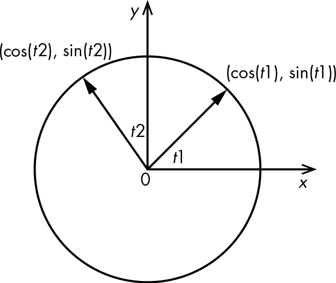
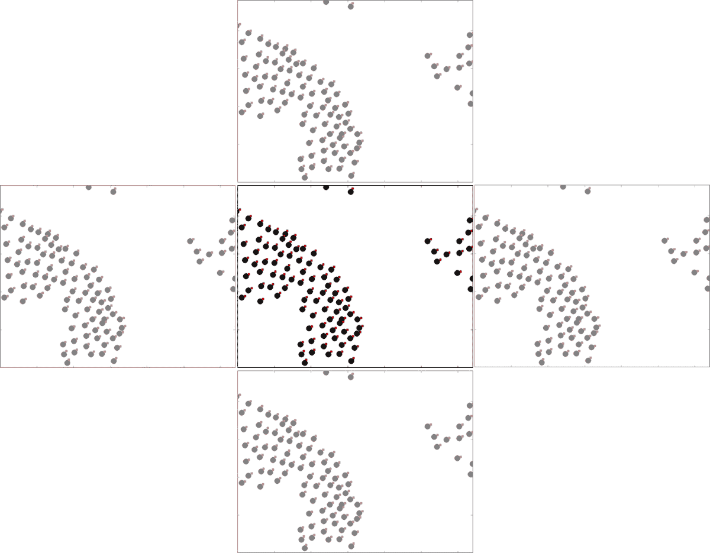
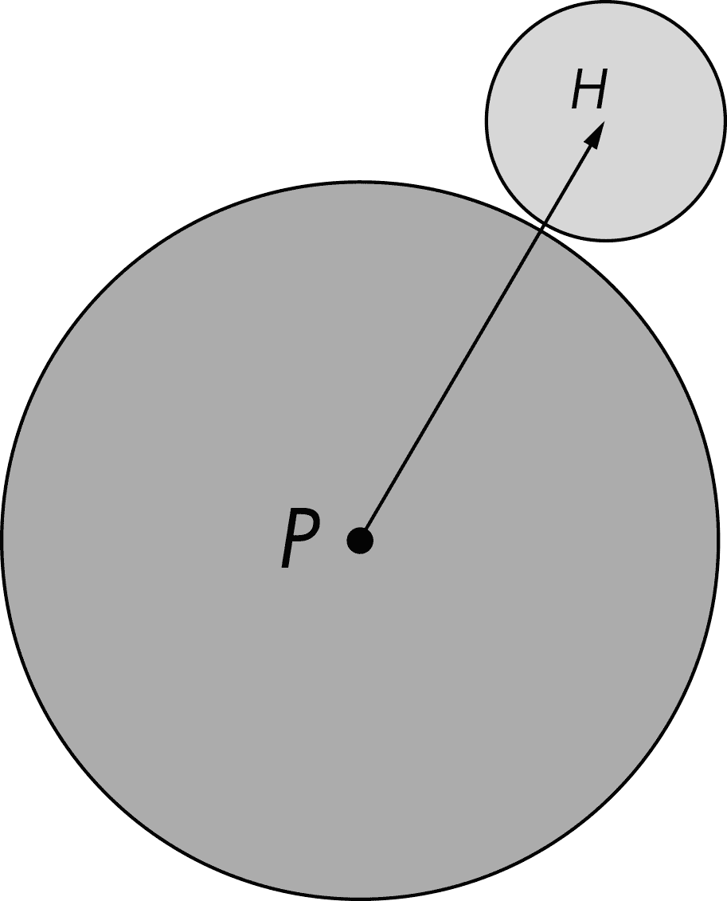
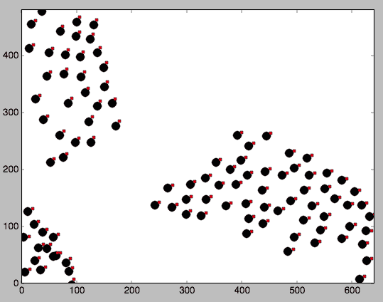

## # 鸟群聚集


仔细观察一群鸟或一群鱼，你会发现尽管群体由独立的个体组成，但整个群体似乎拥有自己的生命。当鸟群移动时，它们会与彼此保持一致，并且能够绕过障碍物。它们在受到惊扰时会打乱队形，但随即会重新聚集，就好像受到某种更大力量的控制。

1986 年，克雷格·雷诺兹创造了一个逼真的鸟群行为模拟，名为 *Boids 模型*。Boids 模型的一个显著特点是，尽管鸟群个体之间的交互只受到三条简单规则的支配，但该模型却能生成非常逼真的鸟群行为。Boids 模型被广泛研究，甚至被用于动画制作，例如电影《蝙蝠侠归来》（1992）中的行进企鹅。

在这个项目中，你将使用雷诺兹的三条规则来创建一个模拟鸟群行为的 Boids 模型，模拟*N*只鸟并绘制它们随时间变化的位置信息和运动方向。你还将提供一个方法，用于将鸟加入鸟群，并且设计一个分散效果，供你研究局部干扰对鸟群的影响。Boids 被称为 *N* 体模拟，因为它模拟了一个由 *N* 个粒子组成的动态系统，这些粒子之间会相互施加力。

## 工作原理

Boids 模拟的三条核心规则如下：

分离力保持鸟群之间的最小距离。

对齐点让每只鸟保持与其局部鸟群成员平均运动方向的一致性。

凝聚力使每只鸟朝向其局部鸟群成员的质心移动。

Boids 模拟还可以加入其他规则，例如避免障碍物或在鸟群受到干扰时使鸟群分散，正如你在接下来的章节中将会学习的那样。为了创建 Boids 动画，你需要在每一个模拟时间步长中执行以下操作：

1.  1\. 对于鸟群中的所有鸟：

    1.  a. 应用三条核心规则。

    1.  b. 应用任何附加规则。

    1.  c. 应用所有边界条件。

1.  2\. 更新鸟群的位置信息和速度。

1.  3\. 绘制新的位置和速度。

正如你将看到的，这些简单的步骤能够创建一个具有演变复杂行为的鸟群。

## 要求

以下是你在模拟中将使用的 Python 模块：

+   • 使用`numpy`数组来存储鸟群的位置信息和速度

+   • 使用`matplotlib`库来对鸟群进行动画处理

+   • 使用`argparse`来处理命令行选项

+   • 使用`scipy.spatial.distance`模块，它包含一些非常方便的方法用于计算点之间的距离

我选择使用`matplotlib`来绘制 boid，因为它简单方便。为了尽可能快速地绘制大量 boid，你可能会使用像 OpenGL 这样的库。在本书的第三部分中，我们将更详细地探讨图形学。

## 代码

你将通过一个名为`Boids`的类来封装一组 boid 的行为。首先，你会设置 boid 的初始位置和速度。接着，你会设置仿真的边界条件，查看 boid 的绘制方式，并实现之前讨论的 Boids 仿真规则。最后，你将通过允许用户添加 boid 并散播群体，来为仿真增添一些有趣的事件。要查看完整的项目代码，请跳到“完整代码”，位于第 96 页。你也可以从本书的 GitHub 仓库下载它：[`github.com/mkvenkit/pp2e/blob/main/boids/boids.py`](https://github.com/mkvenkit/pp2e/blob/main/boids/boids.py)。

### 初始化仿真

Boids 仿真需要在每一步计算 boid 的位置和速度，通过从`numpy`数组中获取信息。在仿真的开始，你使用`Boids`类的`__init__()`方法来创建这些数组，并将所有 boid 初始化在屏幕的中央，速度随机设定。

```py
import argparse
import math
import numpy as np
import matplotlib.pyplot as plt
import matplotlib.animation as animation
from scipy.spatial.distance import squareform, pdist
from numpy.linalg import norm
❶ width, height = 640, 480
class Boids:
    """class that represents Boids simulation"""
    def __init__(self, N):
        """initialize the Boids simulation"""
        # init position & velocities
      ❷ self.pos = [width/2.0, height/2.0] +
                   10*np.random.rand(2*N).reshape(N, 2)
        # normalized random velocities
      ❸ angles = 2*math.pi*np.random.rand(N)
      ❹ self.vel = np.array(list(zip(np.cos(angles), np.sin(angles))))
        self.N = N

```

首先，导入程序所需的模块，并设置仿真窗口在屏幕上的宽度和高度 ❶。接着，开始声明`Boids`类。在该类的`__init__()`方法中，创建一个名为`pos`的`numpy`数组，用于存储所有 boid 的 x 和 y 坐标 ❷。对于每一对坐标的初始值，你从窗口的中心`[width/2.0, height/2.0]`开始，并加入最大 10 个单位的随机偏移。代码`np.random.rand(2*N)`会创建一个包含 2*N 个随机数的一维数组，范围是[0, 1]，你再将其乘以 10，将范围缩放到[0, 10]。`reshape()`方法将一维数组转换为形状为(*N*, 2)的二维数组，完美地用于存储*N*对 x 和 y 坐标。同时，注意到`numpy`的广播规则：代表窗口中心的 1×2 数组`[width/2.0, height/2.0]`被加到*N*×2 数组的每个元素上，从而随机偏移每个 boid 的位置。

接下来，你为每个 boid 创建一个随机的单位速度向量数组（这些向量的大小为 1.0，指向随机方向），使用以下方法：给定一个角度*t*，一对数字（cos(*t*), sin(*t*)）位于半径为 1.0 的圆上，圆心在原点（0, 0）。如果你从原点画一条线到圆上的某一点，那么这条线就成为一个单位向量，取决于角度*t*。所以如果你随机选择*t*，你最终会得到一个随机的速度向量。图 5-1 展示了这一方案。



图 5-1：生成随机单位速度向量

回到代码中，你首先生成一个在[0, 2π]范围内的*N*个随机角度数组❸。然后通过计算这些角度的余弦和正弦，创建一个随机单位速度向量数组❹。你使用 Python 内置的`zip()`方法将每个向量的坐标分组。以下是`zip()`的一个简单示例。它将两个列表合并成一个包含元组的列表。因为直接调用`zip()`只会生成一个迭代器，所以需要使用`list()`来将其转换为列表，这样才能获取所有元素。

```py
>>> list(`zip([0, 1, 2], [3, 4, 5]))`
[(0, 3), (1, 4), (2, 5)]

```

总结来说，你已经生成了两个在整个模拟过程中都很有用的数组，`pos`和`vel`。第一个数组包含聚集在屏幕中心 10 像素半径范围内的随机位置，第二个数组包含指向随机方向的单位速度向量。这意味着在模拟开始时，所有 boid 都将悬停在屏幕中心，朝随机方向指向。

`__init__()`方法继续声明一些常量值，这些常量值将帮助管理模拟：

```py
        # min dist of approach
      ❶ self.minDist = 25.0
        # max magnitude of velocities calculated by "rules"
      ❷ self.maxRuleVel = 0.03
        # max magnitude of final velocity
      ❸ self.maxVel = 2.0

```

在这里，你定义了两个 boid 之间的最小接近距离❶。稍后你将使用这个值来应用分离规则。接着你定义了`maxRuleVel`，它限制了每次应用模拟规则时 boid 的速度变化量❷。你还定义了`maxVel`，它为 boid 的速度设定了一个总体限制❸。

### 设置边界条件

鸟儿飞翔在广阔的天空中，但 boid 必须在有限的空间内活动。为了创建这个空间，你需要设置边界条件，正如你在第三章的生命游戏模拟中使用环形边界条件一样。在这种情况下，你将应用*平铺边界条件*（实际上是你在第三章中使用的边界条件的连续空间版本）。

将 Boids 仿真看作是在一个瓷砖空间中进行：当一个 boid 移出一个瓷砖时，它将从对面方向进入一个相同的瓷砖。环形和瓷砖边界条件的主要区别在于，这个 Boids 仿真不会在一个离散的网格上进行；相反，鸟类将在一个连续的区域上移动。图 5-2 显示了这些瓷砖边界条件的样子。



图 5-2：瓷砖边界条件

看看中间的瓷砖。飞出右侧的鸟类正进入右侧的瓷砖，但边界条件确保它们实际上会通过左侧的瓷砖重新进入中央瓷砖。你可以看到同样的情况发生在顶部和底部的瓷砖上。

你将 Boids 仿真的瓷砖边界条件作为 `Boids` 类中的一个方法来实现：

```py
def applyBC(self):
    """apply boundary conditions"""
    deltaR = 2.0
    for coord in self.pos:
      ❶ if coord[0] > width + deltaR:
            coord[0] = - deltaR
        if coord[0] < - deltaR:
            coord[0] = width + deltaR
        if coord[1] > height + deltaR:
            coord[1] = - deltaR
        if coord[1] < - deltaR:
            coord[1] = height + deltaR

```

这个方法将瓷砖边界条件应用于 `pos` 数组中的每组 boid 坐标。例如，如果 x 坐标大于窗口的宽度 ❶，你将其重新设置到窗口的左边缘。该行中的 `deltaR` 提供了一个轻微的缓冲区，允许 boid 稍微超出窗口边界，然后从对面方向重新进入，从而产生更好的视觉效果。你会在窗口的左边、顶部和底部执行类似的检查。

### 绘制一个 Boid

为了构建动画，你需要知道每个 boid 的位置和速度，并且有一种方法来在每个时间步长上表示位置和运动方向。

#### 绘制 Boid 的身体和头部

为了给 boids 动画化，你使用 `matplotlib` 和一个小技巧来绘制位置和速度。将每个 boid 绘制为两个圆形，如 图 5-3 所示。较大的圆表示身体，较小的圆表示头部。点 *P* 标记身体的中心位置。为了我们的目的，你可以将 *P* 视为 boid 的位置，并使用前面讨论过的 `pos` 数组中的坐标来设置它。点 *H* 是头部的中心。你根据公式 *H* = *P* + *k* × *V* 计算 *H* 的位置，其中 *V* 是 boid 的速度，*k* 是一个常数，表示从身体中心到头部中心的距离。这样，boid 的头部将在任何给定时刻与其运动方向对齐，这比单独绘制身体更清晰地传达了 boid 的运动方向。



图 5-3：表示一个 boid

在程序的 `main()` 函数中的以下代码片段中，你使用 `matplotlib` 以圆形标记的方式绘制 boid 的身体和头部：

```py
fig = plt.figure()
ax = plt.axes(xlim=(0, width), ylim=(0, height))
❶ pts, = ax.plot([], [], markersize=10, c='k', marker='o', ls='None')
❷ head, = ax.plot([], [], markersize=4, c='r', marker='o', ls='None')
❸ anim = animation.FuncAnimation(fig, tick, fargs=(pts[0], head, boids),
                               interval=50)

```

你设置了鸟群身体（`pts`） ❶ 和头部（`head`） ❷ 的标记大小和形状。`'k'` 和 `'r'` 字符串分别指定了黑色和红色，而 `'o'` 会生成圆形标记。`ax.plot()` 方法返回一个 `matplotlib.lines.Line2D` 对象的列表。这些行中的 `,` 语法提取了列表中的第一个也是唯一一个元素。

接下来，你初始化一个 `matplotlib animation.FuncAnimation()` 对象 ❸，它设置了一个回调函数 `tick()`，该函数将在每一帧动画中被调用（我们稍后将在本章中讨论这个函数）。`fargs` 参数允许你指定回调函数的参数，同时你还设置了时间间隔（在此为 50 毫秒），即该函数被调用的时间间隔。现在你已经知道如何绘制身体和头部，接下来我们来看如何更新它们的位置。

#### 更新鸟群的位置

动画开始后，你需要更新鸟群的位置和头部位置，后者告诉你鸟群的移动方向。你可以使用以下代码实现：

```py
vec = self.pos + 10*self.vel/self.maxVel
head.set_data(vec.reshape(2*self.N)[::2], vec.reshape(2*self.N)[1::2])

```

首先，你通过应用前面讨论的公式 *H* = *P* + *k* × *V* 来计算头部的位置。你在速度 (`vel`) 方向上使用 *k* 值为 10 单位。然后，你用新的头部位置更新 (`reshape`) `matplotlib` 轴 (`set_data`)。`[::2]` 从速度列表中挑选出偶数编号的元素（x 轴值），而 `[1::2]` 则挑选出奇数编号的元素（y 轴值）。

### 应用鸟群规则

在本节中，我们将探讨如何实现鸟群仿真中的三条规则——分离、对齐和聚合——以便在每个时间步重新计算鸟群的速度。我们首先将重点放在分离规则上。目标是为每只鸟群生成一个新的速度向量，使其远离附近的群体伙伴，这些伙伴被定义为位于某个半径 *R* 内的所有鸟群。给定两只鸟群 *i* 和 *j*，它们的位置分别为 *P*[i] 和 *P*[j]，则 *P*[i] − *P*[j] 会生成一个新的速度向量，使得鸟群 *i* 向远离鸟群 *j* 的方向移动。我们将其称为 *位移向量*。为了计算鸟群 *i* 的新速度向量 *V*[i]，该速度向量会将其平均推离所有附近的群体伙伴，只需将鸟群 *i* 与半径 *R* 内每只鸟群的位移向量相加即可。换句话说，*V*[i] = (*P*[i] − *P*[1]) + (*P*[i] − *P*[2]) + . . . (*P*[i] − *P*[N])，前提是鸟群 *i* 和 *j* 之间的距离小于 *R*。你可以更正式地写成：


注意，实施这个规则——实际上，实施其他 Boids 规则——涉及到计算每个 boid 与每个其他 boid 之间的距离，以确定哪些 boid 是局部的群体成员。然而，传统的方法是在 Python 中使用一对嵌套循环来遍历 boids。正如你将看到的，`numpy`数组提供了更高效的方法，可以绕过使用循环的需求。我们将实现两种方法并比较结果，然后将我们学到的应用到实际的仿真代码中。

#### 使用嵌套循环

首先，我们定义一个函数`test1()`，它以一种直接的方式实现分离规则，使用循环：

```py
def test1(pos, radius):
    # fill output with zeros
    vel = np.zeros(2*N).reshape(N, 2)
    # for each pos
  ❶ for (i1, p1) in enumerate(pos):
        # velocity contribution
        val = np.array([0.0, 0.0])
        # for each other pos
      ❷ for (i2, p2) in enumerate(pos):
            if i1 != i2:
                # calculate distance from p1
                dist = math.sqrt((p2[0]-p1[0])*(p2[0]-p1[0]) +
                                 (p2[1]-p1[1])*(p2[1]-p1[1]))
                # apply threshold
              ❸ if dist < radius:
                  ❹ val += (p2 - p1)
        # set velocity
        vel[i1] = val
    # return computed velocity
    return vel

```

这段代码使用了一对嵌套的循环。外循环❶遍历`pos`数组中的每个 boid。内循环❷计算当前 boid 与数组中每个其他 boid 之间的距离。如果距离小于作为函数`radius`参数定义的阈值❸，你就按之前讨论的方式计算位移向量，并将结果添加到`val`❹中。在每次内循环的末尾，`val`保存了一个新的速度，该速度将推动当前 boid 远离其邻居。你将该速度重新存储回`vel`数组中。

#### 使用 numpy 方法

现在，让我们定义一个函数`test2()`，它以“`numpy`方式”实现相同的功能，避免使用循环，并利用高度优化的`numpy`方法。你还会使用`scipy.spatial.distance`模块中的方法来高效地计算点之间的距离：

```py
def test2(pos, radius):
    # get distance matrix
  ❶ distMatrix = squareform(pdist(pos))
    # apply threshold
  ❷ D = distMatrix < radius
    # compute velocity
  ❸ vel = pos*D.sum(axis=1).reshape(N, 1) - D.dot(pos)
    return vel

```

你使用`scipy`库中的`squareform()`和`pdist()`方法来计算`pos`数组中每一对点之间的距离 ❶。对于一个包含*N*个点的数组，`squareform()`会给出一个*N*×*N*矩阵，其中任意给定的条目*M*[ij]表示点*P*[i]和*P*[j]之间的距离。让我们看一个简单的例子，看看它是如何工作的。在这段代码中，你对包含三个点的数组调用这些方法：

```py
>>> `import numpy as np`
>>> `from scipy.spatial.distance import squareform, pdist`
>>> `x = np.array([[0.0, 0.0], [1.0, 1.0], [2.0, 2.0]])`
>>> `squareform(pdist(x))`
array([[0.        , 1.41421356, 2.82842712],
       [1.41421356, 0.        , 1.41421356],
       [2.82842712, 1.41421356, 0.        ]])

```

由于你提供了一个包含三个点的数组，结果是一个 3×3 的距离计算矩阵。例如，第一行的值告诉你第一个点（`[0.0, 0.0]`）与数组中每个点之间的距离。沿对角线的零值对应于每个点与自身之间的距离。

回到`test2()`函数，你接下来根据距离是否小于指定的`radius` ❷来筛选矩阵。以包含三个点的示例数组为例，结果如下：

```py
>>> `squareform(``pdist(x)) < 1.4`
array([[ True, False, False],
       [False,  True, False],
       [False, False,  True]])

```

`<`比较生成一个布尔矩阵，`True/False`值对应于原始距离矩阵——如果距离小于给定阈值（在本例中为 1.4），则为`True`。

回到`test2()`，你使用之前讨论过的*V*[i]方程的修改版，广播到整个`pos`数组 ❸。该方程可以重写为：


在这里，右侧的第二个求和项只包括满足距离条件的点 *P*。求和项中的元素个数是 *m*。这个方程可以重新写成：


其中 *D*[ij] 是你生成的布尔矩阵的第 *i* 行 ❷，*m* 是该行中 `True` 值的个数，*P*[j] 是所有在当前鸟群指定半径内的点 *P*。

`D.sum` 方法 ❸ 按列的方式将布尔矩阵中的 `True` 值加总，得到方程中的 *m*。之所以需要 reshape，是因为求和的结果是一个一维数组，包含 *N* 个值（形状为 (*N*, )），而你希望它的形状为 (*N*, 1)，以便与位置数组进行乘法运算。该行的 `D.dot(pos)` 部分则是对布尔矩阵和鸟群位置数组进行点积（乘法），对应方程中的 *D*[ij]*P*[j] 部分。

#### 比较方法

比较这两种方法，`test2()` 比 `test1()` 更紧凑，但它的真正优势在于速度。我们使用 Python 的 `timeit` 模块来评估这两个函数的性能。首先，将 `test1()` 和 `test2()` 函数的代码输入到名为 *test.py* 的文件中，如下所示：

```py
import math
import numpy as np
from scipy.spatial.distance import squareform, pdist, cdist
N = 100
width, height = 640, 480
pos = np.array(list(zip(width*np.random.rand(N), height*np.random.rand(N))))
def test1(pos, radius):
--`snip`--
def test2(post, radius):
--`snip`--

```

现在在 Python 解释器会话中使用 `timeit` 模块来比较这两个函数的性能：

>>> `from` `timeit import timeit`

>>> `timeit('test1(pos, 100)', 'from test import test1, N, pos, width, height', number=100)`

7.880876064300537

>>> `timeit('test2(pos, 100)', 'from test import test2, N, pos, width, height', number=100)`

0.036969900131225586

在我的计算机上，`numpy` 的无循环代码比使用显式循环的代码运行速度快大约 200 倍！但为什么呢？它们不都是在做差不多的事情吗？

作为一种解释性语言，Python 本身的运行速度比 C 等编译语言慢。`numpy` 库通过提供高效优化的数组操作方法，使 Python 既保持了便利性，又几乎达到了 C 的性能。通常，当你将算法重新组织成对整个数组一次性操作的步骤，而不是对单独元素进行逐一循环计算时，`numpy` 的效果最好。

#### 编写最终方法

现在你已经比较了这两种方法，你可以利用所学知识编写一个最终版本的方法，应用模拟的所有三个规则，并返回所有鸟群的更新速度。`applyRules()` 方法是 `Boids` 类的一部分，采用了前面讨论的优化 `numpy` 技术。

```py
def applyRules(self):
    # get pairwise distances
  ❶ self.distMatrix = squareform(pdist(self.pos))
    # apply rule #1: separation
    D = self.distMatrix < self.minDist
  ❷ vel = self.pos*D.sum(axis=1).reshape(self.N, 1) - D.dot(self.pos)
  ❸ self.limit(vel, self.maxRuleVel)
    # distance threshold for alignment (different from separation)
  ❹ D = self.distMatrix < 50.0
    # apply rule #2: alignment
  ❺ vel2 = D.dot(self.vel)
    self.limit(vel2, self.maxRuleVel)
  ❻ vel += vel2
    # apply rule #3: cohesion
  ❼ vel3 = D.dot(self.pos) - self.pos
    self.limit(vel3, self.maxRuleVel)
  ❽ vel += vel3
    return vel

```

你使用 `scipy` 库中的 `squareform()` 和 `pdist()` 方法计算 boids 之间的成对距离矩阵，如前所述❶。当你使用 `numpy` 方法应用分离规则❷时，每个 boid 会被推离距离小于 `minDist`（25 像素）范围内的相邻 boid。计算出的速度会被限制到一个最大值，使用 `Boids` 类的 `limit()` 方法❸来实现，这部分我们稍后会介绍。如果没有这种限制，速度会随着每个时间步的进行而增加，仿真将会失控。

接下来，你生成一个新的布尔矩阵，使用 50 像素的距离阈值，而不是 25 像素❹。你将使用这个更广泛的邻居群体定义来应用对齐和凝聚规则。对齐规则的实现方式是让每个 boid 受到其邻居平均速度的影响，并与其对齐。你通过将 `D`（布尔矩阵）与速度数组做点积来计算平均速度❺。再次强调，你会限制计算出的速度的最大值，以防它们无限增加。（使用简洁的 `numpy` 语法让所有这些计算变得既简单又快速。）

最后，你通过将所有邻近 boid 的位置加起来，再减去当前 boid 的位置❼来应用凝聚规则。这会产生一个指向邻居 *质心* 或几何中心的速度向量。再次强调，你会限制速度以防它们失控。

每一条规则都会为每个 boid 产生自己的速度向量。在 ❻ 和 ❽ 处，你将这些向量相加，为每个 boid 产生一个整体速度向量，反映所有三个仿真规则的影响。你将最终的速度向量存储在 `vel` 数组中。

#### 限制速度

在上一节中，你看到了在应用每个规则后如何调用 `limit()` 方法，以防止 boids 的速度失控。下面是该方法：

```py
def limit(self, X, maxVal):
    """limit the magnitude of 2D vectors in array X to maxValue"""
  ❶ for vec in X:
        self.limitVec(vec, maxVal)

```

该方法旨在接受一个速度向量数组，提取每个独立的向量❶，并将其传递给 `limitVec()` 方法，方法如下：

```py
def limitVec(self, vec, maxVal):
    """limit the magnitude of the 2D vector"""
  ❶ mag = norm(vec)
    if mag > maxVal:
      ❷ vec[0], vec[1] = vec[0]*maxVal/mag, vec[1]*maxVal/mag

```

你使用 `numpy` 库中的 `norm()` 函数计算向量的大小❶。如果它超过最大值，你会按照向量的大小比例缩放向量的 x 和 y 分量❷。最大值被定义为 `self.maxRuleVel = 0.03`，这是在 `Boids` 类初始化时设置的。

### 影响仿真

Boids 仿真中的核心规则会导致 boids 自动表现出群聚行为。但为了让事情更有趣，我们允许用户在仿真进行时进行干预。具体来说，你将创建一个功能，允许用户通过点击鼠标向群体中添加 boids 或让群体散开。

向正在运行的仿真中注入事件的第一步是向 `matplotlib` 画布添加一个 *事件处理程序*。这是一段代码，每当发生某个特定事件（如鼠标点击）时就会调用一个函数。以下是如何操作的：

```py
cid = fig.canvas.mpl_connect('button_press_event', boids.buttonPress)

```

你使用 `mpl_connect()` 方法向 `matplotlib` 画布添加一个按钮按下事件处理程序。每次在仿真窗口中按下鼠标按钮时，这个处理程序都会调用 `Boids` 类的 `buttonPress()` 方法。接下来，你需要定义 `buttonPress()` 方法。

#### 添加一个 Boid

`buttonPress()` 方法的第一部分是在鼠标光标所在的位置将一个 Boid 添加到仿真中，并在按下 *左* 键时为该 Boid 分配一个随机速度。

```py
def buttonPress(self, event):
"""event handler for matplotlib button presses"""
# left-click to add a boid
❶ if event.button is 1:
  ❷ self.pos = np.concatenate((self.pos,
                               np.array([[event.xdata, event.ydata]])),
                               axis=0)
    # generate a random velocity
    angles = 2*math.pi*np.random.rand(1)
    v = np.array(list(zip(np.sin(angles), np.cos(angles))))
  ❸ self.vel = np.concatenate((self.vel, v), axis=0)
  ❹ self.N += 1

```

首先，你需要确保鼠标事件是一次左键点击 ❶。然后，你将鼠标位置（由 `event.xdata, event.ydata` 提供）添加到 Boid 位置数组中 ❷。你还会生成一个随机速度向量，将其添加到 Boid 速度数组中 ❸，并将 Boid 的数量增加 1 ❹。

#### 散开 Boid

这三个仿真规则保证 Boid 在移动过程中保持成群。然而，当群体受到干扰时会发生什么呢？为了模拟这种情况，你可以引入一个“散开”效果：当你在仿真窗口右键点击时，群体会从点击位置散开。你可以将其想象为群体如何应对捕食者的突然出现或吓到鸟群的巨响。你可以将这个效果作为 `buttonPress()` 方法的延续来实现：

```py
    # right-click to scatter boids
  ❶ elif event.button is 3:
        # add scattering velocity
        self.vel += 0.1*(self.pos - np.array([[event.xdata, event.ydata]]))

```

在这里，你检查鼠标按钮按下事件是否是右键点击事件 ❶。如果是，你会通过添加一个指向干扰发生点（即鼠标点击位置）的向量来改变每个 Boid 的速度。你可以像计算分离规则的位移向量那样计算这个向量。如果 *P*[i] 是一个 Boid 的位置，而 *P*[m] 是鼠标点击的点，那么 *P*[i] − *P*[m] 就是一个指向鼠标点击位置的向量。你将这个向量乘以 `0.1` 来保持干扰的幅度较小。最初，Boid 会飞离那个点，但正如你将看到的，三个规则仍然占主导地位，Boid 将重新聚集成一个群体。

### 增加仿真事件

在每个仿真步骤中，你需要应用这些规则来计算 Boid 的新速度，根据这些速度更新 Boid 的位置，强制执行边界条件，并在显示窗口中重新绘制所有内容。你可以通过 `tick()` 函数来协调所有这些活动，它将在每帧 `matplotlib` 动画中被调用。

```py
def tick(frameNum, pts, head, boids):
    """update function for animation"""
    boids.tick(frameNum, pts, head)
    return pts, head

```

独立的 `tick()` 函数只是调用 `Boids` 类的 `tick()` 方法。后者定义如下：

```py
def tick(self, frameNum, pts, head):
    """update the simulation by one time step"""
    # apply rules
  ❶ self.vel += self.applyRules()
  ❷ self.limit(self.vel, self.maxVel)
  ❸ self.pos += self.vel
  ❹ self.applyBC()
    # update data
  ❺ pts.set_data(self.pos.reshape(2*self.N)[::2],
                 self.pos.reshape(2*self.N)[1::2])
  ❻ vec = self.pos + 10*self.vel/self.maxVel
  ❼ head.set_data(vec.reshape(2*self.N)[::2],
                  vec.reshape(2*self.N)[1::2])

```

这个方法是将一切整合在一起的地方。你使用我们之前看过的 `applyRules()` 方法来应用 boid 规则 ❶。然后，使用 `self.maxVel` 阈值限制计算出的 boid 速度 ❷。（即使你限制了每个单独规则生成的速度向量，通过将所有三个规则加在一起得到的整体速度可能仍然过大。）接下来，你通过将新的速度向量加到旧的位置信息数组中来计算 boids 的更新位置 ❸。例如，如果一个 boid 的位置是 [0, 0]，并且它的速度向量是 [1, 1]，那么在一个时间步之后，它的新位置将是 [1, 1]。你通过调用 `applyBC()` 来应用仿真的边界条件 ❹。

调用 `pts.set_data()` ❺ 会使用 boids 的新位置更新 `matplotlib` 坐标轴。`[::2]` 从 `pos` 数组中选择偶数索引的元素（x 轴值），而 `[1::2]` 选择奇数索引的元素（y 轴值）。这将重新绘制表示 boids 身体的较大圆圈。接下来，你需要绘制表示 boids 头部的较小圆圈。你通过应用之前讨论的 *H* = *P* + *k* × *V* 公式来计算每个 boid 头部的位置，使其指向 boid 的运动方向 ❻。回想一下，*P* 是 boid 身体的中心，*k* 是一个常数，表示从身体中心到头部中心的距离（你使用 10 个单位的值），*V* 是 boid 的速度。一旦你获得了新的头部位置，就可以通过与绘制身体时相同的技巧来绘制它们 ❼。

### 解析参数并实例化 Boids 类

程序的 `main()` 函数首先处理命令行参数，并实例化 `Boids` 类：

```py
def main():
    # use sys.argv if needed
    print('starting boids...')
    parser = argparse.ArgumentParser(description="Implementing Craig
                                     Reynolds's Boids...")
    # add arguments
  ❶ parser.add_argument('--num-boids', dest='N', required=False)
    args = parser.parse_args()
    # set the initial number of boids
  ❷ N = 100
    if args.N:
        N = int(args.N)
    # create boids
  ❸ boids = Boids(N)

```

你使用熟悉的 `argparse` 模块创建命令行选项，用于设置仿真中的初始 boid 数量 ❶。如果命令行没有提供参数，则仿真默认使用 100 个 boid ❷。通过创建一个 `Boids` 类的对象，你可以启动仿真 ❸。

`main()` 函数继续执行创建和动画化 `matplotlib` 图表的代码。我们已经在 “绘制 Boid 的身体和头部” 这一节中讨论过这些代码，详见 第 84 页。

## 运行 Boids 仿真

让我们看看运行仿真时会发生什么。输入以下命令：

```py
$ `python boids.py`

```

Boids 仿真应该以所有 boid 集中在窗口中心的状态开始。让仿真运行一段时间，boid 会开始聚集成群，形成类似于 图 5-4 所示的图案。



图 5-4：Boids 仿真的一次示例运行

左键单击模拟窗口。新的 boid 应该出现在该位置，并且当它遇到鸟群时，它的速度应该发生变化。现在右键单击。鸟群应该最初从光标散开，但随后重新聚集。

## 总结

在这个项目中，你使用 Craig Reynolds 提出的三条规则模拟了鸟群（或 boids）的聚集。你观察到一次性操作整个 `numpy` 数组比在显式循环中执行相同的操作要快得多。你使用了 `scipy.spatial` 模块来执行快速且方便的距离计算，并实现了一个 `matplotlib` 技巧，使用两个标记表示点的位置和方向。最后，你通过在 `matplotlib` 图形中添加事件处理程序，增加了与按钮按下的交互性。

## 实验！

这里有一些方法可以进一步探索群体行为：

1.  1\. 通过编写一个新的方法 `avoidObstacle()` 来实现你的 boid 群体的障碍物回避功能，并在应用三条规则后立即应用该方法，如下所示：

    ```py
    self.vel += self.applyRules()
    self.vel += self.avoidObstacle()

    ```

    `avoidObstacle()` 方法应该使用预定义的元组 (*x*, *y*, *R*)，为 boid 添加一个额外的速度项，将其推离障碍物位置 (*x*, *y*)，但仅当 boid 位于障碍物半径 *R* 内时才有效。可以将其视为 boid 看到障碍物并从其方向偏移的距离。你可以通过命令行选项指定 (*x*, *y*, *R*) 元组。

1.  2\. 当 boids 穿越强风时会发生什么？通过在模拟中的随机时间步骤为所有 boid 添加一个全局速度分量来模拟这一点。boids 应该暂时受到风的影响，但一旦风停了，它们应该恢复到原来的聚集状态。

## 完整代码

以下是 Boids 模拟的完整代码：

"""

boids.py

Craig Reynolds 的 Boids 模拟实现。

作者：Mahesh Venkitachalam

"""

import argparse

import math

import numpy as np

import matplotlib.pyplot as plt

import matplotlib.animation as animation

from scipy.spatial.distance import squareform, pdist

from numpy.linalg import norm

宽度，高度 = 640, 480

class Boids:

"""表示 Boids 模拟的类"""

def __init__(self, N):

"""初始化 Boids 模拟"""

# 初始化位置和速度

self.pos = [width/2.0, height/2.0] +

10*np.random.rand(2*N).reshape(N, 2)

# 标准化的随机速度

angles = 2*math.pi*np.random.rand(N)

self.vel = np.array(list(zip(np.cos(angles), np.sin(angles))))

self.N = N

# 最小接近距离

self.minDist = 25.0

# 通过“规则”计算的速度最大大小

self.maxRuleVel = 0.03

# 最终速度的最大大小

self.maxVel = 2.0

def tick(self, frameNum, pts, head):

"""通过一个时间步长更新模拟"""

# 应用规则

self.vel += self.applyRules()

self.limit(self.vel, self.maxVel)

self.pos += self.vel

self.applyBC()

# 更新数据

pts.set_data(self.pos.reshape(2*self.N)[::2],

self.pos.reshape(2*self.N)[1::2])

vec = self.pos + 10*self.vel/self.maxVel

head.set_data(vec.reshape(2*self.N)[::2],

vec.reshape(2*self.N)[1::2])

def limitVec(self, vec, maxVal):

"""限制二维向量的大小"""

mag = norm(vec)

if mag > maxVal:

vec[0], vec[1] = vec[0]*maxVal/mag, vec[1]*maxVal/mag

def limit(self, X, maxVal):

"""限制数组 X 中二维向量的大小至 maxValue"""

for vec in X:

self.limitVec(vec, maxVal)

def applyBC(self):

"""应用边界条件"""

deltaR = 2.0

for coord in self.pos:

if coord[0] > width + deltaR:

coord[0] = - deltaR

if coord[0] < - deltaR:

coord[0] = width + deltaR

if coord[1] > height + deltaR:

coord[1] = - deltaR

if coord[1] < - deltaR:

coord[1] = height + deltaR

def applyRules(self):

# 获取成对的距离

self.distMatrix = squareform(pdist(self.pos))

# 应用规则 #1 - 分离

D = self.distMatrix < self.minDist

vel = self.pos*D.sum(axis=1).reshape(self.N, 1) - D.dot(self.pos)

self.limit(vel, self.maxRuleVel)

# 不同的距离阈值

D = self.distMatrix < 50.0

# 应用规则 #2 - 对齐

vel2 = D.dot(self.vel)

self.limit(vel2, self.maxRuleVel)

vel += vel2;

# 应用规则 #1 - 凝聚

vel3 = D.dot(self.pos) - self.pos

self.limit(vel3, self.maxRuleVel)

vel += vel3

return vel

def buttonPress(self, event):

"""matplotlib 按钮点击事件处理器"""

# 左键点击 - 添加一个 Boid

if event.button == 1:

self.pos = np.concatenate((self.pos,

np.array([[event.xdata, event.ydata]])),

axis=0)

# 随机速度

angles = 2*math.pi*np.random.rand(1)

v = np.array(list(zip(np.sin(angles), np.cos(angles))))

self.vel = np.concatenate((self.vel, v), axis=0)

self.N += 1

# 右键点击 - 散布

elif event.button == 3:

# 添加散布速度

self.vel += 0.1*(self.pos - np.array([[event.xdata, event.ydata]]))

def tick(frameNum, pts, head, boids):

"""动画更新函数"""

boids.tick(frameNum, pts, head)

return pts, head

# main() function

def main():

# 如果需要，使用 sys.argv

print('启动 Boids...')

parser = argparse.ArgumentParser(description=

"实现 Craig Reynolds 的 Boids...")

# 添加参数

parser.add_argument('--num-boids', dest='N', required=False)

args = parser.parse_args()

# Boid 数量

N = 100

if args.N:

N = int(args.N)

# 创建 Boids

boids = Boids(N)

# 设置图表

fig = plt.figure()

ax = plt.axes(xlim=(0, width), ylim=(0, height))

pts = ax.plot([], [], markersize=10,

c='k', marker='o', ls='None')

head, = ax.plot([], [], markersize=4,

c='r', marker='o', ls='None')

anim = animation.FuncAnimation(fig, tick, fargs=(pts[0], head, boids),

interval=50)

# 添加 "按钮点击" 事件处理器

cid = fig.canvas.mpl_connect('button_press_event', boids.buttonPress)

plt.show()

# call main

if __name__ == '__main__':

main()
