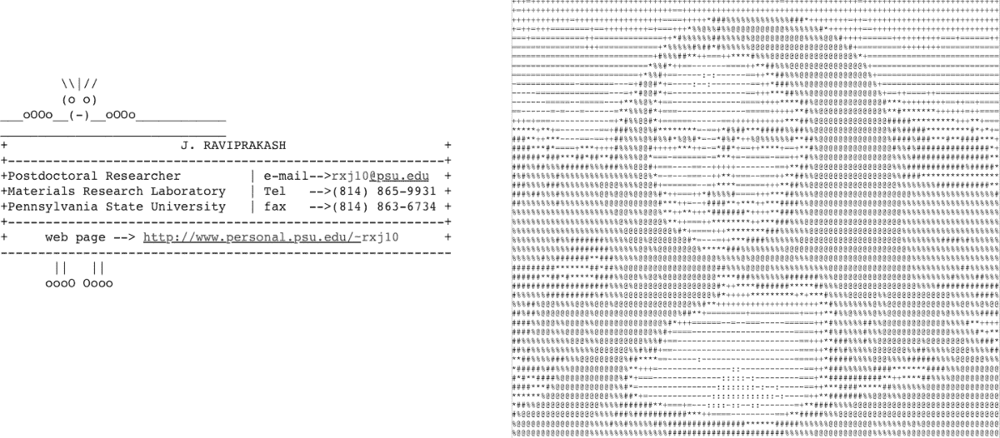
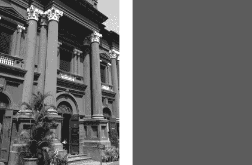

## 第六章：# ASCII 艺术


在 1990 年代，当电子邮件盛行而图形处理能力有限时，通常会在电子邮件中附上一个由文本组成的图形签名，通常称为 *ASCII 艺术*。（ASCII 只是一个字符编码方案。）图 6-1 显示了几个例子。虽然互联网让图像共享变得无比容易，但这种简朴的文本图形并没有完全消失。

ASCII 艺术起源于 19 世纪末的打字机艺术。到了 1960 年代，当时计算机的图形处理硬件非常有限，ASCII 被用来表示图像。如今，ASCII 艺术仍然作为一种表达形式存在于互联网上，你可以在线找到各种创意的例子。



图 6-1：ASCII 艺术示例

在这个项目中，你将使用 Python 创建一个程序，将图形图像转换为 ASCII 艺术。该程序将允许你指定输出的宽度（文本的列数）并设置垂直缩放因子。它还支持两种将灰度值映射到 ASCII 字符的方式：一种是稀疏的 10 级映射，另一种是更精细的 70 级映射。

要从图像生成你的 ASCII 艺术，你将学习以下内容：

+   • 使用 `Pillow`（Python 图像库 PIL 的一个分支）将图像转换为灰度。

+   • 使用 `numpy` 计算灰度图像的平均亮度。

+   • 使用字符串作为灰度值的快速查找表。

## 它是如何工作的

本项目利用了这样一个事实：从远处看，我们将灰度图像感知为其亮度的平均值。例如，在图 6-2 中，你可以看到一张建筑物的灰度图像，以及它旁边的另一张图像，显示了建筑物图像的平均亮度值。如果你从远处看这些图像，它们会显得相似。

ASCII 艺术是通过将图像分割成多个小块，并根据每个小块的平均亮度值，用 ASCII 字符替换每个小块来生成的。较亮的小块会被替换为稀疏的 ASCII 字符（即包含大量空白的字符），如句点（`.`）或冒号（`:`），而较暗的小块则会被替换为更密集的 ASCII 字符，如`@`或`$`。从远处看，由于我们的眼睛分辨率有限，我们在 ASCII 艺术中看到的是“平均”值，而失去了本来能使艺术作品看起来更真实的细节。



图 6-2：灰度图像的平均值

该程序将接受给定的图像，并首先将其转换为 8 位灰度图像，这样每个像素的灰度值将在[0, 255]范围内（8 位整数的范围）。可以把这个 8 位值看作是像素的*亮度*，其中 0 代表黑色，255 代表白色，介于两者之间的是灰度色调。

接下来，程序会将图像拆分成一个 *M*×*N* 的网格（其中 *M* 是 ASCII 图像中的行数，*N* 是列数）。然后，程序会计算每个网格块的平均亮度值，并通过预定义的*色阶*（一个递增的 ASCII 字符集合）来匹配合适的 ASCII 字符，表示灰度值范围[0, 255]。它将使用这些色阶值作为亮度值的查找表。

完成的 ASCII 艺术仅仅是一堆文本行。为了显示这些文本，你需要使用一个等宽字体（也叫做*等距*字体），例如 Courier，因为如果每个文本字符的宽度不相同，图像中的字符将无法沿着网格正确排列，最终输出将变得不均匀且混乱。

使用的*纵横比*（宽度与高度的比值）也会影响最终图像。如果字符所占空间的纵横比与字符替代的图像块的纵横比不同，最终的 ASCII 图像会显得扭曲。实际上，你是在尝试用 ASCII 字符替代图像块，所以它们的形状需要匹配。例如，如果你将图像拆分成正方形块，然后将每个块替换为字符比宽度更高的字体，最终输出的图像会显得垂直拉伸。为了解决这个问题，你需要调整网格中的行以匹配 Courier 字体的纵横比。（你可以通过命令行参数修改程序的缩放，以匹配其他字体。）

总结一下，程序生成 ASCII 图像的步骤如下：

1.  1\. 将输入图像转换为灰度图像。

1.  2\. 将图像拆分成 *M*×*N* 个小块。

1.  3\. 修正 *M*（行数），使其与图像和字体的纵横比匹配。

1.  4\. 计算每个图像块的平均亮度，然后为每个块查找一个合适的 ASCII 字符。

1.  5\. 拼接 ASCII 字符字符串的行，并将其打印到文件中，形成最终图像。

## 要求

在这个项目中，你将使用`Pillow`，Python 图像库的友好分支，来读取图像，访问它们的底层数据，并创建和修改它们。你还将使用`numpy`库来计算平均值。

## 代码

你将首先定义用于生成 ASCII 艺术的灰度级别。然后你会查看如何将图像拆分成小块，以及如何计算这些小块的平均亮度。接下来，你将替换小块中的内容，使用 ASCII 字符生成最终输出。最后，你将为程序设置命令行解析，允许用户指定输出大小、输出文件名等。

要查看完整的项目代码，请跳转至“完整代码”的第 109 页。你也可以从[`github.com/mkvenkit/pp2e/blob/main/ascii/ascii.py`](https://github.com/mkvenkit/pp2e/blob/main/ascii/ascii.py)下载该项目的代码。

### 定义灰度级别和网格

创建程序的第一步是定义用于将图像亮度值转换为 ASCII 字符的灰度级别，将其设为全局值。

# 70 级灰度

gscale1 = "$@B%8&WM#*oahkbdpqwmZO0QLCJUYXzcvunxrjft/\|()1{}[]?-_+~<>i!lI;:,\"^`'. "

# 10 级灰度

gscale2 = "@%#*+=-:. "

值`gscale1`是一个 70 级灰度渐变，而`gscale2`是一个更简单的 10 级灰度渐变。这两个值都作为字符串存储，字符的范围从最暗到最亮。程序默认使用`gscale2`渐变，但你可以通过命令行选项来使用更细致的`gscale1`渐变。

注意：要了解更多关于字符如何表示为灰度值的信息，请参阅 Paul Bourke 的《灰度图像的字符表示》：[`paulbourke.net/dataformats/asciiart/`](http://paulbourke.net/dataformats/asciiart/)。

现在你有了灰度渐变，你可以开始设置图像。以下代码使用`Pillow`打开图像并将其分割成网格：

```py
# open the image and convert to grayscale
image = Image.open(fileName).convert("L")
# store the image dimensions
❶ W, H = image.size[0], image.size[1]
# compute the tile width
❷ w = W/cols
# compute the tile height based on the aspect ratio and scale of the font
❸ h = w/scale
# compute the number of rows to use in the final grid
❹ rows = int(H/h)

```

首先，`Image.``open()`打开输入图像文件，`Image.``convert()`将图像转换为灰度。`"L"`代表*亮度*，是图像亮度的度量。你存储输入图像的宽度和高度（以像素为单位） ❶。然后你计算一个小块的宽度，这个宽度是由用户指定的列数（`cols`）决定的 ❷。（如果用户没有在命令行中设置其他值，程序将使用 80 列作为默认值。）你使用浮点数而不是整数除法，以避免在计算小块尺寸时发生截断误差。

一旦你知道了一个小块的宽度，你就可以使用传入的垂直缩放因子`scale` ❸来计算它的高度。这样，每个小块将匹配你用来显示文本的字体的纵横比，从而确保最终图像不会变形。`scale`的值可以作为参数传递，或者默认为`0.43`，这个值在 Courier 字体中显示效果很好。在计算完每行的高度后，你可以计算网格中的行数 ❹。

### 计算平均亮度

接下来，你需要一种方法来计算灰度图像中某个瓦片的平均亮度。`getAverageL()`函数可以完成这个任务。

```py
def getAverageL(image):
    # get the image as a numpy array
  ❶ im = np.array(image)
    # get the dimensions
    w,h = im.shape
    # get the average
  ❷ return np.average(im.reshape(w*h))

```

图像瓦片作为一个 PIL `Image`对象传递到函数中。你将图像转换成一个`numpy`数组❶，此时`im`变成了一个二维数组，包含了图像像素的亮度值。你存储数组的维度（宽度和高度），然后使用`numpy.reshape()`将二维数组转换成一个一维的扁平数组，其长度是原数组宽度和高度的乘积（`w*h`）。你将重塑后的数组传递给`numpy.average()`，该函数会对数组的值进行求和，并计算整个图像瓦片的平均亮度值❷。

### 从图像生成 ASCII 内容

程序的主要部分从图像生成 ASCII 内容：

```py
# an ASCII image is a list of character strings
❶ aimg = []
# generate the list of tile dimensions
❷ for j in range(rows):
    y1 = int(j*h)
    y2 = int((j+1)*h)
    # correct the last tile
    if j == rows-1:
      ❸ y2 = H
    # append an empty string
  ❹ aimg.append("")
  ❺ for i in range(cols):
        # crop the image to fit the tile
        x1 = int(i*w)
        x2 = int((i+1)*w)
        # correct the last tile
        if i == cols-1:
            x2 = W
        # crop the image to extract the tile into another Image object
      ❻ img = image.crop((x1, y1, x2, y2))
        # get the average luminance
      ❼ avg = int(getAverageL(img))
        # look up the ASCII character for grayscale value (avg)
        if moreLevels:
          ❽ gsval = gscale1[int((avg*69)/255)]
        else:
          ❾ gsval = gscale2[int((avg*9)/255)]
        # append the ASCII character to the string
      ❿ aimg[j] += gsval

```

在程序的这一部分，首先将 ASCII 图像存储为一个字符串列表，你将其初始化❶。接下来，你迭代图像瓦片的行❷，计算给定行中每个图像瓦片的上下 y 坐标，分别记为*y1*和*y2*。这些是浮点数计算，但在将它们传递给图像裁剪方法之前，你将其截断为整数。

接下来，因为将图像划分成瓦片时，只有当图像宽度是列数的整数倍时，才会创建大小相同的边缘瓦片，所以你通过将最后一行瓦片的底部 y 坐标设置为图像的实际高度（`H`）来修正它❸。这样做可以确保图像的底部边缘不会被截断。

你在 ASCII 图像列表中添加一个空字符串，以简洁的方式表示当前的图像行❹。接下来，你会填充这个字符串。实际上，你将这个字符串当作一个可以追加字符的字符列表。然后，你按列遍历图像中给定行的所有瓦片❺。你计算每个瓦片的左右 x 坐标，分别记为*x1*和*x2*。当你到达行中的最后一个瓦片时，你将右边的 x 坐标设置为图像的宽度（`W`），理由与之前修正 y 坐标的方式相同。

你现在已经计算出了(*x1*, *y1*) 和 (*x2*, *y2*)，即当前图像块的左上角和右下角的坐标。你将这些坐标传递给 `image.crop()` 来从完整的图像中提取图像块 ❻。然后，你将该图像块（它是一个 PIL `Image` 对象）传递给 `getAverageL()` 函数 ❼，该函数在 “计算平均亮度” 的 第 105 页 中定义，用于获取该图像块的平均亮度。你将平均亮度值从 [0, 255] 范围缩放到 [0, 9]，这是默认的 10 级灰度阶梯的值范围 ❾。然后，你使用 `gscale2`（存储的阶梯字符串）作为查找表，找到对应的 ASCII 字符。❽ 处的代码类似，但它将亮度值缩放到 70 级灰度阶梯的 [0, 69] 范围。此行代码仅在设置了 `moreLevels` 命令行标志时使用。最后，你将查找出的 ASCII 字符 `gsval` 添加到文本行 ❿，代码会循环直到所有行都处理完成。

### 创建命令行选项

接下来，为程序定义一些命令行选项。此代码使用内置的 `argparse.ArgumentParser` 类：

```py
parser = argparse.ArgumentParser(description="descStr")
# add expected arguments
parser.add_argument('--file', dest='imgFile', required=True)
parser.add_argument('--scale', dest='scale', required=False)
parser.add_argument('--out', dest='outFile', required=False)
parser.add_argument('--cols', dest='cols', required=False)
parser.add_argument('--morelevels', dest='moreLevels', action='store_true')

```

你可以包含以下选项：

--file 指定要输入的图像文件。这是唯一必需的参数。

--scale 设置其他字体的垂直缩放因子，而不是 Courier 字体。

--out 设置生成的 ASCII 艺术的输出文件名。默认为 *out.txt*。

--cols 设置 ASCII 输出中的文本列数。

--morelevels 选择 70 级灰度阶梯，而不是默认的 10 级阶梯。

### 将 ASCII 艺术字符串写入文本文件

最后，获取生成的 ASCII 字符串列表，并将这些字符串写入文本文件：

```py
# open a new text file
❶ f = open(outFile, 'w')
# write each string in the list to the new file
❷ for row in aimg:
    f.write(row + '\n')
# clean up
❸ f.close()

```

你使用内置的 `open()` 函数打开一个新的文本文件进行写入 ❶。然后，你遍历 `aimg` 列表中的每个字符串，并将其写入文件 ❷。完成后，你关闭文件对象以释放系统资源 ❸。

## 运行 ASCII 艺术生成器

要运行你的完成程序，输入如下命令，将`data/robot.jpg`替换为你想使用的图片文件的相对路径：

```py
$ `python ascii.py --file` `data/robot.jpg` `--cols 100`

```

图 6-3 显示了发送图像 *robot.jpg*（左侧）生成的 ASCII 艺术。试着添加 `--morelevels` 选项，看看 70 级灰度阶梯与 10 级灰度阶梯的对比。


图 6-3：*ascii.py* 的示例运行

现在，你已准备好创建自己的 ASCII 艺术了！

## 总结

在这个项目中，你学会了如何将任何输入图像转换为 ASCII 艺术。在这个过程中，你学会了如何将图像分割成瓦片网格，如何计算每个瓦片的平均亮度值，以及如何根据亮度值用字符替换每个瓦片。享受创作你自己的 ASCII 艺术吧！

## 实验！

这里有一些进一步探索 ASCII 艺术的想法：

1.  1\. 使用命令行选项`--scale 1.0`运行程序。结果图像看起来如何？尝试不同的`scale`值。将输出复制到文本编辑器并尝试设置为不同的等宽字体，以查看这样做如何影响最终图像的外观。

1.  2\. 向程序添加命令行选项`--invert`，以反转生成的 ASCII 图像，使黑色变为白色，反之亦然。（提示：尝试在查找时从 255 中减去瓦片亮度值。）

1.  3\. 在这个项目中，你根据两个硬编码字符坡道创建了灰度值查找表。实现一个命令行选项，传递不同的字符坡道来创建 ASCII 艺术，像这样：

    ```py
    $ ``python ascii.py --map "@$%^`."``

    ```

    这应该使用给定的六字符坡道创建 ASCII 输出，其中`@`映射到亮度值 0，`.`映射到亮度值 255。

## 完整代码

这是完整的 ASCII 艺术程序。

"""

ascii.py

一个将图像转换为 ASCII 艺术的 Python 程序。

作者：马赫什·文基塔查拉姆

"""

import sys, random, argparse

import numpy as np

import math

from PIL import Image

# 灰度级值来自：

# http://paulbourke.net/dataformats/asciiart/

# 70 级灰度

gscale1 = "$@B%8&WM#*oahkbdpqwmZO0QLCJUYXzcvunxrjft/\|()1{}[]?-_+~<>i!lI;:,\"^`'. "

# 10 级灰度

gscale2 = '@%#*+=-:. '

def getAverageL(image):

"""

给定 PIL 图像，返回灰度值的平均值

"""

# 将图像转换为 numpy 数组

im = np.array(image)

# 获取形状

w,h = im.shape

# 获取平均值

return np.average(im.reshape(w*h))

def convertImageToAscii(fileName, cols, scale, moreLevels):

"""

给定图像和尺寸（行数，列数）返回一个 m*n 的图像列表

"""

# 声明全局变量

global gscale1, gscale2

# 打开图像并转换为灰度

image = Image.open(fileName).convert('L')

# 存储尺寸

W, H = image.size[0], image.size[1]

print("输入图像尺寸: {} x {}".format(W, H))

# 计算瓦片的宽度

w = W/cols

# 根据长宽比和缩放计算瓦片高度

h = w/scale

# 计算行数

rows = int(H/h)

print("列数: {}, 行数: {}".format(cols, rows))

print("瓦片尺寸: {} x {}".format(w, h))

# 检查图像尺寸是否过小

if cols > W or rows > H:

print("图片太小，无法满足指定的列数！")

exit(0)

# 一个 ASCII 图像是一个字符字符串的列表

aimg = []

# 生成尺寸列表

for j in range(rows):

y1 = int(j*h)

y2 = int((j+1)*h)

# 修正最后一个瓦片

if j == rows-1:

y2 = H

# 添加一个空字符串

aimg.append("")

for i in range(cols):

# 裁剪图像为瓦片

x1 = int(i*w)

x2 = int((i+1)*w)

# 修正最后一个块

if i == cols-1:

x2 = W

# 裁剪图像以提取块

img = image.crop((x1, y1, x2, y2))

# 获取平均亮度

avg = int(getAverageL(img))

# 查找 ASCII 字符

if moreLevels:

gsval = gscale1[int((avg*69)/255)]

else:

gsval = gscale2[int((avg*9)/255)]

# 将 ASCII 字符添加到字符串

aimg[j] += gsval

# 返回图像

return aimg

# main() 函数

def main():

# 创建解析器

descStr = "该程序将图像转换为 ASCII 艺术。"

parser = argparse.ArgumentParser(description=descStr)

# 添加预期的参数

parser.add_argument('--file', dest='imgFile', required=True)

parser.add_argument('--scale', dest='scale', required=False)

parser.add_argument('--out', dest='outFile', required=False)

parser.add_argument('--cols', dest='cols', required=False)

parser.add_argument('--morelevels',dest='moreLevels',action='store_true')

# 解析参数

args = parser.parse_args()

imgFile = args.imgFile

# 设置输出文件

outFile = 'out.txt'

if args.outFile:

outFile = args.outFile

# 设置默认缩放比例为 0.43，适用于 Courier 字体

scale = 0.43

if args.scale:

scale = float(args.scale)

# 设置列数

cols = 80

if args.cols:

cols = int(args.cols)

print('生成 ASCII 艺术中...')

# 将图像转换为 ASCII 文本

aimg = convertImageToAscii(imgFile, cols, scale, args.moreLevels)

# 打开文件

f = open(outFile, 'w')

# 写入文件

for row in aimg:

f.write(row + '\n')

# 清理

f.close()

print("ASCII 艺术已写入 {}.".format(outFile))

# 调用 main

if __name__ == '__main__':

main()
