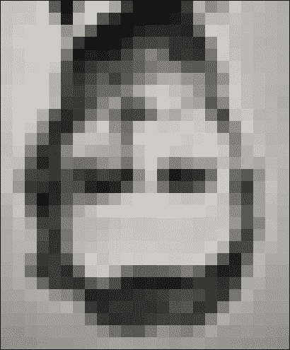
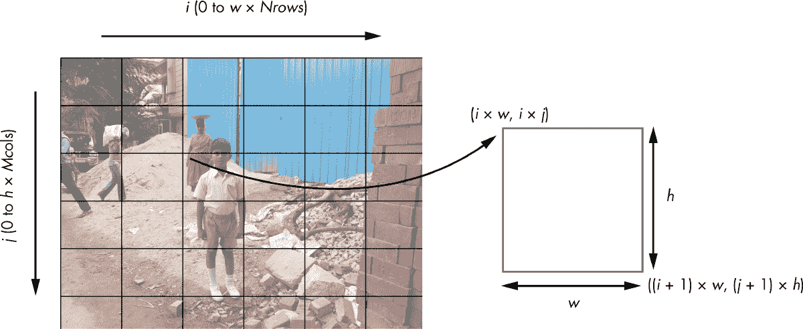
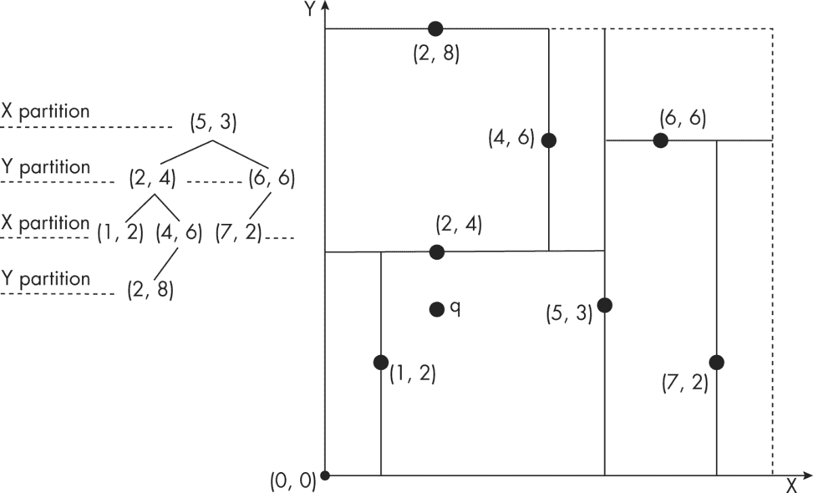

## 第七章：# 照片马赛克


当我上六年级时，我看到了一张类似于图 7-1 中的图片，但当时并没完全搞懂那是什么。盯着它看了一会儿后，我终于弄明白了。（把书倒过来，从房间对面看。这个秘密我不告诉别人。）

这个谜题的巧妙之处在于人眼的工作方式。图中的低分辨率、块状图像在近距离下很难识别，但当从远处看时，你就能知道它代表什么，因为眼睛看到的细节更少，这让边缘变得平滑。

*照片马赛克* 是根据类似的原理制作的图像。你将一个 *目标* 图像拆分成一个矩形网格，然后用另一个匹配目标图像部分的较小图像替换每个矩形。当你从远处看照片马赛克时，你看到的只是目标图像，但如果你走近一点，真相就揭晓了：这幅图像实际上是由许多小图像组成的！



图 7-1：一张让人困惑的图片

在这个项目中，你将使用 Python 创建一个照片马赛克。你将把目标图像划分成一个网格，并用合适的图像替换网格中的每一个小块，从而创建出原图的照片马赛克。你可以指定网格的尺寸，并选择是否在马赛克中重复使用输入图像。

在这个项目中，你将学习如何完成以下任务：

+   • 使用 Python 图像库（PIL）创建图像。

+   • 计算图像的平均 RGB 值。

+   • 剪裁图像。

+   • 通过粘贴另一张图像来替换图像的一部分。

+   • 使用三维的平均距离度量来比较 RGB 值。

+   • 使用一种叫做 *k-d 树* 的数据结构来高效地找到与目标图像某部分最匹配的图像。

## 它是如何工作的

为了创建一个照片马赛克，首先使用一个块状的低分辨率版本的目标图像（因为在高分辨率图像中，瓦片图像的数量会太大）。用户输入马赛克的尺寸 *M*×*N*（其中 *M* 是行数，*N* 是列数）。接下来，根据以下方法构建马赛克：

1.  1\. 读取输入图像，这些图像将用于替换原图中的瓦片。

1.  2\. 读取目标图像并将其拆分成 *M*×*N* 的瓦片网格。

1.  3\. 对于每个瓦片，从输入图像中找到最佳匹配。

1.  4\. 通过将选定的输入图像排列成 *M*×*N* 网格来创建最终的马赛克。

### 拆分目标图像

我们将从如何将目标图像拆分成 *M*×*N* 的瓦片网格开始。请参照图 7-2 中的方案。



图 7-2：拆分目标图像

我们将原始图像划分为一个由*N*列和*M*行组成的瓦片网格，列沿 x 轴排列，行沿 y 轴排列。每个瓦片由一个索引(*i*, *j*)表示，宽度为*w*像素，高度为*h*像素。根据这个方案，原始图像的宽度为*w* × *N*像素，高度为*h* × *M*像素。

图 7-2 的右侧展示了如何计算从此网格中单个瓦片的像素坐标。索引为(*i*, *j*)的瓦片，其左上角坐标为(*i* × *w, i* × *j*)，右下角坐标为((*i* + 1) × *w*, (*j* + 1) × *h*)。这些坐标可以与 PIL 一起使用，从原始图像中裁剪并创建瓦片。

### 平均颜色值

图像中的每个像素都有一个颜色，可以通过其红、绿、蓝值来数值表示。在这种情况下，你使用的是 8 位图像，因此每个颜色分量的 8 位值在[0, 255]范围内。因此，你可以通过计算图像所有像素的红、绿、蓝值的平均值来确定图像的平均颜色。给定一幅包含总共*N*个像素的图像，平均 RGB 的计算方法如下：


像单个像素的 RGB 一样，整幅图像的平均 RGB 是一个三元组，而不是一个标量或单一数值，因为平均值是分别对每个颜色分量计算的。你计算平均 RGB 值来将目标图像的瓦片与输入图像中的替代图像进行匹配。

### 匹配图像

对于目标图像中的每个瓦片，你需要从用户指定的输入文件夹中的图像中找到一个匹配的图像。为了判断两幅图像是否匹配，使用平均 RGB 值。最佳匹配是输入图像，其平均 RGB 值最接近目标图像瓦片的平均 RGB 值。

最简单的找到最佳匹配的方法是计算平均 RGB 值之间的距离，就像它们是 3D 空间中的点一样。毕竟，每个平均 RGB 由三个数字组成，你可以将其视为 x 轴、y 轴和 z 轴坐标。因此，你可以使用几何学中的以下公式来计算两个 3D 点之间的距离：


在这里，你计算点(*r*[1], *g*[1], *b*[1])和(*r*[2], *g*[2], *b*[2])之间的距离。给定一个目标平均 RGB 值(*r*[1], *g*[1], *b*[1])，你可以将输入图像中的平均 RGB 值列表代入先前的公式，作为(*r*[2], *g*[2], *b*[2])来找到最接近的匹配图像。然而，可能有成百上千张输入图像需要检查。因此，我们应该考虑如何高效地搜索输入图像集以找到最佳匹配。

#### 使用线性搜索

搜索匹配项的最简单方法是 *线性搜索*。在这种方法中，你只需逐个遍历所有 RGB 值，并找到与查询值之间最小距离的那个值。代码看起来大致如下：

```py
min_dist = MAX_VAL
for val in vals:
    dist = distance(query, val)
    if dist < MAX_VAL:
        min_dist = dist

```

你依次遍历列表中的每个值 `vals`，并计算该值与 `query` 之间的距离。如果结果小于 `min_dist`（它初始化为两个点之间的最大可能距离），你就用刚刚计算的距离更新 `min_dist`。检查完 `vals` 中的每一项后，`min_dist` 将包含整个数据集中最小的距离。

虽然线性搜索方法易于理解和实现，但它并不是非常高效。如果 `vals` 列表中有 *N* 个值，搜索将需要与 *N* 成正比的时间。你可以通过使用不同的数据结构和搜索算法来获得更好的性能。

#### 使用 k-d 树

*k-d 树*，或者叫做 *k 维树*，是一种数据结构，它将 *k* 维空间划分——也就是说，它将空间划分成多个不重叠的子空间。这个数据结构提供了一种方法，用于对数据集进行排序和搜索，数据集中的每个成员都是 *k* 维空间中的一个点。数据集被表示为一个 *二叉树*：数据集中的每个点都是树中的一个节点，每个节点可以有两个子节点。换句话说，树中的每个节点将空间划分成两部分，称为 *子树*。一部分指向节点的左侧（节点的左子节点及其后代），另一部分指向节点的右侧（节点的右子节点及其后代）。

树的每个节点都与空间的一个维度相关联，这个维度用于决定点是属于节点的左子树还是右子树。例如，如果一个节点与 x 轴相关联，那么 x 值小于该节点的 x 值的点将放入该节点的左子树，而 x 值大于该节点的 x 值的点将放入右子树。选择每个节点关联的维度的常见方法是，在向下遍历树的过程中按顺序循环这些维度。例如，在三维 k-d 树的情况下，你可以设置维度为 x、y、z、x、y、z，依此类推，随着树的深入。位于相同树高度的节点将具有相同的划分维度。

让我们看一个简单的 k-d 树的例子。假设你有以下点集，*P*：

*P* = {(5, 3), (2, 4), (1, 2), (6, 6), (7, 2), (4, 6), (2, 8)}

在这种情况下，你将构建一个二维的 k-d 树，因为 *P* 中的每个成员都描述了二维空间中的一个点。首先将第一个节点，或者称为 *根* 节点（5, 3），与 x 维度关联。然后将下一个点（2, 4）作为根节点的左子节点，因为该点的 x 坐标 2 小于根节点的 x 坐标 5。节点（2, 4）位于 k-d 树的第二层，将使用 y 维度进行划分。接下来列表中的点是（1, 2）。从根节点开始，1 < 5，因此你转到根节点的左子节点。然后使用 y 维度比较（1, 2）和（2, 4）。由于 2 < 4，你将（1, 2）作为（2, 4）的左子节点。

如果你按照这种方式处理 *P* 中的所有点，你将创建图 7-3 中所示的树和空间划分。



图 7-3：k-d 树的示例

图 7-3 的顶部图像展示了我们刚才讨论的树的空间划分方案。从点（5, 3）开始，通过在该点绘制一条垂直线，沿着 x 维度将空间分成两部分。接下来，使用点（2, 4）沿着 y 维度划分第一个分区的左半部分，在该点绘制一条水平线，直到线与垂直线相交。按照这种方式继续处理剩余的点，你将得到图中所示的划分方案。

为什么你要关心 k-d 树？答案是，一旦你按照这种方式排列数据集，你可以更快地搜索它。具体来说，*最近邻搜索*——找到离查询点最近的点——使用 k-d 树比线性搜索要快得多。对于一个包含 *N* 个值的数据集，k-d 树的平均最近邻搜索时间是与 log(*N*) 成正比的，而线性搜索的时间则与 *N* 成正比。

为了演示，我们来尝试找到离点 *q*（2, 3）最近的 *P* 中的点，该点显示在图 7-3 中。从图中可以看出，点（2, 4）是匹配点。最近邻算法通过从（5, 3）到（2, 4）遍历树来找到匹配点。算法知道，例如，根节点的右子树可以跳过，因为 *q* 的 x 坐标小于根节点的 x 坐标。因此，空间划分方案让你跳过比线性搜索更多的比较。这就是 k-d 树对我们问题有用的原因。

如何在照片马赛克代码中使用 k-d 树？你可以尝试从头开始实现，但还有一个更简单的选项：`scipy` 库已经内置了一个 k-d 树类。我们将在本章后面介绍如何利用这个类。

## 要求

在这个项目中，你将使用`Pillow`读取图像，访问它们的底层数据，并创建和修改图像。你还将使用`numpy`来操作图像数据，使用`scipy`通过 k-d 树查找图像数据。

## 代码部分

你将首先读取输入图像，这些图像将用于创建照片马赛克。接下来，你将计算图像的平均 RGB 值，将目标图像划分为网格，并找到最匹配每个网格块的图像。最后，你将拼接图像块，生成实际的照片马赛克。要查看完整的项目代码，请跳到“完整代码”在第 129 页。你也可以在[`github.com/mkvenkit/pp2e/tree/main/photomosaic`](https://github.com/mkvenkit/pp2e/tree/main/photomosaic)找到代码。

### 读取输入图像

首先从给定的文件夹中读取输入图像。以下是操作步骤：

```py
def getImages(imageDir):
    """
    given a directory of images, return a list of Images
    """
  ❶ files = os.listdir(imageDir)
    images = []
    for file in files:
      ❷ filePath = os.path.abspath(os.path.join(imageDir, file))
        try:
            # explicit load so we don't run into resource crunch
          ❸ fp = open(filePath, "rb")
            im = Image.open(fp)
            images.append(im)
            # force loading the image data from file
          ❹ im.load()
            # close the file
          ❺ fp.close()
        except:
            # skip
            print("Invalid image: %s" % (filePath,))
    return images

```

你首先使用`os.listdir()`来收集*imageDir*目录中的文件名，并将其存储在一个名为`files`的列表中❶。接下来，你遍历列表中的每个文件并将其加载为一个 PIL `Image`对象。

你使用`os.path.abspath()`和`os.path.join()`来获取图像的完整文件名❷。这种习惯用法在 Python 中非常常见，可以确保你的代码既能处理相对路径（例如，*\foo\bar\*）和绝对路径（*c:\foo\bar\*），也能在不同的操作系统之间兼容，因不同操作系统的目录命名约定（Windows 中使用\，而 Linux 中使用/）。

为了将文件加载为 PIL `Image`对象，你可以将每个文件名传递给`Image.open()`方法，但如果你的照片马赛克文件夹中有数百或数千张图像，这样做会非常占用资源。相反，你可以使用 Python 打开每个图像文件，并将文件句柄`fp`传递给 PIL，使用`Image.open()`方法加载图像。加载完图像后，关闭文件句柄并释放系统资源。

你使用`open()`打开图像文件❸，然后将文件句柄传递给`Image.open()`，并将返回的图像`im`存储到名为`images`的列表中。调用`Image.load()`❹强制加载`im`中的图像数据，因为`open()`是一个懒加载操作。它仅识别图像，但在你实际使用图像之前并不会读取所有的图像数据。最后，你通过关闭文件句柄来释放系统资源❺。

### 计算图像的平均颜色值

一旦你读取了输入图像，你需要计算每张图像的平均颜色值。你还需要为目标图像的每个区域计算平均颜色值。创建一个`getAverageRGB()`函数来处理这两个任务。

```py
def getAverageRGB(image):
    """
    return the average color value as (r, g, b) for each input image
    """
    # get each tile image as a numpy array
  ❶ im = np.array(image)
    # get the shape of each input image
  ❷ w,h,d = im.shape
    # get the average RGB value
  ❸ return tuple(np.average(im.reshape(w*h, d), axis=0))

```

该函数接受一个`Image`对象——它可以是输入图像之一，或者是目标图像的一个部分——并使用`numpy`将其转换为数据数组❶。结果的`numpy`数组的形状为(`w`, `h`, `d`)，其中`w`是图像的宽度，`h`是高度，`d`是深度，在 RGB 图像的情况下，`d`的值为 3（分别对应 R、G 和 B）。你存储了`shape`元组❷，然后通过将数组重塑为更方便的形状(`w*h`, `d`)来计算平均 RGB 值，这样你就可以使用`numpy.average()`❸来计算平均值。（你在第六章中执行了类似的操作，以获取灰度图像的平均亮度。）你将结果作为一个元组返回。

### 将目标图像拆分为网格

现在你需要将目标图像拆分为一个*M*×*N*的小图像网格。让我们创建一个函数来实现这一点：

```py
def splitImage(image, size):
    """
    given the image and dimensions (rows, cols), return an m*n list of images
    """
  ❶ W, H = image.size[0], image.size[1]
  ❷ m, n = size
  ❸ w, h = int(W/n), int(H/m)
    # image list
    imgs = []
    # generate a list of images
    for j in range(m):
        for i in range(n):
            # append cropped image
      ❹ imgs.append(image.crop((i*w, j*h, (i+1)*w, (j+1)*h)))
    return imgs

```

首先，你收集目标图像的尺寸❶和网格大小❷。然后，你使用基本的除法计算目标图像中每个瓷砖的尺寸❸。接下来，你需要遍历网格的尺寸，裁剪并存储每个瓷砖作为一个独立的图像。调用`image.crop()`❹可以使用图像的左上角和右下角坐标作为参数来裁剪图像的一部分（如“拆分目标图像”在第 115 页中讨论的）。最后，你会得到一系列图像——首先是网格中第一行的所有图像，从左到右；然后是第二行的所有图像；依此类推。

### 查找瓷砖的最佳匹配

现在让我们从输入图像的文件夹中找到最匹配的瓷砖。我们将探讨两种方法：使用线性搜索和使用 k-d 树。对于线性搜索方法，你创建了一个工具函数`getBestMatchIndex()`，如下所示：

```py
def getBestMatchIndex(input_avg, avgs):
    """
    return index of the best image match based on average RGB value distance
    """
    # input image average
    avg = input_avg
    # get the closest RGB value to input, based on RGB distance
    index = 0
  ❶ min_index = 0
  ❷ min_dist = float("inf")
  ❸ for val in avgs:
      ❹ dist = ((val[0] - avg[0])*(val[0] - avg[0]) +
                (val[1] - avg[1])*(val[1] - avg[1]) +
                (val[2] - avg[2])*(val[2] - avg[2]))
      ❺ if dist < min_dist:
            min_dist = dist
            min_index = index
        index += 1
    return min_index

```

你正在尝试搜索 `avgs`，一个包含输入图像的平均 RGB 值的列表，以找到与 `input_avg`（目标图像中某个瓷砖的平均 RGB 值）最接近的那个。首先，你将最接近的匹配项索引初始化为 0 ❶，并将最小距离初始化为无穷大 ❷。然后，你循环遍历平均值列表中的值 ❸，并开始使用 “匹配图像” 中的标准公式计算距离 ❹（你跳过计算平方根以减少计算时间）。如果计算出的距离小于存储的最小距离 `min_dist`，则用新的最小距离替换它 ❺。这个测试在第一次执行时总是会通过，因为任何距离都小于无穷大。在迭代结束时，`min_index` 是 `avgs` 列表中与 `input_avg` 最接近的平均 RGB 值的索引。现在，你可以使用这个索引从输入图像列表中选择匹配的图像。

现在，让我们使用 k-d 树而不是线性搜索来找到最佳匹配。以下是函数：

```py
def getBestMatchIndicesKDT(qavgs, kdtree):
    """
    return indices of best Image matches based on RGB value distance
    uses a k-d tree
    """
    # e.g., [array([2.]), array([9], dtype=int64)]
  ❶ res = list(kdtree.query(qavgs, k=1))
  ❷ min_indices = res[1]
    return min_indices

```

`getBestMatchIndicesKDT()` 函数接受两个参数：`qavgs` 是目标图像中每个瓷砖的平均 RGB 值列表，`kdtree` 是使用输入图像的平均 RGB 值列表创建的 `scipy KDTree` 对象。（我们将在 “创建照片马赛克” 中的 第 124 页创建 `KDTree` 对象。）你使用 `KDTree` 对象的 `query()` 方法来获取树中与 `qavgs` 中点最接近的点 ❶。这里，`k` 参数是你想要返回的查询点的最近邻数量。你只需要最接近的匹配项，所以传入 `k=1`。`query()` 方法的返回值是一个包含两个 `numpy` 数组的元组，分别表示匹配项的距离和索引。你需要索引，因此从结果中选择第二个值 ❷。

请注意，`query()` 方法 ❶ 允许你传入一个查询点列表，而不仅仅是一个。这实际上比逐个查询结果要快，而且这意味着你只需要调用 `getBestMatchIndicesKDT()` 函数一次，而线性搜索的 `getBestMatch()` 函数需要为照片马赛克中的每个瓷砖调用多次。

完整的程序将包括一个选项，用于选择使用前两个函数中的哪一个：线性搜索版本或 k-d 树版本。它还将有一个计时器，用来测试哪种搜索方法更快。

### 创建图像网格

在继续创建照片马赛克之前，你还需要一个实用函数。`createImageGrid()` 函数将创建一个 *M*×*N* 大小的图像网格。这个图像网格是最终的照片马赛克图像，由选定的输入图像列表创建。

```py
def createImageGrid(images, dims):
    """
    given a list of images and a grid size (m, n), create a grid of images
    """
  ❶ m, n = dims
    # sanity check
    assert m*n == len(images)
    # get the maximum height and width of the images
    # don't assume they're all equal
  ❷ width = max([img.size[0] for img in images])
    height = max([img.size[1] for img in images])
    # create the target image
  ❸ grid_img = Image.new('RGB', (n*width, m*height))
    # paste the tile images into the image grid
    for index in range(len(images)):
      ❹ row = int(index/n)
      ❺ col = index - n*row
      ❻ grid_img.paste(images[index], (col*width, row*height))
    return grid_img

```

该函数有两个参数：一个图像列表（基于与目标图像单个图像块最接近的 RGB 匹配所选择的输入图像），以及一个包含照片马赛克尺寸的元组（你希望它具有的行数和列数）。你先收集网格的尺寸 ❶，然后使用 `assert` 来检查传递给 `createImageGrid()` 的图像数量是否与网格大小匹配。（`assert` 方法用于检查代码中的假设，尤其是在开发和测试期间。）接下来，你计算所选图像的最大宽度和高度 ❷，因为它们的大小可能不完全相同。你将使用这些最大尺寸来设置照片马赛克的标准图像块大小。如果输入图像无法完全填充一个图像块，默认情况下，图像块之间的空白部分将显示为纯黑色。

接下来，你创建一个空的 `Image`，其大小足以容纳网格中的所有图像 ❸；你将把图像块粘贴到这个图像中。然后，通过循环遍历选择的图像，将它们粘贴到网格中的适当位置，使用 `Image.paste()` 方法 ❻。`Image.paste()` 的第一个参数是要粘贴的 `Image` 对象，第二个是左上角的坐标。现在你需要确定将输入图像粘贴到图像网格中的哪一行和哪一列。为此，你需要将图像索引表示为行和列的形式。图像网格中图像块的索引由 *N* × *row* + *col* 给出，其中 *N* 是图像网格的宽度，(*row*, *col*) 是网格中的坐标；在 ❹，你根据前面的公式确定行，接着在 ❺ 确定列。

### 创建照片马赛克

现在你已经拥有了所有必需的工具，让我们编写创建照片马赛克的主函数。以下是函数的开始部分：

```py
def createPhotomosaic(target_image, input_images, grid_size,
                      reuse_images, use_kdt):
    """
    creates photomosaic given target and input images
    """
    print('splitting input image...')
    # split target image
  ❶ target_images = splitImage(target_image, grid_size)
    print('finding image matches...')
    # for each target image, pick one from input
    output_images = []
    # for user feedback
    count = 0
  ❷ batch_size = int(len(target_images)/10)
    # calculate input image averages
    avgs = []
  ❸ for img in input_images:
        avgs.append(getAverageRGB(img))
    # compute target averages
    avgs_target = []
  ❹ for img in target_images:
        # target subimage average
        avgs_target.append(getAverageRGB(img))

```

`createPhotomosaic()` 函数接受目标图像、输入图像列表、生成的照片马赛克的大小（行数和列数）以及标志，指示图像是否可以重用，是否使用 k-d 树来搜索图像匹配。该函数首先调用 `splitImage()` ❶ 将目标图像拆分为一个小图像块的网格。图像拆分后，你就可以开始从输入文件夹中的图像中找到每个图像块的匹配项。然而，由于这个过程可能比较耗时，因此最好向用户提供反馈，让他们知道程序仍在运行。为此，你将 `batch_size` 设置为图像块总数的十分之一 ❷。选择十分之一是任意的，仅仅是为了让程序告诉用户“我还在运行”。每次程序处理完十分之一的图像时，它都会打印一条消息，表明程序仍在运行。

为了找到图像匹配，你需要计算平均 RGB 值。你遍历输入图像❸并使用`getAverageRGB()`函数计算每个图像的平均 RGB 值，将结果存储在`avgs`列表中。然后你对目标图像中的每个瓦片❹进行相同的操作，将平均 RGB 值存储到`avgs_target`列表中。

该函数通过`if...else`语句继续运行，使用 k-d 树或线性搜索来查找 RGB 匹配项。我们先来看`if`分支，当`use_kdt`标志被设置为`True`时，该分支会执行：

```py
    # use k-d tree for average match?
    if use_kdt:
        # create k-d tree
      ❶ kdtree = KDTree(avgs)
        # query k-d tree
      ❷ match_indices = getBestMatchIndicesKDT(avgs_target, kdtree)
        # process matches
      ❸ for match_index in match_indices:
          ❹ output_images.append(input_images[match_index])

```

你使用输入图像的平均 RGB 值列表❶创建一个`KDTree`对象，并通过将`avgs_target`和`KDTree`对象传递给`getBestMatchIndicesKDT()`辅助函数❷来检索最佳匹配的索引。然后，你遍历所有匹配的索引❸，找到对应的输入图像，并将它们添加到`output_images`列表❹。

接下来，让我们来看一下`else`分支，它执行线性搜索以寻找匹配项：

```py
    else:
        # use linear search
      ❶ for avg in avgs_target:
            # find match index
          ❷ match_index = getBestMatchIndex(avg, avgs)
          ❸ output_images.append(input_images[match_index])
            # user feedback
          ❹ if count > 0 and batch_size > 10 and count % batch_size == 0:
                print('processed %d of %d...' %(count, len(target_images)))
            count += 1
            # remove selected image from input if flag set
          ❺ if not reuse_images:
                input_images.remove(match)

```

对于线性搜索，你开始遍历目标图像瓦片的平均 RGB 值❶。对于每个瓦片，你使用`getBestMatchIndex()`❷在输入图像的平均 RGB 值列表中搜索最接近的匹配项。结果会返回一个索引，你可以使用这个索引来检索`Image`对象并将其存储在`output_images`列表中❸。对于每处理完`batch_size`个图像❹，你会打印一条消息给用户。如果`reuse_images`标志被设置为`False`❺，你会从列表中删除已选中的输入图像，以确保它不会在另一个瓦片中被重用。（当你有大量输入图像可以选择时，这种方式效果最好。）

在`createPhotomosaic()`函数中剩下的就是将输入图像排列成最终的照片马赛克：

```py
    print('creating mosaic...')
    # draw mosaic to image
  ❶ mosaic_image = createImageGrid(output_images, grid_size)
    # return mosaic
    return mosaic_image

```

你使用`createImageGrid()`函数构建照片马赛克❶。然后你将生成的图像作为`mosaic_image`返回。

### 编写 main()函数

程序的`main()`函数接收并解析命令行参数，加载所有图像并进行一些额外的设置。然后它调用`createPhotomosaic()`函数并保存生成的照片马赛克。随着照片马赛克的构建，Python 会记录过程的时间，从而让你比较 k-d 树与线性搜索的性能。

#### 添加命令行选项

`main()`函数支持以下命令行选项：

```py
    # parse arguments
    parser = argparse.ArgumentParser(description='Creates a photomosaic from
                                     input images')
    # add arguments
    parser.add_argument('--target-image', dest='target_image', required=True)
    parser.add_argument('--input-folder', dest='input_folder', required=True)
    parser.add_argument('--grid-size', nargs=2, dest='grid_size',
                        required=True)
    parser.add_argument('--output-file', dest='outfile', required=False)
    parser.add_argument('--kdt', action='store_true', required=False)

```

这段代码包含三个必需的命令行参数：目标图像的名称、输入图像文件夹的名称和网格大小。第四个参数是可选的输出文件名。如果省略文件名，照片马赛克将写入名为*mosaic.png*的文件。第五个参数是一个布尔标志，它启用 k-d 树搜索，而不是线性搜索来匹配平均 RGB 值。

#### 控制照片马赛克的大小

一旦所有图像加载完成，`main()`函数中需要解决的一个问题是最终光拼贴图的大小（以像素为单位）。如果你仅仅根据目标中的匹配瓦片盲目地将输入图像拼接在一起，最终可能得到一个比目标图像大得多的光拼贴图。为避免这种情况，可以调整输入图像的大小，使其与网格中每个瓦片的大小匹配。（这还可以加快 RGB 计算的速度，因为你将使用较小的图像。）以下是`main()`函数中处理此任务的部分代码：

```py
        print('resizing images...')
        # for given grid size, compute the maximum width and height of tiles
      ❶ dims = (int(target_image.size[0]/grid_size[1]),
                int(target_image.size[1]/grid_size[0]))
        print("max tile dims: %s" % (dims,))
        # resize
        for img in input_images:
          ❷ img.thumbnail(dims)

```

你根据网格中指定的行数和列数计算目标尺寸❶；然后，使用 PIL 的`Image.``thumbnail()`方法调整输入图像的大小以适应这些尺寸❷。

#### 性能计时

当程序运行时，你可能想知道它执行所需的时间。为此，可以使用 Python 的`timeit`模块。计算执行时间的方法如下：

```py
import timeit
# start timing
❶ start = timeit.default_timer()
# run some code here...
--`snip`--
# stop timing
❷ stop = timeit.default_timer()
print('Execution time: %f seconds' % (stop - start, ))

```

使用`timeit`模块的默认计时器记录开始时间❶。然后，在运行某些代码后，记录停止时间❷。计算二者的差值即可得到以秒为单位的执行时间。

## 运行光拼贴图生成器

首先，让我们使用默认的线性搜索方法运行程序。光拼贴图将由 128×128 图像的网格组成：

```py
$ `python photomosaic.py --target-image test-data/cherai.jpg --input-folder`
`  test-data/set6/ --grid-size 128 128`
reading input folder...
starting photomosaic creation...
resizing images...
max tile dims: (23, 15)
splitting input image...
finding image matches...
processed 1638 of 16384...
processed 3276 of 16384...
processed 4914 of 16384...
processed 6552 of 16384...
processed 8190 of 16384...
processed 9828 of 16384...
processed 11466 of 16384...
processed 13104 of 16384...
processed 14742 of 16384...
processed 16380 of 16384...
creating mosaic...
saved output to mosaic.png
done.
Execution time:    setup: 0.402047 seconds
❶ Execution time: creation: 2.123931 seconds
Execution time:    total: 2.525978 seconds

```

图 7-4(a)显示了目标图像，图 7-4(b)显示了生成的光拼贴图。你可以在图 7-4(c)中看到光拼贴图的特写。正如你在输出中看到的，使用线性搜索，为光拼贴图中的每个 16,384 个瓦片找到最佳匹配需要大约 2.1 秒❶。这还不错，但我们可以做得更好。


图 7-4：光拼贴图生成器的一个示例运行

现在，使用`--kdt`选项运行相同的程序，该选项启用了使用 k-d 树进行图像匹配搜索。以下是结果：

```py
$ `python photomosaic.py --target-image test-data/cherai.jpg --input-folder`
`  test-data/set6/ --grid-size 128 128 --kdt`
reading input folder...
starting photomosaic creation...
resizing images...
max tile dims: (23, 15)
splitting input image...
finding image matches...
creating mosaic...
saved output to mosaic.png
done.
Execution time:    setup: 0.410334 seconds
❶ Execution time: creation: 1.089237 seconds
Execution time:    total: 1.499571 seconds

```

使用 k-d 树后，光拼贴图的创建时间从大约 2.1 秒降至不到 1.1 秒❶。这几乎是两倍的速度提升！

## 总结

在这个项目中，你学会了如何在给定目标图像和输入图像集合的情况下创建光拼贴图。从远处看，光拼贴图看起来像原始图像，但靠近时，你可以看到构成拼贴图的单个图像。你还学习了一种有趣的数据结构——k-d 树，它显著加速了为拼贴图中的每个瓦片找到最接近匹配的过程。

## 实验！

下面是一些进一步探索光拼贴图的方法：

1.  1\. 编写一个程序，创建任何图像的方块版本，类似于图 7-1。

1.  2\. 使用本章中的代码，你通过将匹配的图像无缝拼接在一起创建了光栅马赛克。更具艺术感的呈现方式可能会在每个图像块周围加入一个均匀的间隙。你将如何创建这个间隙？（提示：在计算最终图像尺寸以及在`createImageGrid()`中粘贴图像时考虑间隙。）

## 完整代码

这是项目的完整代码：

```py
"""
photomosaic.py
Creates a photomosaic given a target image and a folder of input images.
Author: Mahesh Venkitachalam
"""
import os, random, argparse
from PIL import Image
import numpy as np
from scipy.spatial import KDTree
import timeit
def getAverageRGBOld(image):
    """
    given PIL Image, return average value of color as (r, g, b)
    """
    # no. of pixels in image
    npixels = image.size[0]*image.size[1]
    # get colors as [(cnt1, (r1, g1, b1)), ...]
    cols = image.getcolors(npixels)
    # get [(c1*r1, c1*g1, c1*g2), ...]
    sumRGB = [(x[0]*x[1][0], x[0]*x[1][1], x[0]*x[1][2]) for x in cols]
    # calculate (sum(ci*ri)/np, sum(ci*gi)/np, sum(ci*bi)/np)
    # the zip gives us [(c1*r1, c2*r2, ...), (c1*g1, c1*g2, ...), ...]
    avg = tuple([int(sum(x)/npixels) for x in zip(*sumRGB)])
    return avg
def getAverageRGB(image):
    """
    given PIL Image, return average value of color as (r, g, b)
    """
    # get image as numpy array
    im = np.array(image)
    # get shape
    w,h,d = im.shape
    # get average
    return tuple(np.average(im.reshape(w*h, d), axis=0))
def splitImage(image, size):
    """
    given Image and dims (rows, cols) returns an m*n list of Images
    """
    W, H = image.size[0], image.size[1]
    m, n = size
    w, h = int(W/n), int(H/m)
    # image list
    imgs = []
    # generate list of images
    for j in range(m):
        for i in range(n):
            # append cropped image
            imgs.append(image.crop((i*w, j*h, (i+1)*w, (j+1)*h)))
    return imgs
def getImages(imageDir):
    """
    given a directory of images, return a list of Images
    """
    files = os.listdir(imageDir)
    images = []
    for file in files:
        filePath = os.path.abspath(os.path.join(imageDir, file))
        try:
            # explicit load so we don't run into resource crunch
            fp = open(filePath, "rb")
            im = Image.open(fp)
            images.append(im)
            # force loading image data from file
            im.load()
            # close the file
            fp.close()
        except:
            # skip
            print("Invalid image: %s" % (filePath,))
    return images
def getBestMatchIndex(input_avg, avgs):
    """
    return index of best Image match based on RGB value distance
    """
    # input image average
    avg = input_avg
    # get the closest RGB value to input, based on x/y/z distance
    index = 0
    min_index = 0
    min_dist = float("inf")
    for val in avgs:
        dist = ((val[0] - avg[0])*(val[0] - avg[0]) +
                (val[1] - avg[1])*(val[1] - avg[1]) +
                (val[2] - avg[2])*(val[2] - avg[2]))
        if dist < min_dist:
            min_dist = dist
            min_index = index
        index += 1
    return min_index
def getBestMatchIndicesKDT(qavgs, kdtree):
    """
    return indices of best Image matches based on RGB value distance
    using a k-d tree
    """
    # e.g., [array([2.]), array([9], dtype=int64)]
    res = list(kdtree.query(qavgs, k=1))
    min_indices = res[1]
    return min_indices
def createImageGrid(images, dims):
    """
    given a list of images and a grid size (m, n), create
    a grid of images
    """
    m, n = dims
    # sanity check
    assert m*n == len(images)
    # get max height and width of images
    # i.e., not assuming they are all equal
    width = max([img.size[0] for img in images])
    height = max([img.size[1] for img in images])
    # create output image
    grid_img = Image.new('RGB', (n*width, m*height))
    # paste images
    for index in range(len(images)):
        row = int(index/n)
        col = index - n*row
        grid_img.paste(images[index], (col*width, row*height))
    return grid_img
def createPhotomosaic(target_image, input_images, grid_size,
                      reuse_images, use_kdt):
    """
    creates photomosaic given target and input images
    """
    print('splitting input image...')
    # split target image
    target_images = splitImage(target_image, grid_size)
    print('finding image matches...')
    # for each target image, pick one from input
    output_images = []
    # for user feedback
    count = 0
    batch_size = int(len(target_images)/10)
    # calculate input image averages
    avgs = []
    for img in input_images:
        avgs.append(getAverageRGB(img))
    # compute target averages
    avgs_target = []
    for img in target_images:
        # target subimage average
        avgs_target.append(getAverageRGB(img))
    # use k-d tree for average match?
    if use_kdt:
        # create k-d tree
        kdtree = KDTree(avgs)
        # query k-d tree
        match_indices = getBestMatchIndicesKDT(avgs_target, kdtree)
        # process matches
        for match_index in match_indices:
            output_images.append(input_images[match_index])
    else:
        # use linear search
        for avg in avgs_target:
            # find match index
            match_index = getBestMatchIndex(avg, avgs)
            output_images.append(input_images[match_index])
            # user feedback
            if count > 0 and batch_size > 10 and count % batch_size == 0:
                print('processed {} of {}...'.format(count,
                                                     len(target_images)))
            count += 1
            # remove selected image from input if flag set
            if not reuse_images:
                input_images.remove(match)
    print('creating mosaic...')
    # draw mosaic to image
    mosaic_image = createImageGrid(output_images, grid_size)
    # return mosaic
    return mosaic_image
# gather our code in a main() function
def main():
    # command line args are in sys.argv[1], sys.argv[2]...
    # sys.argv[0] is the script name itself and can be ignored
    # parse arguments
    parser = argparse.ArgumentParser(description='Creates a photomosaic
                                                      from input images')
    # add arguments
    parser.add_argument('--target-image', dest='target_image', required=True)
    parser.add_argument('--input-folder', dest='input_folder', required=True)
    parser.add_argument('--grid-size', nargs=2, dest='grid_size',
                        required=True)
    parser.add_argument('--output-file', dest='outfile', required=False)
    parser.add_argument('--kdt', action='store_true', required=False)
    args = parser.parse_args()
    # start timing
    start = timeit.default_timer()
    ###### INPUTS ######
    # target image
    target_image = Image.open(args.target_image)
    # input images
    print('reading input folder...')
    input_images = getImages(args.input_folder)
    # check if any valid input images found
    if input_images == []:
        print('No input images found in %s. Exiting.' % (args.input_folder, ))
        exit()
    # shuffle list - to get a more varied output?
    random.shuffle(input_images)
    # size of grid
    grid_size = (int(args.grid_size[0]), int(args.grid_size[1]))
    # output
    output_filename = 'mosaic.png'
    if args.outfile:
        output_filename = args.outfile
    # reuse any image in input
    reuse_images = True
    # resize the input to fit original image size?
    resize_input = True
    # use k-d trees for matching
    use_kdt = False
    if args.kdt:
        use_kdt = True
    ##### END INPUTS #####
    print('starting photomosaic creation...')
    # if images can't be reused, ensure m*n <= num_of_images
    if not reuse_images:
        if grid_size[0]*grid_size[1] > len(input_images):
            print('grid size less than number of images')
            exit()
    # resizing input
    if resize_input:
        print('resizing images...')
        # for given grid size, compute max dims w,h of tiles
        dims = (int(target_image.size[0]/grid_size[1]),
                int(target_image.size[1]/grid_size[0]))
        print("max tile dims: %s" % (dims,))
        # resize
        for img in input_images:
            img.thumbnail(dims)
    # setup time
    t1 = timeit.default_timer()
    # create photomosaic
    mosaic_image = createPhotomosaic(target_image, input_images, grid_size,
                                     reuse_images, use_kdt)
    # write out mosaic
    mosaic_image.save(output_filename, 'PNG')
    print("saved output to %s" % (output_filename,))
    print('done.')
    # creation time
    t2 = timeit.default_timer()
    print('Execution time:    setup: %f seconds' % (t1 - start, ))
    print('Execution time: creation: %f seconds' % (t2 - t1, ))
    print('Execution time:    total: %f seconds' % (t2 - start, ))
# standard boilerplate to call the main() function to begin
# the program.
if __name__ == '__main__':
    main()

```
