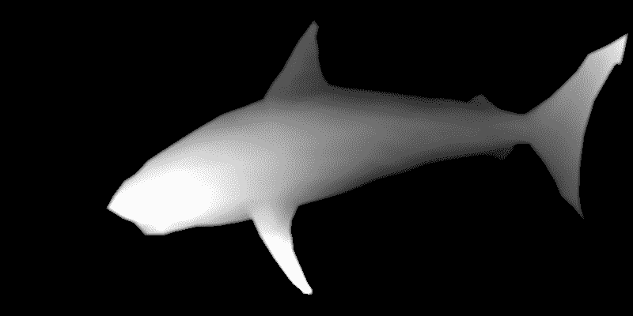
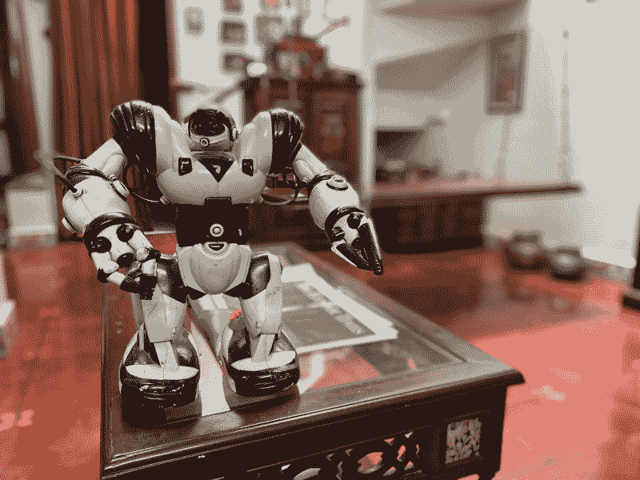
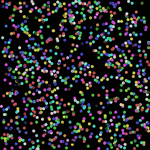

# 8

# 立体自视图

凝视图 8-1 一分钟。你除了随机的点，还能看到其他东西吗？图 8-1 是一个*立体自视图*，一个二维图像，它创造了三维的错觉。立体自视图通常由重复的图案组成，通过仔细观察可以解析出三维效果。如果你看不出任何图像，别担心；我自己也花了一段时间和一些实验才看出来。（如果你在本书中印刷的版本上没有成功，可以尝试本书 GitHub 仓库中的*图像*文件夹中的彩色版本。图注的脚注部分会告诉你应该看到的内容。）

在本项目中，你将使用 Python 来创建立体自视图。以下是本项目中涉及的一些概念：

+   • 线性间距与深度感知

+   • 深度图

+   • 使用`Pillow`创建和编辑图像

+   • 使用`Pillow`绘制图像

图 8-1: 可能会让你困扰的图像 1

你将在本项目中生成的立体自视图是为“壁眼”观看设计的。最好的观看方法是将目光集中在图像后面的某个点（例如墙面）。几乎可以神奇地说，一旦你在图案中感知到某种东西，你的眼睛应该会自动将其聚焦，并且当三维图像“锁定”时，你将很难将其移开。（如果你仍然无法看到图像，可以参见 Gene Levin 的文章《如何查看立体图和观看练习》2 获得帮助。）

## 工作原理

立体自视图开始时是一个具有重复拼接图案的图像。隐藏的三维图像通过改变重复图案之间的线性间距嵌入其中，从而产生深度的错觉。当你观察立体自视图中的重复图案时，大脑会将这些间距解读为深度信息，尤其是当图案间有不同的间距时。

### 在立体自视图中感知深度

当你的眼睛聚焦在图像后面的一个假想点时，大脑将你左眼看到的点与右眼看到的不同点进行匹配，并看到这些点位于图像后面的一个平面上。对这个平面的感知距离取决于图案中的间距。例如，图 8-2 展示了三行*A*。这些*A*在每一行内等距，但从上到下它们的水平间距逐渐增大。

图 8-2: 线性间距与深度感知

当这个图像以“壁眼”方式观看时，图 8-2 中的顶行应该看起来位于纸张的后面，中间的行看起来稍微在第一行之后，而底部的行则显得最远离你的眼睛。标有*浮动文字*的文字应该看起来像是在这些行的上方“漂浮”。

为什么你的大脑会将这些图案之间的间距解读为深度呢？通常，当你看着一个远处的物体时，你的眼睛会共同工作，聚焦并在同一点汇聚，两只眼睛会向内旋转，直接指向物体。但当你以“壁眼”方式观看自立立体图时，聚焦和汇聚发生在不同的地方。你的眼睛聚焦在自立立体图上，但你的大脑看到这些重复的图案来自同一个虚拟（假想的）物体，而你的眼睛则会汇聚到图像后面的一点，如图 8-3 所示。这种聚焦和汇聚的解耦结合使你能够在自立立体图中看到深度。

图 8-3：在自立立体图中看到深度

自立立体图的感知深度取决于像素的水平间距。因为图 8-2 中的第一行像素间距最小，所以它看起来位于其他行的前面。然而，如果图像中的点间距发生变化，你的大脑会将每个点感知为不同的深度，你就能看到一个虚拟的三维图像出现。

### 处理深度图

自立立体图中的隐藏图像来自于*深度图*，这是一种图像，其中每个像素的值代表一个深度值，即从眼睛到该像素所表示物体部分的距离。深度图通常以灰度图像形式显示，靠近的点显示为较亮区域，而远离的点则显示为较暗区域，如图 8-4 所示。

图 8-4：深度图

注意到鲨鱼的鼻子是图像中最亮的部分，看起来离你最近。向尾部的较暗区域则显得最远。（顺便提一下，图 8-4 中的图像就是用来创建图 8-1 中第一个自立立体图的深度图。）

因为深度图表示每个像素到眼睛的深度或距离，所以你可以使用它来获取与图像中像素位置相关的深度值。你知道水平位移在图像中被感知为深度。因此，如果你根据相应像素的深度值成比例地移动图像中的一个像素，你就会为该像素创建一个与深度图一致的深度感知。如果你对所有像素都这样做，你就会把整个深度图编码到图像中，生成一个自动立体图。

深度图为每个像素存储深度值，该值的分辨率取决于表示它的位数。由于本章将使用常见的 8 位图像，深度值的范围是 [0, 255]。

为了这个项目，我已经将几个示例深度图上传到本书的 GitHub 仓库。你可以下载这些图像并将它们作为输入来生成自动立体图。不过，你也可以尝试自己制作深度图，创造一些更精美的图像。你可以采取两种方法：使用 3D 建模软件创建的合成图像，或者使用智能手机相机拍摄的照片。

#### 从 3D 模型创建深度图

如果你使用 Blender 等 3D 计算机图形程序创建了某个物体的 3D 模型，你还可以使用该程序生成该模型的深度图。图 8-5 显示了一个示例。

(a)

(b)

图 8-5：一个 3D 模型 (a) 和其相关的深度图 (b)

图 8-5(a) 显示了使用 Blender 渲染的 3D 模型，图 8-5(b) 显示了从该模型创建的深度图。可以在 YouTube 上搜索 “Blender depth map in 5 minutes!” 查找 Jonty Schmidt 提供的教程 3，学习如何制作该深度图。关键是根据与相机的 Z 距离为图像着色。

#### 从智能手机照片创建深度图

如今，许多智能手机相机都有 *纵向模式*，它在拍摄照片时捕获深度信息，并选择性地模糊背景。如果你能够获取到这些深度数据，你将得到一张照片的深度图，可以用来创建自动立体图！图 8-6 显示了一个示例。

(a)

(b)

图 8-6：iPhone 11 相机拍摄的纵向模式照片 (a) 和深度图 (b)

图 8-6(a) 显示了使用 iPhone 11 拍摄的纵向模式照片，图 8-6(b) 显示了相应的深度图。该深度图是使用开源软件 ExifTool，通过以下命令创建的：

exiftool -b -MPImage2 photo.jpg > depth.jpg

该命令从文件*photo.jpg*的元数据中提取深度信息，并将其保存到文件*depth.jpg*中。从[`exiftool.org`](https://exiftool.org)下载 ExifTool，自己试试看。该命令适用于 iPhone 的照片，但你也可以使用类似的方法从其他类型手机拍摄的图像中提取深度数据。Android 和 iOS 应用商店也有各种应用程序可以帮助你完成这个操作。这里有一个在线深度图提取工具，适用于来自多种手机型号的肖像模式图像：[`www.hasaranga.com/dmap`](http://www.hasaranga.com/dmap/)。

### 移动像素

我们已经了解了大脑如何将图像中重复元素之间的间距感知为深度信息，并且看到深度信息是如何通过深度图传递的。接下来，我们将探讨如何根据深度图中的值来移动平铺图像中的像素。这是创建自动立体图的关键步骤。

平铺图像是通过在 x 和 y 方向上重复一个较小的图像（即瓷砖）来创建的，尽管对于深度感知，我们只关心 x 方向。如果构成图像的瓷砖宽度为*w*像素，那么你知道图像中像素的颜色值将在任何给定行中每隔*w*像素在 x 方向上重复。换句话说，某行中 x 轴位置为*i*的像素颜色可以表示为：

*C*[i] = *C*[i] [−] [w]，当*i* ≥ *w*时

我们来看一个例子。假设瓷砖宽度为 100 像素，对于一个 x 轴位置为 140 的像素，公式告诉我们*C*[140] = *C*[140 − 100] = *C*[40]。这意味着 x 位置为 140 的像素的颜色值与 x 位置为 40 的像素相同，因为图像重复了。（对于公式中*i*小于*w*的情况，颜色就是*C*[i]，因为瓷砖还没有重复。）

目标是根据深度图中的值在平铺图像中移动像素。设δ[i]为深度图中 x 位置*i*的值。相应像素在平铺图像中的移动后的颜色值由下式给出：

以瓷砖宽度为 100 像素为例，假设 x 位置为 140 的像素对应的深度图值为 10，公式表示为*C*[140] = *C*[140 − 100 + 10] = *C*[50]。由于深度图，x 位置为 140 的像素的颜色应该被修改为与位置 50 的像素颜色相同。因为*C*[50]与*C*[150]相同，这实际上是在将 x 位置为 150 的像素向左移动 10 个像素。因此，位置 50 和 150 之间的重复变得更窄了 10 个像素，你的大脑会把这个变化感知为深度信息。

为了创建完整的自动立体图，你将沿着图像的宽度和所有行重复此移动过程。当你查看代码时，将看到如何实现这个移动过程。

## 要求

在本项目中，你将使用`Pillow`来读取图像，访问其底层数据，并创建和修改图像。

## 代码

本项目的代码将按照以下步骤创建一个自动立体图：

1.  1\. 读取一个深度图。

1.  2\. 读取一个瓦片图像或创建一个“随机点”瓦片。这将作为自动立体图重复图案的基础。

1.  3\. 通过重复瓦片来创建新图像。此图像的尺寸应与深度图的尺寸匹配。

1.  4\. 对新图像中的每个像素，根据深度图中对应像素的深度值，将该像素移动一个与深度值成比例的量。

1.  5\. 将结果自动立体图写入文件。

要查看完整项目，请跳转到“完整代码”第 147 页。你还可以从[`github.com/mkvenkit/pp2e/tree/main/autos`](https://github.com/mkvenkit/pp2e/tree/main/autos)下载本章的完整代码列表。

### 从随机圆形创建瓦片

用户可以选择在程序开始时提供一个瓦片图像（我已将基于 M.C. Escher 画作的图像上传到 GitHub 以供使用）。如果没有提供，则使用`createRandomTile()`函数创建一个带有随机圆形的瓦片。

def createRandomTile(dims):

# 创建图像

❶ img = Image.new('RGB', dims)

❷ draw = ImageDraw.Draw(img)

# 将随机圆的半径设置为 1%  

# 宽度或高度，取较小值

❸ r = int(min(*dims)/100)

# 圆的数量

❹ n = 1000

# 绘制随机圆

for i in range(n):

# -r 确保圆形保持在图像内，不会被裁剪

# 在图像的边缘，以便它们在平铺时看起来更好

❺ x, y = random.randint(r, dims[0]-r), random.randint(r, dims[1]-r)

❻ fill = (random.randint(0, 255), random.randint(0, 255),

random.randint(0, 255))

❼ draw.ellipse((x-r, y-r, x+r, y+r), fill)

return img

首先，你创建一个新的 Python 图像库（PIL）`Image`对象，尺寸由`dims` ❶给定。然后，使用`ImageDraw.Draw()` ❷在图像中绘制圆形，半径（`r`）为图像宽度或高度的 1/100，取较小值 ❸。（Python 中的`*`运算符解包`dims`元组中的宽度和高度值，以便它们可以传递给`min()`方法。）

你将绘制的圆的数量设置为`1000`❹，然后通过调用`random.randint()`来计算每个圆的中心的 x 和 y 坐标，以获取[`r`，`width-r`]和[`r`，`height-r`]范围内的随机整数❺。通过将范围偏移`r`，确保生成的圆完全落在瓦片的边界内。如果没有这样做，你可能会在图像的边缘绘制一个圆，这意味着它会部分被截断。如果你将这样的图像拼接起来生成自动立体图，结果看起来不好，因为两个瓦片之间的边缘处的圆没有间距。

接下来，你为每个圆选择一个填充颜色，通过从[`0`，`255`]的范围中随机选择 RGB 值❻。最后，你使用`draw`中的`ellipse()`方法来绘制每个圆❼。该方法的第一个参数是一个元组，定义了圆的边界框，给定的左上角和右下角分别为（`x-r`，`y-r`）和（`x+r`，`y+r`），其中（`x`，`y`）是圆的中心，`r`是圆的半径。另一个参数是随机选择的填充颜色。

你可以在 Python 解释器中按如下方式测试这个方法：

>>> `import autos`

>>> `img = autos.createRandomTile((256, 256))`

>>> `img.save('out.png')`

>>> `exit()`

图 8-7 显示了测试的输出。

图 8-7：`createRandomTile()`的示例运行

如图 8-7 所示，你已经创建了一个带有随机点的图像，可以用作自动立体图的瓦片模式。

### 重复给定的瓦片

现在你有了一个可用的瓦片，可以通过重复这个瓦片来创建图像。这将构成你自动立体图的基础。定义一个`createTiledImage()`函数来完成这项工作。

def createTiledImage(tile, dims):

# 创建新的图像

❶ img = Image.new('RGB', dims)

W, H = dims

w, h = tile.size

# 计算所需瓦片的数量

❷ cols = int(W/w) + 1

❸ rows = int(H/h) + 1

# 将瓦片粘贴到图像中

for i in range(rows):

for j in range(cols):

❹ img.paste(tile, (j*w, i*h))

# 输出图像

return img

该函数接收一张将作为瓷砖图案（`tile`）的图像和期望的输出图像尺寸（`dims`）。尺寸以元组的形式给出，格式为（`宽度`，`高度`）。你使用提供的尺寸❶创建一个新的`Image`对象。接下来，存储单个瓷砖和整个图像的宽度和高度。将整个图像的尺寸除以瓷砖的尺寸，得到图像中所需的列数❷和行数❸。为了确保当输出图像的尺寸不是瓷砖尺寸的整数倍时，右侧的最后一列瓷砖和底部的最后一行瓷砖不会被遗漏，你要在每次计算时加 1。如果没有这个预防措施，图像的右边和底部可能会被截断。最后，你循环遍历行和列并填充瓷砖❹。通过乘以`(j*w, i*h)`来确定瓷砖左上角的位置，这样它就能与行和列对齐，就像你在照片拼贴项目中所做的那样。一旦完成，函数将返回一个指定尺寸的`Image`对象，并用输入的图像`tile`进行拼接。

### 创建自动立体图

现在，让我们创建一些自动立体图。`createAutostereogram()`函数完成了大部分工作。它是这样的：

def createAutostereogram(dmap, tile):

# 如果需要，将深度图转换为单通道

❶ if dmap.mode != 'L':

dmap = dmap.convert('L')

# 如果没有为瓷砖指定图像，则创建一个随机圆圈瓷砖

❷ if not tile:

tile = createRandomTile((100, 100))

# 通过拼接创建图像

❸ img = createTiledImage(tile, dmap.size)

# 使用深度图值创建一个偏移图像

❹ sImg = img.copy()

# 首先加载 Image 对象以访问图像像素

❺ pixD = dmap.load()

pixS = sImg.load()

# 根据深度图水平移动像素

❻ cols, rows = sImg.size

for j in range(rows):

for i in range(cols):

❼ xshift = pixD[i, j]/10

❽ xpos = i - tile.size[0] + xshift

❾ if xpos > 0 and xpos < cols:

❿ pixS[i, j] = pixS[xpos, j]

# 显示偏移图像

return sImg

首先，如果需要，你将提供的深度图（`dmap`）转换为单通道灰度图像❶。如果用户没有提供瓷砖图像，那么你将使用之前定义的`createRandomTile()`函数创建一个随机圆圈的瓷砖❷。接下来，你使用`createTiledImage()`函数创建一个与提供的深度图像大小相匹配的拼接图像❸。然后，你将这个拼接图像做一个副本❹。这个副本将成为最终的自动立体图。

函数继续使用`Image.load()`方法加载深度图和输出图像❺。该方法将图像数据加载到内存中，使你能够将图像像素作为二维数组`[i, j]`来访问。你将图像尺寸存储为行数和列数❻，将图像视为由单个像素组成的网格。

自动立体图生成算法的核心在于根据从深度图中获取的信息，将图像中的像素进行偏移。为此，您需要遍历图像中的每个像素，并处理每个像素。首先，您查找深度图中对应像素的值，并将该值除以 10，以确定图像的偏移值 ❼。之所以除以 10，是因为这里使用的是 8 位深度图，这意味着深度值在 0 到 255 之间。如果将这些值除以 10，您将得到一个大约在 0 到 25 之间的深度值。由于深度图输入图像的尺寸通常在数百像素，因此这些偏移值是有效的。（通过更改除数的值来试试，看看它如何影响最终图像。）

接下来，您使用在“像素偏移”一文中讨论的公式，在第 140 页上计算 x 轴坐标，以寻找像素的新颜色值 ❽。深度图值为 0（黑色）的像素不会被偏移，并将被视为背景。检查确保您没有尝试访问图像外部的像素（由于偏移，图像的边缘可能会发生这种情况）❾，然后用偏移后的值替换每个像素 ❿。

### 提供命令行选项

程序的 `main()` 函数提供了一些命令行选项，用于自定义自动立体图。

def main():

# 创建一个解析器

parser = argparse.ArgumentParser(description="自动立体图...")

# 添加期望的参数

❶ parser.add_argument('--depth', dest='dmFile', required=True)

parser.add_argument('--tile', dest='tileFile', required=False)

parser.add_argument('--out', dest='outFile', required=False)

# 解析参数

args = parser.parse_args()

# 设置输出文件

outFile = 'as.png'

if args.outFile:

outFile = args.outFile

# 设置图块

tileFile = False

if args.tileFile:

tileFile = Image.open(args.tileFile)

与以前的项目一样，您使用 `argparse` 来定义程序的命令行选项。唯一必需的参数是深度图文件的名称 ❶。还有两个可选参数，一个是提供用作图块模式的图像文件，另一个是设置输出文件的名称。如果未指定图块图像，程序将生成一个随机圆形图块。如果未指定输出文件名，自动立体图将被写入名为 *as.png* 的文件。

## 运行自动立体图生成器

现在让我们使用一个凳子的深度图（*stool-depth.png*），该文件可以在本项目 GitHub 仓库的 *data* 文件夹中找到：

$ `python autos.py --depth data/stool-depth.png`

图 8-8 显示了左侧的深度图像和右侧生成的自动立体图。由于您没有提供瓷砖图形，因此这个自动立体图是通过随机瓷砖生成的。

图 8-8：*autos.py* 的一个示例运行

现在让我们输入一个瓷砖图像。像之前那样使用 *stool-depth.png* 深度图，但这次提供 *escher-tile.jpg* 作为瓷砖图像。

$ `python autos.py --depth data/stool-depth.png –-tile data/escher-tile.jpg`

图 8-9 显示了输出结果。

图 8-9：使用瓷砖的 *autos.py* 示例运行

享受使用我在 GitHub 上提供的图像，或者使用你自己的深度图创建摩尔纹自动立体图！

## 总结

在这个项目中，你学习了如何创建自动立体图。给定一个深度图像，你现在可以创建一个随机点的自动立体图，或者使用你提供的图像拼贴成的自动立体图。

## 实验！

这里有一些方法可以进一步探索自动立体图：

1.  1\. 编写代码创建类似于 图 8-2 的图像，展示图像中线性间距变化如何产生深度错觉。（提示：使用图像瓷砖和 `Image.paste()` 方法。）

1.  2\. 向程序添加一个命令行选项，用于指定应用于深度图值的比例。（记住代码将深度图值除以 10。）改变该值如何影响自动立体图？

## 完整代码

这是完整的自动立体图项目代码：

"""

autos.py

一个生成自动立体图的程序。

作者：Mahesh Venkitachalam

"""

import sys, random, argparse

from PIL import Image, ImageDraw

# 创建间距/深度示例

def createSpacingDepthExample():

tiles = [Image.open('test/a.png'), Image.open('test/b.png'),

Image.open('test/c.png')]

img = Image.new('RGB', (600, 400), (0, 0, 0))

spacing = [10, 20, 40]

for j, tile in enumerate(tiles):

for i in range(8):

img.paste(tile, (10 + i*(100 + j*10), 10 + j*100))

img.save('sdepth.png')

# 创建充满随机点的图像

def createRandomTile(dims):

# 创建图像

img = Image.new('RGB', dims)

draw = ImageDraw.Draw(img)

# 计算半径 - 最小尺寸的百分比

r = int(min(*dims)/100)

# 点的数量

n = 1000

# 绘制随机圆形

for i in range(n):

# -r 用于确保圆形保持在内部 - 更适合拼贴

x, y = random.randint(r, dims[0]-r), random.randint(r, dims[1]-r)

fill = (random.randint(0, 255), random.randint(0, 255),

random.randint(0, 255))

draw.ellipse((x-r, y-r, x+r, y+r), fill)

# 返回图像

return img

# 创建一个更大的图像，尺寸为 dims，通过拼贴给定的图像

def createTiledImage(tile, dims):

# 创建输出图像

img = Image.new('RGB', dims)

W, H = dims

w, h = tile.size

# 计算所需拼接块数量

cols = int(W/w) + 1  

rows = int(H/h) + 1  

# 粘贴拼接块  

对于 i 在 range(rows) 中：  

对于 j 在 range(cols) 中：  

img.paste(tile, (j*w, i*h))  

# 输出图像  

返回 img  

# 创建一个用于测试的深度图：  

def createDepthMap(dims)：  

dmap = Image.new('L', dims)  

dmap.paste(10, (200, 25, 300, 125))  

dmap.paste(30, (200, 150, 300, 250))  

dmap.paste(20, (200, 275, 300, 375))  

返回 dmap  

# 给定一个深度图（图像）和一个输入图像，创建一个新图像  

# 根据深度移动像素  

def createDepthShiftedImage(dmap, img)：  

# 大小检查  

assert dmap.size == img.size  

# 创建移动后的图像  

sImg = img.copy()  

# 获取像素访问权限  

pixD = dmap.load()  

pixS = sImg.load()  

# 根据深度图移动像素输出  

cols, rows = sImg.size  

对于 j 在 range(rows) 中：  

对于 i 在 range(cols) 中：  

xshift = pixD[i, j]/10  

xpos = i - 140 + xshift  

如果 xpos > 0 且 xpos < cols：  

pixS[i, j] = pixS[xpos, j]  

# 返回移动后的图像  

返回 sImg  

# 给定一个深度图（图像）和一个输入图像，创建一个新图像  

# 根据深度移动像素  

def createAutostereogram(dmap, tile)：  

# 如果需要，转换深度图为单通道  

如果 dmap.mode ！= 'L'：  

dmap = dmap.convert('L')  

# 如果没有指定 tile，则使用随机图像  

如果没有 tile：  

tile = createRandomTile((100, 100))  

# 通过拼接创建图像  

img = createTiledImage(tile, dmap.size)  

# 创建移动后的图像  

sImg = img.copy()  

# 获取像素访问权限  

pixD = dmap.load()  

pixS = sImg.load()  

# 根据深度图移动像素输出  

cols, rows = sImg.size  

对于 j 在 range(rows) 中：  

对于 i 在 range(cols) 中：  

xshift = pixD[i, j]/10  

xpos = i - tile.size[0] + xshift  

如果 xpos > 0 且 xpos < cols：  

pixS[i, j] = pixS[xpos, j]  

# 返回移动后的图像  

返回 sImg  

# main() 函数  

def main()：  

# 如果需要，使用 sys.argv  

print('正在创建自立体图像...')  

# 创建解析器  

parser = argparse.ArgumentParser(description="自立体图像...")  

# 添加预期的参数  

parser.add_argument('--depth', dest='dmFile', required=True)  

parser.add_argument('--tile', dest='tileFile', required=False)  

parser.add_argument('--out', dest='outFile', required=False)  

# 解析参数  

args = parser.parse_args()  

# 设置输出文件  

outFile = 'as.png'  

如果 args.outFile：  

outFile = args.outFile  

# 设置 tile  

tileFile = False  

如果 args.tileFile：  

tileFile = Image.open(args.tileFile)  

# 打开深度图  

dmImg = Image.open(args.dmFile)  

# 创建立体图像  

asImg = createAutostereogram(dmImg, tileFile)  

# 写入输出  

asImg.save(outFile)  

# 调用 main  

如果 __name__ == '__main__'：  

main()  

1 隐藏的图像是一只鲨鱼。  

2 [`colorstereo.com/texts_.txt/practice.htm`](http://colorstereo.com/texts_.txt/practice.htm)  

3 [`www.youtube.com/watch?v=oqpDqKpOChE`](https://www.youtube.com/watch?v=oqpDqKpOChE)  
