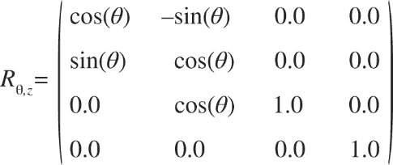
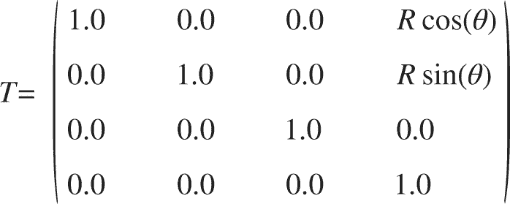
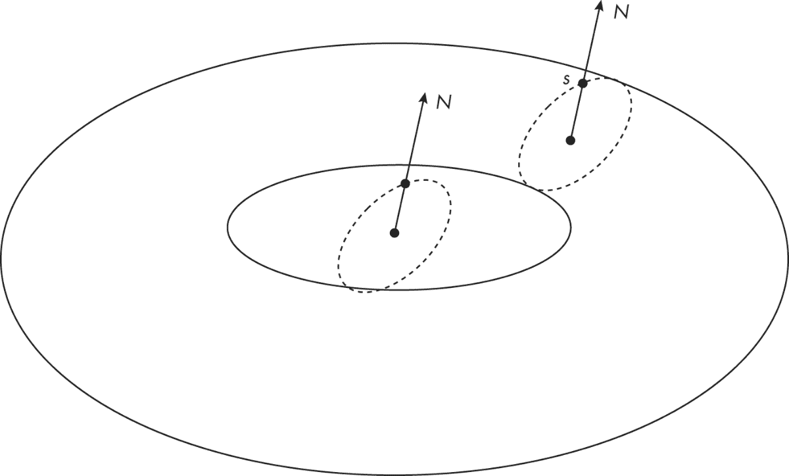
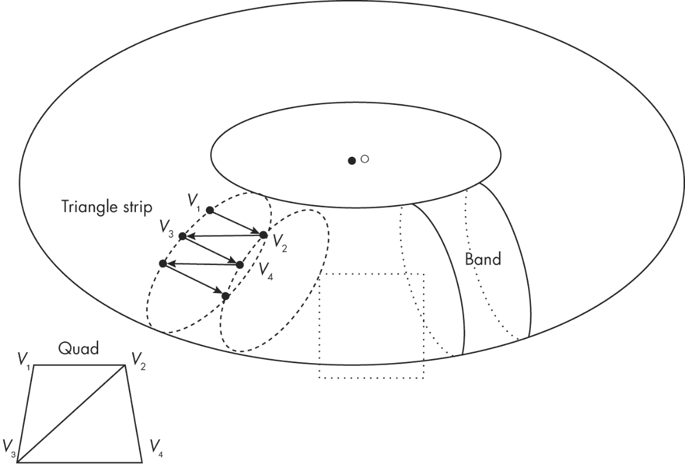
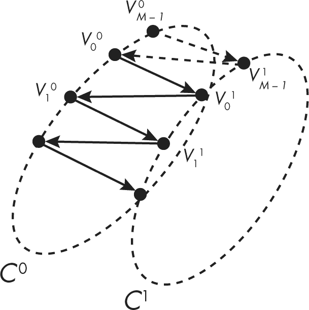
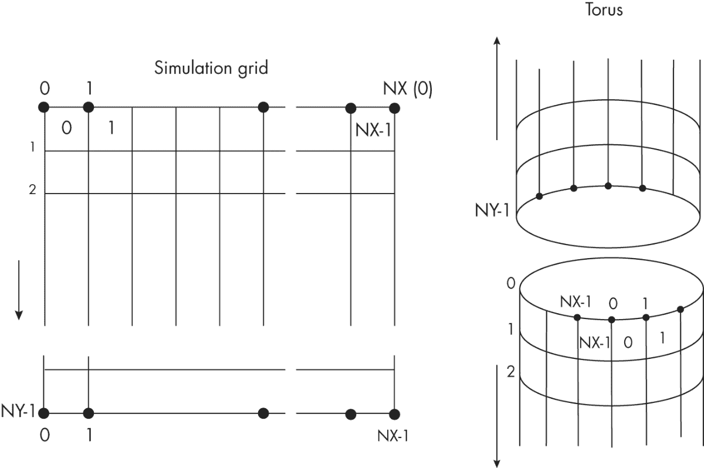
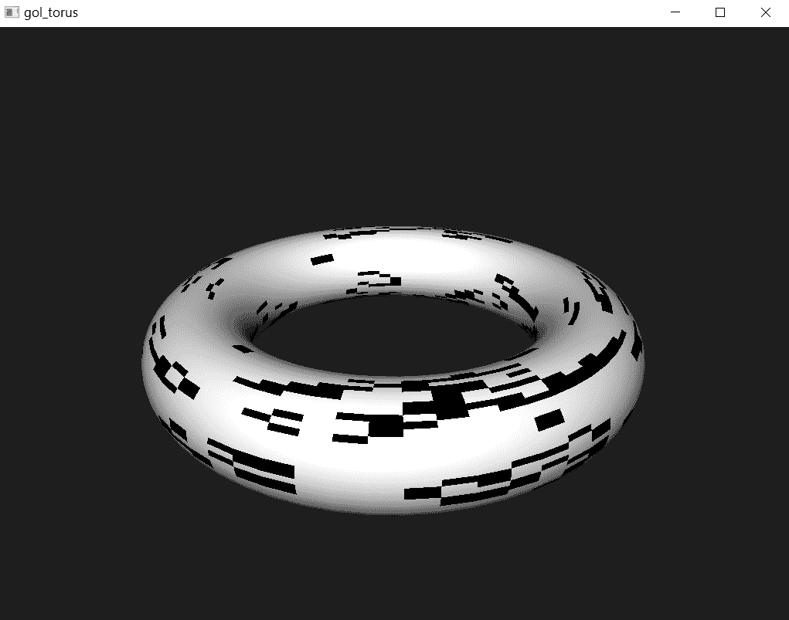

# 10

# 环面上的康威生命游戏

在第三章中，我们使用 Python 和 `matplotlib` 库实现了康威的生命游戏。你可能还记得那个项目中的一个有趣之处：它使用了环面边界条件。图 3-2 在第 48 页上展示了我们如何有效地将二维平面网格视为三维环面表面，正是因为边界条件将边缘连接在一起。在上一章，你已经接触到 OpenGL，并学习了如何渲染三维物体。现在，让我们将你在生命游戏和 OpenGL 中的经验结合起来，在一个真实的环面上重新创建康威的三维模拟。

在这个项目中，你将首先计算一个环面（torus）的三维几何形状。然后，你将以一种便于在 OpenGL 中绘制和上色的方式排列环面的顶点。你还将设置一个旋转相机，以从各个角度查看环面，并在着色器中实现一些基本的光照。最后，你将从第三章中改编“生命游戏”代码，以在环面上给网格上色。随着模拟的进行，你将看到生命游戏在环面表面上栩栩如生！

下面是本项目中涉及的主要内容：

+   • 使用矩阵数学构建环面的三维几何形状

+   • 为环面上的生命游戏网格实现着色方案

+   • 在 OpenGL 中实现旋转相机

+   • 在 OpenGL 中实现简单的光照

## 它是如何工作的

在开始编写代码之前，让我们先考虑如何使用 OpenGL 渲染、照明和查看一个三维环面。一切从计算构成环面的顶点开始。

### 计算顶点

环面本质上是由多个圆形或环形组成，这些环形围绕一个中心点排列。然而，你不能直接在 OpenGL 中绘制圆形；它们需要被*离散化*，即通过一系列由直线连接的顶点来表示。图 10-1 中的简化模型展示了如何将环面定义为一组顶点。

图 10-1：环面渲染模型。左侧是简化的环面，右侧是构成环面的单个“环”。

图 10-1 的右侧显示了一个半径为*r*的环，离散化后有*M* = 5 个点。左侧的图 10-1 展示了一个简单的环面，其大半径*R*通过将*N* = 6 个这样的离散化环（标记为 0 到 5）围绕中心点排列来建模。（*大半径*是指环面孔的中心到外环中心的距离。）不要担心图中环面的块状特征，随着*N*和*M*值的增加，图形会变得更光滑。

通过绘制带状物连接相邻的环面，你将使用`GL_TRIANGLE_STRIP`原语来绘制这些带状物，游戏生命模拟中的每个单元格将由带状物上的两个相邻三角形组成，这两个三角形共同形成一个*四边形*。当单元格处于开启状态时，你将把它的四边形涂成黑色，当单元格处于关闭状态时，你将把它涂成白色。

要计算环面的顶点，首先需要为其定义一个坐标系。假设环面位于 XY 平面上，且中心在原点，环面中心的直线与 z 轴对齐，如图 10-2 所示。

图 10-2：环面的渲染策略

在环面上，位于相对于 x 轴角度θ的圆*C*[3]的顶点可以按以下方式计算：

1.  1\. 计算位于 XZ 平面上、原点为中心的半径为*r*的圆*C*[1]的顶点。

1.  2\. 将圆*C*[1]围绕 z 轴旋转角度θ，这样你就得到了圆*C*[2]。

1.  3\. 将圆*C*[2]按*R*的量沿角度θ平移，得到正确位置上的圆*C*[3]，从而确定环面上的圆。

你可能还记得在第二章的螺旋图项目中使用了参数方程来定义一个圆。在这里，我们将使用相同的概念。标记为圆*C*[1]的顶点，半径为*r*，位于以原点为中心的 XZ 平面上，给出如下：

*P* = (*r* cos(α), 0, *r* sin(α))

这里，α是点*P*相对于 x 轴的角度。当α从 0 变化到 360 度（或 2π弧度）时，*P*点会形成一个圆。注意，在上述方程中，点的 y 坐标为零。这是可以预期的，因为圆位于 XZ 平面上。

现在，你必须围绕 z 轴将点旋转角度θ。该操作的旋转矩阵如下：

一旦旋转了这些点，你需要将它们平移到正确的位置。可以使用以下平移矩阵来完成此操作。（此格式在第九章中已有讨论。）

因此，环面上变换后的点由以下公式给出：

*P*ʹ = *T* × *R* [θ,Z] × *P*

这与以下内容相同：

在前面的公式中，*P*首先乘以旋转矩阵，使其正确对齐，然后再乘以平移矩阵，将点“推”到圆环的正确位置。请注意，*P*以*齐次*坐标（*x*，*y*，*z*，1.0）表示，这在前一章中讨论过。

### 计算光照的法线

为了让圆环看起来更好，你需要对几何体应用光照，这意味着你需要计算前一部分中计算的点*P*的*法线向量*。表面的光照取决于表面与入射光的方向，而方向可以通过法线向量来量化，法线向量是某一点上垂直于表面的向量。请查看图 10-3 来查看一个示例。

图 10-3：计算法线向量

由于圆环的几何形状，环上点*s*的法线向量与连接点*s*与环中心的直线方向相同。这意味着法线向量与旋转后的点相同。平移不影响法线方向，因此不需要考虑。你可以按照以下步骤计算法线：

*N* = *R*[θ,Z] × *P*

注意，在进行任何光照计算之前，你需要先*归一化*法线向量。你可以通过将法线除以其大小来实现这一点。

实际的光照将来自一个固定位置的单一光源。这个光源将在顶点着色器中定义。

### 渲染

现在你已经有了圆环的顶点和法线，让我们来讨论如何使用 OpenGL 渲染它。你首先需要将其分割成带状区域，如图 10-4 所示。每个带状区域是圆环上两个相邻环之间的区域。

图 10-4：使用三角带渲染圆环

每个带状区域使用 OpenGL 作为`GL_TRIANGLE_STRIP`原语进行渲染。除了构成圆环的基本结构外，这些三角带还为创建生命游戏模拟网格提供了一种方便的方法：网格中的每个单元格由带中的两个相邻三角形组成的四边形表示。图 10-5 展示了圆环中某一带的特写。

图 10-5：从三角带渲染带状区域

带状区域由相邻的环*C*⁰和*C*¹组成。每个环有*M*个顶点。组成带状区域的三角带由*M*对顶点构成，这些顶点在环之间来回“之”字形摆动：

但是你需要再添加一对顶点：。你需要重复前两个顶点，以封闭带状部分末端的间隙。因此，形成该带的三角形带中的总顶点数为 2 × *M* + 2。

如图 10-5 所示，带状结构由环组成 。该环面被分为*N*个带状部分，其中*N*是环的数量：

注意最后一个带状部分如何通过回到第一个环 *C*⁰ 来封闭。这意味着渲染环面的总顶点数由 *N* × (2 × *M* + 2) 给出。你将在查看代码时看到实现的更多细节。

现在让我们看看环面的上色方案。

### 为三角形带上色

你需要单独为《生命游戏》仿真中的每个单元上色。你知道每个单元是一个四边形——由两个三角形组成，构成一个更大的三角形带。举个例子，顶点组成的四边形  由两个三角形组成： 和 。每个顶点都有一个与之对应的颜色，该颜色为一个三元组，形式为 (*r*, *g*, *b*)，表示颜色的红、绿、蓝分量。默认情况下，四边形中第一个顶点的颜色（在此情况下为 ）设置四边形第一个三角形的颜色，第二个顶点的颜色（）设置第二个三角形的颜色。只要你将这两种颜色设置为相同，就能使四边形上色均匀。我们将在查看代码时进一步讨论 OpenGL 的顶点颜色约定。

注意 OpenGL 函数 `glProvokingVertex()` 会改变哪个颜色值被映射到顶点的约定。

### 控制相机

为了查看环面，你将创建一个围绕 3D 场景原点旋转的相机，并从上方以一定角度俯视。图 10-6 展示了相机的设置。

图 10-6：实现旋转相机

将相机看作是代表点*E*，它放置在一个半径为*R*，离原点高度为*H*的圆柱体上。相机指向原点*O*。相机由相互垂直的向量*V*、*U*和*N*定义，其中*V*是从*E*指向*O*的*视线向量*；*U*是*向上向量*，表示相机的上方方向；*N*是与*V*和*U*都垂直的向量。每个时间步长中，你沿着圆柱体的边缘移动相机一个恒定的距离。这个移动由角度β来参数化，如图 10-6 所示。如第九章中所学，你使用`lookAt()`方法来设置视图，它需要三个参数：眼睛、中心和上向量。中心就是原点：(0, 0, 0)。眼睛的三维坐标如下：

*E* = (*R* cos(β), *R* sin(β), *H*)

当相机沿圆柱体的边缘移动时，它将始终保持朝向*O*，而上向量*U*也会不断变化。为了计算上向量*U*，首先从一个与 z 轴平行的初始猜测*U*ʹ开始。然后找到*N*，即垂直于由*U*ʹ和*V*所定义的平面的向量。它可以通过以下方式计算：

*N* = *V* × *U*ʹ

*N*由*V*和*U*ʹ的叉积给出。那么，如果你计算*N*和*V*的叉积会发生什么呢？你会得到一个垂直于 NV 平面的向量，这就是你所需要的上向量*U*！

*U* = *N* × *V* = (*V* × *U*ʹ) × *V*

一旦计算出*U*，确保在使用之前对其进行归一化处理。完成这一步后，你就可以用`lookAt()`方法来设置相机：*E*（眼睛）、*O*（中心）和*U*（上向量）。

### 将网格映射到环面

最后，让我们来看一下二维《生命游戏》仿真网格如何因网格的环面边界条件而映射到三维环面。图 10-7 展示了这个映射。

图 10-7：将仿真网格映射到环面

二维《生命游戏》网格有*NX*列和*NY*行。你可以在图的右侧看到，分隔每一行的*NX*个点是如何围绕环形管道缠绕的。点的索引从 0 到*NX* − 1。下一个索引，*NX*，因为缠绕的缘故与 0 相同。y 方向也会发生类似的缠绕，你有*NY*个单元格：索引为*NY*的点与索引为 0 的点相同。

你之前看到每个环面中的每个环是如何离散化的，拥有*M*个点。从二维网格到环面的转换，可以设置*NX* = *M*。类似地，设置*NY* = *N*，其中*N*是环面上的带数。

## 需求

我们将使用`PyOpenGL`和 GLFW 进行 OpenGL 渲染，如第九章所示，并使用`numpy`进行矩阵/向量计算。

## 代码

本项目的代码被组织在多个文件中：

torus.py 该文件包含环面的几何计算和渲染代码。

gol.py 该文件实现了康威的生命游戏，改编自第三章。

camera.py 该文件包含实现旋转相机的代码，用于查看环面。

gol_torus.py 这是主文件，设置了 OpenGL 和 GLFW，并从其他模块调用渲染代码。

完整的项目代码可以在[`github.com/mkvenkit/pp2e/blob/main/gol_torus`](https://github.com/mkvenkit/pp2e/blob/main/gol_torus)在线获取。

### 渲染环面

我们首先考虑渲染环面的代码，该代码封装在一个名为`Torus`的类中，定义在文件*torus.py*中。要查看完整的代码列表，请跳至“完整的环面渲染代码”，位于第 203 页。

#### 定义着色器

首先，定义环面的 GLSL 着色器。这里是顶点着色器，它获取每个顶点的位置信息、颜色和法向量，并计算出传递给片段着色器的变换输入：

strVS = """

# version 410 core

layout(location = 0) 输入 vec3 aVert;

layout(location = 1) 输入 vec3 aColor;

layout(location = 2) 输入 vec3 aNormal;

uniform mat4 uMVMatrix;

uniform mat4 uPMatrix;

❶ flat 输出 vec3 vColor;

❷ 输出 vec3 vNormal;

❸ 输出 vec3 fragPos;

void main() {

// 转换顶点

gl_Position = uPMatrix * uMVMatrix * vec4(aVert, 1.0);

❹ fragPos = aVert;

vColor = aColor;

vNormal = aNormal;

}

"""

你将顶点着色器代码定义为一个存储在`strVS`中的字符串。着色器的属性变量有`aVert`、`aColor`和`aNormal`，分别表示每个顶点的坐标、颜色和法向量。注意，在初始化`vColor`时使用了`flat`限定符，它是顶点着色器的一个输出❶，表示该变量在片段着色器中不会被插值。实际上，我们是在说，这个变量将在整个图元（一个三角形带中的三角形）中保持不变。这确保了每个“生命游戏”单元格都将具有单一的颜色。这种在图元中的着色方式称为*平面着色*。下一个顶点着色器的输出是`vNormal` ❷，它默认会在片段着色器中插值。你需要这个变量来计算图元上的光照，稍后你会看到如何修改这个着色器代码来支持平面着色。另一个输出叫做`fragPos` ❸。在主着色器代码中，你将这个输出设置为`aVert` ❹，以便将其传递到片段着色器进行光照计算。着色器还计算`gl_Position`，并将颜色和法向数据按接收到的方式传递给片段着色器。

这是片段着色器，它应用光照并计算片段的最终颜色。它被定义为另一个字符串，名为`strFS`。

strFS = """

# version 410 core

flat in vec3 vColor;

in vec3 vNormal;

in vec3 fragPos;

out vec4 fragColor;

void main() {

❶ vec3 lightPos = vec3(10.0, 10.0, 10.0);

❷ vec3 lightColor = vec3(1.0, 1.0, 1.0);

❸ vec3 lightDir = normalize(lightPos - fragPos);

float diff = max(dot(vNormal, lightDir), 0.0);

vec3 diffuse = diff * lightColor;

float ambient = 0.1;

❹ vec3 result = (ambient + diffuse) * vColor.xyz;

fragColor = vec4(result, 1.0);

}

"""

注意，颜色、法向量和片段位置变量，这些是顶点着色器的输出，现在是片段着色器的输入。在主着色器代码中，你定义了一个光源的位置❶和颜色❷。然后计算光照方向❸。最终的颜色❹是光源的环境光和漫反射光分量的混合，并作为片段着色器的输出设置。

请记住，`fragPos`和`vNormal`是通过插值为每个片段计算出来的，而`vColor`对于给定的图元来说是常量。最终的效果是，图元的内在颜色（在此为三角形带）保持不变，而根据图元与光源的相对位置，感知到的颜色会有所变化。这正是你需要的，以便将每个“生命游戏”单元格设置为一种纯色，同时通过变化该颜色来创建光照效果。

#### 初始化 Torus 类

现在让我们来看一下`Torus`类构造函数中的初始化代码：

类 Torus:

""" OpenGL 3D 场景类"""

# 初始化

❶ def __init__(self, R, r, NX, NY):

global strVS, strFS

# 修改着色器以支持平面着色

# 创建着色器

❷ self.program = glutils.loadShaders(strVS, strFS)

glProvokingVertex(GL_FIRST_VERTEX_CONVENTION)

self.pMatrixUniform = glGetUniformLocation(self.program,

b'uPMatrix')

self.mvMatrixUniform = glGetUniformLocation(self.program,

b'uMVMatrix')

# 圆环几何

self.R = R

self.r = r

# 网格大小

self.NX = NX

self.NY = NY

# 点的数量

❸ self.N = self.NX

self.M = self.NY

# 时间

self.t = 0

# 计算 glMultiDrawArrays 的参数

M1 = 2*self.M + 2

❹ self.first_indices = [2*M1*i for i in range(self.N)]

self.counts = [2*M1 for i in range(self.N)]

# 颜色：{(i, j) : (r, g, b)}

# 包含 NX * NY 个条目

❺ self.colors_dict = self.init_colors(self.NX, self.NY)

# 创建一个空数组以保存颜色

❻ self.colors = np.zeros((3*self.N*(2*self.M + 2), ), np.float32)

# 获取顶点、法线、索引

❼ vertices, normals = self.compute_vertices()

❽ self.compute_colors()

# 设置顶点缓冲对象

❾ self.setup_vao(vertices, normals, self.colors)

`Torus` 类的构造函数包含以下参数 ❶：圆环外半径 `R`，圆环管道半径 `r`，以及用于表示“生命游戏”模拟单元格数目的 `NX` 和 `NY`，分别对应 x 轴和 y 轴的方向。构造函数的第一步是加载着色器。你将使用在公共的 *glutils.py* 文件中定义的 `loadShaders()` 方法 ❷。接下来，你将传递给 `Torus` 构造函数的变量存储在实例变量中，例如 `self.R`，以便在其他方法中访问。然后，你将 `N`（圆环外圈上的点的数量）设置为 `NX`，即 x 方向上的单元格数量 ❸。类似地，你将 `M`（圆环小半径 `r` 上的点的数量）设置为 `NY`。这一方案在 “将网格映射到圆环” 章节中有讨论。

接下来，你为渲染将形成圆环外带的三角形条带做一些额外准备。你最终将使用 `glMultiDrawArrays()` OpenGL 方法一次性渲染所有三角形条带。该方法是一种高效的方式，通过一次函数调用绘制多个三角形条带原语。如同你在 “渲染” 章节中看到的，每个三角形条带包含 2*M* + 2 个顶点，而你有 *N* 条这样的条带。因此，这些三角形条带的起始索引将是 [0, (2*M* + 2), (2*M* + 2) × 2, . . . , (2*M* + 2) × *N*]。因此，你设置了 `first_indices` 和 `counts` ❹，这些将是调用 `glMultiDrawArrays()` 时需要的参数。

`init_colors()` 方法 ❺ 初始化了 `color_dict`，它将每个网格单元映射到一个颜色——黑色或白色。我们很快会详细查看 `init_colors()` 方法。你首先将 `numpy` 数组 `colors` 初始化为零 ❻，然后会用正确的值填充这个数组。最后，你通过计算环形体的顶点和法线 ❼，以及颜色 ❽，并设置渲染环形体的顶点数组对象（VAO） ❾ 来结束构造函数。

现在让我们看看刚才提到的 `Torus` 类中的 `init_colors()` 方法：

def init_colors(self, NX, NY):

"""初始化颜色字典"""

colors = {}

c1 = [1.0, 1.0, 1.0]

for i in range(NX):

for j in range(NY):

❶ colors[(i, j)] = c1

return colors

`init_colors()` 方法创建了一个名为 `colors` 的字典，映射从模拟单元格的索引（*i*, *j*）到应该应用于该单元格的颜色。开始时，你只需将所有单元格的颜色值设置为 `c1`，即纯白色 ❶。随着生命游戏模拟的展开，这个字典中的值将被更新，用于开启或关闭单元格。

#### 计算顶点

接下来我们将考虑的几个方法一起工作，用于计算所有的环形体顶点。我们从`compute_vertices()`方法开始：

def compute_vertices(self):

R, r, N, M = self.R, self.r, self.N, self.M

# 创建一个空数组来存储顶点/法线

vertices = []

normals = []

for i in range(N):

# 对于环上的所有 M 个点

for j in range(M+1):

# 计算点的角度 theta

❶ theta = (j % M) *2*math.pi/M

#---环 #1------

# 计算角度

❷ alpha1 = i*2*math.pi/N

# 计算变换

❸ RM1, TM1 = self.compute_rt(R, alpha1)

# 计算点

❹ Pt1, NV1 = self.compute_pt(r, theta, RM1, TM1)

#---环 #2------

# 下一个环的索引

❺ ip1 = (i + 1) % N

# 计算角度

❻ alpha2 = ip1*2*math.pi/N

# 计算变换

RM2, TM2 = self.compute_rt(R, alpha2)

# 计算点

Pt2, NV2 = self.compute_pt(r, theta, RM2, TM2)

# 按照正确的顺序存储顶点/法线以便用于 GL_TRIANGLE_STRIP

❼ vertices.append(Pt1[0:3])

vertices.append(Pt2[0:3])

# 添加法线

normals.append(NV1[0:3])

normals.append(NV2[0:3])

# 返回正确格式的顶点和颜色

❽ vertices = np.array(vertices, np.float32).reshape(-1)

normals = np.array(normals, np.float32).reshape(-1)

# print(vertices.shape)

return vertices, normals

`compute_vertices()`方法首先创建空列表来存储顶点和法线。然后，你使用嵌套循环计算圆环的顶点和法线，使用我们在“渲染”部分讨论的策略。外层循环遍历组成圆环的`N`个环。内层循环遍历每个环上的`M`个点。在循环中，你首先计算在索引`j` ❶处，环上某点所对的角度`theta`。你使用`j % M`，并让内层循环遍历范围`[0, M+1)`，这样当*j*等于`M`时，`(j % M)`会回到`0`。这是为了完成圆环的最后一个段。

圆环被渲染为一组带状带（三角形条带），每个带状带由两个相邻的点环组成。你计算`alpha1`，即在索引`i` ❷处，第一个带状带中第一个环所对的角度，并利用`alpha1`通过`compute_rt()`方法 ❸计算该第一个环的旋转和平移矩阵。然后，将这些矩阵传递给`compute_pt()`方法，以计算在角度`theta` ❹处环上的顶点和法线。我们稍后将讨论`compute_rt()`和`compute_pt()`方法的工作原理。

接下来，你转到索引`i+1`处的相邻环，使用`ip1 = (i+1) % N`来确保在结束时回到零 ❺。你计算索引`ip1`处环的角度`alpha2` ❻，然后像计算第一个环一样，计算`ip1`环上在角度`theta`处的顶点和法线。

从❼开始，你将相邻环的顶点和法线添加到方法开始时创建的列表中。你只选择每个顶点和法线的前三个坐标，如`Pt1[0:3]`，因为所有的矩阵变换都是用齐次坐标形式（*x*, *y*, *z*, *w*）进行的，而你只需要(*x*, *y*, *z*)。这个操作将顶点和法线以三元组的形式`[[x1, y1, z1], [x2, y2, z2], ...]`存储在 Python 列表中。然而，OpenGL 期望顶点属性以已知大小的扁平数组提供。因此，你将`vertices`和`normals`列表转换为 32 位浮点的`numpy`数组 ❽，并使用`reshape(-1)`确保它们是扁平数组，形式为`[x1, y1, z1, x2, y2, z2, ...]`。

现在让我们来看一下`compute_rt()`和`compute_pt()`方法，它们帮助你计算顶点和法线。我们从`compute_rt()`开始，它计算渲染圆环所需的旋转和平移矩阵：

def compute_rt(self, R, alpha):

# 计算环的位置

❶ Tx = R*math.cos(alpha)

Ty = R*math.sin(alpha)

Tz = 0.0

# 旋转矩阵

❷ RM = np.array([

[math.cos(alpha), -math.sin(alpha), 0.0, 0.0],

[math.sin(alpha), math.cos(alpha), 0.0, 0.0],

[0.0, 0.0, 1.0, 0.0],

[0.0, 0.0, 0.0, 1.0]

], dtype=np.float32)

# 平移矩阵

❸ TM = np.array([

[1.0, 0.0, 0.0, Tx],

[0.0, 1.0, 0.0, Ty],

[0.0, 0.0, 1.0, Tz],

[0.0, 0.0, 0.0, 1.0]

], dtype=np.float32)

return (RM, TM)

你首先使用参数方程计算矩阵❶的平移分量。然后，你创建旋转矩阵❷和平移矩阵❸，将它们作为`numpy`数组。你之前在“计算顶点”部分见过这些矩阵。你在方法的最后返回这些数组。

这是另一个辅助方法，`compute_pt()`，它利用平移和旋转矩阵来确定环面上一给定点的顶点和法线向量：

def compute_pt(self, r, theta, RM, TM):

# 计算点坐标

❶ P = np.array([r*math.cos(theta), 0.0, r*math.sin(theta), 1.0],

dtype=np.float32)

# print(P)

# 应用旋转——这也给我们顶点法线

❷ NV = np.dot(RM, P)

# 应用平移

❸ Pt = np.dot(TM, NV)

return (Pt, NV)

你计算角度`theta`下环面上的点`P`❶。然后，通过将其与旋转矩阵❷相乘，应用旋转到该点。这也会给出该点的法线向量。你将法线与平移矩阵相乘，得到环面上的顶点❸。

#### 管理单元格颜色

现在我们将检查一些有助于设置环面单元格颜色的方法。首先是`compute_colors()`方法，我们最初将其作为`Torus`类构造函数的一部分调用。该方法基于“生命游戏”模拟确定的值，设置构成环面的三角形条带中每个三角形的颜色。

def compute_colors(self):

R, r, N, M = self.R, self.r, self.N, self.M

# 环上的点生成在 X-Z 平面上

# 然后它们被旋转和平移到正确的位置

# 环面上的位置

# 环面上的所有 N 个环

for i in range(N):

# 所有环上 M 个点

for j in range(M+1):

# j 值

jj = j % M

# 存储颜色——相同颜色应用于 (V_i_j, V_ip1_j)

❶ col = self.colors_dict[(i, jj)]

# 获取数组中的索引

❷ index = 3*(2*i*(M+1) + 2*j)

# 设置颜色

❸ self.colors[index:index+3] = col

❹ self.colors[index+3:index+6] = col

这个方法遵循了“三角形带的着色”中描述的逻辑，在第 185 页中更新了 `colors` 数组的值，该数组最初初始化为全零数组。你从 `colors_dict` 获取细胞 `(i, jj)` 的颜色，`colors_dict` 是你之前创建的字典，它将细胞与颜色进行了映射❶。（你定义了 `jj = j % M`，这样当 `j` 达到最大值时，`jj` 会重置为零。）然后，你计算出应该更新新计算值的 `colors` 数组中的索引❷。每对环形带的环都有 `2*(M+1)` 个顶点，并且有 `N` 对这样的环。你从数组中的每个位置开始，存储三个连续的值（一个细胞颜色的 RGB 分量）。因此，环面上第 *i* 个段的第 *j* 个颜色的索引将是 `3*(2*i*(M+1) + 2*j)`。注意，在计算索引时你使用 `j` 而不是 `jj`，因为你在这里存储的是计算值，并且不希望索引重置为零。现在你有了索引，你用新计算的值更新 `colors` 数组。你在 `[index:index+3]` ❸ 和 `[index+3:index+6]` ❹ 这两个位置更新数组，因为环面上的每个细胞都是一个四边形，由两个相邻的三角形组成。

现在我们来看一下 `recalc_colors()` 方法，这是一个在生命游戏模拟的每一步中更新存储在 GPU 上的颜色值的方法：

def recalc_colors(self):

# 获取颜色

self.compute_colors()

# 绑定 VAO

glBindVertexArray(self.vao)

glBindBuffer(GL_ARRAY_BUFFER, self.colorBuffer)

# 设置缓冲区数据

❶ glBufferSubData(GL_ARRAY_BUFFER, 0, 4*len(self.colors), self.colors)

# 解除绑定 VAO

glBindVertexArray(0)

在每一步模拟中，细胞的颜色会被更新，这意味着你需要更新环面上所有三角形带的颜色，并且需要高效地进行更新，以免拖慢渲染速度。`recalc_colors()` 方法使用 OpenGL 的 `glBufferSubData()` 方法❶来完成这个任务。顶点、法线和颜色存储在 GPU 上的属性数组中。由于顶点和法线不会变化，因此只需在开始时通过类的构造方法调用 `compute_vertices()` 来计算它们。当颜色发生变化时，`glBufferSubData()` 会更新颜色属性数组，而不是重新创建它们。

#### 绘制环面

最后，这是 `render()` 方法，用于绘制环面：

def render(self, pMatrix, mvMatrix):

# 使用着色器

❶ glUseProgram(self.program)

# 设置投影矩阵

❷ glUniformMatrix4fv(self.pMatrixUniform, 1, GL_FALSE, pMatrix)

# 设置模型视图矩阵

❸ glUniformMatrix4fv(self.mvMatrixUniform, 1, GL_FALSE, mvMatrix)

# 绑定 VAO

❹ glBindVertexArray(self.vao)

# 绘制

❺ glMultiDrawArrays(GL_TRIANGLE_STRIP, self.first_indices,

self.counts, self.N)

# 解除绑定 VAO

glBindVertexArray(0)

这个方法类似于你在前一章中看到的渲染方法。你会调用使用着色器程序❶并设置投影❷和模型视图❸矩阵的统一变量。接着，你绑定到顶点数组对象❹，这个对象是通过在类的构造函数中调用`setup_vao()`方法创建的。VAO 包含了你所需要的所有属性数组缓冲区。然后，你使用`glMultiDrawArrays()`方法来绘制`N`个三角形带❺。你已经在`Torus`构造函数中计算了`first_indices`和`counts`。

### 实现生命游戏模拟

在第三章中，你通过使用`matplotlib`来可视化模拟网格更新后的值，从而实现了康威的生命游戏（GOL）。在这里，你将修改之前的实现，改为更新单元格颜色的字典，而不是直接更新网格的值，这些颜色将用于更新环形网格的颜色。相关代码被封装在一个名为`GOL`的类中，声明在文件*gol.py*中。要查看完整的代码清单，请跳转到“完整的生命游戏模拟代码”，在第 209 页。

#### 类的构造函数

首先，让我们看看`GOL`类的构造函数：

class GOL:

❶ def __init__(self, NX, NY, glider):

"""GOL 构造函数"""

# 一个 NX x NY 的随机值网格

self.NX, self.NY = NX, NY

if glider:

❷ self.addGlider(1, 1, NX, NY)

else:

❸ self.grid = np.random.choice([1, 0], NX * NY,

p=[0.2, 0.8]).reshape(NX, NY)

`GOL`构造函数接受输入参数网格尺寸`NX`和`NY`，以及一个布尔值标志`glider`❶。如果该标志被设置，你将使用`addGlider()`方法❷初始化带有“滑行者”图案的模拟网格。由于我们已经在第三章中讨论过这个方法，因此在这里不再详细探讨。如果`glider`标志未设置，你则将网格初始化为随机的 1 和 0❸。

`GOL`类使用`update()`方法来更新每个时间步的模拟网格。这个方法与之前的实现完全相同。

#### get_colors()方法

`get_colors()`方法是本章生命游戏实现与第三章中的区别所在。该方法构建了一个字典，将每个生命游戏单元格与其在模拟中的颜色值进行映射：开启时为黑色，关闭时为白色。这个字典将在场景更新时传递给`Torus`对象。

def get_colors(self):

colors = {}

❶ c1 = np.array([1.0, 1.0, 1.0], np.float32)

❷ c2 = np.array([0.0, 0.0, 0.0], np.float32)

for i in range(self.NX):

for j in range (self.NY):

if self.grid[i, j] == 1:

colors[(i, j)] = c2

else:

colors[(i, j)] = c1

return colors

在这里，你遍历仿真网格中的所有单元格，并根据网格值是`0`还是`1`来设置 RGB 颜色。可能的颜色定义为`c1`表示白色❶或`c2`表示黑色❷。这些颜色将在渲染环面时使用。

### 创建摄像机

在“控制摄像机”一节中，我们讨论了如何构建一个围绕环面旋转的摄像机。现在让我们来看一下实现代码。代码封装在`OrbitCamera`类中，该类在文件*camera.py*中声明。要查看完整的代码列表，请跳转到“完整摄像机代码”一节，位于第 211 页。

#### 构造类

这是`OrbitCamera`类的构造函数：

class OrbitCamera:

"""用于查看的辅助类"""

def __init__(self, height, radius, beta_step=1):

❶ self.radius = radius

❷ self.beta = 0

❸ self.beta_step = beta_step

❹ self.height = height

# 初始眼睛向量为(-R, 0, -H)

rr = radius/math.sqrt(2.0)

❺ self.eye = np.array([rr, rr, height], np.float32)

# 计算上向量

❻ self.up = self.__compute_up_vector(self.eye)

# 中心为原点

❼ self.center = np.array([0, 0, 0], np.float32)

你首先通过设置传入`OrbitCamera`构造函数的摄像机参数来开始。这些参数包括摄像机的轨道半径❶和`beta`，即视线向量（投影到 XY 平面）与 x 轴之间的角度❷。你还需要设置`beta`在每次摄像机旋转的时间步长中应增加的量❸以及摄像机距离 XY 平面的高度❹。

接下来，你将眼睛位置的初始值设置为位于正 x 轴和正 y 轴之间的中点，距离原点`R`的距离，悬挂在指定的`height`高度❺。你可以通过以下方式计算：

最后，你计算摄像机的上向量❻并将中心设置为原点(0, 0, 0)❼。记住，这些信息连同眼睛位置一起，都是 OpenGL 用于建模摄像机的必要数据。

#### 计算上向量

这是你在`OrbitCamera`类构造函数中调用的方法，用于计算上向量：

def __compute_up_vector(self, E):

# N = (E x k) x E

Z = np.array([0, 0, 1], np.float32)

❶ U = np.cross(np.cross(E, Z), E)

# 归一化

❷ U = U / np.linalg.norm(U)

return U

`__compute_up_vector()`方法基于我们在“控制摄像机”一节中讨论的方法来计算上向量`U`。具体来说，你使用叉乘和初始的上向量猜测(0, 0, 1)来计算正确的上向量❶。然后，你对上向量进行归一化❷，最后返回它。

#### 旋转摄像机

`OrbitCamera` 类的 `rotate()` 方法在每次需要绕环形体旋转相机一步时被调用。以下是该方法的定义：

def rotate(self):

"""旋转一步并计算新的相机参数"""

❶ self.beta = (self.beta + self.beta_step) % 360

# 重新计算视角 E

❷ self.eye = np.array([self.radius*math.cos(math.radians(self.beta)),

self.radius*math.sin(math.radians(self.beta)),

self.height], np.float32)

# up 向量

❸ self.up = self.__compute_up_vector(self.eye)

你通过增量 `beta_step` 增加角度 `beta`，使用 `%` 运算符确保当角度达到 360 度时会回绕到 0 ❶。然后，你使用新的 `beta` 值计算更新后的视角位置 ❷，并使用新的视角位置通过 `__compute_up_vector()` 方法计算新的 up 向量 ❸。

### 将一切整合在一起

你已经构建了所有必要的类来渲染环形体。接下来，你需要一些代码来将这些类组合起来，创建和管理 OpenGL 窗口，并协调渲染的对象。为此创建 `RenderWindow` 类（定义在 *gol_torus.py* 中）。它类似于在第九章中使用的 `RenderWindow` 类，因此我们将只讨论当前项目中代码的独特部分。要查看完整的代码清单，请跳到“完整的 RenderWindow 代码”，位于第 211 页。

#### main() 函数

在我们检查 `RenderWindow` 类之前，先来看一下程序的 `main()` 函数，它启动了整个模拟。该函数也定义在 *gol_torus.py* 中。

def main():

print("开始 GOL。按 ESC 退出。")

# 解析参数

parser = argparse.ArgumentParser(description="运行康威的生命游戏

在环形体上进行模拟。")

# 添加参数

❶ parser.add_argument('--glider', action='store_true', required=False)

args = parser.parse_args()

glider = False

if args.glider:

❷ glider = True

❸ rw = RenderWindow(glider)

❹ rw.run()

你添加了一个名为 `--glider` 的命令行参数，这样你就可以仅用一个滑行器模式启动环形体 ❶ 并设置相应的标志 ❷。然后，你创建一个 `RenderWindow` 对象 ❸，它初始化程序所需的所有其他对象，并通过调用 `RenderWindow` 对象的 `run()` 方法 ❹ 来开始渲染。

#### RenderWindow 构造函数

`RenderWindow` 类的构造函数从你在第九章看到的标准 GLFW OpenGL 设置开始，包括设置窗口大小、调用渲染方法和处理窗口与键盘事件。然后，构造函数继续进行以下与生命游戏相关的初始化：

class RenderWindow:

def __init__(self, glider):

--`snip`--

# 创建 3D

NX = 64

NY = 64

R = 4.0

r = 1.0

❶ self.torus = Torus(R, r, NX, NY)

❷ self.gol = GOL(NX, NY, glider)

# 创建相机

❸ self.camera = OrbitCamera(5.0, 10.0)

# 退出标志

❹ self.exitNow = False

# 旋转标志

❺ self.rotate = True

# 跳过计数

❻ self.skip = 0

首先，你设置一些模拟参数，包括网格中的单元数以及圆环的内外半径。然后，你使用这些参数 ❶ 创建 `Torus` 对象，以及将管理模拟的 `GOL` 对象 ❷。你还创建了一个绕轴旋转的相机，距离原点 5 个单位，离 XY 平面 10 个单位 ❸。

接下来，你设置退出标志，用于退出程序 ❹，并将旋转标志初始化为 `True` ❺。最后，你设置一个 `skip` 变量 ❻，用于控制模拟更新的频率。你将在本节后面看到 `skip` 变量如何工作。

#### `run()` 和 `step()` 方法

`run()` 方法属于 `RenderWindow` 对象，负责运行模拟过程，并借助 `step()` 方法。我们先来看一下 `run()` 方法：

def run(self):

# 初始化计时器

glfw.glfwSetTime(0)

t = 0.0

❶ while not glfw.glfwWindowShouldClose(self.win) and not self.exitNow:

# 每隔 x 秒更新一次

currT = glfw.glfwGetTime()

❷ if currT - t > 0.05:

# 更新时间

t = currT

# 设置视口

❸ self.width, self.height = glfw.glfwGetFramebufferSize(self.win)

self.aspect = self.width/float(self.height)

glViewport(0, 0, self.width, self.height)

# 清除

glClear(GL_COLOR_BUFFER_BIT | GL_DEPTH_BUFFER_BIT)

# 构建投影矩阵

pMatrix = glutils.perspective(60.0, self.aspect, 0.1, 100.0)

mvMatrix = glutils.lookAt(self.camera.eye, self.camera.center,

self.camera.up)

# 渲染

❹ self.torus.render(pMatrix, mvMatrix)

# 步骤

❺ if self.rotate:

self.step()

glfw.glfwSwapBuffers(self.win)

# 轮询并处理事件

glfw.glfwPollEvents()

# 结束

glfw.glfwTerminate()

渲染方案的设计是为了保持渲染帧在一个循环中，直到窗口关闭或按下 ESC 键 ❶。在继续之前，你会检查自上次渲染以来的时间是否大于 0.05 秒 ❷。这有助于保持最大帧率。从 ❸ 开始，你执行一些标准的 OpenGL 操作，比如设置视口、清除屏幕，并计算需要设置到顶点着色器中的当前变换。然后，你渲染圆环 ❹ 并调用 `step()` 方法 ❺，该方法将旋转相机并更新“生命游戏”模拟的一步。渲染完成后，你交换 OpenGL 缓冲区并等待进一步的窗口事件。如果退出循环，你将调用 `glfwTerminate()` 方法进行清理。

这是 `step()` 方法，用于递增相机和模拟：

def step(self):

❶ if self.skip == 9:

# 更新 GOL

❷ self.gol.update()

❸ colors = self.gol.get_colors()

❹ self.torus.set_colors(colors)

# 步骤

❺ self.torus.step()

# 重置

❻ self.skip = 0

# 更新跳过计数

❼ self.skip += 1

# 旋转相机

❽ self.camera.rotate()

每次调用此方法时，它会使相机旋转一步❽。你还想更新“生命游戏”模拟，但如果以与相机移动相同的速度进行更新，视觉效果将不太理想。因此，你使用`skip`变量来使模拟速度相对于相机的移动变慢 9 倍。该变量从`0`开始，每次调用`step()`方法时递增❼。当`skip`达到`9`时❶，你就更新模拟一次。为此，你首先调用`GOL`类的`update()`方法❷，根据康威的生命游戏规则打开或关闭单元格。然后，你从模拟中获取更新后的单元格颜色❸，将它们设置到环面上❹，并调用`torus.step()`❺，它将使用新颜色更新属性缓冲区。最后，你将`skip`变量重置为`0`，以便该过程可以重复❻。

## 运行 3D 生命游戏模拟

现在我们准备运行代码。在终端输入以下命令：

$ `python gol_torus.py`

图 10-8 展示了输出结果。

图 10-8：环面上的生命游戏渲染

程序将打开一个窗口，展示你精心构建的环面，并在其表面运行生命游戏模拟！随着模拟的发展，尝试找出一些你在第三章中看到的熟悉的生命游戏图案。注意，在相机绕环面旋转时，光照方向保持不变。当相机转动时，你将能够看到环面的明暗部分。

现在让我们尝试滑翔机选项：

$ `python gol_torus.py --glider`

图 10-9 展示了输出结果。

图 10-9：生命游戏滑翔机在环面上的演示

坐下来，享受观看那个孤独的滑翔机沿着环面表面移动的过程吧！

## 摘要

本章中，你在环面上实现了康威的生命游戏。你学习了如何计算环面的顶点，以及如何使用 OpenGL 渲染它，并且你看到代码如何从一个上下文（生命游戏模拟的平面渲染）适应到另一个上下文（同一模拟的 3D 渲染）。在这个过程中，我希望你能对我们在第三章讨论的环形边界条件有更直观的理解。

## 实验！

这里有几个你可以尝试的实验：

1.  1\. 在本章的实现中，环面由一个光源照亮。尝试在着色器代码中添加另一个光源。现在，顶点的计算颜色将是两个光源贡献的总和。尝试更改光源的位置和颜色，并观察光照效果。

1.  2. 为了获得模拟的代表性视图，你定义了一个围绕圆环 z 轴旋转的相机，平行于 XY 平面的一个平面。现在创建一个相机，它将飞越圆环。你的相机将从沿负 z 轴俯视圆环开始，并在 XZ 平面上沿着一个固定距离圆环中心的圆圈移动。想想你如何为每一步计算眼睛位置、视线方向和上向量。

## 完整的圆环渲染代码

这是 *torus.py* 文件的完整代码：

"""

torus.py

一个生成圆环的 Python OpenGL 程序。

作者：Mahesh Venkitachalam

"""

import OpenGL

from OpenGL.GL import *

import numpy as np

import math, sys, os

import glutils

import glfw

strVS = """

# version 330 core

layout(location = 0) in vec3 aVert;

layout(location = 1) in vec3 aColor;

layout(location = 2) in vec3 aNormal;

uniform mat4 uMVMatrix;

uniform mat4 uPMatrix;

flat out vec3 vColor;

out vec3 vNormal;

out vec3 fragPos;

void main() {

// 变换顶点

gl_Position = uPMatrix * uMVMatrix * vec4(aVert, 1.0);

fragPos = aVert;

vColor = aColor;

vNormal = aNormal;

}

"""

strFS = """

# version 330 core

flat in vec3 vColor;

in vec3 vNormal;

in vec3 fragPos;

out vec4 fragColor;

void main() {

vec3 lightPos = vec3(10.0, 10.0, 10.0);

vec3 lightColor = vec3(1.0, 1.0, 1.0);

vec3 lightDir = normalize(lightPos - fragPos);

float diff = max(dot(vNormal, lightDir), 0.0);

vec3 diffuse = diff * lightColor;

float ambient = 0.1;

vec3 result = (ambient + diffuse) * vColor.xyz;

fragColor = vec4(result, 1.0);

}

"""

class Torus:

""" OpenGL 3D 场景类"""

# 初始化

def __init__(self, R, r, NX, NY):

global strVS, strFS

# 创建着色器

self.program = glutils.loadShaders(strVS, strFS)

glProvokingVertex(GL_FIRST_VERTEX_CONVENTION)

self.pMatrixUniform = glGetUniformLocation(self.program,

b'uPMatrix')

self.mvMatrixUniform = glGetUniformLocation(self.program,

b'uMVMatrix')

# 圆环几何

self.R = R

self.r = r

# 网格大小

self.NX = NX

self.NY = NY

# 点数

self.N = self.NX

self.M = self.NY

# 时间

self.t = 0

# 计算 glMultiDrawArrays 的参数

M1 = 2*self.M + 2

self.first_indices = [2*M1*i for i in range(self.N)]

self.counts = [2*M1 for i in range(self.N)]

# 颜色：{(i, j) : (r, g, b)}

# 带有 NX * NY 项

self.colors_dict = self.init_colors(self.NX, self.NY)

# 创建一个空数组来保存颜色

self.colors = np.zeros((3*self.N*(2*self.M + 2), ), np.float32)

# 获取顶点、法线、索引

vertices, normals = self.compute_vertices()

self.compute_colors()

# 设置顶点缓冲对象

self.setup_vao(vertices, normals, self.colors)

def init_colors(self, NX, NY):

"""初始化颜色字典"""

colors = {}

c1 = [1.0, 1.0, 1.0]

for i in range(NX):

for j in range (NY):

colors[(i, j)] = c1

return colors

def compute_rt(self, R, alpha):

# 计算环的位置

Tx = R*math.cos(alpha)

Ty = R*math.sin(alpha)

Tz = 0.0

# 旋转矩阵

RM = np.array([

[math.cos(alpha), -math.sin(alpha), 0.0, 0.0],

[math.sin(alpha), math.cos(alpha), 0.0, 0.0],

[0.0, 0.0, 1.0, 0.0],

[0.0, 0.0, 0.0, 1.0]

], dtype=np.float32)

# 平移矩阵

TM = np.array([

[1.0, 0.0, 0.0, Tx],

[0.0, 1.0, 0.0, Ty],

[0.0, 0.0, 1.0, Tz],

[0.0, 0.0, 0.0, 1.0]

], dtype=np.float32)

return (RM, TM)

def compute_pt(self, r, theta, RM, TM):

# 计算点坐标

P = np.array([r*math.cos(theta), 0.0, r*math.sin(theta), 1.0],

dtype=np.float32)

# 打印(P)

# 应用旋转 - 这也给我们带来了顶点法线

NV = np.dot(RM, P)

# 归一化

# NV = NV / np.linalg.norm(NV)

# 应用平移

Pt = np.dot(TM, NV)

return (Pt, NV)

def compute_vertices(self):

"""计算圆环的顶点

returns np float32 array of n coords (x, y, z): shape (3*n, )

"""

R, r, N, M = self.R, self.r, self.N, self.M

# 创建一个空数组以保存顶点/法线

vertices = []

normals = []

# 圆环上的点生成在 X-Z 平面上

# 然后它们被旋转和平移到正确的位置

# 圆环上的位置

# 所有 N 个环围绕圆环

for i in range(N):

# 所有 M 个点围绕一个环

for j in range(M+1):

# 计算点的角度 theta

theta = (j % M) *2*math.pi/M

#---环 #1------

# 计算角度

alpha1 = i*2*math.pi/N

# 计算变换

RM1, TM1 = self.compute_rt(R, alpha1)

# 计算点

Pt1, NV1 = self.compute_pt(r, theta, RM1, TM1)

#---环 #2------

# 下一个环的索引

ip1 = (i + 1) % N

# 计算角度

alpha2 = ip1*2*math.pi/N

# 计算变换

RM2, TM2 = self.compute_rt(R, alpha2)

# 计算点

Pt2, NV2 = self.compute_pt(r, theta, RM2, TM2)

# 按正确顺序存储顶点/法线以供 GL_TRIANGLE_STRIP 使用

vertices.append(Pt1[0:3])

vertices.append(Pt2[0:3])

# 添加法线

normals.append(NV1[0:3])

normals.append(NV2[0:3])

# 返回正确格式的顶点和颜色

vertices = np.array(vertices, np.float32).reshape(-1)

normals = np.array(normals, np.float32).reshape(-1)

# 打印(vertices.shape)

return vertices, normals

def compute_colors(self):

"""计算圆环的顶点

returns np float32 array of n coords (x, y, z): shape (3*n, )

"""

R, r, N, M = self.R, self.r, self.N, self.M

# 圆环上的点生成在 X-Z 平面上

# 然后它们被旋转和平移到正确的位置

# 圆环上的位置

# 所有 N 个环围绕圆环

for i in range(N):

# 所有 M 个点围绕一个环

for j in range(M+1):

# j 值

jj = j % M

# 存储颜色 - 相同的颜色应用于 (V_i_j, V_ip1_j)

col = self.colors_dict[(i, jj)]

# 获取数组索引

index = 3*(2*i*(M+1) + 2*j)

# 设置颜色

self.colors[index:index+3] = col

self.colors[index+3:index+6] = col

def setup_vao(self, vertices, normals, colors):

# 设置顶点数组对象 (VAO)

self.vao = glGenVertexArrays(1)

glBindVertexArray(self.vao)

# --------

# 顶点

# --------

self.vertexBuffer = glGenBuffers(1)

glBindBuffer(GL_ARRAY_BUFFER, self.vertexBuffer)

# 设置缓冲区数据

glBufferData(GL_ARRAY_BUFFER, 4*len(vertices), vertices,

GL_STATIC_DRAW)

# 启用顶点属性数组

glEnableVertexAttribArray(0)

# 设置缓冲区数据指针

glVertexAttribPointer(0, 3, GL_FLOAT, GL_FALSE, 0, None)

# 法线

# --------

self.normalBuffer = glGenBuffers(1)

glBindBuffer(GL_ARRAY_BUFFER, self.normalBuffer)

# 设置缓冲区数据

glBufferData(GL_ARRAY_BUFFER, 4*len(normals), normals,

GL_STATIC_DRAW)

# 启用顶点属性数组

glEnableVertexAttribArray(2)

# 设置缓冲区数据指针

glVertexAttribPointer(2, 3, GL_FLOAT, GL_FALSE, 0, None)

# --------

# 颜色

# --------

self.colorBuffer = glGenBuffers(1)

glBindBuffer(GL_ARRAY_BUFFER, self.colorBuffer)

# 设置缓冲区数据

glBufferData(GL_ARRAY_BUFFER, 4*len(colors), colors,

GL_STATIC_DRAW)

# 启用颜色属性数组

glEnableVertexAttribArray(1)

# 设置缓冲区数据指针

glVertexAttribPointer(1, 3, GL_FLOAT, GL_FALSE, 0, None)

# 解绑 VAO

glBindVertexArray(0)

def set_colors(self, colors):

self.colors_dict = colors

self.recalc_colors()

def recalc_colors(self):

# 获取颜色

self.compute_colors()

# 绑定 VAO

glBindVertexArray(self.vao)

# --------

# 颜色

# --------

glBindBuffer(GL_ARRAY_BUFFER, self.colorBuffer)

# 设置缓冲区数据

glBufferSubData(GL_ARRAY_BUFFER, 0, 4*len(self.colors), self.colors)

# 解绑 VAO

glBindVertexArray(0)

# 步骤

def step(self):

# 重新计算颜色

self.recalc_colors()

# 渲染

def render(self, pMatrix, mvMatrix):

# 使用着色器

glUseProgram(self.program)

# 设置投影矩阵

glUniformMatrix4fv(self.pMatrixUniform, 1, GL_FALSE, pMatrix)

# 设置模型视图矩阵

glUniformMatrix4fv(self.mvMatrixUniform, 1, GL_FALSE, mvMatrix)

# 绑定 VAO

glBindVertexArray(self.vao)

# 绘制

glMultiDrawArrays(GL_TRIANGLE_STRIP, self.first_indices,

self.counts, self.N)

# 解绑 VAO

glBindVertexArray(0)

## 生命游戏完整模拟代码

这是文件*gol.py*的完整代码。

"""

gol.py

实现康威的生命游戏。

作者：Mahesh Venkitachalam

"""

import numpy as np

class GOL:

"""GOL - 实现康威生命游戏的类

"""

def __init__(self, NX, NY, glider):

"""GOL 构造函数"""

# 一个 NX x NY 的随机值网格

self.NX, self.NY = NX, NY

如果是滑翔机：

self.addGlider(1, 1, NX, NY)

否则：

self.grid = np.random.choice([1, 0], NX * NY, p=[0.2, 0.8]).reshape(NX, NY)

def addGlider(self, i, j, NX, NY):

"""在 (i, j) 位置添加一个滑翔机"""

self.grid = np.zeros(NX * NY).reshape(NX, NY)

glider = np.array([[0,    0, 1],

[1,  0, 1],

[0,  1, 1]])

self.grid[i:i+3, j:j+3] = glider

def update(self):

"""通过一个时间步更新 GOL 仿真"""

# 复制网格，因为我们需要 8 个邻居来进行计算

# 我们逐行处理

newGrid = self.grid.copy()

NX, NY = self.NX, self.NY

for i in range(NX):

for j in range(NY):

# 计算 8 邻域和

# 使用环形边界条件 - x 和 y 环绕

# 使得仿真发生在环形表面上

total = (self.grid[i, (j-1) % NY] + self.grid[i, (j+1) % NY] +

self.grid[(i-1) % NX, j] + self.grid[(i+1) % NX, j] +

self.grid[(i-1) % NX, (j-1) % NY] + self.grid[(i-1) % NX, (j+1) % NY] +

self.grid[(i+1) % NX, (j-1) % NY] + self.grid[(i+1) % NX, (j+1) % NY])

# 应用 Conway 规则

如果 self.grid[i, j] == 1:

如果 (total < 2) 或 (total > 3):

newGrid[i, j] = 0

否则：

如果 total == 3:

newGrid[i, j] = 1

# 更新数据

self.grid[:] = newGrid[:]

def get_colors(self):

"""返回一个颜色字典"""

colors = {}

c1 = np.array([1.0, 1.0, 1.0], np.float32)

c2 = np.array([0.0, 0.0, 0.0], np.float32)

for i in range(self.NX):

for j in range (self.NY):

如果 self.grid[i, j] == 1:

colors[(i, j)] = c2

否则：

colors[(i, j)] = c1

return colors

## 完整的相机代码

这是 *camera.py* 文件中的完整代码：

"""

camera.py

一个简单的相机类，用于 OpenGL 渲染。

作者：Mahesh Venkitachalam

"""

import numpy as np

import math

class OrbitCamera:

"""用于查看的辅助类"""

def __init__(self, height, radius, beta_step=1):

self.radius = radius

self.beta = 0

self.beta_step = beta_step

self.height = height

# 初始视点向量为 (-R, 0, -H)

rr = radius/math.sqrt(2.0)

self.eye = np.array([rr, rr, height], np.float32)

# 计算上向量

self.up = self.__compute_up_vector(self.eye )

# 原点是中心

self.center = np.array([0, 0, 0], np.float32)

def __compute_up_vector(self, E):

"""计算上向量

N = (E x k) x E

"""

# N = (E x k) x E

Z = np.array([0, 0, 1], np.float32)

U = np.cross(np.cross(E, Z), E)

# 归一化

U = U / np.linalg.norm(U)

返回 U

def rotate(self):

"""旋转一步并计算新的相机参数"""

self.beta = (self.beta + self.beta_step) % 360

# 重新计算视点 E

self.eye = np.array([self.radius*math.cos(math.radians(self.beta)),

self.radius*math.sin(math.radians(self.beta)),

self.height], np.float32)

# 上向量

self.up = self.__compute_up_vector(self.eye)

## 完整的 RenderWindow 代码

完整代码清单来自 *gol_torus.py*，包括 `RenderWindow` 类和 `main()` 函数，详见下文。

"""

gol_torus.py

显示环面的 Python OpenGL 程序。

作者：Mahesh Venkitachalam

"""

import OpenGL

来自 OpenGL.GL 的 *

import numpy, math, sys, os

import argparse

import glutils

import glfw

来自 torus 的 Torus

来自 camera 的 OrbitCamera

来自 gol 的 GOL

class RenderWindow:

"""GLFW 渲染窗口类"""

def __init__(self, glider):

# 保存当前工作目录

cwd = os.getcwd()

# 初始化 glfw - 这会更改 cwd

glfw.glfwInit()

# 恢复当前工作目录

os.chdir(cwd)

# 版本提示

glfw.glfwWindowHint(glfw.GLFW_CONTEXT_VERSION_MAJOR, 3)

glfw.glfwWindowHint(glfw.GLFW_CONTEXT_VERSION_MINOR, 3)

glfw.glfwWindowHint(glfw.GLFW_OPENGL_FORWARD_COMPAT, GL_TRUE)

glfw.glfwWindowHint(glfw.GLFW_OPENGL_PROFILE, glfw.GLFW_OPENGL_CORE_PROFILE)

# 创建一个窗口

self.width, self.height = 640, 480

self.aspect = self.width/float(self.height)

self.win = glfw.glfwCreateWindow(self.width, self.height, b'gol_torus')

# 设置当前上下文

glfw.glfwMakeContextCurrent(self.win)

# 初始化 GL

glViewport(0, 0, self.width, self.height)

glEnable(GL_DEPTH_TEST)

#glClearColor(0.2, 0.2, 0.2, 1.0)

glClearColor(0.11764706, 0.11764706, 0.11764706, 1.0)

# 设置窗口回调

glfw.glfwSetMouseButtonCallback(self.win, self.onMouseButton)

glfw.glfwSetKeyCallback(self.win, self.onKeyboard)

# 创建 3D

NX = 64

NY = 64

R = 4.0

r = 1.0

self.torus = Torus(R, r, NX, NY)

self.gol = GOL(NX, NY, glider)

# 创建相机

self.camera = OrbitCamera(5.0, 10.0)

# 退出标志

self.exitNow = False

# 旋转标志

self.rotate = True

# 跳过计数

self.skip = 0

def onMouseButton(self, win, button, action, mods):

# 打印 '鼠标按钮: ', win, button, action, mods

pass

def onKeyboard(self, win, key, scancode, action, mods):

# 打印 '键盘: ', win, key, scancode, action, mods

if action == glfw.GLFW_PRESS:

# ESC 退出

if key == glfw.GLFW_KEY_ESCAPE:

self.exitNow = True

elif key == glfw.GLFW_KEY_R:

self.rotate = not self.rotate

def run(self):

# 初始化定时器

glfw.glfwSetTime(0)

t = 0.0

while not glfw.glfwWindowShouldClose(self.win) and not self.exitNow:

# 每隔 x 秒更新

currT = glfw.glfwGetTime()

if currT - t > 0.05:

# 更新时间

t = currT

# 设置视口

self.width, self.height = glfw.glfwGetFramebufferSize(self.win)

self.aspect = self.width/float(self.height)

glViewport(0, 0, self.width, self.height)

# 清除

glClear(GL_COLOR_BUFFER_BIT | GL_DEPTH_BUFFER_BIT)

# 构建投影矩阵

pMatrix = glutils.perspective(60.0, self.aspect, 0.1, 100.0)

mvMatrix = glutils.lookAt(self.camera.eye, self.camera.center, self.camera.up)

# 渲染

self.torus.render(pMatrix, mvMatrix)

# 步骤

if self.rotate:

self.step()

glfw.glfwSwapBuffers(self.win)

# 查询并处理事件

glfw.glfwPollEvents()

# 结束

glfw.glfwTerminate()

def step(self):

if self.skip == 9:

# 更新 GOL

self.gol.update()

colors = self.gol.get_colors()

self.torus.set_colors(colors)

# 步骤

self.torus.step()

# 重置

self.skip = 0

# 更新跳过计数

self.skip += 1

# 旋转相机

self.camera.rotate()

# main() function

def main():

print("开始 GOL。按 ESC 退出。")

# 解析参数

parser = argparse.ArgumentParser(description="运行康威的生命游戏模拟

on a Torus.")

# 添加参数

parser.add_argument('--glider', action='store_true', required=False)

args = parser.parse_args()

# 设置参数

glider = False

if args.glider:

glider = True

rw = RenderWindow(glider)

rw.run()

# call main

if __name__ == '__main__':

main()
