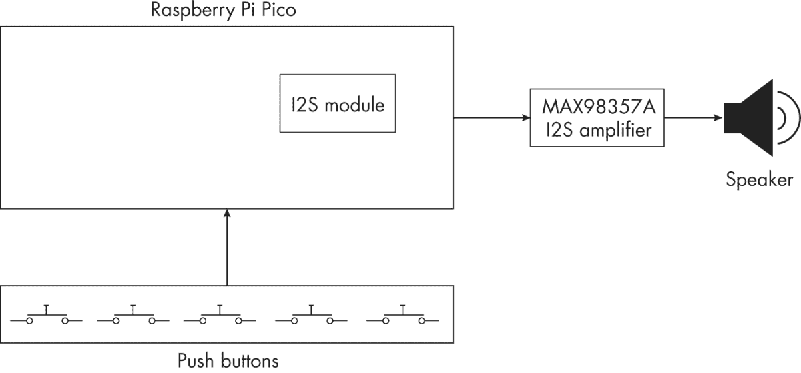
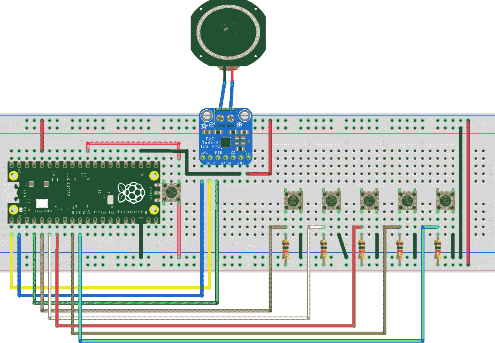

# 12

# Karplus-Strong 在 Raspberry Pi Pico 上的实现

在第四章中，你学习了如何使用 Karplus-Strong 算法生成拨弦声。你将生成的声音保存为 WAV 文件，并在计算机上播放五声音阶的音符。在本章中，你将学习如何将该项目缩小到适应一个微小的硬件平台：Raspberry Pi Pico。

Pico（见图 12-1）采用 RP2040 微控制器芯片构建，该芯片仅有 264KB 的随机存取内存（RAM）。与典型个人计算机的数十 GB 内存相比，这个内存显得微不足道！Pico 还配备了 2MB 的闪存，这与普通计算机的几百 GB 硬盘空间形成对比。尽管有这些限制，Pico 依然非常强大。它能够执行许多有用的服务，同时比普通计算机更便宜，功耗也更低。你的手表、空调、烘干机、汽车、手机——像 RP2040 这样的微型控制器无处不在！

图 12-1：Raspberry Pi Pico

本项目的目标是使用 Raspberry Pi Pico 创建一个带有五个按钮的音乐乐器。按下每个按钮将播放一个来自五声音阶的音符，这些音符由 Karplus-Strong 算法生成。你将在本项目中学习到的一些概念包括：

+   • 使用 MicroPython 编程微控制器，MicroPython 是专为像 Pico 这样的设备优化的 Python 实现

+   • 在面包板上使用 Pico 构建一个简单的音频电路

+   • 使用 I2S 数字音频协议和 I2S 放大器将音频数据发送到扬声器

+   • 在资源受限的微控制器上实现第四章中的 Karplus-Strong 算法

## 工作原理

我们在第四章中详细讨论了 Karplus-Strong 算法，因此这里不再赘述。相反，我们将重点讲解本版本项目的不同之处。你在第四章中编写的程序是为笔记本电脑或台式机设计的。得益于计算机充足的内存和硬盘资源，它在使用 Karplus-Strong 算法生成 WAV 文件并通过扬声器播放音频时没有问题。现在的挑战是将项目代码适配到资源受限的 Raspberry Pi Pico 上。这将需要以下修改：

+   • 使用较小的音频采样率以减少内存需求

+   • 使用简单的二进制文件存储原始生成的样本，而不是 WAV 文件

+   • 使用 I2S 协议将音频数据发送到外部音频放大器

+   • 使用内存管理技术，避免重复复制相同的数据

我们将在这些修改出现时讨论具体细节。

### 输入与输出

为了使项目具有交互性，你希望 Pico 能够根据用户输入生成声音。你需要将五个按钮连接到 Pico，因为 Pico 没有键盘或鼠标。（你将使用第六个按钮来运行程序。）我们还需要想办法生成声音输出，因为与个人计算机不同，Pico 板没有内置扬声器。图 12-2 显示了项目的框图。

图 12-2：项目的框图

当你按下按钮时，运行在 Pico 上的 MicroPython 代码将使用 Karplus-Strong 算法生成一个拨弦声音。算法产生的数字声音样本将发送到一个独立的 MAX98357A 放大器板，该板将数字数据解码为模拟音频信号。MAX98357A 还会放大模拟信号，这样你就可以将其输出连接到外部 8 欧姆扬声器，从而听到音频。图 12-3 显示了 Adafruit MAX98357A 板。

图 12-3：Adafruit MAX98357A I2S 放大器板

Pi Pico 需要以特定格式将数据发送到放大器板，以便它能够成功地被解读为音频信号。这就是 I2S 协议的作用。

### I2S 协议

*Inter-IC 音频 (I2S) 协议* 是一种在设备之间发送数字音频数据的标准。它是从微控制器获取高质量音频输出的一种简单、便捷的方式。该协议通过三种数字信号传输音频，这些信号如图 12-4 所示。

图 12-4：I2S 协议

第一个信号，SCK，是*时钟*信号，一个在固定速度下高低交替的信号。这个信号设置了数据传输的速率。接下来，WS 是*字选择*信号。它稳定地在高低之间交替，表示此时正在传输的是哪个音频通道——左通道还是右通道。最后，SD 是*串行数据*信号，承载实际的音频信息，以 N 位二进制值表示声音的幅度。

为了理解这个过程，我们来看一个例子。假设你想以 16,000 Hz 的采样率发送立体声音频，并且你希望每个声音样本的振幅为 16 位值。WS 的频率应该与采样率相同，因为那是你发送每个振幅值的速率。这样，WS 信号将每秒高低交替 16,000 次；当它为高电平时，SD 会发送一个音频通道的振幅值，而当它为低电平时，SD 会发送另一个音频通道的振幅值。由于每个通道的振幅值由 16 位组成，SD 必须以比采样率快 16 × 2 = 32 倍的速率进行传输。时钟控制传输速率，因此 SCK 的频率必须是 16,000 Hz × 32 = 512,000 Hz。

对于这个项目，Pico 将充当 I2S 发送器，因此它将生成 SCK、WS 和 SD 信号。MicroPython 实际上为 Pico 提供了一个完全实现的 `I2S` 模块，因此生成信号的大部分工作将在后台为你完成。如你所见，Pico 将把信号发送到 MAX98357A 板，该板专门设计用于通过 I2S 协议接收音频数据。然后，板子将 I2S 数据转换为模拟音频信号，能够通过扬声器播放。

## 需求

你将使用 MicroPython 为 Raspberry Pi Pico 编写程序。你将需要以下硬件：

+   • 一块基于 RP2040 芯片的 Raspberry Pi Pico 板

+   • 一块 Adafruit MAX98357A I2S 扩展板

+   • 一个 8 欧姆扬声器

+   • 六个按钮

+   • 五个 10 kΩ 电阻

+   • 一块面包板

+   • 一组连接线

+   • 一根 Micro USB 数据线，用于将代码上传到 Pico

### 硬件设置

你将在面包板上组装硬件。图 12-5 显示了连接方式。

图 12-5：硬件连接

图 12-6 显示了 Pico 的引脚图，来自官方数据手册，是你进行连接时的实用参考。

图 12-6：来自 Raspberry Pi Pico 数据手册的引脚图

表 12-1 总结了你需要在面包板上实现的电气连接。图 12-5 显示了这些连接。

表 12-1：电气连接

| Pico 引脚 | 连接 |
| --- | --- |
| GP3 | 按钮 1（另一引脚通过 10 kΩ 电阻连接至 VDD） |
| GP4 | 按钮 2（另一引脚通过 10 kΩ 电阻连接至 VDD） |
| GP5 | 按钮 3（另一引脚通过 10 kΩ 电阻连接至 VDD） |
| GP6 | 按钮 4（另一引脚通过 10 kΩ 电阻连接至 VDD） |
| GP7 | 按钮 5（另一引脚通过 10 kΩ 电阻连接至 VDD） |
| RUN | 按钮 6（另一引脚连接至 GND） |
| GP0 | MAX98357A BCLK |
| GP1 | MAX98357A LRC |
| GP2 | MAX98357A DIN |
| GND | MAX98357A GND |
| 3V3(OUT) | MAX98357A Vin |

一旦你连接好硬件，你的项目应该看起来像图 12-7。

图 12-7：完全搭建好的硬件

然而，在开始使用 Pico 之前，你需要设置 MicroPython。

### MicroPython 设置

使用 MicroPython 设置你的树莓派 Pico 非常简单。请按照以下步骤操作：

1.  1\. 访问[`micropython.org`](https://micropython.org)，进入下载页面，并找到树莓派 Pico。

1.  2\. 下载包含 Pico 版本的 MicroPython 实现的 UF2 二进制文件（版本 1.18 或更高）。

1.  3\. 按下 Pico 上的白色 BOOTSEL 按钮，同时按住这个按钮，用 Micro USB 数据线将 Pico 连接到计算机上。然后松开按钮。

1.  4\. 你应该能看到一个名为*RPI-RP2*的文件夹出现在计算机上。将 UF2 文件拖放到该文件夹中。

文件复制完成并且 Pico 重启后，你就可以开始使用 MicroPython 编写 Pico 代码了！

## 代码

代码包括一些初步的设置，接着是用于生成和播放五个音符的函数。然后，所有内容在程序的`main()`函数中组合起来。要查看完整的程序，可以跳到《完整代码》第 275 页。代码也可以在 GitHub 上找到，地址是[`github.com/mkvenkit/pp2e/blob/main/karplus_pico/karplus_pico.py`](https://github.com/mkvenkit/pp2e/blob/main/karplus_pico/karplus_pico.py)。

### 设置

代码从一些基本的设置开始。首先，导入所需的 MicroPython 模块：

import time

import array

import random

import os

from machine import I2S

from machine import Pin

你导入`time`模块来使用其“sleep”功能，以便在代码执行过程中创建定时暂停。`array`模块将允许你创建数组，通过 I2S 发送声音数据。数组是比 Python 列表更高效的版本，因为它要求所有成员必须是相同的数据类型。你将使用`random`模块用随机值填充初始缓冲区（Karplus-Strong 算法的第一步），并且你将使用`os`模块检查某个音符是否已经保存在文件系统中。最后，`I2S`模块将允许你发送声音数据，而`Pin`模块让你设置 Pico 的引脚输出。

通过声明一些有用的信息来完成设置：

# 小调五声音阶的音符

# 钢琴音符 C4-E(b)-F-G-B(b)-C5

❶ pmNotes = {'C4': 262, 'Eb': 311, 'F': 349, 'G':391, 'Bb':466}

# 按钮到音符的映射

❷ btnNotes = {0: ('C4', 262), 1: ('Eb', 311), 2: ('F', 349), 3: ('G', 391),

4: ('Bb', 466)}

# 采样率

❸ SR = 16000

在这里，你定义了一个字典`pmNotes`，它将音符的名称映射到其整数频率值❶。你将使用音符的名称来保存包含声音数据的文件，并使用频率值通过 Karplus-Strong 算法生成声音。你还定义了一个字典`btnNotes`，它将每个按钮的 ID（表示为整数 0 到 4）映射到一个元组，该元组包含相应的音符名称和频率值❷。这个字典控制当用户按下每个按钮时播放哪个音符。

最后，你将采样率定义为 16,000 Hz❸。这是每秒发送的声音幅度值数，使用 I2S 发送。请注意，这比在第四章中使用的 44,100 Hz 采样率要低得多。这是因为 Pico 的内存有限，相较于标准计算机来说有所差异。

### 生成音符

你借助两个函数`generate_note()`和`create_notes()`生成五个五声音阶的音符。`generate_note()`函数使用 Karplus-Strong 算法计算单个音符的幅度值，而`create_notes()`则协调生成所有五个音符并将它们的样本数据保存到 Pico 的文件系统中。我们先来看看`generate_note()`函数。（你在第四章中实现了一个类似的函数，所以现在复习一下原始实现可能是个不错的选择。）

# 生成给定频率的音符

def generate_note(freq):

nSamples = SR

N = int(SR/freq)

# 初始化环形缓冲区

❶ buf = [2*random.random() - 1 for i in range(N)]

# 初始化样本缓冲区

❷ samples = array.array('h', [0]*nSamples)

for i in range(nSamples):

❸ samples[i] = int(buf[0] * (2 ** 15 - 1))

❹ avg = 0.4975*(buf[0] + buf[1])

buf.append(avg)

buf.pop(0)

❺ 返回样本

该函数首先将`nSamples`设置为`SR`，即样本缓冲区的长度，它将保存最终的音频数据。由于`SR`是每秒的样本数，这意味着你将创建一个持续一秒钟的音频片段。然后，通过将采样率除以生成音符的频率，你计算出 Karplus-Strong 环形缓冲区中的样本数`N`。

接下来，你初始化缓冲区。首先，你创建一个带有随机初始值的环形缓冲区 ❶。`random.random()`方法返回[0.0, 1.0]范围内的值，所以`2*random.random() - 1`将这些值缩放到范围[−1.0, 1.0]。记住，算法需要正负幅度值。请注意，你实现的是一个常规的 Python 列表作为环形缓冲区，而不是像在第四章中那样使用`deque`对象。MicroPython 的`deque`实现有一些限制，无法提供你所需的环形缓冲区功能。因此，你将使用常规的`append()`和`pop()`列表方法来添加和移除缓冲区中的元素。你还创建了一个`array`对象作为采样缓冲区，长度为`nSamples`，并用零填充 ❷。`'h'`参数指定该数组中的每个元素是一个*有符号短整型*，即一个 16 位的值，可以是正数或负数。由于每个采样值将由 16 位值表示，因此这正是你所需要的。

接下来，你遍历`samples`数组中的元素，并使用 Karplus-Strong 算法构建音频片段。你从环形缓冲区获取第一个采样值，并将其从范围[−1.0, 1.0]缩放到范围[−32767, 32767] ❸。（16 位有符号短整型的范围是[−32767, 32768]。你将幅度值缩放到尽可能高，这样可以获得最大的音量输出。）然后你计算环形缓冲区中前两个采样值的衰减平均值 ❹。（这里，`0.4975`等同于原始实现中的`0.995*0.5`。）你使用`append()`将新的幅度值添加到环形缓冲区的末尾，同时使用`pop()`移除第一个元素，从而保持缓冲区的固定大小。在循环结束时，采样缓冲区已满，所以你返回它进行进一步处理 ❺。

注意 使用`append()`和`pop()`更新环形缓冲区是可行的，但这并不是一种高效的计算方法。我们将在“实验！”中更深入地探讨优化问题，具体内容请见第 273 页。

现在让我们来看看`create_notes()`函数：

def create_notes():

"创建五声音符并保存到闪存中的文件"

❶ files = os.listdir()

❷ for (k, v) in pmNotes.items():

# 设置音符文件名

❸ file_name = k + ".bin"

# 检查文件是否已存在

❹ if file_name in files:

print("找到 " + file_name + "。跳过...")

继续

# 生成音符

print("正在生成音符 " + k + "...")

❺ samples = generate_note(v)

# 写入文件

print("正在写入 " + file_name + "...")

❻ file_samples = open(file_name, "wb")

❼ file_samples.write(samples)

❽ file_samples.close()

你不希望每次用户按下按钮播放音符时都需要运行 Karplus-Strong 算法，因为那样太慢了。相反，这个函数会在代码第一次运行时创建音符，并将它们以 *.bin* 文件的形式存储在 Pico 的文件系统中。之后，每当用户按下按钮时，你就能读取相应的文件并通过 I2S 输出声音数据。

你首先使用 `os` 模块列出 Pico 上的文件 ❶。（Pico 上没有“硬盘”，而是使用 Pico 板上的闪存芯片来存储数据，MicroPython 提供了一种像访问常规文件系统那样访问这些数据的方法。）然后你遍历 `pmNotes` 字典中的条目，该字典将音符名称映射到频率 ❷。对于每个音符，你根据字典中的名称生成文件名（例如，*C4.bin*） ❸。如果该目录下存在该文件 ❹，说明该音符已经生成过了，你可以跳到下一个音符。否则，你通过 `generate_note()` 函数生成该音符的声音样本 ❺。接着，你创建一个适当的二进制文件 ❻ 并将样本写入其中 ❼。最后，你通过关闭文件来清理 ❽。

第一次运行代码时，`create_notes()` 会运行 `generate_note()` 函数，利用 Karplus-Strong 算法为每个音符创建一个文件。这将会在 Pico 上创建 *C4.bin*、*Eb.bin*、*F.bin*、*G.bin* 和 *Bb.bin* 文件。在后续的运行中，该函数会发现这些文件已经存在，因此不需要再创建它们。

### 播放音符

`play_note()` 函数通过使用 I2S 协议输出样本来播放五声音阶中的一个音符。下面是该函数的定义：

def play_note(note, audio_out):

"从文件读取音符并通过 I2S 发送"

❶ fname = note[0] + ".bin"

print("正在打开 " + fname)

# 打开文件

try:

print("正在打开 {}...".format(fname))

❷ file_samples = open(fname, "rb")

except:

print("打开文件时出错：{}！".format(fname))

return

# 分配样本数组

❸ samples = bytearray(1000)

# 使用 memoryview 来减少堆内存分配

❹ samples_mv = memoryview(samples)

# 读取样本并发送到 I2S

try:

❺ while True:

❻ num_read = file_samples.readinto(samples_mv)

# 文件结束？

❼ 如果 num_read == 0:

break

else:

# 通过 I2S 发送样本

❽ num_written = audio_out.write(samples_mv[:num_read])

❾ except (Exception) as e:

print("异常：{}".format(e))

# 关闭文件

❿ file_samples.close()

该函数有两个参数：`note`，一个元组，形式为 `('C4', 262)`，表示音符名称和频率，以及 `audio_out`，它是 `I2S` 模块的实例，用于声音输出。你首先根据要播放的音符名称创建适当的 *.bin* 文件名 ❶。然后你打开该文件 ❷。此时你期望文件已经存在，所以如果打开失败，你就直接从函数中返回。

该函数的其余部分通过 I2S 输出音频数据，按每批 1,000 个样本处理。为了调节数据传输，你创建了一个包含 1,000 个样本的 MicroPython `bytearray` ❸ 和一个样本的 `memoryview` ❹。这是一个 MicroPython 的优化技巧，可以防止在将数组片段传递给其他函数（如 `file_samples.readinto()` 和 `audio_out.write()`）时，整个数组被复制。

注意：数组的 *切片* 表示数组中的一段值。例如，`a[100:200]` 是一个切片，表示数组 `a[100]` 到 `a[199]` 的值。

接下来，你启动一个 `while` 循环，从文件中读取样本 ❺。在循环中，你使用 `readinto()` 方法将文件中的一批样本读取到 `memoryview` 对象中 ❻，该方法返回读取的样本数量（`num_read`）。你通过 I2S 使用 `audio_out.write()` 方法从 `memoryview` 对象输出样本 ❽。`[:num_read]` 切片符号确保你写出的样本数与读取的样本数相同。你在 ❾ 处处理任何异常。当读取到 `memoryview` 对象中零个样本时 ❼，就完成数据输出，这时可以跳出 `while` 循环并关闭 *.bin* 文件 ❿。

### 编写 main() 函数

现在让我们来看一下 `main()` 函数，它将所有代码组合在一起：

def main():

# 设置 LED

❶ led = Pin(25, Pin.OUT)

# 打开 LED

led.toggle()

# 创建音符并保存在闪存中

❷ create_notes()

# 创建 I2S 对象

❸ audio_out = I2S(

0,                  # I2S ID

sck=Pin(0),         # SCK 引脚

ws=Pin(1),          # WS 引脚

sd=Pin(2),          # SD 引脚

mode=I2S.TX,        # I2S 发射器

bits=16,            # 每个样本 16 位

format=I2S.MONO,    # 单声道 - 单个通道

rate=SR,            # 采样率

ibuf=2000,          # I2S 缓冲区长度

)

# 设置按钮

❹ btns = [Pin(3, Pin.IN, Pin.PULL_UP),

Pin(4, Pin.IN, Pin.PULL_UP),

Pin(5, Pin.IN, Pin.PULL_UP),

Pin(6, Pin.IN, Pin.PULL_UP),

Pin(7, Pin.IN, Pin.PULL_UP)]

# “准备好”标志

❺ play_note(('C4', 262), audio_out)

print("钢琴准备好了！")

# 关闭 LED

❻ led.toggle()

while True:

for i in range(5):

if btns[i].value() == 0:

❼ play_note(btnNotes[i], audio_out)

break

❽ time.sleep(0.2)

函数的开始是设置 Pico 上的板载 LED ❶。它在开始时切换为 ON，以表示 Pico 正在忙于初始化。接下来，您调用 `create_notes()` 函数 ❷。正如我们讨论的，这个函数仅在文件系统中不存在时，才会为音符创建 *.bin* 文件。为了管理音频输出，您实例化 `I2S` 模块为 `audio_out` ❸。该模块需要多个输入参数。第一个参数是 I2S ID，对于 Raspberry Pi Pico，ID 为 `0`。接下来是与时钟（SCK）、字选择（WS）和数据（SD）信号对应的引脚号。我们在“I2S 协议” 第 262 页中讨论过这些信号。然后，您将 I2S 模式设置为 `TX`，表示这是一个 I2S 发送器。接下来，将 `bits` 设置为 `16`，表示每个样本的位数，并将 `format` 设置为 `MONO`，因为只有一个音频输出通道。您将采样率设置为 `SR`，最后，设置内部 I2S 缓冲区 `ibuf` 的值为 `2000`。

注意：流畅的音频体验需要连续不断的数据输出。MicroPython 使用 Pico 中的一个特殊硬件模块，称为直接内存访问（DMA）。DMA 可以在不直接涉及 CPU 的情况下，将数据从内存传输到 I2S 输出。CPU 只需要保持内部缓冲区（代码中的`ibuf`）填充数据，同时 DMA 执行任务时，CPU 可以自由执行其他操作。内部缓冲区的大小通常设置为音频输出的两倍，确保 DMA 不会因数据不足而导致音频失真。在这种情况下，您将每次传输 1,000 字节到 I2S，因此将 `ibuf` 设置为两倍大小。

接下来，您需要设置按钮，使得在按钮按下时会播放音符。为此，您创建一个名为 `btns` ❹ 的 `Pin` 对象列表。对于列表中的每个按钮，您需要指定引脚号、引脚的数据方向（在本例中为 `Pin.IN`，即输入），以及该引脚是否有上拉电阻。在本例中，所有的按键引脚上都有一个 10 kΩ 的上拉电阻。这意味着默认情况下，引脚的电压会被“拉高”至 VDD，即 3.3 V，而当按钮被按下时，电压会下降至 GND，即 0 V。您将利用这一点来检测按钮的按下。

设置完成后，使用 `play_note()` 函数播放 C4 音符，以表明 Pico 已准备好接受按键输入 ❺，同时将板载 LED 切换为 OFF ❻。接着，启动一个 `while` 循环来监控按键按下情况。在这个循环中，你使用 `for` 循环检查五个按钮中是否有任何一个的值为 `0`，表示按钮被按下。如果是，你会在 `btnNotes` 字典中查找对应按钮的音符，并使用 `play_note()` 播放该音符 ❼。当音符播放完成后，跳出 `for` 循环，并等待 0.2 秒 ❽ 后继续执行外部的 `while` 循环。

## 运行 Pico 代码

现在，你已经准备好测试你的项目了！为了在 Pico 上运行代码，安装两个软件是很有用的。第一个是 Thonny，一个开源、易于使用的 Python 集成开发环境（IDE），你可以从 [`thonny.org`](https://thonny.org) 下载。Thonny 让你轻松将项目代码复制到 Raspberry Pi Pico，并管理 Pico 上的文件。一个典型的开发周期如下：

1.  1\. 通过 USB 将你的 Pico 连接到电脑。

1.  2\. 打开 Thonny。点击窗口右下角的 Python 版本号，将解释器更改为 **MicroPython (Raspberry Pi Pico)**。

1.  3\. 将你的代码复制到 Thonny 中，点击红色的 **停止/重启** 按钮，停止代码在 Pico 上运行。这时，Python 解释器会显示在 IDE 的底部。

1.  4\. 在 Thonny 中编辑你的代码。

1.  5\. 当你准备保存文件时，选择 **文件‣另存为**，系统会提示你在 Raspberry Pi Pico 上保存文件。接下来的对话框也会列出 Pico 上的文件。将你的代码保存为 *main.py*。你还可以使用这个对话框右键点击并删除 Pico 上现有的文件。

1.  6\. 保存文件后，按下连接到 Pico 上 RUN 引脚的额外按键，代码将开始运行。

1.  7\. 每当你想编辑代码时，点击 IDE 中的 **停止/重启** 按钮，Thonny 会将你带到 Pico 上的 Python 解释器。

另一个在使用 Pico 时非常有用的软件是 CoolTerm，你可以从 [`freeware.the-meiers.org`](http://freeware.the-meiers.org) 下载。CoolTerm 让你监控 Pico 的串口输出。程序中的所有打印语句都会显示在这里。使用 CoolTerm 时，确保 Thonny 不是处于“停止”状态。Pico 代码应该是运行状态，因为 Pico 无法同时连接到 Thonny 和 CoolTerm。

一旦代码运行起来，按下一个个按键，你会听到从扬声器传出的美妙五声音阶。图 12-8 显示了典型会话的串口输出。

图 12-8：CoolTerm 中的 Raspberry Pi Pico 输出示例

看看你能用数字乐器的五个按钮编排并演奏出什么旋律！

## 总结

在本章中，你将你的 Karplus-Strong 算法实现从第四章中调整，使其能够在一个小型微控制器上运行，并利用 Raspberry Pi Pico 构建了一个数字乐器。你学会了如何在 Pico 上运行 Python（以 MicroPython 形式），以及如何使用 I2S 协议传输音频数据。你还了解了从个人计算机到资源受限设备（如 Pico）的代码迁移限制。

## 实验!

1.  1\. MAX98357A I2S 板可以让你增加输出的音量（增益）。查看该板的 datasheet 并尝试提高从扬声器发出的声音。

1.  2\. 当前的 `generate_note()` 实现速度不快。对于这个项目来说这并不重要，因为你只生成一次音符。但你能让这个方法更快吗？这里有一些策略可以尝试：

    1.  a. 不要在 `buf` 列表上使用 `append()` 和 `pop()` 操作，而是通过跟踪当前列表位置并使用取模操作 `%N` 来将列表转换为循环缓冲区。

    1.  b. 使用整数运算代替浮点运算。你需要考虑如何生成和缩放初始的随机值。

    MicroPython 文档中的语言参考页面 ([`docs.micropython.org`](https://docs.micropython.org/)) 上有一篇关于最大化代码速度的文章。文档还建议了如何测试你的结果。首先，定义一个用于计时的函数：

    def timed_function(f, *args, **kwargs):

    myname = str(f).split(' ')[1]

    def new_func(*args, **kwargs):

    t = time.monotonic()

    result = f(*args, **kwargs)

    delta = time.monotonic() - t

    print('函数 {} 时间 = {:f} 秒'.format(myname, delta))

    return result

    return new_func

    然后使用 `timed_function()` 作为你想要计时的函数的 *装饰器*：

    # 生成给定频率的音符

    @timed_function

    def generateNote(freq):

    nSamples = SR

    N = int(SR/freq)

    --`snip`--

    当你在主代码中调用 `generateNote()` 时，你会在串行输出中看到类似下面的内容：

    函数 generateNote 时间 = 1019.711ms

1.  3\. 当你按下硬件按钮时，它不会只是从开到关，或反之。按钮内的弹簧接触点会在极短的时间内在开和关之间反复弹跳，这会触发多个软件事件，仅仅是一次物理按压。想一想这会如何影响你的项目，然后学习关于 *去抖动* 的技巧，这是一类用于缓解此问题的技术。你可以采取哪些步骤来去抖动你的按钮？

1.  4\. 当你按下按钮时，新的音符不会在当前音符播放完之前开始播放。如何在按下新按钮时立即停止当前音符并切换到播放新音符？

## 完整代码

这是此项目的完整代码列表。

"""

karplus_pico.py

使用 Karplus-Strong 算法生成音乐音符

五声音阶。运行在树莓派 Pico 上。（MicroPython）

作者：Mahesh Venkitachalam

"""

import time

import array

import random

import os

from machine import I2S

from machine import Pin

# 小调五声音阶的音符

# 钢琴 C4-E(b)-F-G-B(b)-C5

pmNotes = {'C4': 262, 'Eb': 311, 'F': 349, 'G':391, 'Bb':466}

# 按钮到音符的映射

btnNotes = {0: ('C4', 262), 1: ('Eb', 311), 2: ('F', 349), 3: ('G', 391),

4: ('Bb', 466)}

# sample rate

SR = 16000

def timed_function(f, *args, **kwargs):

myname = str(f).split(' ')[1]

def new_func(*args, **kwargs):

t = time.ticks_us()

result = f(*args, **kwargs)

delta = time.ticks_diff(time.ticks_us(), t)

print('函数 {} 时间 = {:6.3f}ms'.format(myname, delta/1000))

return result

return new_func

# 生成给定频率的音符

# （当你需要计时函数时，取消注释下面的行。）

# @timed_function

def generate_note(freq):

nSamples = SR

N = int(SR/freq)

# 初始化环形缓冲区

buf = [2*random.random() - 1 for i in range(N)]

# 初始化样本缓冲区

samples = array.array('h', [0]*nSamples)

for i in range(nSamples):

samples[i] = int(buf[0] * (2 ** 15 - 1))

avg = 0.4975*(buf[0] + buf[1])

buf.append(avg)

buf.pop(0)

return samples

# 生成给定频率音符 - 改进方法

def generate_note2(freq):

nSamples = SR

sampleRate = SR

N = int(sampleRate/freq)

# 初始化环形缓冲区

buf = [2*random.random() - 1 for i in range(N)]

# 初始化样本缓冲区

samples = array.array('h', [0]*nSamples)

start = 0

for i in range(nSamples):

samples[i] = int(buf[start] * (2**15 - 1))

avg = 0.4975*(buf[start] + buf[(start + 1) % N])

buf[(start + N) % N] = avg

start = (start + 1) % N

return samples

def play_note(note, audio_out):

"从文件读取音符并通过 I2S 发送"

fname = note[0] + ".bin"

# 打开文件

try:

print("正在打开 {}...".format(fname))

file_samples = open(fname, "rb")

except:

print("打开文件出错：{}!".format(fname))

return

# 分配样本数组

samples = bytearray(1000)

# 使用 memoryview 来减少堆分配

samples_mv = memoryview(samples)

# 读取样本并发送到 I2S

try:

while True:

num_read = file_samples.readinto(samples_mv)

# 文件结束？

if num_read == 0:

break

else:

# 通过 I2S 发送样本

num_written = audio_out.write(samples_mv[:num_read])

except (Exception) as e:

print("异常：{}".format(e))

# 关闭文件

file_samples.close()

def create_notes():

"创建五声音阶音符并将其保存到闪存文件中"

files = os.listdir()

for (k, v) in pmNotes.items():

# 设置音符文件名

file_name = k + ".bin"

# 检查文件是否已经存在

if file_name in files:

print("找到 " + file_name + "。跳过...")

continue

# 生成音符

print("生成音符 " + k + "...")

samples = generate_note(v)

# 写入文件

print("写入 " + file_name + "...")

file_samples = open(file_name, "wb")

file_samples.write(samples)

file_samples.close()

def main():

# 设置 LED

led = Pin(25, Pin.OUT)

# 打开 LED

led.toggle()

# 创建音符并保存在闪存中

create_notes()

# 创建 I2S 对象

audio_out = I2S(

0,                  # I2S ID

sck=Pin(0),         # SCK 引脚

ws=Pin(1),          # WS 引脚

sd=Pin(2),          # SD 引脚

mode=I2S.TX,        # I2S 发送器

bits=16,            # 每个采样 16 位

format=I2S.MONO,    # 单声道 - 单通道

rate=SR,            # 采样率

ibuf=2000,          # I2S 缓冲区长度

)

# 设置按钮

btns = [Pin(3, Pin.IN, Pin.PULL_UP),

Pin(4, Pin.IN, Pin.PULL_UP),

Pin(5, Pin.IN, Pin.PULL_UP),

Pin(6, Pin.IN, Pin.PULL_UP),

Pin(7, Pin.IN, Pin.PULL_UP)]

# "准备好" 音符

play_note(('C4', 262), audio_out)

print("钢琴准备好！")

# 关闭 LED

led.toggle()

while True:

for i in range(5):

if btns[i].value() == 0:

play_note(btnNotes[i], audio_out)

休息

time.sleep(0.2)

# call main

if __name__ == '__main__':

main()
